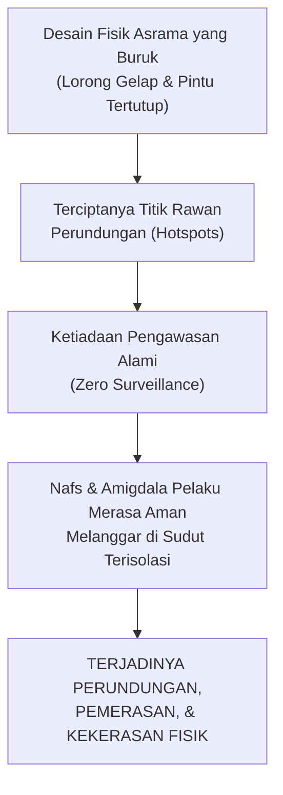
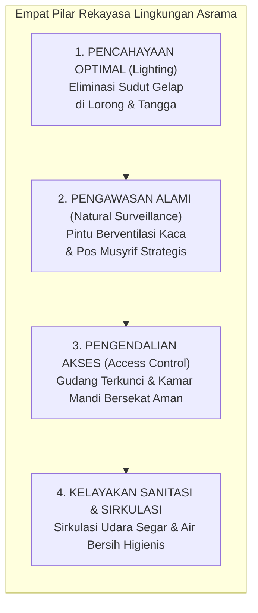
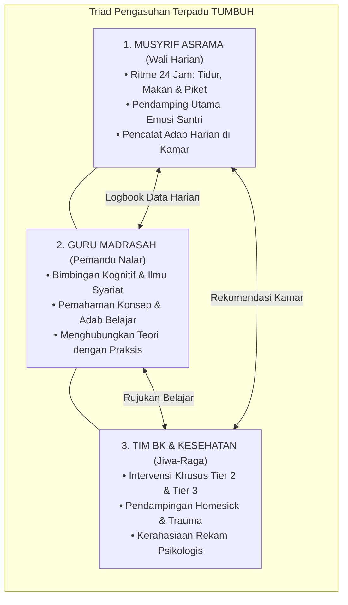

# BAB 11: REKAYASA LINGKUNGAN ASRAMA DAN EKOSISTEM TERPADU 24 JAM
## Environmental Engineering, Mitigasi Hotspots Perundungan, dan Sinergi Triad Pengasuhan

> كُلُّكُمْ رَاعٍ، وَكُلُّكُمْ مَسْئُولٌ عَنْ رَعِيَّتِهِ: الْإِمَامُ رَاعٍ وَمَسْئُولٌ عَنْ رَعِيَّتِهِ، وَالرَّجُلُ رَاعٍ فِي أَهْلِهِ وَهُوَ مَسْئُولٌ عَنْ رَعِيَّتِهِ، وَالْمَرْأَةُ رَاعِيَةٌ فِي بَيْتِ زَوْجِهَا وَمَسْئُولَةٌ عَنْ رَعِيَّتِهَا...
>
> *"Setiap kalian adalah pemimpin (penggembala/penanggung jawab), dan setiap kalian akan dimintai pertanggungjawaban atas apa yang dipimpinnya: Seorang imam adalah pemimpin dan bertanggung jawab atas rakyatnya; seorang laki-laki adalah pemimpin dalam keluarganya dan bertanggung jawab atas apa yang dipimpinnya; dan seorang wanita adalah pemimpin di rumah suaminya dan bertanggung jawab atas apa yang dipimpinnya..."*  
> — **Rasulullah ﷺ**, riwayat Abdullah bin Umar رضي الله عنهما[^1]

---

### 11.1 Arsitektur Ruang Menentukan Perilaku: Mengapa Niat Baik Saja Tidak Cukup?

Di banyak pondok pesantren, ketika terjadi insiden perundungan fisik antar-santri di malam hari, pimpinan pondok kerap mengumpulkan seluruh santri di masjid lalu memberikan ceramah panjang tentang bahaya permusuhan dan ancaman dosa neraka. Namun sebulan kemudian, di tempat yang sama, insiden kekerasan serupa terulang kembali.

Mengapa nasihat agama yang luhur kerap kali tumpul di hadapan realitas asrama?

Jawabannya diungkapkan oleh para pakar sosiologi tata ruang dan kriminologi lingkungan melalui teori **Pencegahan Kejahatan Melalui Desain Lingkungan (*Crime Prevention Through Environmental Design / CPTED*)**[^2]. Dalam khazanah Islam, menyingkirkan potensi bahaya dari lingkungan fisik adalah bagian integral dari keimanan dan tanggung jawab syar'i (*imathatul adza 'anith thariq*)[^3].

> **“Perilaku manusia tidak semata-mata dibentuk oleh doktrin moral di kepalanya, melainkan sangat ditentukan oleh bagaimana lingkungan fisik di sekitarnya dirancang dan ditata.”**

Jika sebuah pesantren memiliki lorong jemuran pakaian yang gelap gulita di lantai tiga, kamar mandi belakang yang terisolasi dari lalu-lalang asatidz, gudang kasur bekas yang tidak pernah dikunci, dan kamar-kamar santri senior yang tertutup rapat dengan tirai gelap, maka **arsitektur fisik pesantren tersebut sesungguhnya sedang mengundang terjadinya kejahatan!**

Ketika seorang santri senior yang sedang dirasuki hawa nafsu amarah melihat ada sudut asrama yang gelap, sepi, dan mustahil terlihat oleh musyrif, ketiadaan pengawasan fisik tersebut seketika menurunkan hambatan psikologisnya (*low perceived risk of detection*). Ia merasa aman untuk melampiaskan kekerasannya kepada adik kelasnya.

Sebaliknya, jika tata ruang fisik asrama dirancang dengan prinsip **Pengawasan Alami Terbuka (*Natural Surveillance & Open Visibility*)**—seluruh lorong memiliki pencahayaan terang benderang, pintu kamar memiliki ventilasi kisi-kisi kaca bening yang memungkinkan pandangan pengawas menembus ke dalam, dan tidak ada satu pun sudut mati yang terisolasi—maka niat jahat akan padam sebelum sempat dieksekusi, karena pelaku menyadari bahwa setiap gerak-geriknya berada di bawah tatapan pengawasan umum.

---

### 11.2 Rekayasa Tata Ruang Asrama (*Environmental Engineering*) dan Mitigasi Hotspots

Ekosistem TUMBUH mewajibkan setiap pesantren melakukan audit tata ruang fisik dan menetapkan protokol **Rekayasa Lingkungan Asrama (*Environmental Engineering*)** untuk melenyapkan titik-titik rawan perundungan (*Hotspots Mitigation*):

Mari kita jabarkan standar operasional rekayasa lingkungan ini ke dalam praksis harian pondok:

#### 1. Audit dan Eliminasi Titik Rawan (Hotspots Patrol)
* **Kamar Mandi dan Tempat Wudhu**:  
  Kamar mandi asrama adalah lokasi paling rawan terjadinya perundungan dan pelecehan karena sifatnya yang privat. Standar TUMBUH menetapkan: bilik mandi tertutup setinggi dada hingga lutut untuk menjaga aurat biologis, namun bagian atas dan bawah bilik tetap memiliki sirkulasi terbuka agar suara kegaduhan di dalam bilik dapat segera terdengar oleh musyrif yang berjaga di luar. Tempat wudhu dirancang terbuka dengan aliran air yang deras dan pencahayaan terang.
* **Area Jemuran dan Tangga Belakang**:  
  Area penjemuran pakaian di atap gedung yang kerap menjadi arena perpeloncoan malam wajib dipasangi lampu penerangan berkekuatan tinggi yang menyala otomatis sejak maghrib hingga subuh. Pintu akses menuju area jemuran dan atap wajib dikunci oleh musyrif tepat pada pukul 21.00 malam.
* **Kamar Santri Senior yang Eksklusif**:  
  Dilarang keras membiarkan kamar santri senior menjadi "benteng kekuasaan tertutup". Pintu kamar asrama tidak boleh dipasangi gorden gelap pekat yang menghalangi pandangan dari luar. Musyrif memiliki hak akses inspeksi berkala setiap saat.

#### 2. Kualitas Udara, Sanitasi, dan Regulasi Saraf Biologis
Banyak pengurus pesantren tidak menyadari bahwa **kamar asrama yang pengap, panas, dan berbau pesing secara langsung memicu agresi dan perkelahian santri**.

Penelitian neurobiologi membuktikan bahwa ruangan yang kekurangan oksigen (*hypoxia*) dan mengalami penumpukan karbon dioksida ($CO_2$) akibat sirkulasi udara yang buruk memicu peningkatan hormon stres kortisol dan menyebabkan iritabilitas saraf otak (*neuronal hyper-excitability*). Santri yang tidur di kamar pengap akan terbangun dengan kepala pusing, emosi yang mudah tersulut, dan daya kendali diri yang rapuh.

TUMBUH menetapkan standar higienitas fisik:
* Setiap kamar wajib memiliki sirkulasi udara silang (*cross-ventilation*) yang menjamin pasokan oksigen segar sepanjang malam.
* Rasio penghuni kamar harus proporsional dengan volume ruangan (minimal 3 meter persegi per santri) demi menjaga privasi dan ketenangan psikologis.
* Diberlakukan jadwal audit kebersihan sanitasi mingguan yang ketat: kamar yang bersih dan wangi diapresiasi sebagai manifestasi kesucian iman (*Ath-Thuhuru syathrul iman*).

---

### 11.3 Harmonisasi Irama Kehidupan: Menyelaraskan Jadwal dengan Jam Sirkadian Biologis

Salah satu penyebab utama kegagalan pembinaan di pesantren modern adalah **Jadwal Maraton Tanpa Jeda (*The Exhaustion-Driven Schedule*)**:
* Pukul 03.30 bangun tahajud $\rightarrow$ subuh $\rightarrow$ mengaji Al-Qur'an $\rightarrow$ sarapan tergesa $\rightarrow$ masuk kelas madrasah hingga ashar $\rightarrow$ mengaji kitab sore $\rightarrow$ maghrib $\rightarrow$ makan malam $\rightarrow$ muthala'ah hingga pukul 22.30 $\rightarrow$ tugas kamar hingga pukul 23.30.

Jadwal padat semacam ini kerap dibanggakan oleh pihak yayasan kepada wali santri sebagai bukti "kesungguhan pembinaan". 

Namun mari kita lihat apa yang sesungguhnya terjadi pada tubuh dan otak santri: **Santri hidup dalam keadaan kelelahan saraf kronis (*Chronic Neurocognitive Exhaustion*)**. Otak mereka kelebihan beban (*cognitive overload*), tidak memiliki ruang jeda untuk mengendapkan hafalan, dan amigdala mereka berada dalam kondisi siaga darurat (*burnout*).

TUMBUH merekayasa **Irama Kehidupan Asrama 24 Jam (*The 24-Hour Circadian Rhythm Architecture*)** yang menyelaraskan tuntutan ibadah syariat dengan sunnatullah biologis tubuh manusia:

```mermaid
gantt
    title Irama Kehidupan Seimbang Asrama TUMBUH (24 Jam)
    dateFormat  HH:mm
    axisFormat  %H:%M
    
    section Istirahat & Ibadah Malam
    Tidur Malam Nyenyak (Wajib 7 Jam) :active, 21:30, 04:00
    Bangun Fajar, Mandi & Subuh Berjamaah : 04:00, 05:15
    
    section Halaqah Pagi & Nutrisi
    Halaqah Al-Qur'an & Zikir Pagi : 05:15, 06:15
    Sarapan Gizi Seimbang & Persiapan Madrasah : 06:15, 07:15
    
    section Pembelajaran Madrasah
    Kelas Formal Madrasah (Sesi 1) : 07:15, 11:45
    Salat Zuhur, Makan Siang & Qailulah (Tidur Siang 20 Menit) : 11:45, 13:15
    Kelas Formal Madrasah (Sesi 2) : 13:15, 15:00
    
    section Riadah & Kebersihan
    Salat Ashar Berjamaah & Zikir Petang : 15:00, 15:45
    Riadah Olahraga Sore, Mandi & Piket Kamar : 15:45, 17:30
    
    section Penguatan Ruhani Malam
    Salat Maghrib, Halaqah Kitab Adab & Isya : 17:30, 19:45
    Makan Malam & Muthala'ah Mandiri Terbimbing : 19:45, 21:00
    Muhasabah Kamar, Wudhu & Jam Padam Lampu : 21:00, 21:30
```

Perhatikan tiga keunggulan revolusioner dalam jadwal irama TUMBUH di atas:

1. **Jaminan Waktu Tidur Malam 7 Jam Penuh (21.30 hingga 04.30)**:  
   Lampu kamar asrama wajib dipadamkan tepat pada pukul 21.30 malam. Seluruh aktivitas muthala'ah dan tugas kamar dihentikan. Santri mendapatkan hak biologis tidurnya secara utuh, memungkinkan sistem glimfatik membersihkan racun otak dan memastikan hafalan Al-Qur'an terkonsolidasi dengan kokoh di neokorteksnya.
2. **Menghidupkan Sunnah Qailulah (Tidur Siang Singkat 20 Menit)**:  
   Rasulullah ﷺ bersabda: *"Tidurlah qailulah (di siang hari), karena sesungguhnya setan itu tidak pernah tidur qailulah"* (HR. At-Thabarani)[^4]. Tidur siang singkat selama 15–20 menit bakda zuhur terbukti secara ilmiah meremajakan neurotransmiter dopamin dan asetilkolin di otak santri, memulihkan fokus konsentrasi hingga 100% untuk sesi madrasah sore.
3. **Penyediaan Ruang Riadah Fisik Sore Hari (15.45 hingga 17.30)**:  
   Santri usia remaja memiliki akumulasi energi motorik yang sangat besar. Jika energi fisik ini tidak disalurkan secara sehat melalui olahraga sepak bola, memanah, beladiri, atau lari sore, maka energi tersebut akan meledak di malam hari dalam bentuk perkelahian dan kegaduhan kamar mandi. Olahraga sore adalah instrumen katarsis biologis yang menyehatkan jiwa santri.

---

### 11.4 Sinergi Triad Pengasuhan: Musyrif, Guru Madrasah, dan Tim BK

Salah satu penyakit organisasi yang paling melumpuhkan pesantren adalah **Sekat Ego Sektoral (Silo Mentality)** antara pengurus asrama dan guru madrasah:
* Guru di kelas merasa tugasnya hanya mengajar materi kitab dari pukul 07.30 hingga 14.00; begitu jam sekolah selesai, mereka pulang dan tidak peduli dengan apa yang terjadi di asrama.
* Musyrif di asrama merasa diperlakukan sebagai "pekerja kasar kelas dua" yang hanya bertugas mengawasi kebersihan dan ketertiban malam, tanpa pernah diajak berdiskusi mengenai kurikulum akademik santri.
* Ketika ada santri yang bermasalah, kedua pihak saling melempar tanggung jawab: guru menyalahkan asrama karena santri mengantuk di kelas, sementara musyrif menyalahkan guru karena memberi beban PR yang terlalu berat.

Ekosistem TUMBUH menghancurkan sekat tersebut dan menyatukan seluruh pendidik ke dalam **Sinergi Triad Pengasuhan (*The Triad Growth Alliance*)**[^5]:

#### Rapat Koordinasi Pekanan Terpadu (Weekly Growth Briefing)
Setiap hari Kamis sore, ketiga pilar ini duduk bersama dalam satu meja bundar selama 60 menit. Mereka tidak membicarakan hal-hal administratif birokratis yang membosankan; mereka membicarakan **perkembangan jiwa santri-santri yang membutuhkan pendampingan khusus**:
* Musyrif melaporkan: *"Santri Ziddan dalam tiga hari ini tampak murung di kamar dan nafsu makannya menurun."*
* Guru madrasah menambahkan: *"Pantas saja, di kelas nahwu konsentrasinya hilang sama sekali, padahal biasanya ia sangat aktif."*
* Tim BK menimpali: *"Dua hari lalu Ziddan datang ke ruang BK, ia menceritakan bahwa kakek yang sangat dicintainya baru saja wafat di kampung. Ia sedang berduka mendalam."*

Lihatlah betapa indahnya sinergi ini! Dalam waktu 15 menit, misteri perubahan perilaku Ziddan terungkap secara utuh. Ziddan tidak dimarahi karena nilai nahwunya turun, melainkan didampingi oleh musyrif kamarnya dengan penuh kehangatan, sementara guru madrasah memberinya kelonggaran tugas belajar hingga luka dukanya pulih. Inilah wajah sejati pesantren yang berjiwa!

---

### 11.5 Kemitraan Segitiga Emas: Pesantren, Santri, dan Orang Tua

Pilar terakhir yang menyempurnakan ekosistem 24 jam adalah **Kemitraan Segitiga Emas (*The Golden Triangle Partnership*)** antara lembaga pesantren, santri, dan orang tua di rumah.

Banyak pesantren membuat kesalahan fatal dengan memutus komunikasi dengan orang tua santri: *"Begitu anak diserahkan ke pondok, orang tua tidak boleh ikut campur! Cukup bayar SPP dan jenguk sebulan sekali!"*  
Akibatnya, orang tua merasa cemas dan curiga, sementara santri merasa "dibuang" oleh keluarganya.

TUMBUH meletakkan orang tua sebagai **Mitra Utama Tarbiyah (*Primary Co-Educators*)**:
1. **Laporan Perkembangan Karakter Transparan (Bukan Sekadar Angka Rapor)**:  
   Orang tua menerima laporan berkala mengenai perkembangan Delapan Kapasitas Inti (8 CC) putranya: bagaimana kemandirian ibadahnya, bagaimana kerja samanya di kamar, dan kebiasaan baik apa yang telah bertumbuh.
2. **Penyelarasan Nilai Saat Musim Liburan (*Vacation Continuity Protocol*)**:  
   Sebelum liburan semester tiba, pesantren mengadakan pertemuan dengan orang tua untuk menyepakati kesinambungan adab di rumah: bagaimana orang tua menjaga salat subuh berjamaah, membatasi gawai (*gadget*), dan merawat keteladanan di ruang keluarga, sehingga karakter yang telah dibangun di pondok tidak roboh saat anak berada di rumah.

---

### 11.6 Standar Baku Infrastruktur Fisik Bi'ah Shalihah: Daftar Periksa Kelayakan Asrama

Karakter adab tidak mungkin bersemi di tengah lingkungan fisik yang membusuk. Oleh karena itu, arsitektur TUMBUH menetapkan **Standar Baku Kelayakan Fisik Asrama (*Physical Dormitory Standards*)**:

| Komponen Infrastruktur | Standar Minimum TUMBUH | Dampak terhadap Regulasi Saraf & Adab Santri |
| :--- | :--- | :--- |
| **Kepadatan Ruang Tidur** | Minimal $3,5\text{ m}^2$ per santri; jarak antar-ranjang minimal 1 meter. | Menghilangkan rasa sesak (*crowding stress*), menjaga privasi tubuh biologis (*farriqu bainahum*). |
| **Rasio Sanitasi & Mandi** | 1 kamar mandi untuk maksimal 6 santri; pasokan air mengalir 24 jam. | Menghilangkan antrean panjang yang memicu kepanikan, perkelahian, dan serobot antrean. |
| **Loker Pribadi Anti-Ghashab** | Setiap santri wajib memiliki 1 lemari terkunci dengan kunci ganda (santri & musyrif). | Mengamankan hak milik kebendaan (*hifzh al-mal*); memutus rantai godaan mencuri/ghashab. |
| **Pencahayaan & Ventilasi** | Jendela ventilasi silang minimal 15% dari luas lantai; pencahayaan siang >200 lux. | Pasokan oksigen melimpah menyegarkan hipokampus otak; membunuh bakteri kuman kulit (*scabies*). |
| **Pencahayaan Malam Hari** | Lampu koridor menyala 100%; lampu tidur bilik bertransisi ke warna kuning temaram. | Mencegah ruang gelap titik rawan pelecehan; merangsang pelepasan melatonin alami. |

---

### 11.7 Protokol Patroli Lembut Malam Hari (*The Gentle Night Watch Protocol*)

Salah satu tugas terpenting musyrif asrama adalah mengawal malam (*ar-ri'ayah al-lailiyyah*). Namun dalam paradigma lama, ronda malam sering berubah menjadi operasi militer yang menakutkan: musyrif berjalan membawa pentungan kayu, menyenter wajah santri yang sedang tidur, atau menendang pintu kamar.

TUMBUH memberlakukan **Protokol Patroli Lembut Malam Hari**:

1. **Jadwal Patroli Tiga Gelombang**:  
   * **Gelombang I (Pukul 22.00 WIB)**: Memastikan seluruh pintu lorong terkunci aman, lampu koridor menyala, dan seluruh santri telah berbaring di tempat tidurnya masing-masing.
   * **Gelombang II (Pukul 01.30 WIB)**: Musyrif melangkah dengan sandal karet tanpa suara, memeriksa kamar-kamar tidur: merapikan selimut santri yang tersingkap, membetulkan posisi tidur santri yang tertelungkup (karena makruh dalam syariat dan menghambat pernapasan), serta mematikan kran air yang menetes.
   * **Gelombang III (Pukul 04.00 WIB)**: Memulai prosesi membangunkan fajar dengan salam lembut dan senyuman cinta.
2. **Sentuhan Kasih Sayang Ayah Ruhani**:  
   Ketika musyrif melihat seorang santri cilik tidur meringkuk sambil memeluk bantalnya erat karena rindu orang tuanya, musyrif duduk sejenak di tepi ranjangnya, mengusap kepalanya dengan doa kebaikan, dan membetulkan selimutnya. Di dalam tidur lelapnya, alam bawah sadar santri merasakan rasa aman yang mendalam: ia tahu bahwa di asrama ini, ia dicintai dan dilindungi.

---

Ketika arsitektur tata ruang fisik, irama sirkadian biologis, sinergi triad pengasuhan, dan kemitraan orang tua menyatu menjadi satu ekosistem yang hidup, pesantren menjelma menjadi **Bi'ah Shalihah yang Kokoh**.

Di dalam rahim peradaban inilah, santri melangkah menapaki tangga kedewasaannya: dari seorang santri pemula yang membutuhkan bimbingan intensif, bertransformasi langkah demi langkah menuju seorang kader teladan penggerak peradaban.

Bagaimanakah tahapan progresi kemandirian santri dari Jenjang J1 hingga Jenjang J4 dirancang secara taksonomis?  
Inilah tahapan ikhtiar yang akan kita pelajari bersama dalam **BAGIAN VI: PROGRESI JENJANG KEMANDIRIAN SANTRI (J1–J4)**.

Tata ruang dan ekosistem 24 jam telah kita siapkan sebagai tanah yang subur. Kini saatnya kita menatap benih itu sendiri: sang santri. Bagaimana tahapan pertumbuhan jiwa santri bergerak dari hari pertama ia melangkah ke asrama hingga kelak ia lulus sebagai pemimpin peradaban? Mengapa progresi karakter tidak boleh disamakan dengan kenaikan kelas administratif?

Di Bab 12, kita memasuki gerbang Bagian VI untuk membedah Paradigma Progresi Karakter: Pendakian Jiwa Menuju Derajat Rusyd.

---

### Catatan Kaki & Rujukan Akademik

[^1]: Abu Abdillah Muhammad bin Ismail Al-Bukhari, *Shahih al-Bukhari*, Kitab al-Jum'ah, Bab al-Jum'ah fi al-Qura wa al-Mudun, hadits no. 893; Muslim bin al-Hajjaj an-Naisaburi, *Shahih Muslim*, Kitab al-Imarah, Bab Fadhilat al-Imam al-'Adil, hadits no. 1829.
[^2]: C. Ray Jeffery, *Crime Prevention Through Environmental Design* (Beverly Hills: Sage Publications, 1971); Oscar Newman, *Defensible Space: Crime Prevention Through Urban Design* (New York: Macmillan, 1972), hlm. 1–48.
[^3]: Al-Bukhari, *Shahih al-Bukhari*, hadits no. 2465; Muslim, *Shahih Muslim*, hadits no. 2121 mengenai menyingkirkan rintangan dari jalan sebagai cabang keimanan.
[^4]: Sulaiman bin Ahmad Ath-Thabarani, *Al-Mu'jam al-Ausath* (Kairo: Dar al-Haramain, 1995), Jilid I, hlm. 13, hadits no. 28; dishahihkan oleh Syaikh Al-Albani dalam *Silsilah al-Ahadits ash-Shahihah*, no. 1647.
[^5]: Repositori TUMBUH v2.0.0, Dokumen Fundamental: `01_FUNDAMENTAL/03_CORE_MODEL/02_GROWTH_ECOLOGY/01_TRIAD_GROWTH.md`, `02_CONNECTED_CONTEXTS.md`, `03_INSTITUTIONAL_ECOLOGY.md`, dan `04_RELATIONAL_DYNAMICS.md`.
