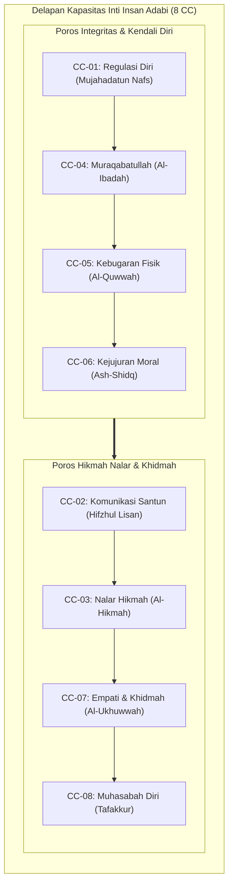
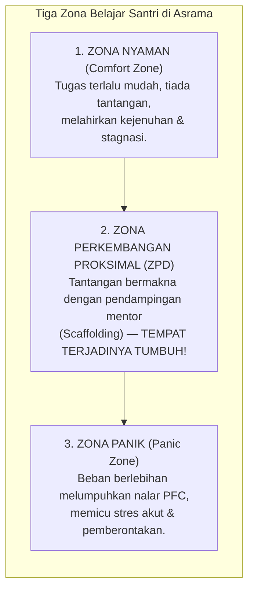

# BAB 12: PARADIGMA PROGRESI KARAKTER
## Dari Bimbingan Melekat Menuju Penggerak Peradaban: Menyelaraskan Tiga Lensa Arsitektur dan Delapan Kapasitas Inti Fitrah

> لَتَرْكَبُنَّ طَبَقًا عَنْ طَبَقٍ
>
> *"Sungguh, kamu benar-benar akan menapaki tingkatan demi tingkatan (tahap demi tahap dalam kehidupan dan kedewasaan jiwa)."*  
> — **QS. Al-Insyiqaq [84]: 19**[^1]

---

Sahabat Abdullah bin Abbas رضي الله عنهما dalam riwayat *Shahih al-Bukhari* menafsirkan firman Allah *latarkabunna thabaqan 'an thabaq*: *"Halan ba'da hal"*—yakni kalian benar-benar akan menapaki keadaan demi keadaan dan fase demi fase dalam perjalanan hidup dan pematangan jiwa. 

Imam Abu Ja'far Ath-Thabari dan Al-Hafizh Ibnu Katsir menjelaskan bahwa sunnatullah penciptaan manusia senantiasa bergerak melalui tahapan-tahapan bertingkat: dari lemah menuju kuat, dari kebodohan menuju ilmu, dan dari ketergantungan menuju kemandirian akal budi.[^2] Pertumbuhan karakter santri di pesantren adalah manifestasi nyata dari hukum *thabaqan 'an thabaq* ini.

### Prolog: Langkah-Langkah Pertama di Bawah Gerbang Kayu

Pagi itu, di bawah gerbang kayu jati bertuliskan kaligrafi kufi di mulut pesantren, dua dunia yang sangat berbeda melintas berdampingan. Di sisi kiri gerbang, seorang anak lelaki berusia sebelas tahun melangkah dengan langkah terseret. Tas punggungnya tampak terlalu besar bagi bahunya yang ringkih. Matanya sembab kemerahan; jemari kecilnya mencengkeram ujung gamis ibunya erat-erat, seolah jika ia melepaskan genggaman itu walau sedetik saja, dunianya akan runtuh berkeping-keping. Anak itu baru saja menempuh perjalanan tujuh jam dari sebuah kota di pesisir, dan hari ini untuk pertama kalinya dalam hidupnya, ia harus tidur di atas dipan susun bersama orang-orang asing tanpa pelukan dan ciuman kening sang ibu sebelum memejamkan mata.

Tepat di sisi kanan gerbang, seorang santri kelas dua belas melangkah dengan tenang dan percaya diri. Langkah kakinya mantap menyapa kerikil halaman. Peci hitamnya terpasang rapi, sorot matanya teduh memancarkan wibawa yang tenang. Ketika ia melihat seorang wali santri baru tampak kebingungan mengangkat kardus perbekalan yang berat dari bagasi mobil, tanpa menunggu komando sang pembina, santri senior itu menghampiri dengan senyum tulus, menundukkan tubuh seraya menyapa: *"Biar saya bantu bawakan ke kamar asrama, Pak. Mari saya antarkan lewat jalan setapak yang teduh."*

Dua anak manusia itu berdiri di bawah naungan pesantren yang sama, menatap kubah masjid yang sama, dan menghirup udara pegunungan yang sama. Namun, jurang kapasitas di antara keduanya terbentang sejauh ufuk timur dan barat. 

Yang satu adalah kuncup fitrah yang baru saja tercabut dari pot kenyamanan rumah, rapuh, cemas, dan bingung bagaimana cara mencuci piringnya sendiri setelah makan. Yang lain adalah pohon adab yang telah kokoh berakar, matang mengendalikan impuls emosinya, tangguh menghadapi kesulitan, dan tangannya selalu terulur untuk melayani sesamanya.

Bagaimanakah seekor ulat yang rapuh bertransformasi menjadi kupu-kupu yang anggun melintasi taman bunga? Bagaimanakah anak kecil yang sembab menangis itu dapat bermutasi menjadi ksatria penggerak kebaikan di asrama?

Bab ini membedah ikhtiar dan kaidah di balik proses transformasi tersebut. Bab ini membongkar kepalsuan tradisi penyeragaman kaku yang merusak jiwa santri, merumuskan Penyelarasan Tiga Lensa Arsitektur TUMBUH (10 Tingkat Adab, 5 Tingkat Kapasitas, dan 4 Jenjang J1–J4), memetakan Delapan Kapasitas Inti Fitrah (*The 8 Core Capacities*), serta menyajikan seni pedagogis pelepasan bantuan bertahap (*fading scaffolding*) yang mengantarkan santri dari ketergantungan menuju kemerdekaan jiwa sejati.

---

### 12.1 Tragedi Penyeragaman Kaku: Mengapa Satu Ukuran Menghancurkan Jiwa?

Di banyak lembaga asrama tradisional maupun modern, terdapat sebuah ilusi pedagogis berbahaya yang telah menelan ribuan korban jiwa anak-anak santri: **Jebakan Penyeragaman Tuntutan Tanpa Memandang Tahapan Kematangan (*The One-Size-Fits-All Fallacy*)**.

Bayangkan sebuah pemandangan tragis yang kerap disaksikan di lapangan asrama:
Seorang santri kelas tujuh yang baru genap dua pekan tinggal di pondok dijatuhi hukuman yang persis sama beratnya dengan santri kelas dua belas. Keduanya sama-sama terlambat dua menit memasuki saf masjid saat salat maghrib. Keduanya disuruh berdiri berjam-jam di depan mimbar masjid di bawah sorot lampu dan tatapan menghakimi dari ratusan pasang mata santri lainnya.

Ketika dipersoalkan mengenai keadilan perlakuan tersebut, pengurus asrama menjawab dengan nada pongah: *"Di pondok kami hukum ditegakkan seadil-adilnya! Tidak ada anak emas dan tidak ada diskriminasi! Mau santri baru, mau santri lama, semua aturan dipukul rata!"*

Ucapan tersebut terdengar heroik di telinga orang yang awam, namun sesungguhnya mencerminkan kebodohan epistemologis yang sangat fatal. Menyamaratakan tuntutan dan sanksi kepada dua individu yang memiliki tingkat kematangan biologis, kapasitas fungsi eksekutif korteks prafrontal, dan daya adaptasi lingkungan yang berbeda jauh **bukanlah keadilan; itu adalah hakikat kezaliman yang paling nyata!**

Keadilan dalam epistemologi Islam, sebagaimana ditegaskan oleh para fukaha ushul dan filosof adab terkemuka, dirumuskan dengan sangat anggun:

> وَضْعُ الشَّيْءِ فِي مَوْضِعِهِ اللَّائِقِ بِهِ
>
> *"Meletakkan segala sesuatu pada tempat dan porsinya yang tepat, benar, dan layak."*[^3]

Meletakkan beban ekspektasi kemandirian santri senior ke atas pundak anak kecil yang baru beradaptasi adalah kezaliman pedagogis yang memicu kepanikan saraf (*nervous system flooding*), merusak rasa aman, dan melahirkan trauma kronis. 

Sebaliknya, terus-menerus memperlakukan santri senior kelas dua belas laksana anak balita yang harus dipandu setiap detik, dibangunkan dengan teriakan peluit, dan dicurigai setiap gerak-geriknya adalah pelecehan terhadap martabat akal budinya yang sedang mendambakan tanggung jawab dan kepercayaan. Hal itu mematikan inisiatif, menumpulkan daya cipta, serta melahirkan generasi yang manja dan sinis.

Pertumbuhan karakter manusia adalah sebuah **proses perkembangan bertahap (*developmental progression*)**. Al-Qur'an al-Karim mengukuhkan sunnatullah ini secara sangat tegas: **لَتَرْكَبُنَّ طَبَقًا عَنْ طَبَقٍ** (*Sungguh kamu benar-benar akan menapaki tingkatan demi tingkatan*). Jiwa manusia tidak pernah melonjak secara ajaib dari kelalaian langsung menuju kemakrifatan adab; ia mendaki tangga demi tangga kebaikan melalui tempaan yang disesuaikan dengan kapasitas daya tampungnya.

---

### 12.2 Penyelarasan Tiga Lensa Arsitektur TUMBUH

Salah satu keunggulan konseptual paling mendasar dari ekosistem TUMBUH v2.0.0 adalah kemampuannya menertibkan kekacauan terminologi penjenjangan yang selama ini membingungkan para guru dan pengasuh asrama. 

Sering kali para asatidz lapangan bertanya dengan nada bingung: *Mengapa di kurikulum disebutkan ada 10 tingkat penjenjangan adab? Mengapa di instrumen asesmen ada 5 tingkat kapasitas fungsional? Dan bagaimana hubungannya dengan 4 Jenjang Dukungan (J1–J4) di asrama? Bukankah penjenjangan yang banyak itu saling bertabrakan?*

TUMBUH menegaskan secara terang benderang: **Ketiganya sama sekali tidak bertentangan, melainkan bekerja sebagai Tiga Lensa Komplementer yang saling melengkapi (*The Three Architectural Lenses*)**[^4].

```text
                                SISTEM TUMBUH v2.0.0
                                          │
         ┌────────────────────────────────┼────────────────────────────────┐
         ↓                                ↓                                ↓
   LENSA 1: JIWA & PERAN            LENSA 2: KAPASITAS               LENSA 3: LINGKUNGAN
        (10 TINGKAT)                   (5 TINGKAT)                         (J1 – J4)
 "Seberapa dalam nilai meresap    "Seberapa terampil fungsinya      "Berapa banyak bantuan
  ke kalbu dan peran amalnya?"    saat menghadapi tantangan?"       eksternal yang disiapkan?"
         │                                │                                │
 • Perspektif: Tarbiyah & Kader   • Perspektif: Psikologis-Fungsional• Perspektif: Operasional Musyrif
 • Objek: Jiwa & Gerak Sosial     • Objek: 8 Core Capacities (CC)   • Objek: Tingkat Dukungan/Kemandirian
```

#### 1. Lensa 1: Sepuluh Tingkat Internalisasi Adab dan Peran Kader (10 Levels of Adab Internalization)
Lensa ini memandang perjalanan manusia dari perspektif makro-filosofis tarbiyah sepanjang hayat: bagaimana suatu nilai adab bertransformasi dari sekadar informasi di kepala hingga mendarah daging menjadi watak (*malakah*) dan melahirkan peran kepemimpinan peradaban:

```mermaid
graph LR
    subgraph SIKLUS_SANTRI["Tujuh Etape Santri Aktif di Asrama (Puncak di J4)"]
        direction TB
        T1["1. Tahu (Ta'allum)"]
        --> T2["2. Paham (Tafahhum)"]
        --> T3["3. Sadar (Tafakkur)"]
        --> T4["4. Pembiasaan (Ta'awwud)"]
        --> T5["5. Istiqamah (Tsabat)"]
        --> T6["6. Teladan (Qudwah)"]
        --> T7["7. Penggerak (Raid / Qiyadah)"]
    end
    
    subgraph SIKLUS_PASCA_SANTRI["Ranah Pasca-Santri & Kader Khidmah"]
        direction TB
        T8["8. Pelaksana Khidmah (1 Tahun)"]
        --> T9["9. Pembina Asrama (Murabbi)"]
        --> T10["10. Pembangun Ekosistem (Arsitek Sistem)"]
    end

    T7 -.->|Lulus Menjadi Kader Khidmah| T8
```



* **Ranah Santri Asrama (Tingkat 1 s/d 7)**:
  1. *Tahu*: Mengetahui dalil dan aturan adab secara kognitif dasar.
  2. *Paham*: Memahami hikmah, filosofi, dan alasan rasional di balik aturan adab.
  3. *Sadar*: Timbul getaran afektif nurani batin (*yaqzhah*) bahwa adab itu adalah kebutuhan jiwanya.
  4. *Pembiasaan*: Mempraktikkan adab dalam latihan motorik berulang-ulang di asrama.
  5. *Istiqamah*: Mampu konsisten menjaga adab melampaui masa kritis hingga terbentuk watak awal (*malakah*).
  6. *Teladan (Qudwah)*: Pribadinya memancarkan keindahan adab yang menginspirasi kawan sekamarnya secara alami.
  7. *Penggerak (Muharrik)*: Mampu memelopori inisiatif kebaikan, memimpin organisasi santri, dan menjadi pelindung adik kelas. **Ini adalah puncak capaian santri aktif selama bermukim di asrama (puncak Jenjang J4).**
* **Ranah Pasca-Santri & Profesional (Di Luar J4: Tingkat 8 s/d 10)**:
  8. *Pelaksana*: Santri yang telah lulus dan menjalani masa khidmah pengabdian wajib 1 tahun (guru bantu/staf pengasuhan muda) di bawah supervisi pimpinan.
  9. *Pembina*: Asatidz tetap, musyrif senior, dan konselor BK profesional yang mengkader generasi santri dan staf muda.
  10. *Pembangun*: Pengasuh pondok, dewan pakar, dan majelis arsitek yang merancang arah kebijakan, memelihara integritas sistem TUMBUH, dan membangun ekosistem peradaban Islam.

#### 2. Lensa 2: Lima Tingkat Perkembangan Kapasitas Fungsional (5 Functional Capacity Levels)
Lensa ini digunakan oleh para konselor BK, wali kelas madrasah, dan evaluator untuk memotret performa unjuk kerja santri pada domain kapasitas tertentu secara spesifik:
* *Tingkat 1 (Pemula / Emerging with High Support)*: Santri hanya mampu menampilkan perilaku adab jika diarahkan langkah demi langkah dan dicontohkan langsung secara visual.
* *Tingkat 2 (Terbimbing / Guided Practice)*: Mampu menjalankan adab dengan bantuan pengingat berkala (*prompting & cueing*) atau daftar periksa (*checklist*).
* *Tingkat 3 (Mandiri Rutin / Consistent Autonomy)*: Santri ajek dan konsisten menjalankan adab dalam rutinitas akrab tanpa memerlukan instruksi atau pengawasan orang dewasa.
* *Tingkat 4 (Tangguh & Adaptif / Resilient & Adaptive)*: Santri mampu mempertahankan integritas adabnya ketika berada di bawah tekanan stres, kelelahan fisik, provokasi konflik, atau godaan lingkungan tak terawasi.
* *Tingkat 5 (Menjiwai & Qudwah / Mastery & Mentoring)*: Nilai adab telah menyatu sempurna menjadi karakter spontan (*malakah*), mampu memecahkan dilema moral yang rumit, dan mampu membimbing santri lain menemukan ketenangan batin.

#### 3. Lensa 3: Empat Jenjang Dukungan Lingkungan Pengasuhan (J1–J4)
Inilah instrumen operasional harian para musyrif di asrama. J1–J4 tidak pernah dimaksudkan untuk membuat kasta sosial manusia, melainkan mengatur **Berapa dosis bantuan perancah (*scaffolding*) dan pengawasan yang wajib disiapkan oleh musyrif agar santri aman, tertib, dan bertumbuh optimal**:

| Jenjang | Nama Jenjang | Dosis Peran Musyrif | Dosis Otonomi Santri | Fokus Operasional Asrama 24 Jam |
| :--- | :--- | :---: | :---: | :--- |
| **J1** | Kemandirian Pemula *(High Support)* | **80%** (Pendampingan Melekat) | **20%** | Adaptasi transisi rumah-asrama, penanganan homesickness, bimbingan langsung bangun subuh, wudhu, dan kerapian lemari. |
| **J2** | Kemandirian Terbimbing *(Guided Scaffolding)* | **50%** (Bimbingan Terarah) | **50%** | Membangun konsistensi ibadah mandiri, pembagian tugas piket kamar, latihan musyawarah kamar, dan penyelesaian gesekan kecil. |
| **J3** | Kemandirian Mandiri *(Independent Functioning)* | **20%** (Pemantauan Jarak Jauh) | **80%** | Muraqabatullah di kala sendiri, swakarsa mengelola waktu belajar malam dan hafalan, menjaga kehormatan tanpa pengawasan. |
| **J4** | Kemandirian Teladan *(Autonomous Stewardship)* | **10%** (Kemitraan Konsultatif) | **90%** | Kepemimpinan pelayan (*khidmah*), menjadi kakak asuh santri J1, ketua asrama, motor penggerak kebaikan ekosistem pondok. |

---

### 12.3 Anatomi Delapan Kapasitas Inti Karakter (The 8 Core Capacities)

Agar pembinaan adab tidak melayang-layang dalam khayalan konsep yang abstrak, sistem TUMBUH membedah karakter fitrah insan adabi ke dalam **Delapan Kapasitas Inti (*The 8 Core Capacities / 8 CC*)**. Setiap kapasitas memiliki indikator biologis, psikologis, dan syar'i yang terukur lintas jenjang:



#### CC-01: Regulasi Diri dan Pengendalian Hawa Nafsu (Mujahadatun Nafs)
Kapasitas biologis dan spiritual santri dalam mengendalikan dorongan impulsif amigdala, menunda kepuasan sesaat (*delay of gratification*), dan menundukkan syahwat kemalasan di bawah pertimbangan nalar iman. Santri yang matang pada CC-01 tidak reaktif saat marah, mampu menahan kantuk di waktu subuh, dan menolak godaan menyelinap keluar asrama demi kenikmatan fana.

#### CC-02: Komunikasi Beradab dan Penjagaan Lisan (Hifzhul Lisan)
Kemampuan memilih kata-kata yang mulia (*qaulan karima*), lembut (*qaulan layyina*), dan tepat sasaran (*qaulan sadida*). Menghilangkan secara mutlak kebiasaan memanggil teman dengan julukan binatang, mengejek fisik (*body shaming*), melontarkan kata-kata kotor, serta menolak terlibat dalam ghibah dan adu domba (*namimah*) di bilik asrama.

#### CC-03: Nalar Kritis dan Pemecahan Masalah Berhikmah (Al-Hikmah)
Kapasitas membedakan antara fakta objektif dan asumsi prasangka (*zhann*), menganalisis sebab-akibat suatu persoalan, serta merumuskan jalan keluar yang adil dan bermaslahat ketika menghadapi kebuntuan atau konflik antarteman sekamar tanpa kekerasan.

#### CC-04: Ketundukan Ibadah dan Kesadaran Muraqabatullah
Kapasitas merasakan kehadiran Allah SWT dalam seluruh gerak hidup. Menjaga salat berjamaah di saf pertama bukan karena takut diabsen musyrif, melainkan karena kerinduan bermunajat kepada Allah; tekun tilawah Al-Qur'an secara swakarsa; dan menjaga kehormatan diri saat berada di tempat yang paling tersembunyi.

#### CC-05: Kebugaran Jasmani dan Ketangguhan Fisik (Al-Quwwah wal-Inshihah)
Kapasitas merawat amanah tubuh ciptaan Allah: menjaga kebersihan sanitasi diri, mencuci pakaian secara mandiri, berolahraga secara teratur, menjaga porsi makan yang seimbang, serta memiliki daya tahan fisik (*endurance*) yang tangguh menghadapi cuaca dan aktivitas asrama yang padat.

#### CC-06: Kejujuran Hati dan Tanggung Jawab Moral (Ash-Shidq wal-Amanah)
Keselarasan mutlak antara apa yang ada di dalam kalbu, apa yang diucapkan di bibir, dan apa yang diperbuat dalam tindakan (*shidq al-amal*). Mengakui kesalahan secara ksatria tanpa melempar kambing hitam, mengembalikan barang temuan sekecil apa pun kepada pemiliknya, dan menolak budaya ghashab sandal maupun peralatan mandi.

#### CC-07: Empati Sosial dan Pelayanan Umat (Al-Ukhuwwah wal-Khidmah)
Kemampuan membaca perasaan kawan yang sedang berduka, merasakan kepedihan orang lain (*Theory of Mind*), dan kesediaan menyingsingkan lengan baju untuk melayani sesama tanpa pamrih. Mengamalkan hadits *Sayyidul Qaumi Khadimuhum* dalam kehidupan nyata kamar asrama.

#### CC-08: Metakognisi dan Kejujuran Muhasabah Kalbu (Tafakkur wal-Muhasabah)
Kapasitas jiwa untuk melihat ke dalam dirinya sendiri (*self-reflection*): menyadari titik lemah pribadi, mengidentifikasi pemicu amarah diri, menghisab amal sebelum dihisab oleh Allah kelak, serta memiliki kehendak yang membara untuk terus memperbaiki diri (*continuous taubah & self-correction*).

---

### 12.5 Zona Perkembangan Proksimal (ZPD) dalam Khazanah Tarbiyah Asrama

Konsep perkembangan bertahap ini menemukan landasan psikologis modernnya dalam teori **Zona Perkembangan Proksimal (*Zone of Proximal Development / ZPD*)** yang dirumuskan oleh psikolog Lev Vygotsky[^5].

Vygotsky membagi bentang belajar manusia ke dalam tiga zona:



Kunci keberhasilan tarbiyah asrama adalah **menjaga santri senantiasa berada di dalam ZPD**:
* Memberikan tantangan adab yang berada selangkah di depan kapasitas saat ini: santri J1 yang baru bisa bangun pukul 04.30 diberi tantangan bangun pukul 04.15 dengan pendampingan lembut musyrif.
* Tidak melempar santri ke Zona Panik: tidak menuntut santri baru yang belum lancar membaca Al-Qur'an untuk langsung menyetorkan 1 juz per hari dengan ancaman takzir berdiri di lapangan.
* Menyeimbangkan secara presisi antara **Tingkat Tantangan (*High Challenge*)** dan **Tingkat Dukungan Kasih Sayang (*High Support*)**. Jika tantangan tinggi tanpa dukungan, santri akan hancur oleh kecemasan; jika dukungan tinggi tanpa tantangan, santri akan manja dan kerdil.

---

### 12.6 Matriks Pemetaan Triangulasi Tiga Lensa Arsitektur TUMBUH

Untuk memberikan kejelasan mutlak bagi seluruh tim akademis dan pengasuhan dalam memetakan posisi santri, tabel komprehensif berikut menyandingkan Lensa 1, Lensa 2, dan Lensa 3 secara integratif:

| Jenjang Asrama (Lensa 3) | Target Lensa 1 (Tingkat Adab & Peran Jiwa) | Target Lensa 2 (Tingkat Kapasitas Fungsional 8 CC) | Peran Dominan Musyrif Lapangan | Indikator Kunci Kelulusan Jenjang |
| :---: | :--- | :--- | :--- | :--- |
| **J1: Pemula** | **Tingkat 1 s/d 3**:<br/>*Tahu $\rightarrow$ Paham $\rightarrow$ Sadar* | **Level 1 (Pemula)**:<br/>Memerlukan perancah penuh dan contoh langsung. | *Perawat & Pelindung Melekat* (Rasio dukungan 80%) | Tuntas masa kritis adaptasi 90 hari; bebas homesickness akut; mampu merapikan loker mandiri. |
| **J2: Terbimbing** | **Tingkat 4**:<br/>*Pembiasaan Berulang* | **Level 2 (Terbimbing)**:<br/>Mampu menjalankan rutinitas dengan pengingat berkala. | *Pelatih & Pengarah Kamar* (Rasio dukungan 50%) | Konsisten salat berjamaah 40 hari; aktif dalam musyawarah kamar; bebas dari perilaku ghashab. |
| **J3: Mandiri** | **Tingkat 5**:<br/>*Istiqamah Menetap* | **Level 3 (Mandiri Rutin)**:<br/>Otonom tanpa perlu diawasi atau diingatkan lagi. | *Konsultan & Pemantau Jauh* (Rasio dukungan 20%) | Integritas muraqabatullah saat sendiri; inisiatif belajar malam; mampu meredam konflik kamar. |
| **J4: Teladan** | **Tingkat 6 & 7**:<br/>*Teladan $\rightarrow$ Penggerak* | **Level 4 & 5 (Tangguh & Menjiwai / Mastery)** | *Mitra Pemberdayaan* (Rasio dukungan 10%) | Menjadi mentor asuh santri J1; memimpin organisasi santri dengan *Servant Leadership*; teladan adab. |

---

### 12.7 Dinamika Pelepasan Bantuan Bertahap (Fading Scaffolding)

Bagaimanakah proses transisi pengasuhan dari J1 menuju J4 dijalankan tanpa membuat santri terkejut atau sebaliknya mengalami kemunduran?

Para pendidik TUMBUH diibaratkan laksana **Penerbang Layang-Layang yang Bijaksana**:
Ketika layang-layang baru dinaikkan dari tanah di tengah hembusan angin kencang, kedua tangan sang penerbang memegang erat tali benang di jarak dekat. Jika dilepas begitu saja, layang-layang itu akan berputar-putar tak tentu arah lalu menukik tajam menghantam bumi. Namun, ketika layang-layang itu mulai menemukan keseimbangan di udara dan angin stabil mulai mengangkat sayapnya, sang penerbang secara perlahan dan terukur **mengulur gulungan benangnya** semakin panjang ke angkasa.

```text
               SENI MENGULUR BENANG PENGASUHAN TUMBUH
┌───────────────────────────────┬───────────────────────────────┐
│ SAAT SANTRI MASIH DI J1 & J2  │ SAAT SANTRI MEMASUKI J3 & J4  │
├───────────────────────────────┼───────────────────────────────┤
│ • Benang dipegang erat        │ • Benang diulur tinggi        │
│   (Instruksi & ceklis harian).│   (Otonomi & ruang inisiatif).│
│ • Musyrif berada di depan     │ • Musyrif berada di belakang  │
│   menjadi penunjuk jalan.     │   menjadi pendoa & konsultan. │
│ • Pengawasan langsung melekat.│ • Pengawasan berbasis nurani. │
└───────────────────────────────┴───────────────────────────────┘
```

Jika terjadi badai goncangan emosi (misalnya santri mengalami krisis kehilangan orang tua atau konflik berat), sang musyrif tidak segan untuk **menarik kembali benang tersebut sejenak (*re-scaffolding*)** agar layang-layang jiwa anak itu tidak terhempas, lalu mengulurnya kembali setelah badai mereda.

Inilah hakikat tarbiyah yang sesungguhnya: **Bukan memanjakan, bukan pula menelantarkan; melainkan mendampingi dengan perhitungan ilmu dan welas asih hingga jiwa anak mampu terbang mandiri di bawah langit keridhaan Ilahi.**

---

### Rangkuman Intisari Bab 12

1. **Dekonstruksi Penyeragaman Kaku:** Menolak penyamaan beban tuntutan antara santri baru dan santri lama (*one-size-fits-all*); menegakkan definisi keadilan syariat: *Wadh'u asy-syai' fi maudhi'ihi al-la'iq bih* (meletakkan segala sesuatu pada tempat dan porsinya yang layak).
2. **Penyelarasan Tiga Lensa Arsitektur:**
   - *Lensa 1 (10 Tingkat Adab & Peran)*: Memetakan kedalaman batin dan peran amal (Tahu $\rightarrow$ Penggerak di asrama; Pelaksana $\rightarrow$ Pembangun pasca-santri).
   - *Lensa 2 (5 Tingkat Kapasitas)*: Mengukur kemahiran fungsional (Pemula $\rightarrow$ Menjiwai/Mastery).
   - *Lensa 3 (4 Jenjang J1–J4)*: Mengatur dosis bantuan dan pengawalan musyrif (High Support $\rightarrow$ Autonomous Stewardship).
3. **Delapan Kapasitas Inti Fitrah (8 CC):** Memetakan dimensi adab secara konkret: CC-01 Regulasi Diri, CC-02 Komunikasi Beradab, CC-03 Nalar Kritis, CC-04 Ibadah & Muraqabah, CC-05 Kebugaran Jasmani, CC-06 Kejujuran & Amanah, CC-07 Empati & Khidmah, CC-08 Metakognisi & Muhasabah.
4. **Prinsip Pelepasan Bantuan Bertahap (*Fading Scaffolding*):** Musyrif bertindak laksana penerbang layang-layang: memegang erat di fase awal, mengulur benang saat kapasitas menguat, dan siap menarik kembali secara bermartabat (*re-scaffolding*) jika terjadi badai emosional.
5. **Kunci Sukses Transisi:** Menjamin santri menapaki setiap jenjang bukan atas dasar umur kalender semata, melainkan atas dasar pembuktian stabilitas kapasitas adab yang teruji secara autentik.

Kita telah menelaah arah dan tahapan ikhtiar pendakian jiwa ini. Namun, bagaimana fase-fase awal pendakian itu berlangsung saat rintik air mata pertama tumpah di ranjang asrama? Bagaimana mendampingi seorang anak kecil yang rapuh melewati badai homesickness dan pubertas awal tanpa mematahkan harga dirinya?

Di Bab 13, kita membedah secara mendalam Jenjang J1 dan J2: Dari Keterasingan Menuju Keteraturan Berkesadaran.

---

### Catatan Kaki & Rujukan Akademik

[^1]: Al-Qur'an al-Karim, Surah Al-Insyiqaq [84]: 19; Al-Bukhari, *Shahih al-Bukhari*, Kitab at-Tafsir, hadits no. 4940.
[^2]: Ath-Thabari, *Jami' al-Bayan*, Jilid XXIV, hlm. 336–340; Ibnu Katsir, *Tafsir al-Qur'an al-'Azhim*, Jilid VIII, hlm. 358–360.
[^3]: Sa'duddin Mas'ud bin Umar At-Taftazani, *Syarh al-Maqashid fi 'Ilm al-Kalam* (Beirut: 'Alam al-Kutub, 1998), Jilid IV, hlm. 285–292; Syed Muhammad Naquib al-Attas, *Islam and Secularism* (Kuala Lumpur: ABIM, 1978), hlm. 140–145 mengenai definisi keadilan dan adab.
[^4]: Dokumen Kanonikal Arsitektur TUMBUH v2.0.0, *Penyelarasan Tingkatan Perkembangan (Developmental Levels Alignment)*, berkas induk: `01_FUNDAMENTAL/04_PROGRESSION/01 Growth Architecture/09-Developmental-Levels-Alignment.md`.
[^5]: Lev S. Vygotsky, *Mind in Society: The Development of Higher Psychological Processes*, diedit oleh Michael Cole dkk. (Cambridge: Harvard University Press, 1978), hlm. 79–91 mengenai konsep *Zone of Proximal Development (ZPD)* dan *scaffolding*.
