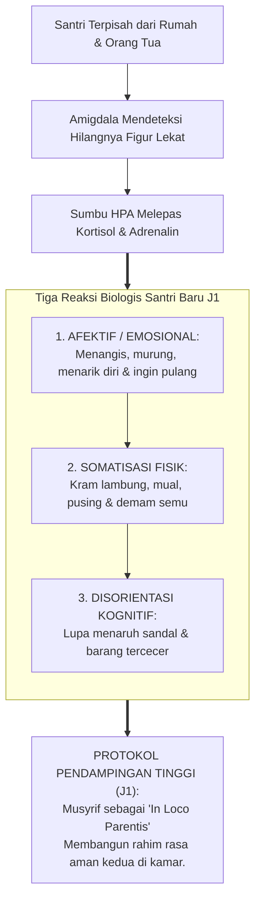
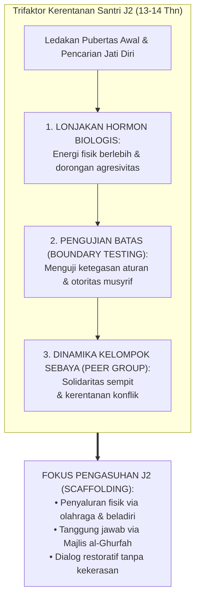

# BAB 13: BEDAH JENJANG J1 & J2: ADAPTASI, PEMBIASAAN, DAN REGULASI TERBIMBING
## Protokol Pendampingan 90 Hari Pertama, Mitigasi Homesickness, Pembentukan Kebiasaan Kamar, dan Tata Kelola Pubertas Awal

> يَا بُنَيَّ أَقِمِ الصَّلَاةَ وَأْمُرْ بِالْمَعْرُوفِ وَانْهَ عَنِ الْمُنْكَرِ وَاصْبِرْ عَلَىٰ مَا أَصَابَكَ ۖ إِنَّ ذَٰلِكَ مِنْ عَزْمِ الْأُمُورِ
>
> *"Wahai anakku! Laksanakanlah salat, suruhlah (manusia) berbuat yang makruf dan cegahlah (mereka) dari yang mungkar, serta bersabarlah terhadap apa yang menimpamu. Sesungguhnya yang demikian itu termasuk perkara-perkara yang diutamakan."*  
> — **QS. Luqman [31]: 17**[^1]

---

Al-Hafizh Ibnu Katsir dalam *Tafsir al-Qur'an al-'Azhim* memaparkan urutan hikmah pedagogis dari wasiat Luqman kepada putranya: Luqman memulai dengan mendirikan salat sebagai tiang penenang jiwa dan penghubung vertikal dengan Allah, kemudian memerintahkan amar makruf nahi mungkar sebagai latihan kepedulian sosial, lalu memerintahkan bersabar atas cobaan yang niscaya menghadang jalan perjuangan. Luqman memanggil putranya dengan panggilan *Yaa Bunayya*—sebuah sapaan kasih sayang takzim (*at-tashghir li at-tahabbub*) yang menjadi teladan bagaimana musyrif asrama wajib mendekap santri J1 dan J2 yang sedang rapuh.[^1]

### Prolog: Rintik Hujan di Kaca Bilik Santri Baru

Hujan gerimis turun membasahi genting asrama pada pekan kedua bulan Juli. Di bilik tidur berlantai semen abu-abu, aroma khas minyak telon bercampur dengan bau apek kasur busa yang belum sepenuhnya akrab di indera penciuman anak-anak baru. Pukul sembilan malam lewat sedikit; lonceng asrama telah berdentang menandakan saatnya memadamkan lampu utama dan beralih ke lampu tidur kuning temaram.

Di ranjang susun nomor empat, seorang anak berusia sebelas tahun setengah bernama Farhan berbaring menyamping menghadap dinding bata. Tubuhnya meringkuk membentuk huruf C, mendekap erat sebuah guling kecil bersarung biru laut yang dibawa dari rumahnya di Tegal. Dari balik selimut, pundaknya berguncang perlahan. Ia berusaha menahan suara isak tangisnya agar tidak terdengar oleh kawan-kawan sekamarnya yang sebagian telah mendengkur karena kelelahan. Air matanya membasahi bantal kapas tipis. Di benaknya berkelebat bayangan meja makan di rumah, suara tawa adiknya, dan belaian tangan ibunya saat menyuapinya bubur hangat ketika ia sakit demam.

Tiba-tiba, sebuah telapak tangan yang hangat dan mantap mendarat lembut di atas pundaknya. Farhan tersentak, buru-buru menyeka air matanya dengan ujung selimut karena takut akan dimarahi atau dihukum push-up oleh musyrif piket.

Namun, suara yang terdengar bukanlah bentakan menggelegar. Yang terdengar adalah bisikan lembut dengan nada kebapakan yang sangat teduh:  
*"Farhan... jangan disembunyikan air matamu, Nak. Menangis rindu ibu bukanlah aib, bukan pula tanda kelemahan. Itu adalah tanda bahwa hatimu hidup dan penuh cinta. Malam ini, ustadz ada di sini menemani antum. Tarik napas dalam-dalam, minum air hangat ini, dan mari kita berdoa bersama agar Allah melapangkan dadamu."*

Farhan menatap wajah musyrif mudanya, Ustadz Salman. Di mata sang ustadz tidak ada tatapan mencemooh; yang ada adalah ketulusan samudera welas asih. Malam itu, untuk pertama kalinya sejak menginjakkan kaki di pesantren, detak jantung Farhan yang berdegup kencang mereda. Sistem sarafnya merasa aman. Dan di sanalah, di bilik kecil berlantai semen itu, perjalanan metamorfosis fitrahnya resmi dimulai.

---

### 13.1 Fase Kritis 90 Hari Pertama: Anatomi Psikosomatis Jiwa Santri Jenjang J1

Transisi seorang anak dari rumah keluarga menuju kehidupan komunal asrama 24 jam adalah salah satu guncangan eksistensial terdahsyat dalam biografi seorang manusia. Di rumah, anak adalah pusat perhatian: makanannya disiapkan, pakaiannya dicucikan, jadwalnya diingatkan, dan jika ia sedih, ada pelukan hangat orang tua yang siap menyambutnya. 

Di pesantren, dalam hitungan jam, anak terlempar ke dalam mikrokosmos yang serba padat: ia harus berbagi ruang tidur dengan sepuluh hingga dua belas orang anak dari berbagai suku bangsa yang belum ia kenal wataknya, mengantre mandi di waktu subuh yang dingin, mencuci pakaiannya sendiri, dan hidup di bawah dentang jadwal yang bergerak presisi dari menit ke menit.

Bagi anak usia sebelas hingga dua belas tahun, keterkejutan ini memicu fenomena yang dalam sains perkembangan dan psikiatri anak disebut sebagai **Krisis Keterputusan Kelekatan (*Attachment Disruption Crisis*)**[^2].



#### 1. Memahami Fenomena Somatisasi Saraf (Bukan Kepura-puraan!)
Banyak musyrif konvensional mengeluhkan bahwa di bulan-bulan pertama, ruang klinik asrama selalu dipenuhi santri baru yang mengeluh sakit perut melilit, mual, pusing, atau demam ringan, padahal hasil pemeriksaan laboratorium dokter menunjukkan tidak ada infeksi bakteri apa pun. Sebagian pembina dengan sinis menuduh anak-anak itu "pura-pura sakit demi membolos halaqah tahfidz".

TUMBUH melarang keras penghakiman yang zalim ini. Sains neurobiologi usus-otak (*the gut-brain axis*) membuktikan bahwa **kram perut yang dialami santri J1 adalah rasa sakit fisik yang nyata (*real psychosomatic pain*)**[^3]. 

Ketika amigdala anak mendeteksi rasa cemas dan ketakutan akan keterpisahan (*separation anxiety*), sinyal darurat tersebut dikirimkan melalui saraf vagus langsung menuju sistem saraf enterik di dinding lambung dan usus. Lambung merespons dengan memproduksi asam berlebih dan kram otot polos yang sangat menyakitkan. Anak tersebut tidak berbohong; tubuh biologisnya sedang menjerit mencari rasa aman!

Demikian pula dengan fenomena **Enuresis Nokturnal (Mengompol Kembali)** yang kerap dialami anak-anak J1 di bulan-bulan awal. Anak yang di rumahnya sudah bertahun-tahun tidak mengompol, tiba-tiba terbangun dengan kasur yang basah kuyup di asrama. Ini adalah respons regresi saraf bawah sadar (*developmental regression under stress*). 

Jika musyrif mempermalukan anak tersebut dengan menjemur kasurnya di tengah lapangan atau mengejeknya di depan teman sekamar, harga diri anak itu akan hancur lebur (*toxic shame*). Anak akan mengisolasi diri, membenci pesantren, dan berisiko mengalami depresi masa kanak-kanak.

#### 2. Dosis Pengasuhan J1: High Support (Dukungan Maksimal 80%)
Oleh karena itu, arsitektur TUMBUH menetapkan hukum mutlak: **Jenjang J1 (Kemandirian Pemula / Adaptif) adalah fase High Support**. 

Di jenjang ini, musyrif tidak boleh menjaga jarak atau bersikap laksana mandor militer yang hanya berdiri berkacak pinggang meniup peluit. Musyrif mengalokasikan 80% energi pengasuhannya untuk memberikan **kehadiran fisik melekat (*embodied physical presence*)**: mendengarkan curahan hati, merangkul, mengajari hal-hal sepele, dan menjadi jangkar ketenangan emosional bagi jiwa-jiwa kecil yang sedang berjuang menata hidup barunya.

---

### 13.2 Protokol Operasional 90 Hari Pertama Jenjang J1

Untuk memandu musyrif dan wali asrama di lapangan, TUMBUH merumuskan kurikulum pengasuhan 90 hari pertama yang terbagi ke dalam tiga etape transisi yang sangat sistematis:

```text
              PETA JALAN 90 HARI PERTAMA SANTRI JENJANG J1
┌───────────────────┬───────────────────┬───────────────────┐
│ BULAN I (HARI 1-30)│ BULAN II (HARI 31-60)│ BULAN III (HARI 61-90)│
├───────────────────┼───────────────────┼───────────────────┤
│ ETAPE PERTAUTAN   │ ETAPE PEMBIASAAN  │ ETAPE KONSOLIDASI │
│ & RASA AMAN       │ KETERAMPILAN RAGA │ DAN UKHUWAH       │
├───────────────────┼───────────────────┼───────────────────┤
│ • Dekapan kasih   │ • Pelatihan wudhu │ • Penataan jadwal │
│   musyrif & doa.  │   & thaharah sah. │   belajar kamar.  │
│ • Validasi rindu  │ • Latihan melipat │ • Pembagian piket │
│   rumah (curhat). │   baju & mencuci. │   kamar mandiri.  │
│ • Pengenalan peta │ • Labelisasi rak  │ • Pengikatan rasa │
│   fisik asrama.   │   sandal & lemari.│   persaudaraan.   │
└───────────────────┴───────────────────┴───────────────────┘
```

#### 1. Protokol Bimbingan Keterampilan Hidup Nyata (Hands-On Scaffolding)
Musyrif J1 mendidik dengan metodologi empat langkah kenabian:
1. **Ustadz Mencontohkan, Santri Memperhatikan (*I Do, You Watch*):** Musyrif duduk di lantai kamar bersama santri, membentangkan kain sarung, dan mendemonstrasikan teknik melipat sarung menjadi balok rapi simetris. Musyrif masuk ke kamar mandi dan mempraktikkan bagaimana cara mengucek kerah baju putih yang terkena noda keringat menggunakan sabun batangan.
2. **Kita Melakukan Bersama (*We Do Together*):** Musyrif dan santri bersama-sama merapikan seprai ranjang, menarik ujung-ujung kain hingga kencang tanpa kerutan, dan menata tumpukan kitab di atas meja belajar.
3. **Santri Melakukan Sendiri Didampingi Musyrif (*You Do, I Watch*):** Santri mempraktikkan mandiri melipat pakaian dan mencuci piring makannya, sementara musyrif berdiri di sampingnya dengan senyum hangat, memberikan koreksi lembut jika ada langkah yang keliru.
4. **Merayakan Keberhasilan Kecil (*Celebrate Small Wins*):** Musyrif memberikan afirmasi positif verbal yang spesifik: *"Masya Allah, Zaid! Lipatan selimutmu pagi ini sudah sangat rapi laksana balok kayu. Ustadz bangga melihat kemandirianmu yang bertumbuh setiap hari!"*

#### 2. Protokol Pemberantasan Budaya Ghashab Sejak Bilik J1
Budaya *ghashab* (mengambil alas kaki atau ember teman tanpa izin) yang merusak pesantren harus dicegah sejak hari pertama santri J1 menginjakkan kaki di asrama. TUMBUH menerapkan **Tiga Kunci Tertib Kebendaan**:
- **Labelisasi Permanen Seluruh Aset Pribadi:** Pada pekan pertama, musyrif mendampingi santri menuliskan nama lengkap dan nomor kamar pada setiap helai pakaian, handuk, sajadah, gayung, ember, dan kedua belah sandal jepit menggunakan spidol permanen kain.
- **Satu Sandal Satu Slot Vertikal:** Setiap santri J1 memiliki slot rak sandal khusus yang diberi label namanya di luar pintu kamar. Sandal wajib diletakkan menghadap ke luar siap pakai.
- **Doktrin Kehormatan Milik Saudara:** Musyrif menanamkan secara mendalam bahwa memakai sandal saudara tanpa izin lisan bukan tanda keakraban, melainkan dosa kezaliman yang mencabut keberkahan ilmu dan hafalan Al-Qur'an.

#### 3. Ritual Bangun Fajar Penuh Kasih Sayang (The Sacred Dawn Protocol)
TUMBUH mengharamkan secara mutlak suara gedoran pintu seng, denting ember besi, atau siraman air dingin yang mengagetkan jantung santri saat bangun subuh. 

Pukul 04.00 pagi, musyrif J1 menyalakan lampu tidur remang, memutar lantunan tilawah merdu bersuara lembut, lalu berkeliling dari ranjang ke ranjang. Musyrif menyentuh telapak kaki santri dengan lembut, mengusap dahinya seraya berbisik:  
> *"Ash-shalātu khairum minan naum... Bangunlah duhai buah hati ustadz, fajar rahmat Allah telah tiba, mari kita bersuci menyambut seruan-Nya."*
Jika ada santri yang tubuhnya masih sangat berat karena keletihan, musyrif tidak membentaknya. Musyrif membantunya duduk bersandar, mengusap punggungnya, memberinya segelas air putih hangat untuk membasahi kerongkongannya, lalu menuntun langkahnya menuju tempat wudhu. Dalam kehangatan sentuhan itulah, salat subuh diasosiasikan di otak santri bukan sebagai siksaan yang menakutkan, melainkan sebagai perjumpaan yang indah dengan Rabb Yang Maha Penyayang.

---

### 13.3 Bedah Jenjang J2: Kemandirian Terbimbing (Guided Scaffolding) dan Dinamika Pubertas Awal

Setelah melewati masa kritis 90 hari pertama dan menyelesaikan tahun pertamanya di pondok dengan predikat adaptif yang baik, santri melangkah naik menuju **Jenjang J2 (Kemandirian Terbimbing / Responsif)**. 

Santri J2 tidak lagi menangis rindu rumah; mereka telah kerasan dengan aroma asrama, hafal jalan-jalan tikus di lingkungan pondok, dan mulai terampil mengurus kebutuhan raga dasarnya. Namun, di Jenjang J2 inilah mereka memasuki medan badai biologis baru yang sangat dahsyat: **Fase Pubertas Awal (Usia 13 hingga 14 Tahun / Kelas 8 Madrasah)**.



#### 1. Fenomena Pengujian Batas (Boundary Testing)
Santri J2 mulai mengalami metamorfosis psikologis: mereka merasa dirinya "bukan lagi anak kecil yang bisa disuruh-suruh seenaknya". Amigdala dan sistem pencarian status sosial mereka menyala terang. Mereka mulai berani melakukan eksperimen kenakalan klandestin:
- Mencoba begadang melewati batas jam malam untuk mengobrol di bawah selimut.
- Menguji kesabaran musyrif baru dengan melontarkan candaan bernada sarkasme halus.
- Menyembunyikan mie instan atau makanan ringan di dalam sarung bantal untuk dimakan saat tengah malam.

Bagi musyrif yang tidak memahami psikologi perkembangan, perilaku ini kerap diartikan sebagai "pembangkangan kriminal yang harus diinjak". 

TUMBUH memandang perilaku *boundary testing* ini sebagai **kebutuhan fitrah untuk menguji di mana dinding batas keamanan berada**. Anak remaja membutuhkan kepastian bahwa orang dewasa di sekitarnya memiliki ketegasan yang adil dan dapat dipercaya (*firm and predictable boundaries*).

#### 2. Dinamika Klik dan Kerapuhan Hubungan Sebaya
Di jenjang J2, persahabatan anak-anak mulai mengelompok ke dalam klik-klik eksklusif berdasarkan daerah asal, minat hobi, atau kesamaan karakter. Kerawanan terbesar di jenjang ini bukanlah perundungan fisik brutal, melainkan **Perundungan Relasional (*Relational Aggression*)**:
- Menyindir kekurangan fisik teman sekamar (*"Hei si gendut", "Hei si hitam"*).
- Mengabaikan kawan yang pendiam saat diajak berbicara.
- Menolak berbagi jemuran atau menolak kawan tertentu masuk ke dalam kelompok belajar.

Luka batin yang dihasilkan oleh perundungan relasional ini sangat perih dan dapat membekas seumur hidup jika tidak dideteksi dan diintervensi secara dini oleh musyrif kamar.

---

### 13.4 Protokol Pengasuhan Jenjang J2: Menumbuhkan Tanggung Jawab Mandiri

Di Jenjang J2, peran musyrif bergeser dari "pelayan fisik" menjadi **Pelatih Kehidupan dan Fasilitator Musyawarah (*Coaching and Scaffolding / Dosis Bantuan 50%)**:

#### 1. Tata Kelola Kamar Mandiri Melalui Majlis al-Ghurfah
Musyrif tidak lagi membagikan jadwal piket kamar secara otoriter dari atas ke bawah. Musyrif memfasilitasi sidang mingguan kamar yang disebut **Majlis al-Ghurfah (Dewan Musyawarah Kamar)**:
- Santri J2 duduk melingkar di atas karpet bersama musyrif setiap malam Ahad.
- Mereka memilih ketua kamar (*raisul ghurfah*) secara demokratis dan bergilir setiap dua bulan sekali, sehingga setiap anak merasakan bagaimana beratnya memikul amanah kepemimpinan.
- Mereka merumuskan **Piagam Norma Kamar (*Room Norms Agreement*)**:
  - *"Di kamar kita, tidak ada seorang pun yang boleh memanggil saudaranya dengan nama yang menyakitkan hati."*
  - *"Di kamar kita, batas jam belajar malam adalah pukul 22.00, setelah itu seluruh bilik wajib hening demi menghormati hak tidur orang lain."*
  - *"Jika ada kawan yang piketnya berhalangan karena sakit, kita akan menggantikannya dengan ikhlas tanpa menggerutu."*

Ketika norma kamar lahir dari konsensus musyawarah santri itu sendiri, rasa kepemilikan (*sense of agency*) mereka melonjak drastis. Mereka mematuhi aturan bukan karena takut kepada musyrif, melainkan karena menghormati janji kehormatan yang telah mereka sepakati bersama saudaranya.

#### 2. Protokol Resolusi Konflik Antarteman Sebaya (Peer De-escalation Script)
Ketika terjadi gesekan atau pertengkaran mulut antarsantri J2, musyrif menghentikan interaksi tersebut dengan tenang, memisahkan keduanya selama 15 menit agar amigdala mereka mendingin, lalu mempertemukan keduanya dalam sesi mediasi meja bundar:

```text
               NASKAH MEDIASI DIALOG RESTORATIF J2
┌────────────────────────────────────────────────────────────────────────┐
│ 1. LANGKAH PENJELASAN FAKTA (Tanpa Memotong)                           │
│    Musyrif: "Ahmad, sampaikan kepada Zaki apa peristiwa yang membuatmu │
│    kecewa dengan nada tenang tanpa melabeli."                          │
├────────────────────────────────────────────────────────────────────────┤
│ 2. LANGKAH MENDENGARKAN AKTIF (Active Listening Echo)                  │
│    Musyrif: "Zaki, ulangi apa yang tadi kamu dengar dari penuturan     │
│    Ahmad, agar kita pastikan tidak ada salah paham."                   │
├────────────────────────────────────────────────────────────────────────┤
│ 3. LANGKAH VALIDASI PERASAAN (Empathy Activation)                      │
│    Musyrif: "Bagaimana perasaanmu, Ahmad, saat bukumu tercoret?        │
│    Dan bagaimana perasaanmu, Zaki, saat melihat Ahmad bersedih?"       │
├────────────────────────────────────────────────────────────────────────┤
│ 4. LANGKAH KESEPAKATAN RESTITUSI (Restorative Agreement)               │
│    Musyrif: "Apa tindakan nyata yang perlu dilakukan untuk memperbaiki │
│    buku tersebut dan menghapus ganjalan di antara hati kalian?"        │
└────────────────────────────────────────────────────────────────────────┘
```

Melalui pembiasaan dialog restoratif ini, santri J2 berlatih menguasai kecakapan sosial paling luhur dalam peradaban: **menyelesaikan perselisihan dengan nalar, empati, dan keadilan, tanpa kepalan tinju dan tanpa caci maki.**

---

### 13.5 Matriks Komprehensif Capaian 8 Kapasitas Inti (8 CC) Jenjang J1 dan J2

Untuk memastikan objektivitas evaluasi formatif musyrif di asrama, berikut adalah matriks indikator perilaku autentik 8 Core Capacities pada Jenjang J1 dan J2:

| Kapasitas Inti (8 CC) | Standar Unjuk Kerja Jenjang J1 (Pemula / Adaptif) | Standar Unjuk Kerja Jenjang J2 (Terbimbing / Responsif) |
| :--- | :--- | :--- |
| **CC-01: Regulasi Diri (*Mujahadah*)** | Mampu bangun saat disentuh musyrif tanpa merajuk; mampu menenangkan tangis rindu rumah dalam dekapan pembina. | Mampu bangun fajar dengan alarm kamar mandiri; mampu menahan dorongan memukul saat diejek teman dan memilih melapor kepada musyrif. |
| **CC-02: Komunikasi Beradab (*Hifzhul Lisan*)** | Mampu menyampaikan keluhan fisik atau kebutuhan obat kepada musyrif secara santun dan jujur. | Membiasakan kata *"tolong, maaf, terima kasih"*; menolak memanggil kawan dengan julukan binatang atau celaan fisik. |
| **CC-03: Nalar Kritis (*Al-Hikmah*)** | Mengenali urutan jadwal 24 jam asrama dan mematuhi batas wilayah terlarang pondok. | Mampu menjelaskan alasan syar'i mengapa budaya ghashab sandal merusak keberkahan ilmu dan merugikan teman. |
| **CC-04: Ibadah & Muraqabah** | Mengikuti salat fardhu berjamaah di masjid tepat waktu dengan pakaian suci berwudhu rapi. | Mulai terbiasa menjalankan salat sunnah rawatib dan tilawah Al-Qur'an setengah juz per hari atas inisiatif pribadi. |
| **CC-05: Kebugaran Jasmani** | Mampu mandi bersih secara mandiri, mencuci pakaian dasar, dan makan makanan dapur asrama secara tertib. | Mampu merawat kerapian lemari tanpa bantuan, menjemur pakaian hingga kering sempurna, dan aktif dalam olahraga sore. |
| **CC-06: Kejujuran & Amanah** | Mengakui terus terang jika belum hafal tugas madrasah tanpa mencari-cari alasan palsu. | Segera mengembalikan barang temuan sekecil apa pun ke posko barang hilang (*Lajnah Mafqudat*) tanpa menyembunyikannya. |
| **CC-07: Empati & Khidmah** | Mengenal nama seluruh teman sekamar dan bersedia berbagi ruang gantungan baju secara adil. | Peka merawat kawan sekamar yang sedang terbaring sakit di kasur: membawakannya makanan dari dapur dan menghiburnya. |
| **CC-08: Metakognisi & Muhasabah** | Mengisi lembar checklist harian adab kamar bersama musyrif sebelum tidur malam. | Mampu mengidentifikasi pemicu rasa malas belajarnya dan menyepakati target perbaikan pribadi mingguan bersama pembina. |

---

### Rangkuman Intisari Bab 13

1. **Hakikat Krisis 90 Hari Pertama:** Santri Jenjang J1 mengalami krisis keterputusan kelekatan (*attachment disruption*); gejala somatisasi seperti kram lambung dan mengompol adalah respons biologis saraf nyata, bukan kepura-puraan.
2. **Dosis Pengasuhan J1 (High Support 80%):** Musyrif bertindak sebagai orang tua pengganti (*in loco parentis*) yang menghadirkan rahim rasa aman kedua; mengajari keterampilan hidup melalui demonstrasi fisik langsung (*hands-on scaffolding*).
3. **Pemberantasan Ghashab dan Ritual Bangun Fajar:** Menegakkan tertib kepemilikan aset kamar melalui labelisasi permanen dan menolak keras gedoran seng saat subuh; menggantinya dengan bisikan salam dan sentuhan kebapakan yang memuliakan.
4. **Tantangan Pubertas Awal Jenjang J2:** Menghadapi lonjakan hormon seksual, pengujian batas aturan (*boundary testing*), dan kerapuhan perundungan relasional dalam klik teman sebaya.
5. **Dosis Pengasuhan J2 (Guided Scaffolding 50%):** Mengalihkan energi santri ke arah kepemimpinan mandiri melalui musyawarah kamar (*Majlis al-Ghurfah*) dan melatih resolusi konflik antarteman sebaya melalui naskah dialog restoratif yang adil.

Santri J1 dan J2 telah berhasil melewati fase adaptasi dan pembiasaan dasar; akarnya telah menghunjam ke tanah asrama. Namun, ujian sejati baru saja dimulai saat mereka menginjak usia remaja madya dan akhir: *Bagaimana mengubah kepatuhan yang awalnya masih dibimbing musyrif menjadi kesadaran otonom yang merdeka? Bagaimana melatih santri senior agar tidak tergelincir menjadi penindas feodal, melainkan menjadi pemimpin yang melayani (Sayyidul Qaumi Khadimuhum)?*

Di Bab 14, kita akan membedah Jenjang J3 dan J4: Otonomi Karakter dan Kepemimpinan Qudwah.

---

### Catatan Kaki & Rujukan Akademik

[^1]: Al-Qur'an al-Karim, Surah Luqman [31]: 17.
[^2]: John Bowlby, *Attachment and Loss: Vol. 1. Attachment* (New York: Basic Books, 1969), hlm. 177–235; Mary D. Salter Ainsworth, *Patterns of Attachment: A Psychological Study of the Strange Situation* (Hillsdale: Lawrence Erlbaum Associates, 1978).
[^3]: Emeran A. Mayer, *The Mind-Gut Connection: How the Hidden Conversation Within Our Bodies Impacts Our Mood, Our Choices, and Our Overall Health* (New York: Harper Wave, 2016), hlm. 85–124 mengenai *the gut-brain axis* dan somatisasi kecemasan pada anak.
