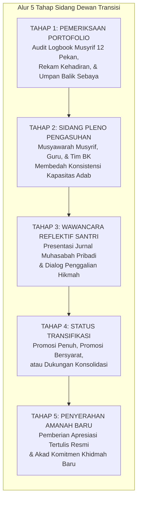

# BAB 15: MEKANISME TRANSISI, PORTOFOLIO SANTRI, DAN UPACARA KENAIKAN JENJANG

> يَا أَيُّهَا النَّاسُ إِنَّا خَلَقْنَاكُمْ مِنْ ذَكَرٍ وَأُنْثَىٰ وَجَعَلْنَاكُمْ شُعُوبًا وَقَبَائِلَ لِتَعَارَفُوا ۚ إِنَّ أَكْرَمَكُمْ عِنْدَ اللَّهِ أَتْقَاكُمْ ۚ إِنَّ اللَّهَ عَلِيمٌ خَبِيرٌ
>
> *"Wahai manusia! Sungguh, Kami telah menciptakan kamu dari seorang laki-laki dan seorang perempuan, kemudian Kami jadikan kamu berbangsa-bangsa dan bersuku-suku agar kamu saling mengenal. Sesungguhnya yang paling mulia di antara kamu di sisi Allah ialah orang yang paling bertakwa di antara kamu. Sungguh, Allah Maha Mengetahui, Maha Teliti."*  
> — **QS. Al-Hujurat [49]: 13**[^1]

> مَنْ بَطَّأَ بِهِ عَمَلُهُ لَمْ يُسْرِعْ بِهِ نَسَبُهُ  
> *"Barang siapa yang diperlambat oleh amalnya, maka nasab (atau kedudukannya) tidak akan dapat mempercepatnya."*  
> — **Hadits Riwayat Muslim (No. 2699)**[^2]

---

### Pendahuluan

Surah Al-Hujurat ayat 13 di atas adalah piagam penumbangan segala bentuk kasta feodal. Al-Hafizh Ibnu Katsir dalam *Tafsir al-Qur'an al-'Azhim* menegaskan bahwa seluruh anak cucu Adam setara dalam martabat kemanusiaannya; Allah meruntuhkan kesombongan nasab, senioritas angkatan, dan kasta sosial. Satu-satunya timbangan kemuliaan yang hakiki di sisi Allah adalah ketakwaan (*at-taqwa*). Di hadapan mekanisme transisi jenjang TUMBUH, lamanya seorang santri menetap di pondok tidak bernilai sebutir debu pun jika tidak disertai oleh ketakwaan amal, kejernihan akhlak, dan keluhuran adab melayani sesama.[^1]

Salah satu bahaya terbesar dalam setiap sistem penjenjangan pendidikan asrama adalah jebakan formalisme administratif dan stratifikasi sosial yang feodalistik. Sering kali, perpindahan seorang santri dari tingkat junior ke tingkat senior semata-mata dipicu oleh pergantian tahun kalender atau naiknya kelas akademis di madrasah (*time-served promotion*). Pola kenaikan otomatis ini menciptakan ilusi kematangan: seorang santri mengenakan lencana senioritas padahal kapasitas regulasi diri, adab, dan kestabilan emosinya masih rapuh. Akibatnya, senioritas berubah menjadi hak istimewa kosong yang melahirkan arogansi, relasi kuasa intimidatif terhadap santri baru, dan runtuhnya integritas tarbiyah pesantren.

Sistem TUMBUH merombak paradigma tersebut secara fundamental. Penjenjangan Kemandirian (J1–J4) bukanlah penanda usia biologis ataupun kelas madrasah, melainkan **arsitektur progresi kapasitas adab dan kemandirian nyata yang diuji melalui bukti autentik**. Kenaikan jenjang bukanlah hadiah cuma-cuma, melainkan pengakuan atas kesiapan jiwa memikul tanggung jawab yang lebih besar serta kesediaan melayani lebih banyak orang.

Bab ini membedah mekanisme transisi antar-jenjang secara menyeluruh: mulai dari prinsip kelayakan transisi berbasis bukti portofolio multidimensional, tata kelola sidang dewan pengasuhan (*gateway review*), prinsip reversibilitas transisi yang menjaga martabat santri, hingga rekayasa budaya upacara pengukuhan kenaikan jenjang (*rites of passage*) yang mendidik jiwa santri agar terbebas dari racun kasta sosial feodalistik.

---

### 15.1 Indikator Kelayakan Transisi Jenjang Berbasis Bukti Autentik

Dalam arsitektur TUMBUH, transisi dari satu jenjang ke jenjang berikutnya (misalnya dari J1 ke J2, atau dari J2 ke J3) dikendalikan oleh gerbang evaluasi ketat yang disebut sebagai **Gerbang Transisi (*Gateway Review*)**[^3]. Gerbang ini dirancang untuk memastikan bahwa perancah (*scaffolding*) dukungan eksternal hanya ditarik mundur ketika kapasitas internal santri memang telah terbukti ajek dan stabil.

#### 1. Melampaui Jebakan Waktu Kalender (*Beyond Time-Served Promotion*)
Prinsip pertama dalam evaluasi transisi TUMBUH adalah: **Waktu menetap di asrama adalah syarat perlu (*necessary condition*), namun bukan syarat cukup (*sufficient condition*) untuk kenaikan jenjang.**

Dua orang santri yang masuk pondok pada hari yang sama dan duduk di kelas madrasah yang sama bisa jadi memiliki kecepatan progresi karakter yang berbeda:
- Santri A mungkin telah menunjukkan konsistensi kemandirian bangun malam, ketertiban lemari, dan kepedulian sosial pada bulan keenam sehingga siap bertransisi dari J1 ke J2.
- Santri B pada bulan keenam mungkin masih berjuang keras dengan kelekatan emosional terhadap rumah (*homesickness* berkepanjangan) atau impuls keterlambatan salat subuh, sehingga masih membutuhkan perancah pendampingan penuh J1.

Memaksa Santri B naik ke jenjang J2 hanya karena "sudah satu semester" adalah kezaliman pedagogis yang membahayakan jiwanya: santri akan merasa kewalahan (*flooded*), kehilangan rasa aman, dan berisiko mengalami kemunduran perilaku drastis karena bantuan musyrif ditarik sebelum kapasitas batinnya terbentuk.

#### 2. Empat Pilar Bukti Portofolio Autentik Santri
Kelayakan seorang santri untuk melangkah ke jenjang berikutnya dinilai secara komprehensif melalui portofolio adab multidimensional yang merangkum empat pilar bukti autentik (Wiggins & McTighe, 2005)[^4]:

```text
                           PORTOFOLIO ADAB MULTIDIMENSIONAL
                                          │
         ┌──────────────────┬─────────────┴─────────────┬──────────────────┐
         ↓                  ↓                           ↓                  ↓
  1. LOGBOOK MUSYRIF   2. REFLEKSI DIRI          3. NOMINASI SEBAYA   4. PENGUJIAN SITUASIONAL
     (Data Objektif      (Metakognisi &             (Validasi Sosial     (Uji Stabilitas &
     Perilaku Harian)     Kejujuran Kalbu)           Teman Sekamar)       Integritas Nyata)
```

1. **Logbook Pengamatan Harian Musyrif (*Objective Behavioral Records*):**  
   Bukan sekadar kesan subjektif atau ingatan sesaat musyrif, melainkan data keteraturan harian yang tercatat secara konsisten selama rentang waktu minimal 8 hingga 12 pekan:
   - Rekam jejak ketepatan waktu hadir di saf pertama masjid sebelum iqamah.
   - Kerapian ruang tidur pribadi dan keterlibatan dalam piket kebersihan kamar.
   - Frekuensi pelibatan dalam perselisihan antar-santri serta respons saat menerima teguran.
2. **Jurnal Refleksi Diri Santri (*Metacognitive Self-Assessment*):**  
   Santri menyusun lembar refleksi pribadi yang menggambarkan perjalanan batinnya:
   - Kesadaran santri dalam mengidentifikasi titik lemah pribadinya (misalnya: kecenderungan menunda mencuci pakaian atau mudah marah saat lelah).
   - Strategi mandiri yang telah ia kembangkan untuk mengatasi kelemahan tersebut.
   - Kejujuran kalbu santri dalam mengakui kesalahan tanpa melempar kambing hitam kepada orang lain.
3. **Validasi Sosial Teman Sebaya (*Peer Nomination and Feedback*):**  
   Karakter sejati seseorang tercermin dari bagaimana ia memperlakukan orang-orang di sekitarnya dalam keseharian asrama yang akrab:
   - Apakah teman sekamar merasa aman, tenang, dan terbantu dengan keberadaannya?
   - Apakah santri bersikap adil dalam berbagi fasilitas kamar (seperti gantungan baju, giliran mandi, atau ruang belajar)?
   - Lembar masukan tertutup dari teman sekamar memberikan gambaran apakah santri berperilaku santun hanya di depan guru (*hypocrisy/nifaq*) atau memang berakhlak mulia kepada sesama.
4. **Pengujian Situasional Nyata (*Real-World Situational Probes*):**  
   Santri diuji dalam skenario tantangan alami tanpa ia sadari sebagai ujian formal:
   - Memantau perilakunya saat ditinggal sendiri di asrama ketika jam bebas akhir pekan.
   - Mengamati responsnya ketika menghadapi situasi frustrasi, antrean panjang di kantin, atau ketika barang kesayangannya tidak sengaja tersenggol kawan.

#### 3. Tata Kelola Sidang Dewan Pengasuhan (Gateway Committee)
Keputusan kenaikan jenjang tidak pernah ditentukan secara sepihak oleh satu orang musyrif guna menghindari bias subjektivitas, favoritisme, atau sentimen pribadi. Keputusan diambil dalam **Sidang Dewan Pengasuhan (*Gateway Council*)** yang dihadiri oleh seluruh pemangku kepentingan secara syura yang adil (Ibnu Jama'ah, 2012)[^5]:
- Musyrif Kamar dan Kepala Asrama.
- Perwakilan Guru Madrasah (pengampu kelas).
- Konselor Bimbingan Konseling (BK) Pondok.
- Pimpinan Pengasuhan Santri.

Sidang Dewan Pengasuhan menimbang portofolio bukti dan memutuskan salah satu dari tiga ketetapan:
1. **Promosi Penuh (*Full Transition*):** Santri dinyatakan matang dan resmi dikukuhkan naik ke jenjang berikutnya dengan penyesuaian hak kemandirian dan perluasan mandat amanah.
2. **Promosi Bersyarat dengan Pemantauan Uji Coba (*Provisional Transition with Trial Monitoring*):** Santri menunjukkan potensi besar namun masih memiliki indikator minor yang perlu diperkuat. Santri diberi masa transisi percobaan selama 4 pekan dengan target capaian spesifik sebelum dikukuhkan secara penuh.
3. **Dukungan Konsolidasi (*Consolidation Support*):** Dewan menilai bahwa perancah dukungan eksternal belum siap untuk dilepas. Santri tetap berada pada jenjang saat ini dengan rancangan intervensi perbaikan yang disesuaikan. Keputusan ini dikomunikasikan secara privat, penuh kasih sayang, dan tanpa stigma kegagalan (*no shame policy*).

#### 4. Prinsip Reversibilitas Transisi yang Bermartabat (Dignified Reversibility)
Dalam sistem TUMBUH, jenjang kemandirian bukanlah kasta kaku yang melekat seumur hidup. Prinsip pedagogis menegaskan bahwa perkembangan jiwa manusia dapat mengalami dinamika pasang surut (*regression under stress*). Santri yang telah berada di J3 bisa jadi mengalami krisis emosional, tekanan keluarga, atau penurunan motivasi spiritual drastis yang membuatnya tidak mampu lagi menjalankan fungsi mandirinya secara tertib.

Jika hal ini terjadi, sistem memberlakukan protokol **Reversibilitas yang Bermartabat (*Dignified Scaffolding Re-entry*)**:
- Penurunan jenjang sementara bukanlah bentuk hukuman (*punishment*), melainkan **pemberian kembali alat bantu perancah (*re-scaffolding*)** agar santri tidak runtuh di bawah beban yang melebihi daya tampungnya saat itu.
- Proses ini dilakukan secara rahasia dan penuh empati melalui konseling intensif bersama Tim BK dan musyrif.
- Santri tidak dipermalukan di depan umum, tidak dicabut hak-hak dasarnya sebagai santri yang mulia, dan difasilitasi dengan peta jalan pemulihan (*rehabilitation roadmap*) yang jelas untuk kembali naik ke jenjang sebelumnya setelah kapasitasnya pulih.

---

### 15.2 Menghindari Jebakan Kasta Sosial: Progresi Sebagai Tangga Pelayanan

Bahaya terbesar dari penjenjangan asrama adalah metamorfosis penjenjangan menjadi stratifikasi kasta sosial feodal. Ketika santri senior merasa memiliki kasta lebih tinggi dibanding santri junior, bibit tirani mulai bertunas: lahir pemaksaan adik kelas mencuci pakaian senior, jatah makan yang diserobot, intimidasi di kamar mandi, hingga kekerasan fisik dalam tradisi perpeloncoan malam hari.

Sistem TUMBUH memutus rantai kezaliman kultural ini melalui rekayasa tradisi yang menanamkan kesadaran bahwa: **Semakin tinggi jenjang kemandirian seorang santri, semakin berat amanah khidmahnya dan semakin rendah hatinya dalam melayani sesama.**

```text
       PARADIGMA PENJENJANGAN TUMBUH vs SISTEM ASRAMA FEODAL
┌─────────────────────────────────┬─────────────────────────────────┐
│     SISTEM ASRAMA FEODAL        │     SISTEM PENJENJANGAN TUMBUH  │
├─────────────────────────────────┼─────────────────────────────────┤
│ • Senioritas memberi hak untuk  │ • Senioritas memberi amanah     │
│   dilayani dan disembah.        │   untuk melayani (Khidmah).     │
│ • Menuntut adik kelas tunduk    │ • Menuntut diri sendiri memberi │
│   dan menanggung beban senior.  │   keteladanan (Qudwah Hasanah). │
│ • Sanksi fisik & intimidasi     │ • Bimbingan empati, pelindung   │
│   sebagai alat kekuasaan.       │   adik kelas yang rapuh.        │
│ • Puncak tangga: Tirani Kasta.  │ • Puncak tangga: Tawadhu' Hati. │
└─────────────────────────────────┴─────────────────────────────────┘
```

#### 1. Rekayasa Upacara Pengukuhan Jenjang (Rites of Passage)
Upacara kenaikan jenjang (*Rites of Passage*) di pesantren TUMBUH dirancang bukan sebagai perayaan arogansi atau pawai kemegahan diri, melainkan sebagai majelis muhasabah batin, doa khusyuk, dan penyerahan amanah khidmah di hadapan seluruh civitas pondok (van Gennep, 1960)[^6]:
- **Pelaksanaan Khidmat di Masjid:** Upacara digelar di dalam masjid ba'da salat subuh berjamaah, diawali dengan khataman Al-Qur'an dan zikir bersama untuk mensucikan niat.
- **Simbolisme Penyerahan Amanah:** Santri yang naik jenjang tidak diberikan atribut-atribut militeristik atau seragam kasta yang mencolok. Mereka menerima simbol amanah pelayanan—seperti mushaf Al-Qur'an saku, selendang khidmah asrama, atau buku panduan bimbingan adik kelas.
- **Ikrar Khidmah Santri:** Santri yang dikukuhkan mengucapkan janji setia bukan untuk menguasai pondok, melainkan ikrar untuk menjadi pelayan dan pelindung bagi adik-adik kelas mereka:
  $$\text{"Kami berikrar di hadapan Allah untuk merendahkan hati kami di hadapan saudara kami,}$$
  $$\text{menjadi perisai bagi yang lemah, pembimbing bagi yang lalai,}$$
  $$\text{dan pelayan kebaikan di seluruh sudut pondok ini demi mencari keridhaan Ilahi."}$$

#### 2. Dekonstruksi Hak Istimewa Feodal (Eliminasi Privilese Semu)
Di lingkungan asrama TUMBUH diberlakukan aturan kelembagaan yang tegas untuk membongkar privilese-privilese feodal yang sering disalahgunakan oleh santri senior:
1. **Kesetaraan Mutlak Fasilitas Dasar:** Tidak ada pemisahan kasta dalam fasilitas publik pondok. Santri Jenjang J4 dan santri J1 berdiri di antrean makan yang sama, mandi di tempat yang sama, dan duduk di saf salat berdasarkan siapa yang lebih dahulu datang ke masjid, bukan berdasarkan senioritas.
2. **Larangan Menyuruh Urusan Pribadi (*Zero Personal Servitude*):** Santri jenjang manapun diharamkan secara mutlak menyuruh santri lain untuk melayani kebutuhan pribadinya (mencuci baju, menyetrika, membelikan makanan di kantin, membawakan tas, atau membersihkan tempat tidurnya). Setiap santri wajib mengurus dirinya sendiri (*al-i'timad 'alan-nafs*). Pelanggaran terhadap prinsip ini diperlakukan sebagai pelanggaran adab berat yang dievaluasi langsung oleh dewan pengasuhan.
3. **Hak Istimewa yang Dibolehkan Bersifat Fungsional-Edukatif:** Satu-satunya privilese yang diberikan kepada santri jenjang tinggi (J3 dan J4) adalah privilese yang menunjang kapasitas keilmuan dan pelayanan mereka:
   - Akses jam peminjaman perpustakaan yang lebih longgar untuk riset dan telaah kitab turats.
   - Ruang diskusi kelompok kepemimpinan untuk merancang program asrama.
   - Kepercayaan mengelola ruang laboratorium dan halaqah takmir masjid.

#### 3. Mentoring Silang Antar-Jenjang (Cross-Cohort Fraternal Bond)
Untuk merekatkan ukhuwah islamiyah dan mengubur sekat kasta, sistem TUMBUH mendesain penataan kamar asrama yang terintegrasi:
- Kamar santri tidak diisolasi secara homogen berdasarkan angkatan masuk semata. Dalam unit-unit asrama tertentu, satu kamar dihuni oleh komposisi santri senior (J4/J3) yang bertindak sebagai kakak asuh bagi beberapa santri yunior (J1/J2).
- Santri senior bertanggung jawab secara moral atas kenyamanan adik asuhnya: memastikan adik kelas tidak telat makan, membantu mengoreksi tajwid bacaan Qur'annya sebelum setoran ke ustadz, dan menemaninya saat sakit di ruang kesehatan asrama.
- Ikatan persaudaraan yang terbangun di atas cinta karena Allah (*mahabbah fillah*) ini melahirkan kultur pesantren yang hangat, penuh ketenteraman jiwa (*bi'ah aminah*), dan bebas dari rasa takut.

---

### 15.3 Prosedur Operasional Baku (SOP) Sidang Dewan Transisi (Gateway Council)

Sidang Dewan Transisi (*Gateway Council*) adalah mahkamah pedagogis yang menentukan apakah seorang santri telah siap melangkah ke jenjang kemandirian berikutnya. Agar proses ini berjalan secara adil, transparan, dan bebas dari sentimen pribadi musyrif, sidang diselenggarakan melalui **Lima Tahap Terstruktur**:



Format Keputusan Dewan Transisi dituangkan dalam dokumen resmi **Berita Acara Kenaikan Jenjang Kemandirian (BAKJK)** yang mencantumkan skor triangulasi 8 Core Capacities serta rekomendasi area pertumbuhan yang masih perlu diperkuat di jenjang baru.

---

### 15.4 Ritus Simbolik Khidmah: Membasuh Telapak Kaki Adik Asuh

Puncak dari upacara pengukuhan Jenjang J4 adalah tradisi sakral yang bertujuan memusnahkan benih arogansi senioritas hingga ke akar-akarnya: **Ritus Khidmah Pembasuhan Kaki Adik Asuh (*Ghaslul Arjul wal-Khidmah*)**.

Di pelataran masjid pesantren, bakda salat subuh berjamaah di hadapan seluruh santri dan asatidz:
1. Para santri kelas tujuh (J1) yang baru beberapa bulan tinggal di pondok duduk bersila di atas tikar pandan.
2. Para santri senior kelas dua belas yang baru saja dikukuhkan sebagai Jenjang J4 melangkah ke depan, membawa baskom tembaga berisi air hangat yang diberi wewangian mawar dan daun bidara.
3. Di hadapan ratusan pasang mata yang hening membeku, para santri senior tersebut berlutut, menundukkan kepalanya, lalu **dengan kedua tangan mereka sendiri membasuh telapak kaki adik-adik kelas mereka**, membersihkannya dengan handuk bersih, lalu memeluknya seraya berbisik: *"Duhai adikku, kami adalah pelayan kalian. Jika kami bersikap zalim, ingatkanlah kami; dan jika kalian lelah, bersandarlah di pundak kami demi Allah."*

Tangisan haru selalu pecah di seluruh penjuru masjid setiap kali ritus ini berlangsung. Air mata yang tumpah menyapu seluruh bibit dendam dan feodalisme di asrama. Adik-adik kelas belajar arti cinta dan penghormatan tanpa rasa takut; sementara para senior belajar arti kepemimpinan profetik yang sesungguhnya: bahwa semakin tinggi derajat seseorang di sisi Allah, semakin rendah hatinya dalam melayani hamba-hamba-Nya.

---

### Rangkuman Intisari Bab 15

1. **Paradigma Kenaikan Berbasis Bukti:** Transisi jenjang kemandirian (J1–J4) tidak ditentukan oleh usia kalender atau kelas madrasah (*time-served*), melainkan melalui pembuktian kapasitas adab yang teruji secara stabil (*gateway review*).
2. **Portofolio Adab Multidimensional:** Keputusan transisi didasarkan pada empat pilar data autentik: logbook keteraturan harian musyrif, lembar refleksi diri metakognitif santri, masukan rahasia teman sekamar (*peer nomination*), dan uji stabilitas situasional nyata.
3. **Keputusan Dewan Pengasuhan yang Adil:** Sidang Dewan Pengasuhan melibatkan musyrif, guru madrasah, konselor BK, dan pimpinan pondok untuk menghasilkan keputusan obyektif: Promosi Penuh, Promosi Bersyarat dengan Uji Coba, atau Dukungan Konsolidasi tanpa stigma kegagalan.
4. **Prinsip Reversibilitas Bermartabat:** Penurunan jenjang sementara saat santri mengalami regresi krisis emosional adalah bentuk pemberian perancah bantuan kembali (*re-scaffolding*), bukan penghukuman publik. Dilakukan dengan menjaga kerahasiaan dan martabat santri.
5. **Anti-Feodalisme dan Budaya Khidmah:** Upacara kenaikan jenjang (*rites of passage*) didesain sebagai penyerahan amanah pelayanan umat (*khidmah*), bukan panggung arogansi kekuasaan. Menghapus seluruh privilese feodal, melarang perbudakan santri junior, serta menyatukan santri senior dan adik kelas dalam ikatan persaudaraan kakak-adik asuh yang saling menguatkan.

---

Mekanisme transisi jenjang menuntut bukti-bukti autentik pertumbuhan jiwa santri. Namun, bagaimana cara kita menilai dan mengukur adab tanpa mereduksi keluhuran jiwa manusia menjadi sekadar angka-angka rapor yang mati? Bagaimana filosofi asesmen Islam memandang proses evaluasi karakter tanpa melabeli santri? 

Di Bab 16, kita melangkah ke Bagian VII untuk membedah Filosofi Asesmen Karakter: Mengukur untuk Menumbuhkan, Bukan Melabeli.

---

### Catatan Kaki & Rujukan Akademik

[^1]: Al-Qur'an al-Karim, Surah Al-Hujurat [49]: 13.
[^2]: Muslim bin al-Hajjaj an-Naisaburi, *Shahih Muslim*, Kitab adz-Dzikr wa ad-Du'a' wa at-Taubah, Bab Fadhl al-Ijtima' 'ala Tilawatil Qur'an wa 'ala adz-Dzikr, hadits no. 2699.
[^3]: Repositori TUMBUH v2.0.0, Dokumen Fundamental: `01_FUNDAMENTAL/04_PROGRESSION/06 Transition Criteria/03-Transition-Criteria-Design.md` dan `01-Progression-Gates-and-Thresholds.md`.
[^4]: Grant Wiggins & Jay McTighe, *Understanding by Design* (Alexandria: ASCD, 2005), hlm. 152–175 mengenai penilaian autentik (*authentic assessment*) dan portofolio bukti unjuk kerja nyata.
[^5]: Badruddin Muhammad bin Ibrahim Ibnu Jama'ah, *Tadzkirat as-Sami' wa al-Mutakallim fi Adab al-'Alim wa al-Muta'allim*, Tahqiq: Dr. Muhammad bin Mahdi al-Ajmi (Beirut: Dar al-Basyair al-Islamiyyah, 2012), hlm. 82–95 mengenai etika musyawarah para pendidik dalam mengevaluasi murid secara adil.
[^6]: Arnold van Gennep, *The Rites of Passage*, diterjemahkan oleh Monika B. Vizedom & Gabrielle L. Caffee (Chicago: The University of Chicago Press, 1960), hlm. 1–25 mengenai struktur tiga fase ritus transisi (*separation, liminality, incorporation*).
