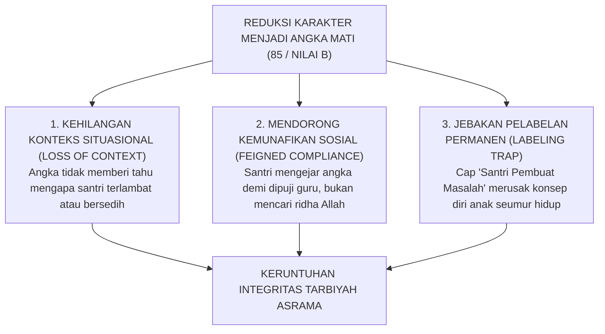
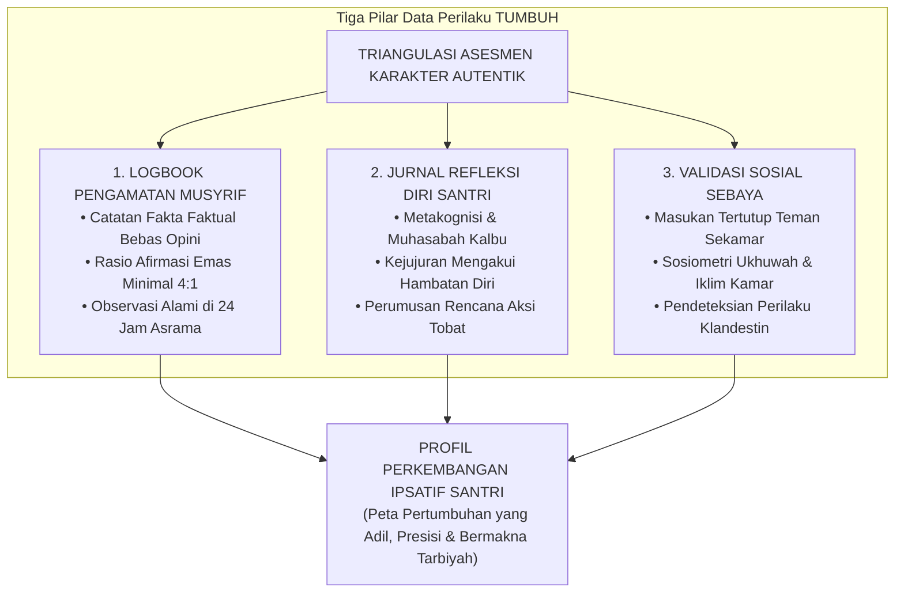
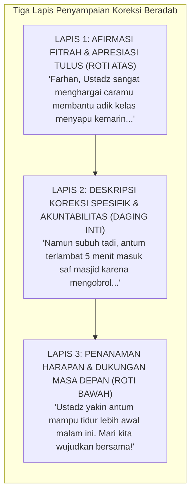

# BAB 16: FILOSOFI ASESMEN KARAKTER: MENGUKUR UNTUK MENUMBUHKAN, BUKAN MELABELI
## Menolak Angka Rapor Mati, Membedah Triangulasi Bukti Autentik, dan Menjadikan Evaluasi Adab Sebagai Cermin Kejernihan Fitrah

> وَقُلِ اعْمَلُوا فَسَيَرَى اللَّهُ عَمَلَكُمْ وَرَسُولُهُ وَالْمُؤْمِنُونَ ۖ وَسَتُرَدُّونَ إِلَىٰ عَالِمِ الْغَيْبِ وَالشَّهَادَةِ فَيُنَبِّئُكُمْ بِمَا كُنْتُمْ تَعْمَلُونَ
>
> *"Dan katakanlah: 'Bekerjalah kamu, maka Allah dan Rasul-Nya serta orang-orang mukmin akan melihat pekerjaanmu itu, dan kamu akan dikembalikan kepada (Allah) Yang Mengetahui akan yang ghaib dan yang nyata, lalu diberitakan-Nya kepada kamu apa yang telah kamu kerjakan'."*  
> — **QS. At-Taubah [9]: 105**[^1]

> حَاسِبُوا أَنْفُسَكُمْ قَبْلَ أَنْ تُحَاسَبُوا، وَزِنُوا أَنْفُسَكُمْ قَبْلَ أَنْ تُوزَنُوا، فَإِنَّهُ أَهْوَنُ عَلَيْكُمْ فِي الْحِسَابِ غَدًا
>
> *"Hisablah (evaluasilah) diri kalian sendiri sebelum kalian dihisab di akhirat kelak, dan timbanglah amal perbuatan kalian sebelum kalian ditimbang; karena sesungguhnya hisab kalian esok hari akan terasa jauh lebih ringan jika kalian terbiasa menghisab diri kalian hari ini."*  
> — **Atsar Sayyidina 'Umar bin Al-Khattab رضي الله عنه**[^2]

---

### Prolog: Selembar Kertas di Bawah Tangisan Senja

Sore itu di serambi kantor madrasah, di penghujung semester ganjil, seorang wali santri paruh baya duduk bersimpuh dengan tangan gemetar. Di hadapannya terbentang selembar kertas rapor bersampul hijau tua. Di kolom "Nilai Kepribadian dan Akhlak", tercetak sebuah huruf kapital dingin berwarna merah kusam: **C (Cukup / Angka 68)**. Di bawah nilai tersebut, tertera sebuah catatan stempel birokratis yang singkat dan mematikan: *"Kurang disiplin, sering melanggar jam malam asrama, dan kurang takzim kepada pembina."*

Ayah dari santri itu menundukkan kepalanya dalam-dalam. Matanya nanar berkaca-kaca, dadanya sesak oleh rasa malu yang teramat perih. Sementara di sudut lorong, putranya—seorang anak usia empat belas tahun yang selama satu semester terakhir berjuang mati-matian merawat teman sekamarnya yang sakit menahun, anak yang setiap malam menyelinap ke masjid untuk menangis dalam sujud tahajud memohon ampunan Allah—berdiri terpaku dengan wajah pucat pasi. 

Satu huruf "C" dan angka "68" itu telah mereduksi enam bulan pergulatan jiwanya, ratusan tetes keringat perjuangannya menata hawa nafsu, dan seluruh kemuliaan fitrahnya menjadi seonggok vonis kegagalan.

Sang anak menatap gurunya dengan tatapan luka batin yang tak tersembuhkan. Dalam hatinya berkecamuk sebuah kesimpulan yang teramat getir:  
*"Di pondok ini, ribuan kebaikan yang kulakukan dalam kesunyian tidak ada artinya. Mereka hanya melihat saat kakiku tersandung. Jika nilai adabku sudah dicap huruf C, untuk apa lagi aku berjuang menjadi orang baik?"*

Tragedi sore itu bukanlah anomali tunggal. Itu adalah potret kebangkrutan metodologis yang melanda dunia evaluasi pendidikan pesantren modern. Ketika asesmen karakter diperlakukan laksana vonis hakim di pengadilan pidana atau formalitas stempel administratif rapor, maka evaluasi tersebut sesungguhnya telah kehilangan ruh syariatnya. Ia tidak lagi menumbuhkan, melainkan membunuh harapan; ia tidak lagi membimbing, melainkan mencap dan mempermalukan.

Bab ini membedah secara radikal arsitektur filosofis dan operasional asesmen karakter dalam ekosistem TUMBUH: mendekonstruksi reduksionisme angka mati, menegakkan paradigma asesmen formatif-tarbawi sebagai cermin pemurni jiwa (*al-mir'ah al-jalliyyah*), merumuskan metodologi pengumpulan data multi-sumber yang objektif dan bebas prasangka, serta menjaga kesucian kerahasiaan data santri sebagai amanah spiritual yang agung.

---

### 16.1 Mengapa Karakter Tidak Boleh Dihitung Seperti Nilai Matematika?

Dalam sains pengukuran psikometrik modern dan tradisi tasawuf Islam, karakter manusia adalah entitas kualitatif yang hidup (*living dynamic entity*). Karakter berakar di dalam relung kalbu (*qalb*), diolah oleh nalar akal (*'aql*), dipengaruhi oleh fluktuasi hormon biologis otak, dan termanifestasi ke dalam perilaku nyata di tengah situasi sosial yang sangat dinamis.

Merangkum seluruh kompleksitas jiwa seorang anak ke dalam angka tunggal kuantitatif—seperti memberi angka "85" untuk kejujuran atau "70" untuk adab—adalah **kegagalan nalar reduksionis (*reductionist fallacy*)** yang membawa malapetaka pedagogis:



#### 1. Kehilangan Konteks Eksistensial (Loss of Contextual Reality)
Angka kuantitatif pada dasarnya adalah bahasa bisu yang buta konteks:
- Angka "70" pada kolom kedisiplinan tidak memberi tahu para asatidz apakah santri terlambat salat subuh karena ia begadang mengobrol sia-sia, ataukah karena ia semalaman terjaga mengompres dahi adik kelasnya yang demam tinggi di ruang bilik.
- Angka tidak memotret **arah vektor pertumbuhan (*developmental trajectory*)**: apakah anak yang mendapat nilai 70 itu adalah anak yang dahulunya berada di angka 40 lalu berjuang luar biasa hingga naik ke angka 70, ataukah anak yang awalnya berada di angka 95 lalu merosot tajam karena putus asa?

Ketika sistem penilaian mencabut konteks dari perilaku, sistem tersebut telah berbuat zalim: ia memperlakukan manusia laksana mesin produksi pabrik.

#### 2. Menumbuhkan Bibit Kemunafikan Sosial (The Breeding of Nifaq)
Ketika ukuran keberhasilan adab diukur dari tingginya angka rapor atau minimnya catatan buku hitam, maka fokus santri akan bergeser dari **pencarian keridhaan Allah (*Ikhlas*)** menuju **rekayasa pencitraan lahiriah di depan manusia (*Riya' dan Nifaq*)**.

Santri yang cerdas secara intrik akan mempelajari celah sistem: ia akan menampilkan wajah paling santun, membungkukkan badan paling rendah saat berpapasan dengan ustadz, dan bersuara paling lantang saat membaca zikir jamaah. Namun begitu ia berada di lorong belakang asrama yang tak terjangkau pandangan pembina, topeng kesantunan itu tanggal seketika: ia mencaci temannya, menyerobot antrean, dan mengambil hak saudaranya tanpa ragu. 

Sistem penilaian kuantitatif semu telah berhasil mencetak manusia-manusia munafik: orang-orang yang mahir memanipulasi data lahiriah demi mengamankan nilai rapor yang tinggi.

#### 3. Bahaya Pelabelan Permanen (The Golem and Pygmalion Effect)
Dalam psikologi sosial, Robert Rosenthal dan Lenore Jacobson membuktikan secara empiris bahaya dari **Ramalan yang Mewujud Sendiri (*The Self-Fulfilling Prophecy*)**[^3].

Ketika seorang santri diberi nilai kepribadian rendah atau secara informal dicap oleh dewan guru sebagai "anak bermasalah", label negatif tersebut meresap ke dalam alam bawah sadarnya. Santri menyimpulkan: *"Para ustadz sudah menganggapku anak nakal. Tidak ada gunanya aku berusaha berbuat baik, karena cap itu tidak akan pernah hilang."* 

Akibatnya, santri tersebut justru mengukuhkan identitas negatifnya: ia bertindak semakin liar, semakin membangkang, dan semakin agresif demi memvalidasi label yang telah disematkan lingkungan kepadanya. Sistem evaluasi yang keliru telah menjadi pabrik yang memproduksi pelaku penyimpangan baru.

---

### 16.2 Hakikat Asesmen Formatif-Tarbawi: Cermin Jernih Penuntun Jiwa

Model TUMBUH merombak paradigma tersebut secara revolusioner dengan menegakkan **Asesmen Formatif-Tarbawi**. Berbeda dengan asesmen sumatif yang bertindak laksana hakim di akhir persidangan yang hanya menjatuhkan vonis vonis bersalah atau tidak bersalah, asesmen formatif bertindak laksana **tabib jiwa (*thabibul qulub*)** yang memeriksa denyut nadi spiritual dan emosional santri secara berkala guna merumuskan nutrisi bimbingan yang tepat.

```text
               PERBANDINGAN PARADIGMA PENILAIAN KARAKTER
┌─────────────────────────────────┬─────────────────────────────────┐
│ ASESMEN POLISIONAL / SUMATIF    │ ASESMEN FORMATIF-TARBAWI TUMBUH │
│ (Paradigma Menghakimi)          │ (Paradigma Menumbuhkan Fitrah)  │
├─────────────────────────────────┼─────────────────────────────────┤
│ • Fokus pada masa lalu:         │ • Fokus pada masa depan:        │
│   Menghitung dosa & kesalahan.  │   Memetakan potensi & kemajuan. │
│ • Instrumen: Angka mati rapor   │ • Instrumen: Rubrik deskriptor  │
│   dan buku poin minus hitam.    │   perilaku autentik & portofolio│
│ • Posisi Pendidik: Hakim yang   │ • Posisi Pendidik: Cermin jernih│
│   curiga dan siap menghukum.    │   yang memantulkan fakta murni. │
│ • Hasil Akhir: Stigma permanen, │ • Hasil Akhir: Kesadaran diri   │
│   dendam batin, atau kemunafikan│   (*yaqzhah*), harapan & tobat. │
└─────────────────────────────────┴─────────────────────────────────┘
```

Prinsip dasar asesmen formatif berpijak kokoh pada sabda agung baginda Rasulullah ﷺ:

$$\text{الْمُؤْمِنُ مِرْآةُ أَخِيهِ الْمُؤْمِنِ}$$

> *"Seorang mukmin adalah cermin bagi saudaranya yang mukmin."*  
> (HR. Abu Dawud no. 4918 dan At-Tirmidzi no. 1928, sanad hasan)[^4]

Renungkanlah secara mendalam analogi kenabian tentang **Cermin (*Al-Mir'ah*)**:
- Sebuah cermin tidak pernah berteriak mencaci pemilik wajah: *"Wajahmu jelek sekali! Kenapa ada noda hitam di pipimu?!"*.
- Sebuah cermin tidak pernah menyimpan dendam atau menyebarkan aib: ketika pemilik wajah melangkah pergi, cermin tidak menyimpan bayangan noda tersebut untuk diperlihatkan kepada orang lain yang melintas sesudahnya.
- Cermin hanya memantulkan kenyataan secara jujur, objektif, dan proporsional pada detik itu juga: jika ada kotoran debu di kening, cermin menunjukkannya dengan tenang agar pemilik wajah dapat mengambil air wudhu untuk membasuhnya hingga bersih kembali.

Demikianlah fungsi sejati asesmen karakter TUMBUH: menjadi cermin jernih bagi santri dan musyrif untuk melihat di mana letak kekuatan fitrahnya yang patut disyukuri, dan di mana letak kerapuhan nafsunya yang wajib dibimbing dan disembuhkan bersama dengan ilmu dan kasih sayang.

---

### 16.3 Metode Triangulasi Bukti Autentik: Mengikis Bias Subjektivitas

Karakter manusia tidak pernah dapat dipotret secara adil jika hanya mengandalkan ingatan sesaat seorang pembina yang sedang lelah. Model TUMBUH menerapkan metode **Triangulasi Bukti Autentik Multi-Sumber (*Multi-Source Authentic Evidence*)**: memadukan tiga sumber data independen yang saling mengoreksi dan melengkapi.



#### 1. Logbook Harian Musyrif: Standar Penulisan Fakta Bebas Opini
Logbook musyrif adalah rekaman harian yang mencatat dinamika santri di asrama. Namun, logbook ini kerap kali rusak menjadi "buku gosip" karena diisi dengan prasangka emosional pembina.

TUMBUH menetapkan pedoman baku pemisahan antara **Fakta Teramati (*Observable Fact*)** dan **Interpretasi Subjektif (*Subjective Interpretation*)**:

```text
               STANDAR PENULISAN DOKUMEN LOGBOOK TUMBUH
┌─────────────────────────────────┬─────────────────────────────────┐
│ CATATAN RUSAK (TERKONTAMINASI)  │ CATATAN BAKU STANDAR TUMBUH     │
├─────────────────────────────────┼─────────────────────────────────┤
│ "Ahmad hari ini sangat pembangkang│ "Pukul 04.30 WIB, Ahmad masih │
│ dan malas salat subuh. Wajahnya │ berbaring setelah dipanggil 2   │
│ menunjukkan ketidaksenangan     │ kali. Ketika dibangunkan ketiga │
│ kepada pembina."                │ kalinya, Ahmad membalikkan badan│
│                                 │ dan bergumam pelan selama 3     │
│ [BAHAYA: Melabeli, menghakimi   │ menit sebelum bangkit berwudhu."│
│ motif batin, menutup pintu      │                                 │
│ penyelidikan sebab masalah].    │ [FAKTA MURNI: Terukur durasi,   │
│                                 │ waktu, dan perilaku fisik].     │
├─────────────────────────────────┼─────────────────────────────────┤
│ "Zaki anak yang egois dan sombong│ "Selama 3 hari berturut-turut, │
│ tidak mau membaur di kamar."    │ Zaki memilih makan malam sendiri│
│                                 │ di sudut ranjang dan tidak ikut │
│ [BAHAYA: Pembunuhan karakter,   │ serta dalam obrolan lingkaran   │
│ mengabaikan kemungkinan anak    │ kamar."                         │
│ sedang depresi/homesick berat]. │                                 │
│                                 │ [FAKTA MURNI: Membuka ruang bagi│
│                                 │ konselor BK untuk menelusuri].  │
└─────────────────────────────────┴─────────────────────────────────┘
```

#### 2. Penegakan Rasio Afirmasi Emas Minimal 4:1 (The Golden 4:1 Ratio)
Menghancurkan paradigma kepolisian asrama yang hanya memburu noda, sistem TUMBUH mewajibkan hukum pengamatan positif: **Untuk setiap 1 catatan kekurangan atau pelanggaran adab yang dicatat oleh musyrif, musyrif wajib mengidentifikasi dan mencatat minimal 4 inisiatif kebaikan atau kemajuan yang telah dilakukan oleh santri yang sama**.

Mencatat santri yang berinisiatif merapikan sandal adik kelas, santri yang meminjamkan sabunnya dengan ikhlas, atau santri yang menahan diri dari membalas ejekan kawan melatih mata musyrif untuk selalu **mencari fitrah kebaikan (*finding the seeds of light*)**, bukan menjadi burung bangkai yang hanya mencari bangkai kesalahan di tengah asrama.

#### 3. Jurnal Muhasabah Kalbu (Metacognitive Self-Reflection)
Data pengamatan luar disempurnakan dengan lembar muhasabah pribadi yang diisi santri secara terjadwal:
- Santri dilatih bertanya kepada kalbunya: *"Dalam situasi apa pekan ini aku merasa paling sulit menahan amarah? Apa yang sesungguhnya memicu amarahku? Dan bagaimana caraku meminta maaf kepada saudaraku yang telah tersakiti?"*
- Refleksi ini melatih fungsi korteks prafrontal dan menghidupkan fungsi *an-nafs al-lawwamah*—jiwa yang peka mengevaluasi dirinya sendiri di hadapan pengadilan Allah.

#### 4. Validasi Sosial Teman Sebaya (Peer Cross-Validation)
Karakter sejati seseorang tercermin dari bagaimana ia memperlakukan orang-orang yang status sosialnya setara dengannya dalam keseharian kamar yang akrab. Melalui angket sosiometri berkala yang bersifat rahasia, santri memberikan penilaian apresiatif terhadap teman sekamarnya:
- *"Siapa kawan sekamar yang kehadirannya paling membuatmu merasa aman dan nyaman?"*
- *"Siapa kawan yang paling sering membantumu saat kamu kesulitan belajar atau mencuci pakaian?"*

Jika seorang santri selalu dinilai sangat santun oleh guru di kelas madrasah, namun seluruh teman sekamarnya melaporkan bahwa di kamar ia gemar memeras, membentak, dan menyerobot antrean, maka data triangulasi ini membongkar kepalsuan pencitraan tersebut secara akurat.

---

### 16.4 Etika Sakral dan Perlindungan Kerahasiaan Data Adab Santri

Data perkembangan jiwa, catatan pelanggaran moral, dan riwayat bimbingan konseling santri bukanlah data administratif biasa. Dalam pandangan Islam, data ini adalah **Rahasia Kehormatan yang Wajib Dijaga (*Amanah as-Sirr wa Satrul 'Aurah*)**[^5].

Membocorkan catatan pelanggaran santri kepada pihak yang tidak berhak adalah dosa besar dan pengkhianatan tarbiyah yang keji:

1. **Haramnya Ghībah Institusional:**  
   Dilarang keras membicarakan kelemahan, kasus pelanggaran, atau dosa santri dalam obrolan santai antar-asatidz di kantin, di ruang tamu guru, atau di grup-grup percakapan digital non-formal. Informasi hanya boleh dibuka kepada pihak-pihak yang memegang mandat pembinaan langsung (*need-to-know basis*).
2. **Larangan Mempermalukan Orang Tua:**  
   Catatan logbook asrama tidak boleh dijadikan "senjata penyerang" untuk mempermalukan atau memojokkan orang tua saat momentum penerimaan laporan perkembangan santri. Data disajikan dengan narasi kemitraan yang penuh optimisme: memetakan potensi ananda dan menyepakati langkah kolaborasi antara rumah dan pondok.
3. **Protokol Keamanan Berkas Digital dan Fisik:**  
   Seluruh rekam data logbook dan catatan BK dikelola dalam sistem terenkripsi dengan otentikasi ganda. Catatan kasus-kasus sensitif Tier 3 (seperti riwayat trauma kekerasan seksual atau krisis depresi berat) dikunci dalam brankas khusus di bawah wewenang eksklusif Kepala Bagian BK dan Pengasuh Utama Pondok, guna melindungi masa depan santri agar ia tidak menanggung aib masa lalunya saat telah dewasa dan terjun memimpin masyarakat.

---

### 16.5 Format Instrumen Rubrik Pengamatan Holistik Musyrif Asrama

Untuk memandu para musyrif lapangan agar tidak bingung mencatat perilaku faktual, arsitektur TUMBUH menyusun format **Logbook Pengamatan Harian Berbasis Bukti**:

```text
                 LEMBAR PENGAMATAN ADAB HARIAN MUSYRIF (LPAHM)
┌────────────────────────────────────────────────────────────────────────┐
│ NAMA SANTRI  : ....................   KAMAR / KELOMPOK : ............. │
│ MINGGU KE-   : ....................   MUSYRIF PENDAMPING: ............ │
├────────────────────────────────────────────────────────────────────────┤
│ TANGGAL/WAKTU │ DESKRIPSI PERILAKU FAKTUAL      │ DOMAIN CC │ KATEGORI │
│               │ (OBJEKTIF TANPA ASUMSI MORAL)   │ TERKAIT   │ (+ / Δ)  │
├───────────────┼─────────────────────────────────┼───────────┼──────────┤
│ Sen, 04.15 WIB│ Bangun sendiri saat azan awal,  │ CC-01     │ (+) Pos  │
│               │ langsung merapikan sprei ranjang│ CC-05     │          │
├───────────────┼─────────────────────────────────┼───────────┼──────────┤
│ Sel, 16.30 WIB│ Meminjamkan gayung mandi kepada │ CC-07     │ (+) Pos  │
│               │ adik kelas yang belum mandi.    │ (Khidmah) │          │
├───────────────┼─────────────────────────────────┼───────────┼──────────┤
│ Rab, 19.45 WIB│ Menolak diajak teman sekamar    │ CC-02     │ (+) Pos  │
│               │ membicarakan aib teman di bilik.│ (Lisan)   │          │
├───────────────┼─────────────────────────────────┼───────────┼──────────┤
│ Kam, 05.00 WIB│ Terlambat masuk saf masbuq 1 ra-│ CC-01     │ (Δ) Butuh│
│               │ kaat karena mengantuk di wudhu. │           │ Bimbingan│
├───────────────┴─────────────────────────────────┴───────────┴──────────┤
│ CATATAN RASIO AFIRMASI PEKANAN: Positif = 6 | Koreksi = 1 (Rasio 6:1)   │
│ KESIMPULAN DUKUNGAN: Pertahankan penguatan; dampingi jam tidur malam.  │
└────────────────────────────────────────────────────────────────────────┘
```

Perhatikan bahwa rasio pencatatan memenuhi standar emas: **minimal 4 pengamatan positif berbanding 1 catatan kebutuhan bimbingan (4:1)**. Hal ini menjamin bahwa musyrif tidak terjebak menjadi "pemburu kesalahan" yang dingin.

---

### 16.6 Seni Umpan Balik Formatif: Teknik "Roti Lapis Adab" (*The Adab Sandwich*)

Bagaimanakah seorang musyrif menyampaikan koreksi kepada santri tanpa memicu reaksi defensif amigdala atau melukai harga dirinya?

TUMBUH melatih para pembina menguasai protokol **Roti Lapis Adab (*The Adab Sandwich Protocol*)**:



Melalui teknik ini, santri mendengarkan koreksi bukan sebagai ancaman pembunuhan karakter, melainkan sebagai wujud kasih sayang seorang ayah ruhani yang percaya penuh pada potensi kebaikan dirinya.

---

### Rangkuman Intisari Bab 16

1. **Kritik Reduksionisme Pengukuran Angka:** Menolak perangkuman karakter manusia ke dalam angka mati kuantitatif rapor atau sistem poin minus hitam; angka mati melenyapkan konteks, memicu kemunafikan sosial (*nifaq*), dan menjebak anak dalam ramalan penyimpangan permanen (*labeling trap*).
2. **Filosofi Cermin Jernih (Al-Mir'ah):** Asesmen karakter TUMBUH bersifat formatif-tarbawi: menjadi cermin jujur yang memantulkan fakta secara tenang dan penuh welas asih demi menuntun tobat dan pertumbuhan fitrah, bukan menjatuhkan vonis hukuman.
3. **Triangulasi Tiga Sumber Bukti Autentik:** Memadukan catatan objektif logbook musyrif (bebas interpretasi subjektif), penegakan Rasio Afirmasi Emas minimal 4:1, lembar muhasabah metakognitif kalbu santri, serta validasi sosial rahasia teman sekamar.
4. **Keberfungsian Deskriptor Perilaku Konkret:** Mengganti label abstrak dengan indikator unjuk kerja adab yang teramati di lingkungan 24 jam asrama, madrasah, dan masjid.
5. **Kesucian Kerahasiaan Data Adab:** Menjaga catatan rekam jejak santri sebagai amanah syar'i (*satrul 'aurah*); mengharamkan ghibah institusional dan melindungi kehormatan masa depan santri seumur hidup.

---

### Catatan Kaki & Rujukan Akademik

[^1]: Al-Qur'an al-Karim, Surah At-Taubah [9]: 105.
[^2]: Diriwayatkan oleh Ahmad bin Hanbal dalam *Az-Zuhd*, hlm. 120; Ibnul Mubarak dalam *Az-Zuhd wa ar-Raqaiq*, hlm. 102; At-Tirmidzi dalam *Sunan at-Tirmidzi* no. 2459 secara mauquf shahih dari Sayyidina 'Umar bin Al-Khattab radhiyallahu 'anhu.
[^3]: Robert Rosenthal & Lenore Jacobson, *Pygmalion in the Classroom: Teacher Expectation and Pupils' Intellectual Development* (New York: Holt, Rinehart & Winston, 1968), hlm. 65–112; Thomas L. Good & Jere E. Brophy, *Looking in Classrooms* (New York: Pearson, 2008).
[^4]: Diriwayatkan oleh Abu Dawud dalam *Sunan Abi Dawud*, Kitab al-Adab, Bab fi an-Nashihah, hadits no. 4918 dari Abu Hurairah radhiyallahu 'anhu; At-Tirmidzi dalam *Sunan at-Tirmidzi*, no. 1928, sanad hasan.
[^5]: Abu Hamid Muhammad bin Muhammad Al-Ghazali, *Ihya' 'Ulum ad-Din*, Jilid II, *Kitab Adab al-Ulfah wa al-Ukhuwwah*, Bab Huquq al-Ukhuwwah wa ash-Shuhbah (Kairo: Dar al-Hadits, 2004), hlm. 210–225 mengenai kewajiban menutup aib saudara dan menjaga rahasia persaudaraan.
