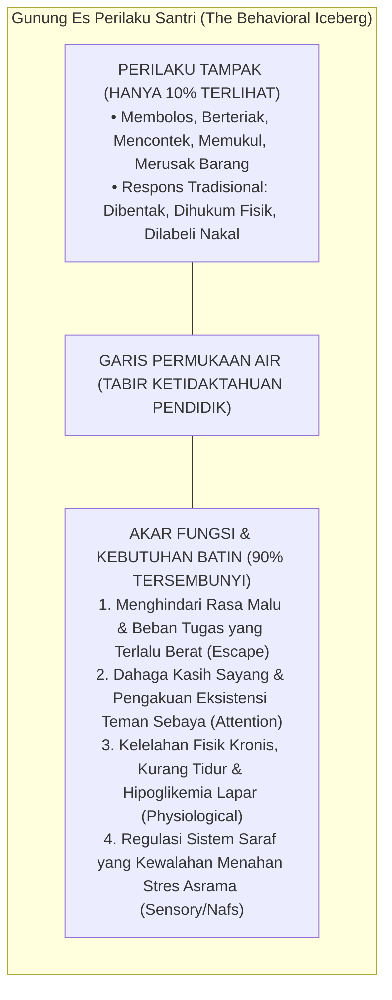
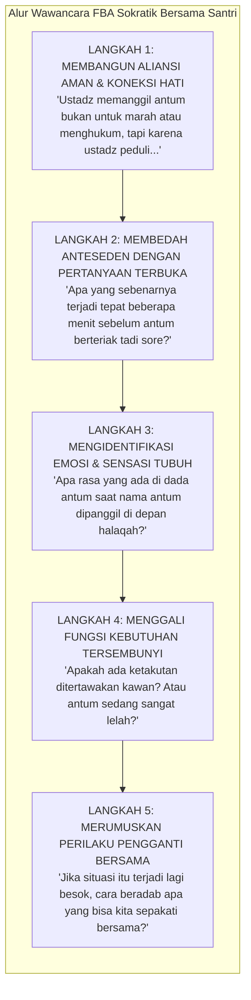

# BAB 17: FUNCTIONAL BEHAVIOR ASSESSMENT (FBA) DALAM KONTEKS KEPESANTRENAN
## Mendiagnosis Akar Kebutuhan Jiwa di Balik Pelanggaran Santri dan Merumuskan Perilaku Pengganti yang Beradab

> وَلَا تَقْفُ مَا لَيْسَ لَكَ بِهِ عِلْمٌ ۚ إِنَّ السَّمْعَ وَالْبَصَرَ وَالْفُؤَادَ كُلُّ أُولَٰئِكَ كَانَ عَنْهُ مَسْئُولًا
>
> *"Dan janganlah kamu mengikuti apa yang kamu tidak mempunyai pengetahuan tentangnya. Sesungguhnya pendengaran, penglihatan, dan hati, semuanya itu akan diminta pertanggungjawabannya."*  
> — **QS. Al-Isra' [17]: 36**[^1]

> عَالِجُوا الْعِلَلَ بِأَضْدَادِهَا، وَاعْرِفُوا أُصُولَهَا قَبْلَ فُرُوعِهَا، فَإِنَّ مَنْ دَاوَى عَرَضًا دُونَ مَعْرِفَةِ سَبَبِهِ أَوْشَكَ أَنْ يُهْلِكَ الْمَرِيضَ
>
> *"Obatilah berbagai penyakit dengan lawan-lawannya, dan kenalilah akar-akar asalnya sebelum menangani cabang-cabangnya; karena sesungguhnya barang siapa yang mengobati gejala penyakit lahiriah tanpa mengetahui sebab utamanya, niscaya ia hampir pasti mencelakakan si pasien."*  
> — **Hujjatul Islam Al-Imam Abu Hamid Al-Ghazali**, *Ihya' 'Ulum ad-Din*[^2]

---

### Prolog: Teriakan di Sudut Lorong Tahfidz

Sore itu, ba'da ashar, suasana serambi masjid pesantren yang biasanya khusyuk oleh dengung ratusan santri yang mendaras Al-Qur'an mendadak hening membeku. Dari sudut halaqah tahfidz nomor tujuh, terdengar suara gebrakan dampar kayu yang membentur tiang pilar, disusul oleh suara teriakan histeris seorang santri kelas delapan bernama Rizki: *"Saya tidak mau setoran! Saya benci halaqah ini! Biar saja saya dihukum!"*

Mushaf Al-Qur'an bersampul hijau yang ada di genggamannya meluncur jatuh ke atas karpet. Rizki berdiri dengan napas memburu, kedua tangannya mengepal kaku, dan matanya memerah menatap lantai dengan dada naik turun. 

Ustadz pengampu halaqah, seorang ustadz muda yang baru setahun mengabdi, seketika tersulut harga dirinya di hadapan puluhan santri lainnya. Darahnya mendidih, wajahnya memerah padam:  
*"Lancang sekali kamu, Rizki! Berani-beraninya kamu melempar Al-Qur'an dan membangkang kepada ustadz! Kamu santri durhaka, tidak tahu adab! Ambil sajadahmu, berdiri di terik matahari depan kantor sampai maghrib!"*

Peristiwa semacam ini adalah drama klasik yang berulang ribuan kali di berbagai asrama pesantren. Bagi pembina yang melihat peristiwa tersebut hanya dari kacamata kemarahan moral, kesimpulannya sangat sederhana dan dangkal: *"Rizki adalah anak nakal, pembangkang, tidak beradab, dan pantas dihukum sekeras-kerasnya agar jera!"*

Namun, marilah kita melangkah mundur beberapa langkah dan menyalakan lensa sains perilaku serta thibb ruhani Islam. Apakah Rizki benar-benar bangun di pagi hari itu dengan niat terencana: *"Hari ini aku ingin menghina firman Allah dan mempermalukan ustadzku"?*

Jika kita menyelidiki catatan harian Rizki selama empat puluh delapan jam terakhir, sebuah realitas yang sangat mengharukan akan terkuak:
Rizki adalah anak yang mengalami kesulitan memproses memori fonologis (*mild dyslexia*). Selama tiga malam berturut-turut, ia hanya tidur tiga jam karena ketakutan setengah mati menghadapi target ujian hafalan surat Al-Kahfi. Kawan-kawan halaqahnya yang memiliki kecepatan menghafal normal sering menertawakan tajwidnya yang terbata-bata saat musyrif berbalik badan. 

Pada sore itu, ketika sang ustadz memanggil namanya di depan halaqah dengan nada ketus: *"Ayo Rizki, giliranmu! Kalau masih tidak lancar seperti kemarin, awas ya!"*, sistem saraf simpatik Rizki mengalami pembajakan amigdala total (*hyperarousal shutdown*). Otak luhurnya lumpuh oleh rasa malu dan kecemasan yang tak tertahankan. Teriakan histerisnya sesungguhnya bukanlah ekspresi kebencian kepada Al-Qur'an; teriakan itu adalah **jeritan panik seorang anak yang harga dirinya sedang terancam hancur berkeping-keping di depan publik**.

Menghukum Rizki dengan menyuruhnya berdiri di lapangan terik matahari tidak akan pernah membuatnya lancar menghafal surat Al-Kahfi. Hukuman itu hanya akan memperdalam rasa trauma, mengukuhkan kebenciannya terhadap majelis Al-Qur'an, dan merusak relasi ruhaninya dengan pendidik.

Inilah mengapa ekosistem TUMBUH mewajibkan penguasaan metodologi **Functional Behavior Assessment (FBA) / Asesmen Fungsi Perilaku**: sebuah ikhtiar ilmiah dan syar'i untuk tidak menghakimi kulit luar, melainkan membedah akar penyakit batin demi menyembuhkan luka jiwa santri.

---

### 17.1 Gunung Es Perilaku Santri: Mengapa Perilaku Adalah Komunikasi?

Aksioma paling fundamental dalam sains perilaku kontemporer dan hikmah tarbiyah Islam menyatakan: **Perilaku manusia adalah bentuk komunikasi (*Behavior is Communication*)**[^3].

Ketika seorang santri melakukan tindakan maladaptif—seperti membolos salat, memukul kawan, mencontek saat ujian, atau membanting pintu—santri tersebut sesungguhnya sedang mengirimkan pesan darurat kepada orang dewasa di sekitarnya: *"Tolong aku! Ada kebutuhan jiwaku yang belum terpenuhi, atau ada beban di pundakku yang melebihi kapasitas daya tampung sarafku!"*.



Secara umum, sains perilaku mengklasifikasikan seluruh perilaku menyimpang santri ke dalam **Empat Fungsi Universal (*The Four Universal Functions of Behavior*)**:

#### 1. Menghindari atau Melarikan Diri (Escape / Avoidance)
Santri melanggar aturan demi melepaskan diri dari situasi, tugas, atau lingkungan yang membuatnya merasa tertekan, cemas, atau terhina:
- *Studi Kasus Asrama:* Santri yang selalu mengunci diri di kamar mandi saat jam musabaqah pidana bahasa Arab, atau santri yang pura-pura sakit di klinik saat jadwal lari pagi.
- *Analisis FBA:* Santri bukan pemalas; santri mengalami kecemasan sosial (*social anxiety*) atau merasa tidak kompeten. Perilaku melarikan diri berfungsi melindungi konsep dirinya dari rasa malu di depan umum.

#### 2. Mencari Perhatian dan Pengakuan Eksistensi (Attention Seeking / Social Connection)
Santri melanggar aturan demi mendapatkan tatapan mata, respons emosi, atau pengakuan dari figur otoritas (musyrif) maupun kelompok teman sebaya:
- *Studi Kasus Asrama:* Santri yang bertindak konyol saat pembina sedang berbicara, melontarkan lelucon kasar saat zikir bersama, atau berani menentang aturan jam malam secara terang-terangan.
- *Analisis FBA:* Di rumah atau di kelas, santri merasa dirinya "tidak terlihat" (*invisible*) karena kurang berprestasi. Menjadi "badut asrama" atau "anak pemberontak" adalah jalan pintas tercepat untuk mendapatkan panggung tepuk tangan dari teman-temannya. Bagi jiwa yang kelaparan perhatian, dimarahi atau dihukum oleh musyrif masih jauh lebih nikmat daripada diabaikan sama sekali.

#### 3. Mengakses Hak Kebendaan atau Kenikmatan Terlarang (Tangible Access)
Santri melakukan pelanggaran demi memperoleh akses terhadap makanan, barang, atau aktivitas hiburan yang dibatasi:
- *Studi Kasus Asrama:* Menyelundupkan ponsel pintar di dalam lipatan kasur, menyelinap ke dapur pondok saat tengah malam untuk menggoreng telur, atau melompati pagar asrama demi membeli kopi di warung luar.
- *Analisis FBA:* Kebutuhan stimulasi dopamin instan di tengah rutinitas pondok yang monoton, atau rasa lapar biologis nyata akibat lonjakan fase pertumbuhan fisik (*growth spurt*) yang tidak tercukupi oleh porsi dapur umum.

#### 4. Regulasi Sensorik dan Pelepasan Ketegangan Raga (Sensory / Emotional Regulation)
Perilaku muncul sebagai upaya otonom tubuh untuk menyeimbangkan sistem saraf yang sedang tegang (*self-soothing*):
- *Studi Kasus Asrama:* Santri yang terus-menerus mengetuk-ngetukkan jari ke meja kayu saat jam muthala'ah, menggigit ujung kerah baju hingga robek, atau mondar-mandir di lorong asrama tanpa tujuan.
- *Analisis FBA:* Sistem saraf santri mengalami kelebihan stimulasi sensorik (*sensory overload*) akibat kebisingan asrama atau kelelahan kognitif. Tindakan motorik tersebut adalah katarsis fisik untuk melepaskan hormon kortisol yang menyumbat dadanya.

---

### 17.2 Analisis Rantai Kausalitas A-B-C: Membongkar Mekanika Perilaku

Untuk menemukan akar masalah secara ilmiah dan tidak terjebak dalam tebakan prasangka, para pendidik TUMBUH menggunakan instrumen analisis **A-B-C (Antecedent - Behavior - Consequence)**[^4]:

```text
               RANTAI PERISTIWA PERILAKU SANTRI (MODEL A-B-C)
┌───────────────────────┬───────────────────────┬───────────────────────┐
│     A: ANTESEDEN      │      B: PERILAKU      │    C: KONSEKUENSI     │
│   (Pemicu Sebelum)    │     (Tindakan Nyata)  │   (Reaksi Lingkungan) │
├───────────────────────┼───────────────────────┼───────────────────────┤
│ Apa kondisi lingkungan│ Apa tindakan fisik    │ Apa respons musyrif / │
│ atau pemicu tepat     │ spesifik yang         │ kawan sesaat setelah  │
│ sebelum insiden?      │ dilakukan santri?     │ tindakan berlangsung? │
└───────────────────────┴───────────────────────┴───────────────────────┘
```

#### Bahaya Penguatan yang Tidak Disengaja (Inadvertent Reinforcement)
Dalam banyak insiden asrama, musyrif atau asatidz secara tidak sadar justru menjadi pihak yang memelihara dan memperparah kenakalan santri melalui pemberian konsekuensi yang keliru:

```text
       CONTOH KASUS 1: PENGUATAN MOTIF MENGHINDARI TUGAS (ESCAPE)
┌────────────────────────────────────────────────────────────────────────┐
│ ANTESEDEN (A): Santri diminta membaca kitab kuning yang sulit di depan.│
│ PERILAKU  (B): Santri bersikap kurang ajar dan mendengus kasar.        │
│ REAKSI SALAH(C): Guru marah besar: "Keluar kamu dari kelasku sekarang!"│
├────────────────────────────────────────────────────────────────────────┤
│ ANALISIS FBA:                                                          │
│ Guru merasa telah menghukum santri. Padahal dari sudut pandang santri, │
│ santri MERAIH KEMENANGAN TOTAL! Ia berhasil lolos dari keharusan       │
│ membaca kitab yang membuatnya takut. Santri belajar bahwa bersikap     │
│ kurang ajar adalah senjata paling ampuh untuk kabur dari tugas sulit.  │
└────────────────────────────────────────────────────────────────────────┘

       CONTOH KASUS 2: PENGUATAN MOTIF PENCARIAN PERHATIAN (ATTENTION)
┌────────────────────────────────────────────────────────────────────────┐
│ ANTESEDEN (A): Kamar tidur asrama mulai hening menjelang tidur malam.  │
│ PERILAKU  (B): Santri melemparkan sandal ke arah kipas angin hingga    │
│                membuat suara gaduh dan kawan-kawan tertawa.            │
│ REAKSI SALAH(C): Musyrif masuk kamar dengan wajah marah, menceramahi   │
│                santri tersebut selama 20 menit di depan teman-temannya.│
├────────────────────────────────────────────────────────────────────────┤
│ ANALISIS FBA:                                                          │
│ Musyrif mengira ceramah marahnya adalah hukuman. Padahal santri merasa │
│ sangat puas: ia berhasil menjadi pusat perhatian tunggal selama 20     │
│ menit penuh! Kemarahan musyrif berfungsi sebagai penguat positif bagi  │
│ dahaga eksistensinya.                                                  │
└────────────────────────────────────────────────────────────────────────┘
```

---

### 17.3 Merumuskan Hipotesis Fungsional dan Rekayasa Anteseden Lingkungan

Setelah rantai A-B-C terpetakan, tim pengasuhan merumuskan **Pernyataan Hipotesis Fungsional (*Functional Hypothesis Statement*)** dengan formula matematis perilaku:

$$\text{"Ketika [Anteseden/Konteks], santri cenderung melakukan [Perilaku], dengan tujuan untuk [Fungsi Kebutuhan]."}$$

*Contoh Formulasi Presisi:*  
*"Ketika santri dihadapkan pada tugas menghafal lebih dari setengah halaman Al-Qur'an pada sesi halaqah tahfidz sore (Anteseden), santri cenderung membuat keributan di kamar mandi dan menolak setoran (Perilaku), dengan tujuan untuk menghindari rasa malu akibat bacaan tajwidnya yang terbata-bata di hadapan teman sebaya (Fungsi Escape)."*

#### Rekayasa Anteseden Lingkungan (Proactive Environmental Engineering)
Langkah pertama penanganan bukanlah menghukum, melainkan **memodifikasi anteseden pemicu agar situasi krisis tidak meledak**:
- **Memecah Beban Kognitif (*Chunking Task*):** Mengubah target hafalan Rizki dari 1 halaman sekaligus menjadi 3 baris per sesi, sehingga ia merasakan kemenangan-kemenangan kecil yang menumbuhkan rasa percaya diri (*competence*).
- **Penataan Posisi dan Privasi Setoran:** Memberikan ruang bagi santri yang pemalu untuk menyetorkan hafalannya secara empat mata di ruang guru tanpa disaksikan oleh puluhan kawan halaqahnya, sampai kesiapan mentalnya terbentuk.
- **Pemberian Peringatan Transisi (*Pre-Correction*):** Lima menit sebelum jam pergantian halaqah berbunyi, musyrif mendekati meja santri dan berbisik lembut: *"Farhan, lima menit lagi kita akan berpindah ke masjid ya. Silakan mulai merapikan kitabmu dengan tenang."* Sinyal transisi ini memberi ruang bagi korteks prafrontal anak untuk bersiap tanpa kejutan.

---

### 17.4 Mengajarkan Perilaku Pengganti yang Setara secara Fungsional (Replacement Behavior)

Prinsip dasar tarbiyah Islam menegaskan bahwa hawa nafsu tidak bisa dibunuh, melainkan harus disalurkan ke jalan yang diridhai Allah (*tasyrif al-hawa fi marbawat asy-syar'i*). Demikian pula dalam sains perilaku: **Sebuah perilaku menyimpang tidak akan pernah padam sampai santri diajarkan perilaku pengganti (*functional replacement behavior*) yang mampu memenuhi fungsi kebutuhan yang sama dengan cara yang beradab dan bermartabat.**

```text
       MATRIKS PERILAKU PENGGANTI BERBASIS FBA TUMBUH
┌──────────────────┬──────────────────┬─────────────────────────────────┐
│ MOTIF KEBUTUHAN  │ PERILAKU LAMA    │ PERILAKU PENGGANTI BARU         │
│ (FUNCTION)       │ (MALADAPTIF)     │ (REPLACEMENT BEHAVIOR BERADAB)  │
├──────────────────┼──────────────────┼─────────────────────────────────┤
│ Ingin Istirahat  │ Membanting pintu │ Mengangkat Kartu Jeda Santun:   │
│ dari Lelah       │ atau membolos    │ "Ustadz, kepala saya pening,    │
│ (Escape/Avoid)   │ halaqah.         │ izinkan saya membasuh wajah     │
│                  │                  │ dengan air wudhu 3 menit."      │
├──────────────────┼──────────────────┼─────────────────────────────────┤
│ Butuh Perhatian  │ Melontarkan kata │ Diberi peran kepemimpinan nyata:│
│ & Pengakuan      │ kotor / membuat  │ Ditunjuk menjadi muazin subuh,  │
│ (Attention)      │ lelucon asrama.  │ MC lomba muhadharah, atau ketua │
│                  │                  │ dekorasi panggung asrama.       │
├──────────────────┼──────────────────┼─────────────────────────────────┤
│ Ketegangan Saraf │ Memilin sarung / │ Melatih teknik napas diafragma  │
│ & Amarah Emosi   │ memukul kawan    │ 4-7-8 dipadu istighfar kalbu    │
│ (Sensory/Nafs)   │ sekamar.         │ dan berwudhu sesuai sunnah.     │
└──────────────────┴──────────────────┴─────────────────────────────────┘
```

Ketika seorang santri berhasil menggunakan perilaku pengganti tersebut, musyrif segera memberikan **penguatan positif seketika (*immediate positive affirmation*)**:  
*"Masya Allah, Rizki! Ustadz sangat menghargai caramu meminta izin dengan santun tadi. Itu adalah tanda adab seorang penuntut ilmu sejati. Silakan berwudhu, segarkan dirimu, dan ustadz tunggu kembali di sini dengan senang hati."*

Dalam detik itulah, jalur saraf lama yang kasar (*neural pathway of aggression*) mulai ditinggalkan dan mengering, digantikan oleh jalur saraf baru yang beradab, anggun, dan memuliakan akhlak kenabian.

---

### 17.5 Protokol Wawancara FBA Sokratik: Menggali Kalbu Tanpa Menghakimi

Dalam tradisi tarbiyah TUMBUH, proses Functional Behavior Assessment tidak dilakukan laksana interogasi kepolisian yang dingin, melainkan melalui **Wawancara Sokratik Empatik Lima Langkah (*The Five-Step Socratic FBA Interview*)**:



Prinsip utama wawancara ini adalah: **Connect Before Correct (Hubungkan Hati Sebelum Memperbaiki Akal)**. Ketika santri merasakan bahwa gurunya tidak memusuhinya, benteng pertahanan amigdalanya runtuh, dan ia akan dengan jujur mencurahkan isi hatinya yang paling rahasia.

---

### 17.6 Studi Kasus FBA Lapangan: Kasus Santri Danu dan Misteri Gayung Mandi

Untuk melihat bagaimana FBA membongkar fenomena lapangan secara presisi, perhatikan kasus Santri Danu (13 tahun, kelas 7):

* **Laporan Masalah**: Danu dilaporkan oleh santri-santri sekamarnya karena hampir setiap pagi membuat keributan di depan kamar mandi: ia sering melempar gayung ke lantai, memukul pintu seng, dan menolak antre wudhu dengan tertib.
* **Tindakan Cara Lama (Gagal)**: Musyrif menghukum Danu berdiri di depan masjid dengan memegang gayung basah selama 1 jam. Keesokan harinya, keributan yang sama terulang kembali bahkan Danu mulai berkata kotor kepada kawan-kawannya.
* **Proses Investigasi FBA TUMBUH**:
  1. **Anteseden (A)**: Keributan selalu terjadi pada pukul 04.45 WIB, tepat 15 menit menjelang iqamah subuh, saat antrean kamar mandi mencapai puncak kepadatannya (6 santri mengantre di 1 pintu bilik).
  2. **Perilaku (B)**: Danu memukul pintu, melempar gayung, dan berteriak marah.
  3. **Konsekuensi (C)**: Kawan-kawan yang mengantre ketakutan dan membiarkan Danu masuk duluan, ATAU musyrif datang dan membawa Danu ke kantor (lolos dari keharusan wudhu subuh berjamaah).
  4. **Hipotesis FBA**: Danu memiliki riwayat trauma masa kecil di rumah (pernah terkunci di kamar mandi sempit yang gelap). Ketika ia berada di tengah kerumunan antrean kamar mandi yang padat dan sesak, sistem sarafnya mengalami serangan panik klaustrofobia akut (*panic sensory overload*). Amarahnya adalah mekanisme bertahan hidup (*escape from sensory crowding*).
* **Rencana Intervensi Perilaku (BIP) TUMBUH**:
  * **Modifikasi Anteseden**: Danu dijadwalkan bangun mandi lebih awal pada pukul 04.00 WIB (sebelum antrean terbentuk), didampingi musyrif dengan pencahayaan kamar mandi yang terang benderang.
  * **Perilaku Pengganti**: Danu dilatih teknik napas diafragma dan diberi kartu izin khusus jika merasakan kepanikan sensorik.
  * **Hasil Evaluasi**: Dalam tempo 14 hari, pelemparan gayung dan teriakan amarah turun menjadi **NOL KALI**. Danu menjadi santri yang tertib, tenang, dan kembali ceria di asrama.

---

### Rangkuman Intisari Bab 17

1. **Aksioma Perilaku Adalah Komunikasi:** Perilaku maladaptif santri di asrama adalah bentuk jeritan batin mengenai kebutuhan jiwa yang belum terpenuhi (*unmet needs*) atau defisit keterampilan regulasi diri, bukan sekadar niat jahat.
2. **Empat Fungsi Universal FBA:** Menghindari situasi/tugas yang menakutkan (*escape*), mencari perhatian dan pengakuan eksistensi (*attention*), mengakses kenikmatan atau barang fisik (*tangible*), serta regulasi mandiri sistem saraf yang tegang (*sensory/emotional regulation*).
3. **Analisis Rantai Kausalitas A-B-C:** Mengurai peristiwa Anteseden (pemicu awal), Perilaku (tindakan teramati faktual), dan Konsekuensi (reaksi lingkungan) guna mendeteksi faktor penguat yang tak disengaja (*inadvertent reinforcement*).
4. **Rekayasa Anteseden Lingkungan:** Memodifikasi lingkungan fisik dan beban tugas sebelum masalah meledak; memecah beban tugas (*chunking*), memberikan rasa aman, dan peringatan transisi (*pre-correction*).
5. **Pengajaran Perilaku Pengganti yang Beradab:** Mengganti perilaku melanggar dengan keterampilan sosial baru yang setara secara fungsional (*functional replacement behavior*), menyalurkan energi jiwa santri ke jalan kemuliaan adab kenabian.

---

Setelah kita mampu membedah fungsi dan pemicu di balik setiap perilaku, sebuah pertanyaan arsitektural berskala makro menantang kita: *Bagaimana pesantren mengelola ratusan santri dengan kebutuhan yang sangat beragam tanpa membiarkan satu jiwa pun terabaikan? Bagaimana membangun sistem intervensi bertingkat yang menjamin pencegahan universal sekaligus memberikan pendampingan khusus bagi santri yang terluka?* 

Di Bab 18, kita akan membedah Arsitektur Intervensi Bertingkat: SW-PBIS Multi-Tier di Pesantren.

---

### Catatan Kaki & Rujukan Akademik

[^1]: Al-Qur'an al-Karim, Surah Al-Isra' [17]: 36.
[^2]: Abu Hamid Muhammad bin Muhammad Al-Ghazali, *Ihya' 'Ulum ad-Din*, Jilid III, *Kitab Riyadhat an-Nafs wa 'Ilaj Amradh al-Qalb* (Kairo: Dar al-Hadits, 2004), hlm. 78–92 mengenai kaidah mengobati penyakit hati dengan mengenali sebab asalnya.
[^3]: Robert E. O'Neill dkk., *Functional Assessment and Program Development for Problem Behavior: A Practical Handbook* (3rd ed., Stamford: Cengage Learning, 2015), hlm. 12–45; Edward G. Carr, "The Motivation of Self-Injurious Behavior: A Review of Some Hypotheses", *Psychological Bulletin*, Vol. 84, No. 4 (1977), hlm. 800–816.
[^4]: B.F. Skinner, *Science and Human Behavior* (New York: Macmillan, 1953); Mark W. Steege & T. Steuart Watson, *Conducting School-Based Functional Behavioral Assessments: A Practitioner's Guide* (New York: The Guilford Press, 2009), hlm. 55–89.
