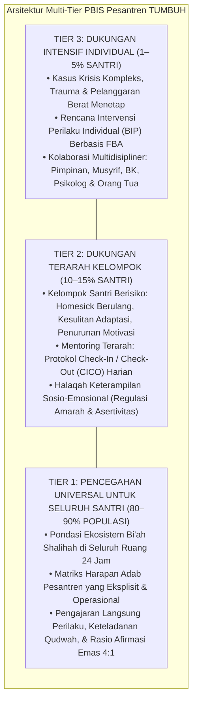
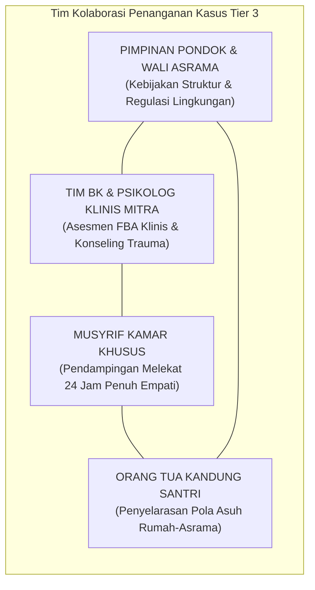
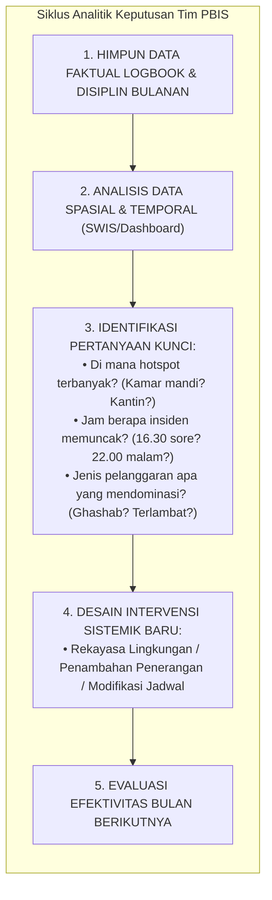

# BAB 18: ARSITEKTUR INTERVENSI BERTINGKAT (SW-PBIS MULTI-TIER DI PESANTREN)
## Menyelaraskan Pencegahan Universal Tier 1, Mentoring Terarah CICO Tier 2, dan Intervensi Intensif Rencana Dukungan Individual Tier 3

> وَتَعَاوَنُوا عَلَى الْبِرِّ وَالتَّقْوَىٰ ۖ وَلَا تَعَاوَنُوا عَلَى الْإِثْمِ وَالْعُدْوَانِ ۚ وَاتَّقُوا اللَّهَ ۖ إِنَّ اللَّهَ شَدِيدُ الْعِقَابِ
>
> *"Dan tolong-menolonglah kamu dalam (mengerjakan) kebajikan dan takwa, dan jangan tolong-menolong dalam berbuat dosa dan permusuhan. Dan bertakwalah kamu kepada Allah, sesungguhnya Allah amat berat siksa-Nya."*  
> — **QS. Al-Ma'idah [5]: 2**[^1]

> مَثَلُ الْمُؤْمِنِينَ فِي تَوَادِّهِمْ وَتَرَاحُمِهِمْ وَتَعَاطُفِهِمْ مَثَلُ الْجَسَدِ إِذَا اشْتَكَى مِنْهُ عُضْوٌ تَدَاعَى لَهُ سَائِرُ الْجَسَدِ بِالسَّهَرِ وَالْحُمَّى
>
> *"Perumpamaan orang-orang mukmin dalam hal saling mencintai, saling menyayangi, dan saling berlemah-lembut di antara mereka adalah seperti satu tubuh; apabila salah satu anggota tubuh mengeluh sakit, maka seluruh anggota tubuh yang lain ikut merasakan demam dan tidak dapat tidur."*  
> — **Hadits Riwayat Al-Bukhari (No. 6011) & Muslim (No. 2586)**[^2]

---

### Prolog: Lelahnya Pasukan Pemadam Kebakaran

Malam itu, di ruang kantor pengasuhan pusat, tumpukan berkas pelanggaran santri menggunung di atas meja kerja. Tiga orang musyrif senior duduk menyandarkan kepala ke dinding dengan mata merah menahan kantuk dan kepenatan yang teramat sangat. Di sudut papan tulis putih, tertulis sepuluh nama santri yang sama—nama-nama yang selama enam bulan terakhir menyita delapan puluh persen rapat malam pengasuhan: Fikri yang membolos lagi, Dani yang tertangkap merokok di belakang dapur, dan Rian yang memukul adik kelasnya.

Salah seorang musyrif menghela napas panjang seraya berkata:  
*"Setiap hari kita hanya bertindak seperti petugas pemadam kebakaran. Kita baru berlari pontang-panting menyemprotkan air kemarahan ketika api kebakaran sudah membesar membakar asrama. Kita lelah menghukum, anak-anak itu lelah dihukum, dan besok pagi pelanggaran yang sama terulang kembali. Sementara sembilan puluh persen anak-anak lain yang saleh dan tertib di kamar hampir tidak pernah kita sapa karena seluruh energi kita habis terkuras mengurusi sepuluh anak ini."*

Curahan hati musyrif senior tersebut adalah diagnosis sempurna atas kerapuhan sistem pengasuhan tradisional yang reaktif. Ketika sebuah lembaga pendidikan tidak memiliki **Arsitektur Pencegahan Bertingkat (*Tiered Prevention Framework*)**, para pendidik akan terjebak dalam lingkaran setan *burnout*: memadamkan krisis demi krisis secara sporadis, menghukum tanpa mendidik, dan mengabaikan mayoritas populasi santri yang membutuhkan penguatan budaya kebaikan.

Model TUMBUH menyerap kerangka kerja berbasis bukti ilmiah paling teruji di dunia pendidikan internasional—**School-Wide Positive Behavioral Interventions and Supports (SW-PBIS)**—lalu menyelaraskannya secara koheren dengan khazanah tarbiyah Islam dan realitas asrama 24 jam ke dalam **Arsitektur Intervensi Bertingkat Multi-Tier**. 

Sistem ini memastikan bahwa energi pengasuhan dialokasikan secara proporsional: membangun benteng budaya adab yang kokoh bagi seluruh santri (Tier 1), memberikan perancah pendampingan terarah bagi santri berisiko (Tier 2), serta menyiapkan protokol penanganan klinis-tarbawi intensif bagi santri yang berada dalam pusaran krisis berat (Tier 3).

---

### 18.1 Arsitektur Tiga Tingkat Intervensi Bertingkat TUMBUH

Sistem Intervensi Bertingkat TUMBUH didesain mengadopsi model kesehatan masyarakat (*public health model*): daripada menunggu masyarakat sakit parah lalu mengobatinya di unit gawat darurat, sistem mengutamakan sanitasi lingkungan dan imunisasi massal untuk mencegah wabah penyakit sejak dini[^3].



#### Kaidah Emas Arsitektur Multi-Tier: Sifat Melengkapi (Additive, Not Subtractive)
Prinsip arsitektural terpenting dalam sistem TUMBUH adalah: **Tier 2 dan Tier 3 bukanlah tempat pembuangan santri bermasalah, dan bukan pula sistem isolasi kasta yang mencabut hak santri dari kehidupan normal.**

Intervensi Tier 2 dan Tier 3 bersifat **Dukungan Tambahan (*Additive Support*)**:
- Santri yang menerima pendampingan CICO di Tier 2 tetap tinggal di kamar asramanya, tetap belajar bersama kawan-kawannya di madrasah, dan tetap menikmati seluruh fasilitas Tier 1. Ia hanya mendapatkan dosis bimbingan ekstra dari mentor pribadinya.
- Demikian pula santri di Tier 3: ia dirangkul dengan intervensi khusus tanpa pernah dicabut martabat fitrah kemanusiaannya sebagai saudara seiman.

---

### 18.2 Tier 1: Fondasi Pencegahan Universal untuk Seluruh Santri (80–90%)

Tier 1 adalah pilar peradaban pesantren. Jika ekosistem umum asrama tertata bersih, ramah, aman, adil, dan sarat keteladanan (*bi'ah shalihah*), maka secara statistik **delapan puluh hingga sembilan puluh persen santri akan tumbuh mekar secara mandiri tanpa memerlukan intervensi khusus**.

#### 1. Matriks Harapan Adab Pesantren (School-Wide Behavioral Matrix)
Banyak pelanggaran di asrama meletus bukan karena santri berniat jahat, melainkan karena peraturan pondok bersifat abstrak, samar-samar, atau dirumuskan dalam kalimat-kalimat larangan negatif (*"Dilarang ini, dilarang itu"*). 

Tier 1 mengganti tumpukan larangan negatif tersebut dengan **Matriks Harapan Adab Positif** yang menetapkan 3 hingga 5 Nilai Inti (misalnya: **Ikhlas, Jujur, Disiplin, Tangguh, dan Peduli**) yang dijabarkan ke dalam deskriptor perilaku konkret di setiap jengkal area pesantren:

| Area Lingkungan | Nilai: JUJUR (Ash-Shidq) | Nilai: DISIPLIN (Al-Inthibath) | Nilai: PEDULI (Al-Ukhuwwah) |
| :--- | :--- | :--- | :--- |
| **Masjid & Tempat Wudhu** | Mengakui wudhu yang batal secara jujur dan mengulanginya tanpa pura-pura. | Hadir di saf masjid 10 menit sebelum azan; meletakkan sandal di rak menghadap ke luar. | Merapikan sajadah kawan yang bergeser; menjaga keheningan zikir dan tilawah jamaah. |
| **Bilik Tidur Asrama** | Segera mengembalikan barang kawan yang tertukar tanpa menunggu ditagih. | Merapikan seprai ranjang dan melipat selimut simetris setiap bangun subuh. | Mematikan kran air yang meluap; menyapa dan menanyakan kabar kawan yang murung. |
| **Ruang Makan / Kantin** | Membayar makanan sesuai jumlah porsi yang diambil secara amanah. | Mengantre dengan sabar dan tertib tanpa menyela antrean saudara lain. | Mengambil porsi makan secukupnya; membersihkan remah meja makan bersama kawan. |
| **Kelas Madrasah** | Mengerjakan tugas dan ujian mandiri tanpa mencontek catatan atau bertanya kawan. | Mempersiapkan kitab dan alat tulis di meja sebelum ustadz melangkah masuk. | Menyimak penjelasan guru dengan takzim; mendengarkan saat kawan bertanya. |

#### 2. Pengajaran Eksplisit Perilaku Adab (Direct Behavioral Instruction)
TUMBUH menolak asumsi naif bahwa *"Santri pasti sudah tahu bagaimana cara beradab"*. Adab bukanlah bawaan genetik yang otomatis aktif; adab adalah kecakapan hidup yang wajib **diajarkan secara eksplisit, dicontohkan secara nyata, dipraktikkan berulang-ulang, dan diapresiasi secara konsisten**:
- **Pekan Orientasi Adab Awal Semester:** Di awal tahun ajaran, seluruh santri mengikuti demonstrasi visual nyata: bagaimana cara mengantre wudhu tanpa mencipratkan air, bagaimana etika mengetuk pintu bilik orang lain, dan bagaimana teknik mengatur napas saat amarah tersulut.
- **Keteladanan Seluruh Civitas (*School-Wide Qudwah*):** Seluruh figur dewasa di pondok—mulai dari satpam di pos gerbang, koki di dapur umum, musyrif asrama, guru madrasah, hingga jajaran masyayikh—mempraktikkan matriks adab tersebut: tidak membuang sampah sembarangan, tidak berteriak saat menegur, dan selalu mengawali perjumpaan dengan senyuman dan salam.

#### 3. Sistem Afirmasi Positif Massal (The Culture of Encouragement)
Tier 1 membangun atmosfer apresiatif yang mengikis dominasi budaya serba-menghukum:
- **Pengakuan Verbal Konkret:** Para pendidik dilatih memberikan pujian yang menyasar ikhtiar: *"Jazakallahu khair, Zaid. Ustadz memperhatikan caramu merapikan sandal adik kelas tadi pagi sangat rapi dan penuh keikhlasan."*
- **Apresiasi Kamar Teladan Mingguan:** Pemberian penghargaan bergilir bagi bilik terbersih, tersantun, dan terajin salat berjamaah, yang melahirkan kompetisi sehat dalam kebajikan (*fastabiqul khairat*) antarkamar asrama.

---

### 18.3 Tier 2: Dukungan Terarah bagi Kelompok Berisiko (10–15%)

Meskipun fondasi Tier 1 telah berjalan prima, secara alamiah akan selalu ada sekitar 10 hingga 15 persen santri yang membutuhkan perancah tambahan. Mereka adalah santri yang mulai menunjukkan tanda-tanda ketertinggalan: sering terlambat bangun fajar, kerap berselisih paham di kamar, mengalami kesulitan adaptasi homesickness yang berkepanjangan, atau menunjukkan penurunan hafalan secara persisten.

#### 1. Protokol Check-In / Check-Out (CICO) Adaptasi Pesantren
Salah satu intervensi Tier 2 paling efektif yang terbukti secara empiris di ribuan sekolah dunia dan selaras sempurna dengan sunnah tarbiyah Islam adalah protokol **Check-In / Check-Out (CICO)**[^4]:

```text
               ALUR SIKLUS HARIAN MENTORING CICO ASRAMA
┌────────────────────────────────────────────────────────────────────────┐
│ 1. CHECK-IN PAGI (Ba'da Subuh | 05.15 - 05.20 WIB)                    │
│    • Pertemuan 3–5 menit antara santri dan musyrif mentor pribadinya.  │
│    • Senyum hangat, menanyakan kabar batin santri, mengecek kesiapan.  │
│    • Menetapkan 1 target adab harian (misal: "Hari ini fokus menahan   │
│      lisan dari kata kasar"). Santri membawa Kartu Adab Harian (DPR).  │
├────────────────────────────────────────────────────────────────────────┤
│ 2. UMPAN BALIK GURU SEPANJANG HARI (Kelas, Halaqah, Dapur)             │
│    • Pada setiap pergantian sesi, guru memberikan skor singkat (0,1,2) │
│      disertai 1 kalimat apresiasi positif atas usaha santri.           │
├────────────────────────────────────────────────────────────────────────┤
│ 3. CHECK-OUT MALAM (Ba'da Isya | 20.30 - 20.40 WIB)                   │
│    • Reviu capaian hari itu bersama musyrif mentor.                    │
│    • Menghitung persentase keberhasilan (target minimal 80% poin).     │
│    • Apresiasi atas keberhasilan menahan diri; evaluasi pemicu jika    │
│      ada target yang terlewat; ditutup dengan doa malam dan pelukan.   │
└────────────────────────────────────────────────────────────────────────┘
```

Melalui protokol CICO, santri yang haus perhatian tidak perlu lagi membuat onar untuk dilihat orang; ia menerima kepastian mutlak bahwa **setiap hari, di waktu fajar dan di waktu malam, ada seorang figur dewasa yang menyayangi, memperhatikan, dan mendoakannya secara khusus**.

#### 2. Halaqah Keterampilan Sosio-Emosional (Small-Group Social Skills Halaqah)
Bagi santri yang memiliki kesulitan bergaul, mudah meledak amarahnya, atau mengalami kecemasan sosial, Tim Bimbingan Konseling (BK) memfasilitasi halaqah kecil berisi 4 hingga 6 santri yang dipandu dua kali sepekan:
- Pembelajaran teknik komunikasi asertif tanpa kekerasan.
- Pelatihan regulasi emosi: mengenali sinyal tubuh saat amarah naik (*somatic awareness*) dan mempraktikkan wudhu atau mengubah posisi duduk sesuai sunnah Nabi ﷺ.
- Simulasi peran (*role-play*) memecahkan konflik teman sekamar dengan dialog damai.

---

### 18.4 Tier 3: Dukungan Intensif Individual bagi Kasus Khusus (1–5%)

Sekitar 1 hingga 5 persen santri menghadapi pergulatan hidup yang sangat kompleks: santri korban trauma masa lalu di keluarga (*adverse childhood experiences*), santri dengan gangguan perilaku menetap (*conduct challenges*), depresi berat, atau santri yang terlibat pelanggaran moral serius. Kelompok ini tidak cukup ditangani oleh Tier 1 maupun bimbingan kelompok Tier 2; mereka membutuhkan **intervensi klinis-tarbawi yang sangat personal, intensif, dan lintas disiplin**.



#### 1. Penyusunan Rencana Dukungan Perilaku Individual (Behavior Intervention Plan / BIP)
Berdasarkan hasil asesmen FBA yang mendalam, tim menyusun dokumen BIP tertulis yang mengikat seluruh pihak:
1. **Identifikasi Kebutuhan Dasar:** Membongkar trauma atau luka batin yang mendasari perilaku destruktif santri.
2. **Modifikasi Ekosistem Khusus:** Memberikan penyesuaian khusus pada ritme belajar dan penempatan kamar santri (misalnya penempatan di kamar dengan musyrif pendamping yang memiliki kematangan emosional tinggi).
3. **Protokol De-eskalasi Krisis Pribadi:** Panduan langkah demi langkah bagi staf asrama mengenai apa yang harus dilakukan jika santri mengalami ledakan histeris (*meltdown*) atau agresi fisik, guna menjaga keselamatan santri dan orang lain tanpa kekerasan fisik balasan.
4. **Sesi Terapi & Konseling Intensif Berkala:** Jadwal konseling mingguan bersama konselor BK pondok atau psikolog klinis profesional yang bekerja sama dengan pesantren.

#### 2. Kemitraan Erat dengan Orang Tua
Penanganan Tier 3 mustahil berhasil tanpa transparansi dan kolaborasi tulus dengan orang tua santri. Pesantren memposisikan orang tua bukan sebagai terdakwa yang dimarahi atas kenakalan anaknya, melainkan sebagai **mitra setara dalam memulihkan jiwa anak**. Pertemuan berkala dirancang untuk menyelaraskan pola komunikasi di rumah saat masa liburan dengan pola pembinaan di asrama.

#### 3. Monitoring Kemajuan Berbasis Data (Data-Based Progress Monitoring)
Keberhasilan intervensi Tier 3 dievaluasi setiap dua pekan:
- Apakah frekuensi ledakan amarah berkurang dari lima kali seminggu menjadi satu kali seminggu?
- Apakah durasi keterlibatan santri dalam pembelajaran meningkat?
- Jika data menunjukkan perbaikan nyata, dosis bantuan intensif ditarik mundur secara bertahap menuju Tier 2 (*fading support*). Namun jika kondisi jalan di tempat, tim meninjau ulang hipotesis FBA dan menyesuaikan strategi intervensi.

---

### 18.5 Format Kartu Pantau Harian CICO (Daily Progress Report / DPR)

Agar pendampingan Tier 2 berjalan terukur dan konsisten di seluruh sesi kegiatan 24 jam, santri membawa lembar **Kartu Adab Harian (DPR)** yang diisi secara cepat oleh guru dan musyrif:

```text
                  KARTU ADAB HARIAN MENTORING CICO TUMBUH
┌────────────────────────────────────────────────────────────────────────┐
│ NAMA SANTRI   : .....................  TANGGAL/HARI : ................ │
│ MUSYRIF MENTOR: .....................  TARGET POIN  : Minimal 80% (38) │
├────────────────────────────────────────────────────────────────────────┤
│ SESI KEGIATAN  │ TARGET 1: IKHLAS │ TARGET 2: TERTIB │ TARGET 3: SANTUN│
│ (24 JAM)       │ (Fokus Penuh)    │ (Tepat Waktu)    │ (Lisan & Sikap) │
│                │  (0 - 1 - 2)     │   (0 - 1 - 2)    │   (0 - 1 - 2)   │
├────────────────┼──────────────────┼──────────────────┼─────────────────┤
│ 1. Subuh-Pagi  │  [  ]  [  ]  [  ]│  [  ]  [  ]  [  ]│  [  ]  [  ]  [  ]│
│ 2. Kelas Pagi  │  [  ]  [  ]  [  ]│  [  ]  [  ]  [  ]│  [  ]  [  ]  [  ]│
│ 3. Siang-Zuhur │  [  ]  [  ]  [  ]│  [  ]  [  ]  [  ]│  [  ]  [  ]  [  ]│
│ 4. Kelas Sore  │  [  ]  [  ]  [  ]│  [  ]  [  ]  [  ]│  [  ]  [  ]  [  ]│
│ 5. Maghrib-Isya│  [  ]  [  ]  [  ]│  [  ]  [  ]  [  ]│  [  ]  [  ]  [  ]│
│ 6. Belajar Mlm │  [  ]  [  ]  [  ]│  [  ]  [  ]  [  ]│  [  ]  [  ]  [  ]│
├────────────────┴──────────────────┴──────────────────┴─────────────────┤
│ SKOR TOTAL HARI INI : ........ / 48 Poin  (Persentase: ........ %)     │
│ [ ] TARGET TERCAPAI (≥ 80%)  -> Apresiasi: ........................... │
│ CATATAN KASIH SAYANG MUSYRIF MALAM:                                    │
│ "Affan, ustadz bangga sekali antum mampu menahan diri di kelas siang!" │
└────────────────────────────────────────────────────────────────────────┘
```

Skoring dilakukan sangat sederhana (2 = Hebat/Konsisten, 1 = Cukup/Perlu diingatkan sekali, 0 = Membutuhkan bimbingan intensif). Fokus utama kartu ini bukanlah angka matematikanya, melainkan **kesempatan bagi santri untuk menerima 6 kali tatapan mata penuh kehangatan dan kalimat afirmasi dari guru yang berbeda setiap hari**.

---

### 18.6 Tim Kepemimpinan PBIS Multidisipliner: Pengambilan Keputusan Berbasis Analitik

Keberhasilan arsitektur PBIS di pesantren dipandu oleh **Tim Kepemimpinan PBIS Lembaga (*School-Wide PBIS Leadership Team*)** yang bersidang sebulan sekali:



Dengan tim multidisipliner ini, pesantren tidak pernah lagi membuat kebijakan disiplin berdasarkan firasat atau selera subjektif pengurus. Kebijakan lahir dari pembacaan data yang jernih, adil, ilmiah, dan berorientasi pada maslahat pertumbuhan santri.

---

### Rangkuman Intisari Bab 18

1. **Arsitektur Tiga Tingkat SW-PBIS:** Mengubah pola kepengasuhan pesantren dari unit pemadam kebakaran yang reaktif menjadi sistem kesehatan masyarakat yang proaktif: Tier 1 Universal (80–90%), Tier 2 Terarah (10–15%), dan Tier 3 Intensif Individual (1–5%).
2. **Kekuatan Pencegahan Tier 1:** Menciptakan ekosistem budaya adab massal (*bi'ah shalihah*) melalui Matriks Harapan Adab operasional di setiap area pondok, pembelajaran eksplisit perilaku, keteladanan pendidik, serta iklim afirmasi positif massal.
3. **Dukungan Mentoring Tier 2:** Memberikan perancah tambahan bagi santri berisiko melalui protokol bimbingan harian *Check-In / Check-Out* (CICO) yang penuh kasih sayang dan halaqah kecil keterampilan sosio-emosional.
4. **Penanganan Kasus Krisis Tier 3:** Rencana Dukungan Perilaku Individual (BIP) berbasis FBA untuk menangani pergulatan emosional dan perilaku kompleks, melibatkan sinergi musyrif, konselor BK, psikolog, pimpinan pondok, dan orang tua santri.
5. **Dukungan Bersifat Melengkapi (Additive):** Santri di Tier 2 dan Tier 3 tidak dikucilkan atau dilabeli, melainkan tetap berada dalam dekapan kasih sayang ekosistem Tier 1 dengan penambahan dosis bimbingan yang terukur dan bermartabat.

---

Sistem bertingkat PBIS telah memberikan perisai pencegahan dan dukungan yang terukur. Namun, ketika pelanggaran berat atau konflik perselisihan meletus di kamar santri, keadilan seperti apa yang wajib kita tegakkan? Mengapa pembalasan fisik dan skorsing pengucilan justru memperparah luka asrama? 

Di Bab 19, kita akan membedah Disiplin Positif dan Keadilan Restoratif (*Restorative Justice & Ishlah al-Bain*).

---

### Catatan Kaki & Rujukan Akademik

[^1]: Al-Qur'an al-Karim, Surah Al-Ma'idah [5]: 2.
[^2]: Diriwayatkan oleh Al-Bukhari dalam *Shahih al-Bukhari*, Kitab al-Adab, Bab Rahmat an-Nas wa al-Baha'im, hadits no. 6011; Muslim dalam *Shahih Muslim*, Kitab al-Birr wa ash-Shilah wa al-Adab, hadits no. 2586 dari An-Nu'man bin Basyir radhiyallahu 'anhuma.
[^3]: George Sugai & Robert H. Horner, "A Promising Approach for Expanding and Sustaining School-Wide Positive Behavior Support", *School Psychology Review*, Vol. 35, No. 2 (2006), hlm. 245–259; Robert H. Horner dkk., "A Randomized, Wait-List Controlled Effectiveness Trial Assessing School-Wide Positive Behavior Support in Elementary Schools", *Journal of Positive Behavior Interventions*, Vol. 11, No. 3 (2009), hlm. 133–144.
[^4]: Anne W. Todd dkk., "The Effects of a Targeted Intervention to Reduce Problem Behaviors: Elementary School Implementation of Check-In, Check-Out", *Journal of Positive Behavior Interventions*, Vol. 10, No. 1 (2008), hlm. 46–55; Douglas Chen & Jeffrey R. Sprague, *Implementing School-Wide PBIS* (Guilford Press, 2012).
