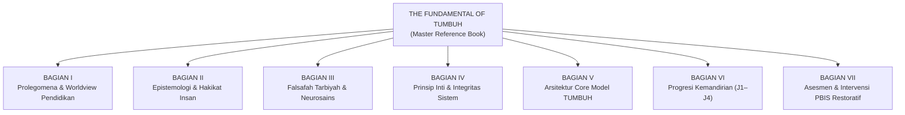

# THE FUNDAMENTAL OF TUMBUH
## Landasan Filosofis, Arsitektural, dan Metodologis Transformasi Karakter Pesantren 24 Jam
### Master Reference Book — Seri Buku Utama TUMBUH v2.0.0

---

## Tentang Buku Ini

Buku ini merupakan **Buku Induk Referensi (*Master Reference Book*)** yang mensintesiskan, mengurasi, dan menyunting 396 berkas substansi inti dari lapisan `01_FUNDAMENTAL` ekosistem TUMBUH ke dalam satu kesatuan narasi yang utuh, mendalam, dan aplikatif.

Buku ini memadukan tiga pilar utama:
1. **Khazanah Turats Islam & Maqashid Syari'ah**: Merujuk pada pandangan alam tauhid (*Islamic worldview*), kitab-kitab adab mu'tabar (Imam Al-Ghazali, Ibnu Jama'ah, Ibnu Khaldun, Imam An-Nawawi, Ibnu Qayyim al-Jauziyyah).
2. **Sains Perkembangan & Neurosains Kontemporer**: Menghubungkan proses tarbiyah dengan pemahaman biologis otak remaja (*Prefrontal Cortex*, sistem limbik, Teori Polivagal, regulasi emosi).
3. **Praksis Kehidupan Pesantren 24 Jam**: Merespons dinamika nyata asrama, interaksi musyrif-santri, titik rawan pergaulan, dan metodologi pembiasaan disiplin positif (*School-Wide PBIS* & *Restorative Justice*).

---

## Struktur Sistematika Buku (7 Bagian, 20 Bab)

| Bagian | Cakupan Tematik | Jumlah Bab | Berkas Sumber Kurasi |
| :--- | :--- | :---: | :--- |
| **Bagian I** | Prolegomena & Islamic Worldview | 2 Bab | `01_PHILOSOPHY/01_WORLDVIEW/` |
| **Bagian II** | Epistemologi Terpadu & Hakikat Insan | 2 Bab | `01_PHILOSOPHY/02_EPISTEMOLOGY/` & `03_HUMAN_NATURE/` |
| **Bagian III** | Neurosains, Ta'dib & Teori Perubahan | 3 Bab | `01_PHILOSOPHY/04_DEVELOPMENT/`, `05_EDUCATION/`, `06_LEADERSHIP/`, `07_CHANGE/` |
| **Bagian IV** | Prinsip Non-Negotiables & Integritas | 2 Bab | `02_PRINCIPLES/` & Integritas Fondasi |
| **Bagian V** | Arsitektur Core Model & Lingkungan 24 Jam | 2 Bab | `03_CORE_MODEL/` |
| **Bagian VI** | Taksonomi Progresi Kemandirian (J1–J4) | 4 Bab | `04_PROGRESSION/` |
| **Bagian VII** | Asesmen Formatif, FBA, PBIS & Restoratif | 5 Bab | `05_ASSESSMENT/` & `06_INTERVENTION/` |

---

## Indeks Bab Lengkap

* **BAGIAN I: PROLEGOMENA & WORLDVIEW PENDIDIKAN ISLAM**
  * [Bab 1: Menatap Krisis, Menegakkan Orientasi (Manifesto Transformasi Karakter)](file:///c:/xampp/htdocs/tumbuh/BOOK%20Series%201/01-The-Fundamental-of-TUMBUH/BAGIAN-I/Bab-01-Menatap-Krisis-Menegakkan-Orientasi.md)
  * [Bab 2: Pandangan Alam Islam (*The Islamic Worldview*) sebagai Poros Pendidikan](file:///c:/xampp/htdocs/tumbuh/BOOK%20Series%201/01-The-Fundamental-of-TUMBUH/BAGIAN-I/Bab-02-Pandangan-Alam-Islam-sebagai-Poros-Pendidikan.md)
* **BAGIAN II: EPISTEMOLOGI PENDIDIKAN & HAKIKAT INSAN**
  * [Bab 3: Epistemologi Terpadu: Wahyu, Nalar, dan Fakta Empiris](file:///c:/xampp/htdocs/tumbuh/BOOK%20Series%201/01-The-Fundamental-of-TUMBUH/BAGIAN-II/Bab-03-Epistemologi-Terpadu-Wahyu-Nalar-dan-Fakta-Empiris.md)
  * [Bab 4: Antropologi Jiwa Santri: Hakikat Fitrah dan Komponen Kejiwaan](file:///c:/xampp/htdocs/tumbuh/BOOK%20Series%201/01-The-Fundamental-of-TUMBUH/BAGIAN-II/Bab-04-Antropologi-Jiwa-Santri-Hakikat-Fitrah-dan-Komponen-Kejiwaan.md)
* **BAGIAN III: FALSAFAH TARBIYAH, PERKEMBANGAN, & KEPEMIMPINAN QUDWAH**
  * [Bab 5: Dinamika Perkembangan Jiwa & Neurosains Remaja](file:///c:/xampp/htdocs/tumbuh/BOOK%20Series%201/01-The-Fundamental-of-TUMBUH/BAGIAN-III/Bab-05-Dinamika-Perkembangan-Jiwa-dan-Neurosains-Remaja.md)
  * [Bab 6: Falsafah Tarbiyah, Ta'dib, dan Ekosistem Keteladanan](file:///c:/xampp/htdocs/tumbuh/BOOK%20Series%201/01-The-Fundamental-of-TUMBUH/BAGIAN-III/Bab-06-Falsafah-Tarbiyah-Tadib-dan-Ekosistem-Keteladanan.md)
  * [Bab 7: Teori Perubahan Perilaku Berkelanjutan (*Theory of Change*)](file:///c:/xampp/htdocs/tumbuh/BOOK%20Series%201/01-The-Fundamental-of-TUMBUH/BAGIAN-III/Bab-07-Teori-Perubahan-Perilaku-Berkelanjutan.md)
* **BAGIAN IV: PRINSIP-PRINSIP INTI & INTEGRITAS SISTEM**
  * [Bab 8: Sumpah Integritas Pendidikan TUMBUH (*The Non-Negotiables*)](file:///c:/xampp/htdocs/tumbuh/BOOK%20Series%201/01-The-Fundamental-of-TUMBUH/BAGIAN-IV/Bab-08-Sumpah-Integritas-Pendidikan-TUMBUH.md)
  * [Bab 9: Tata Kelola Epistemik dan Etika Pengambilan Keputusan](file:///c:/xampp/htdocs/tumbuh/BOOK%20Series%201/01-The-Fundamental-of-TUMBUH/BAGIAN-IV/Bab-09-Tata-Kelola-Epistemik-dan-Etika-Pengambilan-Keputusan.md)
* **BAGIAN V: ARSITEKTUR MODEL INTI (CORE MODEL) TUMBUH**
  * [Bab 10: Kerangka Struktur Model Inti TUMBUH](file:///c:/xampp/htdocs/tumbuh/BOOK%20Series%201/01-The-Fundamental-of-TUMBUH/BAGIAN-V/Bab-10-Kerangka-Struktur-Model-Inti-TUMBUH.md)
  * [Bab 11: Rekayasa Lingkungan Asrama & Ekosistem Terpadu 24 Jam](file:///c:/xampp/htdocs/tumbuh/BOOK%20Series%201/01-The-Fundamental-of-TUMBUH/BAGIAN-V/Bab-11-Rekayasa-Lingkungan-Asrama-dan-Ekosistem-Terpadu-24-Jam.md)
* **BAGIAN VI: PROGRESI JENJANG KEMANDIRIAN SANTRI (J1–J4)**
  * [Bab 12: Paradigma Progresi Karakter: Dari Bimbingan Menuju Penggerak](file:///c:/xampp/htdocs/tumbuh/BOOK%20Series%201/01-The-Fundamental-of-TUMBUH/BAGIAN-VI/Bab-12-Paradigma-Progresi-Karakter.md)
  * [Bab 13: Bedah Jenjang J1 & J2: Adaptasi, Pembiasaan, dan Regulasi Terbimbing](file:///c:/xampp/htdocs/tumbuh/BOOK%20Series%201/01-The-Fundamental-of-TUMBUH/BAGIAN-VI/Bab-13-Bedah-Jenjang-J1-dan-J2.md)
  * [Bab 14: Bedah Jenjang J3 & J4: Otonomi Karakter dan Kepemimpinan Qudwah](file:///c:/xampp/htdocs/tumbuh/BOOK%20Series%201/01-The-Fundamental-of-TUMBUH/BAGIAN-VI/Bab-14-Bedah-Jenjang-J3-dan-J4.md)
  * [Bab 15: Mekanisme Transisi, Portofolio Santri, dan Upacara Kenaikan Jenjang](file:///c:/xampp/htdocs/tumbuh/BOOK%20Series%201/01-The-Fundamental-of-TUMBUH/BAGIAN-VI/Bab-15-Mekanisme-Transisi-dan-Kenaikan-Jenjang.md)
* **BAGIAN VII: ARSITEKTUR ASESMEN & SISTEM INTERVENSI BERTINGKAT (PBIS & RESTORATIF)**
  * [Bab 16: Filosofi Asesmen Karakter: Mengukur untuk Menumbuhkan, Bukan Melabeli](file:///c:/xampp/htdocs/tumbuh/BOOK%20Series%201/01-The-Fundamental-of-TUMBUH/BAGIAN-VII/Bab-16-Filosofi-Asesmen-Karakter-dan-Metode-Pengumpulan-Data.md)
  * [Bab 17: Functional Behavior Assessment (FBA) dalam Konteks Kepesantrenan](file:///c:/xampp/htdocs/tumbuh/BOOK%20Series%201/01-The-Fundamental-of-TUMBUH/BAGIAN-VII/Bab-17-Functional-Behavior-Assessment-dalam-Konteks-Pesantren.md)
  * [Bab 18: Arsitektur Intervensi Bertingkat (SW-PBIS Multi-Tier di Pesantren)](file:///c:/xampp/htdocs/tumbuh/BOOK%20Series%201/01-The-Fundamental-of-TUMBUH/BAGIAN-VII/Bab-18-Arsitektur-Intervensi-Bertingkat-PBIS-Pesantren.md)
  * [Bab 19: Disiplin Positif dan Keadilan Restoratif (*Restorative Justice & Ishlah al-Bain*)](file:///c:/xampp/htdocs/tumbuh/BOOK%20Series%201/01-The-Fundamental-of-TUMBUH/BAGIAN-VII/Bab-19-Disiplin-Positif-dan-Keadilan-Restoratif.md)
  * [Bab 20: Safeguarding, Manajemen Krisis, dan Tata Kelola Kelembagaan](file:///c:/xampp/htdocs/tumbuh/BOOK%20Series%201/01-The-Fundamental-of-TUMBUH/BAGIAN-VII/Bab-20-Safeguarding-Manajemen-Krisis-dan-Tata-Kelola-Kelembagaan.md)

---

## Berkas Master & Glosarium

* 📖 **[THE_FUNDAMENTAL_OF_TUMBUH_MASTER.md](file:///c:/xampp/htdocs/tumbuh/BOOK%20Series%201/01-The-Fundamental-of-TUMBUH/THE_FUNDAMENTAL_OF_TUMBUH_MASTER.md)** — Naskah Utuh Monolitik (20 Bab Lengkap, Glosarium & Bibliografi dalam Satu Berkas Siap Cetak/Ekspor).
* 📚 **[GLOSARIUM_DAN_BIBLIOGRAFI.md](file:///c:/xampp/htdocs/tumbuh/BOOK%20Series%201/01-The-Fundamental-of-TUMBUH/GLOSARIUM_DAN_BIBLIOGRAFI.md)** — Glosarium Master Terminologi Turats, Neurosains & PBIS serta Daftar Pustaka Rujukan Induk.
