# THE FUNDAMENTAL OF TUMBUH
## Landasan Filosofis, Arsitektural, dan Metodologis Transformasi Karakter Pesantren 24 Jam
### Master Reference Book — Seri Buku Utama TUMBUH v2.0.0

---


---

---

# BAB 1: MENATAP KRISIS, MENEGAKKAN ORIENTASI
## Manifesto Transformasi Karakter Pesantren 24 Jam

> مَنْ كَانَ مَرْبَاهُ بِالْعَسْفِ وَالْقَهْرِ مِنَ الْمُتَعَلِّمِينَ أَوْ الْمَمَالِيكِ أَوْ الْخَدَمِ، سَطَا بِهِ الْقَهْرُ، وَضَيَّقَ عَلَى النَّفْسِ فِي انْبِسَاطِهَا، وَذَهَبَ بِنَشَاطِهَا، وَدَعَاهُ إِلَى الْكَسَلِ، وَحَمَلَهُ عَلَى الْكَذِبِ وَالْخُبْثِ، وَهُوَ التَّظَاهُرُ بِغَيْرِ مَا فِي ضَمِيرِهِ خَوْفًا مِنِ انْبِسَاطِ الْأَيْدِي بِالْقَهْرِ عَلَيْهِ، وَعَلَّمَهُ الْمَكْرَ وَالْخَدِيعَةَ لِذَلِكَ، وَصَارَتْ لَهُ هَذِهِ عَادَةً وَخُلُقًا، وَفَسَدَتْ مَعَانِي الْإِنْسَانِيَّةِ الَّتِي لَهُ مِنْ حَيْثُ الِاجْتِمَاعِ وَالتَّمَدُّنِ...
>
> *"Barangsiapa yang pola pendidikannya bertumpu pada kekerasan, pemaksaan, dan penindasan—baik terhadap murid, hamba sahaya, maupun pelayan—niscaya tindak penindasan itu akan mencengkeram jiwanya, menyempitkan kelapangan batinnya, melenyapkan gairah dan inisiatifnya, menjerumuskannya ke dalam kemalasan, serta mendorongnya melakukan dusta dan kepura-puraan (kemunafikan). Hal itu terjadi karena ia terpaksa menampakkan sikap yang berbeda dengan isi hatinya semata-mata demi menghindari kezaliman fisik yang mengancamnya. Pola ini mengajarkannya muslihat dan tipu daya hingga akhirnya menjadi kebiasaan dan karakter yang melekat, lalu rusaklah hakikat nilai-nilai kemanusiaannya yang menjadi sendi kehidupan bermasyarakat dan peradaban..."*  
> — **Al-Allamah Abdurrahman Ibnu Khaldun**, *Muqaddimah* (Bab VI, Fasal 39: *Fī anna asy-syiddah 'alā al-muta'allimīn mudhirrah bihim*)[^1]

---

### 1.1 Tragedi di Balik Gerbang: Retakan Jiwa di Balik Ketertiban Semu

Pukul 04.15 dini hari di sebuah kompleks asrama pondok pesantren. Kabut dingin masih menyelimuti atap-atap gedung, namun keheningan fajar itu seketika terkoyak oleh suara gedoran keras pada pintu seng kamar mandi, denting ember aluminium yang dipukulkan ke tiang besi, serta lengkingan suara seorang pembina: *"Bangun! Bangun semuanya! Yang lima menit lagi masih meringkuk di kasur, siap-siap disiram air got! Bawa sajadah ke masjid sekarang!"*

Di salah satu sudut kamar berukuran enam kali empat meter yang dihuni oleh dua belas orang santri, seorang anak berusia dua belas tahun tersentak dari lelapnya. Tubuhnya terperanjat, matanya nanar menatap kegelapan, dan dadanya berdegup kencang dengan denyut jantung melesat di atas 130 denyut per menit. Anak itu tidak terbangun oleh kesadaran fajar yang suci, bukan pula oleh rasa rindu yang merekah di dada untuk menghadap Dzat Yang Maha Pengasih. Ia tersentak oleh keterkejutan instingtual (*survival terror*). Tubuhnya bergerak cepat menyambar sarung dan kopiah secara mekanis, namun di balik gerakan tergesa itu, jiwanya membeku dalam kecemasan yang akut.

Di siang hari, pemandangan di pesantren tersebut tampak teramat memesona. Para wali santri yang berkunjung, para donatur yang melintas, serta tamu-tamu terhormat akan menyaksikan barisan santri yang berjalan dengan langkah tertib, menundukkan pandangan saat berpapasan dengan guru, dan mencium tangan para asatidz dengan kerendahan hati yang menyejukkan. Suara riuh rendah lantunan hafalan bait-bait *Alfiyyah Ibnu Malik* dan juz-juz Al-Qur'an bersahut-sahutan dari balik jendela kelas. Di atas kertas laporan pengasuhan, segala sesuatunya tampak sempurna: tata tertib terlaksana, jadwal terlaksana seratus persen, dan ketertiban umum terjaga rapat.

Namun, marilah kita berani menanggalkan tabir formalitas tersebut dan menatap dengan jujur apa yang sesungguhnya terjadi di ruang-ruang tak terawasi ketika mata para pembina terpejam dan gerbang asrama tertutup rapat.

#### Anatomi Sosiologis Ghashab Sistemik: Normalisasi Perampasan Hak
Di lorong-lorong asrama dan kamar mandi bersama, berlangsung sebuah fenomena harian yang telah berlangsung puluhan tahun dan dinormalisasi secara berbahaya: **budaya ghashab (mengambil barang milik orang lain tanpa izin)**. Sandal jepit, ember cuci, sabun mandi, pasta gigi, hingga pakaian santri junior berpindah tangan setiap jam. 

Fenomena ini bukan sekadar persoalan hilangnya sepasang alas kaki murah; ini adalah **luka pembusukan moral yang merusak sensitivitas nurani santri terhadap sakralitas hak milik orang lain (*hifzh al-mal*)**. 

Perhatikan bagaimana seorang santri baru yang lugu bermutasi menjadi pelaku ghashab yang dingin:
Pada bulan-bulan pertama kedatangannya dari rumah, santri baru tersebut menjaga barang-barangnya dengan teliti sesuai didikan orang tuanya. Namun, dalam hitungan minggu, sandal barunya raib saat ditinggal salat di masjid. Gayung mandinya diambil santri lain. Sabunnya hilang dari keranjang. Ketika ia mengadu kepada santri senior atau pembinanya, respons yang ia terima kerap bernada menyepelekan: *"Di pondok itu harus tahan banting, Dik. Jangan manja, belajar ikhlas!"*

Ketika sistem pengasuhan gagal melindungi hak asasi kebendaan santri yang paling mendasar, anak itu dipaksa masuk ke dalam mode bertahan hidup (*survival strategy*). Agar kakinya tidak melepuh menginjak aspal terik menuju madrasah, ia terpaksa mengambil sandal temannya yang tergeletak. Pada detik pertama ia melakukannya, nuraninya bergetar cemas. Namun ketika perbuatannya lolos tanpa konsekuensi dan lingkungan menertawakannya sebagai "tanda sahnya menjadi santri tulen", benteng integritasnya runtuh. Dalam waktu enam bulan, anak yang awalnya jujur itu telah bermutasi menjadi predator kebendaan yang mahir merampas milik saudaranya sendiri tanpa merasa berdosa sedikit pun.

#### Feodalisme Hierarkis dan Rantai Transmisi Kekerasan Antargenerasi
Retakan jiwa yang lebih parah terjadi pada relasi kuasa antara santri senior (*mudabbir*) dan santri junior. Atas nama "penempaan mental" dan tradisi senioritas, kamar-kamar asrama kerap berubah menjadi panggung feodalisme terselubung. 

Santri junior dipaksa mencuci tumpukan seragam kotor seniornya, memijat betis mereka hingga larut malam melampaui jam tidur, membersihkan sisa makanan, hingga membelikan pesanan di kantin di bawah ancaman kekerasan fisik dan pengucilan sosial (*social ostracism*). Jika seorang anak kelas tujuh berani menolak, ia akan diintimidasi secara sistematis: tempat tidurnya dibasahi, bukunya disembunyikan, atau ia "disidang" di sudut jemuran gelap pada pukul satu dini hari dengan makian yang meremukkan harga dirinya.

Mengapa kekejaman ini terus berulang dari dekade ke dekade?
Jawabannya terletak pada apa yang dalam psikologi sosial disebut sebagai **Transmisi Trauma Antargenerasi (*Intergenerational Transmission of Abuse*)**. Santri senior yang malam ini menindas adik kelasnya sesungguhnya adalah korban yang tertindas pada tiga tahun yang lalu. Ketika ia dahulu diperlakukan secara zalim oleh seniornya tanpa ada sistem pengasuhan yang membela martabatnya, rasa sakit dan terhina itu tidak lenyap; rasa sakit itu mengendap menjadi dendam purba di alam bawah sadarnya. Maka begitu ia naik tingkat menjadi senior, otak emosionalnya menuntut pelampiasan: *"Dulu aku disiksa dan disuruh-suruh, sekarang giliranku menikmati privilese ini!"*

Kekerasan pun bertransformasi menjadi tradisi warisan yang dianggap lumrah, sementara para pengasuh pondok sering kali menutup mata dengan dalih bahwa senioritas adalah cara melatih kepemimpinan (*leadership*). Padahal yang sedang tumbuh subur bukanlah kepemimpinan, melainkan **tirani perpeloncoan**.

#### Ledakan Desakralisasi Nilai Pasca-Kelulusan
Puncak dari kegagalan sistem kontrol represif ini terlihat saat santri melangkah keluar dari gerbang pondok menuju dunia kampus atau masyarakat luas. Fenomena ini begitu akrab di telinga kita: santri yang selama bertahun-tahun tampak sangat zuhud dan takzim di pesantren, seketika menanggalkan busana muslimahnya, meninggalkan salat lima waktu, terjerumus dalam narkotika, atau larut dalam pergaulan bebas begitu mereka menghirup udara kebebasan kota besar.

Para kyai dan asatidz kerap terkejut dan berduka: *"Bagaimana mungkin anak yang telah menghafal ribuan bait nadham, muthala'ah kitab-kitab adab, dan bertahun-tahun hidup di lingkungan suci bisa berubah begitu liar dalam sekejap?"*

Sosiolog Erving Goffman, dalam karya monumentalnya *Asylums*, memberikan jawaban ilmiah yang sangat gamblang. Pesantren yang dikelola secara otoriter-represif masuk ke dalam kategori **Institusi Total (*Total Institution*)**—sebuah lingkungan tertutup tempat seluruh aktivitas hidup (makan, tidur, ibadah, belajar) diatur secara seragam dan diawasi secara mutlak dari atas[^2].

Di dalam institusi total, manusia mengalami apa yang disebut Goffman sebagai **Pembunuhan Kepribadian (*Mortification of the Self*)**. Segala bentuk otonomi, inisiatif pribadi, dan kehendak bebas ditiadakan. Individu dipaksa menyerahkan kendali dirinya kepada pengawas eksternal. Agar bisa bertahan hidup di dalam lingkungan yang serba menekan, santri belajar mengembangkan **Penyesuaian Sekunder (*Secondary Adjustments*)**: mereka menciptakan kepribadian ganda. Di depan musyrif, mereka menampilkan kepatuhan mutlak (*feigned compliance*); di belakang musyrif, mereka menyembunyikan pelanggaran secara lihai.

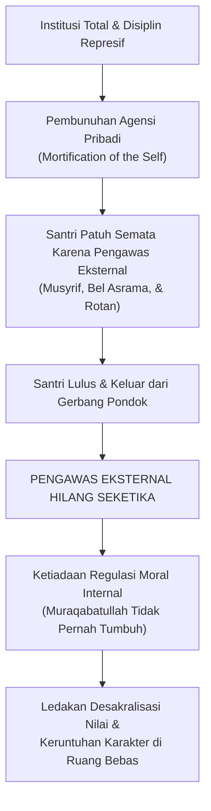

Ketika seorang santri lulus dari pesantren semacam ini, **pengawas eksternal (musyrif, bel asrama, ancaman takzir) tiba-tiba lenyap sama sekali**. Karena selama bertahun-tahun di asrama ia tidak pernah dilatih membangun kendali moral internal (*Internal Locus of Control / Muraqabatullah*), jiwanya limbung tanpa arah. Nilai-nilai adab yang dihafalnya tidak pernah mengakar menjadi watak kepribadian sejati; nilai-nilai itu hanyalah seragam formalitas yang ia kenakan demi menghindari hukuman. Begitu seragam ancaman itu dilepas, runtuhlah seluruh bangunan moralitasnya.

---

### 1.2 Dekonstruksi Ilmiah: Mengapa Hukuman Fisik dan Bentakan Merusak Nalar Santri?

Banyak pengasuh dan pembina asrama berdalih dengan argumentasi yang terdengar sangat agung: *"Niat kami membentak dan memukul bukan karena benci, melainkan demi kebaikan santri itu sendiri. Agar mentalnya sekuat baja! Dari zaman dahulu, pesantren memang keras, dan terbukti melahirkan ulama-ulama besar!"*

Mari kita bedah mitos ini secara telanjang melalui sains mutakhir: **Neurosains Perkembangan (*Developmental Neuroscience*)** dan **Teori Polivagal (*Polyvagal Theory*)**.

Secara anatomis dan fungsional, otak manusia tersusun atas tiga tingkatan evolusioner (*The Triune Brain Model*) yang terintegrasi:

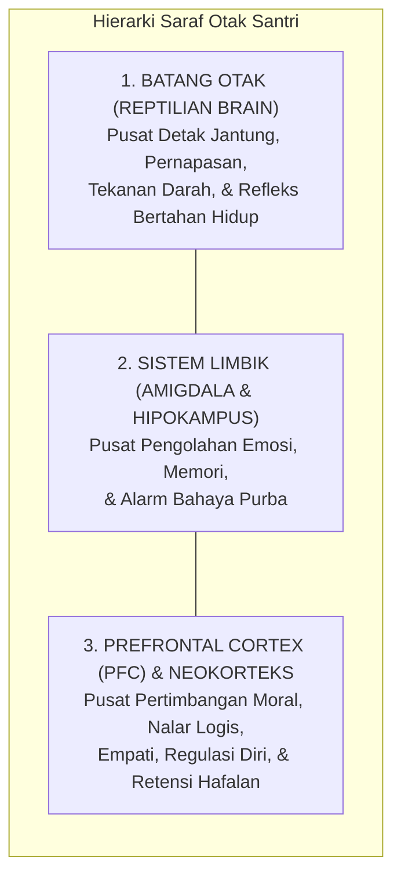

1. **Batang Otak (*Brainstem*)**: Lapisan paling dasar yang mengendalikan fungsi vital otonom tubuh: ritme napas, tekanan darah, dan refleks mempertahankan hidup.
2. **Sistem Limbik (terutama Amigdala dan Hipokampus)**: Pusat pemrosesan emosi primer, pembentukan keterikatan kasih sayang (*attachment*), dan deteksi sinyal ancaman bahaya.
3. **Korteks Prafrontal (*Prefrontal Cortex / PFC*)**: Mahkota luhur penciptaan manusia—area otak di balik kening yang bertanggung jawab atas **Fungsi Eksekutif (*Executive Functions*)**: kemampuan menalar sebab-akibat, membedakan hak dan batil, mengendalikan hawa nafsu, merasakan empati mendalam terhadap penderitaan sesama, serta memori kerja (*working memory*) yang mutlak dibutuhkan santri untuk menghafal ayat-ayat Al-Qur'an, hadits, dan kaidah ilmu.

PFC adalah organ otak yang paling lambat matang; pada usia santri remaja (12–18 tahun), PFC masih berada dalam fase konstruksi biologis yang sangat rapuh dan sensitif terhadap rangsangan lingkungan.

#### Kronologi Detik demi Detik Pembajakan Saraf (Neurobiological Hijacking)
Apa yang sesungguhnya terjadi di dalam tengkorak kepala seorang santri ketika seorang pembina melotot, menunjuk wajahnya, membentaknya dengan suara menggelegar, atau mengangkat tongkat rotan di hadapannya?

* **Milidetik ke-50 hingga ke-100**: Gelombang suara bentakan dan ekspresi wajah marah sang pembina ditangkap oleh indera santri dan langsung diteruskan ke talamus menuju **Amigdala**, tanpa melewati jalur nalar PFC. Amigdala membaca stimulus ini sebagai ancaman predator yang mematikan.
* **Milidetik ke-150 hingga ke-300**: Amigdala seketika menyalakan alarm darurat biologis melalui **Sumbu Hipotalamus-Pituitari-Adrenal (HPA Axis)**. Sinyal darurat ini memerintahkan kelenjar adrenal untuk membanjiri peredaran darah dengan hormon stres dosis tinggi: **Kortisol, Adrenalin, dan Noradrenalin**.
* **Detik ke-1**: Terjadi fenomena yang dinamakan **Vasokonstriksi Perifer dan Deaktivasi Kortikal**. Detak jantung memompa cepat, glukosa darah melonjak, dan aliran darah secara masif dialihkan dari otak luhur (PFC) menuju kelompok otot-otot besar di tangan dan kaki untuk mempersiapkan tubuh bertarung (*fight*) atau melarikan diri (*flight*).

Pada detik inilah terjadi bencana pedagogis: **Korteks Prafrontal (PFC) mengalami kelumpuhan fungsional (*Prefrontal Shutdown*)**[^3]. Sirkuit saraf penalaran moral santri terputus total.

Secara biologis murni, **seorang anak yang otaknya sedang dibanjiri hormon stres berada dalam ketidakmampuan fisik untuk mencerna nasihat moral, merenungkan kesalahannya, atau menghayati nilai-nilai kebaikan**. Otak purbanya hanya memiliki satu tujuan tunggal saat itu: bagaimana caranya agar tubuhnya selamat dari ancaman sang pembina.

#### Teori Polivagal: Menelanjangi Makna Sikap "Menunduk Diam" Santri
Dr. Stephen Porges, perumus **Teori Polivagal (*Polyvagal Theory*)**, menjelaskan bahwa sistem saraf otonom manusia merespons stres melalui tiga hierarki keadaan biologis:

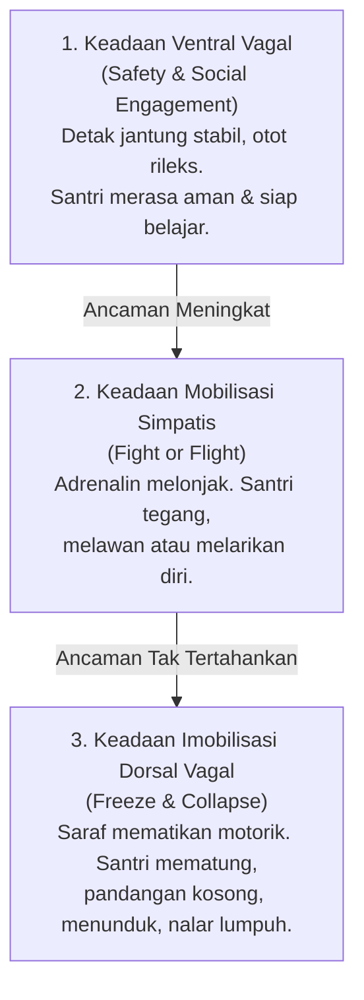

Ketika seorang santri berdiri mematung di hadapan pembina yang membentaknya, tidak membantah sepatah kata pun, dan menundukkan kepalanya dalam-dalam, sebagian besar musyrif merasa puas: *"Lihat, anak ini langsung tunduk dan patuh!"*

Ketahuilah wahai para pendidik: **anak itu menunduk bukan karena takzim kepada nasihat Anda!**

Secara neurobiologis, anak tersebut telah terlempar ke dalam **Keadaan Imobilisasi Dorsal Vagal (*Dorsal Vagal Shutdown*)**[^4]. Ini adalah respons saraf paling purba ketika tubuh menyadari bahwa melawan (*fight*) mustahil menang dan melarikan diri (*flight*) tidak ada jalan keluar. Sistem saraf parasimpatisnya mematikan fungsi motorik agar tubuhnya mematung (*freeze/playing dead*), persis seperti seekor binatang mangsa kecil yang lumpuh di bawah cengkeraman taring singa.

Sikap menunduk itu adalah wujud **kelumpuhan biologis akibat teror mental**. Di balik ketundukan itu, tidak ada sebutir pun kesadaran moral yang tumbuh; yang tersisa di dalam hatinya hanyalah rasa terhina, dendam yang terpendam, serta keputusasaan yang merusak harga dirinya sebagai manusia.

#### Racun Neurotoksik Kortisol terhadap Pusat Memori Hafalan Al-Qur'an
Tragedi ini berlanjut pada dimensi intelektual dan spiritual santri. Mengapa santri yang hidup di bawah lingkungan asrama yang sarat bentakan dan kekerasan fisik justru sangat lambat menyerap hafalan Al-Qur'an dan sering lupa saat tasmi'?

Sains memberikan bukti tak terbantahkan: **Kortisol yang diproduksi secara kronis akibat rasa takut yang terus-menerus bersifat neurotoksik (meracuni sel-sel otak)**[^5].

Di samping amigdala, terdapat struktur berbentuk kuda laut yang bernama **Hipokampus (*Hippocampus*)**—organ vital yang bertugas memproses, mengonsolidasi, dan menyimpan memori jangka panjang. Hipokampus adalah organ yang bekerja keras setiap kali santri menghafal ayat Al-Qur'an atau memahami kaidah nahwu-sharaf.

Ketika santri mengalami stres kronis:
1. Reseptor glukokortikoid di hipokampus dibanjiri oleh kortisol secara terus-menerus.
2. Kelebihan hormon kortisol ini menyebabkan **Atrofi Dendritik (pengerutan dan pemutusan cabang-cabang sinapsis antar-sel saraf)** di hipokampus.
3. Produksi sel saraf baru (*neurogenesis*) di area hipokampus terhenti total.

> *Bagaimana mungkin seorang santri dapat menghafal kalamullah dengan bening dan menancapkannya ke dalam kalbunya, jika pada saat yang sama lingkungan asramanya meracuni otaknya setiap hari dengan hormon stres yang menghancurkan sel-sel memorinya?*

Mendidik santri dengan teror bentakan dan kekerasan fisik bukanlah metode syar'i; itu adalah kejahatan biologis yang menghancurkan potensi akal budi ciptaan Allah ﷻ.

---

### 1.3 Ilusi Tokenisme: Ketika Pahala Digantikan Poin Minus dan Birokrasi Skor

Ketika sebagian pesantren mulai menyadari bahwa kekerasan fisik telah melahirkan trauma dan kecaman masyarakat, mereka mencari alternatif pembinaan yang tampak modern, terukur, dan profesional. Pilihan mereka kerap jatuh pada **Sistem Poin Pelanggaran dan Token Ekonomi Mekanistik**.

Buku-buku tata tertib dicetak dengan daftar tarif pelanggaran yang sangat rinci:
* Terlambat salat berjamaah: minus 5 poin.
* Tidak mengikuti piket asrama: minus 10 poin.
* Sandal tidak diletakkan di rak: minus 2 poin.
* Berbicara dengan bahasa daerah: minus 5 poin.
* Mengantongi akumulasi minus 50: pembersihan kamar mandi umum.
* Mengantongi akumulasi minus 100: skorsing kepulangan satu pekan.

Sekilas pandang, sistem ini tampak sangat adil, objektif, dan bebas dari amarah pribadi pengasuh. Namun, dalam praksis pendidikan pesantren 24 jam, sistem birokrasi skor ini justru melahirkan bencana pedagogis baru yang tak kalah mematikan: **Komodifikasi Adab, Desakralisasi Niat, dan Matinya Rasa Berdosa**.

#### Korupsi Niat Ikhlas: Overjustification Effect
Dalam diskursus ilmu tasawuf dan tarbiyah ruhaniyah, niat ikhlas (*al-ikhlas*) adalah poros dari seluruh amal kebajikan. Seorang santri semestinya salat di saf pertama karena rindu bermunajat kepada Allah; ia semestinya menyapu lantai asrama karena mengamalkan nilai kebersihan sebagai cabang dari keimanan; ia semestinya menolong temannya karena dorongan cinta ukhuwah imaniyah.

Ketika seluruh amal kebajikan tersebut dikonversi menjadi perolehan "poin plus" dan setiap kesalahan dikonversi menjadi "poin minus", sistem ini sedang mendidik santri menjadi **pribadi yang transaksional dan materialistik**.

Prof. Edward Deci dan Richard Ryan dalam penelitian monumental mereka mengenai *Self-Determination Theory* (SDT) menemukan fenomena psikologis yang disebut **Efek Pembenaran Berlebih (*The Overjustification Effect*)**[^6]. Ketika sebuah perilaku mulia yang semestinya digerakkan oleh motivasi intrinsik (nilai moral, cinta kebenaran, kesenangan berbuat baik) dikaitkan secara kaku dengan imbalan atau hukuman ekstrinsik (poin, hadiah materi, kartu skor), maka motivasi intrinsik tersebut **mati secara perlahan**.

Santri tidak lagi menyapu masjid karena ingin membersihkan rumah Allah; ia menyapu masjid demi mengejar 10 poin pemutihan catatan hitamnya. Begitu sistem poin ditarik dari kehidupannya (misalnya saat liburan atau setelah lulus), lenyap pulalah seluruh dorongannya untuk berbuat kebajikan, karena ia tidak pernah dilatih mencintai kebajikan itu demi kebajikan itu sendiri.

#### Kalkulasi Dosa Tanpa Penyesalan Batin
Lebih berbahaya lagi, sistem poin mengubah persepsi santri tentang hakikat kemaksiatan dan pelanggaran adab. Pelanggaran tidak lagi dipandang sebagai dosa yang menodai hati (*ar-ran*) dan mencabik ukhuwah, melainkan dipandang sebagai **harga transaksi yang dapat dibayar**.

Dengarkan bagaimana percakapan santri di kamar asrama saat malam hari:
> *"Akhi, malam ini kita kabur ke warung kopi luar pondok yuk!"*  
> Temannya menjawab sambil membuka buku saku pelanggaran:  
> *"Berapa minusnya kalau ketahuan keluar pagar?"*  
> *"Minus 20 poin."*  
> *"Oh, poin aman saya masih ada 45. Masih sisa 25 poin lagi sebelum kena skorsing. Gas, berangkat!"*

Perhatikan logika moral di atas! Santri tidak lagi memikirkan apakah tindakannya membuat orang tuanya sedih, apakah tindakannya mengecewakan para asatidz, atau bagaimana pertanggungjawabannya di hadapan Allah. Ia semata-mata sedang melakukan **kalkulasi finansial-moral**: ia membeli kebebasan melanggar aturan dengan membayar sejumlah poin yang masih tersedia di saldonya. Sistem ini telah mencabut rasa malu (*al-haya'*) dan rasa takut (*al-khauf*) dari dalam kalbu santri.

#### Devolusi Peran Musyrif: Dari Ayah Ruhani Menjadi Sipir Tilang
Dampak paling tragis dari sistem birokrasi poin ini menimpa para pembina dan musyrif itu sendiri. Musyrif asrama semestinya berperan sebagai **abun rohim** (ayah yang penuh welas asih), tempat santri mengadu saat rindu kampung halaman, tempat santri mencurahkan kegundahan batinnya saat menghadapi kesulitan belajar, serta pembimbing yang menuntun dengan keteladanan hidup (*qudwah*).

Namun di bawah tirani birokrasi poin, peran luhur tersebut mengalami devolusi: musyrif terdegradasi menjadi **polisi lalu lintas yang sibuk menilang**. 

Musyrif tidak lagi memiliki waktu untuk duduk bersila di samping tempat tidur santri, menepuk pundaknya, dan bertanya dengan lembut: *"Nak, kenapa matamu sembab pagi ini? Apa yang sedang merisaukan hatimu?"* Musyrif terlalu sibuk memegang bolpoin dan papan jalan, mencatat siapa yang terlambat 2 menit masuk masjid, siapa yang pecinya miring, dan siapa yang sandalnya belum masuk rak. Relasi kasih sayang antara pendidik dan anak didik mati, digantikan oleh relasi birokrasi yang dingin dan penuh kecurigaan.

---

### 1.4 Manifesto TUMBUH: Tarbiyah Berbasis Pertumbuhan Fitrah

Menghadapi jalan buntu antara **represi feodal yang meremukkan saraf** di satu sisi dan **transaksionalisme poin yang mematikan keikhlasan** di sisi lain, ekosistem **TUMBUH** memancangkan panji pembaruan tarbiyah kepesantrenan.

Kata **TUMBUH** bukanlah jargon kosmetik, melainkan kristalisasi dari sebuah ikhtiar pemahaman tentang hakikat pendidikan Islam: **Pendidikan Karakter adalah Seni Menumbuhkan Benih Hayati, Bukan Proses Menempa Logam Mesin Pabrik**.

Perhatikan kontras yang sangat mendasar antara dua pandangan hidup ini:

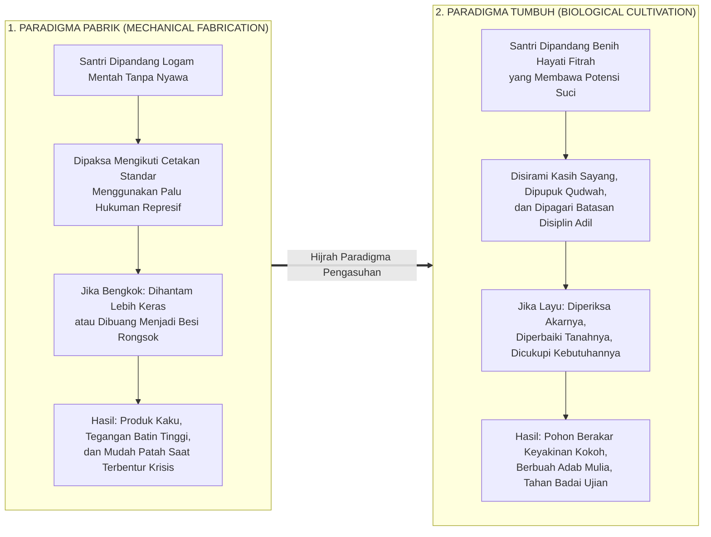

Al-Qur'an al-Karim mengabadikan perumpamaan manusia beriman dan kalimat thayyibah bukan seperti benteng batu yang kaku, melainkan seperti **pohon yang hidup dan bertumbuh**:

> أَلَمْ تَرَ كَيْفَ ضَرَبَ اللَّهُ مَثَلًا كَلِمَةً طَيِّبَةً كَشَجَرَةٍ طَيِّبَةٍ أَصْلُهَا ثَابِتٌ وَفَرْعُهَا فِي السَّمَاءِ ۝ تُؤْتِي أُكُلَهَا كُلَّ حِينٍ بِإِذْنِ رَبِّهَا ۗ وَيَضْرِبُ اللَّهُ الْأَمْثَالَ لِلنَّاسِ لَعَلَّهُمْ يَتَذَكَّرُونَ
>
> *"Tidakkah kamu memperhatikan bagaimana Allah telah membuat perumpamaan kalimat yang baik seperti pohon yang baik, akarnya teguh menghunjam ke dalam bumi dan cabangnya menjulang tinggi ke langit. Pohon itu menghasilkan buahnya pada setiap musim dengan izin Rabb-nya. Dan Allah membuat perumpamaan-perumpamaan itu untuk manusia agar mereka selalu ingat."*  
> (QS. Ibrahim [14]: 24–25)[^7]

Imam Abu Ja'far Ibnu Jarir Ath-Thabari dalam kitab tafsirnya meriwayatkan penafsiran dari sahabat Abdullah bin Abbas رضي الله عنهما mengenai ayat ini: bahwa *syajaratin thayyibah* (pohon yang baik) adalah perumpamaan kalbu dan jiwa seorang mukmin; akarnya yang kokoh menghunjam di bumi adalah keimanan tauhid (*La ilaha illallah*) yang menancap di batinnya, cabangnya yang menjulang ke langit adalah amal shalih dan akhlak mulianya yang diangkat ke haribaan Allah, serta buahnya adalah adab dan kebajikan yang dipetik setiap saat.[^7] 

Penafsiran ini diperkuat oleh Al-Hafizh Ibnu Katsir dalam *Tafsir al-Qur'an al-'Azhim*, yang menggarisbawahi bahwa sebagaimana sebatang pohon yang subur menuntut tanah yang bersih, siraman air yang cukup, serta perlindungan dari gulma parasit agar buahnya manis berkelanjutan, demikian pulalah jiwa seorang mukmin: fitrah tauhid di dalam jiwanya menuntut siraman ilmu yang bersih dan ekosistem tarbiyah yang sehat agar akarnya tidak layu dan buah adabnya tidak membusuk.[^8]

Renungkanlah perumpamaan agung ini!
Seorang petani yang memiliki akal sehat tidak akan pernah memarahi benih mangganya yang baru bersemi karena benih itu belum menghasilkan buah manis. Petani tidak akan memukul tunas pohonnya dengan kayu balok agar tunas itu tumbuh lebih cepat. Petani tidak akan mencabik-cabik kuncup bunga yang belum mekar karena merasa tidak sabar.

Jika seorang petani melihat daun tanamannya menguning dan layu:
* Ia tidak akan melabeli tanaman itu sebagai "tanaman pembangkang yang tidak tahu diri".
* Petani yang bijak akan segera memeriksa tanahnya: *Apakah tanahnya terlalu kering sehingga kekurangan air? Apakah saluran drainasenya tersumbat hingga membusukkan akarnya? Apakah sinar matahari terhalang oleh dedalu liar? Apakah ada ulat parasit yang menggerogoti batangnya di malam hari?*

Begitulah hakikat pendidik dalam arsitektur **TUMBUH**:
Ketika seorang santri melakukan pelanggaran adab—ia membolos salat subuh, berkata kotor kepada temannya, atau mencuri makanan di kantin—pendidik TUMBUH tidak memandangnya sebagai sampah masyarakat yang harus segera dihantam dengan rotan atau diusir keluar pondok. 

Pendidik TUMBUH akan membedah ekosistem kehidupannya:
* *Apa kebutuhan jiwa santri ini yang sedang terluka dan belum terpenuhi?*
* *Apakah ia mengalami stres adaptasi yang belum terselesaikan sejak terpisah dari orang tuanya?*
* *Apakah ia merasa terkucil dan tidak aman di kamarnya?*
* *Apakah jam belajarnya terlalu padat sehingga tubuh biologisnya mengalami kelelahan saraf yang akut?*
* *Keteladanan apa yang luput kami hadirkan di hadapannya selama ini?*

Santri tidak diciptakan sebagai kertas kosong tanpa nilai (*tabula rasa*), bukan pula terlahir membawa kutukan dosa asali. Santri lahir membawa **benih fitrah kesucian bertauhid** sebagaimana disabdakan oleh Rasulullah ﷺ:

> كُلُّ مَوْلُودٍ يُولَدُ عَلَى الْفِطْرَةِ، فَأَبَوَاهُ يُهَوِّدَانِهِ أَوْ يُنَصِّرَانِهِ أَوْ يُمَجِّسَانِهِ
>
> *"Setiap anak dilahirkan di atas fitrah (kesucian bertauhid). Maka kedua orang tuanyalah (lingkungan pengasuhnya) yang menjadikannya Yahudi, Nasrani, atau Majusi."*  
> (HR. Al-Bukhari no. 1358 dan Muslim no. 2658)[^9]

Tugas kita sebagai pendidik bukanlah "memasukkan karakter dari luar dengan palu godam", melainkan **menghilangkan penghalang-penghalang biologis, emosional, dan sosial yang menutupi fitrah tersebut, lalu menyiraminya hingga mekar menjadi pohon adab yang kokoh**.

---

### 1.5 Pembedahan Praksis: Matriks Operasional Hukuman Retributif vs Disiplin Restoratif TUMBUH

Bagaimana revolusi paradigma ini bekerja dalam praksis kehidupan asrama sehari-hari? Mari kita sandingkan secara terperinci antara pendekatan retributif (lama) dengan pendekatan edukatif-restoratif TUMBUH dalam menangani dinamika nyata pelanggaran santri:

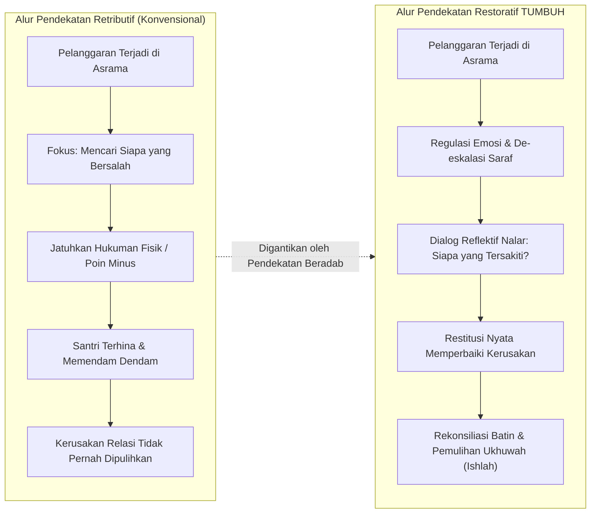

Untuk memberikan kejelasan mutlak tanpa ruang abu-abu bagi para asatidz dan musyrif, perhatikan komparasi lima kasus riil lapangan berikut:

#### Kasus 1: Santri Terlambat Bangun Salat Subuh
* **Pendekatan Lama (Retributif)**: Musyrif menyiram santri dengan air ember dingin, membentaknya di depan pintu kamar, lalu menyuruhnya berdiri dengan satu kaki di halaman masjid selama salat berjamaah berlangsung.
  * *Dampak*: Tubuh santri menggigil masuk angin, amigdalanya terkunci dalam kepanikan, rasa cintanya pada salat subuh berganti menjadi kebencian pada ritual tersebut, dan ia merasa harga dirinya diinjak-injak di hadapan kawan-kawannya.
* **Protokol Edukasi Restoratif TUMBUH**:
  1. **Regulasi Awal**: Musyrif membangunkan dengan sentuhan lembut di bahu sambil membaca doa bangun tidur atau melantunkan azan dengan nada yang menenteramkan kalbu.
  2. **Audit Kausalitas**: Di siang hari, musyrif duduk bersama santri tersebut untuk menelusuri akar masalahnya: *"Mengapa antum sangat sulit membuka mata subuh tadi? Pukul berapa antum tidur semalam? Apa yang antum lakukan setelah isya?"*
  3. **Tindakan Perbaikan (*Logical Consequence*)**: Jika santri begadang mengobrol dengan temannya, konsekuensi logisnya adalah penyesuaian jam malam kamar: malam itu ia wajib memadamkan lampu dan beristirahat lebih awal (pukul 21.30) dengan pendampingan musyrif untuk memulihkan ritme biologis otaknya. Santri memahami bahwa aturan tidur dibuat demi menjaga kesehatan otaknya sendiri.

#### Kasus 2: Santri Terlibat Perkelahian Fisik di Asrama
* **Pendekatan Lama (Retributif)**: Kedua santri yang berkelahi dipukul tangannya dengan rotan, dicukur gundul rambutnya, dan dipaksa saling meminta maaf secara dingin di depan forum rapat asrama.
  * *Dampak*: Permusuhan batin tidak pernah padam. Mereka pura-pura berdamai di depan musyrif, namun di belakang mereka merencanakan perkelahian lanjutan di luar pondok atau saling menjatuhkan nama baik melalui teman sebaya.
* **Protokol Edukasi Restoratif TUMBUH**:
  1. **Pemisahan & Penenangan (*Cooling Down*)**: Kedua santri dipisahkan ke ruangan yang berbeda. Musyrif memberikan waktu dan air minum hingga ritme napas dan detak jantung keduanya turun ke kondisi stabil (*down-regulated*). Dilarang menginterogasi anak yang amigdalanya masih menyala merah.
  2. **Eksplorasi Sudut Pandang (*Hearing Both Sides*)**: Masing-masing santri diajak mengekspresikan perasaannya secara jujur tanpa dihakimi: *"Apa yang membuatmu merasa sangat marah hingga melayangkan pukulan? Kebutuhan apa yang ingin kamu sampaikan tadi?"*
  3. **Fasilitasi Lingkaran Restoratif (*Restorative Circle*)**: Keduanya dipertemukan kembali dengan dipandu musyrif. Masing-masing mendengarkan dampak rasa sakit fisik dan batin yang dialami oleh lawannya.
  4. **Ishlah al-Bain Nyata**: Pelaku yang memulai pemukulan berkomitmen mengobati luka temannya (mengantarkannya ke klinik asrama dan merawatnya), serta keduanya menyepakati protokol komunikasi baru jika terjadi perbedaan pendapat di masa mendatang.

#### Kasus 3: Santri Kedapatan Merokok di Balik Kamar Mandi
* **Pendekatan Lama (Retributif)**: Rokok dimasukkan ke dalam mulut santri sekaligus lalu dipaksa mengunyahnya, atau santri dijemur di tengah lapangan terik matahari sambil mengalungkan bungkus rokok di lehernya.
  * *Dampak*: Kerusakan organ pencernaan santri akibat tembakau yang tertelan, trauma psikologis akut, dan lahirnya rasa dendam kesumat yang mendorong santri melampiaskan kenakalannya ke tingkat yang lebih ekstrem (narkoba atau kabur).
* **Protokol Edukasi Restoratif TUMBUH**:
  1. **Penyitaan Bermartabat**: Rokok disita tanpa mencaci-maki santri dengan kata-kata keji. Santri dipanggil ke ruang konseling secara tertutup demi menjaga kehormatan namanya (*hifzh al-'irdh*).
  2. **Functional Behavior Assessment (FBA)**: Tim BK atau musyrif senior menggali motif dasar perilaku merokok tersebut: *Apakah santri merokok karena tekanan kelompok sebaya (peer pressure)? Apakah sebagai pelarian dari rasa cemas dan depresi akibat target hafalan? Ataukah meniru perilaku orang dewasa di keluarganya?*
  3. **Edukasi Sains Adiksi**: Santri diajak mempelajari mekanisme kerja nikotin yang membajak dopamin otak, serta dampak asap rokok terhadap penurunan kapasitas paru-paru santri atletik.
  4. **Restitusi & Layanan Asrama**: Sebagai wujud tanggung jawab atas pencemaran udara asrama yang dilakukannya, santri mendapatkan tugas restoratif yang bernilai manfaat: membersihkan dan menanam tanaman hijau penyaring udara di taman asrama selama sepekan di bawah bimbingan guru lingkungan hidup.

#### Kasus 4: Ghashab Berulang dan Pencurian Uang Saku Kamar
* **Pendekatan Lama (Retributif)**: Santri yang terbukti mencuri uang atau sandal kawan diarak keliling asrama dengan papan bertuliskan *"SAYA PENCURI"*, dipukul telapak tangannya di depan apel santri, dan langsung diancam dikeluarkan dari pondok dalam tempo 24 jam.
  * *Dampak*: Hancurnya martabat sosial anak secara permanen. Cap (*labeling*) sebagai pencuri melekat hingga santri menjadi putus asa dari rahmat Allah, terlempar ke dalam asosiasi anak-anak nakal di luar, dan memendam kebencian abadi pada institusi agama.
* **Protokol Edukasi Restoratif TUMBUH**:
  1. **Penyelidikan Kausalitas Tertutup**: Musyrif dan konselor memanggil santri secara empat mata tanpa mempermalukannya di depan kamar. Tim mengurai motif tindakan: *Apakah anak tersebut kehabisan uang saku karena kiriman orang tua terlambat dan ia kelaparan biologis? Ataukah terjerat utang jajanan? Ataukah dorongan impulsif kleptomania akibat rasa terasing?*
  2. **Audit Sistem Lingkungan Kamar**: Mengidentifikasi celah keamanan kamar yang memicu anteseden pencurian: ketiadaan loker berkunci, kebiasaan menaruh dompet sembarangan, serta normalisasi ghashab sandal yang mengikis sensitivitas dosa.
  3. **Restitusi Tertutup Penuh Kehormatan**: Santri wajib mengembalikan sejumlah uang yang diambil secara utuh. Jika uang telah habis dibelanjakan dan santri tidak memiliki tabungan, santri diberikan pekerjaan berbayar yang bermanfaat di lingkungan pondok (seperti membantu penataan arsip perpustakaan atau pemilahan kompos pertanian) hingga upahnya mencukupi untuk melunasi hak saudaranya secara tertutup.
  4. **Pemulihan Relasi Personal**: Pelaku menyampaikan permohonan maaf secara pribadi kepada korban dengan disaksikan konselor tanpa mengumumkan aibnya kepada seluruh penghuni kamar, diikuti akad saling menjaga kehormatan.

#### Kasus 5: Penyelundupan Gawai (Smartphone) dan Konsumsi Konten Terlarang
* **Pendekatan Lama (Retributif)**: Gawai santri dibanting atau dihancurkan dengan palu di depan seluruh santri saat apel akbar, disusul ceramah makian publik mengenai "santri perusak moral asrama", lalu santri dicukur gundul dan dipajang di dekat pos gerbang utama.
  * *Dampak*: Dendam material karena kerugian harta bernilai jutaan rupiah (yang dibeli dengan jerih payah keringat orang tua), trauma penghinaan publik, serta makin lihainya jaringan santri lain dalam menyembunyikan gawai di tempat yang lebih ekstrem (menggali tanah atau di balik plafon masjid).
* **Protokol Edukasi Restoratif TUMBUH**:
  1. **Penyitaan Administratif Tertutup**: Gawai diamankan dengan tanda terima resmi bernomor inventaris, disimpan di brankas pengasuhan, dan hanya dapat diambil oleh orang tua kandung pada jadwal pertemuan khusus.
  2. **Literasi Neurosains Pembajakan Dopamin**: Santri tidak dicap bejat, melainkan diajak memahami bagaimana industri teknologi digital sengaja merancang algoritma kecanduan (*infinite scroll* dan pornografi) yang membajak *nucleus accumbens* otak remaja dan melumpuhkan reseptor dopamin alami.
  3. **Detoksifikasi Digital & Pendampingan Muraqabah**: Santri mengikuti program pemulihan konsentrasi batin melalui puasa sunnah, peningkatan zikir *al-Ma'tsurat*, pendampingan halaqah tadabbur Al-Qur'an, dan penyaluran energi fitrah melalui olahraga beladiri atau seni kaligrafi.
  4. **Kontrak Akuntabilitas Keluarga**: Pertemuan tripartit antara santri, wali santri, dan konselor pondok untuk menyusun kesepakatan penggunaan teknologi secara sehat dan terawasi saat masa liburan di rumah.

---

### 1.6 Tabel Komparasi Paradigma: Pendekatan Tradisional Coercive vs Ekosistem Progresif TUMBUH

Untuk melihat gambaran komprehensif perubahan lanskap kelembagaan yang ditawarkan oleh TUMBUH, perhatikan matriks komparasi delapan dimensi fundamental berikut:

| Dimensi Kelembagaan | Pendekatan Tradisional Coercive (Status Quo) | Paradigma Progresif Fitrah TUMBUH |
| :--- | :--- | :--- |
| **1. Pandangan tentang Hakikat Santri** | Dipandang sebagai bejana kosong yang berpotensi liar; harus ditundukkan dan dicetak paksa dari luar menggunakan instrumen rasa takut. | Dipandang sebagai makhluk mulia berfitrah tauhid yang membawa potensi adab; tugas pendidik adalah menumbuhkan benih dan menyingkirkan parasit. |
| **2. Sumber Motivasi Kepatuhan** | Motivasi Ekstrinsik Rendah: Takut rotan pembina, takut dipermalukan di depan umum, atau transaksional poin minus. | Motivasi Intrinsik Luhur: Kesadaran moral bertauhid (*muraqabatullah*), cinta adab, dan rasa tanggung jawab sosial. |
| **3. Peran Musyrif & Pendidik** | Pengawas keamanan (*warden*), penegak hukum yang dingin, pemburu kesalahan santri, dan hakim penghukum. | Ayah ruhani (*abun rohim*), teladan hidup (*qudwah hasanah*), fasilitator pemulihan, dan mitra tumbuh kembang jiwa. |
| **4. Cara Menangani Pelanggaran** | Retributif-Punitive: Hukuman fisik, caci maki verbal, cukur gundul, penjemuran di terik matahari, atau skorsing sepihak. | Edukatif-Restoratif: De-eskalasi emosi saraf, audit fungsional (FBA), restitusi nyata memperbaiki kerusakan, dan rekonsiliasi (*ishlah*). |
| **5. Iklim Sosial Asrama** | Diliputi kecemasan laten, budaya kepura-puraan (*feigned compliance*), feodalisme senior-junior, dan normalisasi ghashab. | Aman secara psikologis (*psychological safety*), transparan, penuh ukhuwah egaliter, dan penghormatan sakral pada hak milik orang lain. |
| **6. Metrik Keberhasilan Pembinaan** | Ketertiban semu di depan mata pembina, nol suara bising, dan formalitas tuntasnya jadwal harian. | Kematangan regulasi diri (*self-regulation*), integritas moral saat sendirian, dan kecakapan memecahkan masalah hidup. |
| **7. Ketahanan Karakter Pasca-Lulus** | Rapuh dan rentan meledak; banyak alumni mengalami gegap budaya (*culture shock*) dan menanggalkan nilai-nilai pondok. | Kokoh, adaptif, dan mandiri; nilai-nilai adab tetap menyala terang di tengah arus dinamika modernitas global. |
| **8. Penjagaan Martabat Kemanusiaan** | Martabat anak kerap dikorbankan demi efisiensi ketertiban lembaga dan wibawa semu figur pembina. | Perlindungan anak (*child safeguarding*) dan kehormatan jiwa santri merupakan pilar syar'i non-negosiabel (*hifzh an-nafs wa al-'irdh*). |

---

### 1.7 Piagam Janji Suci Pendidik TUMBUH (Mīthāq Tarbawī Bi'ah Amānah)

Transformasi peradaban tidak dapat dicapai hanya dengan menuliskan buku tebal; transformasi menuntut ikrar komitmen batin dari setiap jiwa yang memilih jalan mulia sebagai pendidik santri. Seluruh civitas akademika—mulai dari pimpinan pondok, kyai, asatidz, hingga musyrif asrama—mengikatkan jiwanya dalam **Tujuh Ikrar Suci Pendidik TUMBUH**:

1. **Memandang Santri dengan Pandangan Rahmah dan Takzim**: Kami bersumpah memandang setiap santri sebagai amanah suci titipan Allah ﷻ, bukan sebagai objek pelampiasan amarah atau kelelahan emosional pribadi kami.
2. **Mengharamkan Kekerasan Fisik dan Pelecehan Kehormatan**: Kami bersumpah menolak dan melarang segala bentuk tamparan, pukulan tongkat, tendangan, bentakan yang menghina harga diri, cukur botak pembalasan, serta penjemuran fisik yang merusak raga dan jiwa santri.
3. **Mendahulukan Hubungan Hati Sebelum Menuntut Kepatuhan (*Connect Before Correct*)**: Kami bersumpah tidak akan pernah menegur atau menghakimi santri dalam keadaan amarah membakar; kami akan meregulasi diri kami sendiri terlebih dahulu dan memulihkan rasa aman santri sebelum membimbing akal budinya.
4. **Membongkar Akar Masalah di Balik Gejala (*Focus on Needs, Not Just Behaviors*)**: Kami bersumpah tidak malas dalam mendiagnosis kenakalan santri; kami akan mencari akar luka batin, keletihan saraf, atau defisit keterampilan di balik setiap pelanggaran adab yang tampak.
5. **Menegakkan Keadilan Restoratif yang Menghidupkan Ukhuwah**: Kami bersumpah mengganti pembalasan dendam dengan restitusi nyata yang mendidik tanggung jawab, memulihkan korban yang tersakiti, dan merajut kembali tali persaudaraan (*ishlah al-bain*).
6. **Menjadi Teladan Hidup Sebelum Menjadi Pengkhotbah (*Qudwah Qabla Da'wah*)**: Kami bersumpah tidak akan menuntut santri jujur jika kami berbohong; kami tidak akan menuntut santri tepat waktu jika kami terlambat; dan kami tidak akan menuntut santri beradab jika lisan kami masih gemar memaki.
7. **Menjaga Kerahasiaan Aib Santri Sebagaimana Kami Menjaga Aib Diri Sendiri**: Kami bersumpah menjaga kehormatan nama baik santri dan keluarganya, tidak mengumbar kelemahan mereka di media sosial atau forum publik, serta menuntun mereka menuju pintu taubat dengan penuh kasih sayang.

---

### 1.8 Panggilan Nurani Pendidik: Jika Santri Itu Adalah Anak Kandung Kita

Wahai para guru yang kami muliakan, para asatidz yang ikhlas, para musyrif yang berpeluh keringat di lorong-lorong asrama, serta segenap pengemban amanah pendidikan Islam!

Sebelum kita melangkah lebih jauh membedah lembar demi lembar arsitektur fundamental ini, mari kita letakkan sejenak segala buku catatan kita, pejamkan mata, dan hadirkan sebuah perenungan mendalam ke dalam relung kalbu kita yang paling jujur:

> *Bayangkan anak kandung Anda sendiri—darah daging yang kelahirannya Anda sambut dengan linangan air mata haru, yang tangisannya di tengah malam Anda dekap dengan penuh kelembutan, yang tawanya menjadi penyejuk jiwa di saat Anda letih mencari nafkah—kini telah tumbuh menjadi remaja berusia dua belas tahun.*
>
> *Dengan penuh tawakal dan linangan air mata perpisahan, Anda melepaskannya masuk ke sebuah pondok pesantren. Anda mencium keningnya di depan gerbang, berdoa kepada Allah agar anak kesayangan Anda kelak menjadi alim yang beradab dan hafizh Al-Qur'an.*
>
> *Lalu bayangkan di suatu malam yang pekat dan dingin, anak kesayangan Anda itu melakukan sebuah kesalahan karena keluguannya atau kelelahan fisiknya. Di sudut lorong asrama itu, seorang pembina melotot di hadapannya dengan urat leher menegang, memakinya dengan sebutan binatang yang menghancurkan harga dirinya, lalu mencukur botak separuh rambutnya di hadapan ratusan kawan-kawannya hingga anak Anda menangis tersedu-sedu menahan malu yang tak terperi.*
>
> *Di malam hari saat lampu asrama dipadamkan, anak kesayangan Anda meringkuk di bawah selimut tipisnya yang lembap, menangis terisak menahan rasa sakit di pipinya dan rasa hancur di dadanya, merindukan dekapan tangan ayahnya yang hangat...*
>
> *Katakanlah dengan jujur demi Allah: Bagaimanakah rasa remuk redam di dalam dada Anda sebagai seorang ayah atau ibu? Relakah Anda buah hati Anda yang paling berharga diperlakukan laksana budak hina di sebuah lembaga yang mengatasnamakan agama Islam?*

Jika kita tidak rela anak kandung kita sendiri diperlakukan dengan cara yang zalim dan biadab semacam itu, maka **demi Allah yang jiwa kita berada di tangan-Nya, haram bagi kita memperlakukan anak-anak kaum muslimin yang dititipkan di pesantren kita dengan cara-cara tersebut!**

Santri-santri yang berada di hadapan kita bukanlah angka-angka statistik tanpa jiwa. Mereka adalah titipan suci dari jutaan keluarga muslim yang menaruh harapan besar di pundak kita. Setiap bentakan kasar yang kita lontarkan, setiap tamparan yang kita layangkan ke wajah mereka, dan setiap kehormatan mereka yang kita injak-injak demi memuaskan nafsu amarah kita, semuanya dicatat oleh malaikat Raqib dan 'Atid, dan akan ditagih pertanggungjawabannya di Mahkamah Keadilan Ilahi yang mutlak!

Rasulullah ﷺ yang menjadi teladan agung kita tidak pernah sekalipun memukul anak-anak atau menghardik pelayannya dengan kata-kata keji. Anas bin Malik رضي الله عنه, yang melayani Rasulullah ﷺ sejak usia sepuluh tahun, memberikan kesaksian abadi yang semestinya membuat setiap pendidik tertunduk malu:

> خَدَمْتُ رَسُولَ اللَّهِ صلى الله عليه وسلم عَشْرَ سِنِينَ، وَاللَّهِ مَا قَالَ لِي أُفًّا قَطُّ، وَلَا قَالَ لِي لِشَيْءٍ لِمَ فَعَلْتَ كَذَا؟ وَهَلَّا فَعَلْتَ كَذَا؟
>
> *"Aku melayani Rasulullah ﷺ selama sepuluh tahun penuh. Demi Allah, beliau sama sekali tidak pernah berkata 'Ah!' kepadaku; beliau tidak pernah mencelaku atas apa yang telah kulakukan: 'Mengapa engkau berbuat demikian?', dan tidak pernah pula berkata atas apa yang tidak kulakukan: 'Mengapa tidak engkau lakukan begini?'"*  
> (HR. Al-Bukhari no. 6038 dan Muslim no. 2309)[^10]

Inilah standar agung tarbiyah nubuwah yang wajib kita hidupkan kembali. Kita menolak kekerasan bukan karena kita bersikap lembek atau permisif; kita menolak kekerasan karena kita tunduk pada teladan baginda Nabi Muhammad ﷺ dan menghormati kemuliaan fitrah ciptaan Allah ﷻ.

Mari kita bulatkan tekad untuk meruntuhkan dinding-dinding tirani lama di asrama kita. Mari kita tegakkan ekosistem pengasuhan yang berwibawa, penuh kehangatan cinta, ditegakkan oleh ketegasan yang adil, serta disinari oleh nalar keilmuan yang terang benderang.

Dari sinilah, babak baru kebangkitan adab pesantren kita mulai melangkah.

Namun, sebelum kita merombak tata kelola fisik dan keseharian asrama, sebuah pertanyaan yang jauh lebih mendasar menghadang nalar kita: *Di atas pandangan alam (worldview) seperti apa sesungguhnya peradaban pesantren ini dibangun? Dan mengapa ketika kacamata tauhid ini retak, seluruh praksis pendidikan kita ikut runtuh dan terseret arus sekularisme tanpa kita sadari?* Di Bab 2, kita akan membongkar poros metafisika terdalam yang menjadi jantung seluruh tarbiyah Islam.

---

### Catatan Kaki & Rujukan Akademik

[^1]: Abdurrahman Ibnu Khaldun, *Al-Muqaddimah*, Tahqiq: Dr. Abdullah Muhammad ad-Darwisy (Damaskus: Dar Ya'rub, 2004), Jilid II, hlm. 336–338.
[^2]: Erving Goffman, *Asylums: Essays on the Social Situation of Mental Patients and Other Inmates* (New York: Anchor Books, 1961), hlm. 1–124.
[^3]: Bruce D. Perry & Maia Szalavitz, *The Boy Who Was Raised as a Dog: And Other Stories from a Child Psychiatrist's Notebook* (New York: Basic Books, 2017), hlm. 45–68; Bessel van der Kolk, *The Body Keeps the Score: Brain, Mind, and Body in the Healing of Trauma* (New York: Penguin Books, 2014), hlm. 51–73.
[^4]: Stephen W. Porges, *The Polyvagal Theory: Neurophysiological Foundations of Emotions, Attachment, Communication, and Self-regulation* (New York: W.W. Norton & Company, 2011), hlm. 11–38; Deb Dana, *The Polyvagal Theory in Therapy: Engaging the Rhythm of Regulation* (New York: W.W. Norton & Company, 2018).
[^5]: Robert M. Sapolsky, *Why Zebras Don't Get Ulcers: The Acclaimed Guide to Stress, Stress-Related Diseases, and Coping* (New York: Henry Holt and Company, 2004), hlm. 210–235; Sonia J. Lupien dkk., "Effects of Stress Throughout the Lifespan on the Brain, Behaviour and Cognition", *Nature Reviews Neuroscience*, Vol. 10, No. 6 (2009), hlm. 434–445.
[^6]: Edward L. Deci & Richard M. Ryan, *Intrinsic Motivation and Self-Determination in Human Behavior* (New York: Plenum Press, 1985); Richard M. Ryan & Edward L. Deci, *Self-Determination Theory: Basic Psychological Needs in Motivation, Development, and Wellness* (New York: The Guilford Press, 2017), hlm. 120–145.
[^7]: Abu Ja'far Muhammad bin Jarir Ath-Thabari, *Jami' al-Bayan 'an Ta'wil Ayi al-Qur'an* (Tafsir Ath-Thabari), Tahqiq: Dr. Abdullah bin Abdul Muhsin At-Turki (Kairo: Dar Hijr, 2001), Jilid XIII, hlm. 680–688.
[^8]: Imaduddin Ismail bin Umar bin Katsir, *Tafsir al-Qur'an al-'Azhim* (Tafsir Ibnu Katsir), Tahqiq: Sami bin Muhammad as-Salamah (Riyadh: Dar Thayyibah, 1999), Jilid IV, hlm. 490–493.
[^9]: Abu Abdillah Muhammad bin Ismail Al-Bukhari, *Shahih al-Bukhari*, Kitab al-Jana'iz, Bab Idza Aslama ash-Shabiyyu fa Mata, hadits no. 1358; Muslim bin al-Hajjaj, *Shahih Muslim*, Kitab al-Qadar, hadits no. 2658.
[^10]: Abu Abdillah Muhammad bin Ismail Al-Bukhari, *Shahih al-Bukhari*, Kitab al-Adab, Bab Husn al-Khuluq wa al-Karam wa ma Yukrahu min al-Bukhl, hadits no. 6038; Muslim bin al-Hajjaj an-Naisaburi, *Shahih Muslim*, Kitab al-Fadhail, Bab Kana Rasulullah ﷺ Ahsana an-Nasi Khuluqan, hadits no. 2309.

---

# BAB 2: PANDANGAN ALAM ISLAM SEBAGAI POROS PENDIDIKAN
## *The Islamic Worldview* dan Implikasinya bagi Ekosistem Pesantren 24 Jam

> *"Pendidikan dalam Islam bukanlah sekadar proses pengajaran informasi atau pelatihan keterampilan teknis, melainkan penanaman adab ke dalam diri manusia (Ta'dib), agar ia mengenali dan mengakui kedudukan dirinya yang tepat dalam tata susunan wujud ciptaan Allah, sehingga melahirkan amal perbuatan yang adil dan benar. Ketiadaan adab (loss of adab) adalah pangkal keruntuhan peradaban umat, dan adab tidak mungkin ditegakkan tanpa pandangan alam (worldview) yang lurus tentang hakikat wujud."*  
> — **Prof. Dr. Syed Muhammad Naquib al-Attas**, *The Concept of Education in Islam*[^1]

---

### 2.1 Ketika Filsafat Bertemu Lantai Asrama: Mengapa Worldview Bukan Sekadar Teori?

Di banyak ruang seminar perguruan tinggi, perbincangan mengenai **Pandangan Alam (*The Islamic Worldview / Ru'yatul Islam lil-Wujud*)** kerap diletakkan di menara gading yang jauh dari denyut kehidupan praktis. Konsep ini sering dianggap sebagai konsumsi para filosof dan teolog yang asyik memperdebatkan metafisika di balik meja perpustakaan. Akibatnya, para pengasuh pondok pesantren, kepala kepengasuhan, dan musyrif yang sehari-hari berkeringat di lorong asrama kerap memandang konsep ini dengan tatapan skeptis: *"Kami di sini berhadapan dengan santri yang berkelahi berebut gayung mandi, santri yang merokok di balik plafon jemuran, dan santri yang menangis rindu orang tuanya. Apa relevansinya membicarakan ontologi, kosmologi, dan epistemologi tauhid bagi tugas harian kami?"*

Ketahuilah wahai para pendidik: **Pandangan Alam (*Worldview*) sesungguhnya bekerja di setiap tarikan napas, setiap keputusan disiplin, dan setiap gerakan tangan kita di lantai asrama.**

Pendidikan tidak pernah bersifat netral nilai (*value-neutral*). Tidak ada satu pun tata tertib kamar, jadwal kegiatan harian, atau metode penanganan santri yang lahir dari ruang hampa. Di balik setiap tindakan pengasuh, selalu ada asumsi-asumsi filosofis tak terucap yang mendasarinya:

#### Kasus Penendangan Kasur vs Dialog Bangun Subuh
Perhatikan tindakan seorang musyrif yang menyiramkan air cucian atau menendang kasur seorang santri yang sulit bangun subuh. Tindakan tersebut bukan sekadar manifestasi dari rasa jengkel sesaat; tindakan itu adalah cerminan dari **worldview mekanistik-materialistik** yang bersarang di kepalanya. Musyrif tersebut, secara sadar atau tidak, memandang santri laksana benda mati atau hewan ternak yang hanya bisa digerakkan melalui sengatan rasa sakit fisik. Ia tidak memandang santri sebagai makhluk mulia pemilik akal budi yang sedang bergulat dengan kelelahan biologis dan kebutuhan bimbingan kesadaran.

Sebaliknya, perhatikan seorang musyrif yang mendekati pembaruan santri dengan tenang, duduk bersimpuh di sampingnya, meletakkan tangannya yang hangat di pundak sang anak, lalu membisikkan ayat suci atau doa dengan nada suara yang penuh getaran kasih sayang kebapaan: *"Bangunlah duhai anakku, Rabb-mu Yang Maha Pengasih sedang membentangkan rahmat-Nya di sepertiga malam terakhir ini..."* Tindakan ini lahir dari **worldview tauhid yang hidup**: musyrif tersebut meyakini bahwa di dalam raga anak yang sedang tertidur itu bersemayam fitrah ruhaniyah yang merindukan Tuhannya, dan tugas pendidik adalah membangunkan kerinduan tersebut dengan sentuhan kasih sayang Ilahi.

#### Dekonstruksi Mitos Asrama Kumuh: "Biar Prihatin dan Barakah"
Contoh lain yang sangat mencolok di sebagian pesantren adalah pembiaran fasilitas asrama yang kumuh, lemari-lemari yang reyot, kamar mandi yang berbau pesing dan penuh jentik nyamuk, serta sanitasi air yang keruh berbau karat. Ketika dikritik oleh wali santri atau tenaga medis, sebagian pengurus dengan enteng berdalih: *"Santri itu memang harus tirakat prihatin! Jangan manja dengan fasilitas mewah. Dulu para ulama salaf juga hidup susah, justru dari keprihatinan itulah keberkahan ilmu lahir!"*

Ini adalah contoh nyata bagaimana **kekeliruan pandangan alam (*worldview distortion*) melahirkan kezaliman sistemik**. 

Argumen tersebut mencampuradukkan secara sesat antara **zuhud syar'i** (melepaskan keterikatan hati dari gemerlap duniawi) dengan **kotor dan jorok yang bertentangan dengan fitrah**. Pandangan alam Islam yang shahih tidak pernah memuliakan kekumuhan. Rasulullah ﷺ bersabda dengan sangat tegas:

> الطُّهُورُ شَطْرُ الْإِيمَانِ
>
> *"Kesucian dan kebersihan itu adalah separuh dari keimanan."*  
> (HR. Muslim no. 223)[^2]

Ketika pengelola pondok membiarkan santri hidup di tengah lingkungan yang tidak higienis hingga mereka terserang penyakit kulit (*scabies*) massal dan tipes, pengelola tersebut sesungguhnya sedang melanggar amanah syariat dalam menjaga jiwa dan raga (*hifzh an-nafs*). Mengatasnamakan keberkahan untuk menutupi kelalaian manajemen sanitasi adalah sebuah kejahatan intelektual dan moral.

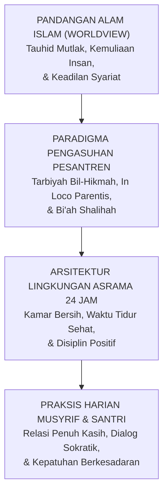

Worldview adalah akar pohon; arsitektur sistem adalah batangnya; dan praksis harian musyrif di kamar asrama adalah buahnya. Jika akarnya beracun atau terdistorsi, mustahil pohon tersebut menghasilkan buah karakter yang manis dan menyejukkan umat.

---

### 2.2 Kosmologi Tauhid: Meruntuhkan Sindrom "Firaun Mini" di Asrama

Aksioma ontologis paling agung dan mutlak dalam pandangan alam Islam adalah **Tauhidullah**—pengesaan Allah dalam rububiyyah, uluhiyyah, dan asma' wa shifat-Nya:

> قُلْ هُوَ اللَّهُ أَحَدٌ ۝ اللَّهُ الصَّمَدُ ۝ لَمْ يَلِدْ وَلَمْ يُولَدْ ۝ وَلَمْ يَكُن لَّهُ كُفُوًا أَحَدٌ
>
> *"Katakanlah: Dialah Allah, Yang Maha Esa. Allah adalah Dzat yang bergantung kepada-Nya segala sesuatu. Dia tiada beranak dan tidak pula diperanakkan, dan tidak ada seorang pun yang setara dengan Dia."*  
> (QS. Al-Ikhlas [112]: 1–4)[^3]

Al-Hafizh Ibnu Katsir dalam *Tafsir al-Qur'an al-'Azhim* menjelaskan bahwa makna *Al-Ahad* adalah Yang Maha Esa tanpa sekutu dan tandingan, sedangkan makna *Ash-Shamad*—sebagaimana ditegaskan oleh sahabat Abdullah bin Abbas dan para tabi'in—adalah Penguasa Mutlak yang Maha Sempurna dalam kepemimpinan-Nya, tempat seluruh makhluk menggantungkan segala hajat dan kebutuhan mereka, sementara Dia tidak membutuhkan siapa pun.[^4] Penegasan tauhid ini secara radikal membatalkan klaim kekuasaan mutlak makhluk mana pun di muka bumi.

Dalam kosmologi tauhid, garis demarkasi ontologis antara **Al-Khaliq** dan **Al-Makhluk** bersifat abadi, mutlak, dan tidak akan pernah kabur:

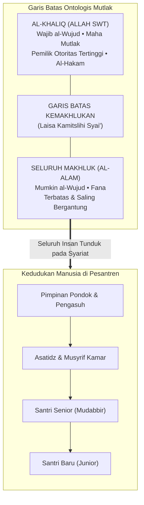

Allah ﷻ adalah satu-satunya *Rabb*—Sang Pencipta, Pemilik, Pemelihara, dan Pendidik Hakiki seluruh alam semesta. Sementara seluruh manusia di lingkungan pesantren—mulai dari kyai pendiri pondok, direktur pengasuhan, musyrif senior, hingga santri cilik yang baru tiba kemarin sore—semuanya berada pada derajat ontologis yang sama: **mereka semua adalah hamba sahaya Allah (*'ibadullah*)**.

Prinsip tauhid murni ini membawa implikasi dekonstruktif yang sangat fundamental: **Meruntuhkan Budaya Feodalisme dan Menghancurkan Sindrom "Firaun Mini" di Pesantren**.

#### Anatomi Penyakit Feodalisme Asrama
Di sebagian institusi asrama tradisional, sering kali tumbuh subur sebuah kultur feodal yang membajak konsep adab dan ketakziman:
1. **Otoritas Tanpa Akuntabilitas**: Para pembina asrama atau pengurus santri senior merasa memiliki kekuasaan mutlak yang tidak boleh dipertanyakan. Mereka memposisikan diri laksana dewa-dewa kecil yang bebas menjatuhkan vonis, menciptakan aturan sepihak di luar syariat, dan memperlakukan junior laksana budak belian.
2. **Kriminalisasi Nalar Kritis**: Santri yang mencoba menanyakan hikmah sebuah kebijakan, atau yang mencoba mengklarifikasi tuduhan saat ia dituduh melanggar, seketika dicap sebagai anak pemberontak yang "kurang ajar (*su'ul adab*)", lalu diancam dengan kutukan mistis: *"Hati-hati, ilmumu tidak akan barakah dan hidupmu akan celaka jika membantah pengurus!"*
3. **Penyalahgunaan Konsep Ketaatan**: Konsep ketaatan kepada ulama (*sami'na wa atha'na*) yang semestinya diletakkan dalam koridor kebenaran syariat dibelokkan menjadi kepatuhan buta pada hawa nafsu dan arogansi senior.

Ini adalah perusakan epistemik yang sangat berbahaya! Tradisi keilmuan Islam yang luhur dibangun di atas argumentasi dalil, dialog keilmuan, dan keadilan moral. Rasulullah ﷺ menggariskan batas ketaatan makhluk dengan kalimat yang menjadi piagam emansipasi kemanusiaan:

> لَا طَاعَةَ لِمَخْلُوقٍ فِي مَعْصِيَةِ الْخَالِقِ
>
> *"Tidak ada ketaatan kepada makhluk mana pun dalam perkara yang bermaksiat kepada Sang Khaliq."*  
> (HR. Ahmad no. 1095 dan At-Thabarani no. 381, dari Ali bin Abi Thalib رضي الله عنه, sanad shahih)[^5]

Bahkan sahabat termulia, Amirul Mukminin Abu Bakar Ash-Shiddiq رضي الله عنه, dalam pidato kepemimpinannya setelah wafatnya Rasulullah ﷺ, dengan lantang mendeklarasikan di hadapan seluruh umat:

> أَطِيعُونِي مَا أَطَعْتُ اللَّهَ وَرَسُولَهُ، فَإِذَا عَصَيْتُ اللَّهَ وَرَسُولَهُ فَلَا طَاعَةَ لِي عَلَيْكُمْ
>
> *"Taatilah aku selama aku menaati Allah dan Rasul-Nya dalam memimpin kalian. Namun apabila aku bermaksiat kepada Allah dan Rasul-Nya, maka gugurlah kewajiban kalian untuk taat kepadaku!"*[^6]

Jika seorang pemimpin agung dan sahabat termulia seperti Abu Bakar Ash-Shiddiq menyatakan bahwa ketaatan rakyat kepadanya bersyarat pada kepatuhannya kepada Allah dan Rasul-Nya, lalu atas hak apa seorang musyrif kamar atau santri senior menuntut kepatuhan buta dari adik kelasnya saat ia memerintahkan hal-hal yang zalim dan merendahkan martabat manusia?

Dalam ekosistem **TUMBUH**, kepemimpinan para asatidz dan musyrif dibangun di atas prinsip **Khadimul Ummah (Pelayan Santri)** dan **Qudwah Hasanah (Keteladanan Nyata)**. Otoritas seorang pendidik bukan terpancar dari rotan di tangannya, bukan pula dari ancaman su'ul adab yang menakut-nakuti, melainkan terpancar dari keluhuran akhlaknya, keadilan sikapnya, dan ketulusan doanya bagi keselamatan jiwa santri-santrinya.

---

### 2.3 Harmoni Dua Dimensi: Integrasi 'Alam al-Ghaib dan 'Alam asy-Syahadah

Salah satu kesalahan metodologis paling fatal dalam dunia pendidikan pesantren adalah terjadinya **pemisahan artifisial (dikotomi sesat)** antara urusan spiritualitas ruhaniyah dengan hukum kausalitas biologis-empiris.

Pandangan alam Islam memandang bahwa realitas ciptaan Allah merentang dalam dua dimensi agung yang saling berkelindan secara harmonis:

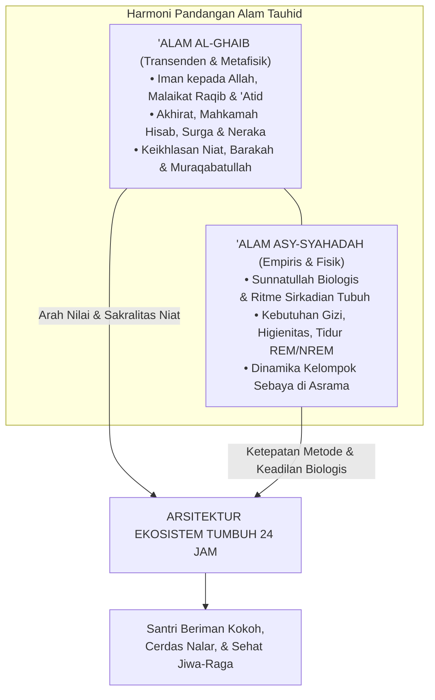

1. **'Alam al-Ghaib (Realitas Gaib/Transenden)**: Merupakan ranah metafisika yang diwahyukan: keberadaan Allah, malaikat yang mencatat setiap amal kebajikan dan keburukan, pertanggungjawaban di padang mahsyar, serta balasan surga dan neraka. Realitas gaib memberikan **makna tertinggi (*ultimate meaning*)** dan **kendali moral internal (*muraqabatullah*)**: santri beradab bukan karena takut cctv pengawas, melainkan karena yakin bahwa Allah senantiasa mengawasi gerak-gerik batinnya.
2. **'Alam asy-Syahadah (Realitas Teramati/Empiris)**: Merupakan ranah hukum-hukum alam (*sunnatullah fi al-khalq*) yang dapat diobservasi, diteliti, dan diukur: biokimia tubuh, kebutuhan neurobiologis, irama sirkadian, serta hukum-hukum psikologi perkembangan manusia.

Kedua realitas ini diciptakan oleh Tuhan yang sama: Allah ﷻ. Oleh karena itu, **ayat-ayat kauniyyah (hukum alam ciptaan Allah) tidak akan pernah bertentangan dengan ayat-ayat qauliyyah (syariat firman Allah)**. 

Mengabaikan hukum kausalitas empiris dalam mengelola santri dengan dalih spiritualitas adalah sebuah kebodohan yang nyata.

#### Bedah Sains: Mengapa Menyunat Jam Tidur Santri Adalah Sabotase Hafalan Al-Qur'an?
Mari kita bedah secara ilmiah salah satu praktik keliru yang paling sering terjadi di pesantren: **pemotongan jam tidur santri secara ekstrem atas nama tirakat**.

Di banyak asrama tahfizh, santri dipaksa menjalani jadwal yang tidak masuk akal:
* Pengajian kitab malam berakhir pukul 23.00. Santri baru bisa tidur pukul 23.30.
* Pukul 03.00 dini hari, bel berbunyi nyaring dan santri dipaksa bangun untuk qiyamul lail dan setoran hafalan subuh.
* Akumulasi waktu tidur santri hanya 3,5 hingga 4 jam per malam.

Ketika santri-santri tersebut di siang hari tampak loyo, tertidur saat guru menjelaskan, mengalami penurunan daya ingat secara drastis, atau mudah histeris dan depresi, sebagian pengurus dengan enteng menghakimi: *"Itu bukti bahwa hatinya masih kotor! Kurang ikhlas menghafalnya, makanya otaknya tumpul dan diganggu jin!"*

Mari kita tatap kebenaran ilmiah berdasarkan **Neurosains Kognitif dan Anatomi Tidur**:

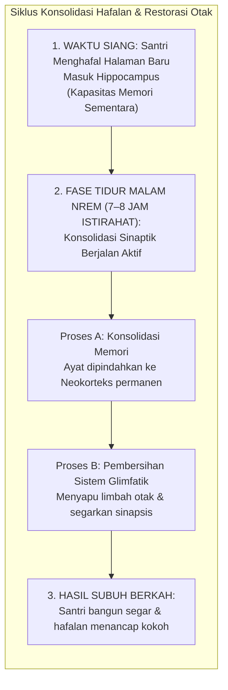

Penelitian neurobiologi mutakhir oleh Prof. Matthew Walker dari University of California, Berkeley, dan tim peneliti tidur dunia membuktikan sunnatullah biologis yang sangat menakjubkan[^6]:

1. **Fungsi Hipokampus Sebagai Kotak Surat Sementara**:  
   Saat santri menghafal Al-Qur'an di siang hari, ayat-ayat tersebut disimpan di **Hipokampus**—organ penyimpanan sementara yang kapasitasnya sangat terbatas. Jika santri terus dipaksa menghafal tanpa tidur yang cukup, hipokampus mengalami kejenuhan (*saturation*); informasi baru tidak bisa masuk, dan informasi yang baru masuk akan langsung terhapus.
2. **Konsolidasi Memori Hanya Terjadi pada Fase NREM Gelombang Lambat**:  
   Agar hafalan Al-Qur'an berpindah dari hipokampus menuju **Neokorteks** (arsip memori jangka panjang yang permanen), otak **mutlak membutuhkan fase tidur nyenyak gelombang lambat (*Slow-Wave Sleep / NREM Tahap 3 dan 4*)**. Fase ini hanya bisa dicapai secara optimal jika seseorang tidur dalam siklus penuh minimal 7 hingga 8 jam per malam bagi usia remaja.
3. **Aktivasi Sistem Glimfatik (Pembersih Sampah Otak)**:  
   Ketika manusia tidur lelap, sel-sel glia di otak menyusut hingga 60%, memungkinkan cairan serebrospinal mengalir deras menyapu protein-protein racun neurotoksik (seperti beta-amiloid dan tau) yang menumpuk akibat aktivitas berpikir seharian. Sistem pembersihan limbah ini **TIDAK AKAN BEKERJA** saat manusia terjaga.

Jika seorang santri tidur hanya 4 jam per hari secara kronis:
* Transfer memori dari hipokampus ke neokorteks **gagal total**. Hafalan yang disetorkan kemarin sore akan menguap hilang keesokan harinya.
* Terjadi **Atrofi Saraf dan Pengerutan Volume Otak**: Cabang-cabang dendrit di hipokampusnya mengalami kerusakan permanen. Santri secara biologis menjadi pelupa, tumpul daya nalarnya, dan lambat berpikir.
* Terjadi **Ketidakstabilan Emosional Akut**: Amigdalanya menjadi 60% lebih hiperaktif karena koneksi penghambat dari PFC terputus akibat kelelahan. Santri menjadi mudah marah, cengeng, agresif terhadap temannya, atau tenggelam dalam kecemasan mendalam.

TUMBUH mendeklarasikan dengan tegas: **Menjamin santri tidur nyenyak selama minimal 7 jam per hari adalah bagian dari ibadah dan ketaatan kepada syariat Allah!** Menyunat jam tidur santri secara ugal-ugalan bukanlah tirakat yang terpuji; itu adalah perusakan organ tubuh biologis ciptaan Allah yang diamanahkan kepada kita untuk dijaga.

---

### 2.4 Antropologi Insan: Martabat Asasi (*Karamah*) dan Hak-Hak Santri

Siapakah sesungguhnya santri yang kita bimbing di pesantren? Apakah mereka sekadar deretan nomor induk santri? Apakah mereka sekadar objek pembinaan yang bebas kita bentak dan hukum sesuka hati demi melampiaskan kejengkelan kita?

Al-Qur'an al-Karim menetapkan kedudukan ontologis manusia dengan bahasa yang sangat agung dan memuliakan:

> وَلَقَدْ كَرَّمْنَا بَنِي آدَمَ وَحَمَلْنَاهُمْ فِي الْبَرِّ وَالْبَحْرِ وَرَزَقْنَاهُم مِّنَ الطَّيِّبَاتِ وَفَضَّلْنَاهُمْ عَلَىٰ كَثِيرٍ مِّمَّنْ خَلَقْنَا تَفْضِيلًا
>
> *"Dan sesungguhnya telah Kami muliakan anak-anak keturunan Adam; Kami angkut mereka di daratan dan di lautan, Kami anugerahkan kepada mereka rezeki dari yang baik-baik, dan Kami lebihkan mereka di atas kebanyakan makhluk yang telah Kami ciptakan dengan kelebihan yang sempurna."*  
> (QS. Al-Isra' [17]: 70)[^7]

Perhatikan penegasan ayat ini: **وَلَقَدْ كَرَّمْنَا بَنِي آدَمَ** (*Dan sungguh Kami telah memuliakan anak-cucu Adam*).  
Imam Fakhruddin Ar-Razi dalam tafsir monumentalnya *Mafatih al-Ghaib* menjelaskan bahwa kemuliaan (*al-karamah*) yang dianugerahkan Allah kepada manusia mencakup seluruh dimensinya: rupa fisiknya yang indah dan tegak lurus, akal budinya yang mampu menyingkap rahasia alam, kemampuannya memilih dengan sadar (*al-ikhtiyar*), serta kelayakannya menerima khitab syariat dan mengemban amanah memakmurkan bumi (*'imaratul ardh*)[^8].

Kemuliaan ini adalah **kemuliaan asasi (*inherent ontological dignity*)**. Kemuliaan ini melekat pada diri seorang santri semata-mata karena ia adalah manusia ciptaan Allah yang ditiupkan ruh ke dalam raganya.

Kemuliaan ini **TIDAK PERNAH HILANG ATAU GUGUR** hanya karena:
* Seorang santri terlambat bangun salat subuh;
* Seorang santri belum mampu menguasai kaidah nahwu;
* Seorang santri melakukan pelanggaran tata tertib asrama.

Oleh karena itu, dalam ekosistem **TUMBUH**, seluruh metode pendisiplinan yang bertujuan **menghancurkan harga diri dan meremukkan martabat santri (*mortification of dignity*) diharamkan secara mutlak**:

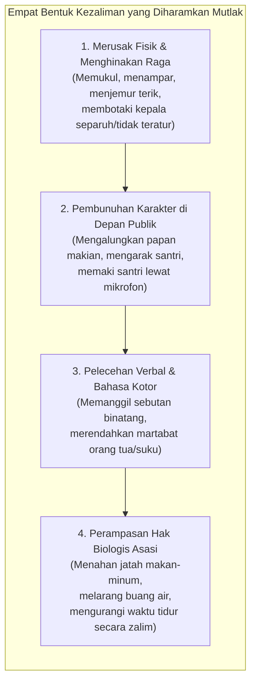

Santri yang melakukan kesalahan tetap berhak diperlakukan sebagai hamba Allah yang mulia. Ia berhak mendapatkan pembelaan yang adil melalui asas syariat yang universal: **Al-Ashlu Bara'atudz-Dzimmah (Asas Praduga Tak Bersalah)**. Seorang santri tidak boleh divonis bersalah hanya berdasarkan desas-desus atau praduga sepihak tanpa adanya proses *tabayyun* (klarifikasi) yang objektif dan transparan.

---

### 2.5 Tiga Mandat Eksistensial: Menumbuhkan Insan Menuju Derajat Rusyd

Pendidikan Islam dalam ekosistem TUMBUH bukanlah proses mencetak "robot penurut yang pasif". Tujuan hakiki tarbiyah adalah menuntun santri agar mampu menyatukan tiga mandat eksistensial kehidupannya secara seimbang:

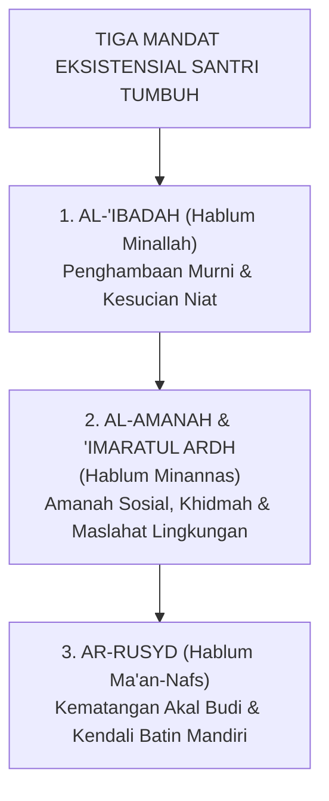

#### 1. Mandat Al-'Ibadah: Menegakkan Penghambaan Total
Santri dibimbing untuk menyadari bahwa tujuan penciptaannya di muka bumi adalah beribadah kepada Allah semata sebagaimana ditegaskan dalam firman-Nya:

> وَمَا خَلَقْتُ الْجِنَّ وَالْإِنسَ إِلَّا لِيَعْبُدُونِ
>
> *"Dan Aku tidak menciptakan jin dan manusia melainkan supaya mereka beribadah kepada-Ku."*  
> (QS. Adz-Dzariyat [51]: 56)[^9]

Imam Ibnu Katsir menukil penafsiran dari sahabat Abdullah bin Abbas رضي الله عنهما mengenai kalimat *illa liya'budun*, yakni: *illa liya'rifun* (melainkan agar mereka mengenal-Ku, mencintai-Ku, dan menaati perintah-Ku secara sadar dan sukarela). Ibadah bukanlah keterpaksaan budak yang ketakutan, melainkan pengenalan cinta fitrah seorang hamba kepada Rabb-nya.[^9] Namun ibadah di sini tidak dipahami secara kerdil hanya sebatas ritual mekanis di atas sajadah. Ibadah dalam ekosistem TUMBUH meluas ke seluruh lorong asrama: menjaga kebersihan tempat tidur adalah ibadah, menyapa saudara sekamar dengan senyuman adalah ibadah sedekah, mematikan kran air yang bocor adalah ibadah menjaga amanah bumi, dan belajar sungguh-sungguh adalah ibadah jihad fi sabilillah.

#### 2. Mandat Amanah Sosial dan 'Imaratul Ardh: Memakmurkan Bumi
Santri dididik untuk tidak menjadi manusia yang egois (*individualistic piety*). Kamar asrama adalah laboratorium miniatur peradaban. Di sanalah santri belajar seni bermasyarakat: bagaimana meredam ego pribadi saat berhadapan dengan perbedaan karakter teman, bagaimana berinisiatif menolong kawan yang sakit tanpa diminta, dan bagaimana merawat fasilitas bersama agar tidak rusak. Santri dilatih menjadi insan yang bermanfaat bagi sesamanya (*khairun nasi anfa'uhum lin-nas*).

#### 3. Mandat Ar-Rusyd: Kemandirian Batin Berkesadaran Penuh
Inilah puncak pencapaian kepribadian dalam arsitektur perkembangan TUMBUH. Istilah **Ar-Rusyd** adalah konsep Al-Qur'an yang menggambarkan tingkat kematangan tertinggi ketika seseorang telah memiliki kecerdasan intelektual, kemandirian emosional, dan integritas moral yang kokoh (QS. An-Nisa' [4]: 6)[^10].

Insan yang telah mencapai derajat *rusyd* adalah pribadi yang:
* Tidak lagi memerlukan rotan musyrif untuk melangkah salat subuh, karena nuraninya sendiri yang membangunkannya bermunajat kepada Allah.
* Tidak lagi memerlukan ancaman sanksi untuk menahan tangannya dari barang milik orang lain, karena rasa malunya kepada Allah telah menjadi benteng pelindung dirinya.
* Mampu mengambil keputusan moral yang tepat dan bertanggung jawab di tengah godaan zaman yang membingungkan.

Inilah muara akhir dari seluruh tangga progresi kemandirian TUMBUH (J1 hingga J4): bukan sekadar membuat santri patuh selama berada di balik gerbang pondok, melainkan melahirkan kader-kader peradaban yang telah mandiri secara adab, kokoh memegang prinsip, dan siap memimpin umat di mana pun mereka berada.

---

### 2.6 Maqashid Syari'ah: Perlindungan Lima Hak Asasi di Kehidupan Asrama 24 Jam

Bagaimana memastikan bahwa tata tertib, sistem perizinan, dan pola pembinaan di pesantren kita benar-benar berdiri di atas syariat Allah dan bukan di atas hawa nafsu pengurus?

Ukuran pengujinya adalah **Maqashid Syari'ah (Tujuan-Tujuan Asasi Syariat)** sebagaimana dirumuskan oleh Imam Al-Ghazali dalam *Al-Mustashfa* dan Imam Asy-Syathibi dalam *Al-Muwafaqat*[^11]. Seluruh syariat Islam diturunkan untuk memelihara lima hak asasi eksistensial manusia (*Ad-Dharuriyyat al-Khamsah*).

Mari kita bedah secara mendalam bagaimana kelima pilar Maqashid Syari'ah ini wajib diterjemahkan ke dalam tata kelola asrama pesantren 24 jam:

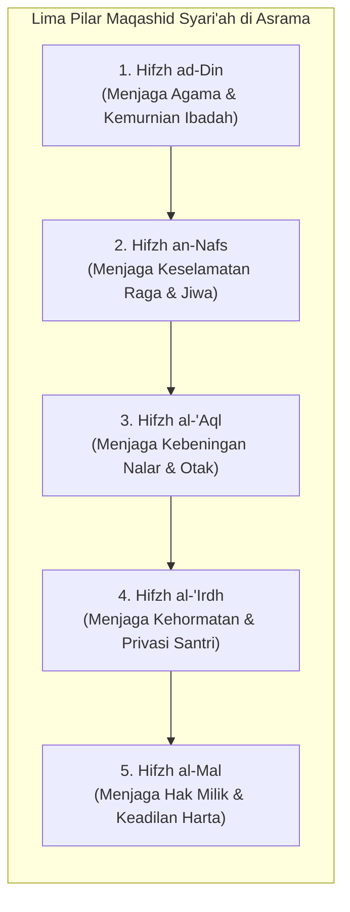

#### 1. Hifzh ad-Din (Perlindungan Terhadap Kemurnian Agama)
* **Pelanggaran Laten**: Menjadikan ayat-ayat suci Al-Qur'an atau ibadah salat sebagai sarana hukuman fisik (misalnya: santri yang melanggar disuruh membaca surah Yasin sambil berdiri dengan satu kaki di hadapan umum, atau disuruh salat taubat ratusan rakaat sebagai bentuk takzir memalukan). Praktik ini secara psikologis menanamkan kebencian batin santri terhadap ibadah dan kalamullah.
* **Standar TUMBUH**: Ibadah dikembalikan pada kesuciannya sebagai tempat bersimpuh dan mencari ketenangan (*thuma'ninah*). Penegakan adab dilakukan melalui pemulihan tanggung jawab moral (*restitusi*) dan dialog nurani. Ibadah sunnah dihidupkan lewat daya pikat keteladanan musyrif, bukan lewat paksaan tongkat pemukul.

#### 2. Hifzh an-Nafs (Perlindungan Terhadap Jiwa dan Keselamatan Fisik)
* **Pelanggaran Laten**: Kekerasan fisik yang disamarkan sebagai pembinaan, hukuman lari keliling lapangan di siang terik hingga santri dehidrasi dan pingsan, pembiaran air asrama yang berlumut dan penuh bakteri, serta pemotongan jatah tidur santri hingga di bawah batas kesehatan neurobiologis.
* **Standar TUMBUH**: **Toleransi Nol (*Zero Tolerance*) terhadap Segala Bentuk Kekerasan Fisik**. Seluruh sarana fisik asrama wajib lolos audit kelayakan sanitasi, ventilasi udara, dan kecukupan gizi makanan. Jam tidur santri minimal 7 jam per malam dijamin secara ketat sebagai hak perlindungan jiwa dan raga ciptaan Allah.

#### 3. Hifzh al-'Aql (Perlindungan Terhadap Akal Pikiran dan Kebeningan Nalar)
* **Pelanggaran Laten**: Pembodohan nalar santri melalui doktrinasi kepatuhan buta, pelarangan bertanya dan berdiskusi, serta peracunan otak santri oleh hormon stres kronis (kortisol) akibat atmosfer asrama yang penuh ancaman dan ketakutan.
* **Standar TUMBUH**: Membangun iklim asrama yang aman secara psikologis (*psychological safety*). Menghidupkan tradisi dialog sokratik, melatih santri memecahkan masalah (*problem-solving skills*), serta merawat kesehatan organ otak santri agar mampu menyerap hafalan Al-Qur'an dan ilmu syar'i secara optimal.

#### 4. Hifzh an-Nasl wa al-'Irdh (Perlindungan Terhadap Kehormatan dan Privasi)
* **Pelanggaran Laten**: Penggeledahan lemari santri yang dilakukan secara kasar dan merusak barang-barang pribadi, pemotongan rambut secara asal-asalan demi mempermalukan anak, pengumuman aib pelanggaran santri melalui pengeras suara masjid, serta pembiaran budaya perundungan (*bullying*) oleh senior.
* **Standar TUMBUH**: Perlindungan total terhadap privasi dan kehormatan diri santri. Pemeriksaan kamar dilakukan secara beradab dan didampingi santri pemilik kamar. Penanganan kasus pelanggaran adab dilakukan secara tertutup dan rahasia di ruang konseling BK, tanpa mempermalukan santri di depan publik.

#### 5. Hifzh al-Mal (Perlindungan Terhadap Hak Milik Kebendaan)
* **Pelanggaran Laten**: Normalisasi budaya *ghashab* (mengambil barang teman tanpa izin) yang dianggap sebagai "kebiasaan lumrah anak pondok", perusakan fasilitas umum asrama tanpa ada yang bertanggung jawab, serta pemotongan uang saku santri secara sepihak untuk sanksi denda tanpa transparansi.
* **Standar TUMBUH**: Eliminasi mutlak budaya ghashab dari lingkungan pondok. Edukasi adab kepemilikan pribadi ditegakkan dengan ketat. Setiap kerusakan fasilitas atau kehilangan barang diwajibkan menjalani proses **restitusi nyata (ganti rugi yang bermartabat)** oleh pihak yang bersalah, sehingga santri terlatih memiliki tanggung jawab amanah kebendaan.

Ketika kelima pilar Maqashid Syari'ah ini tegak berdiri di seluruh ruang asrama, pesantren akan menjelma menjadi **Bi'ah Shalihah (Ekosistem Peradaban yang Suci)**—tempat di mana setiap anak manusia merasa aman, dimuliakan martabatnya, dan dituntun menuju derajat ketaqwaan yang hakiki.

---

### 2.7 Rekonseptualisasi Adab: Keadilan Menempatkan Segala Sesuatu pada Kedudukannya

Prof. Dr. Syed Muhammad Naquib al-Attas merumuskan definisi adab yang melampaui sekadar tata krama lahiriah atau etiket sosial permukaan:
> *"Adab adalah pengenalan dan pengakuan tentang hakikat bahwa ilmu dan segala wujud ciptaan Allah tersusun secara hierarkis sesuai tingkat keluhuran dan derajat nilainya, serta pengakuan terhadap kedudukan diri sendiri yang tepat dalam tata susunan wujud tersebut, yang diwujudkan dalam tindakan adil terhadap diri sendiri dan semesta."*[^12]

Ketiadaan adab (*the loss of adab*) selalu bermula dari **Kezaliman (*Azh-Zhulm*)**, yang secara etimologis bermakna: *wad'u syai-in fi ghairi maudhi'ihi* (meletakkan sesuatu bukan pada tempatnya yang hak).

Ketika konsep adab diturunkan ke lantai asrama pesantren 24 jam, kezaliman terjadi manakala:
1. **Pendidik meletakkan hawa nafsunya di atas syariat**: Menghukum santri karena dorongan dendam atau kemarahan pribadi, namun membungkusnya dengan label "mendidik adab".
2. **Lembaga meletakkan efisiensi formalitas di atas keselamatan santri**: Mengabaikan fasilitas sanitasi dan jatah istirahat tidur demi mengejar target hafalan yang mentereng di brosur promosi.
3. **Santri meletakkan egonya di atas persaudaraan**: Mengambil hak saudaranya (*ghashab*), merundung adik kelas demi legitimasi kekuasaan, atau merusak sarana bersama.

Oleh karena itu, menegakkan adab di pesantren bukanlah sekadar melatih santri membungkukkan badan saat berpapasan dengan kyai. Menegakkan adab bermakna **merestorasi tata keadilan Ilahi di seluruh sudut kehidupan**:
* Memuliakan guru karena keilmuan dan ketakwaannya;
* Menyayangi santri karena kemuliaan fitrah dan amanah pertumbuhannya;
* Merawat fasilitas asrama karena kesadaran amanah lingkungan (*'imaratul ardh*);
* Menghormati waktu istirahat dan sunnatullah tubuh jasmani sebagai bentuk takwa kepada Dzat Yang Maha Menciptakan raga.

---

### 2.8 Manifestasi Pandangan Alam dalam 24 Jam Kehidupan Santri

Bagaimanakah pandangan alam Islam mewujud dalam irama kehidupan konkret santri dari fajar hingga fajar berikutnya? Perhatikan matriks integrasi nilai tauhid ke dalam dua belas siklus rutinitas 24 jam di bawah ini:

| Waktu / Siklus Harian | Aktivitas Nyata Santri | Asumsi Sekuler-Mekanistik (Lama) | Manifestasi Worldview Tauhid TUMBUH |
| :--- | :--- | :--- | :--- |
| **03.30 – 04.30** | Bangun Sahur / Qiyam / Fajar | Paksaan fisik dengan teriakan dan gedoran seng; santri bangun dalam keadaan terteror. | Panggilan cinta menyambut rahmat Allah; musyrif membangunkan dengan sentuhan lembut dan doa fajar. |
| **04.30 – 05.30** | Salat Subuh & Tilawah Fajar | Kewajiban absensi baris saf; terlambat dipukul atau dicukur gundul. | *Hablum Minallah*: Mengokohkan tauhid fajar; penanaman kesadaran hadirnya Allah (*Muraqabah*). |
| **05.30 – 06.30** | Piket Kebersihan Bilik & Mandi | Beban hukuman kotor; santri berebut kran air dan melakukan ghashab gayung. | *Hifzh al-Mal & Thaharah*: Merawat kebersihan sebagai cabang iman; antre beradab menghormati hak sesama. |
| **06.30 – 07.00** | Sarapan Pagi Bersama | Porsi makanan terbatas; santri berebut makanan dan menyisakan sampah plastik. | *Syukur & Barakah*: Menghayati rezeki halal; adab makan nampan bersama melatih altruisme dan qana'ah. |
| **07.00 – 12.00** | Pembelajaran Kelas Madrasah | Menghafal demi nilai ujian kognitif; santri pasif mendengarkan ceramah satu arah. | *Al-Khabar ash-Shadiq & 'Aql*: Memadukan wahyu dan nalar demonstratif; santri aktif bertanya dan berdiskusi. |
| **12.00 – 13.00** | Salat Zhuhur Berjamaah | Formalitas pengawasan musyrif; santri tidur di saf belakang. | Istirahat ruhani tengah hari; revitalisasi fokus batin setelah dialektika intelektual pagi. |
| **13.00 – 14.00** | Istirahat Siang (*Qailulah*) | Dianggap waktu malas; sebagian pesantren menghapus qailulah demi tambah materi. | *Sunnatullah Biologis*: Mengamalkan sunnah Rasulullah ﷺ untuk merestorasi neuroplastisitas otak. |
| **14.00 – 15.30** | Halaqah Pendalaman Kitab / Bahasa | Hafalan kaku tanpa pemahaman konteks sosial kontemporer. | Menghubungkan turats salaf dengan realitas modern; melatih kecakapan hidup dan komunikasi asertif. |
| **15.30 – 17.00** | Salat Ashar & Olahraga Raga | Waktu bebas tak terkontrol; rawan perkelahian dan perundungan di sudut tersembunyi. | *Hifzh an-Nafs*: Menyalurkan lonjakan hormon androgen melalui panahan, futsal, renang, dan silat beradab. |
| **17.00 – 18.00** | Mandi Bersih & Persiapan Maghrib | Tergesa-gesa; saling serobot pakaian jemuran. | Menata kerapian lahiriah menyambut waktu hening petang; membaca zikir al-Ma'tsurat petang. |
| **18.00 – 20.00** | Maghrib, Halaqah Tahfidz & Isya | Menyetor hafalan dengan ancaman berdiri; santri cemas dan panik. | Konsolidasi kalamullah dalam suasana khusyuk; guru menyimak dengan cinta dan kesabaran tarbawi. |
| **20.00 – 21.30** | Muthala'ah Mandiri & Majlis Kamar | Pengawas merazia dengan rotan; kamar tegang dan hening palsu. | *Majlis al-Ghurfah*: Lingkaran kamar evaluasi hari, saling menguatkan, apresiasi 4:1, dan doa malam. |
| **21.30 – 03.30** | Padam Lampu & Tidur Lelap (6–7 Jam) | Dipotong hingga larut malam atas nama tirakat semu; santri kekurangan tidur kronis. | *Ibadah Tidur Biologis*: Menjaga sistem glimfatik otak bekerja membersihkan racun saraf demi memori abadi.[^13] |

Ketika seluruh siklus hidup 24 jam ini dijalankan dengan penuh kesadaran tauhid, santri tidak lagi merasa "sedang dihukum di penjara pondok", melainkan merasa sedang **hidup di dalam sebuah miniatur kota peradaban Nabawiyyah yang damai, suci, dan memberdayakan**.

---

Dengan tuntasnya peletakan fondasi pandangan alam ini, kita kini memiliki kompas normatif yang kokoh. Namun, sebuah teka-teki epistemologis besar segera menghadang nalar kita: *Jika wahyu adalah kebenaran mutlak, bagaimana mendudukkannya di samping nalar akal dan temuan-temuan empiris sains perilaku? Apakah pesantren harus menolak sains psikologi dan neurosains modern demi menjaga kemurnian doktrin, ataukah keduanya dapat dirajut ke dalam satu hierarki kebenaran yang utuh tanpa jatuh ke jurang sekularisme?* 

Di Bab 3, kita akan menelaah integrasi epistemologis antara wahyu, akal budi lurus, dan fakta empiris lapangan.

---

### Catatan Kaki & Rujukan Akademik

[^1]: Syed Muhammad Naquib al-Attas, *The Concept of Education in Islam: A Framework for an Islamic Philosophy of Education* (Kuala Lumpur: International Institute of Islamic Thought and Civilization [ISTAC], 1980), hlm. 15–28; Syed Muhammad Naquib al-Attas, *Islam and Secularism* (Kuala Lumpur: Muslim Youth Movement of Malaysia [ABIM], 1978), hlm. 133–150.
[^2]: Muslim bin al-Hajjaj an-Naisaburi, *Shahih Muslim*, Kitab ath-Thaharah, Bab Fadhl al-Wudhu', hadits no. 223.
[^3]: Al-Qur'an al-Karim, Surah Al-Ikhlas [112]: 1–4.
[^4]: Ibnu Katsir, *Tafsir al-Qur'an al-'Azhim*, Tahqiq: Sami bin Muhammad as-Salamah (Riyadh: Dar Thayyibah, 1999), Jilid VIII, hlm. 526–530.
[^5]: Ahmad bin Muhammad bin Hanbal, *Al-Musnad*, Tahqiq: Syu'aib al-Arna'uth dkk. (Beirut: Mu'assasah ar-Risalah, 2001), Jilid II, hlm. 333, hadits no. 1095; Sulaiman bin Ahmad Ath-Thabarani, *Al-Mu'jam al-Kabir* (Kairo: Maktabah Ibn Taimiyyah, 1994), Jilid XVIII, hlm. 170.
[^6]: Abu Ja'far Muhammad bin Jarir Ath-Thabari, *Tarikh ar-Rusul wa al-Muluk* (Tarikh Ath-Thabari) (Kairo: Dar al-Ma'arif, 1967), Jilid III, hlm. 224; Ibnu Katsir, *Al-Bidayah wa an-Nihayah* (Giza: Dar Hijr, 1997), Jilid VI, hlm. 305–306.
[^7]: Al-Qur'an al-Karim, Surah Al-Isra' [17]: 70.
[^8]: Fakhruddin Muhammad bin Umar Ar-Razi, *Mafatih al-Ghaib* (At-Tafsir al-Kabir) (Beirut: Dar al-Fikr, 1981), Jilid XXI, hlm. 13–18.
[^9]: Ibnu Katsir, *Tafsir al-Qur'an al-'Azhim*, Jilid VII, hlm. 425–426; Abu Ja'far Muhammad bin Jarir Ath-Thabari, *Jami' al-Bayan*, Jilid XXII, hlm. 437–440.
[^10]: Abu Abdillah Muhammad bin Ahmad Al-Qurthubi, *Al-Jami' li Ahkam al-Qur'an* (Tafsir Al-Qurthubi), Tahqiq: Dr. Abdullah bin Abdul Muhsin At-Turki (Beirut: Mu'assasah ar-Risalah, 2006), Jilid VI, hlm. 43–48.
[^11]: Abu Hamid Muhammad bin Muhammad Al-Ghazali, *Al-Mustashfa min 'Ilm al-Ushul*, Tahqiq: Dr. Muhammad Sulaiman al-Asyqar (Beirut: Mu'assasah ar-Risalah, 1997), Jilid I, hlm. 416–420; Abu Ishaq Ibrahim bin Musa Asy-Syathibi, *Al-Muwafaqat fi Ushul asy-Syari'ah*, Tahqiq: Masyhur bin Hasan Al Salman (Kobar: Dar Ibn 'Affan, 1997), Jilid II, hlm. 17–32.
[^12]: Syed Muhammad Naquib al-Attas, *Prolegomena to the Metaphysics of Islam: An Exposition of the Underlying Foundations of Islam and the Nature of Reality* (Kuala Lumpur: ISTAC, 1995), hlm. 102–115 mengenai definisi filosofis adab dan kaitannya dengan martabat keadilan (*'adl*).
[^13]: Matthew Walker, *Why We Sleep: Unlocking the Power of Sleep and Dreams* (New York: Scribner, 2017), hlm. 105–142; Robert Stickgold, "Sleep-dependent memory consolidation", *Nature*, Vol. 437 (2005), hlm. 1272–1278; Lulu Xie dkk., "Sleep Drives Metabolite Clearance from the Adult Brain", *Science*, Vol. 342, No. 6156 (2013), hlm. 373–377.

---

# BAB 3: EPISTEMOLOGI TERPADU: WAHYU, NALAR, DAN FAKTA EMPIRIS
## Menegakkan Keadilan Berpikir, Validitas Bukti, dan Adab Keilmuan di Pesantren 24 Jam

> يَا أَيُّهَا الَّذِينَ آمَنُوا إِنْ جَاءَكُمْ فَاسِقٌ بِنَبَإٍ فَتَبَيَّنُوا أَنْ تُصِيبُوا قَوْمًا بِجَهَالَةٍ فَتُصْبِحُوا عَلَىٰ مَا فَعَلْتُمْ نَادِمِينَ
>
> *"Wahai orang-orang yang beriman! Jika seseorang yang fasik datang kepadamu membawa suatu berita, maka bertabayunlah (telitilah kebenarannya secara seksama), agar kamu tidak mencelakakan suatu kaum karena kebodohan (kecerobohan tanpa bukti), yang akhirnya kamu menyesali perbuatanmu itu."*  
> — **Al-Qur'an al-Karim**, Surah Al-Hujurat [49]: 6[^1]

---

Imam Al-Hafizh Ibnu Katsir dalam *Tafsir al-Qur'an al-'Azhim* menegaskan bahwa ayat ini memerintahkan orang-orang beriman untuk melakukan *at-tatsabbut* (verifikasi cermat) terhadap berita yang dibawa oleh seseorang, agar tidak menjatuhkan hukuman atau keputusan yang menzalimi suatu kaum karena ketidaktahuan (*bi jahalah*), yang akhirnya membuahkan penyesalan abadi.[^1] 

Imam Al-Qurthubi dalam *Al-Jami' li Ahkam al-Qur'an* menambahkan bahwa ayat ini adalah dalil ushul paling agung mengenai haramnya berpegang pada persangkaan tanpa verifikasi (*tark al-amal bi azh-zhann al-mujarrad*) dalam urusan kehormatan manusia dan penetapan sanksi.[^2]

### 3.1 Tragedi Fitnah di Ruang Asrama: Mengapa Epistemologi Menentukan Nasib Santri?

Di sebuah asrama santri putra, jarum jam dinding menunjukkan pukul 21.45. Suasana yang semestinya tenang menjelang jam istirahat malam seketika pecah oleh kegaduhan di Kamar 3. Seorang santri kelas delapan menangis histeris mendapati uang saku bulanannya yang disimpan di dalam saku baju koko di lemari telah raib. Dalam hitungan menit, desas-desus merebak cepat ke seluruh lorong kamar. Beberapa santri senior berbisik bahwa mereka tadi sore melihat Santri R berjalan tergesa-gesa di dekat lemari korban. 

Tanpa melakukan penyelidikan yang tertib, musyrif kamar yang terpancing emosi segera menyeret Santri R ke ruang kantor pengasuhan. Di bawah sorot lampu neon yang dingin, tuduhan langsung dihujamkan: *"Santri-santri lain melihat kamu berkeliaran di dekat lemari korban sore tadi! Ngaku saja! Kalau kamu tidak mau jujur, malam ini kamu tidur di lantai pos satpam!"* Santri R gemetar ketakutan, menangis bersumpah demi Allah bahwa ia hanya sedang mengambil sajadahnya sendiri yang tertinggal di gantungan. Namun, musyrif tersebut bersikukuh pada praduganya: *"Firasat saya tidak pernah salah. Wajahmu tampak cemas, itu tanda orang berdosa!"*

Tiga hari kemudian, fakta sesungguhnya terungkap: uang saku tersebut ternyata terselip di bawah lipatan kasur pemiliknya sendiri yang lupa telah memindahkannya. 

Namun, kerusakan jiwa telah terlanjur terjadi. Santri R selama tiga hari telah menanggung aib yang tak terperikan, dicap sebagai "pencuri" oleh kawan-kawan sekamarnya, dikucilkan saat jam makan, dan mengalami trauma batin yang menghancurkan kepercayaan dirinya terhadap para pendidik.

Kisah memilukan di atas bukanlah anomali langka; ini adalah potret nyata dari **Krisis Epistemik (*Epistemic Injustice*)** yang kerap menimpa dunia pengasuhan pesantren.

Banyak pendidik dan pengurus pondok tidak menyadari bahwa **Epistemologi bukanlah teori filsafat yang mandul**. Epistemologi adalah ilmu tentang: *Bagaimana kita tahu apa yang kita tahu? Atas dasar apa kita mempercayai sebuah informasi? Dan seberapa sah sebuah bukti dijadikan dasar untuk mengambil keputusan yang menyangkut nasib dan kehormatan seorang manusia?*

Ketika seorang pengasuh mengambil keputusan hanya berdasarkan "kabar burung", "firasat subjektif", atau "pengakuan santri di bawah ancaman siksaan", pengasuh tersebut sesungguhnya sedang melakukan kezaliman epistemik yang diharamkan oleh syariat. Al-Qur'an mengecam keras orang-orang yang membangun vonis di atas persangkaan tanpa bukti:

> إِن يَتَّبِعُونَ إِلَّا الظَّنَّ وَمَا تَهْوَى الْأَنفُسُ ۖ وَلَقَدْ جَاءَهُم مِّن رَّبِّهِمُ الْهُدَىٰ
>
> *"Mereka tidak lain hanyalah mengikuti persangkaan belaka (zhann) dan apa yang diingini oleh hawa nafsu mereka, padahal sungguh telah datang petunjuk dari Rabb mereka."*  
> (QS. An-Najm [53]: 23)[^3]

Syaikh Abdurrahman bin Nashir As-Sa'di dalam *Taisir al-Karim ar-Rahman* menjelaskan bahwa ayat ini menelanjangi dua penyakit perusak kebenaran: pertama, mengikuti dugaan semu (*azh-zhann*) yang kosong dari bukti faktual; dan kedua, memperturutkan hawa nafsu (*hawa an-nafs*) yang condong pada kemarahan dan selera pribadi.[^4] Ketika dua penyakit ini menyusup ke dalam ruang pengasuhan, seorang pembina dapat dengan mudah meremukkan masa depan santri semata-mata atas nama firasat palsu.

Dalam ekosistem **TUMBUH**, keadilan berpikir (*epistemic justice*) dan kejujuran metodologis diletakkan sebagai pilar adab yang agung. Tidak boleh ada satu pun vonis disiplin, tidak boleh ada satu pun pelabelan karakter santri, dan tidak boleh ada satu pun program kurikulum baru yang diluncurkan tanpa melewati pertanggungjawaban epistemik yang shahih.

---

### 3.2 Tiga Saluran Ilmu dalam Tradisi Islam: Integrasi Wahyu, Nalar, dan Indera

Peradaban Barat modern terperangkap ke dalam dikotomi epistemik yang tajam: antara **Rasionalisme** yang mendewakan akal murni dan menolak realitas spiritual, serta **Empirisme/Positivisme** yang menolak segala bentuk kebenaran kecuali yang dapat ditimbang dan diukur di laboratorium materi. Di sisi lain, sebagian masyarakat tradisional terjatuh ke dalam **Mistisisme Irasional**: mempercayai mimpi, firasat liar, dan takhayul tanpa pernah mengujinya dengan akal sehat dan dalil syariat.

Epistemologi Islam yang diwariskan oleh para ulama mu'tabar—seperti Imam Abu Hamid Al-Ghazali, Imam Fakhruddin Ar-Razi, dan Prof. Syed Muhammad Naquib al-Attas—menolak seluruh bentuk kepincangan tersebut[^5]. 

Islam memandang bahwa manusia dikaruniai **tiga saluran ilmu yang saling menyempurnakan (*The Integrated Channels of Knowledge*)**:

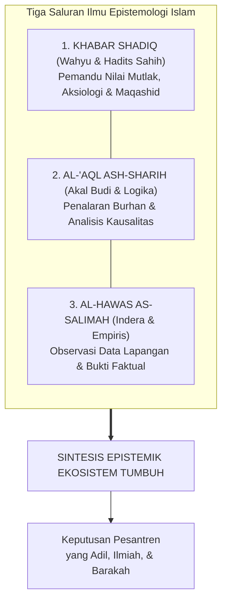

#### 1. Al-Khabar ash-Shadiq (Wahyu Ilahi dan As-Sunnah yang Shahih)
Wahyu (*Tanzil*) adalah sumber kebenaran tertinggi yang bersifat mutlak, ma'shum, dan melampaui keterbatasan ruang dan waktu. Wahyu memberikan jawaban atas pertanyaan-pertanyaan yang tidak mampu dijangkau oleh akal dan laboratorium: *Untuk apa manusia diciptakan? Apa yang terjadi setelah kematian? Dan apa batas-batas moral yang tidak boleh dilanggar dalam memperlakukan sesama hamba Allah?*

Wahyu memberikan **kompas arah nilai (*normative direction*)** dan **pagar etika (*ethical boundaries*)**. Wahyu menetapkan bahwa memukul santri secara zalim adalah haram, mempermalukan anak di depan umum adalah dosa, dan menjaga kehormatan anak adalah wajib. Pagar etika wahyu ini bersifat mutlak; ia tidak boleh digusur dengan alasan "demi efisiensi administrasi" atau "kebiasaan masa lalu".

#### 2. Al-'Aql ash-Sharih (Akal Budi Lurus dan Nalar Demonstratif)
Akal adalah anugerah cahaya Ilahi (*nurul 'aql*) yang disematkan ke dalam jiwa manusia untuk menimbang argumen, memahami keteraturan alam, dan membedakan antara yang benar (*haqq*) dan yang batil. Para ulama ushul fiqh membedakan akal dari sekadar angan-angan nafsu. Akal yang lurus bekerja melalui kaidah-kaidah logika yang tertib (*burhan*) dan penalaran analogis (*qiyas*).

Akal bertugas menerjemahkan petunjuk wahyu yang bersifat universal ke dalam arsitektur sistem yang terstruktur: menyusun jenjang kurikulum, merancang indikator perkembangan, dan memetakan alur intervensi perilaku di asrama. Akal menguji apakah sebuah kebijakan pengasuhan memiliki koherensi logis atau justru mengandung kontradiksi internal yang membingungkan santri.

#### 3. Al-Hawas as-Salimah (Indera yang Sehat dan Pengamatan Empiris)
Indera lahiriah—penglihatan, pendengaran, perabaan—yang dipadukan dengan metode observasi ilmiah (*tajribah*) adalah instrumen manusia untuk membaca ayat-ayat kauniyyah Allah di alam semesta. Dari saluran inilah lahir sains kedokteran, neurobiologi perkembangan, psikologi perilaku, dan data statistik asrama.

Pengamatan empiris bertugas memberi tahu kita tentang **kenyataan faktual di lapangan (*reality on the ground*)**: Berapa rata-rata jam tidur santri di asrama? Jam berapa kasus perkelahian paling sering meledak? Makanan apa yang disajikan di dapur pondok dan bagaimana kandungan gizinya? Bagaimana pola pernapasan santri saat ia mengalami serangan panik?

#### Prinsip Integrasi Epistemik TUMBUH
Ketiga saluran ini tidak boleh dipertentangkan, melainkan harus bekerja secara harmonis:

> **Wahyu menetapkan ARAH dan BATASAN NILAI yang suci;  
> Akal merancang ARSITEKTUR dan STRUKTUR SISTEM yang runtut;  
> Fakta Empiris menguji EFEKTIVITAS dan KETEPATAN METODE di lapangan.**

Jika sebuah program pembinaan di pesantren dirancang dengan niat yang sangat mulia (sesuai arah wahyu), namun setelah dievaluasi secara empiris ternyata membuat santri sakit-sakitan atau membenci agamanya, maka yang salah bukanlah agamanya, melainkan desain metode penerapannya di lapangan. Pendidik TUMBUH tidak boleh keras kepala mempertahankan metode yang terbukti gagal secara empiris hanya dengan dalih "yang penting niatnya ikhlas".

---

### 3.3 Anatomi Bahasa: Membedah Lima Jenis Klaim di Lingkungan Pesantren

Salah satu sumber kerancuan terbesar dalam rapat-rapat pengasuhan dan perumusan kurikulum pesantren adalah **ketidakmampuan membedakan jenis klaim (*epistemic claim classification*)**. Ketika sebuah opini pribadi disamakan statusnya dengan ayat Al-Qur'an, atau ketika data awal yang masih rapuh langsung diyakini sebagai hukum kepastian, maka lahirlah kebijakan-kebijakan yang serampangan.

Dalam arsitektur TUMBUH, setiap kalimat yang terucap di asrama dan tercatat dalam buku panduan wajib diklasifikasikan ke dalam **Lima Derajat Klaim Epistemik**[^4]:

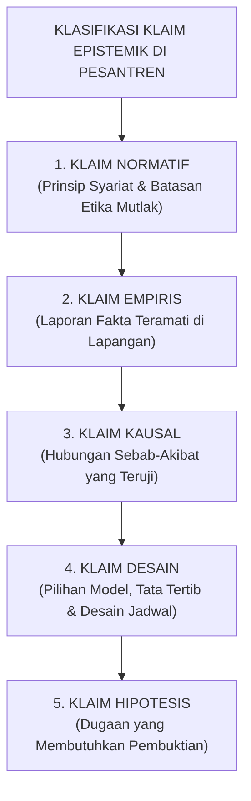

Mari kita bedah secara gamblang contoh konkret kelima jenis klaim ini di lingkungan asrama:

#### 1. Klaim Normatif (Normative Claim)
* **Bunyi Kalimat**: *"Setiap santri memiliki kemuliaan fitrah dan haram dipukul atau dipermalukan harga dirinya di depan umum."*
* **Status Epistemik**: Pernyataan nilai yang bersumber dari wahyu syariat dan prinsip dasar etika Islam.
* **Beban Pembuktian**: Pembuktiannya merujuk pada nash Al-Qur'an (QS. Al-Isra': 70), hadits larangan memukul wajah, serta prinsip Maqashid Syari'ah (*hifzh an-nafs* dan *hifzh al-'irdh*).
* **Konsekuensi**: Mengikat secara mutlak. Tidak dapat dibatalkan oleh suara mayoritas rapat atau alasan pragmatis kepraktisan pengurus.

#### 2. Klaim Empiris (Empirical Claim)
* **Bunyi Kalimat**: *"Di Gedung Asrama Abu Bakar, angka santri yang terlambat salat subuh menurun dari 18 orang menjadi 4 orang dalam tempo satu bulan terakhir."*
* **Status Epistemik**: Pelaporan data faktual yang terjadi di alam nyata.
* **Beban Pembuktian**: Verifikasi buku logbook absensi subuh musyrif, rekaman kehadiran fisik, dan memastikan tidak ada rekayasa pencatatan angka laporan. Klaim ini bisa benar atau salah secara faktual.

#### 3. Klaim Kausal (Causal Claim)
* **Bunyi Kalimat**: *"Penurunan angka keterlambatan santri subuh disebabkan secara langsung oleh dimajukannya jam padam lampu asrama menjadi pukul 21.30."*
* **Status Epistemik**: Menghubungkan dua peristiwa dalam relasi sebab-akibat (*causality*).
* **Beban Pembuktian**: Sangat berat. Pengasuh harus membuktikan secara metodologis bahwa penurunan keterlambatan itu benar-benar murni akibat jam tidur lebih awal, bukan karena adanya faktor perancu (*confounding variables*) lain—seperti pergantian musyrif baru yang lebih galak atau adanya ancaman sanksi tambahan.

#### 4. Klaim Desain (Design Claim)
* **Bunyi Kalimat**: *"TUMBUH menetapkan struktur pembinaan santri ke dalam 4 Jenjang Kemandirian (J1–J4) dengan sesi mentoring pekanan kelompok kecil berisi 8 santri."*
* **Status Epistemik**: Pilihan teknis arsitektur sistem buatan manusia untuk memfasilitasi pertumbuhan karakter.
* **Beban Pembuktian**: Uji kelayakan logika dan keselarasan dengan kapasitas perkembangan remaja. Klaim desain ini **bukan wahyu suci yang kaku**; angka 8 santri per kelompok dapat disesuaikan menjadi 6 atau 10 jika evaluasi lapangan menunjukkan perlunya modifikasi manajerial.

#### 5. Klaim Hipotesis (Hypothetical Claim)
* **Bunyi Kalimat**: *"Kami menduga bahwa santri yang sering menyendiri di sudut kantin saat jam istirahat mengalami gejala perundungan terselubung oleh teman sekamarnya."*
* **Status Epistemik**: Dugaan awal yang logis sebagai pintu pembuka bagi penyelidikan terencana.
* **Beban Pembuktian**: Menjadi landasan bagi guru BK atau musyrif untuk melakukan observasi terarah dan wawancara empati. Dilarang keras menjadikan klaim hipotesis sebagai dasar pemberian vonis atau pelabelan (*labeling*) santri sebelum pembuktian tuntas.

---

### 3.4 Kejujuran Menyatakan Derajat Kepastian: Menghancurkan Dogmatisme Mutlak

Salah satu ciri kemunduran peradaban ilmu adalah merebaknya **Dogmatisme Semu (False Absolutism)**—kebiasaan berbicara dengan nada serba mutlak, serba yakin seratus persen, padahal dasar pijakannya sangat rapuh. Di lingkungan pesantren, sering kita dengar kalimat gegabah semacam: *"Pasti anak ini yang mencuri!"*, *"Metode kami sudah terbukti seratus persen paling ampuh di seluruh dunia!"*, atau *"Santri yang tidak ikut metode ini pasti gagal!"*

TUMBUH mengharamkan kesombongan intelektual semacam itu. Para ulama salaf yang paling alim sekalipun selalu mengakhiri fatwanya dengan kalimat penuh tawadhu': *Allahu A'lam bish-Shawab* (Allah yang lebih mengetahui kebenaran yang sesungguhnya). Bahkan Imam Malik bin Anas, sang imam Darul Hijrah, dari empat puluh delapan pertanyaan yang diajukan kepadanya, menjawab tiga puluh dua di antaranya dengan kalimat: *"La Adri"* (Aku belum tahu)[^6].

Ketika seorang murid bertanya: *"Tidakkah engkau malu menjawab 'tidak tahu' padahal orang-orang datang dari jauh menemuimu?"* Imam Malik menjawab dengan tegas: *"Katakan kepada orang-orang di kampungmu bahwa Malik tidak tahu!"*

Mengakui keterbatasan data bukanlah tanda kelemahan; mengakui keterbatasan adalah puncak dari **Integritas Intelektual (*Al-Inshaf*)**.

Di dalam seluruh laporan resmi, jurnal pengasuhan, dan panduan operasional TUMBUH, dibakukan **Lima Diksi Penanda Derajat Kepastian (*Epistemic Certainty Indicators*)**:

| Derajat Kepastian | Diksi Resmi TUMBUH | Kapan Digunakan di Pesantren? |
| :--- | :--- | :--- |
| **Pasti / Aksiomatik** | **Ditetapkan (*Stipulated*)** | Digunakan khusus untuk ketetapan nash wahyu shahih yang *qath'i*, prinsip syariat mutlak, serta definisi aksioma arsitektur sistem yang telah disepakati bersama. |
| **Kuat / Meyakinkan** | **Didukung Kuat (*Strongly Supported*)** | Digunakan ketika sebuah temuan didukung oleh data triangulasi yang konsisten (misal: laporan observasi tiga musyrif berbeda, bukti fisik rekaman, dan pengakuan sadar tanpa paksaan). |
| **Cenderung / Indikatif** | **Mengindikasikan (*Indicates*)** | Digunakan ketika data awal menunjukkan arah tren tertentu, namun jumlah sampel santri masih terbatas dan masih membutuhkan audit lanjutan. |
| **Dugaan Logis** | **Diduga Sementara (*Hypothesized*)** | Digunakan untuk penjelasan logis awal atas sebuah fenomena perilaku santri yang secara sadar diakui masih dalam tahap verifikasi di lapangan. |
| **Belum Terbukti** | **Belum Cukup Diketahui (*Inconclusive / Unknown*)** | Digunakan secara ksatria ketika data dan bukti yang dihimpun belum memadai untuk menarik kesimpulan yang bertanggung jawab. |

Musyrif dan pimpinan yang menggunakan diksi-diksi ini menunjukkan kedewasaan berpikir tingkat tinggi. Mereka tidak mudah menghakimi anak orang lain, tidak tergesa-gesa menyebarkan praduga, dan senantiasa menjaga keadilan dalam berbicara.

---

### 3.5 Harmonisasi Turats dan Sains Perilaku: Belajar dari Dialektika Al-Ghazali dan Ibnu Rusyd

Salah satu jebakan terbesar yang membelah dunia pendidikan Islam kontemporer adalah perpecahan biner yang sempit:
* Di satu kubu, terdapat kalangan puritan-tekstualis yang alergi terhadap segala bentuk sains modern: menolak ilmu psikologi perkembangan, menolak konseling kesehatan mental, dan menolak manajemen organisasi modern karena dianggap "produk sekuler barat yang merusak akidah".
* Di kubu lain, terdapat kalangan modernis-kompleks rendah diri (*inferiority complex*) yang memandang kitab-kitab turats klasik telah usang, lalu menelan mentah-mentah seluruh teori psikologi Barat sekuler tanpa filter syariat, hingga melenyapkan dimensi ruh dan akhirat dari jiwa santri.

TUMBUH berdiri di atas jalan tengah peradaban yang mulia (*wasathiyyah tamadduniyyah*): **Menghubungkan Hikmah Turats dengan Presisi Sains Modern**.

Tradisi keilmuan ini memiliki akar sejarah yang panjang dan berbobot. Dua raksasa pemikir Islam terbesar, **Hujjatul Islam Abu Hamid Al-Ghazali** (w. 505 H) dan **Qadhi Abu al-Walid Ibnu Rusyd** (w. 595 H), terlibat dalam dialektika keilmuan yang paling monumental dalam sejarah filsafat peradaban manusia:

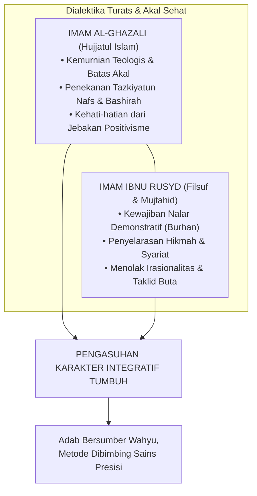

Dalam kitabnya *Tahafut al-Falasifah*, Imam Al-Ghazali membongkar kepongahan kaum filosof materialis yang mencoba mendefinisikan seluruh rahasia ketuhanan semata-mata dengan nalar spekulatif yang rapuh. Al-Ghazali menegaskan batas wilayah akal manusia dan membuka pintu bagi **penyucian jiwa (*tazkiyatun nafs*) dan kepekaan kalbu (*bashirah*)** sebagai saluran tertinggi untuk menangkap kebenaran sejati[^7].

Satu abad kemudian, Imam Ibnu Rusyd hadir dengan karyanya *Fashl al-Maqal fima bayna al-Hikmah wa asy-Syari'ah min al-Ittishal* dan *Tahafut at-Tahafut*. Beliau menegaskan bahwa penalaran rasional demonstratif (*al-burhan al-'aqli*) dan penelitian mendalam atas hukum alam (*sunnatullah*) bukanlah ancaman bagi syariat, melainkan sebuah **kewajiban keagamaan** yang diperintahkan langsung oleh Al-Qur'an (QS. Al-Hasyr [59]: 2: *"Fa'tabiruu yaa ulil abshaar"* — *Maka ambillah pelajaran, wahai orang-orang yang memiliki pandangan nalar!*)[^8]. Ibnu Rusyd membuktikan bahwa kebenaran wahyu yang shahih (*al-haqq*) tidak akan pernah bertentangan dengan kebenaran akal murni dan fakta alam yang terbukti (*al-haqq la yudhaddu al-haqq, bal yuwafiquhu wa yasyhadu lahu*).

Dari perjumpaan pemikiran kedua ulama ini, TUMBUH menarik kaidah operasional bagi pengasuhan pesantren:
1. **Mengambil Metode Terbaik Tanpa Kehilangan Arah Syariat**:  
   Kita tidak perlu ragu memanfaatkan instrumen psikologi modern—seperti *Functional Behavior Assessment* (FBA), *Polyvagal Theory*, atau *Positive Behavioral Interventions and Supports* (PBIS)—selama instrumen tersebut terbukti secara ilmiah membantu kita memahami mekanisme saraf santri dan tidak bertentangan dengan adab Islam. Sains perilaku modern adalah hikmah yang tercecer milik orang beriman; di mana pun ia menemukannya, ia berhak mengambilnya.
2. **Menolak Reduksionisme Teknokratis Angka**:  
   Sekalipun TUMBUH menggunakan dasbor digital, grafik perkembangan santri, dan analisis data, kita menolak keras anggapan bahwa manusia dapat diselesaikan hanya dengan angka-angka algoritma. Data angka dapat memberitahukan bahwa santri A mengalami penurunan skor konsentrasi 40%. Namun untuk menyembuhkan lukanya, tetap dibutuhkan seorang musyrif yang menatap matanya dengan penuh cinta, mendoakannya di sujud malam, dan menyentuh hatinya dengan kalimat hikmah Ilahiyah.

---

### 3.6 Tata Kelola Epistemik Sistem TUMBUH: Protokol Pengambilan Keputusan Anti-Kezaliman

Bagaimanakah seluruh prinsip epistemologi ini dioperasionalkan agar tidak menjadi teori hampa di atas kertas?

Arsitektur TUMBUH mengkodifikasikan prinsip-prinsip ini ke dalam **Rantai Akuntabilitas Keputusan (*The Epistemic Decision Chain*)**:

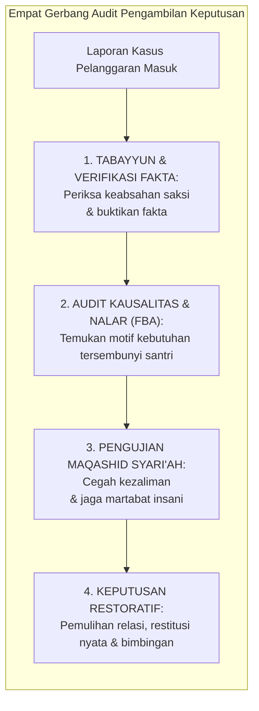

Setiap kali terjadi kasus pelanggaran berat di asrama yang menuntut tindakan tegas, pengurus dan musyrif wajib mengisi **Protokol Verifikasi Epistemik** sebelum mengetuk palu keputusan:

1. **Uji Sumber (*Source Verification*)**:  
   Siapa yang pertama kali menyampaikan informasi ini? Apakah saksi mata melihat langsung kejadian tersebut dengan mata kepalanya sendiri, ataukah sekadar mendengar dari desas-desus orang lain? Apakah saksi memiliki konflik kepentingan pribadi dengan santri yang dituduh?
2. **Uji Instrumen dan Metode (*Methodological Audit*)**:  
   Bagaimana bukti dihimpun? Apakah santri diinterogasi dalam keadaan ketakutan di bawah ancaman bentakan (yang secara neurobiologis membuat anak terpaksa mengaku bohong demi selamat), ataukah dalam suasana tenang yang memungkinkan nalar nuraninya berbicara jujur?
3. **Uji Kausalitas (*Causal Attribution*)**:  
   Apakah tindakan santri tersebut merupakan kesengajaan murni yang terencana (*'amd*), kekeliruan tanpa sengaja (*khatha'*), ataukah reaksi keterpaksaan di bawah intimidasi santri lain?
4. **Uji Maqashid Syari'ah (*Safeguarding Test*)**:  
   Apakah konsekuensi yang akan diberikan berpotensi melanggar hak perlindungan raga (*hifzh an-nafs*) atau meremukkan kehormatan nama baik santri (*hifzh al-'irdh*)? Jika ya, maka bentuk konsekuensi tersebut **wajib dibatalkan seketika dan diganti dengan restitusi yang mendidik**.

---

### 3.7 Bedah Bias Kognitif Pembina: Tiga Jebakan Pikiran yang Merusak Keadilan Asrama

Bahkan seorang musyrif atau ustadz yang paling saleh sekalipun dapat terjatuh ke dalam ketidakadilan epistemik jika tidak menyadari cara kerja otak manusia yang rentan terhadap **Bias Kognitif (*Cognitive Biases*)**.

Psikologi kognitif dan ilmu keperilakuan mengidentifikasi tiga bias utama yang paling sering melahirkan kezaliman di lingkungan pesantren 24 jam:

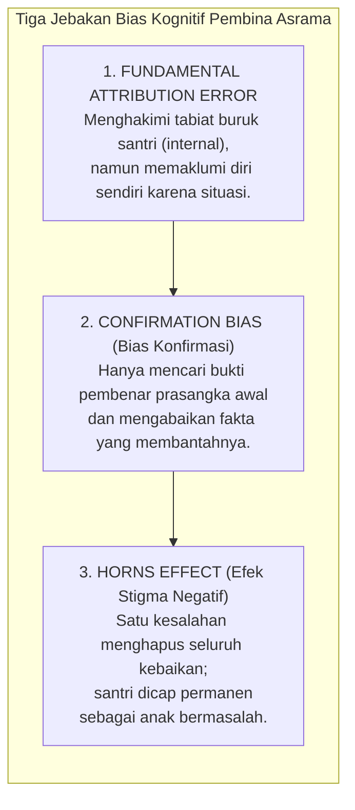

#### 1. Kesalahan Atribusi Mendasar (*Fundamental Attribution Error*)
Ketika seorang santri terlambat bangun salat subuh, pembina dengan cepat menyimpulkan: *"Anak ini pemalas, tidak punya disiplin, dan hatinya keras!"* Pembina mengaitkan kegagalan santri semata-mata dengan faktor watak internal (*dispositional attribution*). Namun ketika pembina itu sendiri suatu hari bangun kesiangan, ia membela dirinya: *"Semalam saya kelelahan karena harus merekap absensi hingga larut malam, ditambah alarm kamar saya mati."* Pembina mengaitkan kegagalan dirinya dengan faktor situasi lingkungan (*situational attribution*).

TUMBUH mewajibkan setiap pendidik untuk menerapkan kaidah husnuzhan epistemik: **Sebelum menghakimi watak internal santri, periksalah terlebih dahulu beban situasi dan lingkungan yang sedang menimpanya.**

#### 2. Bias Konfirmasi (*Confirmation Bias*)
Ketika seorang musyrif sudah terlanjur memiliki prasangka buruk kepada seorang santri (misalnya Santri Fikri), mata musyrif tersebut secara selektif hanya akan memperhatikan saat Fikri bercanda atau mengantuk di kelas, sembari berbisik: *"Tuh kan, memang Fikri tidak pernah niat belajar!"* Namun di saat yang sama, musyrif tersebut buta terhadap kenyataan bahwa Fikri tadi malam membantu merapikan seprai ranjang kawannya yang sakit. Otak pembina secara otomatis menyaring bukti-bukti yang tidak sesuai dengan prasangkanya.

#### 3. Efek Tanduk dan Pelabelan Permanen (*The Horns Effect & Labeling*)
Sekali seorang santri pernah melakukan pelanggaran berat (misalnya mencuri sandal atau merokok), cap "santri bermasalah" melekat laksana tato permanen di dahinya. Setiap kali ada sandal hilang atau ada bau asap rokok di kamar mandi, nama dialah yang pertama kali diseret dan diinterogasi. Pelabelan permanen ini secara neurobiologis membunuh harapan anak untuk berubah dan mendorongnya masuk ke dalam ramalan yang terwujud dengan sendirinya (*Self-Fulfilling Prophecy*): *"Toh semua ustadz menganggapku penjahat, jadi buat apa aku bersikap baik?"*

TUMBUH menetapkan aturan ketat: **Setiap hari adalah lembaran putih baru bagi fitrah santri**. Sanksi yang telah diselesaikan dengan restitusi nyata wajib menghapus seluruh catatan noda di mata sosial para pengasuh.

---

### 3.8 Logbook Epistemik Pembina: Standar Triangulasi Bukti Sebelum Putusan Disiplin

Untuk mengeliminasi bias personal dan memastikan setiap keputusan disiplin berdiri di atas landasan yang shahih, tim pengasuhan TUMBUH mengoperasionalkan **Format Logbook Epistemik Triangulasi**[^9]:

```text
               LEMBAR AUDIT VERIFIKASI EPISTEMIK KASUS SANTRI
┌───────────────────────────────────────────────────────────────────────────┐
│ NAMA SANTRI   : .......................   KAMAR/ASRAMA : ................ │
│ TANGGAL/WAKTU : .......................   MUSYRIF AUDITOR: .............. │
├───────────────────────────────────────────────────────────────────────────┤
│ 1. DESKRIPSI PERILAKU TERAMATI (FAKTUAL & OBJEKTIF - BUKAN LABEL MORAL):  │
│    [Tuliskan apa yang terlihat dan terdengar secara konkret tanpa asumsi] │
│    Contoh: "Santri melempar buku catatan ke lantai dan keluar kelas       │
│    pukul 09.15 WIB." (BUKAN: "Santri bersikap kurang ajar dan sombong")   │
├───────────────────────────────────────────────────────────────────────────┤
│ 2. TRIANGULASI SUMBER BUKTI (MINIMAL 3 TITIK PEMERIKSAAN):                │
│    [ ] Sumber 1: Kesaksian Pengamatan Langsung Pembina (Bukan desas-desus)│
│    [ ] Sumber 2: Rekaman Fakta Fisik / Log Absensi / Cek Lingkungan       │
│    [ ] Sumber 3: Konfirmasi Tertutup dari Santri yang Bersangkutan (Aman) │
├───────────────────────────────────────────────────────────────────────────┤
│ 3. UJI DERAJAT KEPASTIAN KLAIM:                                           │
│    [ ] Didukung Kuat (Strongly Supported) -> Dapat Diproses               │
│    [ ] Masih Dugaan Hipotesis (Hypothesized) -> WAJIB TABAYYUN LANJUTAN   │
├───────────────────────────────────────────────────────────────────────────┤
│ 4. AUDIT ANTESEDEN LINGKUNGAN (APA PEMICU SEBELUM INSIDEN?):              │
│    - Apakah santri tidur minimal 7 jam semalam? ......................... │
│    - Apakah ada provokasi / perundungan dari kawan sekamar? ............. │
│    - Apakah ada kabar duka dari keluarga kandung? ....................... │
├───────────────────────────────────────────────────────────────────────────┤
│ 5. REKOMENDASI EDUKATIF-RESTORATIF (RESTITUSI MEMPERBAIKI KERUSAKAN):     │
│    ...................................................................... │
└───────────────────────────────────────────────────────────────────────────┘
```

Dengan tata kelola epistemik yang ketat ini, pesantren terlindungi dari dosa kezaliman institusional. Tidak ada lagi santri yang menjadi korban fitnah asrama; tidak ada lagi air mata keputusasaan anak yang dihukum atas dosa yang tidak pernah ia lakukan.

Dari kebeningan epistemologi ini, kita kini memiliki alat berpikir yang adil dan tajam. Pertanyaan berikutnya menanti kita: *Siapakah sesungguhnya hakikat anak manusia yang sedang kita bimbing ini? Bagaimanakah susunan anatomi jiwa fitrahnya—antara Ruh, Qalb, 'Aql, dan Nafs—bergerak di dalam tubuh biologisnya?*

Inilah yang akan kita jelajahi secara mendalam dalam **Bab 4: Antropologi Jiwa Santri: Hakikat Fitrah dan Komponen Kejiwaan**.

---

### Catatan Kaki & Rujukan Akademik

[^1]: Al-Qur'an al-Karim, Surah Al-Hujurat [49]: 6; Ibnu Katsir, *Tafsir al-Qur'an al-'Azhim*, Jilid VII, hlm. 370–372.
[^2]: Abu Abdillah Muhammad bin Ahmad Al-Qurthubi, *Al-Jami' li Ahkam al-Qur'an*, Jilid XVI, hlm. 310–314.
[^3]: Al-Qur'an al-Karim, Surah An-Najm [53]: 23.
[^4]: Abdurrahman bin Nashir As-Sa'di, *Taisir al-Karim ar-Rahman fi Tafsir Kalam al-Mannan* (Beirut: Mu'assasah ar-Risalah, 2000), hlm. 819.
[^5]: Abu Hamid Muhammad bin Muhammad Al-Ghazali, *Al-Mustashfa min 'Ilm al-Ushul*, Tahqiq: Dr. Hamzah bin Zuhair Hafizh (Madinah: Syarikah al-Madinah al-Munawwarah, 1993), Jilid I, hlm. 35–48; Syed Muhammad Naquib al-Attas, *The Epistemology of Islam: A Definition and Framework* (Kuala Lumpur: ISTAC, 1990).
[^6]: Abu Umar Yusuf bin Abdil Barr An-Namari Al-Qurthubi, *Jami' Bayan al-'Ilm wa Fadhlihi*, Tahqiq: Abul Asybal Az-Zuhairi (Riyadh: Dar Ibn al-Jauzi, 1994), Jilid II, hlm. 838–842, riwayat no. 1582.
[^7]: Abu Hamid Muhammad bin Muhammad Al-Ghazali, *Tahafut al-Falasifah*, diedit oleh Sulaiman Dunya (Kairo: Dar al-Ma'arif, 1972), hlm. 72–89; Abu Hamid Al-Ghazali, *Al-Munqidz min adh-Dhalal*, diedit oleh Dr. Abdul Halim Mahmud (Kairo: Dar al-Kutub al-Haditsah, 1968), hlm. 45–60.
[^8]: Abu al-Walid Muhammad bin Ahmad bin Rusyd (Averroes), *Fashl al-Maqal fima bayna al-Hikmah wa asy-Syari'ah min al-Ittishal*, diedit oleh Dr. Muhammad 'Imarah (Kairo: Dar al-Ma'arif, 1983), hlm. 28–42; George F. Hourani, *Averroes on the Harmony of Religion and Philosophy* (London: Luzac & Co., 1961).
[^9]: Repositori TUMBUH v2.0.0, Dokumen Fundamental: `01_FUNDAMENTAL/01_PHILOSOPHY/02_EPISTEMOLOGY/05-Jenis-dan-Tingkat-Klaim.md` dan `08-Implikasi-Epistemology-bagi-TUMBUH.md`.

---

# BAB 4: ANTROPOLOGI JIWA SANTRI: HAKIKAT FITRAH DAN KOMPONEN KEJIWAAN
## Membedah Anatomi Ruh, Qalb, 'Aql, dan Nafs dalam Dinamika Remaja Pesantren 24 Jam

> أَلَا وَإِنَّ فِي الْجَسَدِ مُضْغَةً، إِذَا صَلَحَتْ صَلَحَ الْجَسَدُ كُلُّهُ، وَإِذَا فَسَدَتْ فَسَدَ الْجَسَدُ كُلُّهُ، أَلَا وَهِيَ الْقَلْبُ
>
> *"Ingatlah! Sesungguhnya di dalam tubuh manusia ada segumpal daging; apabila ia baik, maka baiklah seluruh tubuh itu, dan apabila ia rusak, maka rusaklah seluruh tubuh itu. Ingatlah, segumpal daging itu adalah Al-Qalb (Kalbu)!"*  
> — **Rasulullah ﷺ**, riwayat An-Nu'man bin Basyir رضي الله عنه[^1]

---

### 4.1 Menembus Pucuk Gunung Es: Bahaya Reduksionisme Perilaku di Asrama

Salah satu kekeliruan metodologis yang paling merusak dalam dunia pendidikan kepesantrenan adalah **Reduksionisme Perilaku (*Behavioral Reductionism*)**—yakni kecenderungan gegabah dari para pembina untuk menyamakan sepotong perilaku lahiriah yang tampak sesaat di permukaan mata dengan keseluruhan hakikat jati diri seorang anak manusia.

Mari kita tatap sebuah skenario yang terjadi hampir setiap hari di lorong asrama:
Seorang santri berusia lima belas tahun bernama Salman, pada hari Senin pagi, datang terlambat ke halaqah tahfizh. Ia duduk di saf belakang dengan seragam kusut, mata memerah, dan pandangan kosong. Ketika gilirannya tiba untuk menyetorkan hafalan surah yang telah ditugaskan sejak tiga hari lalu, Salman terdiam mematung. Ayat-ayat yang semestinya mengalir dari bibirnya menguap tak bersisa. Ia terbata-bata pada ayat kedua, lalu menundukkan kepalanya dalam-dalam.

Perhatikan bagaimana dua paradigma pengasuhan yang berbeda merespons Salman:

#### Pendekatan Reduksionis yang Menghakimi
Musyrif halaqah yang berpikiran sempit segera melontarkan vonis: *"Salman, kamu ini santri pemalas! Tiga hari kamu diberi waktu, tapi tidak ada satu halaman pun yang masuk ke otakmu! Dasar anak pembangkang, tidak menghargai lelah orang tuamu yang membayar SPP! Berdiri di samping tiang masjid sampai jam istirahat!"*

Musyrif tersebut hanya melihat **pucuk gunung es**: ia melihat hafalan yang belum lancar, lalu melompat pada kesimpulan moral bahwa Salman adalah anak yang jahat dan berhati kotor.

#### Pendekatan Antropologi Jiwa TUMBUH
Pendidik yang memiliki pemahaman utuh tentang hakikat manusia tidak akan pernah melompat pada penghakiman dangkal semacam itu. Ia memahami hukum semesta jiwa: **Perilaku lahiriah (*zhahir*) hanyalah sepuluh persen puncak gunung es yang menyembul di atas permukaan samudra. Sembilan puluh persen sisanya adalah struktur dimensi manusia yang saling bertaut di bawah permukaan:**

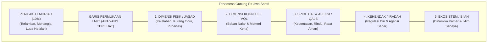

Ketika ditelusuri secara bijak oleh tim pengasuhan TUMBUH, fakta sesungguhnya di bawah permukaan Salman terungkap:
* Dua malam sebelumnya, ibu Salman dilarikan ke rumah sakit di kampung halamannya karena stroke mendadak. Kabar itu sampai ke telinga Salman lewat telepon singkat wali kelas pada hari Sabtu sore.
* Sepanjang malam Minggu dan malam Senin, hati Salman (*qalb*) dilanda badai kecemasan dan kesedihan yang mencekam. Ia menangis diam-diam di bawah selimutnya saat kawan-kawannya terlelap.
* Karena tidak bisa tidur nyenyak selama dua malam berturut-turut, fisik biologisnya (*jasad*) mengalami kelelahan saraf akut.
* Akibat badai kecemasan dan kekurangan tidur tersebut, hormon kortisol membanjiri otaknya, mematikan fungsi memori kerja (*'aql*) di hipokampusnya, sehingga hafalan yang sebenarnya sudah ia kuasai pada hari Jumat hilang seketika dari ingatannya.

Salman tidak sedang membangkang; jiwanya sedang menjerit meminta pertolongan!

Ketika seorang pembina menghukum anak seperti Salman dengan bentakan dan penghinaan di depan teman-temannya, pembina tersebut sesungguhnya sedang menaburkan garam ke atas luka jiwa anak yang sedang hancur. Ini adalah kezaliman pedagogis yang diakibatkan oleh kebutaan terhadap antropologi manusia.

---

### 4.2 Anatomi Jiwa dalam Khazanah Turats: Memahami Ruh, Qalb, 'Aql, dan Nafs

Di manakah letak keunggulan tradisi Islam dalam membedah jiwa manusia dibanding teori psikologi sekuler modern?

Psikologi Barat sekuler—yang berakar pada materialisme—mereduksi manusia semata-mata sebagai organisme biologis yang dikendalikan oleh impuls saraf dan kimiawi hormon. Jiwa dianggap tidak lebih dari sekadar aktivitas elektrokimiawi di dalam otak (*mind is merely brain*). Akibatnya, dimensi ketuhanan, sakralitas niat, dan kehidupan akhirat dihapuskan dari diskursus terapi kepribadian.

Sebaliknya, khazanah intelektual Islam yang diwariskan oleh **Hujjatul Islam Abu Hamid Al-Ghazali** dalam *Ihya' Ulumiddin* (khususnya *Kitab Syarh 'Aja'ib al-Qalb*) memberikan peta anatomi jiwa yang sangat komprehensif, presisi, dan berlapis-lapis[^10]:

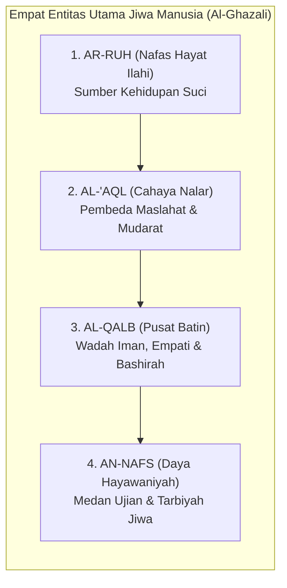

Mari kita bedah hakikat dan fungsi masing-masing komponen ini dalam kaitannya dengan pembinaan santri:

#### 1. Ar-Ruh (Hembusan Hayat Ilahiyah)
Ruh adalah rahasia ketuhanan (*amrun min amri Rabbi*, QS. Al-Isra': 85) yang ditiupkan Allah ke dalam janin manusia. Ruh adalah sumber kehidupan hakiki yang menjadikan manusia makhluk berkesadaran spiritual. Ruh senantiasa merindukan kesucian, membenci kezaliman, dan condong kepada Dzat Yang Menciptakannya. Di dalam diri setiap santri—bahkan yang paling sering melanggar sekalipun—ruh suci ini tetap ada; ia tidak pernah mati, melainkan hanya tertutupi oleh kabut tebal hawa nafsu.

#### 2. Al-Qalb (Poros Pengendali Kemanusiaan)
Imam Al-Ghazali menegaskan bahwa lafal *Al-Qalb* memiliki dua makna:
* **Makna Fisik-Organik**: Segumpal daging berbentuk kerucut di rongga dada sebelah kiri yang memompa darah ke seluruh tubuh.
* **Makna Hakiki-Spiritual (*Lathifah Rabbaniyyah Ruhaniyyah*)**: Inti terdalam kemanusiaan (*the spiritual subtle organ*), tempat bersemayamnya keimanan, niat, keikhlasan, rasa cinta, empati, dan pandangan mata batin (*bashirah*). Qalb inilah yang sesungguhnya diajak bicara oleh wahyu, yang dituntut bertanggung jawab di akhirat, dan yang menjadi raja atas seluruh anggota tubuh manusia.

Al-Qalb dinamai demikian karena sifatnya yang dinamis dan mudah berbolak-balik (*taqallub*). Pagi hari seorang santri bisa merasa sangat bersemangat beribadah, namun sore hari hatinya bisa dirundung kesedihan atau tergelincir godaan kemalasan. Tugas pengasuhan asrama adalah menghadirkan lingkungan (*bi'ah*) yang menjaga kemantapan hati santri agar senantiasa condong kepada kebaikan (*tsabatul qalb*).

#### 3. Al-'Aql (Cahaya Nalar dan Penimbang Nilai)
Akal adalah anugerah cahaya kognitif yang memampukan santri memahami teks wahyu, merenungkan akibat jangka panjang dari tindakannya, dan menimbang maslahat serta mudarat. Akal adalah penasihat setia bagi kalbu. Jika akal santri dilatih berpikir kritis dan merenungi ayat-ayat Allah, akal akan menjadi panglima yang menuntun raga memilih jalan ketakwaan. Namun jika akal dibiarkan tumpul dan dipaksa tunduk pada doktrin kepatuhan buta, akal akan kehilangan fungsinya sebagai benteng moral.

#### 4. An-Nafs (Wadah Gejolak Hayawaniyah)
Dalam terminologi tasawuf, *An-Nafs* adalah komponen kejiwaan yang menghimpun daya syahwat (hasrat biologis pada makanan, tidur, perhiasan duniawi) dan daya amarah (*ghadhab*—dorongan agresivitas dan pertahanan diri). Nafs adalah kendaraan raga di bumi; nafs tidak diciptakan untuk dimatikan atau dibunuh, melainkan untuk **ditundukkan dan disucikan (*tazkiyah*)**[^11] di bawah bimbingan akal dan kalbu.

---

### 4.3 Tiga Martabat Jiwa Remaja dalam Al-Qur'an

Al-Qur'an al-Karim mengabarkan bahwa pergulatan antara kalbu, akal, dan nafs melahirkan **tiga tingkatan dinamika kejiwaan (*Ahwal an-Nafs*)** yang dialami oleh setiap manusia, khususnya para remaja santri di asrama[^3]:

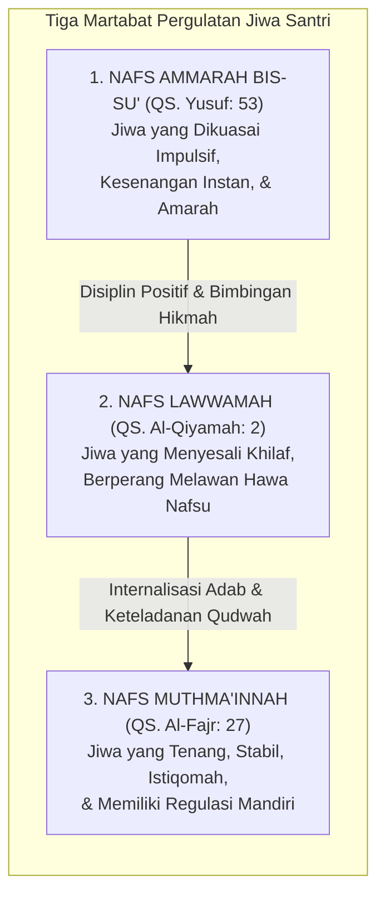

#### 1. Nafs Ammarah bis-Su' (Dorongan Primitif dan Impulsif)
> وَمَا أُبَرِّئُ نَفْسِي ۚ إِنَّ النَّفْسَ لَأَمَّارَةٌ بِالسُّوءِ إِلَّا مَا رَحِمَ رَبِّي
>
> *"Dan aku tidak menyatakan diriku bebas dari kesalahan, karena sesungguhnya nafsu itu selalu mendorong kepada kejahatan, kecuali nafsu yang diberi rahmat oleh Rabb-ku..."* (QS. Yusuf [12]: 53)[^2]

Imam Ibnu Katsir menjelaskan bahwa ayat ini menggambarkan tabiat dasar hawa nafsu yang selalu condong mengajak kepada keburukan (*ammarah bis-su'*), kecuali jiwa yang dirahmati dan diteguhkan oleh Allah melalui bimbingan taufik-Nya.[^3] 

Ini adalah kondisi kejiwaan dasar ketika dorongan biologis purba dan hawa nafsu menguasai kendali diri. Pada santri remaja, *nafs ammarah* termanifestasi dalam perilaku impulsif: ingin menang sendiri saat antre mandi, menyembunyikan makanan teman, berbohong demi menghindari tugas piket, atau melampiaskan amarah dengan memukul. Jika santri berada pada tahap ini, menghujamnya dengan hukuman yang menghinakan justru akan mengobarkan api amarahnya dan membuatnya semakin membangkang.

#### 2. Nafs Lawwamah (Gejolak Nurani dan Penyesalan Suci)
> وَلَا أُقْسِمُ بِالنَّفْسِ اللَّوَّامَةِ
>
> *"Dan Aku bersumpah demi jiwa yang selalu menyesali (mencela) dirinya sendiri!"* (QS. Al-Qiyamah [75]: 2)[^4]

Imam Al-Hasan Al-Bashri sebagaimana dinukil oleh Imam Ath-Thabari dan Ibnu Katsir menafsirkan *An-Nafs al-Lawwamah* sebagai jiwa seorang mukmin sejati: *"Engkau tidak akan mendapati seorang mukmin sejati melainkan ia senantiasa mencela dirinya: 'Apa maksud ucapanku tadi? Apa maksud perbuatanku tadi? Mengapa aku tergelincir?' Sedangkan orang fajir terus melangkah tanpa pernah menyesali kelalaiannya."*[^5] 

Allah ﷻ bersumpah dengan agung atas kemuliaan *Nafs Lawwamah*! Ini adalah tingkatan jiwa yang sangat istimewa pada usia remaja. Santri pada tahap ini mungkin saja tergelincir melakukan kesalahan adab karena godaan sesaat; namun begitu perbuatan itu selesai, dadanya terasa sesak, nuraninya bergetar mencela dirinya sendiri, dan ia diliputi oleh rasa penyesalan mendalam: *"Mengapa tadi aku membentak temanku? Ya Allah, ampuni dosaku..."*

Para pengasuh pesantren wajib menyadari: **Hadirnya rasa bersalah dan penyesalan pada diri seorang santri adalah bukti tak terbantahkan bahwa fitrah kebaikannya masih menyala terang!** 

Tugas pendidik saat santri berada dalam fase *lawwamah* bukanlah mempermalukannya di depan umum, melainkan merangkulnya dengan penuh kasih sayang, mengarahkannya untuk bertaubat (*taubat nasuha*), dan membimbingnya melakukan **restitusi nyata (memperbaiki kesalahan)**.

#### 3. Nafs Muthma'innah (Puncak Kedamaian dan Keteguhan Adab)
> يَا أَيَّتُهَا النَّفْسُ الْمُطْمَئِنَّةُ ۝ ارْجِعِي إِلَىٰ رَبِّكِ رَاضِيَةً مَّرْضِيَّةً
>
> *"Wahai jiwa yang tenang! Kembalilah kepada Rabb-mu dengan hati yang rida dan diridai-Nya..."* (QS. Al-Fajr [89]: 27–28)[^6]

Imam Ath-Thabari meriwayatkan bahwa *An-Nafs al-Muthma'innah* adalah jiwa yang tenang dalam keyakinan tauhid, mantap bahwa Allah adalah Rabb-nya, ridha terhadap takdir dan syariat-Nya, serta teguh dalam ketaatan tanpa keraguan.[^7]

Inilah derajat kematangan tertinggi (*ar-rusyd*): jiwa yang telah mencapai ketenteraman mendalam (*thuma'ninah*). Gejolak syahwat dan amarah telah berhasil dijinakkan oleh cahaya iman dan nalar akal budi. Santri yang telah mencapai derajat ini beribadah dengan penuh kenikmatan batin, beradab luhur secara spontan (*malakah*), dan tetap teguh memegang nilai-nilai kebaikan sekalipun berada sendirian tanpa ada pengawasan musyrif.

---

### 4.4 Enam Dimensi Keutuhan Manusia dalam Arsitektur TUMBUH

Menolak reduksionisme perilaku, sistem TUMBUH memandang santri melalui **Lensa Enam Dimensi Holistik (*The Six Dimensions of Human Wholeness*)**[^7]:

```mermaid
graph TD
    A["MANUSIA SANTRI UTUH (TUMBUH)"]
    
    A --> D1["1. JASAD (Fisik-Biologis)<br/>Nutrisi Gizi, Kualitas Tidur,<br/>& Keseimbangan Hormon"]
    D1 --> D2["2. 'AQL (Kognitif & Nalar)<br/>Pematangan PFC, Memori & Logika Maslahat"]
    D2 --> D3["3. QALB (Spiritual & Afektif)<br/>Tauhid, Keikhlasan, Empati & Regulasi Emosi"]
    D3 --> D4["4. IRADAH (Kehendak & Agensi)<br/>Ikhtiyar Sadar, Kendali Diri & Tanggung Jawab"]
    D4 --> D5["5. 'AMAL (Kebiasaan & Malakah)<br/>Pembiasaan Adab Spontan di Kamar & Masjid"]
    D5 --> D6["6. BI'AH (Relasi & Ekosistem)<br/>Iklim Budaya Kamar, Teman Sebaya & Qudwah"]
```

Mari kita urai keterkaitan dinamis keenam dimensi ini[^12] dalam kehidupan asrama 24 jam:

#### 1. Dimensi Jasmani (*Al-Jasad*)
Santri adalah makhluk berjasad fisik yang membutuhkan nutrisi halal dan bergizi seimbang, hidrasi air minum yang cukup, udara kamar yang bersih berventilasi, serta istirahat tidur yang cukup. Pada usia 12–18 tahun, tubuh remaja mengalami lonjakan hormon pertumbuhan (*growth spurt*) dan lonjakan hormon seks (testosteron dan estrogen) yang sangat masif. Mengabaikan keletihan fisik santri dan memaksakan beban hafalan di luar batas biologisnya adalah kezaliman terhadap hak tubuh (*Inna li jasidika 'alayka haqqan*).

#### 2. Dimensi Kognitif (*Al-'Aql*)
Pada fase remaja, bagian otak depan (*Prefrontal Cortex / PFC*) masih berada dalam fase konstruksi pematangan sinapsis (*pruning and myelination*). Neurosains membuktikan bahwa **sistem limbik (pusat dorongan emosi dan pencarian sensasi) matang jauh lebih awal dibandingkan PFC (pusat kendali rem impuls)**[^8]. Ketimpangan perkembangan ini menjelaskan mengapa santri remaja kerap bersikap nekat, berani mengambil risiko, dan mudah terhasut oleh teman sebaya. Santri bukan berniat jahat; rem biologis di otaknya memang belum sepenuhnya terpasang sempurna, sehingga ia mutlak membutuhkan bimbingan pendampingan eksternal (*scaffolding*) dari para pembina.

#### 3. Dimensi Spiritual dan Afektif (*Al-Qalb*)
Kebutuhan jiwa terdalam santri adalah **rasa aman (*psychological safety*)** dan **rasa diterima (*belonging*)**. Santri yang baru meninggalkan rumah orang tuanya kerap mengalami *homesickness* dan kecemasan terisolasi. Jika kebutuhan afektif ini diabaikan, kalbunya akan terkunci dalam mekanisme pertahanan diri, menjadikannya rentan memberontak atau depresi.

#### 4. Dimensi Kehendak dan Agensi (*Al-Iradah / Agency*)
Santri bukanlah robot yang perilakunya cukup dikendalikan oleh remote kontrol pengurus. Allah menciptakan manusia dengan daya memilih sadar (**Al-Ikhtiyar**). Disiplin sejati lahir ketika kehendak santri telah terlatih untuk memilih kebaikan atas dorongan tanggung jawab pribadi, bukan karena takut dipukul.

#### 5. Dimensi Amal dan Pembiasaan Karakter (*Al-'Amal wa Al-Malakah*)
Ibnu Miskawaih dalam *Tahdzib al-Akhlaq* dan Ibnu Khaldun dalam *Muqaddimah* menjelaskan bahwa karakter luhur (*al-khuluq al-hasan*) adalah **Al-Malakah**—yakni sifat kejiwaan yang tertanam kokoh sehingga perbuatan baik mengalir darinya secara spontan dan mudah tanpa perlu berpikir berat atau merasa terbebani[^9]. Malakah tidak lahir dari hafalan teori di kelas; malakah lahir dari amal kebajikan yang dipraktikkan secara konsisten berulang-ulang di asrama dalam atmosfer yang membahagiakan.

#### 6. Dimensi Relasi Sosial dan Lingkungan (*Al-Bi'ah*)
Santri tidak bertumbuh di ruang hampa. Iklim pergaulan di kamar asrama, kehangatan senyuman musyrif, serta budaya saling menghargai antarsantri (*Bi'ah Shalihah*) adalah rahim peradaban tempat karakter bersemi. Sehebat apa pun materi pengajian di kelas, jika kultur di lorong asrama sarat dengan caci maki dan perundungan, maka kultur asramalah yang akan memenangkan pembentukan karakter santri.

---

### 4.5 Studi Kasus Investigasi Multidimensi di Pesantren

Agar pemahaman antropologi ini menjadi panduan praktis bagi para pendidik, perhatikan bagaimana analisis multidimensi TUMBUH diterapkan pada kasus riil di bawah ini:

* **Laporan Masalah**: Santri Farhan (14 tahun, kelas 8) dilaporkan oleh musyrif kamar karena dalam sepekan terakhir sering melamun saat pengajian kitab kuning, tidak mengerjakan tugas terjemahan, dan kemarin sore melempar sandal ke arah teman sekamarnya hingga memicu pertengkaran.

```mermaid
graph TD
    M["Kasus: Farhan Melamun & Lempar Sandal"] --> U["AUDIT INVESTIGASI MULTIDIMENSI TUMBUH"]
    
    subgraph HASIL_AUDIT["Temuan Lima Dimensi Kausalitas"]
        direction TB
        F1["1. Jasmani: Sakit gigi geraham berlubang,<br/>tidak tidur nyenyak 4 malam berturut-turut."]
        F2["2. Kognitif: Cognitive overload<br/>  materi I'lal nahwu,<br/>bingung namun malu bertanya."]
        F3["3. Afektif: Tertekan & cemas dicap bodoh."]
        F4["4. Bi'ah / Relasi:<br/>Diejek kawan saat antre wudhu,<br/>memicu ledakan amarah."]
        F5["5. Iradah: Menyesal melempar sandal,<br/>namun bingung meredakan malu."]
        F1 --> F2 --> F3 --> F4 --> F5
    end

    U --> HASIL_AUDIT
    HASIL_AUDIT --> SOL["SOLUSI RESTORATIF TERPADU:<br/>1. Pengobatan medis dokter gigi pondok.<br/>2. Remedial kognitif privat guru nahwu.<br/>3. Dialog lingkaran restoratif kamar.<br/>4. Farhan meminta maaf secara ksatria."]
```

Bandingkan hasil di atas dengan metode penghukuman konvensional!
Jika kasus Farhan ditangani dengan cara lama: Farhan akan diseret ke depan umum, dicaci sebagai santri malas dan pembuat onar, lalu dihukum push-up 50 kali di lapangan. 
* *Akibatnya*: Gigi Farhan tetap sakit dan infeksi, materi nahwunya tetap tidak paham, ejekan teman sekamarnya semakin menjadi-jadi, dan dendam batinnya meledak menjadi kebencian kepada pesantren.

Dengan pendekatan antropologi multidimensi TUMBUH: sakit fisik Farhan disembuhkan, kebingungan kognitifnya diatasi dengan pendampingan belajar, perundungan di kamarnya dihentikan secara restoratif, dan martabat dirinya sebagai santri diselamatkan.

---

### 4.6 Tazkiyatun Nafs Klasik dan Regulasi Sistem Saraf: Jembatan Turats dan Neurosains

Bagaimanakah tradisi tasawuf klasik para ulama mu'tabar memandang proses penyembuhan jiwa yang sedang terluka atau tergelincir syahwat?

Imam Al-Ghazali dalam *Ihya' 'Ulum ad-Din* meletakkan dua pilar utama penyucian jiwa:
1. **Al-Mujahadah**: Berperang melawan dorongan hawa nafsu destruktif dengan cara meninggalkan kebiasaan buruk secara sadar dan mematahkan pemicunya (*qath'u asbab asy-syahwat*).
2. **Ar-Riyadhah**: Pelatihan pembiasaan jiwa melalui pembebanan amal-amal kebajikan yang berlawanan (*'ilaj al-illati bi dhiddiha*), seperti melatih jiwa yang sombong dengan tugas membersihkan sandal jamaah masjid, atau melatih lisan yang kasar dengan memperbanyak zikir istighfar dan diam bertafakur.

Secara menakjubkan, apa yang dirumuskan Al-Ghazali sebagai *riyadhatun nafs* berkorespondensi satu-satu dengan temuan neurosains modern tentang **Regulasi Saraf Otonom (*Autonomic Nervous System Regulation*)** dan **Plastisitas Sinaptik**:

```mermaid
graph TD
    subgraph SINTESIS_PENYUCIAN_JIWA["Integrasi Tazkiyah dan Neurosains"]
        T["TAZKIYATUN NAFS (AL-GHAZALI)<br/>• Riyadhah & Mujahadah<br/>• Zikir Khafi & Munajat Fajar<br/>• Wudhu Air Dingin saat Marah"] 
        <--> 
        N["NEUROSAINS KOGNITIF<br/>• Stimulasi Saraf Vagus (Vagal Tone)<br/>• Regulasi Dopamin & Menurunkan Kortisol<br/>• Penguatan Koneksi PFC-Amigdala"]
    end
```

Ketika seorang santri diajarkan berwudhu dengan membasuh air dingin ke wajah saat dadanya mendidih oleh amarah, secara neurobiologis suhu dingin memicu **Mammalian Dive Reflex** yang seketika mengaktifkan saraf parasimpatis, menurunkan detak jantung (*down-regulation*), dan meredam lonjakan adrenalin di amigdala.

Demikian pula ketika santri diajak duduk tafakur melantunkan wirid zikir dengan tarikan napas panjang dan lambat: aktivitas tersebut meningkatkan variabilitas detak jantung (*Heart Rate Variability / HRV*), membanjiri otak dengan hormon oksitosin dan serotonin, serta memulihkan kapasitas neokorteks untuk berpikir jernih. Tazkiyatun nafs bukanlah mistisisme irasional; tazkiyatun nafs adalah sains penyelarasan fitrah ruhani dan biologi raga yang sempurna.

---

### 4.7 Protokol Deteksi Dini Kesehatan Jiwa dan Ruhani Santri Asrama

Dalam ekosistem asrama 24 jam, para musyrif dan wali asrama dilatih untuk memiliki radar kepekaan (*bashirah pengasuhan*) guna mendeteksi santri-santri yang jiwanya sedang mengalami krisis sebelum meledak menjadi pelanggaran terbuka:

| Kategori Tanda Bahaya | Gejala Teramati pada Santri (*Observable Indicators*) | Akar Kebutuhan Jiwa Tersembunyi | Tindakan Pertama Musyrif TUMBUH |
| :--- | :--- | :--- | :--- |
| **Penarikan Diri Ekstrem (*Social Withdrawal*)** | Santri mengurung diri di ranjang dengan tirai tertutup; tidak mau makan di ruang bersama; menolak berbicara saat disapa. | Mengalami *homesickness* berat, depresi terselubung, atau korban intimidasi geng sekamar. | Musyrif mendekati secara privat; menawarkan air hangat; mendengarkan tanpa menasihati; merujuk ke BK. |
| **Agresivitas Mendadak (*Sudden Aggression*)** | Santri yang biasanya pendiam tiba-tiba membanting pintu, berteriak saat ditegur, atau menendang lemari. | Sistem saraf mengalami *hyperarousal shutdown* akibat akumulasi beban tugas atau rasa terhina. | Berikan ruang tenang (*cooling-off*); jauhkan dari kerumunan; tunggu denyut jantung stabil sebelum dialog. |
| **Kemunduran Somatik (*Psychosomatic Complaints*)** | Sering mengeluh sakit perut, mual saat jam halaqah, pusing kepala menjelang ujian tanpa bukti medis infeksi. | Manifestasi fisik dari kecemasan akut (*severe performance anxiety*) terhadap target hafalan. | Audit target hafalan bersama guru tahfidz; pecah target menjadi porsi kecil (*chunking*); redakan kecemasan. |
| **Penurunan Higienitas Drastis (*Self-Neglect*)** | Berhari-hari tidak mengganti baju; tempat tidur sangat berantakan; tidak mandi berulang kali. | Kehilangan gairah hidup (*apathy*) dan kelelahan mental mendalam (*depressive symptoms*). | Dampingi merapikan tempat tidur bersama musyrif dengan penuh kasih sayang; evaluasi asupan gizi dan tidur. |

---

### 4.8 Dari Hakikat Insan Menuju Praksis Tarbiyah

Kita telah menuntaskan telaah dasar dalam **Bagian II**:
* Dalam **Bab 3**, kita telah menegakkan keadilan berpikir dan epistemologi terpadu antara wahyu, nalar, dan fakta empiris.
* Dalam **Bab 4**, kita telah membedah kedalaman jiwa santri: melampaui pucuk gunung es perilaku menuju keutuhan enam dimensi jasmani, kognitif, afektif, kehendak, amal, dan ekosistem.

Kini, pertanyaan terbesar dalam peradaban pendidikan kepesantrenan membentang di hadapan kita:
> **Jika manusia santri memiliki kedalaman jiwa dan dinamika perkembangan seperti itu, bagaimanakah cara kita mendidik, menuntun, dan mentransformasi karakternya secara berkelanjutan tanpa merusak fitrahnya?**
> **Bagaimanakah ilmu neurosains mutakhir berpadu dengan konsep Ta'dib para ulama salaf dalam merancang ekosistem keteladanan (Qudwah Hasanah) 24 jam?**

Jika jiwa santri diciptakan suci dengan akal yang mulia, mengapa di usia 12–15 tahun mereka justru kerap berperilaku di luar nalar? Mengapa nasihat yang diulang puluhan kali seolah menguap di depan pintu asrama? 

Sains otak dan neurosains perkembangan di Bab 5 menyingkap tabir biologis ini—membuka mata kita tentang apa yang sesungguhnya sedang terjadi di dalam kepala seorang santri remaja.

---

### Catatan Kaki & Rujukan Akademik

[^1]: Abu Abdillah Muhammad bin Ismail Al-Bukhari, *Shahih al-Bukhari*, Kitab al-Iman, Bab Fadhl Man Istabra'a li Dinihi, hadits no. 52; Muslim bin al-Hajjaj an-Naisaburi, *Shahih Muslim*, Kitab al-Musaqah, Bab Akhdz al-Halal wa Tark asy-Syubuhat, hadits no. 1599.
[^2]: Al-Qur'an al-Karim, Surah Yusuf [12]: 53.
[^3]: Ibnu Katsir, *Tafsir al-Qur'an al-'Azhim*, Jilid IV, hlm. 396–397.
[^4]: Al-Qur'an al-Karim, Surah Al-Qiyamah [75]: 2.
[^5]: Abu Ja'far Muhammad bin Jarir Ath-Thabari, *Jami' al-Bayan*, Jilid XXIV, hlm. 55–58; Ibnu Katsir, *Tafsir al-Qur'an al-'Azhim*, Jilid VIII, hlm. 275–277.
[^6]: Al-Qur'an al-Karim, Surah Al-Fajr [89]: 27–28.
[^7]: Ath-Thabari, *Jami' al-Bayan*, Jilid XXIV, hlm. 434–438; Ibnu Katsir, *Tafsir al-Qur'an al-'Azhim*, Jilid VIII, hlm. 403–405.
[^8]: Laurence Steinberg, *Age of Opportunity: Lessons from the New Science of Adolescence* (Boston: Mariner Books, 2015), hlm. 65–94; B.J. Casey, Rebecca M. Jones, & Todd A. Hare, "The Adolescent Brain", *Annals of the New York Academy of Sciences*, Vol. 1124 (2008), hlm. 111–126.
[^9]: Abu Ali Ahmad bin Muhammad Miskawaih, *Tahdzib al-Akhlaq wa Tath-hir al-A'raq*, Tahqiq: Dr. Imad al-Hilali (Beirut: Dar al-Kutub al-'Ilmiyyah, 2011), hlm. 35–42; Abdurrahman Ibnu Khaldun, *Al-Muqaddimah* (Damaskus: Dar Ya'rub, 2004), Jilid II, hlm. 298–305 mengenai pembentukan malakah melalui latihan berulang (*al-irtiyadh*).
[^10]: Abu Hamid Muhammad bin Muhammad Al-Ghazali, *Ihya' 'Ulum ad-Din* (Kairo: Dar al-Hadits, 2004), Jilid III, *Kitab Syarh 'Aja'ib al-Qalb*, hlm. 3–18.
[^11]: Ibnu Qayyim al-Jauziyyah, *Ighatsat al-Lahfan min Masha'id asy-Syaithan*, Tahqiq: Muhammad Hamid al-Fiqi (Beirut: Dar al-Ma'rifah, 1975), Jilid I, hlm. 74–85; Ibnu Qayyim al-Jauziyyah, *Ar-Ruh* (Beirut: Dar al-Kutub al-'Ilmiyyah, 1975), hlm. 210–235.
[^12]: Repositori TUMBUH v2.0.0, Dokumen Fundamental: `01_FUNDAMENTAL/01_PHILOSOPHY/03_HUMAN_NATURE/02-Dimensi-dan-Struktur-Manusia.md` dan `03-Akal-Hati-Kehendak-dan-Agency.md`.

---

# BAB 5: DINAMIKA PERKEMBANGAN JIWA DAN NEUROSAINS REMAJA
## Memahami Gejolak Maturasi Prefrontal Cortex, Sistem Limbik, dan Plastisitas Adab Santri

> *"Ketahuilah bahwa masa muda (as-syabab) adalah salah satu cabang dari kegilaan (syu'batun min al-junun), karena darah kemudaan yang mendidih mendorong jiwa untuk menerjang hawa nafsu tanpa memedulikan akibatnya, kecuali bagi mereka yang dianugerahi pemeliharaan dan taufik oleh Allah Ta'ala."*  
> — **Al-Imam Ibnu Qayyim al-Jauziyyah**, *Raudhatul Muhibbin wa Nuzhatul Musytaqin*[^1]

---

### 5.1 Paradoks Remaja Asrama: Mesin Balap Ferrari dengan Rem Sepeda

Setiap tahun ajaran baru tiba di pesantren, ribuan anak berusia antara dua belas hingga lima belas tahun melangkahkan kaki melewati pintu gerbang asrama. Di hadapan para asatidz, berdirilah sosok-sosok santri yang secara fisik tampak telah beranjak dewasa: suara mereka mulai memberat, kumis tipis mulai tumbuh di atas bibir mereka, dan tinggi badan mereka bahkan kerap melampaui tinggi tubuh para pembina mereka.

Namun, di balik perawakan fisik yang tampak gagah tersebut, sebuah misteri perilaku harian kerap membuat para musyrif mengurut dada karena kehabisan kesabaran:
* Mengapa seorang santri yang secara fasih mampu menghafal bab *Jinayat* di kelas syariat, pada sore harinya dengan santai melompat dari lantai dua asrama ke atas tumpukan kasur hanya demi membuat kawan-kawannya tertawa?
* Mengapa santri yang begitu sopan saat berbicara berdua dengan guru, seketika berubah menjadi sosok yang bising, nekat, dan melanggar jam malam saat berada di tengah kelompok teman sebayanya?
* Mengapa teguran yang diucapkan berulang kali seolah-olah "masuk telinga kanan dan keluar telinga kiri" tanpa membekas menjadi tindakan nyata?

Kekecewaan para pembina asrama kerap meledak dalam kalimat makian yang menyudutkan: *"Kamu ini badannya saja yang sudah sebesar raksasa, kumis sudah tumbuh, tapi kelakuan dan otakmu masih seperti anak balita!"*

Kemarahan semacam ini lahir dari **kebutaan biologis terhadap hakikat perkembangan saraf remaja (*adolescent brain development*)**.

Para ilmuwan neurosains kognitif terkemuka dunia, seperti Prof. Laurence Steinberg dan Dr. B.J. Casey, merumuskan sebuah analogi yang sangat presisi untuk menggambarkan kondisi biologis otak remaja usia santri: **Remaja adalah sebuah mobil balap berkecepatan tinggi dengan mesin Ferrari bertenaga monster, namun rem yang terpasang pada rodanya hanyalah rem sepeda ontel yang rapuh (*a car with a Ferrari engine but bicycle brakes*)**[^2].

```mermaid
graph TD
    subgraph DUAL_SYSTEMS_MODEL["Model Sistem Ganda Otak Remaja<br/>(Steinberg & Casey)"]
        direction TB
        L["1. SISTEM SOSIO-EMOSIONAL<br/>/ LIMBIK (MESIN FERRARI)<br/>• Amigdala & Nukleus Akumbens<br/>• Dipicu Lonjakan Hormon Pubertas<br/>(Usia 11–13 Tahun)<br/>• Mencari Sensasi, Pengakuan Sebaya,<br/>& Hasrat Dopamin Tinggi"]
        
        P["2. KONTROL KOGNITIF / PFC<br/>(REM SEPEDA)<br/>• Korteks Prafrontal (PFC)<br/>• Kendali Impuls, Nalar Panjang,<br/>& Regulasi Emosi<br/>• Baru Matang Sempurna pada Usia 24–25 Tahun!"]
        
        L -.->|Terjadi Kesenjangan Maturasi 10 Tahun!| P
    end
```

Secara sunnatullah penciptaan biologis:
1. **Mesin Penggerak Emosi (Sistem Limbik)** yang memicu pencarian sensasi (*novelty seeking*), dorongan keberanian mengambil risiko (*risk-taking behavior*), dan kebutuhan mendesak untuk diakui oleh kelompok teman sebaya (*peer approval*) melonjak sangat cepat begitu santri memasuki masa pubertas (usia 11–13 tahun).
2. Sebaliknya, **Sistem Pengereman Moral (Prefrontal Cortex / PFC)** yang bertugas mengendalikan hawa nafsu, menahan amarah, dan memikirkan konsekuensi jangka panjang dari sebuah perbuatan berjalan dengan sangat lambat. PFC adalah organ terakhir dalam tubuh manusia yang mengalami pematangan biologis sempurna, yakni baru tuntas pada usia **dua puluh empat hingga dua puluh lima tahun**[^3].

Kesenjangan biologis (*developmental mismatch*) selama hampir satu dekade inilah yang menjelaskan mengapa santri remaja sangat rentan tergelincir melakukan tindakan ceroboh. Mereka melompat dari balkon bukan karena mereka berwatak kriminal atau berniat jahat; mereka melompat karena amigdala dan nukleus akumbens mereka sedang dibanjiri hormon dopamin yang menuntut sensasi kegembiraan instan, sementara rem PFC mereka belum cukup kuat untuk membisikkan: *"Jangan lakukan itu, tulang kakimu bisa patah!"*

Dalam ekosistem **TUMBUH**, para asatidz dan musyrif disadarkan akan peran sakral mereka: **Para pendidik adalah Prefrontal Cortex Eksternal (*External PFC*) bagi santri-santrinya**. Karena rem biologis di dalam kepala santri belum terpasang sempurna, maka kehadiran musyriflah yang berfungsi sebagai rem pengaman: menuntun dengan ketegasan yang tenang, memasang batas-batas lingkungan yang aman, dan mendampingi proses latihan pengendalian diri santri dengan penuh kesabaran hikmah.

---

### 5.2 Plastisitas Saraf dan Jendela Emas Usia Pesantren: Mengukir di Atas Batu

Rasulullah ﷺ menyampaikan sebuah perumpamaan agung yang telah berusia empat belas abad, namun maknanya semakin berkilau di bawah sorotan mikroskop sains modern:

> مَثَلُ الَّذِي يَتَعَلَّمُ فِي صِغَرِهِ كَالنَّقْشِ عَلَى الْحَجَرِ، وَمَثَلُ الَّذِي يَتَعَلَّمُ فِي كِبَرِهِ كَالَّذِي يَكْتُبُ عَلَى الْمَاءِ
>
> *"Perumpamaan orang yang belajar di masa mudanya adalah laksana mengukir di atas batu karang, sedangkan perumpamaan orang yang belajar di masa tuanya adalah laksana menulis di atas air."*  
> (HR. At-Thabarani dalam *Al-Mu'jam al-Kabir* dan Al-Baihaqi dalam *Syu'abul Iman*)[^4]

Mengapa pembelajaran di masa muda santri diibaratkan laksana **mengukir di atas batu (*an-naqsyi 'ala al-hajar*)**?

Jawabannya terletak pada fenomena biologis yang disebut **Neuroplastisitas Remaja (*Adolescent Neuroplasticity*)** dan **Pemangkasan Sinapsis (*Synaptic Pruning*)**.

Di masa pubertas dan remaja, otak santri sedang mengalami rekonstruksi arsitektural terdahsyat kedua sepanjang hidupnya (setelah masa balita). Otak memproduksi miliaran cabang sinapsis baru, lalu melakukan seleksi alamiah berdasarkan hukum biologi saraf:

> “Neurons that fire together, wire together; neurons that don't, are pruned away.”
>
> *"Jaringan sel saraf yang menyala bersama-sama secara berulang akan tersambung secara permanen menjadi sirkuit watak; sementara jaringan sel saraf yang tidak pernah diaktifkan akan dipangkas dan dimatikan oleh otak."*[^5]

```mermaid
graph TD
    subgraph JALUR_TEROR["1. Jika Asrama Dipenuhi Teror & Bentakan"]
        direction TB
        J1["Amigdala Menyala Terus-Menerus"] --> J2["Penguatan Sirkuit Ketakutan & Agresi"]
        J2 --> J3["Karakter Dewasa:<br/>Paranoid, Pemarah, Hipokrit, & Keras"]
    end

    subgraph JALUR_TUMBUH["2. Jika Asrama Dipenuhi Bi'ah Shalihah TUMBUH"]
        direction TB
        T1["PFC & Sirkuit Empati Dilatih Tiap Hari"] --> T2["Mielinisasi Sirkuit Sabar,<br/>Thuma'ninah, & Nalar"]
        T2 --> T3["Karakter Dewasa:<br/>Tenang, Beradab Spontan, & Kokoh"]
    end
```

Masa santri tinggal di asrama (usia 12 hingga 18 tahun) adalah **Jendela Plastisitas Kritis (*Critical Window of Opportunity*)**:
* Apabila selama enam tahun di asrama, sirkuit saraf yang setiap hari diaktifkan oleh pengasuh adalah **sirkuit amigdala (ketakutan, kecurigaan, dendam, dan kemunafikan akibat bentakan dan hukuman fisik)**, maka otak santri akan mempertebal jalur saraf tersebut dengan selubung lemak mielin (*myelination*). Anak itu kelak akan tumbuh dewasa menjadi pribadi yang paranoid, mudah panik, pemarah, dan memperlakukan anak-buahnya dengan kekejaman yang sama saat ia memimpin kelak.
* Sebaliknya, apabila selama enam tahun di asrama, santri dilatih meregulasi emosinya saat marah, dibimbing menyelesaikan konflik dengan dialog restoratif, diajak bangun malam dengan kehangatan cinta, dan dibiasakan memikirkan maslahat umat, maka otak santri sedang **mengukir sirkuit sabar, empati, dan muraqabatullah di atas batu neokorteksnya**. Sirkuit adab itulah yang akan menjadi watak permanen (*malakah*) yang tidak akan pernah luntur hingga akhir hayatnya.

Maka bergetarlah wahai para pendidik! Setiap perkataan yang kita ucapkan dan setiap perlakuan yang kita berikan kepada santri di lorong asrama bukanlah peristiwa yang hilang ditelan angin; setiap perlakuan itu secara fisik sedang **memahat arsitektur biologis otak generasi penerus umat**.

Setelah kita memahami bahwa santri remaja adalah mobil Ferrari bertenaga monster dengan rem sepeda yang rapuh, pertanyaan mendasar segera mengemuka: *Jika ancaman hukuman dan bentakan terbukti merusak otak mereka, metode pendidikan dan ekosistem seperti apa yang mampu memasang 'rem moral' tersebut ke dalam jiwa mereka? Bagaimana falsafah tarbiyah dan ta'dib para nabi melatih karakter tanpa kekerasan?*

Di Bab 6, kita akan menyingkap rahasia keteladanan qudwah dan bi'ah shalihah dalam falsafah tarbiyah dan ta'dib.

---

### Catatan Kaki & Rujukan Akademik

[^1]: Ibnu Qayyim al-Jauziyyah, *Raudhatul Muhibbin wa Nuzhatul Musytaqin*, diedit oleh Sabir al-Kasyf (Kairo: Dar al-Hadits, 2003), hlm. 182–186.
[^2]: Laurence Steinberg, *Age of Opportunity: Lessons from the New Science of Adolescence* (Boston: Mariner Books, 2015), hlm. 45–72; B.J. Casey, "Beyond Simple Models of Self-Control to Circuit-Based Accounts of Adolescent Behavior", *Annual Review of Psychology*, Vol. 66 (2015), hlm. 295–319.
[^3]: Jay N. Giedd dkk., "Brain Development During Childhood and Adolescence: A Longitudinal MRI Study", *Nature Neuroscience*, Vol. 2, No. 10 (1999), hlm. 861–863; Nitin Gogtay dkk., "Dynamic Mapping of Human Cortical Development during Childhood through Early Adulthood", *Proceedings of the National Academy of Sciences (PNAS)*, Vol. 101, No. 21 (2004), hlm. 8174–8179.
[^4]: Sulaiman bin Ahmad Ath-Thabarani, *Al-Mu'jam al-Kabir* (Kairo: Maktabah Ibn Taimiyyah, 1994), hadits no. 8645; Abu Bakr Ahmad bin Husain Al-Baihaqi, *Syu'abul Iman* (Riyadh: Maktabah ar-Rusyd, 2003), hadits no. 1658 dari Abu Hurairah dan Hasan Al-Bashri secara mursal shahih lighairihi.
[^5]: Carla J. Shatz, "Impulse Activity and the Patterning of Connections during CNS Development", *Neuron*, Vol. 5, No. 6 (1990), hlm. 745–756; Donald O. Hebb, *The Organization of Behavior: A Neuropsychological Theory* (New York: John Wiley & Sons, 1949).

---

# BAB 6: FALSAFAH TARBIYAH, TA'DIB, DAN EKOSISTEM KETELADANAN
## Menghidupkan Sunnah Qudwah Hasanah dan Mentransformasi Ekologi Pengasuhan Pesantren 24 Jam

> لَقَدْ كَانَ لَكُمْ فِي رَسُولِ اللَّهِ أُسْوَةٌ حَسَنَةٌ لِمَنْ كَانَ يَرْجُو اللَّهَ وَالْيَوْمَ الْآخِرَ وَذَكَرَ اللَّهَ كَثِيرًا
>
> *"Sungguh telah ada pada diri Rasulullah itu suri teladan yang mulia (qudwah hasanah) bagimu, yaitu bagi orang yang mengharap rahmat Allah dan kedatangan hari kiamat serta banyak mengingat Allah."*  
> — **QS. Al-Ahzab [33]: 21**[^1]

---

Al-Hafizh Ibnu Katsir dalam *Tafsir al-Qur'an al-'Azhim* menegaskan bahwa ayat yang mulia ini adalah *ashlun kabir* (fondasi agung yang sangat fundamental) dalam meneladani baginda Rasulullah ﷺ dalam segala ucapan, perbuatan, dan seluruh tingkah laku hidup beliau.[^1] Para pendidik santri tidak berhak menuntut adab dari santri jika pribadi mereka sendiri belum mencerminkan keluhuran teladan nubuwah ini.

### Prolog: Keheningan di Serambi Asrama

Malam telah larut di sebuah pesantren di lereng bukit. Jam dinding di serambi asrama berdentang dua belas kali. Di bilik-bilik asrama yang berderet panjang, dengkur halus anak-anak belia berpadu dengan desau angin pegunungan yang menyusup lewat sela-sela ventilasi kayu. Jika kita melongok ke dalam salah satu bilik tidur, kita akan menyaksikan pemandangan yang menggetarkan nurani: wajah-wajah polos santri usia dua belas dan tiga belas tahun yang terlelap pulas. Sebagian dari mereka memeluk guling erat-erat—mungkin dalam mimpinya mereka sedang memeluk ibunya di kampung halaman yang berjarak ratusan kilometer. Sebagian lainnya tidur dengan kening yang masih tampak berkerut, menanggung keletihan fisik setelah enam belas jam nonstop berjibaku dengan ritme hafalan Al-Qur'an, setoran kaidah nahwu, antrean mandi, dan disiplin yang tak memberi ruang jeda.

Di ujung lorong, seorang musyrif muda berusia dua puluh dua tahun duduk termangu di bawah temaram lampu neon dua puluh watt. Di tangannya tergenggam sebilah rotan tipis yang ujungnya telah menghitam karena sering disabetkan ke pintu tripleks atau paha santri yang terlambat bangun subuh. Sang musyrif menatap rotan itu dengan pandangan hampa. Ada rasa lelah yang luar biasa menghimpit dadanya—bukan semata lelah raga karena kurang tidur, melainkan kelelahan eksistensial batin. Ia bergumam dalam hatinya: 

*"Apakah untuk mencetak seorang insan yang bertakwa kepada Allah, aku harus menjadi monster penakut bagi anak-anak ini? Apakah keluhuran akhlak kenabian yang kuajarkan di siang hari harus kutegakkan dengan ancaman teror dan bentakan di malam hari? Di manakah letak kehangatan dakwah Rasulullah ﷺ yang dahulu mampu memikat hati kaum badui dan melunakkan kekerasan hati para sahabat?"*

Pertanyaan musyrif muda itu adalah jeritan nurani ribuan pendidik di seluruh penjuru negeri. Bab ini hadir untuk menjawab jeritan tersebut: membongkar ilusi bahwa ketertiban lahiriah yang dipaksakan adalah tanda keberhasilan pendidikan, meruntuhkan kebiasaan kekerasan yang dibungkus dalih tradisi, serta menegakkan kembali falsafah agung pendidikan Islam—sebuah ekosistem keteladanan hidup (*qudwah hasanah*), penanaman adab (*ta'dib*), dan cinta kasih yang memerdekakan jiwa manusia dari belenggu kepura-puraan.

---

### 6.1 Menyelami Kedalaman Semantik Pendidikan Islam: Dari Informasi Menuju Keadilan Jiwa

Krisis pendidikan modern—termasuk yang merayap masuk ke dalam pesantren—kerap berakar pada kekacauan pemahaman terhadap istilah-istilah paling mendasar. Ketika sebuah institusi keliru memahami apa yang dimaksud dengan "mendidik", maka seluruh rancangan program, kebijakan asrama, dan interaksi hariannya akan tersesat ke arah yang mekanistis dan dehumanis.

Dalam khazanah intelektual peradaban Islam, proses pembentukan manusia dirumuskan melalui peristilahan yang sangat presisi, kaya, dan bertingkat. Para ulama dan begawan pemikiran Islam, khususnya Prof. Dr. Syed Muhammad Naquib al-Attas, membedah empat pilar semantik utama yang selama ini kerap dicampuradukkan secara serampangan: **Ta'lim**, **Tarbiyah**, **Ta'dib**, dan **Irsyad**[^2].

```mermaid
graph TD
    subgraph EMPAT_DIMENSI_PENDIDIKAN_ISLAM["Empat Dimensi Tarbiyah Peradaban"]
        direction TB
        TL["1. TA'LIM (Transfer Intelektual & Kognitif)<br/>Kaidah Ilmu, Hukum & Hafalan Matan"]
        --> TR["2. TARBIYAH (Pengasuhan Potensi Diri)<br/>Kesehatan Jasmani, Gizi & Rasa Aman"]
        --> TD["3. TA'DIB (Penanaman Adab & Keadilan Jiwa)<br/>Disiplin Batin & Keluhuran Karakter"]
        --> IR["4. IRSYAD / WA'ZH (Sentuhan Nurani)<br/>Dialog Hati, Nasihat Lembut & Doa"]
    end

    EMPAT_DIMENSI_PENDIDIKAN_ISLAM ==> S["INSAN ADABI / INSAN KAMIL"]
```

#### 1. At-Ta'lim (Pengajaran Intelektual-Kognitif)
Berasal dari akar kata *'a-li-ma* (علم) yang bermakna mengetahui hakikat sesuatu. *Ta'lim* adalah proses transfer informasi intelektual, data keilmuan, dan metodologi bernalar dari seorang guru kepada muridnya. Di pesantren, wilayah *ta'lim* berdenyut di ruang-ruang kelas madrasah: santri mempelajari kaidah *i'rab*, menghafal bait-bait *Matan al-Ajurrumiyyah*, memahami syarat sah salat dalam kitab *Fathul Qarib*, serta menghafal teks-teks hadits.

Namun, *ta'lim* semata-mata baru menyentuh wilayah kepala (*kognitif*). Informasi yang menumpuk di otak tidak dengan sendirinya bermutasi menjadi keluhuran perilaku. Betapa banyak manusia yang keluasan ilmunya mengagumkan, lisannya fasih mengutip dalil adab, namun perangainya angkuh, lidahnya tajam merendahkan kawan, dan hatinya haus pujian makhluk. Ketika sebuah pesantren mengukur keberhasilan pendidikannya semata-mata dari kelancaran hafalan teks atau tingginya angka nilai ujian santri, lembaga tersebut sesungguhnya baru menjalankan fungsi *ta'lim* dasar. Kognisi yang terlepas dari penyucian jiwa hanyalah kecerdasan iblis yang congkak: tahu kebenaran namun menolak tunduk pada keadilan.

#### 2. At-Tarbiyah (Pengasuhan dan Penumbuhan Potensi Raga)
Kata *tarbiyah* berakar dari dua cabang makna kebahasaan: *raba-yarbu* (ربا - يربو) yang berarti bertambah dan berkembang, serta *rabba-yarubbu* (ربّ - يربّ) yang bermakna merawat, mengasuh, dan memelihara. Secara fitrah, tarbiyah adalah tugas biologis dan ekologis: memastikan anak mendapatkan asupan makanan yang halal dan bergizi, menjaga waktu tidur yang cukup agar sel-sel tubuhnya beregenerasi, menyediakan lingkungan asrama yang bersih berventilasi, serta melindungi tubuh mereka dari penyakit fisik dan ancaman cuaca.

Tarbiyah adalah perancah pendukung kehidupan jasmani. Namun, jika orientasi pengasuhan asrama hanya berkutat pada urusan logistik—apakah nasi dapur sudah matang, apakah pakaian cucian sudah terlipat, dan apakah kamar mandi sudah disikat—tanpa pernah menyentuh hakikat spiritual anak, maka proses itu tidak ubahnya seperti manajemen peternakan. Tubuh santri membesar, ototnya menguat, namun batinnya kerdil dan miskin makna.

#### 3. At-Ta'dib: Inti Sejati dan Mahkota Pendidikan Islam
Inilah konsep mendasar yang ditegaskan kembali oleh Prof. Syed Muhammad Naquib al-Attas sebagai **definisi paling hakiki dan paripurna bagi pendidikan Islam**. Kata *Ta'dib* (تأديب) berakar langsung dari kata **Adab** (أدب). 

Sebagaimana disabdakan oleh junjungan kita, Nabi Muhammad ﷺ:

> أَدَّبَنِي رَبِّي فَأَحْسَنَ تَأْدِيبِي
>
> *"Rabb-ku telah mendidik adab kepadaku (addabanī), maka Dia telah memperbagus pendidikanku."*  
> (HR. As-Sam'ani dan Ibnu Sam'un; maknanya shahih dan diakui oleh para muhaqqiq)[^3]

Apakah sesungguhnya hakikat adab? Dalam pandangan alam Islam, adab bukanlah sekadar etiket formalitas lahiriah, bukan senyum palsu diplomasi sosial, dan bukan pula tata krama feodal yang menuntut orang kecil membungkuk di depan orang berkedudukan.

Al-Attas mendefinisikan adab secara sangat mendalam: **Adab adalah pengenalan dan pengakuan atas tempat yang tepat, benar, dan wajar bagi segala sesuatu dalam tatanan penciptaan Allah, yang melahirkan tindakan yang adil dan selaras.**

```text
                        STRUKTUR HIERARKI ADAB PARIPURNA
                                       │
         ┌─────────────────────────────┼─────────────────────────────┐
         ↓                             ↓                             ↓
  ADAB KEPADA ALLAH             ADAB KEPADA ILMU            ADAB KEPADA SESAMA
  Menempatkan Khaliq            Mendudukkan wahyu di        Memuliakan karamah insan,
  sebagai satu-satunya poros    atas nalar, menuntutnya     menolak kezaliman, &
  tauhid, ibadah & niat ikhlas. dengan kerendahan kalbu.    menjaga ukhuwah imaniyah.
```

- **Beradab kepada Allah** bermakna menempatkan Dzat Yang Maha Pencipta pada kedudukan tertinggi: mentauhidkan-Nya, menyembah-Nya dengan keikhlasan mutlak, bersyukur atas nikmat-Nya, dan tunduk pada syariat-Nya tanpa tawar-menawar.
- **Beradab kepada Rasulullah ﷺ** bermakna mencintai beliau melebihi cinta pada diri sendiri, memuliakan sunnah beliau, dan menjadikan akhlak beliau sebagai satu-satunya rujukan hidup.
- **Beradab kepada Ilmu** bermakna memuliakan sumber-sumber kebenaran, menuntut ilmu dengan kerendahan hati (*tawadhu'*), tidak memperalat ayat suci demi ambisi duniawi yang fana, serta mengamalkan setiap tetes pengetahuan yang didapat.
- **Beradab kepada Sesama Insan** bermakna memperlakukan setiap manusia sesuai martabat kemuliaan fitrah yang dianugerahkan Allah (*karamah insaniyyah*): menyayangi yang lebih muda, menghormati yang lebih tua, melindungi yang lemah, dan menjauhi segala bentuk kezaliman, fitnah, perundungan, maupun perampasan hak.
- **Beradab kepada Diri Sendiri** bermakna tidak membiarkan jiwa terjerumus ke dalam kubangan dosa, menjaga kesucian pandangan, menahan amarah, dan mendidik hawa nafsu agar tunduk pada kendali akal budi.
- **Beradab kepada Alam Semesta** bermakna memperlakukan bumi, pepohonan, air, dan hewan bukan sebagai objek eksploitasi yang serakah, melainkan sebagai amanah pelestarian (*'imaratul ardh*).

Ketika adab ini telah terpatri di dalam jiwa, ia melahirkan keadilan batiniah (*'adl*). Orang yang beradab adalah orang yang adil: ia tidak akan pernah menzalimi orang lain karena ia tahu di mana posisi orang tersebut di mata Allah, dan ia tahu di mana posisi dirinya sebagai seorang hamba. Tujuan tertinggi ekosistem TUMBUH adalah **Mencetak Insan Adabi**—manusia yang utuh kepribadiannya, kokoh imannya, tajam akalnya, dan anggun budi pekertinya.

#### 4. Al-Irsyad dan Al-Wa'zh (Bimbingan Ruhani dan Sentuhan Kalbu)
Akar kata *rasyada* (رشد) mencerminkan kematangan akal budi dan ketepatan arah hidup, sementara *wa'azha* (وعظ) adalah nasihat tulus yang menyusup ke relung hati hingga melahirkan kelembutan air mata kesadaran. Irsyad adalah seni membimbing santri secara personal: duduk bersila di hadapannya di serambi masjid yang sunyi, menatap matanya dengan tatapan kebapakan yang tulus, mendengarkan getaran luka dan kecemasan hatinya tanpa memotong, lalu meniupkan kalimat-kalimat hikmah kenabian yang menyalakan kembali lentera imannya yang sempat redup. Irsyad adalah jembatan ruhani yang menyatukan hati musyrif dan santri dalam dekapan doa di sepertiga malam terakhir.

---

### 6.2 Kepemimpinan Qudwah Hasanah: Resonansi Seluler dan Ko-Regulasi Emosi

Tragedi terbesar dalam dunia pendidikan adalah apa yang disebut para pakar integritas sebagai **Disparitas Antara Kata dan Tindakan (*Say-Do Incongruence*)**:
- Seorang pembina berkhutbah selama satu jam tentang bahaya ghibah dan pentingnya menjaga lisan, namun di ruang pengasuhan santri mendengar sang pembina tertawa terbahak-bahak menggunjing kekurangan santri lain.
- Seorang musyrif menghukum santri yang terlambat salat subuh dengan menyuruhnya berlari keliling lapangan, padahal santri melihat musyrif itu sendiri sering masbuk dan terburu-buru merapikan sarungnya saat iqamah telah berkumandang.
- Seorang pengasuh mengajarkan bab keikhlasan dan kerendahan hati, namun ia murka luar biasa jika ada santri yang tidak sengaja melintas tanpa membungkukkan badan hingga mencium lututnya.

Anak remaja, dengan sistem biologis otaknya yang sedang berkembang pesat, adalah instrumen penguji integritas paling peka di muka bumi. Mereka tidak mendengarkan apa yang kita **khotbahkan** dari mimbar; mereka merekam dengan sangat teliti apa yang kita **lakukan** ketika kita sedang lelah, marah, kecewa, dan lapar.

#### 1. Neurosains Keteladanan: Menyelami Cara Kerja Sistem Neuron Cermin
Mengapa keteladanan visual (*qudwah hasanah*) memiliki daya ubah jutaan kali lebih dahsyat dibanding ribuan bait nasihat lisan? Neurosains kontemporer memberikan jawaban biologis yang memukau melalui penemuan **Sistem Neuron Cermin (*Mirror Neuron System*)** oleh tim peneliti Giacomo Rizzolatti di University of Parma[^4].

```mermaid
graph TD
    A["MUSYRIF & PEMBINA ASRAMA"]
    --> B["SISTEM SARAF & NEURON CERMIN SANTRI"]
    
    subgraph MODEL_TRANSFORMASI_ADAB["Dampak Keteladanan Perilaku Pembina"]
        direction TB
        Q["JALUR KETELADANAN ADAB (TENANG & TEGAS):<br/>Ko-regulasi saraf melahirkan thuma'ninah,<br/>santri menyerap adab alami, jujur & santun."]
        --> K["JALUR BENTAKAN KASAR (REAKTIF-EMOSIONAL):<br/>Memicu alarm bahaya (fight/flight),<br/>santri defensif & meniru pola kekerasan."]
    end

    B ==> MODEL_TRANSFORMASI_ADAB
```

Neuron cermin adalah sel-sel saraf khusus di korteks premotor dan lobus parietal inferior yang menyala (*fire*) tidak hanya saat seseorang melakukan suatu tindakan, tetapi juga **saat ia mengamati orang lain melakukan tindakan tersebut**. 

Ketika seorang santri melihat musyrifnya membungkuk dengan tenang memungut remah-remah sampah di lantai masjid tanpa menggerutu, neuron cermin di otak santri seketika mensimulasikan gerakan tersebut di dalam peta sarafnya. Otak santri secara harfiah "mengalami" perbuatan mulia itu secara internal. 

Sebaliknya, ketika seorang santri menyaksikan pembinanya melotot, berteriak mencaci dengan urat leher menegang, neuron cermin santri menyerap frekuensi agresi tersebut. Otak bawah sadar anak memetakan bahwa: *"Oh, cara menghadapi orang yang bersalah di dunia ini adalah dengan meluapkan amarah, membentak, dan mempermalukannya!"*. 

Secara biologis murni, kekerasan verbal dan emosional yang diperagakan oleh pendidik menular bagaikan virus saraf ke dalam benak santri, melahirkan generasi penerus yang kelak akan memperlakukan adik-adik kelasnya dengan pola kekejaman yang persis sama.

#### 2. Teori Polivagal dan Prinsip Ko-Regulasi Saraf (Co-Regulation)
Dalam kerangka *Polyvagal Theory* yang dirumuskan oleh Dr. Stephen Porges, sistem saraf manusia pada dasarnya adalah sistem sosial yang dirancang untuk saling berkoordinasi (*co-regulating organism*)[^5]. Seorang anak remaja tidak bisa menenangkan amigdala dan sistem limbiknya yang sedang meledak sendirian; ia membutuhkan kehadiran sistem saraf orang dewasa yang matang dan stabil untuk membimbingnya kembali ke zona aman (*Ventral Vagal Social Engagement State*).

Perhatikan bagaimana penegasan Ibnu Jama'ah dalam *Tadzkirat as-Sami'* menyelaraskan prinsip ini:

> أَنْ يَتَمَثَّلَ الْعَالِمُ بِمَا يَدْعُو إِلَيْهِ، فَإِنَّ النَّاسَ يَقْتَدُونَ بِأَفْعَالِهِ أَكْثَرَ مِمَّا يَقْتَدُونَ بِأَقْوَالِهِ
>
> *"Hendaklah seorang alim pendidik menjadi personifikasi nyata dari apa yang ia serukan kepada murid-muridnya; karena sesungguhnya manusia itu meneladani perbuatan lahiriahnya jauh lebih banyak dan lebih membekas daripada mereka meneladani untaian kata-katanya!"*[^6]

Ketika seorang musyrif masuk ke kamar asrama yang sedang gaduh dengan wajah yang teduh, tatapan mata yang sejuk, senyum yang mengembang, dan hembusan napas yang panjang dan teratur, sistem saraf musyrif tersebut memancarkan sinyal keselamatan fisiologis (*neuroception of safety*) ke sekeliling ruangan. Detak jantung santri yang semula gelisah melambat, otot-otot yang tegang mengendur, dan suasana gaduh mencair bukan karena ancaman cambuk, melainkan karena kewibawaan ruhani yang menenteramkan. Itulah mukjizat keteladanan yang hidup (*qudwah hayyah*).

---

### 6.3 Dekonstruksi Feodalisme Asrama: Menghidupkan Paradigma Kepemimpinan Pelayan

Salah satu penyakit historis yang paling merusak ekosistem pesantren di era modern adalah merembesnya nilai-nilai **Feodalisme Tradisional dan Budaya Kolonial** ke dalam struktur pengasuhan. Nilai-nilai feodal ini melembagakan anggapan keliru bahwa senioritas usia atau tingkatan kelas memberikan hak istimewa (*privilege*) untuk berleha-leha dan menindas juniornya.

Kamar-kamar asrama kerap menjadi saksi bisu kezaliman kultural ini:
- Santri junior kelas tujuh dipaksa mencuci baju dan menyetrika seragam santri senior kelas dua belas hingga larut malam.
- Santri junior dipaksa mengantrekan makanan di dapur umum, sementara para senior duduk santai menunggu di kamar bagaikan bangsawan.
- Santri junior dipanggil dengan julukan-julukan yang merendahkan, diperintah memijat tubuh senior, dan jika menolak sedikit saja, mereka akan diancam dengan intimidasi sosial, dijauhi, atau dihajar di sudut-sudut jemuran gelap pada dini hari.

Tragedi ini kerap dibiarkan oleh para pengasuh pondok dengan alasan klise: *"Itu tradisi melatih mental anak baru agar tahan banting"*. 

Model TUMBUH mengutuk keras pembiaran ini sebagai **penghianatan terhadap risalah kenabian**. Membiarkan senioritas feodal tumbuh subur di asrama sama dengan memelihara sarang tirani kecil yang mencabik-cabik kehormatan fitrah santri.

#### 1. Revolusi Doktrin Kenabian: Sayyidul Qaumi Khadimuhum
TUMBUH mengembalikan tata hubungan kekuasaan di asrama kepada fondasi revolusioner yang dicanangkan oleh Rasulullah ﷺ lebih dari empat belas abad silam:

> سَيِّدُ الْقَوْمِ خَادِمُهُمْ
>
> *"Pemimpin sejati suatu kaum adalah pelayan bagi kaum tersebut!"*  
> (HR. Al-Baihaqi dalam *Syu'abul Iman* dan Abu Nu'aim dalam *Hilyatul Auliya'*)[^7]

Hadits ini bukanlah ungkapan metafora puitis tanpa makna operasional. Hadits ini adalah **cetak biru kelembagaan** yang merombak piramida kekuasaan di pesantren:

```text
       DEKONSTRUKSI PIRAMIDA KEPEMIMPINAN PESANTREN
┌─────────────────────────────────┬─────────────────────────────────┐
│ PIRAMIDA FEODAL TRADISIONAL     │ PIRAMIDA KHADIMUL UMMAH TUMBUH  │
│ (Hierarki Menindas)             │ (Hierarki Melayani)             │
├─────────────────────────────────┼─────────────────────────────────┤
│              ▲ Senior           │              ▲ Santri Junior    │
│             / \ (Minta          │             / \ (Dilayani &     │
│            /   \ Dilayani)      │            /   \ Dilindungi)    │
│           /     \               │           /     \               │
│          /───────\              │          /───────\              │
│         / Junior  \             │         / Senior  \             │
│        / (Tertindas)\           │        / (Melayani)\            │
│       └─────────────┘           │       └─────────────┘           │
│                                 │              ▼ Musyrif & Mudir  │
│                                 │                (Pilar Penopang) │
└─────────────────────────────────┴─────────────────────────────────┘
```

Dalam sistem TUMBUH:
- **Tolak Ukur Kemuliaan adalah Volume Pelayanan:** Semakin tinggi jenjang kemandirian seorang santri (J3 dan J4), bukan berarti ia semakin berhak duduk santai, melainkan semakin banyak amanah pelayanan yang wajib ia pikul. 
- **Senior Sebagai Pelindung Utama:** Ketika ada santri baru Jenjang J1 yang menangis di sudut ranjang karena rindu rumah (*homesick*), santri senior J4 tidak mengejeknya sebagai anak cengeng. Santri senior mendekatinya, membawakannya segelas air hangat, menepuk pundaknya dengan lembut, menceritakan kisah adaptasi masa lalunya, dan menemaninya belajar hingga hatinya tenang.
- **Mengambil Porsi Tugas Paling Berat:** Dalam kegiatan kerja bakti asrama, santri senior J4 dan para musyrif adalah orang-orang pertama yang turun ke dalam saluran pembuangan air, membersihkan kotoran yang paling pekat, dan mengangkat tumpukan sampah terberat. Adik-adik kelas menyaksikan pemandangan itu dengan mata berkaca-kaca: mereka melihat teladan hidup seorang ksatria yang tidak segan mengotori tangannya demi kemaslahatan bersama.
- **Pemberantasan Perbudakan Pribadi (*Zero Personal Servitude*):** Santri senior dilarang keras secara mutlak menyuruh adik kelas melayani urusan pribadinya. Setiap santri wajib mencuci bajunya sendiri, menyetrika pakaiannya sendiri, dan merapikan tempat tidurnya sendiri. Kemandirian sejati berpijak pada kemandirian raga dan ketawadhuan kalbu.

---

### 6.4 Budaya Dialogis dan Keamanan Psikologis (Psychological Safety) di Asrama

Salah satu kekeliruan fatal dalam manajemen asrama konvensional adalah keyakinan bahwa kepatuhan santri hanya bisa dibangun melalui rasa takut (*fear-based compliance*). Suasana asrama diciptakan laksana penjara interogasi: santri tidak boleh menatap mata pembina, tidak boleh bertanya, tidak boleh mengemukakan argumen, dan wajib menjawab *"Siap Ustadz!"* untuk setiap instruksi yang dilontarkan, sekalipun instruksi itu tidak masuk akal.

Akibatnya, suasana asrama diliputi oleh kecemasan kronis. Santri hidup dalam ketegangan batin terus-menerus. Dan sejarah telah berulang kali membuktikan: **kepatuhan yang lahir dari rasa takut adalah kepatuhan palsu yang rapuh**. Begitu ancaman pengawas hilang, kepatuhan itu akan meledak menjadi pemberontakan liar.

#### 1. Keamanan Psikologis Sebagai Syarat Mutlak Pertumbuhan Karakter
Prof. Amy C. Edmondson dari Harvard Business School membuktikan melalui penelitian empiris puluhan tahun bahwa fondasi utama bagi lahirnya pembelajaran sejati, keberanian berinovasi, dan integritas moral adalah **Keamanan Psikologis (*Psychological Safety*)**[^8].

Keamanan psikologis adalah keyakinan bersama bahwa lingkungan asrama atau kelas adalah ruang yang aman bagi individu untuk:
- Mengakui kesalahan tanpa takut dipermalukan di depan umum.
- Mengajukan pertanyaan kritis dan keraguan batin tanpa dicap bodoh atau sesat.
- Mengungkapkan pergulatan emosi, luka batin, dan kelemahan diri tanpa takut dijadikan bahan ejekan oleh pembina maupun teman.

Jika sebuah pesantren tidak memiliki keamanan psikologis:
- Santri yang mengalami keraguan akidah atau pergulatan syahwat remaja akan mengunci mulutnya rapat-rapat, membiarkan racun syubhat menggerogoti imannya dari dalam hingga kelak ia murtad di bangku kuliah.
- Santri yang menjadi korban perundungan atau pelecehan seksual akan menyembunyikan penderitaannya karena takut disalahkan (*victim blaming*) atau dicap sebagai pengacau nama baik pondok.
- Santri yang melakukan kekeliruan kecil akan terpaksa menyusun kebohongan-kebohongan baru demi menyelamatkan fisiknya dari amukan sanksi pembina.

#### 2. Meneladani Dialog Sokratik-Profetik Rasulullah ﷺ
Bagaimanakah Sang Pendidik Agung Kemanusiaan, baginda Nabi Muhammad ﷺ, membangun keamanan psikologis di tengah komunitas para sahabatnya? Beliau tidak pernah mematikan nalar mereka dengan bentakan otoriter. Beliau mendidik melalui **Dialog Reflektif-Empatik**.

Renungkanlah kembali peristiwa monumental ketika seorang pemuda belia mendatangi majelis Rasulullah ﷺ dengan membawa pergulatan syahwat yang paling tabu. Di hadapan para sahabat yang mulia, pemuda itu berkata tanpa basa-basi:
> *"Wahai Rasulullah, izinkanlah aku untuk berzina!"*
Mendengar ucapan yang sangat lancang dan menodai kesucian majelis tersebut, para sahabat sontak marah besar. Mereka berdiri menghardiknya: *"Diam kamu! Lancang sekali mulutmu di hadapan Rasulullah!"*. Amigdala para sahabat terpicu untuk menghukum sang pemuda seketika.

Namun perhatikan bagaimana keagungan akhlak Nabi ﷺ memancarkan keamanan psikologis:
Beliau tidak melotot, tidak menghantam meja, tidak menyuruh sahabat mengikat pemuda itu. Beliau dengan penuh kasih sayang bersabda:
> *"Mendekatlah kemari, wahai anak muda."*
Pemuda itu melangkah maju hingga duduk berlutut tepat di hadapan lutut Nabi ﷺ. Rasulullah ﷺ kemudian memulai **Dialog Nalar Empatik**:
- *"Apakah engkau rela perbuatan zina itu menimpa ibumu?"*  
  Pemuda itu terperanjat, nuraninya tersentak: *"Demi Allah, tidak wahai Rasulullah! Semoga Allah menjadikanku tebusan bagimu!"*  
  Nabi tersenyum lembut seraya bersabda: *"Begitu pula orang lain, mereka tidak akan rela perbuatan itu menimpa ibu-ibu mereka."*
- *"Apakah engkau rela perbuatan itu menimpa anak perempuanmu?"*  
  *"Tidak, demi Allah, wahai Rasulullah!"*  
  *"Begitu pula orang lain, mereka tidak rela perbuatan itu menimpa anak-anak perempuan mereka."*
- *"Apakah engkau rela perbuatan itu menimpa saudara perempuanmu? Bibimu dari jalur ayah? Bibimu dari jalur ibumu?"*

Setiap kali pertanyaan itu dilontarkan dengan nada kebapakan yang tulus, dinding pertahanan hawa nafsu pemuda itu runtuh lapis demi lapis. Otak luhurnya (PFC) diaktifkan, empati kemanusiaannya dinyalakan, dan nurani fitrahnya disadarkan secara tuntas.

Setelah nalar pemuda itu terbuka sempurna, Rasulullah ﷺ meletakkan telapak tangan beliau yang mulia dan penuh berkah ke atas dada pemuda itu, menyalurkan kehangatan ko-regulasi spiritual, seraya berdoa ke hadirat Allah:

> اللَّهُمَّ اغْفِرْ ذَنْبَهُ، وَطَهِّرْ قَلْبَهُ، وَحَصِّنْ فَرْجَهُ
>
> *"Ya Allah! Ampunilah dosanya, sucikanlah kalbunya, dan bentengilah kemaluannya!"*  
> (HR. Ahmad no. 22211, sanad shahih sesuai syarat Al-Bukhari)[^9]

Perawi hadits mencatat bahwa setelah peristiwa dialog yang mengharukan tersebut, tidak ada satu pun kemaksiatan di muka bumi yang lebih dibenci oleh pemuda itu selain perbuatan zina!

Inilah keajaiban pedagogi profetik: **beliau tidak mematikan pertanyaan anak muda dengan bentakan, melainkan menyalakan lentera nuraninya dengan dialog yang penuh kasih sayang dan penghormatan martabat.**

---

### 6.5 Ekologi Bi'ah Shalihah dan Kekuatan Kurikulum Tersembunyi (The Hidden Curriculum)

Dalam disiplin sosiologi pendidikan, Philip W. Jackson dan para perancang kurikulum mengingatkan kita bahwa di setiap lembaga pendidikan senantiasa beroperasi dua lapisan kurikulum yang saling bertarung:
1. **Kurikulum Formal (*The Overt Curriculum*)**: Apa yang tertulis secara resmi di atas silabus pelajaran, daftar hafalan matan, jam masuk kelas madrasah, dan angka-angka nilai di atas kertas rapor.
2. **Kurikulum Tersembunyi (*The Hidden Curriculum*)**: Nilai-nilai tak tertulis, pesan-pesan tersirat, dan norma perilaku nyata yang diserap santri setiap detik dari **lingkungan fisik, atmosfer sosial, dan interaksi nyata di asrama selama 24 jam**[^10].

Penelitian pendidikan sosiologis membuktikan sebuah aksioma yang tak terbantahkan: **Dalam pertarungan jangka panjang, Kurikulum Tersembunyi SELALU MENANG dan melindas Kurikulum Formal!**

```mermaid
graph TD
    subgraph KONTRADIKSI_TRADISIONAL["Pertentangan Kurikulum di Asrama Konvensional"]
        direction TB
        KF["Kurikulum Formal di Kelas (07.00 - 12.00):<br/>Ustadz ajarkan kitab adab,<br/>akhlak mulia, & kebersihan."]
        KT["Kurikulum Tersembunyi di Asrama (24 Jam):<br/>Musyrif membentak, senior menekan,<br/>& lingkungan abai adab."]
        KF --- KT
    end

    KONTRADIKSI_TRADISIONAL -.->|Kalah oleh Budaya Lapangan| HASIL["HASIL KARAKTER AKHIR SANTRI:<br/>Sinis pada teori moral, terampil bermuka dua,<br/>dan menormalisasi kekerasan."]
```

Perhatikan kontradiksi tragis yang selama ini menghancurkan efektivitas pendidikan asrama:
- Pada pukul 08.00 pagi di kelas madrasah, seorang ustadz membacakan hadits: *"Kebersihan itu adalah sebagian dari iman"* dan *"Seorang muslim adalah orang yang saudaranya selamat dari kejahatan lisan dan tangannya"*. Santri mendengarkan dengan khusyuk dan mencatatnya di buku tulis.
- Namun pada pukul 17.00 sore di asrama, santri yang sama mengantre mandi di lorong yang lantainya licin berlumut dan bau pesing, menyaksikan sandal barunya raib dighashab teman sekamar, dan pada pukul 21.00 malam ia melihat musyrifnya menampar pipi seorang santri yang mengantuk di halaqah malam.

Pesan apa yang sesungguhnya tertanam di dalam relung jiwa santri tersebut?  
Otak santri menarik kesimpulan yang sangat dingin dan sinis:  
*"Ajaran kitab adab di kelas itu hanyalah dongeng hafalan untuk mendapatkan nilai sepuluh di kertas ujian! Di dunia nyata, kebersihan itu tidak penting, ukhuwah itu omong kosong, dan siapa yang memegang tongkat, dialah yang berkuasa!"*

Inilah sebabnya mengapa jutaan kalimat nasihat yang disemburkan setiap hari di pesantren sering kali mental tanpa bekas. Kurikulum formalnya mengajarkan surga, namun kurikulum tersembunyi asramanya mempraktikkan rimba kekerasan.

#### Rekayasa Menyeluruh Ekosistem Bi'ah Shalihah TUMBUH
Ekosistem TUMBUH melakukan revolusi struktural untuk menyelaraskan kurikulum formal dan kurikulum tersembunyi ke dalam satu kesatuan ekologi yang harmonis:

1. **Rekayasa Tata Ruang Fisik Bebas Titik Buta (*CPTED & Environmental Engineering*)**:  
   Menata arsitektur asrama dengan prinsip pencahayaan terang alami, ventilasi udara yang sejuk menenteramkan sistem saraf, serta menghilangkan sudut-sudut gelap (*blind spots*) yang kerap menjadi sarang perundungan antarsantri. Sanitasi air kamar mandi dirawat dengan standar kebersihan hotel berbintang, karena air wudhu yang bersih dan wangi memancarkan kesucian batin.
2. **Harmonisasi Irama Kehidupan 24 Jam**:  
   Menghapuskan jadwal maraton yang melelahkan otak biologis santri secara tidak manusiawi. TUMBUH mengunci hak tidur biologis santri minimal 7 jam setiap malam secara mutlak, karena tidur nyenyak adalah waktu di mana otak mengonsolidasikan hafalan Al-Qur'an ke dalam memori jangka panjang dan meredakan ketegangan kortisol.
3. **Penyelarasan Nilai Seluruh Warga Pesantren**:  
   Satpam di gerbang depan, ibu dapur yang menyendokkan nasi, petugas kebersihan taman, musyrif asrama, guru kelas, hingga pengasuh pondok mengikrarkan piagam adab yang seragam: **dilarang membentak, dilarang mempermalukan, dilarang memukul, dan senantiasa menyapa setiap santri dengan senyuman dan sapaan salam yang memuliakan fitrah**.

Ketika seorang santri hidup di dalam ekosistem yang seluruh sudutnya memancarkan keadilan, kebersihan, kehangatan, dan keteladanan nyata, maka adab tidak lagi perlu dipaksakan lewat cambuk. Adab akan meresap secara alami ke dalam pori-pori jiwanya laksana air hujan yang menghidupkan tanah yang tandus.

---

### 6.6 Menegakkan Identitas Luhur: Miniatur Madinah Nabawiyyah 24 Jam

Dalam merancang arah pembinaannya, banyak lembaga pesantren kontemporer mengalami disorientasi filosofis yang parah, terombang-ambing di antara dua kutub ekstrem yang sama-sama merusak:

```mermaid
graph TD
    M["TIGA MODEL PENGASUHAN DUNIA"]
    
    M --> M1["1. KUTUB MILITERISTIK<br/>Kepatuhan buta, fisik represif,<br/>memadamkan kelembutan kalbu & cinta ilmu."]
    M1 --> M2["2. KUTUB SEKULER-PERMISIF<br/>Relativisme moral, serba bebas,<br/>kehilangan orientasi akhirat & tazkiyah."]
    M2 --> M3["3. PARADIGMA TUMBUH<br/>Ketegasan penuh kasih (Kind & Firm), keadilan<br/>restoratif & penumbuhan fitrah insan beradab."]
```

#### 1. Kutub Ekstrem Militeristik (*The Military Boot Camp Trap*)
Sebagian pondok pesantren mengundang pelatih militer untuk mendisiplinkan santri dengan pendekatan komando tempur: lari siang bolong di atas aspal panas, push-up ratusan kali hingga muntah, dibentak dengan suara menggelegar beberapa sentimeter di depan telinga, dan pemotongan rambut botak plonco.

Pendekatan ini adalah kekeliruan epistemologis yang fatal! Militerisme dirancang untuk mematahkan kehendak bebas prajurit dewasa agar mereka siap menjadi mesin pembunuh musuh di medan perang tanpa banyak bertanya. 

Sementara santri adalah anak-anak belia yang sedang belajar mencintai firman Allah Yang Maha Pengasih! Memasukkan doktrin komando kaku dan kekerasan militer ke dalam asrama pesantren hanya akan membekukan kelembutan kalbu (*riqqatul qalb*), membunuh daya nalar kritis, serta melahirkan generasi yang hatinya keras bagaikan batu cadas.

#### 2. Kutub Ekstrem Sekuler-Permisif (*The Liberal Boarding School Trap*)
Di sisi ekstrem lain, sebagian pesantren modern terperosok ke dalam gaya sekolah asrama sekuler Barat yang serba permisif: santri diperlakukan laksana konsumen hotel mewah, segala keinginannya dituruti, tidak ada penempaan kesederhanaan, dan aturan syariat dilonggarkan demi memuaskan komplain orang tua yang borjuis.

Pendekatan ini mencabut ruh jihad pesantren: santri tumbuh menjadi generasi yang rapuh (*fragile generation*), mudah mengeluh, bermental stroberi, egois, dan kehilangan kepekaan sosial terhadap penderitaan umat.

#### 3. Paradigma TUMBUH: Miniatur Madinah Nabawiyyah 24 Jam
TUMBUH menolak kedua kutub sesat tersebut dan mengembalikan pesantren ke khitah aslinya yang paling murni: **Miniatur Madinah Nabawiyyah**.
- Kita menegakkan **Ketegasan Syariat (*Firmness*)** yang tidak pernah berkompromi terhadap pelanggaran halal-haram, namun kita menyampaikannya dengan **Kelembutan Welas Asih (*Kindness*)** yang merangkul kelemahan manusiawi santri.
- Kita mendidik santri mandiri mencuci bajunya sendiri bukan sebagai siksaan perbudakan, melainkan sebagai maqam penempaan jiwa agar ia tidak menjadi manusia yang sombong dan bergantung pada orang lain.
- Kita membangun budaya disiplin bukan berlandaskan ketakutan pada rotan manusia yang fana, melainkan berlandaskan kerinduan nurani untuk meraih keridhaan Allah Yang Maha Esa.

Di dalam Miniatur Madinah Nabawiyyah inilah, setiap santri dihargai fitrahnya, dijaga kehormatannya, disiram potensi akalnya dengan ilmu yang berkah, dan dibimbing tangannya dengan keteladanan cinta seorang murabbi sejati. Dari rahim pesantren yang demikianlah, kelak akan lahir para pembawa panji peradaban Islam yang menerangi dunia dengan keadilan, ilmu, dan rahmat bagi seluruh alam (*rahmatan lil-'alamin*).

---

### Rangkuman Intisari Bab 6

1. **Empat Dimensi Pendidikan Islam:** Membedah batas semantik antara *Ta'lim* (pengajaran intelektual kognitif), *Tarbiyah* (pemeliharaan potensi jasmani dan lingkungan), *Ta'dib* (penanaman adab dan keadilan jiwa sebagai mahkota pendidikan sejati), serta *Irsyad/Wa'zh* (sentuhan batin dan doa pengasuhan personal).
2. **Neurosains Keteladanan (Qudwah Hasanah):** Sistem neuron cermin (*mirror neuron system*) membuktikan bahwa otak santri merekam dan meniru perilaku nyata pendidik secara otomatis. Keteladanan tenang musyrif memicu ko-regulasi sistem saraf otonom (*Ventral Vagal*), sementara bentakan memicu pembajakan amigdala dan kelumpuhan nalar moral.
3. **Dekonstruksi Feodalisme Asrama:** Menghancurkan kultur penindasan senior-junior dan menegakkan doktrin kenabian *Sayyidul Qaumi Khadimuhum* (Pemimpin suatu kaum adalah pelayan bagi mereka). Menghapus seluruh privilese feodal dan mewajibkan santri senior menjadi pelindung penuh kasih bagi adik kelasnya.
4. **Keamanan Psikologis (Psychological Safety):** Menghidupkan sunnah dialog sokratik-profetik Rasulullah ﷺ sebagaimana beliau membimbing pemuda yang dilanda pergulatan syahwat secara rasional, empatik, dan penuh sentuhan kasih sayang tanpa bentakan.
5. **Kemenangan Kurikulum Tersembunyi:** Memastikan lingkungan fisik asrama, irama jadwal tidur 7 jam, kebersihan sanitasi, dan keramahan seluruh warga pondok mencerminkan nilai-nilai adab yang diajarkan di kelas, sehingga tidak terjadi disparitas moral (*say-do incongruence*).
6. **Identitas Miniatur Madinah Nabawiyyah:** Menolak model barak militer yang bengis dan model asrama sekuler yang permisif; menegakkan pesantren sebagai ekosistem ketegasan penuh cinta kasih (*Firm & Kind*) demi mencetak insan adabi sejati.

Keteladanan qudwah dan atmosfer bi'ah shalihah telah kita bentangkan. Namun, bagaimana sesungguhnya proses perubahan perilaku itu berlangsung di dalam diri seorang santri dari waktu ke waktu? Mengapa perubahan karakter santri kerap mengalami pasang-surut dan tidak pernah berjalan linier?

Di Bab 7, kita akan membedah Teori Perubahan Perilaku Berkelanjutan (*Theory of Change*) yang menjadi peta jalan transformasi santri menuju istiqamah.

---

### Catatan Kaki & Rujukan Akademik

[^1]: Al-Qur'an al-Karim, Surah Al-Ahzab [33]: 21.
[^2]: Syed Muhammad Naquib al-Attas, *The Concept of Education in Islam: A Framework for an Islamic Philosophy of Education* (Kuala Lumpur: International Institute of Islamic Thought and Civilization [ISTAC], 1980), hlm. 21–36; Wan Mohd Nor Wan Daud, *The Educational Philosophy and Practice of Syed Muhammad Naquib al-Attas* (Kuala Lumpur: ISTAC, 1998), hlm. 135–172.
[^3]: Diriwayatkan oleh As-Sam'ani dalam *Adab al-Imla' wa al-Istimla'*, hlm. 1; Ibnu Sam'un dalam *Al-Amali*; dishahihkan maknanya oleh Al-Munawi dalam *Faidh al-Qadir* dan Syaikhul Islam Ibnu Taimiyyah dalam *Majmu' al-Fatawa*, Jilid XVIII, hlm. 375 bahwa maknanya shahih sekalipun sanadnya mursal secara periwayatan hadits formal.
[^4]: Giacomo Rizzolatti & Laila Craighero, "The Mirror-Neuron System", *Annual Review of Neuroscience*, Vol. 27 (2004), hlm. 169–192; Marco Iacoboni, *Mirroring People: The Science of Empathy and How We Connect with Others* (New York: Farrar, Straus and Giroux, 2008).
[^5]: Stephen W. Porges, *The Polyvagal Theory: Neurophysiological Foundations of Emotions, Attachment, Communication, and Self-regulation* (New York: W. W. Norton & Company, 2011), hlm. 53–88 mengenai prinsip *co-regulation* dan *neuroception of safety*.
[^6]: Badruddin Muhammad bin Ibrahim Ibnu Jama'ah, *Tadzkirat as-Sami' wa al-Mutakallim fi Adab al-'Alim wa al-Muta'allim*, Tahqiq: Dr. Muhammad bin Mahdi al-Ajmi (Beirut: Dar al-Basyair al-Islamiyyah, 2012), hlm. 45–52.
[^7]: Diriwayatkan oleh Al-Baihaqi dalam *Syu'abul Iman*, no. 8624; Abu Nu'aim Al-Ashbahani dalam *Hilyatul Auliya' wa Thabaqat al-Ashfiya'*, Jilid II, hlm. 55; hadits ini memiliki syawahid penguat yang menjadikannya hasan lighairihi.
[^8]: Amy C. Edmondson, *The Fearless Organization: Creating Psychological Safety in the Workplace for Learning, Innovation, and Growth* (Hoboken: John Wiley & Sons, 2018), hlm. 15–42; Amy C. Edmondson, "Psychological Safety and Learning Behavior in Work Teams", *Administrative Science Quarterly*, Vol. 44, No. 2 (1999), hlm. 350–383.
[^9]: Ahmad bin Muhammad bin Hanbal, *Al-Musnad*, Tahqiq: Syu'aib al-Arna'uth dkk. (Beirut: Mu'assasah ar-Risalah, 2001), Jilid XXXVI, hlm. 545–546, hadits no. 22211, sanadnya dinilai shahih sesuai syarat Al-Bukhari dan Muslim.
[^10]: Philip W. Jackson, *Life in Classrooms* (New York: Holt, Rinehart & Winston, 1968), hlm. 33–55 mengenai konsep orisinil *The Hidden Curriculum*; Michael W. Apple, *Ideology and Curriculum* (New York: Routledge, 2004).

---

# BAB 7: TEORI PERUBAHAN PERILAKU BERKELANJUTAN
## Menembus Efek Pegas: Dari Kepatuhan Semu Menuju Transformasi Jiwa Berkelanjutan

> إِنَّ اللَّهَ لَا يُغَيِّرُ مَا بِقَوْمٍ حَتَّىٰ يُغَيِّرُوا مَا بِأَنْفُسِهِمْ ۗ وَإِذَا أَرَادَ اللَّهُ بِقَوْمٍ سُوءًا فَلَا مَرَدَّ لَهُ ۚ وَمَا لَهُمْ مِنْ دُونِهِ مِنْ وَالٍ
>
> *"Sesungguhnya Allah tidak akan mengubah keadaan suatu kaum hingga mereka mengubah apa yang ada pada diri mereka sendiri. Dan apabila Allah menghendaki keburukan terhadap suatu kaum, maka tak ada yang dapat menolaknya; dan sekali-kali tak ada pelindung bagi mereka selain Dia."*  
> — **Al-Qur'an al-Karim**, Surah Ar-Ra'd [13]: 11[^1]

---

Imam Abu Ja'far Ath-Thabari dalam *Jami' al-Bayan* dan Al-Hafizh Ibnu Katsir dalam *Tafsir al-Qur'an al-'Azhim* memaparkan bahwa Allah Yang Maha Adil tidak akan mengubah kenikmatan, kehormatan, dan kesejahteraan suatu kaum menjadi kehinaan dan bencana hingga mereka sendiri yang mengubah ketaatan menjadi kemaksiatan; dan sebaliknya, Allah tidak akan mengubah kehinaan dan kemunduran suatu kaum menjadi kemuliaan peradaban hingga mereka mengubah apa yang ada di dalam batin mereka (*maa bi anfusihim*): membersihkan niat, menegakkan tauhid, dan menumbuhkan karakter adab.[^1] Transformasi peradaban berakar mutlak pada transformasi jiwa manusia.

### 7.1 Ilusi Perubahan Cepat: Menelanjangi "Efek Pegas" dalam Disiplin Asrama

Salah satu godaan paling berbahaya bagi para pengelola pesantren, asatidz, dan musyrif lapangan adalah **obsesi terhadap hasil instan (*the illusion of instant behavioral change*)**. 

Bayangkan sebuah peristiwa yang begitu sering berulang di ruang kantor pengasuhan:
Seorang santri kelas sembilan bernama Fikri tertangkap tangan membawa telepon genggam selundupan ke dalam asrama. Musyrif yang memergokinya seketika diliputi amarah. Fikri diseret ke tengah lapangan saat apel malam, telepon genggamnya dihancurkan dengan palu di hadapan seluruh santri, rambutnya dicukur botak tidak beraturan, dan ia dipaksa berdiri memegang papan bertuliskan *"Saya Penyelundup HP"* selama dua jam di bawah tatapan mencemooh dari kawan-kawannya.

Malam itu, di hadapan musyrif, Fikri menangis tersedu-sedu, mencium tangan sang pembina, dan bersumpah dengan nada penuh penyesalan: *"Saya kapok, Ustadz! Demi Allah saya janji tidak akan pernah mengulanginya lagi!"*

Pada detik itu, sang pembina merasa telah memenangkan pertempuran pedagogis: *"Lihat! Cara tegas dan keras seperti inilah yang berhasil. Sekali diberi pelajaran keras, anak langsung jera dan berubah!"*

Ketahuilah wahai para pendidik: **itu sama sekali bukanlah perubahan karakter; itu adalah ilusi fisik yang mematikan yang disebut sebagai "Efek Pegas" (*The Compressed Spring Effect*)**.

#### Fisika Jiwa: Mengapa Tekanan Melahirkan Daya Hancur Balasan?
Perhatikan bagaimana hukum mekanika pegas bekerja di alam materi:
Ketika Anda meletakkan sebuah pegas baja di atas lantai lalu menekannya ke bawah dengan telapak tangan Anda sekuat tenaga, pegas itu akan memendek dan merapat. Selama telapak tangan Anda terus menekan ke bawah tanpa henti, pegas itu tampak tunduk, diam, dan pasrah. 

Namun di balik ketundukan lahiriah itu, pegas tersebut sesungguhnya sedang **menyimpan energi potensial elastis (*potential elastic energy*) yang semakin membesar seiring dalamnya tekanan**. Semakin keras dan semakin kejam Anda menekannya ke bawah, semakin dahsyat akumulasi energi pemberontakan yang terkunci di dalam setiap lilitan spiral bajanya.

Lalu apa yang niscaya terjadi pada detik saat telapak tangan Anda terangkat atau melonggarkan tekanannya?  
Pegas itu akan **melompat melenting ke udara dengan kecepatan tinggi dan daya lenting yang mampu memecahkan kaca di sekitarnya!**

```mermaid
graph TD
    subgraph EFEK_PEGAS_DISIPLIN["Fenomena Efek Pegas di Asrama Pesantren"]
        direction TB
        A["1. TEKANAN KOERSIF EKSTREM<br/>Bentakan, Rotan, & Ancaman Takzir"] --> B["2. PEGAS TERTEKAN (KEPATUHAN SEMU)<br/>Santri Patuh Semata Takut Sanksi"]
        B --> C["3. AKUMULASI ENERGI DENDAM<br/>Jiwa Terhina & Otak Hipokrit"]
        C --> D["4. PELEPASAN TEKANAN (LIBURAN / KELULUSAN)<br/>Pengawas Lenyap, Gerbang Asrama Terbuka"]
        D --> E["5. LEDAKAN PEGAS DESTRUKTIF<br/>Balas Dendam Moral & Perilaku Bebas"]
    end
```

Inilah tragedi kemanusiaan yang menimpa Fikri dan ribuan alumni pesantren yang dididik dengan pola kekerasan:
Selama berada di dalam asrama, Fikri tampak sangat patuh karena ada tangan musyrif yang menekannya secara brutal. Namun rasa malu yang mendalam karena dipermalukan di depan kawan-kawannya tidak pernah hilang; rasa malu itu mengkristal menjadi racun dendam di alam bawah sadarnya. 

Dua tahun kemudian, ketika Fikri lulus dari pesantren dan menjadi mahasiswa di sebuah kota besar, **tangan penekan itu lenyap seketika**. Pegas jiwanya meledak tanpa kendali! Fikri seketika membuang seluruh simbol kesalehannya: ia menjadi pecandu pornografi daring, menenggak minuman keras bersama kawan-kawan barunya, dan berbicara dengan nada sinis penuh kebencian setiap kali mendengar nama almamater pesantrennya.

Kepatuhan yang lahir dari ketakutan fisik (*external coercive fear*) tidak pernah mentransformasi jiwa; kepatuhan itu hanya mendidik anak-anak kita menjadi **aktor kepalsuan (*feigned obedience*) yang mahir menipu orang dewasa demi keselamatan raganya**.

---

### 7.2 Tahapan Transformasi Jiwa: Integrasi Sains Perilaku dan Maqamat Tasawuf

Jika pemaksaan instan terbukti membawa malapetaka jangka panjang, bagaimanakah sesungguhnya hakikat perubahan perilaku manusia berlangsung secara alami dan berkelanjutan?

Al-Qur'an al-Karim menetapkan kaidah perubahan yang sangat presisi:

> إِنَّ اللَّهَ لَا يُغَيِّرُ مَا بِقَوْمٍ حَتَّىٰ يُغَيِّرُوا مَا بِأَنفُسِهِمْ
>
> *"Sesungguhnya Allah tidak akan mengubah keadaan suatu kaum hingga mereka mengubah apa yang ada pada diri mereka sendiri."*  
> (QS. Ar-Ra'd [13]: 11)[^2]

Perhatikan firman Allah: **مَا بِأَنْفُسِهِمْ (apa yang ada di dalam jiwa batin mereka)**. Ayat ini menegaskan bahwa perilaku lahiriah hanyalah buah dari pohon batin; perubahan yang sejati dan abadi harus diawali oleh transformasi persepsi, kesadaran nilai, dan keputusan kehendak dari dalam kalbu (*internal locus of control*).

Dalam sains psikologi perilaku modern, James Prochaska dan Carlo DiClemente merumuskan **Model Transteoretikal Perubahan Perilaku (*The Transtheoretical Model of Behavior Change / Stages of Change*)**[^3]. Yang sangat menakjubkan bagi kita, tahapan ilmiah modern ini memiliki keselarasan yang sempurna dengan tahapan perjalanan taubat dan pembersihan jiwa (*maqamat at-taubah wa at-tazkiyah*) yang dirumuskan oleh Hujjatul Islam Al-Ghazali dalam *Ihya' Ulumiddin* dan Ibnu Qayyim al-Jauziyyah dalam *Madarij as-Salikin*[^7]:

```mermaid
graph TD
    subgraph TAHAPAN_PERUBAHAN_TUMBUH["Enam Etape Transformasi<br/>Karakter Santri TUMBUH"]
        direction TB
        S1["1. FASE GHAFLAH (Lalai)<br/>Belum sadar masalah"]
        S2["2. FASE YAQZHAH (Sadar)<br/>Muncul penyesalan nurani"]
        S3["3. FASE AZM (Tekad)<br/>Rencana ishlah bersama musyrif"]
        S4["4. FASE MUJAHADAH (Aksi)<br/>Ubah kebiasaan & restitusi"]
        S5["5. FASE ISTIQAMAH (Konsisten)<br/>Amal menetap jadi malakah"]
        
        S1 --> S2 --> S3 --> S4 --> S5
        S4 -.->|Jika Terjadi Zallah / Khilaf| R["6. FASE TAFAKKUR EVALUATIF<br/>(Refleksi & Bangkit Kembali)"]
        R -.-> S3
    end
```

Mari kita bedah secara mendalam keenam etape perubahan jiwa ini beserta protokol pendampingan musyrif di asrama:

#### 1. Etape Pertama: Al-Ghaflah (Fase Pra-Kontemplasi)
* **Kondisi Psiko-Spiritual Santri**: Santri berada dalam kabut kelalaian (*al-ghaflah*). Ia belum menyadari bahwa perilakunya keliru atau merugikan orang lain. Sebagai contoh: seorang santri yang terbiasa menyerobot antrean mandi di asrama merasa perbuatannya adalah hal yang lumrah dan cerdik (*"siapa cepat dia dapat"*).
* **Kekeliruan Fatal Pembina**: Langsung menghardik dan menghukum santri. Karena santri belum memahami letak kesalahannya, hukuman tersebut hanya akan memicu rasa ketidakadilan dan kemarahan batin.
* **Protokol Pedagogis TUMBUH**: **Membangunkan Nalar (*At-Tadzkir wal-Iqazh*)**. Musyrif tidak menjatuhkan sanksi, melainkan mengajak santri berdialog empatik: *"Duhai Salman, bayangkan jika antum sudah berdiri antre selama 20 menit dalam keadaan kedinginan, lalu tiba-tiba ada orang yang menyerobot tepat di depan antum, bagaimana rasa di dalam dada antum?"* Musyrif bertugas menyalakan sistem empati di neokorteksnya.

#### 2. Etape Kedua: Al-Yaqzhah dan Al-Inabah (Fase Kontemplasi)
* **Kondisi Psiko-Spiritual Santri**: Titik balik kesadaran (*al-yaqzhah*) mulai merekah. Hati nurani santri (*nafs lawwamah*) mulai bergetar mencela perbuatannya. Namun di dalam jiwanya terjadi pergulatan dahsyat: ada kerinduan untuk menjadi santri yang baik, namun ada tarikan kemalasan, godaan kenyamanan, dan rasa takut akan ditertawakan oleh kawan-kawannya.
* **Protokol Pedagogis TUMBUH**: **Memvalidasi Niat Baik dan Memberikan Harapan (*At-Targhib wal-Umid*)**. Musyrif merangkul pundak santri, mendengarkan kegundahannya tanpa menghakimi, dan menanamkan keyakinan bahwa ia mampu berubah: *"Ustadz melihat ada kebaikan yang sangat besar di dalam hatimu, Nak. Rasa bersalah yang kau rasakan saat ini adalah tanda bahwa Allah mencintaimu dan fitrahmu masih sangat hidup."*

#### 3. Etape Ketiga: Al-'Azm wa An-Niyyah (Fase Preparasi)
* **Kondisi Psiko-Spiritual Santri**: Santri telah melewati keraguan dan membulatkan tekad batin (*al-'azm*) untuk berubah secara sadar. Ia siap menata perilakunya.
* **Protokol Pedagogis TUMBUH**: **Penyusunan Kontrak Perubahan (*Action Planning & Scaffolding*)**. Niat baik harus segera diwadahi ke dalam rencana operasional konkret agar tidak menguap. Musyrif duduk bersama santri menyusun strategi nyata: *"Mari kita rencanakan bersama: apa langkah konkretmu agar esok hari tidak terlambat bangun subuh? Jam berapa lampu kamar harus dipadamkan? Kawan mana yang kamu tunjuk untuk saling membangunkan dengan santun?"*

#### 4. Etape Keempat: Al-Mujahadah (Fase Aksi Nyata)
* **Kondisi Psiko-Spiritual Santri**: Santri sedang berada di medan pertempuran menundukkan hawa nafsunya (*jihad an-nafs*). Ini adalah fase yang sangat berat secara biologis dan mental. Tubuhnya lelah menahan kantuk, egonya tersiksa saat harus meminta maaf kepada kawan yang pernah disakitinya, dan ia harus berjuang melawan godaan kebiasaan lama.
* **Protokol Pedagogis TUMBUH**: **Penguatan Positif Konsisten (*Positive Reinforcement*)**. Musyrif memantau dari dekat dengan tatapan penuh kasih, memberikan senyuman penguat, dan memberikan umpan balik formatif yang spesifik: *"Masya Allah, Salman, Ustadz melihat perjuanganmu pagi ini bangun tepat waktu saat azan pertama berkumandang. Sungguh itu membutuhkan tekad yang luar biasa. Teruslah melangkah!"*

#### 5. Etape Kelima: Al-Istiqamah (Fase Pemeliharaan / Maintenance)
* **Kondisi Psiko-Spiritual Santri**: Kebiasaan adab baru telah berjalan secara konsisten melampaui masa adaptasi kritis (antara 90 hingga 180 hari). Di dalam otak santri, mielinisasi sirkuit saraf telah mengunci perilaku tersebut menjadi **Al-Malakah (Watak Karakter Spontan)**. Santri melangkah salat, merapikan ranjang, dan bertutur kata santun secara otomatis tanpa perlu diawasi atau diingatkan lagi.
* **Protokol Pedagogis TUMBUH**: **Pemberian Mandat Kepemimpinan (*Empowerment*)**. Santri dinaikkan statusnya ke jenjang kemandirian yang lebih tinggi (J3 Mandiri Berkesadaran atau J4 Teladan Penggerak). Ia diberi amanah menjadi mentor pendamping bagi adik-adik kelasnya yang baru masuk asrama.

#### 6. Etape Penyelamat: Menyikapi Kekhilafan Sementara (Az-Zallah)
Dalam sunnatullah perkembangan manusia, **kekambuhan perilaku sementara (*relapse / az-zallah*) adalah peristiwa yang sangat wajar terjadi**. Terkadang seorang santri yang telah menunjukkan ketertiban luar biasa selama dua bulan, pada suatu hari karena kelelahan fisik akibat pekan ujian, kembali melakukan kekhilafan lama.

Pembina yang berpikiran sempit akan menghancurkan seluruh proses ini dengan vonis kemarahan: *"Percuma! Dasar memang tabiat aslimu pemalas, tidak bisa diubah!"*  
Hentakan verbal semacam ini meruntuhkan efikasi diri santri (*self-efficacy*) dan menjerumuskannya ke dalam keputusasaan total (*learned helplessness*).

Pendidik TUMBUH menyikapi kekhilafan sementara dengan kearifan seorang dokter spesialis:
> *"Salman, antum telah membuktikan mampu istiqamah menjaga adab selama enam puluh hari penuh. Kekhilafan pagi ini sama sekali tidak menghapus kemuliaan perjuangan antum. Mari kita duduk bersama dan memeriksa: apa pemicu yang membuat antum kelelahan semalam? Bagaimana cara kita menutup celah tersebut agar esok hari antum bangkit kembali dengan lebih tangguh?"*

---

### 7.3 Dinamika Sistemik: Dari Perubahan Individu Menuju Kebiasaan Kolektif

Perubahan karakter seorang santri tidak akan pernah mampu bertahan lama jika ia hidup terisolasi di tengah lingkungan kamar asrama yang sarat dengan racun budaya (*toxic culture*). 

Bayangkan seorang santri yang telah bertekad kuat untuk menjaga pandangan matanya dan bertutur kata santun, namun sebelas kawan sekamarnya setiap malam mengobrolkan hal-hal jorok, saling mencaci dengan nama orang tua, dan menertawakan santri yang rajin ke masjid. Dalam waktu kurang dari satu bulan, santri yang berniat baik tersebut niscaya akan menyerah dan terseret kembali ke dalam lumpur kebiasaan mayoritas akibat tekanan konformitas kelompok sebaya (**Peer Conformity Pressure**)[^4].

Oleh karena itu, teori perubahan TUMBUH tidak berhenti pada pembinaan individu per individu, melainkan mengadopsi **Pendekatan Sistemik Dinamis (*Dynamic Systems Thinking*)** dan **Teori Difusi Inovasi Kebudayaan (*Diffusion of Innovations*)** yang dirumuskan oleh sosiolog Everett Rogers[^6]:

```mermaid
graph TD
    subgraph STRATEGI_DIFUSI_ASRAMA["Strategi Perubahan Budaya Kamar TUMBUH"]
        direction TB
        P["1. PELOPOR (INNOVATORS: 2,5%)<br/>Santri J4 & Musyrif Berintegritas Puncak"]
        EA["2. PENGADOPSI AWAL (13,5%)<br/>Santri J3 Berpengaruh Sosial Kuat"]
        TP["TITIK TEMBUS (TIPPING POINT: 16%)<br/>Norma Kamar Bergeser Positif Spontan"]
        M["3. MASSA MAYORITAS (68%)<br/>Ikuti Arus Budaya Baru Tanpa Dipaksa"]
        L["4. DUKUNGAN KHUSUS (16%)<br/>Santri Tier 2/3 Didampingi Konseling"]
    end

    P --> EA
    EA --> TP
    TP --> M
    M --> L
```

#### Studi Kasus Lapangan: Mengubah Kultur Kamar Asrama yang Rusak
Bagaimanakah seorang musyrif TUMBUH mengubah sebuah kamar asrama yang berpenghuni dua belas santri, yang awalnya terkenal paling kotor, paling sering melanggar jam malam, dan sarat perundungan verbal?

* **Langkah Salah (Cara Lama)**: Musyrif masuk kamar, membanting pintu, memarahi seluruh santri sekaligus, lalu menghukum mereka semua push-up 100 kali.  
  * *Hasil*: Seluruh santri bersatu membangun solidaritas bawah tanah melawan musyrif (*subculture of resistance*). Begitu musyrif keluar kamar, makian mereka kepada sang musyrif justru semakin kasar.
* **Langkah Strategis Berbasis Sistem TUMBUH (*The Tipping Point Strategy*)**[^8]:
  1. **Pemetaan Sosiometri Kamar**: Musyrif mengamati diam-diam dinamika kamar selama tiga hari untuk menemukan **siapa santri yang menjadi tokoh sentral informal (*opinion leaders*)** di kamar tersebut. Ditemukanlah dua santri (santri A dan santri B) yang perkataannya selalu didengar dan ditiru oleh kawan-kawannya.
  2. **Intervensi Khusus 16% Penggerak Inti**: Musyrif mendekati santri A dan B secara personal. Mengajak mereka makan malam bersama di luar asrama, mendengarkan isi hati mereka, memuliakan martabat mereka, dan memberikan mereka tantangan kepemimpinan: *"Kalian berdua memiliki wibawa luar biasa di kamar ini. Ustadz ingin mempercayakan kepemimpinan kamar ini ke tangan kalian. Maukah kalian bersama Ustadz mengubah kamar kita menjadi kamar paling terhormat di pondok ini?"*
  3. **Pengikatan Komitmen Sahabat**: Santri A dan B merasa dihargai kemanusiaannya. Mereka beralih dari perusuh menjadi sekutu utama musyrif (*allies of change*).
  4. **Pergeseran Norma Sosial Kamar (*Tipping Point*)**: Begitu santri A dan B mulai merapikan kasurnya, menegur kawan yang berkata kotor, dan mengajak teman-temannya ke masjid, **iklim budaya kamar seketika bergeser 180 derajat**. Sembilan santri lainnya (massa mayoritas pengikut) secara otomatis mengikuti standar baru tersebut karena tidak ingin dikucilkan oleh tokoh sentralnya.

Perubahan budaya asrama berhasil dicapai tanpa ada satu tetes pun caci maki atau ayunan tongkat pemukul! Inilah keanggunan metode tarbiyah berbasis sains sistemik dan hikmah profetik.

---

### 7.4 Anatomi Kebiasaan Otomatis (*The Habit Loop*) dalam Pembentukan Malakah Adab

Bagaimanakah sebuah adab yang awalnya terasa berat—seperti bangun fajar, merapikan sandal, atau menundukkan pandangan—dapat bermutasi menjadi watak spontan (*al-malakah*) yang mendarah daging?

Sains perilaku modern (Charles Duhigg dalam *The Power of Habit* dan James Clear dalam *Atomic Habits*) membuktikan bahwa setiap kebiasaan manusia digerakkan oleh sebuah lingkaran saraf yang terdiri atas tiga komponen utama: **Isyarat (*Cue*), Rutinitas (*Routine*), dan Ganjaran (*Reward*)**[^9]:

```mermaid
graph TD
    subgraph SIKLUS_KEBIASAAN["Lingkaran Kebiasaan (The Habit Loop)"]
        C["1. ISYARAT (CUE)<br/>Pemicu Lingkungan / Waktu / Lokasi"] --> R["2. RUTINITAS (ROUTINE)<br/>Tindakan Fisik / Perilaku Nyata"]
        R --> W["3. GANJARAN (REWARD)<br/>Kepuasan Batin / Dopamin Alami"]
        W --> C
    end
```

Jauh sebelum para ilmuwan Barat memetakan *habit loop*, Imam Ibnu Qayyim al-Jauziyyah dalam *Al-Fawa'id* telah menguraikan rantai kausalitas terbentuknya karakter dengan untaian kalimat yang sangat menggetarkan:

> دَافِعِ الْخَطْرَةَ، فَإِنْ لَمْ تَفْعَلْ صَارَتْ فِكْرَةً، فَإِنْ لَمْ تُدَافِعْهَا صَارَتْ شَهْوَةً، فَإِنْ لَمْ تُدَافِعْهَا صَارَتْ إِرَادَةً وَعَزِيمَةً، فَإِنْ لَمْ تَدْفَعْهَا صَارَتْ فِعْلًا، فَإِنْ لَمْ تَتَدَارَكْهُ صَارَ عَادَةً، فَيَعْسُرُ عَلَيْكَ الْخُرُوجُ مِنْهَا
>
> *"Tolaklah lintasan pikiran buruk (*khathrah*), karena jika tidak, ia akan menjadi pikiran (*fikrah*). Tolaklah pikiran itu, karena jika tidak, ia akan menjadi syahwat (*syahwah*). Tolaklah syahwat itu, karena jika tidak, ia akan menjadi kehendak bulat (*iradah wa 'azimath*). Tolaklah kehendak itu, karena jika tidak, ia akan menjelma menjadi tindakan nyata (*fi'l*). Dan jika engkau tidak segera memperbaikinya, tindakan itu akan menjadi kebiasaan (*'adah*), yang kelak akan sangat sulit bagimu untuk melepaskan diri darinya!"*[^5]

Dalam ekosistem TUMBUH, para pengasuh merekayasa ketiga komponen ini:
1. **Memperjelas Isyarat (*Make Cues Obvious*)**: Meletakkan rak sandal tepat di depan pintu masuk masjid dengan tanda visual yang rapi; memasang pengingat visual adab wudhu di dekat kran; memperdengarkan lantunan tartil Al-Qur'an 15 menit sebelum waktu salat.
2. **Mempermudah Rutinitas (*Make Routines Easy*)**: Menyediakan sapu dan tempat sampah yang cukup di setiap bilik tidur; mengatur alur antrean kamar mandi yang logis agar tidak terjadi penumpukan; memecah hafalan harian menjadi porsi kecil yang mudah dicerna (*chunking*).
3. **Menghadirkan Ganjaran Luhur (*Make Rewards Satisfying*)**: Menggantikan ganjaran materi instan dengan **Ganjaran Sosial dan Spiritual**: tatapan mata musyrif yang bangga, tepukan lembut di pundak, doa keberkahan, serta kepuasan batin karena telah memuliakan kalamullah.

---

### 7.5 Arsitektur Pilihan Asrama (*Nudge Theory*): Rekayasa Lingkungan yang Memudahkan Kebaikan

Mengapa di sebagian asrama santri sangat sulit menjaga kebersihan, sementara di asrama yang lain kebersihan tercipta secara alami tanpa perlu diawasi musyrif bersenjata rotan?

Pemenang Hadiah Nobel Ekonomi Richard Thaler dan Cass Sunstein merumuskan konsep **Teori Dorongan Halus (*Nudge Theory*)**: manusia mengambil keputusan bukan berdasarkan instruksi verbal panjang, melainkan berdasarkan **Arsitektur Pilihan (*Choice Architecture*)** yang dirancang di lingkungan sekitarnya[^6].

Prinsip arsitektur asrama TUMBUH menetapkan: **Buatlah kebaikan menjadi pilihan paling mudah dan menyenangkan, serta buatlah kemaksiatan/pelanggaran menjadi pilihan paling sulit dan tidak nyaman (*Make Good Easy, Make Bad Hard*)**:

```mermaid
graph TD
    subgraph ARSITEKTUR_PILIHAN_ASRAMA["Rekayasa Pilihan Lingkungan (Nudge)"]
        direction TB
        E1["MASALAH LAMA:<br/>Kebiasaan Ghashab Sandal di Tangga"]
        E2["SOLUSI REPRESIF GAGAL:<br/>Membentak & Denda Poin (Tetap Marak)"]
        E3["SOLUSI REKAYASA TUMBUH:<br/>Rak Sandal Bersekat & Bernomor Nama"]
        E4["HASIL NYATA:<br/>Pelanggaran Turun 90% Tanpa Bentakan"]
        
        E1 --> E2
        E2 -.->|Tidak Efektif| E3
        E3 ==> E4
    end
```

Contoh nyata penerapan *Nudge* di lingkungan pesantren 24 jam:
* **Penempatan Tempat Sampah Berjarak 10 Langkah**: Di lorong-lorong asrama, tempat sampah diletakkan pada radius tidak lebih dari 10 langkah perjalanan santri. Ketika tempat sampah berada dalam jangkauan mata dan tangan, membuang sampah sembarangan menjadi tindakan yang membutuhkan energi lebih besar daripada membuangnya ke tempatnya.
* **Cermin Adab di Pintu Keluar Bilik**: Di setiap pintu keluar kamar tidur, dipasang cermin setinggi badan dengan stiker pengingat hadits Rasulullah ﷺ: *"Rapikan pakaianmu dan senyumlah kepada saudaramu!"* Santri secara otomatis merapikan kancing baju dan sarungnya sebelum melangkah ke luar tanpa perlu diperintah.
* **Pencahayaan Terang di Titik Rawan (*Hotspots Elimination*)**: Area jemuran belakang dan lorong gudang yang gelap diubah dengan penerangan lampu sensor gerak. Kegelapan yang mengundang godaan maksiat disingkirkan secara fisik, sehingga santri terlindungi dari bisikan hawa nafsu.

---

### 7.6 Jembatan Menuju Bagian IV: Integritas Sistem dan Batasan Non-Negotiables

Kita telah menuntaskan penjelajahan filosofis, neurobiologis, dan metodologis yang teramat luas dan mendalam dalam **Bagian III**:
* Kita telah membedah bagaimana otak santri remaja bergolak laksana mobil balap Ferrari dengan rem sepeda ontel, serta bagaimana peran musyrif sebagai rem pengaman eksternal yang penuh welas asih (Bab 5);
* Kita telah mendekonstruksi konsep Ta'lim menuju Ta'dib sejati, meruntuhkan feodalisme kepengasuhan menuju *Servant Leadership*, serta merekayasa kurikulum tersembunyi asrama 24 jam (Bab 6);
* Kita telah membongkar kepalsuan efek pegas dari hukuman fisik keras dan memetakan enam etape transformasi perilaku berkelanjutan berbasis tahapan taubat dan sains kebiasaan (Bab 7).

Namun, renungkanlah sebuah kenyataan sejarah yang sangat penting:
Sebaik apa pun teori filosofis yang kita miliki, seluas apa pun wawasan neurosains yang kita kuasai, dan seindah apa pun kurikulum yang kita susun di atas kertas, **seluruh bangunan agung ini akan runtuh seketika di lapangan apabila para pengasuh dan pembinanya tidak memiliki Garis Merah yang Mengikat (*Institutional Safeguards*)**.

Ketika seorang musyrif sedang kelelahan di pukul dua dini hari, ketika emosinya tersulut oleh kenakalan santri, jika tidak ada sumpah integritas kelembagaan yang memagari tangannya—maka setan akan sangat mudah membisikkan pembenaran untuk kembali mengayunkan pukulan rotan dan melontarkan caci maki keji.

Oleh karena itu, sebelum kita melangkah lebih jauh merancang arsitektur model dan rubrik asesmen, kita wajib menegakkan sebuah benteng pertahanan moral tertinggi di gerbang pesantren kita: **Sumpah Integritas Pendidikan TUMBUH dan Prinsip-Prinsip yang Tidak Boleh Ditawar-tawar (*The Non-Negotiables*)**.

Inilah benteng suci yang akan kita pancangkan bersama dalam **BAGIAN IV: PRINSIP-PRINSIP INTI & INTEGRITAS SISTEM**.

Jika transformasi perilaku membutuhkan kesadaran batin yang matang dan ekosistem yang sehat, lalu di manakah garis merah suci yang mutlak tidak boleh dilanggar oleh para pendidik saat mendampingi santri? Mengapa integritas moral lembaga harus diikat dalam sumpah yang tidak bisa dinegosiasikan? 

Di Bab 8, kita melangkah ke Bagian IV untuk mendeklarasikan Piagam Sumpah Integritas Pendidikan TUMBUH (*The Non-Negotiables*).

---

### Catatan Kaki & Rujukan Akademik

[^1]: Al-Qur'an al-Karim, Surah Ar-Ra'd [13]: 11.
[^2]: Abu Ja'far Muhammad bin Jarir Ath-Thabari, *Jami' al-Bayan 'an Ta'wil Ayi al-Qur'an* (Tafsir Ath-Thabari), Tahqiq: Dr. Abdullah bin Abdul Muhsin At-Turki (Kairo: Dar Hijr, 2001), Jilid XIII, hlm. 118–125.
[^3]: James O. Prochaska & Carlo C. DiClemente, *The Transtheoretical Approach: Crossing Traditional Boundaries of Therapy* (Homewood: Dow Jones-Irwin, 1984); James O. Prochaska, Wayne F. Velicer, dkk., "The Transtheoretical Model of Health Behavior Change", *American Journal of Health Promotion*, Vol. 12, No. 1 (1997), hlm. 38–48.
[^4]: Solomon E. Asch, "Opinions and Social Pressure", *Scientific American*, Vol. 193, No. 5 (1955), hlm. 31–35; Muzafer Sherif, *The Psychology of Social Norms* (New York: Harper & Row, 1936).
[^5]: Syamsuddin Muhammad bin Abi Bakr Ibn Qayyim al-Jauziyyah, *Al-Fawa'id*, diedit oleh Salim bin 'Ied al-Hilali (Riyadh: Dar Ibn al-Jauzi, 2008), hlm. 43–44 mengenai proses terbentuknya karakter dari lintasan pikiran (*khatharah*).
[^6]: Richard H. Thaler & Cass R. Sunstein, *Nudge: Improving Decisions About Health, Wealth, and Happiness* (New Haven: Yale University Press, 2008), hlm. 1–35 mengenai konsep *choice architecture*.
[^7]: Abu Hamid Muhammad bin Muhammad Al-Ghazali, *Ihya' 'Ulum ad-Din*, Jilid IV, *Kitab at-Taubah* (Kairo: Dar al-Hadits, 2004), hlm. 3–55 mengenai rukun taubat: ilmu, hal (penyesalan batin), dan amal (meninggalkan dosa serta mengganti kerugian); Ibnu Qayyim al-Jauziyyah, *Madarij as-Salikin bayna Manazil Iyyaka Na'budu wa Iyyaka Nasta'in*, Tahqiq: Muhammad al-Mu'tashim Billah al-Baghdadi (Beirut: Dar al-Kitab al-'Arabi, 1996), Jilid I, hlm. 178–215 mengenai manzilah Al-Yaqzhah, Al-Inabah, dan At-Taubah.
[^8]: Everett M. Rogers, *Diffusion of Innovations*, Edisi ke-5 (New York: Free Press, 2003), hlm. 219–266 mengenai kurva adopsi inovasi; Malcolm Gladwell, *The Tipping Point: How Little Things Can Make a Big Difference* (Boston: Little, Brown and Company, 2000).
[^9]: Charles Duhigg, *The Power of Habit: Why We Do What We Do in Life and Business* (New York: Random House, 2012), hlm. 15–48; James Clear, *Atomic Habits: An Easy & Proven Way to Build Good Habits & Break Bad Ones* (New York: Avery, 2018), hlm. 45–72 mengenai model sirkuit kebiasaan (*habit loop*).

---

# BAB 8: SUMPAH INTEGRITAS PENDIDIKAN TUMBUH
## Garis Merah Mutlak (*The Non-Negotiables*) dan Sepuluh Prinsip Inti Pengasuhan Pesantren

> يَا أَيُّهَا الَّذِينَ آمَنُوا لَا تَخُونُوا اللَّهَ وَالرَّسُولَ وَتَخُونُوا أَمَانَاتِكُمْ وَأَنْتُمْ تَعْلَمُونَ
>
> *"Wahai orang-orang yang beriman! Janganlah kamu mengkhianati Allah dan Rasul-Nya, dan janganlah kamu mengkhianati amanah-amanah yang dipercayakan kepadamu, sedang kamu mengetahui."*  
> — **Al-Qur'an al-Karim**, Surah Al-Anfal [8]: 27[^1]

---

Al-Hafizh Ibnu Katsir dalam *Tafsir al-Qur'an al-'Azhim* meriwayatkan penafsiran dari sahabat Abdullah bin Abbas رضي الله عنهما mengenai ayat ini: bahwa amanat mencakup seluruh perkara syariat yang dipercayakan Allah kepada hamba-Nya, baik amanat ibadah kepada Allah maupun amanat pemeliharaan hak sesama manusia. Khianat terhadap anak-anak kaum muslimin yang dititipkan di pesantren—dengan memperlakukan mereka secara zalim, meremukkan mentalnya dengan kekerasan, atau membiarkan hak-hak keselamatannya terancam—adalah sebesar-besar pengkhianatan kepada Allah dan Rasul-Nya.[^1]

### 8.1 Piagam Gerbang Pesantren: Mengapa Sistem Membutuhkan Batas Mutlak?

Sumpah Integritas TUMBUH bukanlah sekadar klausul kepatuhan hukum (*legal compliance*) atau kode etik administratif yang dingin. Sumpah ini adalah **Mīthāq Ghalīzh (Perjanjian yang Amat Berat)** di hadapan Allah ﷻ. Setiap kali seorang santri melangkah melewati gerbang pondok, orang tuanya menyerahkan buah hatinya dengan tetesan air mata doa dan tawakal. Amanah tersebut mengguncang langit; bagaimana mungkin amanah suci itu disambut dengan rotan pemukul, bentakan yang menghina nama orang tua, atau pengabaian keselamatan raga? Sepuluh prinsip inti non-negotiable ini adalah dinding benteng yang menjaga agar lembaga pendidikan tidak berubah menjadi ladang kezaliman yang dimurkai Allah.

Di masa lalu, ketika seorang wali santri mengantarkan putra-putrinya ke pondok pesantren, kerap terlontar sebuah kalimat pasrah yang dianggap sebagai puncak ketakziman: *"Pak Kyai, anak ini saya serahkan sepenuhnya. Mau dipukul, mau dibotaki, mau disuruh apa saja silakan, yang penting pulangnya jadi orang shalih."* 

Di era itu, kalimat tersebut dimaknai sebagai wujud ketulusan orang tua dalam menitipkan buah hatinya untuk ditempa. Namun di era modern, kalimat pasrah semacam ini sering kali disalahartikan oleh sebagian oknum pengasuh sebagai **surat izin terbuka untuk melakukan kekerasan (*blank check for abuse*)**. 

Atas nama penempaan mental, batas-batas syariat dilanggar:
* Pukulan kayu balok yang memar dan mematahkan tulang dibenarkan sebagai "berkah rotan kyai";
* Caci maki kasar yang meremukkan harga diri anak dinormalisasi sebagai "latihan tahan banting";
* Pembiaran sanitasi asrama yang kumuh dan penyakit kulit massal dianggap sebagai "tirakat prihatin".

Ketika terjadi tragedi fatal—santri cedera permanen, mengalami gangguan jiwa, atau bahkan meregang nyawa akibat perpeloncoan fisik di asrama—pihak lembaga sering kali bersembunyi di balik dalih takdir atau menyebutnya sebagai "oknum sesaat di luar kendali manajemen".

Ekosistem **TUMBUH** menolak keras segala bentuk pembenaran palsu tersebut. 

Pendidikan Islam bukanlah arena gladiator tanpa hukum! Pesantren adalah tanah suci tempat anak-anak kaum muslimin menitipkan masa depan akidah dan akhlak mereka. Oleh karena itu, arsitektur TUMBUH menetapkan: **Sebelum kita menyusun modul kurikulum, sebelum kita merancang jadwal asrama, dan sebelum kita membagikan rubrik penilaian, lembaga pesantren wajib memancangkan SUMPAH INTEGRITAS KELEMBAGAAN (*The Non-Negotiables*)**.

Sumpah ini adalah **Garis Merah Mutlak (*The Red Line*)** yang mengikat seluruh civitas: mulai dari kyai pimpinan yayasan, kepala pengasuhan, musyrif asrama, guru kelas, petugas keamanan, hingga santri senior. Garis merah ini tidak boleh dilanggar, tidak boleh dikompromikan, dan tidak boleh ditawar dengan alasan biaya, kepraktisan teknis, ataupun kebiasaan masa lalu.

```mermaid
graph TD
    A["PIAGAM INTEGRITAS TUMBUH (NON-NEGOTIABLES)"]
    
    A --> P1["1. ELIMINASI KEKERASAN FISIK<br/>Haram Memukul, Menampar & Merusak Raga"]
    P1 --> P2["2. ELIMINASI KEKERASAN VERBAL<br/>Haram Mempermalukan Publik & Menghina"]
    P2 --> P3["3. KETEGASAN PENUH KASIH (KIND & FIRM)<br/>Tegas Menjaga Batas, Lembut Membimbing"]
    P3 --> P4["4. KEADILAN & TABAYYUN PROSEDURAL<br/>Tiada Vonis Tanpa Pembuktian Faktual"]
```

---

### 8.2 Sepuluh Prinsip Inti TUMBUH (*The Ten Core Principles*)[^3]

Prinsip Inti (*Core Principles*) adalah kompas abadi yang menjaga agar seluruh kebijakan, instrumen asesmen, dan intervensi perilaku di asrama tidak pernah melenceng dari pandangan tauhid dan fitrah kemanusiaan.

Perhatikan kedudukan strategis Prinsip Inti dalam hierarki sistem TUMBUH:

```mermaid
graph TD
    P["01_PHILOSOPHY (Landasan Filosofis)<br/>Worldview Tauhid, Epistemologi Terpadu,<br/>& Martabat Fitrah"] --> C["01_CORE_PRINCIPLES (Sepuluh Prinsip Inti)<br/>Penjaga Batas Integritas<br/>yang TIDAK BOLEH HILANG"]
    C --> D["02_DESIGN_PRINCIPLES (Prinsip Perancangan)<br/>Pemandu Nalar Perumusan<br/>Aturan & Instrumen Asrama"]
    D --> M["03_CORE_MODEL (Model Inti)<br/>Penerjemahan Jenjang J1–J4<br/>& Ekosistem 24 Jam"]
```

Sepuluh Prinsip Inti TUMBUH dijabarkan secara rinci sebagai berikut:

#### 1. Pertumbuhan Jiwa Melampaui Kepatuhan Semu (*Development over Mere Compliance*)
* **Hakikat Filosofis**: Sasaran utama tarbiyah adalah menumbuhkan kesadaran batin (*muraqabatullah*) dan tanggung jawab moral otonom, bukan sekadar memproduksi kepatuhan mekanis di hadapan musyrif. Kepatuhan yang lahir dari ancaman rotan hanya membiakkan kemunafikan (*nifaq*). Santri harus dibimbing untuk memilih berbuat kebajikan atas dasar cinta kepada Allah dan penghayatan akal sehat akan manfaatnya bagi sesama.
* **Batas Pengaman (*Guardrail*)**: Dilarang keras menggunakan metode intimidasi dan hukuman fisik yang hanya mengejar ketertiban semu sesaat.

#### 2. Perkembangan Manusia Seutuhnya (*Whole-Person Development*)
* **Hakikat Filosofis**: Santri adalah manusia seutuhnya yang memiliki keterpaduan jasad fisik, nalar akal, kalbu ruhaniyah, kehendak agensi, dan relasi sosial. Keberhasilan santri tidak boleh diukur hanya dari angka rapor madrasah atau kecepatan menambah juz hafalan Al-Qur'an. Hafalan yang banyak tidak ada artinya jika santri bertutur kata kasar, gemar merundung kawan sekamar, atau mengabaikan kebersihan diri.
* **Batas Pengaman (*Guardrail*)**: Sistem pembinaan dilarang mereduksi keberhasilan santri menjadi sekadar angka-angka kuantitatif kaku (*anti-reductionism*).

#### 3. Pertumbuhan Berlangsung Bertahap Melalui Proses (*Growth is Developmental*)
* **Hakikat Filosofis**: Karakter luhur tidak pernah tercipta dalam semalam. Santri bertumbuh melalui sunnatullah proses: latihan, pembiasaan bertahap (*at-tadarruj*), keberhasilan kecil, dan kekhilafan yang diperbaiki. Menuntut santri baru usia dua belas tahun untuk langsung memiliki kematangan santri senior adalah kezaliman pedagogis.
* **Batas Pengaman (*Guardrail*)**: Menolak sistem vonis biner hitam-putih ("anak baik vs anak gagal/anak nakal").

#### 4. Lingkungan dan Konteks Sangat Menentukan (*Context Matters*)
* **Hakikat Filosofis**: Perilaku santri sangat dipengaruhi oleh atmosfer fisik asrama, kepadatan jadwal harian, sanitasi kamar mandi, kecukupan waktu tidur, dan perlakuan para pembina. Masalah pelanggaran santri tidak boleh dipandang semata-mata sebagai "dosa moral individu". Sering kali santri terlambat subuh bukan karena hatinya kotor, melainkan karena jadwal muthala'ah malam terlalu larut atau aliran air tempat wudhu mati sejak dini hari.
* **Batas Pengaman (*Guardrail*)**: Dilarang menghakimi watak pribadi santri sebelum melakukan audit kelayakan sistem dan lingkungan di sekitarnya.

#### 5. Relasi Kasih Sayang adalah Media Utama Tarbiyah (*Relationship is Part of Development*)
* **Hakikat Filosofis**: Pembinaan santri berhasil bukan karena tebalnya buku tata tertib atau ketatnya pos penjagaan, melainkan karena hadirnya ikatan hati (*mahabbah*) yang tulus antara pendidik dan santri. Santri hanya akan membuka pintu jiwanya menerima nasihat kebaikan dari guru yang mereka rasakan ketulusan kasih sayangnya.
* **Batas Pengaman (*Guardrail*)**: Dilarang memperlakukan hubungan musyrif-santri secara dingin, kaku, dan transaksional ala sipir penjara.

#### 6. Berpijak pada Bukti yang Sahih (*Grounded in Evidence and Reasoning*)
* **Hakikat Filosofis**: Seluruh kebijakan pengasuhan, vonis disiplin, dan evaluasi santri wajib bersandar pada nalar yang masuk akal dan fakta catatan lapangan yang terverifikasi secara sahih (*tabayyun*). Keputusan pembinaan tidak boleh diambil berdasarkan emosi sesaat, desas-desus asrama, atau praduga tak terbukti (*zhann*).
* **Batas Pengaman (*Guardrail*)**: Dilarang menjatuhkan sanksi tanpa bukti faktual yang memenuhi standar verifikasi epistemik minimal *Strongly Supported*.

#### 7. Keterpaduan Sistem yang Utuh (*Systemic Integration*)
* **Hakikat Filosofis**: Pesantren adalah sebuah organisme yang menyatu. Apa yang diajarkan oleh ustadz di ruang kelas madrasah wajib sejalan dengan apa yang dipraktikkan oleh musyrif di lorong asrama, apa yang diawasi oleh tim keamanan di pos gerbang, dan apa yang disajikan oleh petugas dapur di ruang makan. Pertentangan antar-bagian akan membingungkan jiwa santri.
* **Batas Pengaman (*Guardrail*)**: Dilarang adanya sekat ego sektoral antara bagian kepengasuhan asrama, bagian kurikulum madrasah, dan bagian bimbingan konseling.

#### 8. Asesmen Berorientasi Membimbing (*Assessment for Growth*)
* **Hakikat Filosofis**: Evaluasi dan penilaian perilaku santri dilakukan untuk **membimbing pertumbuhan (*assessment for learning*)**, bukan untuk melabeli, memberi cap hitam, atau mencari-cari kesalahan anak (*assessment for punishment*). Data asesmen digunakan untuk merancang pendampingan yang tepat, bukan untuk dipamerkan atau dipermalukan di hadapan umum.
* **Batas Pengaman (*Guardrail*)**: Dilarang menggunakan instrumen penilaian sebagai alat ancaman atau pembalasan dendam pembina.

#### 9. Intervensi Bersifat Memulihkan (*Restorative Intervention*)
* **Hakikat Filosofis**: Ketika terjadi pelanggaran adab, tujuan utama penanganannya adalah **memulihkan kerusakan (*Ishlah al-Bain*)**, menyadarkan nurani pelaku, menyembuhkan rasa sakit korban, dan memulihkan keharmonisan ukhuwah kamar. Sanksi bukanlah pembalasan penderitaan (*retribution*), melainkan **Konsekuensi Logis** yang relevan dan mendidik tanggung jawab nyata.
* **Batas Pengaman (*Guardrail*)**: Dilarang memberikan hukuman yang tidak ada hubungannya dengan pelanggaran (seperti push-up untuk santri yang lupa menyetor hafalan).

#### 10. Perbaikan Berkelanjutan (*Continuous Improvement / Muhasabah Kelembagaan*)
* **Hakikat Filosofis**: Tidak ada sistem buatan manusia yang sempurna. Dewan pimpinan pesantren wajib secara berkala melakukan muhasabah sistemik: mengevaluasi efektivitas aturan asrama, mendengarkan suara santri, dan berani mencabut aturan yang terbukti gagal di lapangan.
* **Batas Pengaman (*Guardrail*)**: Dilarang mempertahankan aturan yang terbukti membuat musyrif mengalami *burnout* atau membuat santri trauma semata-mata demi gengsi pengurus.

---

### 8.3 Ketegasan Penuh Kasih (*Kind and Firm*): Menepis Mitos Lembek

Banyak pendidik dan pembina asrama konvensional salah memahami seruan anti-kekerasan ini. Mereka berujar dengan nada sinis: *"Kalau santri tidak boleh dipukul, tidak boleh dibentak, dan tidak boleh dibotaki, nanti pesantren ini jadi lembek! Santri jadi manja, semaunya sendiri, dan tidak punya rasa takut pada guru!"*

Ini adalah kesalahpahaman yang sangat fatal! Paradigma TUMBUH menolak kekerasan **bukan untuk menjadi lembek (*permissive/indulgent*)**. 

Dalam psikologi pengasuhan modern (*Positive Discipline* oleh Dr. Jane Nelsen) dan tradisi kepemimpinan profetik Rasulullah ﷺ, pendekatan TUMBUH dirumuskan dalam satu prinsip agung: **Kind and Firm (Tegas Berwibawa Sekaligus Penuh Kasih Sayang)**[^2]:

```mermaid
graph TD
    subgraph EMPAT_KUADRAN_PENGASUHAN["Empat Model Pengasuhan Asrama"]
        direction TB
        A["1. OTORITER (Firm, Not Kind)<br/>Disiplin Tanpa Kasih:<br/>Bentakan & Sanksi Fisik<br/>Hasil: Kepatuhan Semu, Dendam & Hipokrit"]
        B["2. PERMISIF (Kind, Not Firm)<br/>Kasih Tanpa Ketegasan: Pembiaran Pelanggaran<br/>Hasil: Santri Manja, Anarki & Hilang Adab"]
        C["3. PENGABAIAN (Neither Kind nor Firm)<br/>Apatis, Tanpa Kasih Maupun Disiplin<br/>Hasil: Kehancuran Moral & Kerawanan Kamar"]
        D["4. PARADIGMA TUMBUH (Both Kind and Firm)<br/>Disiplin Tinggi Berpadu Kasih Sayang Penuh<br/>Hasil: Santri Mandiri, Beradab & Cinta Guru"]
        A --- B
        B --- C
        C ==> D
    end
```

Perhatikan bagaimana memadukan dua kutub ini secara harmonis di lantai asrama:

#### Makna Kindness (Kasih Sayang):
Kasih sayang bermakna **menghormati kemanusiaan santri**.
* Kita mendengarkan penjelasannya dengan tenang sebelum mengambil keputusan.
* Kita memvalidasi rasa lelah dan emosinya: *"Ustadz tahu antum sedang sangat lelah hari ini..."*
* Kita menjaga keselamatannya, menolak memukul wajahnya, menolak mencaci-maki fisiknya, dan menjaga aibnya di depan teman-temannya.

#### Makna Firmness (Ketegasan Berwibawa):
Ketegasan bermakna **menghormati kebutuhan aturan dan keselamatan bersama**.
* Kita memegang teguh batasan adab: *"Meskipun antum lelah, aturan asrama menetapkan bahwa salat berjamaah di masjid adalah kewajiban yang tidak bisa ditawar."*
* Kita konsisten menegakkan konsekuensi logis: jika santri merusak fasilitas, ia wajib menggantinya; jika santri menumpahkan makanan, ia wajib membersihkannya.
* Kita tidak plin-plan dan tidak terbujuk oleh rengekan yang merusak prinsip.

Perpaduan *Kind and Firm* terdengar dalam nada suara seorang musyrif yang tenang, rendah, berwibawa, namun tatapan matanya memancarkan ketegasan yang tak tergoyahkan. Musyrif tidak perlu berteriak laksana orang kesurupan untuk menegakkan wibawanya. Wibawa sejati lahir dari ketenangan jiwa (*thuma'ninah*) dan keadilan sikap.

---

### 8.4 Pagar Pengaman Sistem (*Guardrails*) dan Sepuluh Tanda Bahaya (*Red Flags*)

Agar para pimpinan pondok dan dewan pengarah pesantren dapat mengaudit tata kelola pengasuhan secara mandiri, arsitektur TUMBUH menetapkan **Tujuh Pertanyaan Uji Integritas Sistem (*The Seven Integrity Tests*)**[^3]:

```mermaid
graph TD
    R["RANCANGAN ATURAN / PRAKSIS ASRAMA"]
    
    subgraph TUJUH_UJI_ETIK["Tujuh Uji Etika Kebijakan TUMBUH"]
        direction TB
        T1["1. Uji Tauhid: Selaras kemuliaan fitrah?"]
        --> T2["2. Uji Tumbuh: Mendidik atau menakuti?"]
        --> T3["3. Uji Insani: Hormati hak tidur & gizi?"]
        --> T4["4. Uji Fakta: Berbasis bukti sahih?"]
        --> T5["5. Uji Terpadu: Sejalan ajaran kelas?"]
        --> T6["6. Uji Manfaat: Pulihkan adab & ukhuwah?"]
        --> T7["7. Uji Evaluasi: Siap cabut jika keliru?"]
    end

    R ==> TUJUH_UJI_ETIK
```

#### Sepuluh Tanda Bahaya Lampu Merah (*The Ten Red Flags*)
Apabila di lingkungan pesantren terdeteksi salah satu dari **Sepuluh Tanda Bahaya** di bawah ini, maka dewan pimpinan wajib **segera menghentikan praktik tersebut dan melakukan audit darurat**:

| No | Tanda Peringatan Bahaya (*Red Flags*) | Mengapa Berbahaya bagi Tarbiyah Pesantren? |
| :---: | :--- | :--- |
| **1** | **Kepatuhan semu dianggap sebagai satu-satunya ukuran sukses.** | Santri hanya belajar menjadi munafik: tertib di depan mata musyrif, namun liar melanggar di belakang. |
| **2** | **Santri direduksi menjadi sekadar angka poin minus atau label buruk.** | Menghancurkan harga diri santri dan membunuh harapan untuk bertaubat dan bertumbuh (*learned helplessness*). |
| **3** | **Masalah pelanggaran selalu ditimpakan kepada santri tanpa memeriksa lingkungan.** | Menutupi kelemahan manajemen (seperti kamar mandi kumuh, jadwal tidur terlalu larut, atau rasio musyrif timpang). |
| **4** | **Data perilaku dikumpulkan sekadar untuk laporan birokrasi di atas kertas.** | Menghabiskan tenaga musyrif tanpa pernah menghasilkan bimbingan empati nyata bagi jiwa santri. |
| **5** | **Sanksi pelanggaran berupa hukuman fisik atau mempermalukan santri di depan umum.** | Menanamkan racun trauma batin, dendam kesumat, dan mencontohkan kultur premanisme kepada santri. |
| **6** | **Musyrif asrama dipaksa bertugas 24 jam nonstop tanpa jaminan istirahat dan libur.** | Memicu kelelahan saraf kronis (*burnout*) yang berujung pada ledakan amarah kasar kepada santri. |
| **7** | **Musyrif dan santri dilarang bertanya atau mengklarifikasi aturan yang dibuat pengelola.** | Memelihara kesombongan kelembagaan feodalistik yang menjauhkan pesantren dari kebenaran syariat. |
| **8** | **Mengadopsi aplikasi digital baru hanya karena gengsi atau tren viral.** | Membebani biaya dan waktu santri tanpa memberikan nilai tambah bagi pembentukan adab hakiki. |
| **9** | **Menghakimi santri lambat belajar sebagai santri yang tidak ikhlas atau tidak beriman.** | Mengingkari sunnatullah keragaman potensi kecerdasan (*fitrah tanawwu'*) yang diciptakan Allah. |
| **10** | **Menolak mencabut aturan yang sudah terbukti gagal hanya karena gengsi pengurus.** | Mempertahankan kezaliman sistemik demi menjaga gengsi kekuasaan manusiawi. |

---

### 8.5 Mekanisme Penegakan Akuntabilitas Lembaga: Sanksi bagi Oknum Pendidik Pelaku Kekerasan

Sumpah integritas bukanlah pajangan dinding yang berhenti sebagai retorika moral; sumpah ini memiliki kekuatan hukum dan administratif kelembagaan yang mengikat (*legally and administratively binding*).

Pesantren yang benar-benar berkomitmen melindungi santri wajib memiliki **Prosedur Operasional Standar Penanganan Pelanggaran Etika Pendidik**:

```mermaid
graph TD
    subgraph ALUR_AKUNTABILITAS_PENDIDIK["Mekanisme Tindakan Oknum Pelanggar"]
        direction TB
        L["1. Laporan Masuk (Santri / Wali / Rekan)"]
        --> I["2. Investigasi Tim Independen 1x24 Jam"]
        --> B["3. Verifikasi Bukti Medis & Saksi"]
        --> K["4. Klasifikasi Tingkat Pelanggaran"]
        
        K --> S1["RINGAN (Bentakan Kasar):<br/>Teguran Tertulis & Pelatihan Regulasi Emosi"]
        K --> S2["SEDANG (Penjemuran / Hukuman Fisik Ringan):<br/>Skorsing Lapangan & Kewajiban Restitusi"]
        K --> S3["BERAT (Pemukulan / Penganiayaan):<br/>Pemberhentian & Pelaporan Hukum Resmi"]
        S1 --- S2
        S2 --- S3
    end
```

Prinsip keadilan TUMBUH menegaskan: **Tidak ada kekebalan hukum bagi siapa pun di pesantren**. Sekalipun oknum pelaku kekerasan adalah putra kyai (gus), musyrif paling senior, atau pengajar kitab kuning terkemuka, jika ia terbukti memukul atau menganiaya santri, ia wajib menerima sanksi tegas sesuai hukum syariat dan aturan lembaga. Menutupi kejahatan kekerasan atas nama "menjaga nama baik pondok" adalah dosa khianat terbesar di hadapan Allah ﷻ.

---

### 8.6 Saluran Pengaduan Aman Santri (*Safe Reporting Channels*)

Salah satu alasan mengapa kekerasan dan perundungan dapat bertahan selama puluhan tahun di asrama adalah karena **santri tidak memiliki saluran aman untuk melapor tanpa takut diintimidasi atau dibalas dendam**. Santri junior yang berani mengadu kepada musyrif kerap dicap sebagai "anak cepu/pengkhianat" oleh seniornya, lalu dipukuli beramai-ramai pada malam harinya.

TUMBUH memutus rantai intimidasi ini dengan **Tiga Saluran Pengaduan Aman (*The Three Safe Harbor Channels*)**:

1. **Kotak Amanah Rahasia (*The Sealed Confidential Box*)**:  
   Kotak fisik yang terkunci rapat diletakkan di area-area netral (perpustakaan, lorong klinik, dekat pos satpam) yang tidak disorot kamera pengawas secara intimidatif. Kunci kotak ini hanya dipegang oleh Tim Khusus Perlindungan Santri (bukan musyrif kamar harian). Santri dapat memasukkan surat pengaduan tulisan tangan tanpa nama (*anonymous report*).
2. **Akses Langsung Konselor BK Independen**:  
   Santri memiliki hak mutlak untuk meminta sesi konseling tertutup bersama guru BK kapan saja tanpa perlu meminta izin atau persetujuan dari musyrif kamarnya. Ruang BK adalah zona suci kerahasiaan (*sanctuary of confidentiality*).
3. **Pemberian Sanksi Ekstrem bagi Pelaku Pembalasan Dendam (*Anti-Retaliation Clause*)**:  
   Lembaga menetapkan aturan besi: barang siapa santri senior atau musyrif yang terbukti melakukan intimidasi, pengancaman, atau perundungan balasan terhadap santri yang melapor, maka pelaku akan **dikenakan sanksi ganda pelanggaran berat dan dikeluarkan dari kepengurusan**.

---

### 8.7 Piagam Perlindungan Santri: Ikrar Suci Pengasuh TUMBUH

Sebagai penutup bab ini, seluruh pendidik, asatidz, dan musyrif dalam ekosistem TUMBUH mengikrarkan **Piagam Perlindungan Santri**:

1. **Kami bersumpah demi Allah untuk menjaga keselamatan fisik setiap santri**: Kami mengharamkan tangan kami dari memukul wajah, menampar, menendang, mencambuk dengan rotan, ataupun menyiksa fisik anak-anak kaum muslimin yang diamanahkan kepada kami.
2. **Kami bersumpah demi Allah untuk menjaga kemuliaan martabat jiwa setiap santri**: Kami mengharamkan lisan kami dari mencaci-maki dengan sebutan binatang, mempermalukan santri di depan khalayak umum, mencukur botak separuh untuk menghinanya, atau mengalungkan papan aib di lehernya.
3. **Kami bersumpah demi Allah untuk menegakkan ketegasan yang berkeadilan**: Kami memegang teguh batasan adab dan konsekuensi logis yang mendidik, membimbing santri memulihkan kesalahannya dengan penuh tanggung jawab (*restitusi*), dan merangkul mereka kembali dalam dekapan ukhuwah tanpa menyematkan stigma kekal.

Inilah sumpah suci yang menjaga benteng pesantren kita dari kemurkaan Allah ﷻ.

Dengan dipancangkannya Sumpah Integritas ini, kita kini memiliki garis batas yang tak tergoyahkan. Langkah selanjutnya adalah memastikan: *Bagaimanakah tata kelola pengambilan keputusan dan etika penanganan kasus santri dijalankan sehari-hari agar terbebas dari bias personal, fitnah, dan kesewenang-wenangan?*

Inilah yang akan kita bedah secara tuntas dalam **Bab 9: Tata Kelola Epistemik dan Etika Pengambilan Keputusan**.

Sumpah integritas telah kita ikrarkan di hadapan Allah. Namun, bagaimana jika seorang pembina yang berniat baik dan tulus, justru tergelincir menzalimi santri hanya karena ia menggunakan data yang keliru, mempercayai kabar burung, atau tidak sengaja membocorkan aib santri saat rapat pengasuhan?

Di Bab 9, kita akan membedah Tata Kelola Epistemik dan Etika Pengambilan Keputusan—menjaga agar lisan, pena, dan vonis para pendidik tetap suci dari kezaliman yang tak disadari.

---

### Catatan Kaki & Rujukan Akademik

[^1]: Al-Qur'an al-Karim, Surah Al-Anfal [8]: 27.
[^2]: Jane Nelsen, *Positive Discipline* (New York: Ballantine Books, 2006), hlm. 15–42; Jane Nelsen & Lynn Lott, *Positive Discipline for Teenagers* (New York: Three Rivers Press, 2012).
[^3]: Repositori TUMBUH v2.0.0, Dokumen Fundamental: `01_FUNDAMENTAL/02_PRINCIPLES/01_CORE_PRINCIPLES/04-Guardrails.md` dan `01-Core-Principles.md`.

---

# BAB 9: TATA KELOLA EPISTEMIK DAN ETIKA PENGAMBILAN KEPUTUSAN
## Mencegah Stigmatisasi, Menjaga Kerahasiaan Aib, dan Menegakkan Akuntabilitas Pembina Asrama

> مَنْ سَتَرَ مُسْلِمًا سَتَرَهُ اللَّهُ فِي الدُّنْيَا وَالْآخِرَةِ، وَاللَّهُ فِي عَوْنِ الْعَبْدِ مَا كَانَ الْعَبْدُ فِي عَوْنِ أَخِيهِ
>
> *"Barangsiapa yang menutup aib seorang muslim, niscaya Allah akan menutup aibnya di dunia dan akhirat. Dan Allah senantiasa menolong seorang hamba selama hamba tersebut menolong saudaranya."*  
> — **Rasulullah ﷺ**, riwayat Abu Hurairah رضي الله عنه[^1]

---

### 9.1 Anatomi Kezaliman Tak Sengaja: Mengapa Musyrif yang Lelah Sangat Rentan Berbuat Zalim?

Pukul 23.30 tengah malam di lorong asrama santri. Seorang musyrif berusia dua puluh dua tahun berjalan dengan langkah gontai. Tubuhnya telah beraktivitas sejak pukul 03.30 dini hari: mengajar kelas nahwu di madrasah, mengawasi antrean makan siang, mendampingi halaqah tahfizh sore, memeriksa kebersihan kamar mandi, dan memantau muthala'ah malam. Cadangan energi fisiknya telah terkuras habis, dan otaknya mengalami apa yang dalam neuropsikologi disebut sebagai **Kelelahan Keputusan (*Decision Fatigue*)** dan **Pengurasan Ego (*Ego Depletion*)**[^2].

Di ujung lorong yang temaram, sang musyrif mendapati dua orang santri kelas tujuh masih bergurau dan saling melempar bantal, padahal lampu kamar semestinya telah padam sejak tiga puluh menit yang lalu.

Dalam kondisi otak yang segar di pagi hari, sang musyrif mungkin akan tersenyum, menyapa mereka dengan hangat, dan membimbing mereka membaca doa tidur. Namun malam ini, dalam kondisi kelelahan saraf yang akut, **ambang batas kesabarannya runtuh**. 

Sang musyrif seketika meledak: ia menendang pintu kamar hingga terbuka membentur tembok, menyambar bantal santri dan melemparkannya ke lantai, lalu berteriak dengan suara serak: *"Kalian berdua ini setan apa manusia?! Tidak tahu aturan! Keluar kalian! Berdiri di tengah lorong sampai subuh!"*

Ketika fajar menyingsing dan emosinya mereda, sang musyrif menatap kedua anak yang meringkuk kedinginan di lantai lorong dengan perasaan bersalah yang menusuk dada: *"Ya Allah, apa yang telah kulakukan? Mengapa aku memperlakukan mereka sekejam ini hanya karena mereka terlambat tidur?"*

Peristiwa memilukan ini menyadarkan kita akan sebuah aksioma penting: **Kezaliman di pesantren sering kali tidak lahir dari niat jahat; kezaliman paling sering lahir dari kombinasi antara KELELAHAN SISTEMIK MUSYRIF dan KETIADAAN PROTOKOL TATA KELOLA KEPUTUSAN YANG KETAT**.

```mermaid
graph TD
    A["Musyrif Bertugas Nonstop 18–20 Jam<br/>(Kelelahan Kronis / Burnout)"] --> B["Kelelahan Saraf Akut<br/>(Decision Fatigue & Ego Depletion)"]
    B --> C["Prefrontal Cortex Melemah;<br/>Amigdala Mengambil Alih"]
    D --> E["LEDAKAN AMARAH DISPROPORSIONAL<br/>(Sanksi Kejam & Zalim)"]
    C --> D["Pelanggaran Ringan Santri<br/>di Larut Malam"]
    E --> F["Trauma Batin Santri<br/>& Penyesalan Musyrif"]
```

Secara biologis murni, seorang manusia yang mengalami kelelahan kronis akan kehilangan kapasitas korteks prafrontal (PFC)-nya untuk berpikir jernih, menahan impuls amarah, dan mempertimbangkan keadilan proporsional. Otak purbanya (amigdala) mengambil alih kendali, memperlakukan pelanggaran kecil santri laksana ancaman eksistensial yang harus dihancurkan dengan kekerasan.

Oleh karena itu, arsitektur **TUMBUH** menetapkan protokol perlindungan sistemik:
1. **Regulasi Beban Kerja Musyrif**: Musyrif asrama adalah manusia biologis, bukan robot besi. Pesantren wajib menjamin waktu tidur malam musyrif minimal 7 jam dan menetapkan hari libur berkala (*off-duty rotation*). Membiarkan musyrif kelelahan kronis adalah kelalaian manajemen yang membahayakan keselamatan santri.
2. **Pemisahan Kewenangan Eksekusi Disiplin (*Separation of Powers*)**: Seorang musyrif yang sedang berada dalam keadaan marah atau kelelahan di malam hari **DIHARAMKAN SECARA MUTLAK menjatuhkan sanksi berat seketika**. Tindakan yang diizinkan pada malam hari hanyalah de-eskalasi penenangan (menghentikan pertengkaran dan memerintahkan tidur). Keputusan mengenai konsekuensi disiplin hanya boleh diambil keesokan harinya di ruang pengasuhan setelah emosi mereda dan melalui musyawarah objektif.

---

### 9.2 Bahaya Pelabelan: Memisahkan Identitas Insan dari Perilaku yang Muncul

Salah satu racun psikologis yang paling mematikan bagi masa depan seorang santri adalah **Stigmatisasi dan Pelabelan Identitas (*Identity Labeling*)**.

Perhatikan perbedaan mendasar antara dua kalimat yang diucapkan oleh seorang pembina kepada santri yang berbuat salah:

> **Kalimat A (Pelabelan Identitas - Merusak Jiwa):**  
> *"Kamu ini memang anak nakal, dasar pencuri sandal, pembohong tidak tahu malu!"*

> **Kalimat B (Pemisahan Identitas dan Perilaku - Menumbuhkan Taubat):**  
> *"Kamu adalah hamba Allah yang mulia dan santri yang berharga di pondok ini; namun perbuatan mengambil sandal kemarin sore adalah tindakan salah yang melanggar adab dan wajib kamu perbaiki."*

Secara sosiologi dan psikologi kognitif, Kalimat A memicu fenomena yang disebut **Ramalan yang Mewujud Sendiri (*The Self-Fulfilling Prophecy / Labeling Theory*)** sebagaimana dirumuskan oleh sosiolog Howard Becker[^10].

```mermaid
graph TD
    A["Santri Melakukan Kesalahan Sekali<br/>(Contoh: Mengambil Makanan)"] --> B["Pembina & Kawan Menyematkan<br/>Label Stigma: 'PENCURI'"]
    B --> C["Santri Menginternalisasi Label<br/>ke dalam Konsep Dirinya"]
    C --> D["Santri Berpikir:<br/>'Semua orang menganggapku jahat,<br/>sekalian saja aku berbuat jahat!'"]
    D --> E["Santri Bermutasi Menjadi Pelaku<br/>yang Dingin & Kebal Nasihat"]
```

Ketika seorang santri berkali-kali dicap sebagai "anak nakal", "pemalas", atau "pembangkang", otaknya secara bertahap menyerah. Ia berhenti berusaha menjadi anak baik. Ia berkata di dalam hatinya: *"Percuma aku salat di saf pertama, ustadz tetap memandangku sebagai anak nakal. Percuma aku belajar giat, kawan-kawan tetap memanggilku pencuri."* Label tersebut berubah menjadi vonis mati bagi masa depan karakternya.

Dalam ajaran Islam yang luhur, **dosa tidak pernah melekat kekal pada zat kemanusiaan seseorang**. Seorang mukmin yang melakukan dosa besar sekalipun tetap memiliki pintu taubat yang terbuka lebar. Allah ﷻ menyebut orang-orang yang bertaubat bukan sebagai mantan penjahat yang hina, melainkan sebagai kekasih-Nya yang mulia:

> إِنَّ اللَّهَ يُحِبُّ التَّوَّابِينَ وَيُحِبُّ الْمُتَطَهِّرِينَ
>
> *"Sesungguhnya Allah menyukai orang-orang yang bertaubat dan menyukai orang-orang yang menyucikan diri."*  
> (QS. Al-Baqarah [2]: 222)[^3]

Oleh karena itu, ekosistem TUMBUH mengharamkan seluruh bentuk penyematan label permanen kepada santri:
* Dilarang mencatat nama santri di papan pengumuman dengan judul *"Daftar Santri Bermasalah / Santri Nakal"*.
* Dilarang memanggil santri dengan julukan kesalahan masa lalunya.
* Kita membenci dan memerangi **perilaku buruknya**, namun kita tetap memuliakan dan mencintai **jiwa kemanusiaan santri tersebut** sebagai saudara seiman yang sedang berproses belajar.

---

### 9.3 Asas Praduga Tak Bersalah dan Larangan Interogasi Paksa

Tradisi hukum Islam yang adil meletakkan sebuah kaidah ushul fiqh universal yang mendahului seluruh sistem hukum modern:

> الْيَقِينُ لَا يَزُولُ بِالشَّكِّ
>
> *"Keyakinan yang pasti tidak dapat digugurkan oleh keragu-raguan (praduga)."*[^4]

Dan kaidah fiqih yang kokoh:

> الْأَصْلُ بَرَاءَةُ الذِّمَّةِ
>
> *"Hukum asal pada diri setiap manusia adalah bebas dari kesalahan dan tanggungan (Praduga Tak Bersalah / Presumption of Innocence)."*[^5]

Artinya: **Seorang santri wajib dianggap bersih dan tidak bersalah hingga ada bukti faktual yang sah, nyata, dan meyakinkan yang membuktikan kesalahannya.**

Tragedi yang kerap terjadi di asrama adalah **Metode Interogasi Inkuisisi**:
Ketika ada barang yang hilang, santri yang dicurigai disudutkan di ruang gelap, dikelilingi oleh lima orang musyrif, dibentak dengan suara lantang, ditakut-takuti akan diusir, atau dipukul hingga menangis agar ia mengaku.

Secara neurobiologis dan psikologi forensik, metode interogasi represif semacam ini terbukti menghasilkan **Pengakuan Palsu (*Coerced-Compliant False Confession*)**[^6]. Anak yang sedang berada di bawah ancaman teror fisik akan rela mengakui kejahatan apa pun yang dituduhkan kepadanya—bahkan kejahatan yang tidak pernah ia lakukan—semata-mata agar siksaan dan bentakan tersebut segera berhenti!

TUMBUH memberlakukan protokol penyelidikan adab:
1. **Hak Didampingi Guru BK / Wali Asrama**: Santri yang sedang dimintai keterangan berhak didampingi oleh wali kelas atau guru BK yang bersikap netral dan mengayomi.
2. **Ketiadaan Ancaman Fisik dan Teror**: Pemeriksaan dilakukan di ruangan yang terang, dalam posisi duduk sejajar, dengan nada suara tenang, dan santri diberi air minum.
3. **Standar Pembuktian Triangulasi**: Tuduhan tidak boleh diputuskan hanya berdasarkan kabar burung atau pengakuan sepihak dari santri lain yang memiliki konflik pribadi. Harus ada bukti fisik yang nyata (rekaman, saksi mata terpercaya lebih dari satu, atau barang bukti yang terverifikasi).
4. **Lebih Baik Keliru Membebaskan daripada Keliru Menghukum**: Rasulullah ﷺ menggariskan prinsip peradilan Islam yang sangat berhati-hati:

> ادْرَءُوا الْحُدُودَ عَنِ الْمُسْلِمِينَ مَا اسْتَطَعْتُمْ، فَإِنْ كَانَ لَهُ مَخْرَجٌ فَخَلُّوا سَبِيلَهُ، فَإِنَّ الْإِمَامَ أَنْ يُخْطِئَ فِي الْعَفْوِ خَيْرٌ مِنْ أَنْ يُخْطِئَ فِي الْعُقُوبَةِ
>
> *"Tolaklah (hindarilah) hukuman dari kaum muslimin semampu kalian. Jika ada celah baginya untuk bebas dari keraguan, maka lepaskanlah dia. Karena sesungguhnya seorang pemimpin yang keliru dalam memaafkan jauh lebih baik daripada ia keliru dalam menjatuhkan hukuman!"*  
> (HR. At-Tirmidzi no. 1424 dan Al-Hakim dalam *Al-Mustadrak*, sanad shahih lighairihi)[^7]

---

### 9.4 Etika Sitr al-Muslim: Menjaga Kerahasiaan Aib Santri

Salah satu pelanggaran adab yang paling sering dilakukan oleh para pendidik tanpa disadari adalah **mengumbar aib kesalahan santri (*if-sya'ul aib*)**.

Perhatikan bagaimana aib seorang santri kerap menyebar di lingkungan pesantren:
* Seorang santri ketahuan merokok di belakang kamar mandi. Musyrif yang memergokinya segera menceritakan detail kejadian tersebut di ruang guru sambil tertawa mengejek: *"Tuh, santri si Fulan ternyata perokok berat, sok alim di kelas!"*
* Kejadian tersebut kemudian dibagikan ke dalam grup percakapan WhatsApp pengurus lengkap dengan foto santri yang bersangkutan.
* Dalam hitungan jam, kabar tersebut bocor ke telinga santri-santri lain, dan anak tersebut menjadi bahan olokan massal di seluruh penjuru pondok.

Ini adalah perbuatan dosa besar yang diharamkan syariat! Mengumbar aib sesama muslim adalah perbuatan ghibah yang diibaratkan Al-Qur'an laksana memakan bangkai saudaranya sendiri (QS. Al-Hujurat [49]: 12)[^9].

Rasulullah ﷺ memberikan peringatan keras kepada orang-orang yang gemar membongkar aib orang lain:

> يَا مَعْشَرَ مَنْ أَسْلَمَ بِلِسَانِهِ وَلَمْ يُفْضِ الْإِيمَانُ إِلَى قَلْبِهِ، لَا تَغْتَابُوا الْمُسْلِمِينَ، وَلَا تَتَّبِعُوا عَوْرَاتِهِمْ، فَإِنَّهُ مَنْ تَتَبَّعَ عَوْرَةَ أَخِيهِ الْمُسْلِمِ تَتَبَّعَ اللَّهُ عَوْرَتَهُ، وَمَنْ تَتَبَّعَ اللَّهُ عَوْرَتَهُ يَفْضَحْهُ وَلَوْ فِي جَوْفِ بَيْتِهِ
>
> *"Wahai orang-orang yang menyatakan Islam dengan lisannya namun keimanan belum meresap ke dalam kalbunya! Janganlah kalian menggunjing kaum muslimin dan janganlah kalian mencari-cari aib rahasia mereka! Karena barangsiapa yang mencari-cari aib saudaranya sesama muslim, niscaya Allah akan membongkar aibnya; dan barangsiapa yang aibnya dibongkar oleh Allah, niscaya Dia akan mempermalukannya sekalipun ia berada di dalam bilik rumahnya sendiri!"*  
> (HR. Abu Dawud no. 4880 dan At-Tirmidzi no. 2032, sanad shahih)[^8]

Dalam ekosistem TUMBUH, diberlakukan **Doktrin Kerahasiaan Konseling (*Counseling Confidentiality & Sitr al-Muslim*)**:
1. Catatan pelanggaran, riwayat psikologis, dan penanganan kasus santri berstatus **Dokumen Sangat Rahasia (Confidential)** yang hanya boleh diakses oleh Tim BK resmi, kepala kepengasuhan, dan wali santri yang bersangkutan.
2. Dilarang keras menceritakan aib santri di ruang umum, ruang makan guru, apalagi menjadikannya bahan lelucon forum santri.
3. Musyrif yang membocorkan aib santri kepada pihak yang tidak berhak dikenai sanksi etika kelembagaan yang berat.

Ketika santri merasa bahwa aib dan masa lalunya dijaga rapat oleh gurunya, di dalam dadanya akan tumbuh rasa hormat, cinta, dan kepercayaan yang tak tergoyahkan kepada para pembimbingnya.

---

### 9.5 Akuntabilitas Kelembagaan dan Saluran Pengaduan Aman (Safe Reporting Mechanism)

Sebuah institusi pendidikan yang sehat tidak boleh bergantung hanya pada kebaikan hati individu pengasuhnya; institusi yang sehat wajib memiliki **Mekanisme Akuntabilitas yang Transparan (*Accountability and Safe Reporting Systems*)**.

Di sebagian pesantren tradisional, berkembang mitos yang keliru bahwa: *"Santri yang melaporkan kekerasan atau penindasan oleh ustadz/senior dianggap sebagai anak cengeng dan pengkhianat pondok."* Santri yang berani mengadu kepada orang tuanya kerap diintimidasi oleh pengurus: *"Jangan buka aib pondok ke orang luar!"*

Akibatnya, kasus-kasus kekerasan seksual, perundungan berat, dan pemerasan uang saku terkubur rapat selama bertahun-tahun hingga meledak menjadi skandal hukum yang mencoreng nama baik seluruh dunia pesantren di mata masyarakat.

Ekosistem TUMBUH menegakkan pilar perlindungan modern berbasis syariat:
1. **Saluran Pengaduan Aman dan Anonim (*Safe & Anonymous Reporting Channel*)**:  
   Pesantren menyediakan kotak aduan fisik yang terkunci rapat (hanya dibuka oleh Tim Perlindungan Santri independen) serta nomor layanan aduan digital terenkripsi tempat santri dan wali santri dapat melaporkan tindakan perundungan, pemerasan, atau kekerasan tanpa rasa takut akan pembalasan dendam (*anti-retaliation policy*).
2. **Komite Etik dan Perlindungan Santri Independen**:  
   Membentuk badan pengawas yang beranggotakan perwakilan dewan kyai, psikolog profesional, dan perwakilan wali santri yang bertugas memeriksa setiap laporan pelanggaran etika yang dilakukan oleh pembina atau santri senior secara adil, objektif, dan transparan.
3. **Kultur Akuntabilitas Terbuka**:  
   Pimpinan pesantren berani meminta maaf secara terbuka kepada korban dan wali santri jika terbukti terjadi kelalaian sistemik di lingkungan asrama, serta menindak tegas oknum yang bersalah sesuai koridor hukum syariat dan hukum positif yang berlaku.

```mermaid
graph TD
    subgraph MEKANISME_AKUNTABILITAS_TUMBUH["Alur Perlindungan Santri Berkeadilan"]
        direction TB
        L["Santri / Wali Menyaksikan Pelanggaran"]
        --> K["Saluran Pengaduan Aman & Rahasia"]
        --> P["Penyelidikan Komite Etik (Tabayyun & Bukti)"]
        
        P --> T["Penegakan Restoratif & Lindungi Korban"]
        P --> S["Sanksi Tegas bagi Oknum yang Melanggar"]
        T --- S
    end
```

---

### 9.6 Etika Tata Kelola Data Digital: Privasi Santri dan Hak Pemutihan Rekam Jejak (*Right to be Forgotten*)

Di era digital kontemporer, sebagian pesantren mulai mengadopsi aplikasi manajemen asrama untuk mencatat kehadiran salat, pelanggaran santri, dan evaluasi kepengasuhan. Namun adopsi teknologi ini kerap melahirkan **Kezaliman Digital (*Digital Injustice*)**: data kenakalan santri disimpan tanpa enkripsi, disebarkan secara sembarangan di grup pengurus, atau tersimpan abadi di server hingga bertahun-tahun setelah santri lulus.

TUMBUH memberlakukan standar etika tata kelola data santri yang sangat ketat:

```mermaid
graph TD
    subgraph DUA_PILAR_DATA_TUMBUH["Tata Kelola Data Perlindungan Santri"]
        direction TB
        P1["1. HAK PRIVASI & AKSES BERJENJANG<br/>Data HANYA diakses<br/>Musyrif terkait<br/>dan Konselor BK resmi (bukan santri senior)."]
        P2["2. HAK PEMUTIHAN CATATAN<br/>Setelah restorasi tuntas<br/>& 6 bulan konsisten,<br/>catatan lama ditutup & diarsipkan permanen."]
        P1 ==> P2
    end
```

#### Hak Pemutihan Rekam Jejak Pasca-Restitusi
Dalam Islam, seorang hamba yang telah bertaubat dari dosanya diibaratkan laksana orang yang tidak memiliki dosa sama sekali (*at-ta'ibu minadz-dzanbi kaman la dzanba lahu*). Maka secara moral institusional, **haram bagi pesantren menyimpan riwayat hitam santri sebagai berkas terbuka yang dapat diungkit-ungkit di masa depan**.

Jika seorang santri pernah melakukan pelanggaran adab di kelas tujuh (misalnya merokok), lalu ia telah menjalani proses bimbingan FBA, menuntaskan restitusi perbaikan lingkungan, dan menunjukkan istiqamah adab selama enam bulan berikutnya, maka:
* Sistem logbook kepengasuhan memberikan **status pemulihan penuh (*fully restored status*)**.
* Catatan detail insiden masa lalu dikunci ke dalam brankas arsip tertutup (*sealed record*) dan tidak boleh dimunculkan kembali dalam rapat pengasuhan mana pun.
* Santri berhak mencalonkan diri dalam struktur kepemimpinan santri (J4) tanpa ada diskriminasi masa lalu.

---

### 9.7 Protokol Darurat Penanganan Kasus Moral Ekstrem dan Kejahatan Berat

Apabila di lingkungan asrama terjadi insiden luar biasa—seperti dugaan pelecehan seksual, kekerasan fisik yang menimbulkan cedera medis, atau perundungan brutal—para musyrif dilarang keras bertindak sendiri atau berusaha menyelesaikan secara kekeluargaan sempit di pojok asrama.

Manajemen krisis TUMBUH menetapkan **Lima Langkah Darurat (*The Five Immediate Crisis Protocols*)**:

1. **Pengamanan dan Perlindungan Korban Utama (*Victim Protection First*)**:  
   Tindakan pertama dalam hitungan detik adalah memisahkan korban ke ruang aman (klinik atau rumah pendamping ramah anak). Korban didampingi oleh tenaga medis dan konselor perempuan (jika santriwati) atau konselor laki-laki (jika santriwan) yang berempati. Fokus utama adalah keselamatan raga dan stabilitas emosional korban.
2. **Pengamanan Saksi dan Tempat Kejadian (*Evidence Preservation*)**:  
   Mengamankan lokasi kejadian tanpa merusak bukti fisik. Saksi-saksi dimintai keterangan terpisah secara tertutup tanpa saling mempengaruhi.
3. **Pelaporan Segera ke Satgas Safeguarding Independen Pesantren**:  
   Dalam tempo maksimal 1 x 24 jam, kasus wajib dilaporkan kepada Komite Etik & Perlindungan Santri independen. Pihak manajemen dilarang mengaburkan fakta demi menjaga nama baik yayasan.
4. **Pemberitahuan Transparan dan Pendampingan Orang Tua Kandung**:  
   Orang tua korban dihubungi secara hormat, diundang ke pesantren dalam pertemuan tertutup penuh empati, dan diberikan penjelasan jujur mengenai langkah-langkah medis dan psikologis yang sedang diambil oleh lembaga.
5. **Kepatuhan pada Koridor Hukum Positif dan Rujukan Medis Profesional**:  
   Jika kasus terindikasi memuat unsur tindak pidana kejahatan berat (kekerasan seksual atau penganiayaan fisik parah), pesantren **wajib memfasilitasi pelaporan resmi kepada pihak penegak hukum yang berwenang** serta bekerja sama dengan lembaga perlindungan anak negara, tanpa menutup-nutupi kesalahan pelaku demi tegaknya keadilan syariat yang mutlak.

---

Dengan menegakkan tata kelola epistemik yang bersih, menjaga kehormatan aib santri, dan memancangkan akuntabilitas kelembagaan yang kokoh, pesantren telah menegakkan benteng integritasnya secara sempurna.

Kini, seluruh fondasi filosofis (Bagian I), epistemologis (Bagian II), pedagogis (Bagian III), dan integritas etika (Bagian IV) telah berdiri tegak dan kokoh. 

Saatnya kita melangkah memasuki jantung arsitektur sistem: **Bagaimanakah seluruh nilai luhur ini diterjemahkan ke dalam Bangunan Model Inti (Core Model) TUMBUH? Bagaimanakah rekayasa ekosistem asrama 24 jam ditata secara terpadu?**

Inilah telaah konseptual yang akan kita masuki bersama dalam **BAGIAN V: ARSITEKTUR MODEL INTI (CORE MODEL) TUMBUH**.

Benteng etika dan ketelitian data telah kita tegakkan. Namun, seluruh prinsip moral dan kehati-hatian ini masih membutuhkan sebuah 'cetak biru manusia utuh': *Sosok santri seperti apa sesungguhnya yang ingin kita lahirkan? Kapasitas-kapasitas apa saja yang harus kita latihkan ke dalam akal, hati, dan raganya selama 24 jam sehari?*

Di Bab 10, kita melangkah ke Bagian V untuk membedah Kerangka Struktur Model Inti TUMBUH (*The Core Model*).

---

### Catatan Kaki & Rujukan Akademik

[^1]: Muslim bin al-Hajjaj an-Naisaburi, *Shahih Muslim*, Kitab al-Birr wa ash-Shilah wa al-Adab, Bab Tahrim azh-Zhulm, hadits no. 2580.
[^2]: Roy F. Baumeister, Ellen Bratslavsky, Mark Muraven, & Dianne M. Tice, "Ego Depletion: Is the Active Self a Limited Resource?", *Journal of Personality and Social Psychology*, Vol. 74, No. 5 (1998), hlm. 1252–1265; Danziger, Shai, Jonathan Levav, & Liora Avnaim-Pesso, "Extraneous Factors in Judicial Decisions", *Proceedings of the National Academy of Sciences (PNAS)*, Vol. 108, No. 17 (2011), hlm. 6889–6892.
[^3]: Al-Qur'an al-Karim, Surah Al-Baqarah [2]: 222.
[^4]: Jalaluddin Abdurrahman As-Suyuthi, *Al-Asybah wa an-Nazha'ir fi Qawa'id wa Furu' Fiqh asy-Syafi'iyyah* (Kairo: Dar al-Hadits, 2005), hlm. 120–135; Zainuddin bin Ibrahim Ibnu Nujaim, *Al-Asybah wa an-Nazha'ir* (Beirut: Dar al-Kutub al-'Ilmiyyah, 1999), hlm. 56–72.
[^5]: Tajuddin Abdul Wahhab As-Subki, *Al-Asybah wa an-Nazha'ir*, Tahqiq: Adil Ahmad Abdul Maujud (Beirut: Dar al-Kutub al-'Ilmiyyah, 1991), Jilid I, hlm. 142–150.
[^6]: Saul M. Kassin & Gisli H. Gudjonsson, "The Psychology of Confessions: A Review of the Literature and Issues", *Psychological Science in the Public Interest*, Vol. 5, No. 2 (2004), hlm. 33–67; Richard A. Leo, *Police Interrogation and American Justice* (Cambridge: Harvard University Press, 2008).
[^7]: Abu Isa Muhammad bin Isa At-Tirmidzi, *Jami' at-Tirmidzi*, Kitab al-Hudud, Bab Ma Jaa'a fi Dar'il Hudud, hadits no. 1424; Abu Abdillah Muhammad bin Abdillah Al-Hakim An-Naisaburi, *Al-Mustadrak 'ala ash-Shahihain* (Beirut: Dar al-Kutub al-'Ilmiyyah, 1990), Jilid IV, hlm. 426, disepakati oleh Adz-Dzahabi.
[^8]: Abu Dawud Sulaiman bin al-Asy'ats as-Sijistani, *Sunan Abi Dawud*, Kitab al-Adab, Bab fi al-Ghibah, hadits no. 4880; Abu Isa At-Tirmidzi, *Jami' at-Tirmidzi*, hadits no. 2032, dinilai hasan-shahih.
[^9]: Ibnu Katsir, *Tafsir al-Qur'an al-'Azhim*, Jilid VII, hlm. 377–380.
[^10]: Howard S. Becker, *Outsiders: Studies in the Sociology of Deviance* (New York: Free Press, 1963), hlm. 1–39; Robert K. Merton, "The Self-Fulfilling Prophecy", *The Antioch Review*, Vol. 8, No. 2 (1948), hlm. 193–210.

---

# BAB 10: KERANGKA STRUKTUR MODEL INTI TUMBUH
## Arsitektur Tiga Ranah Karakter, Sepuluh Profil Lulusan, dan Delapan Kapasitas Inti

> وَالَّذِينَ يَقُولُونَ رَبَّنَا هَبْ لَنَا مِنْ أَزْوَاجِنَا وَذُرِّيَّاتِنَا قُرَّةَ أَعْيُنٍ وَاجْعَلْنَا لِلْمُتَّقِينَ إِمَامًا
>
> *"Dan orang-orang yang berkata: 'Wahai Rabb kami! Anugerahkanlah kepada kami pasangan-pasangan kami dan keturunan kami sebagai penyejuk pandangan hati (qurrata a'yun), dan jadikanlah kami sebagai pemimpin bagi orang-orang yang bertakwa.'"*  
> — **Al-Qur'an al-Karim**, Surah Al-Furqan [25]: 74[^1]

---

Al-Hafizh Ibnu Katsir dalam *Tafsir al-Qur'an al-'Azhim* memaparkan doa para hamba *Ar-Rahman* ini: bahwa yang dimaksud *qurrata a'yun* (penyejuk pandangan mata) adalah ketika seorang mukmin melihat keturunannya taat kepada Allah, beradab mulia, dan menjauhi maksiat; tidak ada kebahagiaan yang lebih membuncah di dalam dada seorang mukmin selain menyaksikan anaknya menjadi hamba Allah yang shalih. Sedangkan makna *waj'alna lil-muttaqina imama*—sebagaimana ditegaskan oleh Ibnu Abbas dan Al-Hasan Al-Bashri—adalah agar anak keturunan mereka menjadi para pemimpin dan teladan dalam kebajikan yang diikuti jejak kesalehannya oleh orang-orang yang bertakwa.[^1] Inilah visi profil insan yang menjadi poros Model Inti TUMBUH.

### 10.1 Dari Filsafat Menuju Cetak Biru: Mengapa Pesantren Memerlukan Model Inti?

Pada empat bagian terdahulu, kita telah meletakkan pilar-pilar fondasi yang kokoh: Pandangan Alam Tauhid (Bagian I), Epistemologi Terpadu dan Antropologi Jiwa (Bagian II), Falsafah Tarbiyah dan Neurosains Remaja (Bagian III), serta Sumpah Integritas Non-Negotiables (Bagian IV). Seluruh fondasi tersebut menjawab pertanyaan: *Mengapa kita mendidik? Siapa yang kita didik? Dan batasan moral apa yang wajib kita jaga?*

Kini, kita tiba pada persimpangan krusial yang menentukan apakah seluruh nilai luhur tersebut akan mewujud menjadi kenyataan di lapangan, ataukah hanya akan terkubur sebagai teori indah di rak perpustakaan. Pertanyaan praktisnya adalah:

> **"Sosok santri seperti apa yang sesungguhnya ingin kita lahirkan saat ia melangkah keluar dari gerbang pondok? Dan kapasitas-kapasitas kunci apa saja yang harus kita latihkan ke dalam jiwa dan raganya selama dua puluh empat jam sehari?"**

Di sinilah **Model Inti (*The Core Model*)** mengambil peran sentralnya. 

Banyak pesantren mengalami kegagalan pembinaan bukan karena kekurangan dalil ayat dan hadits, melainkan karena **ketiadaan cetak biru kurikulum karakter (*curricular blueprint*) yang jelas dan terpadu**. Di sebagian pesantren, target pembinaan hanya dinyatakan dalam slogan-slogan abstrak yang mengawang-awang: *"Mencetak santri yang shalih, bertakwa, dan berakhlak mulia."* 

Ketika ditanya kepada para musyrif lapangan: *Apa tanda nyata santri yang shalih di kamar mandi? Apa indikator santri yang bertakwa saat antre makan siang? Dan bagaimana mengukur apakah seorang santri telah memiliki adab saat menghadapi perbedaan pendapat?* Para pembina kebingungan dan kembali menggunakan standar selera subjektif masing-masing.

Model Inti TUMBUH hadir untuk mengakhiri kerancuan tersebut. Model Inti adalah **jantung operasional arsitektur TUMBUH** yang menerjemahkan pandangan alam tauhid ke dalam **Peta Kapasitas Terukur (*Operational Competency Framework*)** tanpa mereduksi keluhuran jiwa manusia menjadi sekadar angka-angka mati.

```mermaid
graph TD
    A["LANDASAN FILOSOFIS & PRINSIP INTI"] --> B["MODEL INTI TUMBUH (CORE MODEL)"]
    
    subgraph ARSITEKTUR_CORE_MODEL["Struktur Tiga Lapis Model Inti"]
        B --> L1["1. TIGA RANAH HUBUNGAN ASASI<br/>Hablum Minallah • Hablum Minannas<br/>• Hablum Ma'an-Nafs"]
        L1 --> L2["2. SEPULUH PROFIL LULUSAN (GRADUATE PROFILE)<br/>Sosok Utuh Insan Rusyd<br/>Penyejuk Hati Umat"]
        L2 --> L3["3. DELAPAN KAPASITAS INTI (8 CORE CAPACITIES)<br/>Instrumen Kognitif, Afektif,<br/>Fisik, & Sosial"]
    end

    L3 --> C["PROGRESI KEMANDIRIAN J1–J4 & ASESMEN FORMATIF"]
```

---

### 10.2 Tiga Ranah Relasi Asasi: Kosmologi Hubungan Manusia

Tiga ranah hubungan asasi ini bukanlah sekadar pembagian matriks kompetensi modern yang kering, melainkan **tata kosmologi peradaban jiwa manusia**. Hubungan santri dengan Allah (*Hablum Minallah*) adalah akar ruhaniyahnya; hubungan santri dengan sesamanya (*Hablum Minannas*) adalah dahan dan buah kemaslahatannya; dan hubungan santri dengan dirinya sendiri (*Hablum Ma'an-Nafs*) adalah batang kejujuran integritasnya. Jika salah satu poros ini patah, bangunan kepribadian santri akan runtuh. Santri yang rajin bertahajud namun merundung kawannya di kamar sesungguhnya sedang mengalami kepalsuan spiritual (*spiritual hypocrisy*); sebaliknya, santri yang santun dalam pergaulan namun meninggalkan salat sedang memutus nafas hidup hakikinya.

Seluruh gerak kehidupan santri selama dua puluh empat jam di asrama berporos pada **Tiga Ranah Hubungan Asasi (*The Triadic Domains of Relation*)**:

```mermaid
graph TD
    subgraph TIGA_RANAH_HUBUNGAN["Tiga Poros Kehidupan Santri"]
        M["1. HABLUM MINALLAH<br/>(Relasi dengan Sang Khaliq)<br/>Tauhid Murni • Ibadah Khusyuk<br/>Niat Ikhlas • Muraqabatullah"]
        N["2. HABLUM MINANNAS<br/>(Relasi dengan Sesama Insan)<br/>Adab Bergaul • Empati Ukhuwah<br/>Amanah Sosial • Ishlah al-Bain"]
        D["3. HABLUM MA'AN-NAFS<br/>(Relasi dengan Diri Sendiri)<br/>Regulasi Diri • Kesabaran Jiwa<br/>Kebugaran Fisik • Tanggung Jawab"]
    end

    M --- N
    N --- D
    D --- M
```

#### 1. Hablum Minallah (Relasi Vertikal Tauhid)
Merupakan poros transenden tertinggi yang mendasari keberadaan santri. Seluruh aktivitas asrama diarahkan untuk membangun kesadaran penghambaan (*'ubudiyyah*) yang murni kepada Allah ﷻ:
* Membersihkan hati dari riya', sum'ah, dan kesombongan spiritual.
* Menjadikan salat, tilawah Al-Qur'an, dan dzikir harian sebagai sumber ketenangan batin (*thuma'ninah*), bukan beban paksaan.
* Menumbuhkan rasa pengawasan batin (**Muraqabatullah**) yang menjaga santri saat ia berada sendirian di kegelapan kamar.

#### 2. Hablum Minannas (Relasi Horisontal Ukhuwah dan Maslahat)
Merupakan panggung pembuktian nyata dari kesalehan spiritual santri. Islam menolak kesalehan egoistik yang hanya asyik beribadah di pojok masjid namun mengabaikan penderitaan kawan sekamarnya.
* Mengamalkan adab bertetangga di kamar asrama: menghormati hak istirahat kawan, berbagi makanan, dan menjaga lisan dari ghibah.
* Mengembangkan empati sosial dan kesiapan melayani sesama (*khidmah*).
* Menjaga perdamaian asrama dan aktif melakukan rekonsiliasi (*Ishlah*) saat terjadi gesekan antarsantri.

#### 3. Hablum Ma'an-Nafs (Relasi Pengendalian Diri dan Amanah Raga)
Sering kali dilupakan dalam kurikulum konvensional: bagaimana seorang santri berinteraksi dengan tubuh, emosi, dan nafsunya sendiri.
* Menjaga hak raga (*haqqun-nafs*): mencukupi kebutuhan tidur, menjaga nutrisi gizi halal dan sehat, serta merawat kebersihan tubuh.
* Melatih pengendalian dorongan nafsu impulsif (*mujahadatun nafs*).
* Membangun konsep diri yang positif, penuh optimisme, dan merdeka dari rasa rendah diri atau keputusasaan (*self-worth based on fitrah*).

Ketiga ranah ini tidak boleh dipisah-pisahkan; seorang santri yang menyakiti temannya sesungguhnya sedang merusak hubungannya dengan Allah dan sedang menzalimi jiwanya sendiri.

---

### 10.3 Sepuluh Karakter Profil Lulusan: Insan Rusyd yang Menjadi Teladan

Merujuk pada tradisi pembinaan kader Islam yang diwariskan para ulama dan disintesiskan dengan kebutuhan peradaban kontemporer, ekosistem TUMBUH menetapkan **Sepuluh Karakter Profil Lulusan (*The Ten Graduate Profiles*)** yang menjadi gambaran kepribadian santri saat menyelesaikan masa tarbiyahnya[^2],[^3]:

```mermaid
graph TD
    P["PROFIL LULUSAN SANTRI: INSAN RUSYD BERADAB"]
    P ==> RANAH_SPIRITUAL
    P ==> RANAH_PRIBADI
    P ==> RANAH_SOSIAL
    
    subgraph RANAH_SPIRITUAL["1. Poros Ruhani & Nalar"]
        direction TB
        K1["Salimul 'Aqidah<br/>(Akidah Lurus & Murni)"]
        --> K2["Shahihul 'Ibadah<br/>(Ibadah Benar Sesuai Sunnah)"]
        --> K5["Mutsaqqoful Fikr<br/>(Wawasan Luas & Kritis)"]
    end
    
    subgraph RANAH_PRIBADI["2. Poros Kendali Diri & Jasmani"]
        direction TB
        K4["Qowiyyul Jism<br/>(Fisik Sehat & Bugar)"]
        --> K6["Mujahidun Linafsihi<br/>(Kuat Kendali Nafsu)"]
        --> K7["Harishun 'ala Waqtihi<br/>(Disiplin Waktu)"]
        --> K8["Munazzhamun fi Syu'unihi<br/>(Tertib & Rapi)"]
    end
    
    subgraph RANAH_SOSIAL["3. Poros Adab & Kemanfaatan"]
        direction TB
        K3["Matinul Khuluq<br/>(Akhlak Mulia & Beradab)"]
        --> K9["Qodirun 'alal Kasbi<br/>(Mandiri & Tangguh)"]
        --> K10["Nafi'un Lighairihi<br/>(Pelopor Kebaikan Umat)"]
    end
```

Mari kita terjemahkan kesepuluh profil ini ke dalam indikator perilaku nyata di lingkungan asrama pesantren 24 jam:

1. **Salimul 'Aqidah (Akidah yang Lurus)**:  
   Santri memiliki keimanan tauhid yang kokoh, tidak menggantungkan nasib pada jimat atau ramalan, memahami hakikat takdir secara adil, dan senantiasa menggantungkan rasa takut serta harapannya hanya kepada Allah ﷻ.
2. **Shahihul 'Ibadah (Ibadah yang Benar)**:  
   Santri menguasai fikih thaharah dan salat sesuai dalil sunnah yang shahih, menjalankan ibadah dengan penuh kekhusyukan dan penghayatan makna, serta menjauhi bid'ah dan formalisme mekanis.
3. **Matinul Khuluq (Akhlak yang Kokoh Mulia)**:  
   Santri memiliki perisai adab yang luhur: jujur dalam perkataan, menepati janji, menundukkan pandangan dari hal-hal yang diharamkan, santun kepada guru, dan menghormati hak teman sekamar.
4. **Qowiyyul Jism (Fisik yang Sehat dan Tangguh)**:  
   Santri menjaga kebugaran raganya melalui olahraga teratur, memiliki daya tahan fisik yang prima, menjaga higienitas diri dan pakaian, serta menjaga ritme tidur biologis 7 jam demi kesehatan otaknya.
5. **Mutsaqqoful Fikr (Wawasan yang Luas dan Cerdas)**:  
   Santri haus akan ilmu pengetahuan, menguasai literatur turats klasik sekaligus melek terhadap dinamika sains modern, berpikir kritis membedakan kebenaran dari hoaks, dan gemar membaca.
6. **Mujahidun Linafsihi (Pejuang Pengendali Hawa Nafsu)**:  
   Santri memiliki regulasi diri yang kuat: mampu menahan amarah saat diprovokasi, mampu menunda kesenangan sesaat demi tujuan luhur, dan gigih melawan kemalasan bangun subuh.
7. **Harishun 'ala Waqtihi (Disiplin Mengelola Waktu)**:  
   Santri memandang waktu laksana pedang dan amanah umur yang berharga. Ia tidak membuang waktu dengan mengobrol sia-sia di lorong asrama, hadir tepat waktu sebelum bel berbunyi, dan memiliki jadwal harian yang tertata.
8. **Munazzhamun fi Syu'unihi (Tertib dalam Segala Urusan)**:  
   Santri memiliki keterampilan manajemen hidup: lemarinya tertata rapi, ranjangnya terpasang kencang, buku-bukunya tersusun menurut kategori, dan keuangannya tercatat dengan teliti.
9. **Qodirun 'alal Kasbi (Mandiri dan Terampil Produktif)**:  
   Santri tidak memiliki mentalitas parasit atau pengemis bantuan. Ia terampil mencuci pakaiannya sendiri, merawat fasilitasnya, memiliki etos kerja keras, dan terlatih memecahkan masalah praktis.
10. **Nafi'un Lighairihi (Bermanfaat bagi Sesama)**:  
    Puncak kemuliaan seorang muslim: santri menjadi pembawa rahmat bagi lingkungannya. Ia berinisiatif menolong kawan yang sakit, menjadi mentor belajar bagi adik kelasnya, dan aktif memelopori gerakan kebersihan asrama.

---

### 10.4 Arsitektur Delapan Kapasitas Inti (*The Eight Core Capacities - 8 CC*)

Untuk merealisasikan Sepuluh Karakter Profil Lulusan di atas, arsitektur TUMBUH menyusun mesin fungsional yang dinamakan **Delapan Kapasitas Inti (*The Eight Core Capacities / 8 CC*)**[^2]. 

Kapasitas Inti adalah serangkaian keterampilan eksekutif kognitif, emosional, fisik, dan sosial yang **dapat dilatih, diobservasi, dan diukur perkembangannya secara formatif**:

```mermaid
graph LR
    subgraph DELAPAN_KAPASITAS_INTI_TUMBUH["Delapan Kapasitas Inti TUMBUH (8 CC)"]
        direction TB
        subgraph FONDASI_DIRI["1. Fondasi Kendali Diri & Nalar"]
            direction TB
            C1["CC-1: REGULASI DIRI (Mujahadatun Nafs)<br/>Kendali Impuls • Sabar • Regulasi Emosi"]
            --> C2["CC-2: NALAR KRITIS (Tafakkur Burhani)<br/>Analisis Fakta • Verifikasi Bukti Sahih"]
            --> C5["CC-5: KESEHATAN RAGA (Quwwatul Jasad)<br/>Nutrisi • Higienitas • Kualitas Tidur"]
            --> C7["CC-7: AGENSI MANDIRI (Al-Ikhtiyar)<br/>Inisiatif Mandiri • Tanggung Jawab Pribadi"]
        end

        subgraph FONDASI_SOSIAL["2. Kapasitas Relasi & Aksi Maslahat"]
            direction TB
            C3["CC-3: KOMUNIKASI ADABI (Qaulan Sadida)<br/>Mendengar Aktif • Santun & Asertif"]
            --> C4["CC-4: KERJA SAMA (Ta'awun Ukhuwah)<br/>Manajemen Konflik • Berbagi Tugas Kamar"]
            --> C6["CC-6: EMPATI SOSIAL (Tafahum & Khidmah)<br/>Peka Teman • Peduli & Anti-Bullying"]
            --> C8["CC-8: RESOLUSI MASALAH (Al-Hikmah)<br/>Akar Masalah • Restitusi & Rekonsiliasi"]
        end

        FONDASI_DIRI ==>|Mendasari Aksi Sosial| FONDASI_SOSIAL
    end
```

Mari kita bedah hakikat dan indikator operasional dari masing-masing Kapasitas Inti ini di asrama:

#### 1. CC-1: Regulasi Diri (*Self-Regulation / Mujahadatun Nafs*)
* **Definisi Fungsional**: Kemampuan santri mengendalikan respons emosi, pikiran, dan dorongan perilaku biologis sesaat demi mencapai tujuan kebaikan jangka panjang yang diridai Allah.
* **Indikator Asrama**: Mampu menarik napas dan menahan tangan saat emosi marah tersulut; mampu bangun saat alarm pertama berbunyi tanpa perlu digedor musyrif; mampu menahan diri dari menyentuh makanan kawan sekamar.

#### 2. CC-2: Penalaran Kritis (*Critical Thinking / Fikr Salih*)
* **Definisi Fungsional**: Kemampuan menelaah informasi secara objektif, membedakan antara dalil qath'i dengan ijtihad zhanni, menguji kebenaran berita sebelum menyebarkannya (*tabayyun*), dan menimbang maslahat-mudarat.
* **Indikator Asrama**: Tidak mudah termakan rumor dan gosip antarkamar; mampu menjelaskan alasan dan hikmah di balik aturan pondok; berani bertanya secara santun saat menemukan kebingungan konsep.

#### 3. CC-3: Komunikasi Beradab (*Communication / Qaulan Sadida*)
* **Definisi Fungsional**: Kemampuan mengekspresikan pikiran, perasaan, dan kebutuhan diri secara asertif, jujur, dan beradab, serta kemampuan mendengarkan orang lain dengan empati penuh (*active listening*).
* **Indikator Asrama**: Menggunakan bahasa yang santun dan menjauhi caci maki kasar; mampu menyampaikan keberatan kepada teman sekamar tanpa membentak; mendengarkan saat musyrif atau kawan sedang berbicara tanpa memotong pembicaraan.

#### 4. CC-4: Kerja Sama Ukhuwah (*Collaboration / At-Ta'awun*)
* **Definisi Fungsional**: Kemampuan bekerja bersama orang lain dalam mencapai maslahat kolektif, menghargai perbedaan peran, membagi beban kerja secara adil, dan mengutamakan kepentingan bersama di atas ego pribadi.
* **Indikator Asrama**: Menjalankan jadwal piket kebersihan kamar secara bertanggung jawab tanpa perlu disuruh; kompak merawat kebersihan fasilitas bersama; saling membantu merapikan ranjang kawan yang sedang sakit di klinik.

#### 5. CC-5: Keberfungsian Fisik dan Higienitas (*Physical Functioning / Qowiyyul Jism*)
* **Definisi Fungsional**: Kemampuan menjaga stamina biologis raga, merawat kebersihan tubuh dan pakaian, memelihara pola hidrasi dan gizi halal, serta menjaga ritme sirkadian tidur sehat 7 jam per malam.
* **Indikator Asrama**: Mandi teratur dan menjaga pakaian bersih dari najis; tidak bergadang melampaui batas jam malam; aktif mengikuti sesi riadah olahraga pagi asrama.

#### 6. CC-6: Kepekaan Sosial dan Empati (*Social Understanding / Al-Fahm al-Ijtima'i*)
* **Definisi Fungsional**: Kemampuan membaca dinamika lingkungan sosial, memahami sudut pandang dan perasaan orang lain (*perspective taking*), serta bersikap peka terhadap kebutuhan kawan yang sedang tertekan.
* **Indikator Asrama**: Menyadari ketika teman sekamar sedang murung atau menangis rindu keluarga lalu mendekatinya dengan hangat; menghentikan gurauan yang mulai melukai perasaan kawan; membela adik kelas yang mulai diintimidasi.

#### 7. CC-7: Inisiatif dan Agensi Sadar (*Agency / Al-Ikhtiyar*)
* **Definisi Fungsional**: Kemampuan bertindak secara proaktif atas dorongan kehendak batin sendiri, memandang diri sebagai subjek yang bertanggung jawab atas hidupnya, dan tidak menunggu perintah eksternal untuk berbuat kebajikan.
* **Indikator Asrama**: Memungut sampah yang tercecer di lantai masjid tanpa menunggu disuruh musyrif; berinisiatif mematikan kran air yang meluap; menyusun target muthala'ah mandiri sebelum ujian.

#### 8. CC-8: Pemecahan Masalah Mandiri (*Problem Solving / Hillul Musykilat*)
* **Definisi Fungsional**: Kemampuan mengidentifikasi akar persoalan secara objektif, merumuskan alternatif solusi kreatif yang adil, serta kesiapan menanggung konsekuensi dan memperbaiki kerusakan (*restitusi*) saat terjadi kesalahan.
* **Indikator Asrama**: Mampu mendamaikan perselisihan antarteman sekamar melalui musyawarah; jika tidak sengaja merusak barang kawan, segera melapor jujur dan mengganti kerugian; mencari jalan keluar cerdas saat menghadapi kendala hafalan.

---

### 10.5 Integrasi Sistemik: Bagaimana 8 CC Menggerakkan Profil Lulusan?

Perhatikan bagaimana Delapan Kapasitas Inti ini bekerja bukan sebagai kotak-kotak terpisah, melainkan sebagai **sistem jaringan yang saling menguatkan (*synergistic matrix*)**:

```mermaid
graph TD
    subgraph KAPASITAS_PENGGERAK["8 Core Capacities (Mesin Pembina)"]
        C1["CC-1: Regulasi Diri"]
        C7["CC-7: Agensi Sadar"]
        C2["CC-2: Nalar Kritis"]
    end

    subgraph PROFIL_HASIL["Profil Lulusan Insan Rusyd"]
        P6["Mujahidun Linafsihi (Pengendali Hawa Nafsu)"]
        P10["Nafi'un Lighairihi (Pelopor Kebaikan)"]
        P5["Mutsaqqoful Fikr (Wawasan Luas)"]
    end

    C1 --> P6
    C7 --> P10
    C2 --> P5
```

Ketika seorang musyrif melatih santri dalam **CC-1 (Regulasi Diri)** dan **CC-7 (Agensi Sadar)**, pada hakikatnya musyrif tersebut sedang menumbuhkan profil **Mujahidun Linafsihi** dan **Nafi'un Lighairihi**. Ketika musyrif melatih santri dalam **CC-3 (Komunikasi Beradab)** dan **CC-4 (Kerja Sama Ukhuwah)**, musyrif tersebut sedang mengukir profil **Matinul Khuluq** ke dalam kalbunya.

---

### 10.6 Matriks Pemetaan Silang: 10 Profil Lulusan vs 8 Core Capacities

Agar para pendidik dan perancang kurikulum pesantren dapat menelusuri korelasi fungsional antara profil lulusan ideal dan kapasitas perilaku harian, perhatikan matriks keterkaitan silang (*cross-mapping matrix*) berikut:

| No | 10 Profil Lulusan Insan Rusyd | Kapasitas Inti Primer (*Primary CC*) | Kapasitas Inti Pendukung (*Supporting CC*) | Bukti Konkret di Lantai Asrama 24 Jam |
| :---: | :--- | :--- | :--- | :--- |
| **1** | **Salimul 'Aqidah** (Akidah Lurus) | **CC-2** (Penalaran Kritis) | **CC-1** (Regulasi Diri) | Menolak takhayul, mistisisme syirik, dan hanya takut serta berharap kepada Allah. |
| **2** | **Shahihul 'Ibadah** (Ibadah Benar) | **CC-1** (Regulasi Diri) | **CC-5** (Keberfungsian Fisik) | Thaharah sempurna dari najis; salat khusyuk tepat waktu di saf awal. |
| **3** | **Matinul Khuluq** (Akhlak Kokoh) | **CC-3** (Komunikasi Beradab) | **CC-6** (Empati Sosial) | Tutur kata santun (*qaulan karima*), jujur, menepati janji, dan anti-ghashab. |
| **4** | **Qowiyyul Jism** (Fisik Bugar) | **CC-5** (Keberfungsian Fisik) | **CC-1** (Regulasi Diri) | Disiplin tidur 7 jam, olahraga teratur, menjaga kebersihan diri dan kamar. |
| **5** | **Mutsaqqoful Fikr** (Wawasan Luas) | **CC-2** (Penalaran Kritis) | **CC-8** (Pemecahan Masalah) | Menguasai kaidah ilmu turats dan sains modern; memverifikasi kebenaran informasi. |
| **6** | **Mujahidun Linafsihi** (Kuat Menahan Nafsu)| **CC-1** (Regulasi Diri) | **CC-7** (Agensi Sadar) | Mampu menahan amarah, sabar saat lapar/lelah, dan bangkit melawan rasa malas. |
| **7** | **Harishun 'ala Waqtihi** (Disiplin Waktu) | **CC-7** (Agensi Sadar) | **CC-1** (Regulasi Diri) | Hadir sebelum bel berbunyi; memanfaatkan waktu luang untuk membaca/berzikir. |
| **8** | **Munazzhamun fi Syu'unihi** (Tertib Urusan) | **CC-8** (Pemecahan Masalah) | **CC-4** (Kerja Sama Ukhuwah) | Lemari dan ranjang rapi simetris; buku tersusun teratur; amanah mengelola uang. |
| **9** | **Qodirun 'alal Kasbi** (Mandiri Terampil) | **CC-8** (Pemecahan Masalah) | **CC-5** (Keberfungsian Fisik) | Mandiri mencuci baju, merawat fasilitas, dan terampil mencari solusi praktis hidup. |
| **10**| **Nafi'un Lighairihi** (Bermanfaat bagi Umat) | **CC-4** (Kerja Sama Ukhuwah) | **CC-6** (Empati Sosial) | Aktif berkhidmah menolong kawan, memimpin gotong-royong, dan peduli sesama. |

---

### 10.7 Rubrik Perkembangan Empat Tingkat Kemandirian 8 CC (J1–J4)

Bagaimanakah seorang musyrif mengetahui bahwa seorang santri sedang bertumbuh kapasitas intinya? Sistem TUMBUH menyusun rubrik progresi empat tingkat kemandirian:

```text
               KONTINUUM PROGRESI KEMANDIRIAN 8 CC TUMBUH
┌────────────────────────────────────────────────────────────────────────┐
│ LEVEL 1 (J1): DIBIMBING INTENSIF (Perancah Penuh / High Scaffolding)   │
│ Santri memerlukan instruksi langsung, teladan nyata & pengawasan ketat.│
├────────────────────────────────────────────────────────────────────────┤
│ LEVEL 2 (J2): BERLATIH DENGAN PENDAMPINGAN (Coached & Supported)       │
│ Santri mulai memahami aturan, namun masih sering goyah saat emosi naik.│
├────────────────────────────────────────────────────────────────────────┤
│ LEVEL 3 (J3): MANDIRI BERKESADARAN (Internal Locus of Control)         │
│ Santri mempraktikkan adab secara konsisten atas dorongan batin sendiri.│
├────────────────────────────────────────────────────────────────────────┤
│ LEVEL 4 (J4): TELADAN PENGGERAK (Servant Leader & Culture Builder)     │
│ Santri mampu menginspirasi, membimbing adik kelas & merawat ekosistem. │
└────────────────────────────────────────────────────────────────────────┘
```

*Contoh Aplikasi pada CC-1 (Regulasi Diri / Pengendalian Amarah):*
* **J1 (Pemula)**: Saat marah, santri masih cenderung membanting pintu atau menangis kencang; membutuhkan musyrif untuk menenangkan fisiknya dan membimbing wudhu.
* **J2 (Berlatih)**: Santri mulai mengenali tanda amarahnya, namun terkadang masih melontarkan kata ketus sebelum akhirnya sadar dan beristighfar setelah diingatkan teman.
* **J3 (Mandiri)**: Saat tersulut emosi, santri secara otonom menarik napas dalam, diam menahan lisan, dan segera mengambil air wudhu tanpa perlu disuruh siapa pun.
* **J4 (Penggerak)**: Santri tidak hanya mampu mengendalikan dirinya sendiri, tetapi mampu menjadi penengah damai (*mushlih*) yang meredakan pertengkaran dua temannya di kamar dengan kalimat yang menyejukkan.

---

Dengan adanya Model Inti ini, kurikulum karakter pesantren tidak lagi bersifat abstrak. Para pembina asrama kini memiliki kompas operasional yang sangat jernih: setiap teguran, setiap sesi halaqah, dan setiap dinamika kamar mandi memiliki sasaran kapasitas yang jelas untuk ditumbuhkan.

Lalu, di manakah laboratorium tempat seluruh kapasitas ini diuji dan ditempa? Jawabannya adalah di dalam **ekosistem kehidupan asrama 24 jam**.

Bagaimanakah tata ruang asrama, titik rawan perundungan (*hotspots*), serta sinergi antara musyrif, guru madrasah, dan tim BK direkayasa secara ilmiah demi mengawal pertumbuhan kapasitas ini?

Inilah yang akan kita jelajahi secara mendalam dalam **Bab 11: Rekayasa Lingkungan Asrama & Ekosistem Terpadu 24 Jam**.

Model Inti telah memberikan gambaran paripurna tentang sosok santri yang kita dambakan. Namun, manusia tidak hidup di awang-awang teori; santri hidup di bilik kamar, antrean wastafel, lorong jemuran, dan masjid. Bagaimana lingkungan fisik dan sosial 24 jam ini harus direkayasa agar secara otomatis mendorong adab dan memadamkan bibit perundungan?

Di Bab 11, kita akan membedah Rekayasa Lingkungan Asrama dan Ekosistem Terpadu 24 Jam.

---

### Catatan Kaki & Rujukan Akademik

[^1]: Al-Qur'an al-Karim, Surah Al-Furqan [25]: 74.
[^2]: Repositori TUMBUH v2.0.0, Dokumen Fundamental: `01_FUNDAMENTAL/03_CORE_MODEL/04_CORE_CAPACITY_ARCHITECTURE/01_ARCHITECTURE_PURPOSE_AND_LOGIC.md` dan `01_CORE_CAPACITIES/README.md`.
[^3]: Hasan Al-Banna, *Risalatut Ta'alim*, Kairo: Dar at-Tauzi' wa an-Nasyr al-Islamiyyah, 1992, hlm. 12–18 mengenai sepuluh karakter muwashafat tarbiyah islamiyah; diselaraskan dengan Repositori TUMBUH v2.0.0, Dokumen Fundamental: `01_FUNDAMENTAL/03_CORE_MODEL/01_GRADUATE_PROFILE/README.md`.

---

# BAB 11: REKAYASA LINGKUNGAN ASRAMA DAN EKOSISTEM TERPADU 24 JAM
## Environmental Engineering, Mitigasi Hotspots Perundungan, dan Sinergi Triad Pengasuhan

> كُلُّكُمْ رَاعٍ، وَكُلُّكُمْ مَسْئُولٌ عَنْ رَعِيَّتِهِ: الْإِمَامُ رَاعٍ وَمَسْئُولٌ عَنْ رَعِيَّتِهِ، وَالرَّجُلُ رَاعٍ فِي أَهْلِهِ وَهُوَ مَسْئُولٌ عَنْ رَعِيَّتِهِ، وَالْمَرْأَةُ رَاعِيَةٌ فِي بَيْتِ زَوْجِهَا وَمَسْئُولَةٌ عَنْ رَعِيَّتِهَا...
>
> *"Setiap kalian adalah pemimpin (penggembala/penanggung jawab), dan setiap kalian akan dimintai pertanggungjawaban atas apa yang dipimpinnya: Seorang imam adalah pemimpin dan bertanggung jawab atas rakyatnya; seorang laki-laki adalah pemimpin dalam keluarganya dan bertanggung jawab atas apa yang dipimpinnya; dan seorang wanita adalah pemimpin di rumah suaminya dan bertanggung jawab atas apa yang dipimpinnya..."*  
> — **Rasulullah ﷺ**, riwayat Abdullah bin Umar رضي الله عنهما[^1]

---

### 11.1 Arsitektur Ruang Menentukan Perilaku: Mengapa Niat Baik Saja Tidak Cukup?

Di banyak pondok pesantren, ketika terjadi insiden perundungan fisik antar-santri di malam hari, pimpinan pondok kerap mengumpulkan seluruh santri di masjid lalu memberikan ceramah panjang tentang bahaya permusuhan dan ancaman dosa neraka. Namun sebulan kemudian, di tempat yang sama, insiden kekerasan serupa terulang kembali.

Mengapa nasihat agama yang luhur kerap kali tumpul di hadapan realitas asrama?

Jawabannya diungkapkan oleh para pakar sosiologi tata ruang dan kriminologi lingkungan melalui teori **Pencegahan Kejahatan Melalui Desain Lingkungan (*Crime Prevention Through Environmental Design / CPTED*)**[^4]. Dalam khazanah Islam, menyingkirkan potensi bahaya dari lingkungan fisik adalah bagian integral dari keimanan dan tanggung jawab syar'i (*imathatul adza 'anith thariq*)[^3].

> **“Perilaku manusia tidak semata-mata dibentuk oleh doktrin moral di kepalanya, melainkan sangat ditentukan oleh bagaimana lingkungan fisik di sekitarnya dirancang dan ditata.”**

Jika sebuah pesantren memiliki lorong jemuran pakaian yang gelap gulita di lantai tiga, kamar mandi belakang yang terisolasi dari lalu-lalang asatidz, gudang kasur bekas yang tidak pernah dikunci, dan kamar-kamar santri senior yang tertutup rapat dengan tirai gelap, maka **arsitektur fisik pesantren tersebut sesungguhnya sedang mengundang terjadinya kejahatan!**

```mermaid
graph TD
    A["Desain Fisik Asrama yang Buruk<br/>(Lorong Gelap & Pintu Tertutup)"] --> B["Terciptanya Titik Rawan<br/>Perundungan (Hotspots)"]
    B --> C["Ketiadaan Pengawasan Alami<br/>(Zero Surveillance)"]
    C --> D["Nafs & Amigdala Pelaku Merasa Aman<br/>Melanggar di Sudut Terisolasi"]
    D --> E["TERJADINYA PERUNDUNGAN,<br/>PEMERASAN, & KEKERASAN FISIK"]
```

Ketika seorang santri senior yang sedang dirasuki hawa nafsu amarah melihat ada sudut asrama yang gelap, sepi, dan mustahil terlihat oleh musyrif, ketiadaan pengawasan fisik tersebut seketika menurunkan hambatan psikologisnya (*low perceived risk of detection*). Ia merasa aman untuk melampiaskan kekerasannya kepada adik kelasnya.

Sebaliknya, jika tata ruang fisik asrama dirancang dengan prinsip **Pengawasan Alami Terbuka (*Natural Surveillance & Open Visibility*)**—seluruh lorong memiliki pencahayaan terang benderang, pintu kamar memiliki ventilasi kisi-kisi kaca bening yang memungkinkan pandangan pengawas menembus ke dalam, dan tidak ada satu pun sudut mati yang terisolasi—maka niat jahat akan padam sebelum sempat dieksekusi, karena pelaku menyadari bahwa setiap gerak-geriknya berada di bawah tatapan pengawasan umum.

---

### 11.2 Rekayasa Tata Ruang Asrama (*Environmental Engineering*) dan Mitigasi Hotspots

Ekosistem TUMBUH mewajibkan setiap pesantren melakukan audit tata ruang fisik dan menetapkan protokol **Rekayasa Lingkungan Asrama (*Environmental Engineering*)** untuk melenyapkan titik-titik rawan perundungan (*Hotspots Mitigation*)[^3]:

```mermaid
graph TD
    subgraph EMPAT_PILAR_REKAYASA_ASRAMA["Empat Pilar Rekayasa Lingkungan Asrama"]
        direction TB
        P1["1. PENCAHAYAAN OPTIMAL (Lighting)<br/>Eliminasi Sudut Gelap<br/>di Lorong & Tangga"]
        --> P2["2. PENGAWASAN ALAMI (Natural Surveillance)<br/>Pintu Berventilasi Kaca<br/>& Pos Musyrif Strategis"]
        --> P3["3. PENGENDALIAN AKSES (Access Control)<br/>Gudang Terkunci & Kamar Mandi Bersekat Aman"]
        --> P4["4. KELAYAKAN SANITASI & SIRKULASI<br/>Sirkulasi Udara Segar & Air Bersih Higienis"]
    end
```

Mari kita jabarkan standar operasional rekayasa lingkungan ini ke dalam praksis harian pondok:

#### 1. Audit dan Eliminasi Titik Rawan (Hotspots Patrol)
* **Kamar Mandi dan Tempat Wudhu**:  
  Kamar mandi asrama adalah lokasi paling rawan terjadinya perundungan dan pelecehan karena sifatnya yang privat. Standar TUMBUH menetapkan: bilik mandi tertutup setinggi dada hingga lutut untuk menjaga aurat biologis, namun bagian atas dan bawah bilik tetap memiliki sirkulasi terbuka agar suara kegaduhan di dalam bilik dapat segera terdengar oleh musyrif yang berjaga di luar. Tempat wudhu dirancang terbuka dengan aliran air yang deras dan pencahayaan terang.
* **Area Jemuran dan Tangga Belakang**:  
  Area penjemuran pakaian di atap gedung yang kerap menjadi arena perpeloncoan malam wajib dipasangi lampu penerangan berkekuatan tinggi yang menyala otomatis sejak maghrib hingga subuh. Pintu akses menuju area jemuran dan atap wajib dikunci oleh musyrif tepat pada pukul 21.00 malam.
* **Kamar Santri Senior yang Eksklusif**:  
  Dilarang keras membiarkan kamar santri senior menjadi "benteng kekuasaan tertutup". Pintu kamar asrama tidak boleh dipasangi gorden gelap pekat yang menghalangi pandangan dari luar. Musyrif memiliki hak akses inspeksi berkala setiap saat.

#### 2. Kualitas Udara, Sanitasi, dan Regulasi Saraf Biologis
Banyak pengurus pesantren tidak menyadari bahwa **kamar asrama yang pengap, panas, dan berbau pesing secara langsung memicu agresi dan perkelahian santri**.

Penelitian neurobiologi membuktikan bahwa ruangan yang kekurangan oksigen (*hypoxia*) dan mengalami penumpukan karbon dioksida ($CO_2$) akibat sirkulasi udara yang buruk memicu peningkatan hormon stres kortisol dan menyebabkan iritabilitas saraf otak (*neuronal hyper-excitability*). Santri yang tidur di kamar pengap akan terbangun dengan kepala pusing, emosi yang mudah tersulut, dan daya kendali diri yang rapuh.

TUMBUH menetapkan standar higienitas fisik:
* Setiap kamar wajib memiliki sirkulasi udara silang (*cross-ventilation*) yang menjamin pasokan oksigen segar sepanjang malam.
* Rasio penghuni kamar harus proporsional dengan volume ruangan (minimal 3 meter persegi per santri) demi menjaga privasi dan ketenangan psikologis.
* Diberlakukan jadwal audit kebersihan sanitasi mingguan yang ketat: kamar yang bersih dan wangi diapresiasi sebagai manifestasi kesucian iman (*Ath-Thuhuru syathrul iman*).

---

### 11.3 Harmonisasi Irama Kehidupan: Menyelaraskan Jadwal dengan Jam Sirkadian Biologis

Salah satu penyebab utama kegagalan pembinaan di pesantren modern adalah **Jadwal Maraton Tanpa Jeda (*The Exhaustion-Driven Schedule*)**:
* Pukul 03.30 bangun tahajud $\rightarrow$ subuh $\rightarrow$ mengaji Al-Qur'an $\rightarrow$ sarapan tergesa $\rightarrow$ masuk kelas madrasah hingga ashar $\rightarrow$ mengaji kitab sore $\rightarrow$ maghrib $\rightarrow$ makan malam $\rightarrow$ muthala'ah hingga pukul 22.30 $\rightarrow$ tugas kamar hingga pukul 23.30.

Jadwal padat semacam ini kerap dibanggakan oleh pihak yayasan kepada wali santri sebagai bukti "kesungguhan pembinaan". 

Namun mari kita lihat apa yang sesungguhnya terjadi pada tubuh dan otak santri: **Santri hidup dalam keadaan kelelahan saraf kronis (*Chronic Neurocognitive Exhaustion*)**. Otak mereka kelebihan beban (*cognitive overload*), tidak memiliki ruang jeda untuk mengendapkan hafalan, dan amigdala mereka berada dalam kondisi siaga darurat (*burnout*).

TUMBUH merekayasa **Irama Kehidupan Asrama 24 Jam (*The 24-Hour Circadian Rhythm Architecture*)** yang menyelaraskan tuntutan ibadah syariat dengan sunnatullah biologis tubuh manusia:

```mermaid
gantt
    title Irama Kehidupan Seimbang Asrama TUMBUH (24 Jam)
    dateFormat  HH:mm
    axisFormat  %H:%M
    
    section Istirahat & Ibadah Malam
    Tidur Malam Nyenyak (Wajib 7 Jam) :active, 21:30, 04:00
    Bangun Fajar, Mandi & Subuh Berjamaah : 04:00, 05:15
    
    section Halaqah Pagi & Nutrisi
    Halaqah Al-Qur'an & Zikir Pagi : 05:15, 06:15
    Sarapan Gizi Seimbang & Persiapan Madrasah : 06:15, 07:15
    
    section Pembelajaran Madrasah
    Kelas Formal Madrasah (Sesi 1) : 07:15, 11:45
    Salat Zuhur, Makan Siang & Qailulah (Tidur Siang 20 Menit) : 11:45, 13:15
    Kelas Formal Madrasah (Sesi 2) : 13:15, 15:00
    
    section Riadah & Kebersihan
    Salat Ashar Berjamaah & Zikir Petang : 15:00, 15:45
    Riadah Olahraga Sore, Mandi & Piket Kamar : 15:45, 17:30
    
    section Penguatan Ruhani Malam
    Salat Maghrib, Halaqah Kitab Adab & Isya : 17:30, 19:45
    Makan Malam & Muthala'ah Mandiri Terbimbing : 19:45, 21:00
    Muhasabah Kamar, Wudhu & Jam Padam Lampu : 21:00, 21:30
```

Perhatikan tiga keunggulan revolusioner dalam jadwal irama TUMBUH di atas:

1. **Jaminan Waktu Tidur Malam 7 Jam Penuh (21.30 hingga 04.30)**:  
   Lampu kamar asrama wajib dipadamkan tepat pada pukul 21.30 malam. Seluruh aktivitas muthala'ah dan tugas kamar dihentikan. Santri mendapatkan hak biologis tidurnya secara utuh, memungkinkan sistem glimfatik membersihkan racun otak dan memastikan hafalan Al-Qur'an terkonsolidasi dengan kokoh di neokorteksnya.
2. **Menghidupkan Sunnah Qailulah (Tidur Siang Singkat 20 Menit)**:  
   Rasulullah ﷺ bersabda: *"Tidurlah qailulah (di siang hari), karena sesungguhnya setan itu tidak pernah tidur qailulah"* (HR. At-Thabarani)[^2]. Tidur siang singkat selama 15–20 menit bakda zuhur terbukti secara ilmiah meremajakan neurotransmiter dopamin dan asetilkolin di otak santri, memulihkan fokus konsentrasi hingga 100% untuk sesi madrasah sore.
3. **Penyediaan Ruang Riadah Fisik Sore Hari (15.45 hingga 17.30)**:  
   Santri usia remaja memiliki akumulasi energi motorik yang sangat besar. Jika energi fisik ini tidak disalurkan secara sehat melalui olahraga sepak bola, memanah, beladiri, atau lari sore, maka energi tersebut akan meledak di malam hari dalam bentuk perkelahian dan kegaduhan kamar mandi. Olahraga sore adalah instrumen katarsis biologis yang menyehatkan jiwa santri.

---

### 11.4 Sinergi Triad Pengasuhan: Musyrif, Guru Madrasah, dan Tim BK

Salah satu penyakit organisasi yang paling melumpuhkan pesantren adalah **Sekat Ego Sektoral (Silo Mentality)** antara pengurus asrama dan guru madrasah:
* Guru di kelas merasa tugasnya hanya mengajar materi kitab dari pukul 07.30 hingga 14.00; begitu jam sekolah selesai, mereka pulang dan tidak peduli dengan apa yang terjadi di asrama.
* Musyrif di asrama merasa diperlakukan sebagai "pekerja kasar kelas dua" yang hanya bertugas mengawasi kebersihan dan ketertiban malam, tanpa pernah diajak berdiskusi mengenai kurikulum akademik santri.
* Ketika ada santri yang bermasalah, kedua pihak saling melempar tanggung jawab: guru menyalahkan asrama karena santri mengantuk di kelas, sementara musyrif menyalahkan guru karena memberi beban PR yang terlalu berat.

Ekosistem TUMBUH menghancurkan sekat tersebut dan menyatukan seluruh pendidik ke dalam **Sinergi Triad Pengasuhan (*The Triad Growth Alliance*)**[^5],[^6]:

```mermaid
graph TD
    subgraph SINERGI_TRIAD_PENGASUHAN["Triad Pengasuhan Terpadu TUMBUH"]
        direction TB
        M["1. MUSYRIF ASRAMA (Wali Harian)<br/>• Ritme 24 Jam: Tidur, Makan & Piket<br/>• Pendamping Utama Emosi Santri<br/>• Pencatat Adab Harian di Kamar"]
        G["2. GURU MADRASAH (Pemandu Nalar)<br/>• Bimbingan Kognitif & Ilmu Syariat<br/>• Pemahaman Konsep & Adab Belajar<br/>• Menghubungkan Teori dengan Praksis"]
        B["3. TIM BK & KESEHATAN (Jiwa-Raga)<br/>• Intervensi Khusus Tier 2 & Tier 3<br/>• Pendampingan Homesick & Trauma<br/>• Kerahasiaan Rekam Psikologis"]
        M --- G
        G --- B
    end

    M <-->|Logbook Data Harian| G
    G <-->|Rujukan Belajar| B
    B <-->|Rekomendasi Kamar| M
```

#### Rapat Koordinasi Pekanan Terpadu (Weekly Growth Briefing)
Setiap hari Kamis sore, ketiga pilar ini duduk bersama dalam satu meja bundar selama 60 menit. Mereka tidak membicarakan hal-hal administratif birokratis yang membosankan; mereka membicarakan **perkembangan jiwa santri-santri yang membutuhkan pendampingan khusus**:
* Musyrif melaporkan: *"Santri Ziddan dalam tiga hari ini tampak murung di kamar dan nafsu makannya menurun."*
* Guru madrasah menambahkan: *"Pantas saja, di kelas nahwu konsentrasinya hilang sama sekali, padahal biasanya ia sangat aktif."*
* Tim BK menimpali: *"Dua hari lalu Ziddan datang ke ruang BK, ia menceritakan bahwa kakek yang sangat dicintainya baru saja wafat di kampung. Ia sedang berduka mendalam."*

Lihatlah betapa indahnya sinergi ini! Dalam waktu 15 menit, misteri perubahan perilaku Ziddan terungkap secara utuh. Ziddan tidak dimarahi karena nilai nahwunya turun, melainkan didampingi oleh musyrif kamarnya dengan penuh kehangatan, sementara guru madrasah memberinya kelonggaran tugas belajar hingga luka dukanya pulih. Inilah wajah sejati pesantren yang berjiwa!

---

### 11.5 Kemitraan Segitiga Emas: Pesantren, Santri, dan Orang Tua

Pilar terakhir yang menyempurnakan ekosistem 24 jam adalah **Kemitraan Segitiga Emas (*The Golden Triangle Partnership*)** antara lembaga pesantren, santri, dan orang tua di rumah.

Banyak pesantren membuat kesalahan fatal dengan memutus komunikasi dengan orang tua santri: *"Begitu anak diserahkan ke pondok, orang tua tidak boleh ikut campur! Cukup bayar SPP dan jenguk sebulan sekali!"*  
Akibatnya, orang tua merasa cemas dan curiga, sementara santri merasa "dibuang" oleh keluarganya.

TUMBUH meletakkan orang tua sebagai **Mitra Utama Tarbiyah (*Primary Co-Educators*)**:
1. **Laporan Perkembangan Karakter Transparan (Bukan Sekadar Angka Rapor)**:  
   Orang tua menerima laporan berkala mengenai perkembangan Delapan Kapasitas Inti (8 CC) putranya: bagaimana kemandirian ibadahnya, bagaimana kerja samanya di kamar, dan kebiasaan baik apa yang telah bertumbuh.
2. **Penyelarasan Nilai Saat Musim Liburan (*Vacation Continuity Protocol*)**:  
   Sebelum liburan semester tiba, pesantren mengadakan pertemuan dengan orang tua untuk menyepakati kesinambungan adab di rumah: bagaimana orang tua menjaga salat subuh berjamaah, membatasi gawai (*gadget*), dan merawat keteladanan di ruang keluarga, sehingga karakter yang telah dibangun di pondok tidak roboh saat anak berada di rumah.

---

### 11.6 Standar Baku Infrastruktur Fisik Bi'ah Shalihah: Daftar Periksa Kelayakan Asrama

Karakter adab tidak mungkin bersemi di tengah lingkungan fisik yang membusuk. Oleh karena itu, arsitektur TUMBUH menetapkan **Standar Baku Kelayakan Fisik Asrama (*Physical Dormitory Standards*)**:

| Komponen Infrastruktur | Standar Minimum TUMBUH | Dampak terhadap Regulasi Saraf & Adab Santri |
| :--- | :--- | :--- |
| **Kepadatan Ruang Tidur** | Minimal $3,5\text{ m}^2$ per santri; jarak antar-ranjang minimal 1 meter. | Menghilangkan rasa sesak (*crowding stress*), menjaga privasi tubuh biologis (*farriqu bainahum*). |
| **Rasio Sanitasi & Mandi** | 1 kamar mandi untuk maksimal 6 santri; pasokan air mengalir 24 jam. | Menghilangkan antrean panjang yang memicu kepanikan, perkelahian, dan serobot antrean. |
| **Loker Pribadi Anti-Ghashab** | Setiap santri wajib memiliki 1 lemari terkunci dengan kunci ganda (santri & musyrif). | Mengamankan hak milik kebendaan (*hifzh al-mal*); memutus rantai godaan mencuri/ghashab. |
| **Pencahayaan & Ventilasi** | Jendela ventilasi silang minimal 15% dari luas lantai; pencahayaan siang >200 lux. | Pasokan oksigen melimpah menyegarkan hipokampus otak; membunuh bakteri kuman kulit (*scabies*). |
| **Pencahayaan Malam Hari** | Lampu koridor menyala 100%; lampu tidur bilik bertransisi ke warna kuning temaram. | Mencegah ruang gelap titik rawan pelecehan; merangsang pelepasan melatonin alami. |

---

### 11.7 Protokol Patroli Lembut Malam Hari (*The Gentle Night Watch Protocol*)

Salah satu tugas terpenting musyrif asrama adalah mengawal malam (*ar-ri'ayah al-lailiyyah*). Namun dalam paradigma lama, ronda malam sering berubah menjadi operasi militer yang menakutkan: musyrif berjalan membawa pentungan kayu, menyenter wajah santri yang sedang tidur, atau menendang pintu kamar.

TUMBUH memberlakukan **Protokol Patroli Lembut Malam Hari**:

1. **Jadwal Patroli Tiga Gelombang**:  
   * **Gelombang I (Pukul 22.00 WIB)**: Memastikan seluruh pintu lorong terkunci aman, lampu koridor menyala, dan seluruh santri telah berbaring di tempat tidurnya masing-masing.
   * **Gelombang II (Pukul 01.30 WIB)**: Musyrif melangkah dengan sandal karet tanpa suara, memeriksa kamar-kamar tidur: merapikan selimut santri yang tersingkap, membetulkan posisi tidur santri yang tertelungkup (karena makruh dalam syariat dan menghambat pernapasan), serta mematikan kran air yang menetes.
   * **Gelombang III (Pukul 04.00 WIB)**: Memulai prosesi membangunkan fajar dengan salam lembut dan senyuman cinta.
2. **Sentuhan Kasih Sayang Ayah Ruhani**:  
   Ketika musyrif melihat seorang santri cilik tidur meringkuk sambil memeluk bantalnya erat karena rindu orang tuanya, musyrif duduk sejenak di tepi ranjangnya, mengusap kepalanya dengan doa kebaikan, dan membetulkan selimutnya. Di dalam tidur lelapnya, alam bawah sadar santri merasakan rasa aman yang mendalam: ia tahu bahwa di asrama ini, ia dicintai dan dilindungi.

---

Ketika arsitektur tata ruang fisik, irama sirkadian biologis, sinergi triad pengasuhan, dan kemitraan orang tua menyatu menjadi satu ekosistem yang hidup, pesantren menjelma menjadi **Bi'ah Shalihah yang Kokoh**.

Di dalam rahim peradaban inilah, santri melangkah menapaki tangga kedewasaannya: dari seorang santri pemula yang membutuhkan bimbingan intensif, bertransformasi langkah demi langkah menuju seorang kader teladan penggerak peradaban.

Bagaimanakah tahapan progresi kemandirian santri dari Jenjang J1 hingga Jenjang J4 dirancang secara taksonomis?  
Inilah tahapan ikhtiar yang akan kita pelajari bersama dalam **BAGIAN VI: PROGRESI JENJANG KEMANDIRIAN SANTRI (J1–J4)**.

Tata ruang dan ekosistem 24 jam telah kita siapkan sebagai tanah yang subur. Kini saatnya kita menatap benih itu sendiri: sang santri. Bagaimana tahapan pertumbuhan jiwa santri bergerak dari hari pertama ia melangkah ke asrama hingga kelak ia lulus sebagai pemimpin peradaban? Mengapa progresi karakter tidak boleh disamakan dengan kenaikan kelas administratif?

Di Bab 12, kita memasuki gerbang Bagian VI untuk membedah Paradigma Progresi Karakter: Pendakian Jiwa Menuju Derajat Rusyd.

---

### Catatan Kaki & Rujukan Akademik

[^1]: Abu Abdillah Muhammad bin Ismail Al-Bukhari, *Shahih al-Bukhari*, Kitab al-Jum'ah, Bab al-Jum'ah fi al-Qura wa al-Mudun, hadits no. 893; Muslim bin al-Hajjaj an-Naisaburi, *Shahih Muslim*, Kitab al-Imarah, Bab Fadhilat al-Imam al-'Adil, hadits no. 1829.
[^2]: Sulaiman bin Ahmad Ath-Thabarani, *Al-Mu'jam al-Ausath* (Kairo: Dar al-Haramain, 1995), Jilid I, hlm. 13, hadits no. 28; dishahihkan oleh Syaikh Al-Albani dalam *Silsilah al-Ahadits ash-Shahihah*, no. 1647.
[^3]: Al-Bukhari, *Shahih al-Bukhari*, hadits no. 2465; Muslim, *Shahih Muslim*, hadits no. 2121.
[^4]: C. Ray Jeffery, *Crime Prevention Through Environmental Design* (Beverly Hills: Sage Publications, 1971); Oscar Newman, *Defensible Space: Crime Prevention Through Urban Design* (New York: Macmillan, 1972), hlm. 1–48.
[^5]: Repositori TUMBUH v2.0.0, Dokumen Fundamental: `01_FUNDAMENTAL/03_CORE_MODEL/02_GROWTH_ECOLOGY/02_CONNECTED_CONTEXTS.md` dan `03_INSTITUTIONAL_ECOLOGY.md`.
[^6]: Repositori TUMBUH v2.0.0, Dokumen Fundamental: `01_FUNDAMENTAL/03_CORE_MODEL/02_GROWTH_ECOLOGY/01_TRIAD_GROWTH.md` dan `04_RELATIONAL_DYNAMICS.md`.

---

# BAB 12: PARADIGMA PROGRESI KARAKTER
## Dari Bimbingan Melekat Menuju Penggerak Peradaban: Menyelaraskan Tiga Lensa Arsitektur dan Delapan Kapasitas Inti Fitrah

> لَتَرْكَبُنَّ طَبَقًا عَنْ طَبَقٍ
>
> *"Sungguh, kamu benar-benar akan menapaki tingkatan demi tingkatan (tahap demi tahap dalam kehidupan dan kedewasaan jiwa)."*  
> — **QS. Al-Insyiqaq [84]: 19**[^1]

---

Sahabat Abdullah bin Abbas رضي الله عنهما dalam riwayat *Shahih al-Bukhari* menafsirkan firman Allah *latarkabunna thabaqan 'an thabaq*: *"Halan ba'da hal"*—yakni kalian benar-benar akan menapaki keadaan demi keadaan dan fase demi fase dalam perjalanan hidup dan pematangan jiwa.[^1] 

Imam Abu Ja'far Ath-Thabari dan Al-Hafizh Ibnu Katsir menjelaskan bahwa sunnatullah penciptaan manusia senantiasa bergerak melalui tahapan-tahapan bertingkat: dari lemah menuju kuat, dari kebodohan menuju ilmu, dan dari ketergantungan menuju kemandirian akal budi.[^2] Pertumbuhan karakter santri di pesantren adalah manifestasi nyata dari hukum *thabaqan 'an thabaq* ini.

### Prolog: Langkah-Langkah Pertama di Bawah Gerbang Kayu

Pagi itu, di bawah gerbang kayu jati bertuliskan kaligrafi kufi di mulut pesantren, dua dunia yang sangat berbeda melintas berdampingan. Di sisi kiri gerbang, seorang anak lelaki berusia sebelas tahun melangkah dengan langkah terseret. Tas punggungnya tampak terlalu besar bagi bahunya yang ringkih. Matanya sembab kemerahan; jemari kecilnya mencengkeram ujung gamis ibunya erat-erat, seolah jika ia melepaskan genggaman itu walau sedetik saja, dunianya akan runtuh berkeping-keping. Anak itu baru saja menempuh perjalanan tujuh jam dari sebuah kota di pesisir, dan hari ini untuk pertama kalinya dalam hidupnya, ia harus tidur di atas dipan susun bersama orang-orang asing tanpa pelukan dan ciuman kening sang ibu sebelum memejamkan mata.

Tepat di sisi kanan gerbang, seorang santri kelas dua belas melangkah dengan tenang dan percaya diri. Langkah kakinya mantap menyapa kerikil halaman. Peci hitamnya terpasang rapi, sorot matanya teduh memancarkan wibawa yang tenang. Ketika ia melihat seorang wali santri baru tampak kebingungan mengangkat kardus perbekalan yang berat dari bagasi mobil, tanpa menunggu komando sang pembina, santri senior itu menghampiri dengan senyum tulus, menundukkan tubuh seraya menyapa: *"Biar saya bantu bawakan ke kamar asrama, Pak. Mari saya antarkan lewat jalan setapak yang teduh."*

Dua anak manusia itu berdiri di bawah naungan pesantren yang sama, menatap kubah masjid yang sama, dan menghirup udara pegunungan yang sama. Namun, jurang kapasitas di antara keduanya terbentang sejauh ufuk timur dan barat. 

Yang satu adalah kuncup fitrah yang baru saja tercabut dari pot kenyamanan rumah, rapuh, cemas, dan bingung bagaimana cara mencuci piringnya sendiri setelah makan. Yang lain adalah pohon adab yang telah kokoh berakar, matang mengendalikan impuls emosinya, tangguh menghadapi kesulitan, dan tangannya selalu terulur untuk melayani sesamanya.

Bagaimanakah seekor ulat yang rapuh bertransformasi menjadi kupu-kupu yang anggun melintasi taman bunga? Bagaimanakah anak kecil yang sembab menangis itu dapat bermutasi menjadi ksatria penggerak kebaikan di asrama?

Bab ini membedah ikhtiar dan kaidah di balik proses transformasi tersebut. Bab ini membongkar kepalsuan tradisi penyeragaman kaku yang merusak jiwa santri, merumuskan Penyelarasan Tiga Lensa Arsitektur TUMBUH (10 Tingkat Adab, 5 Tingkat Kapasitas, dan 4 Jenjang J1–J4), memetakan Delapan Kapasitas Inti Fitrah (*The 8 Core Capacities*), serta menyajikan seni pedagogis pelepasan bantuan bertahap (*fading scaffolding*) yang mengantarkan santri dari ketergantungan menuju kemerdekaan jiwa sejati.

---

### 12.1 Tragedi Penyeragaman Kaku: Mengapa Satu Ukuran Menghancurkan Jiwa?

Di banyak lembaga asrama tradisional maupun modern, terdapat sebuah ilusi pedagogis berbahaya yang telah menelan ribuan korban jiwa anak-anak santri: **Jebakan Penyeragaman Tuntutan Tanpa Memandang Tahapan Kematangan (*The One-Size-Fits-All Fallacy*)**.

Bayangkan sebuah pemandangan tragis yang kerap disaksikan di lapangan asrama:
Seorang santri kelas tujuh yang baru genap dua pekan tinggal di pondok dijatuhi hukuman yang persis sama beratnya dengan santri kelas dua belas. Keduanya sama-sama terlambat dua menit memasuki saf masjid saat salat maghrib. Keduanya disuruh berdiri berjam-jam di depan mimbar masjid di bawah sorot lampu dan tatapan menghakimi dari ratusan pasang mata santri lainnya.

Ketika dipersoalkan mengenai keadilan perlakuan tersebut, pengurus asrama menjawab dengan nada pongah: *"Di pondok kami hukum ditegakkan seadil-adilnya! Tidak ada anak emas dan tidak ada diskriminasi! Mau santri baru, mau santri lama, semua aturan dipukul rata!"*

Ucapan tersebut terdengar heroik di telinga orang yang awam, namun sesungguhnya mencerminkan kebodohan epistemologis yang sangat fatal. Menyamaratakan tuntutan dan sanksi kepada dua individu yang memiliki tingkat kematangan biologis, kapasitas fungsi eksekutif korteks prafrontal, dan daya adaptasi lingkungan yang berbeda jauh **bukanlah keadilan; itu adalah hakikat kezaliman yang paling nyata!**

Keadilan dalam epistemologi Islam, sebagaimana ditegaskan oleh para fukaha ushul dan filosof adab terkemuka, dirumuskan dengan sangat anggun:

> وَضْعُ الشَّيْءِ فِي مَوْضِعِهِ اللَّائِقِ بِهِ
>
> *"Meletakkan segala sesuatu pada tempat dan porsinya yang tepat, benar, dan layak."*[^3]

Meletakkan beban ekspektasi kemandirian santri senior ke atas pundak anak kecil yang baru beradaptasi adalah kezaliman pedagogis yang memicu kepanikan saraf (*nervous system flooding*), merusak rasa aman, dan melahirkan trauma kronis. 

Sebaliknya, terus-menerus memperlakukan santri senior kelas dua belas laksana anak balita yang harus dipandu setiap detik, dibangunkan dengan teriakan peluit, dan dicurigai setiap gerak-geriknya adalah pelecehan terhadap martabat akal budinya yang sedang mendambakan tanggung jawab dan kepercayaan. Hal itu mematikan inisiatif, menumpulkan daya cipta, serta melahirkan generasi yang manja dan sinis.

Pertumbuhan karakter manusia adalah sebuah **proses perkembangan bertahap (*developmental progression*)**. Al-Qur'an al-Karim mengukuhkan sunnatullah ini secara sangat tegas: **لَتَرْكَبُنَّ طَبَقًا عَنْ طَبَقٍ** (*Sungguh kamu benar-benar akan menapaki tingkatan demi tingkatan*). Jiwa manusia tidak pernah melonjak secara ajaib dari kelalaian langsung menuju kemakrifatan adab; ia mendaki tangga demi tangga kebaikan melalui tempaan yang disesuaikan dengan kapasitas daya tampungnya.

---

### 12.2 Penyelarasan Tiga Lensa Arsitektur TUMBUH

Salah satu keunggulan konseptual paling mendasar dari ekosistem TUMBUH v2.0.0 adalah kemampuannya menertibkan kekacauan terminologi penjenjangan yang selama ini membingungkan para guru dan pengasuh asrama. 

Sering kali para asatidz lapangan bertanya dengan nada bingung: *Mengapa di kurikulum disebutkan ada 10 tingkat penjenjangan adab? Mengapa di instrumen asesmen ada 5 tingkat kapasitas fungsional? Dan bagaimana hubungannya dengan 4 Jenjang Dukungan (J1–J4) di asrama? Bukankah penjenjangan yang banyak itu saling bertabrakan?*

TUMBUH menegaskan secara terang benderang: **Ketiganya sama sekali tidak bertentangan, melainkan bekerja sebagai Tiga Lensa Komplementer yang saling melengkapi (*The Three Architectural Lenses*)**[^4].

```text
                                SISTEM TUMBUH v2.0.0
                                          │
         ┌────────────────────────────────┼────────────────────────────────┐
         ↓                                ↓                                ↓
   LENSA 1: JIWA & PERAN            LENSA 2: KAPASITAS               LENSA 3: LINGKUNGAN
        (10 TINGKAT)                   (5 TINGKAT)                         (J1 – J4)
 "Seberapa dalam nilai meresap    "Seberapa terampil fungsinya      "Berapa banyak bantuan
  ke kalbu dan peran amalnya?"    saat menghadapi tantangan?"       eksternal yang disiapkan?"
         │                                │                                │
 • Perspektif: Tarbiyah & Kader   • Perspektif: Psikologis-Fungsional• Perspektif: Operasional Musyrif
 • Objek: Jiwa & Gerak Sosial     • Objek: 8 Core Capacities (CC)   • Objek: Tingkat Dukungan/Kemandirian
```

#### 1. Lensa 1: Sepuluh Tingkat Internalisasi Adab dan Peran Kader (10 Levels of Adab Internalization)
Lensa ini memandang perjalanan manusia dari perspektif makro-filosofis tarbiyah sepanjang hayat: bagaimana suatu nilai adab bertransformasi dari sekadar informasi di kepala hingga mendarah daging menjadi watak (*malakah*) dan melahirkan peran kepemimpinan peradaban:

```mermaid
graph LR
    subgraph SIKLUS_SANTRI["Tujuh Etape Santri Aktif di Asrama (Puncak di J4)"]
        direction TB
        T1["1. Tahu (Ta'allum)"]
        --> T2["2. Paham (Tafahhum)"]
        --> T3["3. Sadar (Tafakkur)"]
        --> T4["4. Pembiasaan (Ta'awwud)"]
        --> T5["5. Istiqamah (Tsabat)"]
        --> T6["6. Teladan (Qudwah)"]
        --> T7["7. Penggerak (Raid / Qiyadah)"]
    end
    
    subgraph SIKLUS_PASCA_SANTRI["Ranah Pasca-Santri & Kader Khidmah"]
        direction TB
        T8["8. Pelaksana Khidmah (1 Tahun)"]
        --> T9["9. Pembina Asrama (Murabbi)"]
        --> T10["10. Pembangun Ekosistem (Arsitek Sistem)"]
    end

    T7 -.->|Lulus Menjadi Kader Khidmah| T8
```

* **Ranah Santri Asrama (Tingkat 1 s/d 7)**:
  1. *Tahu*: Mengetahui dalil dan aturan adab secara kognitif dasar.
  2. *Paham*: Memahami hikmah, filosofi, dan alasan rasional di balik aturan adab.
  3. *Sadar*: Timbul getaran afektif nurani batin (*yaqzhah*) bahwa adab itu adalah kebutuhan jiwanya.
  4. *Pembiasaan*: Mempraktikkan adab dalam latihan motorik berulang-ulang di asrama.
  5. *Istiqamah*: Mampu konsisten menjaga adab melampaui masa kritis hingga terbentuk watak awal (*malakah*).
  6. *Teladan (Qudwah)*: Pribadinya memancarkan keindahan adab yang menginspirasi kawan sekamarnya secara alami.
  7. *Penggerak (Muharrik)*: Mampu memelopori inisiatif kebaikan, memimpin organisasi santri, dan menjadi pelindung adik kelas. **Ini adalah puncak capaian santri aktif selama bermukim di asrama (puncak Jenjang J4).**
* **Ranah Pasca-Santri & Profesional (Di Luar J4: Tingkat 8 s/d 10)**:
  8. *Pelaksana*: Santri yang telah lulus dan menjalani masa khidmah pengabdian wajib 1 tahun (guru bantu/staf pengasuhan muda) di bawah supervisi pimpinan.
  9. *Pembina*: Asatidz tetap, musyrif senior, dan konselor BK profesional yang mengkader generasi santri dan staf muda.
  10. *Pembangun*: Pengasuh pondok, dewan pakar, dan majelis arsitek yang merancang arah kebijakan, memelihara integritas sistem TUMBUH, dan membangun ekosistem peradaban Islam.

#### 2. Lensa 2: Lima Tingkat Perkembangan Kapasitas Fungsional (5 Functional Capacity Levels)
Lensa ini digunakan oleh para konselor BK, wali kelas madrasah, dan evaluator untuk memotret performa unjuk kerja santri pada domain kapasitas tertentu secara spesifik:
* *Tingkat 1 (Pemula / Emerging with High Support)*: Santri hanya mampu menampilkan perilaku adab jika diarahkan langkah demi langkah dan dicontohkan langsung secara visual.
* *Tingkat 2 (Terbimbing / Guided Practice)*: Mampu menjalankan adab dengan bantuan pengingat berkala (*prompting & cueing*) atau daftar periksa (*checklist*).
* *Tingkat 3 (Mandiri Rutin / Consistent Autonomy)*: Santri ajek dan konsisten menjalankan adab dalam rutinitas akrab tanpa memerlukan instruksi atau pengawasan orang dewasa.
* *Tingkat 4 (Tangguh & Adaptif / Resilient & Adaptive)*: Santri mampu mempertahankan integritas adabnya ketika berada di bawah tekanan stres, kelelahan fisik, provokasi konflik, atau godaan lingkungan tak terawasi.
* *Tingkat 5 (Menjiwai & Qudwah / Mastery & Mentoring)*: Nilai adab telah menyatu sempurna menjadi karakter spontan (*malakah*), mampu memecahkan dilema moral yang rumit, dan mampu membimbing santri lain menemukan ketenangan batin.

#### 3. Lensa 3: Empat Jenjang Dukungan Lingkungan Pengasuhan (J1–J4)
Inilah instrumen operasional harian para musyrif di asrama. J1–J4 tidak pernah dimaksudkan untuk membuat kasta sosial manusia, melainkan mengatur **Berapa dosis bantuan perancah (*scaffolding*) dan pengawasan yang wajib disiapkan oleh musyrif agar santri aman, tertib, dan bertumbuh optimal**:

| Jenjang | Nama Jenjang | Dosis Peran Musyrif | Dosis Otonomi Santri | Fokus Operasional Asrama 24 Jam |
| :--- | :--- | :---: | :---: | :--- |
| **J1** | Kemandirian Pemula *(High Support)* | **80%** (Pendampingan Melekat) | **20%** | Adaptasi transisi rumah-asrama, penanganan homesickness, bimbingan langsung bangun subuh, wudhu, dan kerapian lemari. |
| **J2** | Kemandirian Terbimbing *(Guided Scaffolding)* | **50%** (Bimbingan Terarah) | **50%** | Membangun konsistensi ibadah mandiri, pembagian tugas piket kamar, latihan musyawarah kamar, dan penyelesaian gesekan kecil. |
| **J3** | Kemandirian Mandiri *(Independent Functioning)* | **20%** (Pemantauan Jarak Jauh) | **80%** | Muraqabatullah di kala sendiri, swakarsa mengelola waktu belajar malam dan hafalan, menjaga kehormatan tanpa pengawasan. |
| **J4** | Kemandirian Teladan *(Autonomous Stewardship)* | **10%** (Kemitraan Konsultatif) | **90%** | Kepemimpinan pelayan (*khidmah*), menjadi kakak asuh santri J1, ketua asrama, motor penggerak kebaikan ekosistem pondok. |

---

### 12.3 Anatomi Delapan Kapasitas Inti Karakter (The 8 Core Capacities)

Agar pembinaan adab tidak melayang-layang dalam khayalan konsep yang abstrak, sistem TUMBUH membedah karakter fitrah insan adabi ke dalam **Delapan Kapasitas Inti (*The 8 Core Capacities / 8 CC*)**. Setiap kapasitas memiliki indikator biologis, psikologis, dan syar'i yang terukur lintas jenjang:

```mermaid
graph TD
    subgraph DELAPAN_KAPASITAS_INTI_TUMBUH["Delapan Kapasitas Inti Insan Adabi (8 CC)"]
        direction TB
        subgraph KELOMPOK_INTEGRITAS["Poros Integritas & Kendali Diri"]
            direction TB
            CC1["CC-01: Regulasi Diri (Mujahadatun Nafs)"]
            --> CC4["CC-04: Muraqabatullah (Al-Ibadah)"]
            --> CC5["CC-05: Kebugaran Fisik (Al-Quwwah)"]
            --> CC6["CC-06: Kejujuran Moral (Ash-Shidq)"]
        end

        subgraph KELOMPOK_SOSIAL_HIKMAH["Poros Hikmah Nalar & Khidmah"]
            direction TB
            CC2["CC-02: Komunikasi Santun (Hifzhul Lisan)"]
            --> CC3["CC-03: Nalar Hikmah (Al-Hikmah)"]
            --> CC7["CC-07: Empati & Khidmah (Al-Ukhuwwah)"]
            --> CC8["CC-08: Muhasabah Diri (Tafakkur)"]
        end

        KELOMPOK_INTEGRITAS ==> KELOMPOK_SOSIAL_HIKMAH
    end
```

#### CC-01: Regulasi Diri dan Pengendalian Hawa Nafsu (Mujahadatun Nafs)
Kapasitas biologis dan spiritual santri dalam mengendalikan dorongan impulsif amigdala, menunda kepuasan sesaat (*delay of gratification*), dan menundukkan syahwat kemalasan di bawah pertimbangan nalar iman. Santri yang matang pada CC-01 tidak reaktif saat marah, mampu menahan kantuk di waktu subuh, dan menolak godaan menyelinap keluar asrama demi kenikmatan fana.

#### CC-02: Komunikasi Beradab dan Penjagaan Lisan (Hifzhul Lisan)
Kemampuan memilih kata-kata yang mulia (*qaulan karima*), lembut (*qaulan layyina*), dan tepat sasaran (*qaulan sadida*). Menghilangkan secara mutlak kebiasaan memanggil teman dengan julukan binatang, mengejek fisik (*body shaming*), melontarkan kata-kata kotor, serta menolak terlibat dalam ghibah dan adu domba (*namimah*) di bilik asrama.

#### CC-03: Nalar Kritis dan Pemecahan Masalah Berhikmah (Al-Hikmah)
Kapasitas membedakan antara fakta objektif dan asumsi prasangka (*zhann*), menganalisis sebab-akibat suatu persoalan, serta merumuskan jalan keluar yang adil dan bermaslahat ketika menghadapi kebuntuan atau konflik antarteman sekamar tanpa kekerasan.

#### CC-04: Ketundukan Ibadah dan Kesadaran Muraqabatullah
Kapasitas merasakan kehadiran Allah SWT dalam seluruh gerak hidup. Menjaga salat berjamaah di saf pertama bukan karena takut diabsen musyrif, melainkan karena kerinduan bermunajat kepada Allah; tekun tilawah Al-Qur'an secara swakarsa; dan menjaga kehormatan diri saat berada di tempat yang paling tersembunyi.

#### CC-05: Kebugaran Jasmani dan Ketangguhan Fisik (Al-Quwwah wal-Inshihah)
Kapasitas merawat amanah tubuh ciptaan Allah: menjaga kebersihan sanitasi diri, mencuci pakaian secara mandiri, berolahraga secara teratur, menjaga porsi makan yang seimbang, serta memiliki daya tahan fisik (*endurance*) yang tangguh menghadapi cuaca dan aktivitas asrama yang padat.

#### CC-06: Kejujuran Hati dan Tanggung Jawab Moral (Ash-Shidq wal-Amanah)
Keselarasan mutlak antara apa yang ada di dalam kalbu, apa yang diucapkan di bibir, dan apa yang diperbuat dalam tindakan (*shidq al-amal*). Mengakui kesalahan secara ksatria tanpa melempar kambing hitam, mengembalikan barang temuan sekecil apa pun kepada pemiliknya, dan menolak budaya ghashab sandal maupun peralatan mandi.

#### CC-07: Empati Sosial dan Pelayanan Umat (Al-Ukhuwwah wal-Khidmah)
Kemampuan membaca perasaan kawan yang sedang berduka, merasakan kepedihan orang lain (*Theory of Mind*), dan kesediaan menyingsingkan lengan baju untuk melayani sesama tanpa pamrih. Mengamalkan hadits *Sayyidul Qaumi Khadimuhum* dalam kehidupan nyata kamar asrama.

#### CC-08: Metakognisi dan Kejujuran Muhasabah Kalbu (Tafakkur wal-Muhasabah)
Kapasitas jiwa untuk melihat ke dalam dirinya sendiri (*self-reflection*): menyadari titik lemah pribadi, mengidentifikasi pemicu amarah diri, menghisab amal sebelum dihisab oleh Allah kelak, serta memiliki kehendak yang membara untuk terus memperbaiki diri (*continuous taubah & self-correction*).

---

### 12.5 Zona Perkembangan Proksimal (ZPD) dalam Khazanah Tarbiyah Asrama

Konsep perkembangan bertahap ini menemukan landasan psikologis modernnya dalam teori **Zona Perkembangan Proksimal (*Zone of Proximal Development / ZPD*)** yang dirumuskan oleh psikolog Lev Vygotsky[^5].

Vygotsky membagi bentang belajar manusia ke dalam tiga zona:

```mermaid
graph TD
    subgraph TIGA_ZONA_BELAJAR["Tiga Zona Belajar Santri di Asrama"]
        direction TB
        Z1["1. ZONA NYAMAN (Comfort Zone)<br/>Tugas terlalu mudah, tiada tantangan,<br/>melahirkan kejenuhan & stagnasi."]
        --> Z2["2. ZONA PERKEMBANGAN PROKSIMAL (ZPD)<br/>Tantangan bermakna dengan pendampingan mentor<br/>(Scaffolding) — TEMPAT TERJADINYA TUMBUH!"]
        --> Z3["3. ZONA PANIK (Panic Zone)<br/>Beban berlebihan melumpuhkan nalar PFC,<br/>memicu stres akut & pemberontakan."]
    end
```

Kunci keberhasilan tarbiyah asrama adalah **menjaga santri senantiasa berada di dalam ZPD**:
* Memberikan tantangan adab yang berada selangkah di depan kapasitas saat ini: santri J1 yang baru bisa bangun pukul 04.30 diberi tantangan bangun pukul 04.15 dengan pendampingan lembut musyrif.
* Tidak melempar santri ke Zona Panik: tidak menuntut santri baru yang belum lancar membaca Al-Qur'an untuk langsung menyetorkan 1 juz per hari dengan ancaman takzir berdiri di lapangan.
* Menyeimbangkan secara presisi antara **Tingkat Tantangan (*High Challenge*)** dan **Tingkat Dukungan Kasih Sayang (*High Support*)**. Jika tantangan tinggi tanpa dukungan, santri akan hancur oleh kecemasan; jika dukungan tinggi tanpa tantangan, santri akan manja dan kerdil.

---

### 12.6 Matriks Pemetaan Triangulasi Tiga Lensa Arsitektur TUMBUH

Untuk memberikan kejelasan mutlak bagi seluruh tim akademis dan pengasuhan dalam memetakan posisi santri, tabel komprehensif berikut menyandingkan Lensa 1, Lensa 2, dan Lensa 3 secara integratif:

| Jenjang Asrama (Lensa 3) | Target Lensa 1 (Tingkat Adab & Peran Jiwa) | Target Lensa 2 (Tingkat Kapasitas Fungsional 8 CC) | Peran Dominan Musyrif Lapangan | Indikator Kunci Kelulusan Jenjang |
| :---: | :--- | :--- | :--- | :--- |
| **J1: Pemula** | **Tingkat 1 s/d 3**:<br/>*Tahu $\rightarrow$ Paham $\rightarrow$ Sadar* | **Level 1 (Pemula)**:<br/>Memerlukan perancah penuh dan contoh langsung. | *Perawat & Pelindung Melekat* (Rasio dukungan 80%) | Tuntas masa kritis adaptasi 90 hari; bebas homesickness akut; mampu merapikan loker mandiri. |
| **J2: Terbimbing** | **Tingkat 4**:<br/>*Pembiasaan Berulang* | **Level 2 (Terbimbing)**:<br/>Mampu menjalankan rutinitas dengan pengingat berkala. | *Pelatih & Pengarah Kamar* (Rasio dukungan 50%) | Konsisten salat berjamaah 40 hari; aktif dalam musyawarah kamar; bebas dari perilaku ghashab. |
| **J3: Mandiri** | **Tingkat 5**:<br/>*Istiqamah Menetap* | **Level 3 (Mandiri Rutin)**:<br/>Otonom tanpa perlu diawasi atau diingatkan lagi. | *Konsultan & Pemantau Jauh* (Rasio dukungan 20%) | Integritas muraqabatullah saat sendiri; inisiatif belajar malam; mampu meredam konflik kamar. |
| **J4: Teladan** | **Tingkat 6 & 7**:<br/>*Teladan $\rightarrow$ Penggerak* | **Level 4 & 5 (Tangguh & Menjiwai / Mastery)** | *Mitra Pemberdayaan* (Rasio dukungan 10%) | Menjadi mentor asuh santri J1; memimpin organisasi santri dengan *Servant Leadership*; teladan adab. |

---

### 12.7 Dinamika Pelepasan Bantuan Bertahap (Fading Scaffolding)

Bagaimanakah proses transisi pengasuhan dari J1 menuju J4 dijalankan tanpa membuat santri terkejut atau sebaliknya mengalami kemunduran?

Para pendidik TUMBUH diibaratkan laksana **Penerbang Layang-Layang yang Bijaksana**:
Ketika layang-layang baru dinaikkan dari tanah di tengah hembusan angin kencang, kedua tangan sang penerbang memegang erat tali benang di jarak dekat. Jika dilepas begitu saja, layang-layang itu akan berputar-putar tak tentu arah lalu menukik tajam menghantam bumi. Namun, ketika layang-layang itu mulai menemukan keseimbangan di udara dan angin stabil mulai mengangkat sayapnya, sang penerbang secara perlahan dan terukur **mengulur gulungan benangnya** semakin panjang ke angkasa.

```text
               SENI MENGULUR BENANG PENGASUHAN TUMBUH
┌───────────────────────────────┬───────────────────────────────┐
│ SAAT SANTRI MASIH DI J1 & J2  │ SAAT SANTRI MEMASUKI J3 & J4  │
├───────────────────────────────┼───────────────────────────────┤
│ • Benang dipegang erat        │ • Benang diulur tinggi        │
│   (Instruksi & ceklis harian).│   (Otonomi & ruang inisiatif).│
│ • Musyrif berada di depan     │ • Musyrif berada di belakang  │
│   menjadi penunjuk jalan.     │   menjadi pendoa & konsultan. │
│ • Pengawasan langsung melekat.│ • Pengawasan berbasis nurani. │
└───────────────────────────────┴───────────────────────────────┘
```

Jika terjadi badai goncangan emosi (misalnya santri mengalami krisis kehilangan orang tua atau konflik berat), sang musyrif tidak segan untuk **menarik kembali benang tersebut sejenak (*re-scaffolding*)** agar layang-layang jiwa anak itu tidak terhempas, lalu mengulurnya kembali setelah badai mereda.

Inilah hakikat tarbiyah yang sesungguhnya: **Bukan memanjakan, bukan pula menelantarkan; melainkan mendampingi dengan perhitungan ilmu dan welas asih hingga jiwa anak mampu terbang mandiri di bawah langit keridhaan Ilahi.**

---

### Rangkuman Intisari Bab 12

1. **Dekonstruksi Penyeragaman Kaku:** Menolak penyamaan beban tuntutan antara santri baru dan santri lama (*one-size-fits-all*); menegakkan definisi keadilan syariat: *Wadh'u asy-syai' fi maudhi'ihi al-la'iq bih* (meletakkan segala sesuatu pada tempat dan porsinya yang layak).
2. **Penyelarasan Tiga Lensa Arsitektur:**
   - *Lensa 1 (10 Tingkat Adab & Peran)*: Memetakan kedalaman batin dan peran amal (Tahu $\rightarrow$ Penggerak di asrama; Pelaksana $\rightarrow$ Pembangun pasca-santri).
   - *Lensa 2 (5 Tingkat Kapasitas)*: Mengukur kemahiran fungsional (Pemula $\rightarrow$ Menjiwai/Mastery).
   - *Lensa 3 (4 Jenjang J1–J4)*: Mengatur dosis bantuan dan pengawalan musyrif (High Support $\rightarrow$ Autonomous Stewardship).
3. **Delapan Kapasitas Inti Fitrah (8 CC):** Memetakan dimensi adab secara konkret: CC-01 Regulasi Diri, CC-02 Komunikasi Beradab, CC-03 Nalar Kritis, CC-04 Ibadah & Muraqabah, CC-05 Kebugaran Jasmani, CC-06 Kejujuran & Amanah, CC-07 Empati & Khidmah, CC-08 Metakognisi & Muhasabah.
4. **Prinsip Pelepasan Bantuan Bertahap (*Fading Scaffolding*):** Musyrif bertindak laksana penerbang layang-layang: memegang erat di fase awal, mengulur benang saat kapasitas menguat, dan siap menarik kembali secara bermartabat (*re-scaffolding*) jika terjadi badai emosional.
5. **Kunci Sukses Transisi:** Menjamin santri menapaki setiap jenjang bukan atas dasar umur kalender semata, melainkan atas dasar pembuktian stabilitas kapasitas adab yang teruji secara autentik.

Kita telah menelaah arah dan tahapan ikhtiar pendakian jiwa ini. Namun, bagaimana fase-fase awal pendakian itu berlangsung saat rintik air mata pertama tumpah di ranjang asrama? Bagaimana mendampingi seorang anak kecil yang rapuh melewati badai homesickness dan pubertas awal tanpa mematahkan harga dirinya?

Di Bab 13, kita membedah secara mendalam Jenjang J1 dan J2: Dari Keterasingan Menuju Keteraturan Berkesadaran.

---

### Catatan Kaki & Rujukan Akademik

[^1]: Al-Qur'an al-Karim, Surah Al-Insyiqaq [84]: 19; Al-Bukhari, *Shahih al-Bukhari*, Kitab at-Tafsir, hadits no. 4940.
[^2]: Ath-Thabari, *Jami' al-Bayan*, Jilid XXIV, hlm. 336–340; Ibnu Katsir, *Tafsir al-Qur'an al-'Azhim*, Jilid VIII, hlm. 358–360.
[^3]: Sa'duddin Mas'ud bin Umar At-Taftazani, *Syarh al-Maqashid fi 'Ilm al-Kalam* (Beirut: 'Alam al-Kutub, 1998), Jilid IV, hlm. 285–292; Syed Muhammad Naquib al-Attas, *Islam and Secularism* (Kuala Lumpur: ABIM, 1978), hlm. 140–145 mengenai definisi keadilan dan adab.
[^4]: Dokumen Kanonikal Arsitektur TUMBUH v2.0.0, *Penyelarasan Tingkatan Perkembangan (Developmental Levels Alignment)*, berkas induk: `01_FUNDAMENTAL/04_PROGRESSION/01 Growth Architecture/09-Developmental-Levels-Alignment.md`.
[^5]: Lev S. Vygotsky, *Mind in Society: The Development of Higher Psychological Processes*, diedit oleh Michael Cole dkk. (Cambridge: Harvard University Press, 1978), hlm. 79–91 mengenai konsep *Zone of Proximal Development (ZPD)* dan *scaffolding*.

---

# BAB 13: BEDAH JENJANG J1 & J2: ADAPTASI, PEMBIASAAN, DAN REGULASI TERBIMBING
## Protokol Pendampingan 90 Hari Pertama, Mitigasi Homesickness, Pembentukan Kebiasaan Kamar, dan Tata Kelola Pubertas Awal

> يَا بُنَيَّ أَقِمِ الصَّلَاةَ وَأْمُرْ بِالْمَعْرُوفِ وَانْهَ عَنِ الْمُنْكَرِ وَاصْبِرْ عَلَىٰ مَا أَصَابَكَ ۖ إِنَّ ذَٰلِكَ مِنْ عَزْمِ الْأُمُورِ
>
> *"Wahai anakku! Laksanakanlah salat, suruhlah (manusia) berbuat yang makruf dan cegahlah (mereka) dari yang mungkar, serta bersabarlah terhadap apa yang menimpamu. Sesungguhnya yang demikian itu termasuk perkara-perkara yang diutamakan."*  
> — **QS. Luqman [31]: 17**[^1]

---

Al-Hafizh Ibnu Katsir dalam *Tafsir al-Qur'an al-'Azhim* memaparkan urutan hikmah pedagogis dari wasiat Luqman kepada putranya: Luqman memulai dengan mendirikan salat sebagai tiang penenang jiwa dan penghubung vertikal dengan Allah, kemudian memerintahkan amar makruf nahi mungkar sebagai latihan kepedulian sosial, lalu memerintahkan bersabar atas cobaan yang niscaya menghadang jalan perjuangan. Luqman memanggil putranya dengan panggilan *Yaa Bunayya*—sebuah sapaan kasih sayang takzim (*at-tashghir li at-tahabbub*) yang menjadi teladan bagaimana musyrif asrama wajib mendekap santri J1 dan J2 yang sedang rapuh.[^1]

### Prolog: Rintik Hujan di Kaca Bilik Santri Baru

Hujan gerimis turun membasahi genting asrama pada pekan kedua bulan Juli. Di bilik tidur berlantai semen abu-abu, aroma khas minyak telon bercampur dengan bau apek kasur busa yang belum sepenuhnya akrab di indera penciuman anak-anak baru. Pukul sembilan malam lewat sedikit; lonceng asrama telah berdentang menandakan saatnya memadamkan lampu utama dan beralih ke lampu tidur kuning temaram.

Di ranjang susun nomor empat, seorang anak berusia sebelas tahun setengah bernama Farhan berbaring menyamping menghadap dinding bata. Tubuhnya meringkuk membentuk huruf C, mendekap erat sebuah guling kecil bersarung biru laut yang dibawa dari rumahnya di Tegal. Dari balik selimut, pundaknya berguncang perlahan. Ia berusaha menahan suara isak tangisnya agar tidak terdengar oleh kawan-kawan sekamarnya yang sebagian telah mendengkur karena kelelahan. Air matanya membasahi bantal kapas tipis. Di benaknya berkelebat bayangan meja makan di rumah, suara tawa adiknya, dan belaian tangan ibunya saat menyuapinya bubur hangat ketika ia sakit demam.

Tiba-tiba, sebuah telapak tangan yang hangat dan mantap mendarat lembut di atas pundaknya. Farhan tersentak, buru-buru menyeka air matanya dengan ujung selimut karena takut akan dimarahi atau dihukum push-up oleh musyrif piket.

Namun, suara yang terdengar bukanlah bentakan menggelegar. Yang terdengar adalah bisikan lembut dengan nada kebapakan yang sangat teduh:  
*"Farhan... jangan disembunyikan air matamu, Nak. Menangis rindu ibu bukanlah aib, bukan pula tanda kelemahan. Itu adalah tanda bahwa hatimu hidup dan penuh cinta. Malam ini, ustadz ada di sini menemani antum. Tarik napas dalam-dalam, minum air hangat ini, dan mari kita berdoa bersama agar Allah melapangkan dadamu."*

Farhan menatap wajah musyrif mudanya, Ustadz Salman. Di mata sang ustadz tidak ada tatapan mencemooh; yang ada adalah ketulusan samudera welas asih. Malam itu, untuk pertama kalinya sejak menginjakkan kaki di pesantren, detak jantung Farhan yang berdegup kencang mereda. Sistem sarafnya merasa aman. Dan di sanalah, di bilik kecil berlantai semen itu, perjalanan metamorfosis fitrahnya resmi dimulai.

---

### 13.1 Fase Kritis 90 Hari Pertama: Anatomi Psikosomatis Jiwa Santri Jenjang J1

Transisi seorang anak dari rumah keluarga menuju kehidupan komunal asrama 24 jam adalah salah satu guncangan eksistensial terdahsyat dalam biografi seorang manusia. Di rumah, anak adalah pusat perhatian: makanannya disiapkan, pakaiannya dicucikan, jadwalnya diingatkan, dan jika ia sedih, ada pelukan hangat orang tua yang siap menyambutnya. 

Di pesantren, dalam hitungan jam, anak terlempar ke dalam mikrokosmos yang serba padat: ia harus berbagi ruang tidur dengan sepuluh hingga dua belas orang anak dari berbagai suku bangsa yang belum ia kenal wataknya, mengantre mandi di waktu subuh yang dingin, mencuci pakaiannya sendiri, dan hidup di bawah dentang jadwal yang bergerak presisi dari menit ke menit.

Bagi anak usia sebelas hingga dua belas tahun, keterkejutan ini memicu fenomena yang dalam sains perkembangan dan psikiatri anak disebut sebagai **Krisis Keterputusan Kelekatan (*Attachment Disruption Crisis*)**[^2].

```mermaid
graph TD
    A["Santri Terpisah dari Rumah & Orang Tua"]
    --> B["Amigdala Mendeteksi Hilangnya Figur Lekat"]
    --> C["Sumbu HPA Melepas Kortisol & Adrenalin"]
    
    subgraph MANIFESTASI_KRISIS_J1["Tiga Reaksi Biologis Santri Baru J1"]
        direction TB
        D1["1. AFEKTIF / EMOSIONAL:<br/>Menangis, murung, menarik diri & ingin pulang"]
        --> D2["2. SOMATISASI FISIK:<br/>Kram lambung, mual, pusing & demam semu"]
        --> D3["3. DISORIENTASI KOGNITIF:<br/>Lupa menaruh sandal & barang tercecer"]
    end

    C ==> MANIFESTASI_KRISIS_J1
    MANIFESTASI_KRISIS_J1 ==> SOLUSI_TUMBUH["PROTOKOL PENDAMPINGAN TINGGI (J1):<br/>Musyrif sebagai 'In Loco Parentis'<br/>Membangun rahim rasa aman kedua di kamar."]
```

#### 1. Memahami Fenomena Somatisasi Saraf (Bukan Kepura-puraan!)
Banyak musyrif konvensional mengeluhkan bahwa di bulan-bulan pertama, ruang klinik asrama selalu dipenuhi santri baru yang mengeluh sakit perut melilit, mual, pusing, atau demam ringan, padahal hasil pemeriksaan laboratorium dokter menunjukkan tidak ada infeksi bakteri apa pun. Sebagian pembina dengan sinis menuduh anak-anak itu "pura-pura sakit demi membolos halaqah tahfidz".

TUMBUH melarang keras penghakiman yang zalim ini. Sains neurobiologi usus-otak (*the gut-brain axis*) membuktikan bahwa **kram perut yang dialami santri J1 adalah rasa sakit fisik yang nyata (*real psychosomatic pain*)**[^3]. 

Ketika amigdala anak mendeteksi rasa cemas dan ketakutan akan keterpisahan (*separation anxiety*), sinyal darurat tersebut dikirimkan melalui saraf vagus langsung menuju sistem saraf enterik di dinding lambung dan usus. Lambung merespons dengan memproduksi asam berlebih dan kram otot polos yang sangat menyakitkan. Anak tersebut tidak berbohong; tubuh biologisnya sedang menjerit mencari rasa aman!

Demikian pula dengan fenomena **Enuresis Nokturnal (Mengompol Kembali)** yang kerap dialami anak-anak J1 di bulan-bulan awal. Anak yang di rumahnya sudah bertahun-tahun tidak mengompol, tiba-tiba terbangun dengan kasur yang basah kuyup di asrama. Ini adalah respons regresi saraf bawah sadar (*developmental regression under stress*). 

Jika musyrif mempermalukan anak tersebut dengan menjemur kasurnya di tengah lapangan atau mengejeknya di depan teman sekamar, harga diri anak itu akan hancur lebur (*toxic shame*). Anak akan mengisolasi diri, membenci pesantren, dan berisiko mengalami depresi masa kanak-kanak.

#### 2. Dosis Pengasuhan J1: High Support (Dukungan Maksimal 80%)
Oleh karena itu, arsitektur TUMBUH menetapkan hukum mutlak: **Jenjang J1 (Kemandirian Pemula / Adaptif) adalah fase High Support**. 

Di jenjang ini, musyrif tidak boleh menjaga jarak atau bersikap laksana mandor militer yang hanya berdiri berkacak pinggang meniup peluit. Musyrif mengalokasikan 80% energi pengasuhannya untuk memberikan **kehadiran fisik melekat (*embodied physical presence*)**: mendengarkan curahan hati, merangkul, mengajari hal-hal sepele, dan menjadi jangkar ketenangan emosional bagi jiwa-jiwa kecil yang sedang berjuang menata hidup barunya.

---

### 13.2 Protokol Operasional 90 Hari Pertama Jenjang J1

Untuk memandu musyrif dan wali asrama di lapangan, TUMBUH merumuskan kurikulum pengasuhan 90 hari pertama yang terbagi ke dalam tiga etape transisi yang sangat sistematis:

```text
              PETA JALAN 90 HARI PERTAMA SANTRI JENJANG J1
┌───────────────────┬───────────────────┬───────────────────┐
│ BULAN I (HARI 1-30)│ BULAN II (HARI 31-60)│ BULAN III (HARI 61-90)│
├───────────────────┼───────────────────┼───────────────────┤
│ ETAPE PERTAUTAN   │ ETAPE PEMBIASAAN  │ ETAPE KONSOLIDASI │
│ & RASA AMAN       │ KETERAMPILAN RAGA │ DAN UKHUWAH       │
├───────────────────┼───────────────────┼───────────────────┤
│ • Dekapan kasih   │ • Pelatihan wudhu │ • Penataan jadwal │
│   musyrif & doa.  │   & thaharah sah. │   belajar kamar.  │
│ • Validasi rindu  │ • Latihan melipat │ • Pembagian piket │
│   rumah (curhat). │   baju & mencuci. │   kamar mandiri.  │
│ • Pengenalan peta │ • Labelisasi rak  │ • Pengikatan rasa │
│   fisik asrama.   │   sandal & lemari.│   persaudaraan.   │
└───────────────────┴───────────────────┴───────────────────┘
```

#### 1. Protokol Bimbingan Keterampilan Hidup Nyata (Hands-On Scaffolding)
Musyrif J1 mendidik dengan metodologi empat langkah kenabian:
1. **Ustadz Mencontohkan, Santri Memperhatikan (*I Do, You Watch*):** Musyrif duduk di lantai kamar bersama santri, membentangkan kain sarung, dan mendemonstrasikan teknik melipat sarung menjadi balok rapi simetris. Musyrif masuk ke kamar mandi dan mempraktikkan bagaimana cara mengucek kerah baju putih yang terkena noda keringat menggunakan sabun batangan.
2. **Kita Melakukan Bersama (*We Do Together*):** Musyrif dan santri bersama-sama merapikan seprai ranjang, menarik ujung-ujung kain hingga kencang tanpa kerutan, dan menata tumpukan kitab di atas meja belajar.
3. **Santri Melakukan Sendiri Didampingi Musyrif (*You Do, I Watch*):** Santri mempraktikkan mandiri melipat pakaian dan mencuci piring makannya, sementara musyrif berdiri di sampingnya dengan senyum hangat, memberikan koreksi lembut jika ada langkah yang keliru.
4. **Merayakan Keberhasilan Kecil (*Celebrate Small Wins*):** Musyrif memberikan afirmasi positif verbal yang spesifik: *"Masya Allah, Zaid! Lipatan selimutmu pagi ini sudah sangat rapi laksana balok kayu. Ustadz bangga melihat kemandirianmu yang bertumbuh setiap hari!"*

#### 2. Protokol Pemberantasan Budaya Ghashab Sejak Bilik J1
Budaya *ghashab* (mengambil alas kaki atau ember teman tanpa izin) yang merusak pesantren harus dicegah sejak hari pertama santri J1 menginjakkan kaki di asrama. TUMBUH menerapkan **Tiga Kunci Tertib Kebendaan**:
- **Labelisasi Permanen Seluruh Aset Pribadi:** Pada pekan pertama, musyrif mendampingi santri menuliskan nama lengkap dan nomor kamar pada setiap helai pakaian, handuk, sajadah, gayung, ember, dan kedua belah sandal jepit menggunakan spidol permanen kain.
- **Satu Sandal Satu Slot Vertikal:** Setiap santri J1 memiliki slot rak sandal khusus yang diberi label namanya di luar pintu kamar. Sandal wajib diletakkan menghadap ke luar siap pakai.
- **Doktrin Kehormatan Milik Saudara:** Musyrif menanamkan secara mendalam bahwa memakai sandal saudara tanpa izin lisan bukan tanda keakraban, melainkan dosa kezaliman yang mencabut keberkahan ilmu dan hafalan Al-Qur'an.

#### 3. Ritual Bangun Fajar Penuh Kasih Sayang (The Sacred Dawn Protocol)
TUMBUH mengharamkan secara mutlak suara gedoran pintu seng, denting ember besi, atau siraman air dingin yang mengagetkan jantung santri saat bangun subuh. 

Pukul 04.00 pagi, musyrif J1 menyalakan lampu tidur remang, memutar lantunan tilawah merdu bersuara lembut, lalu berkeliling dari ranjang ke ranjang. Musyrif menyentuh telapak kaki santri dengan lembut, mengusap dahinya seraya berbisik:  
> *"Ash-shalātu khairum minan naum... Bangunlah duhai buah hati ustadz, fajar rahmat Allah telah tiba, mari kita bersuci menyambut seruan-Nya."*
Jika ada santri yang tubuhnya masih sangat berat karena keletihan, musyrif tidak membentaknya. Musyrif membantunya duduk bersandar, mengusap punggungnya, memberinya segelas air putih hangat untuk membasahi kerongkongannya, lalu menuntun langkahnya menuju tempat wudhu. Dalam kehangatan sentuhan itulah, salat subuh diasosiasikan di otak santri bukan sebagai siksaan yang menakutkan, melainkan sebagai perjumpaan yang indah dengan Rabb Yang Maha Penyayang.

---

### 13.3 Bedah Jenjang J2: Kemandirian Terbimbing (Guided Scaffolding) dan Dinamika Pubertas Awal

Setelah melewati masa kritis 90 hari pertama dan menyelesaikan tahun pertamanya di pondok dengan predikat adaptif yang baik, santri melangkah naik menuju **Jenjang J2 (Kemandirian Terbimbing / Responsif)**. 

Santri J2 tidak lagi menangis rindu rumah; mereka telah kerasan dengan aroma asrama, hafal jalan-jalan tikus di lingkungan pondok, dan mulai terampil mengurus kebutuhan raga dasarnya. Namun, di Jenjang J2 inilah mereka memasuki medan badai biologis baru yang sangat dahsyat: **Fase Pubertas Awal (Usia 13 hingga 14 Tahun / Kelas 8 Madrasah)**.

```mermaid
graph TD
    subgraph BADAI_PUBERTAS_J2["Trifaktor Kerentanan Santri J2 (13-14 Thn)"]
        direction TB
        P["Ledakan Pubertas Awal & Pencarian Jati Diri"]
        --> F1["1. LONJAKAN HORMON BIOLOGIS:<br/>Energi fisik berlebih & dorongan agresivitas"]
        --> F2["2. PENGUJIAN BATAS (BOUNDARY TESTING):<br/>Menguji ketegasan aturan & otoritas musyrif"]
        --> F3["3. DINAMIKA KELOMPOK SEBAYA (PEER GROUP):<br/>Solidaritas sempit<br/>& kerentanan konflik"]
    end

    BADAI_PUBERTAS_J2 ==> STRATEGI_J2["FOKUS PENGASUHAN J2 (SCAFFOLDING):<br/>• Penyaluran fisik via olahraga & beladiri<br/>• Tanggung jawab via Majlis al-Ghurfah<br/>• Dialog restoratif tanpa kekerasan"]
```

#### 1. Fenomena Pengujian Batas (Boundary Testing)
Santri J2 mulai mengalami metamorfosis psikologis: mereka merasa dirinya "bukan lagi anak kecil yang bisa disuruh-suruh seenaknya". Amigdala dan sistem pencarian status sosial mereka menyala terang. Mereka mulai berani melakukan eksperimen kenakalan klandestin:
- Mencoba begadang melewati batas jam malam untuk mengobrol di bawah selimut.
- Menguji kesabaran musyrif baru dengan melontarkan candaan bernada sarkasme halus.
- Menyembunyikan mie instan atau makanan ringan di dalam sarung bantal untuk dimakan saat tengah malam.

Bagi musyrif yang tidak memahami psikologi perkembangan, perilaku ini kerap diartikan sebagai "pembangkangan kriminal yang harus diinjak". 

TUMBUH memandang perilaku *boundary testing* ini sebagai **kebutuhan fitrah untuk menguji di mana dinding batas keamanan berada**. Anak remaja membutuhkan kepastian bahwa orang dewasa di sekitarnya memiliki ketegasan yang adil dan dapat dipercaya (*firm and predictable boundaries*).

#### 2. Dinamika Klik dan Kerapuhan Hubungan Sebaya
Di jenjang J2, persahabatan anak-anak mulai mengelompok ke dalam klik-klik eksklusif berdasarkan daerah asal, minat hobi, atau kesamaan karakter. Kerawanan terbesar di jenjang ini bukanlah perundungan fisik brutal, melainkan **Perundungan Relasional (*Relational Aggression*)**:
- Menyindir kekurangan fisik teman sekamar (*"Hei si gendut", "Hei si hitam"*).
- Mengabaikan kawan yang pendiam saat diajak berbicara.
- Menolak berbagi jemuran atau menolak kawan tertentu masuk ke dalam kelompok belajar.

Luka batin yang dihasilkan oleh perundungan relasional ini sangat perih dan dapat membekas seumur hidup jika tidak dideteksi dan diintervensi secara dini oleh musyrif kamar.

---

### 13.4 Protokol Pengasuhan Jenjang J2: Menumbuhkan Tanggung Jawab Mandiri

Di Jenjang J2, peran musyrif bergeser dari "pelayan fisik" menjadi **Pelatih Kehidupan dan Fasilitator Musyawarah (*Coaching and Scaffolding / Dosis Bantuan 50%)**:

#### 1. Tata Kelola Kamar Mandiri Melalui Majlis al-Ghurfah
Musyrif tidak lagi membagikan jadwal piket kamar secara otoriter dari atas ke bawah. Musyrif memfasilitasi sidang mingguan kamar yang disebut **Majlis al-Ghurfah (Dewan Musyawarah Kamar)**:
- Santri J2 duduk melingkar di atas karpet bersama musyrif setiap malam Ahad.
- Mereka memilih ketua kamar (*raisul ghurfah*) secara demokratis dan bergilir setiap dua bulan sekali, sehingga setiap anak merasakan bagaimana beratnya memikul amanah kepemimpinan.
- Mereka merumuskan **Piagam Norma Kamar (*Room Norms Agreement*)**:
  - *"Di kamar kita, tidak ada seorang pun yang boleh memanggil saudaranya dengan nama yang menyakitkan hati."*
  - *"Di kamar kita, batas jam belajar malam adalah pukul 22.00, setelah itu seluruh bilik wajib hening demi menghormati hak tidur orang lain."*
  - *"Jika ada kawan yang piketnya berhalangan karena sakit, kita akan menggantikannya dengan ikhlas tanpa menggerutu."*

Ketika norma kamar lahir dari konsensus musyawarah santri itu sendiri, rasa kepemilikan (*sense of agency*) mereka melonjak drastis. Mereka mematuhi aturan bukan karena takut kepada musyrif, melainkan karena menghormati janji kehormatan yang telah mereka sepakati bersama saudaranya.

#### 2. Protokol Resolusi Konflik Antarteman Sebaya (Peer De-escalation Script)
Ketika terjadi gesekan atau pertengkaran mulut antarsantri J2, musyrif menghentikan interaksi tersebut dengan tenang, memisahkan keduanya selama 15 menit agar amigdala mereka mendingin, lalu mempertemukan keduanya dalam sesi mediasi meja bundar:

```text
               NASKAH MEDIASI DIALOG RESTORATIF J2
┌────────────────────────────────────────────────────────────────────────┐
│ 1. LANGKAH PENJELASAN FAKTA (Tanpa Memotong)                           │
│    Musyrif: "Ahmad, sampaikan kepada Zaki apa peristiwa yang membuatmu │
│    kecewa dengan nada tenang tanpa melabeli."                          │
├────────────────────────────────────────────────────────────────────────┤
│ 2. LANGKAH MENDENGARKAN AKTIF (Active Listening Echo)                  │
│    Musyrif: "Zaki, ulangi apa yang tadi kamu dengar dari penuturan     │
│    Ahmad, agar kita pastikan tidak ada salah paham."                   │
├────────────────────────────────────────────────────────────────────────┤
│ 3. LANGKAH VALIDASI PERASAAN (Empathy Activation)                      │
│    Musyrif: "Bagaimana perasaanmu, Ahmad, saat bukumu tercoret?        │
│    Dan bagaimana perasaanmu, Zaki, saat melihat Ahmad bersedih?"       │
├────────────────────────────────────────────────────────────────────────┤
│ 4. LANGKAH KESEPAKATAN RESTITUSI (Restorative Agreement)               │
│    Musyrif: "Apa tindakan nyata yang perlu dilakukan untuk memperbaiki │
│    buku tersebut dan menghapus ganjalan di antara hati kalian?"        │
└────────────────────────────────────────────────────────────────────────┘
```

Melalui pembiasaan dialog restoratif ini, santri J2 berlatih menguasai kecakapan sosial paling luhur dalam peradaban: **menyelesaikan perselisihan dengan nalar, empati, dan keadilan, tanpa kepalan tinju dan tanpa caci maki.**

---

### 13.5 Matriks Komprehensif Capaian 8 Kapasitas Inti (8 CC) Jenjang J1 dan J2

Untuk memastikan objektivitas evaluasi formatif musyrif di asrama, berikut adalah matriks indikator perilaku autentik 8 Core Capacities pada Jenjang J1 dan J2:

| Kapasitas Inti (8 CC) | Standar Unjuk Kerja Jenjang J1 (Pemula / Adaptif) | Standar Unjuk Kerja Jenjang J2 (Terbimbing / Responsif) |
| :--- | :--- | :--- |
| **CC-01: Regulasi Diri (*Mujahadah*)** | Mampu bangun saat disentuh musyrif tanpa merajuk; mampu menenangkan tangis rindu rumah dalam dekapan pembina. | Mampu bangun fajar dengan alarm kamar mandiri; mampu menahan dorongan memukul saat diejek teman dan memilih melapor kepada musyrif. |
| **CC-02: Komunikasi Beradab (*Hifzhul Lisan*)** | Mampu menyampaikan keluhan fisik atau kebutuhan obat kepada musyrif secara santun dan jujur. | Membiasakan kata *"tolong, maaf, terima kasih"*; menolak memanggil kawan dengan julukan binatang atau celaan fisik. |
| **CC-03: Nalar Kritis (*Al-Hikmah*)** | Mengenali urutan jadwal 24 jam asrama dan mematuhi batas wilayah terlarang pondok. | Mampu menjelaskan alasan syar'i mengapa budaya ghashab sandal merusak keberkahan ilmu dan merugikan teman. |
| **CC-04: Ibadah & Muraqabah** | Mengikuti salat fardhu berjamaah di masjid tepat waktu dengan pakaian suci berwudhu rapi. | Mulai terbiasa menjalankan salat sunnah rawatib dan tilawah Al-Qur'an setengah juz per hari atas inisiatif pribadi. |
| **CC-05: Kebugaran Jasmani** | Mampu mandi bersih secara mandiri, mencuci pakaian dasar, dan makan makanan dapur asrama secara tertib. | Mampu merawat kerapian lemari tanpa bantuan, menjemur pakaian hingga kering sempurna, dan aktif dalam olahraga sore. |
| **CC-06: Kejujuran & Amanah** | Mengakui terus terang jika belum hafal tugas madrasah tanpa mencari-cari alasan palsu. | Segera mengembalikan barang temuan sekecil apa pun ke posko barang hilang (*Lajnah Mafqudat*) tanpa menyembunyikannya. |
| **CC-07: Empati & Khidmah** | Mengenal nama seluruh teman sekamar dan bersedia berbagi ruang gantungan baju secara adil. | Peka merawat kawan sekamar yang sedang terbaring sakit di kasur: membawakannya makanan dari dapur dan menghiburnya. |
| **CC-08: Metakognisi & Muhasabah** | Mengisi lembar checklist harian adab kamar bersama musyrif sebelum tidur malam. | Mampu mengidentifikasi pemicu rasa malas belajarnya dan menyepakati target perbaikan pribadi mingguan bersama pembina. |

---

### Rangkuman Intisari Bab 13

1. **Hakikat Krisis 90 Hari Pertama:** Santri Jenjang J1 mengalami krisis keterputusan kelekatan (*attachment disruption*); gejala somatisasi seperti kram lambung dan mengompol adalah respons biologis saraf nyata, bukan kepura-puraan.
2. **Dosis Pengasuhan J1 (High Support 80%):** Musyrif bertindak sebagai orang tua pengganti (*in loco parentis*) yang menghadirkan rahim rasa aman kedua; mengajari keterampilan hidup melalui demonstrasi fisik langsung (*hands-on scaffolding*).
3. **Pemberantasan Ghashab dan Ritual Bangun Fajar:** Menegakkan tertib kepemilikan aset kamar melalui labelisasi permanen dan menolak keras gedoran seng saat subuh; menggantinya dengan bisikan salam dan sentuhan kebapakan yang memuliakan.
4. **Tantangan Pubertas Awal Jenjang J2:** Menghadapi lonjakan hormon seksual, pengujian batas aturan (*boundary testing*), dan kerapuhan perundungan relasional dalam klik teman sebaya.
5. **Dosis Pengasuhan J2 (Guided Scaffolding 50%):** Mengalihkan energi santri ke arah kepemimpinan mandiri melalui musyawarah kamar (*Majlis al-Ghurfah*) dan melatih resolusi konflik antarteman sebaya melalui naskah dialog restoratif yang adil.

Santri J1 dan J2 telah berhasil melewati fase adaptasi dan pembiasaan dasar; akarnya telah menghunjam ke tanah asrama. Namun, ujian sejati baru saja dimulai saat mereka menginjak usia remaja madya dan akhir: *Bagaimana mengubah kepatuhan yang awalnya masih dibimbing musyrif menjadi kesadaran otonom yang merdeka? Bagaimana melatih santri senior agar tidak tergelincir menjadi penindas feodal, melainkan menjadi pemimpin yang melayani (Sayyidul Qaumi Khadimuhum)?*

Di Bab 14, kita akan membedah Jenjang J3 dan J4: Otonomi Karakter dan Kepemimpinan Qudwah.

---

### Catatan Kaki & Rujukan Akademik

[^1]: Al-Qur'an al-Karim, Surah Luqman [31]: 17.
[^2]: John Bowlby, *Attachment and Loss: Vol. 1. Attachment* (New York: Basic Books, 1969), hlm. 177–235; Mary D. Salter Ainsworth, *Patterns of Attachment: A Psychological Study of the Strange Situation* (Hillsdale: Lawrence Erlbaum Associates, 1978).
[^3]: Emeran A. Mayer, *The Mind-Gut Connection: How the Hidden Conversation Within Our Bodies Impacts Our Mood, Our Choices, and Our Overall Health* (New York: Harper Wave, 2016), hlm. 85–124 mengenai *the gut-brain axis* dan somatisasi kecemasan pada anak.

---

# BAB 14: BEDAH JENJANG J3 & J4: OTONOMI KARAKTER DAN KEPEMIMPINAN QUDWAH

> وَلِكُلٍّ وِجْهَةٌ هُوَ مُوَلِّيهَا ۖ فَاسْتَبِقُوا الْخَيْرَاتِ ۚ أَيْنَ مَا تَكُونُوا يَأْتِ بِكُمُ اللَّهُ جَمِيعًا ۚ إِنَّ اللَّهَ عَلَىٰ كُلِّ شَيْءٍ قَدِيرٌ
>
> *"Dan bagi tiap-tiap umat ada kiblatnya sendiri yang ia menghadap kepadanya; maka berlomba-lombalah kamu dalam berbagai kebajikan. Di mana saja kamu berada niscaya Allah akan mengumpulkan kamu sekalian. Sesungguhnya Allah Maha Kuasa atas segala sesuatu."*  
> — **QS. Al-Baqarah [2]: 148**[^1]

> سَيِّدُ الْقَوْمِ خَادِمُهُمْ  
> *"Pemimpin suatu kaum adalah pelayan bagi mereka."*  
> — **Hadits Riwayat Al-Baihaqi & Abu Nu'aim**[^2]

---

### Pendahuluan

Ayat ke-148 dari Surah Al-Baqarah di atas memancangkan etos tertinggi dalam pendidikan kemandirian Islam. Al-Hafizh Ibnu Katsir dalam *Tafsir al-Qur'an al-'Azhim* menegaskan bahwa perintah *fastabiqul khairat* menyeru kaum beriman untuk bersegera melakukan amal kebajikan yang paling utama dan saling berlomba-lomba dalam kemaslahatan (*al-musara'ah ila ath-tha'at*). Pada Jenjang J3 dan J4, orientasi santri tidak lagi sekadar pasif menaati aturan agar tidak dihukum musyrif; orientasi mereka telah melompat menuju panggilan batin untuk mempersembahkan karya, khidmah, dan keteladanan terbaik bagi peradaban umat.[^1]

Jika perjalanan santri pada Jenjang J1 dan J2 adalah etape peletakan batu fondasi—proses adaptasi dari kenyamanan rumah menuju disiplin asrama, penjinakan impuls kebiasaan lama, serta pembangunan responsivitas melalui pendampingan intensif musyrif—maka Jenjang J3 (*Independent Functioning / Mandiri Berkesadaran*) dan Jenjang J4 (*Autonomous Stewardship / Teladan Penggerak*) adalah fase metamorfosis sejati karakter santri. Pada kedua jenjang ini, pusat gravitasi perilaku bergeser secara radikal: dari ketergantungan pada kendali luar (*external scaffolding*) menuju bekerjanya kompas moral batiniah (*internal locus of control* dan *muraqabatullah*).

Dalam sistem pendidikan konvensional, santri senior sering kali diperlakukan secara dikotomis yang keliru: entah dilepaskan begitu saja tanpa bimbingan karena dianggap "sudah tahu aturan", atau sebaliknya, diberi privilese kekuasaan otoriter atas adik kelas yang melahirkan lingkaran setan senioritas feodal (*hazing culture*). Model TUMBUH menolak keras kedua ekstrem patologis ini. 

Bab ini membedah secara mendalam dan komprehensif arsitektur psikologis, spiritual, dan operasional Jenjang J3 dan J4. Pembahasan mengurai bagaimana watak membatin (*malakah*) bekerja ketika santri berada dalam kesendirian tanpa pengawasan manusia, bagaimana pergeseran peran musyrif dari mandor teknis menjadi mentor konsultatif, serta bagaimana kepemimpinan santri J4 diikat secara kokoh pada paradigma pelayanan (*servant leadership*) dan keteladanan adab (*qudwah hasanah*). Bab ini sekaligus mengunci batas arsitektural bahwa J4 merupakan puncak siklus santri aktif di asrama, sebelum mereka bertransisi menuju gelanggang pengabdian wiyata bakti pasca-kelulusan.

---

### 14.1 Jenjang J3 (Kemandirian Mandiri / Berkesadaran): Watak Membatin dan Integritas dalam Kesendirian

Jenjang J3 (*Independent Functioning*) menandai pencapaian penting dalam perjalanan santri: etape di mana nilai-nilai adab dan disiplin pondok telah bertransformasi dari sekadar tuntutan eksternal menjadi identitas diri yang disadari. Santri pada jenjang ini tidak lagi digerakkan oleh rasa takut akan sanksi musyrif atau harapan akan pujian teman, melainkan oleh dorongan batin yang melihat keteraturan, ilmu, dan ibadah sebagai kebutuhan eksistensial jiwanya sendiri.

#### 1. Pergeseran Psikologis: Teori Penentuan Diri dan Terbentuknya Malakah
Dalam perspektif *Self-Determination Theory* (Ryan & Deci, 2017), santri J3 telah melampaui fase regulasi eksternal (*external regulation*) dan regulasi introjeksi (*introjected regulation*)[^3]. Mereka kini beroperasi pada ranah regulasi teridentifikasi (*identified regulation*) dan regulasi terintegrasi (*integrated regulation*). Santri menghargai salat berjamaah tepat waktu di shaf terdepan bukan karena ada musyrif yang mencatat di pintu masjid, melainkan karena ia mengidentifikasi dirinya sebagai seorang penuntut ilmu yang membutuhkan keridhaan Allah dan ketenangan batin.

Secara epistemologis turats, pencapaian ini selaras sempurna dengan konsep *malakah* yang diuraikan oleh Al-'Allamah Ibn Khaldun dalam *Muqaddimah*-nya[^4]. Ibn Khaldun menjelaskan bahwa suatu kecakapan moral atau keilmuan tidak disebut karakter sejati sampai ia mencapai derajat *malakah*—yaitu kualitas jiwa yang telah meresap demikian mendalam melalui pembiasaan berulang-ulang hingga melahirkan tindakan secara spontan, ringan, dan nikmat, tanpa memerlukan pemikiran panjang atau dorongan paksaan dari luar (*shifatun rasikhatun fil-nafs*). Bagi santri J3:
- Bangun tidur sebelum fajar bukan lagi pertempuran batin yang menyiksa, melainkan ritme sirkadian tubuh dan kerinduan ruhani yang alamiah.
- Merapikan tempat tidur, meletakkan kitab pada tempat terhormat, dan membersihkan remah makanan bukan lagi kepatuhan pada daftar periksa (*checklist*), melainkan ekspresi estetika iman dan kebersihan batin.
- Bersikap santun dalam bertutur kata bukan lagi kepura-puraan sosial di depan guru, melainkan cerminan hati yang telah terbiasa memuliakan sesama hamba Allah.

#### 2. Ujian Tertinggi Muraqabatullah: Adab dalam Ruang Sepi
Ujian keaslian karakter seorang santri bukanlah saat ia berdiri di bawah sorot lampu panggung pondok atau saat berpapasan dengan pimpinan pesantren di lorong madrasah. Ujian sejati integritas—sebagaimana ditegaskan Imam Al-Ghazali dalam *Ihya' 'Ulumiddin*—terletak pada perilakunya ketika ia berada dalam kesendirian (*al-khalwah*), di mana tidak ada musyrif yang mengawasi, tidak ada mata kawan yang memuji, dan tidak ada ancaman hukuman duniawi yang mengintai[^5].

Santri Jenjang J3 ditempa untuk memiliki kesadaran *muraqabatullah* (merasa senantiasa diawasi oleh Allah Yang Maha Melihat dan Maha Mengetahui):
- **Menjaga Pandangan dan Perangkat Digital:** Ketika diberi akses fasilitas laboratorium komputer atau perangkat informasi pondok, santri J3 memiliki kendali diri internal (*self-governance*) untuk tidak mengakses konten sia-sia, pornografi, atau melanggar batasan syariat, karena ia sadar bahwa pandangan Allah mendahului pandangan manusia.
- **Integritas Waktu Belajar Mandiri:** Pada jam belajar malam (*mutala'ah*), ketika santri lain mungkin memanfaatkan kelengahan musyrif untuk bergurau atau tidur bersandar, santri J3 tekun mengulang hafalan matan dan muraja'ah Al-Qur'an secara khusyuk.
- **Kebersihan Ruang Tersembunyi:** Ia membersihkan sudut kamar mandi, kolong ranjang, atau saluran air yang kotor tanpa menunggu komando musyrif atau kerja bakti umum. Ia melakukannya karena menghayati bahwa membuang duri dan kotoran dari jalan adalah cabang keimanan.
- **Menolak Fitnah Lisan dalam Obrolan Santai:** Ketika suasana kamar santri mulai mengarah pada pembicaraan yang tidak produktif, menggunjing kekurangan kawan (*ghibah*), atau mencela makanan kantin, santri J3 memiliki keberanian moral untuk mengalihkan topik pembicaraan dengan santun atau menarik diri dari majelis kesia-siaan tersebut.

#### 3. Manajemen Kehidupan 24 Jam Mandiri
Santri J3 telah menguasai keterampilan eksekutif (*executive functions*) yang matang pada korteks prefrontal mereka. Mereka mampu menyusun perencanaan mingguan, menetapkan target hafalan pribadi yang melampaui standar minimal pondok, dan mengelola alur logistik harian (mencuci pakaian, menyetrika, mengatur perbekalan bulanan) tanpa kepanikan. 

Ketika menghadapi pekan ujian madrasah atau setoran hafalan akbar, santri J3 tidak mengalami kelelahan mental (*burnout*) atau kepanikan massal (*cramming*), karena ritme belajarnya telah terdistribusi secara stabil dan berkesinambungan setiap hari (*dawamul 'amal wa in qalla*).

#### 4. Keterampilan Sosial: Resolusi Konflik Tingkat Kamar
Dalam dinamika sosial asrama yang padat, perselisihan kecil antar-teman sekamar adalah keniscayaan manusiawi: perbedaan selera ventilasi jendela, barang yang tertukar, atau ketersinggungan lisan. Santri Jenjang J3 tidak lagi bertindak reaktif atau kekanak-kanakan dengan sedikit-sedikit berlari mengadu kepada musyrif. 

Sebaliknya, santri J3 menjadi katalisator perdamaian di kamarnya:
- Mampu mendengarkan keluhan kawan dengan kepala dingin dan empati.
- Mampu menginisiasi dialog jujur dan saling memaafkan (*ishlah al-bain*) dengan bahasa yang menenangkan hati.
- Memahami batas kapan suatu masalah cukup diselesaikan secara kekeluargaan di internal santri, dan kapan suatu persoalan menyangkut keselamatan fisik atau pelanggaran syariat berat yang wajib dikomunikasikan secara etis kepada musyrif.

#### 5. Pergeseran Paradigma Musyrif: Dari Pengawas Menjadi Mentor Konsultatif
Bagi musyrif asrama, mendampingi kelompok santri Jenjang J3 membutuhkan transformasi pendekatan pedagogis yang signifikan:
- **Pelepasan Bantuan Bertahap (*Fading Scaffolding*):** Musyrif sengaja menarik mundur frekuensi inspeksi langsung. Pemeriksaan kehadiran dan kebersihan kamar tidak lagi dilakukan secara instruksional setiap jam, melainkan melalui pemantauan jarak jauh berkala (*intermittent distant monitoring*) dan pertemuan evaluasi reflektif mingguan.
- **Relasi Mentoring Dialogis:** Pendekatan komunikasi berubah dari instruksi searah menjadi dialog apresiatif (*appreciative inquiry*). Musyrif memposisikan dirinya sebagai teman diskusi intelektual dan pembimbing spiritual. Pertanyaan yang diajukan bukan lagi *"Apakah kamu sudah salat dhuha?"*, melainkan *"Bagaimana penghayatan zikir dan tadabbur Al-Qur'anmu pekan ini? Apakah ada kendala batin dalam menjaga keikhlasan niat?"*.
- **Pemberian Ruang Aman untuk Menghadapi Kesalahan Kecil:** Musyrif memberikan ruang bagi santri J3 untuk merasakan konsekuensi alamiah dari kesalahan manajemen waktu mereka sendiri (misalnya kelelahan karena membaca buku hingga larut malam), lalu membimbing mereka melakukan refleksi metakognitif untuk memperbaiki strategi belajarnya secara swakarsa.

---

### 14.2 Jenjang J4 (Kemandirian Teladan / Penggerak): Puncak Siklus Santri dan Kepemimpinan Khidmah

Jenjang J4 (*Autonomous Stewardship*) adalah puncak capaian pengasuhan santri aktif di lingkungan asrama pesantren. Pada jenjang ini, kemandirian santri telah berbuah menjadi kepedulian sosial yang melimpah (*overflow of virtue*). Santri tidak hanya selesai dengan urusan ketertiban dan ibadah pribadinya, tetapi telah memancarkan pengaruh positif ke sekelilingnya sebagai teladan hidup (*qudwah hasanah*) dan penggerak roda kebaikan pondok.

Dalam arsitektur TUMBUH, Jenjang J4 menyelaraskan dua tingkat tertinggi dari etape santri asrama: **Tahap 6 (Teladan / Qudwah)** dan **Tahap 7 (Penggerak / Muharrik)**.

```text
                  PUNCAK ARSITEKTUR SANTRI AKTIF ASRAMA (J4)
                                      ▲
                                      │
              ┌───────────────────────┴───────────────────────┐
              │                                               │
      TAHAP 6: TELADAN                                TAHAP 7: PENGGERAK
       (Qudwah Hasanah)                              (Muharrik al-Khair)
              │                                               │
  • Menjadi rujukan adab hidup                    • Menjadi motor ekosistem
  • Menginspirasi lewat lisan hal                 • Membimbing adik kelas baru
  • Integritas tak tergoyahkan                    • Memimpin organisasi santri
  • Keramahan & wibawa ruhani                     • Pengayom iklim bi'ah shalihah
```

#### 1. Kepemimpinan Pelayan (Servant Leadership / Khidmah) Melawan Feodalisme
Di banyak lembaga asrama tradisional maupun modern, posisi santri senior di tingkat akhir kerap tergelincir menjadi kasta elite penindas. Kuasa kedudukan sering disalahartikan sebagai hak istimewa untuk dilayani, hak untuk membentak adik kelas, memaksakan kehendak, atau memperbudak santri baru dengan dalih "menegakkan kedisiplinan dan tradisi". Ini adalah penyakit feodalisme asrama yang merusak jiwa santri senior dengan racun kesombongan (*takabbur*) dan melukai jiwa adik kelas dengan rasa takut dan dendam.

Sistem TUMBUH meruntuhkan tradisi zalim tersebut hingga ke akar-akarnya melalui penegakan doktrin kenabian dan prinsip *Servant Leadership*[^6],[^7]:
> سَيِّدُ الْقَوْمِ خَادِمُهُمْ
>
> *"Pemimpin suatu kaum adalah pelayan bagi mereka."*

Bagi santri Jenjang J4:
- **Kemuliaan Diukur dari Pelayanan:** Kehormatan seorang santri senior tidak terletak pada berapa banyak santri junior yang mencium tangannya sambil menunduk ketakutan, melainkan pada berapa banyak beban adik kelas yang mampu ia ringankan dengan penuh kasih sayang.
- **Pelindung, Bukan Penindas:** Ketika melihat santri baru Jenjang J1 menangis di sudut asrama karena rindu keluarga (*homesickness*), santri J4 tidak mengejeknya sebagai anak cengeng. Ia duduk di sampingnya, mendengarkan curahan hatinya, menghibur dengan kisah-kisah perjuangan para ulama, mengajaknya makan bersama di kantin, dan membantunya beradaptasi dengan ritme pondok.
- **Mengambil Bagian Tugas Terberat:** Dalam momentum kerja bakti atau khidmah kebersihan lingkungan, santri J4 tidak bertindak bagaikan mandor yang berdiri berkacak pinggang memerintah santri lain. Ia adalah orang pertama yang menyingsingkan lengan baju, membersihkan saluran pembuangan, atau mengangkat tumpukan sampah terberat, sehingga adik kelas bergerak mengikuti bukan karena takut gertakan, melainkan malu oleh keteladanan nyata.

#### 2. Struktur Peran dan Mandat Ekosistem Santri J4
Santri yang telah dikukuhkan pada Jenjang J4 menerima mandat strategis dalam tata kelola kehidupan santri 24 jam:
1. **Ketua Asrama dan Pengurus Organisasi Santri:** Mengemban amanah memimpin divisi-divisi organisasi santri (keamanan, bahasa, kebersihan, takmir masjid, olahraga, literasi) dengan prinsip syura, keadilan, dan ketegasan yang beradab.
2. **Mentor Sebaya (*Peer Mentoring System*):** Setiap santri J4 dipasangkan sebagai kakak asuh bagi beberapa santri J1 dan J2. Tugasnya memantau perkembangan hafalan, mengecek kesehatan fisik, mendengarkan keluh kesah harian, serta memberikan bimbingan belajar malam secara hangat.
3. **Pilar Penjaga Iklim Bi'ah Shalihah:** Menjadi mata dan telinga pengasuhan yang proaktif. Jika mendeteksi adanya bibit-bibit perundungan (*bullying*), bahasa kasar, atau gesekan antar-kelompok santri di asrama, santri J4 langsung melakukan de-eskalasi damai sebelum masalah tersebut membesar.

#### 3. Tazkiyatun Nafs: Kewaspadaan Terhadap Penyakit Hati Kaum Senior
Menempati puncak progresi santri membawa godaan spiritual yang sangat halus namun mematikan. Imam Al-Hasan Al-Bashri dan Ibnul Qayyim mengingatkan bahwa fitnah kedudukan, pujian manusia, dan merasa diri lebih saleh atau lebih senior adalah racun perusak amal kebajikan.

Oleh karena itu, santri Jenjang J4 dibekali protokol penjagaan hati (*tazkiyatun nafs*) yang ketat:
- **Muhasabah Diri Mingguan bersama Pimpinan/Mudir:** Halaqah khusus santri J4 bukan lagi membahas teknis kepengurusan, melainkan membedah kitab-kitab adab dan penyakit hati (seperti *Ihya' 'Ulumiddin* atau *Al-Kaba'ir* bab kesombongan).
- **Latihan Kerendahan Hati (*Tawadhu'*):** Pendidik pondok secara sengaja memberikan tugas-tugas penempaan jiwa yang meruntuhkan ego, seperti membersihkan sandal-sandal para santri di luar masjid, melayani hidangan makan malam untuk adik kelas, atau mendengarkan kritik dan masukan dari santri junior dalam forum evaluasi yang aman dan terbuka.
- **Menyadari Kerapuhan Diri:** Santri J4 dididik untuk memahami bahwa amanah kepemimpinan yang disandangnya bukanlah bukti bahwa dirinya telah suci, melainkan ujian berat apakah ia mampu menunaikan amanah kebaikan atau justru tergelincir menjadi orang yang bangkrut (*muflis*) di akhirat karena menzalimi sesama santri.

---

### 14.3 Penegasan Batas Arsitektural: Puncak J4 dan Garis Demarkasi Pasca-Santri

Salah satu penegasan arsitektural terpenting dalam TUMBUH v2.0.0 adalah menjaga batas yang terang benderang antara **Siklus Santri Aktif (J1–J4)** dan **Siklus Pasca-Santri / Pendidik / Kelembagaan (Tahap 8, 9, 10)**[^6]. Ketiadaan batas ini dalam model-model lama sering memicu kerancuan tata kelola: santri tingkat akhir dituntut memikul beban operasional selevel staf pengasuhan penuh, atau sebaliknya, staf pengabdian lulusan pesantren diperlakukan layaknya santri asrama yang belum dewasa.

Dokumen ini mengunci pemisahan tersebut dengan prinsip-prinsip mutlak berikut:

```text
┌────────────────────────────────────────────────────────────────────────┐
│             DEMARKASI ARSITEKTURAL TUMBUH v2.0.0                      │
├───────────────────────────────────┬────────────────────────────────────┤
│ RANAH SANTRI AKTIF ASRAMA         │ RANAH PASCA-SANTRI & PROFESIONAL   │
│ (Jenjang J1 s/d J4 | Tahap 1–7)   │ (Di Luar J4 | Tahap 8, 9, 10)      │
├───────────────────────────────────┼────────────────────────────────────┤
│ • Status: Pelajar / Pembelajar    │ • Status: Alumni Pengabdian,       │
│   yang dibina selama 24 jam.      │   Staf Pendidik, Pengasuh Pondok.  │
│ • Puncak Tertinggi: J4            │ • Tahap 8 (Pelaksana Khidmah):     │
│   (Teladan & Penggerak Sebaya).   │   Pengabdian 1 tahun pasca-lulus.  │
│ • Tanggung Jawab: Terbatas pada   │ • Tahap 9 (Pembina / Murabbi):     │
│   ekosistem kesiswaan & asrama.   │   Karier Pendidik Profesional.     │
│ • Kewenangan: Tidak berhak        │ • Tahap 10 (Pembangun Kelembagaan):│
│   menjatuhkan hukuman yudisial.   │   Kewenangan perumusan kebijakan.  │
└───────────────────────────────────┴────────────────────────────────────┘
```

#### 1. Batas Kewenangan Yudisial Santri J4
Meskipun santri J4 memegang posisi ketua asrama atau pengurus organisasi santri, **mereka diharamkan secara mutlak menjatuhkan sanksi hukum, melakukan eksekusi disipliner, atau menggelar sidang interogasi mandiri terhadap adik kelas**. 

Pemisahan kekuasaan ini krusial:
- Mandat santri J4 murni bersifat **edukatif, preventif, dan pembimbingan (*tarbawi wa irsyadi*)**.
- Segala bentuk penegakan sanksi disiplin resmi, konsekuensi logis tingkat lanjut, dan intervensi pemulihan pelanggaran wajib berada di bawah kendali penuh asatidz musyrif, wali asrama, dan Tim Bimbingan Konseling yang berwenang. Hal ini mencegah terjadinya penyalahgunaan wewenang dan melindungi santri senior dari beban psikologis yang bukan porsinya.

#### 2. Transisi Menuju Tahap 8 (Pelaksana Khidmah Wiyata Bakti)
Setelah santri J4 menyelesaikan seluruh kurikulum madrasah dan lulus dari pesantren, siklus Jenjang J1–J4 resmi berakhir. Santri yang memasuki masa pengabdian (khidmah wajib 1 tahun sebagai guru bantu atau staf pengasuhan muda) kini berpindah ke **Tahap 8: Pelaksana**.

Pada Tahap 8, mereka tidak lagi diposisikan sebagai santri yang dipantau, melainkan sebagai aparatur pengabdian yang memegang tanggung jawab amanah program nyata di bawah supervisi para asatidz senior (Tahap 9: Pembina) dan Majelis Pimpinan Pondok (Tahap 10: Pembangun). 

Dengan kejelasan batas arsitektural ini, ekosistem pembinaan pesantren TUMBUH berjalan dengan tertib, adil, bermartabat, dan bebas dari kebingungan peran antar-pemangku kepentingan.

---

### 14.4 Matriks Komparasi 8 Kapasitas Inti: Manifestasi J3 (Mandiri) vs J4 (Teladan Penggerak)

Untuk memberikan panduan konkret bagi para evaluator dan asatidz, tabel di bawah ini membedah lompatan kapasitas dari Jenjang J3 menuju Jenjang J4 pada delapan dimensi kapasitas fitrah:

| Kapasitas Inti | Manifestasi pada Jenjang J3 (Mandiri Berkesadaran) | Manifestasi pada Jenjang J4 (Teladan Penggerak) |
| :--- | :--- | :--- |
| **CC-01: Regulasi Diri** | Mampu mengendalikan emosi dan nafsu kemalasan secara mandiri tanpa diawasi musyrif. | Mampu meregulasi atmosfer emosi kelompok dan membantu kawan yang sedang labil menenangkan diri (*co-regulation*). |
| **CC-02: Komunikasi Beradab** | Bertutur kata santun (*qaulan sadida*), tidak berkata kotor, dan menjauhi ghibah di kamar. | Mampu berbicara persuasif di depan publik, memediasi konflik antar-kelompok, dan memberi masukan empatik. |
| **CC-03: Nalar Kritis** | Mampu memecahkan masalah belajarnya sendiri dan kritis menyaring informasi hoaks. | Mampu merancang strategi organisasi santri, mengevaluasi efektivitas program, dan memetakan solusi maslahat. |
| **CC-04: Ibadah & Muraqabah** | Menjaga salat berjamaah tepat waktu dan tilawah Al-Qur'an secara swakarsa di kala sepi. | Memancarkan wibawa kesalehan yang menggerakkan kawan sekamar beribadah, menjadi imam salat, dan teladan zikir. |
| **CC-05: Kebugaran Jasmani** | Disiplin menjaga kebersihan pakaian dan kamar, serta menjaga ritme tidur sehat 7 jam. | Memelopori gerakan hidup sehat dan kebersihan asrama massal; merawat fasilitas bersama tanpa pamrih. |
| **CC-06: Kejujuran & Amanah** | Menolak ghashab, mengakui kekhilafan secara ksatria, dan mengembalikan barang temuan. | Memegang amanah keuangan organisasi santri dengan akuntabilitas tinggi; menjadi rujukan integritas pondok. |
| **CC-07: Empati & Khidmah** | Peka terhadap perasaan kawan sekamar dan bersedia membantu kawan yang sedang kesulitan. | Mengamalkan *Sayyidul Qaumi Khadimuhum*: menjadi kakak asuh santri J1, melayani kebutuhan umat, dan mengayomi adik kelas. |
| **CC-08: Muhasabah Kalbu** | Rutin melakukan muhasabah batin harian dan segera bertaubat saat menyadari kekhilafan. | Memandu sesi evaluasi reflektif adik asuh, terbuka terhadap kritik, dan senantiasa tawadhu' di tengah pujian. |

---

### 14.5 Studi Kasus Kepemimpinan Servant Leadership J4: Kisah Santri Affan

Untuk melihat bagaimana teori ini bernyawa di lantai asrama, mari kita simak peristiwa riil pembinaan di asrama putra:

Di Kamar Ibnu Rusyd (kamar yang dihuni sepuluh santri baru kelas tujuh Jenjang J1), terjadi krisis adaptasi yang parah pada pekan ketiga tahun ajaran baru. Empat santri menangis setiap malam karena rindu rumah, pakaian kotor menumpuk di pojok bilik, dan dua santri saling melempar gayung saat berebut giliran mandi. 

Musyrif asrama memanggil santri Affan (santri kelas dua belas, Jenjang J4 yang menjabat sebagai salah satu koordinator asrama).

Bagaimana Affan menyikapi situasi tersebut?
* **Bukan dengan Teriakan Otoriter**: Affan tidak masuk kamar dengan menendang pintu atau membentak adik-adik kelasnya: *"Kalian ini santri baru tidak tahu diuntung, bikin malu asrama saja!"*
* **Langkah Servant Leadership Affan**:
  1. Affan membawa sebungkus kurma dan beberapa botol air dingin ke kamar tersebut bakda isya. Ia duduk bersila di tengah karpet bersama anak-anak kelas tujuh tersebut.
  2. Affan membuka percakapan dengan mendengarkan: *"Adik-adikku, lima tahun yang lalu, Abang Affan juga menangis tersedu-sedu di kamar ini persis seperti kalian. Abang rindu masakan ibu, rindu kamar sendiri di rumah. Menangis itu manusiawi dan bukan aib. Mari kita hadapi bersama."* Saraf anak-anak J1 tersebut seketika merasa aman (*down-regulated*).
  3. Keesokan paginya saat fajar, Affan bangun tiga puluh menit lebih awal. Ia berdiri di depan pintu kamar mandi Kamar Ibnu Rusyd, membantu mengatur nomor antrean mandi dengan senyuman, lalu menyingsingkan lengan bajunya **membantu santri yang menangis mencuci tumpukan bajunya yang berlumut sabun di ember cuci**.
  4. Melihat seorang santri senior yang paling dihormati di pondok bersedia mencelupkan tangannya ke dalam air cucian pakaian mereka, rasa malu dan takzim anak-anak J1 membuncah di dalam dada.

Dalam waktu dua pekan, Kamar Ibnu Rusyd bermutasi menjadi kamar paling tertib dan rukun. Transformasi itu tidak diraih dengan rotan atau bentakan pelonco, melainkan dengan air mata keikhlasan dan keteladanan seorang pelayan sejati (*Khadimul Ummah*).

---

### Rangkuman Intisari Bab 14

1. **Evolusi Karakter pada J3:** Jenjang J3 (*Independent Functioning*) menandai transformasi dari kepatuhan eksternal menuju *internal locus of control* dan internalisasi adab sebagai watak membatin (*malakah*). Ujian keaslian santri J3 adalah konsistensi *muraqabatullah* di kala sendiri (*al-khalwah*), kemampuan manajemen waktu swakarsa, dan inisiatif mendamaikan perselisihan antarteman sekamar.
2. **Peran Musyrif pada J3:** Bergeser dari pengawas teknis instruksional menjadi mentor konsultatif dan sparring partner reflektif melalui pelepasan bantuan bertahap (*fading scaffolding*).
3. **Puncak Siklus Santri pada J4:** Jenjang J4 (*Autonomous Stewardship*) memadukan Tahap 6 (Teladan / Qudwah) dan Tahap 7 (Penggerak / Muharrik). Santri J4 memimpin bukan dengan otoritas paksaan, melainkan melalui paradigma kepemimpinan pelayan (*servant leadership* / *khidmah*), menjadi pelindung adik kelas baru, dan motor penggerak kebaikan asrama.
4. **Dekonstruksi Feodalisme Asrama:** Menghancurkan kultur senioritas tiranis dan perpeloncoan. Santri J4 dididik untuk mengambil tugas-tugas terberat, melayani sesama santri, serta menjaga hati dari racun *takabbur* dan merasa lebih mulia dari orang lain.
5. **Demarkasi Arsitektural Mutlak:** Jenjang J1–J4 khusus berlaku bagi santri aktif di asrama pesantren. Santri J4 tidak memiliki kewenangan yudisial menjatuhkan sanksi formal. Pasca-kelulusan pesantren, mereka bertransisi memasuki Tahap 8 (Pelaksana Khidmah Wiyata Bakti), Tahap 9 (Pembina Pendidik), dan Tahap 10 (Pembangun Kelembagaan) yang berdiri di luar kerangka J1–J4.

---

Tahap kemandirian pada Jenjang J3 dan J4 menuntut kesungguhan ikhtiar yang besar. Namun, bagaimana sebuah lembaga memastikan bahwa kenaikan dari J1 ke J2, J2 ke J3, dan J3 ke J4 tidak jatuh menjadi formalitas birokrasi otomatis atau sekadar pergantian tahun kalender? Standar verifikasi apa yang menjamin kematangan jiwa santri sebelum ia diberi amanah memimpin adik-adiknya? 

Di Bab 15, kita akan membedah Mekanisme Transisi, Portofolio Santri, dan Upacara Kenaikan Jenjang.

---

### Catatan Kaki & Rujukan Akademik

[^1]: Al-Qur'an al-Karim, Surah Al-Baqarah [2]: 148.
[^2]: Diriwayatkan oleh Al-Baihaqi dalam *Syu'abul Iman*, no. 8624; Abu Nu'aim Al-Ashbahani dalam *Hilyatul Auliya'*, Jilid II, hlm. 55 dari Ibnu Abbas dan Abu Qatadah; dinilai hasan lighairihi oleh para muhadditsin karena banyaknya syawahid penguat.
[^3]: Richard M. Ryan & Edward L. Deci, *Self-Determination Theory: Basic Psychological Needs in Motivation, Development, and Wellness* (New York: The Guilford Press, 2017), hlm. 179–215 mengenai internalisasi regulasi moral (dari eksternal menuju *integrated regulation*).
[^4]: Abdurrahman Ibnu Khaldun, *Al-Muqaddimah*, Tahqiq: Dr. Abdullah Muhammad ad-Darwisy (Damaskus: Dar Ya'rub, 2004), Jilid II, hlm. 298–305 mengenai pembentukan *malakah* (watak membatin) melalui pembiasaan berulang.
[^5]: Abu Hamid Muhammad bin Muhammad Al-Ghazali, *Ihya' 'Ulum ad-Din* (Kairo: Dar al-Hadits, 2004), Jilid IV, *Kitab Al-Muraqabah wa al-Muhasabah*, hlm. 385–412 mengenai adab saat sendiri (*al-khalwah*) dan kehadiran batin di hadapan Allah.
[^6]: Repositori TUMBUH v2.0.0, Dokumen Fundamental: `01_FUNDAMENTAL/04_PROGRESSION/01 Growth Architecture/09-Developmental-Levels-Alignment.md` dan `03-Stage-Demarcation-and-Scope.md`.
[^7]: Robert K. Greenleaf, *Servant Leadership: A Journey into the Nature of Legitimate Power and Greatness* (Mahwah: Paulist Press, 1977), hlm. 1–49; Larry C. Spears (Ed.), *Reflections on Servant-Leadership* (New York: John Wiley & Sons, 1995).

---

# BAB 15: MEKANISME TRANSISI, PORTOFOLIO SANTRI, DAN UPACARA KENAIKAN JENJANG

> يَا أَيُّهَا النَّاسُ إِنَّا خَلَقْنَاكُمْ مِنْ ذَكَرٍ وَأُنْثَىٰ وَجَعَلْنَاكُمْ شُعُوبًا وَقَبَائِلَ لِتَعَارَفُوا ۚ إِنَّ أَكْرَمَكُمْ عِنْدَ اللَّهِ أَتْقَاكُمْ ۚ إِنَّ اللَّهَ عَلِيمٌ خَبِيرٌ
>
> *"Wahai manusia! Sungguh, Kami telah menciptakan kamu dari seorang laki-laki dan seorang perempuan, kemudian Kami jadikan kamu berbangsa-bangsa dan bersuku-suku agar kamu saling mengenal. Sesungguhnya yang paling mulia di antara kamu di sisi Allah ialah orang yang paling bertakwa di antara kamu. Sungguh, Allah Maha Mengetahui, Maha Teliti."*  
> — **QS. Al-Hujurat [49]: 13**[^1]

> مَنْ بَطَّأَ بِهِ عَمَلُهُ لَمْ يُسْرِعْ بِهِ نَسَبُهُ  
> *"Barang siapa yang diperlambat oleh amalnya, maka nasab (atau kedudukannya) tidak akan dapat mempercepatnya."*  
> — **Hadits Riwayat Muslim (No. 2699)**[^2]

---

### Pendahuluan

Surah Al-Hujurat ayat 13 di atas adalah piagam penumbangan segala bentuk kasta feodal. Al-Hafizh Ibnu Katsir dalam *Tafsir al-Qur'an al-'Azhim* menegaskan bahwa seluruh anak cucu Adam setara dalam martabat kemanusiaannya; Allah meruntuhkan kesombongan nasab, senioritas angkatan, dan kasta sosial. Satu-satunya timbangan kemuliaan yang hakiki di sisi Allah adalah ketakwaan (*at-taqwa*). Di hadapan mekanisme transisi jenjang TUMBUH, lamanya seorang santri menetap di pondok tidak bernilai sebutir debu pun jika tidak disertai oleh ketakwaan amal, kejernihan akhlak, dan keluhuran adab melayani sesama.[^1]

Salah satu bahaya terbesar dalam setiap sistem penjenjangan pendidikan asrama adalah jebakan formalisme administratif dan stratifikasi sosial yang feodalistik. Sering kali, perpindahan seorang santri dari tingkat junior ke tingkat senior semata-mata dipicu oleh pergantian tahun kalender atau naiknya kelas akademis di madrasah (*time-served promotion*). Pola kenaikan otomatis ini menciptakan ilusi kematangan: seorang santri mengenakan lencana senioritas padahal kapasitas regulasi diri, adab, dan kestabilan emosinya masih rapuh. Akibatnya, senioritas berubah menjadi hak istimewa kosong yang melahirkan arogansi, relasi kuasa intimidatif terhadap santri baru, dan runtuhnya integritas tarbiyah pesantren.

Sistem TUMBUH merombak paradigma tersebut secara fundamental. Penjenjangan Kemandirian (J1–J4) bukanlah penanda usia biologis ataupun kelas madrasah, melainkan **arsitektur progresi kapasitas adab dan kemandirian nyata yang diuji melalui bukti autentik**. Kenaikan jenjang bukanlah hadiah cuma-cuma, melainkan pengakuan atas kesiapan jiwa memikul tanggung jawab yang lebih besar serta kesediaan melayani lebih banyak orang.

Bab ini membedah mekanisme transisi antar-jenjang secara menyeluruh: mulai dari prinsip kelayakan transisi berbasis bukti portofolio multidimensional, tata kelola sidang dewan pengasuhan (*gateway review*), prinsip reversibilitas transisi yang menjaga martabat santri, hingga rekayasa budaya upacara pengukuhan kenaikan jenjang (*rites of passage*) yang mendidik jiwa santri agar terbebas dari racun kasta sosial feodalistik.

---

### 15.1 Indikator Kelayakan Transisi Jenjang Berbasis Bukti Autentik

Dalam arsitektur TUMBUH, transisi dari satu jenjang ke jenjang berikutnya (misalnya dari J1 ke J2, atau dari J2 ke J3) dikendalikan oleh gerbang evaluasi ketat yang disebut sebagai **Gerbang Transisi (*Gateway Review*)**[^3]. Gerbang ini dirancang untuk memastikan bahwa perancah (*scaffolding*) dukungan eksternal hanya ditarik mundur ketika kapasitas internal santri memang telah terbukti ajek dan stabil.

#### 1. Melampaui Jebakan Waktu Kalender (*Beyond Time-Served Promotion*)
Prinsip pertama dalam evaluasi transisi TUMBUH adalah: **Waktu menetap di asrama adalah syarat perlu (*necessary condition*), namun bukan syarat cukup (*sufficient condition*) untuk kenaikan jenjang.**

Dua orang santri yang masuk pondok pada hari yang sama dan duduk di kelas madrasah yang sama bisa jadi memiliki kecepatan progresi karakter yang berbeda:
- Santri A mungkin telah menunjukkan konsistensi kemandirian bangun malam, ketertiban lemari, dan kepedulian sosial pada bulan keenam sehingga siap bertransisi dari J1 ke J2.
- Santri B pada bulan keenam mungkin masih berjuang keras dengan kelekatan emosional terhadap rumah (*homesickness* berkepanjangan) atau impuls keterlambatan salat subuh, sehingga masih membutuhkan perancah pendampingan penuh J1.

Memaksa Santri B naik ke jenjang J2 hanya karena "sudah satu semester" adalah kezaliman pedagogis yang membahayakan jiwanya: santri akan merasa kewalahan (*flooded*), kehilangan rasa aman, dan berisiko mengalami kemunduran perilaku drastis karena bantuan musyrif ditarik sebelum kapasitas batinnya terbentuk.

#### 2. Empat Pilar Bukti Portofolio Autentik Santri
Kelayakan seorang santri untuk melangkah ke jenjang berikutnya dinilai secara komprehensif melalui portofolio adab multidimensional yang merangkum empat pilar bukti autentik (Wiggins & McTighe, 2005)[^4]:

```text
                           PORTOFOLIO ADAB MULTIDIMENSIONAL
                                          │
         ┌──────────────────┬─────────────┴─────────────┬──────────────────┐
         ↓                  ↓                           ↓                  ↓
  1. LOGBOOK MUSYRIF   2. REFLEKSI DIRI          3. NOMINASI SEBAYA   4. PENGUJIAN SITUASIONAL
     (Data Objektif      (Metakognisi &             (Validasi Sosial     (Uji Stabilitas &
     Perilaku Harian)     Kejujuran Kalbu)           Teman Sekamar)       Integritas Nyata)
```

1. **Logbook Pengamatan Harian Musyrif (*Objective Behavioral Records*):**  
   Bukan sekadar kesan subjektif atau ingatan sesaat musyrif, melainkan data keteraturan harian yang tercatat secara konsisten selama rentang waktu minimal 8 hingga 12 pekan:
   - Rekam jejak ketepatan waktu hadir di saf pertama masjid sebelum iqamah.
   - Kerapian ruang tidur pribadi dan keterlibatan dalam piket kebersihan kamar.
   - Frekuensi pelibatan dalam perselisihan antar-santri serta respons saat menerima teguran.
2. **Jurnal Refleksi Diri Santri (*Metacognitive Self-Assessment*):**  
   Santri menyusun lembar refleksi pribadi yang menggambarkan perjalanan batinnya:
   - Kesadaran santri dalam mengidentifikasi titik lemah pribadinya (misalnya: kecenderungan menunda mencuci pakaian atau mudah marah saat lelah).
   - Strategi mandiri yang telah ia kembangkan untuk mengatasi kelemahan tersebut.
   - Kejujuran kalbu santri dalam mengakui kesalahan tanpa melempar kambing hitam kepada orang lain.
3. **Validasi Sosial Teman Sebaya (*Peer Nomination and Feedback*):**  
   Karakter sejati seseorang tercermin dari bagaimana ia memperlakukan orang-orang di sekitarnya dalam keseharian asrama yang akrab:
   - Apakah teman sekamar merasa aman, tenang, dan terbantu dengan keberadaannya?
   - Apakah santri bersikap adil dalam berbagi fasilitas kamar (seperti gantungan baju, giliran mandi, atau ruang belajar)?
   - Lembar masukan tertutup dari teman sekamar memberikan gambaran apakah santri berperilaku santun hanya di depan guru (*hypocrisy/nifaq*) atau memang berakhlak mulia kepada sesama.
4. **Pengujian Situasional Nyata (*Real-World Situational Probes*):**  
   Santri diuji dalam skenario tantangan alami tanpa ia sadari sebagai ujian formal:
   - Memantau perilakunya saat ditinggal sendiri di asrama ketika jam bebas akhir pekan.
   - Mengamati responsnya ketika menghadapi situasi frustrasi, antrean panjang di kantin, atau ketika barang kesayangannya tidak sengaja tersenggol kawan.

#### 3. Tata Kelola Sidang Dewan Pengasuhan (Gateway Committee)
Keputusan kenaikan jenjang tidak pernah ditentukan secara sepihak oleh satu orang musyrif guna menghindari bias subjektivitas, favoritisme, atau sentimen pribadi. Keputusan diambil dalam **Sidang Dewan Pengasuhan (*Gateway Council*)** yang dihadiri oleh seluruh pemangku kepentingan secara syura yang adil (Ibnu Jama'ah, 2012)[^5]:
- Musyrif Kamar dan Kepala Asrama.
- Perwakilan Guru Madrasah (pengampu kelas).
- Konselor Bimbingan Konseling (BK) Pondok.
- Pimpinan Pengasuhan Santri.

Sidang Dewan Pengasuhan menimbang portofolio bukti dan memutuskan salah satu dari tiga ketetapan:
1. **Promosi Penuh (*Full Transition*):** Santri dinyatakan matang dan resmi dikukuhkan naik ke jenjang berikutnya dengan penyesuaian hak kemandirian dan perluasan mandat amanah.
2. **Promosi Bersyarat dengan Pemantauan Uji Coba (*Provisional Transition with Trial Monitoring*):** Santri menunjukkan potensi besar namun masih memiliki indikator minor yang perlu diperkuat. Santri diberi masa transisi percobaan selama 4 pekan dengan target capaian spesifik sebelum dikukuhkan secara penuh.
3. **Dukungan Konsolidasi (*Consolidation Support*):** Dewan menilai bahwa perancah dukungan eksternal belum siap untuk dilepas. Santri tetap berada pada jenjang saat ini dengan rancangan intervensi perbaikan yang disesuaikan. Keputusan ini dikomunikasikan secara privat, penuh kasih sayang, dan tanpa stigma kegagalan (*no shame policy*).

#### 4. Prinsip Reversibilitas Transisi yang Bermartabat (Dignified Reversibility)
Dalam sistem TUMBUH, jenjang kemandirian bukanlah kasta kaku yang melekat seumur hidup. Prinsip pedagogis menegaskan bahwa perkembangan jiwa manusia dapat mengalami dinamika pasang surut (*regression under stress*). Santri yang telah berada di J3 bisa jadi mengalami krisis emosional, tekanan keluarga, atau penurunan motivasi spiritual drastis yang membuatnya tidak mampu lagi menjalankan fungsi mandirinya secara tertib.

Jika hal ini terjadi, sistem memberlakukan protokol **Reversibilitas yang Bermartabat (*Dignified Scaffolding Re-entry*)**:
- Penurunan jenjang sementara bukanlah bentuk hukuman (*punishment*), melainkan **pemberian kembali alat bantu perancah (*re-scaffolding*)** agar santri tidak runtuh di bawah beban yang melebihi daya tampungnya saat itu.
- Proses ini dilakukan secara rahasia dan penuh empati melalui konseling intensif bersama Tim BK dan musyrif.
- Santri tidak dipermalukan di depan umum, tidak dicabut hak-hak dasarnya sebagai santri yang mulia, dan difasilitasi dengan peta jalan pemulihan (*rehabilitation roadmap*) yang jelas untuk kembali naik ke jenjang sebelumnya setelah kapasitasnya pulih.

---

### 15.2 Menghindari Jebakan Kasta Sosial: Progresi Sebagai Tangga Pelayanan

Bahaya terbesar dari penjenjangan asrama adalah metamorfosis penjenjangan menjadi stratifikasi kasta sosial feodal. Ketika santri senior merasa memiliki kasta lebih tinggi dibanding santri junior, bibit tirani mulai bertunas: lahir pemaksaan adik kelas mencuci pakaian senior, jatah makan yang diserobot, intimidasi di kamar mandi, hingga kekerasan fisik dalam tradisi perpeloncoan malam hari.

Sistem TUMBUH memutus rantai kezaliman kultural ini melalui rekayasa tradisi yang menanamkan kesadaran bahwa: **Semakin tinggi jenjang kemandirian seorang santri, semakin berat amanah khidmahnya dan semakin rendah hatinya dalam melayani sesama.**

```text
       PARADIGMA PENJENJANGAN TUMBUH vs SISTEM ASRAMA FEODAL
┌─────────────────────────────────┬─────────────────────────────────┐
│     SISTEM ASRAMA FEODAL        │     SISTEM PENJENJANGAN TUMBUH  │
├─────────────────────────────────┼─────────────────────────────────┤
│ • Senioritas memberi hak untuk  │ • Senioritas memberi amanah     │
│   dilayani dan disembah.        │   untuk melayani (Khidmah).     │
│ • Menuntut adik kelas tunduk    │ • Menuntut diri sendiri memberi │
│   dan menanggung beban senior.  │   keteladanan (Qudwah Hasanah). │
│ • Sanksi fisik & intimidasi     │ • Bimbingan empati, pelindung   │
│   sebagai alat kekuasaan.       │   adik kelas yang rapuh.        │
│ • Puncak tangga: Tirani Kasta.  │ • Puncak tangga: Tawadhu' Hati. │
└─────────────────────────────────┴─────────────────────────────────┘
```

#### 1. Rekayasa Upacara Pengukuhan Jenjang (Rites of Passage)
Upacara kenaikan jenjang (*Rites of Passage*) di pesantren TUMBUH dirancang bukan sebagai perayaan arogansi atau pawai kemegahan diri, melainkan sebagai majelis muhasabah batin, doa khusyuk, dan penyerahan amanah khidmah di hadapan seluruh civitas pondok (van Gennep, 1960)[^6]:
- **Pelaksanaan Khidmat di Masjid:** Upacara digelar di dalam masjid ba'da salat subuh berjamaah, diawali dengan khataman Al-Qur'an dan zikir bersama untuk mensucikan niat.
- **Simbolisme Penyerahan Amanah:** Santri yang naik jenjang tidak diberikan atribut-atribut militeristik atau seragam kasta yang mencolok. Mereka menerima simbol amanah pelayanan—seperti mushaf Al-Qur'an saku, selendang khidmah asrama, atau buku panduan bimbingan adik kelas.
- **Ikrar Khidmah Santri:** Santri yang dikukuhkan mengucapkan janji setia bukan untuk menguasai pondok, melainkan ikrar untuk menjadi pelayan dan pelindung bagi adik-adik kelas mereka:
  > *"Kami berikrar di hadapan Allah untuk merendahkan hati kami di hadapan saudara kami, menjadi perisai bagi yang lemah, pembimbing bagi yang lalai, dan pelayan kebaikan di seluruh sudut pondok ini demi mencari keridhaan Ilahi."*

#### 2. Dekonstruksi Hak Istimewa Feodal (Eliminasi Privilese Semu)
Di lingkungan asrama TUMBUH diberlakukan aturan kelembagaan yang tegas untuk membongkar privilese-privilese feodal yang sering disalahgunakan oleh santri senior:
1. **Kesetaraan Mutlak Fasilitas Dasar:** Tidak ada pemisahan kasta dalam fasilitas publik pondok. Santri Jenjang J4 dan santri J1 berdiri di antrean makan yang sama, mandi di tempat yang sama, dan duduk di saf salat berdasarkan siapa yang lebih dahulu datang ke masjid, bukan berdasarkan senioritas.
2. **Larangan Menyuruh Urusan Pribadi (*Zero Personal Servitude*):** Santri jenjang manapun diharamkan secara mutlak menyuruh santri lain untuk melayani kebutuhan pribadinya (mencuci baju, menyetrika, membelikan makanan di kantin, membawakan tas, atau membersihkan tempat tidurnya). Setiap santri wajib mengurus dirinya sendiri (*al-i'timad 'alan-nafs*). Pelanggaran terhadap prinsip ini diperlakukan sebagai pelanggaran adab berat yang dievaluasi langsung oleh dewan pengasuhan.
3. **Hak Istimewa yang Dibolehkan Bersifat Fungsional-Edukatif:** Satu-satunya privilese yang diberikan kepada santri jenjang tinggi (J3 dan J4) adalah privilese yang menunjang kapasitas keilmuan dan pelayanan mereka:
   - Akses jam peminjaman perpustakaan yang lebih longgar untuk riset dan telaah kitab turats.
   - Ruang diskusi kelompok kepemimpinan untuk merancang program asrama.
   - Kepercayaan mengelola ruang laboratorium dan halaqah takmir masjid.

#### 3. Mentoring Silang Antar-Jenjang (Cross-Cohort Fraternal Bond)
Untuk merekatkan ukhuwah islamiyah dan mengubur sekat kasta, sistem TUMBUH mendesain penataan kamar asrama yang terintegrasi:
- Kamar santri tidak diisolasi secara homogen berdasarkan angkatan masuk semata. Dalam unit-unit asrama tertentu, satu kamar dihuni oleh komposisi santri senior (J4/J3) yang bertindak sebagai kakak asuh bagi beberapa santri yunior (J1/J2).
- Santri senior bertanggung jawab secara moral atas kenyamanan adik asuhnya: memastikan adik kelas tidak telat makan, membantu mengoreksi tajwid bacaan Qur'annya sebelum setoran ke ustadz, dan menemaninya saat sakit di ruang kesehatan asrama.
- Ikatan persaudaraan yang terbangun di atas cinta karena Allah (*mahabbah fillah*) ini melahirkan kultur pesantren yang hangat, penuh ketenteraman jiwa (*bi'ah aminah*), dan bebas dari rasa takut.

---

### 15.3 Prosedur Operasional Baku (SOP) Sidang Dewan Transisi (Gateway Council)

Sidang Dewan Transisi (*Gateway Council*) adalah mahkamah pedagogis yang menentukan apakah seorang santri telah siap melangkah ke jenjang kemandirian berikutnya. Agar proses ini berjalan secara adil, transparan, dan bebas dari sentimen pribadi musyrif, sidang diselenggarakan melalui **Lima Tahap Terstruktur**:

```mermaid
graph TD
    subgraph SIKLUS_SIDANG_GATEWAY["Alur 5 Tahap Sidang Dewan Transisi"]
        direction TB
        S1["TAHAP 1: PEMERIKSAAN PORTOFOLIO<br/>Audit Logbook Musyrif 12 Pekan,<br/>Rekam Kehadiran, & Umpan Balik Sebaya"]
        S2["TAHAP 2: SIDANG PLENO PENGASUHAN<br/>Musyawarah Musyrif, Guru, & Tim BK<br/>Membedah Konsistensi Kapasitas Adab"]
        S3["TAHAP 3: WAWANCARA REFLEKTIF SANTRI<br/>Presentasi Jurnal Muhasabah Pribadi<br/>& Dialog Penggalian Hikmah"]
        S4["TAHAP 4: STATUS TRANSIFIKASI<br/>Promosi Penuh, Promosi Bersyarat,<br/>atau Dukungan Konsolidasi"]
        S5["TAHAP 5: PENYERAHAN AMANAH BARU<br/>Pemberian Apresiasi Tertulis Resmi<br/>& Akad Komitmen Khidmah Baru"]
        
        S1 --> S2 --> S3 --> S4 --> S5
    end
```

Format Keputusan Dewan Transisi dituangkan dalam dokumen resmi **Berita Acara Kenaikan Jenjang Kemandirian (BAKJK)** yang mencantumkan skor triangulasi 8 Core Capacities serta rekomendasi area pertumbuhan yang masih perlu diperkuat di jenjang baru.

---

### 15.4 Ritus Simbolik Khidmah: Membasuh Telapak Kaki Adik Asuh

Puncak dari upacara pengukuhan Jenjang J4 adalah tradisi sakral yang bertujuan memusnahkan benih arogansi senioritas hingga ke akar-akarnya: **Ritus Khidmah Pembasuhan Kaki Adik Asuh (*Ghaslul Arjul wal-Khidmah*)**.

Di pelataran masjid pesantren, bakda salat subuh berjamaah di hadapan seluruh santri dan asatidz:
1. Para santri kelas tujuh (J1) yang baru beberapa bulan tinggal di pondok duduk bersila di atas tikar pandan.
2. Para santri senior kelas dua belas yang baru saja dikukuhkan sebagai Jenjang J4 melangkah ke depan, membawa baskom tembaga berisi air hangat yang diberi wewangian mawar dan daun bidara.
3. Di hadapan ratusan pasang mata yang hening membeku, para santri senior tersebut berlutut, menundukkan kepalanya, lalu **dengan kedua tangan mereka sendiri membasuh telapak kaki adik-adik kelas mereka**, membersihkannya dengan handuk bersih, lalu memeluknya seraya berbisik: *"Duhai adikku, kami adalah pelayan kalian. Jika kami bersikap zalim, ingatkanlah kami; dan jika kalian lelah, bersandarlah di pundak kami demi Allah."*

Tangisan haru selalu pecah di seluruh penjuru masjid setiap kali ritus ini berlangsung. Air mata yang tumpah menyapu seluruh bibit dendam dan feodalisme di asrama. Adik-adik kelas belajar arti cinta dan penghormatan tanpa rasa takut; sementara para senior belajar arti kepemimpinan profetik yang sesungguhnya: bahwa semakin tinggi derajat seseorang di sisi Allah, semakin rendah hatinya dalam melayani hamba-hamba-Nya.

---

### Rangkuman Intisari Bab 15

1. **Paradigma Kenaikan Berbasis Bukti:** Transisi jenjang kemandirian (J1–J4) tidak ditentukan oleh usia kalender atau kelas madrasah (*time-served*), melainkan melalui pembuktian kapasitas adab yang teruji secara stabil (*gateway review*).
2. **Portofolio Adab Multidimensional:** Keputusan transisi didasarkan pada empat pilar data autentik: logbook keteraturan harian musyrif, lembar refleksi diri metakognitif santri, masukan rahasia teman sekamar (*peer nomination*), dan uji stabilitas situasional nyata.
3. **Keputusan Dewan Pengasuhan yang Adil:** Sidang Dewan Pengasuhan melibatkan musyrif, guru madrasah, konselor BK, dan pimpinan pondok untuk menghasilkan keputusan obyektif: Promosi Penuh, Promosi Bersyarat dengan Uji Coba, atau Dukungan Konsolidasi tanpa stigma kegagalan.
4. **Prinsip Reversibilitas Bermartabat:** Penurunan jenjang sementara saat santri mengalami regresi krisis emosional adalah bentuk pemberian perancah bantuan kembali (*re-scaffolding*), bukan penghukuman publik. Dilakukan dengan menjaga kerahasiaan dan martabat santri.
5. **Anti-Feodalisme dan Budaya Khidmah:** Upacara kenaikan jenjang (*rites of passage*) didesain sebagai penyerahan amanah pelayanan umat (*khidmah*), bukan panggung arogansi kekuasaan. Menghapus seluruh privilese feodal, melarang perbudakan santri junior, serta menyatukan santri senior dan adik kelas dalam ikatan persaudaraan kakak-adik asuh yang saling menguatkan.

---

Mekanisme transisi jenjang menuntut bukti-bukti autentik pertumbuhan jiwa santri. Namun, bagaimana cara kita menilai dan mengukur adab tanpa mereduksi keluhuran jiwa manusia menjadi sekadar angka-angka rapor yang mati? Bagaimana filosofi asesmen Islam memandang proses evaluasi karakter tanpa melabeli santri? 

Di Bab 16, kita melangkah ke Bagian VII untuk membedah Filosofi Asesmen Karakter: Mengukur untuk Menumbuhkan, Bukan Melabeli.

---

### Catatan Kaki & Rujukan Akademik

[^1]: Al-Qur'an al-Karim, Surah Al-Hujurat [49]: 13.
[^2]: Muslim bin al-Hajjaj an-Naisaburi, *Shahih Muslim*, Kitab adz-Dzikr wa ad-Du'a' wa at-Taubah, Bab Fadhl al-Ijtima' 'ala Tilawatil Qur'an wa 'ala adz-Dzikr, hadits no. 2699.
[^3]: Repositori TUMBUH v2.0.0, Dokumen Fundamental: `01_FUNDAMENTAL/04_PROGRESSION/06 Transition Criteria/03-Transition-Criteria-Design.md` dan `01-Progression-Gates-and-Thresholds.md`.
[^4]: Grant Wiggins & Jay McTighe, *Understanding by Design* (Alexandria: ASCD, 2005), hlm. 152–175 mengenai penilaian autentik (*authentic assessment*) dan portofolio bukti unjuk kerja nyata.
[^5]: Badruddin Muhammad bin Ibrahim Ibnu Jama'ah, *Tadzkirat as-Sami' wa al-Mutakallim fi Adab al-'Alim wa al-Muta'allim*, Tahqiq: Dr. Muhammad bin Mahdi al-Ajmi (Beirut: Dar al-Basyair al-Islamiyyah, 2012), hlm. 82–95 mengenai etika musyawarah para pendidik dalam mengevaluasi murid secara adil.
[^6]: Arnold van Gennep, *The Rites of Passage*, diterjemahkan oleh Monika B. Vizedom & Gabrielle L. Caffee (Chicago: The University of Chicago Press, 1960), hlm. 1–25 mengenai struktur tiga fase ritus transisi (*separation, liminality, incorporation*).

---

# BAB 16: FILOSOFI ASESMEN KARAKTER: MENGUKUR UNTUK MENUMBUHKAN, BUKAN MELABELI
## Menolak Angka Rapor Mati, Membedah Triangulasi Bukti Autentik, dan Menjadikan Evaluasi Adab Sebagai Cermin Kejernihan Fitrah

> وَقُلِ اعْمَلُوا فَسَيَرَى اللَّهُ عَمَلَكُمْ وَرَسُولُهُ وَالْمُؤْمِنُونَ ۖ وَسَتُرَدُّونَ إِلَىٰ عَالِمِ الْغَيْبِ وَالشَّهَادَةِ فَيُنَبِّئُكُمْ بِمَا كُنْتُمْ تَعْمَلُونَ
>
> *"Dan katakanlah: 'Bekerjalah kamu, maka Allah dan Rasul-Nya serta orang-orang mukmin akan melihat pekerjaanmu itu, dan kamu akan dikembalikan kepada (Allah) Yang Mengetahui akan yang ghaib dan yang nyata, lalu diberitakan-Nya kepada kamu apa yang telah kamu kerjakan'."*  
> — **QS. At-Taubah [9]: 105**[^1]

> حَاسِبُوا أَنْفُسَكُمْ قَبْلَ أَنْ تُحَاسَبُوا، وَزِنُوا أَنْفُسَكُمْ قَبْلَ أَنْ تُوزَنُوا، فَإِنَّهُ أَهْوَنُ عَلَيْكُمْ فِي الْحِسَابِ غَدًا
>
> *"Hisablah (evaluasilah) diri kalian sendiri sebelum kalian dihisab di akhirat kelak, dan timbanglah amal perbuatan kalian sebelum kalian ditimbang; karena sesungguhnya hisab kalian esok hari akan terasa jauh lebih ringan jika kalian terbiasa menghisab diri kalian hari ini."*  
> — **Atsar Sayyidina 'Umar bin Al-Khattab رضي الله عنه**[^2]

---

### Prolog: Selembar Kertas di Bawah Tangisan Senja

Sore itu di serambi kantor madrasah, di penghujung semester ganjil, seorang wali santri paruh baya duduk bersimpuh dengan tangan gemetar. Di hadapannya terbentang selembar kertas rapor bersampul hijau tua. Di kolom "Nilai Kepribadian dan Akhlak", tercetak sebuah huruf kapital dingin berwarna merah kusam: **C (Cukup / Angka 68)**. Di bawah nilai tersebut, tertera sebuah catatan stempel birokratis yang singkat dan mematikan: *"Kurang disiplin, sering melanggar jam malam asrama, dan kurang takzim kepada pembina."*

Ayah dari santri itu menundukkan kepalanya dalam-dalam. Matanya nanar berkaca-kaca, dadanya sesak oleh rasa malu yang teramat perih. Sementara di sudut lorong, putranya—seorang anak usia empat belas tahun yang selama satu semester terakhir berjuang mati-matian merawat teman sekamarnya yang sakit menahun, anak yang setiap malam menyelinap ke masjid untuk menangis dalam sujud tahajud memohon ampunan Allah—berdiri terpaku dengan wajah pucat pasi. 

Satu huruf "C" dan angka "68" itu telah mereduksi enam bulan pergulatan jiwanya, ratusan tetes keringat perjuangannya menata hawa nafsu, dan seluruh kemuliaan fitrahnya menjadi seonggok vonis kegagalan.

Sang anak menatap gurunya dengan tatapan luka batin yang tak tersembuhkan. Dalam hatinya berkecamuk sebuah kesimpulan yang teramat getir:  
*"Di pondok ini, ribuan kebaikan yang kulakukan dalam kesunyian tidak ada artinya. Mereka hanya melihat saat kakiku tersandung. Jika nilai adabku sudah dicap huruf C, untuk apa lagi aku berjuang menjadi orang baik?"*

Tragedi sore itu bukanlah anomali tunggal. Itu adalah potret kebangkrutan metodologis yang melanda dunia evaluasi pendidikan pesantren modern. Ketika asesmen karakter diperlakukan laksana vonis hakim di pengadilan pidana atau formalitas stempel administratif rapor, maka evaluasi tersebut sesungguhnya telah kehilangan ruh syariatnya. Ia tidak lagi menumbuhkan, melainkan membunuh harapan; ia tidak lagi membimbing, melainkan mencap dan mempermalukan.

Bab ini membedah secara radikal arsitektur filosofis dan operasional asesmen karakter dalam ekosistem TUMBUH: mendekonstruksi reduksionisme angka mati, menegakkan paradigma asesmen formatif-tarbawi sebagai cermin pemurni jiwa (*al-mir'ah al-jalliyyah*), merumuskan metodologi pengumpulan data multi-sumber yang objektif dan bebas prasangka, serta menjaga kesucian kerahasiaan data santri sebagai amanah spiritual yang agung.

---

### 16.1 Mengapa Karakter Tidak Boleh Dihitung Seperti Nilai Matematika?

Dalam sains pengukuran psikometrik modern dan tradisi tasawuf Islam, karakter manusia adalah entitas kualitatif yang hidup (*living dynamic entity*). Karakter berakar di dalam relung kalbu (*qalb*), diolah oleh nalar akal (*'aql*), dipengaruhi oleh fluktuasi hormon biologis otak, dan termanifestasi ke dalam perilaku nyata di tengah situasi sosial yang sangat dinamis.

Merangkum seluruh kompleksitas jiwa seorang anak ke dalam angka tunggal kuantitatif—seperti memberi angka "85" untuk kejujuran atau "70" untuk adab—adalah **kegagalan nalar reduksionis (*reductionist fallacy*)** yang membawa malapetaka pedagogis:

```mermaid
graph TD
    A["REDUKSI KARAKTER<br/>MENJADI ANGKA MATI (NILAI 85/B)"]
    
    subgraph TIGA_BAHAYA_SKOR_ANGKA["Tiga Bahaya Reduksi Angka Tunggal"]
        direction TB
        B1["1. KEHILANGAN KONTEKS (Loss of Context):<br/>Angka tidak jelaskan<br/>motif & kondisi santri."]
        --> B2["2. KEPATUHAN SEMU (Feigned Compliance):<br/>Santri kejar poin demi pujian,<br/>bukan ridha Allah."]
        --> B3["3. JEBAKAN PELABELAN (Labeling Trap):<br/>Cap anak bermasalah merusak konsep diri."]
    end

    A ==> TIGA_BAHAYA_SKOR_ANGKA
    TIGA_BAHAYA_SKOR_ANGKA ==> BENCANA["KERUNTUHAN INTEGRITAS PENDIDIKAN ASRAMA"]
```

#### 1. Kehilangan Konteks Eksistensial (Loss of Contextual Reality)
Angka kuantitatif pada dasarnya adalah bahasa bisu yang buta konteks:
- Angka "70" pada kolom kedisiplinan tidak memberi tahu para asatidz apakah santri terlambat salat subuh karena ia begadang mengobrol sia-sia, ataukah karena ia semalaman terjaga mengompres dahi adik kelasnya yang demam tinggi di ruang bilik.
- Angka tidak memotret **arah vektor pertumbuhan (*developmental trajectory*)**: apakah anak yang mendapat nilai 70 itu adalah anak yang dahulunya berada di angka 40 lalu berjuang luar biasa hingga naik ke angka 70, ataukah anak yang awalnya berada di angka 95 lalu merosot tajam karena putus asa?

Ketika sistem penilaian mencabut konteks dari perilaku, sistem tersebut telah berbuat zalim: ia memperlakukan manusia laksana mesin produksi pabrik.

#### 2. Menumbuhkan Bibit Kemunafikan Sosial (The Breeding of Nifaq)
Ketika ukuran keberhasilan adab diukur dari tingginya angka rapor atau minimnya catatan buku hitam, maka fokus santri akan bergeser dari **pencarian keridhaan Allah (*Ikhlas*)** menuju **rekayasa pencitraan lahiriah di depan manusia (*Riya' dan Nifaq*)**.

Santri yang cerdas secara intrik akan mempelajari celah sistem: ia akan menampilkan wajah paling santun, membungkukkan badan paling rendah saat berpapasan dengan ustadz, dan bersuara paling lantang saat membaca zikir jamaah. Namun begitu ia berada di lorong belakang asrama yang tak terjangkau pandangan pembina, topeng kesantunan itu tanggal seketika: ia mencaci temannya, menyerobot antrean, dan mengambil hak saudaranya tanpa ragu. 

Sistem penilaian kuantitatif semu telah berhasil mencetak manusia-manusia munafik: orang-orang yang mahir memanipulasi data lahiriah demi mengamankan nilai rapor yang tinggi.

#### 3. Bahaya Pelabelan Permanen (The Golem and Pygmalion Effect)
Dalam psikologi sosial, Robert Rosenthal dan Lenore Jacobson membuktikan secara empiris bahaya dari **Ramalan yang Mewujud Sendiri (*The Self-Fulfilling Prophecy*)**[^3].

Ketika seorang santri diberi nilai kepribadian rendah atau secara informal dicap oleh dewan guru sebagai "anak bermasalah", label negatif tersebut meresap ke dalam alam bawah sadarnya. Santri menyimpulkan: *"Para ustadz sudah menganggapku anak nakal. Tidak ada gunanya aku berusaha berbuat baik, karena cap itu tidak akan pernah hilang."* 

Akibatnya, santri tersebut justru mengukuhkan identitas negatifnya: ia bertindak semakin liar, semakin membangkang, dan semakin agresif demi memvalidasi label yang telah disematkan lingkungan kepadanya. Sistem evaluasi yang keliru telah menjadi pabrik yang memproduksi pelaku penyimpangan baru.

---

### 16.2 Hakikat Asesmen Formatif-Tarbawi: Cermin Jernih Penuntun Jiwa

Model TUMBUH merombak paradigma tersebut secara revolusioner dengan menegakkan **Asesmen Formatif-Tarbawi**. Berbeda dengan asesmen sumatif yang bertindak laksana hakim di akhir persidangan yang hanya menjatuhkan vonis vonis bersalah atau tidak bersalah, asesmen formatif bertindak laksana **tabib jiwa (*thabibul qulub*)** yang memeriksa denyut nadi spiritual dan emosional santri secara berkala guna merumuskan nutrisi bimbingan yang tepat.

```text
               PERBANDINGAN PARADIGMA PENILAIAN KARAKTER
┌─────────────────────────────────┬─────────────────────────────────┐
│ ASESMEN POLISIONAL / SUMATIF    │ ASESMEN FORMATIF-TARBAWI TUMBUH │
│ (Paradigma Menghakimi)          │ (Paradigma Menumbuhkan Fitrah)  │
├─────────────────────────────────┼─────────────────────────────────┤
│ • Fokus pada masa lalu:         │ • Fokus pada masa depan:        │
│   Menghitung dosa & kesalahan.  │   Memetakan potensi & kemajuan. │
│ • Instrumen: Angka mati rapor   │ • Instrumen: Rubrik deskriptor  │
│   dan buku poin minus hitam.    │   perilaku autentik & portofolio│
│ • Posisi Pendidik: Hakim yang   │ • Posisi Pendidik: Cermin jernih│
│   curiga dan siap menghukum.    │   yang memantulkan fakta murni. │
│ • Hasil Akhir: Stigma permanen, │ • Hasil Akhir: Kesadaran diri   │
│   dendam batin, atau kemunafikan│   (*yaqzhah*), harapan & tobat. │
└─────────────────────────────────┴─────────────────────────────────┘
```

Prinsip dasar asesmen formatif berpijak kokoh pada sabda baginda Rasulullah ﷺ:

> الْمُؤْمِنُ مِرْآةُ أَخِيهِ الْمُؤْمِنِ
>
> *"Seorang mukmin adalah cermin bagi saudaranya yang mukmin."*  
> (HR. Abu Dawud no. 4918 dan At-Tirmidzi no. 1928, sanad hasan)[^4]

Renungkanlah secara mendalam analogi kenabian tentang **Cermin (*Al-Mir'ah*)**:
- Sebuah cermin tidak pernah berteriak mencaci pemilik wajah: *"Wajahmu jelek sekali! Kenapa ada noda hitam di pipimu?!"*.
- Sebuah cermin tidak pernah menyimpan dendam atau menyebarkan aib: ketika pemilik wajah melangkah pergi, cermin tidak menyimpan bayangan noda tersebut untuk diperlihatkan kepada orang lain yang melintas sesudahnya.
- Cermin hanya memantulkan kenyataan secara jujur, objektif, dan proporsional pada detik itu juga: jika ada kotoran debu di kening, cermin menunjukkannya dengan tenang agar pemilik wajah dapat mengambil air wudhu untuk membasuhnya hingga bersih kembali.

Demikianlah fungsi sejati asesmen karakter TUMBUH: menjadi cermin jernih bagi santri dan musyrif untuk melihat di mana letak kekuatan fitrahnya yang patut disyukuri, dan di mana letak kerapuhan nafsunya yang wajib dibimbing dan disembuhkan bersama dengan ilmu dan kasih sayang.

---

### 16.3 Metode Triangulasi Bukti Autentik: Mengikis Bias Subjektivitas

Karakter manusia tidak pernah dapat dipotret secara adil jika hanya mengandalkan ingatan sesaat seorang pembina yang sedang lelah. Model TUMBUH menerapkan metode **Triangulasi Bukti Autentik Multi-Sumber (*Multi-Source Authentic Evidence*)**: memadukan tiga sumber data independen yang saling mengoreksi dan melengkapi.

```mermaid
graph TD
    S["TRIANGULASI ASESMEN KARAKTER AUTENTIK"]
    
    subgraph TIGA_SUMBER_BUKTI["Tiga Pilar Data Perilaku Terpadu"]
        direction TB
        D1["1. LOGBOOK PENGAMATAN MUSYRIF:<br/>Catatan fakta 24 jam & rasio afirmasi 4:1"]
        --> D2["2. JURNAL REFLEKSI DIRI SANTRI:<br/>Muhasabah kalbu & evaluasi hambatan diri"]
        --> D3["3. VALIDASI SOSIAL SEBAYA:<br/>Iklim kamar, kepedulian & ukhuwah nyata"]
    end

    S ==> TIGA_SUMBER_BUKTI
    TIGA_SUMBER_BUKTI ==> HASIL["PROFIL PERKEMBANGAN IPSATIF SANTRI<br/>(Peta Pertumbuhan Adil, Presisi & Edukatif)"]
```

#### 1. Logbook Harian Musyrif: Standar Penulisan Fakta Bebas Opini
Logbook musyrif adalah rekaman harian yang mencatat dinamika santri di asrama. Namun, logbook ini kerap kali rusak menjadi "buku gosip" karena diisi dengan prasangka emosional pembina.

TUMBUH menetapkan pedoman baku pemisahan antara **Fakta Teramati (*Observable Fact*)** dan **Interpretasi Subjektif (*Subjective Interpretation*)**:

```text
               STANDAR PENULISAN DOKUMEN LOGBOOK TUMBUH
┌─────────────────────────────────┬─────────────────────────────────┐
│ CATATAN RUSAK (TERKONTAMINASI)  │ CATATAN BAKU STANDAR TUMBUH     │
├─────────────────────────────────┼─────────────────────────────────┤
│ "Ahmad hari ini sangat pembangkang│ "Pukul 04.30 WIB, Ahmad masih │
│ dan malas salat subuh. Wajahnya │ berbaring setelah dipanggil 2   │
│ menunjukkan ketidaksenangan     │ kali. Ketika dibangunkan ketiga │
│ kepada pembina."                │ kalinya, Ahmad membalikkan badan│
│                                 │ dan bergumam pelan selama 3     │
│ [BAHAYA: Melabeli, menghakimi   │ menit sebelum bangkit berwudhu."│
│ motif batin, menutup pintu      │                                 │
│ penyelidikan sebab masalah].    │ [FAKTA MURNI: Terukur durasi,   │
│                                 │ waktu, dan perilaku fisik].     │
├─────────────────────────────────┼─────────────────────────────────┤
│ "Zaki anak yang egois dan sombong│ "Selama 3 hari berturut-turut, │
│ tidak mau membaur di kamar."    │ Zaki memilih makan malam sendiri│
│                                 │ di sudut ranjang dan tidak ikut │
│ [BAHAYA: Pembunuhan karakter,   │ serta dalam obrolan lingkaran   │
│ mengabaikan kemungkinan anak    │ kamar."                         │
│ sedang depresi/homesick berat]. │                                 │
│                                 │ [FAKTA MURNI: Membuka ruang bagi│
│                                 │ konselor BK untuk menelusuri].  │
└─────────────────────────────────┴─────────────────────────────────┘
```

#### 2. Penegakan Rasio Afirmasi Emas Minimal 4:1 (The Golden 4:1 Ratio)
Menghancurkan paradigma kepolisian asrama yang hanya memburu noda, sistem TUMBUH mewajibkan hukum pengamatan positif: **Untuk setiap 1 catatan kekurangan atau pelanggaran adab yang dicatat oleh musyrif, musyrif wajib mengidentifikasi dan mencatat minimal 4 inisiatif kebaikan atau kemajuan yang telah dilakukan oleh santri yang sama**.

Mencatat santri yang berinisiatif merapikan sandal adik kelas, santri yang meminjamkan sabunnya dengan ikhlas, atau santri yang menahan diri dari membalas ejekan kawan melatih mata musyrif untuk selalu **mencari fitrah kebaikan (*finding the seeds of light*)**, bukan menjadi burung bangkai yang hanya mencari bangkai kesalahan di tengah asrama.

#### 3. Jurnal Muhasabah Kalbu (Metacognitive Self-Reflection)
Data pengamatan luar disempurnakan dengan lembar muhasabah pribadi yang diisi santri secara terjadwal:
- Santri dilatih bertanya kepada kalbunya: *"Dalam situasi apa pekan ini aku merasa paling sulit menahan amarah? Apa yang sesungguhnya memicu amarahku? Dan bagaimana caraku meminta maaf kepada saudaraku yang telah tersakiti?"*
- Refleksi ini melatih fungsi korteks prafrontal dan menghidupkan fungsi *an-nafs al-lawwamah*—jiwa yang peka mengevaluasi dirinya sendiri di hadapan pengadilan Allah.

#### 4. Validasi Sosial Teman Sebaya (Peer Cross-Validation)
Karakter sejati seseorang tercermin dari bagaimana ia memperlakukan orang-orang yang status sosialnya setara dengannya dalam keseharian kamar yang akrab. Melalui angket sosiometri berkala yang bersifat rahasia, santri memberikan penilaian apresiatif terhadap teman sekamarnya:
- *"Siapa kawan sekamar yang kehadirannya paling membuatmu merasa aman dan nyaman?"*
- *"Siapa kawan yang paling sering membantumu saat kamu kesulitan belajar atau mencuci pakaian?"*

Jika seorang santri selalu dinilai sangat santun oleh guru di kelas madrasah, namun seluruh teman sekamarnya melaporkan bahwa di kamar ia gemar memeras, membentak, dan menyerobot antrean, maka data triangulasi ini membongkar kepalsuan pencitraan tersebut secara akurat.

---

### 16.4 Etika Sakral dan Perlindungan Kerahasiaan Data Adab Santri

Data perkembangan jiwa, catatan pelanggaran moral, dan riwayat bimbingan konseling santri bukanlah data administratif biasa. Dalam pandangan Islam, data ini adalah **Rahasia Kehormatan yang Wajib Dijaga (*Amanah as-Sirr wa Satrul 'Aurah*)**[^5].

Membocorkan catatan pelanggaran santri kepada pihak yang tidak berhak adalah dosa besar dan pengkhianatan tarbiyah yang keji:

1. **Haramnya Ghībah Institusional:**  
   Dilarang keras membicarakan kelemahan, kasus pelanggaran, atau dosa santri dalam obrolan santai antar-asatidz di kantin, di ruang tamu guru, atau di grup-grup percakapan digital non-formal. Informasi hanya boleh dibuka kepada pihak-pihak yang memegang mandat pembinaan langsung (*need-to-know basis*).
2. **Larangan Mempermalukan Orang Tua:**  
   Catatan logbook asrama tidak boleh dijadikan "senjata penyerang" untuk mempermalukan atau memojokkan orang tua saat momentum penerimaan laporan perkembangan santri. Data disajikan dengan narasi kemitraan yang penuh optimisme: memetakan potensi ananda dan menyepakati langkah kolaborasi antara rumah dan pondok.
3. **Protokol Keamanan Berkas Digital dan Fisik:**  
   Seluruh rekam data logbook dan catatan BK dikelola dalam sistem terenkripsi dengan otentikasi ganda. Catatan kasus-kasus sensitif Tier 3 (seperti riwayat trauma kekerasan seksual atau krisis depresi berat) dikunci dalam brankas khusus di bawah wewenang eksklusif Kepala Bagian BK dan Pengasuh Utama Pondok, guna melindungi masa depan santri agar ia tidak menanggung aib masa lalunya saat telah dewasa dan terjun memimpin masyarakat.

---

### 16.5 Format Instrumen Rubrik Pengamatan Holistik Musyrif Asrama

Untuk memandu para musyrif lapangan agar tidak bingung mencatat perilaku faktual, arsitektur TUMBUH menyusun format **Logbook Pengamatan Harian Berbasis Bukti**:

```text
                 LEMBAR PENGAMATAN ADAB HARIAN MUSYRIF (LPAHM)
┌────────────────────────────────────────────────────────────────────────┐
│ NAMA SANTRI  : ....................   KAMAR / KELOMPOK : ............. │
│ MINGGU KE-   : ....................   MUSYRIF PENDAMPING: ............ │
├────────────────────────────────────────────────────────────────────────┤
│ TANGGAL/WAKTU │ DESKRIPSI PERILAKU FAKTUAL      │ DOMAIN CC │ KATEGORI │
│               │ (OBJEKTIF TANPA ASUMSI MORAL)   │ TERKAIT   │ (+ / Δ)  │
├───────────────┼─────────────────────────────────┼───────────┼──────────┤
│ Sen, 04.15 WIB│ Bangun sendiri saat azan awal,  │ CC-01     │ (+) Pos  │
│               │ langsung merapikan sprei ranjang│ CC-05     │          │
├───────────────┼─────────────────────────────────┼───────────┼──────────┤
│ Sel, 16.30 WIB│ Meminjamkan gayung mandi kepada │ CC-07     │ (+) Pos  │
│               │ adik kelas yang belum mandi.    │ (Khidmah) │          │
├───────────────┼─────────────────────────────────┼───────────┼──────────┤
│ Rab, 19.45 WIB│ Menolak diajak teman sekamar    │ CC-02     │ (+) Pos  │
│               │ membicarakan aib teman di bilik.│ (Lisan)   │          │
├───────────────┼─────────────────────────────────┼───────────┼──────────┤
│ Kam, 05.00 WIB│ Terlambat masuk saf masbuq 1 ra-│ CC-01     │ (Δ) Butuh│
│               │ kaat karena mengantuk di wudhu. │           │ Bimbingan│
├───────────────┴─────────────────────────────────┴───────────┴──────────┤
│ CATATAN RASIO AFIRMASI PEKANAN: Positif = 6 | Koreksi = 1 (Rasio 6:1)   │
│ KESIMPULAN DUKUNGAN: Pertahankan penguatan; dampingi jam tidur malam.  │
└────────────────────────────────────────────────────────────────────────┘
```

Perhatikan bahwa rasio pencatatan memenuhi standar emas: **minimal 4 pengamatan positif berbanding 1 catatan kebutuhan bimbingan (4:1)**. Hal ini menjamin bahwa musyrif tidak terjebak menjadi "pemburu kesalahan" yang dingin.

---

### 16.6 Seni Umpan Balik Formatif: Teknik "Roti Lapis Adab" (*The Adab Sandwich*)

Bagaimanakah seorang musyrif menyampaikan koreksi kepada santri tanpa memicu reaksi defensif amigdala atau melukai harga dirinya?

TUMBUH melatih para pembina menguasai protokol **Roti Lapis Adab (*The Adab Sandwich Protocol*)**:

```mermaid
graph TD
    subgraph TEKNIK_ROTI_LAPIS_ADAB["Tiga Lapis Koreksi Beradab<br/>(Sandwich Feedback)"]
        direction TB
        L1["LAPIS 1: AFIRMASI TULUS (Roti Atas)<br/>'Ustadz sangat menghargai caramu membantu<br/>adik kelas menyapu kemarin sore...'"]
        --> L2["LAPIS 2: KOREKSI SPESIFIK (Inti)<br/>'Namun subuh tadi, antum terlambat 5 menit<br/>masuk saf karena masih mengobrol...'"]
        --> L3["LAPIS 3: HARAPAN & DUKUNGAN (Roti Bawah)<br/>'Ustadz yakin antum bisa tidur lebih awal<br/>malam ini. Mari kita ikhtiarkan bersama!'"]
    end
```

Melalui teknik ini, santri mendengarkan koreksi bukan sebagai ancaman pembunuhan karakter, melainkan sebagai wujud kasih sayang seorang ayah ruhani yang percaya penuh pada potensi kebaikan dirinya.

---

### Rangkuman Intisari Bab 16

1. **Kritik Reduksionisme Pengukuran Angka:** Menolak perangkuman karakter manusia ke dalam angka mati kuantitatif rapor atau sistem poin minus hitam; angka mati melenyapkan konteks, memicu kemunafikan sosial (*nifaq*), dan menjebak anak dalam ramalan penyimpangan permanen (*labeling trap*).
2. **Filosofi Cermin Jernih (Al-Mir'ah):** Asesmen karakter TUMBUH bersifat formatif-tarbawi: menjadi cermin jujur yang memantulkan fakta secara tenang dan penuh welas asih demi menuntun tobat dan pertumbuhan fitrah, bukan menjatuhkan vonis hukuman.
3. **Triangulasi Tiga Sumber Bukti Autentik:** Memadukan catatan objektif logbook musyrif (bebas interpretasi subjektif), penegakan Rasio Afirmasi Emas minimal 4:1, lembar muhasabah metakognitif kalbu santri, serta validasi sosial rahasia teman sekamar.
4. **Keberfungsian Deskriptor Perilaku Konkret:** Mengganti label abstrak dengan indikator unjuk kerja adab yang teramati di lingkungan 24 jam asrama, madrasah, dan masjid.
5. **Kesucian Kerahasiaan Data Adab:** Menjaga catatan rekam jejak santri sebagai amanah syar'i (*satrul 'aurah*); mengharamkan ghibah institusional dan melindungi kehormatan masa depan santri seumur hidup.

---

Jika asesmen karakter adalah cermin jernih untuk menumbuhkan fitrah, lalu bagaimana kita bersikap ketika cermin tersebut menangkap sebuah pelanggaran adab yang berulang? Mengapa kita tidak boleh terburu-buru menghukum gejala lahiriahnya tanpa memahami motif terdalamnya? 

Di Bab 17, kita akan membedah Functional Behavior Assessment (FBA) dalam Konteks Pesantren: Menemukan Akar Kebutuhan Jiwa di Balik Pelanggaran.

---

### Catatan Kaki & Rujukan Akademik

[^1]: Al-Qur'an al-Karim, Surah At-Taubah [9]: 105.
[^2]: Diriwayatkan oleh Ahmad bin Hanbal dalam *Az-Zuhd*, hlm. 120; Ibnul Mubarak dalam *Az-Zuhd wa ar-Raqaiq*, hlm. 102; At-Tirmidzi dalam *Sunan at-Tirmidzi* no. 2459 secara mauquf shahih dari Sayyidina 'Umar bin Al-Khattab radhiyallahu 'anhu.
[^3]: Robert Rosenthal & Lenore Jacobson, *Pygmalion in the Classroom: Teacher Expectation and Pupils' Intellectual Development* (New York: Holt, Rinehart & Winston, 1968), hlm. 65–112; Thomas L. Good & Jere E. Brophy, *Looking in Classrooms* (New York: Pearson, 2008).
[^4]: Diriwayatkan oleh Abu Dawud dalam *Sunan Abi Dawud*, Kitab al-Adab, Bab fi an-Nashihah, hadits no. 4918 dari Abu Hurairah radhiyallahu 'anhu; At-Tirmidzi dalam *Sunan at-Tirmidzi*, no. 1928, sanad hasan.
[^5]: Abu Hamid Muhammad bin Muhammad Al-Ghazali, *Ihya' 'Ulum ad-Din*, Jilid II, *Kitab Adab al-Ulfah wa al-Ukhuwwah*, Bab Huquq al-Ukhuwwah wa ash-Shuhbah (Kairo: Dar al-Hadits, 2004), hlm. 210–225 mengenai kewajiban menutup aib saudara dan menjaga rahasia persaudaraan.

---

# BAB 17: FUNCTIONAL BEHAVIOR ASSESSMENT (FBA) DALAM KONTEKS KEPESANTRENAN
## Mendiagnosis Akar Kebutuhan Jiwa di Balik Pelanggaran Santri dan Merumuskan Perilaku Pengganti yang Beradab

> وَلَا تَقْفُ مَا لَيْسَ لَكَ بِهِ عِلْمٌ ۚ إِنَّ السَّمْعَ وَالْبَصَرَ وَالْفُؤَادَ كُلُّ أُولَٰئِكَ كَانَ عَنْهُ مَسْئُولًا
>
> *"Dan janganlah kamu mengikuti apa yang kamu tidak mempunyai pengetahuan tentangnya. Sesungguhnya pendengaran, penglihatan, dan hati, semuanya itu akan diminta pertanggungjawabannya."*  
> — **QS. Al-Isra' [17]: 36**[^1]

> عَالِجُوا الْعِلَلَ بِأَضْدَادِهَا، وَاعْرِفُوا أُصُولَهَا قَبْلَ فُرُوعِهَا، فَإِنَّ مَنْ دَاوَى عَرَضًا دُونَ مَعْرِفَةِ سَبَبِهِ أَوْشَكَ أَنْ يُهْلِكَ الْمَرِيضَ
>
> *"Obatilah berbagai penyakit dengan lawan-lawannya, dan kenalilah akar-akar asalnya sebelum menangani cabang-cabangnya; karena sesungguhnya barang siapa yang mengobati gejala penyakit lahiriah tanpa mengetahui sebab utamanya, niscaya ia hampir pasti mencelakakan si pasien."*  
> — **Hujjatul Islam Al-Imam Abu Hamid Al-Ghazali**, *Ihya' 'Ulum ad-Din*[^2]

---

### Prolog: Teriakan di Sudut Lorong Tahfidz

Sore itu, ba'da ashar, suasana serambi masjid pesantren yang biasanya khusyuk oleh dengung ratusan santri yang mendaras Al-Qur'an mendadak hening membeku. Dari sudut halaqah tahfidz nomor tujuh, terdengar suara gebrakan dampar kayu yang membentur tiang pilar, disusul oleh suara teriakan histeris seorang santri kelas delapan bernama Rizki: *"Saya tidak mau setoran! Saya benci halaqah ini! Biar saja saya dihukum!"*

Mushaf Al-Qur'an bersampul hijau yang ada di genggamannya meluncur jatuh ke atas karpet. Rizki berdiri dengan napas memburu, kedua tangannya mengepal kaku, dan matanya memerah menatap lantai dengan dada naik turun. 

Ustadz pengampu halaqah, seorang ustadz muda yang baru setahun mengabdi, seketika tersulut harga dirinya di hadapan puluhan santri lainnya. Darahnya mendidih, wajahnya memerah padam:  
*"Lancang sekali kamu, Rizki! Berani-beraninya kamu melempar Al-Qur'an dan membangkang kepada ustadz! Kamu santri durhaka, tidak tahu adab! Ambil sajadahmu, berdiri di terik matahari depan kantor sampai maghrib!"*

Peristiwa semacam ini adalah drama klasik yang berulang ribuan kali di berbagai asrama pesantren. Bagi pembina yang melihat peristiwa tersebut hanya dari kacamata kemarahan moral, kesimpulannya sangat sederhana dan dangkal: *"Rizki adalah anak nakal, pembangkang, tidak beradab, dan pantas dihukum sekeras-kerasnya agar jera!"*

Namun, marilah kita melangkah mundur beberapa langkah dan menyalakan lensa sains perilaku serta thibb ruhani Islam. Apakah Rizki benar-benar bangun di pagi hari itu dengan niat terencana: *"Hari ini aku ingin menghina firman Allah dan mempermalukan ustadzku"?*

Jika kita menyelidiki catatan harian Rizki selama empat puluh delapan jam terakhir, sebuah realitas yang sangat mengharukan akan terkuak:
Rizki adalah anak yang mengalami kesulitan memproses memori fonologis (*mild dyslexia*). Selama tiga malam berturut-turut, ia hanya tidur tiga jam karena ketakutan setengah mati menghadapi target ujian hafalan surat Al-Kahfi. Kawan-kawan halaqahnya yang memiliki kecepatan menghafal normal sering menertawakan tajwidnya yang terbata-bata saat musyrif berbalik badan. 

Pada sore itu, ketika sang ustadz memanggil namanya di depan halaqah dengan nada ketus: *"Ayo Rizki, giliranmu! Kalau masih tidak lancar seperti kemarin, awas ya!"*, sistem saraf simpatik Rizki mengalami pembajakan amigdala total (*hyperarousal shutdown*). Otak luhurnya lumpuh oleh rasa malu dan kecemasan yang tak tertahankan. Teriakan histerisnya sesungguhnya bukanlah ekspresi kebencian kepada Al-Qur'an; teriakan itu adalah **jeritan panik seorang anak yang harga dirinya sedang terancam hancur berkeping-keping di depan publik**.

Menghukum Rizki dengan menyuruhnya berdiri di lapangan terik matahari tidak akan pernah membuatnya lancar menghafal surat Al-Kahfi. Hukuman itu hanya akan memperdalam rasa trauma, mengukuhkan kebenciannya terhadap majelis Al-Qur'an, dan merusak relasi ruhaninya dengan pendidik.

Inilah mengapa ekosistem TUMBUH mewajibkan penguasaan metodologi **Functional Behavior Assessment (FBA) / Asesmen Fungsi Perilaku**: sebuah ikhtiar ilmiah dan syar'i untuk tidak menghakimi kulit luar, melainkan membedah akar penyakit batin demi menyembuhkan luka jiwa santri.

---

### 17.1 Gunung Es Perilaku Santri: Mengapa Perilaku Adalah Komunikasi?

Aksioma paling fundamental dalam sains perilaku kontemporer dan hikmah tarbiyah Islam menyatakan: **Perilaku manusia adalah bentuk komunikasi (*Behavior is Communication*)**[^3].

Ketika seorang santri melakukan tindakan maladaptif—seperti membolos salat, memukul kawan, mencontek saat ujian, atau membanting pintu—santri tersebut sesungguhnya sedang mengirimkan pesan darurat kepada orang dewasa di sekitarnya: *"Tolong aku! Ada kebutuhan jiwaku yang belum terpenuhi, atau ada beban di pundakku yang melebihi kapasitas daya tampung sarafku!"*.

```mermaid
graph TD
    subgraph GUNUNG_ES_PERILAKU["Gunung Es Perilaku Santri<br/>(The Behavioral Iceberg)"]
        direction TB
        T["PERILAKU TAMPAK (HANYA 10% TERLIHAT)<br/>• Membolos, Berteriak,<br/>  Mencontek, atau Memukul<br/>• Respons Tradisional:<br/>  Dibentak & Dihukum Fisik"]
        
        A["GARIS PERMUKAAN AIR<br/>(TABIR KETIDAKTAHUAN)"]
        
        B["AKAR FUNGSI & KEBUTUHAN<br/>(90% TERSEMBUNYI)<br/>1. Hindari Malu & Beban Berlebih (Escape)<br/>2. Dahaga Kasih & Pengakuan (Attention)<br/>3. Kelelahan Fisik & Lapar (Physiological)<br/>4. Regulasi Saraf Tertekan (Sensory/Nafs)"]
        
        T --- A
        A --- B
    end
```

Secara umum, sains perilaku mengklasifikasikan seluruh perilaku menyimpang santri ke dalam **Empat Fungsi Universal (*The Four Universal Functions of Behavior*)**:

#### 1. Menghindari atau Melarikan Diri (Escape / Avoidance)
Santri melanggar aturan demi melepaskan diri dari situasi, tugas, atau lingkungan yang membuatnya merasa tertekan, cemas, atau terhina:
- *Studi Kasus Asrama:* Santri yang selalu mengunci diri di kamar mandi saat jam musabaqah pidana bahasa Arab, atau santri yang pura-pura sakit di klinik saat jadwal lari pagi.
- *Analisis FBA:* Santri bukan pemalas; santri mengalami kecemasan sosial (*social anxiety*) atau merasa tidak kompeten. Perilaku melarikan diri berfungsi melindungi konsep dirinya dari rasa malu di depan umum.

#### 2. Mencari Perhatian dan Pengakuan Eksistensi (Attention Seeking / Social Connection)
Santri melanggar aturan demi mendapatkan tatapan mata, respons emosi, atau pengakuan dari figur otoritas (musyrif) maupun kelompok teman sebaya:
- *Studi Kasus Asrama:* Santri yang bertindak konyol saat pembina sedang berbicara, melontarkan lelucon kasar saat zikir bersama, atau berani menentang aturan jam malam secara terang-terangan.
- *Analisis FBA:* Di rumah atau di kelas, santri merasa dirinya "tidak terlihat" (*invisible*) karena kurang berprestasi. Menjadi "badut asrama" atau "anak pemberontak" adalah jalan pintas tercepat untuk mendapatkan panggung tepuk tangan dari teman-temannya. Bagi jiwa yang kelaparan perhatian, dimarahi atau dihukum oleh musyrif masih jauh lebih nikmat daripada diabaikan sama sekali.

#### 3. Mengakses Hak Kebendaan atau Kenikmatan Terlarang (Tangible Access)
Santri melakukan pelanggaran demi memperoleh akses terhadap makanan, barang, atau aktivitas hiburan yang dibatasi:
- *Studi Kasus Asrama:* Menyelundupkan ponsel pintar di dalam lipatan kasur, menyelinap ke dapur pondok saat tengah malam untuk menggoreng telur, atau melompati pagar asrama demi membeli kopi di warung luar.
- *Analisis FBA:* Kebutuhan stimulasi dopamin instan di tengah rutinitas pondok yang monoton, atau rasa lapar biologis nyata akibat lonjakan fase pertumbuhan fisik (*growth spurt*) yang tidak tercukupi oleh porsi dapur umum.

#### 4. Regulasi Sensorik dan Pelepasan Ketegangan Raga (Sensory / Emotional Regulation)
Perilaku muncul sebagai upaya otonom tubuh untuk menyeimbangkan sistem saraf yang sedang tegang (*self-soothing*):
- *Studi Kasus Asrama:* Santri yang terus-menerus mengetuk-ngetukkan jari ke meja kayu saat jam muthala'ah, menggigit ujung kerah baju hingga robek, atau mondar-mandir di lorong asrama tanpa tujuan.
- *Analisis FBA:* Sistem saraf santri mengalami kelebihan stimulasi sensorik (*sensory overload*) akibat kebisingan asrama atau kelelahan kognitif. Tindakan motorik tersebut adalah katarsis fisik untuk melepaskan hormon kortisol yang menyumbat dadanya.

---

### 17.2 Analisis Rantai Kausalitas A-B-C: Membongkar Mekanika Perilaku

Untuk menemukan akar masalah secara ilmiah dan tidak terjebak dalam tebakan prasangka, para pendidik TUMBUH menggunakan instrumen analisis **A-B-C (Antecedent - Behavior - Consequence)**[^4]:

```text
               RANTAI PERISTIWA PERILAKU SANTRI (MODEL A-B-C)
┌───────────────────────┬───────────────────────┬───────────────────────┐
│     A: ANTESEDEN      │      B: PERILAKU      │    C: KONSEKUENSI     │
│   (Pemicu Sebelum)    │     (Tindakan Nyata)  │   (Reaksi Lingkungan) │
├───────────────────────┼───────────────────────┼───────────────────────┤
│ Apa kondisi lingkungan│ Apa tindakan fisik    │ Apa respons musyrif / │
│ atau pemicu tepat     │ spesifik yang         │ kawan sesaat setelah  │
│ sebelum insiden?      │ dilakukan santri?     │ tindakan berlangsung? │
└───────────────────────┴───────────────────────┴───────────────────────┘
```

#### Bahaya Penguatan yang Tidak Disengaja (Inadvertent Reinforcement)
Dalam banyak insiden asrama, musyrif atau asatidz secara tidak sadar justru menjadi pihak yang memelihara dan memperparah kenakalan santri melalui pemberian konsekuensi yang keliru:

```text
       CONTOH KASUS 1: PENGUATAN MOTIF MENGHINDARI TUGAS (ESCAPE)
┌────────────────────────────────────────────────────────────────────────┐
│ ANTESEDEN (A): Santri diminta membaca kitab kuning yang sulit di depan.│
│ PERILAKU  (B): Santri bersikap kurang ajar dan mendengus kasar.        │
│ REAKSI SALAH(C): Guru marah besar: "Keluar kamu dari kelasku sekarang!"│
├────────────────────────────────────────────────────────────────────────┤
│ ANALISIS FBA:                                                          │
│ Guru merasa telah menghukum santri. Padahal dari sudut pandang santri, │
│ santri MERAIH KEMENANGAN TOTAL! Ia berhasil lolos dari keharusan       │
│ membaca kitab yang membuatnya takut. Santri belajar bahwa bersikap     │
│ kurang ajar adalah senjata paling ampuh untuk kabur dari tugas sulit.  │
└────────────────────────────────────────────────────────────────────────┘

       CONTOH KASUS 2: PENGUATAN MOTIF PENCARIAN PERHATIAN (ATTENTION)
┌────────────────────────────────────────────────────────────────────────┐
│ ANTESEDEN (A): Kamar tidur asrama mulai hening menjelang tidur malam.  │
│ PERILAKU  (B): Santri melemparkan sandal ke arah kipas angin hingga    │
│                membuat suara gaduh dan kawan-kawan tertawa.            │
│ REAKSI SALAH(C): Musyrif masuk kamar dengan wajah marah, menceramahi   │
│                santri tersebut selama 20 menit di depan teman-temannya.│
├────────────────────────────────────────────────────────────────────────┤
│ ANALISIS FBA:                                                          │
│ Musyrif mengira ceramah marahnya adalah hukuman. Padahal santri merasa │
│ sangat puas: ia berhasil menjadi pusat perhatian tunggal selama 20     │
│ menit penuh! Kemarahan musyrif berfungsi sebagai penguat positif bagi  │
│ dahaga eksistensinya.                                                  │
└────────────────────────────────────────────────────────────────────────┘
```

---

### 17.3 Merumuskan Hipotesis Fungsional dan Rekayasa Anteseden Lingkungan

Setelah rantai A-B-C terpetakan, tim pengasuhan merumuskan **Pernyataan Hipotesis Fungsional (*Functional Hypothesis Statement*)** dengan formula matematis perilaku:
> *"Ketika [Anteseden/Konteks], santri cenderung melakukan [Perilaku], dengan tujuan untuk [Fungsi Kebutuhan]."*
*Contoh Formulasi Presisi:*  
*"Ketika santri dihadapkan pada tugas menghafal lebih dari setengah halaman Al-Qur'an pada sesi halaqah tahfidz sore (Anteseden), santri cenderung membuat keributan di kamar mandi dan menolak setoran (Perilaku), dengan tujuan untuk menghindari rasa malu akibat bacaan tajwidnya yang terbata-bata di hadapan teman sebaya (Fungsi Escape)."*

#### Rekayasa Anteseden Lingkungan (Proactive Environmental Engineering)
Langkah pertama penanganan bukanlah menghukum, melainkan **memodifikasi anteseden pemicu agar situasi krisis tidak meledak**:
- **Memecah Beban Kognitif (*Chunking Task*):** Mengubah target hafalan Rizki dari 1 halaman sekaligus menjadi 3 baris per sesi, sehingga ia merasakan kemenangan-kemenangan kecil yang menumbuhkan rasa percaya diri (*competence*).
- **Penataan Posisi dan Privasi Setoran:** Memberikan ruang bagi santri yang pemalu untuk menyetorkan hafalannya secara empat mata di ruang guru tanpa disaksikan oleh puluhan kawan halaqahnya, sampai kesiapan mentalnya terbentuk.
- **Pemberian Peringatan Transisi (*Pre-Correction*):** Lima menit sebelum jam pergantian halaqah berbunyi, musyrif mendekati meja santri dan berbisik lembut: *"Farhan, lima menit lagi kita akan berpindah ke masjid ya. Silakan mulai merapikan kitabmu dengan tenang."* Sinyal transisi ini memberi ruang bagi korteks prafrontal anak untuk bersiap tanpa kejutan.

---

### 17.4 Mengajarkan Perilaku Pengganti yang Setara secara Fungsional (Replacement Behavior)

Prinsip dasar tarbiyah Islam menegaskan bahwa hawa nafsu tidak bisa dibunuh, melainkan harus disalurkan ke jalan yang diridhai Allah (*tasyrif al-hawa fi marbawat asy-syar'i*). Demikian pula dalam sains perilaku: **Sebuah perilaku menyimpang tidak akan pernah padam sampai santri diajarkan perilaku pengganti (*functional replacement behavior*) yang mampu memenuhi fungsi kebutuhan yang sama dengan cara yang beradab dan bermartabat.**

```text
       MATRIKS PERILAKU PENGGANTI BERBASIS FBA TUMBUH
┌──────────────────┬──────────────────┬─────────────────────────────────┐
│ MOTIF KEBUTUHAN  │ PERILAKU LAMA    │ PERILAKU PENGGANTI BARU         │
│ (FUNCTION)       │ (MALADAPTIF)     │ (REPLACEMENT BEHAVIOR BERADAB)  │
├──────────────────┼──────────────────┼─────────────────────────────────┤
│ Ingin Istirahat  │ Membanting pintu │ Mengangkat Kartu Jeda Santun:   │
│ dari Lelah       │ atau membolos    │ "Ustadz, kepala saya pening,    │
│ (Escape/Avoid)   │ halaqah.         │ izinkan saya membasuh wajah     │
│                  │                  │ dengan air wudhu 3 menit."      │
├──────────────────┼──────────────────┼─────────────────────────────────┤
│ Butuh Perhatian  │ Melontarkan kata │ Diberi peran kepemimpinan nyata:│
│ & Pengakuan      │ kotor / membuat  │ Ditunjuk menjadi muazin subuh,  │
│ (Attention)      │ lelucon asrama.  │ MC lomba muhadharah, atau ketua │
│                  │                  │ dekorasi panggung asrama.       │
├──────────────────┼──────────────────┼─────────────────────────────────┤
│ Ketegangan Saraf │ Memilin sarung / │ Melatih teknik napas diafragma  │
│ & Amarah Emosi   │ memukul kawan    │ 4-7-8 dipadu istighfar kalbu    │
│ (Sensory/Nafs)   │ sekamar.         │ dan berwudhu sesuai sunnah.     │
└──────────────────┴──────────────────┴─────────────────────────────────┘
```

Ketika seorang santri berhasil menggunakan perilaku pengganti tersebut, musyrif segera memberikan **penguatan positif seketika (*immediate positive affirmation*)**:  
*"Masya Allah, Rizki! Ustadz sangat menghargai caramu meminta izin dengan santun tadi. Itu adalah tanda adab seorang penuntut ilmu sejati. Silakan berwudhu, segarkan dirimu, dan ustadz tunggu kembali di sini dengan senang hati."*

Dalam detik itulah, jalur saraf lama yang kasar (*neural pathway of aggression*) mulai ditinggalkan dan mengering, digantikan oleh jalur saraf baru yang beradab, anggun, dan memuliakan akhlak kenabian.

---

### 17.5 Protokol Wawancara FBA Sokratik: Menggali Kalbu Tanpa Menghakimi

Dalam tradisi tarbiyah TUMBUH, proses Functional Behavior Assessment tidak dilakukan laksana interogasi kepolisian yang dingin, melainkan melalui **Wawancara Sokratik Empatik Lima Langkah (*The Five-Step Socratic FBA Interview*)**:

```mermaid
graph TD
    subgraph ALUR_WAWANCARA_FBA["Alur Wawancara FBA Sokratik Bersama Santri"]
        direction TB
        W1["LANGKAH 1: MEMBANGUN ALIANSI AMAN<br/>'Ustadz memanggil antum bukan untuk marah,<br/>melainkan karena ustadz peduli...'"]
        W2["LANGKAH 2: MEMBEDAH ANTESEDEN<br/>'Apa yang terjadi tepat beberapa saat<br/>sebelum antum berteriak tadi sore?'"]
        W3["LANGKAH 3: MENGIDENTIFIKASI EMOSI<br/>'Apa rasa yang ada di dada antum saat<br/>nama antum dipanggil di halaqah?'"]
        W4["LANGKAH 4: MENGGALI KEBUTUHAN DASAR<br/>'Apakah takut ditertawakan teman,<br/>atau antum sedang sangat lelah?'"]
        W5["LANGKAH 5: MERUMUSKAN PERILAKU PENGGANTI<br/>'Jika situasi serupa terjadi besok,<br/>cara beradab apa yang kita sepakati bersama?'"]
        
        W1 --> W2 --> W3 --> W4 --> W5
    end
```

Prinsip utama wawancara ini adalah: **Connect Before Correct (Hubungkan Hati Sebelum Memperbaiki Akal)**. Ketika santri merasakan bahwa gurunya tidak memusuhinya, benteng pertahanan amigdalanya runtuh, dan ia akan dengan jujur mencurahkan isi hatinya yang paling rahasia.

---

### 17.6 Studi Kasus FBA Lapangan: Kasus Santri Danu dan Misteri Gayung Mandi

Untuk melihat bagaimana FBA membongkar fenomena lapangan secara presisi, perhatikan kasus Santri Danu (13 tahun, kelas 7):

* **Laporan Masalah**: Danu dilaporkan oleh santri-santri sekamarnya karena hampir setiap pagi membuat keributan di depan kamar mandi: ia sering melempar gayung ke lantai, memukul pintu seng, dan menolak antre wudhu dengan tertib.
* **Tindakan Cara Lama (Gagal)**: Musyrif menghukum Danu berdiri di depan masjid dengan memegang gayung basah selama 1 jam. Keesokan harinya, keributan yang sama terulang kembali bahkan Danu mulai berkata kotor kepada kawan-kawannya.
* **Proses Investigasi FBA TUMBUH**:
  1. **Anteseden (A)**: Keributan selalu terjadi pada pukul 04.45 WIB, tepat 15 menit menjelang iqamah subuh, saat antrean kamar mandi mencapai puncak kepadatannya (6 santri mengantre di 1 pintu bilik).
  2. **Perilaku (B)**: Danu memukul pintu, melempar gayung, dan berteriak marah.
  3. **Konsekuensi (C)**: Kawan-kawan yang mengantre ketakutan dan membiarkan Danu masuk duluan, ATAU musyrif datang dan membawa Danu ke kantor (lolos dari keharusan wudhu subuh berjamaah).
  4. **Hipotesis FBA**: Danu memiliki riwayat trauma masa kecil di rumah (pernah terkunci di kamar mandi sempit yang gelap). Ketika ia berada di tengah kerumunan antrean kamar mandi yang padat dan sesak, sistem sarafnya mengalami serangan panik klaustrofobia akut (*panic sensory overload*). Amarahnya adalah mekanisme bertahan hidup (*escape from sensory crowding*).
* **Rencana Intervensi Perilaku (BIP) TUMBUH**:
  * **Modifikasi Anteseden**: Danu dijadwalkan bangun mandi lebih awal pada pukul 04.00 WIB (sebelum antrean terbentuk), didampingi musyrif dengan pencahayaan kamar mandi yang terang benderang.
  * **Perilaku Pengganti**: Danu dilatih teknik napas diafragma dan diberi kartu izin khusus jika merasakan kepanikan sensorik.
  * **Hasil Evaluasi**: Dalam tempo 14 hari, pelemparan gayung dan teriakan amarah turun menjadi **NOL KALI**. Danu menjadi santri yang tertib, tenang, dan kembali ceria di asrama.

---

### Rangkuman Intisari Bab 17

1. **Aksioma Perilaku Adalah Komunikasi:** Perilaku maladaptif santri di asrama adalah bentuk jeritan batin mengenai kebutuhan jiwa yang belum terpenuhi (*unmet needs*) atau defisit keterampilan regulasi diri, bukan sekadar niat jahat.
2. **Empat Fungsi Universal FBA:** Menghindari situasi/tugas yang menakutkan (*escape*), mencari perhatian dan pengakuan eksistensi (*attention*), mengakses kenikmatan atau barang fisik (*tangible*), serta regulasi mandiri sistem saraf yang tegang (*sensory/emotional regulation*).
3. **Analisis Rantai Kausalitas A-B-C:** Mengurai peristiwa Anteseden (pemicu awal), Perilaku (tindakan teramati faktual), dan Konsekuensi (reaksi lingkungan) guna mendeteksi faktor penguat yang tak disengaja (*inadvertent reinforcement*).
4. **Rekayasa Anteseden Lingkungan:** Memodifikasi lingkungan fisik dan beban tugas sebelum masalah meledak; memecah beban tugas (*chunking*), memberikan rasa aman, dan peringatan transisi (*pre-correction*).
5. **Pengajaran Perilaku Pengganti yang Beradab:** Mengganti perilaku melanggar dengan keterampilan sosial baru yang setara secara fungsional (*functional replacement behavior*), menyalurkan energi jiwa santri ke jalan kemuliaan adab kenabian.

---

Setelah kita mampu membedah fungsi dan pemicu di balik setiap perilaku, sebuah pertanyaan arsitektural berskala makro menantang kita: *Bagaimana pesantren mengelola ratusan santri dengan kebutuhan yang sangat beragam tanpa membiarkan satu jiwa pun terabaikan? Bagaimana membangun sistem intervensi bertingkat yang menjamin pencegahan universal sekaligus memberikan pendampingan khusus bagi santri yang terluka?* 

Di Bab 18, kita akan membedah Arsitektur Intervensi Bertingkat: SW-PBIS Multi-Tier di Pesantren.

---

### Catatan Kaki & Rujukan Akademik

[^1]: Al-Qur'an al-Karim, Surah Al-Isra' [17]: 36.
[^2]: Abu Hamid Muhammad bin Muhammad Al-Ghazali, *Ihya' 'Ulum ad-Din*, Jilid III, *Kitab Riyadhat an-Nafs wa 'Ilaj Amradh al-Qalb* (Kairo: Dar al-Hadits, 2004), hlm. 78–92 mengenai kaidah mengobati penyakit hati dengan mengenali sebab asalnya.
[^3]: Robert E. O'Neill dkk., *Functional Assessment and Program Development for Problem Behavior: A Practical Handbook* (3rd ed., Stamford: Cengage Learning, 2015), hlm. 12–45; Edward G. Carr, "The Motivation of Self-Injurious Behavior: A Review of Some Hypotheses", *Psychological Bulletin*, Vol. 84, No. 4 (1977), hlm. 800–816.
[^4]: B.F. Skinner, *Science and Human Behavior* (New York: Macmillan, 1953); Mark W. Steege & T. Steuart Watson, *Conducting School-Based Functional Behavioral Assessments: A Practitioner's Guide* (New York: The Guilford Press, 2009), hlm. 55–89.

---

# BAB 18: ARSITEKTUR INTERVENSI BERTINGKAT (SW-PBIS MULTI-TIER DI PESANTREN)
## Menyelaraskan Pencegahan Universal Tier 1, Mentoring Terarah CICO Tier 2, dan Intervensi Intensif Rencana Dukungan Individual Tier 3

> وَتَعَاوَنُوا عَلَى الْبِرِّ وَالتَّقْوَىٰ ۖ وَلَا تَعَاوَنُوا عَلَى الْإِثْمِ وَالْعُدْوَانِ ۚ وَاتَّقُوا اللَّهَ ۖ إِنَّ اللَّهَ شَدِيدُ الْعِقَابِ
>
> *"Dan tolong-menolonglah kamu dalam (mengerjakan) kebajikan dan takwa, dan jangan tolong-menolong dalam berbuat dosa dan permusuhan. Dan bertakwalah kamu kepada Allah, sesungguhnya Allah amat berat siksa-Nya."*  
> — **QS. Al-Ma'idah [5]: 2**[^1]

> مَثَلُ الْمُؤْمِنِينَ فِي تَوَادِّهِمْ وَتَرَاحُمِهِمْ وَتَعَاطُفِهِمْ مَثَلُ الْجَسَدِ إِذَا اشْتَكَى مِنْهُ عُضْوٌ تَدَاعَى لَهُ سَائِرُ الْجَسَدِ بِالسَّهَرِ وَالْحُمَّى
>
> *"Perumpamaan orang-orang mukmin dalam hal saling mencintai, saling menyayangi, dan saling berlemah-lembut di antara mereka adalah seperti satu tubuh; apabila salah satu anggota tubuh mengeluh sakit, maka seluruh anggota tubuh yang lain ikut merasakan demam dan tidak dapat tidur."*  
> — **Hadits Riwayat Al-Bukhari (No. 6011) & Muslim (No. 2586)**[^2]

---

### Prolog: Lelahnya Pasukan Pemadam Kebakaran

Malam itu, di ruang kantor pengasuhan pusat, tumpukan berkas pelanggaran santri menggunung di atas meja kerja. Tiga orang musyrif senior duduk menyandarkan kepala ke dinding dengan mata merah menahan kantuk dan kepenatan yang teramat sangat. Di sudut papan tulis putih, tertulis sepuluh nama santri yang sama—nama-nama yang selama enam bulan terakhir menyita delapan puluh persen rapat malam pengasuhan: Fikri yang membolos lagi, Dani yang tertangkap merokok di belakang dapur, dan Rian yang memukul adik kelasnya.

Salah seorang musyrif menghela napas panjang seraya berkata:  
*"Setiap hari kita hanya bertindak seperti petugas pemadam kebakaran. Kita baru berlari pontang-panting menyemprotkan air kemarahan ketika api kebakaran sudah membesar membakar asrama. Kita lelah menghukum, anak-anak itu lelah dihukum, dan besok pagi pelanggaran yang sama terulang kembali. Sementara sembilan puluh persen anak-anak lain yang saleh dan tertib di kamar hampir tidak pernah kita sapa karena seluruh energi kita habis terkuras mengurusi sepuluh anak ini."*

Curahan hati musyrif senior tersebut adalah diagnosis sempurna atas kerapuhan sistem pengasuhan tradisional yang reaktif. Ketika sebuah lembaga pendidikan tidak memiliki **Arsitektur Pencegahan Bertingkat (*Tiered Prevention Framework*)**, para pendidik akan terjebak dalam lingkaran setan *burnout*: memadamkan krisis demi krisis secara sporadis, menghukum tanpa mendidik, dan mengabaikan mayoritas populasi santri yang membutuhkan penguatan budaya kebaikan.

Model TUMBUH menyerap kerangka kerja berbasis bukti ilmiah paling teruji di dunia pendidikan internasional—**School-Wide Positive Behavioral Interventions and Supports (SW-PBIS)**—lalu menyelaraskannya secara koheren dengan khazanah tarbiyah Islam dan realitas asrama 24 jam ke dalam **Arsitektur Intervensi Bertingkat Multi-Tier**. 

Sistem ini memastikan bahwa energi pengasuhan dialokasikan secara proporsional: membangun benteng budaya adab yang kokoh bagi seluruh santri (Tier 1), memberikan perancah pendampingan terarah bagi santri berisiko (Tier 2), serta menyiapkan protokol penanganan klinis-tarbawi intensif bagi santri yang berada dalam pusaran krisis berat (Tier 3).

---

### 18.1 Arsitektur Tiga Tingkat Intervensi Bertingkat TUMBUH

Sistem Intervensi Bertingkat TUMBUH didesain mengadopsi model kesehatan masyarakat (*public health model*): daripada menunggu masyarakat sakit parah lalu mengobatinya di unit gawat darurat, sistem mengutamakan sanitasi lingkungan dan imunisasi massal untuk mencegah wabah penyakit sejak dini[^3].

```mermaid
graph TD
    subgraph PIRAMIDA_INTERVENSI_BERTINGKAT["Arsitektur Multi-Tier PBIS Pesantren TUMBUH"]
        direction TB
        
        T3["TIER 3: DUKUNGAN INTENSIF INDIVIDUAL (1–5%)<br/>• Krisis kompleks, trauma & penanganan khusus<br/>• Rencana Intervensi Perilaku (BIP/FBA)<br/>• Kolaborasi: Pimpinan, Musyrif, BK, & Ortu"]
        
        --> T2["TIER 2: DUKUNGAN TERARAH KELOMPOK (10–15%)<br/>• Santri rentan: homesick & adaptasi sosial<br/>• Mentoring Terarah: CICO<br/>• Halaqah Regulasi Emosi & Asertif"]
        
        --> T1["TIER 1: PENCEGAHAN UNIVERSAL<br/>(80–90% POPULASI)<br/>• Fondasi Bi'ah Shalihah di Ruang 24 Jam<br/>• Matriks harapan adab yang jelas & eksplisit<br/>• Keteladanan Qudwah & Rasio Afirmasi 4:1"]
    end
```

#### Kaidah Emas Arsitektur Multi-Tier: Sifat Melengkapi (Additive, Not Subtractive)
Prinsip arsitektural terpenting dalam sistem TUMBUH adalah: **Tier 2 dan Tier 3 bukanlah tempat pembuangan santri bermasalah, dan bukan pula sistem isolasi kasta yang mencabut hak santri dari kehidupan normal.**

Intervensi Tier 2 dan Tier 3 bersifat **Dukungan Tambahan (*Additive Support*)**:
- Santri yang menerima pendampingan CICO di Tier 2 tetap tinggal di kamar asramanya, tetap belajar bersama kawan-kawannya di madrasah, dan tetap menikmati seluruh fasilitas Tier 1. Ia hanya mendapatkan dosis bimbingan ekstra dari mentor pribadinya.
- Demikian pula santri di Tier 3: ia dirangkul dengan intervensi khusus tanpa pernah dicabut martabat fitrah kemanusiaannya sebagai saudara seiman.

---

### 18.2 Tier 1: Fondasi Pencegahan Universal untuk Seluruh Santri (80–90%)

Tier 1 adalah pilar peradaban pesantren. Jika ekosistem umum asrama tertata bersih, ramah, aman, adil, dan sarat keteladanan (*bi'ah shalihah*), maka secara statistik **delapan puluh hingga sembilan puluh persen santri akan tumbuh mekar secara mandiri tanpa memerlukan intervensi khusus**.

#### 1. Matriks Harapan Adab Pesantren (School-Wide Behavioral Matrix)
Banyak pelanggaran di asrama meletus bukan karena santri berniat jahat, melainkan karena peraturan pondok bersifat abstrak, samar-samar, atau dirumuskan dalam kalimat-kalimat larangan negatif (*"Dilarang ini, dilarang itu"*). 

Tier 1 mengganti tumpukan larangan negatif tersebut dengan **Matriks Harapan Adab Positif** yang menetapkan 3 hingga 5 Nilai Inti (misalnya: **Ikhlas, Jujur, Disiplin, Tangguh, dan Peduli**) yang dijabarkan ke dalam deskriptor perilaku konkret di setiap jengkal area pesantren:

| Area Lingkungan | Nilai: JUJUR (Ash-Shidq) | Nilai: DISIPLIN (Al-Inthibath) | Nilai: PEDULI (Al-Ukhuwwah) |
| :--- | :--- | :--- | :--- |
| **Masjid & Tempat Wudhu** | Mengakui wudhu yang batal secara jujur dan mengulanginya tanpa pura-pura. | Hadir di saf masjid 10 menit sebelum azan; meletakkan sandal di rak menghadap ke luar. | Merapikan sajadah kawan yang bergeser; menjaga keheningan zikir dan tilawah jamaah. |
| **Bilik Tidur Asrama** | Segera mengembalikan barang kawan yang tertukar tanpa menunggu ditagih. | Merapikan seprai ranjang dan melipat selimut simetris setiap bangun subuh. | Mematikan kran air yang meluap; menyapa dan menanyakan kabar kawan yang murung. |
| **Ruang Makan / Kantin** | Membayar makanan sesuai jumlah porsi yang diambil secara amanah. | Mengantre dengan sabar dan tertib tanpa menyela antrean saudara lain. | Mengambil porsi makan secukupnya; membersihkan remah meja makan bersama kawan. |
| **Kelas Madrasah** | Mengerjakan tugas dan ujian mandiri tanpa mencontek catatan atau bertanya kawan. | Mempersiapkan kitab dan alat tulis di meja sebelum ustadz melangkah masuk. | Menyimak penjelasan guru dengan takzim; mendengarkan saat kawan bertanya. |

#### 2. Pengajaran Eksplisit Perilaku Adab (Direct Behavioral Instruction)
TUMBUH menolak asumsi naif bahwa *"Santri pasti sudah tahu bagaimana cara beradab"*. Adab bukanlah bawaan genetik yang otomatis aktif; adab adalah kecakapan hidup yang wajib **diajarkan secara eksplisit, dicontohkan secara nyata, dipraktikkan berulang-ulang, dan diapresiasi secara konsisten**:
- **Pekan Orientasi Adab Awal Semester:** Di awal tahun ajaran, seluruh santri mengikuti demonstrasi visual nyata: bagaimana cara mengantre wudhu tanpa mencipratkan air, bagaimana etika mengetuk pintu bilik orang lain, dan bagaimana teknik mengatur napas saat amarah tersulut.
- **Keteladanan Seluruh Civitas (*School-Wide Qudwah*):** Seluruh figur dewasa di pondok—mulai dari satpam di pos gerbang, koki di dapur umum, musyrif asrama, guru madrasah, hingga jajaran masyayikh—mempraktikkan matriks adab tersebut: tidak membuang sampah sembarangan, tidak berteriak saat menegur, dan selalu mengawali perjumpaan dengan senyuman dan salam.

#### 3. Sistem Afirmasi Positif Massal (The Culture of Encouragement)
Tier 1 membangun atmosfer apresiatif yang mengikis dominasi budaya serba-menghukum:
- **Pengakuan Verbal Konkret:** Para pendidik dilatih memberikan pujian yang menyasar ikhtiar: *"Jazakallahu khair, Zaid. Ustadz memperhatikan caramu merapikan sandal adik kelas tadi pagi sangat rapi dan penuh keikhlasan."*
- **Apresiasi Kamar Teladan Mingguan:** Pemberian penghargaan bergilir bagi bilik terbersih, tersantun, dan terajin salat berjamaah, yang melahirkan kompetisi sehat dalam kebajikan (*fastabiqul khairat*) antarkamar asrama.

---

### 18.3 Tier 2: Dukungan Terarah bagi Kelompok Berisiko (10–15%)

Meskipun fondasi Tier 1 telah berjalan prima, secara alamiah akan selalu ada sekitar 10 hingga 15 persen santri yang membutuhkan perancah tambahan. Mereka adalah santri yang mulai menunjukkan tanda-tanda ketertinggalan: sering terlambat bangun fajar, kerap berselisih paham di kamar, mengalami kesulitan adaptasi homesickness yang berkepanjangan, atau menunjukkan penurunan hafalan secara persisten.

#### 1. Protokol Check-In / Check-Out (CICO) Adaptasi Pesantren
Salah satu intervensi Tier 2 paling efektif yang terbukti secara empiris di ribuan sekolah dunia dan selaras sempurna dengan sunnah tarbiyah Islam adalah protokol **Check-In / Check-Out (CICO)**[^4]:

```text
               ALUR SIKLUS HARIAN MENTORING CICO ASRAMA
┌────────────────────────────────────────────────────────────────────────┐
│ 1. CHECK-IN PAGI (Ba'da Subuh | 05.15 - 05.20 WIB)                    │
│    • Pertemuan 3–5 menit antara santri dan musyrif mentor pribadinya.  │
│    • Senyum hangat, menanyakan kabar batin santri, mengecek kesiapan.  │
│    • Menetapkan 1 target adab harian (misal: "Hari ini fokus menahan   │
│      lisan dari kata kasar"). Santri membawa Kartu Adab Harian (DPR).  │
├────────────────────────────────────────────────────────────────────────┤
│ 2. UMPAN BALIK GURU SEPANJANG HARI (Kelas, Halaqah, Dapur)             │
│    • Pada setiap pergantian sesi, guru memberikan skor singkat (0,1,2) │
│      disertai 1 kalimat apresiasi positif atas usaha santri.           │
├────────────────────────────────────────────────────────────────────────┤
│ 3. CHECK-OUT MALAM (Ba'da Isya | 20.30 - 20.40 WIB)                   │
│    • Reviu capaian hari itu bersama musyrif mentor.                    │
│    • Menghitung persentase keberhasilan (target minimal 80% poin).     │
│    • Apresiasi atas keberhasilan menahan diri; evaluasi pemicu jika    │
│      ada target yang terlewat; ditutup dengan doa malam dan pelukan.   │
└────────────────────────────────────────────────────────────────────────┘
```

Melalui protokol CICO, santri yang haus perhatian tidak perlu lagi membuat onar untuk dilihat orang; ia menerima kepastian mutlak bahwa **setiap hari, di waktu fajar dan di waktu malam, ada seorang figur dewasa yang menyayangi, memperhatikan, dan mendoakannya secara khusus**.

#### 2. Halaqah Keterampilan Sosio-Emosional (Small-Group Social Skills Halaqah)
Bagi santri yang memiliki kesulitan bergaul, mudah meledak amarahnya, atau mengalami kecemasan sosial, Tim Bimbingan Konseling (BK) memfasilitasi halaqah kecil berisi 4 hingga 6 santri yang dipandu dua kali sepekan:
- Pembelajaran teknik komunikasi asertif tanpa kekerasan.
- Pelatihan regulasi emosi: mengenali sinyal tubuh saat amarah naik (*somatic awareness*) dan mempraktikkan wudhu atau mengubah posisi duduk sesuai sunnah Nabi ﷺ.
- Simulasi peran (*role-play*) memecahkan konflik teman sekamar dengan dialog damai.

---

### 18.4 Tier 3: Dukungan Intensif Individual bagi Kasus Khusus (1–5%)

Sekitar 1 hingga 5 persen santri menghadapi pergulatan hidup yang sangat kompleks: santri korban trauma masa lalu di keluarga (*adverse childhood experiences*), santri dengan gangguan perilaku menetap (*conduct challenges*), depresi berat, atau santri yang terlibat pelanggaran moral serius. Kelompok ini tidak cukup ditangani oleh Tier 1 maupun bimbingan kelompok Tier 2; mereka membutuhkan **intervensi klinis-tarbawi yang sangat personal, intensif, dan lintas disiplin**.

```mermaid
graph TD
    subgraph TIM_KASUS_TIER_3["Tim Kolaborasi Penanganan Kasus Tier 3"]
        direction TB
        M["PIMPINAN PONDOK & WALI ASRAMA<br/>(Kebijakan Struktur & Regulasi Lingkungan)"]
        BK["TIM BK & PSIKOLOG KLINIS MITRA<br/>(Asesmen FBA Klinis & Konseling Trauma)"]
        MS["MUSYRIF KAMAR KHUSUS<br/>(Pendampingan Melekat 24 Jam Penuh Empati)"]
        OT["ORANG TUA KANDUNG SANTRI<br/>(Penyelarasan Pola Asuh Rumah-Asrama)"]
        
        M --- BK
        BK --- MS
        MS --- OT
        OT --- M
    end
```

#### 1. Penyusunan Rencana Dukungan Perilaku Individual (Behavior Intervention Plan / BIP)
Berdasarkan hasil asesmen FBA yang mendalam, tim menyusun dokumen BIP tertulis yang mengikat seluruh pihak:
1. **Identifikasi Kebutuhan Dasar:** Membongkar trauma atau luka batin yang mendasari perilaku destruktif santri.
2. **Modifikasi Ekosistem Khusus:** Memberikan penyesuaian khusus pada ritme belajar dan penempatan kamar santri (misalnya penempatan di kamar dengan musyrif pendamping yang memiliki kematangan emosional tinggi).
3. **Protokol De-eskalasi Krisis Pribadi:** Panduan langkah demi langkah bagi staf asrama mengenai apa yang harus dilakukan jika santri mengalami ledakan histeris (*meltdown*) atau agresi fisik, guna menjaga keselamatan santri dan orang lain tanpa kekerasan fisik balasan.
4. **Sesi Terapi & Konseling Intensif Berkala:** Jadwal konseling mingguan bersama konselor BK pondok atau psikolog klinis profesional yang bekerja sama dengan pesantren.

#### 2. Kemitraan Erat dengan Orang Tua
Penanganan Tier 3 mustahil berhasil tanpa transparansi dan kolaborasi tulus dengan orang tua santri. Pesantren memposisikan orang tua bukan sebagai terdakwa yang dimarahi atas kenakalan anaknya, melainkan sebagai **mitra setara dalam memulihkan jiwa anak**. Pertemuan berkala dirancang untuk menyelaraskan pola komunikasi di rumah saat masa liburan dengan pola pembinaan di asrama.

#### 3. Monitoring Kemajuan Berbasis Data (Data-Based Progress Monitoring)
Keberhasilan intervensi Tier 3 dievaluasi setiap dua pekan:
- Apakah frekuensi ledakan amarah berkurang dari lima kali seminggu menjadi satu kali seminggu?
- Apakah durasi keterlibatan santri dalam pembelajaran meningkat?
- Jika data menunjukkan perbaikan nyata, dosis bantuan intensif ditarik mundur secara bertahap menuju Tier 2 (*fading support*). Namun jika kondisi jalan di tempat, tim meninjau ulang hipotesis FBA dan menyesuaikan strategi intervensi.

---

### 18.5 Format Kartu Pantau Harian CICO (Daily Progress Report / DPR)

Agar pendampingan Tier 2 berjalan terukur dan konsisten di seluruh sesi kegiatan 24 jam, santri membawa lembar **Kartu Adab Harian (DPR)** yang diisi secara cepat oleh guru dan musyrif:

```text
                  KARTU ADAB HARIAN MENTORING CICO TUMBUH
┌────────────────────────────────────────────────────────────────────────┐
│ NAMA SANTRI   : .....................  TANGGAL/HARI : ................ │
│ MUSYRIF MENTOR: .....................  TARGET POIN  : Minimal 80% (38) │
├────────────────────────────────────────────────────────────────────────┤
│ SESI KEGIATAN  │ TARGET 1: IKHLAS │ TARGET 2: TERTIB │ TARGET 3: SANTUN│
│ (24 JAM)       │ (Fokus Penuh)    │ (Tepat Waktu)    │ (Lisan & Sikap) │
│                │  (0 - 1 - 2)     │   (0 - 1 - 2)    │   (0 - 1 - 2)   │
├────────────────┼──────────────────┼──────────────────┼─────────────────┤
│ 1. Subuh-Pagi  │  [  ]  [  ]  [  ]│  [  ]  [  ]  [  ]│  [  ]  [  ]  [  ]│
│ 2. Kelas Pagi  │  [  ]  [  ]  [  ]│  [  ]  [  ]  [  ]│  [  ]  [  ]  [  ]│
│ 3. Siang-Zuhur │  [  ]  [  ]  [  ]│  [  ]  [  ]  [  ]│  [  ]  [  ]  [  ]│
│ 4. Kelas Sore  │  [  ]  [  ]  [  ]│  [  ]  [  ]  [  ]│  [  ]  [  ]  [  ]│
│ 5. Maghrib-Isya│  [  ]  [  ]  [  ]│  [  ]  [  ]  [  ]│  [  ]  [  ]  [  ]│
│ 6. Belajar Mlm │  [  ]  [  ]  [  ]│  [  ]  [  ]  [  ]│  [  ]  [  ]  [  ]│
├────────────────┴──────────────────┴──────────────────┴─────────────────┤
│ SKOR TOTAL HARI INI : ........ / 48 Poin  (Persentase: ........ %)     │
│ [ ] TARGET TERCAPAI (≥ 80%)  -> Apresiasi: ........................... │
│ CATATAN KASIH SAYANG MUSYRIF MALAM:                                    │
│ "Affan, ustadz bangga sekali antum mampu menahan diri di kelas siang!" │
└────────────────────────────────────────────────────────────────────────┘
```

Skoring dilakukan sangat sederhana (2 = Hebat/Konsisten, 1 = Cukup/Perlu diingatkan sekali, 0 = Membutuhkan bimbingan intensif). Fokus utama kartu ini bukanlah angka matematikanya, melainkan **kesempatan bagi santri untuk menerima 6 kali tatapan mata penuh kehangatan dan kalimat afirmasi dari guru yang berbeda setiap hari**.

---

### 18.6 Tim Kepemimpinan PBIS Multidisipliner: Pengambilan Keputusan Berbasis Analitik

Keberhasilan arsitektur PBIS di pesantren dipandu oleh **Tim Kepemimpinan PBIS Lembaga (*School-Wide PBIS Leadership Team*)** yang bersidang sebulan sekali:

```mermaid
graph TD
    subgraph SIKLUS_DATA_PBIS["Siklus Analitik Keputusan Tim PBIS"]
        direction TB
        D["1. HIMPUN DATA FAKTUAL<br/>Logbook & Disiplin Bulanan"] --> A["2. ANALISIS DATA ANALITIK<br/>SWIS & Dashboard Digital"]
        A --> T["3. IDENTIFIKASI PERTANYAAN KUNCI:<br/>• Di mana hotspot utama?<br/>  (Kamar mandi/Kantin?)<br/>• Kapan waktu rawan? (Sore/Malam?)<br/>• Pola pelanggaran apa yang dominan?"]
        T --> I["4. DESAIN INTERVENSI SISTEMIK BARU:<br/>• Rekayasa Tata Ruang & Modifikasi Jadwal"]
        I --> E["5. EVALUASI EFEKTIVITAS BULAN BERIKUTNYA"]
    end
```

Dengan tim multidisipliner ini, pesantren tidak pernah lagi membuat kebijakan disiplin berdasarkan firasat atau selera subjektif pengurus. Kebijakan lahir dari pembacaan data yang jernih, adil, ilmiah, dan berorientasi pada maslahat pertumbuhan santri.

---

### Rangkuman Intisari Bab 18

1. **Arsitektur Tiga Tingkat SW-PBIS:** Mengubah pola kepengasuhan pesantren dari unit pemadam kebakaran yang reaktif menjadi sistem kesehatan masyarakat yang proaktif: Tier 1 Universal (80–90%), Tier 2 Terarah (10–15%), dan Tier 3 Intensif Individual (1–5%).
2. **Kekuatan Pencegahan Tier 1:** Menciptakan ekosistem budaya adab massal (*bi'ah shalihah*) melalui Matriks Harapan Adab operasional di setiap area pondok, pembelajaran eksplisit perilaku, keteladanan pendidik, serta iklim afirmasi positif massal.
3. **Dukungan Mentoring Tier 2:** Memberikan perancah tambahan bagi santri berisiko melalui protokol bimbingan harian *Check-In / Check-Out* (CICO) yang penuh kasih sayang dan halaqah kecil keterampilan sosio-emosional.
4. **Penanganan Kasus Krisis Tier 3:** Rencana Dukungan Perilaku Individual (BIP) berbasis FBA untuk menangani pergulatan emosional dan perilaku kompleks, melibatkan sinergi musyrif, konselor BK, psikolog, pimpinan pondok, dan orang tua santri.
5. **Dukungan Bersifat Melengkapi (Additive):** Santri di Tier 2 dan Tier 3 tidak dikucilkan atau dilabeli, melainkan tetap berada dalam dekapan kasih sayang ekosistem Tier 1 dengan penambahan dosis bimbingan yang terukur dan bermartabat.

---

Sistem bertingkat PBIS telah memberikan perisai pencegahan dan dukungan yang terukur. Namun, ketika pelanggaran berat atau konflik perselisihan meletus di kamar santri, keadilan seperti apa yang wajib kita tegakkan? Mengapa pembalasan fisik dan skorsing pengucilan justru memperparah luka asrama? 

Di Bab 19, kita akan membedah Disiplin Positif dan Keadilan Restoratif (*Restorative Justice & Ishlah al-Bain*).

---

### Catatan Kaki & Rujukan Akademik

[^1]: Al-Qur'an al-Karim, Surah Al-Ma'idah [5]: 2.
[^2]: Diriwayatkan oleh Al-Bukhari dalam *Shahih al-Bukhari*, Kitab al-Adab, Bab Rahmat an-Nas wa al-Baha'im, hadits no. 6011; Muslim dalam *Shahih Muslim*, Kitab al-Birr wa ash-Shilah wa al-Adab, hadits no. 2586 dari An-Nu'man bin Basyir radhiyallahu 'anhuma.
[^3]: George Sugai & Robert H. Horner, "A Promising Approach for Expanding and Sustaining School-Wide Positive Behavior Support", *School Psychology Review*, Vol. 35, No. 2 (2006), hlm. 245–259; Robert H. Horner dkk., "A Randomized, Wait-List Controlled Effectiveness Trial Assessing School-Wide Positive Behavior Support in Elementary Schools", *Journal of Positive Behavior Interventions*, Vol. 11, No. 3 (2009), hlm. 133–144.
[^4]: Anne W. Todd dkk., "The Effects of a Targeted Intervention to Reduce Problem Behaviors: Elementary School Implementation of Check-In, Check-Out", *Journal of Positive Behavior Interventions*, Vol. 10, No. 1 (2008), hlm. 46–55; Douglas Chen & Jeffrey R. Sprague, *Implementing School-Wide PBIS* (Guilford Press, 2012).

---

# BAB 19: DISIPLIN POSITIF DAN KEADILAN RESTORATIF (RESTORATIVE JUSTICE & ISHLAH AL-BAIN)

> وَجَزَاءُ سَيِّئَةٍ سَيِّئَةٌ مِثْلُهَا ۖ فَمَنْ عَفَا وَأَصْلَحَ فَأَجْرُهُ عَلَى اللَّهِ ۚ إِنَّهُ لَا يُحِبُّ الظَّالِمِينَ
>
> *"Dan balasan suatu kejahatan adalah kejahatan yang serupa, maka barang siapa memaafkan dan berbuat ishlah (memperbaiki hubungan) maka pahalanya atas (tanggungan) Allah. Sesungguhnya Dia tidak menyukai orang-orang yang zalim."*  
> — **QS. Asy-Syura [42]: 40**[^1]

> إِنَّمَا الْمُؤْمِنُونَ إِخْوَةٌ فَأَصْلِحُوا بَيْنَ أَخَوَيْكُمْ وَاتَّقُوا اللَّهَ لَعَلَّكُمْ تُرْحَمُونَ  
> *"Sesungguhnya orang-orang mukmin itu bersaudara, karena itu damaikanlah antara kedua saudaramu (yang berselisih) dan bertakwalah kepada Allah agar kamu mendapat rahmat."*  
> — **QS. Al-Hujurat [49]: 10**[^2]

---

### Pendahuluan

Dua ayat suci di atas meletakkan batu penjuru bagi keadilan Islam. Al-Hafizh Ibnu Katsir dalam *Tafsir al-Qur'an al-'Azhim* memaparkan bahwa Surah Asy-Syura ayat 40 menetapkan tiga derajat perlakuan terhadap kesalahan: *pertama*, derajat keadilan murni (*al-'adl*) yaitu membalas setimpal tanpa melampaui batas; *kedua*, derajat keutamaan dan ihsan (*al-fadhl*) yaitu memaafkan dan melakukan perbaikan persaudaraan (*fa man 'afa wa ashlaha*), yang pahalanya dijamin langsung oleh Allah; dan *ketiga*, derajat kezaliman (*azh-zhulm*) yang diharamkan Allah yaitu membalas melampaui batas. Paradigma Keadilan Restoratif TUMBUH berdiri kokoh di atas maqam ihsan dan *ishlah al-bain* ini.[^1]

Ketika seorang santri melakukan kesalahan atau pelanggaran di lingkungan pesantren, pertanyaan apa yang pertama kali diajukan oleh pembina asrama? Dalam sistem pengasuhan tradisional yang terjebak dalam paradigma **Keadilan Retributif (Retributive Justice)**, pertanyaan yang diajukan selalu berkutat pada tiga hal yang memvonis:
1. *Aturan mana yang telah dilanggar?*
2. *Siapa yang bersalah?*
3. *Hukuman fisik atau sanksi apa yang pantas dijatuhkan untuk membuatnya jera?*

Paradigma retributif ini memandang pelanggaran semata-mata sebagai pembangkangan terhadap peraturan tertulis lembaga, dan solusinya adalah menimpakan rasa sakit (fisik maupun psikis) kepada pelanggar. Hasilnya sangat tragis: santri yang dihukum tidak belajar tentang rasa tanggung jawab dan empati terhadap korban, melainkan hanya belajar rasa takut, dendam terhadap pembina, dan lihai bersiasat agar tidak tertangkap di kemudian hari.

Sistem TUMBUH merombak paradigma tersebut secara revolusioner dengan menghidupkan kembali konsep syariat **Ishlah al-Bain** yang dipadukan dengan sains perilaku modern ke dalam paradigma **Keadilan Restoratif (Restorative Justice)**.[^3] 

Bagi TUMBUH, pelanggaran bukanlah sekadar teks aturan yang robek, melainkan **terlukanya hubungan persaudaraan (*ukhuwah*), terusiknya rasa aman komunitas asrama, dan rusaknya integritas jiwa pelaku itu sendiri**. 

Oleh karena itu, pertanyaan fundamental yang diajukan berubah total:
1. *Kerusakan dan luka apa yang telah terjadi?*
2. *Siapa saja yang tersakiti dan terdampak oleh peristiwa ini?*
3. *Bagaimana kewajiban semua pihak untuk memperbaiki keadaan, memulihkan korban, dan mendidik pelaku agar kembali menjadi hamba Allah yang mulia?*

Bab ini membedah arsitektur Disiplin Positif dan Keadilan Restoratif di pesantren: merumuskan Tiga Pilar Pemulihan (Restitusi, Resolusi, Rekonsiliasi), menggelar Protokol Lingkaran Restoratif (*Restorative Circles*) di kamar santri, serta merancang protokol reintegrasi santri pasca-pelanggaran tanpa sanksi pengucilan sosial yang mematikan jiwa.

---

### 19.1 Tiga Pilar Pemulihan: Restitusi, Resolusi, dan Rekonsiliasi (3R)

Dalam syariat Islam, tobat seorang hamba yang melanggar hak sesama manusia (*haqqul adami*) tidak cukup hanya dengan membaca istighfar di atas sajadah (*haqqullah*). Syariat mewajibkan penyelesaian hak orang lain yang terzalimi (*raddul madhalim*) dan perbaikan hubungan persaudaraan (*ishlah*). 

Dalam sistem TUMBUH, proses pemulihan pelanggaran dioperasionalkan ke dalam tiga langkah bertahap yang saling melengkapi: **Restitusi (*Restitution*)**, **Resolusi (*Resolution*)**, dan **Rekonsiliasi (*Reconciliation*)**.

```text
                  TIGA PILAR PEMULIHAN RESTORATIF (3R)
┌────────────────────────────────────────────────────────────────────────┐
│ 1. RESTITUSI (Restitution)                                             │
│    • Tindakan nyata memperbaiki kerusakan materiil maupun non-materiil.│
│    • Mengganti barang yang rusak / mengembalikan hak korban.           │
│    • Beban perbaikan berada di pundak pelaku secara proporsional.      │
├────────────────────────────────────────────────────────────────────────┤
│ 2. RESOLUSI (Resolution)                                               │
│    • Menemukan akar masalah dan motif di balik terjadinya insiden.     │
│    • Menyepakati rencana pencegahan konkret agar tidak terulang lagi.  │
│    • Melatih keterampilan pemecahan masalah (Problem-Solving Skills).  │
├────────────────────────────────────────────────────────────────────────┤
│ 3. REKONSILIASI (Reconciliation)                                       │
│    • Pemulihan relasi emosional antara pelaku, korban, & komunitas.    │
│    • Dialog saling memaafkan yang tulus tanpa paksaan lisan semu.      │
│    • Penerimaan kembali pelaku ke dalam dekapan hangat ukhuwah kamar.  │
└────────────────────────────────────────────────────────────────────────┘
```

#### 1. Restitusi (Restitution): Memperbaiki Kerusakan Secara Nyata
Restitusi bukanlah hukuman sewenang-wenang (seperti disuruh lari keliling lapangan atau menyikat WC umum yang tidak ada hubungannya dengan pelanggaran). Restitusi adalah **konsekuensi logis yang relevan secara langsung (*logically related*) dengan dampak pelanggaran**:[^4]
- Jika seorang santri merusak lemari kawan saat bertengkar, tindakan restitusi adalah memperbaikinya sendiri dengan bantuan tukang kayu pondok atau menyisihkan uang jajan pribadinya untuk membeli engsel pengganti.
- Jika seorang santri menyebarkan kabar bohong (*fitnah*) tentang adik kelas, tindakan restitusi adalah mengklarifikasi kebenaran secara jujur di hadapan orang-orang yang telah mendengar kabar bohong tersebut dan memulihkan nama baik adik kelas.
- Restitusi mengajarkan akuntabilitas nyata: perbuatan salah membawa konsekuensi perbaikan yang harus dituntaskan secara bertanggung jawab.

#### 2. Resolusi (Resolution): Menyelesaikan Akar Pemicu
Banyak sanksi tradisional gagal karena konflik disapu di bawah karpet setelah hukuman dijatuhkan. Resolusi menuntut penyelidikan tuntas terhadap dinamika pemicu:
- Mengapa pertengkaran tersebut meledak? Apakah ada rasa cemburu, ada ejekan masa lalu yang belum tuntas, atau perebutan fasilitas kamar?
- Musyrif membimbing kedua pihak menyusun **Pakta Perdamaian Kamar**: batasan-batasan apa yang disepakati bersama ke depan, bagaimana cara berkomunikasi jika terjadi perselisihan serupa, dan siapa yang akan mereka hubungi jika merasa emosi mulai memuncak kembali.

#### 3. Rekonsiliasi (Reconciliation): Pemulihan Hati dan Hubungan
Rekonsiliasi adalah puncak pemulihan batin. Meminta maaf bukan sekadar formalitas ucapan bibir di bawah todongan amarah musyrif (*"Ayo cepat salaman dan bilang maaf!"*). Rekonsiliasi yang bermakna membutuhkan waktu perenungan hingga kalbu pelaku benar-benar merasakan kepedihan yang dialami korban (*empathy activation*), dan korban merasa aman serta divalidasi rasa sakitnya sebelum ia dengan lapang dada memberikan maaf.[^5]

---

### 19.2 Protokol Lingkaran Restoratif (Restorative Circles) di Kamar Santri

Salah satu instrumen paling ampuh dalam membangun iklim keadilan restoratif di asrama adalah **Lingkaran Restoratif (*Restorative Circles*)**. Lingkaran ini difasilitasi oleh musyrif kamar atau konselor BK ketika terjadi pelanggaran adab, konflik perselisihan antar-santri, atau insiden yang meresahkan ketenteraman kamar.

#### 1. Tata Letak dan Prinsip Kesetaraan Lingkaran
- **Duduk Sejajar Tanpa Meja Pembatas:** Seluruh peserta (pelaku, korban, teman sekamar, dan musyrif) duduk melingkar di atas karpet. Tidak ada kursi tinggi untuk pembina dan lantai rendah untuk santri; lingkaran melambangkan bahwa seluruh anggota memiliki martabat yang setara di hadapan Allah.
- **Tongkat Bicara (*Talking Piece*):** Sebuah benda simbolis (misalnya tasbih kayu atau batu kecil) dipegang oleh orang yang mendapat giliran berbicara. Hanya orang yang memegang tongkat bicara yang berhak berbicara; anggota lingkaran yang lain mendengarkan dengan penuh perhatian dan keheningan hati (*mindful listening*), tanpa memotong, mencemooh, atau mendebat.

```text
               PROTOKOL LINGKARAN RESTORATIF (CIRCLE)
                                 Musyrif
                               (Fasilitator)
                                    ○
                         ○                    ○
                   Teman Sekamar        Teman Sekamar
                         
                   Korban                      Pelaku
                         ○                    ○
                                    ○
                              Teman Sekamar
```

#### 2. Lima Pertanyaan Restoratif Penggugah Kesadaran
Fasilitator memandu lingkaran menggunakan lima pertanyaan restoratif standar yang dirancang untuk membangkitkan empati dan tanggung jawab moral:

1. **"Apa yang sebenarnya terjadi dari sudut pandangmu?"**  
   *(Memberikan ruang bagi setiap orang untuk menceritakan fakta tanpa dihakimi terlebih dahulu).*
2. **"Apa yang ada di dalam pikiran dan perasaanmu saat peristiwa itu berlangsung, dan apa yang kamu rasakan sekarang?"**  
   *(Membantu santri menyadari kondisi emosional batiniahnya).*
3. **"Siapa saja yang telah terdampak, terluka, atau merasa tidak nyaman akibat peristiwa ini, dan bagaimana perasaan mereka menurutmu?"**  
   *(Mengaktifkan fungsi 'Theory of Mind' dan empati sosial santri terhadap sesama).*
4. **"Apa bagian yang paling berat atau paling menyakitkan bagimu sejak peristiwa itu meletus?"**  
   *(Mengeksplorasi beban batin dan pergulatan terdalam yang dialami pelaku maupun korban).*
5. **"Apa langkah konkret yang perlu kita lakukan bersama sekarang untuk memperbaiki keadaan dan memastikan hal ini tidak pernah terulang lagi?"**  
   *(Mengalihkan energi dari keputusasaan menuju aksi perbaikan dan pemulihan bersama).*

Melalui proses lingkaran ini, kamar santri yang semula tegang dan penuh kecurigaan berubah menjadi ruang suci tempat air mata kejujuran tumpah, keangkuhan ego runtuh, dan kehangatan persaudaraan kembali terjalin secara mengharukan.

---

### 19.3 Reintegrasi Santri Pasca-Pelanggaran: Mengubur Sanksi Mempermalukan

Salah satu dosa terbesar tradisi pengasuhan represif adalah penerapan sanksi-sanksi yang mempermalukan santri di depan umum (*public shaming*):
- Mencukur botak kepala santri secara paksa atau mencukur separuh kepalanya (*gundul separuh*) laksana pesakitan zaman feodal.
- Mengalungkan kardus bertuliskan kata-kata kotor atau memasang foto santri pelanggar di papan pengumuman masjid pondok.
- Menyuruh santri berdiri di atas drum air di tengah terik matahari sambil memegang papan bertuliskan *"Saya Pencuri"* atau *"Saya Pembohong"*.

Sains neurosains dan psikologi trauma membuktikan bahwa **hukuman yang mempermalukan di depan umum mengaktifkan amigdala dan respons trauma otak reptil, menghancurkan harga diri (*self-worth*), serta memicu dendam membara yang melahirkan perilaku antisosial kronis**. Al-Qur'an secara tegas melarang perbuatan mencela dan memanggil dengan gelar-gelar yang buruk (*QS. Al-Hujurat: 11*).

Model TUMBUH melarang mutlak segala bentuk sanksi yang mempermalukan fisik dan psikis santri. Sebaliknya, TUMBUH menerapkan protokol **Reintegrasi Penuh Kasih Sayang (*Restorative Reintegration*)**:

```text
               PROTOKOL REINTEGRASI SANTRI TUMBUH
┌────────────────────────────────────────────────────────────────────────┐
│ 1. PENUTUPAN AIB SECARA SYAR'I (Satrul 'Aurah)                         │
│    • Rincian dosa santri dikunci rapat dalam arsip tertutup BK.        │
│    • Haram membongkar kembali kesalahan masa lalu di depan santri lain.│
├────────────────────────────────────────────────────────────────────────┤
│ 2. MAJELIS TASYAKUR ISHLAH (Welcoming Back Circle)                     │
│    • Lingkaran kecil kamar untuk menyambut selesainya masa pemulihan.   │
│    • Makan malam bersama sebagai penegasan kembalinya keutuhan ikatan. │
├────────────────────────────────────────────────────────────────────────┤
│ 3. PEMBERIAN LEMBARAN BARU (The Blank Slate / Tabula Rasa)             │
│    • Santri diperlakukan secara terhormat tanpa prasangka kecurigaan.  │
│    • Diberikan kembali kesempatan mengemban amanah kebaikan asrama.    │
└────────────────────────────────────────────────────────────────────────┘
```

Ketika seorang santri telah menuntaskan proses restitusi, menyelesaikan resolusi, dan menyepakati rekonsiliasi, maka statusnya bersih kembali laksana bayi yang baru lahir:
> التَّائِبُ مِنَ الذَّنْبِ كَمَنْ لَا ذَنْبَ لَهُ
>
> *"Orang yang bertobat dari dosanya adalah seperti orang yang tidak mempunyai dosa sama sekali."*

Musyrif, para asatidz, dan teman-teman sekamar menyambutnya kembali dengan jabat tangan erat dan pelukan persaudaraan. Tidak ada lagi sindiran, tidak ada tatapan curiga, dan tidak ada pengucilan. Dengan demikian, santri merasakan betapa luasnya pintu ampunan Allah dan betapa indahnya hidup di dalam naungan ukhuwah Islamiyah yang sejati.

---

### 19.4 Skrip Dialog Fasilitator Lingkaran Restoratif: Kasus Wildan dan Rafi

Agar para musyrif dan konselor memiliki gambaran nyata bagaimana memandu Lingkaran Restoratif tanpa canggung, perhatikan transkrip dialog lapangan berikut:

* **Latar Kasus**: Ba'da ashar, terjadi perkelahian fisik di Kamar Al-Farabi. Wildan (14 tahun) meninju bahu Rafi (14 tahun) hingga terjatuh karena menuduh Rafi merusak ritsleting tas ranselnya saat meminjamnya tanpa izin. Keduanya dipisahkan dan diberi waktu jeda 30 menit untuk stabilisasi emosi.
* **Waktu Sidang Lingkaran**: Ba'da Isya, dipandu oleh Ustadz Hilman (Musyrif Kamar), dihadiri Wildan, Rafi, dan empat teman sekamarnya.

```text
               TRANSKRIP LINGKARAN RESTORATIF KAMAR AL-FARABI
┌────────────────────────────────────────────────────────────────────────┐
│ USTADZ HILMAN (Memegang Tasbih Kayu / Tongkat Bicara):                 │
│ "Bismillah walhamdulillah. Malam ini Kamar Al-Farabi berkumpul bukan   │
│ untuk menghakimi atau mencari siapa yang paling hebat. Kita berkumpul  │
│ karena kita saling mencintai karena Allah dan ingin memulihkan luka di │
│ antara kita. Saya serahkan tasbih ini kepada Wildan. Wildan, ceritakan │
│ apa yang sebenarnya terjadi dari sudut pandangmu tadi sore?"           │
├────────────────────────────────────────────────────────────────────────┤
│ WILDAN (Menerima tasbih, menunduk, napas berat):                       │
│ "Tadi sore saya mau mengambil ransel saya di lemari. Pas saya lihat,    │
│ ritsleting utamanya sudah jebol robek. Saya tahu Rafi kemarin pinjam   │
│ tas itu tanpa izin pas saya tidur. Saya langsung emosi, dada saya panas│
│ karena tas itu dibeliin ayah saya sebelum berangkat. Saya hilang kendali│
│ dan mendorong Rafi sampai tersungkur."                                 │
├────────────────────────────────────────────────────────────────────────┤
│ USTADZ HILMAN:                                                         │
│ "Terima kasih Wildan atas kejujuranmu. Apa yang kamu rasakan saat ini?"│
├────────────────────────────────────────────────────────────────────────┤
│ WILDAN:                                                                │
│ "Saya merasa bersalah karena telah memukul saudara saya sendiri di     │
│ kamar ini... Dada saya masih sesak..."                                 │
├────────────────────────────────────────────────────────────────────────┤
│ USTADZ HILMAN:                                                         │
│ "Baik. Sekarang tasbih ini saya serahkan kepada Rafi. Rafi, bagaimana  │
│ perasaanmu saat Wildan memukulmu dan saat melihat tas itu rusak?"      │
├────────────────────────────────────────────────────────────────────────┤
│ RAFI (Menerima tasbih, mata berkaca-kaca):                             │
│ "Saya mengaku salah, Ustadz. Kemarin saya pinjam tas Wildan tergesa-   │
│ gesa karena tas saya basah. Pas saya tarik, ritsletingnya macet dan    │
│ malah robek. Saya takut sekali mau jujur ke Wildan, makanya saya diam- │
│ diam menaruhnya kembali. Pas Wildan memukul bahu saya, saya sangat     │
│ kaget dan sakit... tapi saya sadar ini semua gara-gara saya tidak amanah│
│ meminjam barang orang lain."                                           │
├────────────────────────────────────────────────────────────────────────┤
│ USTADZ HILMAN (Mengajukan Pertanyaan Kunci ke Seluruh Lingkaran):       │
│ "Duhai kawan-kawan sekamar, siapa saja yang terluka dan merasa tidak   │
│ nyaman akibat perkelahian tadi sore? Dan apa langkah nyata yang bisa   │
│ kita sepakati bersama agar kamar kita kembali damai dan ransel Wildan   │
│ kembali berfungsi?"                                                    │
├────────────────────────────────────────────────────────────────────────┤
│ RAFI:                                                                  │
│ "Saya punya tabungan uang saku 50 ribu, Ustadz. Besok sore izin saya   │
│ bawa tas Wildan ke tukang jahit tas di seberang gerbang pondok untuk   │
│ diperbaiki sampai seperti semula dengan biaya saya. Dan saya memohon   │
│ maaf sedalam-dalamnya kepada Wildan atas kelancangan saya."            │
├────────────────────────────────────────────────────────────────────────┤
│ WILDAN (Menatap Rafi dengan mata berkaca-kaca, menerima uluran tangan):│
│ "Saya juga minta maaf sebesar-besarnya, Fi. Saya salah melayangkan     │
│ pukulan. Saya terima permohonan maaf antum."                           │
└────────────────────────────────────────────────────────────────────────┘
```

Perhatikan hasil lingkaran ini: konflik diselesaikan hingga ke akar batiniahnya. Hubungan ukhuwah pulih, restitusi materi terlaksana, dan tidak ada setetes pun dendam yang tersisa di hati kedua anak.

---

### 19.5 Matriks Konsekuensi Logis vs Hukuman Retributif Arbitrer

Agar tidak ada keraguan bagi musyrif dalam membedakan konsekuensi logis restoratif dengan sanksi fisik yang merusak, tabel berikut menyajikan sepuluh komparasi kasus riil di pesantren:

| No | Jenis Pelanggaran Asrama | Hukuman Retributif Lama (Dilarang Mutlak) | Konsekuensi Logis Restoratif TUMBUH |
| :---: | :--- | :--- | :--- |
| **1** | **Ghashab Sandal Kawan** | Dikalungi sandal di leher dan diarak keliling pondok. | Membeli rak sandal tambahan atau merapikan seluruh sandal di depan masjid selama 3 hari. |
| **2** | **Menumpahkan Makanan di Lantai** | Dipukul tangannya dengan penggaris dan dibentak. | Mengambil kain pel dan ember, membersihkan tumpahan hingga wangi dan kering. |
| **3** | **Terlambat Masuk Kelas Madrasah** | Berdiri dengan satu kaki di depan kelas sepanjang jam pelajaran. | Menulis resume materi pelajaran yang tertinggal dan menyetorkannya ke guru pengampu. |
| **4** | **Mencoret-coret Meja Belajar** | Push-up 50 kali di depan teman-temannya. | Mengampelas dan memplitur ulang meja yang dicoret hingga kembali bersih dan mulus. |
| **5** | **Bergadang Mengobrol Lewat Jam Malam**| Disiram air got dingin atau dijemur saat subuh. | Jam tidur dimajukan lebih awal 30 menit (pukul 21.00) selama 3 hari untuk merestorasi ritme tidur. |
| **6** | **Menggunakan Kata Kotor / Ujaran Kasar** | Mulut dicabe atau disuruh berdiri mengunyah tembakau. | Menulis 10 kalimat apresiasi santun untuk 10 kawan sekamar dan membacanya di lingkaran kamar. |
| **7** | **Merusak Buku Perpustakaan Pondok** | Skorsing kepulangan satu pekan ke rumah. | Memperbaiki jilid buku yang rusak atau menggantinya dengan edisi baru yang serupa. |
| **8** | **Membolos Sesi Halaqah Tahfidz** | Berdiri memegang Al-Qur'an di bawah terik matahari. | Sesi muraja'ah privat empat mata bersama musyrif tahfidz di waktu qailulah untuk menutup target. |
| **9** | **Menyerobot Antrean Makan Siang** | Tidak diberi jatah makan siang (kelaparan biologis). | Membantu petugas dapur menyajikan makanan dan berada di giliran antrean paling belakang. |
| **10**| **Mengejek / Merundung Fisik Kawan** | Dicukur botak separuh kepala untuk mempermalukannya. | Fasilitasi Lingkaran Restoratif, meminta maaf secara ksatria, dan mendampingi korban belajar sepekan. |

---

### Rangkuman Intisari Bab 19

1. **Pergeseran Paradigma Keadilan:** Menggantikan Keadilan Retributif (yang fokus pada sanksi rasa sakit fisik dan pembuktian dosa) dengan Keadilan Restoratif berbasis syariat *Ishlah al-Bain* (yang fokus pada perbaikan luka, pemulihan hubungan, dan pertanggungjawaban nyata).
2. **Tiga Pilar Pemulihan (3R):**
   - *Restitusi:* Memperbaiki dampak kerusakan materiil/sosial melalui konsekuensi logis yang relevan dengan pelanggaran.
   - *Resolusi:* Membongkar akar penyebab konflik dan menyepakati pakta komitmen pencegahan ke depan.
   - *Rekonsiliasi:* Memulihkan hati dan kehangatan relasi emosional antara pelaku, korban, dan teman sekamar.
3. **Protokol Lingkaran Restoratif (Restorative Circles):** Praktik mediasi melingkar tanpa meja pembatas, menggunakan tongkat bicara (*talking piece*), keheningan mendengar, dan dipandu oleh lima pertanyaan restoratif penggugah kesadaran kalbu dan empati.
4. **Eliminasi Total Sanksi Mempermalukan Publik:** Mengharamkan tradisi gundul paksa, kalung papan hinaan, isolasi sosial, atau ekspos aib yang merusak sistem saraf dan memicu dendam batin.
5. **Protokol Reintegrasi Bermartabat:** Menegakkan prinsip penutupan aib (*satrul 'aurah*), menyambut kembalinya santri dengan majelis ishlah yang hangat, serta memberikan lembaran baru yang bersih tanpa prasangka dan tanpa stigma masa lalu.

---

Keadilan restoratif telah memulihkan relasi ukhuwah dan menyembuhkan luka pelanggaran di kamar santri. Namun, benteng keselamatan pesantren belum tuntas jika kita belum memiliki protokol mitigasi terhadap ancaman krisis terberat: kekerasan ekstrem, pelecehan, intimidasi terstruktur, dan bencana yang mengancam eksistensi lembaga. 

Di Bab 20, kita melangkah ke bab penutup: Safeguarding, Manajemen Krisis, dan Tata Kelola Kelembagaan.

---

### Catatan Kaki & Rujukan Akademik

[^1]: Al-Qur'an al-Karim, Surah Asy-Syura [42]: 40.
[^2]: Al-Qur'an al-Karim, Surah Al-Hujurat [49]: 10.
[^3]: Howard Zehr, *The Little Book of Restorative Justice* (Intercourse: Good Books, 2002), hlm. 12–38; John Braithwaite, *Crime, Shame and Reintegration* (Cambridge: Cambridge University Press, 1989), hlm. 54–83 mengenai perbedaan mendasar antara *stigmatizing shaming* (yang melahirkan residivisme) dan *reintegrative shaming* (yang memulihkan ikatan sosial).
[^4]: Jane Nelsen, *Positive Discipline: The Classic Guide to Helping Children Develop Self-Discipline, Responsibility, Cooperation, and Problem-Solving Skills* (New York: Ballantine Books, 2006), hlm. 68–95 mengenai perbedaan hukuman (*punishment*) dan konsekuensi logis (*logical consequences*).
[^5]: Abu Hamid Muhammad bin Muhammad Al-Ghazali, *Ihya' 'Ulum ad-Din*, Jilid II, *Kitab Adab al-Ulfah wa al-Ukhuwwah* (Kairo: Dar al-Hadits, 2004), hlm. 165–182 mengenai hak-hak ukhuwah dan tata cara mendamaikan perselisihan antarsaudara.

---

# BAB 20: SAFEGUARDING, MANAJEMEN KRISIS, DAN TATA KELOLA KELEMBAGAAN

> يَا أَيُّهَا الَّذِينَ آمَنُوا قُوا أَنْفُسَكُمْ وَأَهْلِيكُمْ نَارًا وَقُودُهَا النَّاسُ وَالْحِجَارَةُ عَلَيْهَا مَلَائِكَةٌ غِلَاظٌ شِدَادٌ لَا يَعْصُونَ اللَّهَ مَا أَمَرَهُمْ وَيَفْعَلُونَ مَا يُؤْمَرُونَ
>
> *"Wahai orang-orang yang beriman! Peliharalah dirimu dan keluargamu dari api neraka yang bahan bakarnya adalah manusia dan batu; penjaganya malaikat-malaikat yang kasar, dan keras, yang tidak mendurhakai Allah terhadap apa yang diperintahkan-Nya kepada mereka dan selalu mengerjakan apa yang diperintahkan."*  
> — **QS. At-Tahrim [66]: 6**[^1]

> كُلُّكُمْ رَاعٍ وَكُلُّكُمْ مَسْئُولٌ عَنْ رَعِيَّتِهِ  
> *"Setiap kalian adalah pemimpin (penggembala) dan setiap kalian akan dimintai pertanggungjawaban atas apa yang dipimpinnya."*  
> — **Hadits Riwayat Al-Bukhari (No. 893) & Muslim (No. 1829)**[^2]

---

### Pendahuluan

Amirul Mukminin Ali bin Abi Thalib رضي الله عنه memberikan penafsiran yang sangat mendalam mengenai firman Allah *quu anfusakum wa ahlikum naara*: *"Addibuuhum wa 'allimuuhum"*—yakni didiklah adab kepada mereka dan ajarkanlah ilmu kepada mereka! (diriwayatkan oleh Al-Hakim dalam *Al-Mustadrak* dan dinukil oleh Ibnu Katsir dalam tafsirnya).[^1] Menjaga anak-anak kaum muslimin dari mara bahaya, kekerasan fisik, dan kerusakan moral di lingkungan pesantren adalah pengejawantahan langsung dari perintah ilahi ini. Perlindungan anak (*safeguarding*) adalah kewajiban syar'i non-negotiable.

Sebuah pesantren dapat memiliki kurikulum turats terlengkap, bangunan fisik termegah, dan program tahfidz paling bergengsi. Namun, seluruh kemuliaan itu akan runtuh seketika dalam sekejap mata jika lembaga tersebut gagal melindungi satu hal yang paling asasi: **keselamatan fisik, kehormatan martabat, dan kesehatan jiwa anak-anak santri yang dititipkan oleh umat ke dalam pangkuannya**.

Ketika terjadi insiden krisis berat—seperti tindak kekerasan fisik brutal oleh oknum senior, pelecehan seksual oleh oknum pendidik, atau cedera fatal akibat kelalaian pengawasan—reaksi refleks dari manajemen pesantren tradisional sering kali tergelincir pada insting patologis: berusaha menutupi aib (*cover-up*), menyalahkan korban (*victim blaming*), mengintimidasi saksi demi menjaga nama baik institusi, atau menyelesaikan kasus di bawah meja secara gelap. Sikap pengecut ini bukan saja merupakan pengkhianatan terhadap amanah Allah dan Rasul-Nya, tetapi juga kejahatan kemanusiaan yang menghancurkan masa depan anak dan mencoreng marwah dakwah Islam di mata dunia.

Sistem TUMBUH memandang perlindungan anak dan santri (*Safeguarding & Child Protection*) bukan sebagai beban regulasi eksternal atau sekadar tuntutan hukum sekuler, melainkan sebagai **bagian tak terpisahkan dari Maqashid Syari'ah: menjaga keselamatan jiwa (*Hifzhun Nafs*), menjaga kehormatan (*Hifzhul 'Irdh*), menjaga keselamatan akal (*Hifzhul 'Aql*), dan menjaga kelestarian generasi (*Hifzhun Nasl*)**.[^3]

Bab pamungkas dari Buku Seri 1 ini membedah arsitektur kelembagaan safeguarding dan tata kelola krisis: menetapkan kebijakan tanpa toleransi (*zero tolerance*) terhadap segala bentuk kekerasan, merumuskan protokol tanggap darurat 24 jam yang transparan dan akuntabel, membakukan kode etik interaksi santri-pendidik, serta merancang siklus evaluasi mutu kelembagaan berkelanjutan (*itqan*) demi menjaga kelestarian pesantren sebagai benteng peradaban yang suci.

---

### 20.1 Protokol Tanggap Cepat Krisis Pelanggaran Berat dan Perlindungan Anak

Keamanan dan keselamatan santri adalah hak mutlak yang tidak dapat dikompromikan. TUMBUH menetapkan kerangka **Safeguarding Komprehensif** yang mengikat seluruh lapisan lembaga: dari pimpinan tertinggi pondok, jajaran asatidz, musyrif, staf dapur, petugas keamanan, hingga santri senior.

```text
                  KERANGKA SAFEGUARDING PESANTREN TUMBUH
┌────────────────────────────────────────────────────────────────────────┐
│ 1. KEBIJAKAN TANPA TOLERANSI (Zero-Tolerance Policy)                   │
│    • Kekerasan fisik, kekerasan seksual, perundungan berat (bullying), │
│      dan eksploitasi ekonomi/tenaga santri dilarang secara mutlak.    │
├────────────────────────────────────────────────────────────────────────┤
│ 2. PROTOKOL TANGGAP DARURAT 24 JAM (Crisis Response Protocol)          │
│    • Evakuasi & penanganan medis/psikologis korban seketika.           │
│    • Pengamanan lokasi insiden & isolasi terduga pelaku dari korban.   │
│    • Pelaporan berjenjang wajib (Mandatory Reporting) dalam 1x24 jam.  │
├────────────────────────────────────────────────────────────────────────┤
│ 3. INTEGRITAS HUKUM KELEMBAGAAN (No Cover-Up Policy)                   │
│    • Tindak pidana murni dilaporkan secara transparan ke pihak penegak │
│      hukum yang berwenang demi keadilan dan perlindungan korban.       │
│    • Melarang mediasi damai semu yang menindas hak-hak korban.         │
└────────────────────────────────────────────────────────────────────────┘
```

#### 1. Definisi Pelanggaran Kategori Krisis Merah (Tier 3 Critical Incidents)
Pelanggaran berat yang memicu protokol krisis safeguarding mencakup:
- **Kekerasan Fisik Brutal:** Pemukulan dengan benda tumpul/tajam, pengeroyokan massal, atau tindakan perpeloncoan yang menimbulkan luka memar, pendarahan, atau trauma fisik serius.
- **Kekerasan dan Eksploitasi Seksual:** Segala bentuk pelecehan verbal bernuansa seksual, pemaksaan kontak fisik seksual, eksploitasi gambar asusila, sodomi, atau pemerkosaan.
- **Perundungan Sistemik Berat (*Severe Bullying*):** Pemerasan uang/barang berkelanjutan, ancaman pembunuhan, intimidasi massal yang membuat santri ketakutan luar biasa hingga berniat kabur atau melukai diri sendiri (*self-harm/suicidal ideation*).
- **Penelantaran Medis Ekstrem:** Kelalaian musyrif membiarkan santri yang sakit parah tanpa pemeriksaan dokter yang mengakibatkan komplikasi fatal.

#### 2. Empat Langkah Tanggap Darurat 24 Jam
Ketika terdeteksi adanya insiden krisis merah, seluruh staf wajib menjalankan protokol darurat tanpa penundaan:

1. **Langkah 1: Pengamanan Korban Seketika (*Immediate Rescue & First Aid*):**  
   Prioritas pertama adalah keselamatan korban. Korban segera dipisahkan dari situasi bahaya, dievakuasi ke klinik kesehatan pondok atau rumah sakit rujukan untuk mendapatkan pertolongan medis dan visum resmi jika diperlukan, didampingi oleh konselor BK wanita/pria yang menenangkan traumanya.
2. **Langkah 2: Isolasi dan Pengamanan Terduga Pelaku (*Containment*):**  
   Terduga pelaku segera diamankan ke ruang terpisah yang aman di bawah pengawasan petugas dewasa, dilarang melakukan kontak apa pun dengan korban maupun saksi, guna mencegah intimidasi lanjutan dan menjaga ketenangan asrama.
3. **Langkah 3: Pengamanan Bukti Faktual (*Evidence Preservation*):**  
   Petugas keamanan dan dewan pengasuhan mengamankan tempat kejadian perkara (TKP), rekaman kamera pengawas (CCTV), pesan elektronik/digital, serta mencatat kesaksian awal para saksi mata secara objektif.
4. **Langkah 4: Pelaporan Berjenjang dan Komunikasi Orang Tua (*Mandatory Notification*):**  
   Dalam kurun waktu maksimal 2 jam sejak insiden terverifikasi, Pimpinan Pondok wajib diberitahu. Orang tua korban dan orang tua pelaku dipanggil secara resmi dengan pendampingan penuh empati. Jika peristiwa tersebut tergolong tindak pidana murni menurut hukum perundang-undangan (seperti kejahatan seksual atau penganiayaan berat), pimpinan pondok wajib bersikap ksatria dan amanah untuk berkoordinasi secara resmi dengan pihak kepolisian dan lembaga perlindungan anak negara, tanpa menutup-nutupi kasus demi nama baik semu.

---

### 20.2 Etika Interaksi Pendidik-Santri dan Kerahasiaan Rekam Jejak BK

Kerapuhan safeguarding sering kali berakar pada tidak adanya batasan profesional (*professional boundaries*) yang jelas antara pendidik dan santri. Model TUMBUH membakukan pedoman etika interaksi yang ketat guna melindungi santri dari potensi bahaya sekaligus melindungi pendidik dari tuduhan palsu (*false allegations*).

#### 1. Kebijakan Visibilitas Terbuka (Open-Door & Glass-Door Policy)[^4]
- **Larangan Khalwat Tertutup:** Pendidik atau musyrif dilarang keras berdua-duaan dengan seorang santri di dalam ruangan tertutup (kantor, kamar tidur pribadi musyrif, atau gudang) dengan pintu terkunci atau jendela yang ditutupi gorden gelap.
- **Ruang Konseling Bervisi Kaca:** Sesi bimbingan konseling atau dialog empat mata wajib dilakukan di ruangan yang memiliki panel kaca transparan (*see-through glass*), atau pintu ruangan dibiarkan terbuka separuh sehingga aktivitas di dalam ruangan tetap terlihat oleh orang lain dari luar tanpa mengorbankan privasi percakapan.
- **Kunjungan Kamar Asrama Terjadwal:** Musyrif tidak diperkenankan memasuki kamar tidur santri secara mendadak pada jam-jam sensitif (saat santri sedang berganti pakaian atau tidur siang) tanpa mengetuk pintu, mengucap salam, dan memastikan santri telah berpakaian rapi dan menutup aurat secara sempurna.

#### 2. Batasan Kontak Fisik dan Komunikasi Digital
- **Kontak Fisik yang Wajar dan Terhormat:** Bentuk kontak fisik yang diperbolehkan hanyalah jabat tangan islami sesama jenis (*mushafahah*), tepukan lembut di pundak sebagai tanda motivasi, atau pelukan kebapakan/keibuan saat santri menangis berduka di ruang terbuka. Dilarang keras segala bentuk sentuhan di area tubuh sensitif, menggelitik berlebihan, memangku santri, atau kontak fisik bernuansa sensual.
- **Etika Percakapan Digital:** Komunikasi melalui pesan instan antara guru dan santri wajib menggunakan kanal resmi pondok atau grup kelas. Dilarang keras berkirim pesan pribadi larut malam yang bersifat personal, intim, atau di luar ranah pembelajaran akademis dan pengasuhan formal.

#### 3. Batas Kerahasiaan Konseling (Limits of Confidentiality)
Rekam medis, catatan konseling, dan riwayat bimbingan santri di unit BK adalah dokumen rahasia tingkat tinggi (*strictly confidential*). Namun, konselor BK wajib mengedukasi santri sejak awal mengenai **tiga kondisi darurat di mana kerahasiaan wajib dibuka demi keselamatan**:
1. Santri menunjukkan indikasi kuat berniat melukai dirinya sendiri (*suicidal risk*).
2. Santri menunjukkan indikasi kuat berniat membahayakan nyawa orang lain.
3. Terungkapnya tindak kekerasan seksual atau kekerasan fisik berat yang mengancam keselamatan santri di bawah umur.

Dalam ketiga situasi ini, konselor BK memiliki kewajiban moral dan syar'i untuk berkoordinasi langsung dengan Tim Krisis Pimpinan Pondok guna menyelamatkan nyawa dan keselamatan santri.

---

### 20.3 Evaluasi Sistemik Berkala: Menjaga Kelestarian Mutu Pondok Berkelanjutan

Sistem yang hebat bukanlah sistem yang sekali dirancang lalu ditinggalkan. Sistem yang kokoh adalah sistem yang senantiasa menguji dirinya sendiri, mendeteksi kelemahan secara dini, dan melakukan penyempurnaan berkesinambungan. Dalam tradisi Islam, etos ini disebut sebagai **Itqan**—bekerja dengan standar mutu terbaik dan penuh ketelitian.

> إِنَّ اللَّهَ يُحِبُّ إِذَا عَمِلَ أَحَدُكُمْ عَمَلًا أَنْ يُتْقِنَهُ
>
> *"Sesungguhnya Allah mencintai seseorang di antara kalian yang apabila mengerjakan suatu amal, ia melakukannya secara itqan (profesional, tuntas, dan bermutu tinggi)."*[^5]

TUMBUH merumuskan siklus penjaminan mutu kelembagaan melalui tiga audit berkala:

```text
               SIKLUS PENJAMINAN MUTU KELEMBAGAAN TUMBUH
┌─────────────────────────────────┬─────────────────────────────────┐
│ FREKUENSI AUDIT                 │ FOKUS DAN SASARAN EVALUASI      │
├─────────────────────────────────┼─────────────────────────────────┤
│ AUDIT PEKANAN                   │ • Reviu keterisian logbook      │
│ (Weekly Operations Review)      │   harian musyrif & data CICO.   │
│                                 │ • Evaluasi dinamika iklim kamar │
│                                 │   asrama & mitigasi gesekan.    │
├─────────────────────────────────┼─────────────────────────────────┤
│ AUDIT SEMESTERAN                │ • Evaluasi efektivitas intervensi│
│ (Semester Performance Audit)    │   SW-PBIS Multi-Tier (T1, T2, T3)│
│                                 │ • Uji kelayakan transisi J1–J4. │
│                                 │ • Audit kepatuhan SOP asrama.   │
├─────────────────────────────────┼─────────────────────────────────┤
│ AUDIT INTEGRITAS TAHUNAN        │ • Evaluasi komprehensif sistemik│
│ (Annual Systemic Governance)    │ • Survei iklim aman & bahagia   │
│                                 │   santri (School Climate Index) │
│                                 │ • Uji kepatuhan Sumpah Integritas│
│                                 │   seluruh jajaran pendidik.     │
└─────────────────────────────────┴─────────────────────────────────┘
```

Melalui audit tahunan, majelis pengasuh pondok memeriksa apakah ekosistem pesantren masih setia pada nilai-nilai dasar TUMBUH atau mulai terkontaminasi oleh benih-benih penyimpangan baru: apakah senioritas feodal mulai muncul kembali, apakah musyrif mulai lalai mengisi logbook objektif, atau apakah ada indikasi kekerasan yang disembunyikan.

Jika ditemukan penyimpangan, sistem segera melakukan koreksi struktural dan kalibrasi ulang (*re-calibration*), sehingga pesantren tetap menjadi bi'ah shalihah yang murni dari generasi ke generasi.

---

### 20.4 Standar Audit Fisik, Saluran Pengaduan Aman, dan Kebijakan Anti-Retaliasi (*Whistleblower Protection*)

Perlindungan anak di lingkungan pesantren 24 jam tidak boleh hanya bersandar pada niat baik (*good intentions*) atau kesalehan individual musyrif. Perlindungan sejati membutuhkan **arsitektur fisik yang transparan, saluran pelaporan yang kedap intimidasi, dan perlindungan hukum kelembagaan yang mutlak bagi saksi maupun korban**.

#### 1. Audit Titik Buta Fisik (*Blind-Spot Environmental Audit*)
Banyak insiden kekerasan asrama terjadi bukan di tempat terbuka, melainkan di area-area abu-abu yang luput dari pengawasan rutin (*hotspots*). Oleh karena itu, Tim Safeguarding Pesantren wajib melakukan audit spasial berkala setiap awal semester:
- **Penghapusan Titik Buta (Zero Blind-Spot Architecture):** Lorong-lorong asrama, tangga darurat, area penjemuran pakaian, gudang peralatan, dan toilet komunal wajib dilengkapi pencahayaan minimum 150 lux pada malam hari dan ventilasi terbuka.
- **Kamera Pengawas (CCTV) di Area Publik:** Pemasangan kamera CCTV resolusi tinggi di koridor utama, pintu masuk asrama, gerbang pondok, dan area publik. Kamera **dilarang keras** dipasang di dalam kamar tidur santri, kamar mandi, atau ruang privat ganti pakaian demi menjaga aurat dan kehormatan (*Hifzhul 'Irdh*).
- **Protokol Akses Kunci Kamar Asrama:** Kamar tidur santri dilarang dipasangi gerendel kunci bagian dalam yang tidak dapat dibuka dari luar oleh kunci master musyrif (*anti-barricade lock system*), guna mencegah intimidasi tertutup di dalam kamar oleh santri senior.

#### 2. Tiga Saluran Pengaduan Aman (*Safe Reporting Channels*)
Ketakutan terbesar santri korban atau santri saksi adalah **pembalasan dendam (*retaliation*)** dari pelaku atau dicap sebagai "pengkhianat kamar" (*snitch*). TUMBUH menyediakan tiga kanal pelaporan yang menjamin anonimitas dan rasa aman:

1. **Kotak Suara Nurani (*Amanah Box*):** Kotak surat terkunci rapat yang diletakkan di lokasi netral (perpustakaan, ruang BK, atau samping masjid) yang tidak dipantau CCTV secara langsung. Kunci kotak hanya dipegang secara eksklusif oleh Ketua Komite Safeguarding Independen dan dibuka setiap 48 jam. Santri dapat memasukkan surat tanpa mencantumkan nama.
2. **Kanal Pengaduan Digital Anonim (*Whistleblowing Web/QR*):** Portal formulir digital terenkripsi yang dapat diakses melalui tablet perpustakaan atau ponsel orang tua saat jam sambang. Sistem ini otomatis menghapus metadata identitas pengirim dan memberikan tiket lacak anonim kepada pelapor.
3. **Personel Pendamping Terpercaya (*Designated Safeguarding Lead - DSL*):** Dua orang figur senior (satu ustadz dan satu ustadzah) yang dipilih bukan berdasarkan jabatan struktural, melainkan rekam jejak integritas, kehangatan empati, dan dipercaya penuh oleh santri sebagai tempat mencurahkan keluhan krisis tanpa takut dihakimi.

#### 3. Kebijakan Mutlak Anti-Retaliasi (*Zero-Retaliation Policy*)
TUMBUH memberlakukan aturan keras: **Setiap bentuk ancaman, pengucilan, perundungan verbal, atau pembalasan fisik terhadap santri yang melapor atau bersaksi dalam investigasi safeguarding dikategorikan sebagai Pelanggaran Tingkat Kritis (Tier 3 Critical)**. 
- Pelaku retaliasi—meskipun ia adalah santri berprestasi, ketua organisasi santri, atau bahkan putra kyai—akan langsung dikenakan sanksi penonaktifan hak kepengurusan dan isolasi pembinaan khusus.
- Lembaga memberikan garansi perlindungan hukum, jaminan kerahasiaan identitas, dan pendampingan konseling penuh hingga santri merasa benar-benar pulih dan aman di lingkungan pondok.

---

### 20.5 Protokol Manajemen Krisis Kelembagaan, Komunikasi Publik, dan Sinergi Eksternal

Ketika badai krisis melanda—sebuah insiden berat terlanjur terjadi dan menyita perhatian publik atau kepolisian—pesantren diuji pada tingkat paling fundamental: **apakah lembaga ini mengabdi kepada Kebenaran (*Al-Haqq*) atau menyembah Reputasi Kelembagaan (*As-Sum'ah*)?**

#### 1. Pembentukan Tim Tanggap Krisis Terpadu (*Incident Management Team*)
Dalam waktu paling lambat 60 menit setelah insiden krisis merah terkonfirmasi, Pimpinan Pondok wajib mengaktifkan Tim Tanggap Krisis yang terdiri atas:
- **Ketua Insiden (*Incident Commander*):** Pimpinan Pondok atau Wakil Pengasuh yang memiliki otoritas keputusan tertinggi.
- **Koordinator Medis & Pendampingan Korban:** Kepala Poskestren dan Konselor Senior BK yang bertanggung jawab penuh atas keselamatan fisik dan stabilitas trauma korban dan keluarganya.
- **Petugas Kepatuhan Hukum (*Legal & Child Advocacy Officer*):** Praktisi hukum atau konsultan resmi pondok yang memastikan seluruh langkah penanganan mematuhi Undang-Undang Perlindungan Anak dan KUHP secara transparan.
- **Juru Bicara Resmi (*Public Information Officer*):** Satu-satunya pintu keluar informasi resmi pondok ke media massa, wali santri, dan masyarakat luas.

#### 2. Larangan Pembelaan Buta dan Budaya Menutup-nutupi (*Zero Cover-Up*)
Pesantren TUMBUH memegang prinsip teologis tegas: **Menutupi tindak pidana dan kezaliman demi menjaga "nama baik pondok" adalah bentuk kemunafikan sistemik (*nifāq tanzhīmī*) yang mendatangkan murka Allah**.
- Lembaga tidak boleh merusak barang bukti, membungkam saksi, atau menekan keluarga korban agar menandatangani surat damai palsu yang menghapus proses hukum pidana.
- Lembaga bersikap kooperatif penuh dengan aparat kepolisian, penyidik, dan dinas perlindungan anak, membuka akses pemeriksaan secara objektif dan jujur.

#### 3. Manajemen Komunikasi Publik yang Penuh Integritas
Jika kasus krisis menjadi konsumsi publik atau viral di media sosial, juru bicara lembaga wajib menerapkan pedoman komunikasi krisis:
- **Empati Utama kepada Korban:** Pernyataan resmi pertama lembaga harus berfokus pada permohonan maaf yang tulus, simpati mendalam kepada korban dan keluarga, serta komitmen penjaminan biaya perawatan medis dan pemulihan psikologis secara penuh.
- **Transparansi Fakta yang Terukur:** Menyampaikan fakta kronologis yang telah diverifikasi secara akurat tanpa melanggar privasi korban di bawah umur (tidak mempublikasikan nama, foto, atau identitas korban).
- **Penjelasan Tindakan Korektif Nyata:** Menjelaskan secara tegas langkah-langkah darurat yang telah diambil lembaga: penonaktifan oknum terduga pelaku, penyerahan berkas kepada pihak berwajib, dan audit komprehensif sistem pengawasan asrama.

---

### 20.6 Siklus Penjaminan Mutu Berkelanjutan (*Total Quality Assurance*) dan Akuntabilitas Dewan Pembina

Kelestarian ekosistem TUMBUH tidak dipertahankan melalui slogan seremonial, melainkan melalui disiplin **Audit Mutu Berkelanjutan** yang melibatkan seluruh pemangku kepentingan:

```text
               PETA KELOLA PENJAMINAN MUTU INTEGRAL TUMBUH
  ┌─────────────────────────────────────────────────────────────┐
  │                 MAJELIS DEWAN PEMBINA PONDOK                │
  │     (Menerima Laporan Tahunan, Mengesahkan Arah Kebijakan)   │
  └──────────────────────────────┬──────────────────────────────┘
                                 │
                 ┌───────────────┴───────────────┐
                 ▼                               ▼
  ┌─────────────────────────────┐ ┌─────────────────────────────┐
  │    AUDIT MUTU INTERNAL      │ │    AUDIT MUTU EKSTERNAL     │
  │ • Logbook Mingguan Musyrif  │ │ • Inspeksi Kemenag & Dinsos │
  │ • Rapat Bulanan PBIS Multi  │ │ • Akreditasi Lembaga Anak   │
  │ • Survei Kebahagiaan Santri │ │ • Audit Klinis Psikologis   │
  └─────────────────────────────┘ └─────────────────────────────┘
```

#### 1. Indeks Kesejahteraan dan Kebahagiaan Santri (*Santri Well-Being Index*)[^6]
Setiap akhir semester, unit penjaminan mutu menyebarkan kuesioner instrumen psikometrik anonim kepada 100% santri untuk mengukur 5 indikator ekologis:
1. **Rasa Aman Fisik (*Physical Safety*):** Persentase santri yang merasa benar-benar bebas dari ancaman pemukulan, tendangan, atau perundungan di asrama.
2. **Rasa Aman Psikologis (*Psychological Safety*):** Keberanian santri bertanya di kelas, mengungkapkan uneg-uneg kepada musyrif, dan tidak merasa dihakimi.
3. **Keadilan Disiplin (*Perceived Disciplinary Fairness*):** Penilaian santri terhadap keadilan penegakan aturan oleh asatidz (apakah bebas dari pilih kasih dan hukuman arbitrer).
4. **Kehangatan Ukhuwah Kamar (*Dormitory Cohesion*):** Suasana persaudaraan, saling tolong-menolong, dan ketiadaan kasta senior-junior di kamar.
5. **Kebahagiaan Ruhani (*Spiritual Flourishing*):** Kenikmatan santri saat melaksanakan ibadah shalat berjamaah, tilawah Qur'an, dan kajian ilmu tanpa rasa terpaksa.

Jika sebuah asrama atau angkatan memperoleh skor indeks di bawah 75%, dewan pengasuhan wajib menerjunkan Satgas Intervensi Ekosistem untuk melakukan bedah budaya (*cultural diagnosis*) dan pendampingan intensif bagi tim musyrif di asrama tersebut.

#### 2. Evaluasi Sumpah Integritas Tahunan Pendidik
Setiap menjelang tahun ajaran baru, seluruh jajaran dewan guru, musyrif, dan staf pengasuhan menjalani telaah akuntabilitas kinerja:
- Pendidik yang konsisten menunjukkan keteladanan qudwah, berdisiplin tanpa kekerasan, dan rajin mengisi pembinaan formatif diberikan penghargaan kelembagaan (*TUMBUH Qudwah Award*).
- Pendidik yang tercatat melakukan pelanggaran etika interaksi atau menggunakan kekerasan fisik/verbal menjalani proses pembinaan etik, kewajiban mengikuti pelatihan ulang (*re-training*), atau pemutusan hubungan kerja jika menunjukkan penolakan terhadap nilai-nilai dasar perlindungan santri.

---

### Epilog: Meneguhkan Janji Peradaban

Dengan tuntasnya pembahasan Bab 20 ini, rampunglah seluruh bangunan landasan fundamental **Buku Seri 1: The Fundamental of TUMBUH**.

Perjalanan intelektual dan spiritual kita yang terbentang melintasi dua puluh bab ini bukanlah sekadar kompilasi wacana teoritis di atas kertas. Kita telah menyusuri lorong panjang peradaban:
- Bermula di **Bab 1**, kita berani menatap nanar cermin retak dunia pendidikan Islam—mengakui dengan kerendahan hati terdalam adanya krisis dehumanisasi, ironi perundungan di balik jubah kesalehan, dan bahaya fatal kekerasan yang mengikis kemuliaan pesantren.
- Di **Bab 2**, kita menegakkan kembali tonggak Pandangan Alam Islam (*Islamic Worldview*) sebagai poros penuntun arah, membebaskan kurikulum dari sekularisme terselubung dan meneguhkan konsep tauhid serta adab Al-Attas dan Al-Ghazali ke dalam denyut nadi 24 jam santri.
- Di **Bab 3**, kita memadukan wahyu, nalar murni, dan fakta empiris ke dalam satu kesatuan epistemologi terpadu, menolak pemisahan semu antara teks turats yang sakral dan data psikometri yang terukur.
- Di **Bab 4 dan Bab 5**, kita menyelami relung terdalam antropologi jiwa santri—membedah fitrah kebaikan, rahasia tazkiyatun nafs, dinamika badai neurobiologis remaja, hingga pergeseran fase sirkadian melatonin yang menuntut kelembutan fajar dari para pendidik.
- Di **Bab 6 dan Bab 7**, kita membentangkan falsafah ta'dib dan bi'ah shalihah, merajut seni keteladanan qudwah hasanah dengan hukum pembentukan kebiasaan (*habit loop*) yang kokoh melintasi waktu.
- Di **Bab 8 dan Bab 9**, kita mematri Sumpah Integritas Pendidik dan etika tata kelola data digital santri, memastikan martabat manusia tetap terlindungi di era kecerdasan buatan dan keterbukaan informasi.
- Di **Bab 10 dan Bab 11**, kita meletakkan kerangka Model Inti TUMBUH—menyelaraskan 10 Profil Karakter Utama dengan 8 Core Competencies ke dalam rekayasa ekosistem asrama 24 jam yang aman, higienis, dan penuh kasih.
- Di **Bab 12 hingga Bab 15**, kita menapaki tangga emas progresi kemandirian—menemani langkah tertatih santri J1 yang menahan rindu pelukan ibu, memandu letupan emosi pencarian jati diri santri J2, mengasah kepemimpinan teladan santri J3, hingga menghantarkan kematangan hikmah santri J4 yang bersujud membasuh kaki adik asuhnya dalam ritus khidmah yang mengharukan.
- Dan akhirnya, di **Bab 16 hingga Bab 20**, kita memperlengkapi para musyrif dengan instrumen-instrumen terdepan: asesmen formatif 4:1 yang memanusiakan, Functional Behavior Assessment (FBA) yang menyembuhkan akar luka jiwa, intervensi bertingkat PBIS Multi-Tier, Lingkaran Keadilan Restoratif yang merajut kembali ukhuwah yang terkoyak, serta protokol Safeguarding yang kedap kompromi.

TUMBUH bukanlah sekadar sebuah model manajemen; **TUMBUH adalah janji peradaban**.

Ia adalah ikrar suci kita di hadapan Allah Rabbul 'Alamin untuk memelihara amanah-Nya yang paling mulia: generasi muda umat Islam. Kita menolak dengan tegas kepasrahan atas nasib pesantren. Kita menolak anggapan bahwa ketertiban hanya bisa ditegakkan dengan rotan dan caci maki. Kita menolak keyakinan bahwa kesalehan hanya lahir dari ketakutan.

Pesantren yang dihidupkan oleh ruh TUMBUH adalah **Raudhah min Riyadhil Jannah**—taman surga di muka bumi tempat fitrah anak-anak kita mekar dengan elok dan bahagia. Di sini, air mata kerinduan santri disambut oleh pelukan hangat musyrif yang bertindak sebagai *in loco parentis*. Di sini, kesalahan santri tidak lagi disambut dengan amarah yang membinasakan, melainkan dijadikan bahan renungan hikmah yang menyadarkan nurani. Di sini, setiap santri dihargai bukan hanya saat ia menghafal berlembar-lembar bait nadham, tetapi saat ia belajar menahan amarah, memungut sampah saudaranya, dan mengulurkan tangan bagi kawannya yang terjatuh.

Dari dinding-dinding asrama yang bersih, dari sajadah shalat malam yang basah oleh air mata munajat, dari lingkaran halaqah yang hidup dengan dialog kecerdasan akal dan kelembutan adab, ekosistem TUMBUH akan melahirkan generasi baru: pribadi-pribadi yang beriman teguh laksana karang di lautan, berilmu luas melintasi cakrawala peradaban modern, berakhlak mulia menebarkan kasih sayang, dan berdiri tegak dengan penuh percaya diri memimpin kebangkitan dunia Islam menyongsong era kegemilangan.

Semoga Allah Subhanahu wa Ta'ala senantiasa melimpahkan taufik, inayah, kesabaran, dan keikhlasan ke dalam dada setiap mujahid pendidikan yang mengabdikan hidupnya di jalan tarbiyah ini.

*Subhanakallahumma wa bihamdika, asyhadu alla ilaha illa anta, astaghfiruka wa atubu ilaik.*  
*Walhamdulillahi Rabbil 'Alamin.*

---

### Rangkuman Intisari Bab 20

1. **Safeguarding Sebagai Puncak Maqashid Syari'ah:** Perlindungan anak dan santri adalah pilar agama yang mutlak untuk menjaga keselamatan jiwa (*hifzhun nafs*), akal (*hifzhul 'aql*), dan kehormatan (*hifzhul 'irdh*), bukan sekadar kepatuhan hukum duniawi formal.
2. **Kebijakan Tanpa Toleransi (Zero Tolerance):** Penolakan mutlak tanpa kompromi terhadap segala bentuk kekerasan fisik, kekerasan seksual, perundungan berat, dan eksploitasi santri di seluruh ruang lingkup pesantren.
3. **Protokol Tanggap Cepat Krisis 24 Jam:** Empat tindakan darurat seketika: pertolongan medis/psikologis korban, isolasi terduga pelaku, pengamanan bukti faktual, serta pelaporan berjenjang transparan dan pelaporan wajib ke aparat hukum (*no cover-up policy*).
4. **Etika Interaksi Profesional Pendidik-Santri:** Penerapan kebijakan ruangan bervisi kaca (*open-door / glass-door policy*), larangan berduaan di ruang tertutup, batasan kontak fisik terhormat, etika komunikasi digital resmi, serta pengecualian kerahasiaan konseling demi menyelamatkan nyawa.
5. **Standar Audit Fisik & Anti-Retaliasi:** Eliminasi titik buta (*blind spots*), penyediaan tiga saluran pengaduan aman (*Amanah Box*, formulir terenkripsi, DSL terpercaya), serta jaminan perlindungan mutlak bagi santri pelapor dan saksi dari intimidasi lanjutan.
6. **Integritas Komunikasi Krisis:** Kewajiban manajemen mengedepankan empati dan pemulihan korban di atas reputasi institusi, mengharamkan budaya menutup-nutupi kasus (*anti-nifaq*), dan bersikap kooperatif penuh dengan penegak hukum.
7. **Siklus Penjaminan Mutu & Khatimah:** Pengukuran berkala Indeks Kesejahteraan Santri (*Santri Well-Being Index*), audit integritas pendidik tahunan, serta pengukuhan janji peradaban TUMBUH sebagai ikhtiar tarbiyah yang mengantarkan pesantren menjadi lingkungan pendidikan yang bermartabat dan penuh berkah.

---

### Khatimah: Meneguhkan Niat dan Khidmah Bersama

Dua puluh bab telah kita arungi bersama. Kita telah memulai perjalanan ini dari menatap luka dan retakan di balik pintu gerbang asrama (Bab 1), mendirikan pandangan alam tauhid dan epistemologi terpadu (Bab 2–3), membedah fitrah jiwa dan neurosains remaja (Bab 4–5), meneladani qudwah nubuwah dan teori perubahan (Bab 6–7), mengikrarkan sumpah integritas dan tata kelola epistemik (Bab 8–9), merancang arsitektur model inti dan tata ruang 24 jam (Bab 10–11), mendaki tangga martabat jiwa J1 hingga J4 (Bab 12–15), hingga menegakkan sistem asesmen, FBA, PBIS bertingkat, keadilan restoratif, dan safeguarding perlindungan anak (Bab 16–20).

Kini, seluruh ikhtiar perumusan landasan fundamental ini telah terbentang di hadapan kita.

Buku ini tidak hadir dengan kesombongan hendak menggurui atau merasa paling benar di hadapan khazanah panjang kepesantrenan. Buku ini semata-mata adalah ikhtiar kecil, sebuah wasilah khidmah yang lahir dari rasa cemas, kasih sayang, dan tanggung jawab moral di hadapan Allah ﷻ, demi menjaga agar amanah pengasuhan santri tetap berpijak pada kemurnian adab nubuwah dan keadilan syariat.

Segala kebenaran, kejernihan nilai, dan petunjuk kebaikan yang termaktub di dalam lembaran-lembaran ini adalah semata-mata anugerah taufik dari Allah Yang Maha Mengajar (*Al-'Alim al-Hakim*). Adapun segala kekurangan, kelemahan redaksional, dan keterbatasan nalar di dalamnya adalah murni dari kelemahan kami sebagai hamba yang fakir.

Wahai para guru, asatidz, dan musyrif yang dimuliakan Allah!
Di pundak kitalah amanah ini dititipkan. Setiap anak yang melangkah melewati pintu gerbang pondok adalah amanah suci titipan Allah. Rengkuhlah mereka dengan kerendahan hati, bimbinglah mereka dengan kesabaran hikmah, dan dampingilah proses tumbuh kembang fitrah mereka dengan doa tulus di keheningan malam.

Semoga Allah ﷻ mengampuni segala kekhilafan kita di masa lalu, meluruskan niat kita semata-mata demi mencari ridha-Nya, serta membimbing setiap langkah kita dalam menuntun santri-santri kaum muslimin menuju derajat insan rusyd yang berakhlak mulia.

*Rabbanā taqabbal minnā, innaka Antas-Samī'ul-'Alīm, wa tub 'alaynā innaka Antat-Tawwābur-Rahīm.*  
*Walhamdulillāhi Rabbil-'Ālamīn.*

---

### Catatan Kaki & Rujukan Akademik

[^1]: Al-Qur'an al-Karim, Surah At-Tahrim [66]: 6.
[^2]: Abu Abdillah Muhammad bin Ismail Al-Bukhari, *Shahih al-Bukhari*, *Kitab al-Jumu'ah*, Bab *Al-Jumu'ah fi al-Qura wa al-Mudun*, no. 893; Muslim bin al-Hajjaj An-Naisaburi, *Shahih Muslim*, *Kitab al-Imarah*, Bab *Fadhilat al-Imam al-'Adil*, no. 1829.
[^3]: Abu Ishaq Ibrahim bin Musa Asy-Syathibi, *Al-Muwafaqat fi Ushul asy-Syari'ah*, diedit oleh Masyhur Hasan Salman (Khobar: Dar Ibn 'Affan, 1997), Jilid II, hlm. 17–25 mengenai hierarki dharuriyyat dan perlindungan jiwa serta martabat kemanusiaan; Abu Hamid Muhammad bin Muhammad Al-Ghazali, *Al-Mustashfa min 'Ilm al-Ushul* (Beirut: Dar al-Kutub al-'Ilmiyyah, 1993), hlm. 174.
[^4]: UNICEF, *Child Safeguarding Toolkit for Educational and Faith-Based Residential Institutions* (New York: UNICEF Child Protection Section, 2018), hlm. 28–46; Council of International Schools [CIS], *Child Protection and Well-Being Standards for Boarding and Day Schools* (Leiden: CIS Guidelines, 2020), hlm. 14–22.
[^5]: Abu Bakr Ahmad bin al-Husain Al-Baihaqi, *Syu'ab al-Iman*, diedit oleh Abdul Ali Abdul Hamid Hamid (Riyadh: Maktabah ar-Rusyd, 2003), Jilid VI, hlm. 396, no. 4931; Sulaiman bin Ahmad Ath-Thabarani, *Al-Mu'jam al-Awsath* (Kairo: Dar al-Haramain, 1995), Jilid I, hlm. 275, no. 897. Dinyatakan hasan oleh Al-Albani dalam *Silsilat al-Ahadits ash-Shahihah*, no. 1113.
[^6]: Collaborative for Academic, Social, and Emotional Learning [CASEL], *School Climate, Social-Emotional Learning, and Student Well-Being Assessment Guidelines* (Chicago: CASEL, 2021), hlm. 35–52; George Sugai & Robert H. Horner, "School-Wide Positive Behavioral Interventions and Supports: Developing a Systems-Level Approach to Institutional Safety and Climate," *Journal of Positive Behavior Interventions*, Vol. 8, No. 4 (2006), hlm. 245–259.