# THE FUNDAMENTAL OF TUMBUH
## Landasan Filosofis, Arsitektural, dan Metodologis Transformasi Karakter Pesantren 24 Jam
### Master Reference Book — Seri Buku Utama TUMBUH v2.0.0

---

# BAB 1: MENATAP KRISIS, MENEGAKKAN ORIENTASI
## Manifesto Transformasi Karakter Pesantren 24 Jam

> مَنْ كَانَ مَرْبَاهُ بِالْعَسْفِ وَالْقَهْرِ مِنَ الْمُتَعَلِّمِينَ أَوْ الْمَمَالِيكِ أَوْ الْخَدَمِ، سَطَا بِهِ الْقَهْرُ، وَضَيَّقَ عَلَى النَّفْسِ فِي انْبِسَاطِهَا، وَذَهَبَ بِنَشَاطِهَا، وَدَعَاهُ إِلَى الْكَسَلِ، وَحَمَلَهُ عَلَى الْكَذِبِ وَالْخُبْثِ، وَهُوَ التَّظَاهُرُ بِغَيْرِ مَا فِي ضَمِيرِهِ خَوْفًا مِنِ انْبِسَاطِ الْأَيْدِي بِالْقَهْرِ عَلَيْهِ، وَعَلَّمَهُ الْمَكْرَ وَالْخَدِيعَةَ لِذَلِكَ، وَصَارَتْ لَهُ هَذِهِ عَادَةً وَخُلُقًا، وَفَسَدَتْ مَعَانِي الْإِنْسَانِيَّةِ الَّتِي لَهُ مِنْ حَيْثُ الِاجْتِمَاعِ وَالتَّمَدُّنِ...
>
> *"Barangsiapa yang pola pendidikannya bertumpu pada kekerasan, pemaksaan, dan penindasan—baik terhadap murid, hamba sahaya, maupun pelayan—niscaya tindak penindasan itu akan mencengkeram jiwanya, menyempitkan kelapangan batinnya, melenyapkan gairah dan inisiatifnya, menjerumuskannya ke dalam kemalasan, serta mendorongnya melakukan dusta dan kepura-puraan (kemunafikan). Hal itu terjadi karena ia terpaksa menampakkan sikap yang berbeda dengan isi hatinya semata-mata demi menghindari kezaliman fisik yang mengancamnya. Pola ini mengajarkannya muslihat dan tipu daya hingga akhirnya menjadi kebiasaan dan karakter yang melekat, lalu rusaklah hakikat nilai-nilai kemanusiaannya yang menjadi sendi kehidupan bermasyarakat dan peradaban..."*  
> — **Al-Allamah Abdurrahman Ibnu Khaldun**, *Muqaddimah* (Bab VI, Fasal 39: *Fī anna asy-syiddah 'alā al-muta'allimīn mudhirrah bihim*)[^1]

---

### 1.1 Tragedi di Balik Gerbang: Retakan Jiwa di Balik Ketertiban Semu

Pukul 04.15 dini hari di sebuah kompleks asrama pondok pesantren. Kabut dingin masih menyelimuti atap-atap gedung, namun keheningan fajar itu seketika terkoyak oleh suara gedoran keras pada pintu seng kamar mandi, denting ember aluminium yang dipukulkan ke tiang besi, serta lengkingan suara seorang pembina: *"Bangun! Bangun semuanya! Yang lima menit lagi masih meringkuk di kasur, siap-siap disiram air got! Bawa sajadah ke masjid sekarang!"*

Di salah satu sudut kamar berukuran enam kali empat meter yang dihuni oleh dua belas orang santri, seorang anak berusia dua belas tahun tersentak dari lelapnya. Tubuhnya terperanjat, matanya nanar menatap kegelapan, dan dadanya berdegup kencang dengan denyut jantung melesat di atas 130 denyut per menit. Anak itu tidak terbangun oleh kesadaran fajar yang suci, bukan pula oleh rasa rindu yang merekah di dada untuk menghadap Dzat Yang Maha Pengasih. Ia tersentak oleh keterkejutan instingtual (*survival terror*). Tubuhnya bergerak cepat menyambar sarung dan kopiah secara mekanis, namun di balik gerakan tergesa itu, jiwanya membeku dalam kecemasan yang akut.

Di siang hari, pemandangan di pesantren tersebut tampak teramat memesona. Para wali santri yang berkunjung, para donatur yang melintas, serta tamu-tamu terhormat akan menyaksikan barisan santri yang berjalan dengan langkah tertib, menundukkan pandangan saat berpapasan dengan guru, dan mencium tangan para asatidz dengan kerendahan hati yang menyejukkan. Suara riuh rendah lantunan hafalan bait-bait *Alfiyyah Ibnu Malik* dan juz-juz Al-Qur'an bersahut-sahutan dari balik jendela kelas. Di atas kertas laporan pengasuhan, segala sesuatunya tampak sempurna: tata tertib terlaksana, jadwal terlaksana seratus persen, dan ketertiban umum terjaga rapat.

Namun, marilah kita berani menanggalkan tabir formalitas tersebut dan menatap dengan jujur apa yang sesungguhnya terjadi di ruang-ruang tak terawasi ketika mata para pembina terpejam dan gerbang asrama tertutup rapat.

#### Anatomi Sosiologis Ghashab Sistemik: Normalisasi Perampasan Hak
Di lorong-lorong asrama dan kamar mandi bersama, berlangsung sebuah fenomena harian yang telah berlangsung puluhan tahun dan dinormalisasi secara berbahaya: **budaya ghashab (mengambil barang milik orang lain tanpa izin)**. Sandal jepit, ember cuci, sabun mandi, pasta gigi, hingga pakaian santri junior berpindah tangan setiap jam. 

Fenomena ini bukan sekadar persoalan hilangnya sepasang alas kaki murah; ini adalah **luka pembusukan moral yang merusak sensitivitas nurani santri terhadap sakralitas hak milik orang lain (*hifzh al-mal*)**. 

Perhatikan bagaimana seorang santri baru yang lugu bermutasi menjadi pelaku ghashab yang dingin:
Pada bulan-bulan pertama kedatangannya dari rumah, santri baru tersebut menjaga barang-barangnya dengan teliti sesuai didikan orang tuanya. Namun, dalam hitungan minggu, sandal barunya raib saat ditinggal salat di masjid. Gayung mandinya diambil santri lain. Sabunnya hilang dari keranjang. Ketika ia mengadu kepada santri senior atau pembinanya, respons yang ia terima kerap bernada menyepelekan: *"Di pondok itu harus tahan banting, Dik. Jangan manja, belajar ikhlas!"*

Ketika sistem pengasuhan gagal melindungi hak asasi kebendaan santri yang paling mendasar, anak itu dipaksa masuk ke dalam mode bertahan hidup (*survival strategy*). Agar kakinya tidak melepuh menginjak aspal terik menuju madrasah, ia terpaksa mengambil sandal temannya yang tergeletak. Pada detik pertama ia melakukannya, nuraninya bergetar cemas. Namun ketika perbuatannya lolos tanpa konsekuensi dan lingkungan menertawakannya sebagai "tanda sahnya menjadi santri tulen", benteng integritasnya runtuh. Dalam waktu enam bulan, anak yang awalnya jujur itu telah bermutasi menjadi predator kebendaan yang mahir merampas milik saudaranya sendiri tanpa merasa berdosa sedikit pun.

#### Feodalisme Hierarkis dan Rantai Transmisi Kekerasan Antargenerasi
Retakan jiwa yang lebih parah terjadi pada relasi kuasa antara santri senior (*mudabbir*) dan santri junior. Atas nama "penempaan mental" dan tradisi senioritas, kamar-kamar asrama kerap berubah menjadi panggung feodalisme terselubung. 

Santri junior dipaksa mencuci tumpukan seragam kotor seniornya, memijat betis mereka hingga larut malam melampaui jam tidur, membersihkan sisa makanan, hingga membelikan pesanan di kantin di bawah ancaman kekerasan fisik dan pengucilan sosial (*social ostracism*). Jika seorang anak kelas tujuh berani menolak, ia akan diintimidasi secara sistematis: tempat tidurnya dibasahi, bukunya disembunyikan, atau ia "disidang" di sudut jemuran gelap pada pukul satu dini hari dengan makian yang meremukkan harga dirinya.

Mengapa kekejaman ini terus berulang dari dekade ke dekade?
Jawabannya terletak pada apa yang dalam psikologi sosial disebut sebagai **Transmisi Trauma Antargenerasi (*Intergenerational Transmission of Abuse*)**. Santri senior yang malam ini menindas adik kelasnya sesungguhnya adalah korban yang tertindas pada tiga tahun yang lalu. Ketika ia dahulu diperlakukan secara zalim oleh seniornya tanpa ada sistem pengasuhan yang membela martabatnya, rasa sakit dan terhina itu tidak lenyap; rasa sakit itu mengendap menjadi dendam purba di alam bawah sadarnya. Maka begitu ia naik tingkat menjadi senior, otak emosionalnya menuntut pelampiasan: *"Dulu aku disiksa dan disuruh-suruh, sekarang giliranku menikmati privilese ini!"*

Kekerasan pun bertransformasi menjadi tradisi warisan yang dianggap lumrah, sementara para pengasuh pondok sering kali menutup mata dengan dalih bahwa senioritas adalah cara melatih kepemimpinan (*leadership*). Padahal yang sedang tumbuh subur bukanlah kepemimpinan, melainkan **tirani perpeloncoan**.

#### Ledakan Desakralisasi Nilai Pasca-Kelulusan
Puncak dari kegagalan sistem kontrol represif ini terlihat saat santri melangkah keluar dari gerbang pondok menuju dunia kampus atau masyarakat luas. Fenomena ini begitu akrab di telinga kita: santri yang selama bertahun-tahun tampak sangat zuhud dan takzim di pesantren, seketika menanggalkan busana muslimahnya, meninggalkan salat lima waktu, terjerumus dalam narkotika, atau larut dalam pergaulan bebas begitu mereka menghirup udara kebebasan kota besar.

Para kyai dan asatidz kerap terkejut dan berduka: *"Bagaimana mungkin anak yang telah menghafal ribuan bait nadham, muthala'ah kitab-kitab adab, dan bertahun-tahun hidup di lingkungan suci bisa berubah begitu liar dalam sekejap?"*

Sosiolog Erving Goffman, dalam karya monumentalnya *Asylums*, memberikan jawaban ilmiah yang sangat gamblang. Pesantren yang dikelola secara otoriter-represif masuk ke dalam kategori **Institusi Total (*Total Institution*)**—sebuah lingkungan tertutup tempat seluruh aktivitas hidup (makan, tidur, ibadah, belajar) diatur secara seragam dan diawasi secara mutlak dari atas[^2].

Di dalam institusi total, manusia mengalami apa yang disebut Goffman sebagai **Pembunuhan Kepribadian (*Mortification of the Self*)**. Segala bentuk otonomi, inisiatif pribadi, dan kehendak bebas ditiadakan. Individu dipaksa menyerahkan kendali dirinya kepada pengawas eksternal. Agar bisa bertahan hidup di dalam lingkungan yang serba menekan, santri belajar mengembangkan **Penyesuaian Sekunder (*Secondary Adjustments*)**: mereka menciptakan kepribadian ganda. Di depan musyrif, mereka menampilkan kepatuhan mutlak (*feigned compliance*); di belakang musyrif, mereka menyembunyikan pelanggaran secara lihai.

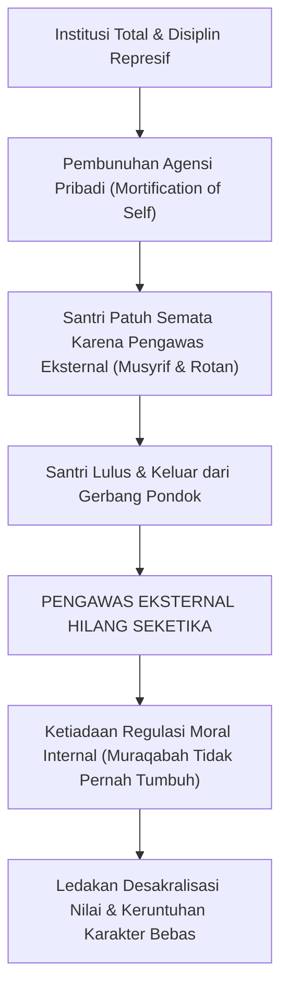

Ketika seorang santri lulus dari pesantren semacam ini, **pengawas eksternal (musyrif, bel asrama, ancaman takzir) tiba-tiba lenyap sama sekali**. Karena selama bertahun-tahun di asrama ia tidak pernah dilatih membangun kendali moral internal (*Internal Locus of Control / Muraqabatullah*), jiwanya limbung tanpa arah. Nilai-nilai adab yang dihafalnya tidak pernah mengakar menjadi watak kepribadian sejati; nilai-nilai itu hanyalah seragam formalitas yang ia kenakan demi menghindari hukuman. Begitu seragam ancaman itu dilepas, runtuhlah seluruh bangunan moralitasnya.

---

### 1.2 Dekonstruksi Ilmiah: Mengapa Hukuman Fisik dan Bentakan Merusak Nalar Santri?

Banyak pengasuh dan pembina asrama berdalih dengan argumentasi yang terdengar sangat agung: *"Niat kami membentak dan memukul bukan karena benci, melainkan demi kebaikan santri itu sendiri. Agar mentalnya sekuat baja! Dari zaman dahulu, pesantren memang keras, dan terbukti melahirkan ulama-ulama besar!"*

Mari kita bedah mitos ini secara telanjang melalui sains mutakhir: **Neurosains Perkembangan (*Developmental Neuroscience*)** dan **Teori Polivagal (*Polyvagal Theory*)**.

Secara anatomis dan fungsional, otak manusia tersusun atas tiga tingkatan evolusioner (*The Triune Brain Model*) yang terintegrasi:

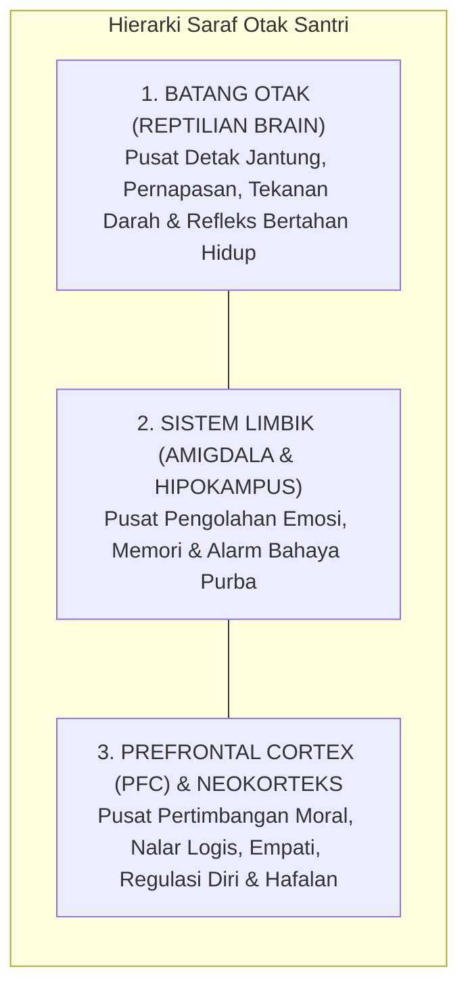

1. **Batang Otak (*Brainstem*)**: Lapisan paling dasar yang mengendalikan fungsi vital otonom tubuh: ritme napas, tekanan darah, dan refleks mempertahankan hidup.
2. **Sistem Limbik (terutama Amigdala dan Hipokampus)**: Pusat pemrosesan emosi primer, pembentukan keterikatan kasih sayang (*attachment*), dan deteksi sinyal ancaman bahaya.
3. **Korteks Prafrontal (*Prefrontal Cortex / PFC*)**: Mahkota luhur penciptaan manusia—area otak di balik kening yang bertanggung jawab atas **Fungsi Eksekutif (*Executive Functions*)**: kemampuan menalar sebab-akibat, membedakan hak dan batil, mengendalikan hawa nafsu, merasakan empati mendalam terhadap penderitaan sesama, serta memori kerja (*working memory*) yang mutlak dibutuhkan santri untuk menghafal ayat-ayat Al-Qur'an, hadits, dan kaidah ilmu.

PFC adalah organ otak yang paling lambat matang; pada usia santri remaja (12–18 tahun), PFC masih berada dalam fase konstruksi biologis yang sangat rapuh dan sensitif terhadap rangsangan lingkungan.

#### Kronologi Detik demi Detik Pembajakan Saraf (Neurobiological Hijacking)
Apa yang sesungguhnya terjadi di dalam tengkorak kepala seorang santri ketika seorang pembina melotot, menunjuk wajahnya, membentaknya dengan suara menggelegar, atau mengangkat tongkat rotan di hadapannya?

* **Milidetik ke-50 hingga ke-100**: Gelombang suara bentakan dan ekspresi wajah marah sang pembina ditangkap oleh indera santri dan langsung diteruskan ke talamus menuju **Amigdala**, tanpa melewati jalur nalar PFC. Amigdala membaca stimulus ini sebagai ancaman predator yang mematikan.
* **Milidetik ke-150 hingga ke-300**: Amigdala seketika menyalakan alarm darurat biologis melalui **Sumbu Hipotalamus-Pituitari-Adrenal (HPA Axis)**. Sinyal darurat ini memerintahkan kelenjar adrenal untuk membanjiri peredaran darah dengan hormon stres dosis tinggi: **Kortisol, Adrenalin, dan Noradrenalin**.
* **Detik ke-1**: Terjadi fenomena yang dinamakan **Vasokonstriksi Perifer dan Deaktivasi Kortikal**. Detak jantung memompa cepat, glukosa darah melonjak, dan aliran darah secara masif dialihkan dari otak luhur (PFC) menuju kelompok otot-otot besar di tangan dan kaki untuk mempersiapkan tubuh bertarung (*fight*) atau melarikan diri (*flight*).

Pada detik inilah terjadi bencana pedagogis: **Korteks Prafrontal (PFC) mengalami kelumpuhan fungsional (*Prefrontal Shutdown*)**[^3]. Sirkuit saraf penalaran moral santri terputus total.

Secara biologis murni, **seorang anak yang otaknya sedang dibanjiri hormon stres berada dalam ketidakmampuan fisik untuk mencerna nasihat moral, merenungkan kesalahannya, atau menghayati nilai-nilai kebaikan**. Otak purbanya hanya memiliki satu tujuan tunggal saat itu: bagaimana caranya agar tubuhnya selamat dari ancaman sang pembina.

#### Teori Polivagal: Menelanjangi Makna Sikap "Menunduk Diam" Santri
Dr. Stephen Porges, perumus **Teori Polivagal (*Polyvagal Theory*)**, menjelaskan bahwa sistem saraf otonom manusia merespons stres melalui tiga hierarki keadaan biologis:

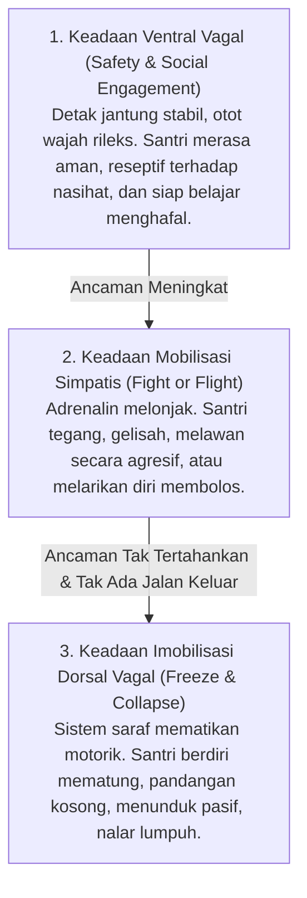

Ketika seorang santri berdiri mematung di hadapan pembina yang membentaknya, tidak membantah sepatah kata pun, dan menundukkan kepalanya dalam-dalam, sebagian besar musyrif merasa puas: *"Lihat, anak ini langsung tunduk dan patuh!"*

Ketahuilah wahai para pendidik: **anak itu menunduk bukan karena takzim kepada nasihat Anda!**

Secara neurobiologis, anak tersebut telah terlempar ke dalam **Keadaan Imobilisasi Dorsal Vagal (*Dorsal Vagal Shutdown*)**[^4]. Ini adalah respons saraf paling purba ketika tubuh menyadari bahwa melawan (*fight*) mustahil menang dan melarikan diri (*flight*) tidak ada jalan keluar. Sistem saraf parasimpatisnya mematikan fungsi motorik agar tubuhnya mematung (*freeze/playing dead*), persis seperti seekor binatang mangsa kecil yang lumpuh di bawah cengkeraman taring singa.

Sikap menunduk itu adalah wujud **kelumpuhan biologis akibat teror mental**. Di balik ketundukan itu, tidak ada sebutir pun kesadaran moral yang tumbuh; yang tersisa di dalam hatinya hanyalah rasa terhina, dendam yang terpendam, serta keputusasaan yang merusak harga dirinya sebagai manusia.

#### Racun Neurotoksik Kortisol terhadap Pusat Memori Hafalan Al-Qur'an
Tragedi ini berlanjut pada dimensi intelektual dan spiritual santri. Mengapa santri yang hidup di bawah lingkungan asrama yang sarat bentakan dan kekerasan fisik justru sangat lambat menyerap hafalan Al-Qur'an dan sering lupa saat tasmi'?

Sains memberikan bukti tak terbantahkan: **Kortisol yang diproduksi secara kronis akibat rasa takut yang terus-menerus bersifat neurotoksik (meracuni sel-sel otak)**[^5].

Di samping amigdala, terdapat struktur berbentuk kuda laut yang bernama **Hipokampus (*Hippocampus*)**—organ vital yang bertugas memproses, mengonsolidasi, dan menyimpan memori jangka panjang. Hipokampus adalah organ yang bekerja keras setiap kali santri menghafal ayat Al-Qur'an atau memahami kaidah nahwu-sharaf.

Ketika santri mengalami stres kronis:
1. Reseptor glukokortikoid di hipokampus dibanjiri oleh kortisol secara terus-menerus.
2. Kelebihan hormon kortisol ini menyebabkan **Atrofi Dendritik (pengerutan dan pemutusan cabang-cabang sinapsis antar-sel saraf)** di hipokampus.
3. Produksi sel saraf baru (*neurogenesis*) di area hipokampus terhenti total.

> *Bagaimana mungkin seorang santri dapat menghafal kalamullah dengan bening dan menancapkannya ke dalam kalbunya, jika pada saat yang sama lingkungan asramanya meracuni otaknya setiap hari dengan hormon stres yang menghancurkan sel-sel memorinya?*

Mendidik santri dengan teror bentakan dan kekerasan fisik bukanlah metode syar'i; itu adalah kejahatan biologis yang menghancurkan potensi akal budi ciptaan Allah ﷻ.

---

### 1.3 Ilusi Tokenisme: Ketika Pahala Digantikan Poin Minus dan Birokrasi Skor

Ketika sebagian pesantren mulai menyadari bahwa kekerasan fisik telah melahirkan trauma dan kecaman masyarakat, mereka mencari alternatif pembinaan yang tampak modern, terukur, dan profesional. Pilihan mereka kerap jatuh pada **Sistem Poin Pelanggaran dan Token Ekonomi Mekanistik**.

Buku-buku tata tertib dicetak dengan daftar tarif pelanggaran yang sangat rinci:
* Terlambat salat berjamaah: minus 5 poin.
* Tidak mengikuti piket asrama: minus 10 poin.
* Sandal tidak diletakkan di rak: minus 2 poin.
* Berbicara dengan bahasa daerah: minus 5 poin.
* Mengantongi akumulasi minus 50: pembersihan kamar mandi umum.
* Mengantongi akumulasi minus 100: skorsing kepulangan satu pekan.

Sekilas pandang, sistem ini tampak sangat adil, objektif, dan bebas dari amarah pribadi pengasuh. Namun, dalam praksis pendidikan pesantren 24 jam, sistem birokrasi skor ini justru melahirkan bencana pedagogis baru yang tak kalah mematikan: **Komodifikasi Adab, Desakralisasi Niat, dan Matinya Rasa Berdosa**.

#### Korupsi Niat Ikhlas: Overjustification Effect
Dalam diskursus ilmu tasawuf dan tarbiyah ruhaniyah, niat ikhlas (*al-ikhlas*) adalah poros dari seluruh amal kebajikan. Seorang santri semestinya salat di saf pertama karena rindu bermunajat kepada Allah; ia semestinya menyapu lantai asrama karena mengamalkan nilai kebersihan sebagai cabang dari keimanan; ia semestinya menolong temannya karena dorongan cinta ukhuwah imaniyah.

Ketika seluruh amal kebajikan tersebut dikonversi menjadi perolehan "poin plus" dan setiap kesalahan dikonversi menjadi "poin minus", sistem ini sedang mendidik santri menjadi **pribadi yang transaksional dan materialistik**.

Prof. Edward Deci dan Richard Ryan dalam penelitian monumental mereka mengenai *Self-Determination Theory* (SDT) menemukan fenomena psikologis yang disebut **Efek Pembenaran Berlebih (*The Overjustification Effect*)**[^6]. Ketika sebuah perilaku mulia yang semestinya digerakkan oleh motivasi intrinsik (nilai moral, cinta kebenaran, kesenangan berbuat baik) dikaitkan secara kaku dengan imbalan atau hukuman ekstrinsik (poin, hadiah materi, kartu skor), maka motivasi intrinsik tersebut **mati secara perlahan**.

Santri tidak lagi menyapu masjid karena ingin membersihkan rumah Allah; ia menyapu masjid demi mengejar 10 poin pemutihan catatan hitamnya. Begitu sistem poin ditarik dari kehidupannya (misalnya saat liburan atau setelah lulus), lenyap pulalah seluruh dorongannya untuk berbuat kebajikan, karena ia tidak pernah dilatih mencintai kebajikan itu demi kebajikan itu sendiri.

#### Kalkulasi Dosa Tanpa Penyesalan Batin
Lebih berbahaya lagi, sistem poin mengubah persepsi santri tentang hakikat kemaksiatan dan pelanggaran adab. Pelanggaran tidak lagi dipandang sebagai dosa yang menodai hati (*ar-ran*) dan mencabik ukhuwah, melainkan dipandang sebagai **harga transaksi yang dapat dibayar**.

Dengarkan bagaimana percakapan santri di kamar asrama saat malam hari:
> *"Akhi, malam ini kita kabur ke warung kopi luar pondok yuk!"*  
> Temannya menjawab sambil membuka buku saku pelanggaran:  
> *"Berapa minusnya kalau ketahuan keluar pagar?"*  
> *"Minus 20 poin."*  
> *"Oh, poin aman saya masih ada 45. Masih sisa 25 poin lagi sebelum kena skorsing. Gas, berangkat!"*

Perhatikan logika moral di atas! Santri tidak lagi memikirkan apakah tindakannya membuat orang tuanya sedih, apakah tindakannya mengecewakan para asatidz, atau bagaimana pertanggungjawabannya di hadapan Allah. Ia semata-mata sedang melakukan **kalkulasi finansial-moral**: ia membeli kebebasan melanggar aturan dengan membayar sejumlah poin yang masih tersedia di saldonya. Sistem ini telah mencabut rasa malu (*al-haya'*) dan rasa takut (*al-khauf*) dari dalam kalbu santri.

#### Devolusi Peran Musyrif: Dari Ayah Ruhani Menjadi Sipir Tilang
Dampak paling tragis dari sistem birokrasi poin ini menimpa para pembina dan musyrif itu sendiri. Musyrif asrama semestinya berperan sebagai **abun rohim** (ayah yang penuh welas asih), tempat santri mengadu saat rindu kampung halaman, tempat santri mencurahkan kegundahan batinnya saat menghadapi kesulitan belajar, serta pembimbing yang menuntun dengan keteladanan hidup (*qudwah*).

Namun di bawah tirani birokrasi poin, peran luhur tersebut mengalami devolusi: musyrif terdegradasi menjadi **polisi lalu lintas yang sibuk menilang**. 

Musyrif tidak lagi memiliki waktu untuk duduk bersila di samping tempat tidur santri, menepuk pundaknya, dan bertanya dengan lembut: *"Nak, kenapa matamu sembab pagi ini? Apa yang sedang merisaukan hatimu?"* Musyrif terlalu sibuk memegang bolpoin dan papan jalan, mencatat siapa yang terlambat 2 menit masuk masjid, siapa yang pecinya miring, dan siapa yang sandalnya belum masuk rak. Relasi kasih sayang antara pendidik dan anak didik mati, digantikan oleh relasi birokrasi yang dingin dan penuh kecurigaan.

---

### 1.4 Manifesto TUMBUH: Tarbiyah Berbasis Pertumbuhan Fitrah

Menghadapi jalan buntu antara **represi feodal yang meremukkan saraf** di satu sisi dan **transaksionalisme poin yang mematikan keikhlasan** di sisi lain, ekosistem **TUMBUH** memancangkan panji pembaruan tarbiyah kepesantrenan.

Kata **TUMBUH** bukanlah jargon kosmetik, melainkan kristalisasi dari sebuah filosofi agung tentang hakikat pendidikan Islam: **Pendidikan Karakter adalah Seni Menumbuhkan Benih Hayati, Bukan Proses Menempa Logam Mesin Pabrik**.

Perhatikan kontras yang sangat mendasar antara dua pandangan hidup ini:

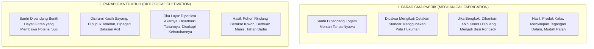

Al-Qur'an al-Karim mengabadikan perumpamaan manusia beriman dan kalimat thayyibah bukan seperti benteng batu yang kaku, melainkan seperti **pohon yang hidup dan bertumbuh**:

$$\text{أَلَمْ تَرَ كَيْفَ ضَرَبَ اللَّهُ مَثَلًا كَلِمَةً طَيِّبَةً كَشَجَرَةٍ طَيِّبَةٍ أَصْلُهَا ثَابِتٌ وَفَرْعُهَا فِي السَّمَاءِ ۝ تُؤْتِي أُكُلَهَا كُلَّ حِينٍ بِإِذْنِ رَبِّهَا ۗ وَيَضْرِبُ اللَّهُ الْأَمْثَالَ لِلنَّاسِ لَعَلَّهُمْ يَتَذَكَّرُونَ}$$

> *"Tidakkah kamu memperhatikan bagaimana Allah telah membuat perumpamaan kalimat yang baik seperti pohon yang baik, akarnya teguh menghunjam ke dalam bumi dan cabangnya menjulang tinggi ke langit. Pohon itu menghasilkan buahnya pada setiap musim dengan izin Rabb-nya. Dan Allah membuat perumpamaan-perumpamaan itu untuk manusia agar mereka selalu ingat."*  
> (QS. Ibrahim [14]: 24–25)[^7]

Renungkanlah perumpamaan agung ini!
Seorang petani yang memiliki akal sehat tidak akan pernah memarahi benih mangganya yang baru bersemi karena benih itu belum menghasilkan buah manis. Petani tidak akan memukul tunas pohonnya dengan kayu balok agar tunas itu tumbuh lebih cepat. Petani tidak akan mencabik-cabik kuncup bunga yang belum mekar karena merasa tidak sabar.

Jika seorang petani melihat daun tanamannya menguning dan layu:
* Ia tidak akan melabeli tanaman itu sebagai "tanaman pembangkang yang tidak tahu diri".
* Petani yang bijak akan segera memeriksa tanahnya: *Apakah tanahnya terlalu kering sehingga kekurangan air? Apakah saluran drainasenya tersumbat hingga membusukkan akarnya? Apakah sinar matahari terhalang oleh dedalu liar? Apakah ada ulat parasit yang menggerogoti batangnya di malam hari?*

Begitulah hakikat pendidik dalam arsitektur **TUMBUH**:
Ketika seorang santri melakukan pelanggaran adab—ia membolos salat subuh, berkata kotor kepada temannya, atau mencuri makanan di kantin—pendidik TUMBUH tidak memandangnya sebagai sampah masyarakat yang harus segera dihantam dengan rotan atau diusir keluar pondok. 

Pendidik TUMBUH akan membedah ekosistem kehidupannya:
* *Apa kebutuhan jiwa santri ini yang sedang terluka dan belum terpenuhi?*
* *Apakah ia mengalami stres adaptasi yang belum terselesaikan sejak terpisah dari orang tuanya?*
* *Apakah ia merasa terkucil dan tidak aman di kamarnya?*
* *Apakah jam belajarnya terlalu padat sehingga tubuh biologisnya mengalami kelelahan saraf yang akut?*
* *Keteladanan apa yang luput kami hadirkan di hadapannya selama ini?*

Santri tidak diciptakan sebagai kertas kosong tanpa nilai (*tabula rasa*), bukan pula terlahir membawa kutukan dosa asali. Santri lahir membawa **benih fitrah kesucian bertauhid** (HR. Al-Bukhari no. 1358). Tugas kita sebagai pendidik bukanlah "memasukkan karakter dari luar dengan palu godam", melainkan **menghilangkan penghalang-penghalang biologis, emosional, dan sosial yang menutupi fitrah tersebut, lalu menyiraminya hingga mekar menjadi pohon adab yang agung**.

---

### 1.5 Pembedahan Praksis: Matriks Operasional Hukuman Retributif vs Disiplin Restoratif TUMBUH

Bagaimana revolusi paradigma ini bekerja dalam praksis kehidupan asrama sehari-hari? Mari kita sandingkan secara terperinci antara pendekatan retributif (lama) dengan pendekatan edukatif-restoratif TUMBUH dalam menangani dinamika nyata pelanggaran santri:

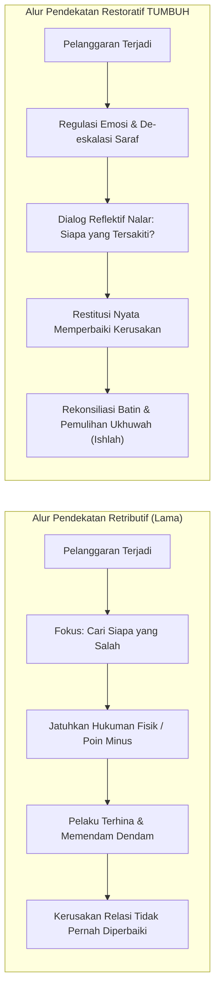

Untuk memberikan kejelasan mutlak tanpa ruang abu-abu bagi para asatidz dan musyrif, perhatikan komparasi lima kasus riil lapangan berikut:

#### Kasus 1: Santri Terlambat Bangun Salat Subuh
* **Pendekatan Lama (Retributif)**: Musyrif menyiram santri dengan air ember dingin, membentaknya di depan pintu kamar, lalu menyuruhnya berdiri dengan satu kaki di halaman masjid selama salat berjamaah berlangsung.
  * *Dampak*: Tubuh santri menggigil masuk angin, amigdalanya terkunci dalam kepanikan, rasa cintanya pada salat subuh berganti menjadi kebencian pada ritual tersebut, dan ia merasa harga dirinya diinjak-injak di hadapan kawan-kawannya.
* **Protokol Edukasi Restoratif TUMBUH**:
  1. **Regulasi Awal**: Musyrif membangunkan dengan sentuhan lembut di bahu sambil membaca doa bangun tidur atau melantunkan azan dengan nada yang menenteramkan kalbu.
  2. **Audit Kausalitas**: Di siang hari, musyrif duduk bersama santri tersebut untuk menelusuri akar masalahnya: *"Mengapa antum sangat sulit membuka mata subuh tadi? Pukul berapa antum tidur semalam? Apa yang antum lakukan setelah isya?"*
  3. **Tindakan Perbaikan (*Logical Consequence*)**: Jika santri begadang mengobrol dengan temannya, konsekuensi logisnya adalah penyesuaian jam malam kamar: malam itu ia wajib memadamkan lampu dan beristirahat lebih awal (pukul 21.30) dengan pendampingan musyrif untuk memulihkan ritme biologis otaknya. Santri memahami bahwa aturan tidur dibuat demi menjaga kesehatan otaknya sendiri.

#### Kasus 2: Santri Terlibat Perkelahian Fisik di Asrama
* **Pendekatan Lama (Retributif)**: Kedua santri yang berkelahi dipukul tangannya dengan rotan, dicukur gundul rambutnya, dan dipaksa saling meminta maaf secara dingin di depan forum rapat asrama.
  * *Dampak*: Permusuhan batin tidak pernah padam. Mereka pura-pura berdamai di depan musyrif, namun di belakang mereka merencanakan perkelahian lanjutan di luar pondok atau saling menjatuhkan nama baik melalui teman sebaya.
* **Protokol Edukasi Restoratif TUMBUH**:
  1. **Pemisahan & Penenangan (*Cooling Down*)**: Kedua santri dipisahkan ke ruangan yang berbeda. Musyrif memberikan waktu dan air minum hingga ritme napas dan detak jantung keduanya turun ke kondisi stabil (*down-regulated*). Dilarang menginterogasi anak yang amigdalanya masih menyala merah.
  2. **Eksplorasi Sudut Pandang (*Hearing Both Sides*)**: Masing-masing santri diajak mengekspresikan perasaannya secara jujur tanpa dihakimi: *"Apa yang membuatmu merasa sangat marah hingga melayangkan pukulan? Kebutuhan apa yang ingin kamu sampaikan tadi?"*
  3. **Fasilitasi Lingkaran Restoratif (*Restorative Circle*)**: Keduanya dipertemukan kembali dengan dipandu musyrif. Masing-masing mendengarkan dampak rasa sakit fisik dan batin yang dialami oleh lawannya.
  4. **Ishlah al-Bain Nyata**: Pelaku yang memulai pemukulan berkomitmen mengobati luka temannya (mengantarkannya ke klinik asrama dan merawatnya), serta keduanya menyepakati protokol komunikasi baru jika terjadi perbedaan pendapat di masa mendatang.

#### Kasus 3: Santri Kedapatan Merokok di Balik Kamar Mandi
* **Pendekatan Lama (Retributif)**: Rokok dimasukkan ke dalam mulut santri sekaligus lalu dipaksa mengunyahnya, atau santri dijemur di tengah lapangan terik matahari sambil mengalungkan bungkus rokok di lehernya.
  * *Dampak*: Kerusakan organ pencernaan santri akibat tembakau yang tertelan, trauma psikologis akut, dan lahirnya rasa dendam kesumat yang mendorong santri melampiaskan kenakalannya ke tingkat yang lebih ekstrem (narkoba atau kabur).
* **Protokol Edukasi Restoratif TUMBUH**:
  1. **Penyitaan Bermartabat**: Rokok disita tanpa mencaci-maki santri dengan kata-kata keji. Santri dipanggil ke ruang konseling secara tertutup demi menjaga kehormatan namanya (*hifzh al-'irdh*).
  2. **Functional Behavior Assessment (FBA)**: Tim BK atau musyrif senior menggali motif dasar perilaku merokok tersebut: *Apakah santri merokok karena tekanan kelompok sebaya (peer pressure)? Apakah sebagai pelarian dari rasa cemas dan depresi akibat target hafalan? Ataukah meniru perilaku orang dewasa di keluarganya?*
  3. **Edukasi Sains Adiksi**: Santri diajak mempelajari mekanisme kerja nikotin yang membajak dopamin otak, serta dampak asap rokok terhadap penurunan kapasitas paru-paru santri atletik.
  4. **Restitusi & Layanan Asrama**: Sebagai wujud tanggung jawab atas pencemaran udara asrama yang dilakukannya, santri mendapatkan tugas restoratif yang bernilai manfaat: membersihkan dan menanam tanaman hijau penyaring udara di taman asrama selama sepekan di bawah bimbingan guru lingkungan hidup.

---

### 1.6 Panggilan Nurani Pendidik: Jika Santri Itu Adalah Anak Kandung Kita

Wahai para kyai yang kami muliakan, para asatidz yang ikhlas, para musyrif yang berpeluh keringat di lorong-lorong asrama, serta segenap pengemban amanah pendidikan Islam!

Sebelum kita melangkah lebih jauh membedah lembar demi lembar arsitektur fundamental ini, mari kita letakkan sejenak segala buku catatan kita, pejamkan mata, dan hadirkan sebuah perenungan mendalam ke dalam relung kalbu kita yang paling jujur:

> *Bayangkan anak kandung Anda sendiri—darah daging yang kelahirannya Anda sambut dengan linangan air mata haru, yang tangisannya di tengah malam Anda dekap dengan penuh kelembutan, yang tawanya menjadi penyejuk jiwa di saat Anda letih mencari nafkah—kini telah tumbuh menjadi remaja berusia dua belas tahun.*
>
> *Dengan penuh tawakal dan linangan air mata perpisahan, Anda melepaskannya masuk ke sebuah pondok pesantren. Anda mencium keningnya di depan gerbang, berdoa kepada Allah agar anak kesayangan Anda kelak menjadi alim yang beradab dan hafizh Al-Qur'an.*
>
> *Lalu bayangkan di suatu malam yang pekat dan dingin, anak kesayangan Anda itu melakukan sebuah kesalahan karena keluguannya atau kelelahan fisiknya. Di sudut lorong asrama itu, seorang pembina melotot di hadapannya dengan urat leher menegang, memakinya dengan sebutan binatang yang menghancurkan harga dirinya, lalu mencukur botak separuh rambutnya di hadapan ratusan kawan-kawannya hingga anak Anda menangis tersedu-sedu menahan malu yang tak terperi.*
>
> *Di malam hari saat lampu asrama dipadamkan, anak kesayangan Anda meringkuk di bawah selimut tipisnya yang lembap, menangis terisak menahan rasa sakit di pipinya dan rasa hancur di dadanya, merindukan dekapan tangan ayahnya yang hangat...*
>
> *Katakanlah dengan jujur demi Allah: Bagaimanakah rasa remuk redam di dalam dada Anda sebagai seorang ayah atau ibu? Relakah Anda buah hati Anda yang paling berharga diperlakukan laksana budak hina di sebuah lembaga yang mengatasnamakan agama Islam?*

Jika kita tidak rela anak kandung kita sendiri diperlakukan dengan cara yang zalim dan biadab semacam itu, maka **demi Allah yang jiwa kita berada di tangan-Nya, haram bagi kita memperlakukan anak-anak kaum muslimin yang dititipkan di pesantren kita dengan cara-cara tersebut!**

Santri-santri yang berada di hadapan kita bukanlah angka-angka statistik tanpa jiwa. Mereka adalah titipan suci dari jutaan keluarga muslim yang menaruh harapan besar di pundak kita. Setiap bentakan kasar yang kita lontarkan, setiap tamparan yang kita layangkan ke wajah mereka, dan setiap kehormatan mereka yang kita injak-injak demi memuaskan nafsu amarah kita, semuanya dicatat oleh malaikat Raqib dan 'Atid, dan akan ditagih pertanggungjawabannya di Mahkamah Keadilan Ilahi yang mutlak!

Rasulullah ﷺ yang menjadi teladan agung kita tidak pernah sekalipun memukul anak-anak atau menghardik pelayannya dengan kata-kata keji. Anas bin Malik رضي الله عنه, yang melayani Rasulullah ﷺ sejak usia sepuluh tahun, memberikan kesaksian abadi yang semestinya membuat setiap pendidik tertunduk malu:

$$\text{خَدَمْتُ رَسُولَ اللَّهِ صلى الله عليه وسلم عَشْرَ سِنِينَ، وَاللَّهِ مَا قَالَ لِي أُفًّا قَطُّ، وَلَا قَالَ لِي لِشَيْءٍ لِمَ فَعَلْتَ كَذَا؟ وَهَلَّا فَعَلْتَ كَذَا؟}$$

> *"Aku melayani Rasulullah ﷺ selama sepuluh tahun penuh. Demi Allah, beliau sama sekali tidak pernah berkata 'Ah!' kepadaku; beliau tidak pernah mencelaku atas apa yang telah kulakukan: 'Mengapa engkau berbuat demikian?', dan tidak pernah pula berkata atas apa yang tidak kulakukan: 'Mengapa tidak engkau lakukan begini?'"*  
> (HR. Al-Bukhari no. 6038 dan Muslim no. 2309)[^8]

Inilah standar agung tarbiyah nubuwah yang wajib kita hidupkan kembali. Kita menolak kekerasan bukan karena kita bersikap lembek atau permisif; kita menolak kekerasan karena kita tunduk pada teladan baginda Nabi Muhammad ﷺ dan menghormati kemuliaan fitrah ciptaan Allah ﷻ.

Mari kita bulatkan tekad untuk meruntuhkan dinding-dinding tirani lama di asrama kita. Mari kita tegakkan ekosistem pengasuhan yang berwibawa, penuh kehangatan cinta, ditegakkan oleh ketegasan yang adil, serta disinari oleh nalar keilmuan yang terang benderang.

Dari sinilah, babak baru kebangkitan adab pesantren kita mulai melangkah.

---

### Catatan Kaki & Rujukan Akademik

[^1]: Abdurrahman Ibnu Khaldun, *Al-Muqaddimah*, Tahqiq: Dr. Abdullah Muhammad ad-Darwisy (Damaskus: Dar Ya'rub, 2004), Jilid II, hlm. 336–338.
[^2]: Erving Goffman, *Asylums: Essays on the Social Situation of Mental Patients and Other Inmates* (New York: Anchor Books, 1961), hlm. 1–124.
[^3]: Bruce D. Perry & Maia Szalavitz, *The Boy Who Was Raised as a Dog: And Other Stories from a Child Psychiatrist's Notebook* (New York: Basic Books, 2017), hlm. 45–68; Bessel van der Kolk, *The Body Keeps the Score: Brain, Mind, and Body in the Healing of Trauma* (New York: Penguin Books, 2014), hlm. 51–73.
[^4]: Stephen W. Porges, *The Polyvagal Theory: Neurophysiological Foundations of Emotions, Attachment, Communication, and Self-regulation* (New York: W.W. Norton & Company, 2011), hlm. 11–38; Deb Dana, *The Polyvagal Theory in Therapy: Engaging the Rhythm of Regulation* (New York: W.W. Norton & Company, 2018).
[^5]: Robert M. Sapolsky, *Why Zebras Don't Get Ulcers: The Acclaimed Guide to Stress, Stress-Related Diseases, and Coping* (New York: Henry Holt and Company, 2004), hlm. 210–235; Sonia J. Lupien dkk., "Effects of Stress Throughout the Lifespan on the Brain, Behaviour and Cognition", *Nature Reviews Neuroscience*, Vol. 10, No. 6 (2009), hlm. 434–445.
[^6]: Edward L. Deci & Richard M. Ryan, *Intrinsic Motivation and Self-Determination in Human Behavior* (New York: Plenum Press, 1985); Richard M. Ryan & Edward L. Deci, *Self-Determination Theory: Basic Psychological Needs in Motivation, Development, and Wellness* (New York: The Guilford Press, 2017), hlm. 120–145.
[^7]: Abu Ja'far Muhammad bin Jarir Ath-Thabari, *Jami' al-Bayan 'an Ta'wil Ayi al-Qur'an* (Tafsir Ath-Thabari), Tahqiq: Dr. Abdullah bin Abdul Muhsin At-Turki (Kairo: Dar Hijr, 2001), Jilid XIII, hlm. 680–688.
[^8]: Abu Abdillah Muhammad bin Ismail Al-Bukhari, *Shahih al-Bukhari*, Kitab al-Adab, Bab Husn al-Khuluq wa al-Karam wa ma Yukrahu min al-Bukhl, hadits no. 6038; Muslim bin al-Hajjaj an-Naisaburi, *Shahih Muslim*, Kitab al-Fadhail, Bab Kana Rasulullah ﷺ Ahsana an-Nasi Khuluqan, hadits no. 2309.


---

# BAB 2: PANDANGAN ALAM ISLAM SEBAGAI POROS PENDIDIKAN
## *The Islamic Worldview* dan Implikasinya bagi Ekosistem Pesantren 24 Jam

> *"Pendidikan dalam Islam bukanlah sekadar proses pengajaran informasi atau pelatihan keterampilan teknis, melainkan penanaman adab ke dalam diri manusia (Ta'dib), agar ia mengenali dan mengakui kedudukan dirinya yang tepat dalam tata susunan wujud ciptaan Allah, sehingga melahirkan amal perbuatan yang adil dan benar. Ketiadaan adab (loss of adab) adalah pangkal keruntuhan peradaban umat, dan adab tidak mungkin ditegakkan tanpa pandangan alam (worldview) yang lurus tentang hakikat wujud."*  
> — **Prof. Dr. Syed Muhammad Naquib al-Attas**, *The Concept of Education in Islam*[^1]

---

### 2.1 Ketika Filsafat Bertemu Lantai Asrama: Mengapa Worldview Bukan Sekadar Teori?

Di banyak ruang seminar perguruan tinggi, perbincangan mengenai **Pandangan Alam (*The Islamic Worldview / Ru'yatul Islam lil-Wujud*)** kerap diletakkan di menara gading yang jauh dari denyut kehidupan praktis. Konsep ini sering dianggap sebagai konsumsi para filosof dan teolog yang asyik memperdebatkan metafisika di balik meja perpustakaan. Akibatnya, para pengasuh pondok pesantren, kepala kepengasuhan, dan musyrif yang sehari-hari berkeringat di lorong asrama kerap memandang konsep ini dengan tatapan skeptis: *"Kami di sini berhadapan dengan santri yang berkelahi berebut gayung mandi, santri yang merokok di balik plafon jemuran, dan santri yang menangis rindu orang tuanya. Apa relevansinya membicarakan ontologi, kosmologi, dan epistemologi tauhid bagi tugas harian kami?"*

Ketahuilah wahai para pendidik: **Pandangan Alam (*Worldview*) sesungguhnya bekerja di setiap tarikan napas, setiap keputusan disiplin, dan setiap gerakan tangan kita di lantai asrama.**

Pendidikan tidak pernah bersifat netral nilai (*value-neutral*). Tidak ada satu pun tata tertib kamar, jadwal kegiatan harian, atau metode penanganan santri yang lahir dari ruang hampa. Di balik setiap tindakan pengasuh, selalu ada asumsi-asumsi filosofis tak terucap yang mendasarinya:

#### Kasus Penendangan Kasur vs Dialog Bangun Subuh
Perhatikan tindakan seorang musyrif yang menyiramkan air cucian atau menendang kasur seorang santri yang sulit bangun subuh. Tindakan tersebut bukan sekadar manifestasi dari rasa jengkel sesaat; tindakan itu adalah cerminan dari **worldview mekanistik-materialistik** yang bersarang di kepalanya. Musyrif tersebut, secara sadar atau tidak, memandang santri laksana benda mati atau hewan ternak yang hanya bisa digerakkan melalui sengatan rasa sakit fisik. Ia tidak memandang santri sebagai makhluk mulia pemilik akal budi yang sedang bergulat dengan kelelahan biologis dan kebutuhan bimbingan kesadaran.

Sebaliknya, perhatikan seorang musyrif yang mendekati pembaruan santri dengan tenang, duduk bersimpuh di sampingnya, meletakkan tangannya yang hangat di pundak sang anak, lalu membisikkan ayat suci atau doa dengan nada suara yang penuh getaran kasih sayang kebapaan: *"Bangunlah duhai anakku, Rabb-mu Yang Maha Pengasih sedang membentangkan rahmat-Nya di sepertiga malam terakhir ini..."* Tindakan ini lahir dari **worldview tauhid yang hidup**: musyrif tersebut meyakini bahwa di dalam raga anak yang sedang tertidur itu bersemayam fitrah ruhaniyah yang merindukan Tuhannya, dan tugas pendidik adalah membangunkan kerinduan tersebut dengan sentuhan kasih sayang Ilahi.

#### Dekonstruksi Mitos Asrama Kumuh: "Biar Prihatin dan Barakah"
Contoh lain yang sangat mencolok di sebagian pesantren adalah pembiaran fasilitas asrama yang kumuh, lemari-lemari yang reyot, kamar mandi yang berbau pesing dan penuh jentik nyamuk, serta sanitasi air yang keruh berbau karat. Ketika dikritik oleh wali santri atau tenaga medis, sebagian pengurus dengan enteng berdalih: *"Santri itu memang harus tirakat prihatin! Jangan manja dengan fasilitas mewah. Dulu para ulama salaf juga hidup susah, justru dari keprihatinan itulah keberkahan ilmu lahir!"*

Ini adalah contoh nyata bagaimana **kekeliruan pandangan alam (*worldview distortion*) melahirkan kezaliman sistemik**. 

Argumen tersebut mencampuradukkan secara sesat antara **zuhud syar'i** (melepaskan keterikatan hati dari gemerlap duniawi) dengan **kotor dan jorok yang bertentangan dengan fitrah**. Pandangan alam Islam yang shahih tidak pernah memuliakan kekumuhan. Rasulullah ﷺ bersabda dengan sangat tegas:

$$\text{الطُّهُورُ شَطْرُ الْإِيمَانِ}$$

> *"Kesucian dan kebersihan itu adalah separuh dari keimanan."*  
> (HR. Muslim no. 223)[^2]

Ketika pengelola pondok membiarkan santri hidup di tengah lingkungan yang tidak higienis hingga mereka terserang penyakit kulit (*scabies*) massal dan tipes, pengelola tersebut sesungguhnya sedang melanggar amanah syariat dalam menjaga jiwa dan raga (*hifzh an-nafs*). Mengatasnamakan keberkahan untuk menutupi kelalaian manajemen sanitasi adalah sebuah kejahatan intelektual dan moral.

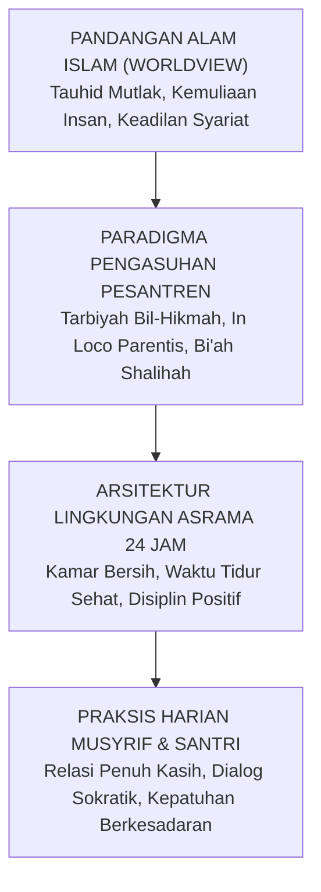

Worldview adalah akar pohon; arsitektur sistem adalah batangnya; dan praksis harian musyrif di kamar asrama adalah buahnya. Jika akarnya beracun atau terdistorsi, mustahil pohon tersebut menghasilkan buah karakter yang manis dan menyejukkan umat.

---

### 2.2 Kosmologi Tauhid: Meruntuhkan Sindrom "Firaun Mini" di Asrama

Aksioma ontologis paling agung dan mutlak dalam pandangan alam Islam adalah **Tauhidullah**—pengesaan Allah dalam rububiyyah, uluhiyyah, dan asma' wa shifat-Nya:

$$\text{قُلْ هُوَ اللَّهُ أَحَدٌ ۝ اللَّهُ الصَّمَدُ ۝ لَمْ يَلِدْ وَلَمْ يُولَدْ ۝ وَلَمْ يَكُن لَّهُ كُفُوًا أَحَدٌ}$$

> *"Katakanlah: Dialah Allah, Yang Maha Esa. Allah adalah Dzat yang bergantung kepada-Nya segala sesuatu. Dia tiada beranak dan tidak pula diperanakkan, dan tidak ada seorang pun yang setara dengan Dia."*  
> (QS. Al-Ikhlas [112]: 1–4)[^3]

Dalam kosmologi tauhid, garis demarkasi ontologis antara **Al-Khaliq** dan **Al-Makhluk** bersifat abadi, mutlak, dan tidak akan pernah kabur:

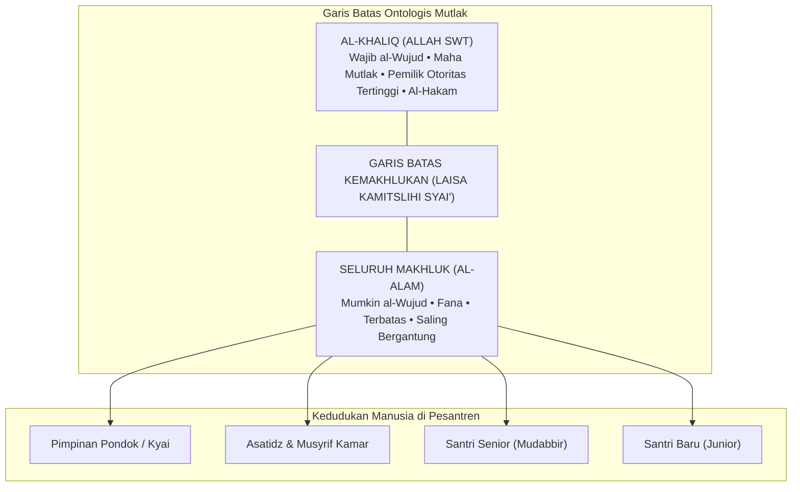

Allah ﷻ adalah satu-satunya *Rabb*—Sang Pencipta, Pemilik, Pemelihara, dan Pendidik Hakiki seluruh alam semesta. Sementara seluruh manusia di lingkungan pesantren—mulai dari kyai pendiri pondok, direktur pengasuhan, musyrif senior, hingga santri cilik yang baru tiba kemarin sore—semuanya berada pada derajat ontologis yang sama: **mereka semua adalah hamba sahaya Allah (*'ibadullah*)**.

Prinsip tauhid murni ini membawa implikasi dekonstruktif yang sangat fundamental: **Meruntuhkan Budaya Feodalisme dan Menghancurkan Sindrom "Firaun Mini" di Pesantren**.

#### Anatomi Penyakit Feodalisme Asrama
Di sebagian institusi asrama tradisional, sering kali tumbuh subur sebuah kultur feodal yang membajak konsep adab dan ketakziman:
1. **Otoritas Tanpa Akuntabilitas**: Para pembina asrama atau pengurus santri senior merasa memiliki kekuasaan mutlak yang tidak boleh dipertanyakan. Mereka memposisikan diri laksana dewa-dewa kecil yang bebas menjatuhkan vonis, menciptakan aturan sepihak di luar syariat, dan memperlakukan junior laksana budak belian.
2. **Kriminalisasi Nalar Kritis**: Santri yang mencoba menanyakan hikmah sebuah kebijakan, atau yang mencoba mengklarifikasi tuduhan saat ia dituduh melanggar, seketika dicap sebagai anak pemberontak yang "kurang ajar (*su'ul adab*)", lalu diancam dengan kutukan mistis: *"Hati-hati, ilmumu tidak akan barakah dan hidupmu akan celaka jika membantah pengurus!"*
3. **Penyalahgunaan Konsep Ketaatan**: Konsep ketaatan kepada ulama (*sami'na wa atha'na*) yang semestinya diletakkan dalam koridor kebenaran syariat dibelokkan menjadi kepatuhan buta pada hawa nafsu dan arogansi senior.

Ini adalah perusakan epistemik yang sangat berbahaya! Tradisi keilmuan Islam yang luhur dibangun di atas argumentasi dalil, dialog keilmuan, dan keadilan moral. Rasulullah ﷺ menggariskan batas ketaatan makhluk dengan kalimat yang menjadi piagam emansipasi kemanusiaan:

$$\text{لَا طَاعَةَ لِمَخْلُوقٍ فِي مَعْصِيَةِ الْخَالِقِ}$$

> *"Tidak ada ketaatan kepada makhluk mana pun dalam perkara yang bermaksiat kepada Sang Khaliq."*  
> (HR. Ahmad no. 1095 dan At-Thabarani no. 381, dari Ali bin Abi Thalib رضي الله عنه, sanad shahih)[^4]

Bahkan sahabat termulia, Amirul Mukminin Abu Bakar Ash-Shiddiq رضي الله عنه, dalam pidato kepemimpinannya setelah wafatnya Rasulullah ﷺ, dengan lantang mendeklarasikan di hadapan seluruh umat:

$$\text{أَطِيعُونِي مَا أَطَعْتُ اللَّهَ وَرَسُولَهُ، فَإِذَا عَصَيْتُ اللَّهَ وَرَسُولَهُ فَلَا طَاعَةَ لِي عَلَيْكُمْ}$$

> *"Taatilah aku selama aku menaati Allah dan Rasul-Nya dalam memimpin kalian. Namun apabila aku bermaksiat kepada Allah dan Rasul-Nya, maka gugurlah kewajiban kalian untuk taat kepadaku!"*[^5]

Jika seorang pemimpin agung dan sahabat termulia seperti Abu Bakar Ash-Shiddiq menyatakan bahwa ketaatan rakyat kepadanya bersyarat pada kepatuhannya kepada Allah dan Rasul-Nya, lalu atas hak apa seorang musyrif kamar atau santri senior menuntut kepatuhan buta dari adik kelasnya saat ia memerintahkan hal-hal yang zalim dan merendahkan martabat manusia?

Dalam ekosistem **TUMBUH**, kepemimpinan para asatidz dan musyrif dibangun di atas prinsip **Khadimul Ummah (Pelayan Santri)** dan **Qudwah Hasanah (Keteladanan Nyata)**. Otoritas seorang pendidik bukan terpancar dari rotan di tangannya, bukan pula dari ancaman su'ul adab yang menakut-nakuti, melainkan terpancar dari keluhuran akhlaknya, keadilan sikapnya, dan ketulusan doanya bagi keselamatan jiwa santri-santrinya.

---

### 2.3 Harmoni Dua Dimensi: Integrasi 'Alam al-Ghaib dan 'Alam asy-Syahadah

Salah satu kesalahan metodologis paling fatal dalam dunia pendidikan pesantren adalah terjadinya **pemisahan artifisial (dikotomi sesat)** antara urusan spiritualitas ruhaniyah dengan hukum kausalitas biologis-empiris.

Pandangan alam Islam memandang bahwa realitas ciptaan Allah merentang dalam dua dimensi agung yang saling berkelindan secara harmonis:

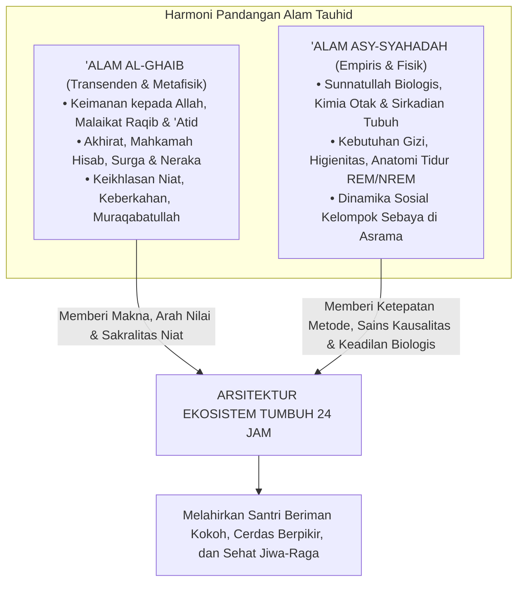

1. **'Alam al-Ghaib (Realitas Gaib/Transenden)**: Merupakan ranah metafisika yang diwahyukan: keberadaan Allah, malaikat yang mencatat setiap amal kebajikan dan keburukan, pertanggungjawaban di padang mahsyar, serta balasan surga dan neraka. Realitas gaib memberikan **makna tertinggi (*ultimate meaning*)** dan **kendali moral internal (*muraqabatullah*)**: santri beradab bukan karena takut cctv pengawas, melainkan karena yakin bahwa Allah senantiasa mengawasi gerak-gerik batinnya.
2. **'Alam asy-Syahadah (Realitas Teramati/Empiris)**: Merupakan ranah hukum-hukum alam (*sunnatullah fi al-khalq*) yang dapat diobservasi, diteliti, dan diukur: biokimia tubuh, kebutuhan neurobiologis, irama sirkadian, serta hukum-hukum psikologi perkembangan manusia.

Kedua realitas ini diciptakan oleh Tuhan yang sama: Allah ﷻ. Oleh karena itu, **ayat-ayat kauniyyah (hukum alam ciptaan Allah) tidak akan pernah bertentangan dengan ayat-ayat qauliyyah (syariat firman Allah)**. 

Mengabaikan hukum kausalitas empiris dalam mengelola santri dengan dalih spiritualitas adalah sebuah kebodohan yang nyata.

#### Bedah Sains: Mengapa Menyunat Jam Tidur Santri Adalah Sabotase Hafalan Al-Qur'an?
Mari kita bedah secara ilmiah salah satu praktik keliru yang paling sering terjadi di pesantren: **pemotongan jam tidur santri secara ekstrem atas nama tirakat**.

Di banyak asrama tahfizh, santri dipaksa menjalani jadwal yang tidak masuk akal:
* Pengajian kitab malam berakhir pukul 23.00. Santri baru bisa tidur pukul 23.30.
* Pukul 03.00 dini hari, bel berbunyi nyaring dan santri dipaksa bangun untuk qiyamul lail dan setoran hafalan subuh.
* Akumulasi waktu tidur santri hanya 3,5 hingga 4 jam per malam.

Ketika santri-santri tersebut di siang hari tampak loyo, tertidur saat guru menjelaskan, mengalami penurunan daya ingat secara drastis, atau mudah histeris dan depresi, sebagian pengurus dengan enteng menghakimi: *"Itu bukti bahwa hatinya masih kotor! Kurang ikhlas menghafalnya, makanya otaknya tumpul dan diganggu jin!"*

Mari kita tatap kebenaran ilmiah berdasarkan **Neurosains Kognitif dan Anatomi Tidur**:

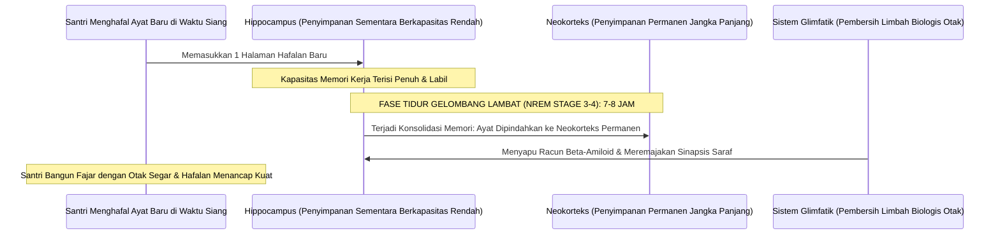

Penelitian neurobiologi mutakhir oleh Prof. Matthew Walker dari University of California, Berkeley, dan tim peneliti tidur dunia membuktikan sunnatullah biologis yang sangat menakjubkan[^6]:

1. **Fungsi Hipokampus Sebagai Kotak Surat Sementara**:  
   Saat santri menghafal Al-Qur'an di siang hari, ayat-ayat tersebut disimpan di **Hipokampus**—organ penyimpanan sementara yang kapasitasnya sangat terbatas. Jika santri terus dipaksa menghafal tanpa tidur yang cukup, hipokampus mengalami kejenuhan (*saturation*); informasi baru tidak bisa masuk, dan informasi yang baru masuk akan langsung terhapus.
2. **Konsolidasi Memori Hanya Terjadi pada Fase NREM Gelombang Lambat**:  
   Agar hafalan Al-Qur'an berpindah dari hipokampus menuju **Neokorteks** (arsip memori jangka panjang yang permanen), otak **mutlak membutuhkan fase tidur nyenyak gelombang lambat (*Slow-Wave Sleep / NREM Tahap 3 dan 4*)**. Fase ini hanya bisa dicapai secara optimal jika seseorang tidur dalam siklus penuh minimal 7 hingga 8 jam per malam bagi usia remaja.
3. **Aktivasi Sistem Glimfatik (Pembersih Sampah Otak)**:  
   Ketika manusia tidur lelap, sel-sel glia di otak menyusut hingga 60%, memungkinkan cairan serebrospinal mengalir deras menyapu protein-protein racun neurotoksik (seperti beta-amiloid dan tau) yang menumpuk akibat aktivitas berpikir seharian. Sistem pembersihan limbah ini **TIDAK AKAN BEKERJA** saat manusia terjaga.

Jika seorang santri tidur hanya 4 jam per hari secara kronis:
* Transfer memori dari hipokampus ke neokorteks **gagal total**. Hafalan yang disetorkan kemarin sore akan menguap hilang keesokan harinya.
* Terjadi **Atrofi Saraf dan Pengerutan Volume Otak**: Cabang-cabang dendrit di hipokampusnya mengalami kerusakan permanen. Santri secara biologis menjadi pelupa, tumpul daya nalarnya, dan lambat berpikir.
* Terjadi **Ketidakstabilan Emosional Akut**: Amigdalanya menjadi 60% lebih hiperaktif karena koneksi penghambat dari PFC terputus akibat kelelahan. Santri menjadi mudah marah, cengeng, agresif terhadap temannya, atau tenggelam dalam kecemasan mendalam.

TUMBUH mendeklarasikan dengan tegas: **Menjamin santri tidur nyenyak selama minimal 7 jam per hari adalah bagian dari ibadah dan ketaatan kepada syariat Allah!** Menyunat jam tidur santri secara ugal-ugalan bukanlah tirakat yang terpuji; itu adalah perusakan organ tubuh biologis ciptaan Allah yang diamanahkan kepada kita untuk dijaga.

---

### 2.4 Antropologi Insan: Martabat Asasi (*Karamah*) dan Hak-Hak Santri

Siapakah sesungguhnya santri yang kita bimbing di pesantren? Apakah mereka sekadar deretan nomor induk santri? Apakah mereka sekadar objek pembinaan yang bebas kita bentak dan hukum sesuka hati demi melampiaskan kejengkelan kita?

Al-Qur'an al-Karim menetapkan kedudukan ontologis manusia dengan bahasa yang sangat agung dan memuliakan:

$$\text{وَلَقَدْ كَرَّمْنَا بَنِي آدَمَ وَحَمَلْنَاهُمْ فِي الْبَرِّ وَالْبَحْرِ وَرَزَقْنَاهُم مِّنَ الطَّيِّبَاتِ وَفَضَّلْنَاهُمْ عَلَىٰ كَثِيرٍ مِّمَّنْ خَلَقْنَا تَفْضِيلًا}$$

> *"Dan sesungguhnya telah Kami muliakan anak-anak keturunan Adam; Kami angkut mereka di daratan dan di lautan, Kami anugerahkan kepada mereka rezeki dari yang baik-baik, dan Kami lebihkan mereka di atas kebanyakan makhluk yang telah Kami ciptakan dengan kelebihan yang sempurna."*  
> (QS. Al-Isra' [17]: 70)[^7]

Perhatikan penegasan ayat ini: **وَلَقَدْ كَرَّمْنَا بَنِي آدَمَ** (*Dan sungguh Kami telah memuliakan anak-cucu Adam*).  
Imam Fakhruddin Ar-Razi dalam tafsir monumentalnya *Mafatih al-Ghaib* menjelaskan bahwa kemuliaan (*al-karamah*) yang dianugerahkan Allah kepada manusia mencakup seluruh dimensinya: rupa fisiknya yang indah dan tegak lurus, akal budinya yang mampu menyingkap rahasia alam, kemampuannya memilih dengan sadar (*al-ikhtiyar*), serta kelayakannya menerima khitab syariat dan mengemban amanah memakmurkan bumi (*'imaratul ardh*)[^8].

Kemuliaan ini adalah **kemuliaan asasi (*inherent ontological dignity*)**. Kemuliaan ini melekat pada diri seorang santri semata-mata karena ia adalah manusia ciptaan Allah yang ditiupkan ruh ke dalam raganya.

Kemuliaan ini **TIDAK PERNAH HILANG ATAU GUGUR** hanya karena:
* Seorang santri terlambat bangun salat subuh;
* Seorang santri belum mampu menguasai kaidah nahwu;
* Seorang santri melakukan pelanggaran tata tertib asrama.

Oleh karena itu, dalam ekosistem **TUMBUH**, seluruh metode pendisiplinan yang bertujuan **menghancurkan harga diri dan meremukkan martabat santri (*mortification of dignity*) diharamkan secara mutlak**:

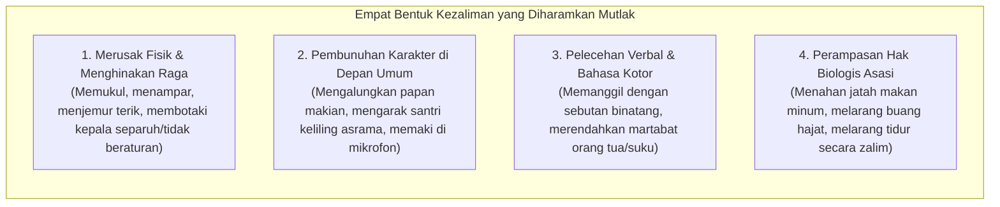

Santri yang melakukan kesalahan tetap berhak diperlakukan sebagai hamba Allah yang mulia. Ia berhak mendapatkan pembelaan yang adil melalui asas syariat yang universal: **Al-Ashlu Bara'atudz-Dzimmah (Asas Praduga Tak Bersalah)**. Seorang santri tidak boleh divonis bersalah hanya berdasarkan desas-desus atau praduga sepihak tanpa adanya proses *tabayyun* (klarifikasi) yang objektif dan transparan.

---

### 2.5 Tiga Mandat Eksistensial: Menumbuhkan Insan Menuju Derajat Rusyd

Pendidikan Islam dalam ekosistem TUMBUH bukanlah proses mencetak "robot penurut yang pasif". Tujuan agung tarbiyah adalah menuntun santri agar mampu menyatukan tiga mandat eksistensial kehidupannya secara seimbang:

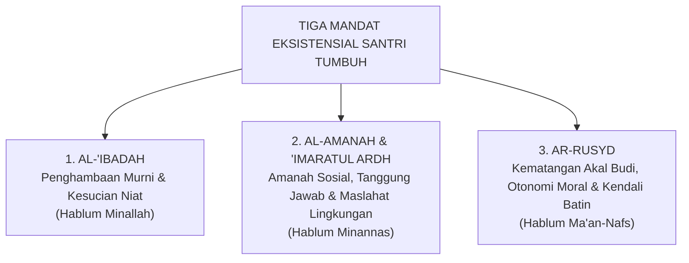

#### 1. Mandat Al-'Ibadah: Menegakkan Penghambaan Total
Santri dibimbing untuk menyadari bahwa tujuan penciptaannya di muka bumi adalah beribadah kepada Allah semata (QS. Adz-Dzariyat [51]: 56). Namun ibadah di sini tidak dipahami secara kerdil hanya sebatas ritual mekanis di atas sajadah. Ibadah dalam ekosistem TUMBUH meluas ke seluruh lorong asrama: menjaga kebersihan tempat tidur adalah ibadah, menyapa saudara sekamar dengan senyuman adalah ibadah sedekah, mematikan kran air yang bocor adalah ibadah menjaga amanah bumi, dan belajar sungguh-sungguh adalah ibadah jihad fi sabilillah.

#### 2. Mandat Amanah Sosial dan 'Imaratul Ardh: Memakmurkan Bumi
Santri dididik untuk tidak menjadi manusia yang egois (*individualistic piety*). Kamar asrama adalah laboratorium miniatur peradaban. Di sanalah santri belajar seni bermasyarakat: bagaimana meredam ego pribadi saat berhadapan dengan perbedaan karakter teman, bagaimana berinisiatif menolong kawan yang sakit tanpa diminta, dan bagaimana merawat fasilitas bersama agar tidak rusak. Santri dilatih menjadi insan yang bermanfaat bagi sesamanya (*khairun nasi anfa'uhum lin-nas*).

#### 3. Mandat Ar-Rusyd: Kemandirian Batin Berkesadaran Penuh
Inilah puncak pencapaian kepribadian dalam arsitektur perkembangan TUMBUH. Istilah **Ar-Rusyd** adalah konsep Al-Qur'an yang menggambarkan tingkat kematangan tertinggi ketika seseorang telah memiliki kecerdasan intelektual, kemandirian emosional, dan integritas moral yang kokoh (QS. An-Nisa' [4]: 6)[^9].

Insan yang telah mencapai derajat *rusyd* adalah pribadi yang:
* Tidak lagi memerlukan rotan musyrif untuk melangkah salat subuh, karena nuraninya sendiri yang membangunkannya bermunajat kepada Allah.
* Tidak lagi memerlukan ancaman sanksi untuk menahan tangannya dari barang milik orang lain, karena rasa malunya kepada Allah telah menjadi benteng pelindung dirinya.
* Mampu mengambil keputusan moral yang tepat dan bertanggung jawab di tengah godaan zaman yang membingungkan.

Inilah muara akhir dari seluruh tangga progresi kemandirian TUMBUH (J1 hingga J4): bukan sekadar membuat santri patuh selama berada di balik gerbang pondok, melainkan melahirkan kader-kader peradaban yang telah mandiri secara adab, kokoh memegang prinsip, dan siap memimpin umat di mana pun mereka berada.

---

### 2.6 Maqashid Syari'ah: Perlindungan Lima Hak Asasi di Kehidupan Asrama 24 Jam

Bagaimana memastikan bahwa tata tertib, sistem perizinan, dan pola pembinaan di pesantren kita benar-benar berdiri di atas syariat Allah dan bukan di atas hawa nafsu pengurus?

Ukuran pengujinya adalah **Maqashid Syari'ah (Tujuan-Tujuan Asasi Syariat)** sebagaimana dirumuskan oleh Imam Al-Ghazali dalam *Al-Mustashfa* dan Imam Asy-Syathibi dalam *Al-Muwafaqat*[^10]. Seluruh syariat Islam diturunkan untuk memelihara lima hak asasi eksistensial manusia (*Ad-Dharuriyyat al-Khamsah*).

Mari kita bedah secara mendalam bagaimana kelima pilar Maqashid Syari'ah ini wajib diterjemahkan ke dalam tata kelola asrama pesantren 24 jam:

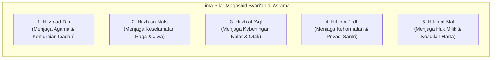

#### 1. Hifzh ad-Din (Perlindungan Terhadap Kemurnian Agama)
* **Pelanggaran Laten**: Menjadikan ayat-ayat suci Al-Qur'an atau ibadah salat sebagai sarana hukuman fisik (misalnya: santri yang melanggar disuruh membaca surah Yasin sambil berdiri dengan satu kaki di hadapan umum, atau disuruh salat taubat ratusan rakaat sebagai bentuk takzir memalukan). Praktik ini secara psikologis menanamkan kebencian batin santri terhadap ibadah dan kalamullah.
* **Standar TUMBUH**: Ibadah dikembalikan pada kesuciannya sebagai tempat bersimpuh dan mencari ketenangan (*thuma'ninah*). Penegakan adab dilakukan melalui pemulihan tanggung jawab moral (*restitusi*) dan dialog nurani. Ibadah sunnah dihidupkan lewat daya pikat keteladanan musyrif, bukan lewat paksaan tongkat pemukul.

#### 2. Hifzh an-Nafs (Perlindungan Terhadap Jiwa dan Keselamatan Fisik)
* **Pelanggaran Laten**: Kekerasan fisik yang disamarkan sebagai pembinaan, hukuman lari keliling lapangan di siang terik hingga santri dehidrasi dan pingsan, pembiaran air asrama yang berlumut dan penuh bakteri, serta pemotongan jatah tidur santri hingga di bawah batas kesehatan neurobiologis.
* **Standar TUMBUH**: **Toleransi Nol (*Zero Tolerance*) terhadap Segala Bentuk Kekerasan Fisik**. Seluruh sarana fisik asrama wajib lolos audit kelayakan sanitasi, ventilasi udara, dan kecukupan gizi makanan. Jam tidur santri minimal 7 jam per malam dijamin secara ketat sebagai hak perlindungan jiwa dan raga ciptaan Allah.

#### 3. Hifzh al-'Aql (Perlindungan Terhadap Akal Pikiran dan Kebeningan Nalar)
* **Pelanggaran Laten**: Pembodohan nalar santri melalui doktrinasi kepatuhan buta, pelarangan bertanya dan berdiskusi, serta peracunan otak santri oleh hormon stres kronis (kortisol) akibat atmosfer asrama yang penuh ancaman dan ketakutan.
* **Standar TUMBUH**: Membangun iklim asrama yang aman secara psikologis (*psychological safety*). Menghidupkan tradisi dialog sokratik, melatih santri memecahkan masalah (*problem-solving skills*), serta merawat kesehatan organ otak santri agar mampu menyerap hafalan Al-Qur'an dan ilmu syar'i secara optimal.

#### 4. Hifzh an-Nasl wa al-'Irdh (Perlindungan Terhadap Kehormatan dan Privasi)
* **Pelanggaran Laten**: Penggeledahan lemari santri yang dilakukan secara kasar dan merusak barang-barang pribadi, pemotongan rambut secara asal-asalan demi mempermalukan anak, pengumuman aib pelanggaran santri melalui pengeras suara masjid, serta pembiaran budaya perundungan (*bullying*) oleh senior.
* **Standar TUMBUH**: Perlindungan total terhadap privasi dan kehormatan diri santri. Pemeriksaan kamar dilakukan secara beradab dan didampingi santri pemilik kamar. Penanganan kasus pelanggaran adab dilakukan secara tertutup dan rahasia di ruang konseling BK, tanpa mempermalukan santri di depan publik.

#### 5. Hifzh al-Mal (Perlindungan Terhadap Hak Milik Kebendaan)
* **Pelanggaran Laten**: Normalisasi budaya *ghashab* (mengambil barang teman tanpa izin) yang dianggap sebagai "kebiasaan lumrah anak pondok", perusakan fasilitas umum asrama tanpa ada yang bertanggung jawab, serta pemotongan uang saku santri secara sepihak untuk sanksi denda tanpa transparansi.
* **Standar TUMBUH**: Eliminasi mutlak budaya ghashab dari lingkungan pondok. Edukasi adab kepemilikan pribadi ditegakkan dengan ketat. Setiap kerusakan fasilitas atau kehilangan barang diwajibkan menjalani proses **restitusi nyata (ganti rugi yang bermartabat)** oleh pihak yang bersalah, sehingga santri terlatih memiliki tanggung jawab amanah kebendaan.

Ketika kelima pilar Maqashid Syari'ah ini tegak berdiri di seluruh ruang asrama, pesantren akan menjelma menjadi **Bi'ah Shalihah (Ekosistem Peradaban yang Suci)**—tempat di mana setiap anak manusia merasa aman, dimuliakan martabatnya, dan dituntun menuju derajat ketaqwaan yang hakiki.

Dengan tuntasnya peletakan fondasi pandangan alam ini, kita kini memiliki kompas normatif yang kokoh. Namun, bagaimana cara kita memperoleh pengetahuan yang valid dan terpercaya mengenai dinamika jiwa santri? Bagaimana cara kita memadukan khazanah kitab-kitab turats salaf dengan temuan-temuan sains perilaku dan psikologi modern? 

Inilah penjelajahan agung yang akan kita bedah bersama dalam **Bagian II: Epistemologi Pendidikan dan Hakikat Jiwa Insan**.

---

### Catatan Kaki & Rujukan Akademik

[^1]: Syed Muhammad Naquib al-Attas, *The Concept of Education in Islam: A Framework for an Islamic Philosophy of Education* (Kuala Lumpur: International Institute of Islamic Thought and Civilization [ISTAC], 1980), hlm. 15–28; Syed Muhammad Naquib al-Attas, *Islam and Secularism* (Kuala Lumpur: Muslim Youth Movement of Malaysia [ABIM], 1978), hlm. 133–150.
[^2]: Muslim bin al-Hajjaj an-Naisaburi, *Shahih Muslim*, Kitab ath-Thaharah, Bab Fadhl al-Wudhu', hadits no. 223.
[^3]: Al-Qur'an al-Karim, Surah Al-Ikhlas [112]: 1–4.
[^4]: Ahmad bin Muhammad bin Hanbal, *Al-Musnad*, Tahqiq: Syu'aib al-Arna'uth dkk. (Beirut: Mu'assasah ar-Risalah, 2001), Jilid II, hlm. 333, hadits no. 1095; Sulaiman bin Ahmad Ath-Thabarani, *Al-Mu'jam al-Kabir* (Kairo: Maktabah Ibn Taimiyyah, 1994), Jilid XVIII, hlm. 170.
[^5]: Abu Ja'far Muhammad bin Jarir Ath-Thabari, *Tarikh ar-Rusul wa al-Muluk* (Tarikh Ath-Thabari) (Kairo: Dar al-Ma'arif, 1967), Jilid III, hlm. 224; Ibnu Katsir, *Al-Bidayah wa an-Nihayah* (Giza: Dar Hijr, 1997), Jilid VI, hlm. 305–306.
[^6]: Matthew Walker, *Why We Sleep: Unlocking the Power of Sleep and Dreams* (New York: Scribner, 2017), hlm. 105–142; Robert Stickgold, "Sleep-dependent memory consolidation", *Nature*, Vol. 437 (2005), hlm. 1272–1278; Lulu Xie dkk., "Sleep Drives Metabolite Clearance from the Adult Brain", *Science*, Vol. 342, No. 6156 (2013), hlm. 373–377.
[^7]: Al-Qur'an al-Karim, Surah Al-Isra' [17]: 70.
[^8]: Fakhruddin Muhammad bin Umar Ar-Razi, *Mafatih al-Ghaib* (At-Tafsir al-Kabir) (Beirut: Dar al-Fikr, 1981), Jilid XXI, hlm. 13–18.
[^9]: Abu Abdillah Muhammad bin Ahmad Al-Qurthubi, *Al-Jami' li Ahkam al-Qur'an* (Tafsir Al-Qurthubi), Tahqiq: Dr. Abdullah bin Abdul Muhsin At-Turki (Beirut: Mu'assasah ar-Risalah, 2006), Jilid VI, hlm. 43–48.
[^10]: Abu Hamid Muhammad bin Muhammad Al-Ghazali, *Al-Mustashfa min 'Ilm al-Ushul*, Tahqiq: Dr. Muhammad Sulaiman al-Asyqar (Beirut: Mu'assasah ar-Risalah, 1997), Jilid I, hlm. 416–420; Abu Ishaq Ibrahim bin Musa Asy-Syathibi, *Al-Muwafaqat fi Ushul asy-Syari'ah*, Tahqiq: Masyhur bin Hasan Al Salman (Kobar: Dar Ibn 'Affan, 1997), Jilid II, hlm. 17–32.


---

# BAB 3: EPISTEMOLOGI TERPADU: WAHYU, NALAR, DAN FAKTA EMPIRIS
## Menegakkan Keadilan Berpikir, Validitas Bukti, dan Adab Keilmuan di Pesantren 24 Jam

> يَا أَيُّهَا الَّذِينَ آمَنُوا إِنْ جَاءَكُمْ فَاسِقٌ بِنَبَإٍ فَتَبَيَّنُوا أَنْ تُصِيبُوا قَوْمًا بِجَهَالَةٍ فَتُصْبِحُوا عَلَىٰ مَا فَعَلْتُمْ نَادِمِينَ
>
> *"Wahai orang-orang yang beriman! Jika seseorang yang fasik datang kepadamu membawa suatu berita, maka bertabayunlah (telitilah kebenarannya secara seksama), agar kamu tidak mencelakakan suatu kaum karena kebodohan (kecerobohan tanpa bukti), yang akhirnya kamu menyesali perbuatanmu itu."*  
> — **Al-Qur'an al-Karim**, Surah Al-Hujurat [49]: 6[^1]

---

### 3.1 Tragedi Fitnah di Ruang Asrama: Mengapa Epistemologi Menentukan Nasib Santri?

Di sebuah asrama santri putra, jarum jam dinding menunjukkan pukul 21.45. Suasana yang semestinya tenang menjelang jam istirahat malam seketika pecah oleh kegaduhan di Kamar 3. Seorang santri kelas delapan menangis histeris mendapati uang saku bulanannya yang disimpan di dalam saku baju koko di lemari telah raib. Dalam hitungan menit, desas-desus merebak cepat ke seluruh lorong kamar. Beberapa santri senior berbisik bahwa mereka tadi sore melihat Santri R berjalan tergesa-gesa di dekat lemari korban. 

Tanpa melakukan penyelidikan yang tertib, musyrif kamar yang terpancing emosi segera menyeret Santri R ke ruang kantor pengasuhan. Di bawah sorot lampu neon yang dingin, tuduhan langsung dihujamkan: *"Santri-santri lain melihat kamu berkeliaran di dekat lemari korban sore tadi! Ngaku saja! Kalau kamu tidak mau jujur, malam ini kamu tidur di lantai pos satpam!"* Santri R gemetar ketakutan, menangis bersumpah demi Allah bahwa ia hanya sedang mengambil sajadahnya sendiri yang tertinggal di gantungan. Namun, musyrif tersebut bersikukuh pada praduganya: *"Firasat saya tidak pernah salah. Wajahmu tampak cemas, itu tanda orang berdosa!"*

Tiga hari kemudian, fakta sesungguhnya terungkap: uang saku tersebut ternyata terselip di bawah lipatan kasur pemiliknya sendiri yang lupa telah memindahkannya. 

Namun, kerusakan jiwa telah terlanjur terjadi. Santri R selama tiga hari telah menanggung aib yang tak terperikan, dicap sebagai "pencuri" oleh kawan-kawan sekamarnya, dikucilkan saat jam makan, dan mengalami trauma batin yang menghancurkan kepercayaan dirinya terhadap para pendidik.

Kisah memilukan di atas bukanlah anomali langka; ini adalah potret nyata dari **Krisis Epistemik (*Epistemic Injustice*)** yang kerap menimpa dunia pengasuhan pesantren.

Banyak pendidik dan pengurus pondok tidak menyadari bahwa **Epistemologi bukanlah teori filsafat yang mandul**. Epistemologi adalah ilmu tentang: *Bagaimana kita tahu apa yang kita tahu? Atas dasar apa kita mempercayai sebuah informasi? Dan seberapa sah sebuah bukti dijadikan dasar untuk mengambil keputusan yang menyangkut nasib dan kehormatan seorang manusia?*

Ketika seorang pengasuh mengambil keputusan hanya berdasarkan "kabar burung", "firasat subjektif", atau "pengakuan santri di bawah ancaman siksaan", pengasuh tersebut sesungguhnya sedang melakukan kezaliman epistemik yang diharamkan oleh syariat. Al-Qur'an mengecam keras orang-orang yang membangun vonis di atas persangkaan tanpa bukti:

$$\text{إِن يَتَّبِعُونَ إِلَّا الظَّنَّ وَمَا تَهْوَى الْأَنفُسُ ۖ وَلَقَدْ جَاءَهُم مِّن رَّبِّهِمُ الْهُدَىٰ}$$

> *"Mereka tidak lain hanyalah mengikuti persangkaan belaka (zhann) dan apa yang diingini oleh hawa nafsu mereka, padahal sungguh telah datang petunjuk dari Rabb mereka."*  
> (QS. An-Najm [53]: 23)[^2]

Dalam ekosistem **TUMBUH**, keadilan berpikir (*epistemic justice*) dan kejujuran metodologis diletakkan sebagai pilar adab yang agung. Tidak boleh ada satu pun vonis disiplin, tidak boleh ada satu pun pelabelan karakter santri, dan tidak boleh ada satu pun program kurikulum baru yang diluncurkan tanpa melewati pertanggungjawaban epistemik yang shahih.

---

### 3.2 Tiga Saluran Ilmu dalam Tradisi Islam: Integrasi Wahyu, Nalar, dan Indera

Peradaban Barat modern terperangkap ke dalam dikotomi epistemik yang tajam: antara **Rasionalisme** yang mendewakan akal murni dan menolak realitas spiritual, serta **Empirisme/Positivisme** yang menolak segala bentuk kebenaran kecuali yang dapat ditimbang dan diukur di laboratorium materi. Di sisi lain, sebagian masyarakat tradisional terjatuh ke dalam **Mistisisme Irasional**: mempercayai mimpi, firasat liar, dan takhayul tanpa pernah mengujinya dengan akal sehat dan dalil syariat.

Epistemologi Islam yang diwariskan oleh para ulama mu'tabar—seperti Imam Abu Hamid Al-Ghazali, Imam Fakhruddin Ar-Razi, dan Prof. Syed Muhammad Naquib al-Attas—menolak seluruh bentuk kepincangan tersebut[^3]. 

Islam memandang bahwa manusia dikaruniai **tiga saluran ilmu yang saling menyempurnakan (*The Integrated Channels of Knowledge*)**:

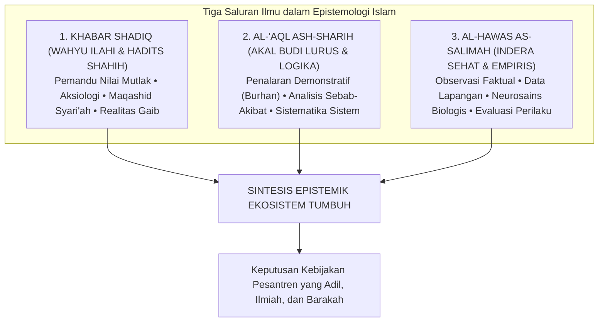

#### 1. Al-Khabar ash-Shadiq (Wahyu Ilahi dan As-Sunnah yang Shahih)
Wahyu (*Tanzil*) adalah sumber kebenaran tertinggi yang bersifat mutlak, ma'shum, dan melampaui keterbatasan ruang dan waktu. Wahyu memberikan jawaban atas pertanyaan-pertanyaan yang tidak mampu dijangkau oleh akal dan laboratorium: *Untuk apa manusia diciptakan? Apa yang terjadi setelah kematian? Dan apa batas-batas moral yang tidak boleh dilanggar dalam memperlakukan sesama hamba Allah?*

Wahyu memberikan **kompas arah nilai (*normative direction*)** dan **pagar etika (*ethical boundaries*)**. Wahyu menetapkan bahwa memukul santri secara zalim adalah haram, mempermalukan anak di depan umum adalah dosa, dan menjaga kehormatan anak adalah wajib. Pagar etika wahyu ini bersifat mutlak; ia tidak boleh digusur dengan alasan "demi efisiensi administrasi" atau "kebiasaan masa lalu".

#### 2. Al-'Aql ash-Sharih (Akal Budi Lurus dan Nalar Demonstratif)
Akal adalah anugerah cahaya Ilahi (*nurul 'aql*) yang disematkan ke dalam jiwa manusia untuk menimbang argumen, memahami keteraturan alam, dan membedakan antara yang benar (*haqq*) dan yang batil. Para ulama ushul fiqh membedakan akal dari sekadar angan-angan nafsu. Akal yang lurus bekerja melalui kaidah-kaidah logika yang tertib (*burhan*) dan penalaran analogis (*qiyas*).

Akal bertugas menerjemahkan petunjuk wahyu yang bersifat universal ke dalam arsitektur sistem yang terstruktur: menyusun jenjang kurikulum, merancang indikator perkembangan, dan memetakan alur intervensi perilaku di asrama. Akal menguji apakah sebuah kebijakan pengasuhan memiliki koherensi logis atau justru mengandung kontradiksi internal yang membingungkan santri.

#### 3. Al-Hawas as-Salimah (Indera yang Sehat dan Pengamatan Empiris)
Indera lahiriah—penglihatan, pendengaran, perabaan—yang dipadukan dengan metode observasi ilmiah (*tajribah*) adalah instrumen manusia untuk membaca ayat-ayat kauniyyah Allah di alam semesta. Dari saluran inilah lahir sains kedokteran, neurobiologi perkembangan, psikologi perilaku, dan data statistik asrama.

Pengamatan empiris bertugas memberi tahu kita tentang **kenyataan faktual di lapangan (*reality on the ground*)**: Berapa rata-rata jam tidur santri di asrama? Jam berapa kasus perkelahian paling sering meledak? Makanan apa yang disajikan di dapur pondok dan bagaimana kandungan gizinya? Bagaimana pola pernapasan santri saat ia mengalami serangan panik?

#### Prinsip Integrasi Epistemik TUMBUH
Ketiga saluran ini tidak boleh dipertentangkan, melainkan harus bekerja secara harmonis:

> **Wahyu menetapkan ARAH dan BATASAN NILAI yang suci;  
> Akal merancang ARSITEKTUR dan STRUKTUR SISTEM yang runtut;  
> Fakta Empiris menguji EFEKTIVITAS dan KETEPATAN METODE di lapangan.**

Jika sebuah program pembinaan di pesantren dirancang dengan niat yang sangat mulia (sesuai arah wahyu), namun setelah dievaluasi secara empiris ternyata membuat santri sakit-sakitan atau membenci agamanya, maka yang salah bukanlah agamanya, melainkan desain metode penerapannya di lapangan. Pendidik TUMBUH tidak boleh keras kepala mempertahankan metode yang terbukti gagal secara empiris hanya dengan dalih "yang penting niatnya ikhlas".

---

### 3.3 Anatomi Bahasa: Membedah Lima Jenis Klaim di Lingkungan Pesantren

Salah satu sumber kerancuan terbesar dalam rapat-rapat pengasuhan dan perumusan kurikulum pesantren adalah **ketidakmampuan membedakan jenis klaim (*epistemic claim classification*)**. Ketika sebuah opini pribadi disamakan statusnya dengan ayat Al-Qur'an, atau ketika data awal yang masih rapuh langsung diyakini sebagai hukum kepastian, maka lahirlah kebijakan-kebijakan yang serampangan.

Dalam arsitektur TUMBUH, setiap kalimat yang terucap di asrama dan tercatat dalam buku panduan wajib diklasifikasikan ke dalam **Lima Derajat Klaim Epistemik**[^4]:

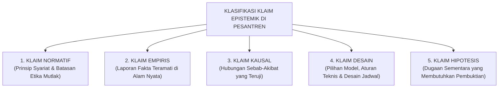

Mari kita bedah secara gamblang contoh konkret kelima jenis klaim ini di lingkungan asrama:

#### 1. Klaim Normatif (Normative Claim)
* **Bunyi Kalimat**: *"Setiap santri memiliki kemuliaan fitrah dan haram dipukul atau dipermalukan harga dirinya di depan umum."*
* **Status Epistemik**: Pernyataan nilai yang bersumber dari wahyu syariat dan prinsip dasar etika Islam.
* **Beban Pembuktian**: Pembuktiannya merujuk pada nash Al-Qur'an (QS. Al-Isra': 70), hadits larangan memukul wajah, serta prinsip Maqashid Syari'ah (*hifzh an-nafs* dan *hifzh al-'irdh*).
* **Konsekuensi**: Mengikat secara mutlak. Tidak dapat dibatalkan oleh suara mayoritas rapat atau alasan pragmatis kepraktisan pengurus.

#### 2. Klaim Empiris (Empirical Claim)
* **Bunyi Kalimat**: *"Di Gedung Asrama Abu Bakar, angka santri yang terlambat salat subuh menurun dari 18 orang menjadi 4 orang dalam tempo satu bulan terakhir."*
* **Status Epistemik**: Pelaporan data faktual yang terjadi di alam nyata.
* **Beban Pembuktian**: Verifikasi buku logbook absensi subuh musyrif, rekaman kehadiran fisik, dan memastikan tidak ada rekayasa pencatatan angka laporan. Klaim ini bisa benar atau salah secara faktual.

#### 3. Klaim Kausal (Causal Claim)
* **Bunyi Kalimat**: *"Penurunan angka keterlambatan santri subuh disebabkan secara langsung oleh dimajukannya jam padam lampu asrama menjadi pukul 21.30."*
* **Status Epistemik**: Menghubungkan dua peristiwa dalam relasi sebab-akibat (*causality*).
* **Beban Pembuktian**: Sangat berat. Pengasuh harus membuktikan secara metodologis bahwa penurunan keterlambatan itu benar-benar murni akibat jam tidur lebih awal, bukan karena adanya faktor perancu (*confounding variables*) lain—seperti pergantian musyrif baru yang lebih galak atau adanya ancaman sanksi tambahan.

#### 4. Klaim Desain (Design Claim)
* **Bunyi Kalimat**: *"TUMBUH menetapkan struktur pembinaan santri ke dalam 4 Jenjang Kemandirian (J1–J4) dengan sesi mentoring pekanan kelompok kecil berisi 8 santri."*
* **Status Epistemik**: Pilihan teknis arsitektur sistem buatan manusia untuk memfasilitasi pertumbuhan karakter.
* **Beban Pembuktian**: Uji kelayakan logika dan keselarasan dengan kapasitas perkembangan remaja. Klaim desain ini **bukan wahyu suci yang kaku**; angka 8 santri per kelompok dapat disesuaikan menjadi 6 atau 10 jika evaluasi lapangan menunjukkan perlunya modifikasi manajerial.

#### 5. Klaim Hipotesis (Hypothetical Claim)
* **Bunyi Kalimat**: *"Kami menduga bahwa santri yang sering menyendiri di sudut kantin saat jam istirahat mengalami gejala perundungan terselubung oleh teman sekamarnya."*
* **Status Epistemik**: Dugaan awal yang logis sebagai pintu pembuka bagi penyelidikan terencana.
* **Beban Pembuktian**: Menjadi landasan bagi guru BK atau musyrif untuk melakukan observasi terarah dan wawancara empati. Dilarang keras menjadikan klaim hipotesis sebagai dasar pemberian vonis atau pelabelan (*labeling*) santri sebelum pembuktian tuntas.

---

### 3.4 Kejujuran Menyatakan Derajat Kepastian: Menghancurkan Dogmatisme Mutlak

Salah satu ciri kemunduran peradaban ilmu adalah merebaknya **Dogmatisme Semu (False Absolutism)**—kebiasaan berbicara dengan nada serba mutlak, serba yakin seratus persen, padahal dasar pijakannya sangat rapuh. Di lingkungan pesantren, sering kita dengar kalimat gegabah semacam: *"Pasti anak ini yang mencuri!"*, *"Metode kami sudah terbukti seratus persen paling ampuh di seluruh dunia!"*, atau *"Santri yang tidak ikut metode ini pasti gagal!"*

TUMBUH mengharamkan kesombongan intelektual semacam itu. Para ulama salaf yang paling alim sekalipun selalu mengakhiri fatwanya dengan kalimat penuh tawadhu': *Allahu A'lam bish-Shawab* (Allah yang lebih mengetahui kebenaran yang sesungguhnya). Bahkan Imam Malik bin Anas, sang imam Darul Hijrah, dari empat puluh delapan pertanyaan yang diajukan kepadanya, menjawab tiga puluh dua di antaranya dengan kalimat: *"La Adri"* (Aku belum tahu)[^5].

Ketika seorang murid bertanya: *"Tidakkah engkau malu menjawab 'tidak tahu' padahal orang-orang datang dari jauh menemuimu?"* Imam Malik menjawab dengan tegas: *"Katakan kepada orang-orang di kampungmu bahwa Malik tidak tahu!"*

Mengakui keterbatasan data bukanlah tanda kelemahan; mengakui keterbatasan adalah puncak dari **Integritas Intelektual (*Al-Inshaf*)**.

Di dalam seluruh laporan resmi, jurnal pengasuhan, dan panduan operasional TUMBUH, dibakukan **Lima Diksi Penanda Derajat Kepastian (*Epistemic Certainty Indicators*)**:

| Derajat Kepastian | Diksi Resmi TUMBUH | Kapan Digunakan di Pesantren? |
| :--- | :--- | :--- |
| **Pasti / Aksiomatik** | **Ditetapkan (*Stipulated*)** | Digunakan khusus untuk ketetapan nash wahyu shahih yang *qath'i*, prinsip syariat mutlak, serta definisi aksioma arsitektur sistem yang telah disepakati bersama. |
| **Kuat / Meyakinkan** | **Didukung Kuat (*Strongly Supported*)** | Digunakan ketika sebuah temuan didukung oleh data triangulasi yang konsisten (misal: laporan observasi tiga musyrif berbeda, bukti fisik rekaman, dan pengakuan sadar tanpa paksaan). |
| **Cenderung / Indikatif** | **Mengindikasikan (*Indicates*)** | Digunakan ketika data awal menunjukkan arah tren tertentu, namun jumlah sampel santri masih terbatas dan masih membutuhkan audit lanjutan. |
| **Dugaan Logis** | **Diduga Sementara (*Hypothesized*)** | Digunakan untuk penjelasan logis awal atas sebuah fenomena perilaku santri yang secara sadar diakui masih dalam tahap verifikasi di lapangan. |
| **Belum Terbukti** | **Belum Cukup Diketahui (*Inconclusive / Unknown*)** | Digunakan secara ksatria ketika data dan bukti yang dihimpun belum memadai untuk menarik kesimpulan yang bertanggung jawab. |

Musyrif dan pimpinan yang menggunakan diksi-diksi ini menunjukkan kedewasaan berpikir tingkat tinggi. Mereka tidak mudah menghakimi anak orang lain, tidak tergesa-gesa menyebarkan praduga, dan senantiasa menjaga keadilan dalam berbicara.

---

### 3.5 Harmonisasi Turats dan Sains Perilaku: Belajar dari Dialektika Al-Ghazali dan Ibnu Rusyd

Salah satu jebakan terbesar yang membelah dunia pendidikan Islam kontemporer adalah perpecahan biner yang sempit:
* Di satu kubu, terdapat kalangan puritan-tekstualis yang alergi terhadap segala bentuk sains modern: menolak ilmu psikologi perkembangan, menolak konseling kesehatan mental, dan menolak manajemen organisasi modern karena dianggap "produk sekuler barat yang merusak akidah".
* Di kubu lain, terdapat kalangan modernis-kompleks rendah diri (*inferiority complex*) yang memandang kitab-kitab turats klasik telah usang, lalu menelan mentah-mentah seluruh teori psikologi Barat sekuler tanpa filter syariat, hingga melenyapkan dimensi ruh dan akhirat dari jiwa santri.

TUMBUH berdiri di atas jalan tengah peradaban yang mulia (*wasathiyyah tamadduniyyah*): **Menghubungkan Hikmah Turats dengan Presisi Sains Modern**.

Tradisi agung ini memiliki akar sejarah yang sangat mengagumkan. Dua raksasa pemikir Islam terbesar, **Hujjatul Islam Abu Hamid Al-Ghazali** (w. 505 H) dan **Qadhi Abu al-Walid Ibnu Rusyd** (w. 595 H), terlibat dalam dialektika keilmuan yang paling monumental dalam sejarah filsafat peradaban manusia:

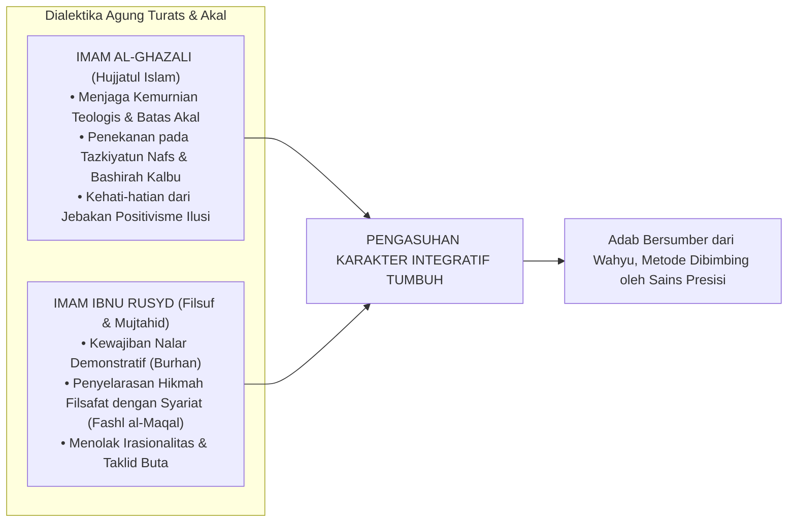

Dalam mahakaryanya *Tahafut al-Falasifah*, Imam Al-Ghazali membongkar kepongahan kaum filosof materialis yang mencoba mendefinisikan seluruh rahasia ketuhanan semata-mata dengan nalar spekulatif yang rapuh. Al-Ghazali menegaskan batas wilayah akal manusia dan membuka pintu bagi **penyucian jiwa (*tazkiyatun nafs*) dan kepekaan kalbu (*bashirah*)** sebagai saluran tertinggi untuk menangkap kebenaran sejati[^6].

Satu abad kemudian, Imam Ibnu Rusyd hadir dengan karyanya *Fashl al-Maqal fima bayna al-Hikmah wa asy-Syari'ah min al-Ittishal* dan *Tahafut at-Tahafut*. Beliau menegaskan bahwa penalaran rasional demonstratif (*al-burhan al-'aqli*) dan penelitian mendalam atas hukum alam (*sunnatullah*) bukanlah ancaman bagi syariat, melainkan sebuah **kewajiban keagamaan** yang diperintahkan langsung oleh Al-Qur'an (QS. Al-Hasyr [59]: 2: *"Fa'tabiruu yaa ulil abshaar"* — *Maka ambillah pelajaran, wahai orang-orang yang memiliki pandangan nalar!*)[^7]. Ibnu Rusyd membuktikan bahwa kebenaran wahyu yang shahih (*al-haqq*) tidak akan pernah bertentangan dengan kebenaran akal murni dan fakta alam yang terbukti (*al-haqq la yudhaddu al-haqq, bal yuwafiquhu wa yasyhadu lahu*).

Dari dialektika agung kedua begawan ini, TUMBUH menarik kaidah operasional bagi pengasuhan pesantren:
1. **Mengambil Metode Terbaik Tanpa Kehilangan Arah Syariat**:  
   Kita tidak perlu ragu memanfaatkan instrumen psikologi modern—seperti *Functional Behavior Assessment* (FBA), *Polyvagal Theory*, atau *Positive Behavioral Interventions and Supports* (PBIS)—selama instrumen tersebut terbukti secara ilmiah membantu kita memahami mekanisme saraf santri dan tidak bertentangan dengan adab Islam. Sains perilaku modern adalah hikmah yang tercecer milik orang beriman; di mana pun ia menemukannya, ia berhak mengambilnya.
2. **Menolak Reduksionisme Teknokratis Angka**:  
   Sekalipun TUMBUH menggunakan dasbor digital, grafik perkembangan santri, dan analisis data, kita menolak keras anggapan bahwa manusia dapat diselesaikan hanya dengan angka-angka algoritma. Data angka dapat memberitahukan bahwa santri A mengalami penurunan skor konsentrasi 40%. Namun untuk menyembuhkan lukanya, tetap dibutuhkan seorang musyrif yang menatap matanya dengan penuh cinta, mendoakannya di sujud malam, dan menyentuh hatinya dengan kalimat hikmah Ilahiyah.

---

### 3.6 Tata Kelola Epistemik Sistem TUMBUH: Protokol Pengambilan Keputusan Anti-Kezaliman

Bagaimanakah seluruh prinsip epistemologi ini dioperasionalkan agar tidak menjadi teori hampa di atas kertas?

Arsitektur TUMBUH mengkodifikasikan prinsip-prinsip ini ke dalam **Rantai Akuntabilitas Keputusan (*The Epistemic Decision Chain*)**:

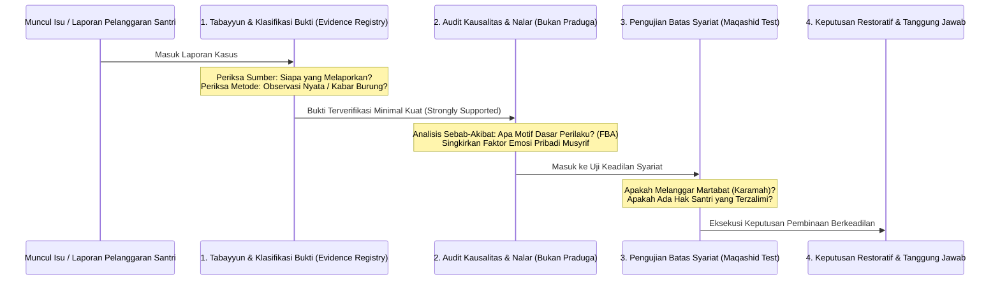

Setiap kali terjadi kasus pelanggaran berat di asrama yang menuntut tindakan tegas, pengurus dan musyrif wajib mengisi **Protokol Verifikasi Epistemik** sebelum mengetuk palu keputusan:

1. **Uji Sumber (*Source Verification*)**:  
   Siapa yang pertama kali menyampaikan informasi ini? Apakah saksi mata melihat langsung kejadian tersebut dengan mata kepalanya sendiri, ataukah sekadar mendengar dari desas-desus orang lain? Apakah saksi memiliki konflik kepentingan pribadi dengan santri yang dituduh?
2. **Uji Instrumen dan Metode (*Methodological Audit*)**:  
   Bagaimana bukti dihimpun? Apakah santri diinterogasi dalam keadaan ketakutan di bawah ancaman bentakan (yang secara neurobiologis membuat anak terpaksa mengaku bohong demi selamat), ataukah dalam suasana tenang yang memungkinkan nalar nuraninya berbicara jujur?
3. **Uji Kausalitas (*Causal Attribution*)**:  
   Apakah tindakan santri tersebut merupakan kesengajaan murni yang terencana (*'amd*), kekeliruan tanpa sengaja (*khatha'*), ataukah reaksi keterpaksaan di bawah intimidasi santri lain?
4. **Uji Maqashid Syari'ah (*Safeguarding Test*)**:  
   Apakah konsekuensi yang akan diberikan berpotensi melanggar hak perlindungan raga (*hifzh an-nafs*) atau meremukkan kehormatan nama baik santri (*hifzh al-'irdh*)? Jika ya, maka bentuk konsekuensi tersebut **wajib dibatalkan seketika dan diganti dengan restitusi yang mendidik**.

Dengan tata kelola epistemik yang ketat ini, pesantren terlindungi dari dosa kezaliman institusional. Tidak ada lagi santri yang menjadi korban fitnah asrama; tidak ada lagi air mata keputusasaan anak yang dihukum atas dosa yang tidak pernah ia lakukan.

Dari kebeningan epistemologi ini, kita kini memiliki alat berpikir yang adil dan tajam. Pertanyaan berikutnya menanti kita: *Siapakah sesungguhnya hakikat anak manusia yang sedang kita bimbing ini? Bagaimanakah susunan anatomi jiwa fitrahnya—antara Ruh, Qalb, 'Aql, dan Nafs—bergerak di dalam tubuh biologisnya?*

Inilah yang akan kita jelajahi secara mendalam dalam **Bab 4: Antropologi Jiwa Santri: Hakikat Fitrah dan Komponen Kejiwaan**.

---

### Catatan Kaki & Rujukan Akademik

[^1]: Al-Qur'an al-Karim, Surah Al-Hujurat [49]: 6.
[^2]: Al-Qur'an al-Karim, Surah An-Najm [53]: 23.
[^3]: Abu Hamid Muhammad bin Muhammad Al-Ghazali, *Al-Mustashfa min 'Ilm al-Ushul*, Tahqiq: Dr. Hamzah bin Zuhair Hafizh (Madinah: Syarikah al-Madinah al-Munawwarah, 1993), Jilid I, hlm. 35–48; Syed Muhammad Naquib al-Attas, *The Epistemology of Islam: A Definition and Framework* (Kuala Lumpur: ISTAC, 1990).
[^4]: Repositori TUMBUH v2.0.0, Dokumen Fundamental: `01_FUNDAMENTAL/01_PHILOSOPHY/02_EPISTEMOLOGY/05-Jenis-dan-Tingkat-Klaim.md` dan `08-Implikasi-Epistemology-bagi-TUMBUH.md`.
[^5]: Abu Umar Yusuf bin Abdil Barr An-Namari Al-Qurthubi, *Jami' Bayan al-'Ilm wa Fadhlihi*, Tahqiq: Abul Asybal Az-Zuhairi (Riyadh: Dar Ibn al-Jauzi, 1994), Jilid II, hlm. 838–842, riwayat no. 1582.
[^6]: Abu Hamid Muhammad bin Muhammad Al-Ghazali, *Tahafut al-Falasifah*, diedit oleh Sulaiman Dunya (Kairo: Dar al-Ma'arif, 1972), hlm. 72–89; Abu Hamid Al-Ghazali, *Al-Munqidz min adh-Dhalal*, diedit oleh Dr. Abdul Halim Mahmud (Kairo: Dar al-Kutub al-Haditsah, 1968), hlm. 45–60.
[^7]: Abu al-Walid Muhammad bin Ahmad bin Rusyd (Averroes), *Fashl al-Maqal fima bayna al-Hikmah wa asy-Syari'ah min al-Ittishal*, diedit oleh Dr. Muhammad 'Imarah (Kairo: Dar al-Ma'arif, 1983), hlm. 28–42; George F. Hourani, *Averroes on the Harmony of Religion and Philosophy* (London: Luzac & Co., 1961).


---

# BAB 4: ANTROPOLOGI JIWA SANTRI: HAKIKAT FITRAH DAN KOMPONEN KEJIWAAN
## Membedah Anatomi Ruh, Qalb, 'Aql, dan Nafs dalam Dinamika Remaja Pesantren 24 Jam

> أَلَا وَإِنَّ فِي الْجَسَدِ مُضْغَةً، إِذَا صَلَحَتْ صَلَحَ الْجَسَدُ كُلُّهُ، وَإِذَا فَسَدَتْ فَسَدَ الْجَسَدُ كُلُّهُ، أَلَا وَهِيَ الْقَلْبُ
>
> *"Ingatlah! Sesungguhnya di dalam tubuh manusia ada segumpal daging; apabila ia baik, maka baiklah seluruh tubuh itu, dan apabila ia rusak, maka rusaklah seluruh tubuh itu. Ingatlah, segumpal daging itu adalah Al-Qalb (Kalbu)!"*  
> — **Rasulullah ﷺ**, riwayat An-Nu'man bin Basyir رضي الله عنه[^1]

---

### 4.1 Menembus Pucuk Gunung Es: Bahaya Reduksionisme Perilaku di Asrama

Salah satu kekeliruan metodologis yang paling merusak dalam dunia pendidikan kepesantrenan adalah **Reduksionisme Perilaku (*Behavioral Reductionism*)**—yakni kecenderungan gegabah dari para pembina untuk menyamakan sepotong perilaku lahiriah yang tampak sesaat di permukaan mata dengan keseluruhan hakikat jati diri seorang anak manusia.

Mari kita tatap sebuah skenario yang terjadi hampir setiap hari di lorong asrama:
Seorang santri berusia lima belas tahun bernama Salman, pada hari Senin pagi, datang terlambat ke halaqah tahfizh. Ia duduk di saf belakang dengan seragam kusut, mata memerah, dan pandangan kosong. Ketika gilirannya tiba untuk menyetorkan hafalan surah yang telah ditugaskan sejak tiga hari lalu, Salman terdiam mematung. Ayat-ayat yang semestinya mengalir dari bibirnya menguap tak bersisa. Ia terbata-bata pada ayat kedua, lalu menundukkan kepalanya dalam-dalam.

Perhatikan bagaimana dua paradigma pengasuhan yang berbeda merespons Salman:

#### Pendekatan Reduksionis yang Menghakimi
Musyrif halaqah yang berpikiran sempit segera melontarkan vonis: *"Salman, kamu ini santri pemalas! Tiga hari kamu diberi waktu, tapi tidak ada satu halaman pun yang masuk ke otakmu! Dasar anak pembangkang, tidak menghargai lelah orang tuamu yang membayar SPP! Berdiri di samping tiang masjid sampai jam istirahat!"*

Musyrif tersebut hanya melihat **pucuk gunung es**: ia melihat hafalan yang belum lancar, lalu melompat pada kesimpulan moral bahwa Salman adalah anak yang jahat dan berhati kotor.

#### Pendekatan Antropologi Jiwa TUMBUH
Pendidik yang memiliki pemahaman utuh tentang hakikat manusia tidak akan pernah melompat pada penghakiman dangkal semacam itu. Ia memahami hukum semesta jiwa: **Perilaku lahiriah (*zhahir*) hanyalah sepuluh persen puncak gunung es yang menyembul di atas permukaan samudra. Sembilan puluh persen sisanya adalah struktur dimensi manusia yang saling bertaut di bawah permukaan:**

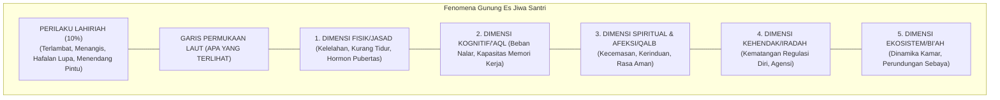

Ketika ditelusuri secara bijak oleh tim pengasuhan TUMBUH, fakta sesungguhnya di bawah permukaan Salman terungkap:
* Dua malam sebelumnya, ibu Salman dilarikan ke rumah sakit di kampung halamannya karena stroke mendadak. Kabar itu sampai ke telinga Salman lewat telepon singkat wali kelas pada hari Sabtu sore.
* Sepanjang malam Minggu dan malam Senin, hati Salman (*qalb*) dilanda badai kecemasan dan kesedihan yang mencekam. Ia menangis diam-diam di bawah selimutnya saat kawan-kawannya terlelap.
* Karena tidak bisa tidur nyenyak selama dua malam berturut-turut, fisik biologisnya (*jasad*) mengalami kelelahan saraf akut.
* Akibat badai kecemasan dan kekurangan tidur tersebut, hormon kortisol membanjiri otaknya, mematikan fungsi memori kerja (*'aql*) di hipokampusnya, sehingga hafalan yang sebenarnya sudah ia kuasai pada hari Jumat hilang seketika dari ingatannya.

Salman tidak sedang membangkang; jiwanya sedang menjerit meminta pertolongan!

Ketika seorang pembina menghukum anak seperti Salman dengan bentakan dan penghinaan di depan teman-temannya, pembina tersebut sesungguhnya sedang menaburkan garam ke atas luka jiwa anak yang sedang hancur. Ini adalah kezaliman pedagogis yang diakibatkan oleh kebutaan terhadap antropologi manusia.

---

### 4.2 Anatomi Jiwa dalam Khazanah Turats: Memahami Ruh, Qalb, 'Aql, dan Nafs

Di manakah letak keunggulan tradisi Islam dalam membedah jiwa manusia dibanding teori psikologi sekuler modern?

Psikologi Barat sekuler—yang berakar pada materialisme—mereduksi manusia semata-mata sebagai organisme biologis yang dikendalikan oleh impuls saraf dan kimiawi hormon. Jiwa dianggap tidak lebih dari sekadar aktivitas elektrokimiawi di dalam otak (*mind is merely brain*). Akibatnya, dimensi ketuhanan, sakralitas niat, dan kehidupan akhirat dihapuskan dari diskursus terapi kepribadian.

Sebaliknya, khazanah intelektual Islam yang diwariskan oleh **Hujjatul Islam Abu Hamid Al-Ghazali** dalam *Ihya' Ulumiddin* (khususnya *Kitab Syarh 'Aja'ib al-Qalb*) memberikan peta anatomi jiwa yang sangat komprehensif, presisi, dan berlapis-lapis[^2]:

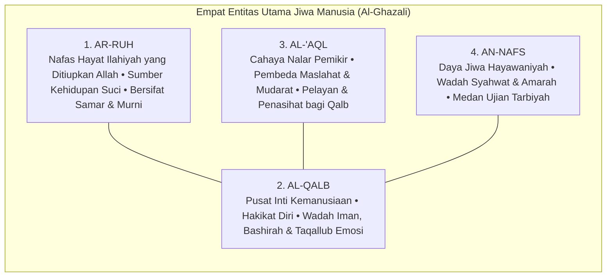

Mari kita bedah hakikat dan fungsi masing-masing komponen ini dalam kaitannya dengan pembinaan santri:

#### 1. Ar-Ruh (Hembusan Hayat Ilahiyah)
Ruh adalah rahasia ketuhanan (*amrun min amri Rabbi*, QS. Al-Isra': 85) yang ditiupkan Allah ke dalam janin manusia. Ruh adalah sumber kehidupan hakiki yang menjadikan manusia makhluk berkesadaran spiritual. Ruh senantiasa merindukan kesucian, membenci kezaliman, dan condong kepada Dzat Yang Menciptakannya. Di dalam diri setiap santri—bahkan yang paling sering melanggar sekalipun—ruh suci ini tetap ada; ia tidak pernah mati, melainkan hanya tertutupi oleh kabut tebal hawa nafsu.

#### 2. Al-Qalb (Poros Pengendali Kemanusiaan)
Imam Al-Ghazali menegaskan bahwa lafal *Al-Qalb* memiliki dua makna:
* **Makna Fisik-Organik**: Segumpal daging berbentuk kerucut di rongga dada sebelah kiri yang memompa darah ke seluruh tubuh.
* **Makna Hakiki-Spiritual (*Lathifah Rabbaniyyah Ruhaniyyah*)**: Inti terdalam kemanusiaan (*the spiritual subtle organ*), tempat bersemayamnya keimanan, niat, keikhlasan, rasa cinta, empati, dan pandangan mata batin (*bashirah*). Qalb inilah yang sesungguhnya diajak bicara oleh wahyu, yang dituntut bertanggung jawab di akhirat, dan yang menjadi raja atas seluruh anggota tubuh manusia.

Al-Qalb dinamai demikian karena sifatnya yang dinamis dan mudah berbolak-balik (*taqallub*). Pagi hari seorang santri bisa merasa sangat bersemangat beribadah, namun sore hari hatinya bisa dirundung kesedihan atau tergelincir godaan kemalasan. Tugas pengasuhan asrama adalah menghadirkan lingkungan (*bi'ah*) yang menjaga kemantapan hati santri agar senantiasa condong kepada kebaikan (*tsabatul qalb*).

#### 3. Al-'Aql (Cahaya Nalar dan Penimbang Nilai)
Akal adalah anugerah cahaya kognitif yang memampukan santri memahami teks wahyu, merenungkan akibat jangka panjang dari tindakannya, dan menimbang maslahat serta mudarat. Akal adalah penasihat setia bagi kalbu. Jika akal santri dilatih berpikir kritis dan merenungi ayat-ayat Allah, akal akan menjadi panglima yang menuntun raga memilih jalan ketakwaan. Namun jika akal dibiarkan tumpul dan dipaksa tunduk pada doktrin kepatuhan buta, akal akan kehilangan fungsinya sebagai benteng moral.

#### 4. An-Nafs (Wadah Gejolak Hayawaniyah)
Dalam terminologi tasawuf, *An-Nafs* adalah komponen kejiwaan yang menghimpun daya syahwat (hasrat biologis pada makanan, tidur, perhiasan duniawi) dan daya amarah (*ghadhab*—dorongan agresivitas dan pertahanan diri). Nafs adalah kendaraan raga di bumi; nafs tidak diciptakan untuk dimatikan atau dibunuh, melainkan untuk **ditundukkan dan disucikan (*tazkiyah*)** di bawah bimbingan akal dan kalbu.

---

### 4.3 Tiga Martabat Jiwa Remaja dalam Al-Qur'an

Al-Qur'an al-Karim mengabarkan bahwa pergulatan antara kalbu, akal, dan nafs melahirkan **tiga tingkatan dinamika kejiwaan (*Ahwal an-Nafs*)** yang dialami oleh setiap manusia, khususnya para remaja santri di asrama[^3]:

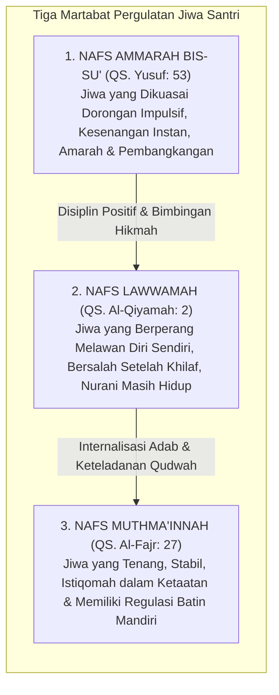

#### 1. Nafs Ammarah bis-Su' (Dorongan Primitif dan Impulsif)
$$\text{وَمَا أُبَرِّئُ نَفْسِي ۚ إِنَّ النَّفْسَ لَأَمَّارَةٌ بِالسُّوءِ إِلَّا مَا رَحِمَ رَبِّي}$$
> *"Dan aku tidak menyatakan diriku bebas dari kesalahan, karena sesungguhnya nafsu itu selalu mendorong kepada kejahatan, kecuali nafsu yang diberi rahmat oleh Rabb-ku..."* (QS. Yusuf [12]: 53)[^4]

Ini adalah kondisi kejiwaan dasar ketika dorongan biologis purba dan hawa nafsu menguasai kendali diri. Pada santri remaja, *nafs ammarah* termanifestasi dalam perilaku impulsif: ingin menang sendiri saat antre mandi, menyembunyikan makanan teman, berbohong demi menghindari tugas piket, atau melampiaskan amarah dengan memukul. Jika santri berada pada tahap ini, menghujamnya dengan hukuman yang menghinakan justru akan mengobarkan api amarahnya dan membuatnya semakin membangkang.

#### 2. Nafs Lawwamah (Gejolak Nurani dan Penyesalan Suci)
$$\text{وَلَا أُقْسِمُ بِالنَّفْسِ اللَّوَّامَةِ}$$
> *"Dan Aku bersumpah demi jiwa yang selalu menyesali (mencela) dirinya sendiri!"* (QS. Al-Qiyamah [75]: 2)[^5]

Allah ﷻ bersumpah dengan agung atas kemuliaan *Nafs Lawwamah*! Ini adalah tingkatan jiwa yang sangat istimewa pada usia remaja. Santri pada tahap ini mungkin saja tergelincir melakukan kesalahan adab karena godaan sesaat; namun begitu perbuatan itu selesai, dadanya terasa sesak, nuraninya bergetar mencela dirinya sendiri, dan ia diliputi oleh rasa penyesalan mendalam: *"Mengapa tadi aku membentak temanku? Ya Allah, ampuni dosaku..."*

Para pengasuh pesantren wajib menyadari: **Hadirnya rasa bersalah dan penyesalan pada diri seorang santri adalah bukti tak terbantahkan bahwa fitrah kebaikannya masih menyala terang!** 

Tugas pendidik saat santri berada dalam fase *lawwamah* bukanlah mempermalukannya di depan umum, melainkan merangkulnya dengan penuh kasih sayang, mengarahkannya untuk bertaubat (*taubat nasuha*), dan membimbingnya melakukan **restitusi nyata (memperbaiki kesalahan)**.

#### 3. Nafs Muthma'innah (Puncak Kedamaian dan Keteguhan Adab)
$$\text{يَا أَيَّتُهَا النَّفْسُ الْمُطْمَئِنَّةُ ۝ ارْجِعِي إِلَىٰ رَبِّكِ رَاضِيَةً مَّرْضِيَّةً}$$
> *"Wahai jiwa yang tenang! Kembalilah kepada Rabb-mu dengan hati yang rida dan diridai-Nya..."* (QS. Al-Fajr [89]: 27–28)[^6]

Inilah derajat kematangan tertinggi (*ar-rusyd*): jiwa yang telah mencapai ketenteraman mendalam (*thuma'ninah*). Gejolak syahwat dan amarah telah berhasil dijinakkan oleh cahaya iman dan nalar akal budi. Santri yang telah mencapai derajat ini beribadah dengan penuh kenikmatan batin, beradab luhur secara spontan (*malakah*), dan tetap teguh memegang nilai-nilai kebaikan sekalipun berada sendirian tanpa ada pengawasan musyrif.

---

### 4.4 Enam Dimensi Keutuhan Manusia dalam Arsitektur TUMBUH

Menolak reduksionisme perilaku, sistem TUMBUH memandang santri melalui **Lensa Enam Dimensi Holistik (*The Six Dimensions of Human Wholeness*)**[^7]:

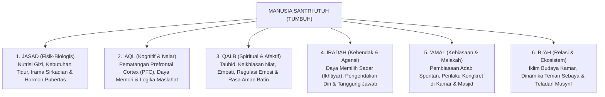

Mari kita urai keterkaitan dinamis keenam dimensi ini dalam kehidupan asrama 24 jam:

#### 1. Dimensi Jasmani (*Al-Jasad*)
Santri adalah makhluk berjasad fisik yang membutuhkan nutrisi halal dan bergizi seimbang, hidrasi air minum yang cukup, udara kamar yang bersih berventilasi, serta istirahat tidur yang cukup. Pada usia 12–18 tahun, tubuh remaja mengalami lonjakan hormon pertumbuhan (*growth spurt*) dan lonjakan hormon seks (testosteron dan estrogen) yang sangat masif. Mengabaikan keletihan fisik santri dan memaksakan beban hafalan di luar batas biologisnya adalah kezaliman terhadap hak tubuh (*Inna li jasidika 'alayka haqqan*).

#### 2. Dimensi Kognitif (*Al-'Aql*)
Pada fase remaja, bagian otak depan (*Prefrontal Cortex / PFC*) masih berada dalam fase konstruksi pematangan sinapsis (*pruning and myelination*). Neurosains membuktikan bahwa **sistem limbik (pusat dorongan emosi dan pencarian sensasi) matang jauh lebih awal dibandingkan PFC (pusat kendali rem impuls)**[^8]. Ketimpangan perkembangan ini menjelaskan mengapa santri remaja kerap bersikap nekat, berani mengambil risiko, dan mudah terhasut oleh teman sebaya. Santri bukan berniat jahat; rem biologis di otaknya memang belum sepenuhnya terpasang sempurna, sehingga ia mutlak membutuhkan bimbingan pendampingan eksternal (*scaffolding*) dari para pembina.

#### 3. Dimensi Spiritual dan Afektif (*Al-Qalb*)
Kebutuhan jiwa terdalam santri adalah **rasa aman (*psychological safety*)** dan **rasa diterima (*belonging*)**. Santri yang baru meninggalkan rumah orang tuanya kerap mengalami *homesickness* dan kecemasan terisolasi. Jika kebutuhan afektif ini diabaikan, kalbunya akan terkunci dalam mekanisme pertahanan diri, menjadikannya rentan memberontak atau depresi.

#### 4. Dimensi Kehendak dan Agensi (*Al-Iradah / Agency*)
Santri bukanlah robot yang perilakunya cukup dikendalikan oleh remote kontrol pengurus. Allah menciptakan manusia dengan daya memilih sadar (**Al-Ikhtiyar**). Disiplin sejati lahir ketika kehendak santri telah terlatih untuk memilih kebaikan atas dorongan tanggung jawab pribadi, bukan karena takut dipukul.

#### 5. Dimensi Amal dan Pembiasaan Karakter (*Al-'Amal wa Al-Malakah*)
Ibnu Miskawaih dalam *Tahdzib al-Akhlaq* dan Ibnu Khaldun dalam *Muqaddimah* menjelaskan bahwa karakter luhur (*al-khuluq al-hasan*) adalah **Al-Malakah**—yakni sifat kejiwaan yang tertanam kokoh sehingga perbuatan baik mengalir darinya secara spontan dan mudah tanpa perlu berpikir berat atau merasa terbebani[^9]. Malakah tidak lahir dari hafalan teori di kelas; malakah lahir dari amal kebajikan yang dipraktikkan secara konsisten berulang-ulang di asrama dalam atmosfer yang membahagiakan.

#### 6. Dimensi Relasi Sosial dan Lingkungan (*Al-Bi'ah*)
Santri tidak bertumbuh di ruang hampa. Iklim pergaulan di kamar asrama, kehangatan senyuman musyrif, serta budaya saling menghargai antarsantri (*Bi'ah Shalihah*) adalah rahim peradaban tempat karakter bersemi. Sehebat apa pun materi pengajian di kelas, jika kultur di lorong asrama sarat dengan caci maki dan perundungan, maka kultur asramalah yang akan memenangkan pembentukan karakter santri.

---

### 4.5 Studi Kasus Investigasi Multidimensi di Pesantren

Agar pemahaman antropologi ini menjadi panduan praktis bagi para pendidik, perhatikan bagaimana analisis multidimensi TUMBUH diterapkan pada kasus riil di bawah ini:

* **Laporan Masalah**: Santri Farhan (14 tahun, kelas 8) dilaporkan oleh musyrif kamar karena dalam sepekan terakhir sering melamun saat pengajian kitab kuning, tidak mengerjakan tugas terjemahan, dan kemarin sore melempar sandal ke arah teman sekamarnya hingga memicu pertengkaran.

```mermaid
graph TD
    M["Laporan Kasus: Farhan Melamun & Melempar Sandal"] --> U["AUDIT INVESTIGASI MULTIDIMENSI TUMBUH"]
    
    U --> F1["1. Uji Dimensi Jasmani<br/>Ditemukan: Farhan mengalami sakit gigi geraham berlubang yang membuatnya tidak bisa tidur selama 4 malam berturut-turut."]
    U --> F2["2. Uji Dimensi Kognitif<br/>Ditemukan: Materi nahwu bab I'lal terlalu abstrak baginya; ia mengalami kebingungan akut (cognitive overload) namun malu bertanya."]
    U --> F3["3. Uji Dimensi Afektif<br/>Ditemukan: Farhan merasa sangat tertekan dan takut dicap bodoh oleh kawan-kawannya."]
    U --> F4["4. Uji Dimensi Bi'ah / Relasi<br/>Ditemukan: Teman sekamarnya mengejeknya 'si gigi ompong' saat antre wudhu sore kemarin, memicu ledakan amarahnya melempar sandal."]
    U --> F5["5. Uji Dimensi Iradah<br/>Ditemukan: Farhan sebenarnya sangat menyesal melempar sandal, namun ia tidak tahu bagaimana cara meredakan rasa malunya."]
    
    F1 & F2 & F3 & F4 & F5 --> SOL["REKOMENDASI INTERVENSI EDUKATIF TERPADU:<br/>1. Pengobatan medis ke dokter gigi pondok.<br/>2. Bimbingan remedial kognitif privat bersama guru nahwu.<br/>3. Lingkaran restoratif kamar untuk menghentikan ejekan fisik.<br/>4. Farhan meminta maaf secara ksatria atas lemparan sandalnya."]
```

Bandingkan hasil di atas dengan metode penghukuman konvensional!
Jika kasus Farhan ditangani dengan cara lama: Farhan akan diseret ke depan umum, dicaci sebagai santri malas dan pembuat onar, lalu dihukum push-up 50 kali di lapangan. 
* *Akibatnya*: Gigi Farhan tetap sakit dan infeksi, materi nahwunya tetap tidak paham, ejekan teman sekamarnya semakin menjadi-jadi, dan dendam batinnya meledak menjadi kebencian kepada pesantren.

Dengan pendekatan antropologi multidimensi TUMBUH: sakit fisik Farhan disembuhkan, kebingungan kognitifnya diatasi dengan pendampingan belajar, perundungan di kamarnya dihentikan secara restoratif, dan martabat dirinya sebagai santri diselamatkan.

---

### 4.6 Dari Hakikat Insan Menuju Praksis Tarbiyah

Kita telah menuntaskan penjelajahan agung dalam **Bagian II**:
* Dalam **Bab 3**, kita telah menegakkan keadilan berpikir dan epistemologi terpadu antara wahyu, nalar, dan fakta empiris.
* Dalam **Bab 4**, kita telah membedah kedalaman jiwa santri: melampaui pucuk gunung es perilaku menuju keutuhan enam dimensi jasmani, kognitif, afektif, kehendak, amal, dan ekosistem.

Kini, pertanyaan terbesar dalam peradaban pendidikan kepesantrenan membentang di hadapan kita:
> **Jika manusia santri memiliki kedalaman jiwa dan dinamika perkembangan seperti itu, bagaimanakah cara kita mendidik, menuntun, dan mentransformasi karakternya secara berkelanjutan tanpa merusak fitrahnya?**
> **Bagaimanakah ilmu neurosains mutakhir berpadu dengan konsep Ta'dib para ulama salaf dalam merancang ekosistem keteladanan (Qudwah Hasanah) 24 jam?**

Inilah cakrawala baru yang akan kita bedah secara tuntas dalam **BAGIAN III: FALSAFAH TARBIYAH, PERKEMBANGAN, & KEPEMIMPINAN QUDWAH**.

---

### Catatan Kaki & Rujukan Akademik

[^1]: Abu Abdillah Muhammad bin Ismail Al-Bukhari, *Shahih al-Bukhari*, Kitab al-Iman, Bab Fadhl Man Istabra'a li Dinihi, hadits no. 52; Muslim bin al-Hajjaj an-Naisaburi, *Shahih Muslim*, Kitab al-Musaqah, Bab Akhdz al-Halal wa Tark asy-Syubuhat, hadits no. 1599.
[^2]: Abu Hamid Muhammad bin Muhammad Al-Ghazali, *Ihya' 'Ulum ad-Din* (Kairo: Dar al-Hadits, 2004), Jilid III, *Kitab Syarh 'Aja'ib al-Qalb*, hlm. 3–18.
[^3]: Ibnu Qayyim al-Jauziyyah, *Ighatsat al-Lahfan min Masha'id asy-Syaithan*, Tahqiq: Muhammad Hamid al-Fiqi (Beirut: Dar al-Ma'rifah, 1975), Jilid I, hlm. 74–85; Ibnu Qayyim al-Jauziyyah, *Ar-Ruh* (Beirut: Dar al-Kutub al-'Ilmiyyah, 1975), hlm. 210–235.
[^4]: Al-Qur'an al-Karim, Surah Yusuf [12]: 53.
[^5]: Al-Qur'an al-Karim, Surah Al-Qiyamah [75]: 2.
[^6]: Al-Qur'an al-Karim, Surah Al-Fajr [89]: 27–28.
[^7]: Repositori TUMBUH v2.0.0, Dokumen Fundamental: `01_FUNDAMENTAL/01_PHILOSOPHY/03_HUMAN_NATURE/02-Dimensi-dan-Struktur-Manusia.md` dan `03-Akal-Hati-Kehendak-dan-Agency.md`.
[^8]: Laurence Steinberg, *Age of Opportunity: Lessons from the New Science of Adolescence* (Boston: Mariner Books, 2015), hlm. 65–94; B.J. Casey, Rebecca M. Jones, & Todd A. Hare, "The Adolescent Brain", *Annals of the New York Academy of Sciences*, Vol. 1124 (2008), hlm. 111–126.
[^9]: Abu Ali Ahmad bin Muhammad Miskawaih, *Tahdzib al-Akhlaq wa Tath-hir al-A'raq*, Tahqiq: Dr. Imad al-Hilali (Beirut: Dar al-Kutub al-'Ilmiyyah, 2011), hlm. 35–42; Abdurrahman Ibnu Khaldun, *Al-Muqaddimah* (Damaskus: Dar Ya'rub, 2004), Jilid II, hlm. 298–305 mengenai pembentukan malakah melalui latihan berulang (*al-irtiyadh*).


---

# BAB 5: DINAMIKA PERKEMBANGAN JIWA DAN NEUROSAINS REMAJA
## Memahami Gejolak Maturasi Prefrontal Cortex, Sistem Limbik, dan Plastisitas Adab Santri

> *"Ketahuilah bahwa masa muda (as-syabab) adalah salah satu cabang dari kegilaan (syu'batun min al-junun), karena darah kemudaan yang mendidih mendorong jiwa untuk menerjang hawa nafsu tanpa memedulikan akibatnya, kecuali bagi mereka yang dianugerahi pemeliharaan dan taufik oleh Allah Ta'ala."*  
> — **Al-Imam Ibnu Qayyim al-Jauziyyah**, *Raudhatul Muhibbin wa Nuzhatul Musytaqin*[^1]

---

### 5.1 Paradoks Remaja Asrama: Mesin Balap Ferrari dengan Rem Sepeda

Setiap tahun ajaran baru tiba di pesantren, ribuan anak berusia antara dua belas hingga lima belas tahun melangkahkan kaki melewati pintu gerbang asrama. Di hadapan para asatidz, berdirilah sosok-sosok santri yang secara fisik tampak telah beranjak dewasa: suara mereka mulai memberat, kumis tipis mulai tumbuh di atas bibir mereka, dan tinggi badan mereka bahkan kerap melampaui tinggi tubuh para pembina mereka.

Namun, di balik perawakan fisik yang tampak gagah tersebut, sebuah misteri perilaku harian kerap membuat para musyrif mengurut dada karena kehabisan kesabaran:
* Mengapa seorang santri yang secara fasih mampu menghafal bab *Jinayat* di kelas syariat, pada sore harinya dengan santai melompat dari lantai dua asrama ke atas tumpukan kasur hanya demi membuat kawan-kawannya tertawa?
* Mengapa santri yang begitu sopan saat berbicara berdua dengan guru, seketika berubah menjadi sosok yang bising, nekat, dan melanggar jam malam saat berada di tengah kelompok teman sebayanya?
* Mengapa teguran yang diucapkan berulang kali seolah-olah "masuk telinga kanan dan keluar telinga kiri" tanpa membekas menjadi tindakan nyata?

Kekecewaan para pembina asrama kerap meledak dalam kalimat makian yang menyudutkan: *"Kamu ini badannya saja yang sudah sebesar raksasa, kumis sudah tumbuh, tapi kelakuan dan otakmu masih seperti anak balita!"*

Kemarahan semacam ini lahir dari **kebutaan biologis terhadap hakikat perkembangan saraf remaja (*adolescent brain development*)**.

Para ilmuwan neurosains kognitif terkemuka dunia, seperti Prof. Laurence Steinberg dan Dr. B.J. Casey, merumuskan sebuah analogi yang sangat presisi untuk menggambarkan kondisi biologis otak remaja usia santri: **Remaja adalah sebuah mobil balap berkecepatan tinggi dengan mesin Ferrari bertenaga monster, namun rem yang terpasang pada rodanya hanyalah rem sepeda ontel yang rapuh (*a car with a Ferrari engine but bicycle brakes*)**[^2].

```mermaid
graph TD
    subgraph DUAL_SYSTEMS_MODEL["Model Sistem Ganda Otak Remaja (Steinberg & Casey)"]
        direction TB
        L["1. SISTEM SOSIO-EMOSIONAL / LIMBIK (MESIN FERRARI)<br/>• Amigdala & Nukleus Akumbens<br/>• Dipicu Lonjakan Hormon Pubertas (Usia 11–13 Tahun)<br/>• Mencari Sensasi Ekstrem, Pengakuan Teman Sebaya, Hasrat Dopamin Tinggi"]
        
        P["2. SISTEM KONTROL KOGNITIF / PREFRONTAL CORTEX (REM SEPEDA)<br/>• Korteks Prafrontal (PFC)<br/>• Pusat Kendali Impuls, Nalar Jangka Panjang, Regulasi Emosi<br/>• Baru Matang Sempurna pada Usia 24–25 Tahun!"]
        
        L -.->|Terjadi Kesenjangan Maturasi 10 Tahun!| P
    end
```

Secara sunnatullah penciptaan biologis:
1. **Mesin Penggerak Emosi (Sistem Limbik)** yang memicu pencarian sensasi (*novelty seeking*), dorongan keberanian mengambil risiko (*risk-taking behavior*), dan kebutuhan mendesak untuk diakui oleh kelompok teman sebaya (*peer approval*) melonjak sangat cepat begitu santri memasuki masa pubertas (usia 11–13 tahun).
2. Sebaliknya, **Sistem Pengereman Moral (Prefrontal Cortex / PFC)** yang bertugas mengendalikan hawa nafsu, menahan amarah, dan memikirkan konsekuensi jangka panjang dari sebuah perbuatan berjalan dengan sangat lambat. PFC adalah organ terakhir dalam tubuh manusia yang mengalami pematangan biologis sempurna, yakni baru tuntas pada usia **dua puluh empat hingga dua puluh lima tahun**[^3].

Kesenjangan biologis (*developmental mismatch*) selama hampir satu dekade inilah yang menjelaskan mengapa santri remaja sangat rentan tergelincir melakukan tindakan ceroboh. Mereka melompat dari balkon bukan karena mereka berwatak kriminal atau berniat jahat; mereka melompat karena amigdala dan nukleus akumbens mereka sedang dibanjiri hormon dopamin yang menuntut sensasi kegembiraan instan, sementara rem PFC mereka belum cukup kuat untuk membisikkan: *"Jangan lakukan itu, tulang kakimu bisa patah!"*

Dalam ekosistem **TUMBUH**, para asatidz dan musyrif disadarkan akan peran sakral mereka: **Para pendidik adalah Prefrontal Cortex Eksternal (*External PFC*) bagi santri-santrinya**. Karena rem biologis di dalam kepala santri belum terpasang sempurna, maka kehadiran musyriflah yang berfungsi sebagai rem pengaman: menuntun dengan ketegasan yang tenang, memasang batas-batas lingkungan yang aman, dan mendampingi proses latihan pengendalian diri santri dengan penuh kesabaran hikmah.

---

### 5.2 Plastisitas Saraf dan Jendela Emas Usia Pesantren: Mengukir di Atas Batu

Rasulullah ﷺ menyampaikan sebuah perumpamaan agung yang telah berusia empat belas abad, namun maknanya semakin berkilau di bawah sorotan mikroskop sains modern:

$$\text{مَثَلُ الَّذِي يَتَعَلَّمُ فِي صِغَرِهِ كَالنَّقْشِ عَلَى الْحَجَرِ، وَمَثَلُ الَّذِي يَتَعَلَّمُ فِي كِبَرِهِ كَالَّذِي يَكْتُبُ عَلَى الْمَاءِ}$$

> *"Perumpamaan orang yang belajar di masa mudanya adalah laksana mengukir di atas batu karang, sedangkan perumpamaan orang yang belajar di masa tuanya adalah laksana menulis di atas air."*  
> (HR. At-Thabarani dalam *Al-Mu'jam al-Kabir* dan Al-Baihaqi dalam *Syu'abul Iman*)[^4]

Mengapa pembelajaran di masa muda santri diibaratkan laksana **mengukir di atas batu (*an-naqsyi 'ala al-hajar*)**?

Jawabannya terletak pada fenomena biologis yang disebut **Neuroplastisitas Remaja (*Adolescent Neuroplasticity*)** dan **Pemangkasan Sinapsis (*Synaptic Pruning*)**.

Di masa pubertas dan remaja, otak santri sedang mengalami rekonstruksi arsitektural terdahsyat kedua sepanjang hidupnya (setelah masa balita). Otak memproduksi miliaran cabang sinapsis baru, lalu melakukan seleksi alamiah berdasarkan hukum biologi saraf:

$$\text{“Neurons that fire together, wire together; neurons that don't, are pruned away.”}$$

> *"Jaringan sel saraf yang menyala bersama-sama secara berulang akan tersambung secara permanen menjadi sirkuit watak; sementara jaringan sel saraf yang tidak pernah diaktifkan akan dipangkas dan dimatikan oleh otak."*[^5]

```mermaid
graph LR
    subgraph JALUR_TEROR["1. Jika Asrama Dipenuhi Teror & Bentakan"]
        direction TB
        J1["Amigdala Menyala Terus-Menerus"] --> J2["Penguatan Sirkuit Ketakutan & Agresi"]
        J2 --> J3["Karakter Dewasa: Paranoid, Pemarah, Hipokrit & Keras Hati"]
    end

    subgraph JALUR_TUMBUH["2. Jika Asrama Dipenuhi Bi'ah Shalihah TUMBUH"]
        direction TB
        T1["PFC & Sirkuit Empati Dilatih Tiap Hari"] --> T2["Mielinisasi Sirkuit Sabar, Thuma'ninah & Nalar"]
        T2 --> T3["Karakter Dewasa: Tenang, Beradab Spontan, Kokoh & Berintegritas"]
    end
```

Masa santri tinggal di asrama (usia 12 hingga 18 tahun) adalah **Jendela Plastisitas Kritis (*Critical Window of Opportunity*)**:
* Apabila selama enam tahun di asrama, sirkuit saraf yang setiap hari diaktifkan oleh pengasuh adalah **sirkuit amigdala (ketakutan, kecurigaan, dendam, dan kemunafikan akibat bentakan dan hukuman fisik)**, maka otak santri akan mempertebal jalur saraf tersebut dengan selubung lemak mielin (*myelination*). Anak itu kelak akan tumbuh dewasa menjadi pribadi yang paranoid, mudah panik, pemarah, dan memperlakukan anak-buahnya dengan kekejaman yang sama saat ia memimpin kelak.
* Sebaliknya, apabila selama enam tahun di asrama, santri dilatih meregulasi emosinya saat marah, dibimbing menyelesaikan konflik dengan dialog restoratif, diajak bangun malam dengan kehangatan cinta, dan dibiasakan memikirkan maslahat umat, maka otak santri sedang **mengukir sirkuit sabar, empati, dan muraqabatullah di atas batu neokorteksnya**. Sirkuit adab itulah yang akan menjadi watak permanen (*malakah*) yang tidak akan pernah luntur hingga akhir hayatnya.

Maka bergetarlah wahai para pendidik! Setiap perkataan yang kita ucapkan dan setiap perlakuan yang kita berikan kepada santri di lorong asrama bukanlah peristiwa yang hilang ditelan angin; setiap perlakuan itu secara fisik sedang **memahat arsitektur biologis otak generasi penerus umat**.

---

### 5.3 Karakteristik Perkembangan Non-Linier: Fenomena Regresi Perkembangan Semu

Banyak pengurus pesantren dan musyrif kamar memiliki ekspektasi yang keliru terhadap dinamika pertumbuhan karakter santri. Mereka membayangkan bahwa perkembangan adab santri akan bergerak laksana **garis lurus menanjak tanpa jeda (*linear progression*)**: bulan pertama santri paham wudhu, bulan kedua tertib bangun subuh, bulan ketiga rajin puasa daud, dan seterusnya tanpa pernah mundur ke belakang.

Ketika pada bulan keempat santri yang awalnya tampak sangat tertib tiba-tiba mengalami kemerosotan—ia mulai terlambat masuk kelas, malas merapikan kasurnya, atau menangis ingin pulang—para pembina kerap merasa frustrasi dan putus asa: *"Percuma dididik! Santri ini ternyata tidak ada perubahan, makin lama di pondok kelakuannya malah makin rusak!"*

Penilaian tersebut adalah kekeliruan besar. Dalam psikologi perkembangan (*Developmental Psychology*), pertumbuhan manusia diakui secara universal **TIDAK PERNAH BERJALAN LINIER**[^6]. 

Pertumbuhan jiwa santri bergerak laksana gelombang spiral yang dinamis: maju dua langkah, tertahan sejenak, terkadang mundur satu langkah untuk menghimpun kekuatan, lalu melompat maju tiga langkah ke depan:

```mermaid
graph TD
    A["Fase Adaptasi Awal (Semangat Baru & Kepatuhan Permukaan)"] --> B["Fase Lonjakan Tuntutan (Ujian, Beban Hafalan Meningkat)"]
    B --> C["REGRESI PERKEMBANGAN SEMU (DEVELOPMENTAL REGRESSION)<br/>(Santri Tampak Rewel, Melanggar Aturan Kecil, Menarik Diri)"]
    
    C -->|Respons Lama: Dibentak & Dihukum Keras| D["Trauma Kronis, Karakter Patah & Putus Asa"]
    C -->|Respons TUMBUH: Scaffolding, Dialog & Dukungan Nutrisi-Istirahat| E["KONSOLIDASI JIWA & MATURASI BARU<br/>(Melompat ke Derajat Kemandirian yang Lebih Tinggi)"]
```

Fenomena ini dikenal dalam sains perkembangan sebagai **Regresi Perkembangan Semu (*Developmental Regression in Service of the Ego*)**. 

Ketika seorang santri sedang bersiap melangkah ke tingkat kematangan kognitif atau sosial yang lebih kompleks—misalnya ia baru saja dipindahkan ke jenjang kemandirian yang lebih tinggi, atau baru menghadapi beban hafalan matan yang sangat berat—sistem saraf otaknya mengalami kelebihan beban sementara (*temporary cognitive and emotional overload*). Dalam kondisi tersebut, tubuh biologisnya secara alami mencari rasa aman dengan memunculkan kembali perilaku-perilaku kekanak-kanakan masa lalu: mengompol kembali, menangis rindu ibu, atau bersikap manja dan mencari perhatian musyrif secara berlebihan.

Jika musyrif merespons fase regresi ini dengan amarah dan sanksi fisik, santri akan merasa ditolak dan mengalami luka batin yang dalam. 

Namun jika musyrif memahami antropologi perkembangan TUMBUH, musyrif akan menyikapi fase regresi ini dengan senyuman ketenangan: *"Ini bukan tanda kegagalan; ini adalah tanda bahwa jiwa anak ini sedang bertarung menata struktur kapasitas barunya. Yang ia butuhkan saat ini bukanlah hukuman, melainkan sandaran pelukan ketenangan (*scaffolding*) agar sistem sarafnya kembali stabil."*

---

### 5.4 Tiga Kebutuhan Psikologis Dasar Santri Remaja (Self-Determination Theory)

Mengapa banyak santri di asrama kehilangan gairah belajar (*demotivated*), apatis terhadap program pondok, atau memberontak secara diam-diam?

Prof. Richard Ryan dan Edward Deci dalam teori motivasi paling berpengaruh di dunia, **Self-Determination Theory (SDT)**, membuktikan bahwa jiwa manusia remaja hanya akan bertumbuh secara sehat dan termotivasi dari dalam (*intrinsically motivated*) jika **Tiga Kebutuhan Psikologis Dasar (*Basic Psychological Needs*)** terpenuhi oleh lingkungannya[^7]:

```mermaid
graph TD
    subgraph TIGA_KEBUTUHAN_JIWA["Tiga Kebutuhan Psikologis Asasi Santri (SDT)"]
        O["1. OTONOMI (AUTONOMY)<br/>Kebutuhan Merasa Memiliki Pilihan Sadar & Tidak Selalu Dikendalikan Seperti Robot"]
        K["2. KOMPETENSI (COMPETENCE)<br/>Kebutuhan Merasa Mampu Menguasai Tantangan, Melihat Kemajuan Diri & Dihargai Usahanya"]
        R["3. KETERIKATAN / KASIH SAYANG (RELATEDNESS)<br/>Kebutuhan Merasa Diterima, Dicintai, Aman & Memiliki Saudara yang Tulus"]
    end

    O --> S["IKLIM ASRAMA PESANTREN TUMBUH"]
    K --> S
    R --> S

    S --> M["Lahirnya Santri Mandiri, Cinta Ilmu, Beradab Otentik & Tangguh"]
```

Mari kita bedah bagaimana ketiga kebutuhan ini wajib dihidupkan di lingkungan pesantren 24 jam:

#### 1. Kebutuhan Otonomi (*Autonomy*)
Otonomi **bukanlah** kebebasan liar tanpa batas (*unbridled freedom*). Otonomi bermakna **dorongan batin untuk bertindak atas dasar kemauan sadar, bukan karena pemaksaan dari luar**. Santri remaja memiliki kebutuhan biologis untuk merasakan bahwa suaranya didengar dan pilihannya dihargai.

Pesantren yang mematikan otonomi memperlakukan santri laksana pion catur: santri tidak pernah diberi ruang memilih, tidak pernah diajak bermusyawarah, dan seluruh jadwalnya diatur hingga menit demi menit tanpa ada ruang bernapas. Akibatnya, santri merasa hidupnya dijajah, melahirkan sikap pasif-agresif atau pemberontakan liar saat pengawas lengah.

Dalam ekosistem TUMBUH, otonomi santri dilatih secara bertahap:
* Santri dilibatkan dalam menentukan pembagian tugas kebersihan kamar bersama teman-temannya.
* Santri diberi ruang memilih target capaian hafalan hariannya dalam rentang yang proporsional.
* Santri diajak berdialog mengenai hikmah di balik aturan, sehingga ia menaati aturan tersebut bukan karena terpaksa, melainkan karena ia **memilih untuk sepakat** bahwa aturan itu baik bagi keselamatannya.

#### 2. Kebutuhan Kompetensi (*Competence*)
Setiap santri haus akan rasa pencapaian: *"Aku mampu! Usahaku ada hasilnya!"*

Tragedi di sebagian pesantren adalah digunakannya kurikulum yang menerapkan satu ukuran seragam (*one size fits all*). Santri yang memiliki bakat linguistik dipuji setinggi langit, sementara santri yang lambat dalam nahwu namun sangat terampil dalam kepemimpinan sosial dan seni kaligrafi dicap sebagai "santri bodoh tak berguna". Santri yang merasa dirinya selalu gagal (*learned helplessness*) akan segera mematikan usahanya dan melampiaskan rasa rendah dirinya melalui kenakalan asrama.

TUMBUH merancang sistem penjenjangan yang mengakui keberagaman fitrah (*multiple intelligences*). Kemajuan santri tidak dibandingkan secara kejam dengan santri lain (*norm-referenced comparison*), melainkan dibandingkan dengan rekam jejak dirinya sendiri di masa lalu (*ipsative progress*). Sekecil apa pun kemajuan adab yang ditunjukkan oleh seorang santri diapresiasi secara tulus oleh pembina, memantik hormon dopamin alami yang mendorongnya untuk terus belajar.

#### 3. Kebutuhan Keterikatan dan Kasih Sayang (*Relatedness / Belonging*)
Inilah kebutuhan yang paling menentukan bagi kelangsungan jiwa santri di asrama. Santri remaja rela melakukan apa saja—bahkan hal-hal yang berbahaya sekalipun—demi merasa **diterima dan tidak dikucilkan oleh kelompok teman sebayanya**.

Jika ekosistem pesantren dingin, sarat dengan kecurigaan antar-kamar, dan para musyrifnya bersikap menjaga jarak laksana komandan militer, santri akan mengalami kelaparan emosional (*emotional starvation*). Kelaparan emosional inilah yang menjadi akar subur merebaknya geng-geng asrama liar, solidaritas sempit senioritas, hingga hubungan pertemanan menyimpang (*toxic attachment*).

TUMBUH merancang arsitektur asrama sebagai sebuah **Keluarga Besar Ruhaniyah (*Bi'ah Ukhuwwah*)**:
* Musyrif hadir sebagai sosok pengganti ayah (*in loco parentis*) yang hangat dan dapat didekati kapan saja.
* Tradisi makan bersama dalam satu nampan (*talam halaqah*), lingkaran muhasabah saling mendoakan sebelum tidur, serta kultur saling memaafkan dihidupkan sebagai ritual harian yang mengikat hati mereka dalam ukhuwah imaniyah yang kokoh.

---

### 5.5 Integrasi Turats: Tahapan Tamyiz, Murahaqah, dan Baligh dalam Fiqh Tarbiyah

Bagaimanakah khazanah keilmuan Islam memetakan perjalanan usia remaja ini? Jauh sebelum psikologi Barat merumuskan teori perkembangan, para fukaha dan pakar adab Islam telah membagi perjalanan hidup manusia ke dalam tahapan-tahapan yang sangat runtut[^8]:

```mermaid
graph LR
    subgraph TAHAPAN_USIA_TURATS["Tahapan Usia Santri dalam Tradisi Islam"]
        T1["1. SHIBA (Kanak-kanak Awal)<br/>Usia 0–7 Tahun: Bermain, Kehangatan Ibu & Belum Ada Beban Hukum"]
        T2["2. TAMYIZ (Kecerdasan Membedakan)<br/>Usia 7–10 Tahun: Mulai Dilatih Shalat & Dibiasakan Adab Dasar Lahiriah"]
        T3["3. MURAHAQAH (Masa Transisi Remaja Menjelang Baligh)<br/>Usia 11–15 Tahun: Pematangan Hormon, Pergolakan Jiwa & Latihan Memikul Beban"]
        T4["4. BULUGH & RUSYD (Kematangan Taklif Syariat)<br/>Usia 15+ Tahun: Mukallaf Penuh, Menanggung Dosa Sendiri & Menuju Kemandirian Moral"]
    end

    T1 --> T2 --> T3 --> T4
```

Para ulama menaruh perhatian yang teramat mendalam pada masa **Al-Murahaqah** (kata yang berakar dari *ra-ha-qa* yang bermakna mendekat, terburu-buru, atau tertutup). Di fase transisi inilah syariat menetapkan sebuah metode pembinaan yang luar biasa proporsional:

Rasulullah ﷺ bersabda dalam hadits pedoman pengasuhan yang sangat populer:

$$\text{مُرُوا أَوْلَادَكُمْ بِالصَّلَاةِ وَهُمْ أَبْنَاءُ سَبْعِ سِنِينَ، وَاضْرِبُوهُمْ عَلَيْهَا وَهُمْ أَبْنَاءُ عَشْرِ سِنِينَ، وَفَرِّقُوا بَيْنَهُمْ فِي الْمَضَاجِعِ}$$

> *"Perintahkanlah anak-anakmu mendirikan salat ketika mereka berusia tujuh tahun; dan berikan ketegasan (evaluasi tegas) atas kelalaian mereka saat berusia sepuluh tahun; serta pisahkanlah tempat-tempat tidur mereka."*  
> (HR. Abu Dawud no. 495 dan Ahmad no. 6689, sanad hasan)[^9]

Perhatikan hikmah pedagogis tingkat tinggi di balik hadits ini!
1. **Masa Latihan Tiga Tahun Penuh (Usia 7 hingga 10 Tahun)**:  
   Antara usia tujuh hingga sepuluh tahun terdapat rentang waktu **tiga tahun penuh (lebih dari 1.000 hari dan 5.000 kali salat fardhu)**! Dalam kurun waktu tiga tahun tersebut, perintah salat dilakukan dengan **kelemahlembutan, pengulangan yang sabar, pujian, dan pembiasaan tanpa kekerasan**. Anak dilatih membiasakan raga biologisnya terbiasa dengan ritme wudhu dan sujud.
2. **Makna Ketegasan pada Usia Sepuluh Tahun**:  
   Ketika anak telah berusia sepuluh tahun dan telah dilatih selama 5.000 kali salat namun masih malas, barulah syariat mengizinkan adanya ketegasan. Namun para fukaha—seperti Imam Asy-Syafi'i dan Imam An-Nawawi—menegaskan dengan sangat ketat batas-batas ketegasan tersebut: *dharbun ghairu mubarrih* (bukan pukulan yang melukai fisik, bukan pukulan di wajah, tidak boleh meninggalkan bekas memar, tidak boleh mematahkan tulang, dan semata-mata bersifat teguran simbolik untuk menyadarkan keseriusan taklif, bukan pelampiasan nafsu amarah)*[^10].
3. **Pemisahan Tempat Tidur (*Farriquu Bainahum fil-Madhaaji'*)**:  
   Ini adalah ketetapan preventif (*environmental safeguarding*) yang sangat agung. Pada usia sepuluh tahun, syariat memerintahkan pemisahan tempat tidur untuk menjaga kesucian pandangan, privasi tubuh, serta mencegah timbulnya gejolak seksual prematur di antara anak-anak asrama.

Pemahaman turats ini menegaskan bahwa: **Islam tidak pernah membenarkan metode "kekerasan instan"**. Sebelum sebuah sanksi tegas dijatuhkan, syariat menuntut adanya proses pengajaran yang berulang, pendampingan yang sabar, dan penataan lingkungan yang aman.

Memahami dinamika biologis dan ruhaniyah remaja ini menjadi pijakan kokoh bagi kita untuk melangkah ke bab berikutnya: bagaimanakah konsep Tarbiyah, Ta'dib, dan Ta'lim dirajut menjadi sebuah ekosistem keteladanan yang hidup (*Qudwah Hasanah*) di asrama 24 jam? 

Inilah yang akan kita jelajahi dalam **Bab 6: Falsafah Tarbiyah, Ta'dib, dan Ekosistem Keteladanan**.

---

### Catatan Kaki & Rujukan Akademik

[^1]: Ibnu Qayyim al-Jauziyyah, *Raudhatul Muhibbin wa Nuzhatul Musytaqin*, diedit oleh Sabir al-Kasyf (Kairo: Dar al-Hadits, 2003), hlm. 182–186.
[^2]: Laurence Steinberg, *Age of Opportunity: Lessons from the New Science of Adolescence* (Boston: Mariner Books, 2015), hlm. 45–72; B.J. Casey, "Beyond Simple Models of Self-Control to Circuit-Based Accounts of Adolescent Behavior", *Annual Review of Psychology*, Vol. 66 (2015), hlm. 295–319.
[^3]: Jay N. Giedd dkk., "Brain Development During Childhood and Adolescence: A Longitudinal MRI Study", *Nature Neuroscience*, Vol. 2, No. 10 (1999), hlm. 861–863; Nitin Gogtay dkk., "Dynamic Mapping of Human Cortical Development during Childhood through Early Adulthood", *Proceedings of the National Academy of Sciences (PNAS)*, Vol. 101, No. 21 (2004), hlm. 8174–8179.
[^4]: Sulaiman bin Ahmad Ath-Thabarani, *Al-Mu'jam al-Kabir* (Kairo: Maktabah Ibn Taimiyyah, 1994), hadits no. 8645; Abu Bakr Ahmad bin Husain Al-Baihaqi, *Syu'abul Iman* (Riyadh: Maktabah ar-Rusyd, 2003), hadits no. 1658 dari Abu Hurairah dan Hasan Al-Bashri secara mursal shahih lighairihi.
[^5]: Carla J. Shatz, "Impulse Activity and the Patterning of Connections during CNS Development", *Neuron*, Vol. 5, No. 6 (1990), hlm. 745–756; Donald O. Hebb, *The Organization of Behavior: A Neuropsychological Theory* (New York: John Wiley & Sons, 1949).
[^6]: Robert B. Cairns & Beverley D. Cairns, *Lifelines and Risks: Pathways of Youth in Our Time* (Cambridge: Cambridge University Press, 1994), hlm. 88–115; Esther Thelen & Linda B. Smith, *A Dynamic Systems Approach to the Development of Cognition and Action* (Cambridge: MIT Press, 1994).
[^7]: Richard M. Ryan & Edward L. Deci, *Self-Determination Theory: Basic Psychological Needs in Motivation, Development, and Wellness* (New York: The Guilford Press, 2017), hlm. 80–125; Edward L. Deci & Richard M. Ryan, "The 'What' and 'Why' of Goal Pursuits: Human Needs and the Self-Determination of Behavior", *Psychological Inquiry*, Vol. 11, No. 4 (2000), hlm. 227–268.
[^8]: Abu Hamid Muhammad bin Muhammad Al-Ghazali, *Ihya' 'Ulum ad-Din*, Jilid III, *Kitab Riyadhat an-Nafs wa Tahdzib al-Akhlaq* (Kairo: Dar al-Hadits, 2004), hlm. 62–75; Ibnu Jama'ah, *Tadzkirat as-Sami' wa al-Mutakallim fi Adab al-'Alim wa al-Muta'allim* (Beirut: Dar al-Basyair al-Islamiyyah, 2012), hlm. 48–65.
[^9]: Abu Dawud Sulaiman bin al-Asy'ats as-Sijistani, *Sunan Abi Dawud*, Kitab ash-Shalah, Bab Mata Yu'maru al-Ghulam bi ash-Shalah, hadits no. 495; Ahmad bin Hanbal, *Al-Musnad*, hadits no. 6689, disahihkan oleh Al-Albani dalam *Shahih Abi Dawud*.
[^10]: Abu Zakariya Muhyiddin Yahya bin Syaraf An-Nawawi, *Al-Majmu' Syarh al-Muhadzdzab* (Kairo: Idarah ath-Thiba'ah al-Muniriyyah, 1344 H), Jilid III, hlm. 11–14; Syamsuddin Muhammad bin Abi al-Abbas Ar-Ramli, *Nihayat al-Muhtaj ila Syarh al-Minhaj* (Beirut: Dar al-Fikr, 1984), Jilid I, hlm. 385–388.


---

# BAB 6: FALSAFAH TARBIYAH, TA'DIB, DAN EKOSISTEM KETELADANAN
## Menghidupkan Sunnah Qudwah Hasanah dan Mentransformasi Budaya Pengasuhan Pesantren 24 Jam

> لَقَدْ كَانَ لَكُمْ فِي رَسُولِ اللَّهِ أُسْوَةٌ حَسَنَةٌ لِمَنْ كَانَ يَرْجُو اللَّهَ وَالْيَوْمَ الْآخِرَ وَذَكَرَ اللَّهَ كَثِيرًا
>
> *"Sungguh telah ada pada diri Rasulullah itu suri teladan yang mulia (qudwah hasanah) bagimu, yaitu bagi orang yang mengharap rahmat Allah dan kedatangan hari kiamat serta banyak mengingat Allah."*  
> — **Al-Qur'an al-Karim**, Surah Al-Ahzab [33]: 21[^1]

---

### 6.1 Dekonstruksi Konseptual: Membedah Ta'lim, Tarbiyah, Ta'dib, dan Irsyad

Di sebagian besar lingkungan pesantren kontemporer, kata "pendidikan" kerap disederhanakan menjadi sekadar jadwal masuk kelas dan penyelesaian kurikulum kitab kuning. Seorang kyai atau direktur pengasuhan merasa tugas pendidikannya telah tuntas apabila seluruh jadwal pengajian telah terisi guru, para santri telah membeli kitab matan, dan bel masuk telah berbunyi tepat waktu.

Namun, dalam khazanah intelektual peradaban Islam, istilah pendidikan memiliki kekayaan dimensi semantik yang sangat dalam. Ketiadaan ketepatan pemahaman terhadap istilah-istilah ini melahirkan kekacauan praksis di asrama.

Prof. Dr. Syed Muhammad Naquib al-Attas dan para pakar pendidikan Islam membedah empat pilar peristilahan utama yang mendasari proses pembinaan manusia[^2]:

```mermaid
graph TD
    subgraph EMPAT_DIMENSI_PENDIDIKAN_ISLAM["Empat Dimensi Tarbiyah Peradaban"]
        TL["1. TA'LIM<br/>(Pengalihan Informasi & Pengetahuan Kognitif)<br/>Mengetahui Halal-Haram, Kaidah Nahwu, Hafalan Matan"]
        TR["2. TARBIYAH<br/>(Pengasuhan, Pemeliharaan & Penumbuhan Potensi)<br/>Merawat Jasmani, Menjaga Gizi, Menumbuhkan Bakat Alami"]
        TD["3. TA'DIB<br/>(Penanaman Adab, Disiplin Batin & Keadilan Jiwa)<br/>Mengenali Tempat yang Hak, Hormat pada Nilai, Integrasi Akhlak"]
        IR["4. IRSYAD / WA'ZH<br/>(Bimbingan Ruhani, Nasihat Nurani & Doa Kebajikan)<br/>Menyentuh Kalbu, Mengingatkan Akhirat, Membangunkan Kesadaran"]
    end

    TL --> S["ARSITEKTUR PEMBINAAN UTUH SANTRI TUMBUH"]
    TR --> S
    TD --> S
    IR --> S
```

#### 1. At-Ta'lim (Pengajaran Kognitif)
Berasal dari akar kata *'a-li-ma* (mengetahui). Ta'lim adalah proses transfer informasi intelektual, data keilmuan, dan keterampilan metodologis dari seorang guru kepada murid. Santri yang menjalani proses *ta'lim* menjadi tahu apa yang sebelumnya tidak ia ketahui: ia hafal bait *Jurumiyyah*, menguasai arti kosa kata bahasa Arab, dan memahami hukum-hukum fikih bersuci. 

Namun, **Ta'lim semata-mata baru menyentuh wilayah kepala (*kognitif*)**. Betapa banyak orang yang memiliki keluasan ilmu (*'alim*), hafal dalil-dalil adab, namun perilakunya kasar, culas, sombong, dan gemar menzalimi sesamanya. Kognisi tanpa adab adalah racun peradaban.

#### 2. At-Tarbiyah (Pengasuhan dan Penumbuhan Potensi)
Berasal dari akar kata *ra-ba-ya-rbu* (bertambah, berkembang) atau *rabba-yarubbu* (mengasuh, memelihara). Tarbiyah bermakna merawat, memberi makan, melindungi, dan menumbuhkan potensi fisik serta bakat alami anak secara bertahap hingga mencapai kematangannya. 

Tarbiyah adalah tugas pemeliharaan ekosistem: memastikan santri makan makanan halal bergizi, kamarnya bersih berventilasi, pakaiannya rapi, dan fisiknya terlindungi dari ancaman bahaya. Namun, jika pendidikan hanya berhenti pada *tarbiyah* fisik-biologis tanpa penanaman nilai rohani, proses tersebut tidak berbeda dengan peternakan yang memelihara tubuh materi semata.

#### 3. At-Ta'dib (Inti Sejati Pendidikan Islam)
Inilah istilah yang ditegaskan oleh Prof. Naquib al-Attas sebagai **definisi paling tepat dan komprehensif bagi pendidikan Islam**. Kata *Ta'dib* berakar dari kata **Adab**. 

Sebagaimana disabdakan oleh baginda Nabi ﷺ:

$$\text{أَدَّبَنِي رَبِّي فَأَحْسَنَ تَأْدِيبِي}$$

> *"Rabb-ku telah mendidik adab kepadaku (addabani), maka Dia telah memperbagus pendidikanku."*  
> (HR. As-Sam'ani dan Ibnu Sam'un, makna hadits disepakati keshahihan kandungannya oleh para ulama)[^3]

Adab dalam pandangan alam Islam bukanlah sekadar etiket basa-basi lahiriah (*superficial etiquette*). Adab adalah: **Kondisi jiwa yang mengenali dan mengakui letak, kedudukan, dan martabat segala sesuatu dalam tata aturan ciptaan Allah, sehingga menghasilkan tindakan yang adil dan benar**[^4].
* Beradab kepada Allah bermakna meletakkan Allah sebagai satu-satunya sesembahan yang ditaati mutlak.
* Beradab kepada Rasulullah ﷺ bermakna menempatkan sunnah beliau di atas segala hawa nafsu dan tradisi manusia.
* Beradab kepada ilmu bermakna menghargai proses belajarnya dan mengamalkannya dengan ikhlas.
* Beradab kepada sesama santri bermakna memuliakan martabat kemanusiaannya (*karamah*), tidak menghinanya, dan menjaga hak-haknya.

Tujuan puncak ekosistem TUMBUH adalah **Ta'dib**: menanamkan keadilan batin ini ke dalam relung kalbu santri sehingga adab tersebut memancar secara spontan dalam kehidupan asrama sehari-hari.

#### 4. Al-Irsyad dan Al-Wa'zh (Bimbingan Ruhani dan Sentuhan Kalbu)
Berasal dari akar kata *ra-sya-da* (kematangan batin) dan *wa-'a-zha* (nasihat yang melembutkan hati). Ini adalah seni menyentuh lubuk jiwa santri melalui dialog empati, nasihat dari hati ke hati di keheningan malam, dan doa-doa tulus yang dipanjatkan musyrif di saat sujud tahajud. Irsyad inilah yang mencairkan kebekuan amigdala santri dan membuka gerbang kesadaran fitrahnya.

---

### 6.2 Kepemimpinan Qudwah Hasanah: Dari Feodalisme Menuju Servant Leadership

Tragedi terbesar dalam krisis keteladanan di asrama pesantren adalah apa yang disebut dalam sains komunikasi sebagai **Disparitas Verbal-Perilaku (*Say-Do Incongruence*)**:
* Musyrif berceramah selama dua jam di masjid tentang keutamaan sabar dan larangan marah, namun lima belas menit kemudian di lorong asrama ia berteriak membentak santri dengan urat leher menegang.
* Pembina mengajarkan kitab adab tentang haramnya mencaci sesama muslim, namun dalam kesehariannya kata-kata kasar dan julukan binatang meluncur dengan enteng dari bibirnya saat menegur santri yang terlambat.

Anak remaja adalah mesin pendeteksi kemunafikan paling peka di dunia (*adolescents have hyper-sensitive hypocrisy detectors*). 

Secara neurobiologis, otak manusia dikaruniai sistem sel saraf khusus yang disebut **Neuron Cermin (*Mirror Neurons*)**[^5]. Sistem neuron cermin ini bekerja secara otomatis merekam, memetakan, dan meniru getaran emosi, ekspresi wajah, intonasi suara, serta bahasa tubuh orang dewasa yang berada di sekitarnya:

```mermaid
graph TD
    A["MUSYRIF / PEMBINA ASRAMA"] -->|Perilaku Nyata Sehari-hari| B["SISTEM NEURON CERMIN (MIRROR NEURONS) SANTRI"]
    
    subgraph JALUR_BURUK["Jika Musyrif Kasar & Pemarah"]
        B --> C1["Santri Menyerap Bahasa Tubuh Agresif"]
        C1 --> D1["Santri Menjadi Kasar & Gemar Menindas Juniornya"]
    end
    
    subgraph JALUR_QUDWAH["Jika Musyrif Tenang, Lembut & Tegas"]
        B --> C2["Santri Menyerap Ketenangan (Coregulation)"]
        C2 --> D2["Santri Menjadi Sabar, Beradab Spontan & Penuh Welas Asih"]
    end
```

Santri tidak belajar dari apa yang kita **katakan** di atas podium; santri belajar dari bagaimana cara kita **memperlakukan mereka** saat kita sedang marah dan lelah.

Imam Ibnu Jama'ah dalam kitab monumentalnya *Tadzkirat as-Sami' wa al-Mutakallim fi Adab al-'Alim wa al-Muta'allim* meletakkan syarat utama seorang pendidik:

$$\text{أَنْ يَتَمَثَّلَ الْعَالِمُ بِمَا يَدْعُو إِلَيْهِ، فَإِنَّ النَّاسَ يَقْتَدُونَ بِأَفْعَالِهِ أَكْثَرَ مِمَّا يَقْتَدُونَ بِأَقْوَالِهِ}$$

> *"Hendaklah seorang pendidik menjadi perwujudan nyata dari apa yang ia serukan kepada murid-muridnya; karena sesungguhnya manusia itu meneladani perbuatan lahiriah seorang guru jauh lebih banyak daripada mereka meneladani perkataan lisannya!"*[^6]

#### Dekonstruksi Feodalisme Menuju Servant Leadership Pengasuhan
TUMBUH meruntuhkan kultur feodalisme kepengasuhan dan menegakkan paradigma **Khadimul Ummah (Servant Leadership)** yang diwariskan oleh baginda Rasulullah ﷺ:

$$\text{سَيِّدُ الْقَوْمِ خَادِمُهُمْ}$$

> *"Pemimpin sejati suatu kaum adalah pelayan bagi kaum tersebut!"*  
> (HR. Ibnu Majah dan Abu Nu'aim dalam *Hilyatul Auliya'*)[^7]

Perhatikan pergeseran radikal paradigma kepemimpinan ini:

| Dimensi Kepemimpinan | Paradigma Feodal Konvensional | Paradigma Khadimul Ummah TUMBUH |
| :--- | :--- | :--- |
| **Sumber Otoritas** | Jabatan struktural, ancaman tongkat rotan, dan doktrinasi ketakutan su'ul adab. | Keluhuran integritas moral, kedalaman empati, dan wibawa keteladanan (*qudwah hasanah*). |
| **Arah Pelayanan** | Santri junior dan asatidz muda melayani kenyamanan dan privilese senior. | Musyrif dan pimpinan melayani kebutuhan pertumbuhan jiwa, kesehatan, dan keselamatan santri. |
| **Sikap terhadap Kesalahan** | Menghakimi, mempermalukan di depan umum, dan memuaskan nafsu kemarahan pembina. | Mendiagnosis akar masalah secara ilmiah, membimbing perbaikan diri (*restitusi*), dan merangkul. |
| **Kultur Komunikasi** | Instruksi satu arah dari atas ke bawah; santri dilarang bertanya atau membantah. | Dialog dua arah, mendengarkan aktif (*active listening*), dan menciptakan rasa aman psikologis. |

Seorang musyrif TUMBUH tidak merasa gengsi untuk memungut sampah yang tercecer di lantai asrama di hadapan santrinya. Musyrif TUMBUH tidak segan menyingsingkan lengan bajunya membersihkan saluran air bersama anak-anak kamarnya. Dalam tindakan pelayanan itulah wibawa kepemimpinan sejati bersemi, melahirkan rasa cinta dan takzim yang tulus dari dalam kalbu santri.

---

### 6.3 Budaya Dialogis dan Keamanan Psikologis (Psychological Safety)

Salah satu sunnah pedagogis Rasulullah ﷺ yang paling sering diabaikan dalam dunia pesantren modern adalah **Tradisi Dialog Sokratik-Profetik (*Prophetic Dialogue*)**.

Rasulullah ﷺ tidak pernah mendidik para sahabat muda beliau dengan monolog doktriner yang membungkam nalar. Beliau senantiasa mengajak mereka berdialog, mengajukan pertanyaan-pertanyaan yang memantik nalar, mendengarkan argumentasi mereka, bahkan memberi ruang bagi mereka untuk mengekspresikan keraguan batinnya tanpa takut dimarahi.

Renungkanlah peristiwa agung seorang pemuda yang mendatangi Rasulullah ﷺ dengan membawa pergulatan syahwat yang sangat tabu:
Seorang pemuda belia datang ke majelis Nabi ﷺ lalu berkata dengan lancang di hadapan para sahabat: *"Wahai Rasulullah, izinkanlah aku untuk berzina!"* 

Mendengar permintaan yang sangat tidak senonoh tersebut, para sahabat yang berada di sekitar beliau seketika marah besar dan menghardik pemuda itu: *"Diam kamu! Betapa lancangnya mulutmu di hadapan Nabi!"*

Namun perhatikan bagaimana respons Sang Pendidik Agung Kemanusiaan, baginda Nabi Muhammad ﷺ:
Beliau tidak melotot, tidak membentak, tidak memanggil petugas keamanan untuk mencambuknya. Beliau dengan penuh kelembutan bersabda: *"Mendekatlah kemari, wahai anak muda!"*

Pemuda itu mendekat dan duduk tepat di hadapan beliau. Rasulullah ﷺ kemudian memulai **Dialog Nalar Empatik (*Reflective Socratic Questioning*)**:
* *"Apakah engkau rela perbuatan zina itu menimpa ibumu?"*  
  Pemuda itu menjawab: *"Demi Allah, tidak wahai Rasulullah! Semoga Allah menjadikanku tebusan bagimu."*  
  Nabi bersabda: *"Begitu pula orang lain, mereka tidak rela perbuatan itu menimpa ibu-ibu mereka."*
* *"Apakah engkau rela perbuatan itu menimpa anak perempuanmu?"*  
  Pemuda itu menjawab: *"Demi Allah, tidak wahai Rasulullah!"*  
  Nabi bersabda: *"Begitu pula orang lain, tidak rela menimpa anak perempuan mereka."*

Nabi ﷺ terus mengalirkan pertanyaan nalar tersebut hingga menyebut saudara perempuan, bibi dari jalur ayah, dan bibi dari jalur ibunya. Setelah akal dan nurani pemuda itu tersadarkan secara tuntas, Rasulullah ﷺ meletakkan telapak tangan beliau yang mulia dan penuh berkah ke atas dada pemuda itu seraya berdoa:

$$\text{اللَّهُمَّ اغْفِرْ ذَنْبَهُ، وَطَهِّرْ قَلْبَهُ، وَحَصِّنْ فَرْجَهُ}$$

> *"Ya Allah! Ampunilah dosanya, sucikanlah kalbunya, dan bentengilah kemaluannya!"*  
> Perawi hadits mencatat: Setelah peristiwa dialog tersebut, tidak ada satu pun kemaksiatan yang lebih dibenci oleh pemuda itu selain perbuatan zina!  
> (HR. Ahmad no. 22211, sanad shahih)[^8]

```mermaid
graph TD
    A["Santri Menghadapi Gejolak Syahwat / Masalah Tabu"] --> B["LINGKUNGAN ASRAMA TUMBUH DENGAN PSYCHOLOGICAL SAFETY"]
    
    subgraph METODE_PROFETIK["Protokol Dialog Empati Rasulullah ﷺ"]
        B --> P1["1. Dekati & Duduk Sejajar (Menghilangkan Hierarki Ancaman)"]
        P1 --> P2["2. Dialog Nalar Sokratik (Mengaktifkan Prefrontal Cortex & Empati)"]
        P2 --> P3["3. Sentuhan Afeksi & Validasi Emosi (Menenteramkan Sistem Limbik)"]
        P3 --> P4["4. Doa Keberkahan Tulus (Menguatkan Ikatan Spiritual Ruhani)"]
    end
    
    P4 --> C["Santri Sembuh dari Dalam, Bertaubat Sadar & Membenci Maksiat"]
```

Prof. Amy Edmondson dari Harvard Business School membuktikan dalam penelitiannya mengenai **Keamanan Psikologis (*Psychological Safety*)**: bahwa sebuah institusi pendidikan atau organisasi hanya akan melahirkan keunggulan dan integritas jika anggotanya merasa aman untuk berbicara jujur, berani mengakui kesalahan, dan berani bertanya tanpa takut dipermalukan atau dihukum secara zalim[^9].

Jika asrama pesantren tidak memiliki *psychological safety*:
* Santri yang mengalami keraguan iman (*syubuhat*) akan menyembunyikan keraguannya hingga akhirnya murtad diam-diam.
* Santri yang menjadi korban pelecehan seksual atau perundungan akan membungkam mulutnya karena takut disalahkan oleh pembina.
* Santri yang tergelincir melakukan pelanggaran akan berbohong mati-matian demi menyelamatkan kulitnya dari cambukan rotan.

TUMBUH mewajibkan seluruh musyrif menghidupkan majelis dialog mingguan di kamar asrama: sebuah lingkaran keterbukaan (*Circle of Trust*) tempat santri bebas mencurahkan keluh kesahnya, mengakui kelemahannya, dan saling menopang dalam naungan cinta imaniyah tanpa takut dihakimi.

---

### 6.4 Kurikulum Tersembunyi: Rekayasa Lingkungan 24 Jam (The Hidden Curriculum of Bi'ah)

Para pakar sosiologi pendidikan mengingatkan kita akan keberadaan dua lapis kurikulum di setiap sekolah:
1. **Kurikulum Formal (*The Overt Curriculum*)**: Buku teks pelajaran yang tertulis di silabus, silabus matan hadits, jadwal ujian, dan angka rapor.
2. **Kurikulum Tersembunyi (*The Hidden Curriculum*)**: Nilai-nilai, norma-norma tak tertulis, dan pesan-pesan tersirat yang diserap santri dari **budaya lingkungan fisik dan interaksi sosial harian di asrama**[^10].

Penelitian membuktikan bahwa: **Dalam jangka panjang, Kurikulum Tersembunyi (Hidden Curriculum) SELALU MENANG mengalahkan Kurikulum Formal!**

```mermaid
graph LR
    subgraph PERTENTANGAN_KURIKULUM["Kontradiksi Pembinaan di Asrama Konvensional"]
        KF["Kurikulum Formal (Di Kelas):<br/>Mengajarkan Kitab Adab, Ukhuwah, Kebersihan & Keadilan"]
        KT["Kurikulum Tersembunyi (Di Asrama):<br/>Musyrif Membentak, Kamar Mandi Bau Pesing, Senioritas Menindas"]
    end

    KF -.->|Kalah Total oleh Realitas Lapangan| HASIL["HASIL KARAKTER SANTRI:<br/>Munafik, Sinis terhadap Teori Adab & Terbiasa Menindas"]
```

Perhatikan kontradiksi tragis ini:
* Di ruang kelas madrasah pada pukul 08.00 pagi, ustadz mengajarkan bahwa seorang muslim wajib menyayangi saudaranya seperti menyayangi dirinya sendiri.
* Namun pada pukul 21.00 malam di lorong asrama, santri menyaksikan musyrifnya menampar pipi seorang santri junior yang mengantuk, dan santri senior bebas memeras adik kelasnya.

Pesan apa yang sesungguhnya terekam di dalam otak dan kalbu santri?  
Otak santri menyimpulkan: *"Ajaran adab di kitab kuning itu hanyalah omong kosong ujian hafalan! Di dunia nyata yang berkuasa adalah otot dan kekerasan!"*

Maka ekosistem **TUMBUH** melakukan rekayasa menyeluruh terhadap **Bi'ah Shalihah 24 Jam**:
1. **Rekayasa Tata Ruang Fisik Asrama (*Environmental Engineering*)**:  
   Menghilangkan titik-titik rawan gelap (*blind spots*) yang kerap menjadi sarang perundungan. Penataan pencahayaan yang terang, ventilasi udara yang sejuk menenteramkan saraf, dan kebersihan sanitasi air yang berstandar tinggi.
2. **Harmonisasi Irama Kehidupan**:  
   Sinkronisasi antara waktu halaqah, waktu muthala'ah, waktu makan, waktu riadah olahraga, dan waktu tidur biologis 7 jam yang tak boleh diganggu gugat.
3. **Penyelarasan Nilai Seluruh Civitas**:  
   Satpam di gerbang pondok, petugas dapur di ruang makan, musyrif di asrama, hingga guru di madrasah memegang teguh piagam adab yang sama: dilarang membentak, dilarang mempermalukan, dan senantiasa menyapa dengan senyuman *qudwah*.

---

### 6.5 Menegakkan Identitas Luhur: Mengapa Pesantren Bukan Militer dan Bukan Pula Sekolah Sekuler?

Dalam merancang tata kelola pengasuhan, banyak pengelola pesantren kontemporer mengalami krisis identitas (*identity crisis*), terjebak di antara dua kutub ekstrim:

```mermaid
graph TD
    M["TIGA MODEL PENGASUHAN DUNIA"]
    
    M --> M1["1. KUTUB MILITER (MILITARY BOOT CAMP)<br/>• Kepatuhan Buta & Seragam Kaku<br/>• Pendisiplinan Fisik Keras & Hukuman Baris-berbaris<br/>• Kehilangan Dimensi Kasih Sayang & Kelembutan Ruhani"]
    
    M --> M2["2. KUTUB SEKULER (LIBERAL BOARDING SCHOOL)<br/>• Individualisme Pragmatis & Nilai Moral Relatif<br/>• Pelayanan Transaksional Finansial Borjuis<br/>• Kehilangan Dimensi Akhirat, Tazkiyah & Sakralitas Niat"]
    
    M --> M3["3. PARADIGMA PESANTREN TUMBUH (BI'AH NABAWIYYAH)<br/>• Ketegasan Penuh Kasih (Kind & Firm)<br/>• Disiplin Berkesadaran Muraqabatullah & Keadilan Restoratif<br/>• Menumbuhkan Fitrah Menuju Insan Rusyd Beradab"]
```

#### 1. Kutub Ekstrim Militer (*Military Boot Camp*)
Sebagian pondok mengundang pelatih baris-berbaris militer untuk mendisiplinkan santri dengan gaya komando: membentak dengan suara lantang, hukuman push-up di aspal panas, dan pemotongan rambut botak tentara.  
Pendekatan ini keliru besar! Militer dirancang untuk melatih prajurit tempur dewasa agar siap mematuhi komando membunuh musuh di medan perang. Sementara santri adalah anak-anak belia yang sedang belajar menghafal firman Allah Yang Maha Pengasih! Memasukkan doktrin militerisme buta ke asrama pesantren hanya akan mencabut kelembutan kalbu (*riqqatul qalb*) dan mematikan mata air cinta ilmu dari jiwa santri.

#### 2. Kutub Ekstrim Sekolah Asrama Sekuler (*Liberal Boarding School*)
Sebagian pesantren modern lainnya mengadopsi gaya sekolah asrama Barat yang serba permisif: membiarkan santri bebas tanpa kontrol adab, memanjakan mereka dengan fasilitas serba mewah tanpa penempaan kemandirian, dan memandang pendidikan sekadar bisnis jasa perhotelan santri.  
Pendekatan ini mencabut ruh pesantren: santri tumbuh menjadi pribadi yang manja, rapuh (*fragile generation*), egois, dan kehilangan sensitivitas spiritual terhadap perjuangan umat.

#### 3. Paradigma TUMBUH: Bi'ah Nabawiyyah 24 Jam
TUMBUH mengembalikan identitas pesantren ke pangkuan tradisi aslinya yang murni: **Miniatur Madinah Nabawiyyah**.
* Kita memadukan **Ketegasan Aturan (*Firmness*)** yang menjaga batas-batas syariat secara adil, dengan **Kelembutan Kasih Sayang (*Kindness*)** yang merengkuh kemanusiaan santri.
* Kita melatih kemandirian santri mencuci piring dan pakaiannya sendiri bukan sebagai azab perbudakan, melainkan sebagai sarana melatih kerendahan hati (*tawadhu'*).
* Kita membangun kedisiplinan bukan berlandaskan ketakutan pada rotan manusia, melainkan berlandaskan kerinduan meraih rida Allah ﷻ.

Dari landasan filosofis falsafah tarbiyah dan kepemimpinan qudwah yang agung ini, kita kini siap melangkah ke ranah yang lebih operasional: *Bagaimanakah mekanisme psikologis dan dinamika sistemik dalam mengubah perilaku santri secara bertahap dan berkelanjutan? Mengapa perubahan perilaku membutuhkan waktu dan bagaimana peta jalannya?*

Inilah yang akan kita jelajahi secara mendalam dalam **Bab 7: Teori Perubahan Perilaku Berkelanjutan (*Theory of Change*)**.

---

### Catatan Kaki & Rujukan Akademik

[^1]: Al-Qur'an al-Karim, Surah Al-Ahzab [33]: 21.
[^2]: Syed Muhammad Naquib al-Attas, *The Concept of Education in Islam: A Framework for an Islamic Philosophy of Education* (Kuala Lumpur: International Institute of Islamic Thought and Civilization [ISTAC], 1980), hlm. 21–36; Wan Mohd Nor Wan Daud, *The Educational Philosophy and Practice of Syed Muhammad Naquib al-Attas* (Kuala Lumpur: ISTAC, 1998), hlm. 135–172.
[^3]: Diriwayatkan oleh As-Sam'ani dalam *Adab al-Imla' wa al-Istimla'*, hlm. 1; Ibnu Sam'un dalam *Al-Amali*; dishahihkan maknanya oleh Al-Munawi dalam *Faidh al-Qadir* dan Ibnu Taimiyyah dalam *Majmu' al-Fatawa*, Jilid XVIII, hlm. 375 bahwa maknanya shahih sekalipun sanadnya mursal/dhaif secara periwayatan hadits formal.
[^4]: Syed Muhammad Naquib al-Attas, *Islam and Secularism* (Kuala Lumpur: Muslim Youth Movement of Malaysia [ABIM], 1978), hlm. 140–145; Syed Muhammad Naquib al-Attas, *Risalah untuk Kaum Muslimin* (Kuala Lumpur: ISTAC, 2001).
[^5]: Giacomo Rizzolatti & Laila Craighero, "The Mirror-Neuron System", *Annual Review of Neuroscience*, Vol. 27 (2004), hlm. 169–192; Marco Iacoboni, *Mirroring People: The Science of Empathy and How We Connect with Others* (New York: Farrar, Straus and Giroux, 2008).
[^6]: Badruddin Muhammad bin Ibrahim Ibnu Jama'ah, *Tadzkirat as-Sami' wa al-Mutakallim fi Adab al-'Alim wa al-Muta'allim*, Tahqiq: Dr. Muhammad bin Mahdi al-Ajmi (Beirut: Dar al-Basyair al-Islamiyyah, 2012), hlm. 45–52.
[^7]: Diriwayatkan oleh Ibnu Majah secara ringkas; Abu Nu'aim Al-Ashbahani dalam *Hilyatul Auliya' wa Thabaqat al-Ashfiya'*, Jilid II, hlm. 55; Al-Khatib Al-Baghdadi dalam *Tarikh Baghdad*, Jilid XI, hlm. 331; sanad hadits memiliki beberapa jalan penguat yang menjadikannya hasan lighairihi.
[^8]: Ahmad bin Muhammad bin Hanbal, *Al-Musnad*, Tahqiq: Syu'aib al-Arna'uth dkk. (Beirut: Mu'assasah ar-Risalah, 2001), Jilid XXXVI, hlm. 545–546, hadits no. 22211, sanadnya dinilai shahih sesuai syarat Al-Bukhari dan Muslim.
[^9]: Amy C. Edmondson, *The Fearless Organization: Creating Psychological Safety in the Workplace for Learning, Innovation, and Growth* (Hoboken: John Wiley & Sons, 2018), hlm. 15–42; Amy C. Edmondson, "Psychological Safety and Learning Behavior in Work Teams", *Administrative Science Quarterly*, Vol. 44, No. 2 (1999), hlm. 350–383.
[^10]: Philip W. Jackson, *Life in Classrooms* (New York: Holt, Rinehart & Winston, 1968), hlm. 33–55 mengenai konsep orisinil *The Hidden Curriculum*; Michael W. Apple, *Ideology and Curriculum* (New York: Routledge, 2004).


---

# BAB 7: TEORI PERUBAHAN PERILAKU BERKELANJUTAN
## Menembus Efek Pegas: Dari Kepatuhan Semu Menuju Transformasi Jiwa Berkelanjutan

> إِنَّ اللَّهَ لَا يُغَيِّرُ مَا بِقَوْمٍ حَتَّىٰ يُغَيِّرُوا مَا بِأَنْفُسِهِمْ ۗ وَإِذَا أَرَادَ اللَّهُ بِقَوْمٍ سُوءًا فَلَا مَرَدَّ لَهُ ۚ وَمَا لَهُمْ مِنْ دُونِهِ مِنْ وَالٍ
>
> *"Sesungguhnya Allah tidak akan mengubah keadaan suatu kaum hingga mereka mengubah apa yang ada pada diri mereka sendiri. Dan apabila Allah menghendaki keburukan terhadap suatu kaum, maka tak ada yang dapat menolaknya; dan sekali-kali tak ada pelindung bagi mereka selain Dia."*  
> — **Al-Qur'an al-Karim**, Surah Ar-Ra'd [13]: 11[^1]

---

### 7.1 Ilusi Perubahan Cepat: Menelanjangi "Efek Pegas" dalam Disiplin Asrama

Salah satu godaan paling berbahaya bagi para pengelola pesantren, asatidz, dan musyrif lapangan adalah **obsesi terhadap hasil instan (*the illusion of instant behavioral change*)**. 

Bayangkan sebuah peristiwa yang begitu sering berulang di ruang kantor pengasuhan:
Seorang santri kelas sembilan bernama Fikri tertangkap tangan membawa telepon genggam selundupan ke dalam asrama. Musyrif yang memergokinya seketika diliputi amarah. Fikri diseret ke tengah lapangan saat apel malam, telepon genggamnya dihancurkan dengan palu di hadapan seluruh santri, rambutnya dicukur botak tidak beraturan, dan ia dipaksa berdiri memegang papan bertuliskan *"Saya Penyelundup HP"* selama dua jam di bawah tatapan mencemooh dari kawan-kawannya.

Malam itu, di hadapan musyrif, Fikri menangis tersedu-sedu, mencium tangan sang pembina, dan bersumpah dengan nada penuh penyesalan: *"Saya kapok, Ustadz! Demi Allah saya janji tidak akan pernah mengulanginya lagi!"*

Pada detik itu, sang pembina merasa telah memenangkan pertempuran pedagogis: *"Lihat! Cara tegas dan keras seperti inilah yang berhasil. Sekali diberi pelajaran keras, anak langsung jera dan berubah!"*

Ketahuilah wahai para pendidik: **itu sama sekali bukanlah perubahan karakter; itu adalah ilusi fisik yang mematikan yang disebut sebagai "Efek Pegas" (*The Compressed Spring Effect*)**.

#### Fisika Jiwa: Mengapa Tekanan Melahirkan Daya Hancur Balasan?
Perhatikan bagaimana hukum mekanika pegas bekerja di alam materi:
Ketika Anda meletakkan sebuah pegas baja di atas lantai lalu menekannya ke bawah dengan telapak tangan Anda sekuat tenaga, pegas itu akan memendek dan merapat. Selama telapak tangan Anda terus menekan ke bawah tanpa henti, pegas itu tampak tunduk, diam, dan pasrah. 

Namun di balik ketundukan lahiriah itu, pegas tersebut sesungguhnya sedang **menyimpan energi potensial elastis (*potential elastic energy*) yang semakin membesar seiring dalamnya tekanan**. Semakin keras dan semakin kejam Anda menekannya ke bawah, semakin dahsyat akumulasi energi pemberontakan yang terkunci di dalam setiap lilitan spiral bajanya.

Lalu apa yang niscaya terjadi pada detik saat telapak tangan Anda terangkat atau melonggarkan tekanannya?  
Pegas itu akan **melompat melenting ke udara dengan kecepatan tinggi dan daya lenting yang mampu memecahkan kaca di sekitarnya!**

```mermaid
graph TD
    subgraph EFEK_PEGAS_DISIPLIN["Fenomena Efek Pegas di Asrama Pesantren"]
        direction TB
        A["1. TEKANAN KOERSIF EKSTREM<br/>Bentakan, Rotan, Hukuman Menghinakan & Ancaman Takzir"] --> B["2. PEGAS TERTEKAN (KEPATUHAN SEMU)<br/>Santri Terlihat Patuh & Diam Karena Takut Siksaan Fisik"]
        B --> C["3. AKUMULASI ENERGI DENDAM<br/>Jiwa Merasa Terhina, Dendam Membara, Otak Terbiasa Hipokrit"]
        C --> D["4. PELEPASAN TEKANAN (LIBURAN / KELULUSAN)<br/>Pengawas Lenyap, Gerbang Asrama Terbuka"]
        D --> E["5. LEDAKAN PEGAS DESTRUKTIF<br/>Balas Dendam Moral, Melepas Jilbab, Pergaulan Bebas, Narkotika"]
    end
```

Inilah tragedi kemanusiaan yang menimpa Fikri dan ribuan alumni pesantren yang dididik dengan pola kekerasan:
Selama berada di dalam asrama, Fikri tampak sangat patuh karena ada tangan musyrif yang menekannya secara brutal. Namun rasa malu yang mendalam karena dipermalukan di depan kawan-kawannya tidak pernah hilang; rasa malu itu mengkristal menjadi racun dendam di alam bawah sadarnya. 

Dua tahun kemudian, ketika Fikri lulus dari pesantren dan menjadi mahasiswa di sebuah kota besar, **tangan penekan itu lenyap seketika**. Pegas jiwanya meledak tanpa kendali! Fikri seketika membuang seluruh simbol kesalehannya: ia menjadi pecandu pornografi daring, menenggak minuman keras bersama kawan-kawan barunya, dan berbicara dengan nada sinis penuh kebencian setiap kali mendengar nama almamater pesantrennya.

Kepatuhan yang lahir dari ketakutan fisik (*external coercive fear*) tidak pernah mentransformasi jiwa; kepatuhan itu hanya mendidik anak-anak kita menjadi **aktor kepalsuan (*feigned obedience*) yang mahir menipu orang dewasa demi keselamatan raganya**.

---

### 7.2 Tahapan Transformasi Jiwa: Integrasi Sains Perilaku dan Maqamat Tasawuf

Jika pemaksaan instan terbukti membawa malapetaka jangka panjang, bagaimanakah sesungguhnya hakikat perubahan perilaku manusia berlangsung secara alami dan berkelanjutan?

Al-Qur'an al-Karim menetapkan kaidah perubahan yang sangat presisi:

$$\text{إِنَّ اللَّهَ لَا يُغَيِّرُ مَا بِقَوْمٍ حَتَّىٰ يُغَيِّرُوا مَا بِأَنفُسِهِمْ}$$

> *"Sesungguhnya Allah tidak akan mengubah keadaan suatu kaum hingga mereka mengubah apa yang ada pada diri mereka sendiri."*  
> (QS. Ar-Ra'd [13]: 11)[^2]

Perhatikan firman Allah: **مَا بِأَنْفُسِهِمْ (apa yang ada di dalam jiwa batin mereka)**. Ayat ini menegaskan bahwa perilaku lahiriah hanyalah buah dari pohon batin; perubahan yang sejati dan abadi harus diawali oleh transformasi persepsi, kesadaran nilai, dan keputusan kehendak dari dalam kalbu (*internal locus of control*).

Dalam sains psikologi perilaku modern, James Prochaska dan Carlo DiClemente merumuskan **Model Transteoretikal Perubahan Perilaku (*The Transtheoretical Model of Behavior Change / Stages of Change*)**[^3]. Yang sangat menakjubkan bagi kita, tahapan ilmiah modern ini memiliki keselarasan yang sempurna dengan tahapan perjalanan taubat dan pembersihan jiwa (*maqamat at-taubah wa at-tazkiyah*) yang dirumuskan oleh Hujjatul Islam Al-Ghazali dalam *Ihya' Ulumiddin* dan Ibnu Qayyim al-Jauziyyah dalam *Madarij as-Salikin*[^4]:

```mermaid
graph TD
    subgraph TAHAPAN_PERUBAHAN_TUMBUH["Enam Etape Transformasi Karakter Santri TUMBUH"]
        direction TB
        S1["1. FASE GHAFLAH (PRE-KONTEMPLASI)<br/>Santri Berada dalam Kelalaian & Merasa Perilakunya Normal"]
        S2["2. FASE YAQZHAH & INABAH (KONTEMPLASI)<br/>Terbangunnya Kesadaran Batin & Muncul Penyesalan Nurani"]
        S3["3. FASE AZM & NIYYAH (PREPARASI / PERSIAPAN)<br/>Membulatkan Tekad & Menyusun Rencana Perbaikan Bersama Musyrif"]
        S4["4. FASE MUJAHADAH (AKSI NYATA / RESTITUSI)<br/>Perjuangan Mengubah Kebiasaan, Mengganti Kerugian & Disiplin Positif"]
        S5["5. FASE ISTIQAMAH (PEMELIHARAAN / MAINTENANCE)<br/>Konsistensi Amal Minimal 6 Bulan Hingga Terbentuk Malakah Watak"]
        
        S1 --> S2 --> S3 --> S4 --> S5
        S4 -.->|Terjadi Zallah / Khilaf| R["6. FASE TAFAKKUR EVALUATIF (Bukan Vonis Gagal!)"]
        R -.-> S3
    end
```

Mari kita bedah secara mendalam keenam etape perubahan jiwa ini beserta protokol pendampingan musyrif di asrama:

#### 1. Etape Pertama: Al-Ghaflah (Fase Pra-Kontemplasi)
* **Kondisi Psiko-Spiritual Santri**: Santri berada dalam kabut kelalaian (*al-ghaflah*). Ia belum menyadari bahwa perilakunya keliru atau merugikan orang lain. Sebagai contoh: seorang santri yang terbiasa menyerobot antrean mandi di asrama merasa perbuatannya adalah hal yang lumrah dan cerdik (*"siapa cepat dia dapat"*).
* **Kekeliruan Fatal Pembina**: Langsung menghardik dan menghukum santri. Karena santri belum memahami letak kesalahannya, hukuman tersebut hanya akan memicu rasa ketidakadilan dan kemarahan batin.
* **Protokol Pedagogis TUMBUH**: **Membangunkan Nalar (*At-Tadzkir wal-Iqazh*)**. Musyrif tidak menjatuhkan sanksi, melainkan mengajak santri berdialog empatik: *"Duhai Salman, bayangkan jika antum sudah berdiri antre selama 20 menit dalam keadaan kedinginan, lalu tiba-tiba ada orang yang menyerobot tepat di depan antum, bagaimana rasa di dalam dada antum?"* Musyrif bertugas menyalakan sistem empati di neokorteksnya.

#### 2. Etape Kedua: Al-Yaqzhah dan Al-Inabah (Fase Kontemplasi)
* **Kondisi Psiko-Spiritual Santri**: Titik balik kesadaran (*al-yaqzhah*) mulai merekah. Hati nurani santri (*nafs lawwamah*) mulai bergetar mencela perbuatannya. Namun di dalam jiwanya terjadi pergulatan dahsyat: ada kerinduan untuk menjadi santri yang baik, namun ada tarikan kemalasan, godaan kenyamanan, dan rasa takut akan ditertawakan oleh kawan-kawannya.
* **Protokol Pedagogis TUMBUH**: **Memvalidasi Niat Baik dan Memberikan Harapan (*At-Targhib wal-Umid*)**. Musyrif merangkul pundak santri, mendengarkan kegundahannya tanpa menghakimi, dan menanamkan keyakinan bahwa ia mampu berubah: *"Ustadz melihat ada kebaikan yang sangat besar di dalam hatimu, Nak. Rasa bersalah yang kau rasakan saat ini adalah tanda bahwa Allah mencintaimu dan fitrahmu masih sangat hidup."*

#### 3. Etape Ketiga: Al-'Azm wa An-Niyyah (Fase Preparasi)
* **Kondisi Psiko-Spiritual Santri**: Santri telah melewati keraguan dan membulatkan tekad batin (*al-'azm*) untuk berubah secara sadar. Ia siap menata perilakunya.
* **Protokol Pedagogis TUMBUH**: **Penyusunan Kontrak Perubahan (*Action Planning & Scaffolding*)**. Niat baik harus segera diwadahi ke dalam rencana operasional konkret agar tidak menguap. Musyrif duduk bersama santri menyusun strategi nyata: *"Mari kita rencanakan bersama: apa langkah konkretmu agar esok hari tidak terlambat bangun subuh? Jam berapa lampu kamar harus dipadamkan? Kawan mana yang kamu tunjuk untuk saling membangunkan dengan santun?"*

#### 4. Etape Keempat: Al-Mujahadah (Fase Aksi Nyata)
* **Kondisi Psiko-Spiritual Santri**: Santri sedang berada di medan pertempuran menundukkan hawa nafsunya (*jihad an-nafs*). Ini adalah fase yang sangat berat secara biologis dan mental. Tubuhnya lelah menahan kantuk, egonya tersiksa saat harus meminta maaf kepada kawan yang pernah disakitinya, dan ia harus berjuang melawan godaan kebiasaan lama.
* **Protokol Pedagogis TUMBUH**: **Penguatan Positif Konsisten (*Positive Reinforcement*)**. Musyrif memantau dari dekat dengan tatapan penuh kasih, memberikan senyuman penguat, dan memberikan umpan balik formatif yang spesifik: *"Masya Allah, Salman, Ustadz melihat perjuanganmu pagi ini bangun tepat waktu saat azan pertama berkumandang. Sungguh itu membutuhkan tekad yang luar biasa. Teruslah melangkah!"*

#### 5. Etape Kelima: Al-Istiqamah (Fase Pemeliharaan / Maintenance)
* **Kondisi Psiko-Spiritual Santri**: Kebiasaan adab baru telah berjalan secara konsisten melampaui masa adaptasi kritis (antara 90 hingga 180 hari). Di dalam otak santri, mielinisasi sirkuit saraf telah mengunci perilaku tersebut menjadi **Al-Malakah (Watak Karakter Spontan)**. Santri melangkah salat, merapikan ranjang, dan bertutur kata santun secara otomatis tanpa perlu diawasi atau diingatkan lagi.
* **Protokol Pedagogis TUMBUH**: **Pemberian Mandat Kepemimpinan (*Empowerment*)**. Santri dinaikkan statusnya ke jenjang kemandirian yang lebih tinggi (J3 Mandiri Berkesadaran atau J4 Teladan Penggerak). Ia diberi amanah menjadi mentor pendamping bagi adik-adik kelasnya yang baru masuk asrama.

#### 6. Etape Penyelamat: Menyikapi Kekhilafan Sementara (Az-Zallah)
Dalam sunnatullah perkembangan manusia, **kekambuhan perilaku sementara (*relapse / az-zallah*) adalah peristiwa yang sangat wajar terjadi**. Terkadang seorang santri yang telah menunjukkan ketertiban luar biasa selama dua bulan, pada suatu hari karena kelelahan fisik akibat pekan ujian, kembali melakukan kekhilafan lama.

Pembina yang berpikiran sempit akan menghancurkan seluruh proses ini dengan vonis kemarahan: *"Percuma! Dasar memang tabiat aslimu pemalas, tidak bisa diubah!"*  
Hentakan verbal semacam ini meruntuhkan efikasi diri santri (*self-efficacy*) dan menjerumuskannya ke dalam keputusasaan total (*learned helplessness*).

Pendidik TUMBUH menyikapi kekhilafan sementara dengan kearifan seorang dokter spesialis:
> *"Salman, antum telah membuktikan mampu istiqamah menjaga adab selama enam puluh hari penuh. Kekhilafan pagi ini sama sekali tidak menghapus kemuliaan perjuangan antum. Mari kita duduk bersama dan memeriksa: apa pemicu yang membuat antum kelelahan semalam? Bagaimana cara kita menutup celah tersebut agar esok hari antum bangkit kembali dengan lebih tangguh?"*

---

### 7.3 Dinamika Sistemik: Dari Perubahan Individu Menuju Kebiasaan Kolektif

Perubahan karakter seorang santri tidak akan pernah mampu bertahan lama jika ia hidup terisolasi di tengah lingkungan kamar asrama yang sarat dengan racun budaya (*toxic culture*). 

Bayangkan seorang santri yang telah bertekad kuat untuk menjaga pandangan matanya dan bertutur kata santun, namun sebelas kawan sekamarnya setiap malam mengobrolkan hal-hal jorok, saling mencaci dengan nama orang tua, dan menertawakan santri yang rajin ke masjid. Dalam waktu kurang dari satu bulan, santri yang berniat baik tersebut niscaya akan menyerah dan terseret kembali ke dalam lumpur kebiasaan mayoritas akibat tekanan konformitas kelompok sebaya (**Peer Conformity Pressure**)[^5].

Oleh karena itu, teori perubahan TUMBUH tidak berhenti pada pembinaan individu per individu, melainkan mengadopsi **Pendekatan Sistemik Dinamis (*Dynamic Systems Thinking*)** dan **Teori Difusi Inovasi Kebudayaan (*Diffusion of Innovations*)** yang dirumuskan oleh sosiolog Everett Rogers[^6]:

```mermaid
graph LR
    subgraph STRATEGI_DIFUSI_ASRAMA["Strategi Perubahan Budaya Kamar TUMBUH"]
        direction TB
        P["1. KELOMPOK PELOPOR (INNOVATORS: 2,5%)<br/>Santri J4 & Musyrif yang Memiliki Integritas Karakter Puncak"]
        EA["2. PENGADOPSI AWAL (EARLY ADOPTERS: 13,5%)<br/>Santri J3 yang Memiliki Pengaruh Sosial Kuat di Kamar"]
        TP["TITIK TEMBUS PERADABAN (THE TIPPING POINT: 16%)<br/>Pergeseran Norma Sosial Kamar Menjadi Positif Secara Alami"]
        M["3. MASSA MAYORITAS SANTRI (68%)<br/>Mengikuti Arus Budaya Baru Kamar Tanpa Perlu Dipaksa"]
        L["4. KELOMPOK MEMBUTUHKAN BANTUAN KHUSUS (16%)<br/>Santri Tier 2/Tier 3 yang Didampingi Konseling Intensif"]
    end

    P --> EA
    EA --> TP
    TP --> M
    M --> L
```

#### Studi Kasus Lapangan: Mengubah Kultur Kamar Asrama yang Rusak
Bagaimanakah seorang musyrif TUMBUH mengubah sebuah kamar asrama yang berpenghuni dua belas santri, yang awalnya terkenal paling kotor, paling sering melanggar jam malam, dan sarat perundungan verbal?

* **Langkah Salah (Cara Lama)**: Musyrif masuk kamar, membanting pintu, memarahi seluruh santri sekaligus, lalu menghukum mereka semua push-up 100 kali.  
  * *Hasil*: Seluruh santri bersatu membangun solidaritas bawah tanah melawan musyrif (*subculture of resistance*). Begitu musyrif keluar kamar, makian mereka kepada sang musyrif justru semakin kasar.
* **Langkah Strategis Berbasis Sistem TUMBUH (*The Tipping Point Strategy*)**:
  1. **Pemetaan Sosiometri Kamar**: Musyrif mengamati diam-diam dinamika kamar selama tiga hari untuk menemukan **siapa santri yang menjadi tokoh sentral informal (*opinion leaders*)** di kamar tersebut. Ditemukanlah dua santri (santri A dan santri B) yang perkataannya selalu didengar dan ditiru oleh kawan-kawannya.
  2. **Intervensi Khusus 16% Penggerak Inti**: Musyrif mendekati santri A dan B secara personal. Mengajak mereka makan malam bersama di luar asrama, mendengarkan isi hati mereka, memuliakan martabat mereka, dan memberikan mereka tantangan kepemimpinan: *"Kalian berdua memiliki wibawa luar biasa di kamar ini. Ustadz ingin mempercayakan kepemimpinan kamar ini ke tangan kalian. Maukah kalian bersama Ustadz mengubah kamar kita menjadi kamar paling terhormat di pondok ini?"*
  3. **Pengikatan Komitmen Sahabat**: Santri A dan B merasa dihargai kemanusiaannya. Mereka beralih dari perusuh menjadi sekutu utama musyrif (*allies of change*).
  4. **Pergeseran Norma Sosial Kamar (*Tipping Point*)**: Begitu santri A dan B mulai merapikan kasurnya, menegur kawan yang berkata kotor, dan mengajak teman-temannya ke masjid, **iklim budaya kamar seketika bergeser 180 derajat**. Sembilan santri lainnya (massa mayoritas pengikut) secara otomatis mengikuti standar baru tersebut karena tidak ingin dikucilkan oleh tokoh sentralnya.

Perubahan budaya asrama berhasil dicapai tanpa ada satu tetes pun caci maki atau ayunan tongkat pemukul! Inilah keanggunan metode tarbiyah berbasis sains sistemik dan hikmah profetik.

---

### 7.4 Jembatan Menuju Bagian IV: Integritas Sistem dan Batasan Non-Negotiables

Kita telah menuntaskan penjelajahan filosofis, neurobiologis, dan metodologis yang teramat luas dan mendalam dalam **Bagian III**:
* Kita telah membedah bagaimana otak santri remaja bergolak laksana mobil balap Ferrari dengan rem sepeda ontel, serta bagaimana peran musyrif sebagai rem pengaman eksternal yang penuh welas asih (Bab 5);
* Kita telah mendekonstruksi konsep Ta'lim menuju Ta'dib sejati, meruntuhkan feodalisme kepengasuhan menuju *Servant Leadership*, serta merekayasa kurikulum tersembunyi asrama 24 jam (Bab 6);
* Kita telah membongkar kepalsuan efek pegas dari hukuman fisik keras dan memetakan enam etape transformasi perilaku berkelanjutan berbasis tahapan taubat dan sains kebiasaan (Bab 7).

Namun, renungkanlah sebuah kenyataan sejarah yang sangat penting:
Sebaik apa pun teori filosofis yang kita miliki, seluas apa pun wawasan neurosains yang kita kuasai, dan seindah apa pun kurikulum yang kita susun di atas kertas, **seluruh bangunan agung ini akan runtuh seketika di lapangan apabila para pengasuh dan pembinanya tidak memiliki Garis Merah yang Mengikat (*Institutional Safeguards*)**.

Ketika seorang musyrif sedang kelelahan di pukul dua dini hari, ketika emosinya tersulut oleh kenakalan santri, jika tidak ada sumpah integritas kelembagaan yang memagari tangannya—maka setan akan sangat mudah membisikkan pembenaran untuk kembali mengayunkan pukulan rotan dan melontarkan caci maki keji.

Oleh karena itu, sebelum kita melangkah lebih jauh merancang arsitektur model dan rubrik asesmen, kita wajib menegakkan sebuah benteng pertahanan moral tertinggi di gerbang pesantren kita: **Sumpah Integritas Pendidikan TUMBUH dan Prinsip-Prinsip yang Tidak Boleh Ditawar-tawar (*The Non-Negotiables*)**.

Inilah benteng suci yang akan kita pancangkan bersama dalam **BAGIAN IV: PRINSIP-PRINSIP INTI & INTEGRITAS SISTEM**.

---

### Catatan Kaki & Rujukan Akademik

[^1]: Al-Qur'an al-Karim, Surah Ar-Ra'd [13]: 11.
[^2]: Abu Ja'far Muhammad bin Jarir Ath-Thabari, *Jami' al-Bayan 'an Ta'wil Ayi al-Qur'an* (Tafsir Ath-Thabari), Tahqiq: Dr. Abdullah bin Abdul Muhsin At-Turki (Kairo: Dar Hijr, 2001), Jilid XIII, hlm. 118–125.
[^3]: James O. Prochaska & Carlo C. DiClemente, *The Transtheoretical Approach: Crossing Traditional Boundaries of Therapy* (Homewood: Dow Jones-Irwin, 1984); James O. Prochaska, Wayne F. Velicer, dkk., "The Transtheoretical Model of Health Behavior Change", *American Journal of Health Promotion*, Vol. 12, No. 1 (1997), hlm. 38–48.
[^4]: Abu Hamid Muhammad bin Muhammad Al-Ghazali, *Ihya' 'Ulum ad-Din*, Jilid IV, *Kitab at-Taubah* (Kairo: Dar al-Hadits, 2004), hlm. 3–55 mengenai rukun taubat: ilmu, hal (penyesalan batin), dan amal (meninggalkan dosa serta mengganti kerugian); Ibnu Qayyim al-Jauziyyah, *Madarij as-Salikin bayna Manazil Iyyaka Na'budu wa Iyyaka Nasta'in*, Tahqiq: Muhammad al-Mu'tashim Billah al-Baghdadi (Beirut: Dar al-Kitab al-'Arabi, 1996), Jilid I, hlm. 178–215 mengenai manzilah Al-Yaqzhah, Al-Inabah, dan At-Taubah.
[^5]: Solomon E. Asch, "Opinions and Social Pressure", *Scientific American*, Vol. 193, No. 5 (1955), hlm. 31–35; Muzafer Sherif, *The Psychology of Social Norms* (New York: Harper & Row, 1936).
[^6]: Everett M. Rogers, *Diffusion of Innovations*, Edisi ke-5 (New York: Free Press, 2003), hlm. 219–266 mengenai kurva adopsi inovasi; Malcolm Gladwell, *The Tipping Point: How Little Things Can Make a Big Difference* (Boston: Little, Brown and Company, 2000).


---

# BAB 8: SUMPAH INTEGRITAS PENDIDIKAN TUMBUH
## Garis Merah Mutlak (*The Non-Negotiables*) dan Sepuluh Prinsip Inti Pengasuhan Pesantren

> يَا أَيُّهَا الَّذِينَ آمَنُوا لَا تَخُونُوا اللَّهَ وَالرَّسُولَ وَتَخُونُوا أَمَانَاتِكُمْ وَأَنْتُمْ تَعْلَمُونَ
>
> *"Wahai orang-orang yang beriman! Janganlah kamu mengkhianati Allah dan Rasul-Nya, dan janganlah kamu mengkhianati amanah-amanah yang dipercayakan kepadamu, sedang kamu mengetahui."*  
> — **Al-Qur'an al-Karim**, Surah Al-Anfal [8]: 27[^1]

---

### 8.1 Piagam Gerbang Pesantren: Mengapa Sistem Membutuhkan Batas Mutlak?

Di masa lalu, ketika seorang wali santri mengantarkan putra-putrinya ke pondok pesantren, kerap terlontar sebuah kalimat pasrah yang dianggap sebagai puncak ketakziman: *"Pak Kyai, anak ini saya serahkan sepenuhnya. Mau dipukul, mau dibotaki, mau disuruh apa saja silakan, yang penting pulangnya jadi orang shalih."* 

Di era itu, kalimat tersebut dimaknai sebagai wujud ketulusan orang tua dalam menitipkan buah hatinya untuk ditempa. Namun di era modern, kalimat pasrah semacam ini sering kali disalahartikan oleh sebagian oknum pengasuh sebagai **surat izin terbuka untuk melakukan kekerasan (*blank check for abuse*)**. 

Atas nama penempaan mental, batas-batas syariat dilanggar:
* Pukulan kayu balok yang memar dan mematahkan tulang dibenarkan sebagai "berkah rotan kyai";
* Caci maki kasar yang meremukkan harga diri anak dinormalisasi sebagai "latihan tahan banting";
* Pembiaran sanitasi asrama yang kumuh dan penyakit kulit massal dianggap sebagai "tirakat prihatin".

Ketika terjadi tragedi fatal—santri cedera permanen, mengalami gangguan jiwa, atau bahkan meregang nyawa akibat perpeloncoan fisik di asrama—pihak lembaga sering kali bersembunyi di balik dalih takdir atau menyebutnya sebagai "oknum sesaat di luar kendali manajemen".

Ekosistem **TUMBUH** menolak keras segala bentuk pembenaran palsu tersebut. 

Pendidikan Islam bukanlah arena gladiator tanpa hukum! Pesantren adalah tanah suci tempat anak-anak kaum muslimin menitipkan masa depan akidah dan akhlak mereka. Oleh karena itu, arsitektur TUMBUH menetapkan: **Sebelum kita menyusun modul kurikulum, sebelum kita merancang jadwal asrama, dan sebelum kita membagikan rubrik penilaian, lembaga pesantren wajib memancangkan SUMPAH INTEGRITAS KELEMBAGAAN (*The Non-Negotiables*)**.

Sumpah ini adalah **Garis Merah Mutlak (*The Red Line*)** yang mengikat seluruh civitas: mulai dari kyai pimpinan yayasan, kepala pengasuhan, musyrif asrama, guru kelas, petugas keamanan, hingga santri senior. Garis merah ini tidak boleh dilanggar, tidak boleh dikompromikan, dan tidak boleh ditawar dengan alasan biaya, kepraktisan teknis, ataupun kebiasaan masa lalu.

```mermaid
graph TD
    A["PIAGAM INTEGRITAS TUMBUH (THE NON-NEGOTIABLES)"]
    
    A --> P1["1. ELIMINASI MUTLAK KEKERASAN FISIK<br/>Haram Memukul, Menampar, Menjemur Terik & Merusak Raga Santri"]
    A --> P2["2. ELIMINASI MUTLAK KEKERASAN VERBAL & PSIKOLOGIS<br/>Haram Mempermalukan Publik, Membotaki Botak Separuh & Menghina Asal-usul"]
    A --> P3["3. KETEGASAN PENUH KASIH (KIND & FIRM)<br/>Tegas Menjaga Batas Adab, Penuh Kelembutan Menghargai Martabat Insan"]
    A --> P4["4. KEADILAN PROPORSIONAL & TABAYYUN<br/>Tiada Vonis Tanpa Pembuktian Faktual (Asas Praduga Tak Bersalah)"]
```

---

### 8.2 Sepuluh Prinsip Inti TUMBUH (*The Ten Core Principles*)

Prinsip Inti (*Core Principles*) adalah kompas abadi yang menjaga agar seluruh kebijakan, instrumen asesmen, dan intervensi perilaku di asrama tidak pernah melenceng dari pandangan tauhid dan fitrah kemanusiaan.

Perhatikan kedudukan strategis Prinsip Inti dalam hierarki sistem TUMBUH:

```mermaid
graph TD
    P["01_PHILOSOPHY (Landasan Filosofis)<br/>Worldview Tauhid, Epistemologi Terpadu & Martabat Fitrah"] --> C["01_CORE_PRINCIPLES (Sepuluh Prinsip Inti)<br/>Penjaga Apa yang TIDAK BOLEH HILANG dalam Pembinaan"]
    C --> D["02_DESIGN_PRINCIPLES (Prinsip Perancangan)<br/>Pemandu Cara Berpikir Saat Menyusun Aturan & Instrumen"]
    D --> M["03_CORE_MODEL (Model Inti)<br/>Penerjemahan Menjadi Jenjang Kemandirian (J1–J4) & Ekosistem 24 Jam"]
```

Sepuluh Prinsip Inti TUMBUH dijabarkan secara rinci sebagai berikut:

#### 1. Pertumbuhan Jiwa Melampaui Kepatuhan Semu (*Development over Mere Compliance*)
* **Hakikat Filosofis**: Sasaran utama tarbiyah adalah menumbuhkan kesadaran batin (*muraqabatullah*) dan tanggung jawab moral otonom, bukan sekadar memproduksi kepatuhan mekanis di hadapan musyrif. Kepatuhan yang lahir dari ancaman rotan hanya membiakkan kemunafikan (*nifaq*). Santri harus dibimbing untuk memilih berbuat kebajikan atas dasar cinta kepada Allah dan penghayatan akal sehat akan manfaatnya bagi sesama.
* **Batas Pengaman (*Guardrail*)**: Dilarang keras menggunakan metode intimidasi dan hukuman fisik yang hanya mengejar ketertiban semu sesaat.

#### 2. Perkembangan Manusia Seutuhnya (*Whole-Person Development*)
* **Hakikat Filosofis**: Santri adalah manusia seutuhnya yang memiliki keterpaduan jasad fisik, nalar akal, kalbu ruhaniyah, kehendak agensi, dan relasi sosial. Keberhasilan santri tidak boleh diukur hanya dari angka rapor madrasah atau kecepatan menambah juz hafalan Al-Qur'an. Hafalan yang banyak tidak ada artinya jika santri bertutur kata kasar, gemar merundung kawan sekamar, atau mengabaikan kebersihan diri.
* **Batas Pengaman (*Guardrail*)**: Sistem pembinaan dilarang mereduksi keberhasilan santri menjadi sekadar angka-angka kuantitatif kaku (*anti-reductionism*).

#### 3. Pertumbuhan Berlangsung Bertahap Melalui Proses (*Growth is Developmental*)
* **Hakikat Filosofis**: Karakter luhur tidak pernah tercipta dalam semalam. Santri bertumbuh melalui sunnatullah proses: latihan, pembiasaan bertahap (*at-tadarruj*), keberhasilan kecil, dan kekhilafan yang diperbaiki. Menuntut santri baru usia dua belas tahun untuk langsung memiliki kematangan santri senior adalah kezaliman pedagogis.
* **Batas Pengaman (*Guardrail*)**: Menolak sistem vonis biner hitam-putih ("anak baik vs anak gagal/anak nakal").

#### 4. Lingkungan dan Konteks Sangat Menentukan (*Context Matters*)
* **Hakikat Filosofis**: Perilaku santri sangat dipengaruhi oleh atmosfer fisik asrama, kepadatan jadwal harian, sanitasi kamar mandi, kecukupan waktu tidur, dan perlakuan para pembina. Masalah pelanggaran santri tidak boleh dipandang semata-mata sebagai "dosa moral individu". Sering kali santri terlambat subuh bukan karena hatinya kotor, melainkan karena jadwal muthala'ah malam terlalu larut atau aliran air tempat wudhu mati sejak dini hari.
* **Batas Pengaman (*Guardrail*)**: Dilarang menghakimi watak pribadi santri sebelum melakukan audit kelayakan sistem dan lingkungan di sekitarnya.

#### 5. Relasi Kasih Sayang adalah Media Utama Tarbiyah (*Relationship is Part of Development*)
* **Hakikat Filosofis**: Pembinaan santri berhasil bukan karena tebalnya buku tata tertib atau ketatnya pos penjagaan, melainkan karena hadirnya ikatan hati (*mahabbah*) yang tulus antara pendidik dan santri. Santri hanya akan membuka pintu jiwanya menerima nasihat kebaikan dari guru yang mereka rasakan ketulusan kasih sayangnya.
* **Batas Pengaman (*Guardrail*)**: Dilarang memperlakukan hubungan musyrif-santri secara dingin, kaku, dan transaksional ala sipir penjara.

#### 6. Berpijak pada Bukti yang Sahih (*Grounded in Evidence and Reasoning*)
* **Hakikat Filosofis**: Seluruh kebijakan pengasuhan, vonis disiplin, dan evaluasi santri wajib bersandar pada nalar yang masuk akal dan fakta catatan lapangan yang terverifikasi secara sahih (*tabayyun*). Keputusan pembinaan tidak boleh diambil berdasarkan emosi sesaat, desas-desus asrama, atau praduga tak terbukti (*zhann*).
* **Batas Pengaman (*Guardrail*)**: Dilarang menjatuhkan sanksi tanpa bukti faktual yang memenuhi standar verifikasi epistemik minimal *Strongly Supported*.

#### 7. Keterpaduan Sistem yang Utuh (*Systemic Integration*)
* **Hakikat Filosofis**: Pesantren adalah sebuah organisme yang menyatu. Apa yang diajarkan oleh ustadz di ruang kelas madrasah wajib sejalan dengan apa yang dipraktikkan oleh musyrif di lorong asrama, apa yang diawasi oleh tim keamanan di pos gerbang, dan apa yang disajikan oleh petugas dapur di ruang makan. Pertentangan antar-bagian akan membingungkan jiwa santri.
* **Batas Pengaman (*Guardrail*)**: Dilarang adanya sekat ego sektoral antara bagian kepengasuhan asrama, bagian kurikulum madrasah, dan bagian bimbingan konseling.

#### 8. Asesmen Berorientasi Membimbing (*Assessment for Growth*)
* **Hakikat Filosofis**: Evaluasi dan penilaian perilaku santri dilakukan untuk **membimbing pertumbuhan (*assessment for learning*)**, bukan untuk melabeli, memberi cap hitam, atau mencari-cari kesalahan anak (*assessment for punishment*). Data asesmen digunakan untuk merancang pendampingan yang tepat, bukan untuk dipamerkan atau dipermalukan di hadapan umum.
* **Batas Pengaman (*Guardrail*)**: Dilarang menggunakan instrumen penilaian sebagai alat ancaman atau pembalasan dendam pembina.

#### 9. Intervensi Bersifat Memulihkan (*Restorative Intervention*)
* **Hakikat Filosofis**: Ketika terjadi pelanggaran adab, tujuan utama penanganannya adalah **memulihkan kerusakan (*Ishlah al-Bain*)**, menyadarkan nurani pelaku, menyembuhkan rasa sakit korban, dan memulihkan keharmonisan ukhuwah kamar. Sanksi bukanlah pembalasan penderitaan (*retribution*), melainkan **Konsekuensi Logis** yang relevan dan mendidik tanggung jawab nyata.
* **Batas Pengaman (*Guardrail*)**: Dilarang memberikan hukuman yang tidak ada hubungannya dengan pelanggaran (seperti push-up untuk santri yang lupa menyetor hafalan).

#### 10. Perbaikan Berkelanjutan (*Continuous Improvement / Muhasabah Kelembagaan*)
* **Hakikat Filosofis**: Tidak ada sistem buatan manusia yang sempurna. Dewan pimpinan pesantren wajib secara berkala melakukan muhasabah sistemik: mengevaluasi efektivitas aturan asrama, mendengarkan suara santri, dan berani mencabut aturan yang terbukti gagal di lapangan.
* **Batas Pengaman (*Guardrail*)**: Dilarang mempertahankan aturan yang terbukti membuat musyrif mengalami *burnout* atau membuat santri trauma semata-mata demi gengsi pengurus.

---

### 8.3 Ketegasan Penuh Kasih (*Kind and Firm*): Menepis Mitos Lembek

Banyak pendidik dan pembina asrama konvensional salah memahami seruan anti-kekerasan ini. Mereka berujar dengan nada sinis: *"Kalau santri tidak boleh dipukul, tidak boleh dibentak, dan tidak boleh dibotaki, nanti pesantren ini jadi lembek! Santri jadi manja, semaunya sendiri, dan tidak punya rasa takut pada guru!"*

Ini adalah kesalahpahaman yang sangat fatal! Paradigma TUMBUH menolak kekerasan **bukan untuk menjadi lembek (*permissive/indulgent*)**. 

Dalam psikologi pengasuhan modern (*Positive Discipline* oleh Dr. Jane Nelsen) dan tradisi kepemimpinan profetik Rasulullah ﷺ, pendekatan TUMBUH dirumuskan dalam satu prinsip agung: **Kind and Firm (Tegas Berwibawa Sekaligus Penuh Kasih Sayang)**[^2]:

```mermaid
graph TD
    subgraph EMPAT_KUADRAN_PENGASUHAN["Empat Kuadran Pola Pengasuhan Asrama"]
        direction TB
        A["1. OTORITER-KEJAM (Firm, Not Kind)<br/>Disiplin Tinggi, Tanpa Kasih Sayang<br/>• Bentakan, Hukuman Fisik & Teror Takzir<br/>• Hasil: Kepatuhan Semu, Dendam Batin, Hipokrit"]
        B["2. PERMISIF-LEMBEK (Kind, Not Firm)<br/>Kasih Sayang Tinggi, Tanpa Batasan Disiplin<br/>• Membiarkan Pelanggaran, Santri Semaunya Sendiri<br/>• Hasil: Santri Manja, Anarki Kamar, Kehilangan Adab"]
        C["3. ABAL-ABAL / PENGABAIAN (Neither Kind nor Firm)<br/>Tanpa Kasih Sayang, Tanpa Disiplin<br/>• Musyrif Apatis, Asrama Ditinggalkan Tanpa Pengawasan<br/>• Hasil: Kerusakan Moral Total & Kejahatan Asrama"]
        D["4. PARADIGMA TUMBUH (Both Kind and Firm)<br/>Disiplin Tinggi Berpadu Kasih Sayang Penuh<br/>• Batas Adab Dijaga Ketat, Martabat Insani Dimuliakan<br/>• Hasil: Santri Mandiri, Beradab Otentik, Tangguh & Cinta Guru"]
    end
```

Perhatikan bagaimana memadukan dua kutub ini secara harmonis di lantai asrama:

#### Makna Kindness (Kasih Sayang):
Kasih sayang bermakna **menghormati kemanusiaan santri**.
* Kita mendengarkan penjelasannya dengan tenang sebelum mengambil keputusan.
* Kita memvalidasi rasa lelah dan emosinya: *"Ustadz tahu antum sedang sangat lelah hari ini..."*
* Kita menjaga keselamatannya, menolak memukul wajahnya, menolak mencaci-maki fisiknya, dan menjaga aibnya di depan teman-temannya.

#### Makna Firmness (Ketegasan Berwibawa):
Ketegasan bermakna **menghormati kebutuhan aturan dan keselamatan bersama**.
* Kita memegang teguh batasan adab: *"Meskipun antum lelah, aturan asrama menetapkan bahwa salat berjamaah di masjid adalah kewajiban yang tidak bisa ditawar."*
* Kita konsisten menegakkan konsekuensi logis: jika santri merusak fasilitas, ia wajib menggantinya; jika santri menumpahkan makanan, ia wajib membersihkannya.
* Kita tidak plin-plan dan tidak terbujuk oleh rengekan yang merusak prinsip.

Perpaduan *Kind and Firm* terdengar dalam nada suara seorang musyrif yang tenang, rendah, berwibawa, namun tatapan matanya memancarkan ketegasan yang tak tergoyahkan. Musyrif tidak perlu berteriak laksana orang kesurupan untuk menegakkan wibawanya. Wibawa sejati lahir dari ketenangan jiwa (*thuma'ninah*) dan keadilan sikap.

---

### 8.4 Pagar Pengaman Sistem (*Guardrails*) dan Sepuluh Tanda Bahaya (*Red Flags*)

Agar para pimpinan pondok dan dewan pengarah pesantren dapat mengaudit tata kelola pengasuhan secara mandiri, arsitektur TUMBUH menetapkan **Tujuh Pertanyaan Uji Integritas Sistem (*The Seven Integrity Tests*)**[^3]:

```mermaid
graph TD
    R["RANCANGAN KEBIJAKAN / PRAKSIS ASRAMA"] --> T1["1. Uji Keselarasan Tauhid: Apakah selaras dengan kemuliaan fitrah insan?"]
    R --> T2["2. Uji Dampak Pertumbuhan: Apakah membantu santri bertumbuh, atau cuma membuat takut?"]
    R --> T3["3. Uji Konteks Kemanusiaan: Apakah memperhatikan jam tidur 7 jam & gizi santri?"]
    R --> T4["4. Uji Bukti Faktual: Apakah berdasarkan data sahih, bukan emosi sesaat pengurus?"]
    R --> T5["5. Uji Keterpaduan Sistem: Apakah sejalan dengan apa yang diajarkan di kelas?"]
    R --> T6["6. Uji Kemanfaatan Nyata: Apakah formulir/aturan ini benar-benar memulihkan adab?"]
    R --> T7["7. Uji Keberanian Muhasabah: Apakah berani mencabut aturan jika terbukti gagal?"]
```

#### Sepuluh Tanda Bahaya Lampu Merah (*The Ten Red Flags*)
Apabila di lingkungan pesantren terdeteksi salah satu dari **Sepuluh Tanda Bahaya** di bawah ini, maka dewan pimpinan wajib **segera menghentikan praktik tersebut dan melakukan audit darurat**:

| No | Tanda Peringatan Bahaya (*Red Flags*) | Mengapa Berbahaya bagi Tarbiyah Pesantren? |
| :---: | :--- | :--- |
| **1** | **Kepatuhan semu dianggap sebagai satu-satunya ukuran sukses.** | Santri hanya belajar menjadi munafik: tertib di depan mata musyrif, namun liar melanggar di belakang. |
| **2** | **Santri direduksi menjadi sekadar angka poin minus atau label buruk.** | Menghancurkan harga diri santri dan membunuh harapan untuk bertaubat dan bertumbuh (*learned helplessness*). |
| **3** | **Masalah pelanggaran selalu ditimpakan kepada santri tanpa memeriksa lingkungan.** | Menutupi kelemahan manajemen (seperti kamar mandi kumuh, jadwal tidur terlalu larut, atau rasio musyrif timpang). |
| **4** | **Data perilaku dikumpulkan sekadar untuk laporan birokrasi di atas kertas.** | Menghabiskan tenaga musyrif tanpa pernah menghasilkan bimbingan empati nyata bagi jiwa santri. |
| **5** | **Sanksi pelanggaran berupa hukuman fisik atau mempermalukan santri di depan umum.** | Menanamkan racun trauma batin, dendam kesumat, dan mencontohkan kultur premanisme kepada santri. |
| **6** | **Musyrif asrama dipaksa bertugas 24 jam nonstop tanpa jaminan istirahat dan libur.** | Memicu kelelahan saraf kronis (*burnout*) yang berujung pada ledakan amarah kasar kepada santri. |
| **7** | **Musyrif dan santri dilarang bertanya atau mengklarifikasi aturan yang dibuat pengelola.** | Memelihara kesombongan kelembagaan feodalistik yang menjauhkan pesantren dari kebenaran syariat. |
| **8** | **Mengadopsi aplikasi digital baru hanya karena gengsi atau tren viral.** | Membebani biaya dan waktu santri tanpa memberikan nilai tambah bagi pembentukan adab hakiki. |
| **9** | **Menghakimi santri lambat belajar sebagai santri yang tidak ikhlas atau tidak beriman.** | Mengingkari sunnatullah keragaman potensi kecerdasan (*fitrah tanawwu'*) yang diciptakan Allah. |
| **10** | **Menolak mencabut aturan yang sudah terbukti gagal hanya karena gengsi pengurus.** | Mempertahankan kezaliman sistemik demi menjaga gengsi kekuasaan manusiawi. |

---

### 8.5 Piagam Perlindungan Santri: Ikrar Suci Pengasuh TUMBUH

Sebagai penutup bab ini, seluruh pendidik, asatidz, dan musyrif dalam ekosistem TUMBUH mengikrarkan **Piagam Perlindungan Santri**:

1. **Kami bersumpah demi Allah untuk menjaga keselamatan fisik setiap santri**: Kami mengharamkan tangan kami dari memukul wajah, menampar, menendang, mencambuk dengan rotan, ataupun menyiksa fisik anak-anak kaum muslimin yang diamanahkan kepada kami.
2. **Kami bersumpah demi Allah untuk menjaga kemuliaan martabat jiwa setiap santri**: Kami mengharamkan lisan kami dari mencaci-maki dengan sebutan binatang, mempermalukan santri di depan khalayak umum, mencukur botak separuh untuk menghinanya, atau mengalungkan papan aib di lehernya.
3. **Kami bersumpah demi Allah untuk menegakkan ketegasan yang berkeadilan**: Kami memegang teguh batasan adab dan konsekuensi logis yang mendidik, membimbing santri memulihkan kesalahannya dengan penuh tanggung jawab (*restitusi*), dan merangkul mereka kembali dalam dekapan ukhuwah tanpa menyematkan stigma kekal.

Inilah sumpah suci yang menjaga benteng pesantren kita dari kemurkaan Allah ﷻ.

Dengan dipancangkannya Sumpah Integritas ini, kita kini memiliki garis batas yang tak tergoyahkan. Langkah selanjutnya adalah memastikan: *Bagaimanakah tata kelola pengambilan keputusan dan etika penanganan kasus santri dijalankan sehari-hari agar terbebas dari bias personal, fitnah, dan kesewenang-wenangan?*

Inilah yang akan kita bedah secara tuntas dalam **Bab 9: Tata Kelola Epistemik dan Etika Pengambilan Keputusan**.

---

### Catatan Kaki & Rujukan Akademik

[^1]: Al-Qur'an al-Karim, Surah Al-Anfal [8]: 27.
[^2]: Jane Nelsen, *Positive Discipline* (New York: Ballantine Books, 2006), hlm. 15–42; Jane Nelsen & Lynn Lott, *Positive Discipline for Teenagers* (New York: Three Rivers Press, 2012).
[^3]: Repositori TUMBUH v2.0.0, Dokumen Fundamental: `01_FUNDAMENTAL/02_PRINCIPLES/01_CORE_PRINCIPLES/04-Guardrails.md` dan `01-Core-Principles.md`.


---

# BAB 9: TATA KELOLA EPISTEMIK DAN ETIKA PENGAMBILAN KEPUTUSAN
## Mencegah Stigmatisasi, Menjaga Kerahasiaan Aib, dan Menegakkan Akuntabilitas Pembina Asrama

> مَنْ سَتَرَ مُسْلِمًا سَتَرَهُ اللَّهُ فِي الدُّنْيَا وَالْآخِرَةِ، وَاللَّهُ فِي عَوْنِ الْعَبْدِ مَا كَانَ الْعَبْدُ فِي عَوْنِ أَخِيهِ
>
> *"Barangsiapa yang menutup aib seorang muslim, niscaya Allah akan menutup aibnya di dunia dan akhirat. Dan Allah senantiasa menolong seorang hamba selama hamba tersebut menolong saudaranya."*  
> — **Rasulullah ﷺ**, riwayat Abu Hurairah رضي الله عنه[^1]

---

### 9.1 Anatomi Kezaliman Tak Sengaja: Mengapa Musyrif yang Lelah Sangat Rentan Berbuat Zalim?

Pukul 23.30 tengah malam di lorong asrama santri. Seorang musyrif berusia dua puluh dua tahun berjalan dengan langkah gontai. Tubuhnya telah beraktivitas sejak pukul 03.30 dini hari: mengajar kelas nahwu di madrasah, mengawasi antrean makan siang, mendampingi halaqah tahfizh sore, memeriksa kebersihan kamar mandi, dan memantau muthala'ah malam. Cadangan energi fisiknya telah terkuras habis, dan otaknya mengalami apa yang dalam neuropsikologi disebut sebagai **Kelelahan Keputusan (*Decision Fatigue*)** dan **Pengurasan Ego (*Ego Depletion*)**[^2].

Di ujung lorong yang temaram, sang musyrif mendapati dua orang santri kelas tujuh masih bergurau dan saling melempar bantal, padahal lampu kamar semestinya telah padam sejak tiga puluh menit yang lalu.

Dalam kondisi otak yang segar di pagi hari, sang musyrif mungkin akan tersenyum, menyapa mereka dengan hangat, dan membimbing mereka membaca doa tidur. Namun malam ini, dalam kondisi kelelahan saraf yang akut, **ambang batas kesabarannya runtuh**. 

Sang musyrif seketika meledak: ia menendang pintu kamar hingga terbuka membentur tembok, menyambar bantal santri dan melemparkannya ke lantai, lalu berteriak dengan suara serak: *"Kalian berdua ini setan apa manusia?! Tidak tahu aturan! Keluar kalian! Berdiri di tengah lorong sampai subuh!"*

Ketika fajar menyingsing dan emosinya mereda, sang musyrif menatap kedua anak yang meringkuk kedinginan di lantai lorong dengan perasaan bersalah yang menusuk dada: *"Ya Allah, apa yang telah kulakukan? Mengapa aku memperlakukan mereka sekejam ini hanya karena mereka terlambat tidur?"*

Peristiwa memilukan ini menyadarkan kita akan sebuah aksioma penting: **Kezaliman di pesantren sering kali tidak lahir dari niat jahat; kezaliman paling sering lahir dari kombinasi antara KELELAHAN SISTEMIK MUSYRIF dan KETIADAAN PROTOKOL TATA KELOLA KEPUTUSAN YANG KETAT**.

```mermaid
graph TD
    A["Musyrif Bertugas Nonstop 18–20 Jam Tanpa Istirahat Cukup"] --> B["Kelelahan Saraf Akut (Decision Fatigue & Ego Depletion)"]
    B --> C["Prefrontal Cortex Musyrif Melemah; Amigdala Mengambil Alih"]
    C --> D["Santri Melakukan Pelanggaran Ringan di Malam Hari"]
    D --> E["LEDAKAN AMARAH DISPROPORSIOAL (Hukuman Kejam & Zalim)"]
    E --> F["Trauma Batin Santri & Penyesalan Rusak Musyrif"]
```

Secara biologis murni, seorang manusia yang mengalami kelelahan kronis akan kehilangan kapasitas korteks prafrontal (PFC)-nya untuk berpikir jernih, menahan impuls amarah, dan mempertimbangkan keadilan proporsional. Otak purbanya (amigdala) mengambil alih kendali, memperlakukan pelanggaran kecil santri laksana ancaman eksistensial yang harus dihancurkan dengan kekerasan.

Oleh karena itu, arsitektur **TUMBUH** menetapkan protokol perlindungan sistemik:
1. **Regulasi Beban Kerja Musyrif**: Musyrif asrama adalah manusia biologis, bukan robot besi. Pesantren wajib menjamin waktu tidur malam musyrif minimal 7 jam dan menetapkan hari libur berkala (*off-duty rotation*). Membiarkan musyrif kelelahan kronis adalah kelalaian manajemen yang membahayakan keselamatan santri.
2. **Pemisahan Kewenangan Eksekusi Disiplin (*Separation of Powers*)**: Seorang musyrif yang sedang berada dalam keadaan marah atau kelelahan di malam hari **DIHARAMKAN SECARA MUTLAK menjatuhkan sanksi berat seketika**. Tindakan yang diizinkan pada malam hari hanyalah de-eskalasi penenangan (menghentikan pertengkaran dan memerintahkan tidur). Keputusan mengenai konsekuensi disiplin hanya boleh diambil keesokan harinya di ruang pengasuhan setelah emosi mereda dan melalui musyawarah objektif.

---

### 9.2 Bahaya Pelabelan: Memisahkan Identitas Insan dari Perilaku yang Muncul

Salah satu racun psikologis yang paling mematikan bagi masa depan seorang santri adalah **Stigmatisasi dan Pelabelan Identitas (*Identity Labeling*)**.

Perhatikan perbedaan mendasar antara dua kalimat yang diucapkan oleh seorang pembina kepada santri yang berbuat salah:

> **Kalimat A (Pelabelan Identitas - Merusak Jiwa):**  
> *"Kamu ini memang anak nakal, dasar pencuri sandal, pembohong tidak tahu malu!"*

> **Kalimat B (Pemisahan Identitas dan Perilaku - Menumbuhkan Taubat):**  
> *"Kamu adalah hamba Allah yang mulia dan santri yang berharga di pondok ini; namun perbuatan mengambil sandal kemarin sore adalah tindakan salah yang melanggar adab dan wajib kamu perbaiki."*

Secara sosiologi dan psikologi kognitif, Kalimat A memicu fenomena yang disebut **Ramalan yang Mewujud Sendiri (*The Self-Fulfilling Prophecy / Labeling Theory*)** sebagaimana dirumuskan oleh sosiolog Howard Becker[^3]:

```mermaid
graph TD
    A["Santri Melakukan Kesalahan Sekali (Misal: Mengambil Makanan)"] --> B["Pembina & Kawan Sekamar Menyematkan Label: 'PENCURI'"]
    B --> C["Santri Menginternalisasi Label Tersebut ke Konsep Dirinya"]
    C --> D["Santri Berpikir: 'Toh semua orang sudah menganggapku penjahat, sekalian saja aku berbuat jahat!'"]
    D --> E["Santri Menjadi Pelaku Kriminal Asrama yang Dingin & Kebal Nasihat"]
```

Ketika seorang santri berkali-kali dicap sebagai "anak nakal", "pemalas", atau "pembangkang", otaknya secara bertahap menyerah. Ia berhenti berusaha menjadi anak baik. Ia berkata di dalam hatinya: *"Percuma aku salat di saf pertama, ustadz tetap memandangku sebagai anak nakal. Percuma aku belajar giat, kawan-kawan tetap memanggilku pencuri."* Label tersebut berubah menjadi vonis mati bagi masa depan karakternya.

Dalam ajaran Islam yang luhur, **dosa tidak pernah melekat kekal pada zat kemanusiaan seseorang**. Seorang mukmin yang melakukan dosa besar sekalipun tetap memiliki pintu taubat yang terbuka lebar. Allah ﷻ menyebut orang-orang yang bertaubat bukan sebagai mantan penjahat yang hina, melainkan sebagai kekasih-Nya yang mulia:

$$\text{إِنَّ اللَّهَ يُحِبُّ التَّوَّابِينَ وَيُحِبُّ الْمُتَطَهِّرِينَ}$$

> *"Sesungguhnya Allah menyukai orang-orang yang bertaubat dan menyukai orang-orang yang menyucikan diri."*  
> (QS. Al-Baqarah [2]: 222)[^4]

Oleh karena itu, ekosistem TUMBUH mengharamkan seluruh bentuk penyematan label permanen kepada santri:
* Dilarang mencatat nama santri di papan pengumuman dengan judul *"Daftar Santri Bermasalah / Santri Nakal"*.
* Dilarang memanggil santri dengan julukan kesalahan masa lalunya.
* Kita membenci dan memerangi **perilaku buruknya**, namun kita tetap memuliakan dan mencintai **jiwa kemanusiaan santri tersebut** sebagai saudara seiman yang sedang berproses belajar.

---

### 9.3 Asas Praduga Tak Bersalah dan Larangan Interogasi Paksa

Tradisi hukum Islam yang adil meletakkan sebuah kaidah ushul fiqh universal yang mendahului seluruh sistem hukum modern:

$$\text{الْيَقِينُ لَا يَزُولُ بِالشَّكِّ}$$

> *"Keyakinan yang pasti tidak dapat digugurkan oleh keragu-raguan (praduga)."*[^5]

Dan kaidah agung:

$$\text{الْأَصْلُ بَرَاءَةُ الذِّمَّةِ}$$

> *"Hukum asal pada diri setiap manusia adalah bebas dari kesalahan dan tanggungan (Praduga Tak Bersalah / Presumption of Innocence)."*[^6]

Artinya: **Seorang santri wajib dianggap bersih dan tidak bersalah hingga ada bukti faktual yang sah, nyata, dan meyakinkan yang membuktikan kesalahannya.**

Tragedi yang kerap terjadi di asrama adalah **Metode Interogasi Inkuisisi**:
Ketika ada barang yang hilang, santri yang dicurigai disudutkan di ruang gelap, dikelilingi oleh lima orang musyrif, dibentak dengan suara lantang, ditakut-takuti akan diusir, atau dipukul hingga menangis agar ia mengaku.

Secara neurobiologis dan psikologi forensik, metode interogasi represif semacam ini terbukti menghasilkan **Pengakuan Palsu (*Coerced-Compliant False Confession*)**[^7]. Anak yang sedang berada di bawah ancaman teror fisik akan rela mengakui kejahatan apa pun yang dituduhkan kepadanya—bahkan kejahatan yang tidak pernah ia lakukan—semata-mata agar siksaan dan bentakan tersebut segera berhenti!

TUMBUH memberlakukan protokol penyelidikan adab:
1. **Hak Didampingi Guru BK / Wali Asrama**: Santri yang sedang dimintai keterangan berhak didampingi oleh wali kelas atau guru BK yang bersikap netral dan mengayomi.
2. **Ketiadaan Ancaman Fisik dan Teror**: Pemeriksaan dilakukan di ruangan yang terang, dalam posisi duduk sejajar, dengan nada suara tenang, dan santri diberi air minum.
3. **Standar Pembuktian Triangulasi**: Tuduhan tidak boleh diputuskan hanya berdasarkan kabar burung atau pengakuan sepihak dari santri lain yang memiliki konflik pribadi. Harus ada bukti fisik yang nyata (rekaman, saksi mata terpercaya lebih dari satu, atau barang bukti yang terverifikasi).
4. **Lebih Baik Keliru Membebaskan daripada Keliru Menghukum**: Rasulullah ﷺ menggariskan prinsip peradilan Islam yang sangat berhati-hati:

$$\text{ادْرَءُوا الْحُدُودَ عَنِ الْمُسْلِمِينَ مَا اسْتَطَعْتُمْ، فَإِنْ كَانَ لَهُ مَخْرَجٌ فَخَلُّوا سَبِيلَهُ، فَإِنَّ الْإِمَامَ أَنْ يُخْطِئَ فِي الْعَفْوِ خَيْرٌ مِنْ أَنْ يُخْطِئَ فِي الْعُقُوبَةِ}$$

> *"Tolaklah (hindarilah) hukuman dari kaum muslimin semampu kalian. Jika ada celah baginya untuk bebas dari keraguan, maka lepaskanlah dia. Karena sesungguhnya seorang pemimpin yang keliru dalam memaafkan jauh lebih baik daripada ia keliru dalam menjatuhkan hukuman!"*  
> (HR. At-Tirmidzi no. 1424 dan Al-Hakim dalam *Al-Mustadrak*, sanad shahih lighairihi)[^8]

---

### 9.4 Etika Sitr al-Muslim: Menjaga Kerahasiaan Aib Santri

Salah satu pelanggaran adab yang paling sering dilakukan oleh para pendidik tanpa disadari adalah **mengumbar aib kesalahan santri (*if-sya'ul aib*)**.

Perhatikan bagaimana aib seorang santri kerap menyebar di lingkungan pesantren:
* Seorang santri ketahuan merokok di belakang kamar mandi. Musyrif yang memergokinya segera menceritakan detail kejadian tersebut di ruang guru sambil tertawa mengejek: *"Tuh, santri si Fulan ternyata perokok berat, sok alim di kelas!"*
* Kejadian tersebut kemudian dibagikan ke dalam grup percakapan WhatsApp pengurus lengkap dengan foto santri yang bersangkutan.
* Dalam hitungan jam, kabar tersebut bocor ke telinga santri-santri lain, dan anak tersebut menjadi bahan olokan massal di seluruh penjuru pondok.

Ini adalah perbuatan dosa besar yang diharamkan syariat! Mengumbar aib sesama muslim adalah perbuatan ghibah yang diibaratkan Al-Qur'an laksana memakan bangkai saudaranya sendiri (QS. Al-Hujurat: 12).

Rasulullah ﷺ memberikan peringatan keras kepada orang-orang yang gemar membongkar aib orang lain:

$$\text{يَا مَعْشَرَ مَنْ أَسْلَمَ بِلِسَانِهِ وَلَمْ يُفْضِ الْإِيمَانُ إِلَى قَلْبِهِ، لَا تَغْتَابُوا الْمُسْلِمِينَ، وَلَا تَتَّبِعُوا عَوْرَاتِهِمْ، فَإِنَّهُ مَنْ تَتَبَّعَ عَوْرَةَ أَخِيهِ الْمُسْلِمِ تَتَبَّعَ اللَّهُ عَوْرَتَهُ، وَمَنْ تَتَبَّعَ اللَّهُ عَوْرَتَهُ يَفْضَحْهُ وَلَوْ فِي جَوْفِ بَيْتِهِ}$$

> *"Wahai orang-orang yang menyatakan Islam dengan lisannya namun keimanan belum meresap ke dalam kalbunya! Janganlah kalian menggunjing kaum muslimin dan janganlah kalian mencari-cari aib rahasia mereka! Karena barangsiapa yang mencari-cari aib saudaranya sesama muslim, niscaya Allah akan membongkar aibnya; dan barangsiapa yang aibnya dibongkar oleh Allah, niscaya Dia akan mempermalukannya sekalipun ia berada di dalam bilik rumahnya sendiri!"*  
> (HR. Abu Dawud no. 4880 dan At-Tirmidzi no. 2032, sanad shahih)[^9]

Dalam ekosistem TUMBUH, diberlakukan **Doktrin Kerahasiaan Konseling (*Counseling Confidentiality & Sitr al-Muslim*)**:
1. Catatan pelanggaran, riwayat psikologis, dan penanganan kasus santri berstatus **Dokumen Sangat Rahasia (Confidential)** yang hanya boleh diakses oleh Tim BK resmi, kepala kepengasuhan, dan wali santri yang bersangkutan.
2. Dilarang keras menceritakan aib santri di ruang umum, ruang makan guru, apalagi menjadikannya bahan lelucon forum santri.
3. Musyrif yang membocorkan aib santri kepada pihak yang tidak berhak dikenai sanksi etika kelembagaan yang berat.

Ketika santri merasa bahwa aib dan masa lalunya dijaga rapat oleh gurunya, di dalam dadanya akan tumbuh rasa hormat, cinta, dan kepercayaan yang tak tergoyahkan kepada para pembimbingnya.

---

### 9.5 Akuntabilitas Kelembagaan dan Saluran Pengaduan Aman (Safe Reporting Mechanism)

Sebuah institusi pendidikan yang sehat tidak boleh bergantung hanya pada kebaikan hati individu pengasuhnya; institusi yang sehat wajib memiliki **Mekanisme Akuntabilitas yang Transparan (*Accountability and Safe Reporting Systems*)**.

Di sebagian pesantren tradisional, berkembang mitos yang keliru bahwa: *"Santri yang melaporkan kekerasan atau penindasan oleh ustadz/senior dianggap sebagai anak cengeng dan pengkhianat pondok."* Santri yang berani mengadu kepada orang tuanya kerap diintimidasi oleh pengurus: *"Jangan buka aib pondok ke orang luar!"*

Akibatnya, kasus-kasus kekerasan seksual, perundungan berat, dan pemerasan uang saku terkubur rapat selama bertahun-tahun hingga meledak menjadi skandal hukum yang mencoreng nama baik seluruh dunia pesantren di mata masyarakat.

Ekosistem TUMBUH menegakkan pilar perlindungan modern berbasis syariat:
1. **Saluran Pengaduan Aman dan Anonim (*Safe & Anonymous Reporting Channel*)**:  
   Pesantren menyediakan kotak aduan fisik yang terkunci rapat (hanya dibuka oleh Tim Perlindungan Santri independen) serta nomor layanan aduan digital terenkripsi tempat santri dan wali santri dapat melaporkan tindakan perundungan, pemerasan, atau kekerasan tanpa rasa takut akan pembalasan dendam (*anti-retaliation policy*).
2. **Komite Etik dan Perlindungan Santri Independen**:  
   Membentuk badan pengawas yang beranggotakan perwakilan dewan kyai, psikolog profesional, dan perwakilan wali santri yang bertugas memeriksa setiap laporan pelanggaran etika yang dilakukan oleh pembina atau santri senior secara adil, objektif, dan transparan.
3. **Kultur Akuntabilitas Terbuka**:  
   Pimpinan pesantren berani meminta maaf secara terbuka kepada korban dan wali santri jika terbukti terjadi kelalaian sistemik di lingkungan asrama, serta menindak tegas oknum yang bersalah sesuai koridor hukum syariat dan hukum positif yang berlaku.

```mermaid
graph LR
    subgraph MEKANISME_AKUNTABILITAS_TUMBUH["Alur Perlindungan Santri Berkeadilan"]
        L["Santri / Wali Santri Mengalami / Menyaksikan Pelanggaran"] --> K["Saluran Pengaduan Aman & Rahasia (Safe Reporting Channel)"]
        K --> P["Penyelidikan oleh Komite Etik Independen (Tabayyun & Bukti)"]
        P --> T["Penegakan Keadilan Restoratif & Perlindungan Korban"]
        P --> S["Sanksi Tegas bagi Oknum Pembina / Senior yang Melanggar"]
    end
```

Dengan menegakkan tata kelola epistemik yang bersih, menjaga kehormatan aib santri, dan memancangkan akuntabilitas kelembagaan yang kokoh, pesantren telah menegakkan benteng integritasnya secara sempurna.

Kini, seluruh fondasi filosofis (Bagian I), epistemologis (Bagian II), pedagogis (Bagian III), dan integritas etika (Bagian IV) telah berdiri tegak dan kokoh. 

Saatnya kita melangkah memasuki jantung arsitektur sistem: **Bagaimanakah seluruh nilai luhur ini diterjemahkan ke dalam Bangunan Model Inti (Core Model) TUMBUH? Bagaimanakah rekayasa ekosistem asrama 24 jam ditata secara terpadu?**

Inilah penjelajahan agung yang akan kita masuki bersama dalam **BAGIAN V: ARSITEKTUR MODEL INTI (CORE MODEL) TUMBUH**.

---

### Catatan Kaki & Rujukan Akademik

[^1]: Muslim bin al-Hajjaj an-Naisaburi, *Shahih Muslim*, Kitab al-Birr wa ash-Shilah wa al-Adab, Bab Tahrim azh-Zhulm, hadits no. 2580.
[^2]: Roy F. Baumeister, Ellen Bratslavsky, Mark Muraven, & Dianne M. Tice, "Ego Depletion: Is the Active Self a Limited Resource?", *Journal of Personality and Social Psychology*, Vol. 74, No. 5 (1998), hlm. 1252–1265; Danziger, Shai, Jonathan Levav, & Liora Avnaim-Pesso, "Extraneous Factors in Judicial Decisions", *Proceedings of the National Academy of Sciences (PNAS)*, Vol. 108, No. 17 (2011), hlm. 6889–6892.
[^3]: Howard S. Becker, *Outsiders: Studies in the Sociology of Deviance* (New York: Free Press, 1963), hlm. 1–39; Robert K. Merton, "The Self-Fulfilling Prophecy", *The Antioch Review*, Vol. 8, No. 2 (1948), hlm. 193–210.
[^4]: Al-Qur'an al-Karim, Surah Al-Baqarah [2]: 222.
[^5]: Jalaluddin Abdurrahman As-Suyuthi, *Al-Asybah wa an-Nazha'ir fi Qawa'id wa Furu' Fiqh asy-Syafi'iyyah* (Kairo: Dar al-Hadits, 2005), hlm. 120–135; Zainuddin bin Ibrahim Ibnu Nujaim, *Al-Asybah wa an-Nazha'ir* (Beirut: Dar al-Kutub al-'Ilmiyyah, 1999), hlm. 56–72.
[^6]: Tajuddin Abdul Wahhab As-Subki, *Al-Asybah wa an-Nazha'ir*, Tahqiq: Adil Ahmad Abdul Maujud (Beirut: Dar al-Kutub al-'Ilmiyyah, 1991), Jilid I, hlm. 142–150.
[^7]: Saul M. Kassin & Gisli H. Gudjonsson, "The Psychology of Confessions: A Review of the Literature and Issues", *Psychological Science in the Public Interest*, Vol. 5, No. 2 (2004), hlm. 33–67; Richard A. Leo, *Police Interrogation and American Justice* (Cambridge: Harvard University Press, 2008).
[^8]: Abu Isa Muhammad bin Isa At-Tirmidzi, *Jami' at-Tirmidzi*, Kitab al-Hudud, Bab Ma Jaa'a fi Dar'il Hudud, hadits no. 1424; Abu Abdillah Muhammad bin Abdillah Al-Hakim An-Naisaburi, *Al-Mustadrak 'ala ash-Shahihain* (Beirut: Dar al-Kutub al-'Ilmiyyah, 1990), Jilid IV, hlm. 426, disepakati oleh Adz-Dzahabi.
[^9]: Abu Dawud Sulaiman bin al-Asy'ats as-Sijistani, *Sunan Abi Dawud*, Kitab al-Adab, Bab fi al-Ghibah, hadits no. 4880; Abu Isa At-Tirmidzi, *Jami' at-Tirmidzi*, hadits no. 2032, dinilai hasan-shahih.


---

# BAB 10: KERANGKA STRUKTUR MODEL INTI TUMBUH
## Arsitektur Tiga Ranah Karakter, Sepuluh Profil Lulusan, dan Delapan Kapasitas Inti

> وَالَّذِينَ يَقُولُونَ رَبَّنَا هَبْ لَنَا مِنْ أَزْوَاجِنَا وَذُرِّيَّاتِنَا قُرَّةَ أَعْيُنٍ وَاجْعَلْنَا لِلْمُتَّقِينَ إِمَامًا
>
> *"Dan orang-orang yang berkata: 'Wahai Rabb kami! Anugerahkanlah kepada kami pasangan-pasangan kami dan keturunan kami sebagai penyejuk pandangan hati (qurrata a'yun), dan jadikanlah kami sebagai pemimpin bagi orang-orang yang bertakwa.'"*  
> — **Al-Qur'an al-Karim**, Surah Al-Furqan [25]: 74[^1]

---

### 10.1 Dari Filsafat Menuju Cetak Biru: Mengapa Pesantren Memerlukan Model Inti?

Pada empat bagian terdahulu, kita telah meletakkan pilar-pilar fondasi yang kokoh: Pandangan Alam Tauhid (Bagian I), Epistemologi Terpadu dan Antropologi Jiwa (Bagian II), Falsafah Tarbiyah dan Neurosains Remaja (Bagian III), serta Sumpah Integritas Non-Negotiables (Bagian IV). Seluruh fondasi tersebut menjawab pertanyaan: *Mengapa kita mendidik? Siapa yang kita didik? Dan batasan moral apa yang wajib kita jaga?*

Kini, kita tiba pada persimpangan krusial yang menentukan apakah seluruh nilai luhur tersebut akan mewujud menjadi kenyataan di lapangan, ataukah hanya akan terkubur sebagai teori indah di rak perpustakaan. Pertanyaan praktisnya adalah:

> **"Sosok santri seperti apa yang sesungguhnya ingin kita lahirkan saat ia melangkah keluar dari gerbang pondok? Dan kapasitas-kapasitas kunci apa saja yang harus kita latihkan ke dalam jiwa dan raganya selama dua puluh empat jam sehari?"**

Di sinilah **Model Inti (*The Core Model*)** mengambil peran sentralnya. 

Banyak pesantren mengalami kegagalan pembinaan bukan karena kekurangan dalil ayat dan hadits, melainkan karena **ketiadaan cetak biru kurikulum karakter (*curricular blueprint*) yang jelas dan terpadu**. Di sebagian pesantren, target pembinaan hanya dinyatakan dalam slogan-slogan abstrak yang mengawang-awang: *"Mencetak santri yang shalih, bertakwa, dan berakhlak mulia."* 

Ketika ditanya kepada para musyrif lapangan: *Apa tanda nyata santri yang shalih di kamar mandi? Apa indikator santri yang bertakwa saat antre makan siang? Dan bagaimana mengukur apakah seorang santri telah memiliki adab saat menghadapi perbedaan pendapat?* Para pembina kebingungan dan kembali menggunakan standar selera subjektif masing-masing.

Model Inti TUMBUH hadir untuk mengakhiri kerancuan tersebut. Model Inti adalah **jantung operasional arsitektur TUMBUH** yang menerjemahkan pandangan alam tauhid ke dalam **Peta Kapasitas Terukur (*Operational Competency Framework*)** tanpa mereduksi keluhuran jiwa manusia menjadi sekadar angka-angka mati.

```mermaid
graph TD
    A["LANDASAN FILOSOFIS & PRINSIP INTI"] --> B["MODEL INTI TUMBUH (CORE MODEL)"]
    
    subgraph ARSITEKTUR_CORE_MODEL["Struktur Tiga Lapis Model Inti"]
        B --> L1["1. TIGA RANAH HUBUNGAN ASASI<br/>Hablum Minallah • Hablum Minannas • Hablum Ma'an-Nafs"]
        L1 --> L2["2. SEPULUH PROFIL LULUSAN (GRADUATE PROFILE)<br/>Sosok Utuh Insan Rusyd yang Menjadi Penyejuk Hati Umat"]
        L2 --> L3["3. DELAPAN KAPASITAS INTI (8 CORE CAPACITIES)<br/>Instrumen Fungsional Kognitif, Afektif, Fisik & Sosial Santri"]
    end

    L3 --> C["PROGRESI KEMANDIRIAN J1–J4 & ASESMEN FORMATIF"]
```

---

### 10.2 Tiga Ranah Relasi Asasi: Kosmologi Hubungan Manusia

Seluruh gerak kehidupan santri selama dua puluh empat jam di asrama berporos pada **Tiga Ranah Hubungan Asasi (*The Triadic Domains of Relation*)**:

```mermaid
graph LR
    subgraph TIGA_RANAH_HUBUNGAN["Tiga Poros Kehidupan Santri"]
        M["1. HABLUM MINALLAH<br/>(Relasi dengan Sang Khaliq)<br/>Tauhid Murni • Ibadah Khusyuk • Niat Ikhlas • Muraqabatullah"]
        N["2. HABLUM MINANNAS<br/>(Relasi dengan Sesama Insan)<br/>Adab Bergaul • Empati Ukhuwah • Amanah Sosial • Ishlah al-Bain"]
        D["3. HABLUM MA'AN-NAFS<br/>(Relasi dengan Diri Sendiri)<br/>Regulasi Diri • Kesabaran Jiwa • Kebugaran Fisik • Tanggung Jawab"]
    end

    M --- N
    N --- D
    D --- M
```

#### 1. Hablum Minallah (Relasi Vertikal Tauhid)
Merupakan poros transenden tertinggi yang mendasari keberadaan santri. Seluruh aktivitas asrama diarahkan untuk membangun kesadaran penghambaan (*'ubudiyyah*) yang murni kepada Allah ﷻ:
* Membersihkan hati dari riya', sum'ah, dan kesombongan spiritual.
* Menjadikan salat, tilawah Al-Qur'an, dan dzikir harian sebagai sumber ketenangan batin (*thuma'ninah*), bukan beban paksaan.
* Menumbuhkan rasa pengawasan batin (**Muraqabatullah**) yang menjaga santri saat ia berada sendirian di kegelapan kamar.

#### 2. Hablum Minannas (Relasi Horisontal Ukhuwah dan Maslahat)
Merupakan panggung pembuktian nyata dari kesalehan spiritual santri. Islam menolak kesalehan egoistik yang hanya asyik beribadah di pojok masjid namun mengabaikan penderitaan kawan sekamarnya.
* Mengamalkan adab bertetangga di kamar asrama: menghormati hak istirahat kawan, berbagi makanan, dan menjaga lisan dari ghibah.
* Mengembangkan empati sosial dan kesiapan melayani sesama (*khidmah*).
* Menjaga perdamaian asrama dan aktif melakukan rekonsiliasi (*Ishlah*) saat terjadi gesekan antarsantri.

#### 3. Hablum Ma'an-Nafs (Relasi Pengendalian Diri dan Amanah Raga)
Sering kali dilupakan dalam kurikulum konvensional: bagaimana seorang santri berinteraksi dengan tubuh, emosi, dan nafsunya sendiri.
* Menjaga hak raga (*haqqun-nafs*): mencukupi kebutuhan tidur, menjaga nutrisi gizi halal dan sehat, serta merawat kebersihan tubuh.
* Melatih pengendalian dorongan nafsu impulsif (*mujahadatun nafs*).
* Membangun konsep diri yang positif, penuh optimisme, dan merdeka dari rasa rendah diri atau keputusasaan (*self-worth based on fitrah*).

Ketiga ranah ini tidak boleh dipisah-pisahkan; seorang santri yang menyakiti temannya sesungguhnya sedang merusak hubungannya dengan Allah dan sedang menzalimi jiwanya sendiri.

---

### 10.3 Sepuluh Karakter Profil Lulusan: Insan Rusyd yang Menjadi Teladan

Merujuk pada tradisi pembinaan kader Islam yang diwariskan para ulama dan disintesiskan dengan kebutuhan peradaban kontemporer, ekosistem TUMBUH menetapkan **Sepuluh Karakter Profil Lulusan (*The Ten Graduate Profiles*)** yang menjadi gambaran kepribadian santri saat menyelesaikan masa tarbiyahnya[^2]:

```mermaid
graph TD
    P["PROFIL LULUSAN SANTRI TUMBUH: INSAN RUSYD BERADAB"]
    
    subgraph RANAH_SPIRITUAL["Poros Ruhani & Akal"]
        P --> K1["1. Salimul 'Aqidah (Akidah yang Lurus & Bersih dari Syirik)"]
        P --> K2["2. Shahihul 'Ibadah (Ibadah yang Benar Sesuai Sunnah)"]
        P --> K5["3. Mutsaqqoful Fikr (Wawasan Keilmuan Luas & Kritis)"]
    end
    
    subgraph RANAH_PRIBADI["Poros Kendali Diri & Jasmani"]
        P --> K4["4. Qowiyyul Jism (Fisik Sehat, Bugar & Terawat)"]
        P --> K6["5. Mujahidun Linafsihi (Mampu Mengendalikan Hawa Nafsu)"]
        P --> K7["6. Harishun 'ala Waqtihi (Disiplin Mengelola Waktu)"]
        P --> K8["7. Munazzhamun fi Syu'unihi (Tertib & Rapi dalam Segala Urusan)"]
    end
    
    subgraph RANAH_SOSIAL["Poros Adab & Kemanfaatan"]
        P --> K3["8. Matinul Khuluq (Akhlak Mulia & Beradab Luhur)"]
        P --> K9["9. Qodirun 'alal Kasbi (Mandiri, Tangguh & Produktif)"]
        P --> K10["10. Nafi'un Lighairihi (Bermanfaat bagi Sesama & Pelopor Maslahat)"]
    end
```

Mari kita terjemahkan kesepuluh profil ini ke dalam indikator perilaku nyata di lingkungan asrama pesantren 24 jam:

1. **Salimul 'Aqidah (Akidah yang Lurus)**:  
   Santri memiliki keimanan tauhid yang kokoh, tidak menggantungkan nasib pada jimat atau ramalan, memahami hakikat takdir secara adil, dan senantiasa menggantungkan rasa takut serta harapannya hanya kepada Allah ﷻ.
2. **Shahihul 'Ibadah (Ibadah yang Benar)**:  
   Santri menguasai fikih thaharah dan salat sesuai dalil sunnah yang shahih, menjalankan ibadah dengan penuh kekhusyukan dan penghayatan makna, serta menjauhi bid'ah dan formalisme mekanis.
3. **Matinul Khuluq (Akhlak yang Kokoh Mulia)**:  
   Santri memiliki perisai adab yang luhur: jujur dalam perkataan, menepati janji, menundukkan pandangan dari hal-hal yang diharamkan, santun kepada guru, dan menghormati hak teman sekamar.
4. **Qowiyyul Jism (Fisik yang Sehat dan Tangguh)**:  
   Santri menjaga kebugaran raganya melalui olahraga teratur, memiliki daya tahan fisik yang prima, menjaga higienitas diri dan pakaian, serta menjaga ritme tidur biologis 7 jam demi kesehatan otaknya.
5. **Mutsaqqoful Fikr (Wawasan yang Luas dan Cerdas)**:  
   Santri haus akan ilmu pengetahuan, menguasai literatur turats klasik sekaligus melek terhadap dinamika sains modern, berpikir kritis membedakan kebenaran dari hoaks, dan gemar membaca.
6. **Mujahidun Linafsihi (Pejuang Pengendali Hawa Nafsu)**:  
   Santri memiliki regulasi diri yang kuat: mampu menahan amarah saat diprovokasi, mampu menunda kesenangan sesaat demi tujuan luhur, dan gigih melawan kemalasan bangun subuh.
7. **Harishun 'ala Waqtihi (Disiplin Mengelola Waktu)**:  
   Santri memandang waktu laksana pedang dan amanah umur yang berharga. Ia tidak membuang waktu dengan mengobrol sia-sia di lorong asrama, hadir tepat waktu sebelum bel berbunyi, dan memiliki jadwal harian yang tertata.
8. **Munazzhamun fi Syu'unihi (Tertib dalam Segala Urusan)**:  
   Santri memiliki keterampilan manajemen hidup: lemarinya tertata rapi, ranjangnya terpasang kencang, buku-bukunya tersusun menurut kategori, dan keuangannya tercatat dengan teliti.
9. **Qodirun 'alal Kasbi (Mandiri dan Terampil Produktif)**:  
   Santri tidak memiliki mentalitas parasit atau pengemis bantuan. Ia terampil mencuci pakaiannya sendiri, merawat fasilitasnya, memiliki etos kerja keras, dan terlatih memecahkan masalah praktis.
10. **Nafi'un Lighairihi (Bermanfaat bagi Sesama)**:  
    Puncak kemuliaan seorang muslim: santri menjadi pembawa rahmat bagi lingkungannya. Ia berinisiatif menolong kawan yang sakit, menjadi mentor belajar bagi adik kelasnya, dan aktif memelopori gerakan kebersihan asrama.

---

### 10.4 Arsitektur Delapan Kapasitas Inti (*The Eight Core Capacities - 8 CC*)

Untuk merealisasikan Sepuluh Karakter Profil Lulusan di atas, arsitektur TUMBUH menyusun mesin fungsional yang dinamakan **Delapan Kapasitas Inti (*The Eight Core Capacities / 8 CC*)**[^3]. 

Kapasitas Inti adalah serangkaian keterampilan eksekutif kognitif, emosional, fisik, dan sosial yang **dapat dilatih, diobservasi, dan diukur perkembangannya secara formatif**:

```mermaid
graph TD
    subgraph DELAPAN_KAPASITAS_INTI_TUMBUH["Delapan Kapasitas Inti TUMBUH (8 CC)"]
        C1["CC-1: SELF-REGULATION (Regulasi Diri)<br/>Pengendalian Impuls • Penundaan Kepuasan • Manajemen Emosi"]
        C2["CC-2: CRITICAL THINKING (Penalaran Kritis)<br/>Analisis Argumen • Verifikasi Fakta • Logika Maslahat"]
        C3["CC-3: COMMUNICATION (Komunikasi Beradab)<br/>Qaulan Sadida • Active Listening • Asertif Santun"]
        C4["CC-4: COLLABORATION (Kerja Sama Ukhuwah)<br/>Ta'awun Kamar • Manajemen Konflik • Berbagi Peran"]
        C5["CC-5: PHYSICAL FUNCTIONING (Fungsi Jasmani)<br/>Ketahanan Raga • Higienitas • Manajemen Tidur & Nutrisi"]
        C6["CC-6: SOCIAL UNDERSTANDING (Empati Sosial)<br/>Perspective Taking • Peka Kebutuhan Kawan • Menolak Bullying"]
        C7["CC-7: AGENCY (Inisiatif & Kehendak Sadar)<br/>Al-Ikhtiyar • Proaktif Kebaikan • Tanggung Jawab Mandiri"]
        C8["CC-8: PROBLEM SOLVING (Pemecahan Masalah)<br/>Identifikasi Akar Masalah • Restitusi Kreatif • Solutif"]
    end
```

Mari kita bedah hakikat dan indikator operasional dari masing-masing Kapasitas Inti ini di asrama:

#### 1. CC-1: Regulasi Diri (*Self-Regulation / Mujahadatun Nafs*)
* **Definisi Fungsional**: Kemampuan santri mengendalikan respons emosi, pikiran, dan dorongan perilaku biologis sesaat demi mencapai tujuan kebaikan jangka panjang yang diridai Allah.
* **Indikator Asrama**: Mampu menarik napas dan menahan tangan saat emosi marah tersulut; mampu bangun saat alarm pertama berbunyi tanpa perlu digedor musyrif; mampu menahan diri dari menyentuh makanan kawan sekamar.

#### 2. CC-2: Penalaran Kritis (*Critical Thinking / Fikr Salih*)
* **Definisi Fungsional**: Kemampuan menelaah informasi secara objektif, membedakan antara dalil qath'i dengan ijtihad zhanni, menguji kebenaran berita sebelum menyebarkannya (*tabayyun*), dan menimbang maslahat-mudarat.
* **Indikator Asrama**: Tidak mudah termakan rumor dan gosip antarkamar; mampu menjelaskan alasan dan hikmah di balik aturan pondok; berani bertanya secara santun saat menemukan kebingungan konsep.

#### 3. CC-3: Komunikasi Beradab (*Communication / Qaulan Sadida*)
* **Definisi Fungsional**: Kemampuan mengekspresikan pikiran, perasaan, dan kebutuhan diri secara asertif, jujur, dan beradab, serta kemampuan mendengarkan orang lain dengan empati penuh (*active listening*).
* **Indikator Asrama**: Menggunakan bahasa yang santun dan menjauhi caci maki kasar; mampu menyampaikan keberatan kepada teman sekamar tanpa membentak; mendengarkan saat musyrif atau kawan sedang berbicara tanpa memotong pembicaraan.

#### 4. CC-4: Kerja Sama Ukhuwah (*Collaboration / At-Ta'awun*)
* **Definisi Fungsional**: Kemampuan bekerja bersama orang lain dalam mencapai maslahat kolektif, menghargai perbedaan peran, membagi beban kerja secara adil, dan mengutamakan kepentingan bersama di atas ego pribadi.
* **Indikator Asrama**: Menjalankan jadwal piket kebersihan kamar secara bertanggung jawab tanpa perlu disuruh; kompak merawat kebersihan fasilitas bersama; saling membantu merapikan ranjang kawan yang sedang sakit di klinik.

#### 5. CC-5: Keberfungsian Fisik dan Higienitas (*Physical Functioning / Qowiyyul Jism*)
* **Definisi Fungsional**: Kemampuan menjaga stamina biologis raga, merawat kebersihan tubuh dan pakaian, memelihara pola hidrasi dan gizi halal, serta menjaga ritme sirkadian tidur sehat 7 jam per malam.
* **Indikator Asrama**: Mandi teratur dan menjaga pakaian bersih dari najis; tidak bergadang melampaui batas jam malam; aktif mengikuti sesi riadah olahraga pagi asrama.

#### 6. CC-6: Kepekaan Sosial dan Empati (*Social Understanding / Al-Fahm al-Ijtima'i*)
* **Definisi Fungsional**: Kemampuan membaca dinamika lingkungan sosial, memahami sudut pandang dan perasaan orang lain (*perspective taking*), serta bersikap peka terhadap kebutuhan kawan yang sedang tertekan.
* **Indikator Asrama**: Menyadari ketika teman sekamar sedang murung atau menangis rindu keluarga lalu mendekatinya dengan hangat; menghentikan gurauan yang mulai melukai perasaan kawan; membela adik kelas yang mulai diintimidasi.

#### 7. CC-7: Inisiatif dan Agensi Sadar (*Agency / Al-Ikhtiyar*)
* **Definisi Fungsional**: Kemampuan bertindak secara proaktif atas dorongan kehendak batin sendiri, memandang diri sebagai subjek yang bertanggung jawab atas hidupnya, dan tidak menunggu perintah eksternal untuk berbuat kebajikan.
* **Indikator Asrama**: Memungut sampah yang tercecer di lantai masjid tanpa menunggu disuruh musyrif; berinisiatif mematikan kran air yang meluap; menyusun target muthala'ah mandiri sebelum ujian.

#### 8. CC-8: Pemecahan Masalah Mandiri (*Problem Solving / Hillul Musykilat*)
* **Definisi Fungsional**: Kemampuan mengidentifikasi akar persoalan secara objektif, merumuskan alternatif solusi kreatif yang adil, serta kesiapan menanggung konsekuensi dan memperbaiki kerusakan (*restitusi*) saat terjadi kesalahan.
* **Indikator Asrama**: Mampu mendamaikan perselisihan antarteman sekamar melalui musyawarah; jika tidak sengaja merusak barang kawan, segera melapor jujur dan mengganti kerugian; mencari jalan keluar cerdas saat menghadapi kendala hafalan.

---

### 10.5 Integrasi Sistemik: Bagaimana 8 CC Menggerakkan Profil Lulusan?

Perhatikan bagaimana Delapan Kapasitas Inti ini bekerja bukan sebagai kotak-kotak terpisah, melainkan sebagai **sistem jaringan yang saling menguatkan (*synergistic matrix*)**:

```mermaid
graph LR
    subgraph KAPASITAS_PENGGERAK["8 Core Capacities (Mesin Pembina)"]
        C1["CC-1: Regulasi Diri"]
        C7["CC-7: Agensi Sadar"]
        C2["CC-2: Nalar Kritis"]
    end

    subgraph PROFIL_HASIL["Profil Lulusan Insan Rusyd"]
        P6["Mujahidun Linafsihi (Pengendali Hawa Nafsu)"]
        P10["Nafi'un Lighairihi (Pelopor Kebaikan)"]
        P5["Mutsaqqoful Fikr (Wawasan Luas)"]
    end

    C1 --> P6
    C7 --> P10
    C2 --> P5
```

Ketika seorang musyrif melatih santri dalam **CC-1 (Regulasi Diri)** dan **CC-7 (Agensi Sadar)**, pada hakikatnya musyrif tersebut sedang menumbuhkan profil **Mujahidun Linafsihi** dan **Nafi'un Lighairihi**. Ketika musyrif melatih santri dalam **CC-3 (Komunikasi Beradab)** dan **CC-4 (Kerja Sama Ukhuwah)**, musyrif tersebut sedang mengukir profil **Matinul Khuluq** ke dalam kalbunya.

Dengan adanya Model Inti ini, kurikulum karakter pesantren tidak lagi bersifat abstrak. Para pembina asrama kini memiliki kompas operasional yang sangat jernih: setiap teguran, setiap sesi halaqah, dan setiap dinamika kamar mandi memiliki sasaran kapasitas yang jelas untuk ditumbuhkan.

Lalu, di manakah laboratorium tempat seluruh kapasitas ini diuji dan ditempa? Jawabannya adalah di dalam **ekosistem kehidupan asrama 24 jam**.

Bagaimanakah tata ruang asrama, titik rawan perundungan (*hotspots*), serta sinergi antara musyrif, guru madrasah, dan tim BK direkayasa secara ilmiah demi mengawal pertumbuhan kapasitas ini?

Inilah yang akan kita jelajahi secara mendalam dalam **Bab 11: Rekayasa Lingkungan Asrama & Ekosistem Terpadu 24 Jam**.

---

### Catatan Kaki & Rujukan Akademik

[^1]: Al-Qur'an al-Karim, Surah Al-Furqan [25]: 74.
[^2]: Hasan Al-Banna, *Risalatut Ta'alim*, Kairo: Dar at-Tauzi' wa an-Nasyr al-Islamiyyah, 1992, hlm. 12–18 mengenai sepuluh karakter muwashafat tarbiyah islamiyah; diselaraskan dengan Repositori TUMBUH v2.0.0, Dokumen Fundamental: `01_FUNDAMENTAL/03_CORE_MODEL/01_GRADUATE_PROFILE/README.md`.
[^3]: Repositori TUMBUH v2.0.0, Dokumen Fundamental: `01_FUNDAMENTAL/03_CORE_MODEL/04_CORE_CAPACITY_ARCHITECTURE/01_ARCHITECTURE_PURPOSE_AND_LOGIC.md` dan `01_CORE_CAPACITIES/README.md`.


---

# BAB 11: REKAYASA LINGKUNGAN ASRAMA DAN EKOSISTEM TERPADU 24 JAM
## Environmental Engineering, Mitigasi Hotspots Perundungan, dan Sinergi Triad Pengasuhan

> كُلُّكُمْ رَاعٍ، وَكُلُّكُمْ مَسْئُولٌ عَنْ رَعِيَّتِهِ: الْإِمَامُ رَاعٍ وَمَسْئُولٌ عَنْ رَعِيَّتِهِ، وَالرَّجُلُ رَاعٍ فِي أَهْلِهِ وَهُوَ مَسْئُولٌ عَنْ رَعِيَّتِهِ، وَالْمَرْأَةُ رَاعِيَةٌ فِي بَيْتِ زَوْجِهَا وَمَسْئُولَةٌ عَنْ رَعِيَّتِهَا...
>
> *"Setiap kalian adalah pemimpin (penggembala/penanggung jawab), dan setiap kalian akan dimintai pertanggungjawaban atas apa yang dipimpinnya: Seorang imam adalah pemimpin dan bertanggung jawab atas rakyatnya; seorang laki-laki adalah pemimpin dalam keluarganya dan bertanggung jawab atas apa yang dipimpinnya; dan seorang wanita adalah pemimpin di rumah suaminya dan bertanggung jawab atas apa yang dipimpinnya..."*  
> — **Rasulullah ﷺ**, riwayat Abdullah bin Umar رضي الله عنهما[^1]

---

### 11.1 Arsitektur Ruang Menentukan Perilaku: Mengapa Niat Baik Saja Tidak Cukup?

Di banyak pondok pesantren, ketika terjadi insiden perundungan fisik antar-santri di malam hari, pimpinan pondok kerap mengumpulkan seluruh santri di masjid lalu memberikan ceramah panjang tentang bahaya permusuhan dan ancaman dosa neraka. Namun sebulan kemudian, di tempat yang sama, insiden kekerasan serupa terulang kembali.

Mengapa nasihat agama yang luhur kerap kali tumpul di hadapan realitas asrama?

Jawabannya diungkapkan oleh para pakar sosiologi tata ruang dan kriminologi lingkungan melalui teori **Pencegahan Kejahatan Melalui Desain Lingkungan (*Crime Prevention Through Environmental Design / CPTED*)**[^2]:

> **“Perilaku manusia tidak semata-mata dibentuk oleh doktrin moral di kepalanya, melainkan sangat ditentukan oleh bagaimana lingkungan fisik di sekitarnya dirancang dan ditata.”**

Jika sebuah pesantren memiliki lorong jemuran pakaian yang gelap gulita di lantai tiga, kamar mandi belakang yang terisolasi dari lalu-lalang asatidz, gudang kasur bekas yang tidak pernah dikunci, dan kamar-kamar santri senior yang tertutup rapat dengan tirai gelap, maka **arsitektur fisik pesantren tersebut sesungguhnya sedang mengundang terjadinya kejahatan!**

```mermaid
graph TD
    A["Desain Fisik Asrama yang Buruk (Lorong Gelap, Sudut Terisolasi, Pintu Tertutup Rapat)"] --> B["Terciptanya Titik Rawan Perundungan (Hotspots)"]
    B --> C["Ketiadaan Pengawasan Alami (Zero Natural Surveillance)"]
    C --> D["Amigdala & Nafs Primitif Pelaku Merasa Aman Melakukan Pelanggaran"]
    D --> E["TERJADINYA PERUNDUNGAN, PEMERASAN & KEKERASAN FISIK"]
```

Ketika seorang santri senior yang sedang dirasuki hawa nafsu amarah melihat ada sudut asrama yang gelap, sepi, dan mustahil terlihat oleh musyrif, ketiadaan pengawasan fisik tersebut seketika menurunkan hambatan psikologisnya (*low perceived risk of detection*). Ia merasa aman untuk melampiaskan kekerasannya kepada adik kelasnya.

Sebaliknya, jika tata ruang fisik asrama dirancang dengan prinsip **Pengawasan Alami Terbuka (*Natural Surveillance & Open Visibility*)**—seluruh lorong memiliki pencahayaan terang benderang, pintu kamar memiliki ventilasi kisi-kisi kaca bening yang memungkinkan pandangan pengawas menembus ke dalam, dan tidak ada satu pun sudut mati yang terisolasi—maka niat jahat akan padam sebelum sempat dieksekusi, karena pelaku menyadari bahwa setiap gerak-geriknya berada di bawah tatapan pengawasan umum.

---

### 11.2 Rekayasa Tata Ruang Asrama (*Environmental Engineering*) dan Mitigasi Hotspots

Ekosistem TUMBUH mewajibkan setiap pesantren melakukan audit tata ruang fisik dan menetapkan protokol **Rekayasa Lingkungan Asrama (*Environmental Engineering*)** untuk melenyapkan titik-titik rawan perundungan (*Hotspots Mitigation*)[^3]:

```mermaid
graph LR
    subgraph EMPAT_PILAR_REKAYASA_ASRAMA["Empat Pilar Rekayasa Lingkungan TUMBUH"]
        P1["1. PENCAHAYAAN OPTIMAL (LIGHTING)<br/>Eliminasi Total Sudut Gelap di Lorong, Tangga & Jemuran"]
        P2["2. PENGAWASAN ALAMI (NATURAL SURVEILLANCE)<br/>Pintu Berventilasi Kaca, Pos Musyrif di Titik Silang Strategis"]
        P3["3. PENGENDALIAN AKSES (ACCESS CONTROL)<br/>Gudang & Plafon Terkunci Rapat, Kamar Mandi Bersekat Aman"]
        P4["4. KELAYAKAN SANITASI & SIRKULASI UDARA<br/>Ventilasi Menenteramkan Saraf, Air Bersih Bebas Najis"]
    end
```

Mari kita jabarkan standar operasional rekayasa lingkungan ini ke dalam praksis harian pondok:

#### 1. Audit dan Eliminasi Titik Rawan (Hotspots Patrol)
* **Kamar Mandi dan Tempat Wudhu**:  
  Kamar mandi asrama adalah lokasi paling rawan terjadinya perundungan dan pelecehan karena sifatnya yang privat. Standar TUMBUH menetapkan: bilik mandi tertutup setinggi dada hingga lutut untuk menjaga aurat biologis, namun bagian atas dan bawah bilik tetap memiliki sirkulasi terbuka agar suara kegaduhan di dalam bilik dapat segera terdengar oleh musyrif yang berjaga di luar. Tempat wudhu dirancang terbuka dengan aliran air yang deras dan pencahayaan terang.
* **Area Jemuran dan Tangga Belakang**:  
  Area penjemuran pakaian di atap gedung yang kerap menjadi arena perpeloncoan malam wajib dipasangi lampu penerangan berkekuatan tinggi yang menyala otomatis sejak maghrib hingga subuh. Pintu akses menuju area jemuran dan atap wajib dikunci oleh musyrif tepat pada pukul 21.00 malam.
* **Kamar Santri Senior yang Eksklusif**:  
  Dilarang keras membiarkan kamar santri senior menjadi "benteng kekuasaan tertutup". Pintu kamar asrama tidak boleh dipasangi gorden gelap pekat yang menghalangi pandangan dari luar. Musyrif memiliki hak akses inspeksi berkala setiap saat.

#### 2. Kualitas Udara, Sanitasi, dan Regulasi Saraf Biologis
Banyak pengurus pesantren tidak menyadari bahwa **kamar asrama yang pengap, panas, dan berbau pesing secara langsung memicu agresi dan perkelahian santri**.

Penelitian neurobiologi membuktikan bahwa ruangan yang kekurangan oksigen (*hypoxia*) dan mengalami penumpukan karbon dioksida ($CO_2$) akibat sirkulasi udara yang buruk memicu peningkatan hormon stres kortisol dan menyebabkan iritabilitas saraf otak (*neuronal hyper-excitability*). Santri yang tidur di kamar pengap akan terbangun dengan kepala pusing, emosi yang mudah tersulut, dan daya kendali diri yang rapuh.

TUMBUH menetapkan standar higienitas fisik:
* Setiap kamar wajib memiliki sirkulasi udara silang (*cross-ventilation*) yang menjamin pasokan oksigen segar sepanjang malam.
* Rasio penghuni kamar harus proporsional dengan volume ruangan (minimal 3 meter persegi per santri) demi menjaga privasi dan ketenangan psikologis.
* Diberlakukan jadwal audit kebersihan sanitasi mingguan yang ketat: kamar yang bersih dan wangi diapresiasi sebagai manifestasi kesucian iman (*Ath-Thuhuru syathrul iman*).

---

### 11.3 Harmonisasi Irama Kehidupan: Menyelaraskan Jadwal dengan Jam Sirkadian Biologis

Salah satu penyebab utama kegagalan pembinaan di pesantren modern adalah **Jadwal Maraton Tanpa Jeda (*The Exhaustion-Driven Schedule*)**:
* Pukul 03.30 bangun tahajud $\rightarrow$ subuh $\rightarrow$ mengaji Al-Qur'an $\rightarrow$ sarapan tergesa $\rightarrow$ masuk kelas madrasah hingga ashar $\rightarrow$ mengaji kitab sore $\rightarrow$ maghrib $\rightarrow$ makan malam $\rightarrow$ muthala'ah hingga pukul 22.30 $\rightarrow$ tugas kamar hingga pukul 23.30.

Jadwal padat semacam ini kerap dibanggakan oleh pihak yayasan kepada wali santri sebagai bukti "kesungguhan pembinaan". 

Namun mari kita lihat apa yang sesungguhnya terjadi pada tubuh dan otak santri: **Santri hidup dalam keadaan kelelahan saraf kronis (*Chronic Neurocognitive Exhaustion*)**. Otak mereka kelebihan beban (*cognitive overload*), tidak memiliki ruang jeda untuk mengendapkan hafalan, dan amigdala mereka berada dalam kondisi siaga darurat (*burnout*).

TUMBUH merekayasa **Irama Kehidupan Asrama 24 Jam (*The 24-Hour Circadian Rhythm Architecture*)** yang menyelaraskan tuntutan ibadah syariat dengan sunnatullah biologis tubuh manusia:

```mermaid
gantt
    title Irama Kehidupan Seimbang Asrama TUMBUH (24 Jam)
    dateFormat  HH:mm
    axisFormat  %H:%M
    
    section Istirahat & Ibadah Malam
    Tidur Malam Nyenyak (Wajib 7 Jam) :active, 21:30, 04:00
    Bangun Fajar, Mandi & Subuh Berjamaah : 04:00, 05:15
    
    section Halaqah Pagi & Nutrisi
    Halaqah Al-Qur'an & Zikir Pagi : 05:15, 06:15
    Sarapan Gizi Seimbang & Persiapan Madrasah : 06:15, 07:15
    
    section Pembelajaran Madrasah
    Kelas Formal Madrasah (Sesi 1) : 07:15, 11:45
    Salat Zuhur, Makan Siang & Qailulah (Tidur Siang 20 Menit) : 11:45, 13:15
    Kelas Formal Madrasah (Sesi 2) : 13:15, 15:00
    
    section Riadah & Kebersihan
    Salat Ashar Berjamaah & Zikir Petang : 15:00, 15:45
    Riadah Olahraga Sore, Mandi & Piket Kamar : 15:45, 17:30
    
    section Penguatan Ruhani Malam
    Salat Maghrib, Halaqah Kitab Adab & Isya : 17:30, 19:45
    Makan Malam & Muthala'ah Mandiri Terbimbing : 19:45, 21:00
    Muhasabah Kamar, Wudhu & Jam Padam Lampu : 21:00, 21:30
```

Perhatikan tiga keunggulan revolusioner dalam jadwal irama TUMBUH di atas:

1. **Jaminan Waktu Tidur Malam 7 Jam Penuh (21.30 hingga 04.30)**:  
   Lampu kamar asrama wajib dipadamkan tepat pada pukul 21.30 malam. Seluruh aktivitas muthala'ah dan tugas kamar dihentikan. Santri mendapatkan hak biologis tidurnya secara utuh, memungkinkan sistem glimfatik membersihkan racun otak dan memastikan hafalan Al-Qur'an terkonsolidasi dengan kokoh di neokorteksnya.
2. **Menghidupkan Sunnah Qailulah (Tidur Siang Singkat 20 Menit)**:  
   Rasulullah ﷺ bersabda: *"Tidurlah qailulah (di siang hari), karena sesungguhnya setan itu tidak pernah tidur qailulah"* (HR. At-Thabarani)[^4]. Tidur siang singkat selama 15–20 menit bakda zuhur terbukti secara ilmiah meremajakan neurotransmiter dopamin dan asetilkolin di otak santri, memulihkan fokus konsentrasi hingga 100% untuk sesi madrasah sore.
3. **Penyediaan Ruang Riadah Fisik Sore Hari (15.45 hingga 17.30)**:  
   Santri usia remaja memiliki akumulasi energi motorik yang sangat besar. Jika energi fisik ini tidak disalurkan secara sehat melalui olahraga sepak bola, memanah, beladiri, atau lari sore, maka energi tersebut akan meledak di malam hari dalam bentuk perkelahian dan kegaduhan kamar mandi. Olahraga sore adalah instrumen katarsis biologis yang menyehatkan jiwa santri.

---

### 11.4 Sinergi Triad Pengasuhan: Musyrif, Guru Madrasah, dan Tim BK

Salah satu penyakit organisasi yang paling melumpuhkan pesantren adalah **Sekat Ego Sektoral (Silo Mentality)** antara pengurus asrama dan guru madrasah:
* Guru di kelas merasa tugasnya hanya mengajar materi kitab dari pukul 07.30 hingga 14.00; begitu jam sekolah selesai, mereka pulang dan tidak peduli dengan apa yang terjadi di asrama.
* Musyrif di asrama merasa diperlakukan sebagai "pekerja kasar kelas dua" yang hanya bertugas mengawasi kebersihan dan ketertiban malam, tanpa pernah diajak berdiskusi mengenai kurikulum akademik santri.
* Ketika ada santri yang bermasalah, kedua pihak saling melempar tanggung jawab: guru menyalahkan asrama karena santri mengantuk di kelas, sementara musyrif menyalahkan guru karena memberi beban PR yang terlalu berat.

Ekosistem TUMBUH menghancurkan sekat tersebut dan menyatukan seluruh pendidik ke dalam **Sinergi Triad Pengasuhan (*The Triad Growth Alliance*)**[^5]:

```mermaid
graph TD
    subgraph SINERGI_TRIAD_PENGASUHAN["Triad Pengasuhan Terpadu TUMBUH"]
        M["1. MUSYRIF ASRAMA (Wali Harian)<br/>• Menjaga Ritme 24 Jam, Tidur, Makan & Piket<br/>• Pendamping Pertama Saat Santri Sakit/Cemas<br/>• Mengamati Adab Praktis Harian di Kamar"]
        G["2. GURU MADRASAH (Pemandu Nalar)<br/>• Membimbing Nalar Kognitif & Ilmu Syariat<br/>• Mengamati Fokus Belajar & Pemahaman Konsep<br/>• Menghubungkan Teori Kitab dengan Praksis"]
        B["3. TIM BK & KESEHATAN (Spesialis Jiwa-Raga)<br/>• Intervensi Kasus Khusus Tier 2 & Tier 3<br/>• Pendampingan Trauma, Homesick & Medis<br/>• Penjaga Kerahasiaan Rekam Psikologis"]
    end

    M <-->|Berbagi Data Harian Logbook Terpadu| G
    G <-->|Rujukan Kasus Hambatan Belajar| B
    B <-->|Rekomendasi Protokol Pendampingan Kamar| M
```

#### Rapat Koordinasi Pekanan Terpadu (Weekly Growth Briefing)
Setiap hari Kamis sore, ketiga pilar ini duduk bersama dalam satu meja bundar selama 60 menit. Mereka tidak membicarakan hal-hal administratif birokratis yang membosankan; mereka membicarakan **perkembangan jiwa santri-santri yang membutuhkan pendampingan khusus**:
* Musyrif melaporkan: *"Santri Ziddan dalam tiga hari ini tampak murung di kamar dan nafsu makannya menurun."*
* Guru madrasah menambahkan: *"Pantas saja, di kelas nahwu konsentrasinya hilang sama sekali, padahal biasanya ia sangat aktif."*
* Tim BK menimpali: *"Dua hari lalu Ziddan datang ke ruang BK, ia menceritakan bahwa kakek yang sangat dicintainya baru saja wafat di kampung. Ia sedang berduka mendalam."*

Lihatlah betapa indahnya sinergi ini! Dalam waktu 15 menit, misteri perubahan perilaku Ziddan terungkap secara utuh. Ziddan tidak dimarahi karena nilai nahwunya turun, melainkan didampingi oleh musyrif kamarnya dengan penuh kehangatan, sementara guru madrasah memberinya kelonggaran tugas belajar hingga luka dukanya pulih. Inilah wajah sejati pesantren yang berjiwa!

---

### 11.5 Kemitraan Segitiga Emas: Pesantren, Santri, dan Orang Tua

Pilar terakhir yang menyempurnakan ekosistem 24 jam adalah **Kemitraan Segitiga Emas (*The Golden Triangle Partnership*)** antara lembaga pesantren, santri, dan orang tua di rumah.

Banyak pesantren membuat kesalahan fatal dengan memutus komunikasi dengan orang tua santri: *"Begitu anak diserahkan ke pondok, orang tua tidak boleh ikut campur! Cukup bayar SPP dan jenguk sebulan sekali!"*  
Akibatnya, orang tua merasa cemas dan curiga, sementara santri merasa "dibuang" oleh keluarganya.

TUMBUH meletakkan orang tua sebagai **Mitra Utama Tarbiyah (*Primary Co-Educators*)**:
1. **Laporan Perkembangan Karakter Transparan (Bukan Sekadar Angka Rapor)**:  
   Orang tua menerima laporan berkala mengenai perkembangan Delapan Kapasitas Inti (8 CC) putranya: bagaimana kemandirian ibadahnya, bagaimana kerja samanya di kamar, dan kebiasaan baik apa yang telah bertumbuh.
2. **Penyelarasan Nilai Saat Musim Liburan (*Vacation Continuity Protocol*)**:  
   Sebelum liburan semester tiba, pesantren mengadakan pertemuan dengan orang tua untuk menyepakati kesinambungan adab di rumah: bagaimana orang tua menjaga salat subuh berjamaah, membatasi gawai (*gadget*), dan merawat keteladanan di ruang keluarga, sehingga karakter yang telah dibangun di pondok tidak roboh saat anak berada di rumah.

Ketika arsitektur tata ruang fisik, irama sirkadian biologis, sinergi triad pengasuhan, dan kemitraan orang tua menyatu menjadi satu ekosistem yang hidup, pesantren menjelma menjadi **Bi'ah Shalihah yang Kokoh**.

Di dalam rahim peradaban inilah, santri melangkah menapaki tangga kedewasaannya: dari seorang santri pemula yang membutuhkan bimbingan intensif, bertransformasi langkah demi langkah menuju seorang kader teladan penggerak peradaban.

Bagaimanakah tahapan progresi kemandirian santri dari Jenjang J1 hingga Jenjang J4 dirancang secara taksonomis?  
Inilah penjelajahan agung yang akan kita masuki bersama dalam **BAGIAN VI: PROGRESI JENJANG KEMANDIRIAN SANTRI (J1–J4)**.

---

### Catatan Kaki & Rujukan Akademik

[^1]: Abu Abdillah Muhammad bin Ismail Al-Bukhari, *Shahih al-Bukhari*, Kitab al-Jum'ah, Bab al-Jum'ah fi al-Qura wa al-Mudun, hadits no. 893; Muslim bin al-Hajjaj an-Naisaburi, *Shahih Muslim*, Kitab al-Imarah, Bab Fadhilat al-Imam al-'Adil, hadits no. 1829.
[^2]: C. Ray Jeffery, *Crime Prevention Through Environmental Design* (Beverly Hills: Sage Publications, 1971); Oscar Newman, *Defensible Space: Crime Prevention Through Urban Design* (New York: Macmillan, 1972), hlm. 1–48.
[^3]: Repositori TUMBUH v2.0.0, Dokumen Fundamental: `01_FUNDAMENTAL/03_CORE_MODEL/02_GROWTH_ECOLOGY/02_CONNECTED_CONTEXTS.md` dan `03_INSTITUTIONAL_ECOLOGY.md`.
[^4]: Sulaiman bin Ahmad Ath-Thabarani, *Al-Mu'jam al-Ausath* (Kairo: Dar al-Haramain, 1995), Jilid I, hlm. 13, hadits no. 28; dishahihkan oleh Syaikh Al-Albani dalam *Silsilah al-Ahadits ash-Shahihah*, no. 1647.
[^5]: Repositori TUMBUH v2.0.0, Dokumen Fundamental: `01_FUNDAMENTAL/03_CORE_MODEL/02_GROWTH_ECOLOGY/01_TRIAD_GROWTH.md` dan `04_RELATIONAL_DYNAMICS.md`.


---

# BAB 12: PARADIGMA PROGRESI KARAKTER
## Dari Bimbingan Intensif Menuju Penggerak Peradaban: Harmonisasi Tiga Lensa Arsitektur

> لَتَرْكَبُنَّ طَبَقًا عَنْ طَبَقٍ
>
> *"Sungguh, kamu benar-benar akan menapaki tingkatan demi tingkatan (tahap demi tahap dalam kehidupan dan kedewasaan jiwa)."*  
> — **Al-Qur'an al-Karim**, Surah Al-Insyiqaq [84]: 19[^1]

---

### 12.1 Tragedi Penyeragaman Kaku: Mengapa Satu Ukuran Menghancurkan Jiwa?

Di banyak pondok pesantren konvensional, terdapat sebuah kekeliruan sistemik yang telah berlangsung turun-temurun: **Penyamaan Tuntutan Tanpa Memandang Tahapan Kematangan Jiwa (*One-Size-Fits-All Fallacy*)**.

Bayangkan sebuah pemandangan harian di lapangan asrama:
Seorang santri kelas tujuh yang baru berusia dua belas tahun—yang baru dua pekan berpisah dari dekapan hangat ibunya di rumah—dijatuhi sanksi takzir yang sama persis beratnya dengan santri kelas dua belas yang telah berusia delapan belas tahun. Keduanya sama-sama terlambat dua menit masuk masjid saat maghrib, dan keduanya sama-sama disuruh berdiri di depan saf jamaah di bawah tatapan mencemooh dari ratusan pasang mata.

Sang pembina berdalih dengan penuh kebanggaan: *"Hukum di pondok kami tidak pandang bulu! Mau santri baru, mau santri lama, semua diperlakukan sama rata tanpa kecuali!"*

Perhatikan kekeliruan fatal di balik ucapan tersebut! Menyamaratakan perlakuan antara dua manusia yang memiliki tingkat kematangan biologis, kognitif, dan adaptasi sosial yang berbeda jauh **bukanlah keadilan; itu adalah hakikat kezaliman yang nyata!**

Keadilan dalam epistemologi Islam, sebagaimana ditegaskan oleh para ulama ushul dan filosof adab, adalah:

$$\text{وَضْعُ الشَّيْءِ فِي مَوْضِعِهِ اللَّائِقِ بِهِ}$$

> *"Meletakkan segala sesuatu pada tempat dan porsinya yang tepat dan layak."*[^2]

Meletakkan beban ekspektasi kemandirian santri senior ke atas pundak anak kecil yang baru beradaptasi adalah bentuk ketidakadilan yang meremukkan saraf. Sebaliknya, terus-menerus memperlakukan santri senior kelas dua belas laksana anak balita yang harus diatur hingga detail terkecil dan diteriaki dengan peluit setiap pagi adalah pelecehan terhadap kedewasaan akalnya yang memicu apatisme dan pemberontakan.

Pertumbuhan karakter manusia adalah sebuah **proses perkembangan (*developmental progression*)**. Al-Qur'an al-Karim menegaskan sunnatullah ini dalam firman-Nya: **لَتَرْكَبُنَّ طَبَقًا عَنْ طَبَقٍ** (*Sungguh kamu akan menapaki tahap demi tahap*). Karakter tidak melonjak secara instan dari kelalaian langsung menuju kemakrifatan; jiwa santri mendaki tangga demi tangga kebaikan melalui pendampingan yang proporsional.

---

### 12.2 Penyelarasan Tiga Lensa Arsitektur TUMBUH

Salah satu keunikan dan keunggulan arsitektural ekosistem TUMBUH adalah kemampuannya menyelaraskan berbagai instrumen pembinaan yang selama ini kerap membingungkan para praktisi lapangan. Sering kali para asatidz bertanya: *Mengapa ada 10 tingkat penjenjangan adab? Mengapa ada 5 tingkat kapasitas fungsional? Dan bagaimana hubungannya dengan 4 Jenjang Kemandirian (J1–J4) di asrama? Apakah ketiganya bertentangan?*

Dokumen Fundamental TUMBUH menegaskan: **Ketiganya sama sekali tidak bertentangan, melainkan bekerja sebagai Tiga Lensa Saling Melengkapi (*The Three Architectural Lenses*)**[^3]:

```mermaid
graph TD
    S["ARSITEKTUR PENJENJANGAN SISTEM TUMBUH"]
    
    subgraph TIGA_LENSA_ARSITEKTUR["Tiga Sudut Pandang Komplementer"]
        S --> L1["LENSA 1: JIWA & PERAN (10 TINGKAT)<br/>'Seberapa dalam nilai meresap ke kalbu dan bagaimana kontribusi perannya?'<br/>• Perspektif: Tarbiyah & Kaderisasi Ruhani<br/>• Menjangkau: Santri Aktif (1–7) hingga Pendidik/Khidmah (8–10)"]
        
        S --> L2["LENSA 2: KAPASITAS FUNGSIONAL (5 TINGKAT)<br/>'Seberapa terampil fungsinya saat menghadapi tantangan nyata?'<br/>• Perspektif: Psikologi Kognitif & Asesmen Perilaku<br/>• Mengukur: Kemahiran 8 Core Capacities (Pemula hingga Menjiwai)"]
        
        S --> L3["LENSA 3: LINGKUNGAN PENGASUHAN (J1–J4)<br/>'Seberapa besar dukungan & bantuan eksternal yang disiapkan asrama?'<br/>• Perspektif: Operasional Harian Musyrif Asrama 24 Jam<br/>• Mengatur: J1 (Dukungan Penuh) hingga J4 (Otonomi Penggerak)"]
    end
```

Mari kita bedah secara mendalam bagaimana ketiga lensa ini saling berpadu:

#### 1. Lensa 1: 10 Tingkat Internalisasi Adab dan Peran Kader
Lensa ini memandang perjalanan santri dari sudut kedalaman spiritualitas kalbu dan peran amalnya bagi umat:
* **Etape 1: Fondasi Pembentukan Pribadi (Santri Aktif di Asrama: Tingkat 1–7)**:
  1. *Tahu*: Mengetahui informasi dalil adab secara kognitif.
  2. *Paham*: Memahami alasan, hikmah, dan maslahat di balik aturan adab.
  3. *Sadar*: Timbul getaran nurani batin (*yaqzhah*) untuk mengamalkannya.
  4. *Pembiasaan*: Mempraktikkan adab dalam pengulangan terstruktur di asrama.
  5. *Istiqamah*: Konsisten menjaga adab melampaui masa adaptasi kritis.
  6. *Teladan*: Perilaku adabnya memancarkan daya tarik yang ditiru kawan sekamarnya.
  7. *Penggerak*: Mampu memelopori inisiatif kebaikan dan membimbing adik kelas.
* **Etape 2: Pengabdian dan Peradaban (Di Luar J4 / Pasca-Kelulusan: Tingkat 8–10)**:
  8. *Pelaksana*: Menjalani masa khidmah pengabdian 1 tahun pasca-kelulusan.
  9. *Pembina*: Menjadi asatidz/musyrif yang membina generasi santri baru.
  10. *Pembangun*: Menjadi pimpinan kelembagaan yang merancang ekosistem peradaban umat.

> **Batas Krusial Arsitektur TUMBUH**:  
> Jenjang pengasuhan santri aktif di asrama **J1–J4 BERPUNCAK PADA TINGKAT 7 (PENGGERAK)**. Tingkat 8 (Pelaksana), 9 (Pembina), dan 10 (Pembangun) berada di luar batas J4, yakni merupakan ranah Pengabdian Alumni (*Khidmah Track*) dan Jalur Pendidik Profesional (*Educator Track*).

#### 2. Lensa 2: 5 Tingkat Perkembangan Kapasitas Fungsional
Lensa ini memandu para evaluator dan guru BK untuk mengukur kemahiran Delapan Kapasitas Inti (8 CC):
* *Tingkat 1 (Pemula)*: Menunjukkan perilaku hanya jika diarahkan langsung langkah demi langkah.
* *Tingkat 2 (Terbimbing)*: Mampu menjalankan adab dengan pengingat (*prompting*) minimal.
* *Tingkat 3 (Mandiri Rutin)*: Menjalankan kebiasaan baik secara konsisten dalam situasi normal tanpa disuruh.
* *Tingkat 4 (Tangguh/Adaptif)*: Mampu mempertahankan adab dan meregulasi diri saat berada di bawah tekanan stres, konflik, atau godaan lingkungan.
* *Tingkat 5 (Menjiwai/Mastery)*: Kapasitas telah menyatu mendarah daging (*malakah*), mampu memecahkan masalah kompleks dan menginspirasi lingkungan sekitarnya.

#### 3. Lensa 3: 4 Jenjang Dukungan Lingkungan Pengasuhan (J1–J4)
Inilah bahasa kerja harian para musyrif di asrama. Lensa ini tidak melabeli "kasta manusia", melainkan mengatur **Berapa banyak bantuan dan pengawalan yang wajib disiapkan oleh musyrif bagi santri**:

```mermaid
graph LR
    subgraph PROGRESI_DUKUNGAN_J1_J4["Dinamika Hubungan Dukungan Musyrif vs Otonomi Santri"]
        J1["J1: HIGH SUPPORT<br/>Dukungan Penuh Musyrif (80%)<br/>Otonomi Santri (20%)"] --> J2["J2: GUIDED SCAFFOLDING<br/>Pendampingan Terstruktur (50%)<br/>Otonomi Santri (50%)"]
        J2 --> J3["J3: INDEPENDENT<br/>Pengawasan Minimal (20%)<br/>Kemandirian Santri (80%)"]
        J3 --> J4["J4: AUTONOMOUS STEWARDSHIP<br/>Konsultasi Kemitraan (10%)<br/>Kepemimpinan Qudwah (90%)"]
    end
```

---

### 12.3 Taksonomi Empat Jenjang Kemandirian (J1–J4)

Mari kita bedah karakteristik, tantangan perkembangan, dan fokus pembinaan pada masing-masing jenjang J1 hingga J4:

#### Jenjang J1: Kemandirian Pemula / Adaptif (High Support Environment)
* **Karakteristik Santri**: Biasanya merupakan santri tahun pertama (fase transisi dari rumah ke pondok). Santri sedang mengalami disorientasi ruang, gegar budaya (*culture shock*), kerinduan rumah (*homesickness*), dan belum terbiasa dengan jadwal asrama yang padat.
* **Tantangan Utama**: Ketidakmampuan mengelola barang pribadi (sandal sering hilang, pakaian kotor menumpuk), kelelahan fisik bangun subuh, serta kecemasan sosial di kamar baru.
* **Peran Musyrif Asrama**: **Hadir Sebagai Orang Tua Pengganti (*In Loco Parentis*)**. Musyrif memberikan pendampingan fisik intensif: mengajari cara merapikan lemari, mencontohkan cara mencuci baju, merangkul saat santri menangis rindu keluarga, dan membangunkan subuh dengan usapan kasih sayang.
* **Target Capaian**: Santri merasa aman (*psychological safety*), kerasan tinggal di pondok, dan hafal alur rutinitas harian asrama.

#### Jenjang J2: Kemandirian Terbimbing / Responsif (Guided Scaffolding)
* **Karakteristik Santri**: Santri telah melewati masa adaptasi awal (biasanya santri tahun kedua). Fisik dan mentalnya telah terbiasa dengan ritme pondok, namun ia mulai memasuki fase pubertas awal yang sarat dengan pencarian jati diri dan dorongan impulsif.
* **Tantangan Utama**: Mulai muncul gesekan antarteman sekamar, godaan melanggar aturan secara sembunyi-sembunyi, serta kebosanan terhadap rutinitas asrama.
* **Peran Musyrif Asrama**: **Pemandu Perilaku Positif (*Coaching and Scaffolding*)**. Musyrif tidak lagi mengawasi setiap detik, melainkan memberikan kerangka pendampingan: memandu rapat kamar, melatih regulasi emosi saat bertengkar, dan mendiskusikan hikmah di balik aturan adab.
* **Target Capaian**: Santri konsisten menjalankan ibadah wajib dan piket kamar dengan pengingat minimal, serta mampu menyelesaikan konflik kecil di kamar secara damai.

#### Jenjang J3: Kemandirian Mandiri / Berkesadaran (Independent Functioning)
* **Karakteristik Santri**: Santri telah memiliki kendali moral internal (*Internal Locus of Control*). Ibadah dan adab harian telah menjadi kebutuhan jiwanya sendiri, bukan lagi karena takut teguran musyrif.
* **Tantangan Utama**: Mempertahankan istiqamah di tengah beban muthala'ah kitab yang semakin berat dan dinamika kelompok sebaya yang semakin kompleks.
* **Peran Musyrif Asrama**: **Konselor dan Sahabat Diskusi (*Advising and Mentoring*)**. Musyrif memberikan ruang otonomi yang luas: santri dipercaya mengelola waktu belajarnya sendiri dan diberi tanggung jawab mengoordinasikan kegiatan asrama.
* **Target Capaian**: Santri berdisiplin atas dasar *muraqabatullah* dalam kesendirian, menjaga integritas saat tidak diawasi, dan aktif berkontribusi bagi kebaikan komunitas asrama.

#### Jenjang J4: Kemandirian Teladan / Penggerak (Autonomous Stewardship)
* **Karakteristik Santri**: Puncak kematangan santri aktif di asrama. Santri tidak hanya mandiri untuk dirinya sendiri, melainkan telah menjadi **Pusat Gravitasi Kebaikan (*Center of Moral Gravity*)** bagi lingkungannya.
* **Tantangan Utama**: Menjaga keikhlasan niat dari penyakit kesombongan senioritas (*ujub dan kibr*), serta menjaga stamina keteladanan di tengah kesibukan persiapan kelulusan.
* **Peran Musyrif Asrama**: **Mitra Strategis Pengasuhan (*Collaborative Partner*)**. Musyrif mendelegasikan peran kepemimpinan nyata: santri J4 diangkat menjadi mentor bagi santri J1, memimpin lingkaran restoratif kamar, dan menjadi duta perdamaian asrama.
* **Target Capaian**: Terwujudnya karakter profil lulusan: santri yang berwawasan luas, mampu mengendalikan hawa nafsu, mandiri, dan menjadi pelopor maslahat bagi sesamanya (*Nafi'un Lighairihi*).

---

### 12.4 Menjaga Kemurnian Niat: Tangga Pelayanan (Khidmah), Bukan Tangga Feodalisme Kasta

Salah satu bahaya terbesar dalam merancang sistem penjenjangan di pesantren adalah timbulnya **Kasta Sosial Senioritas Beracun (*Toxic Caste System*)**:
Santri J4 merasa dirinya adalah "kasta ksatria" yang berhak dilayani, berhak memerintah, dan bebas dari aturan; sementara santri J1 dipandang sebagai "kasta budak" yang wajib menunduk dan mencuci seragam seniornya.

Jika ini yang terjadi, maka sistem penjenjangan telah gagal total dan berubah menjadi sarang kemaksiatan feodal!

Ekosistem TUMBUH menegakkan doktrin pensucian niat penjenjangan:

$$\text{كُلَّمَا ارْتَفَعَتْ دَرَجَتُكَ فِي النِّظَامِ، عَظُمَتْ مَسْئُولِيَّتُكَ فِي الْخِدْمَةِ}$$

> *"Semakin tinggi jenjang kemandirianmu dalam sistem TUMBUH, semakin besar kewajibanmu untuk merendahkan hati dan melayani sesama!"*

```mermaid
graph TD
    subgraph DOKTRIN_TANGGA_KHIDMAH["Paradigma Tangga Pelayanan TUMBUH"]
        J1_K["SANTRI J1: DILAYANI & DILINDUNGI PENUH"] --> J2_K["SANTRI J2: BELAJAR MEMIKUL TANGGUNG JAWAB DIRI"]
        J2_K --> J3_K["SANTRI J3: MANDIRI & MEMBANTU SAUDARA SEKOMUNITAS"]
        J3_K --> J4_K["SANTRI J4: PELAYAN UTAMA & PENJAGA KESELAMATAN ADIK KELAS (KHIDMAH)"]
    end
```

Di pesantren TUMBUH:
* Santri J4 yang melihat adik kelas J1 kesulitan membawa ember cucian tidak akan menyuruh-nyuruhnya, melainkan segera menghampirinya dan membantu mengangkatnya bersama-sama.
* Santri J4 menjadi benteng terdepan yang melindungi santri J1 dari segala bentuk perundungan.
* Kenaikan jenjang dari J1 ke J4 bukanlah perayaan kekuasaan atas orang lain; kenaikan jenjang adalah **sumpah pengabdian (*bai'at al-khidmah*)** untuk menjadi pelayan bagi dakwah dan umat.

Dengan paradigma yang jernih ini, tangga progresi kemandirian TUMBUH memancarkan cahaya tarbiyah yang murni. 

Bagaimanakah detail kurikulum pembiasaan, indikator harian, dan teknik pendampingan musyrif di Jenjang J1 dan Jenjang J2 diterapkan di kamar asrama?  
Inilah yang akan kita bedah secara tuntas dalam **Bab 13: Bedah Jenjang J1 & J2: Adaptasi, Pembiasaan, dan Regulasi Terbimbing**.

---

### Catatan Kaki & Rujukan Akademik

[^1]: Al-Qur'an al-Karim, Surah Al-Insyiqaq [84]: 19.
[^2]: Badruddin Muhammad bin Ibrahim Ibnu Jama'ah, *Tadzkirat as-Sami' wa al-Mutakallim fi Adab al-'Alim wa al-Muta'allim* (Beirut: Dar al-Basyair al-Islamiyyah, 2012), hlm. 55–62; Syed Muhammad Naquib al-Attas, *Islam and Secularism* (Kuala Lumpur: ABIM, 1978), hlm. 140–145.
[^3]: Repositori TUMBUH v2.0.0, Dokumen Fundamental: `01_FUNDAMENTAL/04_PROGRESSION/01 Growth Architecture/09-Developmental-Levels-Alignment.md` dan `01-Growth-Architecture.md`.


---

# BAB 13: BEDAH JENJANG J1 & J2: ADAPTASI, PEMBIASAAN, DAN REGULASI TERBIMBING
## Protokol Pendampingan 90 Hari Pertama, Mitigasi Homesickness, dan Peletakan Fondasi Adab Kamar

> يَا بُنَيَّ أَقِمِ الصَّلَاةَ وَأْمُرْ بِالْمَعْرُوفِ وَانْهَ عَنِ الْمُنْكَرِ وَاصْبِرْ عَلَىٰ مَا أَصَابَكَ ۖ إِنَّ ذَٰلِكَ مِنْ عَزْمِ الْأُمُورِ
>
> *"Wahai anakku! Laksanakanlah salat, suruhlah (manusia) berbuat yang makruf dan cegahlah (mereka) dari yang mungkar, serta bersabarlah terhadap apa yang menimpamu. Sesungguhnya yang demikian itu termasuk perkara-perkara yang diutamakan."*  
> — **Al-Qur'an al-Karim**, Surah Luqman [31]: 17[^1]

---

### 13.1 Fase Kritis 90 Hari Pertama: Anatomi Jiwa Santri Jenjang J1

Pukul 22.00 malam di pekan kedua tahun ajaran baru. Lampu kamar asrama telah dipadamkan, namun dari balik selimut bergambar kartun milik seorang santri kelas tujuh berusia dua belas tahun, terdengar isak tangis tertahan yang menyayat hati. Anak itu memeluk gulingnya erat-erat, meremas ujung bantalnya, dan berbisik lirih memanggil ibunya: *"Ibu... aku ingin pulang... aku tidak kuat di sini..."*

Di kamar mandi, santri J1 lainnya berdiri kebingungan di depan bak air: ember cucian pakaiannya telah menumpuk kotor selama empat hari, sabun mandinya hilang, dan ia tidak tahu bagaimana cara memeras seragam sekolahnya yang basah kuyup. Keesokan paginya saat jam sarapan tiba, seorang anak J1 mengeluh sakit perut melilit dan muntah-muntah, padahal dokter klinik asrama memastikan tidak ada infeksi bakteri apa pun pada pencernaannya.

Inilah potret nyata **Fase Kritis 90 Hari Pertama Santri Jenjang J1**.

Banyak pengasuh asrama konvensional tidak memahami fenomena ini, lalu melabeli anak-anak J1 sebagai "anak manja, cengeng, dan bermental tempe". Ketika anak menangis rindu orang tua (*homesick*), musyrif menghardiknya: *"Laki-laki tidak boleh menangis! Malu sama umur! Belajar ikhlas dan prihatin!"*

Sikap kasar semacam ini adalah bentuk ketidaktahuan medis dan psikologis yang membahayakan jiwa anak.

Secara psikosomatis dan neurobiologi keterikatan (*Attachment Theory* oleh John Bowlby), anak usia dua belas tahun yang tiba-tiba dipisahkan dari rumahnya sedang mengalami **Krisis Keterputusan Kelekatan (*Attachment Disruption Crisis*)**[^2]:

```mermaid
graph TD
    A["Santri Terpisah dari Pelukan Orang Tua & Rumah Nyaman"] --> B["Amigdala Mendeteksi Kehilangan Figur Lekat Aman"]
    B --> C["Sistem Saraf Otonom Terlempar ke Status Siaga Bahaya"]
    C --> D1["Gejala Emosional: Menangis Histeris, Murung, Menarik Diri"]
    C --> D2["Gejala Somatisasi Fisik: Mual, Pusing, Sakit Perut & Enuresis (Mengompol)"]
    C --> D3["Disorientasi Ruang: Lupa Menaruh Barang, Sandal Hilang, Pakaian Menumpuk"]
    
    D1 & D2 & D3 --> RESPONS_TUMBUH["PROTOKOL HIGH-SUPPORT PENGASUHAN J1:<br/>Musyrif Hadir Sebagai Ayah Pengganti (In Loco Parentis)<br/>Menghadirkan Kehangatan, Dekapan Kasih & Rasa Aman"]
```

Sakit perut yang dialami santri J1 adalah **Somatisasi Saraf Asli (*Psychosomatic Pain*)**: kecemasan batin yang intens menstimulasi saraf vagus di saluran cerna (*the gut-brain axis*), memicu kram lambung nyata. Anak tersebut tidak sedang berpura-pura sakit untuk membolos! Tubuh biologisnya sedang menjerit membutuhkan rasa aman.

Oleh karena itu, arsitektur TUMBUH menetapkan: **Jenjang J1 (Kemandirian Pemula / Adaptif) adalah fase High Support (Dukungan Maksimal 80%)**. Tugas utama musyrif di jenjang J1 bukanlah menguji ketahanan mental anak dengan kekerasan, melainkan **menghadirkan rahim rasa aman kedua (*the secondary womb of safety*)** di asrama.

---

### 13.2 Protokol Pendampingan Musyrif Jenjang J1: Bimbingan Fisik Langsung

Di Jenjang J1, musyrif bertindak sebagai **In Loco Parentis (Orang Tua Pengganti yang Penuh Welas Asih)**. Pendampingan dilakukan melalui **Bimbingan Fisik Nyata (*Hands-On Scaffolding*)** langkah demi langkah:

```mermaid
graph LR
    subgraph PROTOKOL_SCAFFOLDING_J1["Empat Langkah Bimbingan Nyata Musyrif J1"]
        L1["1. I DO, YOU WATCH<br/>Musyrif Mencontohkan Cara Melipat Baju / Mencuci"] --> L2["2. WE DO TOGETHER<br/>Musyrif & Santri Melakukan Bersama di Kamar"]
        L2 --> L3["3. YOU DO, I WATCH<br/>Santri Melakukan Sendiri Didampingi Senyuman Musyrif"]
        L3 --> L4["4. CELEBRATE SUCCESS<br/>Musyrif Mengapresiasi Kemandirian Kecil yang Dicapai"]
    end
```

Mari kita periksa bagaimana protokol ini diterapkan pada empat keterampilan dasar santri J1:

#### 1. Adab Thaharah dan Kebersihan Biologis
Banyak santri baru yang masuk pondok belum memahami fikih bersuci secara benar. Musyrif J1 tidak boleh berasumsi bahwa anak sudah bisa. Musyrif masuk ke kamar mandi bersama santri untuk mengajarkan secara visual: cara beristinja' yang sah dari najis kencing, cara menggosok gigi yang benar, cara mencuci pakaian dalam yang higienis, serta tata cara mandi wajib (*ghusl*) saat santri mengalami mimpi basah pertamanya. Penjelasan diberikan dengan bahasa ilmiah dan syar'i yang menjaga kehormatan anak tanpa rasa risih.

#### 2. Manajemen Lemari dan Kepemilikan Barang (Anti-Ghashab Sejak Dini)
Mengapa sandal dan pakaian santri sering hilang? Karena lemari santri J1 semrawut laksana kapal pecah! Musyrif J1 mendampingi santri menata lemarinya:
* Mengelompokkan seragam sekolah, pakaian salat, dan pakaian tidur pada rak yang berbeda.
* Memberi label nama permanen pada seluruh pakaian, handuk, sajadah, dan sandal santri.
* Mengajarkan aturan emas kamar: *"Barang siapa yang memakai sandal orang lain tanpa izin lisan pemiliknya, ia telah berbuat dosa ghashab yang diharamkan Allah."* Kebiasaan meminta izin ditegakkan secara ketat sejak hari pertama.

#### 3. Ritual Bangun Fajar Penuh Kelembutan
Musyrif J1 mengharamkan suara gedoran ember atau siraman air dingin. Musyrif berkeliling dari kasur ke kasur: menyentuh pundak santri, mengusap kepalanya, dan membisikkan salam: *"Bangunlah duhai anakku, waktu subuh telah tiba, mari kita bersuci menghadap Allah."* Jika ada anak yang sangat sulit membuka mata karena kelelahan adaptasi, musyrif membantunya duduk, memberinya segelas air putih hangat, dan menuntunnya melangkah ke tempat wudhu.

#### 4. Lingkaran Curhat Malam (*Bedtime Comfort Circle*)
Setiap malam pukul 21.00 sebelum lampu dipadamkan, musyrif duduk melingkar bersama seluruh anak kamarnya selama 15 menit. Ini adalah sesi katarsis emosi:
* Musyrif bertanya: *"Apa hal paling menyenangkan yang kalian alami hari ini? Dan siapa yang hari ini merasa sedih atau rindu rumah?"*
* Santri diberi ruang menangis dengan aman tanpa ditertawakan kawan-kawannya. Musyrif merangkul anak yang menangis, mendoakannya, dan membacakan kisah-kisah keteladanan para nabi dan sahabat yang menuntut ilmu di negeri yang jauh. Anak tidur dalam keadaan jiwa yang tenang (*peaceful closure*).

---

### 13.3 Bedah Jenjang J2: Kemandirian Terbimbing (Guided Scaffolding)

Setelah melewati masa krisis 90 hari pertama dan menyelesaikan tahun pertamanya di pondok, santri bertransformasi melangkah ke **Jenjang J2 (Kemandirian Terbimbing / Responsif)**.

Santri J2 telah kerasan tinggal di asrama, telah hafal seluk-beluk lorong pondok, dan tidak lagi menangis rindu orang tua. Namun, mereka memasuki medan pertempuran perkembangan baru yang tak kalah menantang: **Ledakan Pubertas Awal (Usia 13–14 Tahun)**.

```mermaid
graph TD
    subgraph DINAMIKA_PERKEMBANGAN_J2["Dinamika Jiwa Santri Jenjang J2"]
        P["Santri J2 (Usia 13–14 Tahun): Memasuki Masa Pubertas Awal"]
        
        P --> T1["1. Lonjakan Hormon Seks & Agresivitas (Testosteron / Estrogen)"]
        P --> T2["2. Eksplorasi Batas Aturan (Boundary Testing & Kenakalan Klandestin)"]
        P --> T3["3. Pembentukan Klik Teman Sebaya (Peer Cliques & Potensi Pengucilan)"]
        
        T1 & T2 & T3 --> STRATEGI_J2["FOKUS PENGASUHAN J2: GUIDED SCAFFOLDING (50% DUKUNGAN)<br/>• Melatih Regulasi Diri (CC-1) & Komunikasi Beradab (CC-3)<br/>• Manajemen Konflik Kamar Mandiri Didampingi Musyrif<br/>• Penegakan Konsekuensi Logis Konsisten yang Memuliakan"]
    end
```

#### Karakteristik dan Tantangan Utama Santri J2:
1. **Pengujian Batas Aturan (*Boundary Testing*)**:  
   Santri J2 mulai merasa dirinya "bukan anak kecil lagi". Mereka mulai berani menguji ketegasan musyrif: mencoba tidur lebih lambat dari jam malam, menyelundupkan makanan ke dalam kamar secara sembunyi-sembunyi, atau bergurau melewati batas adab kesopanan.
2. **Kerapuhan Relasi Antarteman Sekamar**:  
   Di jenjang J2, perselisihan antarteman sekamar meledak lebih sering: saling mengejek kekurangan fisik kawan (*body shaming*), perselisihan jadwal piket menyapu kamar, atau perebutan fasilitas ranjang.
3. **Pembentukan Klik Eksklusif (*In-Group vs Out-Group*)**:  
   Santri mulai berkumpul berdasarkan kesamaan daerah asal atau kesamaan hobi, dan kerap mengabaikan atau mengucilkan kawan sekamar yang berkarakter pendiam atau berbeda latar belakang.

---

### 13.4 Protokol Pengasuhan Jenjang J2: Memandu Tanggung Jawab Mandiri

Di Jenjang J2, peran musyrif bergeser dari "orang tua yang melayani fisik" menjadi **Pemandu Perilaku Beradab (*Coaching and Scaffolding*)**:

#### 1. Pendelegasian Tata Kelola Kamar Mandiri
Musyrif tidak lagi mengatur jadwal piket kamar secara sepihak. Musyrif memfasilitasi **Musyawarah Kamar Santri**:
* Santri J2 bermusyawarah menentukan struktur kamar mereka sendiri: siapa yang menjadi ketua kamar (*raisul ghurfah*), bagaimana pembagian jadwal piket membersihkan lantai, merapikan rak sandal, dan membuang sampah.
* Santri membuat kesepakatan norma kamar bersama (*Room Norms Agreement*): *"Di kamar kita, tidak boleh ada yang memanggil temannya dengan julukan yang ia benci; di kamar kita, waktu istirahat malam adalah waktu hening yang wajib dihormati."*
* Ketika santri merumuskan aturannya sendiri, rasa kepemilikan (*sense of ownership*) dan komitmen moral mereka untuk menaatinya melonjak drastis.

#### 2. Pelatihan Resolusi Konflik Tingkat Kamar
Ketika terjadi pertengkaran mulut atau perselisihan di antara santri J2, musyrif tidak langsung datang membagikan hukuman takzir. Musyrif mengaktifkan protokol **Lingkaran Restoratif Sederhana (*Peer Restorative Circle*)**:
* Musyrif mendudukkan kedua santri yang berselisih saling berhadapan.
* Musyrif memandu komunikasi: *"Rafi, katakan kepada Zaki apa yang membuatmu tersinggung dengan tenang tanpa membentak."*
* Zaki diminta mendengarkan tanpa memotong, lalu mengulangi apa yang ia pahami dari perkataan temannya (*active listening*).
* Musyrif bertanya kepada keduanya: *"Bagaimana solusi adil yang kalian sepakati agar perselisihan ini selesai dan persaudaraan kalian kembali pulih?"*
* Melalui latihan berulang ini, santri J2 belajar seni beradab mengelola konflik secara dewasa—sebuah keterampilan hidup (*life skill*) yang tak ternilai harganya bagi masa depan mereka.

---

### 13.5 Matriks Capaian Delapan Kapasitas Inti pada Jenjang J1 dan J2

Untuk memberikan panduan evaluasi formatif yang presisi bagi musyrif dan guru asrama, berikut adalah **Matriks Standar Capaian 8 Core Capacities pada Jenjang J1 dan J2**:

| Kapasitas Inti (8 CC) | Standar Capaian Jenjang J1 (Pemula / Adaptif) | Standar Capaian Jenjang J2 (Terbimbing / Responsif) |
| :--- | :--- | :--- |
| **CC-1: Regulasi Diri (*Self-Regulation*)** | Mampu bangun tidur saat dibangunkan musyrif tanpa merajuk; mampu menenangkan tangisan rindu rumah dengan bantuan pembina. | Mampu bangun fajar dengan alarm kamar; mampu menahan amarah fisik saat diejek teman dan memilih melapor kepada musyrif. |
| **CC-2: Nalar Kritis (*Critical Thinking*)** | Mampu memahami dan menghafal jadwal harian asrama serta aturan dasar thaharah dan ibadah. | Mampu menjelaskan alasan mengapa budaya *ghashab* dilarang syariat dan merugikan ukhuwah kamar. |
| **CC-3: Komunikasi Beradab (*Communication*)** | Mampu menyampaikan kebutuhan fisik dan keluhan sakitnya kepada musyrif secara jujur dan santun. | Mampu menggunakan kata *"tolong, maaf, dan terima kasih"*; menjauhi kata-kata kasar dan nama binatang saat bergurau. |
| **CC-4: Kerja Sama (*Collaboration*)** | Bersedia berbagi ruang ranjang dan tempat jemuran pakaian secara damai dengan teman sekamar. | Menjalankan piket kebersihan kamar tepat waktu sesuai jadwal musyawarah tanpa perlu disuruh berulang kali. |
| **CC-5: Keberfungsian Fisik (*Physical Functioning*)** | Terampil mencuci pakaian dasar, mandi bersih tepat waktu, dan makan makanan asrama dengan tertib adab makan. | Mampu merawat kerapian lemari sendiri, menjaga pakaian suci dari najis, dan berolahraga sore secara teratur. |
| **CC-6: Kepekaan Sosial (*Social Understanding*)** | Mengenal nama seluruh kawan sekamarnya dan menghormati barang milik orang lain. | Peka membantu kawan sekamar yang sedang sakit di klinik dan menolak ikut-ikutan menertawakan kawan yang tergelincir. |
| **CC-7: Agensi & Inisiatif (*Agency*)** | Mulai mengambil inisiatif mencuci piring makannya sendiri setelah selesai santap makan di dapur. | Memungut sampah yang tercecer di lantai kamar tanpa menunggu disuruh ketua kamar atau musyrif. |
| **CC-8: Pemecahan Masalah (*Problem Solving*)** | Jika barangnya hilang, segera melapor jujur kepada musyrif tanpa menuduh sembarangan kawan sekamar. | Mampu meminta maaf secara ksatria jika berbuat salah dan bersedia mengganti kerugian barang kawan yang ia rusakkan. |

Ketika fondasi adaptasi di Jenjang J1 tertanam kokoh dalam rasa aman cinta, dan pembiasaan adab di Jenjang J2 tertempa dalam disiplin terbimbing yang adil, santri telah memiliki akar yang sangat kuat untuk bertumbuh mekar.

Lalu, bagaimanakah lompatan transformasi menuju kemandirian penuh tanpa pengawasan (Jenjang J3) dan kepemimpinan teladan penggerak peradaban (Jenjang J4) dirancang dan dikawal?  
Inilah yang akan kita jelajahi secara mendalam dalam **Bab 14: Bedah Jenjang J3 & J4: Otonomi Karakter dan Kepemimpinan Qudwah**.

---

### Catatan Kaki & Rujukan Akademik

[^1]: Al-Qur'an al-Karim, Surah Luqman [31]: 17.
[^2]: John Bowlby, *Attachment and Loss: Vol. 1. Attachment* (New York: Basic Books, 1969); Mary D. Salter Ainsworth, *Patterns of Attachment: A Psychological Study of the Strange Situation* (Hillsdale: Lawrence Erlbaum Associates, 1978).


---

# BAB 14: BEDAH JENJANG J3 & J4: OTONOMI KARAKTER DAN KEPEMIMPINAN QUDWAH

> *"Dan bagi tiap-tiap umat ada kiblatnya sendiri yang ia menghadap kepadanya; maka berlomba-lombalah kamu dalam kebaikan."*  
> — **QS. Al-Baqarah [2]: 148**

> سَيِّدُ الْقَوْمِ خَادِمُهُمْ  
> *"Pemimpin suatu kaum adalah pelayan bagi mereka."*  
> — **Hadits Riwayat Al-Baihaqi & Abu Nu'aim**

---

### Pendahuluan

Jika perjalanan santri pada Jenjang J1 dan J2 adalah etape peletakan batu fondasi—proses adaptasi dari kenyamanan rumah menuju disiplin asrama, penjinakan impuls kebiasaan lama, serta pembangunan responsivitas melalui pendampingan intensif musyrif—maka Jenjang J3 (*Independent Functioning / Mandiri Berkesadaran*) dan Jenjang J4 (*Autonomous Stewardship / Teladan Penggerak*) adalah fase metamorfosis sejati karakter santri. Pada kedua jenjang ini, pusat gravitasi perilaku bergeser secara radikal: dari ketergantungan pada kendali luar (*external scaffolding*) menuju bekerjanya kompas moral batiniah (*internal locus of control* dan *muraqabatullah*).

Dalam sistem pendidikan konvensional, santri senior sering kali diperlakukan secara dikotomis yang keliru: entah dilepaskan begitu saja tanpa bimbingan karena dianggap "sudah tahu aturan", atau sebaliknya, diberi privilese kekuasaan otoriter atas adik kelas yang melahirkan lingkaran setan senioritas feodal (*hazing culture*). Model TUMBUH menolak keras kedua ekstrem patologis ini. 

Bab ini membedah secara mendalam dan komprehensif arsitektur psikologis, spiritual, dan operasional Jenjang J3 dan J4. Pembahasan mengurai bagaimana watak membatin (*malakah*) bekerja ketika santri berada dalam kesendirian tanpa pengawasan manusia, bagaimana pergeseran peran musyrif dari mandor teknis menjadi mentor konsultatif, serta bagaimana kepemimpinan santri J4 diikat secara kokoh pada paradigma pelayanan (*servant leadership*) dan keteladanan adab (*qudwah hasanah*). Bab ini sekaligus mengunci batas arsitektural bahwa J4 merupakan puncak siklus santri aktif di asrama, sebelum mereka bertransisi menuju gelanggang pengabdian wiyata bakti pasca-kelulusan.

---

### 14.1 Jenjang J3 (Kemandirian Mandiri / Berkesadaran): Watak Membatin dan Integritas dalam Kesendirian

Jenjang J3 (*Independent Functioning*) menandai pencapaian penting dalam perjalanan santri: etape di mana nilai-nilai adab dan disiplin pondok telah bertransformasi dari sekadar tuntutan eksternal menjadi identitas diri yang disadari. Santri pada jenjang ini tidak lagi digerakkan oleh rasa takut akan sanksi musyrif atau harapan akan pujian teman, melainkan oleh dorongan batin yang melihat keteraturan, ilmu, dan ibadah sebagai kebutuhan eksistensial jiwanya sendiri.

#### 1. Pergeseran Psikologis: Teori Penentuan Diri dan Terbentuknya Malakah
Dalam perspektif *Self-Determination Theory* (Ryan & Deci, 2000), santri J3 telah melampaui fase regulasi eksternal (*external regulation*) dan regulasi introjeksi (*introjected regulation*). Mereka kini beroperasi pada ranah regulasi teridentifikasi (*identified regulation*) dan regulasi terintegrasi (*integrated regulation*). Santri menghargai salat berjamaah tepat waktu di shaf terdepan bukan karena ada musyrif yang mencatat di pintu masjid, melainkan karena ia mengidentifikasi dirinya sebagai seorang penuntut ilmu yang membutuhkan keridhaan Allah dan ketenangan batin.

Secara epistemologis turats, pencapaian ini selaras sempurna dengan konsep *malakah* yang diuraikan oleh Al-'Allamah Ibn Khaldun dalam *Muqaddimah*-nya. Ibn Khaldun menjelaskan bahwa suatu kecakapan moral atau keilmuan tidak disebut karakter sejati sampai ia mencapai derajat *malakah*—yaitu kualitas jiwa yang telah meresap demikian mendalam melalui pembiasaan berulang-ulang hingga melahirkan tindakan secara spontan, ringan, dan nikmat, tanpa memerlukan pemikiran panjang atau dorongan paksaan dari luar (*shifatun rasikhatun fil-nafs*). Bagi santri J3:
- Bangun tidur sebelum fajar bukan lagi pertempuran batin yang menyiksa, melainkan ritme sirkadian tubuh dan kerinduan ruhani yang alamiah.
- Merapikan tempat tidur, meletakkan kitab pada tempat terhormat, dan membersihkan remah makanan bukan lagi kepatuhan pada daftar periksa (*checklist*), melainkan ekspresi estetika iman dan kebersihan batin.
- Bersikap santun dalam bertutur kata bukan lagi kepura-puraan sosial di depan guru, melainkan cerminan hati yang telah terbiasa memuliakan sesama hamba Allah.

#### 2. Ujian Tertinggi Muraqabatullah: Adab dalam Ruang Sepi
Ujian keaslian karakter seorang santri bukanlah saat ia berdiri di bawah sorot lampu panggung pondok atau saat berpapasan dengan pimpinan pesantren di lorong madrasah. Ujian sejati integritas—sebagaimana ditegaskan Imam Al-Ghazali dalam *Ihya' 'Ulumiddin*—terletak pada perilakunya ketika ia berada dalam kesendirian (*al-khalwah*), di mana tidak ada musyrif yang mengawasi, tidak ada mata kawan yang memuji, dan tidak ada ancaman hukuman duniawi yang mengintai.

Santri Jenjang J3 ditempa untuk memiliki kesadaran *muraqabatullah* (merasa senantiasa diawasi oleh Allah Yang Maha Melihat dan Maha Mengetahui):
- **Menjaga Pandangan dan Perangkat Digital:** Ketika diberi akses fasilitas laboratorium komputer atau perangkat informasi pondok, santri J3 memiliki kendali diri internal (*self-governance*) untuk tidak mengakses konten sia-sia, pornografi, atau melanggar batasan syariat, karena ia sadar bahwa pandangan Allah mendahului pandangan manusia.
- **Integritas Waktu Belajar Mandiri:** Pada jam belajar malam (*mutala'ah*), ketika santri lain mungkin memanfaatkan kelengahan musyrif untuk bergurau atau tidur bersandar, santri J3 tekun mengulang hafalan matan dan muraja'ah Al-Qur'an secara khusyuk.
- **Kebersihan Ruang Tersembunyi:** Ia membersihkan sudut kamar mandi, kolong ranjang, atau saluran air yang kotor tanpa menunggu komando musyrif atau kerja bakti umum. Ia melakukannya karena menghayati bahwa membuang duri dan kotoran dari jalan adalah cabang keimanan.
- **Menolak Fitnah Lisan dalam Obrolan Santai:** Ketika suasana kamar santri mulai mengarah pada pembicaraan yang tidak produktif, menggunjing kekurangan kawan (*ghibah*), atau mencela makanan kantin, santri J3 memiliki keberanian moral untuk mengalihkan topik pembicaraan dengan santun atau menarik diri dari majelis kesia-siaan tersebut.

#### 3. Manajemen Kehidupan 24 Jam Mandiri
Santri J3 telah menguasai keterampilan eksekutif (*executive functions*) yang matang pada korteks prefrontal mereka. Mereka mampu menyusun perencanaan mingguan, menetapkan target hafalan pribadi yang melampaui standar minimal pondok, dan mengelola alur logistik harian (mencuci pakaian, menyetrika, mengatur perbekalan bulanan) tanpa kepanikan. 

Ketika menghadapi pekan ujian madrasah atau setoran hafalan akbar, santri J3 tidak mengalami kelelahan mental (*burnout*) atau kepanikan massal (*cramming*), karena ritme belajarnya telah terdistribusi secara stabil dan berkesinambungan setiap hari (*dawamul 'amal wa in qalla*).

#### 4. Keterampilan Sosial: Resolusi Konflik Tingkat Kamar
Dalam dinamika sosial asrama yang padat, perselisihan kecil antar-teman sekamar adalah keniscayaan manusiawi: perbedaan selera ventilasi jendela, barang yang tertukar, atau ketersinggungan lisan. Santri Jenjang J3 tidak lagi bertindak reaktif atau kekanak-kanakan dengan sedikit-sedikit berlari mengadu kepada musyrif. 

Sebaliknya, santri J3 menjadi katalisator perdamaian di kamarnya:
- Mampu mendengarkan keluhan kawan dengan kepala dingin dan empati.
- Mampu menginisiasi dialog jujur dan saling memaafkan (*ishlah al-bain*) dengan bahasa yang menenangkan hati.
- Memahami batas kapan suatu masalah cukup diselesaikan secara kekeluargaan di internal santri, dan kapan suatu persoalan menyangkut keselamatan fisik atau pelanggaran syariat berat yang wajib dikomunikasikan secara etis kepada musyrif.

#### 5. Pergeseran Paradigma Musyrif: Dari Pengawas Menjadi Mentor Konsultatif
Bagi musyrif asrama, mendampingi kelompok santri Jenjang J3 membutuhkan transformasi pendekatan pedagogis yang signifikan:
- **Pelepasan Bantuan Bertahap (*Fading Scaffolding*):** Musyrif sengaja menarik mundur frekuensi inspeksi langsung. Pemeriksaan kehadiran dan kebersihan kamar tidak lagi dilakukan secara instruksional setiap jam, melainkan melalui pemantauan jarak jauh berkala (*intermittent distant monitoring*) dan pertemuan evaluasi reflektif mingguan.
- **Relasi Mentoring Dialogis:** Pendekatan komunikasi berubah dari instruksi searah menjadi dialog apresiatif (*appreciative inquiry*). Musyrif memposisikan dirinya sebagai teman diskusi intelektual dan pembimbing spiritual. Pertanyaan yang diajukan bukan lagi *"Apakah kamu sudah salat dhuha?"*, melainkan *"Bagaimana penghayatan zikir dan tadabbur Al-Qur'anmu pekan ini? Apakah ada kendala batin dalam menjaga keikhlasan niat?"*.
- **Pemberian Ruang Aman untuk Menghadapi Kesalahan Kecil:** Musyrif memberikan ruang bagi santri J3 untuk merasakan konsekuensi alamiah dari kesalahan manajemen waktu mereka sendiri (misalnya kelelahan karena membaca buku hingga larut malam), lalu membimbing mereka melakukan refleksi metakognitif untuk memperbaiki strategi belajarnya secara swakarsa.

---

### 14.2 Jenjang J4 (Kemandirian Teladan / Penggerak): Puncak Siklus Santri dan Kepemimpinan Khidmah

Jenjang J4 (*Autonomous Stewardship*) adalah puncak capaian pengasuhan santri aktif di lingkungan asrama pesantren. Pada jenjang ini, kemandirian santri telah berbuah menjadi kepedulian sosial yang melimpah (*overflow of virtue*). Santri tidak hanya selesai dengan urusan ketertiban dan ibadah pribadinya, tetapi telah memancarkan pengaruh positif ke sekelilingnya sebagai teladan hidup (*qudwah hasanah*) dan penggerak roda kebaikan pondok.

Dalam arsitektur TUMBUH, Jenjang J4 menyelaraskan dua tingkat tertinggi dari etape santri asrama: **Tahap 6 (Teladan / Qudwah)** dan **Tahap 7 (Penggerak / Muharrik)**.

```text
                  PUNCAK ARSITEKTUR SANTRI AKTIF ASRAMA (J4)
                                      ▲
                                      │
              ┌───────────────────────┴───────────────────────┐
              │                                               │
      TAHAP 6: TELADAN                                TAHAP 7: PENGGERAK
       (Qudwah Hasanah)                              (Muharrik al-Khair)
              │                                               │
  • Menjadi rujukan adab hidup                    • Menjadi motor ekosistem
  • Menginspirasi lewat lisan hal                 • Membimbing adik kelas baru
  • Integritas tak tergoyahkan                    • Memimpin organisasi santri
  • Keramahan & wibawa ruhani                     • Pengayom iklim bi'ah shalihah
```

#### 1. Kepemimpinan Pelayan (Servant Leadership / Khidmah) Melawan Feodalisme
Di banyak lembaga asrama tradisional maupun modern, posisi santri senior di tingkat akhir kerap tergelincir menjadi kasta elite penindas. Kuasa kedudukan sering disalahartikan sebagai hak istimewa untuk dilayani, hak untuk membentak adik kelas, memaksakan kehendak, atau memperbudak santri baru dengan dalih "menegakkan kedisiplinan dan tradisi". Ini adalah penyakit feodalisme asrama yang merusak jiwa santri senior dengan racun kesombongan (*takabbur*) dan melukai jiwa adik kelas dengan rasa takut dan dendam.

Sistem TUMBUH meruntuhkan tradisi zalim tersebut hingga ke akar-akarnya melalui penegakan doktrin kenabian:
$$\text{"Pemimpin suatu kaum adalah pelayan bagi mereka" (سَيِّدُ الْقَوْمِ خَادِمُهُمْ)}$$

Bagi santri Jenjang J4:
- **Kemuliaan Diukur dari Pelayanan:** Kehormatan seorang santri senior tidak terletak pada berapa banyak santri junior yang mencium tangannya sambil menunduk ketakutan, melainkan pada berapa banyak beban adik kelas yang mampu ia ringankan dengan penuh kasih sayang.
- **Pelindung, Bukan Penindas:** Ketika melihat santri baru Jenjang J1 menangis di sudut asrama karena rindu keluarga (*homesickness*), santri J4 tidak mengejeknya sebagai anak cengeng. Ia duduk di sampingnya, mendengarkan curahan hatinya, menghibur dengan kisah-kisah perjuangan para ulama, mengajaknya makan bersama di kantin, dan membantunya beradaptasi dengan ritme pondok.
- **Mengambil Bagian Tugas Terberat:** Dalam momentum kerja bakti atau khidmah kebersihan lingkungan, santri J4 tidak bertindak bagaikan mandor yang berdiri berkacak pinggang memerintah santri lain. Ia adalah orang pertama yang menyingsingkan lengan baju, membersihkan saluran pembuangan, atau mengangkat tumpukan sampah terberat, sehingga adik kelas bergerak mengikuti bukan karena takut gertakan, melainkan malu oleh keteladanan nyata.

#### 2. Struktur Peran dan Mandat Ekosistem Santri J4
Santri yang telah dikukuhkan pada Jenjang J4 menerima mandat strategis dalam tata kelola kehidupan santri 24 jam:
1. **Ketua Asrama dan Pengurus Organisasi Santri:** Mengemban amanah memimpin divisi-divisi organisasi santri (keamanan, bahasa, kebersihan, takmir masjid, olahraga, literasi) dengan prinsip syura, keadilan, dan ketegasan yang beradab.
2. **Mentor Sebaya (*Peer Mentoring System*):** Setiap santri J4 dipasangkan sebagai kakak asuh bagi beberapa santri J1 dan J2. Tugasnya memantau perkembangan hafalan, mengecek kesehatan fisik, mendengarkan keluh kesah harian, serta memberikan bimbingan belajar malam secara hangat.
3. **Pilar Penjaga Iklim Bi'ah Shalihah:** Menjadi mata dan telinga pengasuhan yang proaktif. Jika mendeteksi adanya bibit-bibit perundungan (*bullying*), bahasa kasar, atau gesekan antar-kelompok santri di asrama, santri J4 langsung melakukan de-eskalasi damai sebelum masalah tersebut membesar.

#### 3. Tazkiyatun Nafs: Kewaspadaan Terhadap Penyakit Hati Kaum Senior
Menempati puncak progresi santri membawa godaan spiritual yang sangat halus namun mematikan. Imam Al-Hasan Al-Bashri dan Ibnul Qayyim mengingatkan bahwa fitnah kedudukan, pujian manusia, dan merasa diri lebih saleh atau lebih senior adalah racun perusak amal kebajikan.

Oleh karena itu, santri Jenjang J4 dibekali protokol penjagaan hati (*tazkiyatun nafs*) yang ketat:
- **Muhasabah Diri Mingguan bersama Pimpinan/Mudir:** Halaqah khusus santri J4 bukan lagi membahas teknis kepengurusan, melainkan membedah kitab-kitab adab dan penyakit hati (seperti *Ihya' 'Ulumiddin* atau *Al-Kaba'ir* bab kesombongan).
- **Latihan Kerendahan Hati (*Tawadhu'*):** Pendidik pondok secara sengaja memberikan tugas-tugas penempaan jiwa yang meruntuhkan ego, seperti membersihkan sandal-sandal para santri di luar masjid, melayani hidangan makan malam untuk adik kelas, atau mendengarkan kritik dan masukan dari santri junior dalam forum evaluasi yang aman dan terbuka.
- **Menyadari Kerapuhan Diri:** Santri J4 dididik untuk memahami bahwa amanah kepemimpinan yang disandangnya bukanlah bukti bahwa dirinya telah suci, melainkan ujian berat apakah ia mampu menunaikan amanah kebaikan atau justru tergelincir menjadi orang yang bangkrut (*muflis*) di akhirat karena menzalimi sesama santri.

---

### 14.3 Penegasan Batas Arsitektural: Puncak J4 dan Garis Demarkasi Pasca-Santri

Salah satu penegasan arsitektural terpenting dalam TUMBUH v2.0.0 adalah menjaga batas yang terang benderang antara **Siklus Santri Aktif (J1–J4)** dan **Siklus Pasca-Santri / Pendidik / Kelembagaan (Tahap 8, 9, 10)**. Ketiadaan batas ini dalam model-model lama sering memicu kerancuan tata kelola: santri tingkat akhir dituntut memikul beban operasional selevel staf pengasuhan penuh, atau sebaliknya, staf pengabdian lulusan pesantren diperlakukan layaknya santri asrama yang belum dewasa.

Dokumen ini mengunci pemisahan tersebut dengan prinsip-prinsip mutlak berikut:

```text
┌────────────────────────────────────────────────────────────────────────┐
│             DEMARKASI ARSITEKTURAL TUMBUH v2.0.0                      │
├───────────────────────────────────┬────────────────────────────────────┤
│ RANAH SANTRI AKTIF ASRAMA         │ RANAH PASCA-SANTRI & PROFESIONAL   │
│ (Jenjang J1 s/d J4 | Tahap 1–7)   │ (Di Luar J4 | Tahap 8, 9, 10)      │
├───────────────────────────────────┼────────────────────────────────────┤
│ • Status: Pelajar / Pembelajar    │ • Status: Alumni Pengabdian,       │
│   yang dibina selama 24 jam.      │   Staf Pendidik, Pengasuh Pondok.  │
│ • Puncak Tertinggi: J4            │ • Tahap 8 (Pelaksana Khidmah):     │
│   (Teladan & Penggerak Sebaya).   │   Pengabdian 1 tahun pasca-lulus.  │
│ • Tanggung Jawab: Terbatas pada   │ • Tahap 9 (Pembina / Murabbi):     │
│   ekosistem kesiswaan & asrama.   │   Karier Pendidik Profesional.     │
│ • Kewenangan: Tidak berhak        │ • Tahap 10 (Pembangun Kelembagaan):│
│   menjatuhkan hukuman yudisial.   │   Kewenangan perumusan kebijakan.  │
└───────────────────────────────────┴────────────────────────────────────┘
```

#### 1. Batas Kewenangan Yudisial Santri J4
Meskipun santri J4 memegang posisi ketua asrama atau pengurus organisasi santri, **mereka diharamkan secara mutlak menjatuhkan sanksi hukum, melakukan eksekusi disipliner, atau menggelar sidang interogasi mandiri terhadap adik kelas**. 

Pemisahan kekuasaan ini krusial:
- Mandat santri J4 murni bersifat **edukatif, preventif, dan pembimbingan (*tarbawi wa irsyadi*)**.
- Segala bentuk penegakan sanksi disiplin resmi, konsekuensi logis tingkat lanjut, dan intervensi pemulihan pelanggaran wajib berada di bawah kendali penuh asatidz musyrif, wali asrama, dan Tim Bimbingan Konseling yang berwenang. Hal ini mencegah terjadinya penyalahgunaan wewenang dan melindungi santri senior dari beban psikologis yang bukan porsinya.

#### 2. Transisi Menuju Tahap 8 (Pelaksana Khidmah Wiyata Bakti)
Setelah santri J4 menyelesaikan seluruh kurikulum madrasah dan lulus dari pesantren, siklus Jenjang J1–J4 resmi berakhir. Santri yang memasuki masa pengabdian (khidmah wajib 1 tahun sebagai guru bantu atau staf pengasuhan muda) kini berpindah ke **Tahap 8: Pelaksana**.

Pada Tahap 8, mereka tidak lagi diposisikan sebagai santri yang dipantau, melainkan sebagai aparatur pengabdian yang memegang tanggung jawab amanah program nyata di bawah supervisi para asatidz senior (Tahap 9: Pembina) dan Majelis Pimpinan Pondok (Tahap 10: Pembangun). 

Dengan kejelasan batas arsitektural ini, ekosistem pembinaan pesantren TUMBUH berjalan dengan tertib, adil, bermartabat, dan bebas dari kebingungan peran antar-pemangku kepentingan.

---

### Rangkuman Intisari Bab 14

1. **Evolusi Karakter pada J3:** Jenjang J3 (*Independent Functioning*) menandai transformasi dari kepatuhan eksternal menuju *internal locus of control* dan internalisasi adab sebagai watak membatin (*malakah*). Ujian keaslian santri J3 adalah konsistensi *muraqabatullah* di kala sendiri (*al-khalwah*), kemampuan manajemen waktu swakarsa, dan inisiatif mendamaikan perselisihan antarteman sekamar.
2. **Peran Musyrif pada J3:** Bergeser dari pengawas teknis instruksional menjadi mentor konsultatif dan sparring partner reflektif melalui pelepasan bantuan bertahap (*fading scaffolding*).
3. **Puncak Siklus Santri pada J4:** Jenjang J4 (*Autonomous Stewardship*) memadukan Tahap 6 (Teladan / Qudwah) dan Tahap 7 (Penggerak / Muharrik). Santri J4 memimpin bukan dengan otoritas paksaan, melainkan melalui paradigma kepemimpinan pelayan (*servant leadership* / *khidmah*), menjadi pelindung adik kelas baru, dan motor penggerak kebaikan asrama.
4. **Dekonstruksi Feodalisme Asrama:** Menghancurkan kultur senioritas tiranis dan perpeloncoan. Santri J4 dididik untuk mengambil tugas-tugas terberat, melayani sesama santri, serta menjaga hati dari racun *takabbur* dan merasa lebih mulia dari orang lain.
5. **Demarkasi Arsitektural Mutlak:** Jenjang J1–J4 khusus berlaku bagi santri aktif di asrama pesantren. Santri J4 tidak memiliki kewenangan yudisial menjatuhkan sanksi formal. Pasca-kelulusan pesantren, mereka bertransisi memasuki Tahap 8 (Pelaksana Khidmah Wiyata Bakti), Tahap 9 (Pembina Pendidik), dan Tahap 10 (Pembangun Kelembagaan) yang berdiri di luar kerangka J1–J4.


---

# BAB 15: MEKANISME TRANSISI, PORTOFOLIO SANTRI, DAN UPACARA KENAIKAN JENJANG

> *"Sesungguhnya orang yang paling mulia di antara kamu di sisi Allah ialah orang yang paling bertakwa di antara kamu."*  
> — **QS. Al-Hujurat [49]: 13**

> مَنْ بَطَّأَ بِهِ عَمَلُهُ لَمْ يُسْرِعْ بِهِ نَسَبُهُ  
> *"Barang siapa yang diperlambat oleh amalnya, maka nasab (atau kedudukannya) tidak akan dapat mempercepatnya."*  
> — **Hadits Riwayat Muslim (No. 2699)**

---

### Pendahuluan

Salah satu bahaya terbesar dalam setiap sistem penjenjangan pendidikan asrama adalah jebakan formalisme administratif dan stratifikasi sosial yang feodalistik. Sering kali, perpindahan seorang santri dari tingkat junior ke tingkat senior semata-mata dipicu oleh pergantian tahun kalender atau naiknya kelas akademis di madrasah (*time-served promotion*). Pola kenaikan otomatis ini menciptakan ilusi kematangan: seorang santri mengenakan lencana senioritas padahal kapasitas regulasi diri, adab, dan kestabilan emosinya masih rapuh. Akibatnya, senioritas berubah menjadi hak istimewa kosong yang melahirkan arogansi, relasi kuasa intimidatif terhadap santri baru, dan runtuhnya integritas tarbiyah pesantren.

Sistem TUMBUH merombak paradigma tersebut secara fundamental. Penjenjangan Kemandirian (J1–J4) bukanlah penanda usia biologis ataupun kelas madrasah, melainkan **arsitektur progresi kapasitas adab dan kemandirian nyata yang diuji melalui bukti autentik**. Kenaikan jenjang bukanlah hadiah cuma-cuma, melainkan pengakuan atas kesiapan jiwa memikul tanggung jawab yang lebih besar serta kesediaan melayani lebih banyak orang.

Bab ini membedah mekanisme transisi antar-jenjang secara menyeluruh: mulai dari prinsip kelayakan transisi berbasis bukti portofolio multidimensional, tata kelola sidang dewan pengasuhan (*gateway review*), prinsip reversibilitas transisi yang menjaga martabat santri, hingga rekayasa budaya upacara pengukuhan kenaikan jenjang (*rites of passage*) yang mendidik jiwa santri agar terbebas dari racun kasta sosial feodalistik.

---

### 15.1 Indikator Kelayakan Transisi Jenjang Berbasis Bukti Autentik

Dalam arsitektur TUMBUH, transisi dari satu jenjang ke jenjang berikutnya (misalnya dari J1 ke J2, atau dari J2 ke J3) dikendalikan oleh gerbang evaluasi ketat yang disebut sebagai **Gerbang Transisi (*Gateway Review*)**. Gerbang ini dirancang untuk memastikan bahwa perancah (*scaffolding*) dukungan eksternal hanya ditarik mundur ketika kapasitas internal santri memang telah terbukti ajek dan stabil.

#### 1. Melampaui Jebakan Waktu Kalender (*Beyond Time-Served Promotion*)
Prinsip pertama dalam evaluasi transisi TUMBUH adalah: **Waktu menetap di asrama adalah syarat perlu (*necessary condition*), namun bukan syarat cukup (*sufficient condition*) untuk kenaikan jenjang.**

Dua orang santri yang masuk pondok pada hari yang sama dan duduk di kelas madrasah yang sama bisa jadi memiliki kecepatan progresi karakter yang berbeda:
- Santri A mungkin telah menunjukkan konsistensi kemandirian bangun malam, ketertiban lemari, dan kepedulian sosial pada bulan keenam sehingga siap bertransisi dari J1 ke J2.
- Santri B pada bulan keenam mungkin masih berjuang keras dengan kelekatan emosional terhadap rumah (*homesickness* berkepanjangan) atau impuls keterlambatan salat subuh, sehingga masih membutuhkan perancah pendampingan penuh J1.

Memaksa Santri B naik ke jenjang J2 hanya karena "sudah satu semester" adalah kezaliman pedagogis yang membahayakan jiwanya: santri akan merasa kewalahan (*flooded*), kehilangan rasa aman, dan berisiko mengalami kemunduran perilaku drastis karena bantuan musyrif ditarik sebelum kapasitas batinnya terbentuk.

#### 2. Empat Pilar Bukti Portofolio Autentik Santri
Kelayakan seorang santri untuk melangkah ke jenjang berikutnya dinilai secara komprehensif melalui portofolio adab multidimensional yang merangkum empat pilar bukti autentik:

```text
                           PORTOFOLIO ADAB MULTIDIMENSIONAL
                                          │
         ┌──────────────────┬─────────────┴─────────────┬──────────────────┐
         ↓                  ↓                           ↓                  ↓
  1. LOGBOOK MUSYRIF   2. REFLEKSI DIRI          3. NOMINASI SEBAYA   4. PENGUJIAN SITUASIONAL
     (Data Objektif      (Metakognisi &             (Validasi Sosial     (Uji Stabilitas &
     Perilaku Harian)     Kejujuran Kalbu)           Teman Sekamar)       Integritas Nyata)
```

1. **Logbook Pengamatan Harian Musyrif (*Objective Behavioral Records*):**  
   Bukan sekadar kesan subjektif atau ingatan sesaat musyrif, melainkan data keteraturan harian yang tercatat secara konsisten selama rentang waktu minimal 8 hingga 12 pekan:
   - Rekam jejak ketepatan waktu hadir di saf pertama masjid sebelum iqamah.
   - Kerapian ruang tidur pribadi dan keterlibatan dalam piket kebersihan kamar.
   - Frekuensi pelibatan dalam perselisihan antar-santri serta respons saat menerima teguran.
2. **Jurnal Refleksi Diri Santri (*Metacognitive Self-Assessment*):**  
   Santri menyusun lembar refleksi pribadi yang menggambarkan perjalanan batinnya:
   - Kesadaran santri dalam mengidentifikasi titik lemah pribadinya (misalnya: kecenderungan menunda mencuci pakaian atau mudah marah saat lelah).
   - Strategi mandiri yang telah ia kembangkan untuk mengatasi kelemahan tersebut.
   - Kejujuran kalbu santri dalam mengakui kesalahan tanpa melempar kambing hitam kepada orang lain.
3. **Validasi Sosial Teman Sebaya (*Peer Nomination and Feedback*):**  
   Karakter sejati seseorang tercermin dari bagaimana ia memperlakukan orang-orang di sekitarnya dalam keseharian asrama yang akrab:
   - Apakah teman sekamar merasa aman, tenang, dan terbantu dengan keberadaannya?
   - Apakah santri bersikap adil dalam berbagi fasilitas kamar (seperti gantungan baju, giliran mandi, atau ruang belajar)?
   - Lembar masukan tertutup dari teman sekamar memberikan gambaran apakah santri berperilaku santun hanya di depan guru (*hypocrisy/nifaq*) atau memang berakhlak mulia kepada sesama.
4. **Pengujian Situasional Nyata (*Real-World Situational Probes*):**  
   Santri diuji dalam skenario tantangan alami tanpa ia sadari sebagai ujian formal:
   - Memantau perilakunya saat ditinggal sendiri di asrama ketika jam bebas akhir pekan.
   - Mengamati responsnya ketika menghadapi situasi frustrasi, antrean panjang di kantin, atau ketika barang kesayangannya tidak sengaja tersenggol kawan.

#### 3. Tata Kelola Sidang Dewan Pengasuhan (Gateway Committee)
Keputusan kenaikan jenjang tidak pernah ditentukan secara sepihak oleh satu orang musyrif guna menghindari bias subjektivitas, favoritisme, atau sentimen pribadi. Keputusan diambil dalam **Sidang Dewan Pengasuhan (*Gateway Council*)** yang dihadiri oleh:
- Musyrif Kamar dan Kepala Asrama.
- Perwakilan Guru Madrasah (pengampu kelas).
- Konselor Bimbingan Konseling (BK) Pondok.
- Pimpinan Pengasuhan Santri.

Sidang Dewan Pengasuhan menimbang portofolio bukti dan memutuskan salah satu dari tiga ketetapan:
1. **Promosi Penuh (*Full Transition*):** Santri dinyatakan matang dan resmi dikukuhkan naik ke jenjang berikutnya dengan penyesuaian hak kemandirian dan perluasan mandat amanah.
2. **Promosi Bersyarat dengan Pemantauan Uji Coba (*Provisional Transition with Trial Monitoring*):** Santri menunjukkan potensi besar namun masih memiliki indikator minor yang perlu diperkuat. Santri diberi masa transisi percobaan selama 4 pekan dengan target capaian spesifik sebelum dikukuhkan secara penuh.
3. **Dukungan Konsolidasi (*Consolidation Support*):** Dewan menilai bahwa perancah dukungan eksternal belum siap untuk dilepas. Santri tetap berada pada jenjang saat ini dengan rancangan intervensi perbaikan yang disesuaikan. Keputusan ini dikomunikasikan secara privat, penuh kasih sayang, dan tanpa stigma kegagalan (*no shame policy*).

#### 4. Prinsip Reversibilitas Transisi yang Bermartabat (Dignified Reversibility)
Dalam sistem TUMBUH, jenjang kemandirian bukanlah kasta kaku yang melekat seumur hidup. Prinsip pedagogis menegaskan bahwa perkembangan jiwa manusia dapat mengalami dinamika pasang surut (*regression under stress*). Santri yang telah berada di J3 bisa jadi mengalami krisis emosional, tekanan keluarga, atau penurunan motivasi spiritual drastis yang membuatnya tidak mampu lagi menjalankan fungsi mandirinya secara tertib.

Jika hal ini terjadi, sistem memberlakukan protokol **Reversibilitas yang Bermartabat (*Dignified Scaffolding Re-entry*)**:
- Penurunan jenjang sementara bukanlah bentuk hukuman (*punishment*), melainkan **pemberian kembali alat bantu perancah (*re-scaffolding*)** agar santri tidak runtuh di bawah beban yang melebihi daya tampungnya saat itu.
- Proses ini dilakukan secara rahasia dan penuh empati melalui konseling intensif bersama Tim BK dan musyrif.
- Santri tidak dipermalukan di depan umum, tidak dicabut hak-hak dasarnya sebagai santri yang mulia, dan difasilitasi dengan peta jalan pemulihan (*rehabilitation roadmap*) yang jelas untuk kembali naik ke jenjang sebelumnya setelah kapasitasnya pulih.

---

### 15.2 Menghindari Jebakan Kasta Sosial: Progresi Sebagai Tangga Pelayanan

Bahaya terbesar dari penjenjangan asrama adalah metamorfosis penjenjangan menjadi stratifikasi kasta sosial feodal. Ketika santri senior merasa memiliki kasta lebih tinggi dibanding santri junior, bibit tirani mulai bertunas: lahir pemaksaan adik kelas mencuci pakaian senior, jatah makan yang diserobot, intimidasi di kamar mandi, hingga kekerasan fisik dalam tradisi perpeloncoan malam hari.

Sistem TUMBUH memutus rantai kezaliman kultural ini melalui rekayasa tradisi yang menanamkan kesadaran bahwa: **Semakin tinggi jenjang kemandirian seorang santri, semakin berat amanah khidmahnya dan semakin rendah hatinya dalam melayani sesama.**

```text
       PARADIGMA PENJENJANGAN TUMBUH vs SISTEM ASRAMA FEODAL
┌─────────────────────────────────┬─────────────────────────────────┐
│     SISTEM ASRAMA FEODAL        │     SISTEM PENJENJANGAN TUMBUH  │
├─────────────────────────────────┼─────────────────────────────────┤
│ • Senioritas memberi hak untuk  │ • Senioritas memberi amanah     │
│   dilayani dan disembah.        │   untuk melayani (Khidmah).     │
│ • Menuntut adik kelas tunduk    │ • Menuntut diri sendiri memberi │
│   dan menanggung beban senior.  │   keteladanan (Qudwah Hasanah). │
│ • Sanksi fisik & intimidasi     │ • Bimbingan empati, pelindung   │
│   sebagai alat kekuasaan.       │   adik kelas yang rapuh.        │
│ • Puncak tangga: Tirani Kasta.  │ • Puncak tangga: Tawadhu' Hati. │
└─────────────────────────────────┴─────────────────────────────────┘
```

#### 1. Rekayasa Upacara Pengukuhan Jenjang (Rites of Passage)
Upacara kenaikan jenjang (*Rites of Passage*) di pesantren TUMBUH dirancang bukan sebagai perayaan arogansi atau pawai kemegahan diri, melainkan sebagai majelis muhasabah batin, doa khusyuk, dan penyerahan amanah khidmah di hadapan seluruh civitas pondok:
- **Pelaksanaan Khidmat di Masjid:** Upacara digelar di dalam masjid ba'da salat subuh berjamaah, diawali dengan khataman Al-Qur'an dan zikir bersama untuk mensucikan niat.
- **Simbolisme Penyerahan Amanah:** Santri yang naik jenjang tidak diberikan atribut-atribut militeristik atau seragam kasta yang mencolok. Mereka menerima simbol amanah pelayanan—seperti mushaf Al-Qur'an saku, selendang khidmah asrama, atau buku panduan bimbingan adik kelas.
- **Ikrar Khidmah Santri:** Santri yang dikukuhkan mengucapkan janji setia bukan untuk menguasai pondok, melainkan ikrar untuk menjadi pelayan dan pelindung bagi adik-adik kelas mereka:
  $$\text{"Kami berikrar di hadapan Allah untuk merendahkan hati kami di hadapan saudara kami,}$$
  $$\text{menjadi perisai bagi yang lemah, pembimbing bagi yang lalai,}$$
  $$\text{dan pelayan kebaikan di seluruh sudut pondok ini demi mencari keridhaan Ilahi."}$$

#### 2. Dekonstruksi Hak Istimewa Feodal (Eliminasi Privilese Semu)
Di lingkungan asrama TUMBUH diberlakukan aturan kelembagaan yang tegas untuk membongkar privilese-privilese feodal yang sering disalahgunakan oleh santri senior:
1. **Kesetaraan Mutlak Fasilitas Dasar:** Tidak ada pemisahan kasta dalam fasilitas publik pondok. Santri Jenjang J4 dan santri J1 berdiri di antrean makan yang sama, mandi di tempat yang sama, dan duduk di saf salat berdasarkan siapa yang lebih dahulu datang ke masjid, bukan berdasarkan senioritas.
2. **Larangan Menyuruh Urusan Pribadi (*Zero Personal Servitude*):** Santri jenjang manapun diharamkan secara mutlak menyuruh santri lain untuk melayani kebutuhan pribadinya (mencuci baju, menyetrika, membelikan makanan di kantin, membawakan tas, atau membersihkan tempat tidurnya). Setiap santri wajib mengurus dirinya sendiri (*al-i'timad 'alan-nafs*). Pelanggaran terhadap prinsip ini diperlakukan sebagai pelanggaran adab berat yang dievaluasi langsung oleh dewan pengasuhan.
3. **Hak Istimewa yang Dibolehkan Bersifat Fungsional-Edukatif:** Satu-satunya privilese yang diberikan kepada santri jenjang tinggi (J3 dan J4) adalah privilese yang menunjang kapasitas keilmuan dan pelayanan mereka:
   - Akses jam peminjaman perpustakaan yang lebih longgar untuk riset dan telaah kitab turats.
   - Ruang diskusi kelompok kepemimpinan untuk merancang program asrama.
   - Kepercayaan mengelola ruang laboratorium dan halaqah takmir masjid.

#### 3. Mentoring Silang Antar-Jenjang (Cross-Cohort Fraternal Bond)
Untuk merekatkan ukhuwah islamiyah dan mengubur sekat kasta, sistem TUMBUH mendesain penataan kamar asrama yang terintegrasi:
- Kamar santri tidak diisolasi secara homogen berdasarkan angkatan masuk semata. Dalam unit-unit asrama tertentu, satu kamar dihuni oleh komposisi santri senior (J4/J3) yang bertindak sebagai kakak asuh bagi beberapa santri yunior (J1/J2).
- Santri senior bertanggung jawab secara moral atas kenyamanan adik asuhnya: memastikan adik kelas tidak telat makan, membantu mengoreksi tajwid bacaan Qur'annya sebelum setoran ke ustadz, dan menemaninya saat sakit di ruang kesehatan asrama.
- Ikatan persaudaraan yang terbangun di atas cinta karena Allah (*mahabbah fillah*) ini melahirkan kultur pesantren yang hangat, penuh ketenteraman jiwa (*bi'ah aminah*), dan bebas dari rasa takut.

---

### Rangkuman Intisari Bab 15

1. **Paradigma Kenaikan Berbasis Bukti:** Transisi jenjang kemandirian (J1–J4) tidak ditentukan oleh usia kalender atau kelas madrasah (*time-served*), melainkan melalui pembuktian kapasitas adab yang teruji secara stabil (*gateway review*).
2. **Portofolio Adab Multidimensional:** Keputusan transisi didasarkan pada empat pilar data autentik: logbook keteraturan harian musyrif, lembar refleksi diri metakognitif santri, masukan rahasia teman sekamar (*peer nomination*), dan uji stabilitas situasional nyata.
3. **Keputusan Dewan Pengasuhan yang Adil:** Sidang Dewan Pengasuhan melibatkan musyrif, guru madrasah, konselor BK, dan pimpinan pondok untuk menghasilkan keputusan obyektif: Promosi Penuh, Promosi Bersyarat dengan Uji Coba, atau Dukungan Konsolidasi tanpa stigma kegagalan.
4. **Prinsip Reversibilitas Bermartabat:** Penurunan jenjang sementara saat santri mengalami regresi krisis emosional adalah bentuk pemberian perancah bantuan kembali (*re-scaffolding*), bukan penghukuman publik. Dilakukan dengan menjaga kerahasiaan dan martabat santri.
5. **Anti-Feodalisme dan Budaya Khidmah:** Upacara kenaikan jenjang (*rites of passage*) didesain sebagai penyerahan amanah pelayanan umat (*khidmah*), bukan panggung arogansi kekuasaan. Menghapus seluruh privilese feodal, melarang perbudakan santri junior, serta menyatukan santri senior dan adik kelas dalam ikatan persaudaraan kakak-adik asuh yang saling menguatkan.


---

# BAB 16: FILOSOFI ASESMEN KARAKTER: MENGUKUR UNTUK MENUMBUHKAN, BUKAN MELABELI

> *"Dan katakanlah: 'Bekerjalah kamu, maka Allah dan Rasul-Nya serta orang-orang mukmin akan melihat pekerjaanmu itu, dan kamu akan dikembalikan kepada (Allah) Yang Mengetahui akan yang ghaib dan yang nyata, lalu diberitakan-Nya kepada kamu apa yang telah kamu kerjakan'."*  
> — **QS. At-Taubah [9]: 105**

> حَاسِبُوا أَنْفُسَكُمْ قَبْلَ أَنْ تُحَاسَبُوا، وَزِنُوا أَنْفُسَكُمْ قَبْلَ أَنْ تُوزَنُوا  
> *"Hisablah (evaluasilah) diri kalian sebelum kalian dihisab, dan timbanglah amal kalian sebelum kalian ditimbang."*  
> — **Atsar Sayyidina 'Umar bin Al-Khattab رضي الله عنه**

---

### Pendahuluan

Salah satu distorsi terbesar dalam dunia pendidikan pesantren modern adalah reduksi evaluasi akhlak menjadi formalitas administratif yang dangkal atau sistem kepolisian asrama yang represif. Di banyak lembaga, penilaian karakter santri terperangkap dalam dua kutub ekstrem yang sama-sama merusak:
1. **Kutub Nilai Numerik Semu:** Di atas kertas rapor, kolom budi pekerti atau adab santri diisi dengan angka mati (misalnya "85") atau huruf alfabetis ("A/B") tanpa deskripsi operasional. Angka ini tidak memberi informasi apa pun mengenai apa yang sesungguhnya terjadi pada jiwa santri: apakah nilai 85 berarti ia sudah ikhlas dalam salat, apakah ia masih gemar mencela teman sekamar, atau apakah ia sedang mengalami krisis motivasi belajar?
2. **Kutub Buku Hitam Pengurangan Poin (*Penal Demerit System*):** Asrama mengadopsi sistem poin pelanggaran ala lembaga pemasyarakatan. Setiap kesalahan santri (terlambat bangun, lupa memakai peci, berbicara bahasa daerah) dicatat sebagai poin minus yang berujung pada akumulasi hukuman fisik atau ancaman skorsing. Sistem ini hanya memotret keburukan, memburu kesalahan (*tajassus*), dan sama sekali buta terhadap ratusan inisiatif kebaikan harian yang telah diikhtiarkan oleh santri.

Model TUMBUH menolak keras kedua pendekatan reduksionis tersebut. Dalam pandangan Islam dan psikometri pendidikan mutakhir, **asesmen karakter bukanlah alat untuk menghakimi, memberi cap (*labeling*), atau memvonis santri, melainkan cermin jernih (*al-mir'ah*) dan kompas penuntun pertumbuhan jiwa**. Mengukur karakter bertujuan untuk mengetahui di mana santri berdiri, apa kebutuhan tumbuh kembangnya, serta dukungan ekosistem apa yang wajib disiapkan oleh pendidik agar fitrahnya mekar secara paripurna.

Bab ini membedah arsitektur filosofis asesmen karakter dalam ekosistem TUMBUH: membongkar ilusi pengukuran numerik, merumuskan asesmen formatif berbasis deskriptor perilaku autentik, menetapkan metode pengumpulan data multi-sumber yang objektif, serta menjaga etika kerahasiaan data adab sebagai amanah tarbiyah yang suci.

---

### 16.1 Asesmen Formatif Berbasis Adab versus Penilaian Numerik Semu

Karakter manusia adalah entitas dinamis yang berakar pada kalbu, diproses oleh akal, dan diekspresikan melalui perilaku nyata di tengah situasi sosial yang kompleks. Merangkum keutuhan jiwa santri ke dalam angka tunggal adalah kegagalan konseptual yang fatal.

#### 1. Kegagalan Pengukuran Angka Mati (The Illusion of Quantified Character)
Angka kuantitatif pada rapor tradisional memiliki cacat metodologis serius:
- **Kehilangan Konteks (*Loss of Context*):** Angka "75" pada kolom kedisiplinan tidak memberi tahu pendidik apakah santri terlambat karena malas bangun, karena merawat teman sekamar yang sakit muntaber di dini hari, atau karena mengalami gangguan kecemasan (*anxiety*).
- **Mendorong Kemunafikan Sosial (*Social Desirability & Nifaq*):** Jika orientasi santri adalah mengejar angka tinggi di rapor demi menghindari amukan orang tua, santri akan terdorong menampilkan kepatuhan semu di depan musyrif, namun melampiaskan pelanggaran ketika berada di sudut asrama yang tak terawasi.
- **Efek Pelabelan Permanen (*Self-Fulfilling Prophecy*):** Santri yang diberi nilai adab rendah atau dicap sebagai "santri bermasalah" cenderung menginternalisasi label negatif tersebut ke dalam konsep dirinya, sehingga mereka kehilangan harapan untuk memperbaiki diri dan justru mengukuhkan identitas menyimpang tersebut.

#### 2. Hakikat Asesmen Formatif-Tarbawi: Cermin Penuntun Jiwa
TUMBUH mengadopsi paradigma **Asesmen Formatif-Tarbawi**. Berbeda dengan asesmen sumatif yang bertindak laksana hakim di akhir persidangan, asesmen formatif bertindak laksana tabib yang memeriksa denyut nadi kesehatan ruhani secara berkala guna meresepkan nutrisi dan penanganan yang tepat.

```text
       PERBANDINGAN PARADIGMA EVALUASI AKHLAK
┌───────────────────────────────┬───────────────────────────────┐
│ ASESMEN SUMATIF / POLISIONAL  │ ASESMEN FORMATIF-TARBAWI      │
│ (Paradigma Menghakimi)        │ (Paradigma Menumbuhkan/TUMBUH)│
├───────────────────────────────┼───────────────────────────────┤
│ • Fokus: Menghitung dosa &    │ • Fokus: Memetakan potensi,   │
│   mencari pelanggaran.        │   kemajuan, & hambatan jiwa.  │
│ • Alat: Angka rapor mati &    │ • Alat: Deskriptor perilaku   │
│   buku poin hitam (*demerit*).│   konkret & portofolio adab.  │
│ • Sikap: Pendidik sebagai     │ • Sikap: Pendidik sebagai     │
│   hakim / polisi yang curiga. │   cermin jernih & murabbi.    │
│ • Hasil: Stigma, dendam batin,│ • Hasil: Kesadaran diri,      │
│   atau kemunafikan perilaku.  │   perbaikan arah, & motivasi. │
└───────────────────────────────┴───────────────────────────────┘
```

Prinsip dasar asesmen formatif-tarbawi berpijak pada sabda Rasulullah ﷺ:
$$\text{"Seorang mukmin adalah cermin bagi saudaranya yang mukmin" (الْمُؤْمِنُ مِرْآةُ أَخِيهِ الْمُؤْمِنِ)}$$

Sebuah cermin tidak pernah membentak, tidak pernah menghina, dan tidak pernah menyimpan dendam. Cermin hanya menampilkan bayangan secara jujur: jika ada debu di kening, cermin memperlihatkan letak debu tersebut agar pemilik wajah dapat membasuhnya dengan air wudu yang menyegarkan. Demikianlah fungsi asesmen karakter TUMBUH: memperlihatkan peta kekuatan dan kerapuhan santri agar ia dibimbing memperbaikinya dengan cinta dan ilmu.

#### 3. Rubrik Berbasis Deskriptor Perilaku Konkret (Observable Behavioral Descriptors)
Untuk menjamin objektivitas dan kejelasan arah, evaluasi adab dijabarkan ke dalam rubrik deskriptor perilaku yang dapat diamati (*observable*), dapat diukur stabilitasnya (*measurable*), dan bermakna tarbiyah:
- **Bukan Pernyataan Abstrak:** Hindari deskripsi kabur seperti *"Santri memiliki akhlak yang sangat baik"*.
- **Melainkan Indikator Kinerja Adab:** *"Secara mandiri mempersiapkan mushaf Al-Qur'an 10 menit sebelum adzan berkumandang, merapikan sandal di luar masjid menghadap ke luar, dan memposisikan diri di saf depan tanpa harus dipanggil oleh musyrif."*

Dengan deskriptor yang konkret, santri memahami secara persis apa standar kemuliaan yang diharapkan, dan musyrif memiliki instrumen pengamatan yang adil tanpa terjebak dalam bias selera pribadi.

---

### 16.2 Metode Pengumpulan Data Perilaku Multidimensional

Karakter santri tidak dapat dipotret hanya dari satu sudut pandang. Asesmen karakter TUMBUH menerapkan prinsip triangulasi data: memadukan tiga sumber data utama guna merekonstruksi profil santri secara utuh dan adil.

```text
                        TRIANGULASI ASESMEN KARAKTER
                                     │
           ┌─────────────────────────┼─────────────────────────┐
           ↓                         ↓                         ↓
   OBSERVASI ALAMI            LOGBOOK MUSYRIF           REFLEKSI DIRI
   (Naturalistic Setting)     (Objective Evidence)      (Metacognition)
   Perilaku spontan di        Pencatatan perilaku       Kejujuran batin &
   masjid, asrama, & kelas    faktual harian santri     muhasabah kalbu
```

#### 1. Observasi Alami di Lingkungan Wajar (Naturalistic Observation)
Observasi terbaik adalah pengamatan yang berlangsung di habitat alami santri tanpa menimbulkan rasa diawasi secara represif (*non-intrusive observation*). Karakter sejati santri memancar pada momentum-momentum tak terduga:
- Bagaimana ia merespons ketika makanannya tersenggol tumpah di ruang makan?
- Apakah ia bersedia merapikan sajadah yang berserakan di masjid saat santri lain bergegas keluar?
- Bagaimana gaya komunikasinya dengan adik kelas di kamar mandi ketika tidak ada asatidz di sekitarnya?

Musyrif dan pendidik dilatih untuk melakukan *mindful observation*: menangkap momen-momen emas kebajikan (*micro-moments of adab*) serta tanda-tanda awal pergulatan emosional santri tanpa tatapan mata yang mencurigai atau mengintimidasi.

#### 2. Logbook Harian Musyrif: Menulis Fakta, Bukan Vonis
Logbook musyrif adalah tulang punggung dokumentasi perilaku santri di asrama. Namun, logbook ini sering kali rusak karena diisi dengan opini emosional musyrif yang lelah.

TUMBUH menetapkan standar penulisan logbook yang ketat: **Pisahkan Fakta Objektif dari Opini Subjektif.**

| Catatan Rusak / Terkontaminasi Opini | Catatan Objektif Standar TUMBUH |
| :--- | :--- |
| *"Ahmad hari ini sangat kurang ajar, malas salat, dan menunjukkan sikap membangkang kepada pembina."* | *"Pukul 04.35 WIB, Ahmad masih berbaring di kasur setelah dibangunkan 2 kali. Ketika diingatkan untuk wudu, Ahmad memalingkan wajah dan bergumam pelan selama 3 menit sebelum akhirnya beranjak ke kamar mandi."* |
| *"Zaid anak yang sombong dan tidak mau bergaul dengan teman sekamar."* | *"Selama sesi makan malam dan belajar bersama, Zaid duduk di sudut ranjang membaca buku sendirian dan tidak merespons ajakan dialog dari dua teman sekamarnya."* |

Catatan faktual membuka ruang untuk penelusuran lebih lanjut: mengapa Ahmad enggan bangun? Apakah ia sakit kepala, lelah fisik, atau tertekan? Sedangkan catatan yang menghakimi langsung memvonis Ahmad sebagai pembangkang, menutup pintu empati, dan meracuni objektivitas seluruh dewan guru.

#### 3. Logbook Pengakuan Kebaikan (Positive Affirmation Records)
Melawan paradigma buku hitam yang hanya mencatat dosa santri, sistem TUMBUH mewajibkan rasio pengamatan positif minimal **4:1**. Untuk setiap satu catatan pelanggaran yang ditulis di sistem, musyrif wajib mengidentifikasi dan mencatat minimal empat perilaku terpuji santri.

Mencatat inisiatif santri meminjamkan kitab kepada teman, merapikan sandal jamaah, atau menghibur kawan yang sedih menciptakan **iklim apresiatif (*culture of encouragement*)**. Hal ini melatih mata musyrif untuk selalu mencari benih-benih fitrah kebaikan, bukan menjadi pemburu noda di baju putih santri.

#### 4. Lembar Muhasabah Kalbu (Metacognitive Self-Report)
Data perilaku eksternal disempurnakan dengan lembar muhasabah diri yang diisi santri secara berkala. Santri diajak berdialog dengan dirinya sendiri:
- *"Amal ibadah apa yang paling menghadirkan kekhusyukan di hatiku pekan ini?"*
- *"Kapan aku merasa paling sulit mengendalikan amarah atau lisan, dan apa penyebabnya?"*
- *"Bagaimana aku dapat meminta maaf atau memperbaiki kerugian saudaraku yang telah tersakiti?"*

Muhasabah ini melatih korteks prefrontal santri untuk mengembangkan fungsi metakognitif dan menghidupkan fungsi *an-nafs al-lawwamah*—jiwa yang peka mencela kesalahan diri sendiri dan bertekad memperbaikinya di hadapan Allah.

---

### 16.3 Etika dan Kerahasiaan Data Adab Santri

Data perkembangan jiwa dan catatan perilaku santri adalah rahasia suci yang dilindungi oleh syariat (*amanah majalis wa asrar*). Pelanggaran terhadap kerahasiaan data ini merupakan dosa besar dan kezaliman pedagogis yang dapat menghancurkan masa depan santri.

TUMBUH menggariskan kode etik perlindungan data karakter secara absolut:

1. **Larangan Ghībah dan Membuka Aib di Ruang Publik:**  
   Catatan pergulatan santri, catatan konseling BK, atau insiden pelanggaran dilarang keras dibicarakan dalam obrolan santai antar-asatidz di kantin, ruang guru, atau grup percakapan digital non-formal. Informasi hanya boleh dibagikan kepada pihak-pihak yang memiliki mandat pengasuhan langsung (*need-to-know basis*).
2. **Data Sebagai Instrumen Pertumbuhan, Bukan Senjata Menyerang:**  
   Catatan logbook tidak boleh digunakan sebagai alat untuk mendiskreditkan santri di depan kawan-kawannya atau digunakan untuk mempermalukan orang tua saat penerimaan rapor. Data disajikan kepada orang tua sebagai bahan kolaborasi yang konstruktif: *"Ananda menunjukkan potensi kepedulian sosial yang luar biasa, dan mari kita bersama-sama mendukung ananda dalam melatih ketepatan waktu tidur malamnya."*
3. **Penyimpanan Berstandar Keamanan Tinggi:**  
   Seluruh rekam jejak digital maupun berkas fisik logbook pengasuhan wajib dikelola dalam sistem terenkripsi dengan hak akses berjenjang. Rekam data kasus-kasus khusus Tier 3 dikunci di bawah wewenang eksklusif Tim Bimbingan Konseling dan Pengasuh Utama Pondok demi menjaga kehormatan santri seumur hidup.

---

### Rangkuman Intisari Bab 16

1. **Kritik Reduksionisme Pengukuran Karakter:** Menolak angka mati tunggal di rapor dan sistem buku hitam minus poin ala kepolisian asrama yang hanya memburu noda dan mencap santri secara permanen.
2. **Filosofi Asesmen Formatif-Tarbawi:** Asesmen adab berfungsi sebagai cermin jernih (*al-mir'ah*) dan kompas penuntun jiwa, bukan vonis hakim. Tujuannya adalah memetakan fitrah dan merumuskan dukungan perancah yang tepat bagi pertumbuhan santri.
3. **Deskriptor Perilaku Konkret:** Mengganti label abstrak dengan indikator kinerja adab yang teramati, terukur, dan bermakna tarbiyah, sehingga santri memahami arah kemuliaan yang dituju.
4. **Triangulasi Pengumpulan Data:** Menggabungkan observasi alami yang bebas intimidasi, pencatatan logbook musyrif berbasis fakta objektif (bukan opini emosional), rasio afirmasi kebaikan minimal 4:1, serta muhasabah diri metakognitif santri.
5. **Kesucian Kerahasiaan Data Adab:** Data perilaku santri adalah amanah syar'i yang haram diumbar (*ghibah*). Dikelola secara etis, terlindungi dari mata publik, dan digunakan semata-mata demi maslahat pemulihan dan pertumbuhan santri.


---

# BAB 17: FUNCTIONAL BEHAVIOR ASSESSMENT (FBA) DALAM KONTEKS KEPESANTRENAN

> *"Dan janganlah kamu mengikuti apa yang kamu tidak mempunyai pengetahuan tentangnya. Sesungguhnya pendengaran, penglihatan, dan hati, semuanya itu akan diminta pertanggungjawabannya."*  
> — **QS. Al-Isra' [17]: 36**

> عَالِجُوا الْعِلَلَ بِأَضْدَادِهَا، وَاعْرِفُوا أُصُولَهَا قَبْلَ فُرُوعِهَا  
> *"Obatilah berbagai penyakit dengan lawan-lawannya, dan kenalilah akar-akar asalnya sebelum menangani cabang-cabangnya."*  
> — **Kaidah Kedokteran Jiwa & Thibb Ruhani (Imam Al-Ghazali, Ihya' 'Ulumiddin)**

---

### Pendahuluan

Ketika seorang santri melakukan pelanggaran di asrama—misalnya membolos salat subuh, terlibat perkelahian di lorong kamar mandi, atau berbicara kasar kepada adik kelas—reaksi paling lumrah dari pembina tradisional adalah reaksi kemarahan moral: *"Mengapa kamu melanggar? Kamu ini santri malas, tidak tahu adab, dan pembangkang!"*. Reaksi ini diikuti dengan penjatuhan hukuman seketika: disiram air dingin, disuruh berlari keliling lapangan, atau dipukul betisnya dengan rotan.

Namun, apa yang terjadi seminggu kemudian? Santri yang sama mengulangi pelanggaran yang sama, bahkan dengan tingkat kelihaian menyembunyikan diri yang lebih tinggi. Mengapa hukuman keras gagal menghentikan pelanggaran?

Jawabannya terletak pada kegagalan mendiagnosis akar masalah. Dalam sains perilaku modern dan tradisi *tazkiyatun nafs*, **perilaku yang tampak di permukaan hanyalah puncak gunung es (*the tip of the iceberg*)**. Menghukum perilaku tampak tanpa memahami fungsi dan motif di baliknya laksana mengoleskan bedak tebal pada bisul bernanah: ia menutupi luka sesaat, namun membiarkan infeksi membusuk di dalam tubuh hingga akhirnya meledak lebih dahsyat.

Model TUMBUH mengintegrasikan metodologi **Functional Behavior Assessment (FBA) / Asesmen Fungsi Perilaku** ke dalam ekosistem kepengasuhan pesantren. FBA berpijak pada aksioma fundamental: **Setiap perilaku manusia memiliki fungsi, dan perilaku maladaptif sesungguhnya adalah bentuk komunikasi tentang adanya kebutuhan jiwa yang belum terpenuhi (*unmet needs*) atau defisit keterampilan (*skill deficits*).** 

Bab ini membedah bagaimana FBA dioperasionalkan di pesantren: mengungkap empat motif universal perilaku santri, mengurai rantai kausalitas Anteseden-Perilaku-Konsekuensi (Model A-B-C), memutus jebakan penguatan negatif yang tak disengaja, serta merumuskan perilaku pengganti (*replacement behavior*) yang bermartabat dan bernilai ibadah.

---

### 17.1 Mengidentifikasi Motif Perilaku: Mengapa Santri Melanggar?

Dalam perspektif FBA yang diselaraskan dengan hikmah tarbiyah Islam, seorang santri tidak bangun di suatu pagi lalu tiba-tiba memutuskan, *"Hari ini aku ingin menjadi orang jahat dan merusak asramaku"*. Perilaku melanggar muncul sebagai upaya adaptasi atau mekanisme pertahanan diri (*coping mechanism*) yang keliru dalam menghadapi tekanan lingkungan atau pergulatan batin.

```text
       GUNUNG ES PERILAKU SANTRI (THE BEHAVIOR ICEBERG)
                      ▲
     PERILAKU TAMPAK  │  [Membolos, Membentak, Mencontek, Memukul]
   (Hanya 10% Terlihat)│  ========================================
                      │  LAUTAN KEBUTUHAN DAN MOTIF BATIN
                      │  • Defisit Keterampilan Regulasi Emosi
      AKAR MASALAH    │  • Kebutuhan Pengakuan Sosial (Validation)
   (90% Tersembunyi)  │  • Kelelahan Fisik & Beban Kognitif Berat
                      │  • Trauma / Kecemasan Terhadap Kegagalan
                      ▼  • Upaya Melarikan Diri dari Rasa Takut
```

Secara umum, terdapat empat fungsi atau motif universal yang menggerakkan perilaku santri di lingkungan asrama pesantren:

#### 1. Menghindari atau Melarikan Diri (Escape / Avoidance)
Santri melakukan pelanggaran demi menghindari suatu tugas, situasi sosial, atau perasaan tidak nyaman yang melebihi kapasitas daya tampungnya:
- **Contoh Kasus:** Seorang santri sering pura-pura sakit di ruang kesehatan atau bersembunyi di gudang saat jam halaqah tahfidz sore.
- **Analisis FBA:** Santri bukan membenci Al-Qur'an atau berniat membangkang kepada ustadz, melainkan mengalami kepanikan ekstrem (*math/reading anxiety*) karena belum menyelesaikan target setoran hafalan dan takut dipermalukan di depan kawan-kawan halaqahnya. Perilaku melarikan diri berfungsi melindungi harga dirinya dari penghakiman publik.

#### 2. Mencari Perhatian dan Pengakuan (Attention Seeking / Social Connection)
Santri berupaya mendapatkan perhatian dari figur otoritas (musyrif/guru) atau pengakuan dari teman sebaya:
- **Contoh Kasus:** Seorang santri gemar melontarkan lelucon kasar saat muwajjahah malam, menertawakan musyrif baru, atau bertingkah konyol yang memecah konsentrasi belajar.
- **Analisis FBA:** Santri merasa tidak terlihat (*invisible*) dan kurang berprestasi dalam bidang akademis. Menjadi "badut kelas" atau "pemberontak asrama" adalah satu-satunya cara cepat untuk mendapatkan tepuk tangan dan tawa dari teman-temannya. Bagi santri yang dahaga perhatian, dimarahi atau dihukum oleh musyrif masih jauh lebih baik daripada diabaikan sama sekali.

#### 3. Mengakses Benda atau Aktivitas yang Diinginkan (Tangible Access)
Santri melanggar peraturan demi memperoleh akses terhadap barang, makanan, atau kenikmatan tertentu yang dibatasi:
- **Contoh Kasus:** Menyelundupkan ponsel secara ilegal ke asrama, menyelinap ke dapur pondok saat tengah malam untuk menggoreng mi instan, atau melompati pagar asrama demi membeli makanan di luar pondok.
- **Analisis FBA:** Dorongan mencari stimulasi instan (*instant dopamine hit*) di tengah rutinitas asrama yang dianggap monoton, atau rasa lapar fisik karena porsi makan malam yang kurang mencukupi kebutuhan fase lonjakan pertumbuhan biologisnya (*growth spurt*).

#### 4. Regulasi Sensorik dan Pelepasan Ketegangan Jiwa (Sensory / Emotional Regulation)
Perilaku terjadi sebagai respons motorik tubuh untuk menstabilkan sistem saraf otonom yang kewalahan:
- **Contoh Kasus:** Santri gelisah tidak bisa diam, mengetuk-ngetuk meja secara berulang saat jam kelas, memilin-milin sarung, menggigit kuku hingga berdarah, atau tiba-tiba berteriak histeris saat malam hari.
- **Analisis FBA:** Sistem saraf simpatik santri berada dalam status siaga tinggi (*hyperarousal*) akibat beban stres kognitif yang kronis atau ketidakmampuan memproses stimulasi keramaian asrama (*sensory overload*). Perilaku tersebut adalah upayanya yang kikuk untuk menenangkan diri (*self-soothing*).

---

### 17.2 Analisis Rantai Peristiwa Anteseden-Perilaku-Konsekuensi (Model A-B-C)

Untuk membongkar mekanika terjadinya perilaku melanggar secara presisi, pendidik TUMBUH menggunakan instrumen analisis **A-B-C (Antecedent - Behavior - Consequence)**.

```text
               RANTAI PERISTIWA PERILAKU (MODEL A-B-C)
┌───────────────────────┬───────────────────────┬───────────────────────┐
│     A: ANTESEDEN      │      B: PERILAKU      │    C: KONSEKUENSI     │
│   (Pemicu Awal &      │ (Tindakan Teramati    │  (Peristiwa yang      │
│   Konteks Situasi)    │  Secara Faktual)      │  Mengikuti Tindakan)  │
├───────────────────────┼───────────────────────┼───────────────────────┤
│ Apa yang terjadi      │ Apa yang persisnya    │ Apa reaksi lingkungan │
│ tepat sebelum         │ dilakukan atau        │ yang memperkuat atau  │
│ tindakan meletus?     │ dikatakan santri?     │ melemahkan tindakan?  │
└───────────────────────┴───────────────────────┴───────────────────────┘
```

#### 1. Membedah Komponen Rantai A-B-C
1. **Anteseden (*Antecedent / Pemicu*):**  
   Segala kondisi lingkungan, instruksi, atau interaksi yang terjadi tepat sebelum perilaku muncul. Anteseden terbagi dua:
   - *Pemicu Langsung (Immediate Trigger):* Bel berbunyi, instruksi guru yang mendadak, ejekan kawan, atau antrean kamar mandi yang diserobot.
   - *Kondisi Latar Belakang (Setting Events):* Kurang tidur malam sebelumnya, demam ringan, kabar sedih dari rumah, atau perut lapar.
2. **Perilaku (*Behavior / Tindakan*):**  
   Deskripsi spesifik tindakan fisik atau ucapan santri yang terukur durasi, intensitas, atau frekuensinya (misal: membanting pintu kamar, menolak membuka kitab, memukul lengan kawan).
3. **Konsekuensi (*Consequence / Akibat*):**  
   Reaksi yang terjadi segera setelah tindakan berlangsung: bagaimana respons musyrif, bagaimana reaksi teman sekamar, dan apa perubahan lingkungan yang dirasakan santri. **Konsekuensi inilah yang menentukan apakah perilaku tersebut akan terulang kembali di masa depan atau padam.**

#### 2. Bahaya Penguatan yang Tidak Disengaja (Inadvertent Reinforcement)
Dalam banyak kasus, asatidz atau musyrif asrama secara tidak sadar justru menjadi pihak yang memelihara dan memperkuat perilaku buruk santri melalui pemberian konsekuensi yang keliru.

**Contoh Kasus 1: Penguatan Motif Menghindari Tugas (*Escape Reinforcement*)**
- **Anteseden (A):** Santri diminta berdiri di depan kelas untuk membaca kitab kuning yang sulit.
- **Perilaku (B):** Santri bersikap tidak sopan dan mendengus kasar kepada guru.
- **Konsekuensi Salah (C):** Guru marah dan mengusir santri keluar dari kelas: *"Keluar kamu dari kelasku sekarang juga!"*.
- **Efek FBA:** Guru merasa telah menghukum santri. Padahal, dari sudut pandang santri, ia **berhasil mencapai tujuannya** yaitu lolos dari kewajiban membaca kitab yang membuatnya takut! Santri belajar bahwa cara terbaik untuk menghindari tugas sulit adalah dengan bersikap kasar kepada guru.

**Contoh Kasus 2: Penguatan Motif Pencarian Perhatian (*Attention Reinforcement*)**
- **Anteseden (A):** Suasana kamar tidur asrama mulai hening menjelang tidur.
- **Perilaku (B):** Seorang santri melemparkan bantal ke arah kipas angin sehingga membuat gaduh.
- **Konsekuensi Salah (C):** Musyrif masuk ke kamar dengan wajah memerah, membentak santri tersebut selama 15 menit di depan seluruh teman sekamar.
- **Efek FBA:** Santri mendapatkan apa yang ia dambakan: panggung pusat perhatian penuh dari musyrif dan tatapan kagum/terhibur dari kawan-kawannya. Amukan musyrif berfungsi sebagai penguat positif (*positive reinforcement*) bagi dahaga eksistensinya.

---

### 17.3 Merumuskan Rencana Intervensi Berbasis FBA: Modifikasi Lingkungan dan Perilaku Pengganti

Keberhasilan FBA tidak diukur dari seberapa tebal dokumen analisisnya, melainkan dari keberhasilan merumuskan **Hipotesis Fungsional** yang bermuara pada dua tindakan strategis: **Memodifikasi Anteseden** dan **Mengajarkan Perilaku Pengganti**.

```text
               STRATEGI INTERVENSI BERBASIS FBA
┌─────────────────────────────────┬─────────────────────────────────┐
│     PROAKTIF (Mencegah)         │      EDUKATIF (Menumbuhkan)     │
├─────────────────────────────────┼─────────────────────────────────┤
│ MODIFIKASI ANTESEDEN            │ PENGAJARAN PERILAKU PENGGANTI   │
│ (Menghilangkan Pemicu Masalah)  │ (Replacement Behavior)          │
├─────────────────────────────────┼─────────────────────────────────┤
│ • Menyesuaikan ritme beban      │ • Mengajarkan cara meminta jeda │
│   tugas & kelelahan santri.     │   istirahat secara asertif.     │
│ • Rekayasa tata letak ranjang   │ • Mengajarkan cara regulasi     │
│   & pembagian kelompok kamar.   │   napas saat amarah memuncak.   │
│ • Menjelaskan transisi jadwal   │ • Memberikan ruang aktualisasi  │
│   sebelum lonceng berbunyi.     │   positif bagi pencari panggung.│
└─────────────────────────────────┴─────────────────────────────────┘
```

#### 1. Perumusan Hipotesis Fungsional (Functional Statement)
Sebelum merancang tindakan, musyrif dan tim bimbingan merumuskan hipotesis perilaku dengan format baku:
$$\text{"Ketika [Anteseden/Situasi], santri cenderung melakukan [Perilaku], dengan tujuan untuk [Fungsi/Motif]."}$$

*Contoh Formulasi:*  
*"Ketika santri dihadapkan pada tugas hafalan lebih dari 1 halaman (Anteseden), santri cenderung membuat kegaduhan di kamar mandi (Perilaku), dengan tujuan untuk menunda waktu setoran hafalan dan menghindari rasa malu akibat belum lancar (Fungsi Escape)."*

#### 2. Modifikasi Anteseden Lingkungan (Proactive Environmental Engineering)
Daripada menunggu masalah meledak lalu menghukumnya, pendidik merekayasa lingkungan untuk mencegah pemicu muncul:
- Memecah target hafalan santri menjadi bagian-bagian kecil yang dapat dicapai (*chunking*), misalnya setengah halaman per sesi halaqah.
- Mengubah posisi duduk santri di kelas atau memindahkan santri dari kamar yang memiliki dinamika pertemanan toksik ke kamar yang lebih kondusif.
- Memberikan peringatan transisi 5 menit sebelum aktivitas berganti (*pre-correction*), sehingga sistem saraf santri memiliki kesiapan mental untuk beralih.

#### 3. Mengajarkan Perilaku Pengganti yang Setara secara Fungsional (Functional Replacement Behavior)
Prinsip agung tarbiyah Islam menegaskan bahwa nafsu tidak bisa dimatikan, namun harus disalurkan ke jalan yang halal dan diridhai. Demikian pula dalam sains perilaku: **perilaku bermasalah tidak akan pernah padam sampai santri diajarkan perilaku pengganti yang mampu memenuhi fungsi yang sama dengan cara yang beradab.**

- Jika santri membutuhkan **pelepasan lelah (*escape*)**: Ajarkan ia mengangkat tangan dan menggunakan kartu jeda sopan: *"Ustadz, kepala saya terasa sangat pening, bolehkah saya membasuh wajah dengan air wudu selama 2 menit?"*.
- Jika santri membutuhkan **pengakuan dan perhatian (*attention*)**: Berikan ia peran bermartabat yang menjadi pusat perhatian positif, misalnya ditunjuk sebagai muazin utama, pembawa acara perlombaan asrama, atau ketua tim dekorasi panggung pondok.
- Jika santri mengalami **ketegangan emosional (*sensory overload*)**: Latih teknik pernapasan diafragma 4-7-8 yang dipadukan dengan zikir *istighfar* dan relaksasi otot untuk menurunkan detak jantung dan meredakan letupan amarah.

Dengan pendekatan FBA yang berbasis ilmu dan kasih sayang, pembina pesantren tidak lagi memandang santri sebagai musuh yang harus ditaklukkan, melainkan sebagai mutiara jiwa yang sedang berjuang menemukan bentuk kemuliaannya.

---

### Rangkuman Intisari Bab 17

1. **Aksioma Dasar FBA:** Perilaku bermasalah adalah bentuk komunikasi (*behavior is communication*). Di balik setiap pelanggaran santri terdapat kebutuhan jiwa yang belum terpenuhi (*unmet needs*) atau defisit keterampilan (*skill deficit*), bukan sekadar niat jahat.
2. **Empat Fungsi Universal Perilaku:** Menghindari beban/situasi sulit (*escape*), mencari perhatian/pengakuan sosial (*attention*), mengakses barang/kenikmatan fisik (*tangible*), dan upaya menenangkan sistem saraf yang tegang (*sensory/emotional regulation*).
3. **Analisis Rantai A-B-C:** Mengurai peristiwa Anteseden (pemicu langsung & latar belakang), Perilaku (tindakan objektif santri), dan Konsekuensi (reaksi lingkungan sesudahnya) guna menemukan relasi sebab-akibat yang nyata.
4. **Waspada Penguatan Tak Disengaja:** Membentak santri di depan publik atau mengusirnya dari kelas sering kali justru memperkuat motif santri (memberikan panggung perhatian atau meloloskannya dari tugas), sehingga memperparah pengulangan masalah.
5. **Solusi Holistik:** Merumuskan hipotesis fungsional perilaku, merekayasa anteseden lingkungan untuk meminimalkan pemicu stres, serta secara aktif mengajarkan perilaku pengganti (*functional replacement behavior*) yang beradab, bermartabat, dan bernilai ibadah.


---

# BAB 18: ARSITEKTUR INTERVENSI BERTINGKAT (SW-PBIS MULTI-TIER DI PESANTREN)

> *"Dan tolong-menolonglah kamu dalam (mengerjakan) kebajikan dan takwa, dan jangan tolong-menolong dalam berbuat dosa dan permusuhan. Dan bertakwalah kamu kepada Allah, sesungguhnya Allah amat berat siksa-Nya."*  
> — **QS. Al-Ma'idah [5]: 2**

> مَثَلُ الْمُؤْمِنِينَ فِي تَوَادِّهِمْ وَتَرَاحُمِهِمْ وَتَعَاطُفِهِمْ مَثَلُ الْجَسَدِ إِذَا اشْتَكَى مِنْهُ عُضْوٌ تَدَاعَى لَهُ سَائِرُ الْجَسَدِ بِالسَّهَرِ وَالْحُمَّى  
> *"Perumpamaan orang-orang mukmin dalam hal saling mencintai, saling menyayangi, dan saling berlemah-lembut di antara mereka adalah seperti satu tubuh; apabila satu anggota tubuh mengeluh sakit, maka seluruh anggota tubuh yang lain ikut merasakan demam dan tidak dapat tidur."*  
> — **Hadits Riwayat Al-Bukhari (No. 6011) & Muslim (No. 2586)**

---

### Pendahuluan

Dalam banyak sistem pengasuhan asrama tradisional, penanganan disiplin sering kali beroperasi layaknya unit pemadam kebakaran yang pasif: menunggu terjadinya krisis kebakaran besar, baru kemudian panik menyemprotkan air kemarahan dan menjatuhkan sanksi skorsing atau pengeluaran santri. Pendidik menghabiskan 80% energi dan waktunya untuk mengurus 5% santri yang melakukan pelanggaran berat berulang kali, sementara 95% santri lainnya yang berperilaku baik terabaikan tanpa pembinaan intensif.

Pola reaktif ini adalah pemborosan sumber daya pedagogis yang sangat merugikan. Ketika sebuah lembaga hanya fokus "memukul" pelanggar, ia gagal membangun benteng pencegahan yang melindungi seluruh populasi santri dari pengaruh negatif.

Model TUMBUH mengadopsi dan menyelaraskan kerangka kerja **School-Wide Positive Behavioral Interventions and Supports (SW-PBIS)** dengan nilai-nilai kepesantrenan ke dalam **Arsitektur Intervensi Bertingkat (Multi-Tier Support System)**. Sistem ini menstrukturkan dukungan pembinaan ke dalam tiga tingkatan yang proporsional, terukur, dan berbasis data ilmiah: Tier 1 (Dukungan Universal 80–90%), Tier 2 (Dukungan Terarah 10–15%), dan Tier 3 (Dukungan Intensif Individual 1–5%).

Bab ini membedah arsitektur intervensi multi-tier pesantren: mulai dari rekayasa budaya adab massal Tier 1, protokol bimbingan mentoring terarah (*Check-In/Check-Out*) Tier 2, hingga penanganan komprehensif kasus krisis Tier 3 melalui Rencana Dukungan Perilaku Individual (*Behavior Intervention Plan*) yang terpadu.

---

### 18.1 Arsitektur Tiga Tingkat Intervensi TUMBUH

Sistem Intervensi Bertingkat TUMBUH didesain laksana piramida kesehatan masyarakat (*public health model*): pencegahan primer bagi seluruh santri, pencegahan sekunder bagi santri berisiko, dan penanganan tersier bagi santri yang membutuhkan intervensi mendalam.

```text
               PIRAMIDA INTERVENSI BERTINGKAT TUMBUH
                                 ▲
                                / \
                               /   \
                              /     \
                             / TIER  \   1–5% Santri (Kasus Khusus / Krisis)
                            /    3    \  • Rencana Dukungan Individual (BIP)
                           /───────────\ • Kolaborasi Tim Ahli, BK, & Orang Tua
                          /   TIER 2    \ 10–15% Santri (Kelompok Berisiko)
                         /   Targeted    \ • Mentoring Terarah (Protokol CICO)
                        /    Support      \ • Halaqah Regulasi Sosio-Emosional
                       /───────────────────\
                      /       TIER 1        \ 80–90% Seluruh Populasi Santri
                     /   Universal Support   \ • Matriks Harapan Adab Pesantren
                    /   Bi'ah Shalihah Massal \ • Pembelajaran Eksplisit Perilaku
                   /                           \ • Rasio Afirmasi Penguatan Positif
                  └─────────────────────────────┘
```

Prinsip fundamental dari model piramida ini adalah: **Tier 2 dan Tier 3 bukanlah tempat pembuangan santri nakal, melainkan lapisan dukungan tambahan (*additive support*) yang berdiri di atas fondasi Tier 1 yang kokoh.** Seorang santri yang menerima intervensi Tier 2 atau Tier 3 tetap berhak menikmati seluruh ekosistem kebaikan dan hak-hak dasar Tier 1 tanpa diskriminasi.

---

### 18.2 Tier 1: Dukungan Universal (Universal Support) untuk Seluruh Santri (80–90%)

Tier 1 adalah jantung peradaban pesantren. Jika ekosistem umum asrama sehat, ramah, tertib, dan sarat keteladanan (*bi'ah shalihah*), maka 80 hingga 90 persen santri akan tumbuh mekar secara mandiri tanpa memerlukan intervensi khusus.

#### 1. Matriks Harapan Adab Pondok (Pesantren Behavioral Matrix)
Banyak pelanggaran terjadi bukan karena santri berniat jahat, melainkan karena aturan pondok bersifat abstrak, samar, atau tidak dikomunikasikan secara operasional. Tier 1 menetapkan 3 hingga 5 Nilai Inti Pondok (misalnya: **Ikhlas, Jujur, Disiplin, Tangguh, dan Peduli**) yang dijabarkan ke dalam matriks perilaku konkret di seluruh area lingkungan pesantren:

| Area Lingkungan | Nilai: JUJUR | Nilai: DISIPLIN | Nilai: PEDULI |
| :--- | :--- | :--- | :--- |
| **Masjid & Tempat Wudu** | Mengakui kesalahan wudu yang batal dan mengulanginya tanpa pura-pura. | Hadir 10 menit sebelum azan; merapikan sandal menghadap ke luar. | Membantu kawan merapikan sajadah; menjaga ketenangan zikir jamaah. |
| **Kamar Asrama** | Segera mengembalikan barang kawan yang tertukar tanpa menunggu ditagih. | Merapikan ranjang dan lemari setiap bangun tidur sebelum subuh. | Mematikan kran air yang meluber; menanyakan kabar teman yang murung. |
| **Ruang Makan / Kantin** | Membayar makanan sesuai jumlah yang diambil secara amanah. | Mengantre dengan sabar dan tertib tanpa menyela antrean kawan. | Mengambil porsi secukupnya; membersihkan remah meja makan bersama. |
| **Kelas Madrasah** | Mengerjakan tugas dan ujian tanpa mencontek catatan atau bertanya teman. | Mempersiapkan kitab dan alat tulis di meja sebelum ustadz masuk. | Mendengarkan penjelasan guru dengan takzim; menyimak teman bertanya. |

#### 2. Pengajaran Eksplisit Perilaku Adab (Direct Instruction of Behavior)
Model TUMBUH menolak asumsi bahwa *"Santri pasti sudah tahu bagaimana cara beradab"*. Adab bukanlah bawaan genetik yang otomatis aktif, melainkan kecakapan hidup yang harus **diajarkan secara eksplisit, dicontohkan secara nyata, dipraktikkan berulang-ulang, dan diapresiasi secara konsisten**:
- **Pekan Orientasi Adab Awal Tahun:** Di awal semester, seluruh santri mengikuti demonstrasi langsung: cara mencuci piring yang bersih, cara melipat sarung, cara menyapa asatidz di jalan, dan cara meredakan emosi saat tersinggung.
- **Keteladanan Nyata Asatidz (*Qudwah Hasanah*):** Para musyrif dan guru mempraktikkan matriks adab tersebut dalam keseharian mereka: tidak membuang sampah sembarangan, tidak berteriak saat marah, dan hadir di saf pertama masjid sebelum santri tiba.

#### 3. Sistem Penguatan Positif Massal (Positive Reinforcement System)
Tier 1 membangun atmosfer apresiatif yang mengikis dominasi budaya serba-menghukum:
- **Pengakuan Verbal Konkret:** Pendidik terlatih memberikan pujian spesifik: *"Jazakallahu khair, Zaid. Ustadz memperhatikan caramu merapikan sandal adik kelas tadi pagi sangat rapi dan penuh keikhlasan."*
- **Apresiasi Kamar Teladan Mingguan:** Pemberian penghargaan bergilir bagi kamar terbersih, tersantun, dan terajin salat berjamaah, yang melahirkan kompetisi positif dalam kebajikan (*fastabiqul khairat*) antar-kamar asrama.

---

### 18.3 Tier 2: Dukungan Terarah (Targeted Support) bagi Kelompok Berisiko (10–15%)

Meskipun Tier 1 telah berjalan optimal, secara statistik akan selalu ada sekitar 10 hingga 15 persen santri yang membutuhkan perancah tambahan. Mereka adalah santri yang mulai menunjukkan tanda-tanda ketertinggalan: sering terlambat bangun pagi, kerap berselisih paham di kamar, mengalami kesulitan adaptasi, atau menunjukkan penurunan prestasi hafalan secara persisten.

#### 1. Protokol Check-In / Check-Out (CICO) Adaptasi Pesantren
Salah satu intervensi Tier 2 paling efektif yang terbukti secara empiris dan selaras dengan tradisi tarbiyah Islam adalah protokol **Check-In / Check-Out (CICO)**:
- **Check-In Pagi (Ba'da Subuh):** Santri bertemu dengan musyrif mentor pribadinya selama 3–5 menit. Musyrif menyapa dengan senyum hangat, menanyakan kabar batin santri, mengecek kesiapan hari itu, menetapkan satu target adab harian (misal: *"Hari ini kita fokus menahan lisan dari kata-kata kasar ya"*), serta mendoakannya. Santri membawa kartu bimbingan adab harian.
- **Umpan Balik Guru Sepanjang Hari:** Pada setiap pergantian jam kelas atau sesi halaqah, guru memberikan tanda tangan dan skor singkat (0, 1, atau 2) pada kartu bimbingan disertai catatan kalimat positif singkat mengenai ikhtiar santri.
- **Check-Out Malam (Ba'da Isya):** Santri kembali menemui musyrif mentor untuk mereviu pencapaian hari itu. Musyrif menghitung total persentase keberhasilan santri, memberikan apresiasi atas keberhasilan menahan diri, dan mengevaluasi pemicu jika ada target yang terlewat. Pertemuan ditutup dengan pelukan hangat atau jabat tangan erat dan doa malam.

Melalui protokol CICO, santri berisiko menerima kepastian bahwa **ia diperhatikan, disayangi, dan dibimbing setiap hari oleh figur dewasa yang peduli padanya**, sehingga kebutuhan perhatiannya terpenuhi secara positif.

#### 2. Halaqah Keterampilan Sosio-Emosional (Small-Group Social Skills Halaqah)
Bagi santri yang memiliki kesulitan bergaul, mudah meledak amarahnya, atau mengalami kecemasan sosial, Tim Bimbingan Konseling (BK) memfasilitasi halaqah kecil berisi 4 hingga 6 santri:
- Pembelajaran teknik komunikasi asertif tanpa kekerasan.
- Pelatihan regulasi emosi: mengenali sinyal tubuh saat amarah naik (*somatic awareness*) dan mempraktikkan wudu atau mengubah posisi duduk sesuai sunnah Nabi ﷺ.
- Simulasi peran (*role-play*) memecahkan konflik teman sekamar dengan dialog damai.

---

### 18.4 Tier 3: Dukungan Intensif Individual (Intensive Individual Support) bagi Kasus Khusus (1–5%)

Sekitar 1 hingga 5 persen santri menghadapi pergulatan hidup yang sangat kompleks: santri korban trauma masa lalu di keluarga (*adverse childhood experiences*), santri dengan gangguan perilaku menetap (*conduct challenges*), depresi berat, atau santri yang terlibat pelanggaran moral serius. Kelompok ini tidak cukup ditangani oleh Tier 1 maupun bimbingan kelompok Tier 2; mereka membutuhkan **intervensi klinis-tarbawi yang sangat personal, intensif, dan lintas disiplin**.

```text
               TIM KOLABORASI KASUS TIER 3 (MULTI-DISCIPLINARY TEAM)
                                        │
           ┌────────────────────────────┼────────────────────────────┐
           ↓                            ↓                            ↓
  PIMPINAN & PENGASUHAN          TIM BK & PSIKOLOG             ORANG TUA SANTRI
  (Mudir & Musyrif Kamar)       (Konselor Ahli Pondok)        (Keluarga Inti di Rumah)
```

#### 1. Penyusunan Rencana Dukungan Perilaku Individual (Behavior Intervention Plan / BIP)
Tim kasus Tier 3 merancang dokumen BIP yang komprehensif berbasis data FBA:
1. **Identifikasi Kebutuhan Dasar:** Membongkar trauma atau luka batin yang mendasari perilaku destruktif santri.
2. **Modifikasi Ekosistem yang Ekstrem:** Memberikan penyesuaian khusus pada ritme belajar dan kamar asrama santri (misalnya penempatan di kamar dengan musyrif pendamping khusus yang memiliki kematangan emosional tinggi).
3. **Protokol De-eskalasi Krisis Pribadi:** Panduan langkah demi langkah bagi staf asrama mengenai apa yang harus dilakukan jika santri mengalami ledakan histeris (*meltdown*) atau agresi fisik, guna menjaga keselamatan santri dan orang lain tanpa menggunakan kekerasan fisik balasan.
4. **Sesi Terapi & Konseling Intensif Berkala:** Jadwal konseling mingguan bersama konselor BK pondok atau psikolog klinis profesional yang bekerja sama dengan pesantren.

#### 2. Kemitraan Erat dengan Orang Tua
Penanganan Tier 3 mustahil berhasil tanpa transparansi dan kolaborasi tulus dengan orang tua santri. Pesantren memposisikan orang tua bukan sebagai terdakwa yang dimarahi atas kenakalan anaknya, melainkan sebagai **mitra setara dalam memulihkan jiwa anak**. Pertemuan berkala dirancang untuk menyelaraskan pola komunikasi di rumah saat masa liburan dengan pola pembinaan di asrama.

#### 3. Monitoring Kemajuan Berbasis Data (Data-Based Progress Monitoring)
Keberhasilan intervensi Tier 3 dievaluasi setiap 2 hingga 4 pekan:
- Apakah frekuensi ledakan amarah berkurang dari 5 kali seminggu menjadi 1 kali seminggu?
- Apakah durasi keterlibatan santri dalam pembelajaran meningkat?
- Jika data menunjukkan perbaikan nyata, dosis bantuan intensif ditarik mundur secara bertahap menuju Tier 2 (*fading support*). Namun jika kondisi jalan di tempat, tim meninjau ulang hipotesis FBA dan menyesuaikan strategi intervensi.

---

### Rangkuman Intisari Bab 18

1. **Arsitektur Tiga Tingkat SW-PBIS:** Mengubah pola kepengasuhan pesantren dari reaktif-menghukum menjadi proaktif-bertingkat: Tier 1 Universal (80–90%), Tier 2 Terarah (10–15%), dan Tier 3 Intensif Individual (1–5%).
2. **Kekuatan Pencegahan Tier 1:** Menciptakan ekosistem budaya adab massal (*bi'ah shalihah*) melalui Matriks Harapan Adab operasional di setiap area pondok, pembelajaran eksplisit perilaku, keteladanan pendidik, serta iklim afirmasi positif massal.
3. **Dukungan Mentoring Tier 2:** Memberikan perancah tambahan bagi santri berisiko melalui protokol bimbingan harian *Check-In / Check-Out* (CICO) yang penuh kasih sayang dan halaqah kecil keterampilan sosio-emosional.
4. **Penanganan Kasus Krisis Tier 3:** Rencana Dukungan Perilaku Individual (BIP) berbasis FBA untuk menangani pergulatan emosional dan perilaku kompleks, melibatkan sinergi musyrif, konselor BK, psikolog, pimpinan pondok, dan orang tua santri.
5. **Dukungan Bersifat Melengkapi (Additive):** Santri di Tier 2 dan Tier 3 tidak dikucilkan atau dilabeli, melainkan tetap berada dalam dekapan kasih sayang ekosistem Tier 1 dengan penambahan dosis bimbingan yang terukur dan bermartabat.


---

# BAB 19: DISIPLIN POSITIF DAN KEADILAN RESTORATIF (RESTORATIVE JUSTICE & ISHLAH AL-BAIN)

> *"Dan balasan suatu kejahatan adalah kejahatan yang serupa, maka barang siapa memaafkan dan berbuat baik maka pahalanya atas (tanggungan) Allah. Sesungguhnya Dia tidak menyukai orang-orang yang zalim."*  
> — **QS. Asy-Syura [42]: 40**

> إِنَّمَا الْمُؤْمِنُونَ إِخْوَةٌ فَأَصْلِحُوا بَيْنَ أَخَوَيْكُمْ وَاتَّقُوا اللَّهَ لَعَلَّكُمْ تُرْحَمُونَ  
> *"Sesungguhnya orang-orang mukmin itu bersaudara, karena itu damaikanlah antara kedua saudaramu (yang berselisih) dan bertakwalah kepada Allah agar kamu mendapat rahmat."*  
> — **QS. Al-Hujurat [49]: 10**

---

### Pendahuluan

Ketika seorang santri melakukan kesalahan atau pelanggaran di lingkungan pesantren, pertanyaan apa yang pertama kali diajukan oleh pembina asrama? Dalam sistem pengasuhan tradisional yang terjebak dalam paradigma **Keadilan Retributif (Retributive Justice)**, pertanyaan yang diajukan selalu berkutat pada tiga hal yang memvonis:
1. *Aturan mana yang telah dilanggar?*
2. *Siapa yang bersalah?*
3. *Hukuman fisik atau sanksi apa yang pantas dijatuhkan untuk membuatnya jera?*

Paradigma retributif ini memandang pelanggaran semata-mata sebagai pembangkangan terhadap peraturan tertulis lembaga, dan solusinya adalah menimpakan rasa sakit (fisik maupun psikis) kepada pelanggar. Hasilnya sangat tragis: santri yang dihukum tidak belajar tentang rasa tanggung jawab dan empati terhadap korban, melainkan hanya belajar rasa takut, dendam terhadap pembina, dan lihai bersiasat agar tidak tertangkap di kemudian hari.

Sistem TUMBUH merombak paradigma tersebut secara revolusioner dengan menghidupkan kembali konsep syariat **Ishlah al-Bain** yang dipadukan dengan sains perilaku modern ke dalam paradigma **Keadilan Restoratif (Restorative Justice)**. 

Bagi TUMBUH, pelanggaran bukanlah sekadar teks aturan yang robek, melainkan **terlukanya hubungan persaudaraan (*ukhuwah*), terusiknya rasa aman komunitas asrama, dan rusaknya integritas jiwa pelaku itu sendiri**. 

Oleh karena itu, pertanyaan fundamental yang diajukan berubah total:
1. *Kerusakan dan luka apa yang telah terjadi?*
2. *Siapa saja yang tersakiti dan terdampak oleh peristiwa ini?*
3. *Bagaimana kewajiban semua pihak untuk memperbaiki keadaan, memulihkan korban, dan mendidik pelaku agar kembali menjadi hamba Allah yang mulia?*

Bab ini membedah arsitektur Disiplin Positif dan Keadilan Restoratif di pesantren: merumuskan Tiga Pilar Pemulihan (Restitusi, Resolusi, Rekonsiliasi), menggelar Protokol Lingkaran Restoratif (*Restorative Circles*) di kamar santri, serta merancang protokol reintegrasi santri pasca-pelanggaran tanpa sanksi pengucilan sosial yang mematikan jiwa.

---

### 19.1 Tiga Pilar Pemulihan: Restitusi, Resolusi, dan Rekonsiliasi (3R)

Dalam syariat Islam, tobat seorang hamba yang melanggar hak sesama manusia (*haqqul adami*) tidak cukup hanya dengan membaca istighfar di atas sajadah (*haqqullah*). Syariat mewajibkan penyelesaian hak orang lain yang terzalimi (*raddul madhalim*) dan perbaikan hubungan persaudaraan (*ishlah*). 

Dalam sistem TUMBUH, proses pemulihan pelanggaran dioperasionalkan ke dalam tiga langkah bertahap yang saling melengkapi: **Restitusi (*Restitution*)**, **Resolusi (*Resolution*)**, dan **Rekonsiliasi (*Reconciliation*)**.

```text
                  TIGA PILAR PEMULIHAN RESTORATIF (3R)
┌────────────────────────────────────────────────────────────────────────┐
│ 1. RESTITUSI (Restitution)                                             │
│    • Tindakan nyata memperbaiki kerusakan materiil maupun non-materiil.│
│    • Mengganti barang yang rusak / mengembalikan hak korban.           │
│    • Beban perbaikan berada di pundak pelaku secara proporsional.      │
├────────────────────────────────────────────────────────────────────────┤
│ 2. RESOLUSI (Resolution)                                               │
│    • Menemukan akar masalah dan motif di balik terjadinya insiden.     │
│    • Menyepakati rencana pencegahan konkret agar tidak terulang lagi.  │
│    • Melatih keterampilan pemecahan masalah (Problem-Solving Skills).  │
├────────────────────────────────────────────────────────────────────────┤
│ 3. REKONSILIASI (Reconciliation)                                       │
│    • Pemulihan relasi emosional antara pelaku, korban, & komunitas.    │
│    • Dialog saling memaafkan yang tulus tanpa paksaan lisan semu.      │
│    • Penerimaan kembali pelaku ke dalam dekapan hangat ukhuwah kamar.  │
└────────────────────────────────────────────────────────────────────────┘
```

#### 1. Restitusi (Restitution): Memperbaiki Kerusakan Secara Nyata
Restitusi bukanlah hukuman sewenang-wenang (seperti disuruh lari keliling lapangan atau menyikat WC umum yang tidak ada hubungannya dengan pelanggaran). Restitusi adalah **konsekuensi logis yang relevan secara langsung (*logically related*) dengan dampak pelanggaran**:
- Jika seorang santri merusak lemari kawan saat bertengkar, tindakan restitusi adalah memperbaikinya sendiri dengan bantuan tukang kayu pondok atau menyisihkan uang jajan pribadinya untuk membeli engsel pengganti.
- Jika seorang santri menyebarkan kabar bohong (*fitnah*) tentang adik kelas, tindakan restitusi adalah mengklarifikasi kebenaran secara jujur di hadapan orang-orang yang telah mendengar kabar bohong tersebut dan memulihkan nama baik adik kelas.
- Restitusi mengajarkan akuntabilitas nyata: perbuatan salah membawa konsekuensi perbaikan yang harus dituntaskan secara bertanggung jawab.

#### 2. Resolusi (Resolution): Menyelesaikan Akar Pemicu
Banyak sanksi tradisional gagal karena konflik disapu di bawah karpet setelah hukuman dijatuhkan. Resolusi menuntut penyelidikan tuntas terhadap dinamika pemicu:
- Mengapa pertengkaran tersebut meledak? Apakah ada rasa cemburu, ada ejekan masa lalu yang belum tuntas, atau perebutan fasilitas kamar?
- Musyrif membimbing kedua pihak menyusun **Pakta Perdamaian Kamar**: batasan-batasan apa yang disepakati bersama ke depan, bagaimana cara berkomunikasi jika terjadi perselisihan serupa, dan siapa yang akan mereka hubungi jika merasa emosi mulai memuncak kembali.

#### 3. Rekonsiliasi (Reconciliation): Pemulihan Hati dan Hubungan
Rekonsiliasi adalah puncak pemulihan batin. Meminta maaf bukan sekadar formalitas ucapan bibir di bawah todongan amarah musyrif (*"Ayo cepat salaman dan bilang maaf!"*). Rekonsiliasi yang bermakna membutuhkan waktu perenungan hingga kalbu pelaku benar-benar merasakan kepedihan yang dialami korban (*empathy activation*), dan korban merasa aman serta divalidasi rasa sakitnya sebelum ia dengan lapang dada memberikan maaf.

---

### 19.2 Protokol Lingkaran Restoratif (Restorative Circles) di Kamar Santri

Salah satu instrumen paling ampuh dalam membangun iklim keadilan restoratif di asrama adalah **Lingkaran Restoratif (*Restorative Circles*)**. Lingkaran ini difasilitasi oleh musyrif kamar atau konselor BK ketika terjadi pelanggaran adab, konflik perselisihan antar-santri, atau insiden yang meresahkan ketenteraman kamar.

#### 1. Tata Letak dan Prinsip Kesetaraan Lingkaran
- **Duduk Sejajar Tanpa Meja Pembatas:** Seluruh peserta (pelaku, korban, teman sekamar, dan musyrif) duduk melingkar di atas karpet. Tidak ada kursi tinggi untuk pembina dan lantai rendah untuk santri; lingkaran melambangkan bahwa seluruh anggota memiliki martabat yang setara di hadapan Allah.
- **Tongkat Bicara (*Talking Piece*):** Sebuah benda simbolis (misalnya tasbih kayu atau batu kecil) dipegang oleh orang yang mendapat giliran berbicara. Hanya orang yang memegang tongkat bicara yang berhak berbicara; anggota lingkaran yang lain mendengarkan dengan penuh perhatian dan keheningan hati (*mindful listening*), tanpa memotong, mencemooh, atau mendebat.

```text
               PROTOKOL LINGKARAN RESTORATIF (CIRCLE)
                                 Musyrif
                               (Fasilitator)
                                    ○
                         ○                    ○
                   Teman Sekamar        Teman Sekamar
                         
                   Korban                      Pelaku
                         ○                    ○
                                    ○
                              Teman Sekamar
```

#### 2. Lima Pertanyaan Restoratif Penggugah Kesadaran
Fasilitator memandu lingkaran menggunakan lima pertanyaan restoratif standar yang dirancang untuk membangkitkan empati dan tanggung jawab moral:

1. **"Apa yang sebenarnya terjadi dari sudut pandangmu?"**  
   *(Memberikan ruang bagi setiap orang untuk menceritakan fakta tanpa dihakimi terlebih dahulu).*
2. **"Apa yang ada di dalam pikiran dan perasaanmu saat peristiwa itu berlangsung, dan apa yang kamu rasakan sekarang?"**  
   *(Membantu santri menyadari kondisi emosional batiniahnya).*
3. **"Siapa saja yang telah terdampak, terluka, atau merasa tidak nyaman akibat peristiwa ini, dan bagaimana perasaan mereka menurutmu?"**  
   *(Mengaktifkan fungsi 'Theory of Mind' dan empati sosial santri terhadap sesama).*
4. **"Apa bagian yang paling berat atau paling menyakitkan bagimu sejak peristiwa itu meletus?"**  
   *(Mengeksplorasi beban batin dan pergulatan terdalam yang dialami pelaku maupun korban).*
5. **"Apa langkah konkret yang perlu kita lakukan bersama sekarang untuk memperbaiki keadaan dan memastikan hal ini tidak pernah terulang lagi?"**  
   *(Mengalihkan energi dari keputusasaan menuju aksi perbaikan dan pemulihan bersama).*

Melalui proses lingkaran ini, kamar santri yang semula tegang dan penuh kecurigaan berubah menjadi ruang suci tempat air mata kejujuran tumpah, keangkuhan ego runtuh, dan kehangatan persaudaraan kembali terjalin secara mengharukan.

---

### 19.3 Reintegrasi Santri Pasca-Pelanggaran: Mengubur Sanksi Mempermalukan

Salah satu dosa terbesar tradisi pengasuhan represif adalah penerapan sanksi-sanksi yang mempermalukan santri di depan umum (*public shaming*):
- Mencukur botak kepala santri secara paksa atau mencukur separuh kepalanya (*gundul separuh*) laksana pesakitan zaman feodal.
- Mengalungkan kardus bertuliskan kata-kata kotor atau memasang foto santri pelanggar di papan pengumuman masjid pondok.
- Menyuruh santri berdiri di atas drum air di tengah terik matahari sambil memegang papan bertuliskan *"Saya Pencuri"* atau *"Saya Pembohong"*.

Sains neurosains dan psikologi trauma membuktikan bahwa **hukuman yang mempermalukan di depan umum mengaktifkan amigdala dan respons trauma otak reptil, menghancurkan harga diri (*self-worth*), serta memicu dendam membara yang melahirkan perilaku antisosial kronis**. Al-Qur'an secara tegas melarang perbuatan mencela dan memanggil dengan gelar-gelar yang buruk (*QS. Al-Hujurat: 11*).

Model TUMBUH melarang mutlak segala bentuk sanksi yang mempermalukan fisik dan psikis santri. Sebaliknya, TUMBUH menerapkan protokol **Reintegrasi Penuh Kasih Sayang (*Restorative Reintegration*)**:

```text
               PROTOKOL REINTEGRASI SANTRI TUMBUH
┌────────────────────────────────────────────────────────────────────────┐
│ 1. PENUTUPAN AIB SECARA SYAR'I (Satrul 'Aurah)                         │
│    • Rincian dosa santri dikunci rapat dalam arsip tertutup BK.        │
│    • Haram membongkar kembali kesalahan masa lalu di depan santri lain.│
├────────────────────────────────────────────────────────────────────────┤
│ 2. MAJELIS TASYAKUR ISHLAH (Welcoming Back Circle)                     │
│    • Lingkaran kecil kamar untuk menyambut selesainya masa pemulihan.   │
│    • Makan malam bersama sebagai penegasan kembalinya keutuhan ikatan. │
├────────────────────────────────────────────────────────────────────────┤
│ 3. PEMBERIAN LEMBARAN BARU (The Blank Slate / Tabula Rasa)             │
│    • Santri diperlakukan secara terhormat tanpa prasangka kecurigaan.  │
│    • Diberikan kembali kesempatan mengemban amanah kebaikan asrama.    │
└────────────────────────────────────────────────────────────────────────┘
```

Ketika seorang santri telah menuntaskan proses restitusi, menyelesaikan resolusi, dan menyepakati rekonsiliasi, maka statusnya bersih kembali laksana bayi yang baru lahir:
$$\text{"Orang yang bertobat dari dosanya adalah seperti orang yang tidak mempunyai dosa sama sekali"}$$
$$\text{(التَّائِبُ مِنَ الذَّنْبِ كَمَنْ لَا ذَنْبَ لَهُ)}$$

Musyrif, para asatidz, dan teman-teman sekamar menyambutnya kembali dengan jabat tangan erat dan pelukan persaudaraan. Tidak ada lagi sindiran, tidak ada tatapan curiga, dan tidak ada pengucilan. Dengan demikian, santri merasakan betapa luasnya pintu ampunan Allah dan betapa indahnya hidup di dalam naungan ukhuwah Islamiyah yang sejati.

---

### Rangkuman Intisari Bab 19

1. **Pergeseran Paradigma Keadilan:** Menggantikan Keadilan Retributif (yang fokus pada sanksi rasa sakit fisik dan pembuktian dosa) dengan Keadilan Restoratif berbasis syariat *Ishlah al-Bain* (yang fokus pada perbaikan luka, pemulihan hubungan, dan pertanggungjawaban nyata).
2. **Tiga Pilar Pemulihan (3R):**
   - *Restitusi:* Memperbaiki dampak kerusakan materiil/sosial melalui konsekuensi logis yang relevan dengan pelanggaran.
   - *Resolusi:* Membongkar akar penyebab konflik dan menyepakati pakta komitmen pencegahan ke depan.
   - *Rekonsiliasi:* Memulihkan hati dan kehangatan relasi emosional antara pelaku, korban, dan teman sekamar.
3. **Protokol Lingkaran Restoratif (Restorative Circles):** Praktik mediasi melingkar tanpa meja pembatas, menggunakan tongkat bicara (*talking piece*), keheningan mendengar, dan dipandu oleh lima pertanyaan restoratif penggugah kesadaran kalbu dan empati.
4. **Eliminasi Total Sanksi Mempermalukan Publik:** Mengharamkan tradisi gundul paksa, kalung papan hinaan, isolasi sosial, atau ekspos aib yang merusak sistem saraf dan memicu dendam batin.
5. **Protokol Reintegrasi Bermartabat:** Menegakkan prinsip penutupan aib (*satrul 'aurah*), menyambut kembalinya santri dengan majelis ishlah yang hangat, serta memberikan lembaran baru yang bersih tanpa prasangka dan tanpa stigma masa lalu.


---

# BAB 20: SAFEGUARDING, MANAJEMEN KRISIS, DAN TATA KELOLA KELEMBAGAAN

> *"Wahai orang-orang yang beriman, peliharalah dirimu dan keluargamu dari api neraka yang bahan bakarnya adalah manusia dan batu; penjaganya malaikat-malaikat yang kasar, keras, dan tidak mendurhakai Allah terhadap apa yang diperintahkan-Nya kepada mereka dan selalu mengerjakan apa yang diperintahkan."*  
> — **QS. At-Tahrim [66]: 6**

> كُلُّكُمْ رَاعٍ وَكُلُّكُمْ مَسْئُولٌ عَنْ رَعِيَّتِهِ  
> *"Setiap kalian adalah pemimpin (penggembala) dan setiap kalian akan dimintai pertanggungjawaban atas apa yang dipimpinnya."*  
> — **Hadits Riwayat Al-Bukhari (No. 893) & Muslim (No. 1829)**

---

### Pendahuluan

Sebuah pesantren dapat memiliki kurikulum turats terlengkap, bangunan fisik termegah, dan program tahfidz paling bergengsi. Namun, seluruh kemuliaan itu akan runtuh seketika dalam sekejap mata jika lembaga tersebut gagal melindungi satu hal yang paling asasi: **keselamatan fisik, kehormatan martabat, dan kesehatan jiwa anak-anak santri yang dititipkan oleh umat ke dalam pangkuannya**.

Ketika terjadi insiden krisis berat—seperti tindak kekerasan fisik brutal oleh oknum senior, pelecehan seksual oleh oknum pendidik, atau cedera fatal akibat kelalaian pengawasan—reaksi refleks dari manajemen pesantren tradisional sering kali tergelincir pada insting patologis: berusaha menutupi aib (*cover-up*), menyalahkan korban (*victim blaming*), mengintimidasi saksi demi menjaga nama baik institusi, atau menyelesaikan kasus di bawah meja secara gelap. Sikap pengecut ini bukan saja merupakan pengkhianatan terhadap amanah Allah dan Rasul-Nya, tetapi juga kejahatan kemanusiaan yang menghancurkan masa depan anak dan mencoreng marwah dakwah Islam di mata dunia.

Sistem TUMBUH memandang perlindungan anak dan santri (*Safeguarding & Child Protection*) bukan sebagai beban regulasi eksternal atau sekadar tuntutan hukum sekuler, melainkan sebagai **bagian tak terpisahkan dari Maqashid Syari'ah: menjaga keselamatan jiwa (*Hifzhun Nafs*), menjaga kehormatan (*Hifzhul 'Irdh*), menjaga keselamatan akal (*Hifzhul 'Aql*), dan menjaga kelestarian generasi (*Hifzhun Nasl*)**.

Bab pamungkas dari Buku Seri 1 ini membedah arsitektur kelembagaan safeguarding dan tata kelola krisis: menetapkan kebijakan tanpa toleransi (*zero tolerance*) terhadap segala bentuk kekerasan, merumuskan protokol tanggap darurat 24 jam yang transparan dan akuntabel, membakukan kode etik interaksi santri-pendidik, serta merancang siklus evaluasi mutu kelembagaan berkelanjutan (*itqan*) demi menjaga kelestarian pesantren sebagai benteng peradaban yang suci.

---

### 20.1 Protokol Tanggap Cepat Krisis Pelanggaran Berat dan Perlindungan Anak

Keamanan dan keselamatan santri adalah hak mutlak yang tidak dapat dikompromikan. TUMBUH menetapkan kerangka **Safeguarding Komprehensif** yang mengikat seluruh lapisan lembaga: dari pimpinan tertinggi pondok, jajaran asatidz, musyrif, staf dapur, petugas keamanan, hingga santri senior.

```text
                  KERANGKA SAFEGUARDING PESANTREN TUMBUH
┌────────────────────────────────────────────────────────────────────────┐
│ 1. KEBIJAKAN TANPA TOLERANSI (Zero-Tolerance Policy)                   │
│    • Kekerasan fisik, kekerasan seksual, perundungan berat (bullying), │
│      dan eksploitasi ekonomi/tenaga santri dilarang secara mutlak.    │
├────────────────────────────────────────────────────────────────────────┤
│ 2. PROTOKOL TANGGAP DARURAT 24 JAM (Crisis Response Protocol)          │
│    • Evakuasi & penanganan medis/psikologis korban seketika.           │
│    • Pengamanan lokasi insiden & isolasi terduga pelaku dari korban.   │
│    • Pelaporan berjenjang wajib (Mandatory Reporting) dalam 1x24 jam.  │
├────────────────────────────────────────────────────────────────────────┤
│ 3. INTEGRITAS HUKUM KELEMBAGAAN (No Cover-Up Policy)                   │
│    • Tindak pidana murni dilaporkan secara transparan ke pihak penegak │
│      hukum yang berwenang demi keadilan dan perlindungan korban.       │
│    • Melarang mediasi damai semu yang menindas hak-hak korban.         │
└────────────────────────────────────────────────────────────────────────┘
```

#### 1. Definisi Pelanggaran Kategori Krisis Merah (Tier 3 Critical Incidents)
Pelanggaran berat yang memicu protokol krisis safeguarding mencakup:
- **Kekerasan Fisik Brutal:** Pemukulan dengan benda tumpul/tajam, pengeroyokan massal, atau tindakan perpeloncoan yang menimbulkan luka memar, pendarahan, atau trauma fisik serius.
- **Kekerasan dan Eksploitasi Seksual:** Segala bentuk pelecehan verbal bernuansa seksual, pemaksaan kontak fisik seksual, eksploitasi gambar asusila, sodomi, atau pemerkosaan.
- **Perundungan Sistemik Berat (*Severe Bullying*):** Pemerasan uang/barang berkelanjutan, ancaman pembunuhan, intimidasi massal yang membuat santri ketakutan luar biasa hingga berniat kabur atau melukai diri sendiri (*self-harm/suicidal ideation*).
- **Penelantaran Medis Ekstrem:** Kelalaian musyrif membiarkan santri yang sakit parah tanpa pemeriksaan dokter yang mengakibatkan komplikasi fatal.

#### 2. Empat Langkah Tanggap Darurat 24 Jam
Ketika terdeteksi adanya insiden krisis merah, seluruh staf wajib menjalankan protokol darurat tanpa penundaan:

1. **Langkah 1: Pengamanan Korban Seketika (*Immediate Rescue & First Aid*):**  
   Prioritas pertama adalah keselamatan korban. Korban segera dipisahkan dari situasi bahaya, dievakuasi ke klinik kesehatan pondok atau rumah sakit rujukan untuk mendapatkan pertolongan medis dan visum resmi jika diperlukan, didampingi oleh konselor BK wanita/pria yang menenangkan traumanya.
2. **Langkah 2: Isolasi dan Pengamanan Terduga Pelaku (*Containment*):**  
   Terduga pelaku segera diamankan ke ruang terpisah yang aman di bawah pengawasan petugas dewasa, dilarang melakukan kontak apa pun dengan korban maupun saksi, guna mencegah intimidasi lanjutan dan menjaga ketenangan asrama.
3. **Langkah 3: Pengamanan Bukti Faktual (*Evidence Preservation*):**  
   Petugas keamanan dan dewan pengasuhan mengamankan tempat kejadian perkara (TKP), rekaman kamera pengawas (CCTV), pesan elektronik/digital, serta mencatat kesaksian awal para saksi mata secara objektif.
4. **Langkah 4: Pelaporan Berjenjang dan Komunikasi Orang Tua (*Mandatory Notification*):**  
   Dalam kurun waktu maksimal 2 jam sejak insiden terverifikasi, Pimpinan Pondok wajib diberitahu. Orang tua korban dan orang tua pelaku dipanggil secara resmi dengan pendampingan penuh empati. Jika peristiwa tersebut tergolong tindak pidana murni menurut hukum perundang-undangan (seperti kejahatan seksual atau penganiayaan berat), pimpinan pondok wajib bersikap ksatria dan amanah untuk berkoordinasi secara resmi dengan pihak kepolisian dan lembaga perlindungan anak negara, tanpa menutup-nutupi kasus demi nama baik semu.

---

### 20.2 Etika Interaksi Pendidik-Santri dan Kerahasiaan Rekam Jejak BK

Kerapuhan safeguarding sering kali berakar pada tidak adanya batasan profesional (*professional boundaries*) yang jelas antara pendidik dan santri. Model TUMBUH membakukan pedoman etika interaksi yang ketat guna melindungi santri dari potensi bahaya sekaligus melindungi pendidik dari tuduhan palsu (*false allegations*).

#### 1. Kebijakan Visibilitas Terbuka (Open-Door & Glass-Door Policy)
- **Larangan Khalwat Tertutup:** Pendidik atau musyrif dilarang keras berdua-duaan dengan seorang santri di dalam ruangan tertutup (kantor, kamar tidur pribadi musyrif, atau gudang) dengan pintu terkunci atau jendela yang ditutupi gorden gelap.
- **Ruang Konseling Bervisi Kaca:** Sesi bimbingan konseling atau dialog empat mata wajib dilakukan di ruangan yang memiliki panel kaca transparan (*see-through glass*), atau pintu ruangan dibiarkan terbuka separuh sehingga aktivitas di dalam ruangan tetap terlihat oleh orang lain dari luar tanpa mengorbankan privasi percakapan.
- **Kunjungan Kamar Asrama Terjadwal:** Musyrif tidak diperkenankan memasuki kamar tidur santri secara mendadak pada jam-jam sensitif (saat santri sedang berganti pakaian atau tidur siang) tanpa mengetuk pintu, mengucap salam, dan memastikan santri telah berpakaian rapi dan menutup aurat secara sempurna.

#### 2. Batasan Kontak Fisik dan Komunikasi Digital
- **Kontak Fisik yang Wajar dan Terhormat:** Bentuk kontak fisik yang diperbolehkan hanyalah jabat tangan islami sesama jenis (*mushafahah*), tepukan lembut di pundak sebagai tanda motivasi, atau pelukan kebapakan/keibuan saat santri menangis berduka di ruang terbuka. Dilarang keras segala bentuk sentuhan di area tubuh sensitif, menggelitik berlebihan, memangku santri, atau kontak fisik bernuansa sensual.
- **Etika Percakapan Digital:** Komunikasi melalui pesan instan antara guru dan santri wajib menggunakan kanal resmi pondok atau grup kelas. Dilarang keras berkirim pesan pribadi larut malam yang bersifat personal, intim, atau di luar ranah pembelajaran akademis dan pengasuhan formal.

#### 3. Batas Kerahasiaan Konseling (Limits of Confidentiality)
Rekam medis, catatan konseling, dan riwayat bimbingan santri di unit BK adalah dokumen rahasia tingkat tinggi (*strictly confidential*). Namun, konselor BK wajib mengedukasi santri sejak awal mengenai **tiga kondisi darurat di mana kerahasiaan wajib dibuka demi keselamatan**:
1. Santri menunjukkan indikasi kuat berniat melukai dirinya sendiri (*suicidal risk*).
2. Santri menunjukkan indikasi kuat berniat membahayakan nyawa orang lain.
3. Terungkapnya tindak kekerasan seksual atau kekerasan fisik berat yang mengancam keselamatan santri di bawah umur.

Dalam ketiga situasi ini, konselor BK memiliki kewajiban moral dan syar'i untuk berkoordinasi langsung dengan Tim Krisis Pimpinan Pondok guna menyelamatkan nyawa dan keselamatan santri.

---

### 20.3 Evaluasi Sistemik Berkala: Menjaga Kelestarian Mutu Pondok Berkelanjutan

Sistem yang hebat bukanlah sistem yang sekali dirancang lalu ditinggalkan. Sistem yang kokoh adalah sistem yang senantiasa menguji dirinya sendiri, mendeteksi kelemahan secara dini, dan melakukan penyempurnaan berkesinambungan. Dalam tradisi Islam, etos ini disebut sebagai **Itqan**—bekerja dengan standar mutu terbaik dan penuh ketelitian.

$$\text{"Sesungguhnya Allah mencintai seseorang di antara kalian yang apabila mengerjakan suatu amal, ia melakukannya secara itqan (profesional, tuntas, dan bermutu tinggi)"}$$
$$\text{(إِنَّ اللَّهَ يُحِبُّ إِذَا عَمِلَ أَحَدُكُمْ عَمَلًا أَنْ يُتْقِنَهُ)}$$

TUMBUH merumuskan siklus penjaminan mutu kelembagaan melalui tiga audit berkala:

```text
               SIKLUS PENJAMINAN MUTU KELEMBAGAAN TUMBUH
┌─────────────────────────────────┬─────────────────────────────────┐
│ FREKUENSI AUDIT                 │ FOKUS DAN SASARAN EVALUASI      │
├─────────────────────────────────┼─────────────────────────────────┤
│ AUDIT PEKANAN                   │ • Reviu keterisian logbook      │
│ (Weekly Operations Review)      │   harian musyrif & data CICO.   │
│                                 │ • Evaluasi dinamika iklim kamar │
│                                 │   asrama & mitigasi gesekan.    │
├─────────────────────────────────┼─────────────────────────────────┤
│ AUDIT SEMESTERAN                │ • Evaluasi efektivitas intervensi│
│ (Semester Performance Audit)    │   SW-PBIS Multi-Tier (T1, T2, T3)│
│                                 │ • Uji kelayakan transisi J1–J4. │
│                                 │ • Audit kepatuhan SOP asrama.   │
├─────────────────────────────────┼─────────────────────────────────┤
│ AUDIT INTEGRITAS TAHUNAN        │ • Evaluasi komprehensif sistemik│
│ (Annual Systemic Governance)    │ • Survei iklim aman & bahagia   │
│                                 │   santri (School Climate Index) │
│                                 │ • Uji kepatuhan Sumpah Integritas│
│                                 │   seluruh jajaran pendidik.     │
└─────────────────────────────────┴─────────────────────────────────┘
```

Melalui audit tahunan, majelis pengasuh pondok memeriksa apakah ekosistem pesantren masih setia pada nilai-nilai dasar TUMBUH atau mulai terkontaminasi oleh benih-benih penyimpangan baru: apakah senioritas feodal mulai muncul kembali, apakah musyrif mulai lalai mengisi logbook objektif, atau apakah ada indikasi kekerasan yang disembunyikan.

Jika ditemukan penyimpangan, sistem segera melakukan koreksi struktural dan kalibrasi ulang (*re-calibration*), sehingga pesantren tetap menjadi bi'ah shalihah yang murni dari generasi ke generasi.

---

### Epilog: Meneguhkan Janji Peradaban

Dengan tuntasnya pembahasan Bab 20 ini, rampunglah seluruh bangunan arsitektur agung **Buku Seri 1: The Fundamental of TUMBUH**.

Dari penelusuran krisis dehumanisasi di Bab 1, penegakan pandangan alam Islam di Bab 2, integrasi epistemologi wahyu dan sains di Bab 3, pengenalan hakikat fitrah jiwa di Bab 4, eksplorasi neurosains remaja di Bab 5, falsafah ta'dib dan bi'ah shalihah di Bab 6, teori perubahan perilaku di Bab 7, penegakan Sumpah Integritas di Bab 8, tata kelola epistemik di Bab 9, arsitektur model inti di Bab 10, rekayasa lingkungan 24 jam di Bab 11, progresi kemandirian J1 hingga J4 di Bab 12–15, hingga filosofi asesmen formatif, FBA, PBIS Multi-Tier, Keadilan Restoratif, dan Safeguarding di Bab 16–20; kita menyaksikan satu kesatuan mahakarya tarbiyah yang utuh, kokoh, dan berakar mendalam pada bumi tradisi keislaman sekaligus menjulang tinggi memeluk ufuk sains kontemporer.

TUMBUH bukanlah sekadar susunan teks di atas kertas putih. TUMBUH adalah **janji peradaban**. 

Ia adalah komitmen suci kita kepada Allah Subhanahu wa Ta'ala untuk menjaga amanah titipan-Nya yang paling berharga: jiwa-jiwa muda para santri. Kita bertekad mengembalikan pesantren ke khitah aslinya—bukan sebagai tempat pembuangan anak-anak nakal, bukan sebagai penjara berkedok agama yang mematahkan sayap kemandirian, dan bukan pula sebagai menara gading yang melahirkan kesalehan semu.

Pesantren yang digerakkan oleh ruh TUMBUH adalah **taman surga di muka bumi (*raudhah min riyadhil jannah*)**: tempat di mana setiap fitrah disiram dengan air keteladanan, dipupuk dengan ilmu yang berkah, dipagari dengan disiplin yang penuh kasih sayang, dan dibimbing mekar menjadi lentera-lentera peradaban Islam yang menerangi jagat raya dengan rahmat bagi semesta alam (*rahmatan lil-'alamin*).

Semoga Allah merestui, membimbing, dan meneguhkan langkah kita dalam mengikhtiarkan terwujudnya cita-cita mulia ini. *Amin ya Rabbal 'Alamin.*

---

### Rangkuman Intisari Bab 20

1. **Safeguarding Sebagai Maqashid Syari'ah:** Perlindungan anak dan santri adalah kewajiban agama untuk menjaga keselamatan jiwa (*hifzhun nafs*), akal (*hifzhul 'aql*), dan kehormatan (*hifzhul 'irdh*), bukan sekadar kepatuhan hukum duniawi.
2. **Kebijakan Tanpa Toleransi (Zero Tolerance):** Penolakan mutlak terhadap segala bentuk kekerasan fisik, kekerasan seksual, perundungan berat, dan eksploitasi santri di seluruh lingkungan pesantren.
3. **Protokol Tanggap Darurat 24 Jam:** Empat langkah cepat saat krisis merah: pengamanan & pertolongan medis/psikologis korban seketika, isolasi terduga pelaku, pengamanan bukti faktual, serta transparansi pelaporan berjenjang dan koordinasi resmi tanpa menutup-nutupi kasus demi nama baik semu (*no cover-up policy*).
4. **Etika Interaksi Profesional Pendidik-Santri:** Kebijakan ruangan bervisi kaca (*open-door / glass-door policy*), larangan berduaan di ruang tertutup, batasan kontak fisik yang wajar, etika komunikasi digital resmi, serta batas pengecualian kerahasiaan BK demi melindungi nyawa.
5. **Penjaminan Mutu Berkelanjutan (Itqan):** Pelaksanaan audit operasi mingguan, audit performa semesteran, dan audit integritas tahunan untuk memastikan kemurnian ekosistem TUMBUH tetap lestari lintas generasi sebagai benteng peradaban yang aman, ramah, dan penuh berkah.


---


---

# GLOSARIUM MASTER & DAFTAR RUJUKAN BIBLIOGRAFIS
## The Fundamental of TUMBUH (Master Reference Book)

> *"Dan katakanlah: 'Ya Tuhanku, tambahkanlah kepadaku ilmu pengetahuan'."*  
> — **QS. Thaha [20]: 114**

---

### BAGIAN I: GLOSARIUM MASTER TERMINOLOGI & KONSTRUK ARSITEKTUR TUMBUH v2.0.0

Glosarium ini merangkum dan membakukan seluruh terminologi kunci lintas disiplin yang digunakan dalam naskah monograf induk *The Fundamental of TUMBUH*. Setiap istilah didudukkan secara konseptual dan operasional agar menjadi bahasa bersama yang seragam (*lingua franca*) bagi asatidz, musyrif, konselor bimbingan konseling, dan pimpinan pesantren.

---

#### 1. Terminologi Teologi, Turats, dan Tasawuf Tarbawi

* **Fitrah (فطرة):** Modalitas suci bawaan penciptaan manusia yang dianugerahkan oleh Allah SWT; mencakup kecenderungan alami kepada tauhid, kebenaran, keindahan moral, potensi nalar, dan kehendak berbuat adil. Fitrah bukanlah kertas kosong yang pasif (*tabula rasa*), melainkan benih aktif yang menuntut disiram oleh ekosistem yang saleh.
* **Ta'dib (تأديب):** Disiplin penanaman adab ke dalam jiwa (sebagaimana dirumuskan Syed Muhammad Naquib Al-Attas). Proses tarbiyah tertinggi yang memampukan seseorang mengenali dan meletakkan segala sesuatu pada tempatnya yang tepat dan benar menurut syariat—baik adab kepada Allah, Rasul, guru, sesama santri, diri sendiri, maupun alam semesta.
* **Tarbiyah (تربية):** Proses pengasuhan, pemeliharaan, dan penumbuhan potensi jasmani, akal, dan ruhani santri secara bertahap dan berkelanjutan (*tadrijan*) hingga mencapai kematangan fungsi kemanusiaannya.
* **Ta'lim (تعليم):** Proses transfer dan pengajaran ilmu pengetahuan, hafalan kaidah, logika, dan pemahaman teks turats di ruang kelas dan halaqah akademis.
* **Malakah (ملكة):** Karakter, watak, atau kecakapan moral yang telah meresap demikian mendalam ke dalam jiwa santri melalui pembiasaan berulang-ulang (*habituation*) hingga melahirkan tindakan kebaikan secara spontan, ringan, dan nikmat tanpa memerlukan paksaan atau pemikiran panjang (Ibnu Khaldun, *Muqaddimah*).
* **Tazkiyatun Nafs (تزكية النفس):** Metodologi penyucian jiwa dari noda dosa dan penyakit hati (*takhalli*), pengisian kalbu dengan keutamaan ibadah dan akhlak karimah (*tahalli*), hingga mencapai penyingkapan kematangan nurani yang tenang (*tajalli*).
* **Muraqabatullah (مراقبة الله):** Kesadaran batiniah tertinggi seorang hamba bahwa dirinya senantiasa berada dalam pengawasan dan pandangan Allah SWT Yang Maha Melihat dan Maha Mengetahui, baik di tengah keramaian jamaah maupun saat sendirian di sudut asrama.
* **Bi'ah Shalihah (بيئة صالحة):** Ekosistem lingkungan sosial, fisik, dan spiritual pesantren yang dirancang sedemikian rupa agar mempermudah lahirnya perilaku terpuji dan secara alami mereduksi munculnya peluang kemaksiatan atau pelanggaran adab.
* **Qudwah Hasanah (قدوة حسنة):** Keteladanan hidup nyata yang diperagakan oleh para asatidz dan santri senior. Prinsip operasionalnya adalah *al-qudwah qabla ad-da'wah* (memberi teladan mendahului seruan kata-kata).
* **Sayyidul Qaumi Khadimuhum (سَيِّدُ الْقَوْمِ خَادِمُهُمْ):** Doktrin kenabian tentang kepemimpinan pelayan (*servant leadership*): kemuliaan seorang pemimpin atau santri senior diukur dari seberapa banyak ia melayani dan meringankan beban orang yang dipimpinnya, bukan dari hak istimewa feodal untuk dilayani.
* **Ishlah al-Bain (إصلاح البين):** Syariat pendamaian dan rekonsiliasi perselisihan antarsaudara seiman demi memulihkan kehangatan ukhuwah islamiyah dan menghilangkan kebencian di dalam hati.
* **Dhaman & Raddul Madhalim (ضمان / رد المظالم):** Kewajiban syar'i untuk mengganti kerugian materiil atau memulihkan hak-hak korban yang telah dizalimi sebagai syarat sahnya tobat dalam pelanggaran hak sesama manusia (*haqqul adami*).

---

#### 2. Terminologi Neurosains Kognitif & Psikologi Perkembangan

* **Prefrontal Cortex (PFC):** Bagian anterior dari lobus frontal otak yang bertanggung jawab atas fungsi eksekutif tingkat tinggi: pertimbangan rasional, perencanaan jangka panjang, regulasi impuls nafsu, empati, dan pengambilan keputusan moral. Pada remaja usia santri, PFC masih berada dalam fase pembentukan aktif dan baru matang sempurna pada usia pertengahan 20-an.
* **Limbic System & Amygdala:** Struktur subkortikal otak yang mengatur respons emosional primitif, memori afektif, dan mekanisme deteksi ancaman. Pada fase pubertas santri, amigdala berkembang jauh lebih cepat dibanding PFC, sehingga memicu kecenderungan respons yang reaktif dan emosional jika tidak didampingi dengan tenang.
* **Dual-Systems Model:** Teori perkembangan saraf (Steinberg) yang menjelaskan ketidakseimbangan sementara (*developmental mismatch*) antara lonjakan sensitivitas sistem sosio-emosional limbik dengan lambatnya pematangan sistem kontrol kognitif PFC selama masa remaja.
* **Amygdala Hijacking:** Fenomena neurobiologis di mana amigdala mengambil alih kendali otak ketika individu merasa terancam secara fisik atau dipermalukan harga dirinya, sehingga memicu respons pertahanan hewani (*fight, flight, or freeze*) dan melumpuhkan fungsi logika PFC seketika.
* **Polyvagal Theory (Teori Polivagal):** Teori neurofisiologi (Stephen Porges) tentang respons sistem saraf otonom manusia terhadap sinyal keselamatan dan bahaya:
  - *Ventral Vagal Complex (Sistem Keterlibatan Sosial):* Kondisi fisiologis saat santri merasa aman, tenang (*thuma'ninah*), detak jantung stabil, dan siap menyerap ilmu serta berinteraksi secara damai.
  - *Sympathetic Nervous System:* Sistem mobilisasi energi darurat saat santri terancam (memicu amarah, agresi, atau keinginan kabur).
  - *Dorsal Vagal Complex:* Sistem pembekuan saraf (*shutdown / freeze*) saat santri mengalami trauma mendalam atau keputusasaan batin.
* **Neuroplasticity (Neuroplastisitas):** Kemampuan jaringan saraf otak untuk menyusun ulang koneksi sinaptik, membentuk jalur kebiasaan baru (*neural pathways*), dan mengubah struktur biologisnya sebagai respons terhadap latihan, pembiasaan adab berulang, dan pengalaman lingkungan yang konsisten.
* **Self-Determination Theory (SDT):** Teori motivasi manusia (Deci & Ryan) yang menegaskan bahwa pertumbuhan karakter berkelanjutan bergantung pada pemenuhan tiga kebutuhan psikologis dasar: *Autonomy* (kesadaran kehendak diri), *Competence* (rasa mampu dan berhasil), dan *Relatedness* (kebutuhan dicintai, diterima, dan terhubung dalam komunitas).
* **Executive Functions (Fungsi Eksekutif):** Rangkaian keterampilan mental kognitif yang mencakup memori kerja (*working memory*), fleksibilitas berpikir (*cognitive flexibility*), dan pengendalian diri (*inhibitory control*).

---

#### 3. Terminologi PBIS Multi-Tier & Disiplin Restoratif

* **SW-PBIS (School-Wide Positive Behavioral Interventions and Supports):** Kerangka kerja berbasis bukti ilmiah yang menata ekosistem lembaga pendidikan secara bertingkat untuk memaksimalkan capaian adab dan akademis santri melalui pencegahan proaktif, pembelajaran eksplisit perilaku, dan intervensi berbasis data faktual.
* **Tier 1 (Universal Support 80–90%):** Fondasi pembinaan primer yang dinikmati oleh seluruh santri asrama; mencakup sosialisasi Matriks Harapan Adab di semua ruang, pengajaran eksplisit etika, keteladanan pendidik (*qudwah*), dan rasio afirmasi penguatan positif minimal 4:1.
* **Tier 2 (Targeted Support 10–15%):** Lapangan intervensi sekunder berupa dukungan terarah bagi kelompok santri berisiko yang belum cukup merespons Tier 1; dioperasionalkan melalui bimbingan mentoring harian *Check-In / Check-Out* (CICO) dan halaqah keterampilan sosio-emosional.
* **Tier 3 (Intensive Individual Support 1–5%):** Lapangan intervensi tersier berupa penanganan klinis-tarbawi mendalam bagi santri yang menghadapi tantangan krisis emosional kompleks atau pelanggaran berulang, dikelola melalui Rencana Intervensi Perilaku Individual (*Behavior Intervention Plan* / BIP) lintas disiplin.
* **Functional Behavior Assessment (FBA):** Metodologi asesmen perilaku untuk mengidentifikasi fungsi atau kebutuhan dasar di balik tindakan melanggar santri (*behavior is communication*), membedah rantai pemicu Anteseden-Perilaku-Konsekuensi (Model A-B-C), serta merumuskan perilaku pengganti yang beradab (*replacement behavior*).
* **Firm & Kind (Tegas dan Lembut):** Paradigma komunikasi pengasuhan Disiplin Positif: **Tegas (*Firm*)** dalam menegakkan batas aturan dan konsekuensi syar'i tanpa kompromi, namun disampaikan secara **Lembut (*Kind*)** dengan menghormati martabat fitrah santri tanpa caci maki atau penghinaan fisik.
* **Restorative Justice (Keadilan Restoratif):** Paradigma penegakan keadilan yang berfokus pada pemulihan luka, perbaikan kerugian, dan pemulihan ikatan persaudaraan yang rusak (*Ishlah al-Bain*), menggantikan paradigma retributif yang semata-mata menimpakan rasa sakit hukuman fisik.
* **Restorative Circles (Lingkaran Restoratif):** Praktik mediasi melingkar tanpa sekat meja pembatas yang melibatkan pelaku, korban, musyrif, dan teman sekamar untuk mendengarkan perspektif terdampak dan merumuskan solusi perbaikan bersama secara damai.
* **Dignified Reversibility (Reversibilitas Bermartabat):** Prinsip penyesuaian jenjang pendampingan secara luwes ketika santri mengalami penurunan kapasitas emosional; penurunan jenjang diposisikan sebagai pemberian kembali alat bantu (*re-scaffolding*), bukan penghukuman publik.

---

#### 4. Terminologi Jenjang Kemandirian (J1–J4) & Demarkasi Institusional

* **Jenjang J1 (Kemandirian Pemula / High Structured Support):** Fase awal adaptasi santri baru dari rumah ke asrama; membutuhkan pendampingan fisik melekat oleh musyrif untuk menata rutinitas dasar ibadah dan kebersihan diri.
* **Jenjang J2 (Kemandirian Terbimbing / Guided Scaffolding):** Fase pembiasaan aktif di mana santri mulai responsif terhadap pengingat berkala, jadwal terstruktur, dan bimbingan kamar.
* **Jenjang J3 (Kemandirian Mandiri / Independent Functioning):** Fase kematangan watak membatin (*malakah*); santri mampu mengelola ritme ibadah dan belajarnya secara swakarsa dengan kesadaran *muraqabatullah* di kala sendiri.
* **Jenjang J4 (Kemandirian Teladan / Autonomous Stewardship):** Puncak siklus santri aktif di asrama (merangkum Tahap 6: Teladan dan Tahap 7: Penggerak); santri memegang amanah kepemimpinan pelayan (*servant leadership*), menjadi mentor sebaya (*peer mentor*), dan motor penggerak kebaikan ekosistem pondok.
* **Ranah Pasca-Santri (Di Luar J4):**
  - *Tahap 8 (Pelaksana):* Jalur Khidmah Pengabdian 1 tahun pasca-kelulusan pesantren sebagai staf lapangan di bawah supervisi.
  - *Tahap 9 (Pembina):* Jalur Karier Pendidik Profesional (*Educator Track*) seperti musyrif senior, guru tetap madrasah, dan konselor BK.
  - *Tahap 10 (Pembangun):* Jalur Kepemimpinan Kelembagaan (*Institutional Track*) seperti pengasuh pondok, dewan pembina yayasan, dan perancang kebijakan strategis pesantren.

---

### BAGIAN II: DAFTAR RUJUKAN BIBLIOGRAFIS MASTER (THE MASTER BIBLIOGRAPHY)

Daftar rujukan ini mendokumentasikan karya-karya klasik turats Islam yang menjadi poros teologis serta literatur sains kontemporer (neurosains, psikologi, pedagogi, dan kriminologi restoratif) yang disintesiskan dalam *The Fundamental of TUMBUH*.

---

#### 1. Literatur Khazanah Turats Islam & Falsafah Tarbiyah

* Al-Attas, S. M. N. (1980). *The Concept of Education in Islam: A Framework for an Islamic Philosophy of Education*. Kuala Lumpur: Muslim Youth Movement of Malaysia (ABIM).
* Al-Attas, S. M. N. (1995). *Prolegomena to the Metaphysics of Islam: An Exposition of the Underlying Foundations of Islam and the Nature of Reality*. Kuala Lumpur: International Institute of Islamic Thought and Civilization (ISTAC).
* Al-Ghazali, A. H. (2004). *Ihya' 'Ulum ad-Din* (Tahqiq: Dr. Badawi Ahmad Thabanah, 4 Jilid). Beirut: Dar al-Ma'rifah.
* Al-Ghazali, A. H. (2011). *Ayyuhal Walad: Surat Imam Ghazali Kepada Muridnya* (Tahqiq: Ali Hasan Abdul Hamid). Kairo: Dar as-Salam.
* Al-Mawardi, A. H. (1986). *Adab ad-Dunya wa ad-Din* (Tahqiq: Musthafa as-Saqa). Beirut: Dar al-Kutub al-'Ilmiyyah.
* An-Nawawi, Y. S. (1994). *At-Tibyan fi Adabi Hamalatil Qur'an* (Tahqiq: Muhammad al-Hajjar). Beirut: Dar Ibn Hazm.
* An-Nawawi, Y. S. (2001). *Al-Majmu' Syarh al-Muhadzdzab* (Jilid 1, Mukaddimah fi Adabil 'Alim wal Muta'allim). Kairo: Dar al-Hadits.
* Ibn Jama'ah, B. I. (2012). *Tadzkirat as-Sami' wa al-Mutakallim fi Adab al-'Alim wa al-Muta'allim* (Tahqiq: Muhammad Hashim an-Nadwi). Beirut: Dar al-Basyair al-Islamiyyah.
* Ibn Khaldun, A. M. (2005). *Muqaddimah Ibn Khaldun* (Tahqiq: Dr. Darwis al-Juwaini). Kairo: Dar at-Thala'i'.
* Ibn Rajab al-Hanbali, Z. A. (2008). *Jami' al-'Ulum wa al-Hikam fi Syarh Khamsina Haditsan min Jawami' al-Kalim*. Beirut: Mu'assasah ar-Risalah.
* Ibnul Qayyim al-Jauziyyah, S. M. (2003). *Madarij as-Salikin Baina Manazil Iyyaka Na'budu wa Iyyaka Nasta'in* (Tahqiq: Muhammad Hamid al-Faqi, 3 Jilid). Kairo: Dar al-Hadits.
* Ibnul Qayyim al-Jauziyyah, S. M. (2008). *Miftah Dar as-Sa'adah wa Mansyur Wilayah al-'Ilm wa al-Iradah*. Beirut: Dar al-Kutub al-'Ilmiyyah.
* Ibnul Qayyim al-Jauziyyah, S. M. (2011). *Tuhfat al-Maudud bi Ahkam al-Maulud*. Riyadh: Maktabah Dar al-Bayan.

---

#### 2. Literatur Neurosains, Psikologi Remaja, dan Ilmu Belajar

* Bandura, A. (1986). *Social Foundations of Thought and Action: A Social Cognitive Theory*. Englewood Cliffs, NJ: Prentice-Hall.
* Baumeister, R. F., & Tierney, J. (2011). *Willpower: Rediscovering the Greatest Human Strength*. New York: Penguin Press.
* Casey, B. J., Jones, R. M., & Hare, T. A. (2008). The adolescent brain. *Annals of the New York Academy of Sciences*, 1124(1), 111-126.
* CASEL. (2020). *Advancing Social and Emotional Learning: The CASEL Guide to Schoolwide SEL*. Chicago, IL: Collaborative for Academic, Social, and Emotional Learning.
* Deci, E. L., & Ryan, R. M. (2000). The "what" and "why" of goal pursuits: Human needs and the self-determination of behavior. *Psychological Inquiry*, 11(4), 227-268.
* Dweck, C. S. (2006). *Mindset: The New Psychology of Success*. New York: Random House.
* Goleman, D. (1995). *Emotional Intelligence: Why It Can Matter More Than IQ*. New York: Bantam Books.
* Immordino-Yang, M. H. (2015). *Emotions, Learning, and the Brain: Exploring the Educational Implications of Affective Neuroscience*. New York: W. W. Norton & Company.
* Porges, S. W. (2011). *The Polyvagal Theory: Neurophysiological Foundations of Emotions, Attachment, Communication, and Self-regulation*. New York: W. W. Norton & Company.
* Ryan, R. M., & Deci, E. L. (2017). *Self-Determination Theory: Basic Psychological Needs in Motivation, Development, and Wellness*. New York: Guilford Press.
* Siegel, D. J. (2012). *The Developing Mind: How Relationships and the Brain Interact to Shape Who We Are* (2nd ed.). New York: Guilford Press.
* Siegel, D. J. (2013). *Brainstorm: The Power and Purpose of the Teenage Brain*. New York: TarcherPerigee.
* Steinberg, L. (2008). A social neuroscience perspective on adolescent risk-taking. *Developmental Review*, 28(1), 78-106.
* Steinberg, L. (2014). *Age of Opportunity: Lessons from the New Science of Adolescence*. Boston: Houghton Mifflin Harcourt.
* Sweller, J. (2011). Cognitive load theory. In J. P. Mestre & B. H. Ross (Eds.), *The Psychology of Learning and Motivation: Cognition in Education* (Vol. 55, pp. 37-76). Academic Press.
* Vygotsky, L. S. (1978). *Mind in Society: The Development of Higher Psychological Processes*. Cambridge, MA: Harvard University Press.

---

#### 3. Literatur SW-PBIS, Disiplin Positif, dan Keadilan Restoratif

* Crowe, T. D. (2000). *Crime Prevention Through Environmental Design: Applications of Architectural Design and Space Management Concepts* (2nd ed.). Oxford: Butterworth-Heinemann.
* Horner, R. H., Sugai, G., & Anderson, C. M. (2010). Examining the evidence base for school-wide positive behavior support. *Focus on Exceptional Children*, 42(8), 1-14.
* Nelsen, J. (2006). *Positive Discipline: The Classic Guide to Helping Children Develop Self-Discipline, Responsibility, Cooperation, and Problem-Solving Skills*. New York: Ballantine Books.
* Nelsen, J., Lott, L., & Glenn, H. S. (2000). *Positive Discipline in the Classroom: Developing Mutual Respect, Cooperation, and Responsibility in Your Classroom*. Roseville, CA: Prima Publishing.
* O'Neill, R. E., Albin, R. W., Storey, K., Horner, R. H., & Sprague, J. R. (2015). *Functional Assessment and Program Development for Problem Behavior: A Practical Handbook* (3rd ed.). Stamford, CT: Cengage Learning.
* Sugai, G., & Horner, R. H. (2006). A promising approach for expanding and sustaining school-wide positive behavior support. *School Psychology Review*, 35(2), 245-259.
* Sugai, G., & Horner, R. R. (2009). Responsiveness-to-intervention and school-wide positive behavior supports: Integration of multi-tiered system approaches. *Exceptionality*, 17(4), 223-237.
* Todd, A. W., Campbell, A. L., Meyer, G. G., & Horner, R. H. (2008). The effects of a targeted intervention to reduce problem behaviors: Elementary school implementation of check-in, check-out. *Journal of Positive Behavior Interventions*, 10(1), 46-55.
* Wachtel, T. (2016). *Defining Restorative*. Bethlehem, PA: International Institute for Restorative Practices (IIRP).
* Zehr, H. (2002). *The Little Book of Restorative Justice*. Intercourse, PA: Good Books.
* Zehr, H. (2015). *Changing Lenses: Restorative Justice for Our Times* (25th Anniversary ed.). Harrisonburg, VA: Herald Press.

---

### Catatan Penutup Bibliografi

Seluruh rujukan yang tercantum di atas telah melalui proses kurasi kritis (*tahqiq wa naqd*) guna memastikan bahwa setiap teori psikologi dan sosial-perilaku yang diserap telah disaring dari asumsi materialisme sekuler, serta diselaraskan secara koheren dengan pandangan alam tauhid (*Islamic worldview*) di bawah pedoman tata kelola epistemik repositori TUMBUH v2.0.0.
