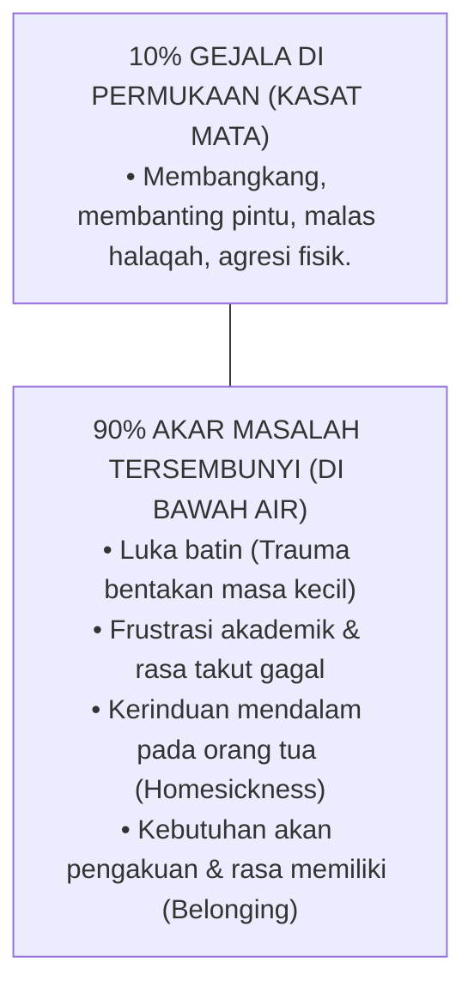

# Sub-Bab 7.2: Membedah Akar Masalah Bukan Gejala

Keesokan harinya di ruang bimbingan konseling asrama, Ustadz Salman berdiskusi dengan Guru BK Pesantren tentang kasus santri-santri yang menunjukkan perilaku pembangkangan di kamar.

"Salman," terang Guru BK seraya menunjukkan diagram gunung es perilaku (*Behavior Iceberg Model*), "perilaku kasat mata yang kita lihat pada santri—seperti membolos sholat, membanting pintu, atau berbicara kasar—hanyalah pucuk gunung es sepuluh persen yang muncul di atas permukaan air."

Salman menyimak dengan cermat, mencocokkan teori tersebut dengan pengalamannya mendampingi Rian dan Faisal.

"Jika seorang musyrif hanya fokus memotong pucuk gunung es dengan hukuman," lanjut Guru BK, "maka bagian bawah gunung es yang beku dan terluka itu akan terus mendesak naik ke atas, menciptakan ledakan perilaku baru yang jauh lebih destruktif."

Pendekatan pengasuhan PBIS menuntut musyrif menjadi seorang **Detektif Kasih Sayang (*Compassionate Investigator*)**:
1. Menyelidiki apa fungsi di balik perilaku tersebut (*Functional Behavior Analysis*): Apakah santri berperilaku buruk untuk menghindari tugas yang terlalu sulit baginya, ataukah ia sedang mencari perhatian karena merasa diabaikan?
2. Memberikan keterampilan pengganti (*Replacement Behaviors*): Mengajarkan santri cara mengekspresikan rasa frustrasi melalui komunikasi asertif, bukan dengan kekerasan atau merusak fasilitas.
3. Memulihkan kebutuhan psikologis dasarnya (*Autonomy, Competence, Relatedness*): Memberikan ruang tanggung jawab yang sesuai dengan minat dan kekuatannya.

Salman mengangguk mantap. Pemahaman ini mengubah cara pandangnya secara radikal: ia tidak lagi memandang santri yang 'bermasalah' sebagai musuh yang harus ditaklukkan, melainkan sebagai anak asuh yang sedang menjerit meminta pertolongan batin.
