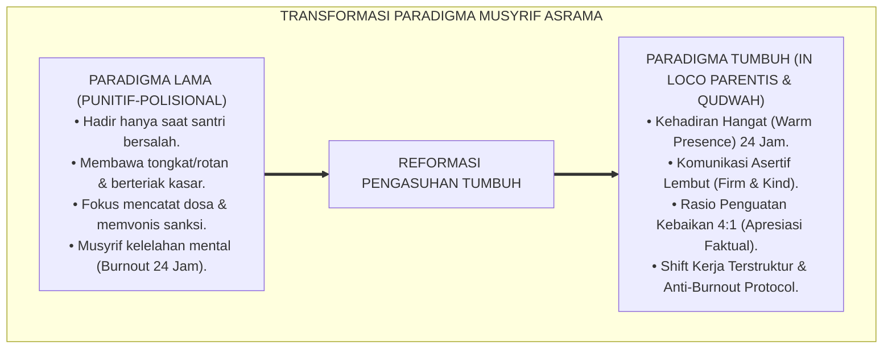
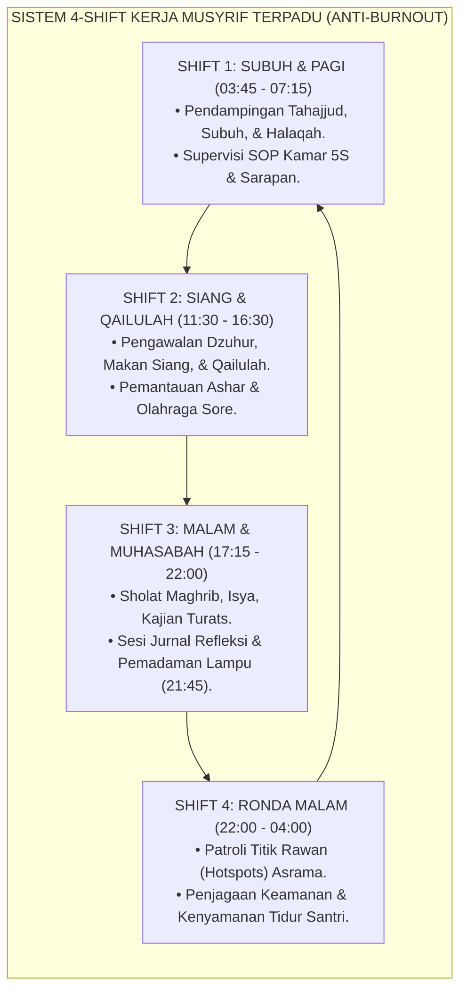

# BUKU 02: PANDUAN MUSYRIF ASRAMA 24 JAM
## *Manual Operasional, Manajemen Kehidupan Kamar 5S, Sistem Shift Kerja Terpadu, dan Perlindungan Anti-Burnout*

---

**Nomor Buku**: `BOOK-SERIES-1/VOL-02/2026`  
**Sasaran Pembaca**: Musyrif/Musyrifah Asrama, Kepala Pengasuhan, Pembina Kamar, Wali Asrama, dan Pimpinan Pondok  
**Dewan Pakar Pengkaji**: Pakar Pengasuhan Asrama, Pakar Intervensi Preventif, Pakar Tata Kelola Qudwah, dan Pakar PBIS  

---

# BAGIAN I: PROFIL, PERAN, & TRANSFORMASI PARADIGMA MUSYRIF

## 1.1 Transformasi Peran: Dari Sipir Penjara Menjadi Pengganti Orang Tua (*In Loco Parentis*)

Dalam pola pengasuhan pesantren konvensional lama, musyrif sering kali dipersepsikan sebagai "polisi asrama" atau "petugas penegak hukum" yang hanya muncul ketika santri melakukan pelanggaran. Interaksi musyrif didominasi oleh bentakan saat membangunkan tidur, membawa tongkat/rotan, mencatat pelanggaran di "buku dosa", dan menjatuhkan sanksi fisik. Akibatnya, hubungan emosional antara santri dan musyrif menjadi renggang, dingin, diliputi ketakutan, dan mendorong kemunafikan perilaku santri.

Ekosistem TUMBUH merombak total paradigma tersebut. Musyrif diposisikan dalam tiga fungsi luhur terpadu:
1. **Pengganti Orang Tua (*In Loco Parentis*)**: Memberikan kehangatan afektif, rasa aman psikologis, dan merawat santri yang mengalami *homesickness* atau sakit fisik.
2. **Qudwah Hasanah (Living Curriculum)**: Menjadi teladan hidup dalam ibadah tepat waktu, kebersihan diri, kesantunan tutur kata, dan kejernihan akhlak.
3. **Fasilitator Perilaku Positif (PBIS Multi-Tier Facilitator)**: Mengamati kemajuan karakter santri, memberikan penguatan positif rasio 4:1, dan mendampingi santri dalam menyelesaikan konflik melalui dialog restoratif.

---

## 1.2 Kaidah Komunikasi *Firm & Kind* Musyrif

Musyrif TUMBUH wajib menerapkan prinsip komunikasi **Firm & Kind (Tegas & Kasih Sayang)**:
* **Firm (Tegas)**: Menjunjung tinggi kejelasan batas (*boundaries*), konsistensi SOP, dan kepastian perlindungan bagi seluruh santri tanpa diskriminasi atau favoritisme.
* **Kind (Kasih Sayang)**: Menyampaikan instruksi dan koreksi dengan intonasi tenang, menjaga kehormatan santri (*Dignity First*), mendengarkan secara aktif, dan menolak keras segala bentuk hinaan fisik maupun verbal.

---

# BAGIAN II: RITME SIRKADIAN 24 JAM, SOP KAMAR 5S, & SISTEM SHIFT KERJA

## 2.1 Ritme Sirkadian Kehidupan Asrama 24 Jam

Sistem pengasuhan TUMBUH menata jadwal harian santri yang selaras dengan jam biologis tubuh manusia (*circadian rhythm*), memastikan perlindungan hak tidur berkualitas 6.5–7 jam dan istirahat siang (*qailulah*):

```mermaid
gantt
    title Jadwal Sirkadian 24 Jam Kehidupan Santri di Asrama
    dateFormat HH:mm
    axisFormat %H:%M
    
    section Bangun & Ibadah
    Bangun Subuh, Qiyamul Lail, & Sholat Subuh : 03:45, 05:30
    Halaqah Al-Qur'an & Zikir Pagi            : 05:30, 06:15
    section Kamar & Kebersihan
    SOP Kamar 5S & Sarapan Bergizi            : 06:15, 07:00
    section Madrasah / Akademik
    KBM Madrasah Sesi 1 & Sholat Dhuha         : 07:00, 11:45
    section Istirahat Siang
    Sholat Dzuhur & Qailulah (Tidur Siang)    : 11:45, 13:15
    section KBM & Sore
    KBM Madrasah Sesi 2 & Sholat Ashar        : 13:15, 16:00
    Olahraga, Ekstrakurikuler, & Mandi Sore    : 16:00, 17:30
    section Malam & Belajar
    Sholat Maghrib, Makan Malam, & Isya        : 17:30, 19:30
    Kajian Turats / Mudzakarah Belajar Malam   : 19:30, 21:00
    Muhasabah, Jurnal Refleksi, & Tidur Malam  : 21:00, 21:45
    Tidur Lelap (Restorasi Otak & Hormon)      : 21:45, 03:45
```

---

## 2.2 Standard Operating Procedure (SOP) Kamar Asrama Budaya 5S

Kamar asrama adalah mikrokosmos pembentukan adab harian. Setiap kamar santri diatur dengan standar manajemen tata graha modern **5S (Ringkas, Rapi, Resik, Rawat, Rajin)**:

| Prinsip 5S | Terjemahan Arab & Makna | Tindakan Konkret Santri di Kamar | Parameter Pemeriksaan Musyrif |
| :--- | :--- | :--- | :--- |
| **1. Ringkas (Seiri)** | *At-Tajrid* (التَّجْرِيْد) — Memilah barang | Menyingkirkan barang rusak/tak terpakai dari lemari. Menyimpan maksimal 7 setel pakaian aktif. | Tidak ada tumpukan baju kotor/kardus tak terpakai di kolong ranjang. |
| **2. Rapi (Seiton)** | *At-Tartib* (التَّرْتِيْب) — Menata letak | Kasur terbentang rapi dengan sprei kencang (*hospital corner*), kitab tertata urut di rak buku. | Sandal berjejer rapi di rak luar, gantungan handuk di tali jemuran khusus. |
| **3. Resik (Seiso)** | *An-Nazhafah* (النَّظَافَة) — Membersihkan | Piket harian menyapu, mengepel lantai, dan mengosongkan tempat sampah setiap pagi dan sore. | Lantai bebas debu, aroma kamar segar alami, sirkulasi udara terbuka. |
| **4. Rawat (Seiketsu)** | *Al-Muhafazhah* (الْمُحَافَظَة) — Standarisasi | Mempertahankan standar kebersihan kamar tanpa perlu disuruh berulang kali. | Papan checklist harian kamar terisi paraf ketua kamar dan musyrif. |
| **5. Rajin (Shitsuke)** | *Al-Istiqamah* (الْإِسْتِقَامَة) — Pembudayaan | Disiplin kamar menjadi kesadaran fitrah bersama (*Self-Enforcing Culture*). | Kamar tetap rapi secara konsisten bahkan saat liburan akhir pekan. |

---

## 2.3 Manajemen Shift Kerja Musyrif Anti-Burnout

Untuk melindungi musyrif dari stres kronis dan kelelahan mental, pembinaan asrama dibagi ke dalam **4 Shift Terpadu** dengan rasio ideal **1 Musyrif mengasuh 15–20 santri**:

### Hak Perlindungan Musyrif:
1. **Hak Istirahat & Libur**: Setiap musyrif berhak atas libur penuh 1 hari per pekan dan cuti berkala.
2. **Supervisi Klinis Mingguan**: Rapat evaluasi Sabtu pagi untuk membahas dinamika santri tanpa saling menyalahkan (*No-Blame Culture*).
3. **Pemberian Asupan Nutrisi & Gaji Layak**: Pesantren menyediakan konsumsi bergizi dan honorarium profesional yang menghargai dedikasi musyrif.

---

# BAGIAN III: TABEL SINTESIS, CATATAN KAKI, & DAFTAR PUSTAKA

## 3.1 Tabel Sintesis Pedoman Musyrif Asrama

| Komponen Pengasuhan | Landasan Turats & Sunnah | Landasan Manajemen Modern | Indikator Keberhasilan |
| :--- | :--- | :--- | :--- |
| **Rutinitas Kamar** | Hadits *"An-Nazhafatu min al-Iman"* & Sunnah Kerapian. | *Lean Management 5S & Environmental Nudges*. | 100% kamar memenuhi standar kelayakan 5S setiap pagi. |
| **Pola Interaksi** | Hadits *"Yassiru wa la Tu'assiru"* (HR. Bukhari). | *Positive Reinforcement (Magic Ratio 4:1)*. | Catatan apresiasi kebaikan di logbook $\ge 4$ kali catatan teguran. |
| **Shift Kerja** | Kaidah *"La Dharara wa la Dhirar"* (Tidak menzalimi). | *Ergonomics & Circadian Shift Work Science*. | Tingkat kejenuhan (*burnout index*) musyrif rendah (< 15%). |

---

## 3.2 Catatan Kaki (*Footnotes 1-to-1*)

[^1]: Hadits riwayat Imam Al-Bukhari dalam *Shahih al-Bukhari*, Kitab al-'Ilm, no. 69; Imam Muslim dalam *Shahih Muslim*, no. 1734.
[^2]: Ibnu Sahnun. (1972). *Adab al-Mu'allimin*. Ditahqiq oleh Mahmud 'Abdul Maula. Tunis: Al-Syirkah al-Tunisiyyah li at-Tauzi', hlm. 33–42.
[^3]: Maslach, C., & Leiter, M. P. (2016). Understanding the burnout experience: Recent research and its implications for psychiatry. *World Psychiatry*, 15(2), 103-111.
[^4]: Sugai, G., & Horner, R. H. (2009). Responsiveness-to-intervention and school-wide positive behavior support: Integration of multi-tiered systems. *Exceptionality*, 17(4), 223-237.
[^5]: Imai, M. (1986). *Kaizen: The Key to Japan's Competitive Success*. New York: McGraw-Hill.

---

## 3.3 Daftar Pustaka Standar APA 7th & Turats

* Al-Bukhari, M. I. (2002). *Shahih al-Bukhari*. Riyadh: Darussalam.
* Ibnu Sahnun, M. (1972). *Adab al-Mu'allimin*. Tunis: Al-Syirkah al-Tunisiyyah li at-Tauzi'.
* Imai, M. (1986). *Kaizen: The Key to Japan's Competitive Success*. New York: McGraw-Hill.
* Maslach, C., & Leiter, M. P. (2016). Understanding the burnout experience: Recent research and its implications for psychiatry. *World Psychiatry*, 15(2), 103-111.
* Sugai, G., & Horner, R. H. (2009). Responsiveness-to-intervention and school-wide positive behavior support: Integration of multi-tiered systems. *Exceptionality*, 17(4), 223-237.
