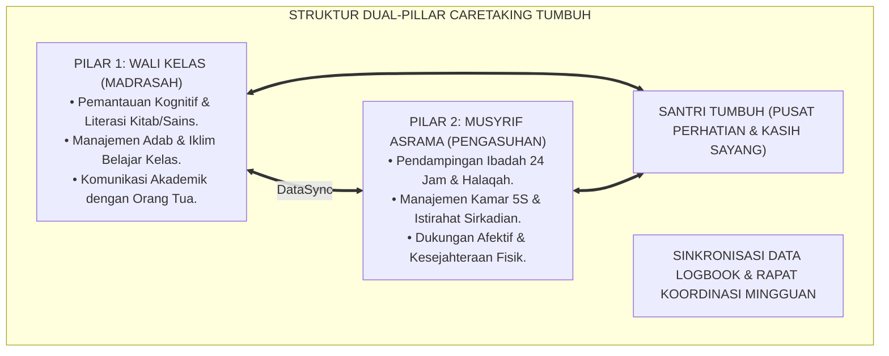
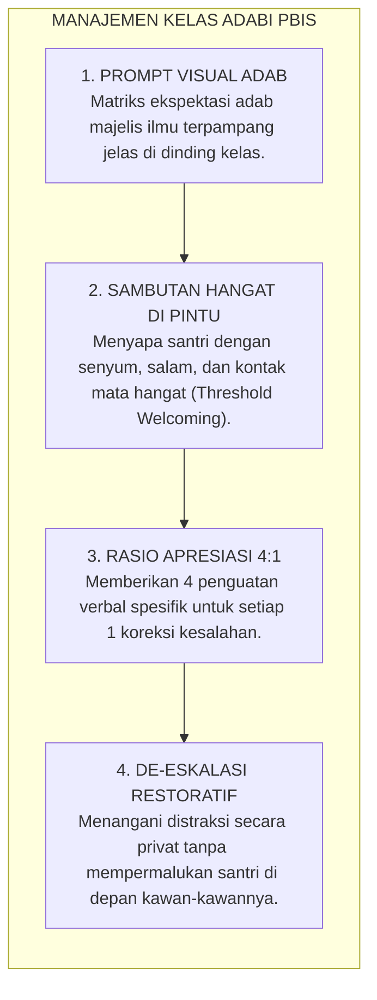

# BUKU 03: PANDUAN WALI KELAS
## *Integrasi Dual-Pillar Madrasah-Pengasuhan, Manajemen Kelas Berbasis PBIS, dan Sinergi Pembinaan Karakter Santri*

---

**Nomor Buku**: `BOOK-SERIES-1/VOL-03/2026`  
**Sasaran Pembaca**: Wali Kelas, Guru Mata Pelajaran, Wakil Kepala Madrasah Bidang Kesiswaan & Kurikulum, Guru Bimbingan Konseling (BK), dan Pimpinan Madrasah  
**Dewan Pakar Pengkaji**: Pakar Pedagogi Master Guru, Pakar Tata Kelola Qudwah, Pakar PBIS, dan Pakar Bimbingan Konseling  

---

# BAGIAN I: INTEGRASI DUAL-PILLAR & PERAN STRATEGIS WALI KELAS

## 1.1 Menghapus Sekat Dikotomi: Struktur Dual-Pillar Caretaking

Dalam tradisi sebagian pesantren, sering kali terjadi keterputusan komunikasi (*silo mentality*) antara ranah madrasah (formal akademik) dan ranah asrama (pengasuhan malam). Guru di kelas tidak mengetahui bahwa seorang santri yang mengantuk di kelas sedang berjuang menghadapi demam di asrama, atau musyrif asrama tidak memahami bahwa santri yang murung memiliki kesulitan belajar hafalan tajwid di kelas.

Sistem TUMBUH menghapus sekat ini secara radikal melalui kerangka kerja **Dual-Pillar Caretaking (Dua Pilar Pengasuhan Terpadu)**:
* **Pilar 1 (Madrasah / Siang)**: Dipimpin oleh **Wali Kelas** yang mengawal pertumbuhan intelektual, keterlibatan belajar (*Academic Engagement*), dan adab penuntut ilmu di lingkungan sekolah.
* **Pilar 2 (Asrama / Malam)**: Dipimpin oleh **Musyrif Asrama** yang mengawal ritme ibadah, adab kamar 5S, dan kesejahteraan sosio-emosional santri.

---

## 1.2 Profil & Fungsi Kunci Wali Kelas TUMBUH

Wali kelas bukan sekadar pengurus administrasi presensi dan pengisi rapor angka, melainkan:
1. **Pemandu Perjalanan Karakter Santri (*Academic & Moral Mentor*)**: Memetakan profil belajar individual santri, kelemahan kognitif, dan minat bakatnya.
2. **Jembatan Informasi (*Communication Hub*)**: Menghubungkan informasi perkembangan santri dari musyrif asrama ke orang tua secara transparan dan berempati.
3. **Fasilitator Lingkaran Kelas (*Classroom Circle Facilitator*)**: Mengadakan musyawarah kelas mingguan untuk mendiskusikan dinamika hubungan antarteman dan memecahkan konflik kelas secara restoratif.

---

# BAGIAN II: PRAKTIK MANAJEMEN KELAS POSITIF & PROTOKOL SINKRONISASI

## 2.1 Manajemen Kelas Berbasis Positif (PBIS Classroom Management)

Wali kelas dan guru mata pelajaran menerapkan arsitektur manajemen kelas berbasis nilai adab:

### 5 Pilar Adab Majelis Ilmu di Kelas:
1. **Thaharatul Makan wal Basyar**: Kelas bersih, rapi, dan santri berwudhu sebelum memulai pelajaran.
2. **Hushul al-Inshat**: Mendengarkan saat guru atau kawan memaparkan gagasan dengan khusyuk.
3. **Husnut Thalab**: Bertanya dan menyampaikan argumen dengan nada rendah, sopan, dan terstruktur.
4. **Ta'awun fi at-Ta'allum**: Membantu kawan sebaya yang tertinggal dalam memahami materi (*Peer Tutoring*).
5. **Shidqul 'Amal**: Menjunjung tinggi kejujuran akademik dan anti-plagiarisme dalam tugas dan ujian.

---

## 2.2 Protokol Koordinasi Wali Kelas & Musyrif (Rapat Sabtu Pagi)

Untuk memastikan tidak ada santri yang luput dari pendampingan (*No Child Left Behind*), wali kelas dan musyrif menjalankan siklus pertukaran data rutin:

| Waktu Pelaksanaan | Agenda Koordinasi | Output Nyata Pertemuan |
| :--- | :--- | :--- |
| **Harian (13:15 - 13:30)** | *Daily Check-In Quick Sync*: Wali kelas mengabari musyrif mengenai santri yang tampak lelah, cemas, atau berprestasi istimewa di kelas. | Catatan silang di Logbook Musyrif App. |
| **Mingguan (Sabtu, 08:30 - 10:00)** | Rapat Pleno Terpadu: Membahas santri Tier 2 (yang membutuhkan CICO) dan mengevaluasi efektivitas intervensi. | Rencana tindak lanjut pekan berikutnya dan pembaruan target CICO. |
| **Bulanan (Pekan ke-4)** | Evaluasi Asesmen Ipsatif: Menyusun portofolio naratif karakter sebelum pelaporan kepada wali santri. | Draf Laporan Naratif Pertumbuhan Santri. |

---

## 2.3 Protokol Kemitraan Wali Kelas dengan Orang Tua

Wali kelas menjalin komunikasi dua arah yang hangat dengan wali santri melalui:
1. **Laporan Naratif Karakter Mingguan/Bulanan**: Menghindari pengiriman pesan yang hanya berisi keluhan kesalahan santri. Setiap laporan wajib diawali dengan minimal 2 bukti konkret perkembangan positif anak (*Strength-Based Reporting*).
2. **Konsultasi Edukasi Terjadwal**: Sesi daring/luring 15 menit per semester untuk menyelaraskan pola asuh di rumah saat santri libur semester (*Syncing Home-School Habits*).

---

# BAGIAN III: TABEL SINTESIS, CATATAN KAKI, & DAFTAR PUSTAKA

## 3.1 Tabel Sintesis Integrasi Wali Kelas

| Dimensi Peran | Rujukan Turats Klasik | Rujukan Pedagogi Modern | Bukti Keberhasilan di Kelas |
| :--- | :--- | :--- | :--- |
| **Relasi Guru-Murid** | *Adab al-Mu'allimin* (Ibnu Sahnun). | *Teacher-Student Relationship Quality (Pianta)*. | Keterlibatan aktif santri dalam diskusi kelas $\ge 90\%$. |
| **Disiplin Kelas** | Konsep *Ar-Rifq* (HR. Muslim). | *Proactive Classroom Management (Evertson)*. | Waktu instruksional bersih (*Time-on-Task*) meningkat $35\%$. |
| **Sinergi Asrama** | Kaidah *At-Ta'awun 'ala al-Birr*. | *Wraparound Support System (Eber)*. | Kasus keterlambatan deteksi dini santri bermasalah $0\%$. |

---

## 3.2 Catatan Kaki (*Footnotes 1-to-1*)

[^1]: Ibnu Sahnun, Muhammad. (1972). *Adab al-Mu'allimin*. Tunis: Al-Syirkah al-Tunisiyyah li at-Tauzi', hlm. 15–24.
[^2]: Pianta, R. C., Hamre, B. K., & Allen, J. P. (2012). Teacher-student relationships and engagement: Conceptualizing, measuring, and improving the capacity of classroom interactions. In *Handbook of Research on Student Engagement* (pp. 365-391). Boston, MA: Springer.
[^3]: Evertson, C. M., & Weinstein, C. S. (Eds.). (2006). *Handbook of Classroom Management: Research, Practice, and Contemporary Issues*. New York: Routledge.
[^4]: Eber, L., Hyde, K., & Suter, J. C. (2011). Integrating wraparound into schoolwide systems of positive behavior support. *Journal of Emotional and Behavioral Disorders*, 19(2), 78-90.

---

## 3.3 Daftar Pustaka Standar APA 7th & Turats

* Eber, L., Hyde, K., & Suter, J. C. (2011). Integrating wraparound into schoolwide systems of positive behavior support. *Journal of Emotional and Behavioral Disorders*, 19(2), 78-90.
* Evertson, C. M., & Weinstein, C. S. (Eds.). (2006). *Handbook of Classroom Management: Research, Practice, and Contemporary Issues*. New York: Routledge.
* Ibnu Sahnun, M. (1972). *Adab al-Mu'allimin*. Tunis: Al-Syirkah al-Tunisiyyah li at-Tauzi'.
* Pianta, R. C., Hamre, B. K., & Allen, J. P. (2012). Teacher-student relationships and engagement. In *Handbook of Research on Student Engagement* (pp. 365-391). Boston, MA: Springer.
