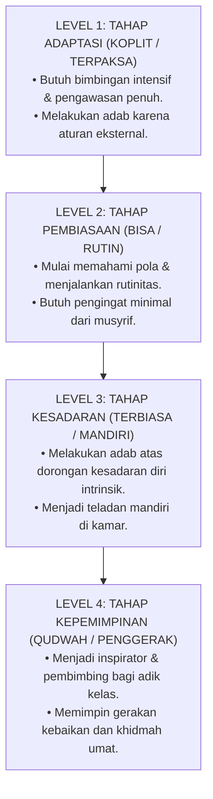

# Sub-Bab 11.1: Dari Terpaksa Menjadi Bisa

Di aula pertemuan santri, Kyai Hasyim memaparkan peta progresi kematangan karakter: **Empat Tangga Kematangan Karakter Santri (*The 4-Stage Character Maturation Ladder*)**.

Kyai Hasyim menjelaskan bahwa setiap santri memulai perjalanannya dari Level 1:
* Di awal masuk, santri seperti Farhan mungkin merasa terpaksa bangun pagi atau merapikan ranjang karena adanya aturan.
* Namun melalui pembiasaan yang penuh kasih (*Nurturing Habituation*), dorongan itu bergeser menjadi Level 2 (Bisa) dan Level 3 (Mandiri).
* Hingga akhirnya di puncak kematangannya, santri mencapai Level 4: menjadi sosok **Qudwah Hasanah** yang menggerakkan kebaikan di sekelilingnya tanpa pamrih.

Farhan melihat grafis tangga tersebut dan menyadari perjalanan dirinya: setahun lalu ia berada di Level 1 yang rapuh, dan kini ia telah melangkah mantap di Level 2 menuju Level 3, siap meniti tangga kematangan karakter hingga tuntas.
