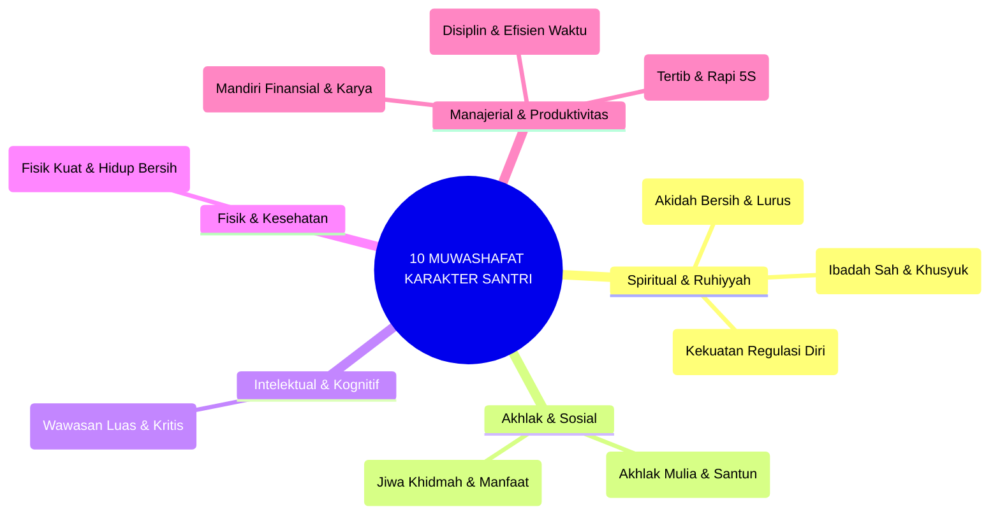

# BUKU 04: SEPULUH MUWASHAFAT KARAKTER SANTRI
## *Taksonomi Adab Nabawi, Dekomposisi Dimensi Fitrah, dan Matriks Indikator Perilaku Terukur*

---

**Nomor Buku**: `BOOK-SERIES-1/VOL-04/2026`  
**Sasaran Pembaca**: Pengembang Kurikulum Karakter, Asatidz, Musyrif, Guru BK, dan Penilai Karakter Pesantren  
**Dewan Pakar Pengkaji**: Pakar Desain Kurikulum Adab, Pakar Epistemologi Turats, Pakar Social-Emotional Learning, dan Pakar Psikometri  

---

# BAGIAN I: ONTOLOGI 10 MUWASHAFAT & FILOSOFI PENGEMBANGAN KARAKTER

## 1.1 Hakikat 10 Muwashafat dalam Sistem TUMBUH

Dalam khazanah pendidikan Islam, karakter bukanlah seperangkat slogan normatif atau hafalan definisi moral belaka. Karakter adalah **internalisasi nilai tauhid dan adab (*Ta'dib*) yang mewujud secara konsisten dalam tindakan nyata, respons emosional, dan integritas kepribadian**.

Sistem TUMBUH mengadopsi dan menyempurnakan formulasi klasik **Sepuluh Karakteristik Insan Paripurna (*Al-Muwashafat al-'Asyrah*)** yang dirumuskan para ulama tarbiyah, lalu mengintegrasikannya dengan sains perilaku terapan (*Applied Behavioral Science*). Ke-10 dimensi ini didekomposisi menjadi indikator perilaku yang teramati (*observable*), terukur (*measurable*), dan dapat dilatihkan secara bertahap (*actionable*).

---

# BAGIAN II: DEKOMPOSISI DIMENSI & MATRIKS INDIKATOR PERILAKU TERUKUR

## 2.1 Dekomposisi 10 Dimensi Muwashafat

### 1. Salimul Aqidah (سَلِيْمُ الْعَقِيْدَةِ) — Akidah yang Lurus & Bersih
* **Hakikat**: Keyakinan tauhid yang murni, terbebas dari khurafat, tahayyul, dan thiyarah (pesimisme mistis). Santri memahami bahwa segala peristiwa berada dalam kehendak Allah SWT, memupuk *Growth Mindset* spiritual.
* **Indikator Teramati**: Bersandar hanya kepada Allah dalam doa, tidak menggunakan jimat/tanda ramalan, dan bersikap optimis menghadapi ujian.

### 2. Shahihul Ibadah (صَحِيْحُ الْعِبَادَةِ) — Ibadah yang Benar & Khusyuk
* **Hakikat**: Pelaksanaan ibadah mahdhah (wudhu, sholat, tilawah) yang memenuhi rukun dan syarat sesuai Sunnah Nabawiyyah, disertai thuma'ninah kalbu.
* **Indikator Teramati**: Mengambil wudhu dengan tertib tanpa membuang air, sholat berjamaah di shaf pertama tanpa menunda, dan membaca Al-Qur'an dengan tajwid mutqin.

### 3. Matinul Khuluq (مَتِيْنُ الْخُلُقِ) — Akhlak yang Kokoh & Santun
* **Hakikat**: Keanggunan budi pekerti, kejujuran, rasa malu (*haya'*), dan kepedulian terhadap sesama tanpa memandang senioritas.
* **Indikator Teramati**: Berkata jujur sekalipun dalam situasi sulit, menyapa dengan senyum dan salam (5S), serta membela kawan yang dilecehkan.

### 4. Qadirun 'alal Kasbi (قَادِرٌ عَلَى الْكَسْبِ) — Mandiri & Memiliki Keterampilan
* **Hakikat**: Jiwa kemandirian finansial dan etos kerja produktif; tidak bergantung pada orang lain untuk kebutuhan dasarnya.
* **Indikator Teramati**: Mampu mengelola uang saku harian secara hemat, merawat barang pribadi, dan menghasilkan karya/jasa kreatif.

### 5. Mutsaqqaful Fikr (مُثَقَّفُ الْفِكْرِ) — Berwawasan Luas & Bernalar Kritis
* **Hakikat**: Kecintaan pada ilmu pengetahuan, kemampuan membaca kritis (*Critical Reading*), dan menimbang informasi secara objektif tanpa taklid buta.
* **Indikator Teramati**: Membaca kitab dan literatur secara aktif, mampu merumuskan argumen logis dalam diskusi, dan memverifikasi berita (*tabayyun*).

### 6. Qawiyyul Jism (قَوِيُّ الْجِسْمِ) — Fisik yang Kuat & Berdaya Tahan
* **Hakikat**: Kebugaran jasmani, kebiasaan hidup bersih, dan kepatuhan pada nutrisi halalan thayyiban.
* **Indikator Teramati**: Menjaga kebersihan diri, berolahraga teratur 3 kali sepekan, dan mematuhi jadwal tidur sirkadian 7 jam.

### 7. Mujahidun Linafsihi (مُجَاهِدٌ لِنَفْسِهِ) — Tangguh Mengendalikan Hawa Nafsu
* **Hakikat**: Regulasi diri (*Self-Regulation*), daya tahan menghadapi kesulitan (*grit*), dan kemampuan menahan godaan kemalasan.
* **Indikator Teramati**: Bangun tidur tepat waktu secara mandiri, mampu mengendalikan amarah saat terprovokasi, dan fokus belajar tanpa distraksi gadget.

### 8. Munazhzhamun fi Syu'unihi (مُنَظَّمٌ فِي شُؤُوْنِهِ) — Teratur dalam Segala Urusan
* **Hakikat**: Keterampilan manajemen tata ruang, kerapian logistik, dan kepatuhan pada SOP 5S.
* **Indikator Teramati**: Lemari dan kasur tertata rapi standar 5S, pakaian kotor segera dicuci, dan alat tulis tersimpan rapi pada tempatnya.

### 9. Haritsun 'ala Waqtihi (حَرِيْصٌ عَلَى وَقْتِهِ) — Disiplin & Menghargai Waktu
* **Hakikat**: Kesadaran tinggi bahwa waktu adalah amanah umur; pantang membuang waktu dalam kesia-siaan (*Laghwu*).
* **Indikator Teramati**: Hadir 5 menit sebelum adzan di masjid dan kelas, memanfaatkan waktu luang untuk muthala'ah, serta menyelesaikan tugas sebelum batas waktu.

### 10. Nafi'un Lighairihi (نَافِعٌ لِغَيْرِهِ) — Bermanfaat Nyata bagi Sesama
* **Hakikat**: Jiwa *khidmah* sosial, empati aktif, dan dedikasi untuk memberi maslahat kepada komunitas dan masyarakat sekitar.
* **Indikator Teramati**: Sukarela membantu kawan yang sakit, aktif dalam kegiatan gotong royong asrama, dan membagikan ilmu kepada adik kelas (*mentoring*).

---

## 2.2 Rubrik Penilaian 4 Tingkat Kemandirian (PBIS Level Rubric)

Setiap indikator muwashafat dinilai menggunakan rubrik perkembangan ipsatif 4 level:

| Level Perkembangan | Sebutan Karakter | Deskripsi Operasional Perilaku | Intervensi Musyrif / Guru |
| :---: | :--- | :--- | :--- |
| **Level 1** | **Emerging (Mulai Muncul)** | Perilaku hanya muncul jika diinstruksikan atau diawasi ketat secara langsung; masih sering lupa. | Penguatan Tier 2: *Prompts* visual, pendampingan mentor sebaya, dan kartu CICO. |
| **Level 2** | **Developing (Berkembang)** | Perilaku mulai konsisten dalam rutinitas normal, namun masih goyah saat menghadapi distraksi/tekanan. | Penguatan Tier 1: Umpan balik positif rasio 4:1 dan pengingat verbal halus. |
| **Level 3** | **Proficient (Mandiri/Mahir)** | Perilaku konsisten atas kesadaran diri intrinsik tanpa perlu diawasi; menjadi kebiasaan alami (*habit*). | Apresiasi berkala: Pengakuan kemandirian dan pemberian tanggung jawab lebih luas. |
| **Level 4** | **Exemplary / Qudwah (Teladan)** | Menjadi penggerak lingkungan, membimbing kawan lain, dan menginspirasi komunitas asrama. | Delegasi kepemimpinan: Ditugaskan sebagai mentor santri baru (Jenjang J4). |

---

# BAGIAN III: TABEL SINTESIS, CATATAN KAKI, & DAFTAR PUSTAKA

## 3.1 Tabel Sintesis 10 Muwashafat & Sains Perilaku

| Muwashafat | Dimensi CASEL SEL | Domain Neurosains | Aplikasi Pengasuhan 24 Jam |
| :--- | :--- | :--- | :--- |
| **Salimul Aqidah & Mujahadah** | *Self-Awareness & Self-Management* | Regulasi Prefrontal Cortex (PFC). | Muhasabah malam dan jurnal refleksi diri. |
| **Matinul Khuluq & Nafi'un** | *Social Awareness & Relationship Skills* | Sistem Empati Cermin Otak (*Mirror Neurons*). | Praktik lingkaran restoratif dan kerja bakti khidmah. |
| **Munazhzham & Harits** | *Responsible Decision-Making* | Fungsi Eksekutif Otak (*Executive Function*). | Standarisasi kamar 5S dan jadwal sirkadian tertib. |

---

## 3.2 Catatan Kaki (*Footnotes 1-to-1*)

[^1]: Al-Banna, Hasan. (1992). *Risalah at-Ta'alim: Mabahits fi al-Arkan al-'Asyrah*. Kairo: Dar at-Tauzi' wa an-Nasyr al-Islamiyyah, hlm. 18–31.
[^2]: Bandura, A. (1986). *Social Foundations of Thought and Action: A Social Cognitive Theory*. Englewood Cliffs, NJ: Prentice-Hall.
[^3]: Popham, W. J. (2018). *Classroom Assessment: What Teachers Need to Know* (8th ed.). Boston: Pearson.
[^4]: Al-Ghazali, Abu Hamid. (2005). *Ihya' 'Ulum ad-Din: Kitab Riyadhat an-Nafs wa Tahdzib al-Akhlaq*. Beirut: Dar Ibn Hazm, juz 3, hlm. 65–84.

---

## 3.3 Daftar Pustaka Standar APA 7th & Turats

* Al-Banna, H. (1992). *Risalah at-Ta'alim*. Kairo: Dar at-Tauzi' wa an-Nasyr al-Islamiyyah.
* Al-Ghazali, A. H. (2005). *Ihya' 'Ulum ad-Din*. Beirut: Dar Ibn Hazm.
* Bandura, A. (1986). *Social Foundations of Thought and Action: A Social Cognitive Theory*. Englewood Cliffs, NJ: Prentice-Hall.
* Popham, W. J. (2018). *Classroom Assessment: What Teachers Need to Know*. Boston: Pearson.
