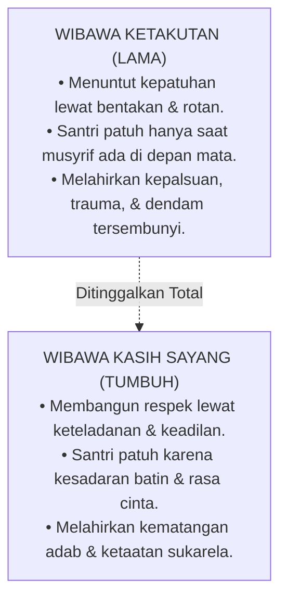

# Sub-Bab 2.2: Menjaga Wibawa Tanpa Amarah

Dalam sesi pembinaan musyrif asrama, Ustadz Ridwan memaparkan konsep penting tentang sumber otoritas pengasuhan: **Wibawa Berbasis Kasih Sayang (*Authority of Love*) vs Wibawa Berbasis Ketakutan (*Authority of Fear*)**.

Ridwan menjelaskan bahwa musyrif yang mengandalkan amarah untuk disegani hakikatnya adalah musyrif yang lemah, karena ia tidak memiliki instrumen pengaruh selain rasa takut.

Sebaliknya, musyrif yang disegani karena **keikhlasan akhlaknya, keadilan sikapnya, dan ketepatan janjinya** akan memiliki wibawa yang merasuk ke dalam relung kalbu santri.

Ketika santri memandang Ustadz Salman dan Ustadz Ridwan, mereka tidak melihat momok yang menakutkan, melainkan melihat sosok panutan (*Qudwah Hasanah*) yang mereka hormati dengan segenap kerelaan jiwa.
