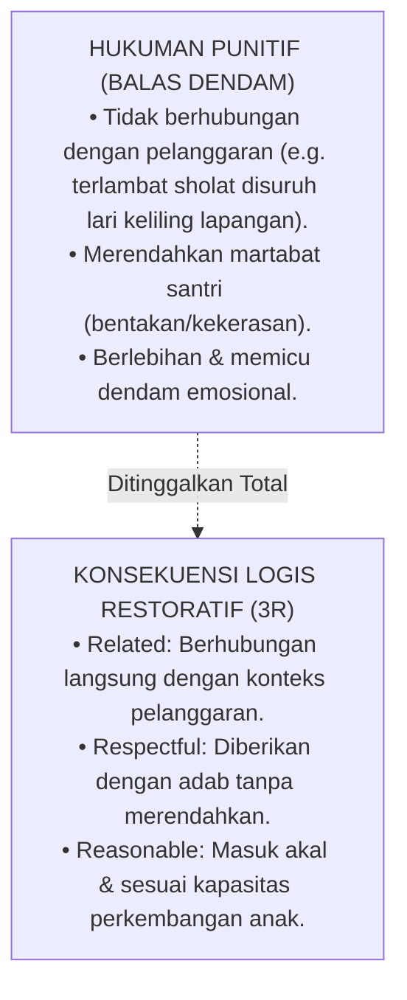

# Sub-Bab 7.1: Tiga Kriteria Konsekuensi Logis

Dalam perumusan pedoman tata tertib restoratif di Pesantren Darul Adab, Ustadz Salman dan Ustadz Ridwan menetapkan standar emas pembeda antara hukuman punitif dan konsekuensi logis: **Prinsip Tiga R (*Related, Respectful, Reasonable*)**.

Salman memaparkan contoh konkret:
* **Jika santri mengotori dinding koridor dengan coretan spidol**: Konsekuensi logisnya bukan dijemur di bawah terik matahari, melainkan membersihkan dan mengecat kembali dinding tersebut hingga bersih (*Related*).
* Konsekuensi tersebut disampaikan dengan nada suara santun tanpa penghinaan pribadi (*Respectful*).
* Waktu pembersihan disesuaikan dengan jam luang sore hari agar tidak mengganggu jam belajar madrasah (*Reasonable*).

Penerapan prinsip 3R ini membuat santri memahami hubungan sebab-akibat yang nyata antara perbuatan mereka dan dampaknya bagi lingkungan, menanamkan nilai tanggung jawab moral yang rasional dan bermartabat.
