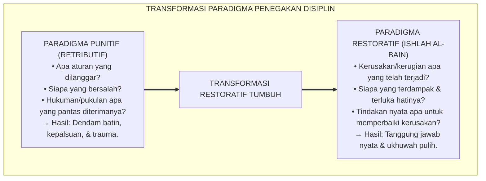
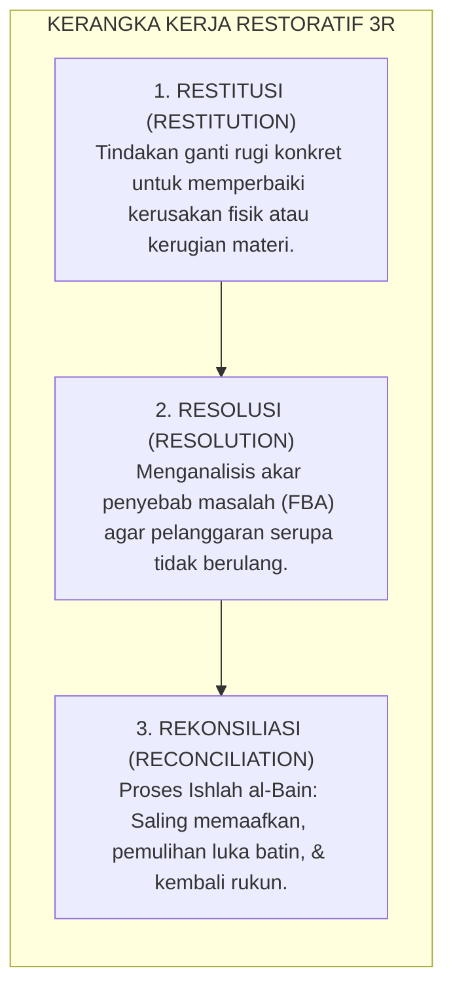

# BUKU 05: DISIPLIN POSITIF & PRAKTIK RESTORATIF DI PESANTREN
## *Prinsip Firm & Kind, Kerangka 3R (Restitution, Resolution, Reconciliation), dan Protokol Ishlah al-Bain Tanpa Kekerasan*

---

**Nomor Buku**: `BOOK-SERIES-1/VOL-05/2026`  
**Sasaran Pembaca**: Tim Penegak Disiplin, Kepala Keamanan, Guru BK, Musyrif Asrama, Wali Kelas, dan Pimpinan Pesantren  
**Dewan Pakar Pengkaji**: Pakar Disiplin Positif, Pakar Kuratif Restoratif, Pakar Perlindungan Anak, dan Pakar Epistemologi Turats  

---

# BAGIAN I: DEKONSTRUKSI HUKUMAN FISIK & PARADIGMA DISIPLIN POSITIF

## 1.1 Deklarasi Mutlak: Zero-Violence Mandate di Pesantren

Pesantren adalah tempat menyucikan jiwa (*Tazkiyatun Nafs*), bukan gelanggang penindasan raga. Selama puluhan tahun, terdapat mitos keliru yang menyatakan bahwa kedisiplinan santri hanya bisa ditegakkan melalui "rotan", tamparan, push-up ratusan kali, digundul kepalanya secara paksa, atau dipermalukan di hadapan ribuan santri saat apel.

Sains modern dan Turats Islam yang shahih secara tegas meruntuhkan mitos ini:
1. **Bahaya Neurosains Trauma**: Hukuman fisik dan intimidasi verbal memicu banjir hormon kortisol di otak santri, merusak struktur *hipokampus* (pusat memori) dan mematikan nalar moral *Prefrontal Cortex*. Santri tidak belajar tentang mengapa perbuatannya salah; mereka hanya belajar cara menyembunyikan kesalahan (*Deceptive Survival Mechanism*).[^1]
2. **Larangan Syar'i Menyakiti Wajah & Fisik**: Rasulullah SAW bersabda: *"Jika salah seorang di antara kalian berselisih, maka jauhilah memukul wajah."* (HR. Bukhari & Muslim).[^2] Islam melarang keras kezaliman dan penyiksaan dalam proses pendidikan (*Ta'dib*).

Sistem TUMBUH menetapkan **Mandat Nol Kekerasan (*Zero-Violence Policy*)**: Segala bentuk kekerasan fisik (*Corporal Punishment*) dan kekerasan verbal (bentakan, hinaan, sarkasme) diharamkan secara mutlak di seluruh lingkungan pesantren.

---

## 1.2 Kaidah *Firm & Kind*: Mengasuh Tanpa Menindas

Disiplin Positif bukanlah pembiaran (*permissiveness*). Disiplin Positif memadukan ketegasan dan kasih sayang secara seimbang:
* **Bukan Punitif (Keras & Dingin)**: Membenci pelaku, menyerang pribadi, dan menghukum dengan emosi marah.
* **Bukan Permisif (Lemah & Tanpa Aturan)**: Membiarkan pelanggaran tanpa ada konsekuensi nyata.
* **Disiplin Positif TUMBUH (Firm & Kind)**: Menghormati martabat santri sebagai manusia, membedakan antara pribadi anak dan perilakunya yang keliru, namun tetap menuntut pertanggungjawaban konkret atas kerusakan yang ditimbulkan.

---

# BAGIAN II: KERANGKA KERJA RESTORATIF 3R & PROTOKOL ISHLAH

## 2.1 Kerangka Kerja Restoratif 3R (*Restitution, Resolution, Reconciliation*)

Ketika terjadi pelanggaran adab atau konflik antarsantri (misalnya perkelahian, pencurian, atau perusakan fasilitas), penanganan dilakukan melalui kerangka 3R:

### 1. Restitusi (*Radd al-Mazhalim / Reparation*):
* Jika santri merusak lemari asrama, ia tidak dipukul atau diskors, melainkan memperbaiki lemari tersebut atau mengganti biaya perbaikan dari hasil tabungan/tenaga pribadinya.
* Jika santri mencuri makanan kawan, ia menggantinya dan membuatkan surat permintaan maaf tulus.

### 2. Resolusi (*Hall al-Musykilah / Root-Cause Resolution*):
* Musyrif dan Guru BK menggali motif batin: *"Mengapa santri tersebut mencuri?"* Apakah karena lapar karena kiriman terlambat, atau karena dorongan impulsif? Akar masalah inilah yang diselesaikan secara komprehensif.

### 3. Rekonsiliasi (*Ishlah Dzat al-Bain / Relational Healing*):
* Mempertemukan pihak yang berkonflik dalam Majelis Lingkaran Restoratif (*Restorative Circle*) untuk saling mendengar dampak perbuatan tanpa ada penghakiman sepihak.

---

## 2.2 Dialog Restoratif 5 Pertanyaan Reflektif (*The 5 Restorative Questions*)

Musyrif dilarang bertanya dengan nada mengancam (*"Kenapa kamu berbuat kurang ajar?!"*). Sebaliknya, gunakan **5 Pertanyaan Reflektif Standar TUMBUH**:

| No | Pertanyaan Reflektif Musyrif | Tujuan Psikologis & Refleksi Santri |
| :---: | :--- | :--- |
| **1** | *"Apa yang sebenarnya terjadi tadi? Ceritakan dari sudut pandangmu dengan tenang."* | Meredakan aktivasi amigdala; mengajak santri menata kronologi fakta secara jujur. |
| **2** | *"Apa yang sedang kamu pikirkan dan rasakan saat peristiwa itu terjadi?"* | Melatih metakognisi dan kesadaran emosi (*Self-Awareness*). |
| **3** | *"Menurutmu, siapa saja yang merasa dirugikan atau terluka hatinya karena kejadian ini?"* | Menumbuhkan empati afektif terhadap korban dan lingkungan (*Social Awareness*). |
| **4** | *"Bagaimana dampak perbuatanmu terhadap mereka dan suasana kamar kita?"* | Menyadarkan bahwa setiap perbuatan memiliki konsekuensi relasional nyata. |
| **5** | *"Menurutmu, apa yang bisa kamu lakukan sekarang untuk memperbaiki keadaan dan menebus kesalahan ini?"* | Mengalihkan fokus dari rasa takut dihukum menjadi komitmen aksi perbaikan (*Restitution*). |

---

## 2.3 Protokol Majelis Ishlah al-Bain & Kebijakan Lembar Bersih (*Clean Slate Policy*)

Setelah santri menyelesaikan kewajiban restitusi dan berdamai dengan pihak yang dirugikan:
1. **Ritus Ishlah**: Dilakukan musafahah (berjabat tangan), pelukan ukhuwah, dan makan bersama satu nampan (*mayoran*) di hadapan musyrif dan teman sekamar.
2. **Clean Slate Policy (Penghapusan Catatan Dosa Permanen)**: Status pelanggaran santri ditutup secara resmi. Dilarang keras bagi siapa pun (musyrif, guru, atau santri lain) mengungkit-ungkit kesalahan masa lalu tersebut di kemudian hari (*Anti-Labelling*).

---

# BAGIAN III: TABEL SINTESIS, CATATAN KAKI, & DAFTAR PUSTAKA

## 3.1 Tabel Sintesis Komparasi Pendekatan Disiplin

| Parameter Evaluasi | Hukuman Punitif Konvensional | Disiplin Positif & Restoratif TUMBUH |
| :--- | :--- | :--- |
| **Fokus Sasaran** | Menyakiti raga atau mempermalukan pelaku. | Memulihkan korban, mendidik pelaku, & memperbaiki relasi. |
| **Dampak Psikologis** | Dendam batin, kemunafikan, hilangnya rasa percaya diri. | Tumbuhnya empati sejati, kesadaran moral, & rasa tanggung jawab. |
| **Hubungan Pasca-Insiden** | Membentuk polaritas permusuhan / geng senioritas. | Memulihkan ukhuwah dan iklim persaudaraan yang kokoh. |

---

## 3.2 Catatan Kaki (*Footnotes 1-to-1*)

[^1]: Siegel, D. J. (2013). *Brainstorm: The Power and Purpose of the Teenage Brain*. New York: Jeremy P. Tarcher/Penguin; Perry, B. D. (2009). Examining child maltreatment through a neurodevelopmental lens. *Journal of Loss and Trauma*, 14(4), 240-255.
[^2]: Diriwayatkan oleh Imam Al-Bukhari dalam *Shahih al-Bukhari*, Kitab al-'Itq, no. 2559; Imam Muslim dalam *Shahih Muslim*, no. 2612.
[^3]: Nelsen, J. (2006). *Positive Discipline* (4th ed.). New York: Ballantine Books.
[^4]: Zehr, H. (2002). *The Little Book of Restorative Justice*. Intercourse, PA: Good Books.
[^5]: Ibnu Qayyim al-Jauziyyah. (2002). *I'lam al-Muwaqqi'in 'an Rabbil 'Alamin: Kitab ash-Shulh*. Riyadh: Dar Ibn al-Jauzi, juz 2, hlm. 145–158.

---

## 3.3 Daftar Pustaka Standar APA 7th & Turats

* Ibnu Qayyim al-Jauziyyah. (2002). *I'lam al-Muwaqqi'in 'an Rabbil 'Alamin*. Riyadh: Dar Ibn al-Jauzi.
* Nelsen, J. (2006). *Positive Discipline*. New York: Ballantine Books.
* Perry, B. D. (2009). Examining child maltreatment through a neurodevelopmental lens. *Journal of Loss and Trauma*, 14(4), 240-255.
* Siegel, D. J. (2013). *Brainstorm: The Power and Purpose of the Teenage Brain*. New York: Jeremy P. Tarcher/Penguin.
* Zehr, H. (2002). *The Little Book of Restorative Justice*. Intercourse, PA: Good Books.
