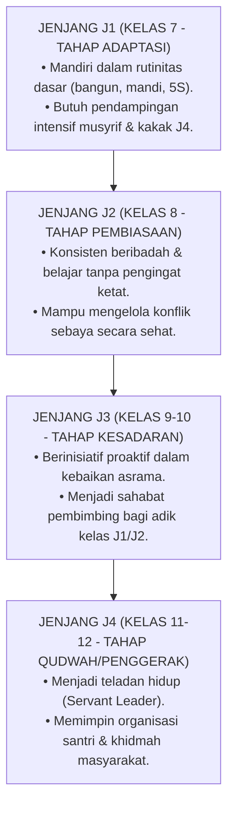

# Sub-Bab 9.1: Bercermin pada Rubrik Kemandirian

Di aula pertemuan santri, sebuah bagan besar matriks progresi kemandirian dipajang di dinding: **Matriks Taksonomi Progresi Tangga Kemandirian J1–J4 (*The J1-J4 Autonomy Matrix*)**.

Setiap akhir semester, santri melakukan sesi **Muhasabah Diri Terbimbing (*Guided Self-Reflection*)** menggunakan rubrik ipsatif:
* Santri mengevaluasi di level mana kemandirian mereka saat ini.
* Menetapkan target pertumbuhan karakter pribadi untuk semester berikutnya bersama musyrif dan wali kelas.

Sistem evaluasi berbasis progresi ini menghapuskan fenomena persaingan yang tidak sehat antarsantri, mengarahkan fokus setiap anak untuk bertumbuh melampaui capaian dirinya sendiri dari hari ke hari.
