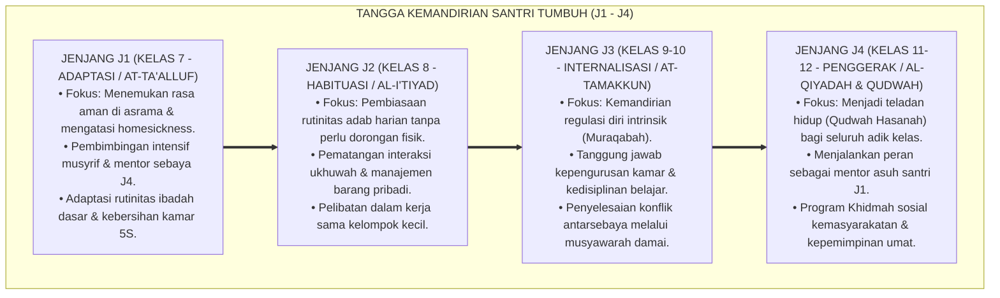

# BUKU 06: TANGGA KEMANDIRIAN SANTRI (JENJANG J1 HINGGA J4)
## *Trajektori Perkembangan Biososial-Spiritual, Penahapan Empat Jenjang Kemandirian, dan Puncak Karakter Penggerak*

---

**Nomor Buku**: `BOOK-SERIES-1/VOL-06/2026`  
**Sasaran Pembaca**: Musyrif Asrama, Wali Kelas, Pembina Organisasi Santri (OSIS/OPPM), Guru BK, dan Pimpinan Pondok  
**Dewan Pakar Pengkaji**: Pakar Desain Kurikulum Adab, Pakar Neurosains Perkembangan, Pakar Psikologi Sosial Santri, dan Pakar Tata Kelola Qudwah  

---

# BAGIAN I: TRAJEKTORI PERKEMBANGAN & URGENSI PENAHAPAN PERILAKU

## 1.1 Menolak Ekspektasi Kesempurnaan Instan (*Anti-Instant Perfectionism*)

Salah satu kekeliruan fatal dalam manajemen pesantren adalah memperlakukan santri baru berusia 12 tahun (yang baru pertama kali berpisah dari orang tuanya) dengan standar dan ekspektasi yang sama persis seperti santri senior berusia 18 tahun. Ketika santri baru menangis karena rindu rumah (*homesickness*), lupa mencuci pakaian, atau terlambat bangun Subuh, mereka kerap langsung dicap "pembangkang" dan dihukum berat.

Sistem TUMBUH memandang santri melalui lensa **psikologi perkembangan remaja (*Adolescent Developmental Science*)** dan tahapan tarbiyah Islam:
* Otak remaja tengah mengalami restrukturisasi besar-besaran (*synaptic pruning* dan *myelination* pada Prefrontal Cortex). Kapasitas pertimbangan masa depan, kontrol impuls, dan regulasi diri belum matang sempurna.[^1]
* Pertumbuhan karakter tidak terjadi dalam satu malam, melainkan melalui **Tangga Progresi Kemandirian 4 Jenjang (J1 hingga J4)** yang realistis, terukur, dan suportif.

---

# BAGIAN II: MATRIKS EMPAT JENJANG KEMANDIRIAN (J1–J4)

## 2.1 Dekomposisi Capaian Tiap Jenjang Kemandirian

| Jenjang | Tahap Karakter | Fokus Perkembangan Psikologis | Capaian Kunci Adab Santri | Peran Musyrif / Mentor |
| :---: | :--- | :--- | :--- | :--- |
| **J1** | **Adaptasi (*At-Ta'alluf*)** | Adaptasi lingkungan baru, mengatasi kecemasan perpisahan, membangun rasa percaya (*Trust*). | Mandiri merapikan tempat tidur, sholat 5 waktu tepat waktu bersama kamar, hafal doa harian. | *High Support, High Warmth*: Musyrif mendampingi langsung setiap jam transisi. |
| **J2** | **Habituasi (*Al-I'tiyad*)** | Pembentukan kebiasaan (*Habit Loop 66 Hari*), kepatuhan norma kelompok positif. | Mematuhi jadwal sirkadian 24 jam tanpa terlambat, menjaga kebersihan lemari dan pakaian secara mandiri. | *Guided Practice*: Musyrif memberikan *prompts* dan penguatan positif 4:1. |
| **J3** | **Internalisasi (*At-Tamakkun*)** | Penguatan identitas diri, penalaran moral otonom, kendali emosi saat konflik. | Mampu bermuhasabah mandiri, memimpin halaqah kecil, menjadi penengah perselisihan teman. | *Coaching & Mentoring*: Musyrif memfasilitasi sesi GROW Coaching dwipekanan. |
| **J4** | **Penggerak (*Al-Qiyadah*)** | Kepemimpinan melayani (*Servant Leadership*), jiwa pengabdian dan khidmah umat. | Menjadi kakak asuh bagi santri J1, memimpin majelis musyawarah asrama, inisiator kegiatan sosial. | *Delegation & Empowerment*: Musyrif berperan sebagai penasihat strategis (*Strategic Advisor*). |

---

## 2.2 Puncak Perkembangan: Tahap 7 Penggerak (The Servant Leader)

Pada puncak Jenjang J4, santri mencapai kematangan **Tahap 7 Penggerak**:
1. **Bebas Feodalisme**: Tidak meminta dilayani, tidak menyuruh adik kelas mencuci baju atau membawakan barang pribadinya, melainkan melayani dan mengayomi adik kelas (*Sayyidul Qaumi Khadimuhum*).
2. **Qudwah Qabla ad-Da'wah**: Berani menjadi yang pertama bangun Subuh, pertama berada di shaf depan masjid, dan pertama membersihkan sampah asrama.
3. **Kesiapan Khidmah Umat**: Santri diterjunkan dalam program pengabdian masyarakat (desa dhuafa) selama 1 semester untuk mempraktikkan ilmu secara langsung.

---

## 2.3 Mekanisme Kenaikan Jenjang (Sidang Munaqasyah Portofolio Adab)

Kenaikan jenjang dari J1 ke J2, J2 ke J3, dan J3 ke J4 tidak ditentukan oleh usia otomatis semata, melainkan melalui **Sidang Munaqasyah Portofolio Adab**:
* **Portofolio Refleksi Santri**: Kumpulan jurnal refleksi diri dan catatan pencapaian target ibadah.
* **Umpan Balik Sebaya (*Peer Review*)**: Testimoni kawan sekamar mengenai kejujuran dan akhlak santri.
* **Verifikasi Musyrif & Wali Kelas**: Data riil dari aplikasi Logbook Musyrif (bebas dari pelanggaran berat dan memiliki indeks konsistensi adab $\ge 80\%$).

---

# BAGIAN III: TABEL SINTESIS, CATATAN KAKI, & DAFTAR PUSTAKA

## 3.1 Tabel Sintesis Integrasi Tangga Kemandirian

| Jenjang | Tahapan Piaget & Erikson | Landasan Turats Tarbiyah | Indikator Sukses Kelulusan Jenjang |
| :---: | :--- | :--- | :--- |
| **J1** | *Early Adolescence & Industry vs. Inferiority* | Hadits *"Murru Auladakum bi ash-Shalah"* (Fase Pembiasaan). | 0% santri mengalami *drop-out* karena stres homesickness. |
| **J2** | *Middle Adolescence & Identity vs. Role Confusion* | Kaidah *"Al-Khairu 'Adah"* (Kebaikan adalah Kebiasaan). | 95% santri bangun Subuh mandiri tanpa ketukan pintu fisik. |
| **J3** | *Formal Operational & Moral Autonomy (Kohlberg)* | Konsep *Muraqabatullah* & Muhasabah Nafs. | Santri mampu menyelesaikan konflik kamar secara mandiri. |
| **J4** | *Late Adolescence & Generativity vs. Stagnation* | Konsep *Al-Khidmah wal Imāmah fid-Dīn*. | 100% santri J4 memimpin program mentoring adik kelas. |

---

## 3.2 Catatan Kaki (*Footnotes 1-to-1*)

[^1]: Steinberg, L. (2014). *Age of Opportunity: Lessons from the New Science of Adolescence*. Boston: Houghton Mifflin Harcourt.
[^2]: Erikson, E. H. (1994). *Identity: Youth and Crisis*. New York: W. W. Norton & Company.
[^3]: Kohlberg, L. (1984). *The Psychology of Moral Development: The Nature and Validity of Moral Stages*. San Francisco: Harper & Row.
[^4]: Ibnu Khaldun. (2001). *Muqaddimah Ibn Khaldun: Fashl fi Anna Syiddat al-Mu'allim Mudhirrah bi al-Muta'allim*. Beirut: Dar al-Fikr, hlm. 538–542.

---

## 3.3 Daftar Pustaka Standar APA 7th & Turats

* Erikson, E. H. (1994). *Identity: Youth and Crisis*. New York: W. W. Norton & Company.
* Ibnu Khaldun. (2001). *Muqaddimah Ibn Khaldun*. Beirut: Dar al-Fikr.
* Kohlberg, L. (1984). *The Psychology of Moral Development*. San Francisco: Harper & Row.
* Steinberg, L. (2014). *Age of Opportunity: Lessons from the New Science of Adolescence*. Boston: Houghton Mifflin Harcourt.
