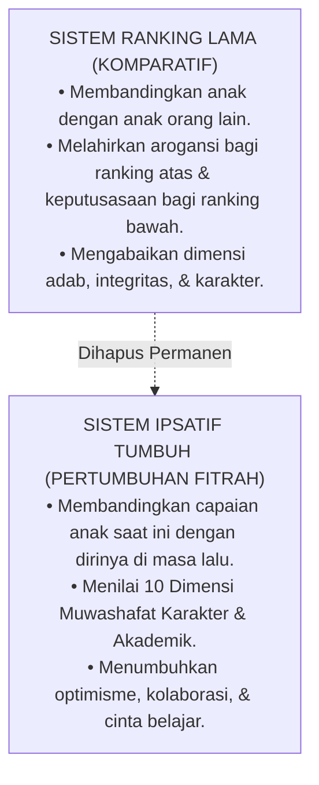

# Sub-Bab 1.2: Melihat Kebaikan yang Bertumbuh

Di era transformasi Ekosistem TUMBUH, sistem ranking komparatif dihapuskan total dari Pesantren Darul Adab, digantikan oleh **Sistem Evaluasi Pertumbuhan Ipsatif (*Ipsative Growth Assessment Model*)**.

Ustadz Burhan dan Ustadz Salman menjelaskan paradigma baru ini kepada seluruh santri dan dewan asatidz:

"Mulai hari ini," terang Burhan, "tidak ada lagi santri yang merasa kalah atau rendah diri karena angka rapor. Setiap santri bersaing dengan dirinya sendiri: apakah kejujuranku hari ini lebih baik dari kemarin? Apakah hafalanku bulan ini lebih mantap dari bulan lalu?"

Danang yang mendengarkan penjelasan itu mendongak dengan mata berbinar-binar. Beban berat rasa malu yang selama ini menghimpit jiwanya seketika runtuh, digantikan oleh semangat berkobar untuk terus bertumbuh dan berbuat kebaikan di setiap langkah hidupnya.
