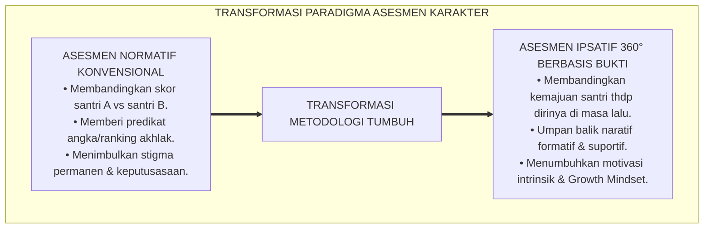
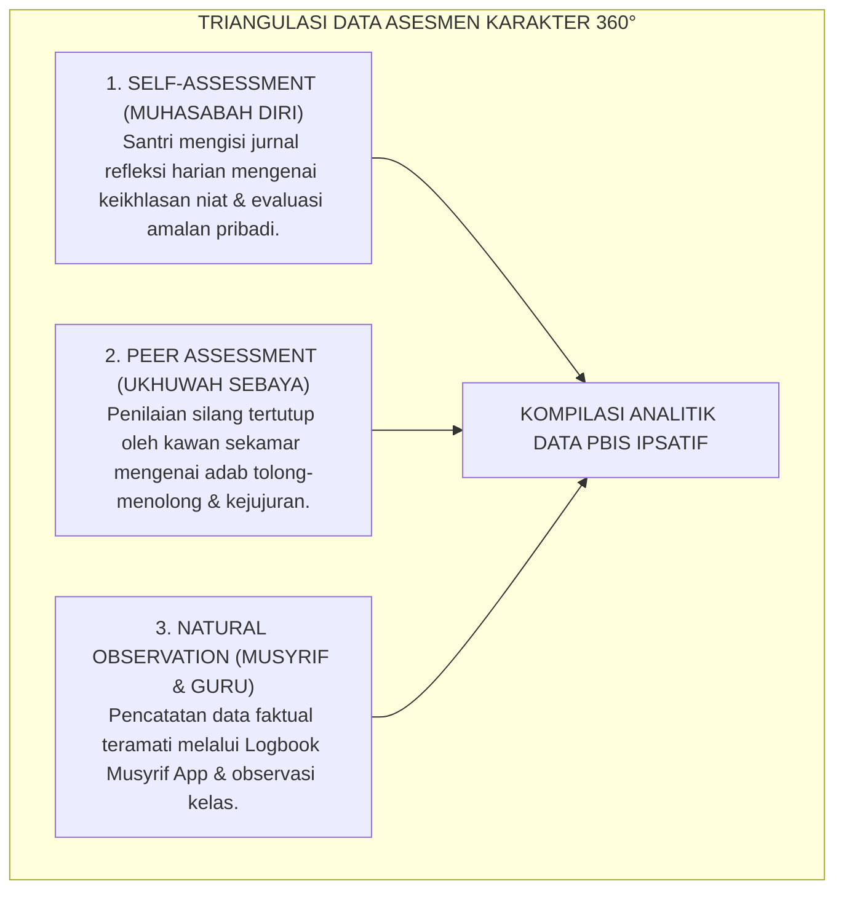

# BUKU 07: PANDUAN ASESMEN PERKEMBANGAN SANTRI
## *Sistem Asesmen Ipsatif Non-Ranking, Triangulasi 360 Derajat, dan Portofolio Rapor Naratif Karakter*

---

**Nomor Buku**: `BOOK-SERIES-1/VOL-07/2026`  
**Sasaran Pembaca**: Tim Pengembang Asesmen, Wali Kelas, Musyrif Asrama, Guru BK, dan Pimpinan Pesantren  
**Dewan Pakar Pengkaji**: Pakar Psikometri & Validasi Instrumen, Pakar Metodologi Riset TUMBUH, Pakar Pedagogi Master Guru, dan Pakar Epistemologi Turats  

---

# BAGIAN I: FILOSOFI ASESMEN KARAKTER & KRITIK SISTEM PERANKINGAN

## 1.1 Bahaya Perankingan Karakter (*The Fallacy of Character Ranking*)

Di dunia pendidikan pesantren konvensional, sering dijumpai praktik pemberian nilai akhlak dalam bentuk angka kering (misal: "Akhlak: 78" atau "Predikat: B") atau bahkan menyusun ranking santri "terbaik" hingga "terburuk" berdasarkan akumulasi poin pelanggaran.

Secara psikometri dan etika Islam, praktik meranking akhlak anak memiliki kelemahan mendasar:
1. **Memicu Perbandingan Sosial yang Merusak (*Destructive Social Comparison*)**: Santri yang menduduki peringkat bawah akan dicap (*labelled*) sebagai "santri nakal", memicu keputusasaan batin (*learned helplessness*) dan pengelompokan sub-kultur pemberontak (*Deviant Peer Contagion*).[^1]
2. **Ketiadaan Umpan Balik Fungsional**: Nilai angka "75" sama sekali tidak memberi tahu santri atau orang tua tentang adab apa yang sudah baik dan keterampilan emosional apa yang masih perlu diperbaiki.

Sistem TUMBUH menetapkan **Kebijakan Anti-Ranking Karakter (*Non-Ranking Policy*)**: Karakter dan adab santri dinilai bukan untuk dikompetisikan antar-santri, melainkan untuk **memantau trajektori pertumbuhan masing-masing santri terhadap dirinya sendiri di masa lalu**.

---

## 1.2 Hakikat Asesmen Ipsatif (*Ipsative Assessment*)

Asesmen Ipsatif adalah pendekatan evaluasi di mana **standar pembanding adalah kinerja awal santri itu sendiri (*Self-Referenced Measurement*)**.[^2]
* Jika Santri A pada bulan pertama hanya mampu bangun Subuh tepat waktu 3 hari dalam sepekan, lalu pada bulan kedua berhasil bangun 5 hari sepekan, maka ia mengalami **pertumbuhan positif (+66%)** dan berhak menerima apresiasi penuh atas ikhtiar kemajuannya.
* Asesmen Ipsatif menghargai setiap tetes keringat perjuangan (*mujahadah*) santri, menumbuhkan keyakinan bahwa karakter adalah sesuatu yang dapat terus dilatih dan disempurnakan.

---

# BAGIAN II: TRIANGULASI DATA 360° & RAPOR NARATIF BERBASIS KEKUATAN

## 2.1 Arsitektur Triangulasi Data 360 Derajat

Untuk menjamin objektivitas dan keadilan, asesmen karakter TUMBUH menggabungkan data dari **tiga sumber independen (Triangulasi 360°)**:

### 1. Penilaian Diri (*Muhasabah al-Fardiyyah*):
* Dilakukan setiap malam sebelum tidur selama 5 menit. Santri menuliskan 1 hal baik yang ia syukuri dan 1 hal yang ingin ia perbaiki esok hari.
* Melatih metakognisi dan kepekaan nurani (*dhamir*).

### 2. Penilaian Teman Sebaya (*Taqwim al-Aqran*):
* Dilakukan setiap akhir bulan dalam suasana lingkaran ukhuwah. Santri saling memberikan "Kartu Apresiasi Kebaikan" kepada teman sekamarnya.
* Memupuk budaya saling mendukung dan menghargai kebaikan kawan.

### 3. Observasi Alami Pendidik (*Direct Naturalistic Observation*):
* Musyrif dan wali kelas mencatat perilaku konkret santri pada aplikasi Logbook digital (misal: "Santri Ahmad membantu merapikan sandal di masjid tanpa disuruh").

---

## 2.2 Format Portofolio Rapor Naratif Karakter (*Strength-Based Narrative Report*)

Setiap akhir semester, orang tua tidak menerima lembaran angka dingin, melainkan **Buku Portofolio Naratif Karakter**:

| Bagian Rapor | Isi & Narasi Laporan | Contoh Redaksi Naratif |
| :--- | :--- | :--- |
| **1. Potret Kekuatan Karakter (*Character Strengths*)** | Menjelaskan 3 muwashafat utama yang paling menonjol pada diri santri. | *"Ananda Zaid menunjukkan keunggulan luar biasa dalam dimensi Nafi'un Lighairihi. Ia secara konsisten menjadi yang pertama membantu kawan yang sakit di asrama..."* |
| **2. Rekam Trajektori Pertumbuhan (*Growth Trajectory*)** | Menampilkan grafik kemandirian santri dari bulan ke bulan (J1/J2/J3/J4). | *"Dalam dimensi Haritsun 'ala Waqtihi, Ananda meningkat dari kemandirian 45% di awal semester menjadi 85% di akhir semester..."* |
| **3. Area Fokus Pembiasaan (*Next Step Focus*)** | Menetapkan 1 dimensi yang akan didampingi bersama antara pondok dan orang tua. | *"Untuk semester depan, mari bersama kita kuatkan dimensi Munazhzhamun fi Syu'unihi, khususnya dalam kerapian lemari pakaian..."* |
| **4. Karya & Refleksi Mandiri Santri (*Student's Voice*)** | Tulisan refleksi asli santri tentang apa yang paling ia syukuri selama satu semester di pondok. | Tulisan tangan asli santri yang menyentuh hati orang tua. |

---

# BAGIAN III: TABEL SINTESIS, CATATAN KAKI, & DAFTAR PUSTAKA

## 3.1 Tabel Sintesis Metodologi Asesmen Karakter

| Komponen Asesmen | Standar Turats Islam | Standar Psikometri Internasional | Dampak pada Santri |
| :--- | :--- | :--- | :--- |
| **Prinsip Evaluasi** | Kaidah *"Hasibu Anfusakum Qabla an Tuhasabu"*. | *Formative & Authentic Assessment (Wiggins)*. | Santri memiliki kesadaran diri (*Self-Awareness*) tinggi. |
| **Sumber Bukti** | Syahadat al-Udhul & Mu'ayyanah. | *Multi-Source Triangulation (Campbell & Fiske)*. | Menghilangkan bias subjektif dan prasangka penilai. |
| **Bentuk Laporan** | *Basyiran wa Nadziran* (Kabar Gembira & Pengingat). | *Strength-Based Narrative Reporting*. | Membangun sinergi harmonis antara orang tua dan pondok. |

---

## 3.2 Catatan Kaki (*Footnotes 1-to-1*)

[^1]: Dishion, T. J., & Tipsord, J. M. (2011). Peer contagion in child and adolescent social and emotional development. *Annual Review of Psychology*, 62, 189-214.
[^2]: Hughes, G. (2014). *Ipsative Assessment: Motivation Through Marking Progress*. London: Palgrave Macmillan.
[^3]: Wiggins, G. (1998). *Educative Assessment: Designing Assessments to Inform and Improve Student Performance*. San Francisco: Jossey-Bass.
[^4]: Campbell, D. T., & Fiske, D. W. (1959). Convergent and discriminant validation by the multitrait-multimethod matrix. *Psychological Bulletin*, 56(2), 81-105.
[^5]: Umar bin Al-Khattab. Riwayat at-Tirmidzi dalam *Sunan at-Tirmidzi*, no. 2459 (Hasan).

---

## 3.3 Daftar Pustaka Standar APA 7th & Turats

* Campbell, D. T., & Fiske, D. W. (1959). Convergent and discriminant validation by the multitrait-multimethod matrix. *Psychological Bulletin*, 56(2), 81-105.
* Dishion, T. J., & Tipsord, J. M. (2011). Peer contagion in child and adolescent social and emotional development. *Annual Review of Psychology*, 62, 189-214.
* Hughes, G. (2014). *Ipsative Assessment: Motivation Through Marking Progress*. London: Palgrave Macmillan.
* Wiggins, G. (1998). *Educative Assessment: Designing Assessments to Inform and Improve Student Performance*. San Francisco: Jossey-Bass.
