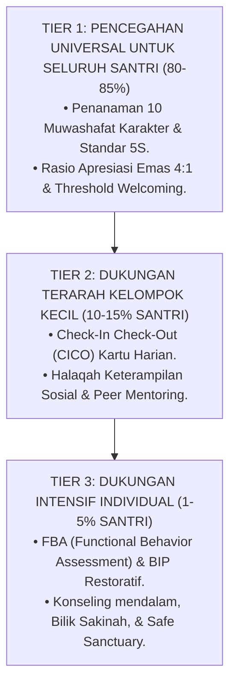

# Sub-Bab 1.1: Pencegahan Universal Untuk Semua Tier 1

Di ruang pertemuan utama Pesantren Darul Adab, sebuah piramida hijau-kuning-merah dipaparkan di layar proyektor oleh Ustadz Salman dan Tim Pengasuhan: **Sistem Intervensi Perilaku Positif Tiga Tingkat Kasih Sayang (*The Three-Tier Compassionate PBIS Model*)**.

Salman menjelaskan bahwa **Tier 1 (Pencegahan Universal)** adalah fondasi utama yang dinikmati oleh seluruh 100% santri:
* Penerapan lingkungan fisik yang bersih, terang, dan tertata rapi (*5S System*).
* Sapaan hangat dan senyuman di pintu gerbang kamar dan pintu kelas madrasah.
* Bahasa apresiasi 4:1 yang konsisten dari seluruh asatidz dan musyrif.

Ketika fondasi Tier 1 berjalan kokoh dan berkualitas tinggi, sebanyak **85% populasi santri** akan bertumbuh secara sehat, tertib, dan mandiri tanpa pernah memerlukan penanganan khusus.

Pencegahan primer yang penuh cinta adalah benteng terkuat yang melindungi ekosistem pesantren dari wabah pelanggaran adab.
