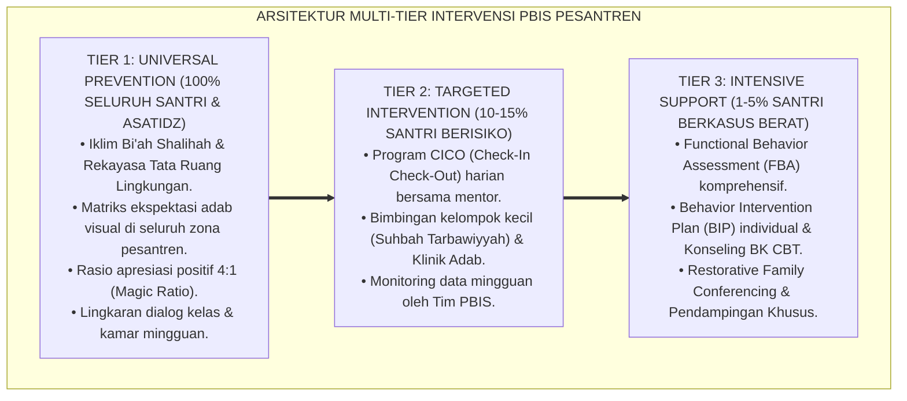
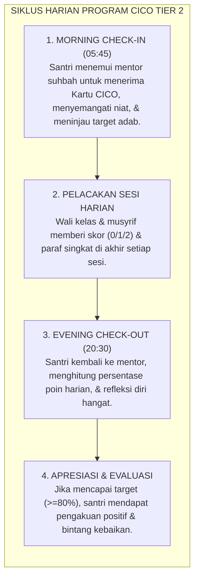

# BUKU 08: PANDUAN INTERVENSI BERJENJANG MULTI-TIER PBIS DI PESANTREN
## *Arsitektur Pencegahan Primer Tier 1, Protokol CICO Tier 2, dan Intervensi Intensif FBA/BIP Tier 3*

---

**Nomor Buku**: `BOOK-SERIES-1/VOL-08/2026`  
**Sasaran Pembaca**: Tim PBIS Lembaga, Guru Bimbingan Konseling (BK), Musyrif Asrama Senior, Wali Kelas, dan Pimpinan Pengasuhan  
**Dewan Pakar Pengkaji**: Pakar PBIS, Pakar Arsitektur PBIS Restoratif, Pakar Bimbingan Konseling, dan Pakar Intervensi Preventif  

---

# BAGIAN I: ARSITEKTUR MULTI-TIER & FILOSOFI INTERVENSI BERJENJANG

## 1.1 Menolak Model "Satu Ukuran untuk Semua" (*Anti-One Size Fits All*)

Dalam banyak pesantren, penanganan masalah perilaku sering kali bersifat seragam dan reaktif: semua santri yang terlambat atau melanggar aturan langsung diberi hukuman yang sama tanpa membedakan riwayat, tingkat keparahan, atau motif perilaku. Akibatnya, santri yang hanya butuh sedikit bimbingan merasa diperlakukan tidak adil, sedangkan santri yang mengalami krisis emosional berat tidak mendapatkan bantuan psikologis yang tepat.

Sistem TUMBUH menerapkan model **School-Wide Positive Behavioral Interventions and Supports (SW-PBIS) Multi-Tier** yang diintegrasikan dengan nilai-nilai kepengasuhan Islam (*Ri'ayah*). Sistem ini mengelompokkan dukungan pembinaan ke dalam **3 Tingkat (Tier)** yang proporsional dan berbasis data:

---

# BAGIAN II: PROTOKOL OPERASIONAL TIER 1, TIER 2, & TIER 3

## 2.1 Protokol Tier 1: Pencegahan Universal (100% Santri)

Tier 1 adalah fondasi utama yang menjamin **80–85% santri dapat bertumbuh optimal tanpa memerlukan intervensi khusus**:
1. **Pengajaran Eksplisit Nilai Adab**: Adab tidak hanya diperintahkan, melainkan diajarkan langkah demi langkah melalui pemodelan (*modeling*), latihan peran (*role-play*), dan pengingat visual (*visual nudges*).
2. **Rasio Apresiasi Emas 4:1**: Setiap pendidik dan musyrif membiasakan diri memberikan minimal 4 penguatan verbal/apresiasi kebaikan untuk setiap 1 teguran korektif.
3. **Penyediaan Lingkungan Bebas Gesekan (*Low-Friction Environment*)**: Mengatur tata letak antrean wudhu, kamar mandi, dan ruang makan agar tidak memicu senggolan dan pertikaian fisik.

---

## 2.2 Protokol Tier 2: Intervensi Terarah CICO (10–15% Santri)

Jika seorang santri menunjukkan gejala kesulitan adaptasi atau pelanggaran ringan berulang (misal: sering terlambat sholat atau kamar berantakan $\ge 3$ kali dalam sepekan), ia mendapatkan bantuan **Program Check-In / Check-Out (CICO)** selama 4–6 pekan:

### Spesifikasi Format Kartu Harian CICO:
* **Target Poin Harian**: Minimal 80% dari total poin maksimal.
* **Kriteria Skor**:
  * $2$ = Menunjukkan adab secara mandiri dan sangat baik.
  * $1$ = Menunjukkan adab setelah diingatkan dengan lembut 1 kali.
  * $0$ = Belum menunjukkan adab atau butuh pengingat berulang.

---

## 2.3 Protokol Tier 3: Intervensi Intensif FBA & BIP (1–5% Santri)

Bagi santri yang mengalami krisis perilaku berat (misal: perkelahian kronis, perundungan, atau indikasi depresi berat), Tim PBIS bersama Guru BK menyusun:

1. **Functional Behavior Assessment (FBA)**:
   * Menganalisis fungsi perilaku menggunakan peta **A-B-C**:
     * **Antecedent (Pemicu)**: Apa yang memicu perilaku tersebut? (Misal: diejek saat jam istirahat).
     * **Behavior (Perilaku Nyata)**: Apa tindakan yang muncul? (Misal: memukul meja dan membanting pintu).
     * **Consequence (Konsekuensi Batin)**: Apa yang didapatkan santri dari perbuatan itu? (Misal: menghindari rasa malu atau menarik perhatian).
2. **Behavior Intervention Plan (BIP)**:
   * Menyusun rencana intervensi individual yang mengajarkan **perilaku pengganti yang dapat diterima (*Replacement Behavior*)** dan memberikan terapi konseling CBT berbasis tasawuf Islam (*Islamic Narrative Therapy*).

---

# BAGIAN III: TABEL SINTESIS, CATATAN KAKI, & DAFTAR PUSTAKA

## 3.1 Tabel Sintesis Matriks Multi-Tier PBIS

| Tingkatan | Sasaran Populasi | Penanggung Jawab Utama | Durasi Intervensi |
| :---: | :--- | :--- | :--- |
| **Tier 1** | Seluruh Santri (100%) | Seluruh Asatidz & Musyrif | Berkelanjutan sepanjang tahun ajaran. |
| **Tier 2** | Santri Butuh Pendampingan (10–15%) | Mentor Suhbah & Wali Kelas | 4 hingga 8 pekan evaluasi berkala. |
| **Tier 3** | Kasus Kompleks Khusus (1–5%) | Konselor BK, Musyrif Senior, & Orang Tua | Intervensi mendalam berkelanjutan. |

---

## 3.2 Catatan Kaki (*Footnotes 1-to-1*)

[^1]: Sugai, G., & Horner, R. H. (2002). The evolution of discipline practices: School-wide positive behavior supports. *Child & Family Behavior Therapy*, 24(1-2), 23-50.
[^2]: Crone, D. A., Hawken, L. S., & Horner, R. H. (2010). *Responding to Problem Behavior in Schools: The Behavior Education Program (Check-In, Check-Out)* (2nd ed.). New York: Guilford Press.
[^3]: O'Neill, R. E., Albin, R. W., Storey, K., Horner, R. H., & Sprague, J. R. (2015). *Functional Assessment and Program Development for Problem Behavior: A Practical Handbook*. Stamford, CT: Cengage Learning.
[^4]: Al-Ghazali, Abu Hamid. (2005). *Ihya' 'Ulum ad-Din: Kitab 'Ilaj Amradh al-Qulub*. Beirut: Dar Ibn Hazm, juz 3, hlm. 95–112.

---

## 3.3 Daftar Pustaka Standar APA 7th & Turats

* Al-Ghazali, A. H. (2005). *Ihya' 'Ulum ad-Din*. Beirut: Dar Ibn Hazm.
* Crone, D. A., Hawken, L. S., & Horner, R. H. (2010). *Responding to Problem Behavior in Schools: The Behavior Education Program (Check-In, Check-Out)*. New York: Guilford Press.
* O'Neill, R. E., Albin, R. W., Storey, K., Horner, R. H., & Sprague, J. R. (2015). *Functional Assessment and Program Development for Problem Behavior*. Stamford, CT: Cengage Learning.
* Sugai, G., & Horner, R. H. (2002). The evolution of discipline practices: School-wide positive behavior supports. *Child & Family Behavior Therapy*, 24(1-2), 23-50.
