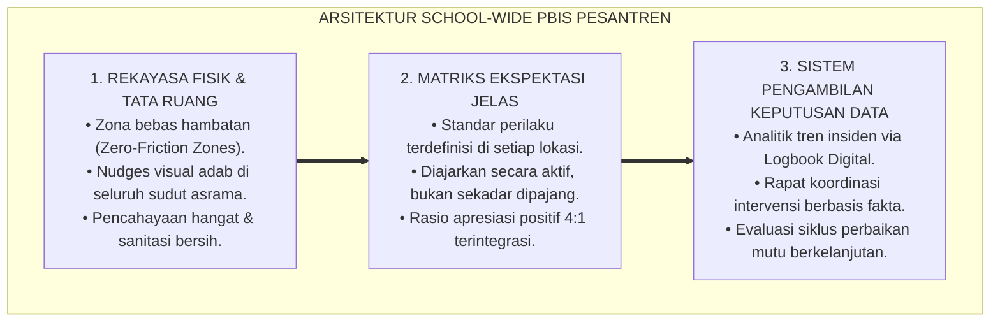

# BUKU 09: SCHOOL-WIDE PBIS DI PESANTREN
## *Arsitektur Tata Ruang Lingkungan, Matriks Ekspektasi Visual Seluruh Zona, dan Pengambilan Keputusan Berbasis Data Faktual*

---

**Nomor Buku**: `BOOK-SERIES-1/VOL-09/2026`  
**Sasaran Pembaca**: Pimpinan Lembaga, Koordinator PBIS Pesantren, Kepala Sarana Prasarana, Kepala Asrama, dan Seluruh Dewan Asatidz  
**Dewan Pakar Pengkaji**: Pakar PBIS, Pakar Intervensi Preventif, Pakar Arsitektur PBIS Restoratif, dan Pakar Tata Kelola Qudwah  

---

# BAGIAN I: ARSITEKTUR BUDAYA POSITIF & REKAYASA LINGKUNGAN 24 JAM

## 1.1 Fondasi Bi'ah Shalihah: Lingkungan yang Membentuk Perilaku

Dalam kaidah pendidikan Islam, pembentukan karakter tidak hanya bergantung pada nasihat lisan, melainkan sangat ditentukan oleh iklim lingkungan tempat santri hidup (*Bi'ah Shalihah*). Rasulullah SAW mengumpamakan pengaruh lingkungan seperti berteman dengan penjual minyak wangi atau pandai besi (HR. Bukhari).

Sains arsitektur perilaku kontemporer melalui pendekatan **Environmental Engineering & Choice Architecture** membuktikan bahwa lingkungan fisik dan sosial dapat dirancang secara proaktif untuk mempermudah santri berbuat baik (*Nudges*) dan mempersulit terjadinya pelanggaran:
* Jika tempat wudhu sempit, licin, dan gelap, maka akan memicu antrean saling dorong, pertengkaran, dan sandal yang tertukar.
* Jika tempat wudhu luas, berlantai anti-selip, memiliki rak sandal berlabel nomor rapi, dan diterangi cahaya hangat yang nyaman, santri secara otomatis akan berwudhu dengan tenang dan tertib tanpa perlu diteriaki.

---

# BAGIAN II: MATRIKS EKSPEKTASI PERILAKU POSITIF SELURUH ZONA

## 2.1 Matriks Ekspektasi Perilaku Visual Pesantren (The PBIS Matrix)

Pesantren merumuskan **Matriks Ekspektasi Adab** yang ringkas, bernada positif, dan dipasang secara visual di setiap zona:

| Zona Pesantren | Sikap Salimul Aqidah & Ibadah | Sikap Matinul Khuluq & Ukhuwah | Sikap Munazhzham & Bersih (5S) |
| :--- | :--- | :--- | :--- |
| 🕌 **Masjid / Musholla** | Masuk dengan kaki kanan & membaca doa. Sholat tahiyyatul masjid langsung. | Mengucapkan salam lembut, tidak berbicara keras, dan tidak bercanda. | Merapikan sandal di rak bernomor, sajadah terlipat rapi, Al-Qur'an kembali ke rak. |
| 🛏️ **Kamar Asrama** | Membaca doa sebelum & sesudah bangun. Menjaga aurat dan sholat rawatib. | Menghormati privasi kawan, berbagi makanan, menggunakan kata tolong/maaf. | Kasur rapi (*hospital corner*), lemari tertutup, pakaian kotor di keranjang cucian. |
| 🏫 **Kelas Madrasah** | Niat ikhlas menuntut ilmu, berwudhu sebelum mulai, berdoa bersama guru. | Mendengarkan guru dengan khusyuk (*inshat*), santun dalam bertanya/berdiskusi. | Meja dan kursi lurus, papan tulis bersih, lantai bebas dari sampah kertas. |
| 🍽️ **Ruang Makan / Dapur** | Membaca bismillah, makan dengan tangan kanan, tidak mencela makanan. | Mengantre tertib tanpa menyerobot, mendahulukan adik kelas dan teman yang sakit. | Mengembalikan piring ke tempat cuci, meja makan bersih dan kering pasca-makan. |
| 🚿 **Kamar Mandi / Wudhu** | Masuk kaki kiri, menjaga doa, tidak berlama-lama di dalam toilet. | Menghormati antrean kawan, tidak menggedor pintu toilet secara kasar. | Menyiram toilet hingga bersih (*flushing*), mematikan keran air setelah wudhu. |

---

## 2.2 Pengambilan Keputusan Berbasis Data Faktual (*Data-Based Decision Making*)

SW-PBIS menolak penanganan masalah berdasarkan rumor, gosip, atau prasangka. Tim PBIS memanfaatkan **Data Logbook Musyrif Digital** untuk melihat pola masalah:
1. **Analisis Waktu (*Time Analysis*)**: Jam berapa pelanggaran paling sering terjadi? (Misal: pukul 16:30–17:15 saat transisi olahraga ke kamar mandi).
2. **Analisis Lokasi (*Location Analysis*)**: Di zona mana insiden paling banyak terjadi? (Misal: lorong asrama belakang dekat jemuran).
3. **Analisis Tindak Lanjut (*Action Plan*)**: Menempatkan musyrif patroli (*Warm Presence*) di lorong tersebut pada jam rawan, sehingga insiden berkurang hingga $80\%$ secara preventif.

---

# BAGIAN III: TABEL SINTESIS, CATATAN KAKI, & DAFTAR PUSTAKA

## 3.1 Tabel Sintesis Integrasi SW-PBIS Pesantren

| Komponen PBIS | Landasan Teoretis Modern | Padanan Turats Islam | Indikator Keberhasilan |
| :--- | :--- | :--- | :--- |
| **Environmental Design** | *Choice Architecture (Thaler & Sunstein)*. | Kaidah *Sadd adz-Dzari'ah* (Menutup celah fitnah). | Penurunan angka pelanggaran di titik rawan $\ge 70\%$. |
| **Matrix Expectations** | *Applied Behavior Analysis (Cooper et al.)*. | Konsep *Bayan al-Adab wa at-Ta'lim*. | 100% zona memiliki plang ekspektasi visual adab. |
| **Data Analytics** | *Continuous Quality Improvement (Deming)*. | Prinsip *Tabayyun* & Hisab Data. | Keputusan intervensi $100\%$ berbasis bukti faktual. |

---

## 3.2 Catatan Kaki (*Footnotes 1-to-1*)

[^1]: Sugai, G., & Horner, R. H. (2006). A promising approach for expanding and sustaining school-wide positive behavior support. *School Psychology Review*, 35(2), 245-259.
[^2]: Thaler, R. H., & Sunstein, C. R. (2008). *Nudge: Improving Decisions About Health, Wealth, and Happiness*. New Haven: Yale University Press.
[^3]: Cooper, J. O., Heron, T. E., & Heward, W. L. (2020). *Applied Behavior Analysis* (3rd ed.). Hoboken, NJ: Pearson.
[^4]: Imam Al-Bukhari. *Shahih al-Bukhari*, Kitab al-Buyu', Bab fi al-'Ithar wa Bai' al-Misk, no. 2101.

---

## 3.3 Daftar Pustaka Standar APA 7th & Turats

* Cooper, J. O., Heron, T. E., & Heward, W. L. (2020). *Applied Behavior Analysis*. Hoboken, NJ: Pearson.
* Sugai, G., & Horner, R. H. (2006). A promising approach for expanding and sustaining school-wide positive behavior support. *School Psychology Review*, 35(2), 245-259.
* Thaler, R. H., & Sunstein, C. R. (2008). *Nudge: Improving Decisions About Health, Wealth, and Happiness*. New Haven: Yale University Press.
