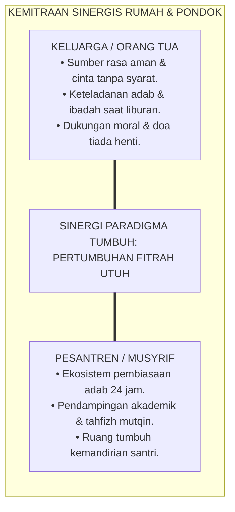
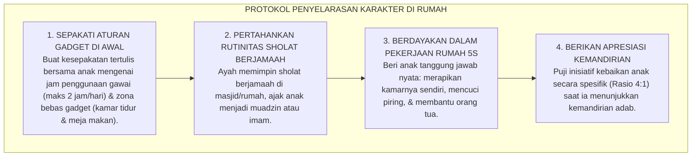

# BUKU 10: PANDUAN ORANG TUA (PARENT HANDBOOK)
## *Buku Saku Kemitraan Keluarga dan Pesantren: Merawat Fitrah, Menyelaraskan Pengasuhan, dan Menjaga Habit Karakter di Rumah*

---

**Nomor Buku**: `BOOK-SERIES-1/VOL-10/2026`  
**Sasaran Pembaca**: Wali Santri, Calon Orang Tua Santri, Pengurus Komite/Keluarga Wali Santri, dan Humas Pesantren  
**Dewan Pakar Pengkaji**: Pakar Bimbingan Konseling, Pakar Tata Kelola Qudwah, Pakar Social-Emotional Learning, dan Pakar Pengasuhan Asrama  

---

# BAGIAN I: HAKIKAT KEMITRAAN & MENDEKONSTRUKSI LEPAS TANGAN

## 1.1 Menitipkan Bukan Berarti Lepas Tangan (*Beyond Abdication of Parenting*)

Salah satu salah kaprah terbesar yang kerap terjadi adalah anggapan bahwa ketika seorang anak telah dimasukkan ke pesantren, maka seluruh tanggung jawab pengasuhan, pendidikan akhlak, dan pembentukan karakter anak telah "dibeli putus" dan diserahkan 100% kepada kiai dan musyrif pondok.

Dalam pandangan Islam dan sains psikologi keluarga, **orang tua tetap memegang amanah fitrah paling mendasar di hadapan Allah SWT**. Pesantren adalah mitra strategis (*Educational Partner*), bukan tempat penitipan anak atau "bengkel reparasi anak bermasalah".

Jika terjadi kontradiksi pengasuhan—di pondok diajarkan bangun Subuh mandiri dan membatasi gadget, namun di rumah orang tua memanjakan anak dengan gawai nonstop dan membiarkan sholat terlewat—maka karakter anak akan terbelah (*Cognitive Dissonance*) dan pembiasaan adab akan runtuh saat liburan.

---

# BAGIAN II: PANDUAN PRAKTIS ORANG TUA DARI HARI PERTAMA HINGGA LIBURAN

## 2.1 Menangani Masa Awal Mondok & Homesickness dengan Bijak

Ketika santri baru pertama kali masuk pondok, wajar jika ia merasa sedih, rindu rumah (*homesick*), atau bahkan menangis saat ditelepon/dikunjungi:

| Tindakan Keliru Orang Tua (Harus Dihindari) | Tindakan Tepat Orang Tua Berbasis Sistem TUMBUH |
| :--- | :--- |
| ❌ Langsung panik, ikut menangis tersedu-sedu, dan mengajak anak pulang/berhenti mondok. | ✅ Memberikan validasi emosi hangat: *"Ayah/Ibu tahu Ananda rindu, itu wajar sekali. Ayah/Ibu bangga Ananda sedang berjuang menjadi mujahid ilmu."* |
| ❌ Menyalahkan musyrif atau lingkungan pondok secara reaktif di grup media sosial. | ✅ Berkomunikasi secara privat dan konstruktif dengan Musyrif Kamar atau Wali Kelas melalui Parent Portal. |
| ❌ Mengirimkan makanan ringan berlebih atau barang mewah terlarang secara diam-diam. | ✅ Mematuhi SOP asrama untuk menjaga kesederhanaan dan keadilan sosial bagi seluruh santri. |

---

## 2.2 Menjaga *Habit Loop* Karakter saat Liburan Semester di Rumah

Liburan semester adalah ujian sesungguhnya dari keberhasilan tarbiyah. Agar pencapaian karakter anak tidak mengalami kemunduran (*relapse*), orang tua disarankan menerapkan **Protokol 4 Langkah Pengasuhan Selaras di Rumah**:

---

## 2.3 Pemanfaatan Aplikasi Parent Portal Digital

Pesantren menyediakan aplikasi **Parent Portal** agar orang tua dapat memantau perkembangan anak secara transparan:
1. **Laporan Naratif Portofolio**: Melihat catatan kekuatan karakter anak (*Character Strengths*) dan grafik kemandirian bulanan.
2. **Kanal Konsultasi Edukatif**: Mengajukan jadwal konsultasi daring bersama Wali Kelas atau Konselor BK.
3. **Pemberitahuan Kesehatan & Administrasi**: Informasi kondisi medis anak di poskestren dan status tabungan uang saku secara transparan.

---

# BAGIAN III: TABEL SINTESIS, CATATAN KAKI, & DAFTAR PUSTAKA

## 3.1 Tabel Sintesis Pedoman Kemitraan Orang Tua

| Tahapan Interaksi | Peran Orang Tua | Landasan Teoretis & Turats |
| :--- | :--- | :--- |
| **Masa Adaptasi (Bulan 1–3)** | Memberikan rasa aman emosional & doa tulus (*Du'a al-Walidain*). | *Attachment Theory (Bowlby) & Doa Mustajab*. |
| **Masa Sekolah (Bulan 4–12)** | Mendukung aturan pondok & komunikasi via Parent Portal. | *Home-School Collaboration (Epstein)*. |
| **Masa Liburan Semester** | Menjadi teladan hidup (*Qudwah*) & menjaga habit 5S di rumah. | *Social Learning Theory (Bandura) & Birrul Walidain*. |

---

## 3.2 Catatan Kaki (*Footnotes 1-to-1*)

[^1]: Epstein, J. L. (2018). *School, Family, and Community Partnerships: Preparing Educators and Improving Schools* (2nd ed.). New York: Routledge.
[^2]: Bowlby, J. (1988). *A Secure Base: Parent-Child Attachment and Healthy Human Development*. New York: Basic Books.
[^3]: Al-Ghazali, Abu Hamid. (2005). *Ihya' 'Ulum ad-Din: Kitab Adab al-Mu'asyarah wa Huquq al-Ahl*. Beirut: Dar Ibn Hazm, juz 2, hlm. 45–60.
[^4]: Bandura, A. (1977). *Social Learning Theory*. Englewood Cliffs, NJ: Prentice-Hall.

---

## 3.3 Daftar Pustaka Standar APA 7th & Turats

* Al-Ghazali, A. H. (2005). *Ihya' 'Ulum ad-Din*. Beirut: Dar Ibn Hazm.
* Bowlby, J. (1988). *A Secure Base: Parent-Child Attachment and Healthy Human Development*. New York: Basic Books.
* Epstein, J. L. (2018). *School, Family, and Community Partnerships: Preparing Educators and Improving Schools*. New York: Routledge.
