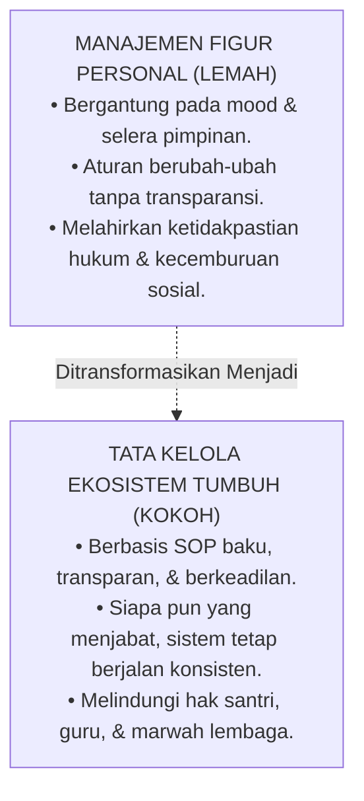

# Sub-Bab 2.2: Kepastian Sistem Bukan Selera Pribadi

Dalam salah satu sesi pelatihan manajemen pimpinan, Ustadz Salman menjelaskan prinsip penting keberlanjutan organisasi modern: **Kekuasaan Sistem Menggantikan Subjektivitas Personal (*Institutional Systemic Certainty vs Personal Whims*)**.

Salman memaparkan perbandingan yang tajam:

"Kepastian sistem," terang Salman, "memberikan rasa aman bagi seluruh warga pesantren. Santri tahu hak dan kewajibannya dengan pasti, orang tua tahu prosedur penanganan anak dengan transparan, dan para guru merasa terlindungi oleh aturan yang adil."

Pesantren Darul Adab bertransformasi menjadi sebuah **Organisasi Pembelajar yang Tangguh (*Resilient Learning Organization*)** yang mampu bertahan dan berkembang melintasi berbagai pergantian generasi kepemimpinan tanpa pernah kehilangan arah dan ruh perjuangannya.
