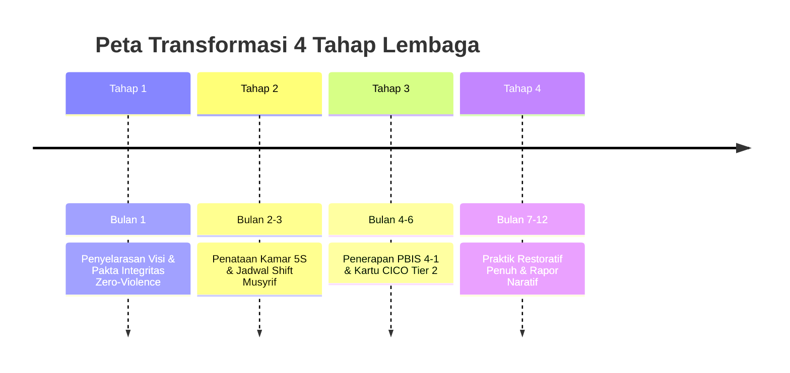

# Sub-Bab 2.1: Tahun Pertama Menabur Benih (Roadmap 4 Tahap)

Bagi sebuah pondok pesantren yang ingin bertransformasi mengadopsi Sistem TUMBUH, perjalanan perubahan diatur melalui **Roadmap Empat Tahap yang Realistis**:

1. **Bulan 1 (Penyelarasan Visi)**: Melatih seluruh guru dan musyrif untuk meninggalkan paradigma kekerasan, memahami ontologi fitrah, dan menandatangani deklarasi *Zero-Violence*.
2. **Bulan 2–3 (Infrastruktur & SOP)**: Menata kamar standar 5S, menetapkan jadwal sirkadian sehat (tidur 7 jam), dan membagi tugas jaga musyrif menjadi 4 shift kerja teratur.
3. **Bulan 4–6 (Pembiasaan PBIS)**: Mengajarkan 10 Muwashafat Adab, menerapkan rasio apresiasi 4:1, dan menjalankan program CICO bagi santri yang butuh bantuan.
4. **Bulan 7–12 (Restoratif & Sertifikasi)**: Menjalankan Majelis Ishlah 3R, menerbitkan Buku Rapor Naratif Karakter, dan meraih sertifikasi pesantren ramah anak.

Transformasi tidak menuntut perubahan revolusioner yang terburu-buru, melainkan langkah-langkah konsisten yang terukur dan dijaga dengan keikhlasan bersama.
