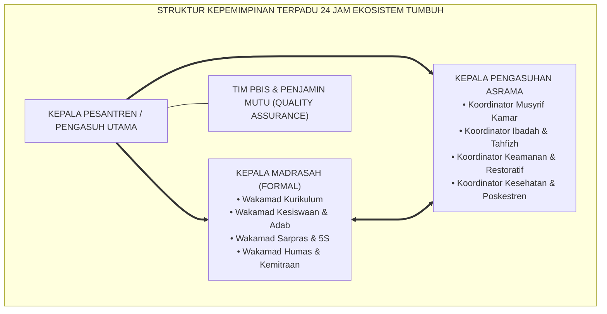
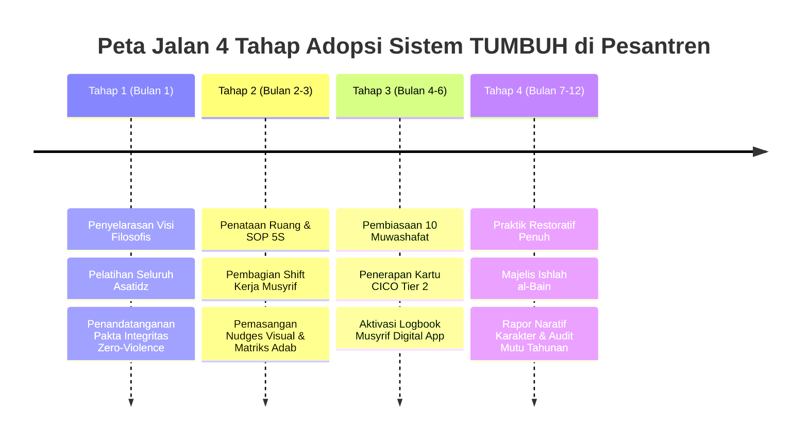

# BUKU 11: MANUAL IMPLEMENTASI SISTEM TUMBUH
## *Blueprint Tata Kelola Kelembagaan 24 Jam, Roadmap Adopsi Empat Tahap, dan Siklus Penjaminan Mutu Berkelanjutan (PDCA)*

---

**Nomor Buku**: `BOOK-SERIES-1/VOL-11/2026`  
**Sasaran Pembaca**: Yayasan / Badan Wakaf, Pimpinan Pondok Pesantren, Tim Penjamin Mutu, Kepala Bagian Tata Usaha, dan Konsultan Pendidikan Islam  
**Dewan Pakar Pengkaji**: Pakar Tata Kelola Qudwah, Pakar Metodologi Riset TUMBUH, Pakar Kritikus & Auditor Kualitas, dan Pakar Perlindungan Anak  

---

# BAGIAN I: BLUEPRINT TATA KELOLA KELEMBAGAAN PESANTREN 24 JAM

## 1.1 Struktur Kepemimpinan Terpadu Tanpa Dikotomi

Kelemahan struktural yang sering melumpuhkan pesantren adalah adanya "dua matahari kembar": pihak Madrasah/Sekolah yang merasa hanya bertanggung jawab pada jam pelajaran pagi, dan pihak Pengasuhan/Asrama yang merasa berjalan sendiri di malam hari.

Sistem TUMBUH merancang **Struktur Organisasi Kepemimpinan Terpadu (*Integrated Governance Structure*)**:

---

# BAGIAN II: ROADMAP ADOPSI SISTEM TUMBUH 4 TAHAP

## 2.1 Roadmap Transformasi Bertahap (Bulan 1 hingga 12)

Transformasi menuju ekosistem TUMBUH dilakukan secara sistematis melalui **Roadmap 4 Tahap**:

| Tahapan | Durasi | Agenda Utama Aksi | Target Capaian (Milestone) |
| :---: | :---: | :--- | :--- |
| **Tahap 1: Penyelarasan Visi** | Bulan 1 | Workshop dekonstruksi hukuman fisik, pemahaman ontologi fitrah, deklarasi *Zero Corporal Punishment*. | 100% civitas menyepakati pakta integritas ramah anak. |
| **Tahap 2: Infrastruktur & SOP** | Bulan 2–3 | Penataan kamar standar 5S, jadwal sirkadian sehat (tidur 7 jam), penetapan 4 shift kerja musyrif. | SOP kamar 5S dan shift musyrif berjalan tertib. |
| **Tahap 3: Implementasi PBIS** | Bulan 4–6 | Penerapan penguatan 4:1, pelatihan mentor CICO, pengisian logbook musyrif digital. | Indeks kepatuhan adab santri meningkat $\ge 80\%$. |
| **Tahap 4: Restoratif & Evaluasi** | Bulan 7–12 | Implementasi Majelis Ishlah 3R, pembagian Rapor Naratif Karakter, audit mutu kepatuhan tahunan. | Pesantren tersertifikasi sebagai *Safe Sanctuary School*. |

---

## 2.2 Siklus Penjaminan Mutu Berkelanjutan: PDCA Cycle

Penerapan Sistem TUMBUH diaudit setiap semester menggunakan siklus **PDCA (Plan, Do, Check, Act)**:
* **Plan**: Merumuskan target muwashafat dan kalender pembinaan semester.
* **Do**: Menjalankan SOP 24 jam, KBM adab, dan program CICO harian.
* **Check**: Menganalisis data logbook musyrif, survei kepuasan santri, dan laporan insiden.
* **Act**: Melakukan koreksi terhadap titik rawan (*hotspots*) dan memperbarui instrumen pembinaan.

---

# BAGIAN III: TABEL SINTESIS, CATATAN KAKI, & DAFTAR PUSTAKA

## 3.1 Tabel Matriks RACI Tata Kelola Lembaga

| Aktivitas Lembaga | Kepala Pesantren | Kepala Madrasah | Kepala Asrama | Musyrif / Walas |
| :--- | :---: | :---: | :---: | :---: |
| **Penetapan Kebijakan Zero-Violence** | **A** (Accountable) | **R** (Responsible) | **R** (Responsible) | **I** (Informed) |
| **Penyusunan Shift Kerja Musyrif** | **I** (Informed) | **C** (Consulted) | **A / R** | **R** (Responsible) |
| **Penanganan Kasus Tier 3 & Ishlah** | **A** (Accountable) | **R** (Responsible) | **R** (Responsible) | **C** (Consulted) |
| **Pelaporan Rapor Naratif Karakter** | **I** (Informed) | **A** (Accountable) | **C** (Consulted) | **R** (Responsible) |

---

## 3.2 Catatan Kaki (*Footnotes 1-to-1*)

[^1]: Deming, W. E. (1986). *Out of the Crisis*. Cambridge, MA: MIT Press.
[^2]: Kotter, J. P. (2012). *Leading Change*. Boston, MA: Harvard Business Review Press.
[^3]: Al-Mawardi, 'Ali bin Muhammad. (2006). *Al-Ahkam as-Sulthaniyyah wal Wilayat ad-Diniyyah*. Kairo: Dar al-Hadits, hlm. 28–45.
[^4]: Sugai, G., & Horner, R. H. (2006). A promising approach for expanding and sustaining school-wide positive behavior support. *School Psychology Review*, 35(2), 245-259.

---

## 3.3 Daftar Pustaka Standar APA 7th & Turats

* Al-Mawardi, 'A. M. (2006). *Al-Ahkam as-Sulthaniyyah wal Wilayat ad-Diniyyah*. Kairo: Dar al-Hadits.
* Deming, W. E. (1986). *Out of the Crisis*. Cambridge, MA: MIT Press.
* Kotter, J. P. (2012). *Leading Change*. Boston, MA: Harvard Business Review Press.
* Sugai, G., & Horner, R. H. (2006). A promising approach for expanding and sustaining school-wide positive behavior support. *School Psychology Review*, 35(2), 245-259.
