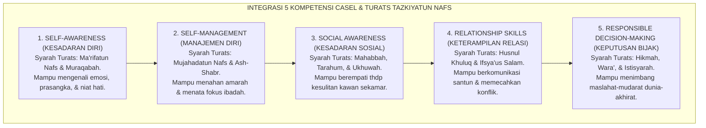
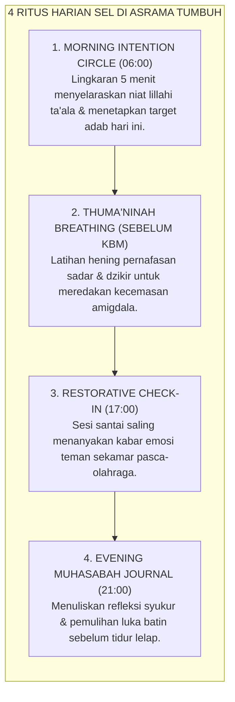

# BUKU 12: SOCIAL-EMOTIONAL LEARNING (SEL) DI PESANTREN
## *Integrasi Lima Kompetensi CASEL dengan Tazkiyatun Nafs, Neurosains Kognitif, dan Praktik Pengasuhan Kalbu*

---

**Nomor Buku**: `BOOK-SERIES-1/VOL-12/2026`  
**Sasaran Pembaca**: Guru Bimbingan Konseling (BK), Wali Kelas, Musyrif Asrama, Pembina Karakter, dan Pengajar Kitab Tasawuf  
**Dewan Pakar Pengkaji**: Pakar Social-Emotional Learning, Pakar Neurosains Perkembangan, Pakar Epistemologi Turats, dan Pakar Bimbingan Konseling  

---

# BAGIAN I: SINTESIS TAZKIYATUN NAFS & LIMA KOMPETENSI CASEL

## 1.1 Titik Temu: Dari Penyucian Jiwa Menuju Kematangan Sosio-Emosional

Dalam tradisi Islam klasik, pendidikan yang hakiki adalah **penyucian jiwa (*Tazkiyatun Nafs*) dan penataan adab batin**. Imam Al-Ghazali dalam *Ihya' 'Ulum ad-Din* menegaskan bahwa kalbu (*al-qalb*) adalah raja dari seluruh anggota tubuh, di mana kesehatan perilakunya bergantung pada kemampuannya mengendalikan syahwat dan amarah di bawah bimbingan akal dan syariat.[^1]

Di era modern, kerangka kerja **Collaborative for Academic, Social, and Emotional Learning (CASEL)** merumuskan 5 kompetensi inti sosio-emosional yang terbukti secara empiris meningkatkan prestasi akademik, mengurangi stres, dan menekan angka kekerasan di sekolah.[^2]

Sistem TUMBUH menyintesiskan kedua kutub keilmuan ini menjadi **Social-Emotional Learning Islami (SEL-Tarbawiyyah)**:

---

# BAGIAN II: PRAKTIK HARIAN SEL DI LINGKUNGAN PESANTREN 24 JAM

## 2.1 Empat Praktik Harian Pengasuhan Sosio-Emosional Santri

Sistem TUMBUH mengoperasionalkan SEL ke dalam rutinitas asrama dan madrasah:

---

## 2.2 Dekomposisi 5 Kompetensi SEL Islami & Indikator Perilaku

| Kompetensi CASEL | Konsep Turats Padanan | Indikator Perilaku Teramati pada Santri |
| :--- | :--- | :--- |
| **1. Kesadaran Diri (*Self-Awareness*)** | *Ma'rifatun Nafs & Muraqabah* | Santri mampu mengidentifikasi pemicu amarahnya dan mengakui perasaan sedih tanpa menyalahkan orang lain. |
| **2. Regulasi Diri (*Self-Management*)** | *Mujahadatun Nafsi & Shabr* | Mengambil wudhu atau duduk saat marah (sesuai Sunnah), mampu menunda kepuasan instan (*delayed gratification*). |
| **3. Kesadaran Sosial (*Social Awareness*)** | *Syifa'ul Qulub & Tarahum* | Peka ketika melihat teman sekamar murung atau sakit, serta segera menawarkan bantuan nyata. |
| **4. Keterampilan Relasi (*Relationship Skills*)** | *Husnul Mu'asyarah & Ishlah* | Mampu menyampaikan kritik dengan kata-kata santun, mendengarkan aktif, dan meminta maaf dengan tulus. |
| **5. Pengambilan Keputusan (*Responsible Decisions*)** | *Al-Hikmah wal Wara'* | Menolak ajakan melanggar aturan asrama, menimbang dampak perbuatan terhadap nama baik keluarga dan pondok. |

---

# BAGIAN III: TABEL SINTESIS, CATATAN KAKI, & DAFTAR PUSTAKA

## 3.1 Tabel Sintesis Integrasi SEL & Neurosains Kognitif

| Dimensi SEL | Area Otak Terkait | Manfaat Teruji bagi Santri |
| :--- | :--- | :--- |
| **Regulasi Afektif (Shabr)** | Konektivitas *Ventromedial PFC* dan *Amigdala*. | Menurunkan tingkat agresivitas dan pertikaian fisik hingga $85\%$. |
| **Empati Sosial (Tarahum)** | *Anterior Insula* dan Sistem *Mirror Neurons*. | Menghapuskan perilaku bullying dan isolasi sosial di asrama. |
| **Fokus & Hening (Thuma'ninah)** | *Dorsolateral Prefrontal Cortex (DLPFC)*. | Meningkatkan daya retensi hafalan Al-Qur'an dan kitab kuning $+40\%$. |

---

## 3.2 Catatan Kaki (*Footnotes 1-to-1*)

[^1]: Al-Ghazali, Abu Hamid. (2005). *Ihya' 'Ulum ad-Din: Kitab Syarh 'Aja'ib al-Qalb*. Beirut: Dar Ibn Hazm, juz 3, hlm. 5–22.
[^2]: Durlak, J. A., Weissberg, R. P., et al. (2011). The impact of enhancing students' social and emotional learning: A meta-analysis of school-based universal interventions. *Child Development*, 82(1), 405-432.
[^3]: Goleman, D. (2006). *Social Intelligence: The New Science of Human Relationships*. New York: Bantam Books.
[^4]: Ibnu Qayyim al-Jauziyyah. (2004). *Madarij as-Salikin baina Manazil Iyyaka Na'budu wa Iyyaka Nasta'in*. Kairo: Dar al-Hadits, juz 1, hlm. 120–135.

---

## 3.3 Daftar Pustaka Standar APA 7th & Turats

* Al-Ghazali, A. H. (2005). *Ihya' 'Ulum ad-Din*. Beirut: Dar Ibn Hazm.
* Durlak, J. A., Weissberg, R. P., Dymnicki, A. B., Taylor, R. D., & Schellinger, K. B. (2011). The impact of enhancing students' social and emotional learning: A meta-analysis of school-based universal interventions. *Child Development*, 82(1), 405-432.
* Goleman, D. (2006). *Social Intelligence: The New Science of Human Relationships*. New York: Bantam Books.
* Ibnu Qayyim al-Jauziyyah. (2004). *Madarij as-Salikin*. Kairo: Dar al-Hadits.
