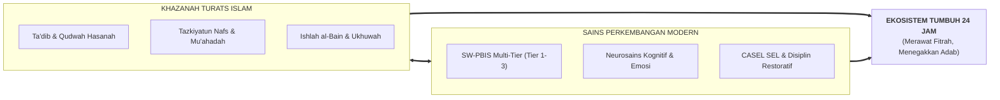

# BUKU PANDUAN INDUK: MENGENAL SISTEM TUMBUH DARI HULU KE HILIR
## *Buku Saku Pimpinan, Asatidz, & Musyrif: Memahami Konsep, Landasan Keilmuan, dan Implementasi Operasional 24 Jam Tanpa Kekerasan*

---

**Nomor Panduan**: `BOOK-SERIES-2/PANDUAN-INDUK-2026`  
**Sasaran Pembaca**: Kiai, Pengasuh Pondok, Kepala Madrasah (MA/MTs), Wali Kelas, Guru BK, Musyrif Asrama, & Wali Santri  
**Penyusun**: Dewan Keilmuan & Pengasuhan Ekosistem TUMBUH Pesantren  

---

## 🌟 BAGIAN I: LATAR BELAKANG, NILAI INTI, & WORLDVIEW SISTEM TUMBUH

### 1. Titik Berangkat: Mengapa Sistem TUMBUH Diciptakan?
Tarbiyah pesantren adalah warisan peradaban agung yang telah melahirkan ulama, pemimpin, dan pejuang bangsa. Namun, dalam perjalanan sejarahnya, sejumlah lembaga pengasuhan menghadapi tantangan sistemik:
* **Penggunaan Hukuman Fisik & Bentakan**: Dianggap jalan pintas pendisiplinan, padahal memicu kepatuhan semu (*fear-based compliance*), agresi tersembunyi, dan trauma psikologis.
* **Feodalisme & Senioritas Toksik**: Budaya perpeloncoan antargenerasi yang mendistorsi hakikat *tawadhu'*.
* **Beban Musyrif Tanpa Batas (*Burnout*)**: Musyrif asrama berjaga tanpa jeda 24 jam nonstop sehingga rentan lelah secara emosional dan reaktif.

**Sistem TUMBUH** hadir untuk mengembalikan kemurnian tarbiyah nabawiyyah dengan memadukan **keluhuran Turats Islam** dan **konsensus sains kognitif modern**, memastikan santri bertumbuh adabnya secara sadar dan merdeka (*Internalized Values*).

---

### 2. Pilar Epistemologis: Perpaduan Turats & Neurosains
Sistem TUMBUH bersandar pada dua sayap keilmuan:
1. **Khazanah Turats Islam**:
   - **Konsep Ta'dib** (*Al-Attas, Al-Ghazali, Ibnu Sahnun*): Penanaman adab ke dalam jiwa secara bertahap melalui keteladanan (*Qudwah*).
   - **Tazkiyatun Nafs**: Pembersihan jiwa dari sifat tercela (*takhalli*) dan penghiasan dengan sifat mulia (*tahalli*).
   - **Ishlah al-Bain**: Resolusi konflik melalui dialog perdamaian dan pertanggungjawaban restoratif, bukan pembalasan dendam.
2. **Konsensus Sains Perkembangan Modern**:
   - **School-Wide Positive Behavioral Interventions and Supports (SW-PBIS Multi-Tier)**: Sistem pencegahan perilaku berbasis data.
   - **Neurosains Perkembangan Remaja**: Memahami pematangan *Prefrontal Cortex* (PFC) santri dan regulasi *amigdala*.
   - **Social-Emotional Learning (CASEL 5 Core Competencies)**: Kesadaran diri, regulasi diri, empati sosial, keterampilan relasi, dan pengambilan keputusan bertanggung jawab.

---

## 🗺️ BAGIAN II: STRUKTUR IMPLEMENTASI 5 JILID BUKU PANDUAN

Sistem TUMBUH dijabarkan secara rinci dalam 5 Volume Buku Panduan Master:

### 1. [Volume 01: Akar Filosofis & Epistemologi](file:///c:/xampp/htdocs/tumbuh/BOOK%20Series%202/Volume-01-Akar-Filosofis-dan-Epistemologi)
* Menjelaskan ontologi fitrah primordial santri.
* Mengapa hukuman fisik (*corporal punishment*) tidak efektif dan merusak otak.
* Worldview Islam dan aksiologi pendidikan adab.

### 2. [Volume 02: Taksonomi Kapasitas & 10 Profil Karakter Santri](file:///c:/xampp/htdocs/tumbuh/BOOK%20Series%202/Volume-02-Taksonomi-Kapasitas-dan-Profil-Santri)
* 10 Profil Kapasitas Insan (*Salimul Aqidah, Shahihul Ibadah, Matinul Khuluq, Qadirun 'alal Kasbi, Mutsaqqaful Fikr, Qawiyyul Jism, Mujahidun Linafsih, Munazzhamun fi Syu'unih, Harishun 'ala Waqtih, Nafi'un Lighairih*).
* Matriks progresi 4 jenjang kemandirian: **J1 (Fondasi), J2 (Habituasi), J3 (Kemandirian Terarah), J4 (Keteladanan/Penggerak)**.

### 3. [Volume 03: Sistem Asesmen Perkembangan Karakter](file:///c:/xampp/htdocs/tumbuh/BOOK%20Series%202/Volume-03-Sistem-Asesmen-Perkembangan-Karakter)
* Asesmen formatif ipsatif (membandingkan santri dengan capaian dirinya sendiri, bukan meranking santri).
* Observasi alami 24 jam di asrama dan madrasah.
* Logbook digital musyrif, portofolio adab, dan Student-Led Conference (SLC).

### 4. [Volume 04: Intervensi Berjenjang PBIS & Praktik Restoratif](file:///c:/xampp/htdocs/tumbuh/BOOK%20Series%202/Volume-04-Intervensi-PBIS-dan-Disiplin-Restoratif)
* **Tier 1 (Universal 80-90%)**: Pencegahan menyeluruh, rasio apresiasi 4:1, SOP lingkungan positif.
* **Tier 2 (Targeted 10-15%)**: Program Check-In/Check-Out (CICO) dan bimbingan kelompok kecil.
* **Tier 3 (Intensive 1-5%)**: Functional Behavior Assessment (FBA), Behavior Intervention Plan (BIP), dan Lingkaran Restoratif Ishlah al-Bain.

### 5. [Volume 05: Manual Operasional, SOP 24 Jam, & Tata Kelola Asrama](file:///c:/xampp/htdocs/tumbuh/BOOK%20Series%202/Volume-05-Manual-Operasional-SOP-24Jam-dan-Tata-Kelola)
* Jadwal ritme sirkadian 24 jam (termasuk jaminan tidur sehat 6.5–7 jam dan istirahat siang *qailulah*).
* Standarisasi manajemen kamar asrama **5S (Ringkas, Rapi, Resik, Rawat, Rajin)**.
* Sistem 4-Shift Kerja Musyrif Terpadu bebas kelelahan mental (*Anti-Burnout*).
* Kemitraan terpadu dua pilar: Wali Kelas Madrasah & Musyrif Asrama.

---

## 📊 BAGIAN III: TABEL SINTESIS TRANSFORMASI SISTEM

| Dimensi Pengasuhan | Praktik Pesantren Lama | Pendekatan Sistem TUMBUH | Indikator Keberhasilan |
|:---|:---|:---|:---|
| **Paradigma Disiplin** | Sanksi fisik, bentakan, & intimidasi | *Firm & Kind*, Disiplin Restoratif 3R (*Restitution, Resolution, Reconciliation*) | 0% kekerasan, kepatuhan sadar dari kalbu |
| **Relasi Musyrif-Santri** | Sipir penegak hukum vs terdakwa | *In Loco Parentis* & *Qudwah Hasanah* (Keteladanan Hidup) | Hubungan lekat aman (*Secure Attachment*) |
| **Evaluasi Santri** | Nilai angka, ranking kompetitif, buku dosa | Asesmen Ipsatif, Logbook Observasi 360°, Rapor Naratif | Pertumbuhan terukur sesuai fitrah unik santri |
| **Pola Kerja Musyrif** | Jaga 24 jam nonstop, tanpa shift, rawan burnout | Sistem 4-Shift Terstruktur, supervisi klinis, rasio 1:15-20 | Indeks burnout musyrif rendah (< 15%) |
| **Dinamika Senioritas** | Hierarki kaku dan hak menghukum yunior | Khidmah & Peer-Mentorship (Kakak Pembimbing) | Iklim asrama penuh ukhuwah & saling memuliakan |

---

*Buku Panduan Master ini menjadi rujukan utama seluruh sivitas akademika dan pengasuhan dalam menegakkan ekosistem pendidikan pesantren yang memuliakan martabat insan.*
