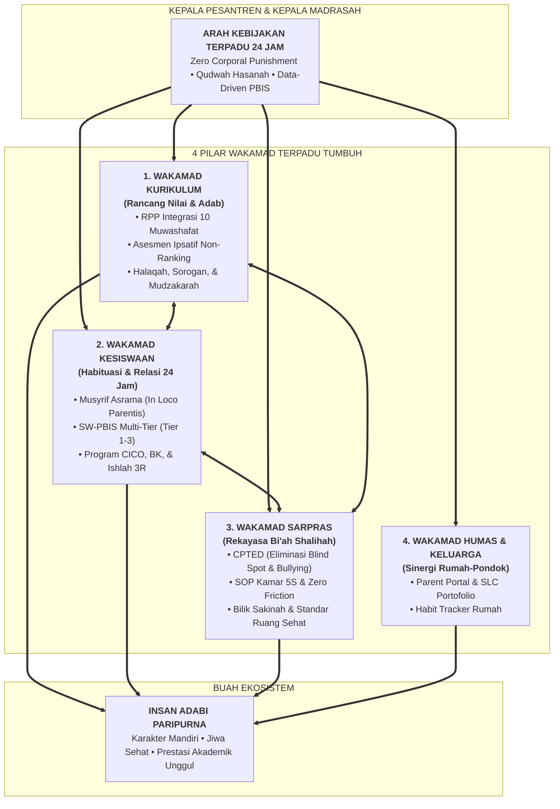

# SERI BUKU PANDUAN MASTER: EKOSISTEM TUMBUH PESANTREN (SERIES 2)
## *Buku Panduan Komprehensif: Filosofi, Taksonomi Karakter, Asesmen Perkembangan, Intervensi Restoratif, Rekayasa Sarpras, dan Manual Operasional 24 Jam*

---

**Nomor Panduan**: `BOOK-SERIES-2/PANDUAN-MASTER/2026`  
**Sasaran Pembaca**: Pengasuh/Kiai Pondok, Kepala Madrasah (MA/MTs), Wakamad Kurikulum, Wakamad Kesiswaan, Wakamad Sarpras, Wakamad Humas, Wali Kelas, Musyrif/Musyrifah Asrama, Guru Bimbingan Konseling (BK), Tim Penegak Disiplin, dan Wali Santri.  
**Dewan Pakar Pengkaji**: Dewan Keilmuan & Pengasuhan Ekosistem TUMBUH Pesantren  
**Klasifikasi**: Seri Buku Panduan Resmi & Pedoman Operasional Penerapan Sistem Pembinaan Terpadu 24 Jam  

---

## 🌟 1. APA ITU SISTEM TUMBUH & MENGAPA IA MEROMBAK STRUKTUR?

**Sistem TUMBUH** lahir sebagai jawaban atas krisis sistemik di pesantren konvensional akibat **pemisahan (silo) antara Kurikulum, Kesiswaan, dan Sarpras**:
1. **Kurikulum (Pagi)** hanya mengajarkan teori adab di kelas tanpa tersambung ke kehidupan malam santri.
2. **Kesiswaan/Pengasuhan (Malam)** bertindak represif sebagai "polisi asrama" yang mengandalkan bentakan dan hukuman fisik karena tidak memiliki kerangka pedagogis terpadu.
3. **Sarpras (Fasilitas)** diabaikan sebagai sekadar tukang logistik, padahal kegagalan tata ruang (lorong gelap, sudut mati/blind spot, kamar tidur berdesakan, sirkulasi udara buruk) merupakan pemicu utama perselisihan fisik, kejenuhan, dan bullying di asrama.

Ekosistem TUMBUH merombak struktur ini dengan menyatukan seluruh elemen di bawah kepemimpinan terpadu:  
**Kepala Pesantren $\rightarrow$ Kepala Madrasah (MA & MTs) $\rightarrow$ 4 Wakamad Terpadu (Kurikulum, Kesiswaan, Sarpras, Humas)** yang bergerak serempak dalam naungan *Qudwah Hasanah* dan *Disiplin Restoratif*.

---

## 🗺️ 2. MATRIKS DISTRIBUSI BAB & SUB-BAB PER VOLUME (SERIES 2)

Struktur seluruh volume dirancang secara organik, fleksibel, dan asimetris mengikuti kedalaman bidang keilmuan masing-masing tanpa pola seragam buatan:

| Volume | Judul Volume Panduan | Jumlah Bab | Sebaran Jumlah Sub-Bab per Bab | Total Sub-Bab | Tautan Dokumen |
|:---:|:---|:---:|:---|:---:|:---:|
| **Induk** | **Panduan Induk Sistem TUMBUH** | 3 Bagian | Ringkasan eksekutif hulu ke hilir | - | [Buka Panduan](file:///c:/xampp/htdocs/tumbuh/BOOK%20Series%202/00-Panduan-Induk-Sistem-TUMBUH-Dari-Hulu-ke-Hilir.md) |
| **Vol 01** | **Akar Filosofis & Epistemologi Karakter** | **7 Bab** | 4, 4, 3, 5, 3, 4, 2 Sub-Bab | 25 Sub-Bab | [Buka Vol 01](file:///c:/xampp/htdocs/tumbuh/BOOK%20Series%202/Volume-01-Akar-Filosofis-dan-Epistemologi) |
| **Vol 02** | **Taksonomi Kapasitas & 10 Profil Santri** | **5 Bab** | 3, 10, 4, 4, 3 Sub-Bab | 24 Sub-Bab | [Buka Vol 02](file:///c:/xampp/htdocs/tumbuh/BOOK%20Series%202/Volume-02-Taksonomi-Kapasitas-dan-Profil-Santri) |
| **Vol 03** | **Asesmen Perkembangan & Evaluasi Bukti** | **4 Bab** | 3, 4, 5, 4 Sub-Bab | 16 Sub-Bab | [Buka Vol 03](file:///c:/xampp/htdocs/tumbuh/BOOK%20Series%202/Volume-03-Sistem-Asesmen-Perkembangan-Karakter) |
| **Vol 04** | **Intervensi Berjenjang PBIS & Restoratif** | **6 Bab** | 3, 4, 3, 4, 5, 3 Sub-Bab | 22 Sub-Bab | [Buka Vol 04](file:///c:/xampp/htdocs/tumbuh/BOOK%20Series%202/Volume-04-Intervensi-PBIS-dan-Disiplin-Restoratif) |
| **Vol 05** | **Manual Operasional, SOP, & Tata Kelola** | **8 Bab** | 4, 3, 3, 5, 4, 3, 3, 4 Sub-Bab | 29 Sub-Bab | [Buka Vol 05](file:///c:/xampp/htdocs/tumbuh/BOOK%20Series%202/Volume-05-Manual-Operasional-SOP-24Jam-dan-Tata-Kelola) |

---

## 📚 3. RINGKASAN STRUKTUR LENGKAP PER VOLUME

### 📗 [VOLUME 01: AKAR FILOSOFIS & EPISTEMOLOGI (7 BAB / 25 SUB-BAB)](file:///c:/xampp/htdocs/tumbuh/BOOK%20Series%202/Volume-01-Akar-Filosofis-dan-Epistemologi)
* **Bab 01**: Krisis Sistemik Pesantren & Urgensi Perombakan Struktur (*4 Sub-Bab*)
* **Bab 02**: Ontologi Fitrah & Hakikat Insan Pembelajar (*4 Sub-Bab*)
* **Bab 03**: Epistemologi Integratif: Sintesis Turats Islam & Neurosains Kognitif (*3 Sub-Bab*)
* **Bab 04**: Dekonstruksi Feodalisme, Distorsi Tawadhu', & Rekonstruksi Relasi Kuasa (*5 Sub-Bab*)
* **Bab 05**: Triad Pertumbuhan Simbiotik: Santri, Musyrif, dan Lembaga (*3 Sub-Bab*)
* **Bab 06**: Aksiologi & Maqashid Syari'ah Pengasuhan 24 Jam (*4 Sub-Bab*)
* **Bab 07**: Epilog: Manifestasi Insan Adabi dalam Arsitektur Peradaban (*2 Sub-Bab*)

---

### 📙 [VOLUME 02: TAKSONOMI KAPASITAS & 10 PROFIL SANTRI (5 BAB / 24 SUB-BAB)](file:///c:/xampp/htdocs/tumbuh/BOOK%20Series%202/Volume-02-Taksonomi-Kapasitas-dan-Profil-Santri)
* **Bab 01**: Arsitektur Kapasitas Holistik Berbasis Fitrah (*3 Sub-Bab*)
* **Bab 02**: Profil & Standarisasi 10 Muwashafat Adab (*10 Sub-Bab Khusus per Muwashafah*)
* **Bab 03**: Trajektori Biososial-Spiritual & Dinamika Gender Remaja (*4 Sub-Bab*)
* **Bab 04**: Matriks Progresi Tangga Kemandirian Jenjang J1 s/d J4 (*4 Sub-Bab*)
* **Bab 05**: Puncak Kematangan: Tahap 7 Penggerak Peradaban & Khidmah (*3 Sub-Bab*)

---

### 📕 [VOLUME 03: ASESMEN PERKEMBANGAN & EVALUASI BUKTI (4 BAB / 16 SUB-BAB)](file:///c:/xampp/htdocs/tumbuh/BOOK%20Series%202/Volume-03-Sistem-Asesmen-Perkembangan-Karakter)
* **Bab 01**: Filosofi Asesmen Ipsatif & Mengakhiri Ranking (*3 Sub-Bab*)
* **Bab 02**: Observasi Alami 24 Jam & Logbook Digital Musyrif Rasio 4:1 (*4 Sub-Bab*)
* **Bab 03**: Master Rubrik Perilaku 4-Level PBIS untuk 10 Muwashafat (*5 Sub-Bab*)
* **Bab 04**: Student-Led Conference (SLC), Rapor Naratif, & Validasi Psikometrik (*4 Sub-Bab*)

---

### 📒 [VOLUME 04: INTERVENSI BERJENJANG PBIS & RESTORATIF (6 BAB / 22 SUB-BAB)](file:///c:/xampp/htdocs/tumbuh/BOOK%20Series%202/Volume-04-Intervensi-PBIS-dan-Disiplin-Restoratif)
* **Bab 01**: Arsitektur SW-PBIS Multi-Tier 80-15-5 di Pesantren (*3 Sub-Bab*)
* **Bab 02**: Tier 1 Universal Prevention & Bi'ah Shalihah (*4 Sub-Bab*)
* **Bab 03**: Tier 2 Targeted Support: Program CICO Harian (*3 Sub-Bab*)
* **Bab 04**: Tier 3 Intensive Intervention: FBA & Rencana BIP (*4 Sub-Bab*)
* **Bab 05**: Praktik Disiplin Restoratif & Kerangka Ishlah 3R (*5 Sub-Bab*)
* **Bab 06**: Bilik Sakinah & Protokol De-Eskalasi Krisis Emosional (*3 Sub-Bab*)

---

### 📓 [VOLUME 05: MANUAL OPERASIONAL, SOP, & TATA KELOLA (8 BAB / 29 SUB-BAB)](file:///c:/xampp/htdocs/tumbuh/BOOK%20Series%202/Volume-05-Manual-Operasional-SOP-24Jam-dan-Tata-Kelola)
* **Bab 01**: Perombakan Struktur Kelembagaan & Sinergi 3 Pilar Kurikulum-Kesiswaan-Sarpras (*4 Sub-Bab*)
* **Bab 02**: Rekayasa Sarpras & Lingkungan Pencegahan CPTED (*3 Sub-Bab*)
* **Bab 03**: Ritme Sirkadian 24 Jam Kehidupan Asrama (*3 Sub-Bab*)
* **Bab 04**: Standar Tata Graha Kamar Asrama 5S (*5 Sub-Bab: Seiri, Seiton, Seiso, Seiketsu, Shitsuke*)
* **Bab 05**: Sistem 4-Shift Kerja Musyrif & Protokol Anti-Burnout (*4 Sub-Bab*)
* **Bab 06**: Sinergi Dua Pilar (Daily Handover 07:00 & 16:00) (*3 Sub-Bab*)
* **Bab 07**: Protokol Perlindungan Santri & Safe Sanctuary (*3 Sub-Bab*)
* **Bab 08**: Arsitektur Digital Pesantren & Parent Portal (*4 Sub-Bab*)
