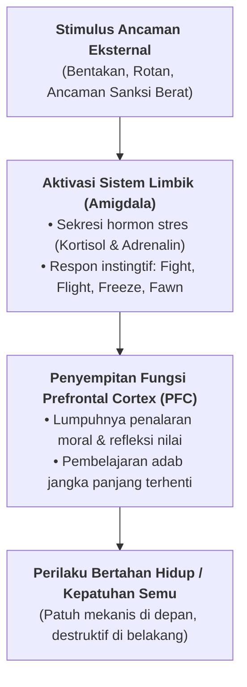
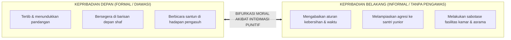

# SUB-BAB 1.1: FENOMENA KEPATUHAN SEMU (*FEAR-BASED COMPLIANCE*) & BIFURKASI KARAKTER SANTRI

---

## 1. Analisis Fenomena: Mengapa Ketertiban Berbasis Ketakutan Bersifat Semu

Dalam evaluasi pengasuhan di banyak pesantren konvensional, keberhasilan disiplin sering kali diukur semata-mata dari indikator visual sesaat: tidak ada santri yang terlambat ke masjid, lorong asrama tampak hening saat pengurus berpatroli, dan santri segera menunduk patuh saat berpapasan dengan pembina. Namun, analisis psikologi perilaku dan observasi lapangan yang mendalam membuktikan bahwa keteraturan semacam ini kerap kali merupakan **kepatuhan semu berbasis rasa takut (*fear-based compliance*)**.

Kepatuhan semu terjadi ketika perilaku tertib santri tidak didorong oleh kesadaran adab atau pemahaman nilai ibadah, melainkan semata-mata oleh mekanisme defensif untuk menghindari rasa sakit fisik, bentakan, atau sanksi sosial yang mempermalukan diri (*public shaming*).

```
                  MEKANISME KEPATUHAN SEMU (PUNITIF)
                  
 [Stimulus Ancaman/Rotan] ──► [Aktivasi Rasa Takut] ──► [Perilaku Tertib Sesaat]
                                                                  │
                                   ┌──────────────────────────────┘
                                   ▼
          [Saat Pengawasan Hilang / Berada di Luar Jangkauan]
                                   │
                                   ▼
             [Pelanggaran Masif, Agresi Tersembunyi, & Dendam]
```

Kelemahan mendasar dari model kepatuhan ini terletak pada **ketergantungan mutlaknya pada kehadiran figur pengawas**. Begitu musyrif atau pengurus tidak berada di lokasi, sistem kontrol perilaku santri runtuh seketika. Hal ini terjadi karena nilai-nilai adab tidak pernah diinternalisasi ke dalam struktur kognitif dan afektif santri, melainkan hanya menempel di permukaan sebagai respon adaptasi terhadap tekanan eksternal.

Kritik mendasar terhadap model pendidikan berbasis paksaan ini telah dirumuskan secara tajam oleh Ibnu Khaldun (732–808 H) dalam kitab *Al-Muqaddimah*:

> **مَنْ كَانَ مَرْبَاهُ بِالْعَسْفِ وَالْقَهْرِ مِنَ الْمُتَعَلِّمِينَ أَوْ المَمْلُوكِينَ أَوْ الخَدَمِ، حَمَلَهُ ذَلِكَ عَلَى الْكَذِبِ وَالْخُبْثِ، وَهُوَ التَّظَاهُرُ بِغَيْرِ مَا فِي ضَمِيرِهِ، خَوْفًا مِنِ انْبِسَاطِ الْأَيْدِي بِالْقَهْرِ عَلَيْهِ، وَعَلَّمَهُ الْمَكْرَ وَالْخَدِيعَةَ لِذَلِكَ، وَصَارَتْ لَهُ عَادَةً وَخُلُقًا، وَفَسَدَتْ مَعَانِي الْإِنْسَانِيَّةِ الَّتِي لَهُ**
> 
> *"Barang siapa yang terbiasa dididik dengan kekerasan, paksaan, dan intimidasi—baik dari kalangan penuntut ilmu, hamba sahaya, maupun pelayan—maka perlakuan tersebut niscaya akan menyeretnya ke dalam jurang kedustaan dan keburukan batin. Yaitu, ia akan berpura-pura menampakkan sikap yang bertentangan dengan apa yang ada di dalam hatinya, semata-mata karena takut akan tangan penguasa yang hendak menindasnya. Pola asuh semacam itu mengajarkannya tipu daya dan kelicikan, hingga hal itu berubah menjadi kebiasaan dan tabiat yang mengakar, dan pada akhirnya merusak nilai-nilai luhur kemanusiaan yang ada pada dirinya."* [^1]

Penjelasan Ibnu Khaldun menegaskan bahwa penggunaan kekerasan (*al-'asf wa al-qahr*) tidak pernah menghasilkan kepribadian yang lurus; ia justru melatih santri menjadi pribadi yang pandai bersandiwara (*at-tazhahur bi ghairi ma fi dhamirih*).

---

## 2. Mekanisme Neurobiologis: Pembajakan Amigdala & Hambatan Prefrontal Cortex

Secara neurosains perkembangan (*Developmental Cognitive Neuroscience*), stimulus kekerasan—baik berupa ancaman verbal maupun pukulan fisik—mengaktifkan respon bertahan hidup (*survival response*) di dalam otak santri.



Pada fase usia remaja (12–18 tahun), bagian otak yang mengatur penalaran logis, pertimbangan moral, dan regulasi diri (*Prefrontal Cortex* / PFC) masih berada dalam proses pematangan aktif (*synaptic pruning* dan *myelination*). Sebaliknya, pusat pemrosesan emosi dan rasa takut (*amigdala*) telah berkembang jauh lebih awal dan sangat reaktif.

Ketika santri dihadapkan pada ancaman fisik atau intimidasi:
1. **Amigdala Mengambil Alih Kendali Otak (*Amygdala Hijack*)**: Tubuh dibanjiri hormon kortisol dan adrenalin, memicu respon otomatis untuk melindungi diri.
2. **Penalaran Moral Terhambat**: Jalur saraf menuju *Prefrontal Cortex* menyempit, sehingga santri tidak mampu melakukan refleksi rasional tentang *mengapa* sebuah aturan itu penting bagi dirinya.
3. **Fokus Pikiran Menyempit**: Fokus santri berubah dari *"bagaimana saya memperbaiki adab saya"* menjadi *"bagaimana cara saya tidak tertangkap atau tidak dihukum"*.

Kondisi stres toksik (*toxic stress*) yang berulang-ulang akibat bentakan dan kekerasan fisik terbukti menghambat plastisitas otak, menurunkan daya retensi hafalan Al-Qur'an dan kitab, serta menumpulkan kepekaan empati santri terhadap sesamanya.

---

## 3. Patologi Bifurkasi Karakter: Pembelahan Moral Santri

Dampak sistemik paling destruktif dari kepatuhan semu adalah terbentuknya **bifurkasi karakter (pembelahan kepribadian ganda)** pada diri santri:



Dalam kondisi ini, santri mempelajari hukum adaptasi lingkungan yang keliru:
* **Integritas Ditiadakan**: Santri meyakini bahwa standar moral hanya berlaku saat ada orang yang melihat.
* **Agresi Tergeser (*Displaced Aggression*)**: Tekanan dan rasa sakit yang diterima santri dari pengasuh atau senior tidak hilang, melainkan dialihkan (*displaced*) kepada target yang lebih lemah, yaitu santri yunior atau fasilitas fisik pondok.
* **Regenerasi Budaya Kekerasan**: Santri yang terbiasa dihukum secara fisik menginternalisasi pola bahwa kekuasaan memberi hak untuk menindas pihak lain. Pola inilah yang menjadi akar tradisi perpeloncoan antargenerasi di asrama.

---

## 4. Parameter Perbandingan Paradigma Kepatuhan

Untuk merancang intervensi yang tepat, pengelola lembaga harus memahami perbedaan mendasar antara kepatuhan semu konvensional dan kepatuhan sadar berbasis fitrah yang diusung oleh Ekosistem TUMBUH:

| Dimensi Evaluasi | Kepatuhan Semu (Paradigma Lama) | Kepatuhan Sadar (Ekosistem TUMBUH) |
| :--- | :--- | :--- |
| **Pendorong Utama Perilaku** | *Faktor Eksternal*: Takut rotan, bentakan, poin sanksi, atau dipermalukan. | *Faktor Internal*: Kesadaran nilai adab, kebutuhan ibadah, dan tanggung jawab sosial. |
| **Kestabilan Perilaku** | Rapuh; runtuh saat pengawasan musyrif melemah atau saat liburan di rumah. | Konsisten (*istiqamah*); adab tetap hidup di kamar, madrasah, maupun di rumah. |
| **Pola Relasi Santri-Musyrif** | Hubungan berjarak, formalistik, dan diliputi kecurigaan (*hostile environment*). | Hubungan lekat aman (*secure attachment*), terbuka, dan saling menghormati. |
| **Dampak Jangka Panjang** | Rentan mengalami disorientasi moral dan kemunafikan perilaku pasca-pesantren. | Memiliki regulasi diri (*self-regulation*), integritas moral, dan ketahanan mental. |

Pergeseran dari kepatuhan semu menuju kepatuhan sadar menuntut perubahan mendasar pada seluruh sistem kelembagaan. Pembinaan tidak dapat lagi mengandalkan instrumen ancaman sesaat, melainkan harus dibangun di atas arsitektur kelembagaan terpadu yang menyatukan kurikulum pembelajaran, pembiasaan asrama, dan rekayasa tata ruang lingkungan.

---

### 📚 Catatan Kaki & Referensi Akademik:

[^1]: Ibnu Khaldun, 'Abdurrahman bin Muhammad. (2001). *Al-Muqaddimah*. Ditahqiq oleh Dr. Khalil Syahadah. Beirut: Dar al-Fikr, Jilid I, Bab VI: Fasal 40, hlm. 753–755.
[^2]: Siegel, D. J., & Bryson, T. P. (2014). *No-Drama Discipline: The Whole-Brain Way to Calm the Chaos and Nurture Your Child's Developing Mind*. New York: Bantam Books, hlm. 45–68.
[^3]: Sugai, G., & Horner, R. H. (2006). A promising approach for expanding and sustaining school-wide positive behavior support. *School Psychology Review*, 35(2), 245–259.
[^4]: Deci, E. L., & Ryan, R. M. (2000). The "what" and "why" of goal pursuits: Human needs and the self-determination of behavior. *Psychological Inquiry*, 11(4), 227–268.
