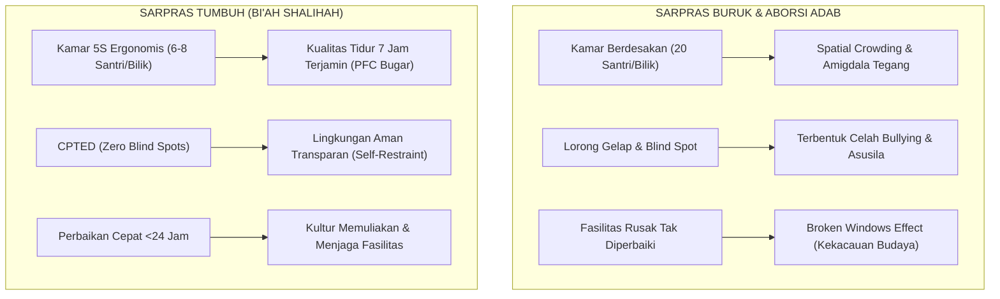
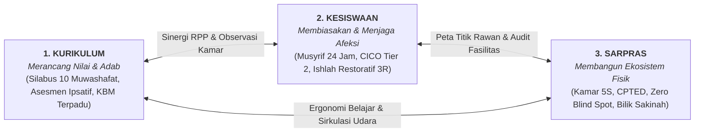

# SUB-BAB 1.2: TRAGEDI SILO KELEMBAGAAN: KEGAGALAN INTEGRASI KURIKULUM, KESISWAAN, & SARPRAS

---

## 1. Patologi Tiga Kotak Terpisah dalam Pesantren Konvensional

Di banyak pondok pesantren modern maupun tradisional, terdapat satu penyakit manajerial laten yang jarang disadari namun memiliki dampak destruktif luar biasa terhadap pembentukan akhlak santri: **patologi pemisahan fungsional (*organizational silos*)**.

Kelembagaan pesantren sering kali terbelah menjadi tiga wilayah kekuasaan yang berjalan sendiri-sendiri tanpa jembatan koordinasi pedagogis yang kokoh:
1. **Pilar Kurikulum (Madrasah / Sekolah)**: Menganggap mandatnya tuntas ketika bel pulang sekolah berbunyi pada pukul 13.00 atau 14.00 siang. Fokus utamanya semata-mata adalah ketuntasan target silabus, ketercapaian nilai kognitif raport, dan kelulusan ujian formal.
2. **Pilar Kesiswaan & Pengasuhan Asrama**: Bertindak sebagai "petugas keamanan dan ketertiban malam" yang mewarisi santri setelah jam sekolah usai. Tanpa didasari kerangka pedagogis yang selaras dengan kelas, divisi ini mengandalkan pendekatan polisional: mencatat pelanggaran di "buku dosa", meneriakkan instruksi lewat peluit, dan mengeksekusi sanksi fisik.
3. **Pilar Sarana dan Prasarana (Sarpras)**: Diposisikan semata-mata sebagai unit logistik mekanis tukang dan gudang inventaris. Sarpras dipanggil hanya saat kran air patah atau lampu bohlam padam, tanpa pernah dilibatkan dalam perencanaan pedagogi lingkungan atau mitigasi titik rawan perilaku santri.

```
       ┌──────────────────────────────────────────────────────────┐
       │     STRUKTUR LAMA: 3 KOTAK TERPISAH (JEBAKAN SILO)       │
       └──────────────────────────────────────────────────────────┘
             │                          │                       │
      [KURIKULUM]               [KESISWAAN/ASRAMA]          [SARPRAS]
    Fokus Kognitif Kelas        Fokus Polisi Disiplin      Fokus Gudang & Tukang
       (07:00 - 13:00)           (Sore - Malam Hari)         (Logistik Pasif)
             │                          │                       │
             └─────────── X ────────────┴─────────── X ─────────┘
                   KONTRA-PRODUKTIF & SALING LEMPAR TANGGUNG JAWAB
```

Tragedi ini memunculkan anomali pedagogis yang fatal: santri diajarkan kitab *Adab al-'Alim wa al-Muta'allim* atau *Ta'lim al-Muta'allim* di ruang kelas oleh ustadz pengampu fikih pada pagi hari, namun di sore dan malam harinya mereka melihat pembina asrama atau pengurus senior memaki dan memukul santri yunior di kamar mandi asrama. 

Santri menyerap kontradiksi nyata ini. Mereka menyimpulkan bahwa kitab kuning hanyalah lembaran teks hafalan untuk meraih nilai ujian di atas kertas, sementara hukum rimba kekuasaan fisik adalah realitas sesungguhnya yang berlaku di dunia nyata.

---

## 2. Analisis Kasus: Saling Lempar Tanggung Jawab Lintas Pilar

Kegagalan integrasi ketiga pilar ini memicu fenomena lempar tanggung jawab (*blame game*) yang melumpuhkan ekosistem pembinaan. Perhatikan skenario nyata yang kerap terjadi di lapangan:

> **Kasuistika Lapangan**:
> 
> Santri Ahmad (Kelas 8 MTs) berulang kali tertidur lelap di jam pertama pelajaran bahasa Arab pada pukul 07.30 pagi. 
> * **Respon Guru Kelas (Kurikulum)**: Guru marah, menganggap Ahmad pemalas, tidak memiliki adab kepada guru, lalu menghukum Ahmad berdiri dengan satu kaki di depan kelas selama 45 menit.
> * **Investigasi Akar Masalah di Asrama (Kesiswaan)**: Ahmad tidak bisa tidur pulas hingga pukul 02.00 dini hari karena mendapat intimidasi dan suruhan mencuci baju oleh santri senior di lorong belakang asrama.
> * **Akar Fisik Lingkungan (Sarpras)**: Lorong belakang asrama tersebut gelap gulita tanpa lampu, berada di sudut mati (*blind spot*) yang luput dari pandangan pos musyrif, dan kamar tidur Ahmad dihuni oleh 24 santri dalam ruangan berukuran $4 \times 6\text{ meter}$ tanpa ventilasi silang yang memadai, sehingga santri kepanasan dan sulit tidur.

Dalam paradigma silo lama, guru Kurikulum menyalahkan Ahmad dan menuntut Kesiswaan menertibkan asrama. Musyrif Kesiswaan mengeluhkan kelelahan karena harus meronda sendirian tanpa alat pantau. Sementara staf Sarpras merasa tidak ada urusan dengan ngantuknya Ahmad di kelas karena tugas mereka hanyalah mencatat inventaris barang.

Tidak ada satu pun pihak yang melihat masalah ini sebagai **satu kesatuan ekologis yang saling mengunci**.

---

## 3. Sarpras Sebagai Rekayasa Lingkungan Pengasuhan (*Environmental Engineering*)

Salah satu kelemahan paling mendasar dari pemikiran pesantren lama adalah kegagalan memahami bahwa **ruang fisik berbicara secara pedagogis (*physical space communicates values*)**.

Sarana prasarana bukanlah benda mati yang netral. Tata letak bangunan, intensitas pencahayaan, kualitas sirkulasi udara, kerapian inventaris, dan tingkat kepadatan ruang (*spatial density*) memiliki pengaruh langsung terhadap kondisi neurokimia otak manusia.



Pakar psikologi lingkungan dan kriminologi James Q. Wilson dan George L. Kelling (1982) merumuskan **Broken Windows Theory (Teori Jendela Pecah)**: jika sebuah jendela kaca yang pecah pada suatu bangunan dibiarkan tanpa diperbaiki, orang yang melintas akan menyimpulkan bahwa bangunan tersebut tidak bertuan dan tidak dipedulikan. Tak lama kemudian, jendela-jendela lainnya akan sengaja dipecahkan, vandalisme merebak, dan kejahatan besar akan segera mengambil alih bangunan tersebut. [^1]

Di pesantren, teori ini terbukti setiap hari:
* Lemari santri yang engsel pintunya rusak dan dibiarkan berbulan-bulan oleh bagian Sarpras menjadi sinyal bawah sadar bagi santri bahwa asrama adalah tempat yang kumuh dan tidak berharga untuk dijaga.
* Kran air wudhu yang bocor dan membanjiri lantai memicu santri untuk buang sampah sembarangan di sekitarnya.
* Toilet yang pengap, bau, dan berkerak memicu santri untuk mencoret-coret dinding toilet dengan kata-kata kotor saat mereka buang air.

Maka, perombakan struktur menuntut reposisi Sarpras dari sekadar seksi logistik menjadi **Arsitek Rekayasa Lingkungan Pencegahan (*Crime Prevention Through Environmental Design - CPTED*)** yang menjamin terciptanya *Bi'ah Shalihah* (ekosistem fisik yang suci, lapang, dan menenangkan jiwa).

---

## 4. Rekonstruksi Hubungan: Trinitas Sinergi Tiga Pilar

Pendidikan karakter tidak akan pernah berhasil jika ia hanya dibebankan kepada guru di ruang kelas atau hanya ditimpakan kepada musyrif di kamar asrama. Ia membutuhkan simfoni kerja terpadu di mana:

> **Rumusan Trinitas Ekologis TUMBUH**:
> 
> * **KURIKULUM** merumuskan nilai, standar adab, dan perangkat pembelajaran ilmu.
> * **KESISWAAN / PENGASUHAN** menghidupkan nilai tersebut dalam interaksi sosial, pembiasaan ritme 24 jam, dan pemulihan restoratif.
> * **SARPRAS** menyediakan ruang fisik yang aman, sehat, ergonomis, dan bebas dari celah kerawanan maksiat.



Dengan integrasi tiga pilar ini, tidak ada lagi ruang bagi santri untuk mengalami disorientasi nilai. Apa yang dibaca di atas meja kelas, dialami langsung dalam kehangatan relasi asrama, dan dinaungi oleh kenyamanan bangunan fisik pesantren yang memuliakan martabat kemanusiaan mereka.

---

### 📚 Catatan Kaki & Referensi Akademik:

[^1]: Wilson, J. Q., & Kelling, G. L. (1982). Broken windows: The police and neighborhood safety. *The Atlantic Monthly*, 249(3), 29–38.
[^2]: Al-Mawardi, Abu al-Hasan 'Ali bin Muhammad. (1987). *Adab ad-Dunya wa ad-Din*. Ditahqiq oleh Musthafa as-Saqqa. Beirut: Dar al-Kutub al-'Ilmiyyah, hlm. 95–112.
[^3]: Crowe, T. D. (2000). *Crime Prevention Through Environmental Design: Applications of Architectural Design and Space Management Concepts* (2nd ed.). Oxford: Butterworth-Heinemann, hlm. 35–58.
[^4]: Bronfenbrenner, U. (1979). *The Ecology of Human Development: Experiments by Nature and Design*. Cambridge, MA: Harvard University Press, hlm. 21–43.
