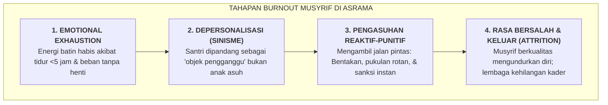

# SUB-BAB 1.3: SINDROM KELELAHAN MENTAL (*BURNOUT*) MUSYRIF & JEBAKAN PENGASUHAN REAKTIF

---

## 1. Beban yang Tak Manusiawi: Mitos Musyrif Serba Bisa 24 Jam Nonstop

Di balik gegap gempita keberhasilan sebuah pesantren mencetak ribuan santri berprestasi, tersimpan satu realitas kelam yang jarang diangkat ke permukaan seminar pendidikan: **kelelahan fisik dan kehancuran mental yang dialami oleh para pembina asrama (musyrif/musyrifah)**.

Dalam kultur pesantren konvensional, musyrif sering kali dibebani ekspektasi yang nyaris mustahil dipenuhi oleh manusia biasa:
* Mereka diwajibkan bangun pukul 03.30 dini hari untuk membangunkan santri qiyamul lail dan sholat Subuh.
* Mereka mengawasi sarapan, mengontrol kebersihan kamar, dan mengawal santri berangkat ke madrasah hingga pukul 07.00 pagi.
* Sepanjang siang, mereka kerap ditugaskan mengajar madrasah atau mengurus administrasi kantor pondok.
* Sore hari, mereka harus mengawal sholat Ashar, mengawasi kegiatan ekstrakurikuler, dan menjaga keamanan antrean mandi.
* Malam hari, mereka memimpin halaqah Al-Qur'an, mendampingi belajar malam (*mudzakarah*), mengontrol tidur santri hingga pukul 22.30 malam.
* Dan di tengah malam, mereka masih dibebani tugas ronda malam (*harasah*) secara bergantian hingga fajar kembali menyingsing.

Pola penugasan 24 jam nonstop tanpa batas shift yang jelas ini melahirkan deprivasi tidur kronis (*chronic sleep deprivation*) dan kelelahan emosional ekstrem (*emotional exhaustion*).

```
[PENUGASAN 24 JAM NONSTOP]
            │
            ▼
[DEPRIVASI TIDUR KRONIS (<4 JAM/HARI)]
            │
            ▼
[PENURUNAN FUNGSI REGULASI EMOSI MUSYRIF]
            │
            ▼
[POLA PENGASUHAN REAKTIF & BERGANTUNG PADA BENTAKAN/ROTAN]
            │
            ▼
[PENINGKATAN KONFLIK ASRAMA & TRAUMA SANTRI]
```

Banyak pimpinan pesantren menganggap kelelahan ini sebagai "bagian dari jihad dan keikhlasan". Namun, secara kaidah syar'i dan ilmu psikologi klinis, membiarkan pengasuh bekerja dalam kondisi fisik yang remuk bukanlah bentuk keikhlasan, melainkan kezaliman struktural yang membahayakan keselamatan santri dan pengasuh itu sendiri.

Rasulullah SAW telah menegaskan kaidah agung tentang keseimbangan hak raga manusia:

> **إِنَّ لِرَبِّكَ عَلَيْكَ حَقًّا، وَلِنَفْسِكَ عَلَيْكَ حَقًّا، وَلِأَهْلِكَ عَلَيْكَ حَقًّا، فَأَعْطِ كُلَّ ذِي حَقٍّ حَقَّهُ**
> 
> *"Sesungguhnya bagi Tuhanmu ada hak atas dirimu, bagi jiwamu/ragamu ada hak atas dirimu, dan bagi keluargamu ada hak atas dirimu. Maka berikanlah kepada setiap yang memiliki hak itu haknya masing-masing."* (HR. Al-Bukhari no. 1968, dari sahabat Salman Al-Farisi RA) [^1]

---

## 2. Mekanisme Psikologis dari *Burnout* Menuju Kekerasan Reaktif

Bagaimana kelelahan mental seorang musyrif berujung pada kekerasan terhadap santri? Christina Maslach dan Michael P. Leiter (2016), dua pionir riset psikologi okupasi, merumuskan bahwa **Job Burnout** terdiri atas tiga dimensi patologis yang saling berurutan: [^2]

1. **Emotional Exhaustion (Kelelahan Emosional Ekstrem)**: Energi batin pengasuh terkuras habis; mereka merasa kosong, tidak berdaya, dan kehilangan kapasitas untuk berempati.
2. **Depersonalization / Cynicism (Depersonalisasi & Sinisme)**: Musyrif mulai memandang santri bukan lagi sebagai anak manusia yang memiliki perasaan, melainkan sebagai "beban yang merepotkan", "sumber masalah", atau objek yang harus ditaklukkan.
3. **Reduced Personal Accomplishment (Hilangnya Rasa Kebermaknaan)**: Musyrif merasa gagal, tidak dihargai oleh pimpinan lembaga, dan merasa bahwa apa pun yang mereka lakukan tidak membawa perubahan.



Ketika seorang musyrif yang mengalami depersonalisasi menghadapi santri yang sulit bangun Subuh atau ribut di kamar mandi, kapasitas korteks prefrontal musyrif untuk menimbang respon pedagogis yang sabar (*proactive parenting*) sudah lumpuh. 

Amigdala musyrif yang stres langsung mengambil alih dengan respon cepat dan agresif: **mengayunkan rotan, memukul ember dengan keras, atau membentak dengan kata-kata kasar**. 

Kekerasan di asrama, dengan demikian, sering kali bukan lahir karena musyrif berhati jahat, melainkan karena **musyrif mengalami kelelahan mental akut yang tidak tertampung oleh sistem kerja lembaga**.

---

## 3. Tingginya Tingkat Turn-Over Musyrif dan Hilangnya Kontinuitas Pengasuhan

Akibat sistem penugasan yang tidak manusiawi ini, mayoritas pesantren mengalami tingkat perputaran (*turn-over rate*) musyrif yang sangat tinggi. Rata-rata musyrif asrama hanya bertahan 6 bulan hingga 1 tahun sebelum akhirnya menyerah, jatuh sakit, atau memutuskan mengundurkan diri.

Dampak buruk bagi santri sangat fatal:
* **Hilangnya Kelekatan Aman (*Loss of Secure Attachment*)**: Santri kehilangan figur panutan yang stabil. Setiap tahun mereka harus beradaptasi dengan pembina baru yang membawa gaya dan emosi yang berbeda-beda.
* **Kebocoran Standar Disiplin**: Musyrif baru yang belum berpengalaman cenderung bingung menerapkan aturan, sehingga santri memanfaatkan celah inkonsistensi tersebut.
* **Biaya Kaderisasi yang Boros**: Lembaga terus-menerus disibukkan dengan merekrut dan melatih musyrif baru, tanpa pernah mencapai kematangan budaya pengasuhan yang mapan.

---

## 4. Solusi Sistemik TUMBUH: Dekrit Perlindungan Musyrif & Sistem 4-Shift

Ekosistem TUMBUH memandang bahwa **kesejahteraan mental musyrif adalah prasyarat mutlak bagi keselamatan karakter santri**. Seseorang tidak dapat menuangkan air ketenangan dari cawan yang retak dan kosong (*fāqidusy-syai'i lā yu'thīh* - orang yang tidak memiliki sesuatu tidak akan mampu memberikannya kepada orang lain).

Oleh karena itu, sistem TUMBUH merombak pola kerja asrama melalui empat kebijakan struktural:

| Komponen Perlindungan | Standar Konvensional Lama | Standar Ekosistem TUMBUH |
| :--- | :--- | :--- |
| **Sistem Waktu Kerja** | Jaga 24 jam nonstop tanpa shift, bercampur dengan tugas mengajar. | **Sistem 4-Shift Kerja Terpadu** dengan rotasi jam kerja yang manusiawi dan terukur. |
| **Rasio Pengasuhan** | 1 Musyrif mengasuh 40–60 santri (beban berlebih). | **Rasio Emas 1:15 s/d 1:20** (1 Musyrif mengasuh maksimal 15–20 santri). |
| **Hak Istirahat & Libur** | Libur tidak menentu, sering dibatalkan jika ada kegiatan pondok. | **Hak Libur Pasti 1 Hari Penuh/Pekan** dan cuti berkala yang dijamin oleh pimpinan pondok. |
| **Dukungan Psikologis** | Dihakimi saat terjadi masalah santri (*Blame Culture*). | **Supervisi Klinis Mingguan (*No-Blame Culture*)** bersama konselor BK dan psikolog pondok. |

Dengan sistem perlindungan ini, musyrif memasuki asrama dalam kondisi bugar, pikiran jernih, dan hati yang lapang. Mereka mampu hadir sebagai orang tua pengganti (*in loco parentis*) yang mendidik dengan senyuman, kelembutan, dan ketegasan yang penuh martabat (*Firm & Kind*).

---

### 📚 Catatan Kaki & Referensi Akademik:

[^1]: Al-Bukhari, Muhammad bin Isma'il. (2002). *Shahih al-Bukhari*. Riyadh: Darussalam, Kitab *ash-Shaum*, Bab *Man Zāra Qauman fa Lam Yufthir 'Indahum*, Hadits no. 1968.
[^2]: Maslach, C., & Leiter, M. P. (2016). Understanding the burnout experience: Recent research and its implications for psychiatry. *World Psychiatry*, 15(2), 103–111.
[^3]: Freudenberger, H. J. (1974). Staff burn-out. *Journal of Social Issues*, 30(1), 159–165.
[^4]: Jennings, P. A., & Greenberg, M. T. (2009). The prosocial classroom: Teacher social and emotional competence in relation to student and classroom outcomes. *Review of Educational Research*, 79(1), 491–525.
