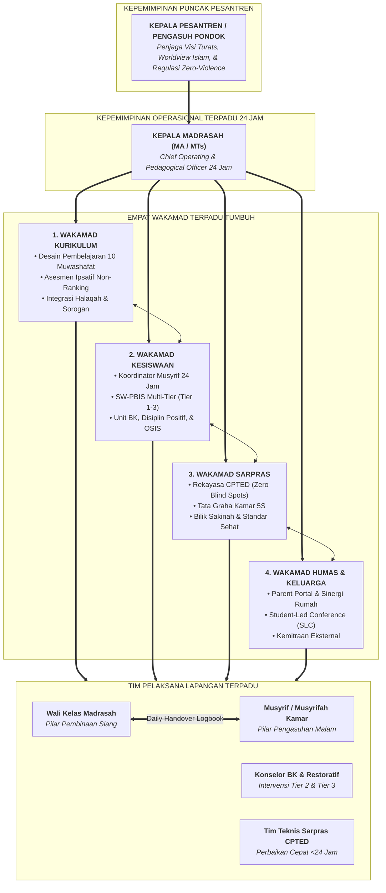

# SUB-BAB 1.4: REKONSTRUKSI STRUKTUR TATA KELOLA: MENYATUKAN TIGA PILAR DI BAWAH EKOSISTEM TUMBUH

---

## 1. Menghancurkan Tembok Pemisah: Integrasi Komando 24 Jam

Krisis sistemik yang telah diuraikan pada sub-bab terdahulu—mulai dari kepatuhan semu, tragedi silo tiga kotak, hingga sindrom kelelahan musyrif—tidak dapat diselesaikan dengan perbaikan tambal sulam. Masalah ini menuntut **rekonstruksi menyeluruh atas bagan organisasi dan tata kerja kelembagaan pesantren**.

Ekosistem TUMBUH merombak struktur dualisme usang yang memisahkan kepemimpinan sekolah/madrasah dari kepemimpinan asrama. Seluruh dinamika santri selama 24 jam dilebur ke dalam satu garis komando pedagogis terpadu yang dipimpin oleh **Kepala Pesantren** dan dioperasionalkan secara harian oleh **Kepala Madrasah (MA & MTs)** yang membawahi **Empat Wakil Kepala Madrasah (Wakamad) Terpadu**.



---

## 2. Rincian Tugas & Garis Integrasi Empat Pilar Wakamad

Di bawah struktur baru ini, masing-masing bidang tidak lagi bekerja sebagai entitas yang terisolasi, melainkan terikat dalam kontrak integrasi yang saling bergantung:

### 📘 1. Wakamad Kurikulum (Arsitek Nilai & Adab Intelektual)
* **Tugas Pokok**: Menyusun kurikulum terpadu (Kemenag/Kemendikbud + Turats Pesantren), merancang integrasi 10 Muwashafat ke dalam Rencana Pelaksanaan Pembelajaran (RPP), dan mengelola jadwal KBM, halaqah Qur'an, serta mudzakarah malam.
* **Titik Sambung ke Kesiswaan**: Menyuplai rubrik kompetensi adab yang diobservasi oleh musyrif di asrama.
* **Titik Sambung ke Sarpras**: Menetapkan kebutuhan ruang belajar interaktif, pencahayaan kelas yang ergonomis, dan ketersediaan sarana literasi kitab yang memadai.

### 🛡️ 2. Wakamad Kesiswaan (Arsitek Pembiasaan & Afeksi 24 Jam)
* **Tugas Pokok**: Membawahi seluruh staf pengasuhan/musyrif asrama, staf kedisiplinan positif & BK, staf pembina OSIS, dan pembina klub santri. Menjalankan sistem intervensi berjenjang SW-PBIS (Tier 1-3) dan mediasi restoratif.
* **Titik Sambung ke Kurikulum**: Mengirimkan laporan harian (*Daily Handover*) kondisi psikologis dan kesehatan santri kepada wali kelas sebelum KBM pagi dimulai.
* **Titik Sambung ke Sarpras**: Memetakan titik rawan konflik (*hotspots patrol*) dan mengidentifikasi fasilitas kamar yang rusak agar segera diperbaiki.

### 🏗️ 3. Wakamad Sarana Prasarana (Arsitek Rekayasa Lingkungan Pencegahan / Bi'ah Shalihah)
* **Tugas Pokok**: Mengelola tata ruang asrama berstandar CPTED (*Crime Prevention Through Environmental Design*), memastikan kamar santri memenuhi standar tata graha 5S, menjamin rasio sanitasi yang sehat (1 toilet : 5–7 santri), dan mengelola Bilik Sakinah.
* **Titik Sambung ke Kesiswaan**: Menghilangkan sudut-sudut mati (*blind spots*) yang berpotensi memicu perundungan atau perilaku menyimpang, serta mengeksekusi perbaikan fasilitas rusak dalam tempo maksimal $1 \times 24\text{ jam}$.
* **Titik Sambung ke Kurikulum**: Menjamin kenyamanan termal, akustik, dan sirkulasi udara di ruang kelas agar santri dapat fokus belajar tanpa hambatan fisik.

### 🤝 4. Wakamad Humas & Kemitraan Keluarga (Arsitek Sinergi Rumah-Pondok)
* **Tugas Pokok**: Menjembatani komunikasi transparan antara pondok dan wali santri melalui aplikasi *Parent Portal*, memfasilitasi forum *Student-Led Conference (SLC)* semesteran, dan mendistribusikan instrumen pemantauan adab liburan (*Vacation Habit Tracker*).
* **Titik Sambung ke Seluruh Pilar**: Memastikan bahwa nilai-nilai yang dibangun di madrasah dan asrama mendapatkan penguatan (*reinforcement*) yang selaras tatkala santri pulang ke rumah.

---

## 3. Protokol Sinergi Harian: Sinkronisasi Tanpa Kebocoran Informasi

Perombakan struktur diwujudkan dalam ritme kerja nyata melalui dua instrumen koordinasi baku:

```
[07:00 PAGI: SERAH TERIMA PAGI]
Musyrif Malam menyerahkan Logbook Santri -> Diterima Wali Kelas Madrasah
(Fokus: Santri sakit, santri sedih/ada masalah, santri yang berprestasi)
              │
              ▼
[KBM MADRASAH BERJALAN DENGAN INFORMASI LENGKAP]
              │
              ▼
[16:00 SORE: SERAH TERIMA SORE]
Wali Kelas Madrasah menyerahkan Catatan Kelas -> Diterima Musyrif Siang/Malam
(Fokus: Dinamika belajar, capaian tugas, catatan interaksi sosial kelas)
              │
              ▼
[PENGASUHAN ASRAMA MALAM MENGAWAL DENGAN TEPAT SASARAN]
```

### 1. Daily Handover (Serah Terima Catatan Perkembangan Harian)
* **Pukul 07:00 Pagi (Kamar $\rightarrow$ Kelas)**: Musyrif shift fajar menyerahkan catatan digital kepada wali kelas mengenai santri yang kurang sehat, santri yang mengalami konflik semalam, atau santri yang menunjukkan kemajuan adab yang patut diapresiasi. Guru kelas memulai pelajaran dengan memahami kondisi emosional seluruh anak didiknya.
* **Pukul 16:00 Sore (Kelas $\rightarrow$ Kamar)**: Wali kelas mengembalikan catatan kepada musyrif shift siang/malam mengenai dinamika belajar santri di kelas. Musyrif di asrama dapat menindaklanjuti kebutuhan bimbingan belajar atau penguatan emosional santri tersebut pada sesi mudzakarah malam.

### 2. Rapat Kasus Lintas Bidang Mingguan (*Weekly Multi-Disciplinary Case Conference*)
Setiap hari Sabtu pagi, pimpinan madrasah mengadakan rapat pleno yang dihadiri oleh:
* Wakamad Kurikulum, Kesiswaan, dan Sarpras
* Guru Bimbingan Konseling (BK)
* Perwakilan Musyrif Senior dan Wali Kelas
* Penanggung Jawab Sarpras & Medis

Rapat ini tidak berfokus pada penghakiman kesalahan santri (*No-Blame Culture*), melainkan mengevaluasi tren data perilaku PBIS, meninjau perbaikan titik rawan lingkungan, dan merumuskan intervensi individual (*Behavior Intervention Plan - BIP*) bagi santri yang membutuhkan pendampingan khusus.

---

## 4. Kesimpulan Bab 01: Fondasi Kokoh Menuju Volume Lanjutan

Perombakan struktur kelembagaan adalah langkah pertama yang tak dapat ditawar dalam mendirikan Ekosistem TUMBUH. Tanpa penyatuan komando 24 jam dan sinergi mutlak antara **Kurikulum, Kesiswaan, dan Sarpras**, program pendidikan karakter secanggih apa pun akan runtuh di tengah jalan akibat kebocoran sistem.

Setelah struktur kelembagaan ditata dengan kokoh, langkah selanjutnya adalah menetapkan **apa saja kompetensi karakter yang hendak ditumbuhkan pada diri santri dan bagaimana tahapan kematangannya dari kelas 7 hingga kelas 12**. Pembahasan mendalam mengenai hal ini akan diuraikan secara tuntas pada **[Volume 02: Taksonomi Kapasitas & 10 Profil Karakter Santri](file:///c:/xampp/htdocs/tumbuh/BOOK%20Series%202/Volume-02-Taksonomi-Kapasitas-dan-Profil-Santri)**.

---

### 📚 Catatan Kaki & Referensi Akademik:

[^1]: Al-Ghazali, Abu Hamid Muhammad bin Muhammad. (2004). *Ihya' 'Ulumiddin*. Beirut: Dar al-Kutub al-'Ilmiyyah, Jilid I, Kitab *al-'Ilm*, Fasal *Adab al-Mu'allim wa al-Muta'allim*, hlm. 55–68.
[^2]: Sugai, G., & Horner, R. H. (2009). Responsiveness-to-intervention and school-wide positive behavior support: Integration of multi-tiered systems. *Exceptionality*, 17(4), 223–237.
[^3]: Senge, P. M. (2006). *The Fifth Discipline: The Art & Practice of The Learning Organization*. New York: Doubleday, hlm. 127–145.
[^4]: Epstein, J. L. (2018). *School, Family, and Community Partnerships: Preparing Educators and Improving Schools* (2nd ed.). New York: Routledge, hlm. 89–114.
