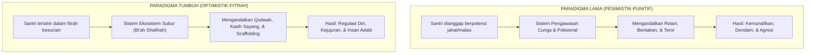

# SUB-BAB 2.1: DOKTRIN FITRAH PRIMORDIAL (*FITRAH AL-MUNAZZALAH*) & POTENSI KEBAIKAN SANTRI

---

## 1. Titik Berangkat Ontologis: Siapakah Sejatinya Santri yang Kita Didik?

Setiap model pendidikan dan tata kelola asrama selalu berakar pada satu pertanyaan filosofis yang mendasar: *Bagaimanakah hakikat asal manusia yang sedang kita bimbing? Apakah mereka pada dasarnya adalah makhluk pembangkang yang harus ditundukkan dengan rasa takut, bejana kosong yang pasif, ataukah benih suci yang membawa potensi kebaikan bawaan?*

Kekeliruan paling fatal dalam pola pengasuhan pesantren lama bermula dari **asumsi pesimistik terhadap hakikat santri**. Santri sering kali dipandang secara apriori sebagai kelompok yang cenderung malas, berniat melanggar, dan lihai mencari celah maksiat bila tidak ditekan dengan ancaman keras. Asumsi keliru ini melahirkan sistem pengasuhan yang bersifat polisional, dipenuhi kecurigaan (*su'uzh-zhan*), dan bergantung pada instrumen hukuman punitif.

Ekosistem TUMBUH memulihkan pandangan ini kembali kepada **doktrin fitrah primordial (*Fitrah al-Munazzalah*)** sebagaimana yang diajarkan oleh Al-Qur'an dan Sunnah Nabawiyyah.

Allah SWT berfirman:

> **فَأَقِمْ وَجْهَكَ لِلدِّينِ حَنِيفًا ۚ فِطْرَتَ اللَّهِ الَّتِي فَطَرَ النَّاسَ عَلَيْهَا ۚ لَا تَبْدِيلَ لِخَلْقِ اللَّهِ ۚ ذَٰلِكَ الدِّينُ الْقَيِّمُ وَلَٰكِنَّ أَكْثَرَ النَّاسِ لَا يَعْلَمُونَ**
> 
> *"Maka hadapkanlah wajahmu dengan lurus kepada agama (Islam); (sesuai) fitrah Allah disebabkan Dia telah menciptakan manusia menurut fitrah itu. Tidak ada perubahan pada ciptaan Allah. (Itulah) agama yang lurus, tetapi kebanyakan manusia tidak mengetahui."* (QS. Ar-Rum [30]: 30) [^1]

Rasulullah SAW mempertegas hakikat ini dalam hadits yang masyhur:

> **مَا مِنْ مَوْلُودٍ إِلَّا يُولَدُ عَلَى الْفِطْرَةِ، فَأَبَوَاهُ يُهَوِّدَانِهِ أَوْ يُنَصِّرَانِهِ أَوْ يُمَجِّسَانِهِ**
> 
> *"Tidak ada seorang anak pun yang dilahirkan melainkan ia terlahir di atas fitrah (kesucian tauhid dan potensi kebaikan). Maka kedua orang tuanyalah (dan para pendidiknya) yang menjadikannya Yahudi, Nasrani, atau Majusi."* (HR. Al-Bukhari no. 1358 dan Muslim no. 2658) [^2]

Dalam pandangan epistemologi Islam, **fitrah bukanlah ruang kosong (*tabula rasa*) yang hampa nilai, melainkan kesiapan inheren (*al-isti'dad al-fithri*) untuk mencintai kebenaran, mengenali keadilan, dan merespons keindahan akhlak**. Setiap santri yang melangkahkan kaki masuk ke gerbang pesantren membawa modalitas suci ini di dalam relung kalbunya.

---

## 2. Mengapa Perilaku Menyimpang Muncul Jika Fitrah Santri Suci?

Jika setiap santri terlahir dalam keadaan fitrah yang suci, mengapa di lingkungan asrama kerap ditemukan kasus santri mencuri uang kawan sekamar, membolos sholat Subuh, berbohong kepada musyrif, atau melakukan perundungan (*bullying*)?

Imam Ibnu Qayyim Al-Jauziyyah (691–751 H) dalam kitab *Al-Fawa'id* menjelaskan bahwa penyimpangan perilaku manusia bukanlah pembawaan hakiki dari zat fitrahnya, melainkan akibat dari **tertutupnya fitrah oleh karat lingkungan (*khubuts al-bi'ah*) dan ketiadaan bimbingan (*faqd at-taujih*)**:

> **الْفِطْرَةَ كَالْأَرْضِ الطَّيِّبَةِ الْقَابِلَةِ لِلْغَرْسِ، وَالشَّرْعَ كَالْبَذْرِ النَّافِعِ وَالْمَاءِ الْعَذْبِ، فَإِذَا أُلْقِيَ الْبَذْرُ الطَّيِّبُ فِي الْأَرْضِ الطَّيِّبَةِ وَسُقِيَتْ بِالْمَاءِ نَبَتَتْ أَحْسَنَ نَبَاتٍ، وَإِنْ أُهْمِلَتْ غَلَبَتْ عَلَيْهَا الشَّوْكُ وَالْأَعْشَابُ الرَّدِيئَةُ**
> 
> *"Fitrah manusia itu ibarat tanah yang subur dan siap untuk ditanami, sedangkan syariat dan keteladanan itu laksana benih yang unggul dan air yang jernih. Apabila benih yang baik ditanam di tanah yang subur lalu disirami dengan air yang bersih, niscaya ia akan tumbuh menjadi tanaman yang paling indah. Namun jika tanah itu ditelantarkan atau disirami air yang tercemar kekerasan, maka tanah tersebut akan ditumbuhi duri dan semak belukar yang liar."* [^3]

Penyimpangan perilaku santri di lapangan merupakan gejala (*symptom*), bukan penyakit utama. Ketika seorang santri menunjukkan agresi atau ketidakjujuran di asrama, hal tersebut biasanya dipicu oleh tiga faktor lingkungan:
1. **Kebutuhan Dasar yang Tidak Terpenuhi (*Unmet Psychological Needs*)**: Santri merasa tidak aman, kurang tidur, rindu keluarga (*homesick*) yang ekstrem, atau merasa tidak dihargai eksistensinya.
2. **Ketiadaan Keteladanan yang Konsisten**: Santri melihat figur pembina atau senior yang bersikap kasar, sehingga otak mereka meniru (*modeling*) perilaku tersebut sebagai cara untuk bertahan hidup.
3. **Ketidakjelasan Batas & Struktur Lingkungan**: Tidak adanya SOP yang transparan dan konsisten, sehingga santri bingung membedakan ekspektasi perilaku yang benar.

---

## 3. Implikasi Praktis Doktrin Fitrah bagi Pengasuh Asrama

Mengakui fitrah kesucian santri membawa konsekuensi metodologis yang sangat nyata dalam praktik pengasuhan sehari-hari:

| Prinsip Fitrah | Penerapan Konkret Pengasuh di Lapangan | Hal yang Dilarang Keras Dilakukan |
| :--- | :--- | :--- |
| **Praduga Kebaikan (*Husnuzh-Zhan*)** | Menyapa santri dengan senyum, percaya pada potensi perbaikan, mendengarkan penjelasan santri dengan tulus. | Menuduh santri tanpa bukti, melabeli santri dengan cap permanen (*"anak nakal", "biang onar"*). |
| **Pemisahan Perilaku dari Identitas Diri** | Mengoreksi perbuatan salahnya tanpa merendahkan harga dirinya (*"Perbuatan membolos ini keliru, tapi antum adalah anak shalih yang mampu memperbaiki diri"*). | Menghina pribadi atau fisik santri (*"Dasar pemalas!", "Kamu tidak ada masa depan!"*). |
| **Fokus Menumbuhkan Kebaikan (*Cultivating Goodness*)** | Menerapkan rasio penguatan kebaikan minimal 4:1; aktif mencari dan mengapresiasi inisiatif adab santri. | Hanya hadir saat santri bersalah dan mengabaikan seratus kebaikan yang telah dilakukan santri. |
| **Penyediaan Bi'ah Shalihah (Ekosistem Subur)** | Menata kamar 5S, menjamin tidur 7 jam, penerangan cukup, dan interaksi yang aman tanpa bullying. | Membiarkan asrama kumuh, lorong gelap, dan jam tidur santri terampas oleh tradisi hukuman malam. |

Dengan memandang santri melalui kacamata fitrah, tugas seorang musyrif dan guru bukan lagi sebagai "hakim penjatuh vonis", melainkan sebagai **petani jiwa (*murabbi ruhi*)** yang bertugas menggemburkan tanah hati santri, mencabut duri trauma, dan mengalirkan air keteladanan agar benih fitrah tersebut merekah menjadi pohon adab yang kokoh.

---

### 📚 Catatan Kaki & Referensi Akademik:

[^1]: Tafsir Ibnu Katsir. (2000). *Tafsir Al-Qur'an al-'Azhim*. Riyadh: Dar Thayyibah, Jilid VI, hlm. 308–312.
[^2]: Al-Bukhari, Muhammad bin Isma'il. (2002). *Shahih al-Bukhari*. Riyadh: Darussalam, Kitab *al-Jana'iz*, Hadits no. 1358; Muslim bin al-Hajjaj. (2006). *Shahih Muslim*, Kitab *al-Qadar*, Hadits no. 2658.
[^3]: Ibnu Qayyim Al-Jauziyyah, Syamsuddin Muhammad bin Abi Bakr. (2004). *Al-Fawa'id*. Ditahqiq oleh Salim bin 'Ied al-Hilali. Riyadh: Maktabah ar-Rusyd, hlm. 142–146.
[^4]: Ryan, R. M., & Deci, E. L. (2000). Self-determination theory and the facilitation of intrinsic motivation, social development, and well-being. *American Psychologist*, 55(1), 68–78.
