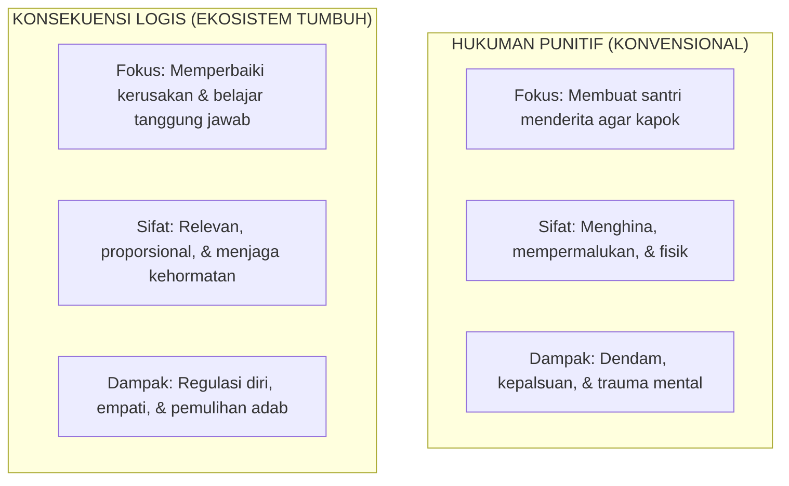

# SUB-BAB 2.2: KRITIK ATAS DOKTRIN PUNITIF & PENEGAKAN MARTABAT INSAN (*KARAMAH AL-INSAN*)

---

## 1. Menakar Ulang Tradisi Hukuman Fisik di Lingkungan Pesantren

Salah satu perdebatan paling alot dalam pembaruan sistem pengasuhan pesantren berkisar pada penggunaan **hukuman fisik (*corporal punishment*)** dan **tindakan punitif**. Sebagian pihak masih berpandangan bahwa sanksi pukulan rotan, tamparan, push-up ratusan kali di tengah malam, lari keliling lapangan dengan pakaian basah, atau pemotongan rambut secara kasar adalah "senjata pamungkas" untuk menegakkan wibawa pengasuh dan mematahkan kebandelan santri. Dalih yang kerap diajukan adalah riwayat hadits tentang memukul anak saat meninggalkan sholat pada usia sepuluh tahun.

Namun, telaah mendalam terhadap kaidah fiqih, syarah hadits, dan data sains perkembangan menunjukkan bahwa praktik hukuman fisik yang selama ini menjamur di asrama **telah menyimpang jauh dari batas-batas syariat (*ghuluw*)** dan terbukti secara empiris kontra-produktif terhadap pembentukan karakter.

Allah SWT telah menegaskan prinsip pemuliaan martabat seluruh anak manusia:

> **وَلَقَدْ كَرَّمْنَا بَنِي آدَمَ وَحَمَلْنَاهُمْ فِي الْبَرِّ وَالْبَحْرِ وَرَزَقْنَاهُم مِّنَ الطَّيِّبَاتِ وَفَضَّلْنَاهُمْ عَلَىٰ كَثِيرٍ مِّمَّنْ خَلَقْنَا تَفْضِيلًا**
> 
> *"Dan sesungguhnya telah Kami muliakan anak-anak Adam, Kami angkut mereka di daratan dan di lautan, Kami beri mereka rezeki dari yang baik-baik, dan Kami lebihkan mereka dengan kelebihan yang sempurna atas kebanyakan makhluk yang telah Kami ciptakan."* (QS. Al-Isra' [17]: 70) [^1]

Prinsip *Karamah al-Insan* (Kemuliaan Martabat Manusia) adalah fondasi aksiologis yang mengikat seluruh proses tarbiyah. Segala bentuk perlakuan yang merendahkan martabat anak, mencelakai fisik, atau mempermalukan kehormatan santri di depan kawan-kawannya secara hakiki bertentangan dengan prinsip pemuliaan Ilahi ini.

---

## 2. Dekonstruksi Syarah Hadits Pemukulan Anak: Batasan Ketat yang Terlupakan

Para ulama turats klasik, ketika membahas hadits tentang memukul anak yang meninggalkan sholat pada usia 10 tahun (HR. Abu Dawud no. 495), menetapkan syarat-syarat yang sangat ketat hingga secara praktis menutup pintu bagi tindak kekerasan fisik.

Imam Ibnu Sahnun (202–256 H) dalam kitab rujukan pedagogi Islam tertua di dunia, *Adab al-Mu'allimin*, mengutip ketetapan Imam Malik bin Anas:

> **وَلَا يَجُوزُ لِلْمُؤَدِّبِ أَنْ يَضْرِبَ الصِّبْيَانَ فِي غَضَبِهِ، وَلَا يَضْرِبَ فِي وَجْهٍ، وَلَا فِي مَقَاتِلَ، وَإِنَّمَا يَكُونُ الضَّرْبُ لِلتَّأْدِيبِ لَا لِلتَّشَفِّي، وَلَا يَزِيدُ عَلَى ثَلَاثِ دَرَجَاتٍ خَفِيفَاتٍ لَا يَكْسِرْنَ عَظْمًا وَلَا يَجْرَحْنَ جِلْدًا، وَلَا يَضْرِبُ إِلَّا بَعْدَ اسْتِنْفَادِ التَّعْلِيمِ وَالتَّذْكِيرِ وَالْإِنْذَارِ**
> 
> *"Tidak halal bagi seorang pendidik untuk memukul anak-anak santri tatkala dirinya sedang dalam keadaan marah. Dan dilarang keras memukul bagian wajah serta area tubuh yang berbahaya. Pemukulan itu hanyalah sarana simbolis untuk pembelajaran (ta'dib), bukan untuk melampiaskan kejengkelan hati (tasyaffi). Tidak boleh lebih dari tiga pukulan ringan yang tidak mematahkan tulang dan tidak melukai kulit, dan sama sekali tidak boleh dilakukan kecuali setelah menghabiskan seluruh tahapan pengajaran, pengingatan, dan peringatan."* [^2]

Ulama mazhab Syafi'i, seperti Imam Ar-Rafi'i dan Imam An-Nawawi, menambahkan bahwa pukulan tersebut **harus menggunakan alat yang lembut (seperti ujung siwak atau ujung saputangan), tidak boleh mengangkat lengan terlalu tinggi, dan haram hukumnya jika menimbulkan bekas merah apalagi memar kebiruan**.

Bila syarat-syarat para fukaha ini diletakkan di atas meja praktik asrama hari ini—di mana sanksi kerap dijatuhkan oleh musyrif yang sedang emosi, menggunakan rotan tebal, dilakukan di tengah malam, dan disaksikan oleh ratusan santri—maka jelas bahwa apa yang terjadi di lapangan bukanlah *ta'dib syar'i*, melainkan penganiayaan fisik (*jinayah ta'ziriyyah*) yang berdosa secara syariat dan melanggar hukum perlindungan anak.

---

## 3. Matriks Perbandingan: Hukuman Punitif vs Konsekuensi Logis Restoratif

Ekosistem TUMBUH menolak hukuman punitif (*punitif-retributif*) dan menggantikannya dengan **Konsekuensi Logis Restoratif (*Restorative Logical Consequences*)**:

| Parameter Analisis | Hukuman Punitif (Paradigma Lama) | Konsekuensi Logis (Sistem TUMBUH) |
| :--- | :--- | :--- |
| **Tujuan Utama** | Menghukum masa lalu (*Retribution*) dan membuat pelaku merasa sakit/malu. | Memperbaiki masa depan (*Restitution*) dan mengajarkan keterampilan adab baru. |
| **Kaitan dengan Pelanggaran** | *Tidak Relevan*: Merusak kran air dihukum lari keliling lapangan atau push-up. | *Sangat Relevan*: Merusak kran air bertanggung jawab mengganti dan memasang kran baru. |
| **Kondisi Emosi Pengasuh** | Didominasi amarah, intonasi tinggi, dan ekspresi menghakimi. | Tenang, asertif, intonasi terkontrol, dan menjunjung prinsip *Firm & Kind*. |
| **Hak Kehormatan Santri** | Dipermalukan di depan teman seangkatan (digundul paksa, dikalungi papan). | Dipanggil ke ruang privat; aib ditutup rapat; martabat santri dijaga seutuhnya. |
| **Hasil Belajar Santri** | Santri belajar cara berbohong agar tidak tertangkap di masa mendatang. | Santri memahami dampak perbuatannya terhadap orang lain dan belajar bertanggung jawab. |

---

## 4. Kaidah Praktis Pengoreksian Perilaku Berbasis Martabat Insan

Ketika santri melakukan pelanggaran adab di lingkungan pondok, pengasuh TUMBUH diwajibkan menerapkan kaidah **4R dalam Pengoreksian Perilaku**:

1. **Related (Relevan)**: Konsekuensi harus memiliki hubungan sebab-akibat yang logis dengan perilaku salah yang dilakukan santri.
2. **Respectful (Penuh Penghormatan)**: Disampaikan tanpa bentakan, tanpa nada sarkastis, tanpa kekerasan fisik, dan tidak mempermalukan anak di depan kawan-kawannya.
3. **Reasonable (Proporsional & Masuk Akal)**: Beban konsekuensi tidak melampaui kapasitas usia dan fisik santri, serta memberi ruang bagi anak untuk memperbaiki diri.
4. **Revealed in Advance (Transparan Sejak Awal)**: Santri telah mengetahui konsekuensi tersebut dari awal melalui piagam kesepakatan adab kamar/kelas (*Classroom & Dormitory Charter*), bukan vonis dadakan yang subjektif.

Dengan menegakkan martabat insan, santri tidak merasa diperangi oleh lembaga. Mereka menyadari bahwa aturan dan konsekuensi hadir bukan untuk menindas mereka, melainkan sebagai pagar kasih sayang yang membimbing mereka tumbuh menjadi pribadi yang beradab dan bertanggung jawab di hadapan Allah dan sesama manusia.

---

### 📚 Catatan Kaki & Referensi Akademik:

[^1]: Al-Qurthubi, Abu 'Abdillah Muhammad bin Ahmad. (2006). *Al-Jami' li Ahkam al-Qur'an*. Kairo: Dar al-Kutub al-Mishriyyah, Jilid X, hlm. 288–294.
[^2]: Ibnu Sahnun, Muhammad. (1972). *Adab al-Mu'allimin*. Ditahqiq oleh Mahmud 'Abdul Maula. Tunis: Al-Syirkah al-Tunisiyyah li at-Tauzi', hlm. 38–42.
[^3]: Nelsen, J. (2006). *Positive Discipline: The Classic Guide to Helping Children Develop Self-Discipline, Responsibility, Cooperation, and Problem-Solving Skills*. New York: Ballantine Books, hlm. 72–95.
[^4]: Gershoff, E. T. (2002). Corporal punishment by parents and associated child behaviors and experiences: A meta-analytic and theoretical review. *Psychological Bulletin*, 128(4), 539–579.
