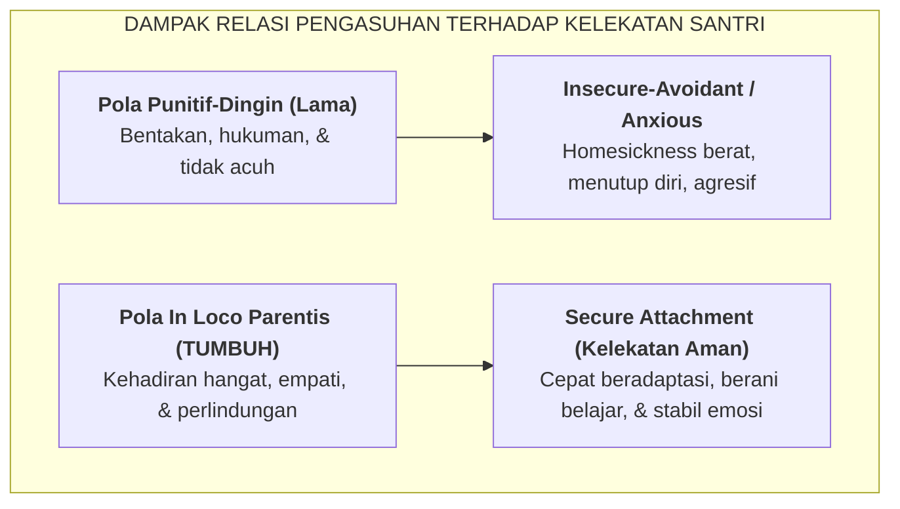

# SUB-BAB 2.3: TEORI KELEKATAN AMAN (*SECURE ATTACHMENT*) & RELASI AFEKTIF *IN LOCO PARENTIS*

---

## 1. Kebutuhan Dasar Afektif Santri yang Terpisah dari Rumah

Ketika seorang anak berusia 12 atau 13 tahun (fase transisi lulus SD/MI menuju MTs/Pesantren) diantar oleh orang tuanya ke asrama, terjadi pemutusan ikatan fisik harian (*separation from primary caregivers*) secara mendadak. 

Dalam psikologi perkembangan John Bowlby dan Mary Ainsworth, hubungan anak dengan figur pengasuh utama membentuk **pola kelekatan (*attachment style*)** yang menjadi fondasi rasa aman psikologis (*psychological safety*). [^1]

Jika di asrama santri baru disambut oleh lingkungan yang dingin, serba menakutkan, dan sarat ancaman fisik, sistem saraf anak akan menginterpretasikan lingkungan tersebut sebagai zona bahaya (*hostile environment*). Akibatnya:
1. **Homesickness Ekstrem**: Santri menangis berkepanjangan, menolak makan, atau jatuh sakit fisik (*psikosomatis*).
2. **Kelekatan Cemas atau Menghindar (*Insecure Attachment*)**: Santri menjadi sangat tertutup, takut berbicara dengan musyrif, atau sebaliknya menjadi reaktif dan mencari perhatian dengan cara melanggar aturan.

---

## 2. Konsep Syar'i: Musyrif Sebagai *In Loco Parentis* Penuh Kasih Sayang

Tradisi Islam memandang pendidik dan pembina asrama sebagai **pengganti orang tua sah secara moral dan spiritual (*In Loco Parentis / Qā'im Maqāmal-Wālidain*)**. 

Rasulullah SAW bersabda menegaskan peran kebapakan seorang pendidik:

> **إِنَّمَا أَنَا لَكُمْ بِمَنْزِلَةِ الْوَالِدِ، أُعَلِّمُكُمْ**
> 
> *"Sesungguhnya kedudukanku bagi kalian hanyalah laksana seorang ayah (yang penuh kasih sayang) terhadap anaknya; aku mengajari kalian (adab dan syariat)."* (HR. Abu Dawud no. 8 dan An-Nasa'i no. 40, hadits shahih) [^2]

Imam Ibnu Jama'ah Al-Kinani (659–733 H) dalam *Tadzkirah as-Sami' wa al-Mutakallim* merumuskan etika afektif pendidik terhadap santri:

> **أَنْ يُعَامِلَ الْمُتَعَلِّمِينَ بِمَا يُعَامِلُ بِهِ أَعَزَّ أَوْلَادِهِ، مِنَ الْحُنُوِّ وَالشَّفَقَةِ وَالْإِحْسَانِ إِلَيْهِمْ، وَالصَّبْرِ عَلَى جَفْوَةٍ تَبْدُو مِنْ بَعْضِهِمْ، وَأَنْ يَسْتَحْضِرَ أَنَّهُمْ أَمَانَةُ اللَّهِ عِنْدَهُ**
> 
> *"Hendaklah seorang pendidik memperlakukan para santri sebagaimana ia memperlakukan anak-anak kandungnya yang paling ia sayangi; yaitu dengan penuh kelembutan, kasih sayang (*syafaqah*), berbuat baik kepada mereka, bersabar atas kekurang-santunan yang terkadang muncul dari sebagian mereka, dan senantiasa menghadirkan kesadaran bahwa para santri itu adalah amanah Allah di tangannya."* [^3]

---

## 3. Protokol Kehadiran Hangat (*Warm Presence*) Musyrif di Lapangan

Untuk membangun kelekatan aman (*secure attachment*) di asrama, musyrif TUMBUH dilatih menjalankan **3 Protokol Kehadiran Hangat**:

1. **Penyambutan Fajar & Pelepasan Tidur (The Touchpoints of Care)**:
   * *Membangunkan Subuh*: Mengetuk pintu dengan santun, menyalakan lampu bertahap, memanggil dengan nada ceria dan doa (*"Ayo ksatria fajar, raih ridha Allah"*), menggantikan bentakan atau gedoran pintu.
   * *Menjelang Tidur (21:30 - 21:45)*: Mengunjungi kamar santri, menanyakan kabar santri yang kurang fit, memimpin doa kaffaratul majlis bersama, dan memadamkan lampu utama.
2. **Validasi Emosi Santri yang Sedih (*Active Empathic Listening*)**:
   * Ketika ada santri yang menangis karena rindu rumah, musyrif tidak meremehkannya (*"Begitu saja cengeng!"*), melainkan duduk berdampingan, memvalidasi perasaannya (*"Wajar jika antum rindu umi dan abi, itu tanda antum anak berbakti; mari kita doakan mereka dalam sujud kita"*).
3. **Makan Bersama Satu Nampan (*Mayoran / Barakah Sharing*)**:
   * Musyrif duduk melingkar makan bersama santri di lantai asrama. Momen makan bersama secara neurobiologis memicu pelepasan hormon **Oksitosin** (hormon kedekatan sosial dan rasa percaya), yang meruntuhkan jarak kaku antara pengasuh dan santri.

Dengan terjalinnya kelekatan aman ini, santri merasa memiliki rumah kedua yang aman. Kepatuhan mereka terhadap aturan asrama lahir dari rasa hormat dan cinta (*hubb wa ihtiram*), bukan dari kepalsuan rasa takut.

---

### 📚 Catatan Kaki & Referensi Akademik:

[^1]: Bowlby, J. (1982). *Attachment and Loss: Vol. 1. Attachment* (2nd ed.). New York: Basic Books, hlm. 177–210.
[^2]: Abu Dawud, Sulaiman bin al-Asy'ats. (2009). *Sunan Abi Dawud*. Ditahqiq oleh Syu'aib al-Arna'uth. Beirut: Dar ar-Risalah al-'Alamiyyah, Kitab *ath-Thaharah*, Hadits no. 8.
[^3]: Ibnu Jama'ah, Badruddin Muhammad bin Ibrahim. (2012). *Tadzkirah as-Sami' wa al-Mutakallim fi Adab al-'Alim wa al-Muta'allim*. Kairo: Dar al-Atsar, hlm. 48–52.
[^4]: Siegel, D. J. (2012). *The Developing Mind: How Relationships and the Brain Interact to Shape Who We Are* (2nd ed.). New York: Guilford Press, hlm. 112–138.
