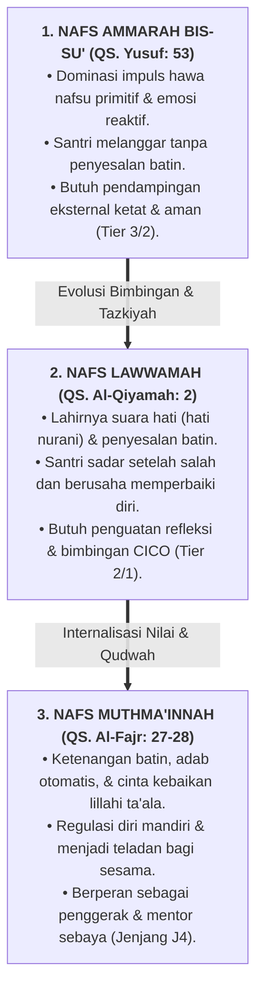

# SUB-BAB 2.4: TINGKATAN NAFS (*AMMARAH $\rightarrow$ LAWWAMAH $\rightarrow$ MUTHMA'INNAH*) DALAM PEMBINAAN KARAKTER

---

## 1. Peta Psikologi Spiritual Islam: Tiga Fase Evolusi Jiwa

Dalam tradisi pemikiran Islam, perkembangan moral dan kedewasaan spiritual manusia tidak dipandang sebagai garis statis, melainkan sebuah perjalanan dinamis penempaan jiwa (*Mujahadatun Linafsih* dan *Tazkiyatun Nafs*). Al-Qur'an memetakan jiwa manusia ke dalam **tiga tingkatan kesadaran eksistensial (*Maratib an-Nafs*)**:

Memahami ketiga tingkatan nafs ini sangat krusial bagi seluruh pengasuh pesantren. Kesalahan terbesar pembina asrama konvensional adalah **menuntut santri yang masih berada di level *Nafs Ammarah* (fase pubertas awal dengan dorongan impulsif tinggi) untuk seketika berperilaku layaknya orang tua di level *Nafs Muthma'innah***. Ketika santri gagal memenuhi ekspektasi instan tersebut, pengasuh lekas marah dan menghukumnya secara berlebihan.

---

## 2. Dekomposisi Dinamika Psikologis Tiga Tingkatan Nafs

### 🔴 1. Nafs Ammarah bis-Su' (Jiwa yang Didominasi Dorongan Impulsif)
Allah SWT berfirman menceritakan pengakuan Nabi Yusuf AS:

> **وَمَا أُبَرِّئُ نَفْسِي ۚ إِنَّ النَّفْسَ لَأَمَّارَةٌ بِالسُّوءِ إِلَّا مَا رَحِمَ رَبِّي ۚ إِنَّ رَبِّي غَفُورٌ رَّحِيمٌ**
> 
> *"Dan aku tidak membebaskan diriku (dari kesalahan), karena sesungguhnya nafsu itu selalu menyuruh kepada kejahatan, kecuali nafsu yang diberi rahmat oleh Tuhanku. Sesungguhnya Tuhanku Maha Pengampun lagi Maha Penyayang."* (QS. Yusuf [12]: 53) [^1]

* **Ciri Perilaku di Asrama**: Santri mudah terpancing emosi, egois dalam penggunaan fasilitas kamar mandi, menyembunyikan barang kawan sekamar demi lelucon, atau membolos halaqah saat musyrif lengah.
* **Kondisi Neurobiologis**: Pusat nalar (*Prefrontal Cortex*) belum matang sempurna, sementara sistem limbik (*amigdala* dan *nucleus accumbens*) sangat sensitif terhadap dorongan kepuasan instan (*instant gratification*) dan pengaruh kelompok sebaya.
* **Strategi Pembinaan TUMBUH**: Santri di fase ini tidak boleh dimusuhi atau dicap "anak nakal". Mereka membutuhkan **lingkungan yang berstruktur jelas (*high structure*), pengawasan hangat tanpa kekerasan (*warm supervision*), dan batas aturan yang konsisten**.

---

### 🟡 2. Nafs Lawwamah (Jiwa yang Kritis Mencela Kesalahan Sendiri)
Allah SWT bersumpah dengan jiwa yang sadar ini:

> **وَلَا أُقْسِمُ بِالنَّفْسِ اللَّوَّامَةِ**
> 
> *"Dan aku bersumpah dengan jiwa yang amat menyesali (dirinya sendiri tatkala berbuat salah)."* (QS. Al-Qiyamah [75]: 2) [^2]

Imam Al-Hasan Al-Bashri (w. 110 H) menjelaskan: *"Sesungguhnya orang mukmin senantiasa melihat dirinya dalam keadaan mencela dirinya sendiri: Apa yang kuinginkan dengan perkataanku tadi? Apa maksud dari perbuatanku tadi? Sementara orang fasik terus melangkah tanpa pernah menyesali perbuatannya."* [^3]

* **Ciri Perilaku di Asrama**: Santri merasa bersalah setelah berbohong, menunjukkan wajah cemas setelah melanggar, dan memiliki keinginan batin untuk memperbaiki keadaan meskipun terkadang masih terpeleset.
* **Kondisi Neurobiologis**: Terjadi penguatan sirkuit refleksi diri (*Default Mode Network*) dan integrasi konektivitas PFC dengan sistem emosi.
* **Strategi Pembinaan TUMBUH**: Fase ini adalah momen emas tarbiyah. Pengasuh dilarang keras mematikan benih penyesalan ini dengan hukuman yang mempermalukan anak. Pengasuh harus memfasilitasi **dialog reflektif, sesi muhasabah, jurnal adab harian, dan program pemulihan restoratif 3R (*Restitution, Resolution, Reconciliation*)**.

---

### 🟢 3. Nafs Muthma'innah (Jiwa yang Tenang dalam Ketaatan)
Allah SWT memanggil jiwa yang telah mencapai puncak kematangan ini:

> **يَا أَيَّتُهَا النَّفْسُ الْمُطْمَئِنَّةُ ارْجِعِي إِلَىٰ رَبِّكِ رَاضِيَةً مَّرْضِيَّةً فَادْخُلِي فِي عِبَادِي وَادْخُلِي جَنَّتِي**
> 
> *"Wahai jiwa yang tenang! Kembalilah kepada Tuhanmu dengan hati yang ridha lagi diridhai-Nya. Maka masuklah ke dalam golongan hamba-hamba-Ku, dan masuklah ke dalam surga-Ku."* (QS. Al-Fajr [89]: 27–30) [^4]

* **Ciri Perilaku di Asrama**: Santri bangun tahajjud dan menjaga sholat berjamaah atas kesadaran cinta kepada Allah, menjaga kebersihan kamar 5S tanpa perlu diperiksa, aktif mendamaikan perselisihan kawan, dan rela melayani kebutuhan adik-adik kelasnya (*Khadimul Ummah*).
* **Kondisi Neurobiologis**: Terwujudnya regulasi emosi tingkat tinggi (*top-down emotional regulation*), fungsi eksekutif otak bekerja optimal, dan tingkat empati sosial tinggi.
* **Strategi Pembinaan TUMBUH**: Memberikan amanah kepemimpinan, menempatkan mereka sebagai mentor sebaya (*peer-mentor*), dan melibatkan mereka dalam proyek khidmah sosial pesantren.

---

## 3. Matriks Transformasi Pengasuhan Lintas Tingkatan Jiwa

| Tingkatan Nafs Santri | Kebutuhan Utama Perkembangan | Peran Spesifik Musyrif / Guru | Instrumen TUMBUH yang Digunakan |
| :--- | :--- | :--- | :--- |
| **Nafs Ammarah** | Rasa aman, kejelasan aturan fisik, eliminasi godaan lingkungan. | *Guardian & Boundary Setter* (Tegas & Melindungi). | SOP Kamar 5S, CPTED Sarpras, Bimbingan CICO Tier 2/3. |
| **Nafs Lawwamah** | Ruang refleksi, pendampingan dialog damai, penutupan aib. | *Counselor & Facilitator* (Mendengar & Membimbing). | Bilik Sakinah, Jurnal Muhasabah, Mediasi Ishlah Restoratif. |
| **Nafs Muthma'innah** | Ruang aktualisasi kepemimpinan, tantangan kontribusi nyata. | *Mentor & Empowerer* (Mempercayakan Amanah). | Kepengurusan Santri J4, Student-Led Conference, Khidmah. |

Dengan memadukan peta tingkatan nafs ini ke dalam sistem pembinaan harian, pengasuh tidak lagi memperlakukan seluruh santri secara seragam dan kaku. Pengasuhan menjadi sebuah seni diagnostik spiritual yang presisi: membimbing santri melangkah dari belenggu nafsu impulsif menuju kemerdekaan jiwa yang tenang di jalan Allah SWT.

---

### 📚 Catatan Kaki & Referensi Akademik:

[^1]: Tafsir Ibnu Katsir. (2000). *Tafsir Al-Qur'an al-'Azhim*. Riyadh: Dar Thayyibah, Jilid IV, hlm. 398–401.
[^2]: Al-Baghawi, Abu Muhammad al-Husain bin Mas'ud. (1997). *Ma'alim at-Tanzil fi Tafsir al-Qur'an*. Riyadh: Dar Thayyibah, Jilid VIII, hlm. 272–274.
[^3]: Al-Ghazali, Abu Hamid Muhammad bin Muhammad. (2004). *Ihya' 'Ulumiddin*. Beirut: Dar al-Kutub al-'Ilmiyyah, Jilid III, Kitab *'Aja'ib al-Qalb*, hlm. 12–16.
[^4]: Ibnu Qayyim Al-Jauziyyah, Syamsuddin Muhammad bin Abi Bakr. (1998). *Ar-Ruh fi al-Kalam 'ala Arwah al-Amwat wa al-Ahya'*. Ditahqiq oleh Bassam 'Abdul Wahhab al-Jabi. Beirut: Dar Ibnu Hazm, hlm. 285–302.
