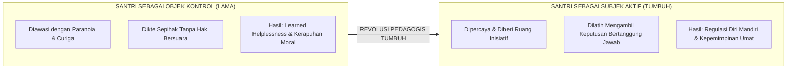
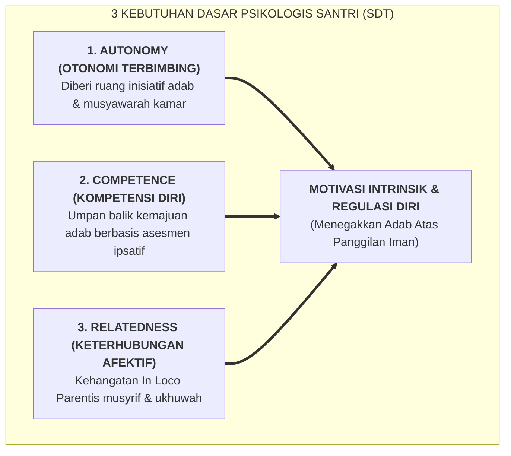

# SUB-BAB 2.5: SANTRI SEBAGAI SUBJEK AKTIF PERADABAN & IMPLIKASINYA BAGI PESANTREN

---

## 1. Transformasi Status: Dari Objek Kontrol Menjadi Subjek Pembelajar

Salah satu distorsi paling merugikan dalam manajemen pengasuhan asrama konvensional adalah memposisikan santri sebagai **objek pasif yang harus terus-menerus diawasi, dicurigai, dan dikendalikan (*passive objects of surveillance*)**. 

Dalam paradigma kontrol ini:
* Santri tidak diberi ruang untuk mengemukakan pandangan atau kesulitan yang mereka hadapi.
* Seluruh keputusan harian ditetapkan secara sepihak oleh pengasuh tanpa dialog.
* Santri hanya dilatih untuk patuh membeo (*blind obedience*), bukan dilatih menimbang nilai (*moral reasoning*) dan mengambil keputusan yang bertanggung jawab.

Dampak jangka panjang dari perlakuan ini adalah lahirnya **ketidakberdayaan yang dipelajari (*Learned Helplessness*)**. Ketika santri lulus dari pesantren dan masuk ke perguruan tinggi atau masyarakat luas di mana tidak ada lagi bel asrama dan musyrif yang membentak, mereka kerap mengalami disorientasi moral yang parah. Karena mereka tidak pernah dilatih mengemudikan diri mereka sendiri (*self-governance*), mereka mudah terseret oleh arus negatif pergaulan bebas.

Ekosistem TUMBUH merombak total paradigma ini dengan memposisikan santri sebagai **Subjek Aktif Peradaban (*Active Agents of Civilizational Transformation*)**.

---

## 2. Landasan Turats & Psikologi Penentuan Diri (*Self-Determination*)

Memperlakukan anak didik sebagai subjek bermartabat memiliki akar yang sangat kuat dalam Sirah Nabawiyyah. Rasulullah SAW tidak pernah memperlakukan para sahabat muda—seperti Usamah bin Zaid, Ibnu Abbas, Zaid bin Tsabit, dan Anas bin Malik—sebagai anak kecil yang tidak berdaya. Beliau memberikan kepercayaan besar kepada mereka:
* Menunjuk **Usamah bin Zaid** yang baru berusia 18 tahun sebagai panglima tertinggi pasukan kaum muslimin menghadapi imperium Romawi.
* Memberikan mandat kepada **Zaid bin Tsabit** untuk mempelajari bahasa Ibrani dan Suryani serta mengkodifikasi wahyu Al-Qur'an.
* Membimbing **Ibnu Abbas** dengan dialog intelektual yang mendalam tentang tauhid dan takdir sejak usia belia.

Dalam teori psikologi modern, Edward L. Deci dan Richard M. Ryan merumuskan **Self-Determination Theory (SDT)** bahwa manusia hanya akan mencapai motivasi intrinsik dan kematangan psikologis optimal jika tiga kebutuhan dasar kejiwaannya terpenuhi: [^1]

1. **Autonomy (Otonomi Terbimbing)**: Perasaan bahwa dirinya memiliki kehendak bebas dan menjadi pelaku utama atas tindakannya sendiri, bukan boneka yang digerakkan paksa oleh orang lain.
2. **Competence (Kompetensi Diri)**: Keyakinan bahwa dirinya mampu menguasai keterampilan baru, menyelesaikan masalah, dan berhasil memikul tanggung jawab.
3. **Relatedness (Keterhubungan Afektif)**: Perasaan bahwa dirinya disayangi, diterima, dan menjadi bagian berharga dari komunitas asrama (*Bi'ah Shalihah*).

Ketika pesantren memfasilitasi ketiga kebutuhan ini, santri tidak lagi memandang disiplin dan ibadah sebagai "paksaan pengurus pondok", melainkan sebagai **kebutuhan mulia dari dalam jiwanya sendiri**.

---

## 3. Implikasi Praktis Terhadap Tata Kelola Pesantren Sehari-Hari

Bagaimana prinsip santri sebagai subjek aktif ini diterjemahkan ke dalam operasional pesantren? Sistem TUMBUH merumuskan empat kebijakan praksis:

### 1. Piagam Kesepakatan Kamar & Kelas (*Co-Created Social Norms*)
Aturan asrama tidak diturunkan sebagai dikte sepihak yang kaku. Pada pekan pertama masuk pondok, musyrif duduk melingkar bersama santri untuk menyusun **Piagam Kesepakatan Kamar**. Santri diajak berdiskusi: *"Kamar seperti apa yang membuat kita semua nyaman belajar dan istirahat? Apa yang harus kita lakukan jika ada kawan yang sakit atau bersedih?"*. Karena aturan dirumuskan bersama, santri memiliki rasa kepemilikan psikologis (*psychological ownership*) untuk menjaganya.

### 2. Penghapusan Budaya Mata-Mata (*Anti-Espionage Culture*)
Pola lama yang merekrut "santri intel" untuk memata-matai kawan sekamarnya dihapus secara mutlak. Praktik spionase semacam itu merusak iklim *ukhuwah* dan menumbuhkan rasa saling curiga serta pengkhianatan. Keamanan asrama ditegakkan secara terbuka melalui **kehadiran hangat musyrif (*Warm Presence*)**, rekayasa tata ruang Sarpras tanpa sudut mati (CPTED), dan pembudayaan keterbukaan.

### 3. Student-Led Initiatives & Khidmah Kepemimpinan
Santri dilibatkan secara aktif dalam merancang kegiatan pondok:
* Mengelola majelis mudzakarah malam secara mandiri.
* Menjadi ketua regu kebersihan 5S dan duta literasi perpustakaan.
* Santri jenjang J4 (kelas 11–12) berperan nyata sebagai mentor adik kelas (*Peer-Mentors*), bukan sebagai algojo penegak hukuman.

### 4. Partisipasi Aktif dalam Pelaporan Kemajuan (Student-Led Conference - SLC)
Saat penerimaan laporan perkembangan belajar di akhir semester, santri tidak duduk di luar ruangan dengan cemas menanti vonis. Dalam forum SLC, **santri sendirilah yang mempresentasikan portofolio kemajuannya di hadapan orang tua dan musyrifnya**, menjelaskan keberhasilan yang dicapai, mengakui tantangan yang masih dihadapi, dan memaparkan target perbaikan di masa depan.

---

## 4. Penutup Bab 02: Membangun Manusia Merdeka yang Beradab

Menegakkan ontologi fitrah dan memposisikan santri sebagai subjek aktif adalah jantung dari filsafat pendidikan TUMBUH. Pesantren bukanlah pabrik pencetak robot yang tunduk mekanis di bawah cambuk ketakutan, melainkan **taman peradaban yang memerdekakan jiwa manusia dari perbudakan hawa nafsu menuju penghambaan hakiki kepada Allah SWT**.

---

### 📚 Catatan Kaki & Referensi Akademik:

[^1]: Deci, E. L., & Ryan, R. M. (2000). The "what" and "why" of goal pursuits: Human needs and the self-determination of behavior. *Psychological Inquiry*, 11(4), 227–268.
[^2]: Ibnu Katsir, 'Imaduddin Abu al-Fida' Isma'il. (2003). *Al-Bidayah wa an-Nihayah*. Kairo: Dar Hijr, Jilid V, Fasal *Fi Ba'tsi Usamah bin Zaid*, hlm. 224–228.
[^3]: Al-Attas, Syed Muhammad Naquib. (1980). *The Concept of Education in Islam: A Framework for an Islamic Philosophy of Education*. Kuala Lumpur: ABIM, hlm. 23–37.
[^4]: Bandura, A. (2001). Social cognitive theory: An agentic perspective. *Annual Review of Psychology*, 52(1), 1–26.
