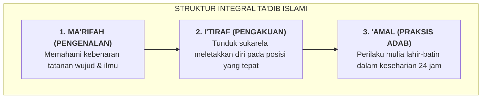

# SUB-BAB 3.1: KONSEP *TA'DIB* ULAMA KLASIK VS REDUKSIONISME PENDIDIKAN MODERN

---

## 1. Definisi & Kedalaman Makna *Ta'dib* dalam Epistemologi Islam

Dalam khazanah peradaban Islam, istilah untuk menyebut proses pendidikan tidak terbatas pada *Ta'lim* (pengajaran ilmu pengetahuan) atau *Tarbiyah* (pengasuhan dan pemeliharaan potensi fisik). Istilah yang paling komprehensif, mendalam, dan menjadi inti dari pembentukan kepribadian muslim adalah **Ta'dib (تَأْدِيْب)**.

Prof. Dr. Syed Muhammad Naquib Al-Attas mendefinisikan *Ta'dib* sebagai:

> *"Pengenalan dan pengakuan yang diangsurkan secara berangsur-angsur ke dalam diri manusia tentang tempat-tempat yang tepat dari segala sesuatu di dalam tatanan wujud (*marātib al-wujūd*), yang membimbingnya ke arah pengenalan dan pengakuan akan tempat Tuhan yang tepat di dalam tatanan wujud dan kepribadiannya."* [^1]

Secara etimologis dan maknawi, kata *Adab* mencakup keadilan (*'adl*), hikmah (*hikmah*), dan ketepatan meletakkan sesuatu pada tempatnya (*wad'u syai'in fi mahallihi*). Ketika seorang santri memiliki adab, ia:
1. Mengenali hakikat dirinya sebagai hamba Allah (*'abdullāh*) dan khalifah di muka bumi (*khalīfatullāh*).
2. Menghormati ilmu dan ulama yang mengajarkannya dengan rasa takzim tulus.
3. Menjaga hubungan persaudaraan (*ukhuwah*) dengan sesama santri tanpa merendahkan atau menindas.
4. Menjaga dan memelihara sarana fisik pesantren sebagai amanah lingkungan.



Rasulullah SAW menegaskan bahwa pembinaan adab ini adalah karunia agung dari Allah SWT:

> **أَدَّبَنِي رَبِّي فَأَحْسَنَ تَأْدِيبِي**
> 
> *"Tuhanku telah mendidik adab kepadaku, maka Dia menjadikan sebaik-baik pendidikanku."* (Hadits diriwayatkan oleh As-Sam'ani dan Ibnu Sam'un; maknanya shahih menurut para muhaqqiq) [^2]

---

## 2. Kritik atas Reduksionisme Pendidikan Modern

Krisis karakter yang melanda banyak institusi pendidikan hari ini bermula dari **reduksionisme konsep pendidikan**:

```
                       REDUKSIONISME PENDIDIKAN MODERN
                       
  [Pendidikan Utuh: Ta'dib] ──► Direduksi Menjadi ──► [Transfer Pengetahuan Kognitif]
                                                             │
                                                             ▼
                                                [Asesmen Angka Ujian / Ranking]
                                                             │
                                                             ▼
                                                [Lahirnya Generasi Cerdas Intelek
                                                 Namun Miskin Empati & Nir-Adab]
```

1. **Reduksi Menjadi Sekadar Ta'lim (Transfer Informasi Kognitif)**: Pendidikan disempitkan menjadi transfer hafalan teori dari buku teks ke lembar ujian. Seorang anak dianggap "berhasil" jika nilai ujian tulisnya tinggi, meskipun di asrama ia kerap mencuri barang temannya atau menghina santri yunior.
2. **Reduksi Menjadi Kepatuhan Mekanis (Behaviorisme Dangkal)**: Pendisiplinan dipahami sekadar manipulasi stimulus-respon (hadiah stiker vs hukuman fisik). Pendekatan ini memperlakukan santri layaknya sirkus hewan yang patuh karena takut cambuk, bukan manusia berakal yang diseru fitrahnya.
3. **Pemisahan Ilmu dari Nilai (*Secularization of Knowledge*)**: Ilmu diajarkan tanpa menghubungkannya dengan kesadaran ketuhanan (*Muraqabatullah*), sehingga ilmu justru melahirkan kesombongan intelektual (*kibr*).

Imam Az-Zarnuji (w. 591 H) dalam *Ta'lim al-Muta'allim* telah mengingatkan bahaya memisahkan ilmu dari adab:

> **فَسَادٌ كَبِيرٌ عَالِمٌ مُتَهَتِّكٌ ۞ وَأَكْبَرُ مِنْهُ جَاهِلٌ مُتَنَسِّكُ**  
> **هُمَا فِتْنَةٌ فِي الْعَالَمِينَ عَظِيمَةٌ ۞ لِمَنْ بِهِمَا فِي دِينِهِ يَتَمَسَّكُ**
> 
> *"Sebuah kerusakan yang sangat besar manakala ada seorang berilmu yang tidak memiliki adab dan melanggar batas syariat, namun jauh lebih besar kerusakannya adalah orang bodoh yang tekun beribadah tanpa ilmu. Keduanya adalah fitnah (malapetaka) yang besar di alam semesta bagi siapa saja yang menjadikan mereka panutan dalam agamanya."* [^3]

---

## 3. Matriks Perbandingan: Konsep Ta'dib vs Model Pendidikan Konvensional

| Dimensi Parameter | Pendidikan Reduksionis Konvensional | Konsep Ta'dib Ekosistem TUMBUH |
| :--- | :--- | :--- |
| **Fokus Utama** | Penguasaan materi kognitif & nilai angka rapor formal. | Penanaman nilai adab ke dalam kalbu, nalar, dan perilaku nyata. |
| **Metode Evaluasi** | Ujian tertulis sumatif, perangkingan kelas, dan buku poin pelanggaran. | Asesmen ipsatif, observasi alami 24 jam, dan portofolio kemajuan diri. |
| **Posisi Pendidik** | Pengajar yang hanya bertugas di depan kelas sesuai jam kerja. | *Qudwah Hasanah* dan orang tua pengganti (*in loco parentis*) 24 jam. |
| **Hasil yang Dituju** | Lulusan yang memiliki sertifikat akademik namun rawan disorientasi moral. | **Insan Adabi**: Manusia yang mengenal Tuhannya, berakhlak mulia, mandiri, dan berjiwa khidmah. |

Ekosistem TUMBUH mengembalikan ruh *Ta'dib* sebagai kompas induk seluruh aktivitas pesantren. Setiap jengkal tanah asrama, setiap menit jadwal harian, dan setiap interaksi antara santri dan asatidz dirancang untuk menjadi wahana penanaman adab yang hidup dan bermakna.

---

### 📚 Catatan Kaki & Referensi Akademik:

[^1]: Al-Attas, Syed Muhammad Naquib. (1980). *The Concept of Education in Islam: A Framework for an Islamic Philosophy of Education*. Kuala Lumpur: Muslim Youth Movement of Malaysia (ABIM), hlm. 15–25.
[^2]: Al-Ghazali, Abu Hamid Muhammad bin Muhammad. (2004). *Ihya' 'Ulumiddin*. Beirut: Dar al-Kutub al-'Ilmiyyah, Jilid III, Kitab *Riyadhat an-Nafs*, hlm. 68.
[^3]: Az-Zarnuji, Burhanuddin. (2008). *Ta'lim al-Muta'allim Thariq at-Ta'allum*. Ditahqiq oleh Musthafa 'Asyur. Kairo: Maktabah al-Qur'an, hlm. 45–48.
[^4]: Nasr, Seyyed Hossein. (1987). *Traditional Islam in the Modern World*. London: KPI, hlm. 121–134.
