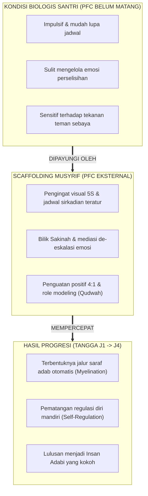

# SUB-BAB 3.2: NEUROSAINS KOGNITIF REMAJA: BIOLOGI PEMATANGAN PFC, SISTEM LIMBIK, & *SCAFFOLDING*

---

## 1. Biologi Otak Remaja: Mengapa Santri Bersikap Impulsif?

Mayoritas santri di pesantren berada pada rentang usia 12 hingga 18 tahun (usia pendidikan MTs dan MA). Dalam perspektif neurobiologi perkembangan, rentang usia ini merupakan fase transformasi struktural otak yang paling intensif setelah masa bayi.

Kekeliruan paling umum di kalangan pendidik asrama adalah **menilai perilaku santri remaja dengan kacamata otak orang dewasa**. Santri yang lupa membereskan lemari, mudah tersinggung saat diejek kawan, atau tergiur melanggar aturan demi mencari perhatian teman sebayanya sering kali langsung dicap "pembangkang" atau "berakhlak buruk". Padahal, secara anatomis, perilaku tersebut berakar pada **ketidakseimbangan laju pematangan antara dua wilayah utama otak**:

```
                       KETIDAKSEIMBANGAN LAJU PEMATANGAN OTAK REMAJA
                       
 [SISTEM LIMBIK / AMIGDALA]   ────────► Matang Lebih Awal (Usia 11–13 Tahun)
 (Pusat Emosi, Sensasi, & Respon Sosial)   (Mesin Bertenaga Kuda / Hyper-Reactive)
                                                     │
                                                     ▼ GAP PERKEMBANGAN
                                                     ▲
 [PREFRONTAL CORTEX / PFC]     ────────► Matang Sangat Lambat (Usia 22–25 Tahun)
 (Pusat Rem Moral, Regulasi, & Pertimbangan) (Sistem Rem yang Masih dalam Pembangunan)
```

1. **Sistem Limbik (Amigdala & Nucleus Accumbens)**: Pusat pemrosesan emosi, dorongan mencari sensasi baru (*sensation-seeking*), dan sensitivitas terhadap penerimaan kelompok sebaya (*peer acceptance*) telah berkembang sangat pesat sejak awal pubertas.
2. **Prefrontal Cortex (PFC)**: Wilayah otak bagian depan yang berfungsi sebagai "rem kontrol"—mengatur pengendalian impuls (*impulse control*), perencanaan jangka panjang, pertimbangan risiko moral, dan konsentrasi—masih berada dalam fase konstruksi aktif hingga awal usia 20-an.

Ibarat sebuah mobil balap, santri remaja memiliki mesin berkecepatan tinggi namun sistem rem yang belum terpasang sempurna. Oleh karena itu, menghukum santri secara kejam atas kegagalan pengendalian diri sesaat bukanlah tindakan yang bijak secara pedagogis maupun biologis.

---

## 2. *Scaffolding* Pengasuhan: Musyrif Sebagai "Prefrontal Cortex Eksternal"

Dalam teori psikologi perkembangan Lev Vygotsky dan Jerome Bruner, anak yang sedang berkembang membutuhkan **Scaffolding (perancah pendukung)**—yaitu struktur bantuan eksternal yang menopang anak tatkala mereka belum mampu menjalankan tugas secara mandiri, yang kemudian dilepaskan secara bertahap seiring matangnya kemampuan anak. [^1]

Dalam ekosistem pesantren TUMBUH, **musyrif dan lingkungan asrama yang terstruktur berfungsi sebagai "Prefrontal Cortex Eksternal" bagi santri**:



Tugas musyrif bukanlah menjadi polisi yang menunggu santri terpeleset lalu memvonisnya, melainkan menyediakan perancah pembiasaan yang kokoh:
* **Struktur Lingkungan yang Jelas**: Rutinitas jadwal harian yang pasti (*predictable environment*) menenangkan amigdala santri karena mereka tahu pasti apa yang diharapkan dari mereka setiap jamnya.
* **Petunjuk Visual yang Konkret (*Visual Nudges*)**: Papan checklist 5S di pintu kamar membantu otak santri yang masih mudah lupa untuk memeriksa kerapian secara mandiri.
* **Kehadiran Hangat Tanpa Ancaman (*Calm Demeanor*)**: Intonasi musyrif yang tenang dan stabil (*co-regulation*) menular ke sistem saraf santri, membantu menurunkan gejolak amigdala mereka saat menghadapi konflik.

---

## 3. Neuroplastisitas & Pembentukan Jalur Saraf Adab Melalui Pengulangan (*Habit Loop*)

Otak manusia memiliki sifat **neuroplastisitas (*neuroplasticity*)**—kemampuan jaringan saraf otak untuk berubah, memperkuat jalur baru, dan membentuk kebiasaan otomatis melalui pengulangan yang konsisten.

Prinsip neurosains yang terkenal dari Donald Hebb (1949) menyatakan: *"Neurons that fire together, wire together"* (Sel-sel saraf yang diaktifkan secara bersamaan akan terhubung membentuk sirkuit yang kuat). [^2]

```
                  SIKLUS PEMBENTUKAN HABIT LOOP ADAB 24 JAM
                  
  [1. CUE / TANDA VISUAL] ──► [2. ROUTINE / PRAKTIK ADAB] ──► [3. REWARD / PENGUATAN]
  • Bel Sirkatian Lembut       • Merapikan Sandal 5S           • Apresiasi Tulus Musyrif
  • Contoh Nyata Musyrif       • Sholat di Shaf Awal           • Kepuasan Kalbu (Fitrah)
            ▲                                                              │
            └──────────────────────────────────────────────────────────────┘
                         PENGULANGAN KONSISTEN (40 - 66 HARI)
                                           │
                                           ▼
                 [Terbentuknya Jalur Saraf Adab Otomatis & Mandiri]
```

Ketika santri membiasakan adab merapikan tempat tidur, meletakkan sandal menghadap keluar, atau membaca doa sebelum makan secara berulang-ulang selama 40 hingga 66 hari dalam atmosfer yang tenang tanpa teror rasa takut, selaput mielin (*myelin sheath*) akan membungkus jalur saraf tersebut. Akibatnya:
1. **Perilaku Menjadi Otomatis**: Santri melakukan adab tersebut tanpa perlu berpikir keras atau dipaksa.
2. **Efisiensi Energi Mental**: Menegakkan adab tidak lagi terasa sebagai beban yang menguras energi, melainkan telah menyatu menjadi bagian alami dari kepribadian mereka.

Inilah rahasia mengapa tradisi pesantren mengajarkan *istiqamah* dan *riyadhah*: pembiasaan fisik yang konsisten secara biologis merekonstruksi arsitektur otak santri menjadi otak yang beradab (*civilized brain*).

---

### 📚 Catatan Kaki & Referensi Akademik:

[^1]: Bruner, J. S. (1978). The role of dialogue in language acquisition. Dalam A. Sinclair, R. J. Jarvella, & W. J. M. Levelt (Eds.), *The Child's Conception of Language*. New York: Springer-Verlag, hlm. 241–256.
[^2]: Hebb, D. O. (1949). *The Organization of Behavior: A Neuropsychological Theory*. New York: John Wiley & Sons, hlm. 60–78.
[^3]: Steinberg, L. (2008). A social neuroscience perspective on adolescent risk-taking. *Developmental Review*, 28(1), 78–106.
[^4]: Lally, P., van Jaarsveld, C. H., Potts, H. W., & Wardle, J. (2010). How are habits formed: Modelling habit formation in the real world. *European Journal of Social Psychology*, 40(6), 998–1009.
