# SUB-BAB 3.3: KONVERGENSI *QUDWAH HASANAH* & *MIRROR NEURON SYSTEM*: PENDIDIK SEBAGAI *LIVING CURRICULUM*

---

## 1. Titik Temu Agung: Perintah Syariat dan Temuan Neurosains Sosial

Di antara pilar paling sentral dalam pendidikan Islam adalah prinsip **Qudwah Hasanah (Keteladanan yang Luhur)**. Al-Qur'an secara eksplisit menetapkan pribadi Rasulullah SAW sebagai model percontohan hidup bagi seluruh umat manusia:

> **لَّقَدْ كَانَ لَكُمْ فِي رَسُولِ اللَّهِ أُسْوَةٌ حَسَنَةٌ لِّمَن كَانَ يَرْجُو اللَّهَ وَالْيَوْمَ الْآخِرَ وَذَكَرَ اللَّهَ كَثِيرًا**
> 
> *"Sungguh, telah ada pada (diri) Rasulullah itu suri teladan yang baik bagimu (yaitu) bagi orang yang mengharap (rahmat) Allah dan (kedatangan) hari kiamat dan yang banyak mengingat Allah."* (QS. Al-Ahzab [33]: 21) [^1]

Dalam ranah sains kontemporer, penemuan sistem saraf cermin (**Mirror Neuron System**) oleh tim peneliti neurosains Universitas Parma yang dipimpin oleh Giacomo Rizzolatti dan Vittorio Gallese pada dekade 1990-an, memberikan konfirmasi biologis yang mencengangkan mengenai efektivitas mutlak metode keteladanan. [^2]

*Mirror Neurons* adalah kumpulan sel saraf khusus di otak yang akan menyala (*fire*) tidak hanya ketika seseorang melakukan suatu tindakan fisik atau merasakan emosi tertentu, melainkan **juga menyala secara otomatis ketika orang tersebut sekadar mengamati orang lain melakukan tindakan atau mengekspresikan emosi tersebut**.

```mermaid
flowchart LR
    subgraph Pengasuh["KETELADANAN PENDIDIK (STIMULUS VISUAL)"]
        P1["Musyrif sholat tepat waktu & tenang"]
        P2["Musyrif berbicara santun & tersenyum"]
        P3["Musyrif menjaga kerapian kamar 5S"]
    end

    subgraph OtakSantri["SISTEM SARAF SANTRI (MIRROR NEURONS)"]
        N1["Mirror Neurons menyala otomatis"]
        N2["Sirkuit empati & adab teraktivasi"]
        N3["Otak santri memetakan tindakan tanpa paksaan"]
    end

    subgraph PerilakuSantri["INTERNALISASI ADAB NYATA"]
        R1["Santri meniru ibadah khusyuk"]
        R2["Santri berbahasa santun kepada sesama"]
        R3["Santri merapikan lingkungan mandiri"]
    end

    Pengasuh ==>|DILIHAT 24 JAM| OtakSantri
    OtakSantri ==>|TRANSFORMASI| PerilakuSantri
```

Otak santri, dengan demikian, dirancang secara biologis untuk **meniru apa yang mereka lihat, bukan apa yang semata-mata mereka dengar melalui ceramah**.

---

## 2. Pendidik Sebagai Kurikulum Hidup (*The Living Curriculum*)

Di pesantren, santri hidup berdampingan dengan para guru dan musyrif selama 24 jam penuh. Dalam ekosistem yang intim ini, kurikulum formal yang tertulis di atas kertas silabus memiliki pengaruh yang jauh lebih kecil dibandingkan **kurikulum hidup (*The Living Curriculum / al-Manhaj al-Hayy*)** yang dipancarkan oleh perilaku harian asatidz.

Santri mengamati setiap gerak-gerik pengasuhnya:
* *Bagaimana ekspresi wajah musyrif saat menghadapi santri yang terlambat?* Jika musyrif merespons dengan tenang, sabar, namun tegas (*Firm & Kind*), *mirror neurons* santri belajar tentang regulasi emosi dan ketenangan jiwa.
* *Bagaimana musyrif berbicara kepada staf dapur atau petugas kebersihan?* Jika musyrif memperlakukan mereka dengan penuh hormat dan santun, santri menginternalisasi nilai kesetaraan dan menolak feodalisme.
* *Sebaliknya, jika musyrif mengajarkan adab kejujuran di kelas namun berteriak kasar dan memaki di asrama*, otak santri mendeteksi inkonsistensi (*cognitive dissonance*) ini dan menyerap kemunafikan sebagai standar perilaku yang dapat diterima.

Imam Al-Ghazali (450–505 H) dalam *Ihya' 'Ulumiddin* menegaskan tanggung jawab moral keteladanan ini bagi para pendidik:

> **مِثَالُ الْمُعَلِّمِ الْمُرْشِدِ مِثَالُ النَّقْشِ مِنَ الطِّينِ وَالظِّلِّ مِنَ الْعُودِ، فَكَيْفَ يَنْتَقِشُ الطِّينُ بِمَا لَا نَقْشَ فِيهِ؟ وَكَيْفَ يَسْتَقِيمُ الظِّلُّ وَالْعُودُ أَعْوَجُ؟**
> 
> *"Perumpamaan seorang pendidik dan pembimbing itu laksana ukiran stempel pada tanah liat dan bayangan dari sebuah tongkat kayu. Bagaimana mungkin tanah liat dapat terukir dengan indah bila stempelnya tidak memiliki ukiran? Dan bagaimana mungkin bayangan akan lurus bila tongkat kayunya bengkok?"* [^3]

---

## 3. Matriks Transformasi Peran: Dari Penginstruksi Menjadi Teladan Hidup

Untuk mengoptimalkan fungsi *Mirror Neurons* santri, ekosistem TUMBUH menetapkan standar operasional keteladanan bagi seluruh asatidz dan musyrif:

| Area Pembiasaan | Pendekatan Verbal Lama (Kurang Efektif) | Pendekatan Qudwah TUMBUH (Optimal) |
| :--- | :--- | :--- |
| **Ibadah Sholat Berjamaah** | Meneriaki santri dari pos asrama menggunakan pengeras suara agar segera ke masjid. | Musyrif telah berwudhu rapi dan duduk di shaf terdepan 15 menit sebelum azan berkumandang. |
| **Tata Graha Kamar 5S** | Mengancam akan menyita baju santri yang berantakan di atas kasur. | Menjaga kamar asrama musyrif sendiri selalu berada dalam standar prima 5S (buku tertata, sprei rapi, wangi). |
| **Komunikasi & Bahasa** | Menghukum santri yang berkata kasar dengan cara membentak dan mempermalukannya. | Selalu menyapa santri dengan panggilan mulia (*akhi, ksatria, ananda*), nada tenang, dan menolak kata kasar. |
| **Penyelesaian Konflik** | Menghakimi santri secara emosional dengan suara tinggi di depan santri lain. | Mengajak santri berdialog empat mata di Bilik Sakinah dengan validasi perasaan dan mendengarkan aktif. |

Ketika keteladanan visual (*Qudwah Hasanah*) dihadirkan secara konsisten di seluruh sudut pesantren—didukung oleh sistem rotasi shift musyrif yang melindungi mereka dari kelelahan—maka transfer adab terjadi secara alami, tanpa gesekan (*frictionless*), dan membekas abadi di dalam struktur jiwa santri hingga akhir hayatnya.

---

### 📚 Catatan Kaki & Referensi Akademik:

[^1]: Tafsir Ibnu Katsir. (2000). *Tafsir Al-Qur'an al-'Azhim*. Riyadh: Dar Thayyibah, Jilid VI, hlm. 390–394.
[^2]: Rizzolatti, G., & Craighero, L. (2004). The mirror-neuron system. *Annual Review of Neuroscience*, 27(1), 169–192.
[^3]: Al-Ghazali, Abu Hamid Muhammad bin Muhammad. (2004). *Ihya' 'Ulumiddin*. Beirut: Dar al-Kutub al-'Ilmiyyah, Jilid I, Kitab *al-'Ilm*, Fasal *Adab al-Mu'allim*, hlm. 72.
[^4]: Gallese, V. (2001). The "shared manifold" hypothesis: From mirror neurons to empathy. *Journal of Consciousness Studies*, 8(5-7), 33–50.
