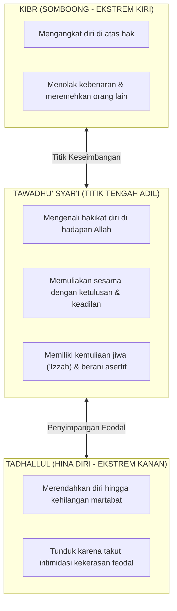

# SUB-BAB 4.1: MELURUSKAN MAKNA TAWADHU': ANTARA KERENDAHAN HATI SYAR'I DAN INFERIORITAS TERTEKAN

---

## 1. Distorsi Konsep: Ketika Ketakutan Dianggap Sebagai Akhlak

Salah satu penyimpangan nilai yang kerap mengakar di pesantren konvensional adalah **terdistorsinya konsep Tawadhu' (تَوَاضُع — kerendahan hati)** menjadi **Inferioritas Tertekan (*Tadhallul al-Mahin*)**.

Dalam kultur asrama yang feodal:
* Santri yunior dipaksa menunduk ketakutan, berjalan membungkuk berlebihan, dan tidak berani menatap mata santri senior saat diajak bicara.
* Santri yunior tidak diperkenankan menyampaikan kebenaran atau mengadukan perlakuan zalim dengan dalih *"tidak sopan kepada yang lebih tua"*.
* Pengurus senior membenarkan perlakuan kasar dan bentakan mereka sebagai cara *"melatih mental agar adik kelas memiliki tawadhu' dan tidak sombong"*.

Praktik semacam ini adalah manipulasi terhadap ajaran Islam. Apa yang dihasilkan dari perlakuan intimidatif tersebut bukanlah *tawadhu'*, melainkan **ketakutan batin, hilangnya kepercayaan diri, dan penanaman benih dendam**. Begitu santri yang tertekan ini naik kelas menjadi senior, mereka akan menuntut perlakuan feodal yang sama dari adik-adik kelas barunya.

---

## 2. Hakikat Tawadhu' Menurut Ulama Turats Klasik

Para ulama akhlak membedakan secara tegas antara *Tawadhu'* yang terpuji dengan *Tadhallul* (sikap menghinakan diri yang tercela).

Imam Al-Ghazali (450–505 H) dalam *Ihya' 'Ulumiddin* menegaskan batasan ini:

> **التَّوَاضُعُ مَحْمُودٌ، وَهُوَ الْعَدْلُ بَيْنَ الْكِبْرِ وَالتَّذَلُّلِ؛ فَالْكِبْرُ رَفْعُ النَّفْسِ فَوْقَ حَقِّهَا، وَالتَّذَلُّلُ وَضْعُ النَّفْسِ دُونَ حَقِّهَا بِحَيْثُ يُؤَدِّي إِلَى مَهَانَةٍ، وَالتَّوَاضُعُ أَنْ تَعْرِفَ قَدْرَ نَفْسِكَ وَتُنْزِلَهَا مَنْزِلَتَهَا الَّتِي تَسْتَحِقُّهَا لِلَّهِ تَعَالَى**
> 
> *"Tawadhu' itu adalah sifat yang terpuji, yaitu titik tengah yang adil di antara sifat sombong (kibr) dan sifat menghinakan diri (tadhallul). Sombong adalah mengangkat diri melampaui batas haknya, sedangkan tadhallul adalah merendahkan diri di bawah batas haknya hingga berujung pada kehinaan diri (mahanah). Adapun tawadhu' yang hakiki adalah engkau mengenali kedudukan dirimu dan menempatkannya pada posisi yang semestinya semata-mata karena Allah Ta'ala."* [^1]

Rasulullah SAW mempertegas bahwa tawadhu' adalah sikap hati yang berakar pada keikhlasan kepada Allah, bukan rasa takut kepada sesama manusia:

> **مَا نَقَصَتْ صَدَقَةٌ مِنْ مَالٍ، وَمَا زَادَ اللَّهُ عَبْدًا بِعَفْوٍ إِلَّا عِزًّا، وَمَا تَوَاضَعَ أَحَدٌ لِلَّهِ إِلَّا رَفَعَهُ اللَّهُ**
> 
> *"Tidaklah sedekah itu mengurangi harta, dan tidaklah Allah menambahkan kepada seorang hamba yang suka memaafkan melainkan kemuliaan, serta tidaklah seseorang bersikap tawadhu' karena Allah melainkan Allah akan mengangkat derajatnya."* (HR. Muslim no. 2588) [^2]

Syarat utama dari tawadhu' yang sah adalah **"lillāh" (karena Allah)**. Ketika seseorang merendahkan hati karena Allah, jiwanya diliputi ketenangan, kemuliaan (*'izzah*), dan keberanian membela kebenaran. Sebaliknya, sikap tunduk karena takut dihajar senior atau takut dimaki pengurus adalah bentuk perendahan martabat yang diharamkan syariat.

---

## 3. Matriks Perbandingan: Tawadhu' Hakiki vs Inferioritas Feodal

| Indikator Evaluasi | Tawadhu' Hakiki (Ekosistem TUMBUH) | Inferioritas Feodal (Paradigma Lama) |
| :--- | :--- | :--- |
| **Sumber Penggerak** | Kesadaran kehambaan kepada Allah (*Ubudiyyah*). | Rasa takut akan sanksi fisik atau bentakan senior. |
| **Sikap Saat Menghadapi Ketidakadilan** | Santun namun berani menyampaikan kebenaran (*Tabayyun*). | Diam membisu karena takut, lalu menggerutu di belakang. |
| **Kondisi Kejiwaan Santri** | Tenang, percaya diri, memiliki harga diri sehat (*Self-Esteem*). | Cemas, merasa kerdil (*Inferiority Complex*), dan trauma batin. |
| **Perlakuan Saat Menjadi Senior** | Mengayomi, melayani, dan membimbing adik kelas dengan kasih. | Menindas dan menuntut penghormatan buta dari adik kelas. |

Ekosistem TUMBUH menumbuhkan santri yang memiliki **Tawadhu' yang Mulia**: santri yang tunduk patuh kepada perintah Allah dan rasul-Nya, hormat takzim kepada para kyai dan guru, namun memiliki jiwa merdeka yang tegak membela kebenaran tanpa rasa takut kepada penindasan manusia.

---

### 📚 Catatan Kaki & Referensi Akademik:

[^1]: Al-Ghazali, Abu Hamid Muhammad bin Muhammad. (2004). *Ihya' 'Ulumiddin*. Beirut: Dar al-Kutub al-'Ilmiyyah, Jilid III, Kitab *Dzammi al-Kibr wa al-'Ujb*, hlm. 340–345.
[^2]: Muslim bin al-Hajjaj. (2006). *Shahih Muslim*. Riyadh: Dar Thayyibah, Kitab *al-Birr wa ash-Shilah wa al-Adab*, Hadits no. 2588.
[^3]: Al-Mawardi, Abu al-Hasan 'Ali bin Muhammad. (1987). *Adab ad-Dunya wa ad-Din*. Beirut: Dar al-Kutub al-'Ilmiyyah, hlm. 235–242.
[^4]: Sidanius, J., & Pratto, F. (1999). *Social Dominance: An Intergroup Theory of Social Hierarchy and Oppression*. Cambridge: Cambridge University Press, hlm. 38–59.
