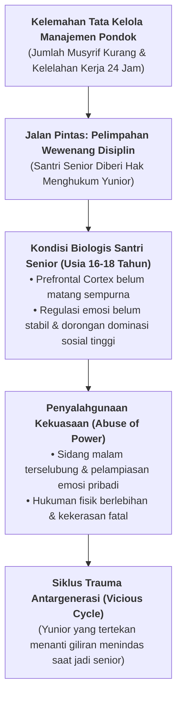

# SUB-BAB 4.2: ANATOMI SENIORITAS TOKSIK DI ASRAMA DAN TRADISI PELIMPAHAN HUKUMAN

---

## 1. Kegagalan Manajerial: Pelimpahan Wewenang Pengasuhan kepada Santri Senior

Di banyak pondok pesantren konvensional, salah satu sumber utama terjadinya kasus kekerasan fisik dan perundungan fatal berakar pada **kebijakan pelimpahan wewenang pendisiplinan (*delegation of disciplinary authority*) dari pihak pengasuh kepada organisasi santri senior**.

Karena keterbatasan jumlah musyrif atau kelelahan staf pengasuhan mengawasi ratusan santri selama 24 jam, pimpinan pondok sering kali mengambil jalan pintas dengan membentuk organisasi keamanan santri (*Qismul Amn*) yang diisi oleh santri kelas akhir (kelas 11 atau 12 MA). Kepada santri-santri senior ini diberikan mandat untuk:
* Melakukan patroli malam dan merazia kamar adik-adik kelas.
* Menjatuhkan sanksi fisik (seperti push-up, tamparan, pukulan sandal/rotan, atau mandi air es di tengah malam).
* Menggelar "sidang malam" (*mahkamah kamar*) bagi santri yunior yang dianggap melanggar aturan organisasi atau bersikap tidak sopan.

Kebijakan ini secara psikologis dan manajerial adalah sebuah **kesalahan fatal yang tidak bertanggung jawab**. 



---

## 2. Mengapa Remaja Tidak Boleh Diberi Wewenang Menghukum Teman Sebaya?

Secara neurosains perkembangan dan psikologi sosial (*Social Psychology of Power*), memberikan hak eksekusi hukuman kepada remaja usia 16–18 tahun hampir pasti berujung pada penyalahgunaan kekuasaan (*abuse of power*). Eksperimen psikologi terkenal seperti *Stanford Prison Experiment* oleh Philip Zimbardo membuktikan bahwa ketika individu muda ditempatkan dalam posisi kekuasaan tanpa pengawasan ketat, mereka dengan cepat mengadopsi perilaku sadistis terhadap rekannya yang berada dalam posisi subordinat. [^1]

Pada diri santri remaja:
1. **Regulasi Emosi Belum Matang**: Santri senior belum memiliki kematangan kognitif untuk memisahkan antara penegakan aturan yang objektif dengan pelampiasan emosi dendam pribadi.
2. **Kebutuhan Pengakuan Kelompok Sebaya (*Peer Status*)**: Menunjukkan kekejaman atau ketegasan fisik sering kali disalahartikan di kalangan geng santri senior sebagai bukti "kejantanan" dan "kewibawaan".
3. **Efek Deindividuasi**: Dalam forum sidang malam yang gelap dan tertutup, santri senior kehilangan rasa tanggung jawab pribadi (*diffusion of responsibility*), sehingga mereka berani melakukan kekerasan fisik kolektif yang tidak akan pernah mereka lakukan secara individual.

---

## 3. Bahaya Tersembunyi: Siklus Kekerasan Antargenerasi (*Intergenerational Trauma*)

Pelimpahan wewenang menghukum kepada senior menciptakan lingkaran setan yang melestarikan kekerasan dari tahun ke tahun:

> **Anatomi Siklus Trauma di Asrama**:
> 
> * **Tahun ke-1 (Sebagai Santri J1/Kelas 7)**: Santri baru mengalami perundungan, dibentak, dan dihukum push-up tengah malam oleh santri kelas 11. Santri merasa takut, terhina, dan memendam luka batin.
> * **Tahun ke-2 & ke-3 (Sebagai Santri J2-J3/Kelas 8–9)**: Santri mulai terbiasa dengan iklim kekerasan dan memandang kekerasan sebagai hal normal dalam kehidupan pondok (*normalization of violence*).
> * **Tahun ke-4 (Sebagai Santri J4/Kelas 11–12)**: Ketika memegang tampuk pengurus keamanan asrama, santri menagih "hak balas dendam historis": *"Dulu kami dihajar lebih parah oleh senior kami, sekarang giliran kalian yang harus merasakan tempaan ini!"*.

Pola pikir "balas dendam historis" ini terus berputar tanpa akhir selama pihak manajemen pesantren tidak memotong rantainya secara struktural.

---

## 4. Ketegasan Sistem TUMBUH: Pemutusan Rantai Pelimpahan Hukuman

Ekosistem TUMBUH mengeluarkan **Dekrit Perlindungan Keasramaan** yang menetapkan garis batas hukum yang tidak dapat ditawar:

```
                  KEBIJAKAN MUTLAK EKOSISTEM TUMBUH
                  
  [SANTRI TIDAK BOLEH MENGHUKUM SANTRI LAIN DALAM BENTUK APA PUN]
  
  • Sanksi Fisik: HARAM MUTLAK & PELANGGARAN TIER 3
  • Sidang Malam / Mahkamah Gelap: DIBUBARKAN & DILARANG KERAS
  • Tugas Santri Senior: MENTORING, KHIDMAH, & TELADAN ADAB
```

Pendisiplinan dan penanganan perilaku santri adalah **tanggung jawab mutlak pendidik dewasa (Wali Kelas, Musyrif, dan Tim BK)** yang telah dibekali kompetensi pedagogi *Firm & Kind* dan keadilan restoratif. Santri senior dibebaskan dari beban menjadi "polisi", dan dialihkan perannya menjadi **kakak pembimbing (*Peer-Mentors*)** yang melayani dan mengayomi adik-adik kelasnya.

---

### 📚 Catatan Kaki & Referensi Akademik:

[^1]: Zimbardo, P. (2007). *The Lucifer Effect: Understanding How Good People Turn Evil*. New York: Random House, hlm. 195–228.
[^2]: Olweus, D. (1993). *Bullying at School: What We Know and What We Can Do*. Oxford: Blackwell Publishers, hlm. 45–62.
[^3]: Salmivalli, C. (2010). Bullying and the peer group: A review. *Aggression and Violent Behavior*, 15(2), 112–120.
[^4]: Ibnu Qudamah Al-Maqdisi, Ahmad bin 'Abdirrahman. (1998). *Mukhtashar Minhaj al-Qashidin*. Ditahqiq oleh Zuhair asy-Syawisy. Beirut: Al-Maktab al-Islami, hlm. 165–172.
