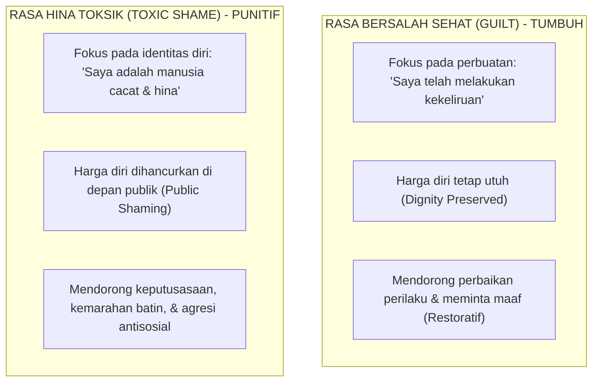

# SUB-BAB 4.3: PRINSIP *DIGNITY FIRST* DAN LARANGAN MUTLAK MEMPERMALUKAN SANTRI DI RUANG PUBLIK

---

## 1. Menutup Aib: Menjaga Kehormatan Sebagai Inti Tarbiyah

Dalam tradisi pengasuhan pesantren yang salah kaprah, praktik **mempermalukan santri di depan publik (*public shaming*)** sering kali dianggap sebagai metode yang efektif untuk memberikan "efek jera". Contoh-contoh perlakuan ini mencakup:
* Menggundul separuh kepala santri secara paksa agar tampak memalukan.
* Mengalungkan papan kardus bertuliskan daftar pelanggaran (misalnya: *"Saya Pencuri"* atau *"Saya Pemalas"*) lalu disuruh berdiri di depan gerbang atau serambi masjid.
* Membaca daftar nama-nama santri yang melanggar di depan seluruh santri saat apel pagi atau setelah sholat berjamaah.

Secara hukum syariat Islam dan ilmu psikologi emosi, praktik-praktik mempermalukan ini adalah **pelanggaran berat terhadap hak kehormatan seorang muslim (*Hifzh al-'Irdh*)** yang dijamin keluhurannya oleh Allah SWT.

Rasulullah SAW telah menegaskan haramnya menodai kehormatan sesama muslim dalam Khutbah Haji Wada' yang monumental:

> **إِنَّ دِمَاءَكُمْ وَأَمْوَالَكُمْ وَأَعْرَاضَكُمْ عَلَيْكُمْ حَرَامٌ، كَحُرْمَةِ يَوْمِكُمْ هَذَا، فِي شَهْرِكُمْ هَذَا، فِي بَلَدِكُمْ هَذَا**
> 
> *"Sesungguhnya darah kalian, harta benda kalian, dan kehormatan kalian adalah haram (suci dan terlindungi) atas sesama kalian, sebagaimana sucinya hari kalian ini, di bulan kalian ini, dan di negeri kalian ini."* (HR. Al-Bukhari no. 67 dan Muslim no. 1679) [^1]

Nabi SAW juga memberikan jaminan agung bagi siapa saja yang menutupi aib saudaranya:

> **مَنْ سَتَرَ مُسْلِمًا سَتَرَهُ اللَّهُ فِي الدُّنْيَا وَالْآخِرَةِ**
> 
> *"Barang siapa yang menutup aib seorang muslim, niscaya Allah akan menutup aibnya di dunia dan di akhirat."* (HR. Muslim no. 2699) [^2]

---

## 2. Psikologi *Public Shaming*: Mengapa Rasa Malu yang Dihancurkan Memicu Kepribadian Antisosial?

Para peneliti psikologi emosi membedakan secara tegas antara **Rasa Bersalah yang Sehat (*Guilt*)** dan **Rasa Hina/Malu yang Menghancurkan (*Toxic Shame*)**: [^3]

Ketika seorang santri dipermalukan di depan ratusan kawannya:
1. **Harga Dirinya Hancur Total**: Santri menyimpulkan bahwa dirinya tidak lagi memiliki kehormatan untuk dijaga.
2. **Hilangnya Rasa Takut Berbuat Dosa (*Shamelessness*)**: Pepatah Arab menyatakan: *Idzā lam tastahy fa'sna' mā syi'ta* (Jika rasa malu sudah hilang, seseorang akan berbuat sekehendak hatinya). Begitu santri sudah dicap sebagai "anak hina" di depan publik, mereka tidak lagi peduli pada aturan, bahkan menjadi semakin nekat dan bangga melanggar aturan (*defiant antisocial behavior*).
3. **Penyebaran Stigmatisasi Sosial**: Kawan-kawan sekamar akan menjauhi, mengejek, atau mengucilkan santri tersebut, sehingga santri terdorong mencari pelarian ke kelompok-kelompok geng pelanggar di luar asrama.

---

## 3. Keteladanan Nabawi: Memperbaiki Kesalahan Tanpa Mempermalukan Pelaku

Metode Rasulullah SAW dalam mengoreksi kekeliruan para sahabat adalah teladan tertinggi dalam penerapan prinsip *Dignity First*. Ketika melihat perilaku yang keliru di tengah masyarakat, Nabi SAW **tidak pernah menyebut nama pelaku di depan umum**, melainkan menggunakan kalimat bijak:

> **مَا بَالُ أَقْوَامٍ يَقُولُونَ كَذَا وَكَذَا؟**
> 
> *"Mengapa ada sebagian orang yang berkata atau berbuat demikian dan demikian?"* (HR. Al-Bukhari no. 5063) [^4]

Dengan metode ini:
* Pesan edukasi dan hukum syariat tersampaikan secara jelas kepada seluruh hadirin.
* Pelaku yang bersalah menyadari kesalahannya di dalam hati tanpa merasa dipermalukan di depan orang banyak.
* Pintu taubat dan perbaikan diri tetap terbuka lebar secara terhormat.

---

## 4. Protokol Pengoreksian Berbasis *Dignity First* di Ekosistem TUMBUH

Setiap musyrif, guru, dan tim disiplin pondok diwajibkan mematuhi **Protokol 4 Langkah Pengoreksian Terhormat**:

1. **Privat (Empat Mata)**: Pemanggilan santri yang melakukan pelanggaran dilakukan secara tenang ke ruang bimbingan konseling atau Bilik Sakinah yang tertutup, bukan diteriaki di lorong asrama atau di depan shaf masjid.
2. **Fokus pada Fakta Perilaku, Bukan Menghakimi Karakter**: Menjelaskan perbuatan apa yang melanggar kesepakatan dan apa dampak kerugiannya bagi orang lain, tanpa melabeli kepribadian anak.
3. **Mendengarkan Penjelasan Santri (*Active Hearing*)**: Memberikan hak berbicara bagi santri untuk menjelaskan apa latar belakang tindakannya tanpa langsung dipotong atau dibentak.
4. **Penyusunan Rencana Pemulihan 3R**: Mengajak santri merumuskan bagaimana cara mengganti kerugian (*Restitution*) dan memperbaiki hubungan (*Ishlah*) secara bermartabat.

Dengan menjaga marwah santri, pesantren membuktikan bahwa disiplin sejati ditegakkan di atas fondasi kasih sayang dan pemuliaan martabat kemanusiaan.

---

### 📚 Catatan Kaki & Referensi Akademik:

[^1]: Al-Bukhari, Muhammad bin Isma'il. (2002). *Shahih al-Bukhari*. Riyadh: Darussalam, Kitab *al-'Ilm*, Hadits no. 67; Muslim bin al-Hajjaj. (2006). *Shahih Muslim*, Kitab *al-Qasamah*, Hadits no. 1679.
[^2]: Muslim bin al-Hajjaj. (2006). *Shahih Muslim*. Riyadh: Dar Thayyibah, Kitab *adz-Dzikr wa ad-Du'a'*, Hadits no. 2699.
[^3]: Tangney, J. P., & Dearing, R. L. (2002). *Shame and Guilt*. New York: Guilford Press, hlm. 25–48.
[^4]: Al-Bukhari, Muhammad bin Isma'il. (2002). *Shahih al-Bukhari*. Riyadh: Darussalam, Kitab *an-Nikah*, Hadits no. 5063.
