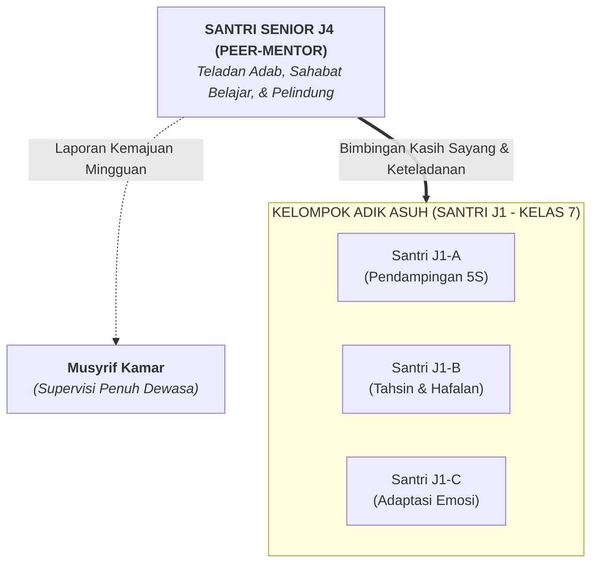

# SUB-BAB 4.4: GUGURNYA HAK SENIORITAS MENGHUKUM: MENGALIHKAN PERAN MENJADI *PEER-MENTORSHIP*

---

## 1. Dekrit Kelembagaan: Menghapus Total Hak Menghukum Antarsantri

Dalam rangka mewujudkan pesantren yang aman, bermartabat, dan bebas kekerasan (*Zero-Violence Safe Sanctuary*), Ekosistem TUMBUH menetapkan regulasi kelembagaan yang tegas: **Mencabut dan menggugurkan seluruh hak serta wewenang santri senior untuk menghukum, merazia, atau menjatuhkan sanksi kepada santri lain dalam bentuk apa pun**.

```
             TRANSFORMASI STATUS SANTRI SENIOR (JENJANG J4)
             
 [PARADIGMA LAMA: PENGUASA / POLISI] ──► [PARADIGMA TUMBUH: PEER-MENTOR]
 • Merazia & membentak adik kelas        • Menemani adaptasi & homesickness
 • Menjatuhkan push-up / pukulan         • Membimbing belajar kitab & tahsin
 • Menuntut pelayanan & kepatuhan        • Melayani & menjadi teladan adab 5S
```

Kebijakan ini bukan berarti melemahkan peran santri senior atau menghilangkan latihan kepemimpinan. Sebaliknya, kebijakan ini **memurnikan hakikat kepemimpinan Islam**: dari kepemimpinan intimidatif yang bertumpu pada rasa takut, menjadi kepemimpinan inspiratif yang bertumpu pada keteladanan dan bimbingan kasih sayang.

---

## 2. Arsitektur Program *Peer-Mentorship* Jenjang J4 (Kelas 11–12)

Santri senior jenjang J4 (kelas 11 dan 12 MA) yang telah meniti tangga kemandirian dipersiapkan melalui pelatihan khusus untuk menjadi **Kakak Pendamping Sebaya (*Peer-Mentors / Murabbi Sebaya*)**. 

Setiap 1 orang santri senior J4 ditugaskan mendampingi 3 hingga 4 orang santri baru jenjang J1 (kelas 7 MTs) dalam satu kelompok perwalian kamar yang terstruktur:



### Ranah Pendampingan Peer-Mentor J4:
1. **Pendampingan Adaptasi Kehidupan Asrama (Bulan ke-1 s/d ke-3)**:
   * Mengajari santri J1 cara mencuci pakaian mandiri tanpa merusak kain.
   * Mencontohkan standar merapikan kasur dengan sprei kencang (*hospital corner*) dan menata lemari standar 5S.
   * Menjadi kawan bercerita tatkala adik asuh merasa sedih atau rindu keluarga (*homesick*).
2. **Pendampingan Belajar Akademik & Turats (Mudzakarah Malam)**:
   * Menemani mengulang hafalan Al-Qur'an (*tasmi'* dan *muraja'ah*).
   * Membantu menjelaskan materi nahwu-sharaf dasar atau pelajaran umum yang belum dipahami adik kelas.
3. **Penyambung Lidah Edukatif ke Musyrif (*Advocacy & Support*)**:
   * Jika adik asuhnya sakit atau mengalami kesulitan, mentor J4 segera melaporkan kepada musyrif jaga agar mendapat penanganan medis dan nutrisi yang layak.

---

## 3. Matriks Perbedaan Peran Santri Senior: Model Feodal vs Model TUMBUH

| Parameter Perilaku | Senioritas Feodal (Model Usang) | Peer-Mentorship TUMBUH (Model Nabawi) |
| :--- | :--- | :--- |
| **Fokus Interaksi** | Mencari kesalahan adik kelas dan menjatuhkan sanksi. | Mengamati kesulitan adik kelas dan menawarkan bantuan. |
| **Sikap dalam Keseharian** | Duduk santai menyuruh adik kelas mencuci baju atau mengambilkan makanan. | Terdepan membersihkan kamar, mencuci piring sendiri, dan melayani kebutuhan bersama. |
| **Penyelesaian Masalah** | Menggelar sidang malam tertutup dan membentak. | Mengajak duduk santai, mendengarkan curahan hati, dan memberikan nasihat penuh kasih. |
| **Dampak bagi Adik Kelas** | Trauma batin, takut berpapasan, dan berniat membalas saat jadi senior. | Rasa hormat tulus, termotivasi meniru kebaikan, dan merasa aman di asrama. |

---

## 4. Evaluasi & Sertifikasi Kepemimpinan Khidmah Santri J4

Program *Peer-Mentorship* ini menjadi bagian dari **Asesmen Portofolio Kelulusan Santri J4**. Kematangan seorang santri senior tidak dinilai dari seberapa ditakuti dirinya oleh adik kelas, melainkan dinilai dari:
* *Seberapa cepat adik-adik asuhnya mampu mandiri menata kamar 5S.*
* *Seberapa stabil kondisi emosi dan kelancaran belajar adik asuhnya.*
* *Tingkat kepuasan dan rasa terima kasih yang diberikan adik asuh dalam lembar evaluasi apresiasi.*

Dengan arsitektur ini, tradisi perpeloncoan lenyap dengan sendirinya, berganti menjadi ekosistem persaudaraan Islam (*Ukhuwah Islamiyyah*) yang saling menguatkan dari generasi ke generasi.

---

### 📚 Catatan Kaki & Referensi Akademik:

[^1]: Topping, K. J. (2005). Trends in peer learning. *Educational Psychology*, 25(6), 631–645.
[^2]: Karcher, M. J. (2005). The effects of developmental mentoring and high school mentors' attendance on elementary students' self-esteem, social skills, and connectedness. *Psychology in the Schools*, 42(1), 65–77.
[^3]: Al-Mawardi, Abu al-Hasan 'Ali bin Muhammad. (1987). *Adab ad-Dunya wa ad-Din*. Beirut: Dar al-Kutub al-'Ilmiyyah, hlm. 178–185.
[^4]: Johnson, D. W., & Johnson, R. T. (2009). An educational psychology success story: Social interdependence theory and cooperative learning. *Educational Researcher*, 38(5), 365–379.
