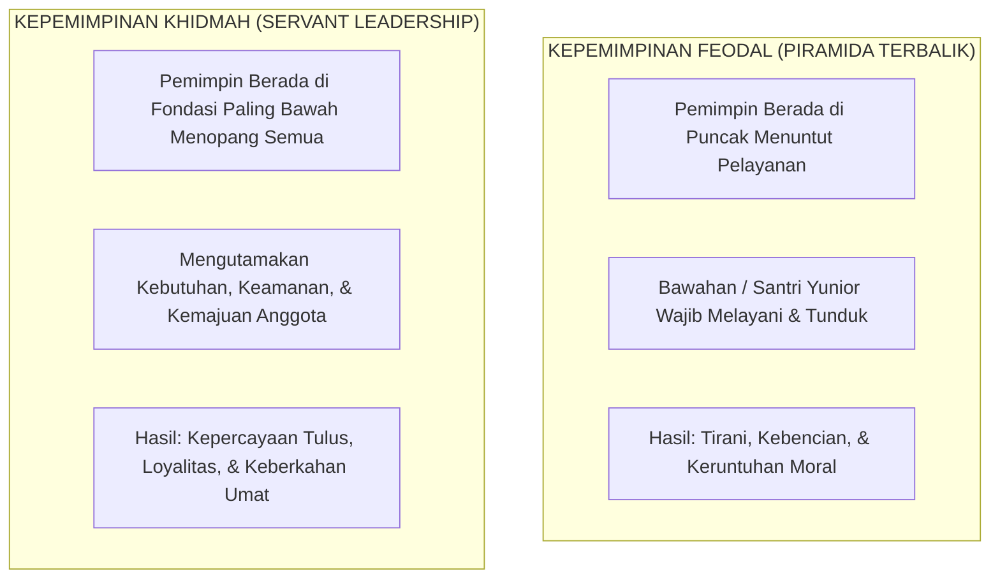

# SUB-BAB 4.5: TRANSFORMASI MENUJU KEPEMIMPINAN PELAYAN (*SERVANT LEADERSHIP / KHADIMUL UMMAH*)

---

## 1. Menghidupkan Kembali Doktrin "Sayyidul Qaumi Khādimuhum"

Dalam worldview Islam, kekuasaan dan kepemimpinan (*imārah* atau *ri'āsah*) bukanlah instrumen untuk menuntut keistimewaan, mencari penghormatan buta, atau menindas orang lain. Kepemimpinan adalah sebuah amanah berat (*taklīf*) yang esensinya adalah **pelayanan sukarela kepada yang dipimpin (*khidmah*)**.

Rasulullah SAW telah memancangkan kaidah agung tentang hakikat pemimpin sejati:

> **سَيِّدُ الْقَوْمِ خَادِمُهُمْ فِي السَّفَرِ، فَمَنْ سَبَقَهُمْ بِخِدْمَةٍ لَمْ يَسْبِقُوهُ بِعَمَلٍ إِلَّا الشَّهَادَةَ**
> 
> *"Pemimpin suatu kaum adalah pelayan bagi mereka di dalam perjalanan; maka barang siapa yang mendahului mereka dalam hal pelayanan, niscaya mereka tidak akan mampu mengunggulinya dengan suatu amalan pun kecuali mati syahid."* (HR. Al-Baihaqi dalam *Syu'ab al-Iman*, no. 8632 dan Ibnu Majah) [^1]

Di era kekhalifahan Islam, Sayyidina Umar bin Al-Khattab RA membuktikan doktrin ini ketika beliau memanggul sendiri karung gandum di tengah malam untuk diserahkan kepada seorang ibu miskin yang anak-anaknya kelaparan, seraya menolak bantuan pelayannya dengan ucapan yang bergetar: *"Apakah engkau akan memikul dosa-dosaku kelak di hadapan Allah pada hari kiamat?"*.

Prinsip inilah yang diadopsi oleh Robert K. Greenleaf (1970) dalam teori modern **Servant Leadership (Kepemimpinan Pelayan)**: seorang pemimpin sejati bermula dari dorongan alami dalam jiwanya untuk melayani terlebih dahulu (*serve first*), baru kemudian memimpin (*lead*). [^2]

---

## 2. Manifestasi *Servant Leadership* dalam Organisasi Santri

Ekosistem TUMBUH merombak struktur dan budaya Organisasi Santri (OSIS / Pengurus Asrama) agar sepenuhnya berakar pada paradigma *Khadimul Ummah*:

### 1. Seleksi Berbasis Karakter Khidmah, Bukan Retorika
Kandidat ketua dan pengurus santri tidak dipilih semata-mata karena kepandaian berorasi di panggung kampanye, melainkan dinilai dari rekam jejak nyata mereka dalam melayani:
* *Apakah ia rajin membantu menyapu masjid saat tidak ada orang yang melihat?*
* *Bagaimana kerelaannya membantu kawan sekamar yang sedang sakit?*
* *Apakah ia mampu mengendalikan emosi saat dikritik secara terbuka?*

### 2. Praktik Keteladanan dalam Tugas Harian Asrama
Pengurus santri yang menganut *Servant Leadership* wajib menunjukkan standar tertinggi dalam adab:
* Menjadi orang pertama yang tiba di masjid sebelum azan Subuh berkumandang untuk memastikan karpet terbentang rapi dan mik berfungsi baik.
* Menjadi barisan pertama yang ikut mengantre makanan di ruang makan asrama secara tertib bersama santri-santri baru, tanpa meminta perlakuan istimewa (*no special privilege*).
* Menjadi pihak yang paling gigih merawat sarana inventaris pondok dari kerusakan.

---

## 3. Karakteristik Inti Pemimpin Berkarakter Khidmah di Pesantren

| Dimensi Karakter | Manifestasi Konkret Pengurus Santri TUMBUH |
| :--- | :--- |
| **1. Mendengarkan dengan Empati (*Listening*)** | Menyediakan waktu mendengarkan aspirasi dan keluh kesah santri yunior tanpa memotong atau menghakimi. |
| **2. Pemulihan & Penyadaran (*Healing*)** | Mampu mendamaikan santri yang bertengkar melalui pendekatan dialog damai tanpa mempermalukan pihak mana pun. |
| **3. Kesadaran Diri (*Self-Awareness*)** | Mengenali kelemahan diri, cepat meminta maaf jika berbuat salah, dan terbuka menerima masukan dari siapa pun. |
| **4. Pengelolaan Amanah (*Stewardship*)** | Mengelola aset pondok dan dana kegiatan santri secara transparan dan bertanggung jawab di hadapan Allah dan asatidz. |
| **5. Komitmen Menumbuhkan Sesama (*Commitment to Growth*)** | Merasa bangga dan bahagia ketika melihat adik-adik asuhnya berkembang menjadi pribadi yang lebih pintar dan beradab daripadanya. |

Dengan menanamkan *Servant Leadership*, pesantren melahirkan kader-kader pemimpin bangsa yang tidak silau oleh kekuasaan dan tidak haus jabatan, melainkan pemimpin yang senantiasa menundukkan diri untuk melayani rakyat dan menegakkan keadilan Ilahi di muka bumi.

---

### 📚 Catatan Kaki & Referensi Akademik:

[^1]: Al-Baihaqi, Abu Bakr Ahmad bin al-Husain. (2003). *Syu'ab al-Iman*. Ditahqiq oleh Dr. 'Abdul 'Ali 'Abdul Hamid Hamid. Riyadh: Maktabah ar-Rusyd, Jilid XI, Hadits no. 8632.
[^2]: Greenleaf, R. K. (1977). *Servant Leadership: A Journey into the Nature of Legitimate Power and Greatness*. New York: Paulist Press, hlm. 1–28.
[^3]: Spears, L. C. (2010). Character and servant leadership: Ten characteristics of effective, caring leaders. *The Journal of Virtues & Leadership*, 1(1), 25–30.
[^4]: Ibnu Taimiyyah, Ahmad bin 'Abdil Halim. (1995). *As-Siyasah asy-Syar'iyyah fi Ishlah ar-Ra'i wa ar-Ra'iyyah*. Beirut: Dar al-Kutub al-'Ilmiyyah, hlm. 12–25.
