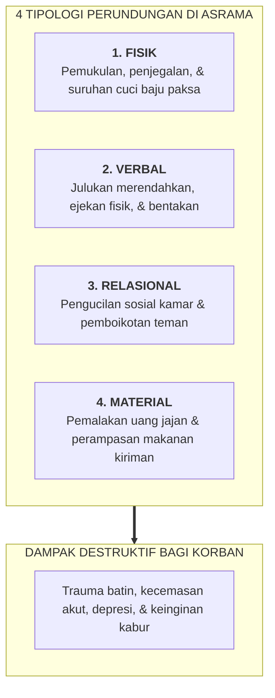
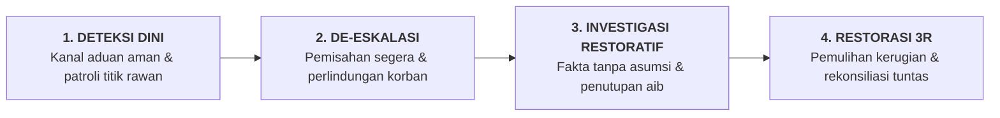

# SUB-BAB 4.6: PROTOKOL MITIGASI BULLYING DAN PEMBUDAYAAN PERLINDUNGAN SEBAYA

---

## 1. Tipologi Perundungan di Lingkungan Asrama Pesantren

Perundungan (*bullying*) di lingkungan pesantren sering kali luput dari pemantauan pengasuh karena terjadi di area-area tertutup atau dibungkus dalam kedok "bercanda antarteman" (*guyonan*) atau "pembinaan mental santri". 

Secara ilmiah dan operasional, perundungan di asrama terbagi ke dalam empat tipologi:
1. **Perundungan Fisik (*Physical Bullying*)**: Pemukulan, penjegalan, pemaksaan kerja fisik berat (seperti disuruh mencuci tumpukan baju senior), atau penguncian di kamar mandi.
2. **Perundungan Verbal (*Verbal Bullying*)**: Ejekan fisik, pemanggilan dengan nama-nama julukan yang merendahkan, makian kasar, atau ancaman sanksi sosial.
3. **Perundungan Relasional / Pengucilan (*Relational & Social Exclusion*)**: Mengintimidasi anggota kamar agar tidak mau berbicara dengan santri tertentu, menyebarkan gosip palsu, atau membuat santri tersebut terisolasi sendirian (*social ostracism*).
4. **Perundungan Material / Pemalakan (*Material Bullying*)**: Pengambilan paksa uang jajan, perampasan makanan kiriman orang tua, atau perusakan barang pribadi santri secara sengaja.



---

## 2. Mengubah Penonton Pasif (*Bystanders*) Menjadi Pelindung Aktif (*Upstanders*)

Dalam riset sosiologi perundungan (Dan Olweus dan Christina Salmivalli), mayoritas kasus perundungan bertahan bukan semata-mata karena kekuatan sang pelaku (*bully*), melainkan karena **sikap diam dan pasif dari mayoritas santri lain yang menyaksikannya (*Passive Bystanders*)**. [^1]

Santri yang melihat perundungan sering kali takut melapor karena khawatir akan menjadi target berikutnya atau dicap sebagai "pengkhianat" (*tukang cepu/wadul*).

```
              TRANSFORMASI KULTUR PERLINDUNGAN SEBAYA
              
 [BYSTANDER CULTURE (PASIF)]   ────────► [UPSTANDER CULTURE (AKTIF)]
 • Menonton & menertawakan                • Berani menegur secara santun
 • Diam karena takut diserang             • Melindungi korban dari agresi
 • Membiarkan kezaliman merajalela        • Melaporkan ke musyrif secara aman
```

Ekosistem TUMBUH memulihkan keberanian moral ini dengan menghidupkan perintah Rasulullah SAW:

> **انْصُرْ أَخَاكَ ظَالِمًا أَوْ مَظْلُومًا، فَقَالَ رَجُلٌ: يَا رَسُولَ اللَّهِ، أَنْصُرُهُ إِذَا كَانَ مَظْلُومًا، أَفَرَأَيْتَ إِذَا كَانَ ظَالِمًا كَيْفَ أَنْصُرُهُ؟ قَالَ: تَحْجُزُهُ أَوْ تَمْنَعُهُ مِنَ الظُّلْمِ فَإِنَّ ذَلِكَ نَصْرُهُ**
> 
> *"Tolonglah saudaramu yang berbuat zalim dan yang dizalimi." Seorang sahabat bertanya: "Wahai Rasulullah, aku menolongnya jika ia dizalimi, tetapi bagaimana pendapatmu jika ia adalah orang yang berbuat zalim, bagaimana cara aku menolongnya?" Rasulullah SAW menjawab: "Engkau cegah atau engkau halangi dia dari perbuatan zalimnya, maka sesungguhnya itulah cara menolongnya."* (HR. Al-Bukhari no. 2444) [^2]

Dalam Islam, menghentikan kawan yang melakukan perundungan adalah bentuk pertolongan sejati kepada sang pelaku agar ia tidak memikul azab dosa kezaliman di akhirat.

---

## 3. Protokol 4 Langkah Intervensi Terpadu Anti-Bullying TUMBUH

Lembaga pesantren TUMBUH menerapkan protokol penanganan perundungan yang terstruktur dan terpadu:



### 1. Deteksi Dini & Kanal Pengaduan Aman (*Safe Whistleblowing*)
* Disediakan **Kotak Suara Hati Santri** yang terkunci rapat di beberapa titik strategis, serta saluran pelaporan langsung ke nomor konselor BK pondok.
* Identitas santri pelapor dijamin kerahasiaannya secara mutlak (*whistleblower protection*).

### 2. De-Eskalasi Cepat & Perlindungan Korban
* Begitu ada indikasi perundungan, musyrif atau guru BK segera memisahkan pelaku dan korban ke ruangan berbeda.
* Korban mendapatkan pendampingan psikologis awal untuk memulihkan rasa aman dan trauma fisik/emosi.

### 3. Investigasi Objektif & Penutupan Aib
* Pengasuh mengumpulkan fakta kejadian secara objektif tanpa melibatkan emosi amarah.
* Pemeriksaan dilakukan secara tertutup tanpa mempermalukan pelaku di depan umum (*Dignity First*).

### 4. Proses Restoratif 3R (*Restitution, Resolution, Reconciliation*)
* **Restitution**: Pelaku bertanggung jawab mengganti barang/uang yang dirampas atau meminta maaf atas kata-kata kasar.
* **Resolution**: Pelaku dibimbing merumuskan rencana perubahan perilaku dan mengikuti sesi bimbingan khusus Tier 2/3.
* **Reconciliation**: Proses mediasi damai (*Ishlah al-Bain*) yang memastikan tidak ada dendam lanjutan dan menjamin korban merasa aman sepenuhnya di kamar asrama.

Dengan penegakan protokol ini, asrama pesantren bertransformasi menjadi **benteng yang suci dan aman (*Safe Sanctuary*)**, di mana setiap santri dapat tidur nyenyak, belajar dengan gembira, dan bertumbuh dalam naungan ukhuwah Islamiyyah yang tulus.

---

### 📚 Catatan Kaki & Referensi Akademik:

[^1]: Salmivalli, C., Voeten, M., & Poskiparta, E. (2011). Bystanders matter: Associations between reinforcing, defending, and the frequency of bullying behavior in classrooms. *Journal of Clinical Child & Adolescent Psychology*, 40(5), 668–676.
[^2]: Al-Bukhari, Muhammad bin Isma'il. (2002). *Shahih al-Bukhari*. Riyadh: Darussalam, Kitab *al-Mazhalim wa al-Ghasb*, Hadits no. 2444.
[^3]: Rigby, K. (2002). *New Perspectives on Bullying*. London: Jessica Kingsley Publishers, hlm. 82–104.
[^4]: Espelage, D. L., & Swearer, S. M. (Eds.). (2004). *Bullying in American Schools: A Social-Ecological Perspective on Prevention and Intervention*. Mahwah, NJ: Lawrence Erlbaum Associates, hlm. 15–35.
